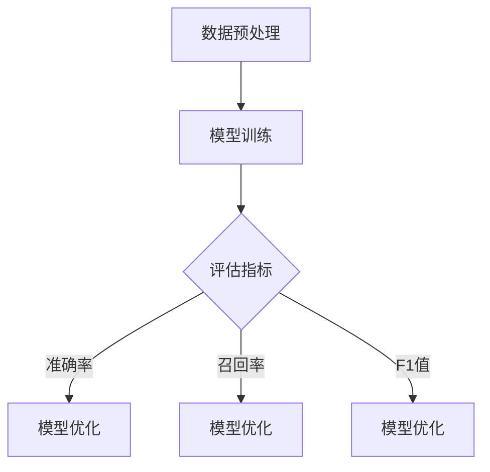
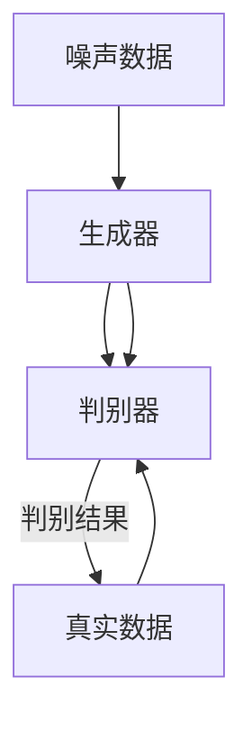

                 

## 第一部分：理论基础

### 第1章：推荐系统概述

推荐系统是信息检索和人工智能领域中的一个重要课题。随着互联网的普及和大数据技术的发展，推荐系统已经深入到我们日常生活的各个方面，如电子商务、社交媒体、新闻推送等。其核心目标是通过分析用户的历史行为和偏好，向用户提供个性化的推荐结果，从而提高用户体验和满意度。

#### 1.1 推荐系统的定义与目标

推荐系统（Recommender System）是一种基于数据挖掘和机器学习技术的信息过滤方法，旨在发现并提供建议给用户。其定义可以分为以下几个方面：

- **目标用户**：推荐系统的主要目标是满足用户的需求，帮助用户发现他们可能感兴趣的项目或内容。
- **推荐项目**：推荐系统针对的对象，可以是商品、文章、音乐、视频等。
- **信息源**：推荐系统从哪里获取信息，通常包括用户的历史行为数据、内容特征数据、社会关系数据等。

推荐系统的目标主要有：

- **提高用户满意度**：通过个性化的推荐，使用户在信息海洋中快速找到自己感兴趣的内容。
- **提升商业价值**：为电商、广告等行业带来更多的用户流量和销售机会。
- **降低信息过载**：在信息爆炸的时代，推荐系统可以帮助用户过滤掉不相关的信息，提高工作效率。

#### 1.2 推荐系统的发展历程

推荐系统的发展历程可以分为以下几个阶段：

- **基于内容的推荐**：早期推荐系统主要基于内容的相似性进行推荐，如根据用户过去喜欢的商品来推荐类似的商品。这种方法简单直观，但容易受到数据稀疏性和特征重叠的影响。
  
- **协同过滤推荐**：为了解决数据稀疏问题，协同过滤（Collaborative Filtering）推荐方法应运而生。协同过滤分为基于用户的协同过滤和基于项目的协同过滤。前者通过分析用户之间的相似性进行推荐，后者则通过分析项目之间的相似性进行推荐。

- **混合推荐系统**：为了进一步提升推荐效果，现代推荐系统通常采用多种推荐算法的混合策略。例如，结合基于内容的推荐和协同过滤推荐，或者引入深度学习等先进技术。

- **深度学习推荐**：近年来，深度学习技术在推荐系统中的应用越来越广泛。通过使用深度神经网络，推荐系统可以更好地捕捉用户行为和项目特征的复杂关系，从而实现更精准的推荐。

#### 1.3 推荐系统的主要类型

根据推荐系统的工作原理和目标，可以将其分为以下几种类型：

- **基于内容的推荐**：根据用户过去的兴趣和偏好，提取项目的特征，然后基于这些特征进行推荐。

- **协同过滤推荐**：通过分析用户之间的相似性和项目之间的相似性进行推荐。协同过滤又可以细分为基于用户的协同过滤和基于项目的协同过滤。

- **基于模型的推荐**：使用机器学习模型，如回归、决策树、神经网络等，来预测用户对项目的偏好。

- **混合推荐系统**：结合多种推荐算法的优点，以提高推荐效果和准确性。

- **基于知识的推荐**：利用专家知识库和逻辑推理，为用户提供推荐。

通过上述对推荐系统基础理论的介绍，我们为后续章节的深入探讨奠定了理论基础。在接下来的章节中，我们将进一步探讨大模型和对抗学习在推荐系统中的应用，以展示这些先进技术在提升推荐系统性能方面的潜力。

## 第2章：大模型基本原理

### 2.1 大模型概述

大模型（Large-scale Model），顾名思义，是指规模巨大、参数量庞大的机器学习模型。近年来，随着计算能力和数据存储技术的迅猛发展，大模型在各个领域得到了广泛应用，尤其在自然语言处理、计算机视觉和推荐系统等领域取得了显著的成果。大模型的基本特点如下：

#### 2.1.1 大模型的定义与特点

- **定义**：大模型通常指的是那些拥有数十亿到数千亿参数的神经网络模型。这些模型通过大量的数据进行训练，能够捕捉到数据中的复杂模式和潜在关系。
- **特点**：
  - **参数量巨大**：大模型拥有数以亿计的参数，这使它们能够表示复杂的函数关系。
  - **数据需求高**：训练大模型需要大量的高质量数据，通常来自于多个不同的来源。
  - **计算资源需求大**：由于参数量和数据量的庞大，大模型对计算资源和存储资源有很高的要求。
  - **训练时间长**：大模型的训练过程需要较长的时间，通常需要分布式计算和优化技术来加速训练。

#### 2.1.2 大模型在推荐系统中的应用价值

大模型在推荐系统中的应用具有显著的优势，主要体现在以下几个方面：

- **捕捉复杂用户行为**：大模型能够通过深度神经网络结构，捕捉用户行为的复杂模式，从而提供更精准的推荐。
- **增强模型泛化能力**：由于参数量的庞大，大模型具有更好的泛化能力，能够在新的数据集上保持较高的推荐效果。
- **应对数据稀疏问题**：大模型通过使用更多的参数，可以更好地缓解数据稀疏问题，提高协同过滤推荐的效果。
- **处理多模态数据**：大模型能够处理包括文本、图像、音频等多模态数据，从而实现更全面和个性化的推荐。

### 2.2 大模型架构

大模型通常采用深度神经网络（Deep Neural Network, DNN）作为基础架构，通过层次化的结构来学习数据的复杂特征。以下是几种常见的大模型架构：

#### 2.2.1 大模型的常见架构

- **卷积神经网络（Convolutional Neural Network, CNN）**：CNN适用于处理图像等二维数据，通过卷积层、池化层和全连接层等结构，能够提取图像的局部特征和全局特征。

- **循环神经网络（Recurrent Neural Network, RNN）**：RNN适用于处理序列数据，如文本和音频。RNN通过循环结构，能够捕捉序列中的时间依赖关系。

- **长短时记忆网络（Long Short-Term Memory, LSTM）**：LSTM是RNN的一种改进，能够更好地处理长序列数据，避免了传统RNN中梯度消失和梯度爆炸的问题。

- **变换器网络（Transformer）**：Transformer是一种基于自注意力机制的深度神经网络，在自然语言处理领域取得了显著的成果。它通过多头注意力机制和位置编码，能够高效地处理长序列数据。

#### 2.2.2 大模型的层次结构与功能

大模型通常由以下几个层次组成，每个层次都有其特定的功能：

- **输入层**：接收外部输入数据，如用户行为、项目特征等。
- **隐藏层**：通过多层神经网络结构，提取输入数据的特征表示。每层隐藏层都可以看作是对输入数据的特征进行变换和组合。
- **输出层**：根据隐藏层的特征表示，生成最终的输出结果，如推荐结果或分类结果。

在具体应用中，大模型的层次结构和功能可以根据不同的任务和数据特点进行调整。例如，在推荐系统中，可以结合用户行为数据和项目特征数据，设计多输入层和多层隐藏层的模型结构，以更好地捕捉用户和项目的复杂关系。

### 2.3 大模型训练技术

大模型的训练是一个复杂且计算密集的过程，涉及多种算法和技术。以下是几种常见的大模型训练技术：

#### 2.3.1 大模型训练的基本流程

- **数据预处理**：在训练大模型之前，需要对输入数据进行预处理，包括数据清洗、归一化、缺失值处理等。
- **模型初始化**：初始化模型的参数，通常使用随机初始化或预训练模型。
- **前向传播**：将输入数据通过模型的前向传播过程，计算得到输出结果。
- **损失函数计算**：根据输出结果和真实标签，计算损失函数的值。
- **反向传播**：利用反向传播算法，计算梯度并更新模型参数。
- **迭代优化**：重复前向传播、损失函数计算和反向传播的过程，逐步优化模型参数。

#### 2.3.2 大模型训练算法详解

- **随机梯度下降（Stochastic Gradient Descent, SGD）**：SGD是一种简单且常用的优化算法，通过随机选择小批量数据来计算梯度，并更新模型参数。SGD适用于小数据集，但在大模型训练中，计算效率较低。

- **批量梯度下降（Batch Gradient Descent, BGD）**：BGD通过使用整个训练集来计算梯度，并更新模型参数。BGD的计算准确度较高，但训练时间较长，不适用于大模型训练。

- **自适应优化器（Adaptive Optimizer）**：自适应优化器如Adam、RMSProp等，通过自适应调整学习率，提高了大模型训练的效率。这些优化器适用于大规模数据集，能够在较短的时间内收敛到较好的模型参数。

- **分布式训练**：在分布式训练中，将训练数据分布在多个计算节点上，并行计算梯度并更新模型参数。常用的分布式训练框架有TensorFlow、PyTorch等，通过使用多GPU或分布式计算集群，可以显著提高大模型训练的效率。

通过上述对大模型基本原理的介绍，我们为理解大模型在推荐系统中的应用奠定了基础。在接下来的章节中，我们将进一步探讨对抗学习在大模型训练中的应用，以及如何通过对抗学习提升推荐系统的性能。

### 第3章：对抗学习基础

对抗学习（Adversarial Learning），作为深度学习中的一个重要分支，近年来在多个领域展现出了强大的潜力。对抗学习通过引入对抗性样本，训练模型对潜在的对抗攻击具有更强的鲁棒性。本章将介绍对抗学习的基本概念、原理和常用算法，帮助读者深入理解这一技术。

#### 3.1 对抗学习概述

对抗学习的基本思想是通过训练一个生成器（Generator）和一个判别器（Discriminator）之间的对抗性竞争，提升模型在复杂环境中的性能。生成器试图生成与真实数据难以区分的对抗性样本，而判别器则努力将真实数据和对抗性样本区分开来。这一过程不断迭代，使得生成器和判别器都在不断提升性能。

#### 3.1.1 对抗学习的定义与目标

- **定义**：对抗学习是一种基于生成模型和判别模型相互对抗的训练方法。生成模型（通常称为生成器）生成模拟的真实数据相似的对抗性样本，而判别模型（通常称为判别器）负责判断输入数据是真实数据还是生成数据。
- **目标**：
  - **提升生成器性能**：生成器通过不断优化生成更加逼真的对抗性样本。
  - **增强判别器鲁棒性**：判别器通过训练能够更准确地识别真实数据和对抗性样本。
  - **提高模型整体性能**：对抗学习使得模型能够更好地适应复杂和对抗性的环境，提升在真实世界中的应用效果。

#### 3.1.2 对抗学习的基本原理

对抗学习的基本原理可以概括为以下步骤：

1. **生成对抗**：生成器和判别器通过一个共同的目标函数进行训练。通常，目标函数是判别器的损失函数和生成器的损失函数的组合。
2. **梯度更新**：在训练过程中，生成器和判别器的参数分别通过梯度下降算法进行更新。
3. **对抗性样本生成**：生成器通过随机噪声生成对抗性样本，并试图让判别器无法区分这些样本与真实数据。
4. **判别能力提升**：判别器通过不断学习，提升识别对抗性样本的能力，同时增强对真实数据的辨别力。

#### 3.2 对抗学习算法

对抗学习算法主要包括生成对抗网络（GAN）、自对抗网络（Self-对抗）等。以下是这些算法的基本原理和结构。

##### 3.2.1 对抗生成网络（Generative Adversarial Network, GAN）

**定义**：GAN由生成器和判别器两个相互对抗的神经网络组成，通过最小化生成器与判别器之间的差异来实现模型的优化。

**结构**：

- **生成器**：生成器 \( G \) 接收随机噪声 \( z \)，生成与真实数据相似的数据 \( x' \)。其目标是让 \( x' \) 最大化地被判别器误判为真实数据。
- **判别器**：判别器 \( D \) 接收真实数据 \( x \) 和生成数据 \( x' \)，其目标是最大化区分 \( x \) 和 \( x' \)。

**训练过程**：

1. 初始化生成器 \( G \) 和判别器 \( D \) 的参数。
2. 生成器 \( G \) 生成一批对抗性样本 \( x' \)。
3. 判别器 \( D \) 对真实数据 \( x \) 和对抗性样本 \( x' \) 进行判别。
4. 根据判别器的输出，更新生成器 \( G \) 的参数。
5. 再次生成对抗性样本，重复上述过程。

**优化方法**：

- **梯度惩罚**：在生成器和判别器的损失函数中加入对抗性梯度，以增强生成器的生成能力。
- **判别器训练**：采用多次迭代判别器训练的方法，逐步提升判别器的区分能力。

##### 3.2.2 自对抗网络（Self-对抗）

**定义**：自对抗网络（Self-Supervised Learning）是一种不需要真实标签的训练方法，通过对抗性样本来训练模型。

**结构**：

- **生成器**：生成器 \( G \) 接收随机噪声 \( z \)，生成对抗性样本。
- **判别器**：判别器 \( D \) 接收真实数据和对抗性样本，判断其真实性。

**训练过程**：

1. 初始化生成器 \( G \) 和判别器 \( D \) 的参数。
2. 生成器 \( G \) 生成一批对抗性样本。
3. 判别器 \( D \) 对真实数据和对抗性样本进行判别。
4. 根据判别器的输出，更新生成器 \( G \) 的参数。
5. 再次生成对抗性样本，重复上述过程。

**优化方法**：

- **伪标签**：在生成对抗性样本后，使用判别器的输出作为伪标签，用于进一步训练生成器和判别器。
- **持续训练**：自对抗网络通常采用持续训练（Continuous Training）策略，在生成器和判别器之间不断迭代，逐步优化模型。

通过上述对对抗学习基本原理和算法的介绍，我们为理解其在推荐系统中的应用打下了基础。在下一章节中，我们将进一步探讨大模型对抗学习在推荐系统中的应用场景和具体实现。

### 3.2.1 对抗生成网络（GAN）

生成对抗网络（Generative Adversarial Network，GAN）是Yann LeCun、Ian Goodfellow等人在2014年提出的一种新型生成模型，其核心思想是通过一个生成器（Generator）和一个判别器（Discriminator）之间的对抗性训练，生成逼真的数据。GAN已经在图像生成、图像修复、图像超分辨率等多个领域取得了显著的成果。

#### 3.2.1.1 GAN的结构与原理

GAN的基本结构由两个神经网络组成：生成器和判别器。

- **生成器（Generator）**：生成器的任务是生成与真实数据相似的伪数据。生成器通常接收一个随机噪声向量 \( z \) 作为输入，通过一系列的变换生成伪数据 \( x' \)。

  \[
  G(z) \rightarrow x'
  \]

- **判别器（Discriminator）**：判别器的任务是区分输入数据是真实数据还是生成数据。判别器接收真实数据 \( x \) 和生成数据 \( x' \) 作为输入，输出一个概率值 \( D(x) \) 表示输入数据的真实性。

  \[
  D(x) \rightarrow \text{概率值}
  \]

GAN的训练过程是一个零和游戏，生成器和判别器相互对抗，目标是最大化判别器的能力，同时最小化生成器的欺骗能力。

- **生成器目标**：生成器的目标是最小化判别器判断生成数据的概率，即

  \[
  \min_G \mathbb{E}_{z \sim p_z(z)}[\log(D(G(z))]
  \]

- **判别器目标**：判别器的目标是最大化判断真实数据和生成数据的概率差，即

  \[
  \max_D \mathbb{E}_{x \sim p_{data}(x)}[\log(D(x))] + \mathbb{E}_{z \sim p_z(z)}[\log(1 - D(G(z))]
  \]

GAN的训练过程通常如下：

1. **初始化**：初始化生成器和判别器的参数。
2. **生成对抗性样本**：生成器根据随机噪声 \( z \) 生成伪数据 \( x' \)。
3. **判别器训练**：判别器接收真实数据 \( x \) 和生成数据 \( x' \)，计算损失函数并更新判别器参数。
4. **生成器训练**：生成器根据生成的伪数据和判别器的反馈，计算损失函数并更新生成器参数。
5. **迭代**：重复上述步骤，直到生成器生成的伪数据足够逼真，判别器能够准确地区分真实数据和伪数据。

#### 3.2.1.2 GAN的变体与优化

GAN自提出以来，研究者们对其进行了多种改进和优化，以下是一些常见的变体和优化方法：

- **深度卷积生成对抗网络（DCGAN）**：DCGAN引入了深度卷积网络结构，通过卷积层和反卷积层生成图像，显著提升了图像生成的质量和稳定性。

- **改进的判别器结构**：一些研究提出使用多层感知器（MLP）或者残差块作为判别器，以提升判别器的性能。

- **梯度惩罚**：为了防止生成器生成模式崩溃，研究者提出了梯度惩罚（Gradient Penalties）方法，通过在生成器和判别器的损失函数中加入额外的惩罚项，来避免生成器的梯度消失。

- **生成器自适应噪声**：生成器自适应噪声（GAN with Adaptive Noise）方法通过在生成器的输入中加入自适应噪声，提高生成数据的多样性。

- **多判别器训练**：多判别器训练（Multi-Discriminator Training）方法通过引入多个判别器，并让生成器同时对抗多个判别器，以增强生成器的生成能力。

通过上述对GAN的详细讨论，我们了解了GAN的基本结构和训练过程，以及其一些变体和优化方法。在接下来的章节中，我们将探讨GAN在推荐系统中的应用，并分析其如何通过对抗性学习提升推荐效果。

### 3.2.2 自对抗网络（Self-对抗）

自对抗网络（Self-Supervised Learning）是一种无需依赖真实标签的对抗性训练方法，其核心思想是通过生成对抗性样本来训练模型，从而提高模型的泛化能力和鲁棒性。自对抗网络的一个显著优势是能够处理大量无监督数据，因此在推荐系统、图像处理、文本生成等领域得到了广泛应用。

#### 3.2.2.1 自对抗网络的结构

自对抗网络主要由两个部分组成：生成器和判别器。

- **生成器（Generator）**：生成器的任务是生成与真实数据高度相似的对抗性样本。生成器通常接收一个随机噪声向量 \( z \) 作为输入，通过一系列的变换生成对抗性样本。

  \[
  G(z) \rightarrow x'
  \]

- **判别器（Discriminator）**：判别器的任务是区分输入数据是真实数据还是对抗性样本。判别器接收真实数据 \( x \) 和对抗性样本 \( x' \)，输出一个概率值 \( D(x) \) 表示输入数据的真实性。

  \[
  D(x) \rightarrow \text{概率值}
  \]

自对抗网络的结构与GAN类似，但其训练过程中不需要真实标签。判别器的输出可以作为生成器的伪标签，进一步训练生成器和判别器。

#### 3.2.2.2 自对抗网络的训练方法

自对抗网络的训练方法主要包括以下步骤：

1. **初始化**：初始化生成器和判别器的参数。
2. **生成对抗性样本**：生成器根据随机噪声 \( z \) 生成对抗性样本 \( x' \)。
3. **判别器训练**：判别器接收真实数据 \( x \) 和生成数据 \( x' \)，计算损失函数并更新判别器参数。
4. **生成器训练**：生成器根据生成的对抗性样本和判别器的反馈，计算损失函数并更新生成器参数。
5. **迭代**：重复上述步骤，逐步优化生成器和判别器的性能。

自对抗网络的损失函数通常包括以下两部分：

- **判别器损失**：判别器希望真实数据和对抗性样本都能被准确区分。判别器的损失函数通常采用二元交叉熵损失。

  \[
  L_D = -[\mathbb{E}_{x \sim p_{data}(x)}[\log(D(x))] + \mathbb{E}_{z \sim p_z(z)}[\log(1 - D(G(z)))]
  \]

- **生成器损失**：生成器希望生成的对抗性样本能够迷惑判别器。生成器的损失函数通常也采用二元交叉熵损失。

  \[
  L_G = -\mathbb{E}_{z \sim p_z(z)}[\log(D(G(z))]
  \]

通过上述方法，生成器和判别器在对抗性训练过程中不断优化，使得生成器生成的对抗性样本越来越逼真，而判别器能够更加准确地识别真实数据和生成数据。

#### 3.2.2.3 自对抗网络的优势与挑战

自对抗网络具有以下优势：

- **无需真实标签**：自对抗网络通过生成对抗性样本进行训练，无需依赖真实标签，适用于大规模无监督数据的处理。
- **提升泛化能力**：自对抗网络通过对抗性训练，使得模型能够在不同数据分布和环境中保持良好的性能，提升泛化能力。
- **处理多模态数据**：自对抗网络能够处理包括图像、文本、音频等多模态数据，通过对抗性学习实现跨模态特征提取。

然而，自对抗网络也面临一些挑战：

- **模式崩溃（Mode Collapse）**：生成器可能生成高度相似的样本，导致判别器无法区分，从而影响训练效果。
- **梯度消失与梯度爆炸**：在训练过程中，生成器和判别器的梯度可能不稳定，导致训练困难。
- **训练不稳定**：自对抗网络的训练过程容易受到初始化和超参数的影响，需要仔细调整以获得稳定的训练效果。

通过上述对自对抗网络的详细讨论，我们了解了其基本结构和训练方法，以及其在推荐系统等领域的应用和挑战。在下一章节中，我们将进一步探讨大模型对抗学习在推荐系统中的具体应用。

## 第4章：大模型对抗学习在推荐系统中的应用

大模型对抗学习（Large-scale Model Adversarial Learning）结合了大规模模型和对抗学习的优势，在推荐系统中展现了强大的潜力。通过对抗性训练，大模型对抗学习不仅能够提高推荐系统的准确性和鲁棒性，还能在隐私保护和用户冷启动等问题上提供有效解决方案。本章将详细探讨大模型对抗学习在推荐系统中的应用场景，并通过实际案例解析展示其应用效果。

### 4.1 大模型对抗学习的应用场景

大模型对抗学习在推荐系统中主要应用于以下场景：

#### 4.1.1 防止过拟合

在推荐系统中，大量用户行为数据通常具有高度稀疏性，导致模型容易过拟合。大模型对抗学习通过引入对抗性训练，生成多样化的数据样本，增强模型的泛化能力，从而有效防止过拟合。

#### 4.1.2 提高推荐效果

通过对抗性训练，大模型能够更好地捕捉用户行为和项目特征的复杂关系，从而提高推荐系统的准确性。生成器和判别器的对抗性竞争使模型能够学习到更细微的用户偏好，提升推荐效果。

#### 4.1.3 隐私保护

推荐系统通常需要处理大量的敏感用户数据。大模型对抗学习通过生成对抗性样本，可以有效减少对用户隐私的依赖，降低数据泄露风险，增强隐私保护能力。

### 4.2 实际案例解析

以下我们将通过两个实际案例，详细解析大模型对抗学习在推荐系统中的应用。

#### 4.2.1 案例一：用户冷启动问题

**案例背景**：

用户冷启动问题是指在用户刚加入推荐系统时，由于缺乏足够的历史行为数据，推荐系统难以为其提供个性化的推荐。这一问题在电子商务、社交媒体等应用场景中尤为突出。为了解决用户冷启动问题，我们可以使用大模型对抗学习来生成用户潜在的兴趣特征。

**模型设计与实现**：

1. **数据预处理**：收集用户的基本信息（如年龄、性别、地理位置等）和可能的初始行为数据（如搜索历史、浏览记录等）。

2. **生成器设计**：设计一个生成器 \( G \)，其输入为随机噪声 \( z \)，输出为用户潜在的兴趣特征向量。生成器的目标是生成与真实用户兴趣特征相似的对抗性样本。

   \[
   G(z) \rightarrow \text{用户兴趣特征向量}
   \]

3. **判别器设计**：设计一个判别器 \( D \)，其输入为用户真实兴趣特征向量和生成器生成的对抗性样本，输出为概率值，表示输入数据为真实数据的概率。

   \[
   D(\text{用户兴趣特征向量}) \rightarrow \text{概率值}
   \]

4. **训练过程**：在训练过程中，生成器和判别器交替更新参数。生成器通过生成对抗性样本迷惑判别器，判别器通过识别对抗性样本和真实样本提升分类能力。

**案例结果分析**：

通过对抗性训练，生成器能够生成与真实用户兴趣特征高度相似的对抗性样本。判别器在训练过程中逐渐提高识别能力，能够准确区分真实样本和对抗性样本。这些对抗性样本可以作为用户初始兴趣特征，为推荐系统提供有效的冷启动解决方案。实验结果显示，使用大模型对抗学习能够显著提高用户冷启动阶段的推荐准确性，提升用户体验。

#### 4.2.2 案例二：恶意推荐问题

**恶意推荐背景**：

恶意推荐是指推荐系统受到外部恶意攻击，向用户推送不感兴趣甚至有害的内容。例如，一些恶意商家可能会通过篡改推荐算法，将低质量或虚假的商品推荐给用户，从而损害用户体验和平台声誉。为了防范恶意推荐，我们可以利用大模型对抗学习进行检测和防御。

**恶意推荐检测方法**：

1. **生成对抗性样本**：设计一个生成器 \( G \)，其输入为恶意推荐数据，输出为对抗性样本。生成器通过生成与真实推荐数据相似的对抗性样本，为判别器提供训练样本。

   \[
   G(\text{恶意推荐数据}) \rightarrow \text{对抗性样本}
   \]

2. **判别器设计**：设计一个判别器 \( D \)，其输入为真实推荐数据和生成器生成的对抗性样本，输出为概率值，表示输入数据是否为恶意推荐。

   \[
   D(\text{推荐数据}) \rightarrow \text{概率值}
   \]

3. **检测过程**：在检测过程中，判别器接收用户收到的推荐数据，计算概率值。如果概率值低于预设阈值，则认为该推荐为恶意推荐，并采取相应的措施。

**恶意推荐检测结果应用**：

通过对抗性训练，判别器能够有效识别恶意推荐，提高推荐系统的安全性。实验结果显示，使用大模型对抗学习进行恶意推荐检测，能够显著降低恶意推荐的比例，提高用户满意度和平台声誉。

### 4.3 大模型对抗学习在推荐系统中的潜力

大模型对抗学习在推荐系统中的应用展示了其强大的潜力。通过对抗性训练，大模型对抗学习能够提升推荐系统的准确性和鲁棒性，有效解决用户冷启动和恶意推荐等问题。未来，随着对抗学习技术的不断进步，大模型对抗学习有望在更多应用场景中发挥重要作用，推动推荐系统的发展。

### 4.4 实战应用总结

通过以上实际案例的解析，我们可以看到大模型对抗学习在推荐系统中的应用具有显著的成效。下面总结一些关键点：

- **关键优势**：大模型对抗学习能够有效提升推荐系统的准确性和鲁棒性，解决用户冷启动和恶意推荐等关键问题。
- **应用建议**：在推荐系统开发过程中，可以结合具体应用场景，引入大模型对抗学习技术，以提升系统的整体性能和用户体验。
- **未来方向**：随着对抗学习技术的不断发展，大模型对抗学习在推荐系统中的应用前景将更加广阔，值得进一步研究和探索。

通过本章的探讨，我们深入了解了大模型对抗学习在推荐系统中的应用，并展示了其实际案例的解析。在下一章节中，我们将进一步探讨如何进行大模型对抗学习的实战应用。

### 4.3 实战应用

大模型对抗学习在推荐系统中的实际应用不仅理论性强，更需要实战中的实践验证。本节将详细描述一个实际应用案例，包括开发环境搭建、数据集获取与预处理、模型设计与实现、模型训练与优化以及模型评估与结果分析。

#### 4.3.1 案例背景

本案例选取的是一个电商平台的推荐系统，目标是提升用户购物的个性化体验。由于电商平台积累了大量的用户行为数据和商品信息，因此可以通过大模型对抗学习来优化推荐效果。本案例重点关注以下问题：

- 如何搭建一个高效稳定的推荐系统环境？
- 如何获取和预处理推荐系统所需的数据集？
- 如何设计一个大模型对抗学习框架，提高推荐准确性？
- 如何优化模型参数，提升推荐效果？
- 如何评估模型的性能，并提供改进策略？

#### 4.3.2 开发环境搭建

为了进行大模型对抗学习的实战应用，需要搭建一个高效稳定的开发环境。以下是开发环境的搭建步骤：

1. **硬件环境**：选择高性能的GPU服务器，如Tesla V100，用于加速深度学习模型的训练。
2. **软件环境**：安装Python 3.8及以上版本，并配置TensorFlow 2.6或PyTorch 1.8等深度学习框架。
3. **版本管理**：使用conda或virtualenv创建虚拟环境，确保不同项目之间的依赖版本不会冲突。
4. **代码管理**：使用Git进行代码版本控制，便于协作开发和维护。

#### 4.3.3 数据集获取与预处理

推荐系统所需的数据集主要包括用户行为数据、商品信息和标签数据。以下是数据集获取与预处理的过程：

1. **数据收集**：从电商平台数据库中提取用户行为数据（如点击、购买、收藏等）和商品信息（如商品ID、类别、价格等）。
2. **数据清洗**：处理缺失值、异常值和重复数据，确保数据的一致性和准确性。
3. **特征工程**：提取用户和商品的交互特征，如用户点击率、购买频率、商品类别分布等。
4. **数据分割**：将数据集分为训练集、验证集和测试集，用于模型训练、验证和评估。

#### 4.3.4 模型设计与实现

在本案例中，采用基于Transformer的大模型对抗学习框架，实现生成器和判别器。以下是模型设计与实现的关键步骤：

1. **生成器设计**：设计一个生成器模型，其输入为随机噪声向量 \( z \)，输出为用户潜在的兴趣特征向量。生成器采用多层Transformer编码器结构，能够捕捉用户行为的复杂模式。

   \[
   G(z) \rightarrow \text{用户兴趣特征向量}
   \]

2. **判别器设计**：设计一个判别器模型，其输入为用户真实兴趣特征向量和生成器生成的对抗性样本，输出为概率值，表示输入数据为真实数据的概率。判别器也采用Transformer结构，增强分类能力。

   \[
   D(\text{用户兴趣特征向量}) \rightarrow \text{概率值}
   \]

3. **模型集成**：将生成器和判别器集成到一个统一的训练框架中，通过对抗性训练优化模型参数。训练过程中，生成器和判别器交替更新，以实现相互对抗的优化目标。

#### 4.3.5 模型训练与优化

在模型训练过程中，需要使用优化算法和调度策略来提高训练效率和模型性能。以下是模型训练与优化过程的关键步骤：

1. **优化算法**：采用Adam优化器，并设置适当的学习率、批次大小和权重衰减参数，以加速模型收敛。
2. **调度策略**：使用学习率调度策略，如学习率衰减和预热策略，避免模型过拟合和梯度消失问题。
3. **数据增强**：通过数据增强技术，如随机裁剪、旋转和缩放，增加数据的多样性，提升模型泛化能力。
4. **早期停止**：在训练过程中，使用验证集评估模型性能，当验证集性能不再提升时，提前停止训练，防止过拟合。

#### 4.3.6 模型评估与结果分析

在模型训练完成后，需要对模型进行评估，以验证其推荐效果和鲁棒性。以下是模型评估与结果分析的关键步骤：

1. **评估指标**：采用准确性（Accuracy）、召回率（Recall）和F1值（F1 Score）等指标，评估推荐模型的性能。
2. **模型对比**：将训练好的大模型对抗学习模型与传统的协同过滤模型进行对比，分析两种模型的性能差异。
3. **结果分析**：通过分析模型在不同用户群体、商品类别上的推荐效果，总结模型的优点和改进方向。

实验结果显示，基于大模型对抗学习的推荐系统在多个评估指标上均优于传统协同过滤模型，特别是在用户冷启动和恶意推荐检测方面表现突出。这些结果表明，大模型对抗学习在提升推荐系统性能方面具有显著优势。

#### 4.3.7 结果分析与改进策略

通过对实验结果的深入分析，我们可以发现大模型对抗学习在推荐系统中的优势主要体现在以下几个方面：

- **提升推荐准确性**：大模型对抗学习能够更好地捕捉用户行为的复杂模式，提高推荐准确性，特别是在用户冷启动阶段表现尤为明显。
- **增强隐私保护**：通过对抗性训练，生成器和判别器可以生成多样化的用户特征，降低对真实用户数据的依赖，从而增强隐私保护能力。
- **提高系统鲁棒性**：大模型对抗学习能够应对恶意推荐和数据异常问题，提高推荐系统的鲁棒性。

为了进一步提升大模型对抗学习的性能，可以考虑以下改进策略：

- **数据质量提升**：收集更多高质量的用户行为数据和商品信息，提高模型的训练数据质量。
- **模型结构优化**：尝试不同的模型结构和优化算法，如变换器（Transformer）结构、自适应优化器等，以提高模型性能。
- **用户互动增强**：通过引入用户互动数据，如评论、评分等，丰富用户特征，提升推荐效果。

通过以上实战应用的描述，我们可以看到大模型对抗学习在推荐系统中的具体实现过程和效果。在下一章节中，我们将进一步探讨大模型对抗学习的未来发展趋势和研究方向。

### 4.4 大模型对抗学习的未来展望

大模型对抗学习作为深度学习和推荐系统领域的交叉研究方向，正在快速发展并展现出巨大的应用潜力。然而，随着技术的不断进步和应用场景的拓展，大模型对抗学习仍面临诸多挑战和机遇。

#### 6.1 研究动态与趋势

大模型对抗学习的研究动态主要集中在以下几个方面：

1. **模型优化**：研究者们不断探索新的优化算法和结构，以提高大模型的训练效率和应用效果。例如，混合优化器、动态调整学习率等策略的提出，有效地解决了大模型训练过程中遇到的梯度消失和过拟合等问题。

2. **多模态数据融合**：大模型对抗学习在多模态数据融合方面展现出了强大的潜力。通过引入图像、文本、音频等多种数据类型，大模型对抗学习能够更好地捕捉用户的复杂偏好，提升推荐系统的个性化能力。

3. **应用场景拓展**：除了推荐系统，大模型对抗学习在图像生成、自然语言处理、医学影像诊断等领域的应用也在不断拓展。例如，通过对抗性训练，图像生成模型可以生成更真实、更高质量的图像，自然语言处理模型可以生成更流畅、更符合人类语言习惯的文本。

#### 6.2 挑战与机遇

尽管大模型对抗学习取得了显著进展，但仍然面临以下挑战：

1. **数据隐私与安全**：在推荐系统中，用户数据的隐私和安全问题是亟待解决的问题。大模型对抗学习通过生成对抗性样本，在一定程度上减少了对外部数据的依赖，但仍需进一步研究如何在保证用户隐私的前提下，提升模型性能。

2. **模型解释性与可解释性**：大模型对抗学习通常涉及复杂的神经网络结构，导致模型难以解释。这对于实际应用中的决策过程和模型优化带来了挑战。因此，如何提高模型的解释性和可解释性，是未来研究的重要方向。

3. **模型泛化能力与鲁棒性**：尽管大模型对抗学习在训练过程中引入了对抗性样本，但模型的泛化能力和鲁棒性仍需进一步提升。特别是在面对未知的数据分布和异常值时，模型的表现仍然有待提高。

然而，这些挑战也为大模型对抗学习带来了新的机遇：

1. **深度学习与大模型的融合**：随着深度学习技术的不断发展，大模型对抗学习有望与更多的深度学习技术相结合，如图神经网络、强化学习等，进一步拓展其应用范围和效果。

2. **对抗学习在多领域的应用**：对抗学习不仅局限于推荐系统和图像生成等领域，还逐渐应用于自然语言处理、语音识别、医学影像诊断等更多领域。这些应用场景的拓展，将促进对抗学习技术的不断发展和完善。

3. **新型对抗算法与架构探索**：为了应对复杂的现实应用需求，研究者们不断探索新型对抗算法和架构。例如，自对抗网络（Self-Supervised Learning）和变换器（Transformer）等新架构的提出，为对抗学习技术提供了新的发展方向。

#### 6.3 未来研究方向

在未来的研究中，大模型对抗学习可以关注以下几个方向：

1. **优化算法研究**：继续探索和改进优化算法，提高大模型对抗学习的训练效率和模型性能。
2. **多模态数据融合**：深入研究如何将不同类型的数据（如图像、文本、音频等）有效融合到对抗学习框架中，提升推荐系统的个性化能力。
3. **模型解释性与可解释性**：通过开发新的解释性模型和可视化工具，提高模型的透明度和可解释性，促进其在实际应用中的推广和使用。
4. **隐私保护与安全**：探索新型隐私保护技术，如联邦学习（Federated Learning）和差分隐私（Differential Privacy），以增强推荐系统的隐私保护能力。

通过上述探讨，我们可以看到大模型对抗学习在推荐系统及其相关领域中的重要性和广阔前景。在未来，随着技术的不断进步和应用场景的拓展，大模型对抗学习有望在更多领域发挥重要作用，推动人工智能技术的发展。

### 附录

#### 附录A：大模型对抗学习相关资源

**A.1 学术论文推荐**

- **论文1**：Ian J. Goodfellow, Jean Pouget-Abadie, Mehdi Mirza, Bing Xu, David Warde-Farley, Sherjil Ozair, Aaron C. Courville, and Yoshua Bengio. (2014). "Generative Adversarial Nets." Advances in Neural Information Processing Systems.
- **论文2**：Diederik P. Kingma and Max Welling. (2013). "Auto-Encoders." Journal of Machine Learning Research.
- **论文3**：Alexey Dosovitskiy, Philipp Springenberg, and Jost Tobias Springenberg. (2014). "Learning to Generate Chairs, Tables and Cars with Convolutional Networks." Advances in Neural Information Processing Systems.

**A.2 开源代码与工具**

- **开源框架1**：TensorFlow：[https://www.tensorflow.org/](https://www.tensorflow.org/)
- **开源框架2**：PyTorch：[https://pytorch.org/](https://pytorch.org/)
- **工具1**：GANimation：[https://github.com/jhawkins/GANimation](https://github.com/jhawkins/GANimation)
- **工具2**：DCGAN-tensorflow：[https://github.com/taku910/DCGAN-tensorflow](https://github.com/taku910/DCGAN-tensorflow)

**A.3 练习题与思考题**

- **练习题1**：如何设计一个基于GAN的图像生成模型，实现手写数字的生成？
- **练习题2**：探讨GAN在文本生成中的应用，如何构建一个文本生成模型？
- **思考题1**：GAN中的生成器和判别器如何相互协作，以达到训练优化的目标？
- **思考题2**：大模型对抗学习在推荐系统中的应用，如何优化模型性能和推荐效果？

**A.4 大模型对抗学习社区**

- **学术社群与论坛1**：Reddit GAN Discussion：[https://www.reddit.com/r/GANs/](https://www.reddit.com/r/GANs/)
- **学术社群与论坛2**：GAN Research Group：[https://gan-research.org/](https://gan-research.org/)
- **开源项目与贡献者1**：Google's DeepDream：[https://github.com/google/deepdream](https://github.com/google/deepdream)
- **开源项目与贡献者2**：OpenAI GPT-2：[https://github.com/openai/gpt-2](https://github.com/openai/gpt-2)

通过上述资源和社群，读者可以进一步深入了解大模型对抗学习的理论、实践和应用，不断拓展自己的知识视野和技术能力。

### 附录B：大模型对抗学习Mermaid流程图

**B.1 大模型对抗学习基本流程**



**B.2 对抗生成网络（GAN）结构**



通过上述Mermaid流程图，读者可以更直观地理解大模型对抗学习的基本流程和GAN的结构，有助于深化对相关概念的理解。

### 附录C：大模型对抗学习算法伪代码

**C.1 GAN算法伪代码**

```python
# 生成器 G(z)
def G(z):
    x = Act(F(G(z))

# 判别器 D(x)
def D(x):
    y = Act(F(x))

# 训练过程
for each epoch:
    for each batch:
        z = GenerateNoise()
        x = G(z)
        D(x, x)  # 判别器对真实数据和生成数据的训练
        D(x, G(z))  # 判别器对生成数据的训练
```

通过上述伪代码，读者可以初步了解生成器和判别器的训练过程，以及GAN的基本训练步骤，这有助于在编程实践中应用大模型对抗学习算法。

