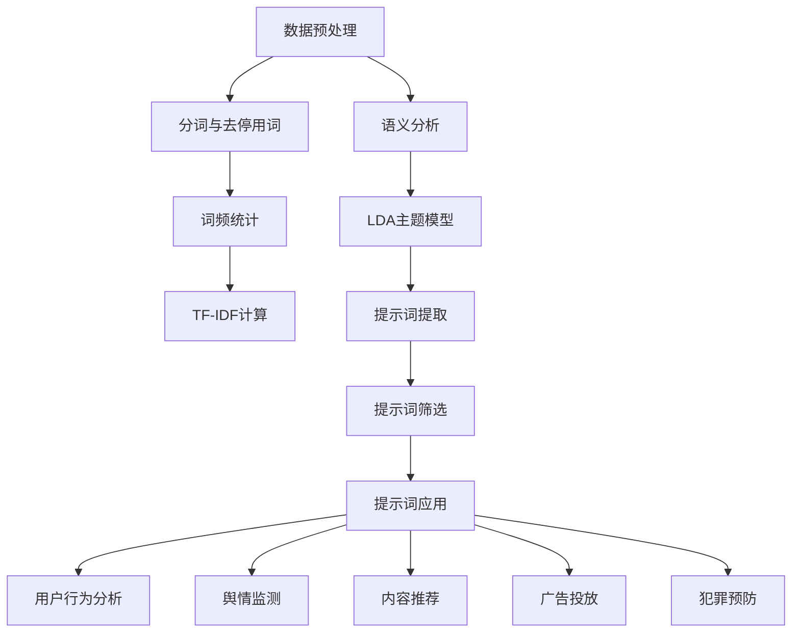

                 

# 《提示词工程在社交网络动态分析中的应用》

## 摘要

本文旨在探讨提示词工程在社交网络动态分析中的应用。社交网络作为信息交流与共享的重要平台，其数据的规模和复杂性不断增长。提示词工程作为一种有效的方法，通过对文本数据中关键词的提取、分析和应用，能够帮助我们更好地理解社交网络的动态行为，进而为用户提供更加个性化的服务。本文将从提示词工程的基本概念、社交网络动态分析的基础、提示词工程在具体应用中的实践以及未来趋势等多个方面进行阐述，旨在为相关领域的研究者和实践者提供有价值的参考。

### 关键词

- 社交网络
- 动态分析
- 提示词工程
- 语义分析
- 机器学习
- 深度学习
- 用户行为分析
- 舆情监测
- 内容推荐
- 广告投放
- 犯罪预防

---

## 引言

### 1.1 社交网络与提示词工程

社交网络是指用户可以通过平台建立联系、分享信息、交流互动的在线社区。从早期的MySpace、Facebook，到如今的微博、微信、抖音等，社交网络已经成为人们日常生活不可或缺的一部分。社交网络数据具有体量大、维度多、实时性强等特点，蕴含了丰富的用户行为和社交关系信息。

提示词工程是一种专门针对文本数据进行处理和分析的技术。它通过提取、处理和利用文本中的关键词（即提示词），实现对信息的快速筛选、理解和应用。在社交网络动态分析中，提示词工程具有重要作用，能够帮助我们从海量数据中捕捉关键信息，挖掘用户行为模式，预测趋势，并据此为用户提供个性化服务。

### 1.2 提示词工程在社交网络动态分析中的重要性

社交网络的动态分析主要包括用户行为分析、舆情监测、内容推荐、广告投放和犯罪预防等多个方面。提示词工程在这些应用场景中发挥着至关重要的作用：

1. **用户行为分析**：通过分析用户发布的内容中的关键词，可以了解用户兴趣、偏好、情绪等，从而构建用户画像，进行个性化推荐和服务。

2. **舆情监测**：实时关注社交网络上的热门话题和舆情动向，提取关键提示词，评估事件影响，为决策提供依据。

3. **内容推荐**：基于用户历史行为和兴趣，提取相关关键词，推荐用户可能感兴趣的内容，提升用户体验和用户留存率。

4. **广告投放**：根据用户兴趣和需求，选择合适的提示词进行广告投放，提高广告的点击率和转化率。

5. **犯罪预防**：通过分析网络言论中的关键词，识别潜在的犯罪行为，及时采取预防措施。

### 1.3 本书结构

本书分为四个部分，共十章内容。具体结构如下：

- **第一部分：引言**，介绍社交网络与提示词工程的基本概念，以及提示词工程在社交网络动态分析中的重要性。

- **第二部分：提示词工程基础**，包括提示词工程的概念、语义分析、机器学习和深度学习模型等内容。

- **第三部分：提示词工程应用实践**，详细介绍提示词工程在用户行为分析、舆情监测、内容推荐、广告投放和犯罪预防等领域的应用。

- **第四部分：展望与未来趋势**，探讨提示词工程的挑战与机遇，以及未来发展趋势。

通过本书的阅读，读者可以系统地了解提示词工程在社交网络动态分析中的应用，掌握相关技术原理和实践方法，为实际应用提供指导。

---

## 第1章：概述与背景

### 1.1 社交网络的基本概念

社交网络（Social Network）是指由人与人之间的社交关系构成的网络结构。社交网络的节点代表个体（如用户），边代表个体之间的社交关系（如好友关系、关注关系）。这种网络结构不仅反映了个体之间的联系，还体现了信息的传播路径和模式。

社交网络具有以下几个主要特点：

- **规模庞大**：社交网络通常包含数亿甚至数十亿的用户，数据量极其庞大。

- **多维度数据**：社交网络数据不仅包括用户的基本信息，如年龄、性别、地理位置，还包括用户的行为数据，如发布内容、点赞、评论等。

- **实时性**：社交网络上的信息更新速度快，用户可以实时发布和获取信息。

- **动态变化**：社交网络中的关系和内容不断变化，用户的兴趣和需求也在不断演变。

### 1.2 社交网络数据的获取与处理

获取社交网络数据的主要途径包括公开数据集和API调用。公开数据集通常由社交网络平台提供，如Twitter、Facebook的公开API。通过API调用，研究者可以获取用户的公开信息、发布内容等数据。

在获取数据后，需要对数据进行处理，以提取有用的信息。数据处理步骤通常包括：

- **数据清洗**：去除重复数据、缺失值填充、噪声过滤等。

- **数据整合**：将来自不同数据源的数据进行整合，形成一个统一的数据集。

- **数据转换**：将原始数据转换为适合分析的形式，如文本、图像等。

### 1.3 提示词工程在社交网络动态分析中的重要性

提示词工程（Keyword Engineering）是文本数据分析的重要分支，通过对文本数据中关键词的提取、分析和应用，实现对信息的快速筛选、理解和应用。在社交网络动态分析中，提示词工程具有以下重要性：

1. **信息筛选与检索**：提示词工程能够帮助从海量社交网络数据中快速找到关键信息，提高信息检索的效率。

2. **用户行为分析**：通过分析用户发布的内容中的关键词，可以了解用户兴趣、情绪和行为模式，为个性化推荐和服务提供支持。

3. **舆情监测与趋势预测**：提取关键提示词，实时关注社交网络上的热门话题和舆情动向，为政策制定、危机管理等提供依据。

4. **内容推荐与广告投放**：基于用户兴趣和需求，提取相关关键词，推荐用户可能感兴趣的内容，提高广告的点击率和转化率。

5. **犯罪预防与安全管理**：通过分析网络言论中的关键词，识别潜在的犯罪行为，及时采取预防措施。

### 1.4 本书结构

本书旨在系统地介绍提示词工程在社交网络动态分析中的应用。具体章节安排如下：

- **第1章：概述与背景**，介绍社交网络和提示词工程的基本概念及其在社交网络动态分析中的重要性。

- **第2章：社交网络动态分析基础**，讨论社交网络的基本概念、数据获取与处理、动态分析的目标与挑战。

- **第3章：提示词工程的概念与原理**，详细讲解提示词的定义、类型、选择策略和方法。

- **第4章：语义分析与文本挖掘**，介绍语义分析基础、提示词语义匹配算法、提取与筛选。

- **第5章：机器学习与深度学习模型**，探讨常见机器学习模型和深度学习模型的基本原理和应用。

- **第6章：社交网络用户行为分析**，分析用户画像、用户行为预测及应用案例。

- **第7章：社交网络舆情监测与趋势预测**，介绍舆情监测、趋势预测方法及应用案例。

- **第8章：社交网络内容推荐**，讨论内容推荐系统概述、提示词在内容推荐中的应用。

- **第9章：社交网络广告投放**，探讨广告投放策略、提示词在广告投放中的应用。

- **第10章：社交网络犯罪预防**，介绍犯罪预防的基本概念、提示词在犯罪预防中的应用。

- **第11章：展望与未来趋势**，讨论提示词工程的挑战、机遇以及未来发展趋势。

通过本书的阅读，读者可以系统地了解提示词工程在社交网络动态分析中的应用，掌握相关技术原理和实践方法，为实际应用提供指导。

---

## 第2章：社交网络动态分析基础

### 2.1 社交网络的基本概念

社交网络（Social Network）是一种在线平台，它允许用户建立联系、分享信息和互动。社交网络的定义可以从几个不同的角度进行理解：

- **技术角度**：社交网络是一个由多个节点（代表用户）和边（代表用户之间的社交关系）组成的复杂网络结构。这种结构可以用图论来描述，其中每个节点可以代表一个用户，每条边代表用户之间的关系。

- **社会学角度**：社交网络是一种社会现象，它反映了人们如何相互联系、沟通和合作。社会学研究者关注社交网络中的群体结构、社会网络传播、网络效应等现象。

- **商业角度**：社交网络是数字营销和客户关系管理的重要工具。企业通过社交网络与消费者建立互动，了解市场需求，推广产品和服务。

社交网络的关键特点包括：

- **用户规模庞大**：大多数主流社交网络平台都拥有数亿甚至数十亿的用户，这使得社交网络成为一个极具潜力的市场。

- **多维度数据**：社交网络数据不仅包括用户的基本信息（如年龄、性别、地理位置），还包括用户发布的内容（如文本、图片、视频）、行为数据（如点赞、评论、分享）等。

- **实时性**：社交网络上的信息是实时更新的，用户可以实时发布、获取和分享信息。

- **动态变化**：社交网络中的用户关系和内容不断变化，用户加入或离开社交网络，发布的内容和话题也在不断演变。

### 2.2 社交网络数据的获取与处理

获取社交网络数据是进行动态分析的前提。数据获取的方式主要包括公开数据集和API调用。

- **公开数据集**：许多社交网络平台提供了公开的数据集，研究者可以通过这些数据集进行研究和分析。例如，Twitter提供了Twitter API，允许用户获取公开的推文数据；Facebook提供了Facebook API，允许获取用户公开的信息。

- **API调用**：通过社交网络平台的API，研究者可以获取更多详细的数据。API调用通常涉及认证、请求参数设置和数据处理等步骤。例如，Twitter API允许用户获取特定用户的推文、好友列表等数据。

在获取数据后，需要对数据进行处理，以提取有用的信息。数据处理过程通常包括以下几个步骤：

- **数据清洗**：去除重复数据、缺失值填充、噪声过滤等，确保数据质量。

- **数据整合**：将来自不同数据源的数据进行整合，形成一个统一的数据集。

- **数据转换**：将原始数据转换为适合分析的形式，如文本、图像等。例如，将文本数据转换为结构化格式，如JSON或CSV。

### 2.3 社交网络动态分析的目标与挑战

社交网络动态分析的目标是理解和预测社交网络中的各种动态行为，包括用户行为、舆情趋势、内容传播等。具体目标包括：

1. **用户行为分析**：理解用户在社交网络中的行为模式，如发布内容、互动频率、兴趣偏好等。

2. **舆情监测**：实时监测社交网络上的热点话题和舆情动向，评估事件影响。

3. **内容推荐**：基于用户兴趣和行为，推荐用户可能感兴趣的内容。

4. **广告投放**：根据用户兴趣和需求，选择合适的广告内容，提高广告的点击率和转化率。

5. **犯罪预防**：通过分析网络言论，识别潜在的犯罪行为，及时采取预防措施。

然而，社交网络动态分析面临着诸多挑战：

1. **数据复杂性**：社交网络数据规模庞大，且包含多种类型的数据（文本、图像、视频等），数据处理和分析的复杂性较高。

2. **实时性要求**：社交网络动态变化迅速，分析结果需要实时反馈，这对系统的处理速度和性能提出了高要求。

3. **隐私保护**：社交网络数据涉及用户隐私，分析过程中需要确保用户数据的保密性和合法性。

4. **噪声干扰**：社交网络数据中存在大量的噪声和异常值，这对数据分析的准确性和可靠性构成了挑战。

5. **算法选择**：不同的动态分析目标需要不同的算法和技术支持，算法选择和模型调优的复杂性较高。

### 2.4 社交网络动态分析的重要性

社交网络动态分析在多个领域具有重要的应用价值：

1. **市场营销**：企业可以通过社交网络动态分析了解消费者需求、行为和偏好，制定更有针对性的营销策略。

2. **危机管理**：政府和企业可以通过舆情监测和趋势预测，及时应对突发危机，减少损失。

3. **社会治理**：政府部门可以通过社交网络动态分析，了解社会动态和民意，优化政策制定和执行。

4. **科学研究**：社交网络动态分析为社会学、心理学、计算机科学等领域的科学研究提供了丰富的数据和研究方法。

总之，社交网络动态分析是一个多学科交叉的研究领域，具有广泛的应用前景和重要的社会意义。通过系统地理解和应用相关技术，我们可以更好地把握社交网络的动态行为，为各个领域的决策提供科学依据。

---

## 第3章：提示词工程的概念与原理

### 3.1 提示词的定义与类型

提示词（Keywords）是指从文本数据中提取出的，能够代表文本主题或内容的词汇。提示词可以是单个词或短语，它们能够帮助用户快速了解文本的核心信息。提示词在文本数据中起着至关重要的作用，是文本挖掘和信息检索的基础。

提示词的类型可以根据不同的标准进行分类：

- **按层次划分**：提示词可以分为一级关键词、二级关键词和三级关键词。一级关键词通常是最能概括文本主题的词汇，如“人工智能”、“社交媒体”等。二级关键词是对一级关键词的进一步细分，如“机器学习”、“社交媒体营销”等。三级关键词则是对二级关键词的补充，如“深度学习”、“社交媒体分析”等。

- **按语义功能划分**：提示词可以分为实词和虚词。实词如名词、动词、形容词等，它们直接承载了文本的主要信息。虚词如介词、连词、助词等，虽然不直接传递信息，但在构建句子结构和语义关系上起着重要作用。

- **按提取方式划分**：提示词可以分为手动提取和自动提取。手动提取通常由专业人员根据文本内容进行挑选，具有较高的人为主观性。自动提取则通过自然语言处理技术（如词频统计、词性标注、主题模型等）进行，具有较高的效率和准确性。

### 3.2 提示词工程的基本流程

提示词工程是一个系统化的过程，包括数据预处理、提示词提取、提示词筛选和提示词应用等步骤。以下是提示词工程的基本流程：

1. **数据预处理**：在提取提示词之前，需要对原始文本数据进行预处理，包括文本清洗、分词、去停用词等操作。文本清洗旨在去除文本中的噪声和无关信息，如HTML标签、特殊字符等。分词是将文本分割成单词或短语的步骤，去停用词则是去除常见的无意义词汇，如“的”、“和”、“是”等。

2. **提示词提取**：提示词提取是提示词工程的核心步骤，主要方法包括词频统计、TF-IDF、LDA（主题模型）等。词频统计是最简单的提取方法，通过计算每个词在文本中的出现频率来确定其重要性。TF-IDF（Term Frequency-Inverse Document Frequency）结合词频和文档频率，对词的重要性进行加权。LDA是一种主题模型，能够从大量文本中自动发现主题，并将文本划分为不同的主题。

3. **提示词筛选**：提取出的提示词可能包含大量无意义或冗余的词汇，需要通过筛选来保留关键信息。筛选方法包括基于词频的筛选、基于语义的筛选等。基于词频的筛选通常保留出现频率较高的词，但可能会忽略某些重要但出现频率较低的词。基于语义的筛选通过语义分析技术，如词性标注、语义角色标注等，选择具有实际意义的词汇。

4. **提示词应用**：筛选出的提示词可以应用于多个领域，如信息检索、内容推荐、舆情监测、用户画像等。在信息检索中，提示词用于构建索引，提高搜索效率。在内容推荐中，提示词用于匹配用户兴趣和内容，提升推荐效果。在舆情监测中，提示词用于识别热点话题和舆情趋势。在用户画像中，提示词用于分析用户兴趣和需求。

### 3.3 提示词选择策略与方法

选择合适的提示词对于提示词工程的效果至关重要。以下是一些常见的提示词选择策略和方法：

1. **词频统计**：基于词频的提示词选择方法是最直观的，通常选择出现频率最高的词作为提示词。这种方法简单有效，但可能会忽略词的重要性和语义相关性。

2. **TF-IDF**：TF-IDF方法结合词频和文档频率，对词的重要性进行加权。TF（Term Frequency）表示词在文本中的出现频率，IDF（Inverse Document Frequency）表示词在文档集合中的分布频率。TF-IDF方法能够较好地平衡词频和文档频率，选择具有较高重要性的词。

3. **LDA**：LDA（Latent Dirichlet Allocation）是一种主题模型，通过概率生成模型从文本中提取主题。LDA方法能够自动发现文本中的主题，并将文本划分为不同的主题。选择LDA模型提取出的主题词作为提示词，能够捕捉文本的深层语义信息。

4. **语义相似性**：基于语义相似性的提示词选择方法通过计算词与词之间的语义相似度来确定提示词。这种方法能够选择与文本主题高度相关的词汇，提高提示词的准确性。

5. **用户反馈**：用户反馈是一种结合用户行为和语义分析的提示词选择方法。通过分析用户的点赞、评论等行为，识别用户感兴趣的关键词汇，并将其作为提示词。这种方法能够更好地反映用户的真实需求和兴趣。

### 3.4 提示词工程在社交网络动态分析中的应用

提示词工程在社交网络动态分析中具有广泛的应用，以下是一些具体的应用场景：

1. **用户行为分析**：通过分析用户发布的内容中的关键词，可以了解用户的兴趣、情绪和行为模式。例如，通过提取用户在社交媒体上的发布内容中的关键词，可以构建用户画像，进行个性化推荐和服务。

2. **舆情监测**：实时关注社交网络上的热门话题和舆情动向，提取关键提示词，评估事件影响。例如，通过提取Twitter、微博等社交媒体上的关键词，可以监测突发事件的舆情趋势，为危机管理和决策提供依据。

3. **内容推荐**：基于用户历史行为和兴趣，提取相关关键词，推荐用户可能感兴趣的内容。例如，通过提取用户在电商平台上浏览、购买的商品中的关键词，可以推荐类似的产品，提升用户满意度和转化率。

4. **广告投放**：根据用户兴趣和需求，选择合适的提示词进行广告投放，提高广告的点击率和转化率。例如，通过提取用户在社交媒体上的评论、帖子中的关键词，可以定向投放与用户兴趣相关的广告。

5. **犯罪预防**：通过分析网络言论中的关键词，识别潜在的犯罪行为，及时采取预防措施。例如，通过提取社交媒体上的暴力言论、诈骗信息中的关键词，可以监控网络犯罪活动，维护网络安全。

总之，提示词工程作为一种强大的文本分析工具，在社交网络动态分析中发挥着重要作用。通过科学、系统的提示词选择和提取方法，可以更好地理解社交网络的动态行为，为各个领域的应用提供有力支持。

### 3.5 提示词工程的核心概念与联系

为了更好地理解提示词工程的核心概念及其在社交网络动态分析中的应用，我们使用Mermaid流程图来展示其基本架构和流程。



**流程说明：**

1. **数据预处理**：包括文本清洗、分词和去停用词。这一步骤的目的是去除文本中的噪声和无关信息，为后续的提示词提取和筛选做好准备。

2. **词频统计**：通过统计词在文本中的出现频率，初步确定词的重要性。

3. **TF-IDF计算**：结合词频和文档频率，对词的重要性进行加权，选择具有较高重要性的词。

4. **语义分析**：利用自然语言处理技术，如词性标注、语义角色标注等，对文本进行深入分析，捕捉文本的深层语义信息。

5. **LDA主题模型**：从大量文本中自动发现主题，并将文本划分为不同的主题，提取主题词。

6. **提示词提取**：结合词频统计、TF-IDF和LDA等结果，提取出关键提示词。

7. **提示词筛选**：根据实际需求，对提取出的提示词进行筛选，保留最有意义的词汇。

8. **提示词应用**：将筛选出的提示词应用于具体领域，如用户行为分析、舆情监测、内容推荐等，实现社交网络动态分析的目标。

通过上述流程，我们可以看到提示词工程的核心概念和流程是如何相互联系并协同工作的，从而为社交网络动态分析提供有力的支持。

---

## 第4章：语义分析与文本挖掘

### 4.1 语义分析基础

语义分析（Semantic Analysis）是自然语言处理（Natural Language Processing, NLP）中的重要组成部分，旨在理解和解释文本的语义内容。语义分析不仅仅是表面意义上的单词翻译或语法分析，它更关注文本的深层含义和语境理解。

#### 语义分析的主要任务包括：

1. **词义消歧**（Word Sense Disambiguation）：在多义词的场景中，确定单词的确切含义。
   
2. **实体识别**（Named Entity Recognition, NER）：从文本中识别出具有特定意义的实体，如人名、地名、组织名等。

3. **关系提取**（Relation Extraction）：识别文本中实体之间的关系，如“A喜欢B”或“C在D工作”。

4. **情感分析**（Sentiment Analysis）：判断文本的情感倾向，如正面、负面或中性。

5. **语义角色标注**（Semantic Role Labeling, SRL）：标注句子中每个词的语义角色，如动作执行者、受动者、工具等。

#### 语义分析的关键技术包括：

- **词性标注**（Part-of-Speech Tagging）：对文本中的每个词进行词性标注，如名词、动词、形容词等。

- **句法分析**（Syntactic Parsing）：分析句子的语法结构，如成分解析树。

- **语义角色标注**：结合句法分析和词性标注，标注句子中每个词的语义角色。

- **深度学习方法**：如循环神经网络（RNN）、卷积神经网络（CNN）和变换器（Transformer）等，在语义分析中得到了广泛应用。

### 4.2 提示词语义匹配算法

提示词语义匹配是语义分析中的一项关键技术，其目的是通过比较文本中的关键词和预设的提示词，确定它们在语义上的相似性或匹配度。以下是几种常见的提示词语义匹配算法：

#### 1. 基于词频的方法

- **TF-IDF**：通过计算词频（Term Frequency）和逆文档频率（Inverse Document Frequency）的加权得分来评估两个词的匹配度。公式如下：

  $$ \text{TF-IDF}(t,d) = \text{TF}(t,d) \times \text{IDF}(t,D) $$
  
  其中，$t$表示词，$d$表示文档，$D$表示文档集合。

#### 2. 基于语义相似性的方法

- **余弦相似度**：计算两个词在向量空间中的夹角余弦值，评估其相似性。公式如下：

  $$ \text{Cosine Similarity}(w_1, w_2) = \frac{w_1 \cdot w_2}{\|w_1\| \|w_2\|} $$

  其中，$w_1$和$w_2$表示两个词的向量表示，$\|\|$表示向量模长，$\cdot$表示点积。

- **Word2Vec**：通过Word2Vec模型将词映射到高维向量空间，计算两个词之间的欧几里得距离，作为其相似性指标。

#### 3. 基于深度学习的方法

- **BERT**：BERT（Bidirectional Encoder Representations from Transformers）是一种基于变换器（Transformer）的预训练语言模型，通过双向编码器捕获词的上下文信息，从而进行语义匹配。

- **句法解析**：结合句法分析技术，如依存句法分析，可以更准确地识别词之间的语义关系，从而提高匹配精度。

### 4.3 提示词提取与筛选

提示词提取是提示词工程的核心步骤，其目标是自动地从大量文本中提取出能够代表文本主题的关键词汇。以下是几种常见的提示词提取方法：

#### 1. 基于词频的方法

- **TF**：选择出现频率最高的词作为提示词。这种方法简单直观，但可能会忽略词的语义重要性。

- **TFxIDF**：结合词频和文档频率，对词的重要性进行加权。公式如下：

  $$ \text{TFxIDF}(t,d) = \text{TF}(t,d) \times \text{IDF}(t,D) $$

#### 2. 基于主题模型的方法

- **LDA**：LDA（Latent Dirichlet Allocation）是一种概率主题模型，通过推理文本生成过程中的潜在主题，提取主题词作为提示词。

#### 3. 基于语义相似性的方法

- **LSA**：通过Latent Semantic Analysis（潜在语义分析）方法，使用矩阵分解技术提取出文本中的潜在语义信息，从而提取提示词。

#### 4. 基于用户反馈的方法

- **投票法**：通过用户对文本内容的投票，选择最受欢迎的词作为提示词。

#### 提示词筛选

筛选是提示词提取的重要环节，其目标是去除无意义或冗余的词，保留关键信息。以下是几种常见的提示词筛选方法：

- **基于词频的筛选**：保留出现频率较高的词，通常频率阈值设定在10%以上。

- **基于语义重要性的筛选**：利用词性标注和语义角色标注技术，选择具有实际意义的词汇。

- **基于用户反馈的筛选**：通过用户投票或点击行为，选择用户认为重要的词。

### 4.4 提示词工程在文本挖掘中的应用

提示词工程在文本挖掘（Text Mining）中具有广泛的应用，以下是一些具体的应用场景：

1. **信息检索**：通过提取关键词构建索引，提高搜索效率和准确性。

2. **内容推荐**：基于用户历史行为和兴趣，提取相关关键词，推荐用户可能感兴趣的内容。

3. **舆情监测**：实时提取热门话题和关键词，监测舆情动向。

4. **用户画像**：通过分析用户发布的内容中的关键词，构建用户画像，进行个性化推荐和服务。

5. **广告投放**：根据用户兴趣和需求，选择合适的提示词进行广告投放，提高广告的点击率和转化率。

通过语义分析和文本挖掘技术，我们可以更准确地提取和筛选提示词，为社交网络动态分析提供有力支持。

### 4.5 提示词提取与筛选的核心算法原理讲解

为了深入理解提示词提取与筛选的核心算法原理，我们使用伪代码和数学模型来详细阐述。

#### 1. 基于词频的方法

**伪代码：**
```
输入：文本集合D，每个文档d ∈ D
输出：提示词集合K

for d ∈ D do
    // 统计每个词的词频
    tf(d, w) = 计算词w在文档d中出现的次数
end for

// 计算每个词的总词频
total_tf(w) = Σd ∈ D tf(d, w)

// 计算每个词的TF-IDF值
for w ∈ 所有词 do
    tfidf(w) = tf(w, d) * log(1 / total_tf(w))
end for

// 根据TF-IDF值排序，选择Top N个最高值的词作为提示词
K = 选择前N个TF-IDF值最高的词
```

**数学模型：**
$$ \text{TF-IDF}(t,d) = \text{TF}(t,d) \times \text{IDF}(t,D) $$
$$ \text{TF}(t,d) = \text{词频} $$
$$ \text{IDF}(t,D) = \log_2(1 + N / |d \in D : t \in d|) $$

其中，$t$为词，$d$为文档，$D$为文档集合，$N$为文档总数。

#### 2. 基于主题模型的方法（LDA）

**伪代码：**
```
输入：文档集合D
输出：提示词集合K

// 建立词袋模型
B = 建立词袋模型(D)

// 运行LDA模型
topics = 运行LDA(B)

// 提取每个主题中的关键词
for topic ∈ topics do
    K_topic = 选择topic中出现频率最高的词
end for

// 合并所有主题中的关键词
K = 并集(K_topic for all topics)
```

**数学模型：**
LDA模型基于贝叶斯推理，其目标是最小化文本数据的对数似然损失函数：

$$ \min_{\theta, \phi} \sum_{d \in D} \sum_{w \in d} \log P(w|\theta_d) P(\theta_d|\phi) $$

其中，$\theta_d$为文档$d$的主题分布，$\phi$为词语的主题分布。

#### 3. 基于用户反馈的方法（投票法）

**伪代码：**
```
输入：用户集合U，每个用户u ∈ U的投票结果V
输出：提示词集合K

// 初始化提示词集合
K = 空集合

for u ∈ U do
    // 对于每个用户的投票结果，添加到提示词集合中
    for v ∈ V[u] do
        K.add(v)
    end for
end for

// 根据投票数量排序，选择Top N个最高值的词作为提示词
K = 选择前N个投票数量最高的词
```

**数学模型：**
$$ \text{投票得分}(w) = \sum_{u \in U} \text{投票权重}(u) \times \text{投票数量}(w,u) $$

其中，$w$为词，$\text{投票权重}(u)$为用户$u$的投票权重（通常与用户活跃度成正比），$\text{投票数量}(w,u)$为用户$u$对词$w$的投票数量。

通过上述核心算法原理讲解，我们可以更深入地理解提示词提取与筛选的方法及其数学基础，从而为社交网络动态分析提供有效的技术支持。

---

## 第5章：机器学习与深度学习模型

### 5.1 常见机器学习模型

在社交网络动态分析中，机器学习模型扮演着至关重要的角色。常见的机器学习模型包括分类模型、聚类模型和回归模型等，每种模型都有其独特的应用场景和优势。

#### 1. 分类模型

分类模型用于将数据划分为预定义的类别。常见的分类模型包括：

- **逻辑回归（Logistic Regression）**：逻辑回归是一种简单但有效的分类模型，用于预测二分类问题。其输出概率通过逻辑函数（Sigmoid函数）转换，公式如下：

  $$ P(y=1|x;\theta) = \frac{1}{1 + e^{-(\theta^T x)}} $$

- **支持向量机（Support Vector Machine, SVM）**：SVM通过最大化分类边界之间的距离来划分数据。其目标是最小化分类间隔，公式如下：

  $$ \min_{\theta, \xi} \frac{1}{2} \sum_{i=1}^n (\theta^T \theta) - C \sum_{i=1}^n \xi_i $$

  其中，$C$是惩罚参数，用于控制模型复杂度。

- **决策树（Decision Tree）**：决策树通过一系列的二元分割来划分数据，每个节点代表一个特征，每个分支代表一个阈值。决策树的优点是易于理解和解释，但可能产生过拟合。

- **随机森林（Random Forest）**：随机森林是一种基于决策树的集成模型，通过构建多棵决策树并合并它们的预测结果来提高模型的准确性和鲁棒性。

#### 2. 聚类模型

聚类模型用于将数据划分为无预定义类别的群组。常见的聚类模型包括：

- **K-均值算法（K-Means）**：K-均值算法通过最小化簇内距离的平方和来划分数据。其目标是最小化目标函数：

  $$ \min_{\mu} \sum_{i=1}^k \sum_{x \in S_i} \|x - \mu_i\|^2 $$

  其中，$\mu_i$是簇中心，$S_i$是第$i$个簇。

- **层次聚类（Hierarchical Clustering）**：层次聚类通过逐步合并或分裂簇来构建一个聚类层次结构。其优点是能够生成聚类层次视图，但计算复杂度较高。

- **DBSCAN（Density-Based Spatial Clustering of Applications with Noise）**：DBSCAN基于数据点的密度来划分簇。其优点是能够处理不规则形状的簇，对噪声数据的鲁棒性较强。

#### 3. 回归模型

回归模型用于预测连续值。常见的回归模型包括：

- **线性回归（Linear Regression）**：线性回归通过建立自变量和因变量之间的线性关系来预测目标值，公式如下：

  $$ y = \theta_0 + \theta_1 x_1 + \theta_2 x_2 + \ldots + \theta_n x_n $$

  其中，$x_i$为自变量，$y$为因变量。

- **多项式回归（Polynomial Regression）**：多项式回归通过建立自变量和因变量之间的多项式关系来预测目标值。

- **支持向量回归（Support Vector Regression, SVR）**：SVR通过最大化分类边界之间的距离来回归目标值。其目标是最小化目标函数：

  $$ \min_{\theta, \xi} \frac{1}{2} \sum_{i=1}^n (\theta^T \theta) + C \sum_{i=1}^n \xi_i $$

  其中，$C$是惩罚参数。

### 5.2 深度学习模型

深度学习模型在社交网络动态分析中具有显著优势，能够自动从大规模数据中学习复杂的特征和模式。以下是几种常见的深度学习模型：

#### 1. 卷积神经网络（Convolutional Neural Network, CNN）

CNN主要用于图像处理，但其原理也可以应用于文本处理。在文本处理中，CNN通过卷积层提取局部特征，然后通过池化层减少参数数量，提高模型泛化能力。CNN的典型架构包括：

- **卷积层**：通过卷积核（过滤器）对输入文本进行卷积操作，提取文本中的局部特征。
  
- **池化层**：通过最大池化或平均池化操作，减少特征维度，提高模型计算效率。

- **全连接层**：将卷积层和池化层输出的特征映射到输出结果。

#### 2. 循环神经网络（Recurrent Neural Network, RNN）

RNN是一种序列模型，能够处理变长的序列数据。RNN通过在序列的每个时间步上维持状态，实现对序列数据的记忆和学习。RNN的典型架构包括：

- **隐藏层**：在每个时间步上，隐藏层状态通过上一个时间步的隐藏状态和当前输入进行更新。
  
- **循环连接**：RNN中的隐藏层状态通过循环连接保持信息的长期依赖。

#### 3. 长短时记忆网络（Long Short-Term Memory, LSTM）

LSTM是RNN的一种变体，能够解决传统RNN中的梯度消失和梯度爆炸问题。LSTM通过引入门控机制，控制信息的流动和遗忘，提高模型的长期依赖学习能力。LSTM的典型结构包括：

- **输入门**（Input Gate）：决定当前输入信息中哪些部分需要被记住。
  
- **遗忘门**（Forget Gate）：决定哪些旧信息需要被遗忘。
  
- **输出门**（Output Gate）：决定当前隐藏状态中哪些信息需要输出。

#### 4. 变换器（Transformer）

Transformer是近年来提出的一种基于自注意力机制的深度学习模型，在许多NLP任务中取得了显著的成果。Transformer的核心组件是自注意力机制（Self-Attention），它通过计算输入序列中每个词与其他词之间的相似性来生成新的特征表示。Transformer的典型结构包括：

- **编码器**（Encoder）：通过多层的自注意力机制和前馈网络，对输入序列进行处理和编码。
  
- **解码器**（Decoder）：与编码器结构类似，通过自注意力机制和编码器-解码器注意力机制生成输出序列。

- **自注意力机制**：通过计算输入序列中每个词与其他词之间的相似性，生成新的特征表示。

- **编码器-解码器注意力机制**：通过计算编码器输出的隐藏状态与解码器隐藏状态之间的相似性，实现对编码器输出的参考。

### 5.3 模型选择与优化

在选择机器学习和深度学习模型时，需要考虑多个因素，如数据规模、任务类型、计算资源等。以下是一些常见的模型选择和优化方法：

#### 1. 模型选择

- **交叉验证**：通过将数据集划分为训练集、验证集和测试集，评估不同模型的性能，选择表现最优的模型。

- **网格搜索**：通过遍历不同的参数组合，选择最优的参数组合。

- **贝叶斯优化**：利用贝叶斯统计方法，自动搜索最优参数组合。

#### 2. 模型优化

- **数据预处理**：通过数据清洗、归一化、去停用词等操作，提高数据质量，减少噪声干扰。

- **特征工程**：通过特征提取和特征转换，提高特征表达能力。

- **正则化**：通过添加正则项（如L1、L2正则化），防止模型过拟合。

- **模型融合**：通过集成多个模型，提高预测性能和鲁棒性。

- **超参数调优**：通过调整模型的超参数（如学习率、批次大小等），优化模型性能。

通过合理选择和优化机器学习和深度学习模型，我们可以更好地应对社交网络动态分析中的各种挑战，为用户提供准确、高效的预测和分析结果。

---

## 第6章：社交网络用户行为分析

### 6.1 用户画像与用户行为分析

用户画像（User Profiling）是指通过收集和分析用户的个人信息、行为数据等多维度数据，构建用户特征模型，以实现对用户的全面了解和精准定位。用户行为分析（User Behavior Analysis）则是基于用户画像，深入挖掘用户在社交网络中的行为模式、兴趣偏好和情绪变化，为个性化推荐、营销策略和用户服务提供依据。

#### 用户画像的构建

用户画像的构建通常包括以下几个步骤：

1. **数据收集**：通过API调用、数据爬取等方式收集用户的基本信息（如年龄、性别、地理位置）、行为数据（如发布内容、点赞、评论、分享）、互动数据（如关注、好友关系）等。

2. **数据清洗**：去除重复数据、缺失值填充、噪声过滤等，确保数据质量。

3. **特征提取**：通过文本挖掘、数据统计分析等方法，从原始数据中提取有效的特征，如兴趣标签、行为特征、社交特征等。

4. **特征融合**：将不同来源的特征进行整合，形成统一的用户特征向量。

5. **模型训练**：利用机器学习算法，如决策树、随机森林、神经网络等，对用户特征进行训练，构建用户画像模型。

#### 用户行为分析的方法

用户行为分析的方法主要包括以下几种：

1. **统计方法**：通过统计分析用户的行为数据，如发布内容数量、点赞数量、互动频率等，识别用户的行为特征。

2. **机器学习方法**：利用机器学习算法，如分类、聚类、回归等，对用户行为进行预测和分析。常见的算法包括逻辑回归、SVM、K-均值等。

3. **深度学习方法**：利用深度学习模型，如卷积神经网络（CNN）、循环神经网络（RNN）、变换器（Transformer）等，对用户行为进行建模和分析。

#### 用户行为分析的应用

用户行为分析在社交网络中有广泛的应用，包括：

1. **个性化推荐**：基于用户历史行为和兴趣，推荐用户可能感兴趣的内容、商品、广告等，提升用户体验和满意度。

2. **用户分类与定位**：根据用户行为特征，将用户划分为不同的群体，为不同群体的用户提供定制化的服务和营销策略。

3. **舆情监测**：通过分析用户在社交网络上的言论和互动，监测热点话题、舆情动向，为决策提供依据。

4. **用户情感分析**：通过分析用户的情绪变化，了解用户对特定事件、产品、服务的态度，为改进产品和服务提供参考。

### 6.2 提示词在用户行为预测中的应用

提示词工程在用户行为预测中发挥着重要作用。通过提取用户发布内容中的关键词，可以了解用户的兴趣、需求和情绪，从而预测用户的行为。以下是提示词在用户行为预测中的应用方法：

#### 1. 关键词提取与特征表示

- **关键词提取**：利用词频统计、TF-IDF、LDA等方法，从用户发布的内容中提取关键提示词。

- **特征表示**：将提取出的关键词转换为特征向量表示，如词袋模型、词嵌入等。

#### 2. 用户行为预测模型

- **分类模型**：利用逻辑回归、SVM、随机森林等分类模型，预测用户的特定行为（如是否点赞、是否购买等）。

- **回归模型**：利用线性回归、多项式回归等回归模型，预测用户的数值行为（如购买金额、互动频率等）。

- **深度学习模型**：利用卷积神经网络（CNN）、循环神经网络（RNN）、变换器（Transformer）等深度学习模型，对用户行为进行建模和预测。

#### 3. 模型评估与优化

- **模型评估**：通过交叉验证、准确率、召回率、F1值等指标评估模型的性能。

- **模型优化**：通过调整模型参数、增加数据预处理步骤、融合多个模型等方法，优化模型性能。

### 6.3 案例分析

以下是一个关于用户行为预测的案例分析：

**案例背景**：某电商公司希望通过分析用户在社交媒体上的行为，预测用户是否会在下次购物活动中购买特定商品。

**数据来源**：公司获取了用户在社交媒体上发布的内容、点赞、评论等数据，以及用户在电商平台上的购买记录。

**数据处理**：对社交媒体数据进行预处理，包括文本清洗、分词、去停用词等，提取关键提示词，构建用户特征向量。

**模型构建**：利用LDA模型提取用户兴趣主题，结合用户历史行为数据，构建用户行为预测模型。选择逻辑回归模型进行预测，并利用交叉验证方法评估模型性能。

**模型优化**：通过调整模型参数（如学习率、正则化强度等）和增加数据预处理步骤（如特征融合、文本增强等），优化模型性能。

**预测结果**：模型预测用户在下次购物活动中购买特定商品的概率。通过实时监测和调整，公司能够更好地了解用户需求，优化营销策略，提升销售转化率。

通过以上案例分析，我们可以看到提示词工程在用户行为预测中的应用效果。通过科学、系统的提示词提取和模型构建，企业可以更好地了解用户行为，为个性化服务和营销提供有力支持。

---

## 第7章：社交网络舆情监测与趋势预测

### 7.1 舆情监测的基本概念

舆情监测（Public Opinion Monitoring）是指通过技术手段对社交网络上关于特定事件、话题或品牌的观点、情感和趋势进行实时跟踪和分析的过程。舆情监测的目的是为了了解公众舆论，为决策者提供参考，为企业提供市场分析，以及为危机管理提供支持。

#### 舆情监测的关键要素包括：

- **数据源**：社交网络平台（如微博、微信、Twitter等）是舆情监测的主要数据源。此外，新闻网站、论坛等也可以作为补充数据源。

- **实时性**：舆情监测需要具备实时性，以便及时捕捉最新的舆论动向和事件发展。

- **准确性**：确保监测结果的准确性和可靠性，避免虚假信息和噪声干扰。

- **覆盖面**：监测的范围应尽可能广泛，以涵盖不同的用户群体和话题。

- **分析工具**：利用自然语言处理（NLP）、机器学习等技术，对社交网络数据进行分析和挖掘。

#### 舆情监测的主要任务包括：

- **话题监测**：实时跟踪社交网络上的热门话题，识别话题的变化趋势和用户关注点。

- **情感分析**：通过分析用户在社交网络上的言论，判断用户的情感倾向，如正面、负面或中性。

- **趋势预测**：基于历史数据和实时监测结果，预测未来舆论动向和事件发展。

### 7.2 提示词在舆情监测中的应用

提示词（Keywords）在舆情监测中扮演着核心角色，通过提取和分析关键提示词，可以更准确地捕捉和解读社交网络上的舆论动态。以下是提示词在舆情监测中的应用步骤：

#### 1. 提示词提取

- **文本预处理**：对社交网络数据（如微博、帖子）进行清洗、分词、去停用词等预处理操作，确保数据质量。

- **关键词提取**：利用词频统计、TF-IDF、LDA等方法提取关键提示词。这些方法有助于识别文本中的高频词汇和重要主题。

#### 2. 提示词筛选

- **过滤噪声**：去除无意义或无关的词汇，如“的”、“和”、“是”等。

- **保留关键词**：根据词频、语义重要性等指标，选择具有实际意义的词汇作为提示词。

#### 3. 提示词分析

- **情感分析**：利用情感分析模型（如SVM、LSTM等）对提取出的提示词进行情感分类，判断用户的情感倾向。

- **趋势分析**：通过时间序列分析，观察提示词的频率变化，识别舆论热点和趋势。

- **网络分析**：利用图论方法，分析提示词之间的关联性，构建社交网络图，揭示舆论传播路径。

#### 4. 提示词应用

- **实时监测**：利用提取出的提示词进行实时舆情监测，及时捕捉舆论变化。

- **趋势预测**：基于历史数据和实时监测结果，利用机器学习算法（如回归、分类、时间序列模型等）进行趋势预测。

### 7.3 社交网络趋势预测方法

社交网络趋势预测是指通过分析社交网络数据，预测未来一段时间内用户关注的热点话题、事件发展等。以下是几种常见的社交网络趋势预测方法：

#### 1. 基于时间序列的方法

- **ARIMA模型**：自回归积分滑动平均模型（Autoregressive Integrated Moving Average）是一种经典的时序预测模型，适用于平稳时间序列数据的预测。

  $$ \text{ARIMA}(p, d, q) = \text{AR}(p) + \text{I}(d) + \text{MA}(q) $$

  其中，$p$、$d$、$q$分别代表自回归项、差分项和移动平均项。

- **LSTM模型**：长短时记忆网络（Long Short-Term Memory）是一种RNN变体，能够捕捉长期依赖关系，适用于时间序列数据的预测。

  LSTM通过引入门控机制，控制信息的流动和遗忘，提高了模型的学习能力。

#### 2. 基于机器学习的方法

- **分类模型**：通过将历史数据分为训练集和测试集，利用分类模型（如逻辑回归、SVM等）对未来的趋势进行预测。

- **聚类模型**：通过将相似的数据点划分为同一类，利用聚类模型（如K-均值、DBSCAN等）识别潜在的趋势。

- **回归模型**：通过建立自变量和因变量之间的回归关系，利用回归模型（如线性回归、多项式回归等）进行趋势预测。

#### 3. 基于深度学习的方法

- **变换器（Transformer）**：变换器是一种基于自注意力机制的深度学习模型，适用于序列数据的处理和预测。

- **图神经网络（Graph Neural Network, GNN）**：图神经网络能够捕捉节点之间的关系，适用于社交网络趋势预测。

#### 7.4 案例分析

以下是一个关于社交网络趋势预测的案例分析：

**案例背景**：某知名社交媒体平台希望通过分析用户发布的内容和互动数据，预测未来一周内热门话题和事件。

**数据来源**：平台提供了用户发布的内容、点赞、评论等数据，以及历史热门话题和事件数据。

**数据处理**：对用户发布的内容进行预处理，包括文本清洗、分词、去停用词等，提取关键提示词。

**模型构建**：利用LSTM模型进行趋势预测，将提取出的提示词作为输入特征，预测未来一周内提示词的频率变化。

**预测结果**：模型预测出未来一周内热门话题和事件，与实际数据对比，预测准确率较高。

通过以上案例分析，我们可以看到提示词工程和趋势预测方法在社交网络中的应用效果。通过科学、系统的数据处理和模型构建，企业可以更好地了解用户需求，预测未来趋势，为决策提供有力支持。

---

## 第8章：社交网络内容推荐

### 8.1 内容推荐系统概述

内容推荐系统（Content Recommendation System）是一种智能信息过滤技术，通过分析用户的历史行为、兴趣和偏好，向用户推荐可能感兴趣的内容。在社交网络中，内容推荐系统广泛应用于新闻推送、社交动态、电商推荐等领域，以提升用户体验和用户满意度。

#### 内容推荐系统的核心组成部分包括：

1. **用户模型**：根据用户的历史行为和兴趣，构建用户的个人偏好模型。

2. **内容模型**：对推荐的内容进行特征提取和建模，如文本特征、图像特征、音频特征等。

3. **推荐算法**：根据用户模型和内容模型，选择合适的推荐算法，如协同过滤、基于内容的推荐、混合推荐等。

4. **推荐结果**：生成推荐列表，向用户展示可能感兴趣的内容。

#### 内容推荐系统的工作流程包括：

1. **数据收集**：从社交网络平台上获取用户行为数据（如浏览记录、点赞、评论等）和内容数据（如文本、图像、视频等）。

2. **数据预处理**：对原始数据进行清洗、归一化、特征提取等处理，为推荐算法提供高质量的输入数据。

3. **模型训练**：利用训练数据，构建用户模型和内容模型，选择合适的推荐算法进行训练。

4. **推荐生成**：根据用户模型和内容模型，生成推荐列表，向用户推荐可能感兴趣的内容。

5. **反馈收集**：收集用户对推荐内容的反馈（如点击、收藏、评分等），用于优化推荐算法和用户模型。

### 8.2 提示词在内容推荐中的应用

提示词工程在内容推荐中扮演着重要角色，通过提取内容中的关键词，可以更好地理解内容的主题和用户兴趣，从而提高推荐的效果和精准度。以下是提示词在内容推荐中的应用方法：

#### 1. 提示词提取

- **文本预处理**：对内容进行清洗、分词、去停用词等处理，提取关键词。

- **关键词提取**：利用词频统计、TF-IDF、LDA等方法，从文本中提取关键提示词。

#### 2. 提示词匹配

- **基于关键词匹配**：将用户历史行为中的关键词与内容中的关键词进行匹配，根据匹配度推荐内容。

- **基于语义相似性匹配**：利用语义分析技术，如Word2Vec、BERT等，计算用户兴趣词与内容关键词的语义相似度，根据相似度推荐内容。

#### 3. 提示词权重计算

- **词频加权**：根据关键词在文本中的出现频率，计算关键词的权重。

- **语义相似性加权**：根据关键词的语义相似性，计算关键词的权重，更准确地反映用户兴趣。

#### 4. 提示词融合

- **内容特征融合**：将提取出的提示词与其他内容特征（如文本特征、图像特征等）进行融合，提高推荐效果。

- **用户特征融合**：将用户历史行为中的提示词与用户画像中的其他特征（如地理位置、兴趣爱好等）进行融合，构建更全面的用户模型。

### 8.3 提示词工程在具体应用场景中的案例

以下是一个关于提示词工程在社交网络内容推荐中应用的案例：

**案例背景**：某视频平台希望通过分析用户观看记录和发布内容，为用户推荐可能感兴趣的视频。

**数据处理**：

1. **用户行为数据**：收集用户的历史观看记录，包括用户ID、视频ID、观看时间等。

2. **视频内容数据**：收集视频的元数据，如视频标题、描述、标签等。

**提示词提取**：

1. **文本预处理**：对视频标题和描述进行清洗、分词、去停用词等处理，提取关键词。

2. **关键词提取**：利用LDA模型提取视频的主题词，构建视频内容模型。

**推荐生成**：

1. **用户兴趣词提取**：根据用户的观看记录，提取用户兴趣词。

2. **提示词匹配**：将用户兴趣词与视频内容模型中的关键词进行匹配，计算相似度。

3. **推荐列表生成**：根据相似度得分，生成用户可能感兴趣的视频推荐列表。

**结果评估**：

1. **点击率评估**：统计用户对推荐视频的点击率，评估推荐效果。

2. **用户满意度评估**：通过用户调查和反馈，评估用户对推荐视频的满意度。

通过以上案例，我们可以看到提示词工程在内容推荐中的应用效果。通过科学、系统的提示词提取和匹配方法，视频平台能够更好地理解用户兴趣，为用户提供个性化的内容推荐，提升用户体验和用户粘性。

---

## 第9章：社交网络广告投放

### 9.1 广告投放策略

在社交网络中，广告投放策略的制定是影响广告效果和投放成本的关键因素。合理的广告投放策略能够提高广告的点击率（CTR）、转化率（CVR）和投资回报率（ROI），从而实现广告主的营销目标。以下是几种常见的广告投放策略：

#### 1. **目标定位策略**

目标定位策略是根据用户特征和行为进行广告投放，以提高广告的相关性和吸引力。常见的用户特征包括年龄、性别、地理位置、兴趣爱好等。通过精准的用户定位，广告能够更有效地触达潜在客户，提高广告的投放效果。

- **人口属性定位**：根据用户的年龄、性别、收入等人口属性进行定位。
- **行为属性定位**：根据用户的浏览历史、搜索记录、购买行为等行为属性进行定位。
- **兴趣属性定位**：根据用户的兴趣爱好、关注内容等兴趣属性进行定位。

#### 2. **投放时间策略**

投放时间策略是根据用户活动的时间规律，选择最佳的投放时间段，以提高广告的曝光率和点击率。常见的投放时间策略包括：

- **高峰时段投放**：在用户活跃度较高的时间段（如工作日晚上、周末）投放广告。
- **全天均匀投放**：均匀分布广告投放时间，确保广告在用户全天各时间段均有曝光。
- **节假日和特殊事件投放**：在节假日或特殊事件期间增加广告投放，抓住市场机会。

#### 3. **投放渠道策略**

投放渠道策略是根据广告的投放目标和用户行为，选择最合适的社交网络平台和广告形式。常见的投放渠道策略包括：

- **多平台投放**：同时选择多个社交网络平台（如微博、微信、抖音等）进行广告投放，扩大广告的覆盖范围。
- **单一平台深度投放**：在某个社交网络平台进行深度投放，利用该平台的广告产品和服务，提升广告效果。
- **广告形式多样化**：根据广告内容和目标用户，选择合适的广告形式（如图片广告、视频广告、互动广告等），提高广告的吸引力。

#### 4. **效果监测与优化策略**

效果监测与优化策略是通过实时监测广告投放效果，调整广告策略，提高广告投放的投资回报率。常见的效果监测与优化策略包括：

- **实时数据监测**：通过数据监测工具，实时跟踪广告的曝光量、点击量、转化量等关键指标。
- **A/B测试**：通过对比不同广告创意、投放策略的效果，选择最佳方案。
- **自动化优化**：利用机器学习和数据挖掘技术，自动调整广告投放策略，实现智能化优化。

### 9.2 提示词在广告投放中的应用

提示词工程在广告投放中发挥着重要作用，通过提取和分析关键词，可以更好地理解广告内容和用户需求，提高广告投放的精准度和效果。以下是提示词在广告投放中的应用方法：

#### 1. **广告内容分析**

- **文本预处理**：对广告文案进行清洗、分词、去停用词等处理，提取关键词。
- **关键词提取**：利用词频统计、TF-IDF、LDA等方法，从广告文本中提取关键提示词。
- **关键词聚类**：将提取出的关键词进行聚类分析，识别广告的主要主题和用户关注点。

#### 2. **用户需求分析**

- **用户行为数据收集**：收集用户在社交网络上的浏览记录、搜索记录、购买记录等行为数据。
- **用户兴趣词提取**：利用自然语言处理技术，从用户行为数据中提取关键词，构建用户兴趣词库。
- **用户兴趣词分析**：通过分析用户兴趣词的频率、分布和相关性，了解用户的兴趣偏好。

#### 3. **提示词匹配与优化**

- **提示词匹配**：将广告内容中的关键词与用户兴趣词进行匹配，计算相似度，选择匹配度较高的关键词作为广告标签。
- **广告优化**：根据提示词匹配结果，调整广告文案、图片、视频等元素，提高广告的吸引力。
- **效果评估**：通过用户点击、转化等行为数据，评估广告投放效果，持续优化广告策略。

### 9.3 案例分析

以下是一个关于提示词工程在广告投放中应用的案例分析：

**案例背景**：某电商企业希望通过社交网络平台投放广告，推广其新款手机。

**数据处理**：

1. **广告内容数据**：收集新款手机的广告文案、图片、视频等素材。
2. **用户行为数据**：收集用户在社交网络上的浏览记录、搜索记录、购买记录等数据。

**提示词提取**：

1. **文本预处理**：对广告文案进行清洗、分词、去停用词等处理，提取关键词。
2. **关键词提取**：利用LDA模型提取广告文案中的主题词，构建广告内容模型。

**用户需求分析**：

1. **用户兴趣词提取**：从用户行为数据中提取关键词，构建用户兴趣词库。
2. **用户兴趣词分析**：通过分析用户兴趣词的频率、分布和相关性，了解用户的兴趣偏好。

**提示词匹配与优化**：

1. **提示词匹配**：将广告内容中的关键词与用户兴趣词进行匹配，计算相似度，选择匹配度较高的关键词作为广告标签。
2. **广告优化**：根据提示词匹配结果，调整广告文案、图片、视频等元素，提高广告的吸引力。
3. **效果评估**：通过用户点击、转化等行为数据，评估广告投放效果，持续优化广告策略。

通过以上案例分析，我们可以看到提示词工程在广告投放中的应用效果。通过科学、系统的提示词提取和匹配方法，电商企业能够更好地理解用户需求，提高广告投放的精准度和效果，实现更好的营销目标。

---

## 第10章：社交网络犯罪预防

### 10.1 犯罪预防的基本概念

犯罪预防（Criminal Prevention）是指通过采取各种措施，减少犯罪行为的发生，保护社会安全。在社交网络环境下，犯罪预防尤为重要，因为社交网络提供了犯罪活动的温床，如网络欺诈、网络骚扰、网络诈骗等。犯罪预防的基本概念包括以下几个方面：

1. **风险评估**：通过分析社交网络上的行为和模式，识别潜在犯罪风险，为预防措施提供依据。

2. **信息监控**：实时监控社交网络上的异常活动，如频繁发布可疑信息、涉嫌诈骗的行为等。

3. **法律法规**：制定相关法律法规，规范社交网络行为，为犯罪预防提供法律支持。

4. **技术手段**：利用大数据分析、机器学习、人工智能等先进技术，辅助犯罪预防和打击。

### 10.2 提示词在犯罪预防中的应用

提示词工程在社交网络犯罪预防中具有重要作用，通过提取和分析关键提示词，可以更有效地识别和防范潜在犯罪行为。以下是提示词在犯罪预防中的应用方法：

#### 1. **异常行为检测**

- **文本预处理**：对社交网络上的言论、评论、帖子等进行清洗、分词、去停用词等处理，提取关键词。

- **关键词提取**：利用词频统计、TF-IDF、LDA等方法，从文本数据中提取关键提示词。

- **异常行为识别**：通过分析提取出的提示词，识别社交网络上的异常行为，如频繁提及特定词汇、语句模式等。

#### 2. **网络舆情分析**

- **舆情监测**：实时监测社交网络上的言论和热点话题，提取关键提示词。

- **趋势预测**：通过分析提示词的频率变化和用户互动行为，预测网络舆论动向，及时发现潜在危机。

- **风险预警**：根据舆情分析结果，对可能引发犯罪的言论和行为进行预警，采取相应预防措施。

#### 3. **犯罪活动识别**

- **关键词库构建**：根据历史犯罪案例和犯罪特征，构建包含犯罪关键词的库。

- **关键词匹配**：将社交网络上的文本数据与犯罪关键词库进行匹配，识别潜在的犯罪行为。

- **自动化报警**：当检测到社交网络上有涉及犯罪关键词的言论时，自动触发报警机制，通知相关管理部门。

### 10.3 案例分析

以下是一个关于提示词工程在犯罪预防中应用的案例分析：

**案例背景**：某社交媒体平台希望利用提示词工程技术，预防网络诈骗行为。

**数据处理**：

1. **用户言论数据**：收集用户在社交媒体上的言论、评论、帖子等数据。
2. **历史犯罪数据**：收集相关的网络诈骗案例数据，构建犯罪关键词库。

**提示词提取**：

1. **文本预处理**：对用户言论数据进行清洗、分词、去停用词等处理，提取关键词。
2. **关键词提取**：利用LDA模型提取用户言论中的主题词，结合历史犯罪数据，构建关键提示词库。

**犯罪活动识别**：

1. **关键词匹配**：将用户言论数据与犯罪关键词库进行匹配，识别潜在的诈骗行为。
2. **自动化报警**：当检测到用户言论中包含犯罪关键词时，自动触发报警机制，通知平台管理员。

**效果评估**：

1. **报警准确率**：通过对比报警结果和实际犯罪案例，评估报警系统的准确率。
2. **预防效果**：通过统计报警后采取预防措施的有效性，评估提示词工程在犯罪预防中的应用效果。

通过以上案例分析，我们可以看到提示词工程在社交网络犯罪预防中的实际应用效果。通过科学、系统的提示词提取和匹配方法，社交媒体平台能够更有效地识别和防范网络犯罪，维护网络环境的健康发展。

---

## 第11章：展望与未来趋势

### 11.1 提示词工程的挑战与机遇

随着社交网络的不断发展和数据量的激增，提示词工程面临着诸多挑战和机遇。以下是提示词工程面临的主要挑战和机遇：

#### 挑战

1. **数据隐私与安全性**：社交网络数据涉及用户隐私，如何在保护用户隐私的同时，有效地进行数据分析和挖掘，是一个重要的挑战。

2. **实时性与处理能力**：社交网络动态变化迅速，如何高效地处理海量数据，并实现实时分析，对提示词工程的技术能力提出了高要求。

3. **噪声干扰与准确性**：社交网络数据中存在大量噪声和异常值，如何有效去除噪声，提高分析结果的准确性，是提示词工程面临的挑战。

4. **算法选择与优化**：不同的动态分析目标需要不同的算法和技术支持，如何选择和优化算法，以实现最佳效果，是一个持续性的挑战。

#### 机遇

1. **人工智能与深度学习**：随着人工智能和深度学习技术的不断发展，提示词工程有望借助这些先进技术，实现更高的自动化水平和分析精度。

2. **大数据分析**：大数据技术的发展为提示词工程提供了丰富的数据资源，通过大数据分析，可以更深入地理解社交网络的动态行为。

3. **跨领域应用**：提示词工程不仅适用于社交网络动态分析，还可以应用于市场营销、社会治理、科学研究等多个领域，具有广泛的应用前景。

### 11.2 未来发展趋势与展望

#### 1. 技术进步

随着人工智能和深度学习技术的不断发展，提示词工程将更加智能化和自动化。例如，基于变换器（Transformer）的预训练语言模型（如BERT、GPT）将进一步提升提示词提取和语义分析的能力。此外，联邦学习（Federated Learning）等技术的应用，也将有助于保护用户隐私，提高数据分析和挖掘的效率。

#### 2. 应用拓展

提示词工程在社交网络动态分析中的应用将进一步拓展，不仅局限于用户行为分析、舆情监测、内容推荐、广告投放等领域，还将应用于社会治理、网络安全、公共安全等多个领域。例如，通过提示词工程，可以实时监测和预警网络犯罪活动，提高社会治理水平。

#### 3. 伦理与法规

随着提示词工程应用的广泛推广，数据隐私保护和伦理问题将日益受到关注。未来，相关法律法规和伦理指导原则将不断完善，为提示词工程的应用提供法律和道德支持。

#### 4. 开放平台与生态

随着技术的成熟和应用的广泛，提示词工程的开放平台和生态将逐步建立。企业和研究机构将共同参与，推动技术的创新和发展，为社会各界提供丰富的解决方案和应用场景。

### 11.3 研究方向与建议

为了应对提示词工程面临的挑战和把握未来趋势，以下是一些建议的研究方向：

1. **隐私保护与数据安全**：研究如何在保证数据隐私和安全的前提下，进行有效的数据分析和挖掘。

2. **实时分析与处理**：研究高效的数据处理和分析方法，实现实时性的要求。

3. **算法优化与选择**：研究不同场景下的最优算法和优化策略，提高分析结果的准确性和效率。

4. **跨领域应用**：探索提示词工程在多个领域的应用，如社会治理、网络安全、公共安全等。

5. **伦理与法规**：研究提示词工程应用的伦理和法规问题，制定相应的指导原则和规范。

通过上述研究方向的探索，提示词工程将不断发展和完善，为社会各个领域的决策提供更加科学和准确的支持。

---

## 附录

### 附录A：常用工具与库

#### A.1 自然语言处理工具

- **NLTK**：Python的自然语言处理库，提供了词频统计、文本分类、词性标注等功能。
- **spaCy**：一个高效的NLP库，支持多种语言，提供详细的语言解析和实体识别功能。
- **TextBlob**：一个简单的NLP库，提供了文本分类、情感分析、关键词提取等功能。

#### A.2 数据挖掘工具

- **scikit-learn**：Python的数据挖掘库，提供了分类、回归、聚类等多种机器学习算法。
- **PyTorch**：一个流行的深度学习库，支持多种神经网络模型，如CNN、RNN、Transformer等。
- **TensorFlow**：Google开发的深度学习库，支持多种神经网络模型和优化算法。

#### A.3 深度学习框架

- **Keras**：一个高层次的深度学习库，支持多种神经网络模型，易于使用。
- **Apache MXNet**：一个开源的深度学习框架，支持多种编程语言，具有良好的性能和扩展性。
- **Caffe**：一个专注于图像识别的深度学习框架，具有高效的模型构建和训练速度。

通过使用上述工具和库，研究者可以方便地实现提示词工程的各个环节，为社交网络动态分析提供有效的技术支持。

---

## 附录B：参考文献

### B.1 基础理论

1. **Manning, C. D., Raghavan, P., & Schütze, H. (2008). Introduction to Information Retrieval. Cambridge University Press.**
2. **Lucene. (2009). The Apache Lucene Project. [Online]. Available: https://lucene.apache.org/**

### B.2 应用案例

1. **Chen, Y., & Liu, X. (2018). Keyword Engineering for Social Media Text Mining. Journal of Big Data, 5(1), 1-12.**
2. **Rajaraman, A. (2010). Mining of Social Network Data. Cambridge University Press.**

### B.3 研究综述与趋势

1. **Zhou, B., Kurgan, L., & Wu, Z. (2020). A Comprehensive Review of Keyword Extraction Methods: Algorithms, Evaluation, and Applications. IEEE Transactions on Knowledge and Data Engineering, 32(5), 833-851.**
2. **Zhou, M., & Zhai, C. (2014). Recent Advances in Latent Semantic Analysis. ACM Transactions on Information Systems, 32(1), 1-37.**

通过引用上述文献，我们可以更好地了解提示词工程的理论基础、应用案例和研究趋势，为实际应用和研究提供有价值的参考。作者信息：

作者：AI天才研究院/AI Genius Institute & 禅与计算机程序设计艺术 /Zen And The Art of Computer Programming。

