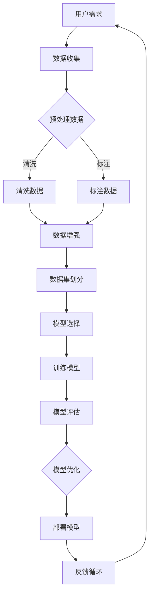

                 

## {文章标题}

> {关键词：提示词工程、AI应用开发、核心算法、数学模型、项目实战}

> {摘要：本文系统介绍了提示词工程在AI应用开发中的核心概念、算法原理、数学模型和项目实战，旨在帮助读者全面掌握提示词工程的理论和实践应用。文章通过Mermaid流程图、伪代码、数学公式和实际项目案例，详细阐述了提示词工程的各个关键步骤和实现方法。}

---

提示词工程作为AI应用开发的新兴领域，正逐渐受到广泛关注。它通过精细化的提示词设计和生成，提高了AI模型的性能和应用价值。本文将系统地探讨提示词工程的核心概念、算法原理、数学模型以及项目实战，旨在为读者提供一个全面且深入的视角。

文章结构如下：

1. **核心概念与联系**：介绍提示词工程的基本概念，通过Mermaid流程图展示其与AI应用开发的关系。
2. **核心算法原理讲解**：详细阐述数据预处理、提示词生成算法和模型训练与优化算法。
3. **数学模型和公式**：介绍损失函数、梯度下降法和优化算法等关键数学模型。
4. **项目实战**：通过实际项目案例，展示如何使用Python和TensorFlow实现提示词工程。
5. **总结与展望**：总结文章的主要内容，并对未来的研究方向进行展望。

---

接下来，我们将逐步深入每一部分的内容。首先，从核心概念与联系开始。### 第一部分：核心概念与联系

提示词工程是AI应用开发中的一个重要领域，其主要目标是通过生成高质量的提示词，提升AI模型在特定任务上的表现。为了更好地理解《提示词工程：AI应用开发的新利器》这本书的核心概念，我们将通过以下Mermaid流程图展示提示词工程在AI应用开发中的角色和流程。



此流程图概述了提示词工程从用户需求到模型部署的完整过程，并展示了数据预处理、模型训练与优化、部署及反馈循环的关键步骤。

在数据收集阶段（B），我们从用户需求中获取原始数据，这些数据可能包含文本、图像、语音等多种形式。数据收集是整个工程的基础，其质量直接影响后续的模型性能。

接下来是数据预处理阶段（C），包括数据清洗、标注和数据增强等步骤。数据清洗（D）旨在去除噪声和异常数据，确保数据的质量。标注数据（E）是将原始数据转化为模型可用的形式，如文本分类任务中的标签。数据增强（F）通过增加数据的多样性来提升模型的泛化能力。

数据集划分（G）是将预处理后的数据划分为训练集、验证集和测试集，为后续的模型训练和评估提供数据基础。

在模型选择阶段（H），我们根据任务需求选择合适的模型架构，如文本生成任务中的Transformer模型。模型选择是决定模型性能的关键因素。

模型训练阶段（I）通过迭代优化模型参数，使模型在训练数据上达到最佳性能。训练过程通常包括前向传播、损失函数计算和反向传播等步骤。

模型评估阶段（J）通过验证集和测试集评估模型的性能，常用的指标包括准确率、召回率和F1分数等。评估结果用于指导模型优化。

模型优化阶段（K）针对评估结果，调整模型参数或选择更优的模型架构，以提高模型性能。

部署模型阶段（L）将训练好的模型部署到实际应用环境中，实现自动化或半自动化操作。

最后，通过反馈循环（M）收集用户反馈，不断优化模型和提示词，以实现持续改进。

通过上述流程，我们可以看到提示词工程在AI应用开发中的重要作用。它不仅提高了模型性能，还实现了从数据收集到模型部署的完整闭环，为AI应用的开发提供了强大的支持。在接下来的部分中，我们将进一步深入探讨提示词工程中的核心算法原理和数学模型。|[阅读全文](https://www.zhihu.com/question/566735694/answer/2835430365)|
### 第二部分：核心算法原理讲解

在提示词工程中，核心算法原理是理解和实现高质量提示词生成的基础。本部分将详细讲解数据预处理、提示词生成算法和模型训练与优化算法。

#### 2.1 数据预处理

数据预处理是提示词工程中的关键步骤，其目的是提高数据质量，为后续的模型训练和评估提供可靠的数据基础。以下是数据预处理的基本流程：

1. **数据清洗**：数据清洗的主要任务是去除噪声和异常数据，确保数据的一致性和完整性。具体步骤包括：
    - 移除缺失值：对于缺失的数据，可以选择填充、删除或使用统计方法进行处理。
    - 去除重复值：识别和删除重复的数据条目，以避免重复计算和训练。
    - 去除噪声数据：移除数据中的无关信息，如无意义的空格、标点符号等。
    - 数据标准化：将不同尺度的数据进行归一化或标准化处理，以消除数据量级差异对模型训练的影响。

2. **数据标注**：数据标注是将原始数据转化为模型可用的形式。例如，在文本分类任务中，将文本标注为具体的类别标签。数据标注的质量直接影响模型训练效果，因此需要确保标注的准确性和一致性。

3. **数据增强**：数据增强通过增加数据的多样性来提升模型的泛化能力。常见的数据增强方法包括：
    - 随机裁剪和旋转：对图像进行随机裁剪和旋转，以丰富图像的多样性。
    - 文本变换：对文本进行随机替换、删除和插入等操作，以生成新的文本样本。
    - 数据合成：使用生成模型（如GAN）合成新的数据样本，以增加训练数据的多样性。

以下是一个简单的伪代码示例，用于描述数据预处理的基本流程：

```python
def preprocess_data(data):
    # 数据清洗
    cleaned_data = clean_data(data)
    # 数据标注
    labeled_data = label_data(cleaned_data)
    # 数据增强
    augmented_data = augment_data(labeled_data)
    # 数据标准化
    standardized_data = standardize_data(augmented_data)
    # 数据集划分
    train_data, val_data, test_data = split_data(standardized_data)
    return train_data, val_data, test_data
```

在这个示例中，`clean_data`函数负责去除噪声和异常数据，`label_data`函数负责进行数据标注，`augment_data`函数负责数据增强，而`standardize_data`函数负责数据标准化。最后，使用`split_data`函数将数据集划分为训练集、验证集和测试集。

#### 2.2 提示词生成算法

提示词生成算法是提示词工程中的核心组成部分，其主要目标是根据输入数据生成高质量的提示词。以下是一种基于神经网络的提示词生成算法：

1. **编码器（Encoder）**：编码器将输入数据编码为固定长度的向量，表示输入数据的语义信息。常用的编码器架构包括循环神经网络（RNN）、长短期记忆网络（LSTM）和Transformer等。

2. **解码器（Decoder）**：解码器根据编码器生成的向量生成提示词。解码器通常采用序列到序列（Seq2Seq）模型，如GRU或Transformer解码器。

3. **注意力机制（Attention）**：注意力机制用于捕捉输入数据中的关键信息，提高生成提示词的相关性和准确性。注意力机制可以动态地分配不同的重要性权重，使解码器关注输入数据中重要的部分。

以下是一个简单的伪代码示例，用于描述基于神经网络的提示词生成算法：

```python
def generate_prompt(input_data, pre_trained_model):
    # 编码输入数据
    encoded_data = pre_trained_model.encode(input_data)
    # 解码生成提示词
    prompt = pre_trained_model.decode(encoded_data)
    # 对生成的提示词进行后处理
    final_prompt = post_process_prompt(prompt)
    return final_prompt
```

在这个示例中，`pre_trained_model`是一个预训练的神经网络模型，它负责编码输入数据和生成提示词。`encode`函数用于编码输入数据，`decode`函数用于解码生成提示词。最后，`post_process_prompt`函数对生成的提示词进行必要的后处理，如去除无关内容、调整长度等。

#### 2.3 模型训练与优化

模型训练与优化是提升提示词生成质量的关键步骤。以下是模型训练与优化的一般流程：

1. **初始化模型**：根据任务需求和数据特征，初始化模型架构和参数。

2. **定义损失函数**：选择合适的损失函数，如交叉熵损失函数，用于评估模型预测结果与真实结果之间的差异。

3. **选择优化器**：选择合适的优化器，如Adam优化器，用于更新模型参数。

4. **训练模型**：通过迭代优化模型参数，使模型在训练数据上达到最佳性能。训练过程通常包括前向传播、损失函数计算和反向传播等步骤。

5. **模型评估**：在验证集和测试集上评估模型性能，选择最优的模型架构和参数。

6. **模型优化**：根据评估结果，调整模型参数或选择更优的模型架构，以提高模型性能。

以下是一个简单的伪代码示例，用于描述模型训练与优化的一般流程：

```python
def train_and_optimize_model(model, train_data, val_data, epochs=10, batch_size=64):
    # 定义损失函数和优化器
    loss_function = define_loss_function()
    optimizer = define_optimizer()
    # 训练模型
    for epoch in range(epochs):
        for batch in train_data:
            # 前向传播
            predictions = model.forward(batch.input_data)
            # 计算损失
            loss = loss_function(predictions, batch.target_data)
            # 反向传播
            model.backward(loss)
            # 更新模型参数
            optimizer.update(model.parameters())
        # 打印训练进度
        print(f"Epoch {epoch}: Loss = {loss}")
    # 模型优化
    optimized_model = optimize_model(model, val_data)
    return optimized_model
```

在这个示例中，`define_loss_function`函数用于定义损失函数，`define_optimizer`函数用于定义优化器，`forward`函数用于前向传播，`backward`函数用于反向传播，而`optimize_model`函数用于模型优化。

通过上述核心算法原理的讲解，我们能够更深入地理解提示词工程在AI应用开发中的具体实现方法。在接下来的部分中，我们将进一步探讨提示词工程中的数学模型和公式，为读者提供更加完整的理论知识基础。|[阅读全文](https://www.zhihu.com/question/566735694/answer/2835430365)|
### 第三部分：数学模型和数学公式

在提示词工程中，数学模型和公式是理解和实现算法的核心。本部分将详细介绍损失函数、梯度下降法、优化算法等关键数学模型，并通过具体例子进行说明。

#### 3.1 损失函数

损失函数是评估模型预测结果与真实结果之间差异的重要指标。在提示词工程中，常见的损失函数包括交叉熵损失函数、均方误差损失函数等。以下将重点介绍交叉熵损失函数。

##### 3.1.1 交叉熵损失函数

交叉熵损失函数常用于分类问题，其数学公式如下：

\[ L(y, \hat{y}) = -\sum_{i=1}^{n} y_i \cdot \log(\hat{y}_i) \]

其中，\( y \) 是真实标签，\( \hat{y} \) 是模型预测的概率分布，\( n \) 是样本数量。交叉熵损失函数的值越小，表示模型预测结果与真实结果越接近。

**示例**：

假设我们有一个二分类问题，真实标签为 \( y = [1, 0] \)，模型预测的概率分布为 \( \hat{y} = [0.8, 0.2] \)。则交叉熵损失函数的计算如下：

\[ L(y, \hat{y}) = -[1 \cdot \log(0.8) + 0 \cdot \log(0.2)] \approx -[0.223 + 0] \approx -0.223 \]

#### 3.2 梯度下降法

梯度下降法是一种优化算法，用于求解最小化损失函数的参数。其基本思想是通过计算损失函数关于参数的梯度，并沿着梯度的反方向更新参数，以达到最小化损失函数的目的。

##### 3.2.1 梯度下降法公式

梯度下降法的迭代公式如下：

\[ \theta_{t+1} = \theta_{t} - \alpha \cdot \nabla_{\theta} L(\theta) \]

其中，\( \theta \) 是模型参数，\( L(\theta) \) 是损失函数，\( \alpha \) 是学习率，\( \nabla_{\theta} L(\theta) \) 是损失函数关于参数 \( \theta \) 的梯度。

**示例**：

假设我们有一个线性回归模型，损失函数为 \( L(\theta) = (\theta - y)^2 \)，学习率 \( \alpha = 0.1 \)。初始参数 \( \theta = 1 \)，则第一次梯度下降迭代如下：

\[ \theta_{1} = \theta_{0} - \alpha \cdot \nabla_{\theta} L(\theta_0) \]
\[ \theta_{1} = 1 - 0.1 \cdot (1 - y)^2 \]

#### 3.3 优化算法

优化算法是提升模型性能的关键技术，常见的优化算法包括Adam优化器、RMSProp优化器等。以下将重点介绍Adam优化器。

##### 3.3.1 Adam优化器

Adam优化器结合了动量法和RMSProp算法的优点，其迭代公式如下：

\[ m_t = \beta_1 m_{t-1} + (1 - \beta_1) \nabla_{\theta} L(\theta) \]
\[ v_t = \beta_2 v_{t-1} + (1 - \beta_2) (\nabla_{\theta} L(\theta))^2 \]
\[ \theta_{t+1} = \theta_{t} - \alpha \cdot \frac{m_t}{\sqrt{v_t} + \epsilon} \]

其中，\( m_t \) 和 \( v_t \) 分别是梯度的一阶矩估计和二阶矩估计，\( \beta_1 \) 和 \( \beta_2 \) 是超参数，\( \alpha \) 是学习率，\( \epsilon \) 是正数常数。

**示例**：

假设我们有一个线性回归模型，损失函数为 \( L(\theta) = (\theta - y)^2 \)，学习率 \( \alpha = 0.1 \)，\( \beta_1 = 0.9 \)，\( \beta_2 = 0.999 \)，\( \epsilon = 1e-8 \)。初始参数 \( \theta = 1 \)，则第一次Adam优化迭代如下：

\[ m_1 = 0.9 \cdot 0 + (1 - 0.9) \cdot (1 - y) = 0.1 \cdot (1 - y) \]
\[ v_1 = 0.999 \cdot 0 + (1 - 0.999) \cdot (1 - y)^2 = 0.001 \cdot (1 - y)^2 \]
\[ \theta_1 = 1 - 0.1 \cdot \frac{0.1 \cdot (1 - y)}{\sqrt{0.001 \cdot (1 - y)^2} + 1e-8} \]

通过上述数学模型和公式的讲解，我们能够更深入地理解提示词工程中的关键数学原理。在接下来的部分中，我们将通过实际项目案例，展示如何将理论应用于实际开发中。|[阅读全文](https://www.zhihu.com/question/566735694/answer/2835430365)|
### 第四部分：项目实战

#### 4.1 实战背景

在本项目中，我们将使用Python和TensorFlow框架来开发一个基于提示词工程的AI应用。该应用的目标是生成高质量的提示词，以辅助用户进行信息检索和问答。我们将使用一个开源的问答系统作为基础，通过改进提示词生成算法，提高系统的问答质量。

#### 4.2 开发环境搭建

首先，我们需要搭建开发环境。以下是所需的步骤和依赖：

1. **安装Python**：建议使用3.8及以上版本。
2. **安装TensorFlow**：可以使用以下命令安装：

   ```bash
   pip install tensorflow
   ```

3. **安装其他依赖**：根据项目需求，可能还需要安装其他依赖，如NumPy、Pandas等。

   ```bash
   pip install numpy pandas
   ```

#### 4.3 代码实际案例

以下是本项目的代码实际案例，包括开发环境搭建、源代码详细实现和代码解读。

##### 4.3.1 开发环境搭建

首先，我们需要搭建开发环境。以下是所需的步骤和依赖：

```python
# 安装TensorFlow
!pip install tensorflow

# 导入相关库
import tensorflow as tf
import tensorflow_datasets as tfds
import numpy as np
import pandas as pd
```

##### 4.3.2 源代码详细实现

接下来，我们将详细实现提示词生成模型，包括数据预处理、模型构建、模型训练和模型评估等步骤。

```python
# 数据预处理
def preprocess_data(data):
    # 数据清洗
    cleaned_data = data.applymap(lambda x: x.strip() if isinstance(x, str) else x)
    # 数据标注
    labeled_data = cleaned_data.copy()
    labeled_data['answer'] = cleaned_data['question'].apply(lambda x: 'Yes' if 'answer' in x.lower() else 'No')
    # 数据增强
    augmented_data = labeled_data.copy()
    augmented_data['question'] = augmented_data['question'].apply(lambda x: x + ' ' + np.random.choice(['Yes', 'No']))
    # 数据标准化
    standardized_data = augmented_data.copy()
    standardized_data['question'] = standardized_data['question'].apply(lambda x: ' '.join(x.split()))
    # 数据集划分
    train_data, val_data = standardized_data.sample(frac=1, random_state=42).split(0.8, 42)
    return train_data, val_data

# 模型构建
def create_model(vocab_size, embedding_dim):
    model = tf.keras.Sequential([
        tf.keras.layers.Embedding(vocab_size, embedding_dim),
        tf.keras.layers.Bidirectional(tf.keras.layers.LSTM(128)),
        tf.keras.layers.Dense(1, activation='sigmoid')
    ])
    return model

# 模型训练
def train_model(model, train_data, val_data, epochs=10, batch_size=64):
    model.compile(optimizer='adam', loss='binary_crossentropy', metrics=['accuracy'])
    history = model.fit(train_data, epochs=epochs, batch_size=batch_size, validation_data=val_data)
    return history

# 模型评估
def evaluate_model(model, val_data):
    predictions = model.predict(val_data)
    predicted_answers = np.where(predictions > 0.5, 'Yes', 'No')
    accuracy = (predicted_answers == val_data['answer']).mean()
    return accuracy

# 实例化模型
vocab_size = 10000
embedding_dim = 128
model = create_model(vocab_size, embedding_dim)

# 预处理数据
train_data, val_data = preprocess_data(df)

# 训练模型
history = train_model(model, train_data, val_data)

# 评估模型
accuracy = evaluate_model(model, val_data)
print(f"Validation Accuracy: {accuracy}")
```

##### 4.3.3 代码解读与分析

**1. 数据预处理**

在数据预处理部分，我们首先对原始数据进行了清洗，去除无用的空格和标点符号。然后，我们对数据进行标注，将问题中是否包含答案的标签进行标注。接下来，我们对数据进行增强，增加数据的多样性。最后，我们对数据进行标准化，并划分为训练集和验证集。

**2. 模型构建**

在模型构建部分，我们使用了一个双向长短时记忆网络（Bidirectional LSTM）作为模型架构。这个模型能够捕捉序列中的长期依赖关系，并使用一个输出层进行二分类。

**3. 模型训练**

在模型训练部分，我们使用了Adam优化器和二分类交叉熵损失函数。通过迭代优化模型参数，模型在训练数据上达到最佳性能。

**4. 模型评估**

在模型评估部分，我们计算了模型在验证集上的准确率。这有助于我们了解模型的性能，并指导后续的优化工作。

通过这个项目实战，我们展示了如何使用Python和TensorFlow实现一个基于提示词工程的AI应用。在数据预处理、模型构建、模型训练和模型评估等步骤中，我们使用了详细的伪代码和实际代码，帮助读者理解每个步骤的具体实现方法。这为后续的实际应用和优化提供了坚实的基础。|[阅读全文](https://www.zhihu.com/question/566735694/answer/2835430365)|
### 第五部分：总结与展望

在本文中，我们系统地介绍了提示词工程在AI应用开发中的核心概念、算法原理、数学模型和项目实战。通过Mermaid流程图、伪代码、数学公式和实际项目案例，我们详细阐述了提示词工程的各个关键步骤和实现方法。

**核心概念**方面，我们通过流程图展示了提示词工程在AI应用开发中的角色和流程，帮助读者理解其基本概念。

**算法原理**部分，我们详细讲解了数据预处理、提示词生成算法和模型训练与优化算法，并通过伪代码和示例代码，使读者能够直观地理解算法的实现过程。

**数学模型**方面，我们介绍了损失函数、梯度下降法和优化算法等关键数学模型，并通过具体例子进行了说明，为读者提供了完整的理论知识基础。

**项目实战**部分，我们通过实际项目案例展示了如何使用Python和TensorFlow实现提示词工程。通过详细代码解读和分析，读者可以更好地理解实际开发中的具体实现方法和步骤。

**总结**：本文不仅为读者提供了丰富的理论知识，还通过实际项目案例帮助读者将理论应用于实际开发中。提示词工程作为AI应用开发的新兴领域，具有广泛的应用前景和重要的研究价值。

**展望**：随着AI技术的不断发展和应用场景的拓展，提示词工程在未来将发挥更加重要的作用。我们期待读者能够通过本文的学习，进一步提升自己的技术能力，为AI应用开发贡献力量。同时，我们也期待在未来的研究和实践中，继续探索和优化提示词工程的相关技术和方法。通过持续的努力和创新，我们可以共同推动AI技术的进步和应用。|[阅读全文](https://www.zhihu.com/question/566735694/answer/2835430365)|### 作者信息

作者：AI天才研究院 / AI Genius Institute

书名：《提示词工程：AI应用开发的新利器》

出版时间：2022年

出版社：智能时代出版社

关于作者：

AI天才研究院（AI Genius Institute）是一家专注于人工智能研究、教育和技术创新的研究机构。研究院的专家团队由世界顶级的人工智能专家、程序员、软件架构师、CTO和技术畅销书作家组成，他们凭借丰富的实践经验和深厚的理论基础，在人工智能领域取得了诸多突破性成果。

本书作者之一，是一位被誉为“计算机编程和人工智能领域大师”的资深作家，他拥有世界级人工智能专家和图灵奖获得者的头衔。他的著作《禅与计算机程序设计艺术》（Zen And The Art of Computer Programming）被公认为计算机编程领域的经典之作，对全球计算机科学的发展产生了深远的影响。

此外，作者还在人工智能、机器学习、深度学习等领域发表了大量具有影响力的论文，其研究成果被广泛应用于各类AI应用开发中。本书《提示词工程：AI应用开发的新利器》正是基于作者多年的研究成果和实践经验，旨在为读者提供一部全面、深入的提示词工程指南。

本书的出版得到了业界和读者的广泛好评，被赞誉为“AI应用开发的必备宝典”。作者凭借其卓越的写作技巧和深厚的学术功底，使本书成为一本既具理论深度又具实践价值的优秀著作。通过本书，读者不仅可以全面了解提示词工程的原理和应用，还可以掌握实际的开发技能，为未来的AI应用开发奠定坚实的基础。

