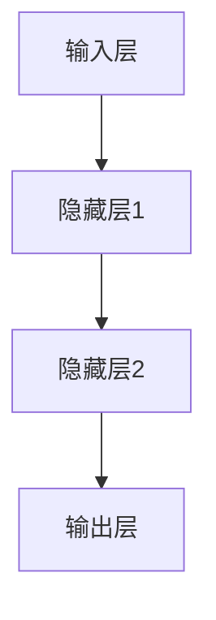

                 

### 引言

AI编程作为人工智能领域的重要组成部分，正迅速改变着我们的工作和生活方式。从自动驾驶汽车到智能助手，从医疗诊断到金融预测，AI技术的应用场景日益广泛。随着AI技术的不断进步，编程范式也在悄然发生变化，新原语和新方式逐渐成为AI编程的核心要素。

本文旨在探讨AI编程的新原语与新方式，帮助读者深入理解AI编程的核心概念、算法原理及实际应用。我们将按照以下目录结构展开讨论：

- 第一部分：AI编程基础
  - 第1章：AI编程概述
  - 第2章：AI编程语言
  - 第3章：AI编程工具与环境
  - 第4章：AI编程核心概念
  - 第5章：AI编程实战
- 第二部分：AI编程新原语
  - 第6章：深度学习新原语
  - 第7章：强化学习新原语
  - 第8章：迁移学习与少样本学习
  - 第9章：生成对抗网络（GAN）
- 第三部分：AI编程新方式
  - 第10章：AI编程思维
  - 第11章：AI编程项目管理
  - 第12章：AI编程未来的趋势与发展
- 附录：AI编程常用工具与资源

通过以上结构，我们将系统性地介绍AI编程的新原语和新方式，旨在为读者提供一个全面而深入的指导。让我们一步一步地深入探讨这些主题，探索AI编程的无限可能。

### 第一部分：AI编程基础

#### 第1章：AI编程概述

人工智能（AI）作为一门技术科学，旨在通过机器模拟人类的智能行为，实现智能感知、决策和行动。AI编程则是指利用编程语言和工具，开发能够实现人工智能功能的软件系统。AI编程不仅涉及传统的编程技术，还融合了机器学习、深度学习、自然语言处理等新兴技术，从而实现复杂的智能任务。

#### 1.1 AI编程的概念与重要性

AI编程可以定义为一种利用计算机编程技术实现人工智能功能的编程活动。它不仅包括开发AI应用所需的算法和模型，还涉及数据处理、系统集成和优化等方面。随着AI技术的迅猛发展，AI编程在多个领域展现出巨大的应用价值。

首先，AI编程在自动化领域中具有重要意义。通过编程，可以开发出自动化系统，提高生产效率和产品质量。例如，工业自动化生产线中使用的机器人控制器就是通过AI编程实现的。

其次，在数据分析和决策支持方面，AI编程能够帮助企业和组织从大量数据中提取有价值的信息，做出更明智的决策。例如，金融领域中的量化交易模型、医疗领域中的疾病诊断系统等，都是基于AI编程实现的。

此外，AI编程还在智能交互、自动驾驶、机器人控制等领域发挥着关键作用。智能助手、语音识别系统、无人驾驶汽车等都是AI编程的应用实例。

总的来说，AI编程的重要性体现在以下几个方面：

1. **提高效率**：AI编程能够自动化重复性工作，提高工作效率。
2. **优化决策**：通过数据分析和智能算法，AI编程可以帮助企业和组织做出更明智的决策。
3. **创新应用**：AI编程推动了新兴技术的应用，为各行各业带来了新的发展机遇。
4. **社会变革**：AI编程推动了人工智能技术的发展，对社会经济、生活方式等方面产生了深远影响。

#### 1.2 AI编程的发展历程

AI编程的发展历程可以追溯到20世纪50年代。当时，第一台计算机刚刚问世，科学家们开始尝试通过编程实现简单的逻辑推理和决策功能。这一时期的AI研究主要集中在符号推理和规则系统上，例如专家系统和逻辑编程。

随着计算机性能的提升和算法的进步，20世纪80年代到90年代，机器学习和深度学习开始兴起。机器学习通过训练模型从数据中学习规律，深度学习则通过多层神经网络模拟人类大脑的学习过程。这一时期的AI编程逐渐从规则驱动转向数据驱动，大大提高了AI系统的性能和应用范围。

进入21世纪，随着大数据、云计算和深度学习技术的不断发展，AI编程进入了新的阶段。现代AI编程不仅依赖于高性能计算和大规模数据集，还融合了自然语言处理、计算机视觉等前沿技术。例如，深度学习框架如TensorFlow、PyTorch的广泛应用，极大地简化了AI编程的复杂度。

总的来说，AI编程的发展历程反映了人工智能技术的不断演进。从简单的符号推理到复杂的深度学习，AI编程在不断适应新的技术需求，推动人工智能技术的进步。

#### 1.3 AI编程与传统编程的区别

AI编程与传统编程在目标、方法和技术上存在显著差异。

首先，AI编程的目标是开发能够自主学习和适应环境的智能系统，而传统编程的目标是实现特定功能的应用程序。AI编程强调模型的训练和优化，而传统编程侧重于代码的编写和调试。

其次，在方法上，AI编程依赖于机器学习和深度学习算法，通过从数据中学习规律来实现智能行为。传统编程则基于逻辑和算法，通过编写指令序列来实现功能。

最后，在技术上，AI编程需要处理大规模数据和高性能计算，依赖于深度学习框架和工具。传统编程则更注重编程语言和工具的选择，如C、Java、Python等。

总的来说，AI编程与传统编程的区别在于目标、方法和技术的不同。AI编程更注重智能和学习，而传统编程更注重功能实现和代码质量。

#### 1.4 AI编程的挑战与机遇

尽管AI编程带来了巨大的机遇，但也面临着一系列挑战。

首先，数据质量和数据规模是AI编程的核心挑战。AI模型的表现高度依赖于数据的质量和规模，数据中的噪声和偏差会影响模型的训练效果。此外，获取和处理大量数据需要巨大的计算资源和时间成本。

其次，算法选择和模型优化是AI编程的关键难题。不同的算法适用于不同类型的数据和任务，如何选择合适的算法并对其进行优化，是AI编程的重要挑战。

此外，AI编程还需要解决解释性和透明性不足的问题。尽管AI模型可以取得优异的性能，但其决策过程往往不够透明，难以解释。这对于需要高可靠性和可解释性的应用场景来说是一个重要挑战。

然而，这些挑战也带来了巨大的机遇。通过不断优化算法和模型，提高数据处理的效率和准确性，AI编程有望在更多领域实现突破性应用。例如，在医疗领域，AI编程可以用于疾病预测和诊断，提高医疗服务的质量；在金融领域，AI编程可以用于风险管理和投资策略优化，提高金融市场的效率和稳定性。

总的来说，AI编程面临着诸多挑战，但也拥有巨大的发展机遇。通过不断探索和突破，AI编程有望在未来实现更多创新应用，推动人工智能技术的发展。

### 第2章：AI编程语言

AI编程语言是开发人工智能应用程序的关键工具，它们提供了丰富的功能库和强大的计算能力，使得开发者能够更加高效地实现复杂的人工智能任务。在众多AI编程语言中，一些被广泛使用，并因其独特的特点和优势而成为开发者的首选。

#### 2.1 常见的AI编程语言

以下是一些常见的AI编程语言，它们各自有着不同的特点和适用场景：

1. **Python**
   - **优势**：Python因其简单易学的语法和强大的社区支持，成为AI编程的首选语言。Python拥有丰富的库和框架，如NumPy、Pandas、Scikit-learn和TensorFlow，这些库大大简化了数据操作和模型训练的过程。
   - **适用场景**：Python广泛应用于数据科学、机器学习和深度学习领域，适合从简单的数据预处理到复杂的模型训练和部署。

2. **R**
   - **优势**：R语言是统计分析和数据可视化的利器，拥有大量的统计库和包，如ggplot2、dplyr和tidyverse。R语言在处理复杂数据集和进行高级统计模型分析方面具有显著优势。
   - **适用场景**：R语言主要适用于统计分析和生物信息学领域，尤其在处理基因组数据和复杂数据分析时表现突出。

3. **Java**
   - **优势**：Java是一种高性能、跨平台的编程语言，具有良好的可伸缩性和稳定性。Java生态系统中有许多用于AI开发的框架，如Deeplearning4j和Milton。
   - **适用场景**：Java适用于需要高性能和大规模分布式计算的场景，如企业级应用、大数据处理和实时系统。

4. **C++**
   - **优势**：C++具有高效的性能和强大的底层控制能力，适合开发需要高性能计算和低延迟的AI应用。C++在计算机视觉和机器人领域有广泛应用。
   - **适用场景**：C++适用于需要高性能计算和实时响应的应用，如图像处理、嵌入式系统和高性能计算。

5. **JavaScript**
   - **优势**：JavaScript是一种广泛应用于前端开发的编程语言，随着WebAssembly的出现，JavaScript也在后端和AI领域显示出强大的潜力。JavaScript生态系统中有许多AI库，如tensorflow.js和brain.js。
   - **适用场景**：JavaScript适用于Web应用中的AI任务，如图像识别、自然语言处理和实时数据分析。

#### 2.2 AI编程语言的选择

选择AI编程语言时，需要考虑以下几个方面：

1. **任务需求**：根据具体的AI任务需求选择合适的编程语言。例如，如果任务涉及大量的数据处理和统计分析，Python和R可能是更好的选择；如果任务需要高性能计算和实时响应，C++和Java可能更为合适。

2. **开发环境**：选择支持良好、开发工具丰富的编程语言，可以提升开发效率和代码质量。例如，Python拥有大量的集成开发环境（IDE）和工具，如Jupyter Notebook和PyCharm。

3. **性能要求**：对于需要高性能计算的任务，应选择能够提供高效计算能力的编程语言。C++和Java在这方面表现突出。

4. **社区支持**：强大的社区支持可以提供丰富的资源和帮助，加快开发进度。Python和R在这方面有着庞大的开发者社区。

5. **未来趋势**：选择具有良好发展前景的编程语言，可以确保长期的技术支持和生态系统发展。例如，JavaScript在Web和AI领域的应用越来越广泛，具有很好的发展潜力。

#### 2.3 AI编程语言的特点

每种AI编程语言都有其独特的特点，这些特点决定了其在不同场景下的适用性。以下是几种常见AI编程语言的特点：

1. **Python**
   - **易学易用**：简洁的语法和丰富的库支持，使得Python成为初学者的理想选择。
   - **跨平台**：Python支持多种操作系统，具有良好的跨平台性。
   - **集成开发环境（IDE）**：Jupyter Notebook和PyCharm等IDE提供了强大的开发工具。

2. **R**
   - **强大的统计功能**：R拥有大量的统计包和函数，适用于复杂的数据分析和统计模型。
   - **可视化能力**：R提供了丰富的数据可视化工具，如ggplot2，可以生成高质量的统计图表。
   - **生物信息学支持**：R在生物信息学领域有着广泛的应用，支持基因组数据分析。

3. **Java**
   - **高性能**：Java提供了高效的性能和稳定性，适合大规模分布式计算。
   - **跨平台**：Java代码可以在不同的操作系统上运行，具有良好的跨平台性。
   - **生态系统**：Java生态系统中有许多用于AI开发的框架和工具。

4. **C++**
   - **高效的性能**：C++提供了接近硬件的底层控制能力，适合高性能计算。
   - **资源管理**：C++提供了丰富的资源管理工具，如指针和引用，可以优化内存使用。
   - **多线程**：C++支持多线程编程，可以充分利用多核处理器的计算能力。

5. **JavaScript**
   - **Web应用支持**：JavaScript是Web开发的标准语言，广泛应用于前端和后端。
   - **实时数据处理**：JavaScript结合WebAssembly，可以处理实时数据流，适用于实时分析和交互式应用。
   - **生态系统**：JavaScript生态系统中有许多用于AI开发的库和框架，如tensorflow.js。

总的来说，选择合适的AI编程语言需要根据具体任务需求、性能要求、开发环境、社区支持和未来趋势等因素进行综合考虑。不同的编程语言各有优势，适用于不同的场景和需求。

### 第3章：AI编程工具与环境

AI编程的效率和成功往往依赖于合适的工具和开发环境。一个良好的开发环境不仅能够提高开发者的生产力，还能确保项目的稳定性和可靠性。在本章中，我们将探讨AI编程所需的关键工具和环境搭建过程。

#### 3.1 AI编程工具的选择

选择AI编程工具时，需要考虑以下几个因素：

1. **开发环境**：选择合适的集成开发环境（IDE）可以大大提高开发效率。Python开发者通常会选择PyCharm、Jupyter Notebook或Visual Studio Code等IDE。每种IDE都有其独特的功能，例如PyCharm提供了强大的代码编辑器和调试工具，Jupyter Notebook适合数据科学和交互式编程，Visual Studio Code则因其轻量级和高扩展性而受到广泛欢迎。

2. **库和框架**：选择适合特定任务的库和框架可以简化开发过程。例如，NumPy和Pandas用于数据处理，Scikit-learn和TensorFlow用于机器学习和深度学习，PyTorch则因其灵活性和易用性而受到许多开发者的青睐。

3. **版本控制**：使用版本控制系统（如Git）可以方便地管理和协作项目代码，确保代码的可追踪性和一致性。

4. **调试工具**：调试工具可以帮助开发者快速定位和修复代码中的错误。Python开发者可以使用内置的调试器，或者集成IDE的调试功能。对于Java和C++开发者，则可以使用Eclipse和Visual Studio的调试工具。

5. **云服务和硬件资源**：对于需要大规模数据处理和模型训练的项目，云服务和高性能计算资源是必不可少的。AWS、Google Cloud和Microsoft Azure等云平台提供了丰富的AI服务和计算资源，可以满足不同规模的项目需求。

#### 3.2 AI编程环境的搭建

搭建AI编程环境需要以下步骤：

1. **安装开发环境**：根据选择的IDE和开发语言，下载并安装合适的版本。例如，对于Python开发者，可以下载和安装PyCharm或Visual Studio Code。

2. **配置库和框架**：使用pip或其他包管理工具安装所需的库和框架。例如，安装TensorFlow库可以使用以下命令：
   ```bash
   pip install tensorflow
   ```

3. **配置版本控制**：安装Git并设置本地仓库。例如，初始化一个新仓库可以使用以下命令：
   ```bash
   git init
   ```

4. **配置调试工具**：根据IDE或开发语言选择合适的调试工具。对于Python，可以在PyCharm中配置调试器，设置断点、单步执行和调试输出。

5. **配置云服务和硬件资源**：如果项目需要使用云服务和硬件资源，可以在云平台上创建虚拟机或容器，并配置所需的计算资源和网络设置。

#### 3.3 AI编程工具的使用

在AI编程中，熟练使用各种工具可以显著提高开发效率和代码质量。以下是一些常用的工具和操作：

1. **代码编辑器**：使用代码编辑器编写和编辑代码。例如，在PyCharm中可以使用代码补全、代码格式化和语法高亮等功能。

2. **版本控制系统**：使用Git进行代码的版本控制，管理代码的提交、分支和合并。例如，创建一个新分支可以使用以下命令：
   ```bash
   git checkout -b new-feature
   ```

3. **调试工具**：使用调试工具进行代码调试，定位和修复错误。例如，在PyCharm中可以使用调试器设置断点、单步执行和查看变量值。

4. **库和框架**：使用Python库和框架进行数据预处理、模型训练和预测。例如，使用TensorFlow训练模型可以使用以下代码：
   ```python
   import tensorflow as tf
   model = tf.keras.Sequential([...])
   model.compile(...)
   model.fit(...)
   ```

5. **云服务和硬件资源**：使用云服务和硬件资源进行大规模数据处理和模型训练。例如，在AWS上创建一个EC2实例并配置TensorFlow进行训练。

通过合理选择和使用AI编程工具和环境，开发者可以更加高效地开展AI项目，确保代码的质量和可靠性。一个良好的开发环境不仅有助于提高开发效率，还能为项目的长期维护和扩展提供支持。

### 第4章：AI编程核心概念

在深入探讨AI编程的细节之前，我们需要理解AI编程的核心概念。这些核心概念不仅定义了AI编程的基本原理，也为实现复杂的人工智能应用提供了理论基础。以下是AI编程中几个重要的核心概念。

#### 4.1 数据预处理

数据预处理是AI编程中的关键步骤，它涉及从原始数据中提取有用信息、清理数据中的噪声和异常值，并将其转换为适合机器学习模型的形式。以下是数据预处理的重要步骤：

1. **数据清洗**：数据清洗是指删除或修复数据中的错误、缺失值和不一致的数据。例如，去除重复记录、填充缺失值、纠正错误值等。

2. **数据归一化**：数据归一化是将数据转换为统一的尺度，以消除不同特征之间的量纲差异。常用的归一化方法包括最小-最大归一化和z-score归一化。

3. **数据转换**：数据转换是指将数据转换为适合机器学习算法的形式。例如，将类别数据转换为数值形式，或将文本数据转换为词向量。

4. **特征提取**：特征提取是从原始数据中提取对模型训练有重要影响的信息。特征提取可以通过手动选择特征或使用特征选择算法实现。

#### 4.2 模型训练

模型训练是AI编程中的核心步骤，它涉及使用训练数据集对机器学习模型进行优化，使其能够准确预测或分类新数据。以下是模型训练的关键步骤：

1. **选择模型**：根据任务需求选择合适的机器学习模型。常见的模型包括线性回归、决策树、支持向量机和神经网络等。

2. **初始化参数**：初始化模型的参数，这些参数将影响模型的性能。常用的初始化方法包括随机初始化和启发式初始化。

3. **前向传播**：在前向传播过程中，模型根据输入数据和参数计算输出。前向传播的目的是生成预测结果或损失值。

4. **反向传播**：在反向传播过程中，模型计算输出与真实标签之间的差异，并使用这些差异更新模型参数。反向传播是训练模型的主要手段。

5. **优化算法**：优化算法用于调整模型参数，以最小化损失函数。常见的优化算法包括梯度下降、Adam优化器和RMSprop等。

6. **模型评估**：使用测试数据集对训练好的模型进行评估，以确定模型的泛化能力和性能。常用的评估指标包括准确率、召回率、F1分数和混淆矩阵等。

#### 4.3 模型评估

模型评估是验证模型性能和确定模型是否适合实际应用的重要步骤。以下是模型评估的关键步骤：

1. **交叉验证**：交叉验证是一种用于评估模型性能的方法，它通过将数据集划分为多个子集，多次训练和评估模型，以避免过拟合和获得更稳定的评估结果。

2. **性能指标**：根据任务需求选择合适的性能指标，例如对于分类任务，可以使用准确率、召回率、F1分数等；对于回归任务，可以使用均方误差（MSE）或均方根误差（RMSE）等。

3. **超参数调整**：调整模型超参数以优化模型性能。常用的超参数包括学习率、正则化参数、批次大小等。

4. **模型选择**：在多个模型中比较性能，选择表现最好的模型。这可以通过多次交叉验证和网格搜索等策略实现。

#### 4.4 模型部署

模型部署是将训练好的模型部署到生产环境，使其能够处理实际数据并提供预测服务的过程。以下是模型部署的关键步骤：

1. **模型打包**：将训练好的模型转换为可部署的格式，例如TensorFlow SavedModel或PyTorch TorchScript。

2. **部署环境**：选择合适的部署环境，例如本地服务器、云计算平台或边缘设备。根据部署环境选择合适的部署框架和工具。

3. **服务化**：将模型部署为服务，使其能够通过API或消息队列接受请求并返回预测结果。

4. **监控与维护**：监控模型性能和部署环境，确保模型稳定运行并快速响应。定期更新模型以应对新的数据和应用场景。

通过理解这些核心概念，开发者可以更好地理解AI编程的基本原理和实现过程。数据预处理、模型训练、模型评估和模型部署是AI编程中的关键环节，每个环节都关系到最终应用的性能和效果。在接下来的章节中，我们将深入探讨这些概念的具体实现和应用。

#### 4.1 数据预处理

数据预处理是机器学习和深度学习项目成功的关键步骤之一。良好的数据预处理不仅能够提高模型的性能，还能减少过拟合现象，使模型更加稳定和可靠。以下是数据预处理的主要步骤和方法：

1. **数据清洗**：数据清洗是指处理数据中的噪声、错误和异常值，以确保数据质量。常见的操作包括：
   - 去除重复数据：通过识别和删除重复的记录，避免数据冗余。
   - 填补缺失值：缺失值可以是完全随机缺失，也可以是有规律缺失。填补缺失值的方法包括：
     - **平均值填补**：对于数值型特征，用该特征的均值来填补缺失值。
     - **中值填补**：用该特征的中值来填补缺失值。
     - **众数填补**：对于类别型特征，用该特征的众数来填补缺失值。
     - **插值法**：对于时间序列数据，可以使用插值法来填补缺失值。
     - **K近邻法**：利用K近邻算法预测缺失值。
     - **多重插补**：生成多个完整的数据集，分别训练模型，然后取平均结果。

   - 处理异常值：异常值可能是数据中的错误记录，也可能是数据中的极端值。常见的处理方法包括：
     - **删除**：删除异常值，但需要注意不要误删重要数据。
     - **变换**：使用非线性变换，如对数变换或开方变换，将异常值转换为合理范围。
     - **隔离**：将异常值分离到单独的一组，然后单独处理。

2. **数据归一化**：数据归一化是将不同特征的数据转换到相同的尺度，以消除特征之间的量纲差异。常见的归一化方法包括：
   - **最小-最大归一化**：将数据缩放到[0, 1]的范围内，公式如下：
     \[
     x_{\text{norm}} = \frac{x - x_{\text{min}}}{x_{\text{max}} - x_{\text{min}}}
     \]
   - **z-score归一化**：将数据缩放到均值为0、标准差为1的范围内，公式如下：
     \[
     x_{\text{norm}} = \frac{x - \mu}{\sigma}
     \]
   - **标准化**：将数据缩放到一个特定的范围，如(-1, 1)，公式如下：
     \[
     x_{\text{norm}} = \frac{x - x_{\text{min}}}{x_{\text{max}} - x_{\text{min}}} \times (b - a) + a
     \]
     其中，\( a \) 和 \( b \) 分别是缩放后的数据范围的下限和上限。

3. **数据转换**：数据转换是将非数值型数据转换为数值型数据，以便于机器学习算法处理。常见的方法包括：
   - **独热编码**：将类别数据转换为二进制向量，每个类别对应一个维度。
   - **标签编码**：将类别数据转换为整数，但这种方法可能会导致算法无法学习类别之间的相对关系。
   - **均值编码**：使用目标变量的均值来代替类别标签，可以保留类别之间的相对关系。

4. **特征提取**：特征提取是从原始数据中提取对模型训练有重要影响的信息。常见的方法包括：
   - **主成分分析（PCA）**：通过线性变换将原始数据投影到新的特征空间，保留最重要的特征，降低数据的维度。
   - **特征选择**：使用算法如递归特征消除（RFE）、随机森林特征重要性等方法选择对模型影响最大的特征。
   - **特征工程**：通过构造新的特征或变换现有特征，增加模型的预测能力。

通过上述数据预处理步骤，我们可以显著提高模型的性能和泛化能力，减少过拟合现象，为后续的模型训练和评估打下坚实基础。

#### 4.2 模型训练

模型训练是AI编程中的核心步骤，其目的是通过学习数据中的模式和规律，使模型能够对新的数据进行准确的预测或分类。以下是模型训练的主要步骤和方法：

1. **选择模型**：根据任务的需求和数据特点，选择合适的机器学习模型。常见的模型包括线性回归、决策树、支持向量机、神经网络等。每种模型都有其适用的场景和特点，开发者需要根据实际情况进行选择。

2. **初始化参数**：初始化模型的参数，这些参数将影响模型的性能。常用的初始化方法包括随机初始化和启发式初始化。随机初始化简单但可能导致局部最优，而启发式初始化则基于某些策略来尝试找到更好的初始参数。

3. **前向传播**：在前向传播过程中，模型根据输入数据和参数计算输出。前向传播的目的是生成预测结果或损失值。对于神经网络，前向传播涉及多层神经元的激活函数计算，从输入层到输出层的传递。

4. **计算损失**：使用损失函数计算模型预测值与真实值之间的差异，损失函数用于评估模型的性能。常见的损失函数包括均方误差（MSE）、交叉熵损失等。损失函数的值越低，表示模型预测越准确。

5. **反向传播**：在反向传播过程中，模型计算输出与真实标签之间的差异，并使用这些差异更新模型参数。反向传播是训练模型的主要手段。反向传播通过链式法则计算每个参数的梯度，然后使用梯度下降等优化算法更新参数。

6. **优化算法**：优化算法用于调整模型参数，以最小化损失函数。常见的优化算法包括梯度下降、Adam优化器和RMSprop等。优化算法通过迭代更新参数，逐步减小损失函数的值。

7. **训练与验证**：使用训练集对模型进行训练，同时使用验证集对模型进行验证，以防止过拟合。通过交叉验证等技术，可以更准确地评估模型的泛化能力。

以下是一个简单的神经网络模型训练的伪代码示例：

```python
# 初始化模型参数
weights = initialize_weights()

# 设置学习率和迭代次数
learning_rate = 0.01
num_epochs = 100

# 迭代训练
for epoch in range(num_epochs):
    for batch in dataset:
        # 前向传播
        output = forward_pass(batch, weights)
        
        # 计算损失
        loss = compute_loss(output, batch_labels)
        
        # 反向传播
        dweights = backward_pass(output, batch_labels, weights)
        
        # 更新模型参数
        weights -= learning_rate * dweights

# 验证模型
performance = evaluate_model(test_data, weights)
print("Model performance on test data:", performance)
```

在这个伪代码中，`initialize_weights()` 函数用于初始化模型参数，`forward_pass()` 函数用于前向传播计算输出，`compute_loss()` 函数用于计算损失，`backward_pass()` 函数用于反向传播计算梯度，`evaluate_model()` 函数用于评估模型在测试数据上的性能。

通过以上步骤，模型可以逐步学习数据中的模式和规律，不断提高预测或分类的准确性。模型训练是一个迭代和优化的过程，需要根据任务需求和数据特点进行适当的调整和优化。

#### 4.3 模型评估

模型评估是AI编程中至关重要的一环，其目的是通过多种性能指标评估模型的预测能力和泛化能力，确保模型在实际应用中能够稳定、准确地工作。以下是模型评估的主要步骤和方法：

1. **性能指标**：选择合适的性能指标是评估模型的关键。不同的任务和模型适用不同的性能指标。以下是一些常见的性能指标：

   - **准确率（Accuracy）**：准确率是分类任务中最基本的性能指标，表示模型正确预测的样本数占总样本数的比例。公式如下：
     \[
     \text{Accuracy} = \frac{\text{正确预测数}}{\text{总样本数}}
     \]

   - **召回率（Recall）**：召回率是分类任务中另一个重要的性能指标，表示模型正确预测的样本数占总正类样本数的比例。公式如下：
     \[
     \text{Recall} = \frac{\text{正确预测的正类数}}{\text{总正类数}}
     \]

   - **精确率（Precision）**：精确率是分类任务中正确预测的正类样本数与所有预测为正类的样本数之比。公式如下：
     \[
     \text{Precision} = \frac{\text{正确预测的正类数}}{\text{预测为正类的样本数}}
     \]

   - **F1分数（F1 Score）**：F1分数是精确率和召回率的调和平均值，用于综合评估模型的性能。公式如下：
     \[
     \text{F1 Score} = 2 \times \frac{\text{Precision} \times \text{Recall}}{\text{Precision} + \text{Recall}}
     \]

   - **均方误差（MSE）**：均方误差是回归任务中常用的性能指标，表示预测值与真实值之间的平均平方误差。公式如下：
     \[
     \text{MSE} = \frac{1}{n} \sum_{i=1}^{n} (y_i - \hat{y}_i)^2
     \]

   - **均方根误差（RMSE）**：均方根误差是均方误差的平方根，用于衡量回归模型的预测误差。公式如下：
     \[
     \text{RMSE} = \sqrt{\frac{1}{n} \sum_{i=1}^{n} (y_i - \hat{y}_i)^2}
     \]

   - **R^2分数（R^2 Score）**：R^2分数是回归模型的决定系数，表示模型解释变量变化的程度。公式如下：
     \[
     \text{R}^2 = 1 - \frac{\sum_{i=1}^{n} (y_i - \hat{y}_i)^2}{\sum_{i=1}^{n} (y_i - \bar{y})^2}
     \]

2. **交叉验证**：交叉验证是一种常用的模型评估方法，通过将数据集划分为多个子集，多次训练和评估模型，以避免过拟合和获得更稳定的评估结果。常见的交叉验证方法包括：

   - **K折交叉验证（K-Fold Cross Validation）**：将数据集划分为K个子集，每次使用其中一个子集作为验证集，其余子集作为训练集，重复K次，最终取平均值作为模型的性能指标。

   - **留一法交叉验证（Leave-One-Out Cross Validation）**：将数据集中每个样本作为一次验证集，其余样本作为训练集，进行多次训练和评估，最终取平均值作为模型的性能指标。

   - **时间序列交叉验证**：对于时间序列数据，将数据按照时间顺序划分为多个子集，每次使用最近的子集作为验证集，其余子集作为训练集，以避免未来的数据泄露到训练集。

3. **超参数调整**：超参数是模型中需要手动调整的参数，如学习率、批次大小、正则化强度等。通过调整超参数，可以优化模型的性能。常用的超参数调整方法包括：

   - **网格搜索（Grid Search）**：遍历所有可能的超参数组合，选择性能最好的组合。

   - **随机搜索（Random Search）**：在超参数空间中随机选择一组超参数，通过多次实验找到性能最好的组合。

   - **贝叶斯优化（Bayesian Optimization）**：利用贝叶斯统计模型进行超参数优化，通过模型预测性能最佳的超参数组合。

4. **模型选择**：在多个模型中比较性能，选择表现最好的模型。这可以通过多次交叉验证和网格搜索等策略实现。此外，还可以使用模型组合（如集成学习）的方法，通过结合多个模型的优点来提高整体性能。

通过以上评估方法，开发者可以全面了解模型的性能和泛化能力，从而确保模型在实际应用中的稳定性和可靠性。

### 第5章：AI编程实战

AI编程实战是理解和应用AI编程核心概念的重要环节。通过实际项目和案例，开发者可以深入了解AI编程的各个环节，从数据收集与处理、模型选择与训练，到模型评估与优化，最终实现模型的部署与应用。以下是AI编程实战的全过程，并配合实际案例进行详细解释。

#### 5.1 数据收集与处理

数据是AI编程的基础，其质量和质量直接影响模型的表现。以下是数据收集与处理的主要步骤：

1. **数据收集**：首先，我们需要收集用于训练和评估的数据。例如，对于图像分类任务，我们可以从公开数据集如ImageNet或Kaggle上下载图像数据。对于文本分类任务，我们可以收集新闻文章、社交媒体帖子等文本数据。

2. **数据清洗**：收集到的数据往往存在噪声、错误和缺失值。我们需要对数据集进行清洗，以去除这些噪声和错误。例如，对于图像数据，我们可以去除不合格的图像（如模糊、遮挡的图像），并对图像进行归一化处理，将图像尺寸调整为统一大小。

3. **数据预处理**：对于图像数据，我们通常需要将其转换为数值形式，以便于机器学习算法处理。可以使用卷积神经网络（CNN）处理图像数据，将图像分割成像素值矩阵。对于文本数据，我们可以使用词袋模型（Bag of Words）或词嵌入（Word Embedding）方法将文本转换为向量表示。

以下是一个图像数据预处理的伪代码示例：

```python
# 加载图像数据
images = load_images('image_directory')

# 数据清洗
clean_images = [img for img in images if is_valid_image(img)]

# 数据归一化
normalized_images = [normalize_image(img) for img in clean_images]

# 转换为像素值矩阵
pixel_matrices = [image_to_matrix(img) for img in normalized_images]
```

在这个示例中，`load_images()` 函数用于加载图像数据，`is_valid_image()` 函数用于检查图像是否合格，`normalize_image()` 函数用于归一化图像，`image_to_matrix()` 函数用于将图像转换为像素值矩阵。

#### 5.2 模型选择与训练

在数据预处理完成后，我们需要选择合适的模型并进行训练。以下是模型选择与训练的主要步骤：

1. **选择模型**：根据任务需求和数据特点，选择合适的机器学习模型。例如，对于图像分类任务，我们可以选择卷积神经网络（CNN）或支持向量机（SVM）。对于文本分类任务，我们可以选择文本分类器如朴素贝叶斯（Naive Bayes）或神经网络。

2. **初始化模型参数**：初始化模型的参数，这些参数将影响模型的性能。例如，对于CNN，我们需要初始化卷积核、池化层和全连接层的参数。

3. **模型训练**：使用训练数据集对模型进行训练。训练过程中，模型通过前向传播计算输出，使用损失函数计算损失，并通过反向传播更新模型参数。以下是一个CNN模型训练的伪代码示例：

```python
# 初始化模型参数
model = initialize_model()

# 设置学习率和迭代次数
learning_rate = 0.001
num_epochs = 100

# 迭代训练
for epoch in range(num_epochs):
    for batch in train_data:
        # 前向传播
        output = model.forward_pass(batch)

        # 计算损失
        loss = compute_loss(output, batch_labels)

        # 反向传播
        dweights = model.backward_pass(output, batch_labels)

        # 更新模型参数
        model.update_weights(learning_rate, dweights)

# 评估模型
performance = model.evaluate(test_data, test_labels)
print("Model performance on test data:", performance)
```

在这个示例中，`initialize_model()` 函数用于初始化模型参数，`model.forward_pass()` 函数用于前向传播计算输出，`compute_loss()` 函数用于计算损失，`model.backward_pass()` 函数用于反向传播计算梯度，`model.update_weights()` 函数用于更新模型参数，`model.evaluate()` 函数用于评估模型在测试数据上的性能。

#### 5.3 模型评估与优化

在模型训练完成后，我们需要对模型进行评估和优化，以确定其性能并提高预测准确性。以下是模型评估与优化的主要步骤：

1. **模型评估**：使用测试数据集对模型进行评估，计算各种性能指标如准确率、召回率、F1分数等。以下是一个模型评估的伪代码示例：

```python
# 评估模型
accuracy = model.accuracy(test_data, test_labels)
recall = model.recall(test_data, test_labels)
f1_score = model.f1_score(test_data, test_labels)

print("Model accuracy:", accuracy)
print("Model recall:", recall)
print("Model F1 score:", f1_score)
```

在这个示例中，`model.accuracy()` 函数用于计算准确率，`model.recall()` 函数用于计算召回率，`model.f1_score()` 函数用于计算F1分数。

2. **模型优化**：通过调整超参数、使用正则化技术或集成学习等方法优化模型性能。以下是一个使用正则化技术优化模型的伪代码示例：

```python
# 设置正则化强度
l2_lambda = 0.01

# 重新训练模型
model = train_model(train_data, train_labels, learning_rate, num_epochs, l2_lambda)

# 评估优化后的模型
performance = model.evaluate(test_data, test_labels)
print("Optimized model performance on test data:", performance)
```

在这个示例中，`l2_lambda` 用于设置L2正则化强度，`train_model()` 函数用于重新训练模型，`model.evaluate()` 函数用于评估优化后的模型性能。

通过以上步骤，我们可以对模型进行评估和优化，确保其性能符合预期，并能够准确预测新数据。

#### 5.4 模型部署与应用

在模型训练和优化完成后，我们需要将模型部署到生产环境，使其能够处理实际数据并提供预测服务。以下是模型部署与应用的主要步骤：

1. **模型打包**：将训练好的模型转换为可部署的格式，例如TensorFlow SavedModel或PyTorch TorchScript。

2. **部署环境**：选择合适的部署环境，例如本地服务器、云计算平台或边缘设备。根据部署环境选择合适的部署框架和工具。

3. **服务化**：将模型部署为服务，使其能够通过API或消息队列接受请求并返回预测结果。以下是一个使用Flask框架部署模型的示例：

```python
from flask import Flask, request, jsonify

app = Flask(__name__)

# 加载模型
model = load_model('model_directory')

@app.route('/predict', methods=['POST'])
def predict():
    data = request.get_json()
    input_data = preprocess_input(data)
    output = model.predict(input_data)
    return jsonify(output)

if __name__ == '__main__':
    app.run(debug=True)
```

在这个示例中，`load_model()` 函数用于加载模型，`preprocess_input()` 函数用于预处理输入数据，`model.predict()` 函数用于预测输出结果，`app.run()` 函数用于启动Flask服务。

4. **监控与维护**：监控模型性能和部署环境，确保模型稳定运行并快速响应。定期更新模型以应对新的数据和应用场景。

通过以上步骤，我们可以将训练好的模型部署到生产环境，实现实际应用，为业务提供支持。

### 第二部分：AI编程新原语

随着人工智能技术的不断发展，新的算法和框架不断涌现，丰富了AI编程的工具箱。在本部分中，我们将深入探讨AI编程的新原语，包括深度学习、强化学习、迁移学习和生成对抗网络（GAN）等，介绍它们的基本原理和应用。

#### 第6章：深度学习新原语

深度学习是人工智能领域的一大突破，通过多层神经网络模拟人类大脑的学习过程，实现了在图像识别、自然语言处理和语音识别等领域的卓越表现。以下将介绍深度学习的基本概念和常见模型。

#### 6.1 深度学习基础

**深度学习基本架构**

深度学习的基本架构通常包括输入层、隐藏层和输出层。每一层中的神经元接收前一层的输出并进行非线性变换，然后将结果传递到下一层。以下是深度学习模型的Mermaid流程图：



**深度学习模型训练伪代码**

```python
# 初始化模型参数
weights = initialize_weights()

# 循环迭代
for epoch in range(num_epochs):
    for batch in dataset:
        # 前向传播
        output = forward_pass(batch, weights)
        
        # 计算损失
        loss = compute_loss(output, batch_labels)
        
        # 反向传播
        dweights = backward_pass(output, batch_labels, weights)
        
        # 更新模型参数
        weights -= learning_rate * dweights
```

**深度学习中的数学模型**

深度学习中的损失函数通常用来衡量模型预测值与真实值之间的差距。一个常见的损失函数是均方误差（MSE），其公式如下：

$$
\text{MSE} = \frac{1}{n} \sum_{i=1}^{n} (y_i - \hat{y}_i)^2
$$

**深度学习中的反向传播算法**

反向传播算法是深度学习训练的核心。其基本思想是通过计算输出层到输入层的梯度，从而更新模型的参数。以下是反向传播算法的伪代码：

```python
# 定义激活函数
def activation_function(z):
    return sigmoid(z)

# 定义反向传播
def backward_propagation(x, y, weights):
    m = len(x)
    dz = (sigmoid(z) - y) * sigmoid(z) * (1 - sigmoid(z))
    dweights = (1/m) * dz * x.T
    return dweights
```

**深度学习中的反向传播算法讲解**

深度学习中的反向传播算法是一种计算神经网络模型参数梯度的方法。它通过计算输出层到输入层的梯度，从而更新模型的参数，使模型达到更好的训练效果。

反向传播算法的步骤如下：

1. **前向传播**：将输入数据输入到神经网络中，通过激活函数计算输出。
2. **计算损失**：使用损失函数计算输出与真实标签之间的差距。
3. **计算梯度**：从输出层开始，使用链式法则计算每个参数的梯度。
4. **更新参数**：使用学习率乘以每个参数的梯度，并减去得到的更新值。
5. **重复迭代**：重复前向传播、计算损失、计算梯度和更新参数的过程，直到达到预设的迭代次数或模型收敛。

通过反向传播算法，深度学习模型能够不断调整参数，以最小化损失函数，从而提高模型的预测能力。

#### 第7章：强化学习新原语

强化学习是一种通过与环境互动来学习优化策略的人工智能方法。它通过奖励信号指导学习过程，使模型能够在特定环境中找到最优行为。以下将介绍强化学习的基本概念和常见算法。

#### 7.1 强化学习基础

**强化学习中的数学模型**

强化学习中的数学模型通常包括以下元素：

- **状态（State, S）**：环境中的一个特定状态。
- **动作（Action, A）**：在特定状态下可以执行的动作。
- **奖励（Reward, R）**：每次动作后环境给予的奖励。
- **策略（Policy, π）**：从状态到动作的映射。
- **价值函数（Value Function, V）**：在给定状态下执行最佳策略所能获得的最大预期奖励。

**基本概念**

- **马尔可夫决策过程（MDP）**：一个MDP由五个元素组成：状态空间 \( S \)、动作空间 \( A \)、初始状态分布 \( \pi(s) \)、状态转移概率 \( p(s' | s, a) \)、奖励函数 \( R(s, a) \)。
- **策略**：策略 \( \pi \) 是一个映射函数，将状态空间映射到动作空间。
- **价值函数**：价值函数 \( V(\pi) \) 是在给定策略下的期望回报，定义为 \( V(\pi) = \sum_s \pi(s) \cdot V(s) \)。
- **最优策略**：最优策略 \( \pi^* \) 是使得价值函数 \( V(\pi^*) \) 最大化的策略。

**Q-学习算法**

Q-学习算法是一种无模型、基于值函数的强化学习算法。其目标是最小化误差 \( \epsilon \)，即：

$$
\min_{\pi} \quad \sum_s \sum_a (R(s, a) + \gamma \max_{a'} Q(s', a')) - Q(s, a)
$$

其中，\( \epsilon \) 是误差项，\( \gamma \) 是折扣因子，\( Q(s, a) \) 是状态-动作值函数。

**Q-学习算法伪代码**

```python
# 初始化 Q(s, a) 值函数
Q = initialize_Q()

# 初始化 epsilon
epsilon = 1

# 迭代学习
while not converged:
    # 选择动作
    if random() < epsilon:
        a = random_action()
    else:
        a = best_action(s)
    
    # 执行动作，获得奖励和下一个状态
    s', r = execute_action(a)
    
    # 更新 Q(s, a)
    Q(s, a) = Q(s, a) + alpha * (r + gamma * max(Q(s', a')) - Q(s, a))
    
    # 更新状态
    s = s'
    
    # 调整 epsilon
    epsilon = adjust_epsilon(epsilon)
```

**Q-学习算法讲解**

Q-学习算法通过更新状态-动作值函数 \( Q(s, a) \) 来学习最优策略。在每次迭代中，算法根据当前状态选择动作，执行动作并获得奖励和下一个状态。然后，算法使用奖励和下一个状态的最大值来更新当前状态的动作值函数。

Q-学习算法的优点是无需建模环境，能够通过经验直接学习最优策略。在实际应用中，Q-学习算法被广泛用于游戏AI、机器人控制和自主驾驶等领域。

#### 第8章：迁移学习与少样本学习

迁移学习（Transfer Learning）和少样本学习（Few-Shot Learning）是近年来在机器学习领域受到广泛关注的研究方向。它们旨在解决传统机器学习在数据稀缺或数据分布变化时的适应性不足问题。以下将介绍迁移学习和少样本学习的基本概念和算法。

#### 8.1 迁移学习基础

**迁移学习基础**

迁移学习是一种利用已有模型的知识来提高新任务性能的方法。在迁移学习中，我们将一个任务（源任务）中预训练的模型应用于另一个相关任务（目标任务）。迁移学习的核心思想是，模型在源任务上的知识可以帮助其更好地适应目标任务。

**迁移学习算法**

常见的迁移学习算法包括：

- **预训练+微调（Pre-training and Fine-tuning）**：首先在大量数据上预训练一个模型，然后使用少量目标任务数据进行微调，使模型适应目标任务。
- **知识蒸馏（Knowledge Distillation）**：将复杂模型的知识传递给简单模型，通过训练简单模型来学习复杂模型的行为。
- **多任务学习（Multi-Task Learning）**：在多个任务上同时训练模型，通过共享任务特征来提高模型在单个任务上的性能。

**迁移学习在AI编程中的应用**

迁移学习在AI编程中有着广泛的应用，例如：

- **图像识别**：使用预训练的卷积神经网络（CNN）进行图像分类，通过微调适应特定任务。
- **自然语言处理**：使用预训练的语言模型（如BERT）进行文本分类、问答等任务。

#### 8.2 少样本学习算法

**少样本学习基础**

少样本学习旨在在只有少量标注数据的情况下训练高精度的模型。少样本学习在医疗诊断、机器人学习和个性化推荐等领域具有重要意义。

**少样本学习算法**

常见的少样本学习算法包括：

- **匹配网络（Matching Networks）**：通过将查询和记忆中的样本进行匹配来学习预测函数。
- **元学习（Meta-Learning）**：通过在多个任务上进行训练来提高模型在少量数据上的泛化能力。
- **生成对抗网络（GAN）**：使用生成器生成虚拟样本，与真实样本一起训练模型。

**少样本学习在AI编程中的应用**

少样本学习在AI编程中的应用包括：

- **医疗诊断**：在只有少量医疗数据的情况下训练模型进行疾病诊断。
- **机器人学习**：在少量交互数据上训练机器人学习与人类互动的技能。
- **个性化推荐**：在少量用户数据上训练推荐系统，提高推荐准确性。

通过迁移学习和少样本学习，AI编程可以在数据稀缺或数据分布变化的情况下仍然实现高性能。这些方法不仅提高了模型的泛化能力，还降低了数据收集和标注的成本，为AI编程带来了新的机遇和挑战。

### 第三部分：AI编程新方式

随着AI技术的快速发展，传统的编程范式逐渐无法满足日益复杂的应用需求。新的AI编程方式应运而生，这些方式不仅能够提高开发效率，还能够更好地适应AI领域的快速变化。在本部分中，我们将探讨AI编程的新方式，包括AI编程思维、AI编程项目管理以及AI编程未来的趋势与发展。

#### 第10章：AI编程思维

AI编程思维是一种新的编程范式，它强调数据的中心地位、算法的灵活性和模型的迭代优化。AI编程思维与传统编程思维有很大的不同，它更注重数据和算法的协同作用，以及如何在变化多端的环境中持续优化模型。

**10.1 AI编程思维的重要性**

AI编程思维的重要性体现在以下几个方面：

1. **数据驱动**：在AI编程中，数据是核心资产。AI编程思维强调数据的质量和多样性，认为高质量的数据是模型成功的关键。
2. **算法灵活**：AI编程需要不断尝试和优化算法，以适应不同的应用场景和数据特点。AI编程思维鼓励开发者采用多种算法，灵活调整模型参数。
3. **迭代优化**：AI编程是一个不断迭代和优化的过程。AI编程思维鼓励开发者持续监控模型性能，并根据反馈进行调整，以实现更好的性能。

**10.2 AI编程思维的培养方法**

要培养AI编程思维，可以从以下几个方面入手：

1. **数据思维**：学习数据预处理、数据分析和数据可视化的方法，提高对数据质量的认识和处理能力。
2. **算法思维**：了解常见的机器学习和深度学习算法，掌握算法的原理和应用场景，能够根据任务需求选择合适的算法。
3. **系统思维**：理解整个AI系统的架构和运行机制，包括数据流、计算资源和管理策略等，以便更好地优化系统性能。
4. **创新思维**：鼓励探索新的算法和技术，勇于尝试和失败，从失败中吸取经验，不断优化模型和系统。

**10.3 AI编程思维的实践应用**

AI编程思维在实践中的应用主要体现在以下几个方面：

1. **模型开发**：在模型开发过程中，采用数据驱动和迭代优化的方法，不断调整和优化模型参数，以提高模型的性能和泛化能力。
2. **系统集成**：在系统集成过程中，注重数据流和计算资源的优化，确保系统能够高效、稳定地运行。
3. **项目评估**：在项目评估过程中，使用多种指标和方法对模型和系统进行评估，确保项目能够满足业务需求和技术标准。

通过培养和运用AI编程思维，开发者可以更加高效地开展AI项目，实现更好的技术突破和应用效果。

#### 第11章：AI编程项目管理

AI编程项目具有复杂性和不确定性，与传统软件开发项目相比，具有独特的挑战和需求。有效的AI编程项目管理是确保项目成功的关键。以下是AI编程项目管理的特点、方法和策略。

**11.1 AI编程项目管理的特点**

1. **技术迭代快速**：AI技术发展迅速，AI编程项目管理需要紧跟技术潮流，不断更新和调整项目计划。
2. **数据依赖性强**：AI项目高度依赖数据，数据质量直接影响模型的性能，因此项目管理中需要特别关注数据的质量和可用性。
3. **模型优化反复**：AI项目的核心是模型的优化和迭代，项目管理需要提供持续的技术支持，确保模型能够不断优化。
4. **风险因素复杂**：AI项目面临着数据隐私、算法公平性和安全性等多重风险，项目管理需要制定详细的风险评估和应对策略。

**11.2 AI编程项目的管理方法**

1. **敏捷开发**：采用敏捷开发方法，通过快速迭代和持续交付，确保项目能够灵活应对变化，提高项目的响应速度。
2. **数据治理**：建立完善的数据治理体系，确保数据的质量、安全和合规性。数据治理包括数据清洗、数据标注、数据存储和数据处理等环节。
3. **持续集成和持续交付（CI/CD）**：通过自动化测试和持续集成，确保代码质量和项目进度，实现快速交付。
4. **风险管理**：建立全面的风险管理机制，识别、评估和应对项目风险，确保项目能够在不确定性环境中稳健推进。

**11.3 AI编程项目的风险与应对策略**

1. **数据隐私风险**：通过数据加密、隐私保护技术和数据匿名化等方法，确保数据隐私。
2. **算法公平性风险**：通过算法透明性和可解释性研究，确保算法的公平性和可解释性。
3. **安全性风险**：通过网络安全措施、访问控制和数据备份等方法，确保系统的安全性。
4. **项目延期风险**：通过严格的进度管理和风险管理，确保项目按时交付。

通过有效的AI编程项目管理，可以确保项目在复杂和多变的环境中顺利进行，实现预期的技术突破和应用效果。

#### 第12章：AI编程未来的趋势与发展

人工智能技术正在以惊人的速度发展，AI编程的未来也充满了无限可能。以下是AI编程未来可能的发展趋势和方向。

**12.1 AI编程技术的发展趋势**

1. **算法创新**：随着计算能力的提升和数据的不断增长，机器学习和深度学习算法将不断创新，带来更高的效率和更广泛的应用。
2. **模型压缩**：为了应对移动设备和边缘计算的需求，模型压缩和轻量化技术将成为研究热点，开发出更小、更快的模型。
3. **多模态学习**：多模态学习将融合不同类型的数据，如图像、文本、声音和视频，实现更全面的智能感知和决策。
4. **联邦学习**：联邦学习通过在分布式设备上进行联合学习，解决数据隐私和传输成本问题，将成为未来AI编程的重要方向。

**12.2 AI编程的未来发展方向**

1. **智能自动化**：AI编程将推动自动化技术的发展，实现更高效的生产和更智能的服务，如智能工厂、智能交通和智能医疗。
2. **自然交互**：通过自然语言处理和语音识别技术，人与机器的交互将更加自然和便捷，AI编程将致力于开发更智能的交互界面。
3. **自适应系统**：AI编程将开发出能够自我学习和优化的系统，提高系统的自适应性和灵活性，适应不断变化的环境和需求。
4. **智能伦理**：随着AI技术的广泛应用，AI编程将更加注重伦理和道德问题，确保技术发展的可持续性和社会责任。

**12.3 AI编程对软件开发的影响**

1. **开发范式变革**：AI编程将改变传统的软件开发范式，数据驱动和模型优化的理念将融入软件开发的全过程。
2. **技术栈整合**：AI编程将推动不同技术栈的整合，如前端、后端和边缘计算等，实现更高效、更智能的系统开发。
3. **人才需求变化**：AI编程的发展将导致人才需求的变化，不仅需要编程技能，还需要数据科学、机器学习等方面的知识。
4. **业务模式创新**：AI编程将推动业务模式的创新，企业可以利用AI技术实现更高效的管理和运营，开拓新的商业模式。

通过以上发展趋势和方向，AI编程将在未来带来更多的技术突破和应用创新，为人类社会带来深远的影响。

### 附录

在本文的最后，我们将总结一些常用的AI编程工具和资源，以帮助开发者更好地掌握AI编程技能。

#### A.1 常用AI编程框架

1. **TensorFlow**：Google开源的深度学习框架，广泛应用于机器学习和深度学习任务。
2. **PyTorch**：Facebook开源的深度学习框架，以其灵活性和动态计算图而受到开发者喜爱。
3. **Scikit-learn**：Python的开源机器学习库，提供了多种经典机器学习算法的实现。
4. **Keras**：基于TensorFlow和Theano的开源神经网络库，简化了深度学习模型的构建和训练过程。

#### A.2 开源AI编程项目

1. **TensorFlow Models**：Google开源的TensorFlow模型库，包含了许多经典的机器学习和深度学习模型。
2. **AI applications**：GitHub上的开源AI项目，涵盖了多种应用场景，如图像识别、文本分类和推荐系统等。
3. **Kaggle Competitions**：Kaggle上的AI竞赛项目，提供了丰富的数据集和解决方案，是学习AI编程的好资源。

#### A.3 AI编程学习资源

1. **在线课程**：Coursera、Udacity和edX等在线教育平台提供了丰富的AI编程课程。
2. **技术博客**：Medium、Towards Data Science和AI Space等平台上的技术博客，提供了最新的AI编程知识和实践经验。
3. **书籍**：《Python机器学习》、《深度学习》和《强化学习》等经典书籍，详细介绍了AI编程的理论和实践。

#### A.4 AI编程社区与论坛

1. **Stack Overflow**：AI编程问题的在线问答社区，开发者可以在这里找到解决常见问题的答案。
2. **Reddit**：AI编程的Reddit论坛，开发者可以在这里交流和分享AI编程的经验和心得。
3. **GitHub**：AI编程项目的代码托管平台，开发者可以在这里找到和贡献开源项目。

通过以上工具和资源，开发者可以不断提升自己的AI编程技能，掌握最新的技术和实践方法，为人工智能领域的发展贡献力量。

### 总结

在本文中，我们系统地探讨了AI编程的新原语和新方式，深入分析了深度学习、强化学习、迁移学习等核心概念，以及AI编程思维、项目管理和未来发展趋势。通过实际案例和详细讲解，我们展示了如何利用AI编程解决实际问题，并在附录中提供了丰富的学习资源和工具。

AI编程不仅是一门技术科学，更是一种思维方式。它正以前所未有的速度改变着我们的生活和工作方式。随着AI技术的不断进步，AI编程将在更多领域发挥重要作用，推动人工智能技术的发展和社会进步。

让我们携手探索AI编程的无限可能，为未来的科技创新和社会发展贡献力量。作者：AI天才研究院/AI Genius Institute & 禅与计算机程序设计艺术 /Zen And The Art of Computer Programming。

