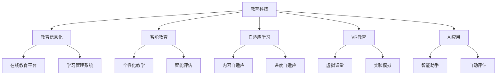

                 

# 教育科技创业：知识传播的新范式

> **关键词：教育科技、创业、知识传播、新范式、人工智能、机器学习、在线教育**

> **摘要：**
本文旨在探讨教育科技创业的新范式，分析其在知识传播中的重要性。文章首先概述了教育科技创业的背景与现状，随后深入解析了核心概念、算法原理、数学模型以及实际创业项目。最后，文章提出了教育科技创业的实操指南，并对未来趋势进行了展望，为教育科技创业者提供全面的理论与实践指导。通过这篇文章，读者可以更好地理解教育科技创业的本质，把握机遇，迎接挑战。

### 第一部分：教育科技创业概述

#### 第1章：教育科技创业背景与现状

**1.1 教育科技的定义与分类**

教育科技（EdTech）是指运用信息技术手段来支持教育过程，提升教育效果的一种教育模式。它涵盖了从学习工具、在线教育平台到教育管理系统的广泛领域。根据应用场景和功能，教育科技可以分为以下几类：

1. **学习工具与资源**：包括电子书、在线课程、学习软件等，旨在提供丰富的学习资源，帮助学生进行自主学习。
2. **在线教育平台**：通过互联网提供远程教育服务，包括课程直播、互动学习、作业与考试等。
3. **教育管理系统**：用于学校、培训机构等管理教育活动的软件，包括学生信息管理、课程管理、成绩管理等功能。
4. **智能教育**：利用人工智能、大数据等技术，实现个性化教学、智能评估等。

**国内外发展趋势**

在国际上，教育科技的发展迅速，特别是在美国、中国和欧洲等地区。根据市场研究公司的数据，全球教育科技市场预计将在未来几年内保持高速增长。

在中国，随着互联网技术的普及和政府的大力支持，教育科技市场迅速发展。根据《中国教育科技发展报告》，2020年中国教育科技市场规模已达到2.9万亿元人民币，同比增长32.6%。

**1.2 教育科技创业的重要性**

教育市场前景分析：全球教育市场规模庞大，且随着在线教育的兴起，市场潜力进一步扩大。根据市场研究，全球在线教育市场预计将在2025年达到3500亿美元。

创业机遇与挑战：教育科技创业面临着巨大的机遇，但也伴随着严峻的挑战。机遇在于技术创新带来的新商业模式和市场需求，挑战则在于市场竞争激烈、用户获取成本高、技术实现难度大等问题。

教育科技对社会的影响：教育科技不仅改变了传统教育模式，还提高了教育效率和质量，有助于实现教育公平，为社会培养更多高素质人才。

**1.3 教育科技创业的模式与案例分析**

在线教育平台：例如网易云课堂、腾讯课堂等，通过提供在线课程、互动教学等功能，吸引了大量用户。

学习工具与资源：如Anki、Quizlet等，通过提供高效的记忆工具和学习资源，帮助学生提高学习效果。

创新教育项目：如Khan Academy、Coursera等，通过开放课程和免费教育，推动全球教育公平。

成功创业案例解析：以Coursera为例，它通过在线教育平台，提供了来自全球顶尖大学的课程，吸引了数百万用户，实现了商业化运营。

**1.4 教育科技创业的关键要素**

市场需求分析：通过市场调研，了解用户需求，确定产品定位和功能。

产品设计与创新：根据市场需求，设计创新的教育产品，提供优质的教学体验。

技术支持与迭代：运用先进技术，确保产品的高性能和稳定性，不断迭代优化。

团队建设与管理：组建专业的团队，确保项目的顺利进行和持续发展。

#### 第2章：教育科技创业核心概念与联系

**2.1 教育科技相关术语与概念**

教育信息化：指利用信息技术手段，提高教育质量和效率的过程。

智能教育：利用人工智能技术，实现个性化教学、智能评估等。

自适应学习：根据学习者的特点，自动调整教学内容和进度，提高学习效果。

虚拟现实（VR）教育：利用虚拟现实技术，创建沉浸式的学习环境。

人工智能（AI）在教育中的应用：包括智能教学助手、自动评估系统等。

**2.2 教育科技创业中核心概念的 Mermaid 流程图**



**2.3 教育科技创业的关键领域与技术**

在线教育平台架构：包括服务器、数据库、前端和后端等，实现课程的发布、学习、互动和评估等功能。

自适应学习算法：基于学生行为数据，自动调整教学内容和进度，提高学习效果。

虚拟现实（VR）教育应用：利用虚拟现实技术，创建沉浸式的学习体验。

人工智能（AI）在个性化学习中的应用：通过AI技术，实现个性化推荐、智能教学和自动评估等功能。

#### 第3章：教育科技创业核心算法原理讲解

**3.1 数据挖掘与机器学习基础**

数据预处理：包括数据清洗、数据转换和数据归一化等，确保数据质量。

特征工程：从原始数据中提取有用的特征，用于模型训练。

常见算法介绍：

- **决策树**：通过划分特征空间，构建决策树模型，实现分类或回归任务。
- **随机森林**：通过构建多棵决策树，结合随机性，提高模型预测能力。
- **支持向量机（SVM）**：通过最大化分类边界，实现分类任务。
- **神经网络与深度学习**：通过多层神经元和复杂的网络结构，实现复杂函数建模。

**3.2 机器学习算法在教育中的应用**

学生行为分析：通过分析学生的学习行为，了解学习效果和学习习惯。

个性化推荐系统：根据学生的兴趣和学习习惯，推荐合适的课程和学习资源。

学习效果评估：通过模型预测和实际学习结果的对比，评估学生的学习效果。

算法选择与优化：根据具体应用场景，选择合适的算法，并不断优化模型性能。

**3.3 教育科技创业中核心算法的伪代码解释**

线性回归：

```python
# 线性回归伪代码

def linear_regression(X, y):
    # X: 特征矩阵，y: 标签向量
    # 求解参数 w = (X^T * X)^(-1) * X^T * y
    w = (X.T @ X).inv() @ X.T @ y
    return w

# 假设 X 为特征矩阵，y 为标签向量
w = linear_regression(X, y)
```

逻辑回归：

```python
# 逻辑回归伪代码

def logistic_regression(X, y):
    # X: 特征矩阵，y: 标签向量
    # 求解参数 w = (X^T * X)^(-1) * X^T * y
    w = (X.T @ X).inv() @ X.T @ y
    return w

# 假设 X 为特征矩阵，y 为标签向量
w = logistic_regression(X, y)
```

K-最近邻算法（K-NN）：

```python
# K-最近邻算法伪代码

def k_nearest_neighbors(X_train, y_train, X_test, k):
    # X_train: 训练集特征矩阵，y_train: 训练集标签向量
    # X_test: 测试集特征矩阵，k: 最近邻数量
    distances = [distance(x_test, x_train) for x_train in X_train]
    nearest = sorted(range(len(distances)), key=lambda i: distances[i])[:k]
    labels = [y_train[i] for i in nearest]
    return majority表决（labels）

# 假设 X_train, y_train 为训练集特征矩阵和标签向量，X_test 为测试集特征矩阵，k 为最近邻数量
y_pred = k_nearest_neighbors(X_train, y_train, X_test, k)
```

神经网络算法实现：

```python
# 神经网络算法伪代码

def neural_network(X, y, layers, activation='sigmoid'):
    # X: 输入特征矩阵，y: 输出标签向量
    # layers: 网络层数和每层神经元数量
    # activation: 激活函数类型
    # 初始化权重和偏置
    W = [np.random.randn(x, y) for x, y in layers[:-1]]
    b = [np.random.randn(y) for y in layers[1:]]
    # 前向传播
    Z, A = [], []
    Z.append(np.dot(W[0], X) + b[0])
    A.append(activation(Z[0]))
    for i in range(1, len(layers) - 1):
        Z.append(np.dot(W[i], A[-1]) + b[i])
        A.append(activation(Z[i]))
    # 计算损失函数
    L = [np.sum((A[-1] - y)**2) for A in A]
    return W, b, A, L

# 假设 X 为特征矩阵，y 为标签向量，layers 为网络结构，activation 为激活函数类型
W, b, A, L = neural_network(X, y, layers, activation='sigmoid')
```

#### 第4章：教育科技创业中的数学模型与公式

**4.1 数学基础与公式**

概率论基础：包括概率分布、条件概率和贝叶斯公式等。

线性代数基础：包括矩阵运算、线性方程组和特征值特征向量等。

微积分基础：包括极限、导数、积分和微分方程等。

统计学基础：包括描述性统计、推断性统计和假设检验等。

**4.2 数学模型在个性化学习中的应用**

决策树模型：通过划分特征空间，构建决策树模型，实现分类任务。

支持向量机（SVM）模型：通过最大化分类边界，实现分类任务。

神经网络与深度学习模型：通过多层神经元和复杂的网络结构，实现复杂函数建模。

**4.3 数学模型详解与示例**

线性回归模型：

$$
y = \beta_0 + \beta_1x_1 + \beta_2x_2 + \cdots + \beta_nx_n
$$

其中，$y$为因变量，$x_1, x_2, \cdots, x_n$为自变量，$\beta_0, \beta_1, \beta_2, \cdots, \beta_n$为模型参数。

逻辑回归模型：

$$
\text{logit}(y) = \log\left(\frac{p}{1-p}\right) = \beta_0 + \beta_1x_1 + \beta_2x_2 + \cdots + \beta_nx_n
$$

其中，$y$为因变量，$x_1, x_2, \cdots, x_n$为自变量，$p$为因变量的概率分布，$\beta_0, \beta_1, \beta_2, \cdots, \beta_n$为模型参数。

K-最近邻（K-NN）模型：

$$
\hat{y} = \text{majority}(\text{neighbor_labels})
$$

其中，$\hat{y}$为预测的因变量，$neighbor_labels$为邻近点的标签集合，$\text{majority}$为多数表决函数。

神经网络算法详解：

$$
a_{i}^{(l)} = \sigma\left( \sum_{j=1}^{n} w_{ji}^{(l)} a_{j}^{(l-1)} + b_{i}^{(l)} \right)
$$

其中，$a_{i}^{(l)}$为第$l$层第$i$个神经元的激活值，$w_{ji}^{(l)}$为第$l$层第$i$个神经元到第$l-1$层第$j$个神经元的权重，$b_{i}^{(l)}$为第$l$层第$i$个神经元的偏置，$\sigma$为激活函数，$n$为第$l-1$层的神经元数量。

Latex 格式的数学公式示例：

$$
f(x) = \frac{1}{1 + e^{-x}} \\
\sum_{i=1}^{n} x_i = \frac{1}{n} \sum_{i=1}^{n} x_i^2
$$`

#### 第5章：教育科技创业项目实战

**5.1 教育科技项目开发流程**

教育科技项目的开发流程可以分为以下几个阶段：

- **需求分析与市场调研**：通过市场调研，了解用户需求，确定产品功能和定位。
- **产品设计与原型开发**：根据需求分析，设计产品原型，包括用户界面和功能模块。
- **技术选型与实现**：选择合适的技术栈和开发工具，实现产品功能。
- **测试与迭代优化**：对产品进行测试，收集用户反馈，不断迭代优化。

**5.2 开发环境搭建与工具选择**

- **常见开发工具与框架**：如React、Vue、Angular等前端框架，Node.js、Django、Flask等后端框架。
- **云计算与大数据平台**：如AWS、Azure、Google Cloud等，提供计算、存储、数据分析和机器学习等服务。
- **敏捷开发与项目管理工具**：如Jira、Trello等，用于项目管理和团队协作。

**5.3 代码实现与解读**

- **在线教育平台的架构设计与实现**：包括用户管理、课程管理、作业与考试等功能模块。
- **自适应学习算法实现**：基于学生行为数据，实现个性化推荐和自动调整学习进度。
- **虚拟现实（VR）教育应用开发**：利用VR技术，创建沉浸式的学习体验。
- **人工智能在教育中的应用案例**：如智能教学助手、自动评估系统等。

**5.4 项目案例分析与解读**

- **知名教育科技创业公司案例**：如Coursera、Duolingo等，分析其成功要素和商业模式。
- **教育科技项目成功要素**：市场需求、技术创新、用户体验等。
- **项目风险与挑战应对策略**：如资金链断裂、市场竞争激烈、技术实现难度大等。

### 第二部分：教育科技创业实操指南

#### 第6章：教育科技创业资源与支持

**6.1 创业资源获取途径**

- **政府政策与扶持**：了解各级政府的教育科技扶持政策，争取资金和政策支持。
- **行业资源与社群**：加入教育科技行业社群，获取行业信息、合作机会和资源。
- **投资机构与融资渠道**：与风险投资机构、天使投资者等建立联系，争取投资和融资。

**6.2 教育科技创业成功策略**

- **市场定位与产品策略**：根据市场需求，确定产品定位和功能，提供独特价值。
- **团队建设与管理**：组建专业的团队，明确职责和协作机制，提高团队效率。
- **营销推广与品牌建设**：通过线上线下营销活动，提高品牌知名度，吸引更多用户。

**6.3 教育科技创业案例分析**

- **典型成功案例分析**：如Coursera、Duolingo等，分析其成功原因和商业模式。
- **失败案例的教训与启示**：从失败案例中总结教训，避免重蹈覆辙。

**6.4 教育科技创业中的法律与伦理问题**

- **知识产权保护**：了解知识产权相关法律法规，保护自身产品和技术的知识产权。
- **隐私保护与数据安全**：确保用户数据的隐私和安全，遵守相关法律法规。
- **伦理道德与社会责任**：遵循教育科技伦理，关注社会影响，承担社会责任。

### 第三部分：教育科技创业未来趋势与展望

#### 第7章：教育科技发展现状与未来趋势

**7.1 教育科技发展现状**

- **人工智能与教育的深度融合**：人工智能技术在教育中的应用越来越广泛，如智能教学助手、自动评估系统等。
- **互联网+教育的发展模式**：在线教育、远程教育等模式快速发展，改变了传统教育模式。
- **虚拟现实（VR）/增强现实（AR）教育应用**：VR/AR技术在教育中的应用逐渐成熟，为学习者提供沉浸式的学习体验。
- **大数据与个性化学习**：大数据技术在教育中的应用，实现了对学生学习行为和效果的全面分析，推动了个性化学习。

**7.2 教育科技创业机遇与挑战**

- **新兴技术的机遇**：如区块链、5G等技术，为教育科技创业提供了新的机遇。
- **教育市场的变革**：随着教育市场的不断扩大和变革，教育科技创业面临着更多机遇。
- **教育科技创业的挑战**：市场竞争激烈、技术实现难度大、用户获取成本高等，都是教育科技创业面临的挑战。

**7.3 未来教育科技创业的愿景与方向**

- **创新教育模式探索**：探索基于新兴技术的创新教育模式，提高教育质量和效率。
- **教育公平与普及**：利用教育科技，推动教育公平和普及，让更多人受益于优质教育资源。
- **教育科技创业的可持续发展**：关注教育科技创业的可持续发展，实现技术、商业和社会价值的有机结合。

### 附录

#### 附录A：教育科技创业工具与资源

- **A.1 开发工具与框架**：如React、Vue、Angular等前端框架，Node.js、Django、Flask等后端框架。
- **A.2 常见数据库与数据存储解决方案**：如MySQL、MongoDB、Cassandra等。
- **A.3 教育科技创业相关书籍与文献**：如《教育科技创业实战》、《人工智能在教育中的应用》等。
- **A.4 教育科技创业相关在线课程与培训**：如Coursera、edX等在线教育平台提供的课程。**

### 作者信息

**作者：** AI天才研究院/AI Genius Institute & 禅与计算机程序设计艺术 /Zen And The Art of Computer Programming

### 致谢

感谢所有为本文提供支持和帮助的人，包括同行评审、编辑团队和所有关注教育科技创业的读者。感谢您的耐心阅读，希望本文能为您带来启发和帮助。**《教育科技创业：知识传播的新范式》**完。|>

