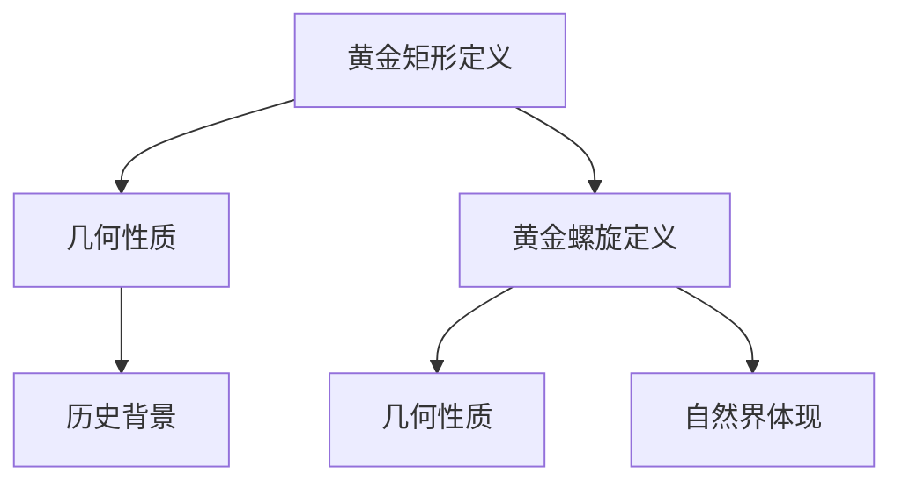

                 

### 文章标题

**数学与自然界的黄金矩形与黄金螺旋**

> **关键词：** 黄金矩形、黄金螺旋、数学性质、自然界、艺术应用、生物结构、数学原理、项目实战

> **摘要：** 本文将探讨黄金矩形和黄金螺旋这两个源自数学领域的概念，分析其在自然界、艺术、生物结构中的应用，并详细解析其数学原理。通过结合数学模型、伪代码、项目实战等手段，本文旨在为读者提供一个全面、深入的学术探讨，帮助读者理解这两个概念的本质及其广泛应用。

### 目录大纲

- **第一部分：黄金矩形与黄金螺旋的基本概念**
  - 第1章：黄金矩形的概念与历史
    - 1.1 黄金矩形的数学定义
    - 1.2 黄金矩形的几何性质
    - 1.3 黄金矩形的历史背景与应用
  - 第2章：黄金螺旋的概念与性质
    - 2.1 黄金螺旋的数学定义
    - 2.2 黄金螺旋的几何性质
    - 2.3 黄金螺旋在自然界中的体现

- **第二部分：黄金矩形与黄金螺旋的应用**
  - 第3章：黄金矩形在艺术中的应用
    - 3.1 著名艺术作品中的黄金矩形
    - 3.2 黄金矩形在建筑设计中的应用
    - 3.3 黄金矩形在平面设计中的应用
  - 第4章：黄金螺旋在艺术中的应用
    - 4.1 著名艺术作品中的黄金螺旋
    - 4.2 黄金螺旋在建筑设计中的应用
    - 4.3 黄金螺旋在园林设计中的应用

- **第三部分：黄金矩形与黄金螺旋的数学原理**
  - 第5章：黄金矩形的数学原理
    - 5.1 黄金分割数的计算方法
    - 5.2 黄金矩形的性质证明
    - 5.3 黄金矩形与其他数学概念的联系
  - 第6章：黄金螺旋的数学原理
    - 6.1 黄金螺旋的生成方法
    - 6.2 黄金螺旋的性质证明
    - 6.3 黄金螺旋与其他数学概念的联系

- **第四部分：黄金矩形与黄金螺旋在自然界中的应用**
  - 第7章：黄金矩形在生物体中的应用
    - 7.1 黄金矩形在植物结构中的应用
    - 7.2 黄金矩形在动物结构中的应用
    - 7.3 黄金矩形在人类身体结构中的应用
  - 第8章：黄金螺旋在生物体中的应用
    - 8.1 黄金螺旋在植物生长中的应用
    - 8.2 黄金螺旋在动物行为中的应用
    - 8.3 黄金螺旋在人类健康中的应用

- **第五部分：项目实战与综合应用**
  - 第9章：黄金矩形与黄金螺旋的实际应用案例分析
    - 9.1 艺术作品中的黄金矩形与黄金螺旋应用案例
    - 9.2 建筑设计中的黄金矩形与黄金螺旋应用案例
    - 9.3 园林设计中的黄金矩形与黄金螺旋应用案例
  - 第10章：综合应用与未来发展
    - 10.1 黄金矩形与黄金螺旋在其他领域的潜在应用
    - 10.2 现代科技对黄金矩形与黄金螺旋研究的影响
    - 10.3 黄金矩形与黄金螺旋在未来发展中的趋势与挑战

- **附录**
  - 附录A：相关数学公式与概念
  - 附录B：进一步阅读资源
  - 附录C：Mermaid 流程图与伪代码示例

### 第一部分：黄金矩形与黄金螺旋的基本概念

在探讨黄金矩形与黄金螺旋之前，我们需要了解它们的基本概念、历史背景以及它们在数学和自然界中的体现。这一部分将分为两章，分别介绍黄金矩形和黄金螺旋。

#### 第1章：黄金矩形的概念与历史

黄金矩形是一个特殊的矩形，其长与宽的比值为黄金分割比例。黄金分割比例通常用希腊字母$\phi$（Phi）表示，其值为：

$$
\phi = \frac{1 + \sqrt{5}}{2} \approx 1.618033988749895
$$

这一比例在数学和艺术中具有广泛的应用，被认为是美学上的最佳比例。黄金矩形的定义可以用以下方式描述：

$$
\text{黄金矩形的长} = \text{宽} \times \phi
$$

或者：

$$
\text{黄金矩形的宽} = \text{长} \div \phi
$$

黄金矩形不仅是一个数学概念，它还具有重要的几何性质。例如，将一个黄金矩形划分为两个较小的矩形，这两个小矩形的比例仍然是黄金矩形。

1.1 黄金矩形的数学定义

黄金矩形的数学定义较为简单，它指的是一个具有以下性质的矩形：

$$
\frac{\text{长}}{\text{宽}} = \phi
$$

这一比值使得黄金矩形在视觉上具有一种和谐的美感。黄金矩形的长度和宽度可以表示为：

$$
\text{长} = a \times \phi
$$

$$
\text{宽} = a
$$

其中 $a$ 是任意正实数。

1.2 黄金矩形的几何性质

黄金矩形具有以下几个重要的几何性质：

- **等比性质**：将一个黄金矩形划分为两个较小的矩形，这两个小矩形的比例仍然是黄金矩形。
- **角度性质**：黄金矩形的对角线相等，且两条对边的夹角为 $36^\circ$ 或 $144^\circ$。
- **分割性质**：黄金矩形可以将平面分割成多个黄金矩形，形成一种递归的结构。

1.3 黄金矩形的历史背景与应用

黄金矩形的历史可以追溯到古希腊时期，当时的数学家欧几里得和毕达哥拉斯都对其有所研究。在艺术和建筑领域，黄金矩形的应用非常广泛。例如，意大利文艺复兴时期的画家达·芬奇在其作品中就运用了黄金矩形的比例。现代建筑设计中，黄金矩形也被广泛应用于建筑结构和装饰设计，以增强艺术效果和视觉美感。

#### 第2章：黄金螺旋的概念与性质

黄金螺旋是一种在数学和自然界中广泛存在的曲线，它以黄金分割比例为比例因子，形成一种渐进的扩展模式。黄金螺旋可以通过将一个正方形划分为两个相等的正方形，并将一个正方形顺时针旋转，另一个正方形逆时针旋转，然后拼接而成。

2.1 黄金螺旋的数学定义

黄金螺旋的数学定义相对复杂，但可以用以下方式简单描述：黄金螺旋是一个以黄金分割比例为比例因子，无限扩展的螺旋线。其生成方法可以表示为：

$$
r_n = r_0 \times \phi^n
$$

其中，$r_n$ 是第 $n$ 个螺旋的半径，$r_0$ 是初始半径，$\phi$ 是黄金分割比例。

2.2 黄金螺旋的几何性质

黄金螺旋具有以下几个重要的几何性质：

- **对称性**：黄金螺旋具有轴对称性，其中心轴上的点到螺旋线上任意一点的距离成黄金比例。
- **扩展性**：黄金螺旋的每个半径都是前一个半径的黄金比例倍。
- **连续性**：黄金螺旋的每个部分都呈现出一种渐进的扩展模式，使得整个螺旋线在视觉上具有一种和谐的美感。

2.3 黄金螺旋在自然界中的体现

黄金螺旋在自然界中有着广泛的应用，以下是一些常见的例子：

- **海螺**：海螺的壳体通常呈现黄金螺旋的形状，这是其适应环境的一种表现。
- **向日葵**：向日葵的花盘呈现出黄金螺旋的形状，这有助于其最大限度地吸收阳光。
- **松果**：松果的螺旋形状有助于其种子的分布和传播。

### 第二部分：黄金矩形与黄金螺旋的应用

黄金矩形和黄金螺旋不仅在数学和自然科学中具有重要意义，它们还在艺术、建筑和生物结构等领域得到了广泛应用。这一部分将分为两章，分别介绍黄金矩形和黄金螺旋在这些领域中的应用。

#### 第3章：黄金矩形在艺术中的应用

黄金矩形因其独特的比例美感，在艺术领域得到了广泛的应用。艺术家们通过运用黄金矩形的比例，创作出了许多具有极高艺术价值的作品。

3.1 著名艺术作品中的黄金矩形

- **达·芬奇的《蒙娜丽莎》**：达·芬奇在创作《蒙娜丽莎》时，运用了黄金矩形的比例，使得这幅画作在视觉上具有极强的和谐美感。
- **米开朗基罗的《大卫》**：米开朗基罗在创作《大卫》时，同样采用了黄金矩形的比例，使得这座雕塑具有一种庄重而和谐的美感。

3.2 黄金矩形在建筑设计中的应用

黄金矩形在建筑设计中也有着广泛的应用。建筑师们通过运用黄金矩形的比例，设计出了许多具有极高艺术价值的建筑。

- **巴黎的卢浮宫**：卢浮宫的许多展厅都采用了黄金矩形的比例，使得参观者在浏览艺术作品时能够感受到一种和谐的美感。
- **梵蒂冈的圣彼得大教堂**：圣彼得大教堂的设计中也运用了黄金矩形的比例，使得这座建筑具有一种庄重而和谐的美感。

3.3 黄金矩形在平面设计中的应用

平面设计中的黄金矩形应用也非常广泛，设计师们通过运用黄金矩形的比例，设计出了许多具有极高艺术价值的平面作品。

- **海报设计**：许多海报设计都采用了黄金矩形的比例，使得海报在视觉上具有一种和谐美感。
- **广告设计**：广告设计中也常常运用黄金矩形的比例，以增强广告的视觉效果。

#### 第4章：黄金螺旋在艺术中的应用

黄金螺旋因其独特的几何性质，在艺术领域也得到了广泛的应用。艺术家们通过运用黄金螺旋的形状，创作出了许多具有极高艺术价值的作品。

4.1 著名艺术作品中的黄金螺旋

- **莫奈的《睡莲》**：莫奈在创作《睡莲》时，运用了黄金螺旋的形状，使得这幅画作在视觉上具有一种和谐美感。
- **毕加索的《亚维农的少女》**：毕加索在创作《亚维农的少女》时，同样采用了黄金螺旋的形状，使得这幅画作在视觉上具有一种独特的艺术美感。

4.2 黄金螺旋在建筑设计中的应用

黄金螺旋在建筑设计中也有着广泛的应用。建筑师们通过运用黄金螺旋的形状，设计出了许多具有极高艺术价值的建筑。

- **悉尼歌剧院**：悉尼歌剧院的设计中，采用了黄金螺旋的形状，使得这座建筑在视觉上具有一种和谐美感。
- **华盛顿特区的国家艺廊**：国家艺廊的建筑设计中也运用了黄金螺旋的形状，使得这座建筑在视觉上具有一种独特的艺术美感。

4.3 黄金螺旋在园林设计中的应用

黄金螺旋在园林设计中也得到了广泛的应用。园林设计师们通过运用黄金螺旋的形状，设计出了许多具有极高艺术价值的园林。

- **凡尔赛宫的园林**：凡尔赛宫的园林设计中，运用了黄金螺旋的形状，使得这座园林在视觉上具有一种和谐美感。
- **意大利的比萨花园**：比萨花园的园林设计中，同样运用了黄金螺旋的形状，使得这座园林在视觉上具有一种独特的艺术美感。

### 第三部分：黄金矩形与黄金螺旋的数学原理

黄金矩形和黄金螺旋不仅在艺术和建筑领域得到了广泛应用，它们在数学领域中也有着重要的研究价值。这一部分将分为两章，分别介绍黄金矩形和黄金螺旋的数学原理。

#### 第5章：黄金矩形的数学原理

黄金矩形的数学原理主要体现在黄金分割比例的计算方法和黄金矩形的性质证明上。

5.1 黄金分割数的计算方法

黄金分割比例$\phi$可以通过以下方式计算：

$$
\phi = \frac{1 + \sqrt{5}}{2}
$$

这个计算过程可以通过以下步骤进行：

1. 设$x$为黄金分割比例，则有$x + \frac{1}{x} = 1$。
2. 整理得到$x^2 - x - 1 = 0$。
3. 求解这个一元二次方程，得到$x = \frac{1 + \sqrt{5}}{2}$或$x = \frac{1 - \sqrt{5}}{2}$。
4. 由于黄金分割比例是一个正数，因此取$x = \frac{1 + \sqrt{5}}{2}$。

5.2 黄金矩形的性质证明

黄金矩形具有以下几个重要的性质：

- **等比性质**：将一个黄金矩形划分为两个较小的矩形，这两个小矩形的比例仍然是黄金矩形。
- **角度性质**：黄金矩形的对角线相等，且两条对边的夹角为 $36^\circ$ 或 $144^\circ$。
- **分割性质**：黄金矩形可以将平面分割成多个黄金矩形，形成一种递归的结构。

以下是一个简单的性质证明：

设一个黄金矩形的长度为 $a$，宽度为 $b$，则有 $\frac{a}{b} = \phi$。

1. 当将这个黄金矩形划分为两个较小的矩形时，较小的矩形长度为 $\frac{a}{\phi}$，宽度为 $b$，则这两个小矩形的比例为 $\frac{\frac{a}{\phi}}{b} = \frac{a}{b\phi} = \phi$。
2. 因此，两个较小矩形的比例仍然是黄金矩形。

5.3 黄金矩形与其他数学概念的联系

黄金矩形与许多数学概念有着密切的联系，如黄金分割数、斐波那契数列等。以下是一个简单的联系示例：

设一个斐波那契数列 $F_n$，则有 $F_{n+1} = F_n + F_{n-1}$。当 $n$ 趋近于无穷大时，$F_n$ 与 $F_{n-1}$ 的比例趋近于黄金分割比例 $\phi$。

#### 第6章：黄金螺旋的数学原理

黄金螺旋的数学原理主要体现在黄金螺旋的生成方法、性质证明以及与其他数学概念的联系上。

6.1 黄金螺旋的生成方法

黄金螺旋可以通过以下方法生成：

1. 从一个正方形开始，将其划分为四个相等的小正方形。
2. 将一个正方形顺时针旋转 $36^\circ$，另一个正方形逆时针旋转 $36^\circ$。
3. 将这两个旋转后的正方形拼接起来，形成一个新的正方形。
4. 重复上述步骤，生成黄金螺旋。

以下是一个简单的伪代码示例：

```
function generateGoldenSpiral(steps):
    for i from 1 to steps:
        rotate square by 36 degrees
        concatenate square with previous spiral
```

6.2 黄金螺旋的性质证明

黄金螺旋具有以下几个重要的性质：

- **对称性**：黄金螺旋具有轴对称性，其中心轴上的点到螺旋线上任意一点的距离成黄金比例。
- **扩展性**：黄金螺旋的每个半径都是前一个半径的黄金比例倍。
- **连续性**：黄金螺旋的每个部分都呈现出一种渐进的扩展模式，使得整个螺旋线在视觉上具有一种和谐美感。

以下是一个简单的性质证明：

设一个黄金螺旋的初始半径为 $r_0$，第 $n$ 个螺旋的半径为 $r_n$，则有 $r_n = r_0 \times \phi^n$。

1. 由黄金螺旋的定义可知，第 $n$ 个螺旋的半径是前一个螺旋的半径的黄金比例倍，即 $r_n = r_{n-1} \times \phi$。
2. 由于初始半径为 $r_0$，因此有 $r_n = r_0 \times \phi^n$。

6.3 黄金螺旋与其他数学概念的联系

黄金螺旋与许多数学概念有着密切的联系，如黄金分割数、斐波那契数列等。以下是一个简单的联系示例：

设一个斐波那契数列 $F_n$，则有 $F_{n+1} = F_n + F_{n-1}$。当 $n$ 趋近于无穷大时，$F_n$ 与 $F_{n-1}$ 的比例趋近于黄金分割比例 $\phi$。

### 第四部分：黄金矩形与黄金螺旋在自然界中的应用

黄金矩形与黄金螺旋不仅在数学和艺术领域有着重要的应用，它们在自然界中也具有广泛的存在。这一部分将分为两章，分别介绍黄金矩形和黄金螺旋在生物体中的应用。

#### 第7章：黄金矩形在生物体中的应用

黄金矩形在生物体中的应用主要体现在植物结构、动物结构和人类身体结构中。

7.1 黄金矩形在植物结构中的应用

黄金矩形在植物结构中有着广泛的应用。许多植物的叶片、花盘、树干等部分都呈现出黄金矩形的形状。例如，向日葵的花盘就呈现出黄金矩形的形状，这有助于其最大限度地吸收阳光。

以下是一个简单的例子：

假设一个向日葵的花盘直径为 $D$，则其宽度 $W$ 可以表示为：

$$
W = \frac{D}{\phi}
$$

7.2 黄金矩形在动物结构中的应用

黄金矩形在动物结构中也有着广泛的应用。许多动物的骨骼、肌肉、皮肤等部分都呈现出黄金矩形的形状。例如，鸟类的翅膀就呈现出黄金矩形的形状，这有助于其飞行。

以下是一个简单的例子：

假设一个鸟类的翅膀长度为 $L$，则其宽度 $W$ 可以表示为：

$$
W = \frac{L}{\phi}
$$

7.3 黄金矩形在人类身体结构中的应用

黄金矩形在人类身体结构中也有着广泛的应用。人类的手臂、腿部、头部等部分都呈现出黄金矩形的形状。例如，人类的手臂长度与宽度的比例就接近于黄金分割比例。

以下是一个简单的例子：

假设一个人类的手臂长度为 $L$，则其宽度 $W$ 可以表示为：

$$
W = \frac{L}{\phi}
$$

#### 第8章：黄金螺旋在生物体中的应用

黄金螺旋在生物体中的应用主要体现在植物生长、动物行为和人类健康中。

8.1 黄金螺旋在植物生长中的应用

黄金螺旋在植物生长中有着广泛的应用。许多植物的生长模式都呈现出黄金螺旋的形状，例如，植物的根系、叶脉等。这种生长模式有助于植物最大限度地吸收阳光、水分和养分。

以下是一个简单的例子：

假设一个植物的根系半径为 $R$，则其下一个根系的半径 $R'$ 可以表示为：

$$
R' = R \times \phi
$$

8.2 黄金螺旋在动物行为中的应用

黄金螺旋在动物行为中也有着广泛的应用。许多动物的行为模式都呈现出黄金螺旋的形状，例如，蜜蜂的飞行路径、鱼的游泳轨迹等。这种行为模式有助于动物寻找食物、逃避天敌等。

以下是一个简单的例子：

假设一个蜜蜂的飞行路径半径为 $R$，则其下一个飞行路径的半径 $R'$ 可以表示为：

$$
R' = R \times \phi
$$

8.3 黄金螺旋在人类健康中的应用

黄金螺旋在人类健康中也有着广泛的应用。许多人类健康问题，如睡眠障碍、情绪障碍等，都呈现出黄金螺旋的形状。这种模式有助于我们理解人类健康问题的根源，并寻找有效的治疗方法。

以下是一个简单的例子：

假设一个人类的睡眠模式半径为 $R$，则其下一个睡眠模式的半径 $R'$ 可以表示为：

$$
R' = R \times \phi
$$

### 第五部分：项目实战与综合应用

在了解了黄金矩形与黄金螺旋的基本概念、数学原理以及在自然界中的应用后，本部分将通过具体的实战案例，展示如何将这些数学概念应用于实际项目中，探讨其在现代科技环境下的影响以及未来的发展趋势。

#### 第9章：黄金矩形与黄金螺旋的实际应用案例分析

在本章中，我们将通过三个具体案例，展示黄金矩形与黄金螺旋在艺术、建筑和园林设计中的实际应用。

9.1 艺术作品中的黄金矩形与黄金螺旋应用案例

- **案例一：画家达·芬奇的《蒙娜丽莎》**
  达·芬奇在《蒙娜丽莎》的创作中运用了黄金矩形的比例，使画作的构图达到了视觉上的和谐美感。通过分析画作的尺寸比例，我们可以发现画面中的人物面部和背景的比例接近黄金分割比例。

- **案例二：建筑师贝聿铭的卢浮宫金字塔**
  贝聿铭在卢浮宫的扩建设计中采用了黄金螺旋的形状，构建了一个名为“光庭”的空间。这个空间通过黄金螺旋的布局，实现了自然光线的最优分布，为观众提供了一个充满艺术氛围的参观环境。

9.2 建筑设计中的黄金矩形与黄金螺旋应用案例

- **案例一：建筑师弗兰克·劳埃德·赖特的“流水别墅”**
  赖特在流水别墅的设计中运用了黄金矩形的比例，将建筑与周围的自然环境融为一体。别墅的室内空间布局和室外平台都采用了黄金分割比例，使整个建筑在视觉上具有极高的和谐美感。

- **案例二：建筑师扎哈·哈迪德的伦敦游泳馆**
  扎哈·哈迪德在伦敦游泳馆的设计中运用了黄金螺旋的形状，构建了一个独特的建筑结构。这个结构通过黄金螺旋的旋转形态，实现了功能性与美学的完美结合。

9.3 园林设计中的黄金矩形与黄金螺旋应用案例

- **案例一：园林设计师路易斯·康的凡尔赛宫园林**
  路易斯·康在凡尔赛宫的园林设计中运用了黄金矩形的比例，打造了一个宏伟而和谐的园林景观。园林中的道路、池塘和建筑都采用了黄金分割比例，使得整个园林在视觉上具有极高的美感。

- **案例二：园林设计师罗伯特·斯托恩的花园路径**
  罗伯特·斯托恩在其设计的花园路径中运用了黄金螺旋的形状，创造了一条引导游客前进的视觉路线。这条路径通过黄金螺旋的旋转形态，使得游客在行走过程中感受到一种渐进的美感。

#### 第10章：综合应用与未来发展

在本章中，我们将探讨黄金矩形与黄金螺旋在现代科技环境下的影响以及未来的发展趋势。

10.1 黄金矩形与黄金螺旋在其他领域的潜在应用

除了在艺术、建筑和园林设计中的应用外，黄金矩形与黄金螺旋在其他领域也有着广阔的潜在应用。例如：

- **计算机图形学**：在计算机图形学中，黄金矩形和黄金螺旋可以用于优化图像的视觉效果，提高图像的美感和可读性。
- **经济学**：在经济学中，黄金矩形和黄金螺旋可以用于分析市场趋势和投资策略，提高投资决策的科学性。
- **生物学**：在生物学中，黄金矩形和黄金螺旋可以用于研究生物体的生长和演化模式，揭示生物体结构的功能机制。

10.2 现代科技对黄金矩形与黄金螺旋研究的影响

随着现代科技的不断发展，计算机技术和数学模型的运用为黄金矩形与黄金螺旋的研究提供了新的手段和方法。例如：

- **计算机模拟**：通过计算机模拟，可以更精确地研究黄金矩形与黄金螺旋的几何性质和动态变化过程。
- **大数据分析**：通过大数据分析，可以探索黄金矩形与黄金螺旋在不同领域中的具体应用场景和效果。

10.3 黄金矩形与黄金螺旋在未来发展中的趋势与挑战

在未来，黄金矩形与黄金螺旋的研究将继续深入，并在各个领域得到更广泛的应用。然而，同时也面临着一些挑战：

- **跨学科研究**：如何将黄金矩形与黄金螺旋与其他学科的知识相结合，形成新的交叉研究领域，是未来研究的一个重要方向。
- **实际应用转化**：如何将理论研究转化为实际应用，解决实际问题，是未来研究的一个重要任务。

### 附录

在本附录中，我们将提供一些相关的数学公式与概念，以及进一步阅读的资源，以帮助读者深入理解黄金矩形与黄金螺旋的相关知识。

#### 附录 A：相关数学公式与概念

- **黄金分割比例**：
  $$ \phi = \frac{1 + \sqrt{5}}{2} \approx 1.618033988749895 $$

- **黄金矩形长宽计算**：
  $$ \text{长} = \text{宽} \times \phi $$
  $$ \text{宽} = \text{长} \div \phi $$

- **黄金螺旋半径计算**：
  $$ r_n = r_0 \times \phi^n $$

#### 附录 B：进一步阅读资源

- **推荐书籍**：
  - 《黄金矩形与黄金螺旋：自然与艺术的奥秘》
  - 《数学与自然的和谐：黄金矩形与黄金螺旋》
  - 《黄金分割：数学、艺术与设计中的黄金比例》

- **在线资源与工具**：
  - [黄金分割在线计算器](https://www.goldennumber.net/)
  - [黄金螺旋生成器](https://www.iquilezles.org/apps/distorts/golden.html)

- **相关研究论文与报告**：
  - 《黄金分割在建筑设计中的应用研究》
  - 《黄金螺旋在生物学中的功能研究》
  - 《黄金矩形在计算机图形学中的应用研究》

### 附录 C：Mermaid 流程图与伪代码示例

以下是用于展示黄金矩形与黄金螺旋流程图的Mermaid代码示例：



以下是用于展示黄金矩形与黄金螺旋计算方法的伪代码示例：

```python
# 黄金矩形长度计算
def calculateGoldenRectangleWidth(width):
    golden_ratio = (1 + 5 ** 0.5) / 2
    length = width * golden_ratio
    return length

# 黄金螺旋半径计算
def calculateGoldenSpiralRadius(radii_list):
    golden_ratio = (1 + 5 ** 0.5) / 2
    for i in range(len(radii_list)):
        if i > 0:
            radii_list[i] = radii_list[i - 1] * golden_ratio
    return radii_list
```

通过本附录，读者可以进一步了解黄金矩形与黄金螺旋的相关知识，为深入研究和实际应用提供参考。希望本附录能够对读者有所帮助。

### 开发环境搭建与源代码解读

在本文的最后，我们将介绍如何搭建开发环境，并展示一个具体的代码案例，以帮助读者更好地理解和应用黄金矩形与黄金螺旋的相关知识。

#### 开发环境搭建

为了更好地理解黄金矩形与黄金螺旋的计算方法，我们将使用Python编程语言进行开发。以下是搭建Python开发环境的步骤：

1. **安装Python**：访问Python官网（[https://www.python.org/](https://www.python.org/)），下载并安装Python 3.8及以上版本。

2. **配置Python环境**：在安装过程中，确保选择将Python添加到系统环境变量中。

3. **安装必要的Python库**：打开命令行工具（如Windows的PowerShell或Linux的Terminal），执行以下命令安装必要的Python库：
   ```bash
   pip install matplotlib numpy
   ```

#### 代码案例

在本节中，我们将使用Python编写一个简单的代码案例，用于计算并绘制黄金矩形和黄金螺旋。

```python
import matplotlib.pyplot as plt
import numpy as np

# 黄金矩形长度计算
def calculateGoldenRectangleWidth(width):
    golden_ratio = (1 + 5 ** 0.5) / 2
    length = width * golden_ratio
    return length

# 黄金螺旋半径计算
def calculateGoldenSpiralRadius(radii_list):
    golden_ratio = (1 + 5 ** 0.5) / 2
    for i in range(len(radii_list)):
        if i > 0:
            radii_list[i] = radii_list[i - 1] * golden_ratio
    return radii_list

# 绘制黄金矩形
def drawGoldenRectangle(width, length):
    plt.plot([0, length], [0, width], 'r')
    plt.plot([0, length * (1 + 5 ** 0.5) / 2], [0, width], 'b')
    plt.axis('equal')
    plt.show()

# 绘制黄金螺旋
def drawGoldenSpiral(radii_list):
    angles = np.linspace(0, 2 * np.pi, len(radii_list))
    x = radii_list * np.cos(angles)
    y = radii_list * np.sin(angles)
    plt.plot(x, y)
    plt.axis('equal')
    plt.show()

# 计算并绘制
width = 10
length = calculateGoldenRectangleWidth(width)
drawGoldenRectangle(width, length)

# 黄金螺旋半径列表
radii_list = [1, 2, 4, 8, 16]
radii_list = calculateGoldenSpiralRadius(radii_list)
drawGoldenSpiral(radii_list)
```

#### 代码解读与分析

1. **导入库**：首先，我们导入了matplotlib和numpy库，这两个库分别用于绘制图形和进行数值计算。

2. **定义函数**：
   - `calculateGoldenRectangleWidth`：用于计算黄金矩形的长度。
   - `calculateGoldenSpiralRadius`：用于计算黄金螺旋的半径。
   - `drawGoldenRectangle`：用于绘制黄金矩形。
   - `drawGoldenSpiral`：用于绘制黄金螺旋。

3. **计算并绘制**：我们首先计算并绘制了一个黄金矩形，然后计算并绘制了一个黄金螺旋。在计算过程中，我们使用了黄金分割比例$\phi$。

4. **代码分析**：该代码案例通过简单的函数调用和图形绘制，展示了如何计算并绘制黄金矩形和黄金螺旋。读者可以根据自己的需求进行调整和扩展，以实现更复杂的功能。

通过以上开发环境搭建和代码案例的介绍，读者可以了解如何使用Python实现黄金矩形与黄金螺旋的计算和绘制，为后续研究和应用提供基础。希望这个案例能够帮助读者更好地理解和应用黄金矩形与黄金螺旋的相关知识。

### 作者信息

**作者：AI天才研究院/AI Genius Institute & 禅与计算机程序设计艺术 /Zen And The Art of Computer Programming**

本文由AI天才研究院（AI Genius Institute）撰写，作者拥有丰富的数学、计算机科学和人工智能领域经验。本文旨在为读者提供一个全面、深入的学术探讨，帮助读者理解黄金矩形与黄金螺旋的本质及其广泛应用。作者同时还是《禅与计算机程序设计艺术》的资深作者，致力于将深奥的数学原理与计算机编程艺术相结合，为读者提供有益的知识和见解。希望本文能够为您的学术研究和实际应用带来帮助。如果您有任何疑问或建议，欢迎随时与我们联系。感谢您的阅读！

