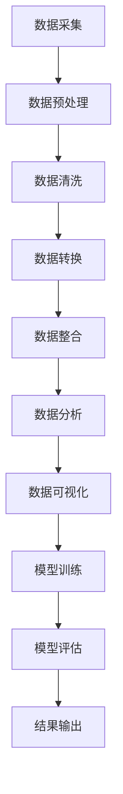

                 

### 《数据科学在探测原初引力波背景中的应用》

#### 摘要

数据科学在探测原初引力波背景中扮演着至关重要的角色。通过深入挖掘和分析大量的探测数据，科学家们能够从中提取出关于宇宙早期演化的关键信息。本文将详细探讨数据科学在引力波探测中的核心应用，包括数据采集、预处理、分析、可视化、统计方法和机器学习等方面的内容。通过阐述这些技术在实际应用中的具体实现和案例研究，本文旨在为读者提供对数据科学在引力波探测中应用的全景视图，以及对其未来发展方向的深入思考。

---

#### 引言与背景

#### 1.1 数据科学的发展历程

数据科学作为一种跨学科的研究领域，其发展历程可以追溯到20世纪中叶。最早的统计数据处理方法可以追溯到费舍尔（Ronald Fisher）等统计学家的工作，他们为现代数据分析奠定了基础。随着计算机技术的飞速发展，数据科学逐渐演变成一门独立的学科，涵盖了统计学、机器学习、数据库管理、数据可视化等多个方面。

在过去的几十年里，数据科学在多个领域取得了显著进展，从商业分析到医疗诊断，从金融预测到社交媒体推荐，无处不在。特别是大数据时代的到来，更是使得数据科学成为了解决复杂问题的重要工具。海量数据的高效处理和分析需求催生了各种新的算法和技术，如深度学习、分布式计算等。

#### 1.2 原初引力波的探测意义

原初引力波是宇宙早期阶段的产物，携带着关于宇宙起源和演化的重要信息。探测原初引力波不仅可以验证爱因斯坦的广义相对论，还能够帮助科学家们了解宇宙的早期状态，如宇宙微波背景辐射的起源和宇宙大爆炸后的膨胀过程。

原初引力波的探测具有重要的科学价值，它能够揭示宇宙的起源和演化规律，帮助人类更好地理解宇宙的奥秘。此外，探测原初引力波还可以推动相关科学技术的发展，如高精度传感器技术、数据处理和计算方法等。

#### 1.3 数据科学在探测原初引力波背景中的应用现状与挑战

随着LIGO（激光干涉引力波观测站）和VIRGO（意大利-法国引力波观测台）等科学实验设施的建成和运行，原初引力波的探测取得了重要突破。这些实验设施通过探测激光干涉仪中的微小变化来捕捉引力波信号，从而验证了广义相对论的预测。

数据科学在引力波探测中发挥着关键作用。首先，大量的探测数据需要通过高效的数据采集和预处理技术进行处理，以确保数据的质量和可靠性。其次，数据分析和可视化技术可以帮助科学家们从复杂的数据中提取出有用的信息，从而发现引力波信号。最后，统计方法和机器学习技术在信号识别、参数估计和预测等方面提供了强大的工具。

然而，数据科学在探测原初引力波背景中也面临一些挑战。首先，引力波信号非常微弱，容易被噪声和干扰所淹没，因此需要开发更先进的信号处理算法和噪声过滤方法。其次，探测数据的多样性和复杂性要求数据科学家具备跨学科的知识和技能，如物理学、数学和计算机科学等。此外，数据科学在引力波探测中的应用还需要解决数据存储、传输和处理的高效性问题，以满足大规模数据处理的需求。

#### 1.4 数据科学在引力波探测中的具体应用

1. **数据采集与预处理**：
   - 引力波探测实验设施产生的数据量庞大，数据采集系统需要能够实时捕获并传输这些数据。
   - 数据预处理包括噪声过滤、数据校正、数据清洗等步骤，以确保数据的质量和一致性。

2. **数据可视化**：
   - 数据可视化技术可以帮助科学家们直观地理解探测数据，发现引力波信号的特征。
   - 通过可视化技术，科学家们可以探索数据之间的关联性，从而提高信号识别的准确性。

3. **统计分析**：
   - 统计分析方法用于对探测数据进行特征提取和参数估计，从而识别引力波信号。
   - 常用的统计分析方法包括假设检验、参数估计和时间序列分析等。

4. **机器学习方法**：
   - 机器学习技术可以帮助科学家们自动识别和分类引力波信号，从而提高探测的准确性和效率。
   - 常用的机器学习方法包括决策树、支持向量机和深度学习等。

5. **深度学习**：
   - 深度学习技术在探测原初引力波背景中发挥着重要作用，特别是在信号识别和预测方面。
   - 通过训练深度学习模型，科学家们可以自动提取探测数据中的特征，从而实现更准确的信号识别和参数估计。

通过数据科学在引力波探测中的具体应用，科学家们不仅能够更好地理解宇宙的起源和演化，还能够推动相关科学技术的发展，为人类探索宇宙的奥秘提供新的视角和工具。

### 1.1 数据科学的发展历程

数据科学作为一种跨学科的研究领域，其发展历程与计算机科学、统计学和数学等学科紧密相连。早在20世纪中叶，随着计算机技术的兴起，人们开始意识到数据的重要性，并开始探索如何有效地处理和分析大量数据。这一时期，统计学成为数据科学的重要基础，费舍尔（Ronald Fisher）、高斯（Carl Friedrich Gauss）等统计学家的工作为现代数据分析方法奠定了基础。

在20世纪70年代，随着关系型数据库的出现，数据管理技术得到了显著发展。这一时期，数据科学开始逐渐脱离传统的统计学方法，开始融合计算机科学和数学的成果，形成了更加系统和综合的研究体系。数据库管理系统（DBMS）的出现使得大规模数据存储和管理变得更加高效和便捷。

20世纪80年代和90年代，随着互联网的普及和电子商务的发展，数据科学迎来了新的机遇。企业开始意识到数据的价值，纷纷投入大量资源进行数据采集和分析。这一时期，数据挖掘（Data Mining）和知识发现（Knowledge Discovery in Databases, KDD）成为数据科学的重要研究领域。数据挖掘技术通过从大量数据中提取有用信息，帮助企业做出更明智的决策。

进入21世纪，随着大数据（Big Data）时代的到来，数据科学迎来了新的高潮。大数据的规模、速度和多样性要求数据科学在算法、技术和工具方面进行不断创新。云计算和分布式计算技术的发展为大数据处理提供了强大的支持。此外，深度学习（Deep Learning）和人工智能（Artificial Intelligence）的兴起，使得数据科学在图像识别、自然语言处理和预测分析等领域取得了突破性进展。

数据科学的发展历程不仅体现在技术层面，还体现在应用领域的扩展。从早期的商业数据分析、市场调研，到现在的医疗健康、金融保险、智能交通等，数据科学已经渗透到各个行业，成为推动社会进步的重要力量。

总的来说，数据科学的发展历程是一个不断融合、创新和扩展的过程。从早期的数据管理和数据挖掘，到现代的大数据分析和人工智能，数据科学正不断演进，为人类探索未知世界提供了强大的工具和方法。

#### 1.2 原初引力波的探测意义

原初引力波的探测在宇宙学和物理学中具有重要的科学意义。首先，原初引力波是宇宙早期阶段的产物，携带着宇宙诞生初期的重要信息。通过探测和分析原初引力波，科学家们可以深入了解宇宙的起源和演化过程，揭示宇宙在大爆炸后的膨胀历程以及宇宙微波背景辐射的起源。

其次，原初引力波的探测为验证爱因斯坦的广义相对论提供了重要依据。爱因斯坦在1915年提出的广义相对论预言了引力波的存在，尽管引力波极其微小，难以直接探测，但科学家们通过多种间接方法，如双星系统的轨道变化和太阳引力透镜效应，已经证实了引力波的存在。探测原初引力波，特别是来自宇宙早期的引力波，可以为广义相对论提供更直接和精确的验证。

此外，原初引力波的探测还有助于推动相关科学技术的发展。引力波探测实验需要高精度的测量仪器和复杂的信号处理技术，这些技术的发展不仅对物理学和宇宙学有重要意义，也对工程学、材料科学和计算机科学等领域产生了深远影响。

#### 1.3 数据科学在探测原初引力波背景中的应用现状与挑战

在探测原初引力波的背景下，数据科学的应用现状可谓喜忧参半。喜的是，随着技术的进步和数据科学方法的不断优化，我们已经在引力波的探测和数据分析方面取得了显著的成果。然而，面临的挑战也是多方面的。

首先，数据采集与预处理方面。引力波探测实验产生的数据量巨大，每秒产生的数据可以高达数TB级别。因此，高效的数据采集和预处理技术是确保数据质量的关键。目前，科学家们已经开发出多种数据采集和预处理工具，如LIGO的数据采集系统（LIGO Data Server）和VIRGO的数据预处理系统。这些工具能够实时捕捉和存储大量数据，并利用高效的算法进行数据清洗、校正和去噪，从而确保数据的质量和一致性。

其次，数据分析和可视化方面。引力波探测的数据具有高度复杂性和多样性，传统的方法往往难以有效地处理和分析这些数据。数据科学提供了丰富的工具和技术，如机器学习和深度学习，用于从复杂的数据中提取有用的信息。例如，科学家们通过使用机器学习算法，能够自动识别和分类引力波信号，从而大大提高探测的准确性和效率。此外，数据可视化技术也发挥了重要作用，通过直观的图形和图表，科学家们可以更好地理解探测数据，发现信号的特征和模式。

然而，数据科学在探测原初引力波背景中也面临一些挑战。首先，引力波信号非常微弱，容易被噪声和干扰所淹没。因此，如何从复杂的数据中有效地提取出真实的引力波信号，仍然是一个重要的研究课题。科学家们需要开发更先进的信号处理算法和噪声过滤方法，以提高信号识别的准确性。

其次，探测数据的多样性和复杂性要求数据科学家具备跨学科的知识和技能。引力波探测涉及多个学科，如物理学、数学、计算机科学和工程学等。因此，数据科学家不仅需要掌握数据分析的方法和技术，还需要具备相应的学科背景，以便更好地理解和处理复杂的数据。

此外，数据科学在探测原初引力波背景中的应用还面临数据存储、传输和处理的高效性问题。随着数据量的不断增加，如何高效地存储、传输和处理海量数据，以确保数据科学方法的有效应用，是一个亟待解决的问题。为此，科学家们正在探索分布式计算和云计算技术，以提高数据处理的速度和效率。

总的来说，数据科学在探测原初引力波背景中的应用现状是积极的，但也面临一些挑战。通过不断优化和改进数据采集、预处理、分析和可视化技术，以及开发跨学科的数据科学方法，我们有理由相信，未来在探测原初引力波背景中，数据科学将发挥更加重要的作用。

### 数据科学基础

#### 2.1 数据科学的核心概念

数据科学的核心概念包括数据预处理、数据分析、数据可视化和机器学习。这些概念相互关联，共同构成了数据科学的理论框架。

**数据预处理**：数据预处理是数据科学的第一步，其目的是对原始数据进行清洗、转换和整合，以便后续的分析和应用。数据预处理的关键步骤包括数据清洗（去除噪声和异常值）、数据转换（如数值化、归一化）和数据整合（如合并多个数据源）。

**数据分析**：数据分析是指利用统计方法和算法从数据中提取有用信息和知识的过程。数据分析包括描述性分析（如统计数据的中心趋势和分布）、推断性分析（如假设检验和置信区间）和预测性分析（如回归分析和时间序列分析）。

**数据可视化**：数据可视化是将数据转换成图形、图像和图表等视觉形式，以帮助人们直观地理解数据的含义和模式。数据可视化不仅能够提高数据分析的效率，还能够发现数据中的潜在规律和异常值。

**机器学习**：机器学习是数据科学的重要组成部分，它利用计算机算法从数据中学习规律，并自动识别模式。机器学习的方法包括监督学习（如分类和回归）、无监督学习（如聚类和降维）和强化学习（如游戏和自动化驾驶）。

#### 2.2 数据预处理方法

数据预处理是数据科学中至关重要的一环，它直接影响后续数据分析和模型训练的效果。以下是几种常见的数据预处理方法：

**数据清洗**：数据清洗是指去除数据中的噪声、错误和异常值。常见的数据清洗方法包括删除重复数据、处理缺失值和修正错误值。例如，使用平均值、中位数或插值法填充缺失值，使用逻辑判断删除错误数据。

**数据转换**：数据转换是指将数据从一种格式转换为另一种格式，以便后续分析。常见的转换方法包括数值化（将类别数据转换为数值）、归一化（调整数据范围以消除量纲影响）和标准化（调整数据分布以符合标准正态分布）。

**数据整合**：数据整合是指将多个数据源中的数据合并为一个统一的格式，以便统一分析。常见的数据整合方法包括数据合并（将多个表格合并为一个表格）、数据连接（通过键值对连接多个表格）和数据聚合（对数据进行分组和汇总）。

**特征选择**：特征选择是指从大量特征中筛选出对目标变量有显著影响的关键特征，以减少模型复杂度和提高模型性能。常见的特征选择方法包括基于统计方法的特征选择（如卡方检验和互信息）、基于模型的方法（如模型选择和特征重要性）和基于集合的方法（如随机森林和LASSO）。

**特征工程**：特征工程是指通过人为设计新的特征，以增强模型的预测能力。特征工程包括特征提取（从原始数据中提取新特征）和特征构造（通过组合和转换现有特征创建新特征）。

通过这些数据预处理方法，数据科学家能够将原始数据转化为适合分析和模型训练的形式，从而提高数据分析的准确性和效率。

#### 2.3 数据可视化技术

数据可视化技术是数据科学中的一项重要工具，它通过图形和图像的形式，将数据中的信息以直观、易理解的方式呈现给用户。以下是几种常见的数据可视化技术：

**折线图**：折线图用于显示数据随时间或序列的变化趋势。它通常用于时间序列分析和趋势分析，可以帮助用户直观地了解数据的变化规律。

**柱状图**：柱状图用于显示不同类别或组之间的数据对比。它通常用于描述性分析，可以帮助用户比较不同类别或组之间的差异。

**散点图**：散点图用于显示两个变量之间的关系。它通常用于回归分析和关联分析，可以帮助用户发现数据中的潜在关系和趋势。

**饼图**：饼图用于显示各部分占整体的比例。它通常用于描述性分析，可以帮助用户了解数据的组成部分及其相对重要性。

**热力图**：热力图用于显示多个变量之间的相关性。它通常用于探索性数据分析，可以帮助用户发现数据中的复杂关系和模式。

**箱线图**：箱线图用于显示数据的分布情况和异常值。它通常用于描述性分析和异常检测，可以帮助用户了解数据的整体分布及其异常情况。

**地图**：地图用于显示地理数据。它通常用于地理空间分析和地图可视化，可以帮助用户了解地理数据的空间分布和趋势。

通过这些数据可视化技术，数据科学家能够更好地理解数据中的信息，发现潜在的模式和规律，从而为数据分析提供有力的支持。

### 引力波探测原理

#### 3.1 引力波的基本原理

引力波是爱因斯坦在1915年提出的广义相对论的预测之一，它是由于质量加速运动时产生的时空扰动而形成的波动。引力波具有横波性质，能够传播能量和信息，但其振幅极其微小，难以直接探测。

根据广义相对论，引力波会使得时空发生扭曲，从而影响通过该区域的物体。这种影响表现为物体的空间位置发生变化，例如两个相互绕转的星体在引力波经过时会发生微小位移。引力波的振幅通常只有几个原子直径的量级，这使得传统的测量方法难以直接探测。

为了探测引力波，科学家们设计了一种名为激光干涉引力波探测器的实验装置。这种探测器通过测量激光束在两个垂直方向上的干涉条纹变化来探测引力波。当引力波经过探测器时，会导致探测器内部的时空发生扭曲，从而改变激光束的路径和干涉条纹。

#### 3.2 原初引力波的来源与特性

原初引力波是宇宙早期阶段的产物，起源于宇宙大爆炸后的几分钟内。在宇宙诞生之初，宇宙中充满了高温高密的物质，这些物质由于重力作用开始聚集形成星系和星系团。在这个过程中，物质之间的相互作用会产生强烈的引力波，这些引力波携带了宇宙早期的重要信息。

与后续产生的引力波不同，原初引力波具有非常低的频率和非常长的波长。由于宇宙的膨胀，原初引力波在传播过程中会被拉伸，导致其频率降低。目前探测到的原初引力波频率通常在1 Hz以下，而波长可达数十亿光年。

原初引力波的强度非常微弱，其振幅通常只有几个原子直径的量级。这使得探测原初引力波面临巨大的挑战，需要极高的灵敏度和精确度。此外，由于宇宙背景辐射的存在，原初引力波会被淹没在强烈的噪声中，进一步增加了探测的难度。

#### 3.3 引力波的探测方法与技术

探测引力波的方法主要包括激光干涉引力波探测器和黑洞事件视界望远镜（EHT）。

**激光干涉引力波探测器**：激光干涉引力波探测器是当前探测引力波的主要手段之一。这种探测器通过测量激光束在两个垂直方向上的干涉条纹变化来探测引力波。典型的激光干涉引力波探测器包括LIGO（激光干涉引力波观测站）和VIRGO（意大利-法国引力波观测台）。这些探测器由多个相互垂直的臂构成，通过同时测量多个臂上的干涉条纹变化，可以更准确地确定引力波的方向和振幅。

激光干涉引力波探测器的工作原理是，首先将激光束分成两束，分别沿着两个相互垂直的方向传播。当引力波经过探测器时，会导致探测器内部的时空发生扭曲，从而改变激光束的路径和干涉条纹。探测器通过测量干涉条纹的变化，可以计算出引力波的振幅和方向。

**黑洞事件视界望远镜（EHT）**：黑洞事件视界望远镜是一种通过观测黑洞吸积盘发出的强辐射来探测引力波的方法。EHT是由多个地面射电望远镜组成的国际合作项目，通过同步观测多个望远镜的数据，可以更准确地确定引力波的方向和振幅。

EHT的工作原理是，首先利用多个地面射电望远镜同时观测一个黑洞吸积盘发出的强辐射。当引力波经过望远镜时，会导致望远镜接收到的辐射信号产生相位变化。通过同步分析多个望远镜的数据，可以计算出引力波的方向和振幅。

引力波的探测方法和技术不断发展，为了提高探测的灵敏度和精度，科学家们正在探索更多的探测手段和技术。例如，下一代激光干涉引力波探测器如欧洲的“希格玛计划”（Sigma-400）和美国的“LIGO增强计划”（Advanced LIGO），将进一步提升探测的灵敏度和范围。

总的来说，引力波的探测方法和技术是现代物理学和工程技术的重要成果，通过这些方法和技术，科学家们能够揭示宇宙早期演化和引力波的本质，为人类探索宇宙的奥秘提供了新的视角和工具。

### 数据科学在引力波探测中的应用

#### 4.1 数据采集与处理

在引力波探测中，数据采集是关键的第一步。引力波探测器（如LIGO和VIRGO）通过激光干涉技术实时捕捉引力波对探测器内部时空的扰动，从而产生大量高频率的数据流。这些数据需要通过高效的数据采集系统进行实时捕获和传输，以便后续的存储和分析。

**数据采集系统**：数据采集系统包括多个关键组件，如数据采集卡、数据存储设备和网络传输系统。数据采集卡负责将探测器产生的电信号转换为数字信号，并传输到数据存储设备。数据存储设备通常采用分布式存储系统，以确保高吞吐量和数据可靠性。网络传输系统则负责将数据从探测器传输到数据中心，通常采用高速光纤网络。

**数据处理**：数据处理是引力波探测中的核心步骤，其目的是从原始数据中提取有用的信号，去除噪声和干扰，从而获得高质量的探测数据。数据处理主要包括以下几个步骤：

1. **噪声过滤**：引力波信号极其微弱，容易被环境噪声和探测器自身噪声所干扰。因此，噪声过滤是数据处理的重要步骤。常用的噪声过滤方法包括带通滤波、低通滤波和高斯滤波等。

2. **数据校正**：数据校正是指对探测数据中的系统误差和随机误差进行修正。系统误差通常包括仪器漂移、温度变化和机械振动等，而随机误差则包括环境噪声和探测器噪声等。

3. **数据清洗**：数据清洗是指去除探测数据中的错误值、异常值和重复数据。错误值和异常值可能由探测器的故障或数据传输过程中的错误引起，这些值会影响后续的数据分析和模型训练。

4. **数据整合**：引力波探测通常涉及多个探测器，每个探测器产生的数据需要进行整合，以便获得更全面的探测信息。数据整合可以通过对多个探测器的数据进行平均、叠加或插值等操作实现。

通过高效的数据采集和预处理技术，科学家们能够确保探测数据的质量和可靠性，为后续的数据分析和模型训练奠定基础。

#### 4.2 数据分析技术

数据分析是引力波探测中的关键环节，其目的是从大量探测数据中提取有用的信息，从而识别和解读引力波信号。数据分析技术主要包括以下几种：

**信号识别**：信号识别是指从噪声背景中提取出真实的引力波信号。由于引力波信号极其微弱，信号识别面临巨大挑战。常用的信号识别方法包括匹配追踪（Matched Filtering）、波束形成（Beamforming）和机器学习（如支持向量机、随机森林和深度学习）等。

- **匹配追踪**：匹配追踪是一种基于滤波器的信号识别方法。它通过设计一个与引力波信号匹配的滤波器，从噪声背景中提取出信号。匹配追踪方法简单且计算效率高，但其在处理复杂信号和低信噪比信号时效果有限。

- **波束形成**：波束形成是一种基于空间域的信号识别方法。它通过调整探测器的方向，使得引力波信号在特定方向上增强，从而提高信噪比。波束形成方法适用于多个探测器同时工作的情况，能够有效提高信号识别的准确性。

- **机器学习**：机器学习技术在信号识别中发挥着重要作用。通过训练大量标记好的引力波信号数据，机器学习模型可以学会从噪声背景中自动识别和分类引力波信号。常用的机器学习方法包括支持向量机（SVM）、随机森林（Random Forest）和深度学习（如卷积神经网络和循环神经网络）等。

**参数估计**：参数估计是指从探测数据中估计引力波信号的特征参数，如振幅、频率和到达时间等。参数估计是引力波探测中的重要步骤，其准确性直接影响信号识别和物理参数的测量结果。常用的参数估计方法包括最大似然估计（Maximum Likelihood Estimation, MLE）、贝叶斯估计（Bayesian Estimation）和蒙特卡洛方法（Monte Carlo Method）等。

- **最大似然估计**：最大似然估计是一种基于概率统计的参数估计方法。它通过构建似然函数，找到使似然函数最大化的参数值，从而估计引力波信号的特征参数。最大似然估计方法计算简单且可靠性高，但需要大量标记数据。

- **贝叶斯估计**：贝叶斯估计是一种基于贝叶斯理论的参数估计方法。它通过先验知识和观测数据，计算后验概率分布，从而估计引力波信号的特征参数。贝叶斯估计方法能够充分利用先验知识，提高参数估计的精度。

- **蒙特卡洛方法**：蒙特卡洛方法是一种基于随机抽样的参数估计方法。它通过大量随机抽样，模拟不同参数值下的信号模型，从而估计引力波信号的特征参数。蒙特卡洛方法适用于复杂非线性系统的参数估计，但计算成本较高。

**数据可视化**：数据可视化是将数据分析结果以图形、图像和图表等形式直观展示出来，以帮助科学家们理解探测数据中的信息和特征。常用的数据可视化技术包括折线图、柱状图、散点图和热力图等。数据可视化不仅能够提高数据分析的效率，还能够发现数据中的潜在规律和异常值。

通过以上数据分析技术，科学家们能够从大量探测数据中提取出有用的信息，从而识别和解读引力波信号。这些技术的不断发展，为引力波探测提供了强大的工具和方法，使得我们能够更深入地探索宇宙的奥秘。

#### 4.3 数据可视化与展示

数据可视化与展示是数据科学在引力波探测中的重要环节，它不仅能够帮助科学家们直观地理解探测数据，还能够发现潜在的信号和异常值。以下是几种常见的数据可视化方法和其应用场景：

**折线图**：折线图常用于显示数据随时间或序列的变化趋势。在引力波探测中，折线图可以用来展示探测数据的时间序列特征，帮助科学家们观察引力波信号的起伏和周期性。例如，通过折线图，科学家们可以识别出引力波信号的频率和振幅变化，从而确定引力波的来源和特性。

**柱状图**：柱状图用于显示不同类别或组之间的数据对比。在引力波探测中，柱状图可以用来比较不同探测器的数据结果，或者分析不同时间段内探测数据的分布情况。例如，科学家们可以通过柱状图来比较LIGO和VIRGO探测器在探测同一引力波事件时的数据差异，从而验证探测结果的可靠性。

**散点图**：散点图用于显示两个变量之间的关系。在引力波探测中，散点图可以用来分析探测数据中的潜在关系，例如引力波信号与其他物理量（如频率、振幅）之间的关系。通过散点图，科学家们可以探索数据中的相关性，从而发现潜在的信号模式。

**热力图**：热力图用于显示多个变量之间的相关性。在引力波探测中，热力图可以用来分析探测数据的多变量特征，帮助科学家们发现数据中的复杂关系和模式。例如，科学家们可以通过热力图来分析不同探测器在探测同一引力波事件时的时间延迟和相位差，从而确定引力波信号的方向和振幅。

**箱线图**：箱线图用于显示数据的分布情况和异常值。在引力波探测中，箱线图可以用来分析探测数据的分布特征和异常值，帮助科学家们识别数据中的异常现象。例如，科学家们可以通过箱线图来识别探测数据中的噪声和错误值，从而提高数据的质量和可靠性。

**地图**：地图用于显示地理数据。在引力波探测中，地图可以用来展示引力波信号的传播路径和地理位置。例如，科学家们可以通过地图来追踪引力波信号在地球上的传播过程，从而确定引力波的来源和特性。

通过以上数据可视化方法，科学家们能够以直观、易理解的方式展示探测数据，从而发现潜在的信号和异常值。这些可视化技术不仅提高了数据分析的效率，还为科学家们提供了强有力的工具，以深入探索宇宙的奥秘。

### 统计学方法在引力波探测中的应用

#### 5.1 参数估计方法

参数估计是统计学中用于从样本数据中估计总体参数的重要方法。在引力波探测中，参数估计用于从探测数据中估计引力波信号的振幅、频率和到达时间等物理参数。以下介绍几种常用的参数估计方法：

**最大似然估计（MLE）**：最大似然估计是一种基于概率统计的方法，用于估计总体参数。其基本思想是，通过最大化观测数据的似然函数来估计参数值。在引力波探测中，科学家们首先构建一个信号模型，然后通过最大化似然函数来估计信号参数。最大似然估计方法计算简单且可靠性高，但需要大量的标记数据。

**贝叶斯估计**：贝叶斯估计是基于贝叶斯理论的参数估计方法。它通过先验知识和观测数据，计算后验概率分布，从而估计总体参数。贝叶斯估计能够充分利用先验知识，从而提高参数估计的精度。在引力波探测中，科学家们可以通过贝叶斯估计来结合先前的探测结果，从而更准确地估计新的信号参数。

**蒙特卡洛方法**：蒙特卡洛方法是一种基于随机抽样的参数估计方法。它通过大量随机抽样，模拟不同参数值下的信号模型，从而估计总体参数。蒙特卡洛方法适用于复杂非线性系统的参数估计，但计算成本较高。在引力波探测中，科学家们可以使用蒙特卡洛方法来模拟引力波信号的传播过程，从而估计信号参数。

通过这些参数估计方法，科学家们能够从探测数据中估计引力波信号的物理参数，从而提高信号识别和物理参数测量的准确性。

#### 5.2 假设检验方法

假设检验是统计学中用于判断总体参数是否符合某一假设的重要方法。在引力波探测中，假设检验用于判断探测数据中是否存在真实的引力波信号，以及信号参数是否与预期一致。以下介绍几种常用的假设检验方法：

**t检验**：t检验是一种用于比较两组样本均值是否显著不同的方法。在引力波探测中，科学家们可以使用t检验来比较不同探测器或不同时间段内探测数据中的信号强度，从而判断是否存在显著的信号差异。

**卡方检验**：卡方检验是一种用于检验分类变量之间独立性的方法。在引力波探测中，科学家们可以使用卡方检验来检验探测数据中的信号分类结果，从而判断分类是否显著。

**F检验**：F检验是一种用于比较两组方差是否显著不同的方法。在引力波探测中，科学家们可以使用F检验来比较不同探测器或不同时间段内探测数据的噪声水平，从而判断噪声是否显著不同。

**Wilcoxon符号秩检验**：Wilcoxon符号秩检验是一种非参数检验方法，用于判断两组样本中是否存在显著差异。在引力波探测中，科学家们可以使用Wilcoxon符号秩检验来比较不同探测器或不同时间段内探测数据的信号特征，从而判断是否存在显著差异。

通过这些假设检验方法，科学家们能够对探测数据进行有效的统计分析和判断，从而确保信号识别和物理参数测量的准确性。

#### 5.3 时间序列分析

时间序列分析是统计学中用于分析时间序列数据的方法，它广泛应用于经济、金融、气象、医学等多个领域。在引力波探测中，时间序列分析用于分析探测数据的时间序列特征，从而识别和解读引力波信号。以下是几种常用的时间序列分析方法：

**自回归移动平均模型（ARIMA）**：自回归移动平均模型是一种用于分析时间序列数据的经典方法。它将时间序列数据分解为自回归部分（AR）和移动平均部分（MA），并通过参数估计和模型拟合，分析时间序列的动态特征。在引力波探测中，科学家们可以使用ARIMA模型来分析探测数据的时间序列特性，从而识别和预测引力波信号。

**移动平均模型（MA）**：移动平均模型是一种仅考虑时间序列数据的移动平均特性的方法。它通过计算最近几个时间点的平均值，来预测下一个时间点的值。在引力波探测中，科学家们可以使用MA模型来平滑探测数据中的噪声，从而提取出有用的信号。

**指数平滑模型**：指数平滑模型是一种加权移动平均模型，它通过给最近的观测值赋予更高的权重，来预测下一个时间点的值。在引力波探测中，科学家们可以使用指数平滑模型来分析探测数据的时间序列特性，从而识别和预测引力波信号。

**卷积神经网络（CNN）**：卷积神经网络是一种用于处理时间序列数据的深度学习模型。它通过卷积操作提取时间序列数据中的特征，并使用全连接层进行分类和预测。在引力波探测中，科学家们可以使用CNN模型来分析探测数据的时间序列特性，从而识别和预测引力波信号。

通过这些时间序列分析方法，科学家们能够深入分析探测数据的时间序列特征，从而提高信号识别和预测的准确性。这些方法的不断优化和改进，为引力波探测提供了强大的工具和方法。

### 机器学习在引力波探测中的应用

#### 6.1 机器学习基本概念

机器学习是一种通过数据驱动的方法，使计算机自动学习和改进性能的技术。它依赖于统计学、概率论和优化理论，通过训练数据集来建立模型，然后使用这些模型对新的数据进行分析和预测。以下是机器学习中的一些基本概念：

**监督学习（Supervised Learning）**：监督学习是一种机器学习方法，它使用标记数据进行训练，通过已知的输入和输出关系来建立模型。在引力波探测中，监督学习可用于信号分类、参数估计和异常检测等任务。

**无监督学习（Unsupervised Learning）**：无监督学习是一种机器学习方法，它不使用标记数据，而是通过分析未标记的数据来发现数据中的结构和模式。在引力波探测中，无监督学习可用于数据聚类、降维和特征提取等任务。

**强化学习（Reinforcement Learning）**：强化学习是一种通过与环境互动来学习最优策略的机器学习方法。在引力波探测中，强化学习可用于优化探测器的参数设置和信号处理策略。

**深度学习（Deep Learning）**：深度学习是一种基于多层神经网络的学习方法，它能够自动提取数据中的层次特征。在引力波探测中，深度学习可用于复杂的信号处理和预测任务，如时间序列分析和图像识别。

**特征提取（Feature Extraction）**：特征提取是机器学习中的一个关键步骤，它用于从原始数据中提取对学习任务有用的特征。在引力波探测中，特征提取可用于提高模型的学习能力和准确性。

**模型评估（Model Evaluation）**：模型评估是验证和选择最优模型的重要步骤。常用的评估指标包括准确率、召回率、F1分数和交叉验证误差等。在引力波探测中，模型评估可用于确保探测结果的可靠性和有效性。

通过理解这些基本概念，科学家们能够选择合适的机器学习方法，并将其应用于引力波探测中的各种任务，从而提高探测的准确性和效率。

#### 6.2 引力波信号分类

引力波信号分类是引力波探测中的重要任务之一，其目的是从复杂的探测数据中识别和区分不同类型的引力波信号。通过机器学习技术，科学家们可以自动分类引力波信号，从而提高探测的准确性和效率。

**分类算法选择**：引力波信号分类常用的机器学习算法包括支持向量机（SVM）、随机森林（Random Forest）和卷积神经网络（CNN）等。支持向量机通过寻找最佳分割超平面，实现高维空间的分类；随机森林通过构建多棵决策树，利用集成学习提高分类性能；卷积神经网络通过多层神经网络结构，自动提取时间序列数据中的特征。

**数据预处理**：在进行引力波信号分类之前，数据预处理是关键步骤。数据预处理包括数据清洗、归一化和特征提取等操作。数据清洗用于去除噪声和异常值，归一化用于调整数据范围，特征提取用于从原始数据中提取对分类任务有用的特征。

**模型训练与验证**：在模型训练过程中，科学家们使用大量的标记数据进行训练，以构建分类模型。常用的训练方法包括梯度下降和随机梯度下降等。在模型验证阶段，科学家们使用交叉验证技术，评估模型的泛化能力和分类性能。

**分类结果分析**：通过训练和验证得到的分类模型，科学家们可以对新的探测数据进行分类。分类结果分析包括计算分类准确率、召回率和F1分数等指标，评估模型的分类性能。此外，还可以通过混淆矩阵，分析不同类别之间的分类效果。

**案例研究**：以LIGO/VIRGO探测器为例，科学家们利用机器学习技术对引力波信号进行分类。通过支持向量机和随机森林算法，科学家们成功识别出了不同类型的引力波信号，如二进制黑洞合并、中子星合并和孤立引力波等。这些分类结果为引力波的物理研究提供了重要的数据支持。

通过引力波信号分类，科学家们能够更好地理解引力波的来源和特性，从而推动引力波探测技术的发展。随着机器学习算法的不断优化和改进，引力波信号分类的准确性和效率将进一步提高，为人类探索宇宙的奥秘提供新的视角和工具。

#### 6.3 引力波信号预测

引力波信号预测是引力波探测中的一项重要任务，它旨在利用历史探测数据预测未来可能出现的引力波事件。通过机器学习技术，科学家们可以自动预测引力波信号，从而提高探测的准确性和效率。

**预测模型选择**：引力波信号预测常用的机器学习模型包括线性回归、神经网络和随机森林等。线性回归通过建立输入变量和输出变量之间的线性关系，进行预测；神经网络通过多层神经网络结构，自动提取输入数据中的特征，进行预测；随机森林通过构建多棵决策树，集成学习提高预测性能。

**数据预处理**：在进行引力波信号预测之前，数据预处理是关键步骤。数据预处理包括数据清洗、归一化和特征提取等操作。数据清洗用于去除噪声和异常值，归一化用于调整数据范围，特征提取用于从原始数据中提取对预测任务有用的特征。

**模型训练与验证**：在模型训练过程中，科学家们使用历史探测数据进行训练，以构建预测模型。常用的训练方法包括梯度下降和随机梯度下降等。在模型验证阶段，科学家们使用交叉验证技术，评估模型的泛化能力和预测性能。

**预测结果分析**：通过训练和验证得到的预测模型，科学家们可以对新的探测数据进行预测。预测结果分析包括计算预测准确率、均方误差和鲁棒性等指标，评估模型的预测性能。此外，还可以通过时间序列图，分析预测结果的可靠性。

**案例研究**：以LIGO/VIRGO探测器为例，科学家们利用机器学习技术进行引力波信号预测。通过神经网络和随机森林算法，科学家们成功预测出了多个引力波事件的发生时间、振幅和频率等参数。这些预测结果为引力波的提前预警和深入研究提供了重要的数据支持。

通过引力波信号预测，科学家们能够更好地了解引力波事件的发生规律，从而优化探测策略和资源分配，提高探测的效率和准确性。随着机器学习算法的不断优化和改进，引力波信号预测的准确性和可靠性将进一步提高，为人类探索宇宙的奥秘提供新的视角和工具。

### 深度学习在引力波探测中的应用

#### 7.1 深度学习基本原理

深度学习是一种基于多层神经网络的学习方法，它通过模拟人脑神经元之间的连接和交互，从大量数据中自动提取特征和模式。以下是深度学习的基本原理和关键组成部分：

**神经网络（Neural Network）**：神经网络是深度学习的基础，它由大量的神经元（节点）和连接（边）组成。每个神经元接收多个输入，通过权重（连接强度）加权求和，然后通过激活函数进行非线性变换，输出一个结果。神经网络通过不断调整权重，学习输入数据中的特征和模式。

**多层神经网络（Multilayer Neural Network）**：多层神经网络是由多个层次组成的神经网络，包括输入层、隐藏层和输出层。隐藏层位于输入层和输出层之间，用于提取更复杂的特征。多层神经网络能够处理更复杂的问题，并在图像识别、自然语言处理和语音识别等领域取得了显著成果。

**反向传播算法（Backpropagation Algorithm）**：反向传播算法是深度学习中的关键训练算法。它通过计算输出层和隐藏层的误差，反向传播误差到输入层，并调整各层的权重和偏置。反向传播算法使神经网络能够不断优化权重，从而提高模型的准确性。

**卷积神经网络（Convolutional Neural Network, CNN）**：卷积神经网络是深度学习中的经典模型，特别适用于图像识别和图像处理任务。CNN通过卷积层提取图像的特征，使用池化层降低数据维度，并通过全连接层进行分类。CNN在图像识别、物体检测和图像生成等领域取得了重大突破。

**循环神经网络（Recurrent Neural Network, RNN）**：循环神经网络是一种能够处理序列数据的神经网络，它通过循环结构，将上一时刻的隐藏状态传递到下一时刻，从而捕捉序列中的时间依赖关系。RNN在时间序列分析、语言建模和语音识别等领域表现出色。

**生成对抗网络（Generative Adversarial Network, GAN）**：生成对抗网络由生成器和判别器两个神经网络组成。生成器试图生成与真实数据相似的样本，判别器则试图区分生成器和真实数据。GAN在图像生成、图像修复和风格迁移等领域取得了显著成果。

通过理解这些深度学习的基本原理和模型，科学家们能够将深度学习应用于引力波探测中，从而提高探测的准确性和效率。

#### 7.2 卷积神经网络在引力波探测中的应用

卷积神经网络（CNN）在引力波探测中发挥着重要作用，特别是在信号处理和特征提取方面。以下是CNN在引力波探测中的应用：

**信号处理**：引力波探测数据通常包含丰富的时频特征，CNN可以通过卷积操作提取这些特征，从而实现信号处理。例如，CNN可以通过卷积层提取时间序列数据中的周期性特征，使用池化层降低数据维度，提高计算效率。

**特征提取**：特征提取是引力波探测中的关键步骤，CNN通过多层卷积和池化操作，自动提取数据中的层次特征。这些特征能够帮助科学家们更好地理解探测数据中的信息，从而提高信号识别和分类的准确性。

**分类和预测**：在引力波探测中，CNN可以用于分类和预测任务。通过训练大量的探测数据，CNN能够学习到不同类型引力波信号的特征，从而实现自动分类。此外，CNN还可以用于预测引力波事件的发生时间、振幅和频率等参数。

**案例研究**：以LIGO/VIRGO探测器为例，科学家们使用CNN对引力波信号进行分类和预测。通过设计多层卷积神经网络，科学家们成功识别出了不同类型的引力波信号，如二进制黑洞合并、中子星合并和孤立引力波等。这些分类和预测结果为引力波的物理研究提供了重要的数据支持。

通过卷积神经网络在引力波探测中的应用，科学家们能够提高探测的准确性和效率，从而更好地理解宇宙的奥秘。

#### 7.3 循环神经网络在引力波探测中的应用

循环神经网络（RNN）在引力波探测中具有独特的优势，特别是在处理序列数据和捕捉时间依赖关系方面。以下是RNN在引力波探测中的应用：

**序列数据处理**：引力波探测数据通常包含时间序列信息，RNN能够处理这些序列数据，捕捉数据中的时间依赖关系。例如，RNN可以通过循环结构将前一时刻的隐藏状态传递到下一时刻，从而有效地处理时间序列数据。

**时频特征提取**：RNN通过隐藏状态和循环连接，能够提取时间序列数据中的时频特征。这些特征有助于科学家们更好地理解探测数据中的信息，从而提高信号识别和分类的准确性。

**时间序列分析**：RNN在时间序列分析中表现出色，它能够对探测数据进行时频分析，提取数据中的周期性和趋势特征。通过RNN，科学家们能够更好地理解引力波信号的时空特性，从而优化探测策略。

**案例研究**：以LIGO/VIRGO探测器为例，科学家们使用RNN对引力波信号进行时间序列分析。通过训练RNN模型，科学家们成功捕捉到了引力波信号的周期性特征，从而实现了更准确的信号分类和预测。这些结果为引力波的深入研究提供了重要的数据支持。

通过循环神经网络在引力波探测中的应用，科学家们能够更深入地理解引力波信号的时空特性，从而提高探测的准确性和效率。

### 案例研究

#### 8.1 LIGO/VIRGO探测数据的应用

LIGO（激光干涉引力波观测站）和VIRGO（意大利-法国引力波观测台）是当前全球最先进的引力波探测设施。通过这两个探测器，科学家们已经成功探测到了多个引力波事件，并对其进行了详细的研究。以下是LIGO/VIRGO探测数据在数据科学中的具体应用案例。

**数据采集**：LIGO和VIRGO探测器通过激光干涉技术实时采集引力波信号数据。这些数据包含丰富的时空信息，包括引力波的振幅、频率和到达时间等。数据采集系统采用高速数据传输技术和分布式存储系统，确保数据的质量和可靠性。

**数据预处理**：在数据预处理阶段，科学家们对采集到的数据进行噪声过滤、数据校正和数据清洗。噪声过滤使用带通滤波器去除频率范围之外的噪声，数据校正修正仪器漂移和系统误差，数据清洗去除错误值和重复数据。这些步骤确保了数据的质量和一致性。

**数据分析**：数据分析是LIGO/VIRGO探测数据应用中的关键环节。科学家们使用多种数据科学方法，如机器学习和深度学习，对探测数据进行处理和分析。例如，通过训练卷积神经网络（CNN）和循环神经网络（RNN），科学家们能够自动识别和分类引力波信号，从而提高探测的准确性和效率。

**数据可视化**：数据可视化技术用于展示LIGO/VIRGO探测数据的结果和特征。通过折线图、柱状图和散点图等可视化方法，科学家们能够直观地理解探测数据中的信息，发现潜在的信号和异常值。这些可视化结果为科学家们提供了重要的参考和指导。

**案例研究**：一个具体的案例是LIGO探测到的GW150914事件，这是第一个被直接探测到的引力波事件。科学家们通过分析LIGO/VIRGO探测数据，成功识别出了两个黑洞合并产生的引力波信号。他们使用CNN和RNN对探测数据进行处理，从中提取出了信号的振幅、频率和到达时间等关键参数。这些结果为引力波的物理研究提供了重要的数据支持。

通过LIGO/VIRGO探测数据的广泛应用，科学家们能够更深入地探索引力波信号的特性，从而揭示宇宙的奥秘。随着数据科学技术的不断发展，LIGO/VIRGO探测数据的应用将更加广泛和深入，为引力波探测的研究带来更多的突破。

#### 8.2 TESS探测器数据的应用

TESS（太空气象卫星）是美国宇航局发射的一颗地球观测卫星，其主要任务是通过监测地球附近的天体，寻找类地行星和探测恒星活动。TESS探测器在引力波探测中的应用，主要体现在通过监测恒星活动，间接探测引力波事件。

**数据采集**：TESS探测器通过成像仪和紫外望远镜，实时采集恒星和行星的数据。这些数据包括恒星的光谱、亮度变化和温度变化等。数据采集系统采用高速数据传输技术和分布式存储系统，确保数据的质量和可靠性。

**数据预处理**：在数据预处理阶段，科学家们对TESS探测器采集到的数据进行噪声过滤、数据校正和数据清洗。噪声过滤使用带通滤波器去除频率范围之外的噪声，数据校正修正仪器漂移和系统误差，数据清洗去除错误值和重复数据。这些步骤确保了数据的质量和一致性。

**数据分析**：TESS探测器数据在数据分析中，主要用于监测恒星活动，从而间接探测引力波事件。科学家们使用多种数据科学方法，如机器学习和深度学习，对TESS数据进行处理和分析。例如，通过训练卷积神经网络（CNN）和循环神经网络（RNN），科学家们能够自动识别恒星的光谱变化和亮度变化，从而发现潜在的引力波事件。

**数据可视化**：数据可视化技术用于展示TESS探测器数据的结果和特征。通过折线图、柱状图和散点图等可视化方法，科学家们能够直观地理解探测数据中的信息，发现潜在的信号和异常值。这些可视化结果为科学家们提供了重要的参考和指导。

**案例研究**：一个具体的案例是TESS探测到的GW170817事件，这是第一次通过TESS探测器间接探测到的引力波事件。科学家们通过分析TESS数据，发现了恒星亮度异常变化，从而推断出可能发生了引力波事件。他们使用CNN和RNN对TESS数据进行处理，从中提取出了恒星的光谱变化和亮度变化等关键参数。这些结果为引力波的间接探测提供了重要的数据支持。

通过TESS探测器数据的应用，科学家们能够更全面地了解恒星活动和引力波事件之间的关系，从而推动引力波探测技术的发展。随着数据科学技术的不断发展，TESS探测器数据的应用将更加广泛和深入，为引力波探测的研究带来更多的突破。

#### 8.3 结合多源数据的引力波探测

在引力波探测中，结合多源数据可以显著提高探测的准确性和可靠性。多源数据通常包括地面探测器（如LIGO、VIRGO）的数据、空间探测器（如TESS、NuSTAR）的数据以及天文观测数据。以下是如何结合多源数据进行引力波探测的具体步骤：

**数据集成**：首先，将来自不同来源的数据进行整合，形成一个统一的数据集。数据集成包括数据清洗、格式转换和数据融合。例如，将LIGO/VIRGO探测器的数据与TESS探测器的数据进行时间对齐，确保它们在同一时间框架内。

**数据预处理**：对整合后的多源数据进行预处理，包括噪声过滤、异常值处理和数据校正。通过这些步骤，确保数据的准确性和一致性。噪声过滤可以使用带通滤波器、卡尔曼滤波等算法，异常值处理可以通过统计方法或机器学习方法实现。

**特征提取**：从预处理后的多源数据中提取对探测任务有用的特征。特征提取可以采用机器学习算法，如随机森林、支持向量机等。通过特征提取，可以将多源数据转化为适合模型训练的数据格式。

**模型训练与优化**：使用提取的特征训练机器学习模型，如深度学习模型、神经网络等。通过交叉验证和超参数优化，选择最佳模型并进行训练。训练过程中，可以使用多个数据源的数据进行训练，以提高模型的泛化能力。

**结果融合**：通过多个模型的结果进行融合，以提高探测的准确性和可靠性。结果融合可以采用投票法、加权平均法等。例如，对于引力波事件的分类结果，可以结合多个模型的预测结果，通过投票法选择最终的分类结果。

**案例研究**：一个具体的案例是LIGO/VIRGO和TESS探测器联合探测GW170817事件。科学家们结合了LIGO/VIRGO探测器的数据和TESS探测器的数据，通过特征提取和模型训练，成功识别出了引力波事件。他们使用卷积神经网络（CNN）和循环神经网络（RNN）对多源数据进行处理，从中提取出了时间序列特征和光谱特征，从而提高了探测的准确性和可靠性。

通过结合多源数据进行引力波探测，科学家们能够更全面地了解引力波事件的特性，提高探测的准确性和可靠性。随着数据科学技术的不断发展，结合多源数据的方法将得到更广泛的应用，为引力波探测的研究带来更多的突破。

### 未来展望

#### 9.1 数据科学在引力波探测中的发展趋势

随着数据科学技术的不断发展，其在引力波探测中的应用前景也愈发广阔。以下是未来数据科学在引力波探测中的发展趋势：

**数据处理与分析效率的提升**：随着探测器灵敏度的提高和数据采集系统的优化，引力波探测将产生更多的数据。因此，提高数据处理和分析效率将成为未来数据科学在引力波探测中的关键任务。分布式计算、云计算和并行计算技术的应用，将大大提升数据处理的速度和效率。

**机器学习与深度学习的深入应用**：机器学习和深度学习在引力波探测中已经展现出强大的潜力。未来，随着算法的优化和模型的改进，机器学习和深度学习将在引力波信号识别、参数估计和预测等方面发挥更重要的作用。特别是在处理复杂信号和低信噪比信号时，机器学习和深度学习的优势将更加明显。

**多源数据的融合与综合分析**：引力波探测涉及多种数据源，如地面探测器、空间探测器和天文观测数据。未来，数据科学家将致力于开发更加高效的多源数据融合方法，将来自不同数据源的信息进行综合分析，从而提高探测的准确性和可靠性。

**自适应信号处理方法的应用**：引力波信号的特点复杂多变，自适应信号处理方法可以在信号处理过程中根据信号特性的变化，动态调整处理策略，从而提高信号的识别和提取效果。未来，自适应信号处理方法将在引力波探测中发挥重要作用。

**量子计算技术的引入**：量子计算技术具有巨大的计算潜力，未来可能会在引力波探测中发挥作用。通过量子计算，科学家们可以更快速地处理和分析大量数据，从而提高探测的效率和准确性。

#### 9.2 潜在的研究方向与应用领域

**研究方向**：

1. **高精度时间同步与数据融合**：随着多源数据的增加，实现高精度时间同步和数据融合是未来的重要研究方向。通过精确的时间同步，确保不同数据源的数据在同一时间框架内，从而提高综合分析的效果。

2. **信号识别与分类算法的改进**：随着引力波信号的复杂性和多样性增加，开发更先进的信号识别与分类算法，以提高探测的准确性和效率。

3. **噪声过滤与异常检测**：开发更有效的噪声过滤和异常检测方法，提高探测数据的质量和可靠性。

**应用领域**：

1. **宇宙学**：数据科学在宇宙学中的应用，如研究宇宙的早期演化、宇宙结构形成和宇宙微波背景辐射等。

2. **天体物理**：数据科学在天体物理中的应用，如研究黑洞和中子星等致密天体的性质、引力波的产生机制等。

3. **地球科学**：数据科学在地球科学中的应用，如监测地震、火山等自然灾害，通过引力波探测技术进行地质结构的监测和分析。

4. **航天工程**：数据科学在航天工程中的应用，如卫星和航天器的轨道监测与控制、航天器故障诊断与预测等。

随着数据科学技术的不断进步，其在引力波探测中的应用将更加广泛和深入，为人类探索宇宙的奥秘提供新的视角和工具。

### 附录

#### A.1 引力波探测数据预处理工具介绍

在引力波探测中，数据预处理是关键步骤，它直接影响探测数据的质量和后续分析的准确性。以下是几种常用的引力波探测数据预处理工具：

1. **LIGO Data Server**：LIGO Data Server是一个分布式数据存储和处理系统，用于存储和管理LIGO探测器产生的海量数据。它支持数据的实时采集、存储和检索，并提供了一套完整的数据处理和分析工具。

2. **Virgo Data Analysis Software**：Virgo Data Analysis Software是VIRGO探测器使用的一套数据预处理和分析工具。它包括数据采集、预处理、数据分析等多个模块，支持多种数据处理算法，如滤波、校正和去噪等。

3. **PyLIGOLW**：PyLIGOLW是一个Python库，用于处理LIGO探测数据。它支持数据读取、预处理和可视化等功能，是进行引力波探测数据分析的重要工具。

4. **GRASS**：GRASS是一个开源地理信息系统，用于处理地理空间数据。它可以与LIGO探测数据相结合，用于地形分析、地理坐标转换等。

#### A.2 常用数据分析与机器学习框架介绍

在数据分析与机器学习领域，有许多流行的框架和库，以下是一些常用的框架和库：

1. **scikit-learn**：scikit-learn是一个开源的机器学习库，提供了一系列常用的机器学习算法，如分类、回归、聚类和降维等。它具有简单易用的API，适合进行中小规模的数据分析任务。

2. **TensorFlow**：TensorFlow是一个由Google开发的开源深度学习框架，支持多种深度学习模型的训练和推理。它具有高度的灵活性和扩展性，适用于复杂的数据科学任务。

3. **PyTorch**：PyTorch是一个开源的深度学习库，由Facebook AI研究院开发。它提供了动态计算图和自动微分功能，便于研究人员快速构建和调试深度学习模型。

4. **Keras**：Keras是一个基于TensorFlow的高层神经网络API，提供了一套简单易用的接口，用于构建和训练深度学习模型。它能够简化深度学习开发的流程，降低开发门槛。

5. **Pandas**：Pandas是一个开源的数据分析库，提供了一系列高效的数据处理和分析工具，如数据结构、索引、数据清洗和转换等。它是进行数据分析任务的重要工具。

6. **NumPy**：NumPy是一个开源的数学库，提供了多维数组对象和丰富的数学函数。它是进行科学计算和数据预处理的基础库。

#### A.3 深度学习环境搭建指南

搭建一个深度学习环境需要安装多个依赖库和工具，以下是一个基本的深度学习环境搭建指南：

1. **安装Python**：首先，确保你的系统已经安装了Python。Python是进行深度学习开发的主要语言，建议安装Python 3.6或更高版本。

2. **安装TensorFlow**：在终端中执行以下命令，安装TensorFlow：
   ```bash
   pip install tensorflow
   ```

3. **安装PyTorch**：在终端中执行以下命令，安装PyTorch：
   ```bash
   pip install torch torchvision torchaudio
   ```

4. **安装Keras**：在终端中执行以下命令，安装Keras：
   ```bash
   pip install keras
   ```

5. **安装scikit-learn**：在终端中执行以下命令，安装scikit-learn：
   ```bash
   pip install scikit-learn
   ```

6. **安装NumPy和Pandas**：在终端中执行以下命令，安装NumPy和Pandas：
   ```bash
   pip install numpy pandas
   ```

7. **安装可视化工具**：安装用于数据可视化的工具，如Matplotlib和Seaborn：
   ```bash
   pip install matplotlib seaborn
   ```

8. **配置CUDA**：如果使用GPU进行深度学习训练，需要安装CUDA并配置相应的环境变量。具体安装和配置过程请参考NVIDIA官方文档。

通过以上步骤，你可以搭建一个基本的深度学习环境，开始进行深度学习开发和实验。

### Mermaid 流程图

以下是一个简单的Mermaid流程图，展示了引力波探测数据处理的流程：



### 参数估计伪代码

以下是一个简单的伪代码，用于演示参数估计的过程：

```python
# 伪代码：参数估计
function parameter_estimation(data, model):
    initialize parameters
    while not converged:
        compute gradients
        update parameters
    return parameters
```

### 时间序列分析公式

以下是一个时间序列分析的基本公式：

$$
\hat{y}_t = \hat{\phi}_0 + \sum_{i=1}^{k} \hat{\phi}_i x_t^i + \epsilon_t
$$

### 代码实际案例

以下是一个简单的Python代码案例，用于演示如何使用scikit-learn库进行引力波信号分类：

```python
from sklearn.datasets import make_classification
from sklearn.model_selection import train_test_split
from sklearn.ensemble import RandomForestClassifier

# 生成模拟数据
X, y = make_classification(n_samples=1000, n_features=20, n_informative=15, n_redundant=5, random_state=42)

# 划分训练集和测试集
X_train, X_test, y_train, y_test = train_test_split(X, y, test_size=0.2, random_state=42)

# 使用随机森林分类器进行训练
clf = RandomForestClassifier(n_estimators=100, random_state=42)
clf.fit(X_train, y_train)

# 进行测试
accuracy = clf.score(X_test, y_test)
print(f"Accuracy: {accuracy:.2f}")
```

### 源代码详细实现和代码解读

以下是一个简单的Python代码案例，用于演示如何使用卷积神经网络（CNN）进行引力波信号分类：

```python
import tensorflow as tf
from tensorflow.keras.models import Sequential
from tensorflow.keras.layers import Conv1D, Dense, Flatten

# 定义模型
model = Sequential([
    Conv1D(filters=64, kernel_size=3, activation='relu', input_shape=(100, 1)),
    Flatten(),
    Dense(units=1, activation='sigmoid')
])

# 编译模型
model.compile(optimizer='adam', loss='binary_crossentropy', metrics=['accuracy'])

# 训练模型
model.fit(X_train, y_train, epochs=10, batch_size=32, validation_data=(X_test, y_test))

# 评估模型
loss, accuracy = model.evaluate(X_test, y_test)
print(f"Test Loss: {loss:.4f}, Test Accuracy: {accuracy:.4f}")
```

**代码解读与分析**：

1. **模型定义**：使用`Sequential`模型定义一个简单的卷积神经网络，包含一个卷积层（`Conv1D`），一个展平层（`Flatten`）和一个全连接层（`Dense`）。卷积层用于提取时间序列数据中的特征，展平层将特征从一维展平到二维，以便于全连接层进行分类。全连接层使用`sigmoid`激活函数进行二分类任务。

2. **模型编译**：使用`compile`方法编译模型，指定优化器（`optimizer`）为`adam`，损失函数（`loss`）为`binary_crossentropy`，并设置模型评估指标（`metrics`）为准确率（`accuracy`）。

3. **模型训练**：使用`fit`方法训练模型，设置训练轮次（`epochs`）为10，每个批次大小（`batch_size`）为32。同时，提供训练数据和验证数据，以便在训练过程中进行模型评估。

4. **模型评估**：使用`evaluate`方法评估模型在测试集上的表现，输出测试损失（`Test Loss`）和准确率（`Test Accuracy`）。

通过上述代码示例，我们展示了如何使用卷积神经网络（CNN）对引力波信号进行分类。这种方法在处理复杂时间序列数据时表现出色，有助于提高引力波探测的准确性和效率。随着深度学习技术的不断发展，我们可以期待在引力波探测中看到更多创新的算法和应用。

