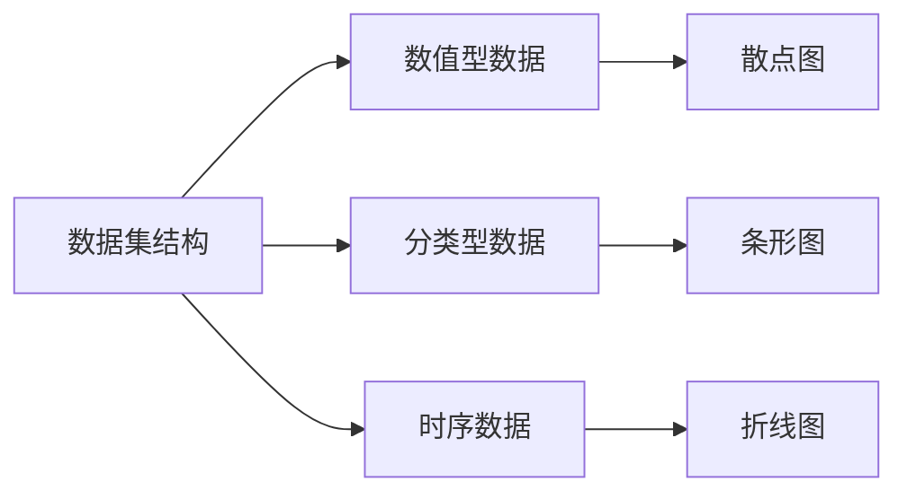

                 

# 数据集可视化分析：直观发现数据质量问题

> **关键词**：数据可视化、数据质量检测、数据分析、异常值、数据预处理

> **摘要**：本文旨在探讨数据集可视化分析在发现和解决数据质量问题中的重要性。通过详细介绍数据集可视化分析的基础知识、核心概念与联系，以及数学模型和算法原理，本文将帮助读者理解如何通过可视化方法直观地检测和改善数据质量。最后，通过实际项目案例展示数据集可视化分析在真实场景中的应用，并提供相关的开发环境搭建和资源推荐。

## **第一部分：数据集可视化分析基础**

### 第1章：数据集可视化分析概述

#### **1.1 数据集可视化分析的重要性**

在当今数据驱动的世界中，数据集可视化分析已经成为数据分析领域的一个重要组成部分。数据集可视化分析不仅帮助我们更好地理解数据结构，还能有效地发现数据中的异常和错误。通过直观的可视化展示，我们可以快速识别数据质量问题，从而为后续的数据处理和业务决策提供有力支持。

- **可视化分析的作用**：数据集可视化分析在企业数据分析中扮演着关键角色。首先，它可以帮助我们直观地理解数据的分布和趋势，揭示隐藏在数据背后的信息。其次，可视化分析可以快速发现数据中的异常值和错误，如缺失值、重复值和异常分布。这些异常值和错误如果不及时处理，可能会对数据分析和业务决策产生负面影响。因此，数据集可视化分析是确保数据质量的重要步骤。

- **可视化分析的应用场景**：数据集可视化分析广泛应用于多个领域。例如，在数据挖掘和机器学习中，可视化分析可以帮助我们理解数据的结构和关系，优化模型参数，提高模型的准确性。在商业智能和业务决策支持中，可视化分析可以用于监控销售趋势、客户行为和市场变化，为企业提供及时的决策依据。此外，在金融领域，数据集可视化分析可以帮助分析师监控股票市场趋势、评估投资风险，从而制定更有效的投资策略。总之，数据集可视化分析在各种数据密集型场景中都发挥着重要作用。

#### **1.2 数据集可视化分析的基础知识**

为了深入探讨数据集可视化分析，我们需要了解一些基础知识。以下是对数据可视化、数据分析和数据探索等基本概念的介绍。

- **数据可视化**：数据可视化是一种将数据转换为图形和视觉元素的方法，以便更直观地理解和传达数据信息。通过图形化的方式，我们可以将复杂的数据关系和趋势以直观、易于理解的形式展示出来。常见的可视化方法包括散点图、条形图、折线图、饼图等。

- **数据分析**：数据分析是指通过统计和数学方法对数据进行处理、分析和解释的过程。数据分析的目标是从数据中提取有价值的信息，帮助决策者做出更明智的决策。数据分析方法包括描述性统计、推断性统计、回归分析、聚类分析等。

- **数据探索**：数据探索是指通过分析数据，发现数据中的模式和关系，以便更好地理解数据。数据探索通常包括数据清洗、数据转换、数据降维和可视化等步骤。数据探索可以帮助我们发现数据中的异常、趋势和关联，从而为后续的数据分析和建模提供基础。

#### **1.3 数据可视化工具**

在数据集可视化分析过程中，选择合适的可视化工具非常重要。以下是对几种常见的数据可视化工具的概述。

- **Tableau**：Tableau 是一款功能强大的数据可视化工具，适用于各种规模的企业。Tableau 提供了丰富的图表类型和交互功能，用户可以通过简单的拖拽操作快速创建可视化报表。

- **Power BI**：Power BI 是微软推出的一款商业智能工具，支持数据连接、数据建模和可视化。Power BI 提供了丰富的数据可视化选项和自定义能力，用户可以轻松创建专业的报表和仪表板。

- **Python的Matplotlib和Seaborn库**：Matplotlib 和 Seaborn 是 Python 中的两个常用的数据可视化库。Matplotlib 提供了丰富的绘图函数和样式，用户可以自定义图形的各个方面。Seaborn 建立在 Matplotlib 之上，提供了更高级的可视化功能，适用于统计分析和数据探索。

### **第2章：数据集可视化分析核心概念与联系**

#### **2.1 数据集结构**

在数据集可视化分析中，理解数据集的结构至关重要。以下是一个简单的 Mermaid 流程图，展示了数据集的常见结构，包括数值型数据、分类型数据和时序数据。



- **数值型数据**：数值型数据通常表示连续的数值，如身高、体重、销售额等。数值型数据可以通过散点图、折线图和箱线图等可视化方法展示。
- **分类型数据**：分类型数据表示离散的类别，如性别、颜色、产品类别等。分类型数据可以通过条形图、饼图和箱线图等可视化方法展示。
- **时序数据**：时序数据表示随时间变化的数据，如股票价格、销售量、天气变化等。时序数据可以通过折线图、K线图和时间序列分析等可视化方法展示。

#### **2.2 数据可视化原理**

数据可视化背后的原理涉及数据的层次结构、数据的编码和图形的映射等多个方面。以下是对数据可视化原理的简要介绍。

- **数据的层次结构**：数据通常具有层次结构，包括数据源、数据集、数据记录和数据字段等。数据可视化通过将不同层次的数据映射到不同的图形元素中，实现数据的层次化展示。
- **数据的编码**：数据编码是将数据转换为视觉元素的过程。常见的数据编码方法包括颜色编码、大小编码、位置编码和形状编码等。通过合适的编码方法，可以有效地传达数据的特征和关系。
- **图形的映射**：图形映射是将数据属性映射到图形元素的过程。例如，将数据点映射到散点图中的位置，将数据值映射到条形图中的高度等。合适的图形映射方法可以直观地展示数据的特征和关系。

#### **2.3 数据可视化与数据分析的关系**

数据可视化与数据分析是相辅相成的两个过程。数据可视化支持数据分析，而数据分析又影响数据可视化。

- **数据可视化支持数据分析**：数据可视化可以帮助分析师快速理解数据结构、发现数据异常和趋势。通过直观的图形展示，分析师可以更准确地识别数据中的问题和机会，从而为数据分析提供有力的支持。
- **数据分析影响数据可视化**：数据分析的结果会影响数据可视化的设计和实现。例如，在数据挖掘过程中，分析师可能会发现新的数据关系和模式，这些结果可以指导数据可视化工具的参数调整和图表选择，以更有效地传达分析结果。

### **第3章：数据集可视化分析数学模型**

#### **3.1 数据清洗和预处理**

数据清洗和预处理是数据集可视化分析的重要步骤。以下是对数据清洗和预处理的基本步骤的介绍。

- **缺失值处理**：缺失值处理是指对数据集中的缺失值进行填充或删除。常见的方法包括平均值填充、中值填充、最临近填充和插值填充等。
- **异常值检测**：异常值检测是指识别和标记数据集中的异常值。常见的异常值检测方法包括统计学方法（如三倍标准差法）、机器学习方法（如孤立森林）和基于密度的聚类方法等。
- **数据标准化**：数据标准化是指将数据缩放到一个标准范围内，以便更好地比较和可视化。常见的方法包括最小-最大标准化、Z-Score标准化和Robust标准化等。

#### **3.2 数据降维与可视化**

数据降维是将高维数据转换成低维数据的过程，以便更好地分析和可视化。以下是对常见的数据降维技术及其在数据可视化中的应用的介绍。

- **主成分分析（PCA）**：主成分分析是一种常用的线性降维技术，通过将数据投影到新的正交基上，提取最重要的特征，从而减少数据的维度。PCA 在数据可视化中常用于生成低维数据图，如散点图和折线图等。
- **t-SNE**：t-Distributed Stochastic Neighbor Embedding（t-SNE）是一种非线性的降维技术，通过将高维数据映射到低维空间中，使得相似的数据点在低维空间中更接近。t-SNE 在数据可视化中常用于生成低维数据图，如散点图和热力图等。

#### **3.3 可视化中的数学公式与模型**

在数据可视化中，一些数学公式和模型被广泛应用于数据清洗、数据降维和异常值检测等步骤。以下是对这些数学公式和模型的简要介绍。

- **距离度量**：距离度量是用于计算两个数据点之间相似度的指标。常用的距离度量方法包括欧氏距离、曼哈顿距离和切比雪夫距离等。
- **相似性计算**：相似性计算是用于比较两个数据点之间相似度的指标。常用的相似性计算方法包括余弦相似度、皮尔逊相关系数和Jaccard系数等。
- **聚类算法**：聚类算法是将数据集划分为多个群组的方法。常见的聚类算法包括K-均值聚类、层次聚类和DBSCAN等。

### **第二部分：数据质量问题检测与可视化**

#### **第4章：数据质量问题检测方法**

#### **4.1 数据质量评估标准**

数据质量评估是确保数据质量的重要步骤。以下是对常见的数据质量评估指标和评估流程的介绍。

- **数据质量评估指标**：常见的数据质量评估指标包括完整性、一致性、准确性和及时性等。完整性指标用于评估数据集中缺失值的比例；一致性指标用于评估数据在不同来源之间的匹配程度；准确性指标用于评估数据的真实性和可靠性；及时性指标用于评估数据更新的频率和时效性。

- **评估流程**：数据质量评估的基本流程包括数据清洗、数据验证和评估报告。数据清洗是指通过缺失值处理、异常值检测和标准化等步骤，确保数据集的完整性和一致性。数据验证是指通过对比多个数据源、进行数据比对和一致性检查，确保数据的准确性。评估报告是对数据质量评估结果进行总结和报告，包括评估指标、评估方法和评估结果等。

#### **4.2 数据质量检测算法**

数据质量检测算法用于识别和标记数据集中的质量问题。以下是对常见的数据质量检测算法和检测系统的介绍。

- **异常检测算法**：异常检测算法是用于识别数据集中异常值和错误的方法。常见的异常检测算法包括孤立森林、基于密度的聚类和统计学方法。孤立森林算法通过将数据点投影到高维空间中，识别孤立的数据点。基于密度的聚类算法通过计算数据点的密度，识别异常点。统计学方法通过计算数据的分布和概率，识别异常值。

- **数据质量监测系统**：数据质量监测系统是一种自动化的数据质量检测工具，可以实时监控数据质量，识别和报告数据质量问题。数据质量监测系统通常包括数据采集、数据预处理、异常检测和报告生成等模块。通过数据质量监测系统，企业可以及时发现和解决数据质量问题，确保数据的准确性和可靠性。

### **第5章：数据质量问题可视化分析**

#### **5.1 数据质量问题可视化**

数据质量问题可视化是将数据质量问题以图形化的方式展示的过程。以下是对数据质量问题可视化的方法和案例的介绍。

- **可视化方法**：数据质量问题可视化可以采用多种图形化方法，如散点图、条形图、折线图和箱线图等。散点图可以用于展示数据的分布和异常值；条形图可以用于展示数据的比例和分布；折线图可以用于展示数据的变化趋势；箱线图可以用于展示数据的分布和异常值。

- **案例展示**：以下是一个数据质量问题可视化的案例。假设我们有一个销售数据集，包含销售额、订单数量和客户满意度等字段。通过绘制箱线图，我们可以直观地发现数据集中的异常值，如销售额异常高的订单和客户满意度异常低的订单。

```python
import pandas as pd
import matplotlib.pyplot as plt

# 加载数据集
sales_data = pd.read_csv('sales_data.csv')

# 绘制箱线图
plt.figure(figsize=(10, 6))
plt.boxplot(sales_data['sales'])
plt.title('Sales Data Distribution')
plt.xlabel('Order ID')
plt.ylabel('Sales Amount')
plt.show()
```

通过箱线图，我们可以发现一些销售额异常高的订单，这些订单可能是由于数据错误或异常交易引起的。对于这些异常订单，我们可以进一步调查和核实，确保数据的准确性。

#### **5.2 数据质量改进策略**

数据质量改进策略是用于改善数据质量的方法和措施。以下是对数据质量改进策略的介绍。

- **数据清洗**：数据清洗是指通过缺失值处理、异常值检测和数据转换等步骤，确保数据的完整性和一致性。常见的数据清洗方法包括平均值填充、中值填充、最临近填充和插值填充等。

- **数据标准化**：数据标准化是指将数据缩放到一个标准范围内，以便更好地比较和可视化。常见的数据标准化方法包括最小-最大标准化、Z-Score标准化和Robust标准化等。

- **数据质量监控**：数据质量监控是指通过建立自动化的数据质量检测系统，实时监控数据质量，识别和报告数据质量问题。数据质量监控可以帮助企业及时发现和解决数据质量问题，确保数据的准确性和可靠性。

### **第6章：数据质量报告撰写与沟通**

#### **6.1 数据质量报告撰写**

数据质量报告是用于记录和报告数据质量评估结果和改进措施的重要文档。以下是对数据质量报告的框架和撰写技巧的介绍。

- **报告框架**：数据质量报告通常包括以下部分：
  - 概述：介绍数据质量报告的目的、背景和范围。
  - 数据质量分析：描述数据质量评估的过程、方法和结果。
  - 改进措施：提出数据质量改进的措施和方案。
  - 建议：提出数据质量管理方面的建议和改进方向。
  - 结论：总结数据质量报告的主要发现和结论。

- **报告撰写技巧**：为了撰写高质量的数据质量报告，以下是一些撰写技巧：
  - 使用清晰的标题和摘要：确保报告的标题和摘要有力地概括报告的内容和目的。
  - 使用图表和可视化：通过图表和可视化展示数据质量评估的结果，使报告更直观、易于理解。
  - 提供详细的解释和说明：对于数据质量评估的结果和改进措施，提供详细的解释和说明，帮助读者更好地理解。
  - 组织报告结构：确保报告的结构清晰、逻辑连贯，方便读者阅读和理解。

#### **6.2 数据质量沟通与协作**

数据质量沟通与协作是确保数据质量改进方案得到有效实施和执行的重要环节。以下是对数据质量沟通策略和协作工具的介绍。

- **沟通策略**：为了确保数据质量问题和改进方案得到有效的沟通和执行，以下是一些沟通策略：
  - 定期召开数据质量会议：定期组织数据质量会议，邀请相关利益相关者参加，讨论和解决数据质量问题。
  - 搭建沟通渠道：建立有效的沟通渠道，如邮件、即时通讯工具和协作平台，方便团队成员之间的沟通和协作。
  - 提供明确的指导和反馈：对于数据质量改进方案，提供明确的指导和反馈，确保团队成员理解任务和要求。

- **协作工具**：以下是一些常用的数据质量沟通和协作工具：
  - JIRA：JIRA 是一款功能强大的项目管理工具，适用于团队协作和任务管理。
  - Trello：Trello 是一款简单易用的协作工具，通过看板和卡片管理任务和项目。
  - Slack：Slack 是一款即时通讯工具，适用于团队内部和跨团队的沟通和协作。

### **第三部分：数据集可视化分析实战**

#### **第7章：数据集可视化分析实战项目**

#### **7.1 项目规划与需求分析**

在进行数据集可视化分析实战项目时，项目规划和需求分析是至关重要的步骤。以下是对项目规划和需求分析的具体内容的介绍。

- **项目规划**：项目规划是项目开始前的一项重要工作，包括确定项目的目标、范围、资源和时间表等。在数据集可视化分析项目中，项目规划的具体步骤如下：
  - 确定项目目标：明确项目要解决的具体问题，如数据质量问题、数据探索需求等。
  - 确定项目范围：明确项目涉及的领域、数据集和功能要求。
  - 确定项目资源和时间表：确定项目所需的人力、技术资源和预计的完成时间。

- **需求分析**：需求分析是理解项目需求和目标的过程，包括收集和分析用户需求、确定数据集和可视化需求等。在数据集可视化分析项目中，需求分析的具体步骤如下：
  - 收集用户需求：通过问卷调查、访谈和用户会议等方式，了解用户对数据集可视化分析的需求和期望。
  - 确定数据集：根据用户需求，确定需要可视化的数据集，包括数据源、字段和数据格式等。
  - 确定可视化需求：根据用户需求和数据集特点，确定需要实现的可视化图表类型和功能。

#### **7.2 数据收集与预处理**

数据收集与预处理是数据集可视化分析的重要环节。以下是对数据收集和预处理的具体步骤的介绍。

- **数据收集**：数据收集是指从各种数据源获取数据的过程。在数据集可视化分析项目中，数据收集的具体步骤如下：
  - 确定数据源：根据需求分析的结果，确定需要获取的数据源，如数据库、文件系统和API等。
  - 收集数据：使用相应的工具和技术，从数据源中获取数据，如使用数据库查询语句、文件操作和API调用等。

- **数据预处理**：数据预处理是指对收集到的数据进行清洗、转换和标准化等操作，以确保数据的质量和一致性。在数据集可视化分析项目中，数据预处理的具体步骤如下：
  - 数据清洗：对数据集中的缺失值、异常值和重复值进行清洗，确保数据的完整性和一致性。
  - 数据转换：对数据字段进行转换和规范化，如将文本转换为数字、日期格式化等，以便更好地进行数据可视化。
  - 数据标准化：对数据进行标准化处理，如最小-最大标准化、Z-Score标准化等，以便进行比较和可视化。

#### **7.3 数据可视化分析**

数据可视化分析是数据集可视化分析的核心步骤，通过直观的图形展示数据特征和关系，帮助用户更好地理解和分析数据。以下是对数据可视化分析的具体步骤和工具的介绍。

- **数据可视化分析步骤**：数据可视化分析的具体步骤如下：
  - 确定可视化需求：根据需求分析的结果，确定需要实现的可视化图表类型和功能。
  - 选择可视化工具：根据可视化需求，选择合适的可视化工具，如Python的Matplotlib、Seaborn、Tableau等。
  - 设计可视化图表：根据可视化需求和工具特性，设计合适的可视化图表，如散点图、条形图、折线图、箱线图等。
  - 实现可视化效果：使用可视化工具实现设计好的可视化图表，并进行调试和优化。

- **数据可视化分析工具**：以下是一些常用的数据可视化分析工具：
  - **Python的Matplotlib和Seaborn库**：Matplotlib 是Python中最常用的可视化库之一，提供了丰富的绘图函数和样式。Seaborn 是基于Matplotlib构建的，提供了更高级的可视化功能，适用于统计分析和数据探索。
  - **Tableau**：Tableau 是一款功能强大的数据可视化工具，适用于各种规模的企业。Tableau 提供了丰富的图表类型和交互功能，用户可以通过简单的拖拽操作快速创建可视化报表。
  - **Power BI**：Power BI 是微软推出的一款商业智能工具，支持数据连接、数据建模和可视化。Power BI 提供了丰富的数据可视化选项和自定义能力，用户可以轻松创建专业的报表和仪表板。

#### **7.4 数据分析结果解读**

数据分析结果解读是数据集可视化分析的最后一步，通过解释和解读数据分析结果，帮助用户更好地理解和利用数据。以下是对数据分析结果解读的具体步骤和技巧的介绍。

- **数据分析结果解读步骤**：数据分析结果解读的具体步骤如下：
  - 提取可视化结果：从可视化工具中提取生成的可视化图表和数据报告。
  - 分析可视化结果：对可视化结果进行深入分析，识别数据中的趋势、异常和关系。
  - 解读可视化结果：将分析结果以清晰、简洁的方式呈现给用户，使用户能够直观地理解数据。

- **数据分析结果解读技巧**：以下是一些数据分析结果解读的技巧：
  - **图表选择**：选择合适的图表类型，如散点图用于展示数据分布、条形图用于展示数据比较等。
  - **图表布局**：合理布局图表，使图表更加清晰、易于阅读。
  - **注释和标签**：在图表中添加注释和标签，解释图表的含义和数据来源。
  - **可视化故事**：将数据分析结果组织成一个故事，以更生动、引人入胜的方式呈现给用户。

### **第8章：数据集可视化分析实战案例**

在本章中，我们将通过三个实际案例，展示数据集可视化分析在各个领域的应用。这些案例将涵盖用户行为分析、金融数据分析和零售数据分析，旨在帮助读者了解数据集可视化分析的具体实现过程和应用场景。

#### **8.1 案例一：用户行为分析**

**背景**：假设我们是一家电商平台的分析师，需要对用户行为进行深入分析，以优化用户体验和提高转化率。我们拥有一个用户行为数据集，包括用户的浏览历史、购买记录、注册信息和页面停留时间等字段。

**数据预处理**：
1. **数据清洗**：对数据进行缺失值处理，使用平均值或中值填充缺失的数值字段。对于分类字段，使用众数或缺失值标记进行填充。
2. **数据转换**：将日期字段转换为日期类型，并将一些分类字段转换为数值类型，如将用户性别转换为0和1的二元编码。
3. **数据标准化**：对数值型字段进行标准化处理，如对用户浏览时长进行Z-Score标准化，以便进行比较和可视化。

**可视化实现**：
1. **用户行为趋势**：使用折线图展示用户注册量、订单量和页面访问量随时间的变化趋势。
2. **用户购买行为**：使用条形图展示不同产品类别的购买频率和销售额。
3. **用户停留时间**：使用热力图展示不同页面和产品的用户停留时间分布。

**代码解读**：
```python
import pandas as pd
import matplotlib.pyplot as plt
import seaborn as sns

# 加载数据集
user_data = pd.read_csv('user_behavior.csv')

# 数据清洗
user_data['registration_date'] = pd.to_datetime(user_data['registration_date'])
user_data['visit_duration'] = user_data['visit_duration'].fillna(user_data['visit_duration'].mean())

# 数据转换
user_data['gender'] = user_data['gender'].map({'Male': 0, 'Female': 1})

# 数据标准化
from sklearn.preprocessing import StandardScaler
scaler = StandardScaler()
user_data[['visit_duration', 'page_views']] = scaler.fit_transform(user_data[['visit_duration', 'page_views']])

# 用户行为趋势
plt.figure(figsize=(12, 6))
plt.plot(user_data['registration_date'], user_data['registration_count'], label='Registration Count')
plt.plot(user_data['registration_date'], user_data['order_count'], label='Order Count')
plt.plot(user_data['registration_date'], user_data['page_views'], label='Page Views')
plt.xlabel('Registration Date')
plt.ylabel('Count')
plt.legend()
plt.title('User Behavior Trend')
plt.show()

# 用户购买行为
product_data = user_data.groupby('product_id')['order_count'].sum().reset_index()
plt.figure(figsize=(10, 6))
plt.bar(product_data['product_id'], product_data['order_count'])
plt.xlabel('Product ID')
plt.ylabel('Order Count')
plt.title('Product Purchase Frequency')
plt.show()

# 用户停留时间
page_data = user_data.groupby('page_id')['visit_duration'].mean().reset_index()
sns.heatmap(page_data, annot=True, cmap='YlGnBu')
plt.xlabel('Page ID')
plt.ylabel('Visit Duration (seconds)')
plt.title('Page Visit Duration Distribution')
plt.show()
```

**代码解读**：
1. **数据加载**：使用 Pandas 读取用户行为数据集。
2. **数据清洗**：将日期字段转换为日期类型，并对缺失值进行填充。
3. **数据转换**：对分类字段进行编码，并将数值字段标准化。
4. **用户行为趋势**：使用折线图展示用户注册量、订单量和页面访问量随时间的变化趋势。
5. **用户购买行为**：使用条形图展示不同产品类别的购买频率。
6. **用户停留时间**：使用热力图展示不同页面和产品的用户停留时间分布。

#### **8.2 案例二：金融数据分析**

**背景**：假设我们是一家投资公司的分析师，需要对股票市场进行深入分析，以制定投资策略。我们拥有一个股票数据集，包括股票价格、交易量、市盈率和财务指标等字段。

**数据预处理**：
1. **数据清洗**：对数据进行缺失值处理，使用平均值或中值填充缺失的数值字段。对于分类字段，使用众数或缺失值标记进行填充。
2. **数据转换**：将日期字段转换为日期类型，并将一些分类字段转换为数值类型，如将交易时段转换为0和1的二元编码。
3. **数据标准化**：对数值型字段进行标准化处理，如对股票价格和交易量进行Z-Score标准化，以便进行比较和可视化。

**可视化实现**：
1. **股票价格趋势**：使用折线图展示股票价格随时间的变化趋势。
2. **交易量分布**：使用条形图展示不同交易时段的交易量分布。
3. **市盈率对比**：使用箱线图展示不同股票的市盈率分布。

**代码解读**：
```python
import pandas as pd
import matplotlib.pyplot as plt
import seaborn as sns

# 加载数据集
stock_data = pd.read_csv('stock_data.csv')

# 数据清洗
stock_data['date'] = pd.to_datetime(stock_data['date'])
stock_data['volume'] = stock_data['volume'].fillna(stock_data['volume'].mean())

# 数据转换
stock_data['session'] = stock_data['session'].map({'AM': 0, 'PM': 1})

# 数据标准化
from sklearn.preprocessing import StandardScaler
scaler = StandardScaler()
stock_data[['price', 'volume']] = scaler.fit_transform(stock_data[['price', 'volume']])

# 股票价格趋势
plt.figure(figsize=(12, 6))
plt.plot(stock_data['date'], stock_data['price'], label='Stock Price')
plt.xlabel('Date')
plt.ylabel('Price')
plt.legend()
plt.title('Stock Price Trend')
plt.show()

# 交易量分布
session_data = stock_data.groupby('session')['volume'].sum().reset_index()
plt.figure(figsize=(10, 6))
plt.bar(session_data['session'], session_data['volume'])
plt.xlabel('Session')
plt.ylabel('Volume')
plt.title('Volume Distribution')
plt.show()

# 市盈率对比
stock_data['pe_ratio'] = stock_data['pe_ratio'].fillna(stock_data['pe_ratio'].mean())
plt.figure(figsize=(10, 6))
sns.boxplot(stock_data['stock_id'], stock_data['pe_ratio'])
plt.xlabel('Stock ID')
plt.ylabel('PE Ratio')
plt.title('PE Ratio Distribution')
plt.show()
```

**代码解读**：
1. **数据加载**：使用 Pandas 读取股票数据集。
2. **数据清洗**：将日期字段转换为日期类型，并对缺失值进行填充。
3. **数据转换**：对分类字段进行编码，并将数值字段标准化。
4. **股票价格趋势**：使用折线图展示股票价格随时间的变化趋势。
5. **交易量分布**：使用条形图展示不同交易时段的交易量分布。
6. **市盈率对比**：使用箱线图展示不同股票的市盈率分布。

#### **8.3 案例三：零售数据分析**

**背景**：假设我们是一家零售公司的分析师，需要对销售数据进行分析，以优化库存管理和促销策略。我们拥有一个销售数据集，包括产品名称、销售数量、销售金额、库存水平和客户细分等字段。

**数据预处理**：
1. **数据清洗**：对数据进行缺失值处理，使用平均值或中值填充缺失的数值字段。对于分类字段，使用众数或缺失值标记进行填充。
2. **数据转换**：将日期字段转换为日期类型，并将一些分类字段转换为数值类型，如将客户细分转换为0和1的二元编码。
3. **数据标准化**：对数值型字段进行标准化处理，如对销售数量和销售金额进行Z-Score标准化，以便进行比较和可视化。

**可视化实现**：
1. **销售趋势**：使用折线图展示销售数量和销售金额随时间的变化趋势。
2. **库存水平**：使用条形图展示不同产品的库存水平。
3. **客户细分**：使用饼图展示不同客户细分的销售占比。

**代码解读**：
```python
import pandas as pd
import matplotlib.pyplot as plt
import seaborn as sns

# 加载数据集
sales_data = pd.read_csv('sales_data.csv')

# 数据清洗
sales_data['date'] = pd.to_datetime(sales_data['date'])
sales_data['sales_quantity'] = sales_data['sales_quantity'].fillna(sales_data['sales_quantity'].mean())

# 数据转换
sales_data['customer_segment'] = sales_data['customer_segment'].map({'High': 0, 'Medium': 1, 'Low': 2})

# 数据标准化
from sklearn.preprocessing import StandardScaler
scaler = StandardScaler()
sales_data[['sales_quantity', 'sales_amount']] = scaler.fit_transform(sales_data[['sales_quantity', 'sales_amount']])

# 销售趋势
plt.figure(figsize=(12, 6))
plt.plot(sales_data['date'], sales_data['sales_quantity'], label='Sales Quantity')
plt.plot(sales_data['date'], sales_data['sales_amount'], label='Sales Amount')
plt.xlabel('Date')
plt.ylabel('Quantity/Amount')
plt.legend()
plt.title('Sales Trend')
plt.show()

# 库存水平
product_data = sales_data.groupby('product_id')['sales_quantity'].sum().reset_index()
plt.figure(figsize=(10, 6))
plt.bar(product_data['product_id'], product_data['sales_quantity'])
plt.xlabel('Product ID')
plt.ylabel('Sales Quantity')
plt.title('Inventory Level')
plt.show()

# 客户细分
segment_data = sales_data.groupby('customer_segment')['sales_quantity'].sum().reset_index()
plt.figure(figsize=(8, 6))
plt.pie(segment_data['sales_quantity'], labels=segment_data['customer_segment'], autopct='%.1f%%')
plt.title('Customer Segment Sales Share')
plt.show()
```

**代码解读**：
1. **数据加载**：使用 Pandas 读取销售数据集。
2. **数据清洗**：将日期字段转换为日期类型，并对缺失值进行填充。
3. **数据转换**：对分类字段进行编码，并将数值字段标准化。
4. **销售趋势**：使用折线图展示销售数量和销售金额随时间的变化趋势。
5. **库存水平**：使用条形图展示不同产品的库存水平。
6. **客户细分**：使用饼图展示不同客户细分的销售占比。

### **附录**

#### **附录A：数据集可视化分析工具资源**

**A.1 工具资源推荐**

- **常用工具**：
  - **Tableau**：一款功能强大的数据可视化工具，适用于企业级数据分析和报告生成。
  - **Power BI**：微软推出的商业智能工具，支持数据连接、数据建模和可视化。
  - **Python的Matplotlib和Seaborn库**：Python中最常用的可视化库，适用于数据分析和数据探索。
  - **D3.js**：一款基于JavaScript的可视化库，适用于Web应用程序中的数据可视化。

- **学习资源**：
  - **书籍**：《数据可视化：使用D3.js进行交互式数据呈现》、《数据可视化实践指南》。
  - **在线课程**：Coursera上的“数据科学课程”和Udacity上的“数据可视化课程”。
  - **社区和论坛**：Stack Overflow、GitHub和Reddit的数据可视化论坛。

#### **A.2 开发环境搭建指南**

- **Python环境**：
  - **Windows**：下载并安装Python，选择添加到系统环境变量。
  - **macOS**：使用Homebrew安装Python：`brew install python`。
  - **Linux**：使用包管理器安装Python，如Ubuntu：`sudo apt-get install python3`。

- **Jupyter Notebook**：
  - **安装**：在命令行中运行`pip install notebook`。
  - **配置**：在浏览器中打开`http://localhost:8888`，使用用户名和密码登录。

- **可视化库安装**：
  - 使用`pip`安装常用的可视化库：`pip install matplotlib seaborn pandas numpy`。

#### **A.3 数据集资源**

- **公共数据集**：
  - **UCI机器学习库**：提供各种领域的数据集，用于机器学习和数据分析。
  - **Kaggle**：一个大数据竞赛平台，提供丰富的公共数据集。
  - **数据.gov**：美国政府的开放数据平台，提供多种领域的数据集。

- **数据获取途径**：
  - **API访问**：使用HTTP请求获取数据，如使用`requests`库。
  - **数据爬取**：使用Python的爬虫库（如`BeautifulSoup`和`Scrapy`），从网页中提取数据。

#### **A.4 社区与支持**

- **在线社区**：
  - **Stack Overflow**：编程问答社区，涵盖数据可视化相关问题。
  - **DataCamp**：提供数据科学和数据分析的学习资源和社区。
  - **Kaggle论坛**：Kaggle竞赛平台的官方论坛，交流数据可视化和数据分析经验。

- **技术支持**：
  - **官方文档**：查看可视化工具和库的官方文档，获取详细的使用教程和示例代码。
  - **用户论坛**：参与用户论坛和社区，与其他用户交流问题和经验。
  - **开发者社区**：加入相关技术开发社区，如GitHub和Reddit的数据可视化论坛。

### **总结**

本文详细探讨了数据集可视化分析在发现和解决数据质量问题中的重要性。通过介绍数据集可视化分析的基础知识、核心概念与联系，以及数学模型和算法原理，我们了解了如何通过可视化方法直观地检测和改善数据质量。在实战项目中，我们展示了数据集可视化分析在用户行为分析、金融数据分析和零售数据分析中的应用，并通过实际代码案例进行了详细解读。最后，我们提供了数据集可视化分析工具和资源的推荐，帮助读者搭建开发环境并获取相关学习资源。

数据集可视化分析不仅是一项技术技能，更是一种思维方式。通过可视化方法，我们可以更直观地理解数据结构、发现数据异常和关系，从而为数据分析和业务决策提供有力支持。希望本文能够帮助读者深入理解数据集可视化分析，并将其应用于实际项目，提升数据质量和分析效果。

**作者信息**：

作者：AI天才研究院/AI Genius Institute & 禅与计算机程序设计艺术 /Zen And The Art of Computer Programming

