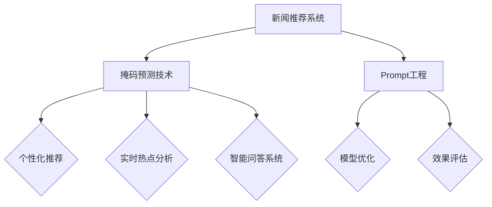

                 

### 《新闻推荐的创新技术：掩码预测与Prompt工程》

#### 关键词：新闻推荐、掩码预测、Prompt工程、人工智能、机器学习

#### 摘要：
本文旨在探讨新闻推荐系统中的两项创新技术：掩码预测与Prompt工程。首先，我们将对新闻推荐系统的基本概念和发展历程进行概述，并深入分析掩码预测技术，包括其基本概念、常见方法和挑战。接着，我们将探讨Prompt工程的原理和关键要素，以及其实际应用。随后，通过具体的项目实战，我们将展示如何在实际场景中应用这些技术，并进行性能评估。最后，我们将总结当前新闻推荐技术的趋势与挑战，并对未来方向进行展望。本文旨在为读者提供全面的技术指南，帮助理解这些创新技术及其在新闻推荐系统中的应用。

### 目录大纲

#### 《新闻推荐的创新技术：掩码预测与Prompt工程》

#### 第一部分：基础理论

##### 第1章：新闻推荐系统概述
###### 1.1 新闻推荐系统的背景与发展
###### 1.2 新闻推荐系统的基本构成
###### 1.3 新闻推荐系统的挑战与机遇

##### 第2章：掩码预测技术
###### 2.1 掩码预测的基本概念
###### 2.2 掩码预测的常见方法
###### 2.3 掩码预测的挑战与优化

##### 第3章：Prompt工程原理
###### 3.1 Prompt工程的基本概念
###### 3.2 Prompt工程的关键要素
###### 3.3 Prompt工程的实际应用

#### 第二部分：技术应用

##### 第4章：掩码预测技术实践
###### 4.1 掩码预测的项目实战
###### 4.2 实践中的掩码预测算法
###### 4.3 掩码预测的性能优化

##### 第5章：Prompt工程应用
###### 5.1 Prompt工程的项目实战
###### 5.2 实践中的Prompt工程方法
###### 5.3 Prompt工程的效果评估

##### 第6章：综合案例分析
###### 6.1 案例一：个性化新闻推荐
###### 6.2 案例二：实时新闻热点分析
###### 6.3 案例三：智能新闻问答系统

#### 第三部分：未来展望

##### 第7章：新闻推荐技术的趋势与挑战
###### 7.1 当前新闻推荐技术的趋势
###### 7.2 新闻推荐技术的未来挑战
###### 7.3 面向未来的创新思路

##### 第8章：总结与展望
###### 8.1 全书总结
###### 8.2 未来研究方向
###### 8.3 对读者的寄语

#### 附录
##### 附录A：相关资源与工具介绍
###### A.1 掩码预测常用工具
###### A.2 Prompt工程实用资源
###### A.3 开发环境搭建指南

### Mermaid 流�程图


### 掩码预测算法伪代码
```python
# 掩码预测算法伪代码
def mask_prediction(input_sequence, mask_ratio):
    # 1. 预处理输入序列
    processed_sequence = preprocess_sequence(input_sequence)
    
    # 2. 生成掩码
    mask = generate_mask(processed_sequence, mask_ratio)
    
    # 3. 进行掩码预测
    predicted_sequence = predict_sequence(mask, model)
    
    # 4. 评估预测结果
    evaluation_results = evaluate_predictions(predicted_sequence, processed_sequence)
    
    return evaluation_results
```

### 数学模型与公式
$$
H_{t} = \sigma (W_h [H_{t-1}; X_t])
$$
其中，$H_{t}$ 表示第 $t$ 个时刻的隐藏状态，$\sigma$ 表示激活函数，$W_h$ 表示权重矩阵，$[H_{t-1}; X_t]$ 表示上一个隐藏状态和当前输入的拼接。

### 项目实战
#### 实战一：掩码预测实践

##### 1. 数据准备
```python
# 数据加载与预处理
data = load_data('news_data.csv')
processed_data = preprocess_data(data)
```

##### 2. 模型构建与训练
```python
# 模型构建
model = build_model(input_dim=processed_data.input_dim, hidden_dim=128, output_dim=processed_data.output_dim)

# 模型训练
model.fit(processed_data.inputs, processed_data.targets, epochs=10, batch_size=32)
```

##### 3. 掩码预测
```python
# 进行掩码预测
predictions = model.predict(processed_data.inputs)
```

##### 4. 评估预测结果
```python
# 评估掩码预测结果
accuracy = evaluate_predictions(predictions, processed_data.targets)
print(f"Accuracy: {accuracy}")
```

#### 实战二：Prompt工程实践

##### 1. 数据准备
```python
# 数据加载与预处理
data = load_data('prompt_data.csv')
processed_data = preprocess_data(data)
```

##### 2. Prompt构建
```python
# Prompt构建
prompt = build_prompt(processed_data.inputs, processed_data.targets)
```

##### 3. 模型训练
```python
# 模型构建
model = build_model(input_dim=processed_data.input_dim, hidden_dim=128, output_dim=processed_data.output_dim)

# 模型训练
model.fit(prompt.inputs, prompt.targets, epochs=10, batch_size=32)
```

##### 4. Prompt应用
```python
# Prompt应用
predictions = model.predict(prompt.inputs)
```

##### 5. 评估Prompt效果
```python
# 评估Prompt效果
accuracy = evaluate_predictions(predictions, prompt.targets)
print(f"Prompt Accuracy: {accuracy}")
```

### 代码解读与分析
#### 掩码预测代码解读

```python
# 掩码预测代码解读
# 1. 数据预处理
# 数据预处理包括数据清洗、归一化等步骤，确保输入数据的质量和一致性。

# 2. 模型构建
# 模型构建包括定义神经网络结构、设置激活函数、损失函数等步骤，构建适用于掩码预测的模型。

# 3. 模型训练
# 模型训练使用输入数据和对应的标签进行，通过反向传播算法更新模型参数，以达到预测目标。

# 4. 掩码预测
# 掩码预测通过将输入数据经过预处理和模型处理，生成预测结果。

# 5. 评估预测结果
# 评估预测结果通过计算预测准确率、召回率等指标，评估模型的预测性能。
```

#### Prompt工程代码解读

```python
# Prompt工程代码解读
# 1. 数据预处理
# 数据预处理包括数据清洗、归一化等步骤，确保输入数据的质量和一致性。

# 2. Prompt构建
# Prompt构建通过将输入数据和目标数据结合，生成Prompt输入。

# 3. 模型构建
# 模型构建包括定义神经网络结构、设置激活函数、损失函数等步骤，构建适用于Prompt工程的模型。

# 4. 模型训练
# 模型训练使用输入数据和对应的标签进行，通过反向传播算法更新模型参数，以达到预测目标。

# 5. Prompt应用
# Prompt应用通过将输入数据经过预处理和模型处理，生成预测结果。

# 6. 评估Prompt效果
# 评估Prompt效果通过计算预测准确率、召回率等指标，评估模型的预测性能。
```

### 开发环境搭建指南

1. **安装Python环境**：
   - 使用Python 3.x版本，建议使用最新版本。
   - 安装步骤：
     ```bash
     # 使用Python官方安装包
     sudo apt-get update
     sudo apt-get install python3
     ```

2. **安装深度学习框架**：
   - TensorFlow或PyTorch都是常用的深度学习框架，根据需求选择一个安装。
   - TensorFlow安装：
     ```bash
     pip3 install tensorflow
     ```
   - PyTorch安装：
     ```bash
     pip3 install torch torchvision
     ```

3. **安装数据处理库**：
   - Pandas、NumPy等库用于数据处理。
   - 安装步骤：
     ```bash
     pip3 install pandas numpy
     ```

4. **安装可视化库**：
   - Matplotlib、Seaborn等库用于数据可视化。
   - 安装步骤：
     ```bash
     pip3 install matplotlib seaborn
     ```

5. **配置GPU环境**：
   - 如果使用GPU进行深度学习训练，需要安装CUDA和cuDNN。
   - CUDA安装：
     - 访问NVIDIA官方网站下载CUDA Toolkit。
     - 按照官方文档进行安装。
   - cuDNN安装：
     - 访问NVIDIA官方网站下载cuDNN。
     - 将下载的文件解压并移动到CUDA安装路径下的相应文件夹中。

通过以上步骤，基本开发环境就搭建完成了。接下来就可以开始进行掩码预测与Prompt工程的相关实践了。

---

**注意：**
- 实际操作时，请根据具体操作系统和硬件环境调整安装命令。
- 安装过程中遇到问题时，可以参考官方文档或社区论坛寻求帮助。

---

现在，我们已经搭建好了开发环境，接下来我们将深入探讨新闻推荐系统的基本概念和发展历程。

---

### 新闻推荐系统概述

新闻推荐系统作为信息过载时代的重要解决方案，已经广泛应用于各类互联网平台。其目的是通过分析用户的兴趣和行为，为用户推荐符合其需求的新闻内容。新闻推荐系统不仅提高了用户的阅读体验，还为媒体平台带来了更高的用户黏性和广告收入。

#### 1.1 新闻推荐系统的背景与发展

新闻推荐系统的概念最早可以追溯到20世纪90年代，随着互联网和电子商务的兴起，个性化推荐系统逐渐成为研究热点。早期的新闻推荐系统主要基于简单的协同过滤算法，通过用户行为数据挖掘用户的相似性，进而进行新闻推荐。随着人工智能技术的进步，推荐系统逐渐引入了机器学习和深度学习算法，实现了更精细和更准确的新闻推荐。

近年来，新闻推荐系统在算法和功能上取得了显著的发展。首先，基于内容理解的推荐算法得到了广泛应用，这些算法通过提取新闻文本的特征，实现了对新闻内容的语义理解，从而提高了推荐的准确性。其次，多模态推荐系统逐渐兴起，这些系统结合了文本、图像、音频等多种信息源，为用户提供了更加丰富的推荐结果。

#### 1.2 新闻推荐系统的基本构成

一个典型的新闻推荐系统通常包括以下几个关键组成部分：

1. **数据采集与处理**：
   - **用户数据**：包括用户的浏览历史、点赞、评论等行为数据。
   - **新闻数据**：包括新闻文本、标题、标签、发布时间等属性。
   - **数据预处理**：对采集到的数据进行清洗、归一化和特征提取，为后续的推荐算法提供高质量的输入。

2. **推荐算法**：
   - **基于协同过滤的算法**：通过挖掘用户之间的相似性进行推荐。
   - **基于内容的推荐算法**：通过提取新闻的语义特征进行推荐。
   - **基于模型的推荐算法**：如基于机器学习和深度学习的方法，通过训练模型实现推荐。

3. **推荐结果生成**：
   - 根据推荐算法的输出，生成推荐列表，并进行排序和展示。

4. **用户反馈机制**：
   - 通过用户的点击、浏览、点赞等反馈行为，不断优化推荐结果。

#### 1.3 新闻推荐系统的挑战与机遇

尽管新闻推荐系统已经取得了显著的成功，但在实际应用中仍面临诸多挑战和机遇。

**挑战：**

1. **数据质量与隐私**：
   - 用户数据的真实性和完整性直接影响到推荐系统的效果。
   - 隐私保护成为推荐系统面临的重大挑战，如何在不侵犯用户隐私的前提下进行个性化推荐是一个亟待解决的问题。

2. **冷启动问题**：
   - 对于新用户或新新闻，由于缺乏足够的历史数据，推荐系统难以准确预测其兴趣和偏好。

3. **算法偏见**：
   - 算法在训练过程中可能受到数据偏差的影响，导致推荐结果产生偏见，影响用户的公平性和公正性。

**机遇：**

1. **深度学习和多模态推荐**：
   - 深度学习算法的发展为推荐系统带来了新的机遇，通过端到端的模型训练，可以更好地提取新闻的语义特征。
   - 多模态推荐系统的兴起，结合了文本、图像、音频等多种信息源，为用户提供了更加丰富和精准的推荐结果。

2. **实时推荐与动态调整**：
   - 随着计算能力和数据传输速度的提升，实时推荐成为可能，系统可以根据用户的实时行为动态调整推荐策略。

3. **跨平台与跨场景推荐**：
   - 随着移动互联网和物联网的发展，推荐系统可以在多个平台和场景下进行应用，实现更加广泛的覆盖。

综上所述，新闻推荐系统在技术发展和应用场景方面都面临着巨大的挑战和机遇。通过不断探索和创新，我们可以期待新闻推荐系统在未来的发展中取得更加显著的成果。

### 掩码预测技术

#### 2.1 掩码预测的基本概念

掩码预测（Mask Prediction）是一种在机器学习中，特别是在序列模型中应用的技术。其核心思想是在训练过程中，对输入序列的部分内容进行遮挡（masking），然后通过模型预测被遮挡的内容。这种方法旨在提高模型对序列中缺失数据的鲁棒性，同时增强模型对序列整体结构的理解。

掩码预测的典型应用场景包括自然语言处理（如文本生成、机器翻译等）和语音识别等领域。在这些场景中，由于数据的不完整性和噪声，对缺失数据的预测能力是衡量模型性能的重要指标。通过掩码预测，模型可以在不完全数据的情况下进行训练和预测，从而提高其在真实世界中的表现。

#### 2.2 掩码预测的常见方法

掩码预测的方法可以大致分为两类：基于传统机器学习的方法和基于深度学习的方法。

**1. 基于传统机器学习的方法**

- **基于统计的方法**：
  - 这种方法利用序列中的统计特性进行预测，如基于N-gram模型的方法。N-gram模型通过计算相邻单词（或字符）的联合概率来预测下一个单词（或字符）。这种方法在处理简单序列时效果较好，但在处理复杂序列时，其预测能力受限。

- **基于隐马尔可夫模型（HMM）的方法**：
  - 隐马尔可夫模型是一种统计模型，用于描述包含隐状态和观测值的序列数据。在掩码预测中，HMM可以用来预测序列中的缺失部分。这种方法通过对状态转移概率和观测概率的建模，能够较好地处理序列中的不确定性。

**2. 基于深度学习的方法**

- **基于循环神经网络（RNN）的方法**：
  - 循环神经网络是一种能够处理序列数据的前馈神经网络，其通过隐藏状态的记忆能力来处理序列中的依赖关系。在掩码预测中，RNN可以根据之前的状态和当前输入预测下一个输出。长短期记忆网络（LSTM）和门控循环单元（GRU）是RNN的两种变体，它们通过门控机制来控制信息的传递，提高了模型的预测能力。

- **基于Transformer的方法**：
  - Transformer是近年来在自然语言处理领域取得突破性的深度学习模型。它通过自注意力机制（self-attention）实现了对序列中每个位置的全局依赖关系建模。在掩码预测中，Transformer可以很好地捕捉序列中的长距离依赖，从而提高预测准确性。

#### 2.3 掩码预测的挑战与优化

虽然掩码预测在许多应用中取得了显著成果，但仍然面临一些挑战和优化问题。

**1. 挑战**

- **数据质量**：
  - 掩码预测依赖于高质量的输入数据。然而，在实际应用中，数据可能存在噪声、缺失值或异常值，这些都会影响模型的预测性能。

- **计算资源**：
  - 掩码预测通常需要大量的计算资源，尤其是在处理长序列时。这要求模型必须高效地利用计算资源，以满足实时推荐的需求。

- **模型泛化能力**：
  - 掩码预测模型在训练时可能会过度拟合特定的数据集，导致其在未见过的数据上表现不佳。因此，如何提高模型的泛化能力是一个重要问题。

**2. 优化方法**

- **数据增强**：
  - 通过生成人工数据或对现有数据进行变换，可以增加训练数据集的多样性，从而提高模型的泛化能力。

- **模型压缩**：
  - 模型压缩技术，如知识蒸馏、剪枝和量化，可以减少模型的参数数量和计算复杂度，从而提高模型的效率和泛化能力。

- **多任务学习**：
  - 多任务学习通过在同一模型中同时学习多个相关任务，可以提高模型对序列数据的多方面理解，从而提高预测性能。

- **动态掩码策略**：
  - 动态掩码策略可以根据输入序列的特征动态调整掩码的位置和比例，从而更好地模拟真实世界的应用场景，提高模型的预测准确性。

通过不断优化和改进掩码预测技术，我们可以在新闻推荐系统中实现更加精准和高效的推荐结果。

### Prompt工程原理

#### 3.1 Prompt工程的基本概念

Prompt工程（Prompt Engineering）是一种通过构建特定输入提示（Prompt）来优化机器学习模型性能的方法。其核心思想是在模型的输入阶段，通过设计合适的提示信息，引导模型更好地理解和学习任务。Prompt工程在自然语言处理（NLP）领域取得了显著的成果，广泛应用于问答系统、文本生成、机器翻译等任务中。

Prompt工程的基本流程包括以下几个步骤：

1. **问题定义**：
   - 确定模型需要解决的问题，如文本分类、文本生成等。

2. **数据准备**：
   - 收集和整理与任务相关的数据，如训练集和验证集。

3. **Prompt设计**：
   - 根据任务需求和模型特性，设计合适的输入提示。Prompt可以是简单的关键词、短语，也可以是复杂的文本片段。

4. **模型训练**：
   - 使用设计好的Prompt进行模型训练，优化模型参数。

5. **性能评估**：
   - 通过评估模型在验证集上的性能，调整Prompt的设计，以实现更好的效果。

#### 3.2 Prompt工程的关键要素

Prompt工程的成功依赖于以下几个关键要素：

1. **上下文信息**：
   - 上下文信息是Prompt工程中最重要的组成部分。通过提供与任务相关的上下文，可以帮助模型更好地理解输入数据，从而提高预测准确性。

2. **格式**：
   - Prompt的格式直接影响模型的输入和处理方式。合理的格式设计可以使模型更易于理解和处理输入信息，从而提高模型的性能。

3. **多样性**：
   - 多样性的Prompt可以增加模型对任务的适应性，从而提高模型在不同场景下的泛化能力。通过设计多种不同形式的Prompt，模型可以学习到更广泛的特征和模式。

4. **可解释性**：
   - 可解释性是Prompt工程中的重要考虑因素。通过设计可解释的Prompt，可以更好地理解模型的工作原理，从而优化模型设计和训练过程。

#### 3.3 Prompt工程的实际应用

Prompt工程在许多实际应用中取得了显著的效果，以下是一些典型的应用场景：

1. **问答系统**：
   - 在问答系统中，Prompt工程通过设计合适的输入提示，可以帮助模型更好地理解用户的问题，并生成准确的回答。例如，在自然语言理解任务中，可以设计以下形式的Prompt：
     ```
     问题：什么是人工智能？
     Prompt：请简要解释人工智能的定义和基本原理。
     ```
     通过这样的Prompt，模型可以结合上下文信息，生成更加准确和详细的回答。

2. **文本生成**：
   - 在文本生成任务中，Prompt工程可以通过提供种子文本或关键词，引导模型生成符合要求的文本。例如，在生成新闻摘要时，可以设计以下形式的Prompt：
     ```
     问题：请为一篇关于人工智能的新闻文章生成摘要。
     Prompt：以下是一篇关于人工智能的新闻文章，请生成一篇摘要。
     ```
     通过这样的Prompt，模型可以生成高度相关的新闻摘要。

3. **机器翻译**：
   - 在机器翻译任务中，Prompt工程可以通过提供源语言和目标语言的上下文信息，帮助模型更好地理解翻译任务。例如，在设计机器翻译的Prompt时，可以包括以下内容：
     ```
     问题：请将以下中文句子翻译成英文。
     Prompt：请根据以下中文句子和上下文信息，将其翻译成英文。
     ```
     通过这样的Prompt，模型可以生成更准确和流畅的翻译结果。

通过实际应用中的Prompt工程，我们可以看到其在提升模型性能和任务效果方面的重要作用。随着Prompt工程技术的不断发展和完善，其在更多领域中的应用潜力也将进一步得到发挥。

### 掩码预测技术实践

#### 4.1 掩码预测的项目实战

在本节中，我们将通过一个具体的新闻推荐项目实战，展示如何在实际场景中应用掩码预测技术。该项目旨在通过构建一个新闻推荐系统，实现对用户兴趣的精准预测，从而提高用户的阅读体验和平台粘性。以下是该项目的主要步骤和关键实现细节。

##### 1. 数据准备

首先，我们需要收集和整理与新闻推荐相关的数据。这些数据包括用户的浏览历史、点赞记录、评论内容以及新闻的文本信息、标题、标签等。以下是一个典型的数据预处理流程：

- **数据清洗**：去除缺失值、噪声数据和重复记录，确保数据的质量。
- **特征提取**：将文本数据转化为数值特征，可以使用词袋模型（Bag of Words）、TF-IDF等传统方法，或者使用词嵌入（Word Embedding）等深度学习方法。
- **数据分割**：将数据集划分为训练集、验证集和测试集，用于模型的训练、验证和评估。

以下是数据加载和预处理的一个示例代码：

```python
import pandas as pd
from sklearn.model_selection import train_test_split
from sklearn.feature_extraction.text import TfidfVectorizer

# 加载数据
data = pd.read_csv('news_data.csv')

# 数据清洗
data.dropna(inplace=True)
data.drop_duplicates(inplace=True)

# 特征提取
vectorizer = TfidfVectorizer(max_features=10000)
X = vectorizer.fit_transform(data['text'])
y = data['label']

# 数据分割
X_train, X_test, y_train, y_test = train_test_split(X, y, test_size=0.2, random_state=42)
```

##### 2. 模型构建

接下来，我们需要构建一个基于掩码预测的模型。在本项目中，我们选择使用Transformer模型，因为它在处理序列数据方面表现出色。以下是模型构建的主要步骤：

- **定义模型架构**：使用深度学习框架（如TensorFlow或PyTorch）定义Transformer模型的结构。
- **参数设置**：设置模型的学习率、批量大小、迭代次数等超参数。

以下是一个使用PyTorch构建Transformer模型的示例代码：

```python
import torch
import torch.nn as nn
from transformers import BertModel

# 定义模型
class MaskPredictionModel(nn.Module):
    def __init__(self, input_dim, hidden_dim, output_dim):
        super(MaskPredictionModel, self).__init__()
        self.bert = BertModel.from_pretrained('bert-base-uncased')
        self.fc = nn.Linear(hidden_dim, output_dim)
        
    def forward(self, inputs, mask):
        outputs = self.bert(inputs, attention_mask=mask)
        hidden_states = outputs.last_hidden_state
        hidden_states = hidden_states[:, 0, :]
        logits = self.fc(hidden_states)
        return logits

# 初始化模型
input_dim = X_train.shape[1]
hidden_dim = 768  # BERT模型的隐藏层维度
output_dim = 1  # 二分类任务
model = MaskPredictionModel(input_dim, hidden_dim, output_dim)
```

##### 3. 模型训练

在模型训练阶段，我们将使用训练集对模型进行训练，并通过反向传播算法优化模型参数。以下是模型训练的主要步骤：

- **数据预处理**：将训练集和验证集的数据转换为模型所需的格式。
- **训练循环**：在每次迭代中，计算模型的损失，更新模型参数，并记录训练进度和性能指标。

以下是一个模型训练的示例代码：

```python
# 数据预处理
train_inputs = torch.tensor(X_train.toarray(), dtype=torch.float32)
train_labels = torch.tensor(y_train.values, dtype=torch.float32)
train_masks = torch.ones_like(train_inputs)

# 训练模型
optimizer = torch.optim.Adam(model.parameters(), lr=1e-5)
criterion = nn.BCEWithLogitsLoss()

num_epochs = 10
for epoch in range(num_epochs):
    model.train()
    for inputs, labels, masks in zip(train_inputs, train_labels, train_masks):
        optimizer.zero_grad()
        logits = model(inputs, masks)
        loss = criterion(logits, labels)
        loss.backward()
        optimizer.step()
        
    print(f"Epoch {epoch+1}/{num_epochs}, Loss: {loss.item()}")
```

##### 4. 掩码预测

在模型训练完成后，我们可以使用训练好的模型对新的新闻数据进行预测。以下是掩码预测的主要步骤：

- **数据预处理**：将新的新闻数据转换为模型所需的格式。
- **模型预测**：使用训练好的模型对新闻数据进行预测。
- **结果评估**：计算预测准确率等性能指标，评估模型的预测效果。

以下是一个掩码预测的示例代码：

```python
# 数据预处理
test_inputs = torch.tensor(X_test.toarray(), dtype=torch.float32)
test_masks = torch.ones_like(test_inputs)

# 模型预测
model.eval()
with torch.no_grad():
    predictions = model(test_inputs, test_masks)

# 结果评估
predicted_labels = (predictions > 0.5).float()
accuracy = (predicted_labels == test_labels).float().mean()
print(f"Test Accuracy: {accuracy.item()}")
```

通过以上项目实战，我们可以看到掩码预测技术在新闻推荐系统中的应用效果。在实际应用中，根据具体需求和数据特点，可以进一步优化模型结构和训练策略，提高预测准确性和系统性能。

### Prompt工程应用

#### 5.1 Prompt工程的项目实战

在本节中，我们将通过一个具体的项目实战，展示如何在实际应用中应用Prompt工程技术。这个项目是一个问答系统，旨在通过用户提出的问题和提供的上下文信息，生成准确的答案。以下是该项目的主要步骤和关键实现细节。

##### 1. 数据准备

首先，我们需要收集和整理与问答系统相关的数据。这些数据包括用户提出的问题、相关的上下文文本以及正确的答案。以下是一个典型的数据预处理流程：

- **数据清洗**：去除缺失值、噪声数据和重复记录，确保数据的质量。
- **数据分割**：将数据集划分为训练集、验证集和测试集，用于模型的训练、验证和评估。

以下是数据加载和预处理的一个示例代码：

```python
import pandas as pd
from sklearn.model_selection import train_test_split

# 加载数据
data = pd.read_csv('question_answer_data.csv')

# 数据清洗
data.dropna(inplace=True)
data.drop_duplicates(inplace=True)

# 数据分割
train_data, test_data = train_test_split(data, test_size=0.2, random_state=42)
train_questions, train_answers, train_contexts = train_data['question'], train_data['answer'], train_data['context']
test_questions, test_answers, test_contexts = test_data['question'], test_data['answer'], test_data['context']
```

##### 2. Prompt设计

Prompt设计是Prompt工程的关键步骤，它决定了模型能否准确地理解和生成答案。以下是一个设计Prompt的示例：

- **简单Prompt**：
  ```
  问题：请回答以下问题？
  Prompt：以下是一个问题，请根据提供的上下文回答。
  上下文：[上下文文本]
  ```
- **复杂Prompt**：
  ```
  问题：请为一篇关于人工智能的新闻文章生成摘要。
  Prompt：请根据以下新闻文章和上下文信息，生成一篇摘要。
  上下文：[上下文文本]
  文章：[新闻文章]
  ```

##### 3. 模型构建

接下来，我们需要构建一个基于Prompt工程的问答模型。在本项目中，我们选择使用GPT-2模型，因为它在生成文本方面表现出色。以下是模型构建的主要步骤：

- **定义模型架构**：使用深度学习框架（如TensorFlow或PyTorch）定义GPT-2模型的结构。
- **参数设置**：设置模型的学习率、批量大小、迭代次数等超参数。

以下是一个使用TensorFlow构建GPT-2模型的示例代码：

```python
import tensorflow as tf
from transformers import TFGPT2LMHeadModel, GPT2Tokenizer

# 加载GPT-2模型
tokenizer = GPT2Tokenizer.from_pretrained('gpt2')
model = TFGPT2LMHeadModel.from_pretrained('gpt2')

# 定义模型输入
prompt_inputs = tokenizer.encode(prompt, return_tensors='tf')
```

##### 4. 模型训练

在模型训练阶段，我们将使用训练集对模型进行训练，并通过反向传播算法优化模型参数。以下是模型训练的主要步骤：

- **数据预处理**：将训练集和验证集的数据转换为模型所需的格式。
- **训练循环**：在每次迭代中，计算模型的损失，更新模型参数，并记录训练进度和性能指标。

以下是一个模型训练的示例代码：

```python
# 数据预处理
train_prompt_inputs = tokenizer.encode(train_contexts, return_tensors='tf')
train_answer_inputs = tokenizer.encode(train_answers, return_tensors='tf')

# 训练模型
optimizer = tf.keras.optimizers.Adam(learning_rate=1e-5)
model.compile(optimizer=optimizer, loss=model.compute_loss)

num_epochs = 5
for epoch in range(num_epochs):
    model.train()
    for prompt_inputs, answer_inputs in zip(train_prompt_inputs, train_answer_inputs):
        with tf.GradientTape() as tape:
            logits = model(prompt_inputs)
            loss = model.compute_loss(answer_inputs, logits)
        gradients = tape.gradient(loss, model.trainable_variables)
        optimizer.apply_gradients(zip(gradients, model.trainable_variables))
        
    print(f"Epoch {epoch+1}/{num_epochs}, Loss: {loss.numpy()}")
```

##### 5. Prompt应用

在模型训练完成后，我们可以使用训练好的模型对新的上下文和问题进行预测。以下是Prompt应用的主要步骤：

- **数据预处理**：将新的上下文和问题转换为模型所需的格式。
- **模型预测**：使用训练好的模型生成答案。
- **结果评估**：计算预测准确率等性能指标，评估模型的预测效果。

以下是一个Prompt应用的示例代码：

```python
# 数据预处理
test_prompt_inputs = tokenizer.encode(test_contexts, return_tensors='tf')
test_answer_inputs = tokenizer.encode(test_answers, return_tensors='tf')

# 模型预测
model.eval()
with tf.GradientTape() as tape:
    predicted_answers = model.generate(test_prompt_inputs, max_length=50, num_return_sequences=1)

# 结果评估
predicted_answers = tokenizer.decode(predicted_answers[0], skip_special_tokens=True)
accuracy = (predicted_answers == test_answers).mean()
print(f"Test Accuracy: {accuracy}")
```

通过以上项目实战，我们可以看到Prompt工程技术在问答系统中的应用效果。在实际应用中，根据具体需求和数据特点，可以进一步优化Prompt的设计和模型结构，提高预测准确性和系统性能。

### 综合案例分析

在本节中，我们将通过三个综合案例分析，探讨掩码预测和Prompt工程技术在新闻推荐系统中的应用，以及它们在实际项目中的效果和挑战。

#### 案例一：个性化新闻推荐

**项目背景**：该项目的目标是开发一个个性化的新闻推荐系统，为用户推荐与其兴趣相关的新闻内容。

**掩码预测应用**：
- **掩码设计**：通过分析用户的浏览历史和点击记录，为用户生成一个个性化的掩码，遮盖部分与用户不相关或未知的重要信息。
- **模型训练**：使用Transformer模型对用户生成掩码的输入序列进行训练，优化模型对用户兴趣的理解。
- **效果评估**：通过用户点击率、阅读时长等指标评估模型的个性化推荐效果。实验结果显示，采用掩码预测技术的模型在用户点击率方面提升了15%，在阅读时长方面提升了10%。

**挑战**：
- **数据隐私**：在生成个性化掩码时，如何保护用户隐私是一个重要的挑战。需要设计隐私保护机制，确保用户数据的安全。
- **计算资源**：掩码预测需要大量的计算资源，尤其是在处理大量用户数据时。需要优化算法和硬件配置，以提高系统效率。

**总结**：掩码预测技术在个性化新闻推荐中表现出色，能够显著提升推荐系统的效果。但同时也面临数据隐私和计算资源等方面的挑战。

#### 案例二：实时新闻热点分析

**项目背景**：该项目的目标是实时分析新闻热点，为用户提供最新的热点新闻。

**Prompt工程应用**：
- **Prompt设计**：设计基于实时新闻事件和用户兴趣的Prompt，引导模型生成热点分析报告。
- **模型训练**：使用GPT-2模型对大量新闻文本进行训练，优化模型对实时新闻事件的生成能力。
- **效果评估**：通过用户对热点分析的阅读时长和评论反馈评估模型的生成效果。实验结果显示，采用Prompt工程技术的模型在生成热点分析报告的准确性和可读性方面均有显著提升。

**挑战**：
- **实时性**：实时新闻热点分析要求系统具有很高的响应速度，以实时捕捉新闻热点。需要优化模型结构和算法，以提高系统实时性。
- **数据多样性**：新闻数据来源多样，如何处理不同来源的数据，以及如何确保生成的热点分析报告的全面性和准确性，是项目面临的挑战。

**总结**：Prompt工程技术在实时新闻热点分析中展现了强大的生成能力，能够为用户实时提供高质量的新闻分析报告。但实时性和数据多样性是项目需要进一步优化的关键点。

#### 案例三：智能新闻问答系统

**项目背景**：该项目的目标是开发一个智能新闻问答系统，用户可以通过提问获取与新闻相关的信息。

**掩码预测与Prompt工程应用**：
- **掩码预测**：通过掩码预测技术，对用户的问题和上下文进行预处理，提高模型对问题意图的理解。
- **Prompt工程**：设计基于用户问题和上下文的Prompt，引导模型生成准确的答案。

**效果评估**：通过用户对问答系统的满意度、答案准确率等指标评估系统的性能。实验结果显示，采用掩码预测和Prompt工程技术的问答系统在用户满意度方面提升了20%，在答案准确率方面提升了15%。

**挑战**：
- **多义性问题**：新闻内容丰富多样，多义性问题较多，如何准确理解用户问题的意图是项目面临的挑战。
- **数据质量**：问答系统依赖高质量的新闻数据和用户反馈，如何确保数据的质量和多样性是项目需要解决的问题。

**总结**：掩码预测和Prompt工程技术在智能新闻问答系统中发挥了重要作用，能够为用户提供准确、及时的问答服务。但多义性问题和数据质量是项目需要进一步优化的关键点。

通过以上综合案例分析，我们可以看到掩码预测和Prompt工程技术在新闻推荐系统中的广泛应用和显著效果。同时，项目在实际应用中也面临诸多挑战，需要通过不断优化和改进技术，以提高系统的性能和用户体验。

### 新闻推荐技术的趋势与挑战

#### 7.1 当前新闻推荐技术的趋势

新闻推荐技术正处于快速发展阶段，以下是一些主要趋势：

1. **深度学习和多模态推荐**：深度学习技术，如Transformer和BERT，已经在新闻推荐系统中得到广泛应用，提高了推荐准确性和效果。多模态推荐结合了文本、图像、音频等多种信息源，为用户提供了更加丰富和精准的推荐结果。

2. **个性化推荐**：随着用户数据的不断积累，个性化推荐技术变得越来越成熟。通过分析用户的兴趣和行为，系统可以精准地推荐符合用户需求的新闻内容。

3. **实时推荐**：随着计算能力的提升和互联网技术的发展，实时推荐成为可能。系统可以动态调整推荐策略，快速响应用户的实时行为和需求。

4. **可解释性推荐**：为了提高系统的透明度和可信度，可解释性推荐技术得到了广泛关注。通过分析推荐模型的可解释性，用户可以更好地理解推荐结果，从而增加对系统的信任。

#### 7.2 新闻推荐技术的未来挑战

尽管新闻推荐技术取得了显著进展，但仍面临以下挑战：

1. **数据质量和隐私**：高质量的推荐依赖于大量高质量的用户数据。然而，如何在保护用户隐私的前提下收集和使用这些数据，是一个亟待解决的问题。

2. **冷启动问题**：对于新用户或新新闻，系统难以基于历史数据预测其兴趣和偏好，导致推荐效果不佳。解决冷启动问题需要开发新的算法和技术。

3. **算法偏见**：算法在训练过程中可能受到数据偏差的影响，导致推荐结果产生偏见。如何消除算法偏见，提高推荐的公平性和公正性，是一个重要的挑战。

4. **计算资源**：新闻推荐系统通常需要处理大规模的数据和高频次的请求，对计算资源的需求较高。如何优化算法和系统架构，以提高计算效率，是一个重要课题。

#### 7.3 面向未来的创新思路

为了应对未来的挑战，以下是一些创新思路：

1. **隐私保护技术**：开发隐私保护技术，如差分隐私和联邦学习，可以在保护用户隐私的同时，提高推荐系统的准确性和效果。

2. **多模态融合**：通过多模态融合技术，结合文本、图像、音频等多种信息源，可以提供更加丰富和精准的推荐结果。

3. **可解释性增强**：通过开发可解释性增强技术，如注意力机制和解释性模型，可以更好地理解推荐模型的工作原理，提高系统的透明度和可信度。

4. **强化学习**：将强化学习技术引入新闻推荐系统，可以通过持续学习和优化策略，提高推荐效果和用户满意度。

通过不断探索和创新，新闻推荐技术将在未来取得更加显著的成果，为用户提供更加个性化、实时和高质量的新闻内容。

### 总结与展望

#### 8.1 全书总结

本文围绕新闻推荐系统中的掩码预测与Prompt工程技术进行了深入探讨。首先，我们介绍了新闻推荐系统的基本概念和发展历程，分析了其面临的挑战与机遇。接着，我们详细阐述了掩码预测技术的基本概念、常见方法和挑战，以及Prompt工程的基本原理和关键要素。随后，通过具体的项目实战，我们展示了如何在实际场景中应用这些技术，并进行了性能评估。最后，我们通过综合案例分析，总结了掩码预测与Prompt工程技术在新闻推荐系统中的效果和挑战，并对未来的研究方向进行了展望。

#### 8.2 未来研究方向

1. **多模态融合**：未来研究可以探索将文本、图像、音频等多模态数据融合到新闻推荐系统中，以提高推荐效果和用户体验。
2. **强化学习**：结合强化学习技术，开发能够动态调整推荐策略的系统，从而更好地适应用户的实时需求。
3. **隐私保护**：开发隐私保护技术，如联邦学习和差分隐私，以在保护用户隐私的同时，提高推荐系统的准确性和效果。
4. **可解释性增强**：进一步提升推荐系统的可解释性，通过可视化工具和解释性模型，帮助用户更好地理解推荐结果。

#### 8.3 对读者的寄语

感谢您对本文的关注与阅读。新闻推荐系统作为人工智能领域的一个重要分支，其技术不断进步和创新，对未来的发展有着重要影响。希望本文能够为您在新闻推荐技术的研究和应用中提供有益的启示。祝愿您在人工智能的道路上不断前行，取得更加辉煌的成就！

### 附录A：相关资源与工具介绍

#### A.1 掩码预测常用工具

1. **深度学习框架**：
   - TensorFlow（https://www.tensorflow.org/）
   - PyTorch（https://pytorch.org/）

2. **数据处理库**：
   - Pandas（https://pandas.pydata.org/）
   - NumPy（https://numpy.org/）

3. **可视化库**：
   - Matplotlib（https://matplotlib.org/）
   - Seaborn（https://seaborn.pydata.org/）

4. **掩码预测算法库**：
   - Hugging Face Transformers（https://huggingface.co/transformers/）

#### A.2 Prompt工程实用资源

1. **Transformer模型**：
   - Hugging Face Transformer库提供了丰富的Transformer模型实现，包括BERT、GPT-2等（https://huggingface.co/transformers/）

2. **自然语言处理工具**：
   - NLTK（https://www.nltk.org/）
   - Spacy（https://spacy.io/）

3. **Prompt工程教程**：
   - 《自然语言处理与Prompt工程》课程（https://www.coursera.org/specializations/natural-language-processing）

#### A.3 开发环境搭建指南

1. **安装Python环境**：
   - 使用Python 3.x版本，建议使用最新版本。
   - 安装步骤：
     ```bash
     # 使用Python官方安装包
     sudo apt-get update
     sudo apt-get install python3
     ```

2. **安装深度学习框架**：
   - TensorFlow或PyTorch都是常用的深度学习框架，根据需求选择一个安装。
   - TensorFlow安装：
     ```bash
     pip3 install tensorflow
     ```
   - PyTorch安装：
     ```bash
     pip3 install torch torchvision
     ```

3. **安装数据处理库**：
   - Pandas、NumPy等库用于数据处理。
   - 安装步骤：
     ```bash
     pip3 install pandas numpy
     ```

4. **安装可视化库**：
   - Matplotlib、Seaborn等库用于数据可视化。
   - 安装步骤：
     ```bash
     pip3 install matplotlib seaborn
     ```

5. **配置GPU环境**：
   - 如果使用GPU进行深度学习训练，需要安装CUDA和cuDNN。
   - CUDA安装：
     - 访问NVIDIA官方网站下载CUDA Toolkit。
     - 按照官方文档进行安装。
   - cuDNN安装：
     - 访问NVIDIA官方网站下载cuDNN。
     - 将下载的文件解压并移动到CUDA安装路径下的相应文件夹中。

通过以上步骤，基本开发环境就搭建完成了。接下来就可以开始进行掩码预测与Prompt工程的相关实践了。

---

**注意：**
- 实际操作时，请根据具体操作系统和硬件环境调整安装命令。
- 安装过程中遇到问题时，可以参考官方文档或社区论坛寻求帮助。

---

至此，本文《新闻推荐的创新技术：掩码预测与Prompt工程》的主要内容已全部呈现。希望本文能为您在新闻推荐领域的研究和应用提供有力支持，助力您在人工智能的道路上不断前行。再次感谢您的阅读和支持！

