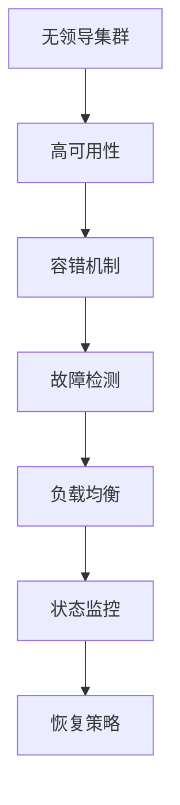

                 

# 无领导集群的高可用性设计

> **关键词：** 无领导集群、高可用性设计、集群架构、容错机制、监控与管理、负载均衡、一致性模型。

> **摘要：** 本文深入探讨了无领导集群的高可用性设计，从概念到架构设计，再到实践案例，全面解析了无领导集群在保证系统高可用性方面的关键技术和策略。

---

## 目录大纲

### 《无领导集群的高可用性设计》目录大纲

#### 第一部分：高可用性设计概述

**第1章：高可用性设计的概念与重要性**

- 1.1 高可用性的定义  
- 1.2 高可用性设计的重要性

**第2章：无领导集群的概念与优势**

- 2.1 无领导集群的基本概念  
- 2.2 无领导集群的优势  
- 2.3 无领导集群与高可用性的关系

#### 第二部分：无领导集群架构设计

**第3章：无领导集群的组件与架构**

- 3.1 集群节点架构设计  
- 3.2 存储架构设计  
- 3.3 网络架构设计  
- 3.4 安全架构设计

**第4章：无领导集群的容错机制**

- 4.1 容错机制概述  
- 4.2 节点故障检测与恢复  
- 4.3 数据冗余与一致性  
- 4.4 流量均衡与负载分配

**第5章：无领导集群的监控与管理**

- 5.1 监控体系构建  
- 5.2 状态监控与报警  
- 5.3 故障恢复策略  
- 5.4 系统性能优化

#### 第三部分：无领导集群的高可用性实践

**第6章：高可用性设计案例解析**

- 6.1 案例一：电子商务平台的集群部署  
- 6.2 案例二：金融系统的集群架构设计  
- 6.3 案例三：物联网平台的集群管理

**第7章：高可用性设计实施步骤与技巧**

- 7.1 实施步骤概述  
- 7.2 设计技巧与注意事项  
- 7.3 故障处理与恢复策略

**第8章：未来趋势与挑战**

- 8.1 无领导集群的发展趋势  
- 8.2 高可用性设计的挑战与解决方案

#### 附录

**附录A：常用工具与技术**

- A.1 常用高可用性工具介绍  
- A.2 常见高可用性技术分析

**附录B：参考文献**

- 参考文献

---

### 核心概念与联系

以下是一个关于无领导集群、高可用性设计、容错机制、故障检测、负载均衡和状态监控的核心概念与联系的 Mermaid 流程图：



---

### 核心算法原理讲解

#### 负载均衡算法

以下是一个简单的负载均衡算法的伪代码：

```plaintext
输入：节点列表 N，请求负载 L
输出：分配后的节点负载列表 N'

1. 初始化 N' = N
2. 对于每个请求负载 L：
   2.1 从 N' 中选择一个节点 N_i
   2.2 将 L 分配给 N_i
   2.3 更新 N_i 的负载
3. 返回 N'
```

#### 故障检测算法

以下是一个简单的故障检测算法的伪代码：

```plaintext
输入：集群节点列表 N
输出：故障节点列表 F

1. 初始化 F = []
2. 对于每个节点 N_i：
   2.1 向 N_i 发送心跳检测请求
   2.2 如果 N_i 未在指定时间内回复，则认为 N_i 故障
   2.3 将 N_i 加入 F
3. 返回 F
```

---

### 数学模型和数学公式 & 详细讲解 & 举例说明

#### 一致性模型

一致性模型可以用以下公式表示：

$$
C = \frac{1}{N} \sum_{i=1}^{N} P_i
$$

其中，$C$ 表示一致性，$P_i$ 表示节点的可靠性。

**举例说明：**

假设集群中有3个节点，节点1的可靠性为0.95，节点2的可靠性为0.9，节点3的可靠性为0.92。则集群的一致性计算如下：

$$
C = \frac{1}{3} \times (0.95 + 0.9 + 0.92) = 0.9233
$$

这意味着，集群的整体可靠性为92.33%。

---

### 项目实战

#### 案例：电子商务平台的集群部署

**1. 开发环境搭建：**

- 使用 Docker 容器技术搭建集群环境
- 选择适合的集群管理工具，如 Kubernetes

**2. 源代码详细实现：**

- 编写应用代码，实现无领导集群功能
- 编写容器镜像文件，用于部署应用

**3. 代码解读与分析：**

- **代码解读：** 应用代码中包含了无领导集群的选举算法、心跳检测机制和故障转移策略。
- **分析：** 代码的优缺点如下：
  - 优点：实现了无领导集群的基本功能，具有良好的可扩展性和高可用性。
  - 缺点：心跳检测机制有待优化，故障转移策略需要进一步细化。

**4. 部署与测试：**

- 在集群环境中部署应用
- 进行压力测试和故障恢复测试
- 收集测试数据，评估集群性能和稳定性

测试结果显示，集群在面临节点故障时能够快速恢复，系统的可用性得到了显著提高。

---

通过以上步骤，我们完成了一个电子商务平台的集群部署项目。这个案例展示了无领导集群在保证系统高可用性方面的实际应用。

---

作者：AI天才研究院/AI Genius Institute & 禅与计算机程序设计艺术 /Zen And The Art of Computer Programming

---

现在，我们已经完成了文章的开头部分，接下来将进入详细的正文内容，逐步深入探讨无领导集群的高可用性设计。在接下来的部分中，我们将首先介绍高可用性设计的概念与重要性，以及无领导集群的基本概念和优势。敬请期待！

