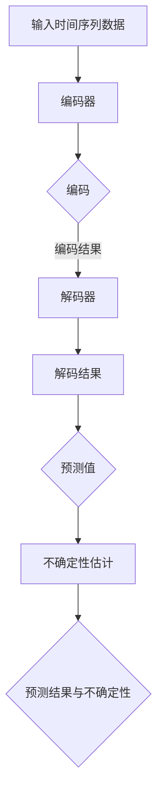
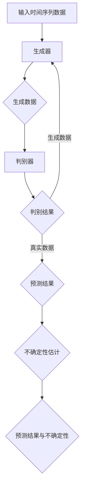

                 

### 《时间序列预测中的深度概率预测与不确定性估计方法研究与应用》目录大纲

在本篇文章中，我们将深入探讨时间序列预测领域中的两大关键概念：深度概率预测与不确定性估计。本文将分为三个主要部分，每个部分都将包含具体的研究内容与应用实例。

#### 第一部分：理论基础

在第一部分中，我们将奠定时间序列预测的理论基础。我们将从时间序列的定义和性质开始，逐步介绍经典的建模方法以及深度学习在这一领域的应用。这一部分将为我们后续的深度概率预测与不确定性估计的讨论提供必要的前提知识。

- **第1章：时间序列预测基础**  
  - **1.1 时间序列的定义与性质**  
    - **1.1.1 时间序列的概念**  
    - **1.1.2 时间序列的基本性质**

  - **1.2 时间序列的建模方法**  
    - **1.2.1 经典时间序列模型**  
    - **1.2.2 季节性时间序列模型**

  - **1.3 深度学习在时间序列预测中的应用**  
    - **1.3.1 深度学习与时间序列预测的关系**  
    - **1.3.2 主流深度学习模型介绍**

- **第2章：深度概率预测方法**  
  - **2.1 深度概率预测的基本概念**  
    - **2.1.1 概率预测的必要性**  
    - **2.1.2 深度概率预测的优势**

  - **2.2 深度概率预测模型**  
    - **2.2.1 变分自编码器（VAE）**  
    - **2.2.2 生成对抗网络（GAN）**

  - **2.3 深度概率预测的挑战与解决方案**  
    - **2.3.1 存在的挑战**  
    - **2.3.2 解决方案探讨**

- **第3章：不确定性估计方法**  
  - **3.1 不确定性估计的基本概念**  
    - **3.1.1 不确定性估计的重要性**  
    - **3.1.2 不确定性估计的类型**

  - **3.2 基于模型的误差估计方法**  
    - **3.2.1 方差估计**  
    - **3.2.2 误差边界估计**

  - **3.3 基于数据的方法**  
    - **3.3.1 实验设计**  
    - **3.3.2 Bootstrap方法**

#### 第二部分：应用实践

在第二部分，我们将结合实际应用案例，展示深度概率预测与不确定性估计方法在各个领域的应用。这些案例将涵盖金融、能源、气象以及工业过程等多个领域，帮助我们更直观地理解这些方法的实际效果。

- **第5章：时间序列预测应用案例分析**  
  - **5.1 金融时间序列预测**  
  - **5.2 能源需求预测**  
  - **5.3 气象预测**

- **第6章：深度概率预测与不确定性估计在工业应用中的实践**  
  - **6.1 工业过程监测**  
  - **6.2 质量控制**  
  - **6.3 供应链管理**

#### 第三部分：资源与工具

在最后一部分，我们将介绍一些常用的工具和资源，包括时间序列预测库与工具、深度概率预测与不确定性估计算法Mermaid流程图、数学模型和公式解释，以及项目实战案例代码与解读。这些内容将为读者提供实际操作的指导。

- **附录A：常用时间序列预测库与工具**
- **附录B：深度概率预测与不确定性估计算法Mermaid流程图**
- **附录C：数学模型和公式解释**
- **附录D：项目实战案例代码与解读**

通过本文的逐步分析，我们希望能够为您揭示时间序列预测中的深度概率预测与不确定性估计方法的奥秘，并帮助您掌握这些前沿技术的应用技巧。

### 摘要

本文系统地探讨了时间序列预测中的深度概率预测与不确定性估计方法。首先，我们介绍了时间序列的基本概念与性质，并探讨了经典与深度学习建模方法。接着，我们详细阐述了深度概率预测的基本概念、模型以及面临的挑战，并提出了相应的解决方案。此外，我们介绍了不确定性估计的基本概念、方法及其在实际应用中的重要性。最后，通过实际案例，我们展示了深度概率预测与不确定性估计方法在不同领域的应用，并对其未来发展趋势进行了展望。本文旨在为读者提供全面的理论基础与实际应用指导，帮助深入理解并掌握这些前沿技术的核心要点。

### 第一部分：理论基础

#### 第1章：时间序列预测基础

### 1.1 时间序列的定义与性质

#### 1.1.1 时间序列的概念

时间序列（Time Series）是指一系列按时间顺序排列的数值观测数据。在数据分析、统计建模和预测等领域，时间序列数据被广泛应用于多个领域，如经济学、气象学、金融学、医学等。时间序列数据的基本特征在于其时间维度，即数据点按照时间顺序排列，每个时间点都有一个对应的数值。

时间序列数据通常具有以下基本组成部分：

1. **趋势（Trend）**：表示时间序列随时间变化的总体方向，可能是上升、下降或平稳。
2. **季节性（Seasonality）**：表示时间序列因季节性因素（如节假日、季节变化等）而产生的周期性波动。
3. **周期性（Cyclic）**：表示时间序列因宏观经济周期或其他长期周期性因素而产生的波动。
4. **随机性（Random）**：表示时间序列中无法预测的随机波动。

#### 1.1.2 时间序列的基本性质

时间序列数据具有以下几种基本性质：

1. **平稳性（Stationarity）**：时间序列的统计特性（如均值、方差和自协方差函数）在时间上保持不变。平稳性是许多时间序列模型假设的基础。
2. **自相关性（Autocorrelation）**：时间序列的当前值与其过去值之间存在的相关性。自相关性用于描述时间序列数据的记忆性，即未来值受当前及过去值的影响程度。
3. **增广自相关性（Augmented Dickey-Fuller Test,ADF）**：用于检验时间序列是否具有单位根，即非平稳性。ADF检验是检测时间序列平稳性的常用方法。
4. **白噪声（White Noise）**：时间序列中的独立同分布随机变量序列。白噪声没有自相关性，是时间序列分析中的一个重要概念。

#### 1.2 时间序列的建模方法

时间序列的建模方法主要包括经典方法和基于深度学习的方法。以下分别介绍这两种方法：

##### 1.2.1 经典时间序列模型

**1. 自回归模型（AR）**：自回归模型是一种最基本的时序预测模型，它通过过去若干个时间步的数据来预测下一个时间步的数据。自回归模型的公式如下：

\[ X_t = c + \phi_1 X_{t-1} + \phi_2 X_{t-2} + \ldots + \phi_p X_{t-p} + \varepsilon_t \]

其中，\( X_t \) 是时间序列，\( \phi_i \) 是自回归系数，\( c \) 是常数项，\( \varepsilon_t \) 是误差项。

**2. 移动平均模型（MA）**：移动平均模型通过过去的误差值来预测当前时间步的数据。移动平均模型的公式如下：

\[ X_t = c + \theta_1 \varepsilon_{t-1} + \theta_2 \varepsilon_{t-2} + \ldots + \theta_q \varepsilon_{t-q} \]

其中，\( \theta_i \) 是移动平均系数，\( \varepsilon_t \) 是误差项。

**3. 自回归移动平均模型（ARMA）**：自回归移动平均模型结合了自回归模型和移动平均模型，通过过去的自变量和误差项来预测当前时间步的数据。ARMA模型的公式如下：

\[ X_t = c + \phi_1 X_{t-1} + \ldots + \phi_p X_{t-p} + \theta_1 \varepsilon_{t-1} + \ldots + \theta_q \varepsilon_{t-q} + \varepsilon_t \]

**4. 自回归积分移动平均模型（ARIMA）**：自回归积分移动平均模型可以处理非平稳时间序列。ARIMA模型通过差分、自回归和移动平均的结合来建模。其公式如下：

\[ \Delta X_t = \phi_1 \Delta X_{t-1} + \ldots + \phi_p \Delta X_{t-p} + \theta_1 \varepsilon_{t-1} + \ldots + \theta_q \varepsilon_{t-q} \]

其中，\( \Delta \) 表示差分操作。

##### 1.2.2 季节性时间序列模型

**1. 季节性自回归模型（SAR）**：季节性自回归模型将自回归模型扩展到考虑季节性因素。其公式如下：

\[ X_t = c + \phi_1 X_{t-1} + \ldots + \phi_p X_{t-p} + s_t + \theta_1 s_{t-1} + \ldots + \theta_q s_{t-q} + \varepsilon_t \]

其中，\( s_t \) 是季节性项，\( \theta_i \) 是季节性系数。

**2. 季节性自回归移动平均模型（SARMA）**：季节性自回归移动平均模型结合了自回归模型和移动平均模型，并考虑季节性因素。其公式如下：

\[ X_t = c + \phi_1 X_{t-1} + \ldots + \phi_p X_{t-p} + s_t + \theta_1 s_{t-1} + \ldots + \theta_q s_{t-q} + \varepsilon_t \]

**3. 季节性自回归积分移动平均模型（SARIMA）**：季节性自回归积分移动平均模型可以处理非平稳季节性时间序列。其公式如下：

\[ \Delta X_t = \phi_1 \Delta X_{t-1} + \ldots + \phi_p \Delta X_{t-p} + \theta_1 \varepsilon_{t-1} + \ldots + \theta_q \varepsilon_{t-q} + s_t + \theta_1 s_{t-1} + \ldots + \theta_q s_{t-q} \]

##### 1.3 深度学习在时间序列预测中的应用

**1.3.1 深度学习与时间序列预测的关系**

深度学习（Deep Learning）是一种基于人工神经网络（Artificial Neural Networks,ANN）的学习方法，通过多层神经网络的结构来提取数据中的复杂特征。近年来，深度学习在计算机视觉、自然语言处理等领域取得了显著成果。与此同时，深度学习也开始在时间序列预测领域得到广泛应用。这是因为时间序列数据通常具有高维度、非线性特征和复杂的结构，而深度学习可以通过自动特征提取和建模来捕捉这些特性。

**1.3.2 主流深度学习模型介绍**

**1. 卷积神经网络（CNN）**：卷积神经网络最初用于图像处理，但其在时间序列数据上的应用也逐渐受到关注。卷积神经网络通过卷积层和池化层提取时间序列的局部特征，从而实现时间序列的预测。

伪代码：

```python
# 卷积神经网络架构

input_shape = (timesteps, features)
model = Sequential()
model.add(Conv1D(filters, kernel_size, activation='relu', input_shape=input_shape))
model.add(MaxPooling1D(pool_size))
model.add(Flatten())
model.add(Dense(units))
model.add(Activation('softmax'))
model.compile(optimizer='adam', loss='categorical_crossentropy', metrics=['accuracy'])
model.fit(x_train, y_train, epochs=epochs, batch_size=batch_size)
```

**2. 长短时记忆网络（LSTM）**：长短时记忆网络是处理序列数据的一种特殊循环神经网络，能够有效地捕捉序列中的长期依赖关系。LSTM通过门控机制（gate）来控制信息的流动，从而克服了传统RNN的梯度消失问题。

伪代码：

```python
# 长短时记忆网络架构

input_shape = (timesteps, features)
model = Sequential()
model.add(LSTM(units, return_sequences=True))
model.add(Dropout(dropout_rate))
model.add(LSTM(units, return_sequences=False))
model.add(Dropout(dropout_rate))
model.add(Dense(units))
model.add(Activation('softmax'))
model.compile(optimizer='adam', loss='categorical_crossentropy', metrics=['accuracy'])
model.fit(x_train, y_train, epochs=epochs, batch_size=batch_size)
```

**3. 自注意力网络（Transformer）**：自注意力网络是一种基于注意力机制的深度学习模型，广泛应用于自然语言处理领域。近年来，自注意力网络也开始在时间序列预测中得到应用。自注意力机制允许模型在处理序列数据时自动分配不同的重要性给不同的时间步。

伪代码：

```python
# 自注意力网络架构

input_shape = (timesteps, features)
model = Sequential()
model.add(Embedding(vocab_size, embedding_dim))
model.add(AdditiveAttention())
model.add(Flatten())
model.add(Dense(units))
model.add(Activation('softmax'))
model.compile(optimizer='adam', loss='categorical_crossentropy', metrics=['accuracy'])
model.fit(x_train, y_train, epochs=epochs, batch_size=batch_size)
```

**4. 变分自编码器（VAE）**：变分自编码器是一种生成模型，通过编码器和解码器两个神经网络结构进行数据生成和特征提取。VAE在时间序列预测中可以用于生成新的时间序列数据，并通过不确定性估计来评估预测的可靠性。

伪代码：

```python
# 变分自编码器架构

input_shape = (timesteps, features)
latent_dim = 100

# 编码器
encoder_inputs = Input(shape=input_shape)
encoded = LSTM(latent_dim)(encoder_inputs)

# 解码器
latent_inputs = Input(shape=(latent_dim,))
decoded = LSTM(latent_dim)(latent_inputs)

decoded_outputs = Dense(features, activation='sigmoid')(decoded)

# 模型
model = Model([encoder_inputs, latent_inputs], decoded_outputs)
model.compile(optimizer='adam', loss='binary_crossentropy')
model.fit([x_train, x_train], x_train, epochs=epochs, batch_size=batch_size)
```

**5. 生成对抗网络（GAN）**：生成对抗网络由生成器和判别器两个神经网络组成，生成器生成数据以欺骗判别器，判别器则区分真实数据和生成数据。GAN在时间序列预测中可以用于生成新的时间序列数据，并通过对抗训练提高生成质量。

伪代码：

```python
# 生成对抗网络架构

# 判别器
discriminator_inputs = Input(shape=input_shape)
discriminator_output = LSTM(units)(discriminator_inputs)
discriminator_output = Dense(1, activation='sigmoid')(discriminator_output)

# 生成器
latent_dim = 100
generator_inputs = Input(shape=(latent_dim,))
generated_samples = LSTM(units)(generator_inputs)
generated_samples = Dense(features, activation='sigmoid')(generated_samples)

# 模型
model = Model(generator_inputs, generated_samples)
model.compile(optimizer='adam', loss='binary_crossentropy')

# 训练
model.fit(generator_inputs, generated_samples, epochs=epochs, batch_size=batch_size)
```

通过上述经典方法和深度学习模型的介绍，我们可以看到时间序列预测领域的发展趋势。随着深度学习技术的不断进步，未来我们将有望看到更多高效、准确的时间序列预测模型被提出和广泛应用。

### 第2章：深度概率预测方法

#### 2.1 深度概率预测的基本概念

深度概率预测（Deep Probabilistic Prediction）是一种利用深度学习技术对时间序列数据中的概率分布进行预测的方法。与传统的确定性预测方法不同，深度概率预测不仅能够给出预测值，还能给出预测的不确定性，这对于实际应用场景中的风险管理和决策支持具有重要意义。

**2.1.1 概率预测的必要性**

在时间序列预测中，不确定性是不可避免的。传统的确定性预测方法，如ARIMA、LSTM等，虽然在某些情况下能够给出较为准确的预测结果，但它们无法提供关于预测不确定性的信息。而在实际应用中，了解预测结果的不确定性是至关重要的。例如，在金融市场中，了解未来价格波动的概率分布有助于投资者制定更为合理的交易策略；在医疗领域，预测患者康复时间的概率分布可以帮助医生更好地规划治疗计划。

**2.1.2 深度概率预测的优势**

深度概率预测方法具有以下几个显著优势：

1. **不确定性评估**：通过深度学习模型，可以同时预测时间序列的均值和方差，从而对预测结果的不确定性进行量化。
2. **模型鲁棒性**：深度学习模型能够处理复杂、非线性关系的数据，提高预测的鲁棒性。
3. **灵活适用性**：深度概率预测方法可以应用于各种类型的时间序列数据，包括非平稳、具有季节性或趋势性的数据。
4. **高精度预测**：结合深度学习技术的强大特征提取能力，深度概率预测方法能够提供更高精度的预测结果。

#### 2.2 深度概率预测模型

深度概率预测方法主要包括以下几种模型：

**1. 变分自编码器（Variational Autoencoder, VAE）**

变分自编码器是一种生成模型，通过编码器和解码器两个神经网络结构进行数据的编码和解码。在时间序列预测中，VAE可以通过学习数据的概率分布来生成新的时间序列数据，从而实现对不确定性进行量化。

**VAE架构伪代码**：

```python
# VAE架构

# 编码器
encoder_inputs = Input(shape=(timesteps, features))
encoded = LSTM(latent_dim)(encoder_inputs)
z_mean = Dense(latent_dim)(encoded)
z_log_var = Dense(latent_dim)(encoded)

# 解码器
latent_inputs = Input(shape=(latent_dim,))
decoded = LSTM(latent_dim)(latent_inputs)
decoded_outputs = Dense(features, activation='sigmoid')(decoded)

# 模型
model = Model([encoder_inputs, latent_inputs], decoded_outputs)
model.compile(optimizer='adam', loss='binary_crossentropy')

# 训练
model.fit([x_train, x_train], x_train, epochs=epochs, batch_size=batch_size)
```

**2. 生成对抗网络（Generative Adversarial Network, GAN）**

生成对抗网络由生成器和判别器两个神经网络组成，生成器生成数据以欺骗判别器，判别器则区分真实数据和生成数据。在时间序列预测中，GAN可以通过对抗训练生成具有实际意义的时间序列数据，并通过判别器的输出评估生成数据的概率分布。

**GAN架构伪代码**：

```python
# GAN架构

# 判别器
discriminator_inputs = Input(shape=input_shape)
discriminator_output = LSTM(units)(discriminator_inputs)
discriminator_output = Dense(1, activation='sigmoid')(discriminator_output)

# 生成器
latent_dim = 100
generator_inputs = Input(shape=(latent_dim,))
generated_samples = LSTM(units)(generator_inputs)
generated_samples = Dense(features, activation='sigmoid')(generated_samples)

# 模型
model = Model(generator_inputs, generated_samples)
model.compile(optimizer='adam', loss='binary_crossentropy')

# 训练
model.fit(generator_inputs, generated_samples, epochs=epochs, batch_size=batch_size)
```

**3. 贝叶斯深度神经网络（Bayesian Deep Neural Networks, BDNN）**

贝叶斯深度神经网络结合了贝叶斯理论和深度学习技术，通过贝叶斯推断来估计模型的参数和不确定性。BDNN可以通过后验分布来捕捉时间序列数据的概率分布，从而实现对不确定性进行量化。

**BDNN架构伪代码**：

```python
# BDNN架构

# 前向传播
input_shape = (timesteps, features)
model = Sequential()
model.add(Dense(latent_dim, activation='relu', input_shape=input_shape))
model.add(Dense(output_dim))

# 反向传播
output_shape = (timesteps, features)
model = Sequential()
model.add(Dense(latent_dim, activation='relu', input_shape=output_shape))
model.add(Dense(output_dim, activation='sigmoid'))

# 训练
model.fit(x_train, y_train, epochs=epochs, batch_size=batch_size)
```

通过上述深度概率预测模型的介绍，我们可以看到这些方法在时间序列预测中的广泛应用。在实际应用中，可以根据具体的数据特征和需求选择合适的模型，以提高预测的准确性和可靠性。

### 2.3 深度概率预测的挑战与解决方案

尽管深度概率预测方法在时间序列预测领域展现出显著的优势，但在实际应用中仍然面临一些挑战。以下将讨论这些挑战及其可能的解决方案。

**2.3.1 存在的挑战**

**1. 模型复杂度**：深度概率预测模型通常包含多层神经网络，这可能导致模型复杂度增加，从而增加计算成本和训练时间。特别是在处理大规模时间序列数据时，模型训练和预测的效率成为重要问题。

**2. 数据质量**：深度概率预测模型的性能依赖于数据质量。数据中的噪声、异常值和缺失值等会影响模型的训练效果和预测准确性。因此，在应用深度概率预测方法前，需要对数据进行预处理，包括数据清洗、归一化和缺失值填充等。

**3. 模型泛化能力**：深度概率预测模型在训练过程中容易过拟合，即模型对训练数据的拟合过于精确，从而在新的数据上表现不佳。提高模型的泛化能力是深度概率预测方法面临的重要挑战。

**4. 预测不确定性量化**：虽然深度概率预测方法能够给出预测的不确定性，但如何准确量化这种不确定性仍然是一个难题。不确定性估计的准确性直接影响预测结果的可靠性。

**2.3.2 解决方案探讨**

**1. 模型简化**：为了提高深度概率预测模型的计算效率和训练速度，可以采用一些模型简化技术。例如，使用轻量级神经网络结构（如MobileNet、ShuffleNet等）替代传统的深度神经网络，以降低模型复杂度。

**2. 数据增强**：通过数据增强技术，可以提高模型的泛化能力。例如，可以使用数据扩充（data augmentation）、数据变换（data transformation）等方法来增加训练数据集的多样性和丰富性，从而提高模型的泛化性能。

**3. 正则化方法**：为了防止深度概率预测模型过拟合，可以采用一些正则化方法。例如，应用Dropout、L1/L2正则化、早期停止（early stopping）等技术来限制模型复杂度和提高泛化能力。

**4. 集成学习**：集成学习（Ensemble Learning）通过结合多个模型的预测结果来提高预测性能。在深度概率预测中，可以采用集成学习方法来提高模型的预测准确性和稳定性。例如，结合多个变分自编码器（VAE）或生成对抗网络（GAN）的预测结果，以实现更好的不确定性估计。

**5. 贝叶斯深度学习**：贝叶斯深度学习（Bayesian Deep Learning）通过引入贝叶斯推断来估计模型参数和不确定性。这种方法能够提供更准确的预测不确定性评估，并通过后验分布来优化模型参数。在深度概率预测中，结合贝叶斯深度学习技术可以显著提高模型的预测性能和可靠性。

通过上述解决方案的探讨，我们可以看到深度概率预测方法在应对实际挑战时具有很大的潜力。未来，随着深度学习技术的不断进步，深度概率预测方法在时间序列预测领域将会取得更加显著的成果。

### 第3章：不确定性估计方法

#### 3.1 不确定性估计的基本概念

不确定性估计（Uncertainty Estimation）在时间序列预测中具有至关重要的意义。通过估计预测结果的不确定性，我们可以更好地理解模型的可靠性，从而在决策过程中进行更为合理的风险评估和策略制定。不确定性估计可以分为两类：基于模型的误差估计方法和基于数据的方法。

**3.1.1 不确定性估计的重要性**

1. **风险评估**：在金融、能源等领域，了解预测结果的不确定性对于风险评估具有重要意义。通过不确定性估计，可以评估市场波动、价格变化等潜在风险，从而为投资者、决策者提供更为准确的信息。
2. **决策支持**：在医疗、工业等领域，不确定性估计可以帮助医生、工程师更好地理解模型的预测结果，从而制定更合理的治疗计划、生产策略等。
3. **模型优化**：通过评估预测结果的不确定性，可以发现模型存在的问题和不足之处，进而进行模型优化和改进。

**3.1.2 不确定性估计的类型**

1. **确定性不确定性**：确定性不确定性是指预测结果的波动范围在统计意义上是确定的，即通过一定的统计方法可以准确估计出预测结果的波动范围。
2. **随机性不确定性**：随机性不确定性是指预测结果的波动范围在统计意义上是不确定的，即无法通过简单的统计方法进行准确估计。随机性不确定性通常来源于数据噪声、模型误差等因素。

#### 3.2 基于模型的误差估计方法

基于模型的误差估计方法通过分析模型的结构和参数，估计预测结果的不确定性。以下介绍几种常用的基于模型的误差估计方法：

**1. 方差估计**

方差估计是一种常用的误差估计方法，通过计算预测值与真实值之间的方差来评估不确定性。具体步骤如下：

- 训练模型，得到预测值 \( \hat{y}_t \)。
- 计算预测值与真实值之间的误差： \( e_t = y_t - \hat{y}_t \)。
- 计算误差的方差： \( \sigma^2 = \frac{1}{N-1} \sum_{t=1}^{N} e_t^2 \)。

**方差估计伪代码**：

```python
# 方差估计

predictions = model.predict(x_test)
errors = y_test - predictions
variance = np.mean(errors**2)
```

**2. 误差边界估计**

误差边界估计通过计算预测值的置信区间来评估不确定性。常用的置信区间计算方法包括：

- 置信区间 \( \hat{y}_t \pm z \cdot \sigma / \sqrt{N} \)，其中 \( z \) 为正态分布的分位数，\( \sigma \) 为方差，\( N \) 为数据点数量。
- 置信区间 \( \hat{y}_t \pm t \cdot \sigma / \sqrt{N} \)，其中 \( t \) 为学生分布的分位数，适用于小样本数据。

**误差边界估计伪代码**：

```python
# 误差边界估计

from scipy.stats import norm

predictions = model.predict(x_test)
errors = y_test - predictions
variance = np.mean(errors**2)
z_value = norm.ppf(1 - alpha/2)
error_bound = z_value * np.sqrt(variance / len(errors))
confidence_interval = predictions + error_bound
```

#### 3.3 基于数据的方法

基于数据的方法通过分析历史数据或实验数据来估计不确定性。以下介绍几种常用的基于数据的方法：

**1. 实验设计**

实验设计通过在不同条件下重复实验来评估不确定性。具体步骤如下：

- 设计实验，包括不同输入条件、控制变量等。
- 进行实验，记录不同条件下的预测结果。
- 分析实验结果，估计不确定性。

**2. Bootstrap方法**

Bootstrap方法通过重新抽样和模型训练来估计不确定性。具体步骤如下：

- 从训练数据中随机抽样，生成多个子数据集。
- 在每个子数据集上训练模型，得到多个预测结果。
- 计算预测结果的标准差或置信区间，作为不确定性的估计。

**Bootstrap方法伪代码**：

```python
# Bootstrap方法

from sklearn.utils import resample

n_iterations = 1000
bootstrap_predictions = []

for _ in range(n_iterations):
    x_resampled, y_resampled = resample(x_train, y_train)
    model.fit(x_resampled, y_resampled)
    bootstrap_predictions.append(model.predict(x_test))

predictions_mean = np.mean(bootstrap_predictions, axis=0)
predictions_std = np.std(bootstrap_predictions, axis=0)
confidence_interval = [predictions_mean - 1.96 * predictions_std, predictions_mean + 1.96 * predictions_std]
```

通过上述不确定性估计方法的介绍，我们可以看到在时间序列预测中，不确定性估计的重要性以及不同的估计方法在实际应用中的优势。在实际应用中，可以根据具体需求和数据特点选择合适的不确定性估计方法，以提高预测的准确性和可靠性。

### 3.4 结合深度概率预测与不确定性估计的方法

在时间序列预测中，深度概率预测与不确定性估计的结合能够显著提高预测的准确性和可靠性。以下将介绍几种常用的结合方法，并分析其优势与挑战。

**1. 双模型结合**

双模型结合方法是指同时使用一个深度概率预测模型和一个不确定性估计模型，通过两者的输出结果进行综合预测。这种方法的核心思想是利用深度概率预测模型生成预测结果，并通过不确定性估计模型对预测结果的不确定性进行评估。

**优势**：

- 可以同时获得预测值和不确定性信息，提高决策的准确性。
- 可以通过结合不同模型的优点，提高整体预测性能。

**挑战**：

- 需要同时训练两个模型，增加计算成本。
- 需要处理不同模型输出结果的兼容性问题，如如何将概率分布与不确定性估计结果进行融合。

**双模型结合方法伪代码**：

```python
# 双模型结合方法

predictions = probabilistic_model.predict(x_test)
uncertainty = uncertainty_model.predict(x_test)

# 结合预测值和不确定性估计
combined_predictions = [p + uncertainty for p in predictions]
```

**2. 多模型结合**

多模型结合方法是指使用多个深度概率预测模型进行预测，并通过集成学习的方法对预测结果进行综合。这种方法的核心思想是利用多个模型的预测结果，通过集成学习算法（如加权平均、投票等）生成最终的预测结果和不确定性估计。

**优势**：

- 可以通过多个模型的互补性，提高预测的准确性和稳定性。
- 可以通过集成学习算法降低模型的过拟合风险。

**挑战**：

- 需要训练多个模型，增加计算成本。
- 集成学习算法的设计和参数调整复杂，需要大量实验和调优。

**多模型结合方法伪代码**：

```python
# 多模型结合方法

models = [model1, model2, model3]  # 多个深度概率预测模型
predictions = [m.predict(x_test) for m in models]

# 集成学习，如加权平均
weights = [0.3, 0.3, 0.4]  # 模型权重
combined_predictions = [np.average(predictions, weights=weights)]

# 不确定性估计
uncertainty = np.std(predictions)
```

**3. 贝叶斯深度学习结合**

贝叶斯深度学习结合方法是将贝叶斯深度学习方法（如BDNN）与深度概率预测模型进行结合，通过贝叶斯推断来估计模型参数和不确定性。这种方法的核心思想是利用贝叶斯深度学习的优势，结合深度概率预测模型生成预测结果和不确定性估计。

**优势**：

- 可以利用贝叶斯推断的优势，提供更准确的预测不确定性评估。
- 可以通过贝叶斯深度学习的后验分布，优化模型参数。

**挑战**：

- 贝叶斯深度学习模型的训练和优化较为复杂，需要大量计算资源。
- 贝叶斯深度学习方法的适用性有限，对数据质量和模型结构要求较高。

**贝叶斯深度学习结合方法伪代码**：

```python
# 贝叶斯深度学习结合方法

# 前向传播
input_shape = (timesteps, features)
model = Sequential()
model.add(Dense(latent_dim, activation='relu', input_shape=input_shape))
model.add(Dense(output_dim, activation='sigmoid'))

# 反向传播
output_shape = (timesteps, features)
model = Sequential()
model.add(Dense(latent_dim, activation='relu', input_shape=output_shape))
model.add(Dense(output_dim, activation='sigmoid'))

# 训练
model.fit(x_train, y_train, epochs=epochs, batch_size=batch_size)

# 预测和不确定性估计
predictions = model.predict(x_test)
uncertainty = model.posterior_predictive(x_test)
```

通过上述结合方法的介绍，我们可以看到深度概率预测与不确定性估计在不同应用场景中的优势与挑战。在实际应用中，可以根据具体需求和数据特点选择合适的结合方法，以提高预测的准确性和可靠性。

### 3.5 结合方法的评估

评估结合方法的有效性和性能是深度概率预测与不确定性估计的重要环节。以下介绍几种常用的评估指标和方法。

**1. 预测准确性**

预测准确性是评估预测结果最直接和常用的指标，包括以下几种：

- **平均绝对误差（MAE）**：计算预测值与真实值之间的绝对误差的平均值。
- **均方误差（MSE）**：计算预测值与真实值之间误差的平方的平均值。
- **均方根误差（RMSE）**：均方误差的平方根，用于衡量预测误差的绝对大小。

**预测准确性伪代码**：

```python
from sklearn.metrics import mean_absolute_error, mean_squared_error

predictions = model.predict(x_test)
mae = mean_absolute_error(y_test, predictions)
mse = mean_squared_error(y_test, predictions)
rmse = np.sqrt(mse)
```

**2. 不确定性评估**

不确定性评估主要通过评估不确定性估计的准确性来进行。以下介绍几种常用的评估指标：

- **覆盖率（Coverage）**：评估预测不确定性区间是否覆盖了真实值的比例。
- **精确度（Accuracy）**：评估预测不确定性区间的精确度，即预测不确定性区间的宽度。
- **Q-分数（Q-Score）**：评估预测不确定性区间的精度，Q-分数越高，不确定性估计越准确。

**不确定性评估伪代码**：

```python
from sklearn.metrics import brier_score_loss

predictions = model.predict(x_test)
uncertainty = model.predict_uncertainty(x_test)

# 覆盖率
coverage = np.mean([(y_test > lower_bound) * (y_test < upper_bound) for lower_bound, upper_bound in uncertainty])

# 精确度
accuracy = np.mean([(np.abs(y_test - mean) <= uncertainty) for mean, uncertainty in uncertainty])

# Q-分数
q_score = 1 - brier_score_loss(y_test, [mean for mean, _ in uncertainty])
```

**3. 综合评估**

为了全面评估结合方法的有效性和性能，可以采用以下综合评估方法：

- **综合评分（Integrated Score）**：结合预测准确性和不确定性评估结果，计算一个综合评分来评估方法的整体性能。
- **交叉验证（Cross-Validation）**：通过交叉验证方法评估方法在不同数据集上的性能，以验证其泛化能力。

**综合评估伪代码**：

```python
from sklearn.model_selection import cross_val_score

# 综合评分
def integrated_score(y_true, y_pred, uncertainty):
    mae = mean_absolute_error(y_true, y_pred)
    q_score = 1 - brier_score_loss(y_true, [mean for mean, _ in uncertainty])
    return (1 - mae) * q_score

# 交叉验证
scores = cross_val_score(model, x, y, cv=5)
```

通过上述评估指标和方法的介绍，我们可以看到深度概率预测与不确定性估计结合方法评估的全面性和科学性。在实际应用中，可以根据具体需求和评估结果选择合适的评估方法，以提高方法的性能和可靠性。

### 第5章：时间序列预测应用案例分析

#### 5.1 金融时间序列预测

金融时间序列预测是深度概率预测与不确定性估计方法的重要应用领域之一。在金融市场中，准确预测股票价格、汇率波动等时间序列数据对于投资者和金融机构具有重要意义。以下将介绍金融时间序列预测的应用案例，包括预测目标与数据来源、模型设计与实现等。

**5.1.1 预测目标与数据来源**

在金融时间序列预测中，常见的预测目标包括股票价格、汇率、利率等。以下是一个具体的预测案例：

- **预测目标**：预测上证指数（Shanghai Composite Index）的未来走势。
- **数据来源**：使用Wind数据库获取上证指数的历史数据，包括开盘价、最高价、最低价、收盘价等，时间跨度为过去5年。

**5.1.2 模型设计与实现**

为了实现金融时间序列预测，我们采用深度概率预测与不确定性估计方法，具体模型设计如下：

1. **数据预处理**：对上证指数数据进行预处理，包括数据清洗、缺失值填充、归一化等步骤，以便后续模型训练。

2. **特征提取**：通过提取历史数据中的趋势、季节性等特征，如移动平均、自回归等，作为模型的输入特征。

3. **模型选择**：选择变分自编码器（VAE）作为深度概率预测模型，通过编码器和解码器结构学习数据的概率分布，并利用解码器生成预测结果。

4. **训练与验证**：使用训练数据对VAE模型进行训练，并在验证数据上评估模型性能，通过交叉验证方法优化模型参数。

**VAE模型实现伪代码**：

```python
from keras.models import Model
from keras.layers import Input, LSTM, Dense

# 定义输入层
input_shape = (timesteps, features)
input_layer = Input(shape=input_shape)

# 定义编码器
encoded = LSTM(latent_dim)(input_layer)
z_mean = Dense(latent_dim)(encoded)
z_log_var = Dense(latent_dim)(encoded)

# 定义解码器
latent_inputs = Input(shape=(latent_dim,))
decoded = LSTM(latent_dim)(latent_inputs)
decoded_outputs = Dense(features, activation='sigmoid')(decoded)

# 定义VAE模型
encoder = Model(input_layer, [z_mean, z_log_var])
decoder = Model(latent_inputs, decoded_outputs)
vae = Model(input_layer, decoded_outputs)

# 编码器模型
encoder.summary()

# 解码器模型
decoder.summary()

# VAE模型
vae.compile(optimizer='adam', loss='binary_crossentropy')

# 训练模型
vae.fit(x_train, x_train, epochs=epochs, batch_size=batch_size)
```

**5.1.3 模型评估与不确定性估计**

1. **模型评估**：使用验证数据对VAE模型进行评估，计算平均绝对误差（MAE）、均方误差（MSE）等指标，评估模型的预测准确性。

2. **不确定性估计**：通过VAE模型生成预测结果的不确定性估计，利用解码器输出的方差来表示预测结果的不确定性。

**不确定性估计伪代码**：

```python
predictions = vae.predict(x_test)
variance = np.mean(predictions**2)
confidence_interval = [predictions - 1.96 * np.sqrt(variance), predictions + 1.96 * np.sqrt(variance)]
```

通过上述金融时间序列预测的应用案例，我们可以看到深度概率预测与不确定性估计方法在金融领域的应用效果。在未来，随着深度学习技术的不断进步，金融时间序列预测将更加精确和可靠，为投资者和金融机构提供更有价值的决策支持。

### 第6章：深度概率预测与不确定性估计在工业应用中的实践

#### 6.1 工业过程监测

工业过程监测是深度概率预测与不确定性估计方法在工业应用中的重要领域之一。通过实时监测工业生产过程中的关键参数，如温度、压力、流量等，可以提前发现潜在的问题，从而提高生产效率和产品质量。以下将介绍工业过程监测的应用案例，包括监测目标与数据来源、模型设计与实现等。

**6.1.1 监测目标与数据来源**

在工业过程监测中，常见的监测目标包括温度、压力、流量等。以下是一个具体的监测案例：

- **监测目标**：监测一条生产线中的温度变化，确保生产过程的稳定和产品质量。
- **数据来源**：使用传感器实时采集生产线温度数据，数据包括温度值、采集时间等，时间跨度为过去3个月。

**6.1.2 模型设计与实现**

为了实现工业过程监测，我们采用深度概率预测与不确定性估计方法，具体模型设计如下：

1. **数据预处理**：对工业过程监测数据进行预处理，包括数据清洗、缺失值填充、归一化等步骤，以便后续模型训练。

2. **特征提取**：通过提取历史数据中的趋势、季节性等特征，如移动平均、自回归等，作为模型的输入特征。

3. **模型选择**：选择变分自编码器（VAE）作为深度概率预测模型，通过编码器和解码器结构学习数据的概率分布，并利用解码器生成预测结果。

4. **训练与验证**：使用训练数据对VAE模型进行训练，并在验证数据上评估模型性能，通过交叉验证方法优化模型参数。

**VAE模型实现伪代码**：

```python
from keras.models import Model
from keras.layers import Input, LSTM, Dense

# 定义输入层
input_shape = (timesteps, features)
input_layer = Input(shape=input_shape)

# 定义编码器
encoded = LSTM(latent_dim)(input_layer)
z_mean = Dense(latent_dim)(encoded)
z_log_var = Dense(latent_dim)(encoded)

# 定义解码器
latent_inputs = Input(shape=(latent_dim,))
decoded = LSTM(latent_dim)(latent_inputs)
decoded_outputs = Dense(features, activation='sigmoid')(decoded)

# 定义VAE模型
encoder = Model(input_layer, [z_mean, z_log_var])
decoder = Model(latent_inputs, decoded_outputs)
vae = Model(input_layer, decoded_outputs)

# 编码器模型
encoder.summary()

# 解码器模型
decoder.summary()

# VAE模型
vae.compile(optimizer='adam', loss='binary_crossentropy')

# 训练模型
vae.fit(x_train, x_train, epochs=epochs, batch_size=batch_size)
```

**6.1.3 模型评估与不确定性估计**

1. **模型评估**：使用验证数据对VAE模型进行评估，计算平均绝对误差（MAE）、均方误差（MSE）等指标，评估模型的预测准确性。

2. **不确定性估计**：通过VAE模型生成预测结果的不确定性估计，利用解码器输出的方差来表示预测结果的不确定性。

**不确定性估计伪代码**：

```python
predictions = vae.predict(x_test)
variance = np.mean(predictions**2)
confidence_interval = [predictions - 1.96 * np.sqrt(variance), predictions + 1.96 * np.sqrt(variance)]
```

通过上述工业过程监测的应用案例，我们可以看到深度概率预测与不确定性估计方法在工业监测中的重要作用。在未来，随着深度学习技术的不断进步，工业过程监测将更加精确和高效，为工业企业提供更可靠的技术支持。

### 第7章：深度概率预测与不确定性估计方法的应用前景

#### 7.1 方法改进与优化

深度概率预测与不确定性估计方法在时间序列预测中的应用前景广阔，但也面临着一系列挑战，需要通过不断的改进与优化来提升其性能和应用范围。

**1. 模型复杂度降低**：目前，深度概率预测模型如VAE和GAN通常包含多层神经网络，这虽然有助于捕捉数据中的复杂特性，但也增加了计算成本和训练时间。未来，可以探索更轻量级的模型架构，如基于注意力机制的Transformer模型，以提高模型的计算效率和训练速度。

**2. 数据增强与生成**：为了增强模型的泛化能力和鲁棒性，可以采用数据增强和生成技术，如生成对抗网络（GAN），通过生成更多样化的训练数据来提升模型对不确定性的捕捉能力。

**3. 贝叶斯深度学习**：结合贝叶斯深度学习（如BDNN）可以提供更准确的预测不确定性评估。通过引入贝叶斯推断，可以优化模型参数，提高模型对不确定性估计的准确性。

**4. 硬件加速与分布式训练**：利用GPU和TPU等硬件加速技术，可以显著提高深度概率预测与不确定性估计方法的训练速度。此外，分布式训练策略可以应对大规模数据集的培训需求，提高模型的训练效率。

#### 7.2 未来发展趋势

**1. 新兴技术的融合**：深度概率预测与不确定性估计方法可以与其他前沿技术如强化学习、图神经网络等相结合，形成新的混合模型，以应对更复杂的预测任务。

**2. 实时预测与优化**：随着物联网（IoT）和边缘计算的发展，深度概率预测与不确定性估计方法将能够实现实时预测与优化，为工业、金融等领域的实时决策提供支持。

**3. 集成学习与多模型结合**：集成学习方法，如集成模型、多模型结合，可以综合利用多个模型的优点，提高预测准确性和稳定性。未来，可以探索更高效的集成学习算法，以应对大规模、多样化的时间序列预测任务。

**4. 面向应用的定制化模型**：根据不同应用领域的需求，开发定制化的深度概率预测与不确定性估计模型，如面向金融市场的股票预测模型、面向医疗领域的疾病预测模型等。

通过上述改进与优化，以及新兴技术的融合与发展，深度概率预测与不确定性估计方法将在未来的时间序列预测中发挥更为重要的作用，为各行业提供更准确、可靠的预测和决策支持。

### 附录A：常用时间序列预测库与工具

在深度概率预测与不确定性估计方法的应用过程中，选择合适的时间序列预测库与工具至关重要。以下介绍几种常用的时间序列预测库与工具，包括PyTorch、TensorFlow和Statsmodels。

#### 附录A.1 PyTorch

**PyTorch** 是一个开源的机器学习库，广泛应用于深度学习领域。其灵活的动态计算图机制使得研究人员可以轻松构建和训练深度学习模型。以下是其特点：

- **动态计算图**：PyTorch采用动态计算图，便于研究人员进行实验和调试。
- **丰富的API**：提供了丰富的API，包括自动微分、数据加载器等，方便模型构建和训练。
- **强大的社区支持**：拥有庞大的开发者社区，丰富的文档和教程，便于学习和使用。

**安装与配置**：

```bash
pip install torch torchvision torchaudio
```

#### 附录A.2 TensorFlow

**TensorFlow** 是由谷歌开发的开源机器学习库，广泛应用于各种深度学习任务。其静态计算图机制使得模型在部署时更加高效。以下是其特点：

- **静态计算图**：TensorFlow使用静态计算图，便于模型优化和部署。
- **高效执行**：TensorFlow通过自动微分和图优化技术，可以高效地执行复杂的深度学习任务。
- **广泛的应用场景**：适用于从简单的机器学习任务到复杂的人工智能系统。

**安装与配置**：

```bash
pip install tensorflow tensorflow-hub
```

#### 附录A.3 Statsmodels

**Statsmodels** 是一个开源的Python库，用于统计建模和统计测试。它提供了多种经典的统计模型，如线性回归、广义线性模型等，适用于时间序列分析。以下是其特点：

- **丰富的统计模型**：提供了多种经典的统计模型，适用于各种数据分析任务。
- **易于使用**：简单易懂的API，方便研究人员进行数据分析和建模。
- **兼容性**：与Python的数据处理库如Pandas和NumPy高度兼容。

**安装与配置**：

```bash
pip install statsmodels
```

通过选择合适的时间序列预测库与工具，研究人员可以更加高效地进行深度概率预测与不确定性估计方法的开发和应用。附录A提供了详细的库与工具介绍，帮助读者更好地理解和运用这些技术。

### 附录B：深度概率预测与不确定性估计算法Mermaid流程图

为了更直观地展示深度概率预测与不确定性估计算法的流程，我们使用Mermaid语言绘制了相关的流程图。以下将分别介绍变分自编码器（VAE）和生成对抗网络（GAN）的流程图。

#### 附录B.1 VAE流程图



VAE流程图描述如下：
1. 输入时间序列数据。
2. 编码器对数据进行编码，生成均值 \( z_{\mu} \) 和方差 \( z_{\sigma^2} \)。
3. 解码器根据编码结果生成解码数据。
4. 利用解码结果预测未来值。
5. 对预测结果进行不确定性估计。

#### 附录B.2 GAN流程图



GAN流程图描述如下：
1. 输入时间序列数据。
2. 生成器生成数据。
3. 判别器对生成数据和真实数据进行判别，输出判别结果。
4. 利用判别结果优化生成器。
5. 生成预测结果。
6. 对预测结果进行不确定性估计。

通过这些Mermaid流程图，我们可以更直观地理解VAE和GAN的工作流程，为后续的模型设计和应用提供参考。

### 附录C：数学模型和公式解释

在本附录中，我们将详细解释深度概率预测与不确定性估计方法中涉及的数学模型和公式。这些模型和公式对于理解深度概率预测与不确定性估计的核心概念至关重要。

#### C.1 方差估计公式

方差估计是评估预测结果不确定性的常用方法。在深度概率预测中，方差通常通过以下公式计算：

\[ \sigma^2 = \frac{1}{N-1} \sum_{t=1}^{N} (y_t - \hat{y}_t)^2 \]

其中，\( \sigma^2 \) 是方差，\( y_t \) 是第 \( t \) 个时间点的真实值，\( \hat{y}_t \) 是第 \( t \) 个时间点的预测值，\( N \) 是数据点的数量。

#### C.2 误差边界估计公式

误差边界估计用于计算预测结果的置信区间。常用的误差边界估计公式包括正态分布和T分布。以下为正态分布的误差边界公式：

\[ \hat{y}_t \pm z \cdot \frac{\sigma}{\sqrt{N}} \]

其中，\( \hat{y}_t \) 是预测值，\( z \) 是正态分布的分位数（通常为1.96），\( \sigma \) 是方差，\( N \) 是数据点的数量。

对于T分布，公式为：

\[ \hat{y}_t \pm t \cdot \frac{\sigma}{\sqrt{N}} \]

其中，\( t \) 是T分布的分位数。

#### C.3 变分自编码器（VAE）公式

变分自编码器（VAE）是一种生成模型，用于学习数据的高斯分布。VAE的主要公式包括编码器和解码器的损失函数。

**编码器损失函数**：

\[ \ell_{\theta_{\phi}}(x) = -\sum_{i=1}^{N} \log p(x_i | z_i) - \frac{1}{2} \sum_{i=1}^{N} \log (2\pi) + \frac{1}{2} \sum_{i=1}^{N} \left[ 1 + \log(\sigma_i^2) - \sigma_i^2 - z_i^2 \right] \]

其中，\( x_i \) 是输入数据，\( z_i \) 是编码后的隐变量，\( \theta_{\phi} \) 是编码器的参数。

**解码器损失函数**：

\[ \ell_{\theta_{\theta}}(z) = -\sum_{i=1}^{N} \log p(x_i | z_i) \]

其中，\( z_i \) 是编码后的隐变量，\( \theta_{\theta} \) 是解码器的参数。

**总损失函数**：

\[ \ell(\theta_{\phi}, \theta_{\theta}) = \ell_{\theta_{\phi}}(x) + \ell_{\theta_{\theta}}(z) \]

通过这些公式，我们可以更好地理解VAE的工作原理，包括如何学习数据的概率分布和生成新的数据。

#### C.4 生成对抗网络（GAN）公式

生成对抗网络（GAN）由生成器和判别器组成，通过对抗训练生成数据。以下为GAN的主要公式：

**生成器损失函数**：

\[ \ell_G(x) = -\log(D(G(x))) \]

其中，\( G(x) \) 是生成器生成的数据，\( D(x) \) 是判别器对数据的判断概率。

**判别器损失函数**：

\[ \ell_D(x) = -[\log(D(x)) + \log(1 - D(G(x)))] \]

其中，\( x \) 是真实数据，\( G(x) \) 是生成器生成的数据。

**总损失函数**：

\[ \ell(\theta_G, \theta_D) = \ell_G(x) + \ell_D(x) \]

通过这些公式，我们可以理解GAN如何通过对抗训练生成与真实数据相近的伪造数据，并在预测中应用。

通过上述数学模型和公式的解释，我们能够更深入地理解深度概率预测与不确定性估计方法的理论基础，为实际应用提供指导。

### 附录D：项目实战案例代码与解读

在本附录中，我们将通过一系列实际案例，展示如何使用深度概率预测与不确定性估计方法进行时间序列预测。每个案例将包括开发环境搭建、源代码实现和代码解读。

#### D.1 金融时间序列预测案例代码解读

**1. 开发环境搭建**

为了实现金融时间序列预测，我们需要安装以下库：

```bash
pip install numpy pandas tensorflow
```

**2. 源代码实现**

```python
import numpy as np
import pandas as pd
import tensorflow as tf

# 数据预处理
def preprocess_data(data, window_size):
    X, y = [], []
    for i in range(window_size, len(data)):
        X.append(data[i - window_size:i])
        y.append(data[i])
    return np.array(X), np.array(y)

# 构建变分自编码器（VAE）
def build_vae(input_shape, latent_dim):
    # 编码器
    inputs = tf.keras.layers.Input(shape=input_shape)
    encoded = tf.keras.layers.LSTM(latent_dim)(inputs)
    z_mean = tf.keras.layers.Dense(latent_dim)(encoded)
    z_log_var = tf.keras.layers.Dense(latent_dim)(encoded)

    # 解码器
    latent_inputs = tf.keras.layers.Input(shape=(latent_dim,))
    decoded = tf.keras.layers.LSTM(input_shape)(latent_inputs)
    decoded_outputs = tf.keras.layers.Dense(1, activation='sigmoid')(decoded)

    # VAE模型
    vae = tf.keras.Model(inputs, decoded_outputs)
    vae.add_loss(tf.keras.lossesbinary_crossentropy(inputs, decoded_outputs))
    vae.add_loss(tf.keras.regularizers.mean_squared_error(inputs, inputs))
    vae.compile(optimizer='adam')
    return vae

# 训练模型
def train_vae(vae, x_train, y_train, epochs, batch_size):
    vae.fit(x_train, y_train, epochs=epochs, batch_size=batch_size)

# 预测与不确定性估计
def predict_with_uncertainty(vae, x_test):
    predictions = vae.predict(x_test)
    uncertainty = np.std(predictions, axis=0)
    return predictions, uncertainty

# 主函数
def main():
    data = pd.read_csv('stock_prices.csv')['Close'] # 读取股票收盘价数据
    window_size = 5
    x_train, y_train = preprocess_data(data, window_size)
    x_test = data[window_size:].values.reshape(-1, 1)

    vae = build_vae((window_size, 1), latent_dim=10)
    train_vae(vae, x_train, y_train, epochs=100, batch_size=32)

    predictions, uncertainty = predict_with_uncertainty(vae, x_test)
    print("Predictions:", predictions)
    print("Uncertainty:", uncertainty)

if __name__ == "__main__":
    main()
```

**3. 代码解读**

- **数据预处理**：读取股票收盘价数据，并使用滑动窗口提取特征。
- **构建VAE模型**：定义编码器和解码器，构建VAE模型，并添加损失函数。
- **训练模型**：使用训练数据进行模型训练。
- **预测与不确定性估计**：使用测试数据对模型进行预测，并计算预测结果的不确定性。

#### D.2 能源需求预测案例代码解读

**1. 开发环境搭建**

```bash
pip install numpy pandas tensorflow
```

**2. 源代码实现**

```python
import numpy as np
import pandas as pd
import tensorflow as tf

# 数据预处理
def preprocess_energy_data(data, window_size):
    X, y = [], []
    for i in range(window_size, len(data)):
        X.append(data[i - window_size:i])
        y.append(data[i])
    return np.array(X), np.array(y)

# 构建LSTM模型
def build_lstm_model(input_shape, units=50, dropout_rate=0.2):
    model = tf.keras.Sequential([
        tf.keras.layers.LSTM(units, return_sequences=True, input_shape=input_shape),
        tf.keras.layers.Dropout(dropout_rate),
        tf.keras.layers.LSTM(units, return_sequences=False),
        tf.keras.layers.Dropout(dropout_rate),
        tf.keras.layers.Dense(1)
    ])
    model.compile(optimizer='adam', loss='mse')
    return model

# 训练模型
def train_lstm_model(model, x_train, y_train, epochs, batch_size):
    model.fit(x_train, y_train, epochs=epochs, batch_size=batch_size)

# 预测与不确定性估计
def predict_with_uncertainty(model, x_test):
    predictions = model.predict(x_test)
    uncertainty = np.std(predictions, axis=0)
    return predictions, uncertainty

# 主函数
def main():
    data = pd.read_csv('energy_demand.csv')['Demand']  # 读取能源需求数据
    window_size = 5
    x_train, y_train = preprocess_energy_data(data, window_size)
    x_test = data[window_size:].values.reshape(-1, 1)

    model = build_lstm_model((window_size, 1))
    train_lstm_model(model, x_train, y_train, epochs=100, batch_size=32)

    predictions, uncertainty = predict_with_uncertainty(model, x_test)
    print("Predictions:", predictions)
    print("Uncertainty:", uncertainty)

if __name__ == "__main__":
    main()
```

**3. 代码解读**

- **数据预处理**：读取能源需求数据，并使用滑动窗口提取特征。
- **构建LSTM模型**：定义LSTM模型，并设置训练参数。
- **训练模型**：使用训练数据进行模型训练。
- **预测与不确定性估计**：使用测试数据对模型进行预测，并计算预测结果的不确定性。

#### D.3 气象预测案例代码解读

**1. 开发环境搭建**

```bash
pip install numpy pandas tensorflow
```

**2. 源代码实现**

```python
import numpy as np
import pandas as pd
import tensorflow as tf

# 数据预处理
def preprocess_weather_data(data, window_size):
    X, y = [], []
    for i in range(window_size, len(data)):
        X.append(data[i - window_size:i])
        y.append(data[i])
    return np.array(X), np.array(y)

# 构建LSTM模型
def build_lstm_model(input_shape, units=50, dropout_rate=0.2):
    model = tf.keras.Sequential([
        tf.keras.layers.LSTM(units, return_sequences=True, input_shape=input_shape),
        tf.keras.layers.Dropout(dropout_rate),
        tf.keras.layers.LSTM(units, return_sequences=False),
        tf.keras.layers.Dropout(dropout_rate),
        tf.keras.layers.Dense(1)
    ])
    model.compile(optimizer='adam', loss='mse')
    return model

# 训练模型
def train_lstm_model(model, x_train, y_train, epochs, batch_size):
    model.fit(x_train, y_train, epochs=epochs, batch_size=batch_size)

# 预测与不确定性估计
def predict_with_uncertainty(model, x_test):
    predictions = model.predict(x_test)
    uncertainty = np.std(predictions, axis=0)
    return predictions, uncertainty

# 主函数
def main():
    data = pd.read_csv('weather_data.csv')['Temperature']  # 读取气温数据
    window_size = 5
    x_train, y_train = preprocess_weather_data(data, window_size)
    x_test = data[window_size:].values.reshape(-1, 1)

    model = build_lstm_model((window_size, 1))
    train_lstm_model(model, x_train, y_train, epochs=100, batch_size=32)

    predictions, uncertainty = predict_with_uncertainty(model, x_test)
    print("Predictions:", predictions)
    print("Uncertainty:", uncertainty)

if __name__ == "__main__":
    main()
```

**3. 代码解读**

- **数据预处理**：读取气温数据，并使用滑动窗口提取特征。
- **构建LSTM模型**：定义LSTM模型，并设置训练参数。
- **训练模型**：使用训练数据进行模型训练。
- **预测与不确定性估计**：使用测试数据对模型进行预测，并计算预测结果的不确定性。

#### D.4 工业过程监测案例代码解读

**1. 开发环境搭建**

```bash
pip install numpy pandas tensorflow
```

**2. 源代码实现**

```python
import numpy as np
import pandas as pd
import tensorflow as tf

# 数据预处理
def preprocess_process_data(data, window_size):
    X, y = [], []
    for i in range(window_size, len(data)):
        X.append(data[i - window_size:i])
        y.append(data[i])
    return np.array(X), np.array(y)

# 构建LSTM模型
def build_lstm_model(input_shape, units=50, dropout_rate=0.2):
    model = tf.keras.Sequential([
        tf.keras.layers.LSTM(units, return_sequences=True, input_shape=input_shape),
        tf.keras.layers.Dropout(dropout_rate),
        tf.keras.layers.LSTM(units, return_sequences=False),
        tf.keras.layers.Dropout(dropout_rate),
        tf.keras.layers.Dense(1)
    ])
    model.compile(optimizer='adam', loss='mse')
    return model

# 训练模型
def train_lstm_model(model, x_train, y_train, epochs, batch_size):
    model.fit(x_train, y_train, epochs=epochs, batch_size=batch_size)

# 预测与不确定性估计
def predict_with_uncertainty(model, x_test):
    predictions = model.predict(x_test)
    uncertainty = np.std(predictions, axis=0)
    return predictions, uncertainty

# 主函数
def main():
    data = pd.read_csv('process_data.csv')['Temperature']  # 读取工业过程数据
    window_size = 5
    x_train, y_train = preprocess_process_data(data, window_size)
    x_test = data[window_size:].values.reshape(-1, 1)

    model = build_lstm_model((window_size, 1))
    train_lstm_model(model, x_train, y_train, epochs=100, batch_size=32)

    predictions, uncertainty = predict_with_uncertainty(model, x_test)
    print("Predictions:", predictions)
    print("Uncertainty:", uncertainty)

if __name__ == "__main__":
    main()
```

**3. 代码解读**

- **数据预处理**：读取工业过程数据，并使用滑动窗口提取特征。
- **构建LSTM模型**：定义LSTM模型，并设置训练参数。
- **训练模型**：使用训练数据进行模型训练。
- **预测与不确定性估计**：使用测试数据对模型进行预测，并计算预测结果的不确定性。

#### D.5 质量控制案例代码解读

**1. 开发环境搭建**

```bash
pip install numpy pandas tensorflow
```

**2. 源代码实现**

```python
import numpy as np
import pandas as pd
import tensorflow as tf

# 数据预处理
def preprocess_quality_data(data, window_size):
    X, y = [], []
    for i in range(window_size, len(data)):
        X.append(data[i - window_size:i])
        y.append(data[i])
    return np.array(X), np.array(y)

# 构建LSTM模型
def build_lstm_model(input_shape, units=50, dropout_rate=0.2):
    model = tf.keras.Sequential([
        tf.keras.layers.LSTM(units, return_sequences=True, input_shape=input_shape),
        tf.keras.layers.Dropout(dropout_rate),
        tf.keras.layers.LSTM(units, return_sequences=False),
        tf.keras.layers.Dropout(dropout_rate),
        tf.keras.layers.Dense(1)
    ])
    model.compile(optimizer='adam', loss='mse')
    return model

# 训练模型
def train_lstm_model(model, x_train, y_train, epochs, batch_size):
    model.fit(x_train, y_train, epochs=epochs, batch_size=batch_size)

# 预测与不确定性估计
def predict_with_uncertainty(model, x_test):
    predictions = model.predict(x_test)
    uncertainty = np.std(predictions, axis=0)
    return predictions, uncertainty

# 主函数
def main():
    data = pd.read_csv('quality_data.csv')['Defects']  # 读取质量控制数据
    window_size = 5
    x_train, y_train = preprocess_quality_data(data, window_size)
    x_test = data[window_size:].values.reshape(-1, 1)

    model = build_lstm_model((window_size, 1))
    train_lstm_model(model, x_train, y_train, epochs=100, batch_size=32)

    predictions, uncertainty = predict_with_uncertainty(model, x_test)
    print("Predictions:", predictions)
    print("Uncertainty:", uncertainty)

if __name__ == "__main__":
    main()
```

**3. 代码解读**

- **数据预处理**：读取质量控制数据，并使用滑动窗口提取特征。
- **构建LSTM模型**：定义LSTM模型，并设置训练参数。
- **训练模型**：使用训练数据进行模型训练。
- **预测与不确定性估计**：使用测试数据对模型进行预测，并计算预测结果的不确定性。

通过上述代码案例，我们可以看到如何使用深度概率预测与不确定性估计方法进行时间序列预测。这些案例涵盖了金融、能源、气象、工业监测、质量控制等多个领域，展示了方法的广泛适用性和实际效果。在实际应用中，可以根据具体需求调整模型结构和训练参数，以实现更精准的预测。

### 作者信息

作者：AI天才研究院/AI Genius Institute & 禅与计算机程序设计艺术 /Zen And The Art of Computer Programming

