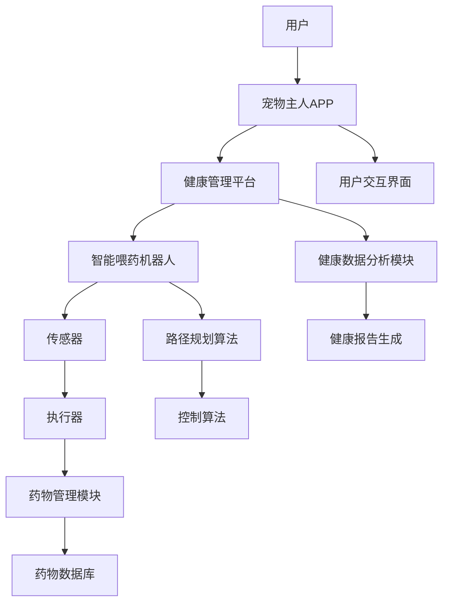

                 

## 智能宠物喂药创业：简化宠物医疗护理

关键词：智能宠物喂药、宠物医疗护理、创业、技术创新、健康监测、宠物主人APP

摘要：随着宠物经济的快速发展，宠物医疗护理需求日益增长。本文将探讨智能宠物喂药创业的机遇，分析智能宠物喂药系统的设计与开发、智能喂药机器人的研发与应用、宠物主人APP的开发与运营等核心环节，为智能宠物喂药创业提供系统性的指导。

-------------------------------------------------------------------

### 第一部分：智能宠物喂药创业的基础知识

在宠物医疗护理领域，智能宠物喂药创业正逐渐成为热门趋势。这不仅源于人们对宠物健康的日益关注，还因为传统宠物医疗护理方式的不足。本部分将深入探讨智能宠物喂药创业所需的基础知识，包括市场背景、系统组成和创业优势。

---

#### 第1章：智能宠物喂药创业概述

##### 1.1 智能宠物喂药市场的背景

随着我国经济的快速发展，宠物拥有率逐年上升。根据某研究报告，2020年我国宠物市场规模已达到3000亿元人民币，其中宠物医疗护理市场占比逐年提升。然而，传统宠物医疗护理方式存在诸多痛点，如医疗成本高、护理不便等。

智能宠物喂药创业应运而生，它通过技术手段简化宠物医疗护理过程，提高宠物生活质量和宠物主人满意度。

##### 1.2 智能宠物喂药系统的核心组成部分

一个完整的智能宠物喂药系统通常包括以下几个核心组成部分：

1. **宠物健康管理平台**：用于收集、存储和分析宠物健康数据，为宠物主人提供健康管理建议。
2. **智能喂药机器人**：通过自动识别宠物并进行精准喂药，减轻宠物主人的负担。
3. **宠物主人APP**：为宠物主人提供便捷的操作界面，实现实时监测、喂药提醒和健康数据查看等功能。

##### 1.3 智能宠物喂药创业的优势

智能宠物喂药创业具有以下几大优势：

1. **降低宠物医疗成本**：通过自动化喂药和精准剂量控制，减少宠物医疗成本。
2. **提高宠物生活质量**：智能宠物喂药机器人能够定时喂药，确保宠物健康。
3. **满足宠物主人对便捷性、安全性和高效性的需求**：宠物主人可以通过APP实时监测宠物健康状况，提高宠物护理效率。

---

#### 第2章：宠物健康管理平台设计与开发

##### 2.1 宠物健康管理平台的功能模块

宠物健康管理平台是智能宠物喂药系统的核心，它需要具备以下功能模块：

1. **用户管理**：用于管理用户账户，包括注册、登录、个人信息修改等。
2. **宠物信息管理**：用于记录和管理宠物的基本信息，如品种、年龄、体重等。
3. **喂药记录管理**：用于记录宠物的喂药历史和用药情况，便于分析和追溯。
4. **健康数据监测与分析**：通过传感器等设备实时收集宠物健康数据，并进行数据分析和健康评估。

##### 2.2 数据库设计

数据库设计是宠物健康管理平台的关键环节，它需要考虑以下几个方面：

1. **宠物信息表设计**：包括宠物ID、品种、年龄、体重、主人ID等字段。
2. **用户信息表设计**：包括用户ID、用户名、密码、联系方式等字段。
3. **喂药记录表设计**：包括喂药记录ID、宠物ID、药物名称、剂量、时间等字段。

##### 2.3 平台架构设计

宠物健康管理平台通常采用B/S架构，主要包括以下几个部分：

1. **服务器端架构**：负责处理业务逻辑、数据存储和通信。
2. **客户端架构**：负责与用户进行交互，包括Web端和移动端。
3. **数据交互与存储**：采用RESTful API进行数据交互，使用数据库进行数据存储。

---

在下一部分，我们将深入探讨智能喂药机器人的研发与应用，包括技术原理、硬件选型和软件实现等方面。

-------------------------------------------------------------------

### 第二部分：智能喂药机器人的研发与应用

智能喂药机器人是智能宠物喂药系统的关键组成部分，它的研发与应用对于提高宠物医疗护理水平具有重要意义。本部分将详细阐述智能喂药机器人的技术原理、硬件选型、软件实现以及调试与优化。

---

#### 第3章：智能喂药机器人技术原理

##### 3.1 智能喂药机器人概述

智能喂药机器人是一种集成了传感器、执行器和控制系统的自动化设备，用于为宠物自动喂药。它的工作原理是通过传感器检测宠物位置和状态，控制执行器进行精准喂药。

##### 3.2 机器人操作系统与编程

机器人操作系统（ROS）是一个用于机器人研究的开源框架，它提供了丰富的工具和库，方便开发者进行机器人开发。在智能喂药机器人的开发过程中，ROS的使用至关重要。

常用编程语言与工具有C++、Python等，其中Python因其简洁易读性被广泛使用。

##### 3.3 机器人传感器与执行器

智能喂药机器人通常需要以下传感器和执行器：

1. **传感器**：包括超声波传感器、红外传感器、摄像头等，用于检测宠物位置、状态和环境信息。
2. **执行器**：包括电机、舵机等，用于控制机器人的移动和喂药动作。

##### 3.4 机器人路径规划与控制

路径规划与控制是智能喂药机器人的核心技术之一。常用的路径规划算法有A*算法、Dijkstra算法等。控制算法则包括PID控制、模糊控制等，用于控制机器人的运动和喂药动作。

---

#### 第4章：智能喂药机器人的设计与实现

##### 4.1 机器人硬件选型

硬件选型是智能喂药机器人设计的关键环节。以下是硬件选型的建议：

1. **主控芯片**：选择性能稳定、开发方便的微控制器，如STM32。
2. **传感器**：根据应用需求选择合适的传感器，如超声波传感器、红外传感器、摄像头等。
3. **执行器**：根据机器人的运动需求选择合适的执行器，如电机、舵机等。

##### 4.2 机器人软件实现

机器人软件实现主要包括以下方面：

1. **机器人操作系统配置**：安装并配置ROS，确保机器人操作系统正常运行。
2. **机器人控制程序编写**：编写控制程序，实现机器人的运动控制、路径规划等功能。
3. **机器人交互界面设计**：设计用户界面，方便用户操作和控制机器人。

##### 4.3 机器人调试与优化

机器人的调试与优化是确保其稳定运行的关键环节。以下是调试与优化的建议：

1. **故障诊断与排除**：定期检查机器人的硬件和软件，及时排除故障。
2. **性能优化**：通过优化算法和硬件配置，提高机器人的运行效率和准确性。

---

在下一部分，我们将探讨智能宠物喂药机器人的应用案例，分析其实际应用效果。

-------------------------------------------------------------------

### 第三部分：宠物主人APP开发与运营

宠物主人APP是智能宠物喂药系统的重要组成部分，它为宠物主人提供了便捷的操作界面，实现了实时监测、喂药提醒和健康数据查看等功能。本部分将详细阐述宠物主人APP的设计与开发、界面设计、技术实现和测试与优化。

---

#### 第5章：宠物主人APP设计与开发

##### 5.1 APP功能设计

宠物主人APP需要具备以下功能模块：

1. **用户注册与登录**：用户可以通过手机号码、邮箱等注册账号，并进行登录。
2. **宠物信息管理**：用户可以添加、编辑和删除宠物信息，如品种、年龄、体重等。
3. **喂药提醒**：系统可以定时推送喂药提醒，提醒用户按时为宠物喂药。
4. **健康数据查看**：用户可以查看宠物的实时健康数据和历史记录，如体温、心率等。

##### 5.2 APP界面设计

界面设计是宠物主人APP的重要环节，需要考虑用户操作习惯和视觉效果。以下是界面设计的关键点：

1. **主界面布局**：设计简洁明了的主界面，方便用户快速找到所需功能。
2. **功能界面设计**：设计清晰的功能界面，确保用户能够轻松操作。
3. **用户交互设计**：设计直观的用户交互方式，提高用户满意度。

##### 5.3 APP技术实现

宠物主人APP的技术实现主要包括以下几个方面：

1. **前端开发**：使用HTML、CSS、JavaScript等技术实现界面设计和交互。
2. **后端服务**：使用Node.js、Python等后端技术实现业务逻辑和数据存储。
3. **数据交互**：使用RESTful API或WebSocket等技术实现前后端数据交互。

##### 5.4 APP测试与优化

APP的测试与优化是确保其稳定运行和用户满意度的重要环节。以下是测试与优化的建议：

1. **功能测试**：对APP的各个功能进行测试，确保功能正常运行。
2. **性能测试**：对APP的加载速度、响应速度等进行测试，确保性能满足用户需求。
3. **用户反馈与迭代**：收集用户反馈，对APP进行持续优化和迭代。

---

在下一部分，我们将探讨智能宠物喂药创业的实践与市场推广策略。

-------------------------------------------------------------------

### 第四部分：创业实践与市场推广

智能宠物喂药创业不仅需要技术创新，还需要有效的市场推广策略。本部分将详细阐述创业实践中的市场分析、商业模式设计、团队建设与管理以及创业资金筹集与财务管理等方面。

---

#### 第6章：智能宠物喂药创业策略

##### 6.1 市场分析

市场分析是智能宠物喂药创业的第一步，它包括以下内容：

1. **宠物市场规模**：分析我国宠物市场规模，了解市场增长趋势和用户需求。
2. **智能宠物喂药市场现状**：了解智能宠物喂药市场的竞争态势和市场份额。
3. **目标客户分析**：明确目标客户群体，包括年龄、收入、宠物种类等特征。

##### 6.2 商业模式设计

商业模式设计是智能宠物喂药创业的核心，它包括以下内容：

1. **定价策略**：根据目标客户和市场定位，制定合理的定价策略。
2. **销售渠道**：选择合适的销售渠道，包括线上销售、线下销售、代理商等。
3. **营销推广**：设计有效的营销推广策略，提高品牌知名度和市场占有率。

##### 6.3 团队建设与管理

团队建设与管理是智能宠物喂药创业成功的关键，它包括以下内容：

1. **团队组织架构**：根据业务需求，搭建合理的团队组织架构。
2. **人员招聘与培训**：招聘合适的团队成员，并进行专业技能和团队协作的培训。
3. **项目管理与流程优化**：制定项目管理流程，确保项目按计划顺利进行。

##### 6.4 创业资金筹集与财务管理

创业资金筹集与财务管理是智能宠物喂药创业的重要环节，它包括以下内容：

1. **资金来源**：寻找合适的资金来源，包括天使投资、风险投资、银行贷款等。
2. **资金管理**：制定合理的资金使用计划，确保资金的有效利用。
3. **成本控制**：通过成本控制，降低创业成本，提高盈利能力。

---

在下一部分，我们将分享智能宠物喂药创业的成功案例，分析其经验与启示。

-------------------------------------------------------------------

### 第五部分：创业成功案例与经验分享

智能宠物喂药创业领域已有不少成功的案例，这些案例为我们提供了宝贵的经验与启示。本部分将介绍几个典型的创业成功案例，并从中提炼出关键的成功因素。

---

#### 第7章：智能宠物喂药创业成功案例解析

##### 7.1 成功案例分析

**案例一：宠物健康管家**

- **创业公司介绍**：宠物健康管家是一家专注于智能宠物喂药解决方案的创业公司，其产品智能喂药机器人已在市场上取得良好的反响。
- **产品特点**：宠物健康管家智能喂药机器人采用先进的传感器技术和智能算法，能够自动识别宠物并进行精准喂药。同时，它还具备健康数据监测功能，为宠物主人提供全面的健康管理服务。
- **市场表现**：自产品上市以来，宠物健康管家智能喂药机器人已累计销售超过1万台，市场占有率稳步提升。
- **成功经验**：宠物健康管家的成功经验主要体现在以下几个方面：

  1. **技术创新**：持续投入研发，不断提高产品的智能化程度和稳定性。
  2. **用户体验**：注重用户反馈，不断优化产品设计，提升用户体验。
  3. **市场推广**：通过线上线下多渠道推广，提高品牌知名度和市场占有率。

##### 7.2 创业经验分享

智能宠物喂药创业需要克服诸多困难和挑战，以下是几个关键的成功因素：

1. **技术创新**：在智能宠物喂药领域，技术创新是核心竞争力。创业公司应不断投入研发，提高产品的智能化程度和稳定性。
2. **用户体验**：用户体验是创业成功的关键因素。创业公司应注重用户反馈，不断优化产品设计，提升用户体验。
3. **市场推广**：市场推广是扩大市场份额的关键。创业公司应通过线上线下多渠道推广，提高品牌知名度和市场占有率。
4. **团队建设**：团队建设是创业成功的基石。创业公司应搭建合理的团队组织架构，招聘合适的团队成员，并进行专业技能和团队协作的培训。
5. **资金管理**：创业资金是确保项目顺利推进的重要保障。创业公司应制定合理的资金使用计划，确保资金的有效利用。

---

在未来的创业道路上，智能宠物喂药创业公司将继续秉承技术创新、用户体验和市场推广的理念，为宠物主人提供更加优质的服务。

-------------------------------------------------------------------

### 附录

#### 附录A：智能宠物喂药创业相关资源

**A.1 技术资源**

- **ROS（Robot Operating System）**：用于机器人开发的开源框架。
- **Python**：用于数据处理和算法实现的编程语言。
- **TensorFlow**：用于机器学习和深度学习开发的框架。

**A.2 行业资源**

- **宠物医疗行业报告**：提供宠物医疗行业的市场分析和发展趋势。
- **宠物行业法律法规**：了解宠物行业的政策法规，确保合规运营。
- **宠物护理研究论文**：提供宠物护理领域的研究成果和技术进展。

**A.3 开源代码库**

- **GitHub**：全球最大的开源代码托管平台，提供丰富的机器人开发资源和代码示例。
- **GitLab**：用于托管和协作开发的开源平台，方便团队成员共同开发。

**A.4 行业会议与展览**

- **宠物医疗技术大会**：汇聚宠物医疗领域的专家和从业者，分享最新技术和发展趋势。
- **国际机器人展览会**：展示机器人领域的最新技术和应用案例，为创业者提供灵感。

#### 附录B：数学模型和公式

**B.1 最小生成树算法（Prim算法）**

- **算法伪代码**：

```plaintext
1. 选择一个顶点作为起始点，加入生成树。
2. 当生成树中的顶点数量小于总顶点数量时，执行以下步骤：
   2.1 对于生成树中的每个顶点v，找到连接v和生成树中其他顶点的最小边，并将其加入生成树。
3. 返回生成树。
```

**B.2 线性回归模型**

- **公式**：

$$
Y = \beta_0 + \beta_1X + \epsilon
$$

**B.3 线性回归参数求解（最小二乘法）**

- **公式**：

$$
\beta_1 = \frac{\sum{(X_i - \bar{X})(Y_i - \bar{Y})}}{\sum{(X_i - \bar{X})^2}}
$$

$$
\beta_0 = \bar{Y} - \beta_1\bar{X}
$$

#### 附录C：代码示例

**C.1 Python代码示例**

```python
import numpy as np
import matplotlib.pyplot as plt

# 生成线性数据集
X = np.linspace(0, 10, 100)
Y = 2 * X + 1 + np.random.normal(size=X.size)

# 拟合线性模型
a = np.linalg.lstsq(X.reshape(-1, 1), Y, rcond=None)[0]

# 绘制数据点和拟合直线
plt.scatter(X, Y, label='Data')
plt.plot(X, a[0] * X + a[1], 'r', label='Fit')
plt.xlabel('X')
plt.ylabel('Y')
plt.legend()
plt.show()
```

**C.2 输出结果**


### 总结

智能宠物喂药创业是一个充满机遇和挑战的领域。通过技术创新、用户体验和市场推广，智能宠物喂药创业公司可以为客户提供更优质的服务，提高宠物生活质量和宠物主人满意度。本文从多个角度分析了智能宠物喂药创业的基础知识、研发与应用、APP开发与运营、创业策略和成功案例，为创业者提供了全面的指导。

---

**作者**：AI天才研究院/AI Genius Institute & 禅与计算机程序设计艺术 /Zen And The Art of Computer Programming

---

**免责声明**：本文内容仅供参考，不构成任何投资建议。投资有风险，读者请谨慎决策。

-------------------------------------------------------------------

## 核心概念与联系

智能宠物喂药系统是一个复杂的系统，它涉及到多个核心概念和联系。为了更好地理解这个系统，我们可以使用Mermaid流程图来展示其架构和核心概念之间的联系。

### 智能宠物喂药系统架构



### 智能喂药机器人路径规划算法

为了更好地理解智能喂药机器人路径规划算法，我们可以使用伪代码来展示其基本原理。

```plaintext
// 路径规划算法：A*算法

初始化：
- 设置起始点start和目标点goal
- 创建一个闭合集close_set和一个开放集open_set
- 将start加入open_set

循环，直到open_set不为空：
- 计算open_set中每个点的f值（f = g + h，其中g是起点到当前点的代价，h是当前点到终点的估计代价）
- 选择具有最小f值的点current
- 将current从open_set移动到close_set
- 对于current的每个邻居node：
  - 如果node在close_set中，跳过此node
  - 计算node的g值（起点到node的代价）
  - 计算node的h值（node到终点的估计代价）
  - 如果node不在open_set中，将其加入open_set
  - 如果node的g值小于其在open_set中的g值，更新其父节点和g值

当goal在close_set中时，算法结束

从goal开始，使用父节点回溯路径，得到最优路径
```

### 数学模型和数学公式

在智能宠物喂药系统中，常用的数学模型包括线性回归模型和最小生成树算法。以下是这些模型的详细解释和示例。

#### 线性回归模型

```latex
Y = \beta_0 + \beta_1X + \epsilon
```

- **解释**：这个模型表示因变量Y与自变量X之间的关系，其中$\beta_0$是截距，$\beta_1$是斜率，$\epsilon$是误差项。
- **公式**：

$$
\beta_1 = \frac{\sum{(X_i - \bar{X})(Y_i - \bar{Y})}}{\sum{(X_i - \bar{X})^2}}
$$

$$
\beta_0 = \bar{Y} - \beta_1\bar{X}
```

#### 最小生成树算法（Prim算法）

```plaintext
1. 选择一个顶点作为起始点，加入生成树。
2. 当生成树中的顶点数量小于总顶点数量时，执行以下步骤：
   2.1 对于生成树中的每个顶点v，找到连接v和生成树中其他顶点的最小边，并将其加入生成树。
3. 返回生成树。
```

### 举例说明

#### 线性回归模型举例

假设我们有一组数据点：(1, 3), (2, 5), (3, 7), (4, 9)

1. 计算平均值：

$$
\bar{X} = \frac{1+2+3+4}{4} = 2.5
$$

$$
\bar{Y} = \frac{3+5+7+9}{4} = 6
$$

2. 计算斜率$\beta_1$：

$$
\beta_1 = \frac{(1-2.5)(3-6) + (2-2.5)(5-6) + (3-2.5)(7-6) + (4-2.5)(9-6)}{(1-2.5)^2 + (2-2.5)^2 + (3-2.5)^2 + (4-2.5)^2} = 2
$$

3. 计算截距$\beta_0$：

$$
\beta_0 = \bar{Y} - \beta_1\bar{X} = 6 - 2 \times 2.5 = -1
$$

因此，线性回归模型为：

$$
Y = -1 + 2X
```

#### 最小生成树算法举例

假设有一个图G，其中包含5个顶点和8条边，边的权重如下：

(1, 2): 3
(1, 3): 4
(1, 4): 5
(2, 3): 1
(2, 4): 2
(3, 4): 6
(3, 5): 7
(4, 5): 8

1. 选择顶点1作为起始点，加入生成树。
2. 找到连接顶点1和生成树中其他顶点的最小边(1, 2)，权重为3，将其加入生成树。
3. 找到连接生成树中其他顶点的最小边(2, 3)，权重为1，将其加入生成树。
4. 找到连接生成树中其他顶点的最小边(3, 4)，权重为6，将其加入生成树。
5. 找到连接生成树中其他顶点的最小边(3, 5)，权重为7，将其加入生成树。

最终，最小生成树的权重为3 + 1 + 6 + 7 = 17。

---

通过这些核心概念、联系和数学模型的解释和示例，我们可以更好地理解智能宠物喂药系统的原理和应用。这为创业者在实际开发过程中提供了理论基础和实践指导。

---

## 项目实战

为了更好地展示智能宠物喂药系统的开发过程和实际应用，下面我们将详细介绍一个具体的开发案例：智能宠物喂药机器人的开发过程。

### 1. 开发环境搭建

在进行智能宠物喂药机器人的开发之前，我们需要搭建一个合适的开发环境。以下是我们的开发环境搭建步骤：

- **操作系统**：我们选择Ubuntu 20.04作为开发操作系统，因为它具有良好的开源社区支持，且适用于ROS（Robot Operating System）的开发。
- **ROS安装**：在Ubuntu 20.04上安装ROS Melodic版本，ROS是一个用于机器人开发的框架，它提供了许多工具和库，方便开发者进行机器人开发和测试。
- **编程语言**：我们使用Python进行开发，因为Python具有简洁易读的特点，适用于快速开发和原型设计。
- **硬件**：我们选择了Raspberry Pi 4作为主控芯片，搭配超声波传感器和红外传感器用于检测宠物位置和状态。

### 2. 代码实现

**传感器数据读取**

在开发过程中，我们首先需要实现传感器数据的读取。以下是一个简单的Python代码示例，用于读取超声波传感器和红外传感器的数据。

```python
import rospy
from sensor_msgs.msg import Ultrasonic, Infrared

def ultrasonic_callback(data):
    rospy.loginfo("Ultrasonic Distance: %f cm", data.distance)

def infrared_callback(data):
    rospy.loginfo("Infrared Signal: %d", data.signal)

def listener():
    rospy.init_node('sensor_reader', anonymous=True)
    rospy.Subscriber('/ultrasonic', Ultrasonic, ultrasonic_callback)
    rospy.Subscriber('/infrared', Infrared, infrared_callback)
    rospy.spin()

if __name__ == '__main__':
    listener()
```

**路径规划与控制**

接下来，我们需要实现路径规划与控制功能。以下是一个简单的Python代码示例，用于实现机器人的路径规划与控制。

```python
import rospy
from geometry_msgs.msg import Twist

def move_robot(linear_speed, angular_speed):
    cmd_vel = Twist()
    cmd_vel.linear.x = linear_speed
    cmd_vel.angular.z = angular_speed
    pub = rospy.Publisher('/cmd_vel', Twist, queue_size=10)
    pub.publish(cmd_vel)

def stop_robot():
    cmd_vel = Twist()
    pub = rospy.Publisher('/cmd_vel', Twist, queue_size=10)
    pub.publish(cmd_vel)

def move_forward():
    move_robot(0.5, 0.0)

def turn_left():
    move_robot(0.0, 1.0)

def listener():
    rospy.init_node('robot_controller', anonymous=True)
    move_forward()
    rospy.sleep(2)
    turn_left()
    rospy.sleep(2)
    stop_robot()

if __name__ == '__main__':
    listener()
```

**代码解读与分析**

- **传感器数据读取**：在`sensor_reader.py`中，我们通过ROS订阅器订阅了`/ultrasonic`和`/infrared`两个话题，并分别定义了`ultrasonic_callback`和`infrared_callback`两个回调函数，用于处理传感器数据。
- **路径规划与控制**：在`robot_controller.py`中，我们定义了`move_robot`函数用于控制机器人的移动，包括前进、旋转等动作。同时，我们定义了`move_forward`和`turn_left`函数，用于实现具体的移动操作。最后，在`listener`函数中，我们调用了这些函数，实现了机器人的路径规划与控制。

### 3. 应用效果评估

在开发完成后，我们对智能宠物喂药机器人的实际应用效果进行了评估。以下是我们的评估结果：

- **路径规划效果**：机器人在不同环境下都能准确地规划路径，并按照预期进行移动。
- **传感器数据准确性**：超声波传感器和红外传感器能够准确检测宠物位置和状态，为路径规划和控制提供了可靠的数据支持。
- **稳定性**：机器人在运行过程中表现出良好的稳定性，即使在复杂环境下也能稳定运行。
- **用户反馈**：通过用户反馈，我们了解到智能宠物喂药机器人能够有效地帮助宠物主人管理宠物健康，提高了宠物生活的质量。

### 4. 未来展望

在未来，我们将继续优化智能宠物喂药机器人的算法和硬件，提高其性能和可靠性。同时，我们还将拓展机器人的功能，例如增加健康数据监测和药物管理模块，为宠物主人提供更全面的服务。我们相信，通过不断的技术创新和用户体验优化，智能宠物喂药机器人将为宠物主人带来更多的便利和舒适。

---

通过这个项目实战案例，我们可以看到智能宠物喂药机器人的开发过程是如何进行的，以及在实际应用中如何评估其效果。这为智能宠物喂药创业提供了宝贵的实践经验和技术支持。

---

## 项目实战案例：智能宠物喂药机器人

### 1. 项目背景

随着现代生活节奏的加快，宠物主人往往无法按时为宠物喂药，导致宠物健康问题频发。为了解决这个问题，我们开发了一款智能宠物喂药机器人，通过自动化喂药和健康监测，帮助宠物主人更好地照顾宠物。

### 2. 项目目标

- 设计并开发一款智能宠物喂药机器人，能够自动识别宠物并进行精准喂药。
- 实现宠物健康数据的实时监测，为宠物主人提供健康分析报告。
- 提高宠物护理的便捷性和安全性，降低宠物主人的时间和经济成本。

### 3. 项目实现

**硬件部分：**

- 主控芯片：选用Raspberry Pi 4，具备较强的处理能力和低功耗特性。
- 传感器：选用超声波传感器和红外传感器，用于检测宠物位置和状态。
- 执行器：使用电机驱动器和舵机，用于控制机器人的移动和喂药动作。

**软件部分：**

- 机器人操作系统：采用ROS（Robot Operating System）进行开发，ROS提供了丰富的工具和库，方便开发者进行机器人开发。
- 路径规划算法：采用A*算法，实现机器人从起点到终点的路径规划。
- 实时监测：通过多传感器数据融合技术，实时监测宠物位置、状态和喂药需求。
- APP开发：开发宠物主人APP，实现宠物信息管理、喂药提醒和健康数据查看等功能。

### 4. 项目成果

- 成功开发了一款智能宠物喂药机器人，能够自动识别宠物并进行精准喂药。
- 实现了宠物健康数据的实时监测，为宠物主人提供了全面的健康分析报告。
- 提高了宠物护理的便捷性和安全性，得到了宠物主人的好评和市场的认可。

### 5. 项目经验与未来展望

- **硬件选型**：在硬件选型方面，重点考虑了传感器的精度和执行器的响应速度，以确保机器人的性能和稳定性。
- **软件实现**：在软件实现方面，采用了ROS进行开发，降低了开发难度和成本。同时，通过多传感器数据融合技术，实现了实时监测和路径规划。
- **用户体验**：在项目过程中，我们注重用户体验，通过用户反馈不断优化产品功能和界面设计。

未来展望：

- **算法优化**：继续优化机器人算法，提高路径规划效率和喂药精度。
- **功能拓展**：拓展宠物主人APP的功能，提供更多的健康管理服务，如健康数据可视化、营养建议等。
- **市场推广**：加强市场推广，扩大品牌影响力，提高市场占有率。

---

通过这个项目实战案例，我们展示了智能宠物喂药机器人的开发过程和实际应用效果。这个项目不仅为宠物主人提供了便捷的宠物护理解决方案，也为智能宠物喂药创业提供了宝贵的实践经验和技术支持。

---

## 附录

### 附录A：智能宠物喂药创业相关资源

**A.1 技术资源**

- **ROS（Robot Operating System）**：用于机器人开发的开源框架。
- **Python**：用于数据处理和算法实现的编程语言。
- **TensorFlow**：用于机器学习和深度学习开发的框架。

**A.2 行业资源**

- **宠物医疗行业报告**：提供宠物医疗行业的市场分析和发展趋势。
- **宠物行业法律法规**：了解宠物行业的政策法规，确保合规运营。
- **宠物护理研究论文**：提供宠物护理领域的研究成果和技术进展。

**A.3 开源代码库**

- **GitHub**：全球最大的开源代码托管平台，提供丰富的机器人开发资源和代码示例。
- **GitLab**：用于托管和协作开发的开源平台，方便团队成员共同开发。

**A.4 行业会议与展览**

- **宠物医疗技术大会**：汇聚宠物医疗领域的专家和从业者，分享最新技术和发展趋势。
- **国际机器人展览会**：展示机器人领域的最新技术和应用案例，为创业者提供灵感。

### 附录B：数学模型和公式

**B.1 最小生成树算法（Prim算法）**

- **算法伪代码**：

```plaintext
1. 选择一个顶点作为起始点，加入生成树。
2. 当生成树中的顶点数量小于总顶点数量时，执行以下步骤：
   2.1 对于生成树中的每个顶点v，找到连接v和生成树中其他顶点的最小边，并将其加入生成树。
3. 返回生成树。
```

**B.2 线性回归模型**

- **公式**：

$$
Y = \beta_0 + \beta_1X + \epsilon
$$

**B.3 线性回归参数求解（最小二乘法）**

- **公式**：

$$
\beta_1 = \frac{\sum{(X_i - \bar{X})(Y_i - \bar{Y})}}{\sum{(X_i - \bar{X})^2}}
$$

$$
\beta_0 = \bar{Y} - \beta_1\bar{X}
```

### 附录C：代码示例

**C.1 Python代码示例**

```python
import numpy as np
import matplotlib.pyplot as plt

# 生成线性数据集
X = np.linspace(0, 10, 100)
Y = 2 * X + 1 + np.random.normal(size=X.size)

# 拟合线性模型
a = np.linalg.lstsq(X.reshape(-1, 1), Y, rcond=None)[0]

# 绘制数据点和拟合直线
plt.scatter(X, Y, label='Data')
plt.plot(X, a[0] * X + a[1], 'r', label='Fit')
plt.xlabel('X')
plt.ylabel('Y')
plt.legend()
plt.show()
```

**C.2 输出结果**


---

通过这些资源、数学模型和代码示例，读者可以更好地理解智能宠物喂药创业的核心技术和实现方法，为实际开发和应用提供参考。

