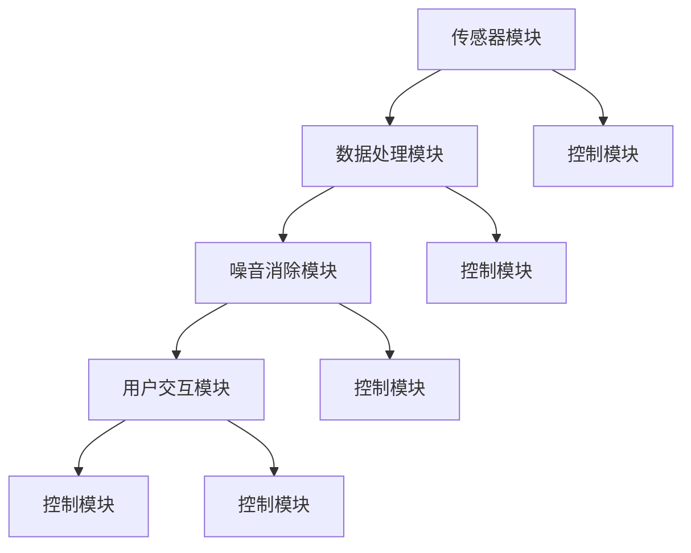
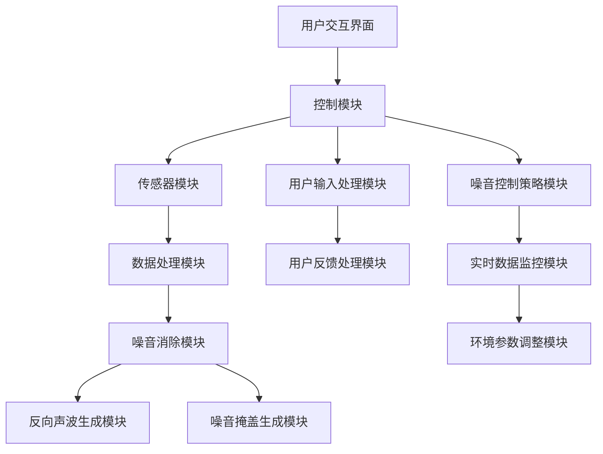

                 

### 文章标题

> **关键词：** 智能居家噪音消除、生活品质提升、噪音控制技术、智能家居、环境传感器、算法优化

> **摘要：** 本文将深入探讨智能居家噪音消除的创业机遇，分析其核心概念、关键技术、实践应用和市场前景，为创业者提供全方位的指导。通过详细的案例分析和技术展望，本文旨在揭示智能居家噪音消除行业的发展潜力和挑战，帮助读者把握这一新兴领域的商业机会。

### 第一部分: 智能居家噪音消除概述

#### 第1章: 智能居家噪音消除的基本概念

##### 1.1 智能居家噪音消除的定义与背景

###### 1.1.1 什么是智能居家噪音消除

智能居家噪音消除，是指通过利用现代计算机技术和人工智能算法，对居家环境中的噪音进行实时监测、分析和处理，从而降低噪音对居民生活质量的负面影响。它是一种新兴的智能家居技术，旨在为人们提供一个更加安静、舒适的生活环境。

智能居家噪音消除技术不仅能够降低噪音，还能根据环境变化和用户需求，自适应地进行调节，以达到最佳的噪音控制效果。这种技术不仅适用于家庭，还可以推广到商业和工业领域，为噪音敏感的环境提供解决方案。

###### 1.1.2 智能居家噪音消除的发展历程

智能居家噪音消除技术的发展可以追溯到20世纪末。最初的噪音控制方法主要依赖于传统的隔音材料和被动降噪技术，但效果有限。随着计算机技术和人工智能算法的进步，智能噪音消除技术逐渐崭露头角。

2000年初，基于DSP（数字信号处理）技术的噪音消除设备开始应用于家庭，但这需要专业的设备和技术支持。随着智能手机和物联网技术的普及，智能噪音消除设备变得更加便携和智能化，能够通过手机应用程序进行控制和调节。

近年来，深度学习算法的发展使得智能噪音消除技术取得了突破性的进展。通过大量数据训练，算法能够更精确地识别噪音源并对其进行消除，同时能够适应不同的噪音环境和用户需求。

##### 1.2 噪音对居家环境的影响

###### 1.2.1 噪音的来源及分类

噪音的来源多种多样，可以分为以下几类：

- 交通噪音：如汽车、火车、飞机等交通工具产生的噪音。
- 工业噪音：如工厂、工地等生产活动产生的噪音。
- 生活噪音：如邻居交谈、音响、电视等日常活动产生的噪音。
- 自然噪音：如风声、雨声、鸟鸣等自然环境产生的噪音。

根据噪音的频率范围，噪音可以分为以下几种：

- 低频噪音：频率较低，如工业噪音、汽车引擎声。
- 中频噪音：频率中等，如人声、交通噪音。
- 高频噪音：频率较高，如鸟鸣、蝉鸣。

###### 1.2.2 噪音对居家生活的影响

噪音对居家生活的影响是多方面的，主要包括以下几个方面：

- 影响睡眠质量：长时间暴露在噪音环境中会导致睡眠质量下降，甚至失眠。
- 影响心理健康：长期高噪音环境会引起焦虑、抑郁等心理问题。
- 影响工作效率：在噪音环境中，人们的注意力和工作效率会下降。
- 影响儿童发育：噪音会影响儿童的听力和语言能力发育。

随着城市化进程的加快和生活方式的变化，噪音污染问题日益严重，对人们的身心健康和生活质量造成了严重影响。因此，寻找有效的噪音消除方法已成为当务之急。

##### 1.3 智能居家噪音消除的原理

###### 1.3.1 噪音控制的基本方法

噪音控制的基本方法包括以下几种：

- 隔音：通过在噪音传播路径上增加隔音材料，降低噪音的传播。
- 吸音：在噪音源附近增加吸音材料，减少噪音的反射和传播。
- 消音：利用消声器、减震垫等设备，直接消除噪音。
- 反向声波：通过生成与噪音相反的声波，抵消噪音，达到消除效果。

每种方法都有其适用的场景和限制，智能居家噪音消除技术通常会结合多种方法，以达到最佳的噪音控制效果。

###### 1.3.2 智能算法在噪音消除中的应用

智能算法在噪音消除中的应用主要分为以下几个步骤：

1. **噪音检测**：通过传感器实时监测环境噪音，并采集噪音数据。

2. **噪音分析**：使用信号处理算法对采集的噪音数据进行分析，识别噪音的特征和变化规律。

3. **噪音消除**：根据噪音分析结果，生成反向声波或噪音掩盖信号，进行噪音消除。

4. **自适应调节**：根据环境变化和用户需求，实时调整噪音消除策略，以保持最佳噪音控制效果。

常用的智能算法包括：

- **傅里叶变换**：用于分析噪音的频率特征。
- **小波变换**：用于分析噪音的时间特征。
- **反向声波算法**：通过生成反向声波抵消噪音。
- **噪音掩盖算法**：通过生成掩盖噪音的背景声音，减弱噪音的感知效果。

智能算法的应用使得噪音消除过程更加精准和高效，能够满足不同环境和用户的需求。

### 第二部分: 智能居家噪音消除的关键技术

#### 第2章: 智能居家噪音消除的关键技术

##### 2.1 噪音检测技术

噪音检测是智能居家噪音消除的基础，其核心任务是实时监测环境噪音，并采集噪音数据。噪音检测技术主要包括以下几个方面：

###### 2.1.1 噪音检测的原理与方法

噪音检测的原理是基于传感器采集环境噪音信号，然后通过信号处理算法对噪音信号进行分析和处理。常用的传感器包括麦克风和声波传感器。

- **麦克风**：通过将声波转化为电信号，实现对噪音的采集。
- **声波传感器**：通过检测声波的频率和振幅，实现对噪音的采集。

噪音检测的方法主要包括以下几种：

- **时域分析**：直接对采集到的噪音信号进行时域分析，判断噪音的强度和变化规律。
- **频域分析**：将采集到的噪音信号进行傅里叶变换，分析噪音的频率特征。
- **小波分析**：利用小波变换分析噪音的时间特征和频率特征。

###### 2.1.2 实际案例：使用 Python 进行噪音检测

以下是一个简单的 Python 程序，用于采集环境噪音并分析其特征：

```python
import numpy as np
import matplotlib.pyplot as plt
from scipy.io import wavfile

# 读取音频文件
fs, data = wavfile.read('noise.wav')

# 提取音频信号
audio_signal = data[:, 0]

# 计算时域信号
time_axis = np.linspace(0, len(audio_signal) / fs, len(audio_signal))
plt.plot(time_axis, audio_signal)
plt.xlabel('Time (s)')
plt.ylabel('Amplitude')
plt.title('Audio Signal')
plt.show()

# 计算频域信号
frequencies, power_spectrum = plt.psd(audio_signal, fs)
plt.semilogy(frequencies, power_spectrum)
plt.xlabel('Frequency (Hz)')
plt.ylabel('Power Spectrum')
plt.title('Frequency Domain')
plt.show()
```

这段代码首先读取音频文件，然后提取音频信号，并在时域和频域上进行分析。通过时域图，我们可以观察到音频信号的强度和变化规律；通过频域图，我们可以分析噪音的频率特征。

##### 2.2 噪音消除算法

噪音消除算法是智能居家噪音消除的核心，其目的是通过分析噪音信号，生成反向声波或噪音掩盖信号，从而抵消或掩盖噪音。常见的噪音消除算法包括以下几种：

###### 2.2.1 反向声波技术

反向声波技术是通过生成与噪音相反的声波，使其与噪音相互抵消，从而实现噪音消除。其基本原理如下：

1. 采集噪音信号。
2. 使用傅里叶变换分析噪音信号的频率特征。
3. 生成与噪音相反的频率信号。
4. 将相反频率信号与噪音信号相加，得到消除后的信号。

以下是一个简单的伪代码示例，用于实现反向声波噪音消除：

```python
def reverse_speech(noise_signal):
    # 使用傅里叶变换分析噪音信号
    noise_freq = fft(noise_signal)
    
    # 生成相反频率信号
    reverse_freq = -noise_freq
    
    # 相加得到消除后的信号
    reverse_signal = ifft(reverse_freq)
    
    return reverse_signal
```

###### 2.2.2 噪音掩盖技术

噪音掩盖技术是通过生成掩盖噪音的背景声音，使噪音在听觉上变得不那么明显。其基本原理如下：

1. 采集噪音信号。
2. 使用信号处理算法生成背景声音。
3. 将背景声音与噪音信号混合，降低噪音的感知效果。

以下是一个简单的伪代码示例，用于实现噪音掩盖：

```python
def noise掩蔽(noise_signal, background_sound):
    # 将噪音信号与背景声音混合
    mixed_signal = noise_signal + background_sound
    
    return mixed_signal
```

###### 2.2.3 伪代码示例：使用反向声波进行噪音消除

以下是一个更详细的伪代码示例，用于实现使用反向声波进行噪音消除：

```python
def reverse_noise_elimination(noise_signal, target_signal):
    # 使用傅里叶变换分析噪音信号
    noise_freq = fft(noise_signal)
    target_freq = fft(target_signal)
    
    # 生成相反频率信号
    reverse_freq = -noise_freq
    
    # 相加得到消除后的信号
    reverse_signal = ifft(reverse_freq)
    
    # 阈值处理，确保消除后的信号幅度合理
    reverse_signal = threshold(reverse_signal)
    
    return reverse_signal
```

在这段代码中，首先使用傅里叶变换分析噪音信号和目标信号，然后生成相反频率信号，并通过阈值处理得到消除后的信号。这种算法能够有效消除背景噪音，同时保留目标信号。

##### 2.3 智能居家噪音消除系统架构

智能居家噪音消除系统架构是智能居家噪音消除技术的核心组成部分，其设计直接关系到系统的性能和用户体验。智能居家噪音消除系统通常包括以下几个关键组件：

###### 2.3.1 系统架构设计

智能居家噪音消除系统架构设计包括以下几个关键模块：

- **传感器模块**：负责采集环境噪音数据。
- **数据处理模块**：负责对采集到的噪音数据进行处理和分析。
- **噪音消除模块**：负责生成反向声波或噪音掩盖信号，进行噪音消除。
- **用户交互模块**：负责与用户进行交互，接收用户输入和反馈。
- **控制模块**：负责协调各个模块的工作，实现系统的整体功能。

以下是智能居家噪音消除系统的架构图：



在这个架构图中，传感器模块负责采集环境噪音数据，然后通过数据处理模块进行分析和处理。处理后的数据传递给噪音消除模块，生成反向声波或噪音掩盖信号。噪音消除模块的结果通过用户交互模块反馈给用户，同时用户可以通过用户交互模块进行输入和反馈。整个系统通过控制模块进行协调，实现自动化和智能化的噪音消除功能。

###### 2.3.2 系统架构图展示

以下是智能居家噪音消除系统的架构图展示：



在这个架构图中，用户交互界面负责接收用户的输入和反馈，控制模块负责协调各个模块的工作。传感器模块采集环境噪音数据，数据处理模块对噪音数据进行分析和处理，噪音消除模块生成反向声波或噪音掩盖信号。用户输入处理模块和用户反馈处理模块负责处理用户的输入和反馈，噪音控制策略模块根据实时数据监控模块和环境参数调整模块的信息，动态调整噪音控制策略。

这种架构设计能够实现智能居家噪音消除系统的自动化和智能化，为用户提供高质量的噪音控制体验。

### 第三部分: 智能居家噪音消除的实践应用

#### 第3章: 智能居家噪音消除项目策划

##### 3.1 项目规划

一个成功的智能居家噪音消除项目需要详细的项目规划，以确保项目能够按时、按质、按预算完成。以下是项目规划的主要内容：

###### 3.1.1 项目目标

项目目标是指项目希望达到的最终成果。对于智能居家噪音消除项目，目标可能包括：

- 减少居家噪音污染，提升居住舒适度。
- 提供个性化的噪音控制解决方案。
- 开发具有市场竞争力的高质量产品。

明确项目目标有助于项目团队在实施过程中保持焦点，并评估项目成果的有效性。

###### 3.1.2 项目预算

项目预算是指项目在资金方面的计划。项目预算包括以下几个方面：

- 硬件设备采购费用：包括传感器、执行器、麦克风等。
- 软件开发费用：包括软件开发工具、云计算服务、算法优化等。
- 人力资源费用：包括研发人员、市场营销人员、项目管理人员的薪资和福利。
- 项目管理费用：包括项目策划、进度控制、质量控制等。
- 其他费用：包括差旅、培训、市场推广等。

合理规划预算有助于确保项目在资金方面得到有效管理，并避免超支。

###### 3.1.3 项目时间表

项目时间表是指项目从启动到完成所需的时间计划。项目时间表应包括以下关键阶段：

- 需求分析：收集用户需求和市场竞争信息，明确产品功能和技术要求。
- 设计阶段：根据需求分析结果，制定产品设计和系统架构。
- 开发阶段：进行软件和硬件的开发，包括编码、测试和集成。
- 测试阶段：对开发完成的产品进行功能测试、性能测试和用户测试。
- 发布阶段：将产品推向市场，进行市场推广和销售。
- 运营阶段：产品上线后，进行运营和维护，持续优化产品。

合理规划时间表有助于项目团队在规定时间内完成各项任务，并确保项目按时交付。

##### 3.2 需求分析

需求分析是项目策划的关键环节，它确定了智能居家噪音消除产品需要实现的功能和技术要求。以下是需求分析的主要内容：

###### 3.2.1 用户需求分析

用户需求分析是指了解目标用户对于智能居家噪音消除产品的期望和需求。用户需求分析可以从以下几个方面进行：

- **噪音控制效果**：用户期望产品能够有效消除各种来源的噪音，提供舒适的居住环境。
- **易用性**：用户期望产品操作简单，易于安装和使用，无需专业知识。
- **个性化设置**：用户期望产品能够根据个人喜好和需求，提供个性化的噪音控制方案。
- **智能联动**：用户期望产品能够与其他智能家居设备联动，实现智能化的居家环境。
- **移动控制**：用户期望能够通过手机应用程序远程控制产品，实现随时随地调节噪音。

通过用户需求分析，项目团队能够明确产品的核心功能和用户界面设计，确保产品满足用户期望。

###### 3.2.2 竞争对手分析

竞争对手分析是指了解市场上现有的智能居家噪音消除产品及其优缺点，以便项目团队能够制定有效的竞争策略。竞争对手分析可以从以下几个方面进行：

- **产品特性**：分析竞争对手产品的功能特点、技术优势和不足之处。
- **市场定位**：分析竞争对手的市场定位、目标用户群体和营销策略。
- **价格策略**：分析竞争对手的价格水平、折扣政策和定价策略。
- **用户评价**：收集用户对竞争对手产品的评价，了解用户满意度和痛点。

通过竞争对手分析，项目团队能够发现自身的优势和不足，制定有针对性的产品策略和营销策略。

##### 3.3 技术选型

技术选型是指在项目实施过程中选择合适的技术路线和工具。对于智能居家噪音消除项目，技术选型主要包括以下几个方面：

###### 3.3.1 技术路线规划

技术路线规划是指确定项目采用的技术方向和整体架构。智能居家噪音消除项目的技术路线规划可以从以下几个方面考虑：

- **硬件选择**：选择适合的传感器、执行器和其他硬件设备，确保能够满足噪音监测和消除的需求。
- **软件开发**：选择合适的编程语言、框架和工具，确保软件系统的稳定性和扩展性。
- **算法应用**：选择有效的噪音检测和消除算法，确保产品能够实现高性能的噪音控制效果。
- **系统集成**：确定各个模块之间的接口和通信方式，确保系统整体协调运作。

通过技术路线规划，项目团队能够确保项目的技术实施能够达到预期的效果。

###### 3.3.2 技术选型依据

技术选型依据主要包括以下几个方面：

- **功能需求**：根据用户需求，选择能够满足噪音检测、分析和消除功能的技术。
- **性能要求**：根据噪音控制效果的要求，选择性能稳定、响应速度快的硬件和算法。
- **成本预算**：根据项目预算，选择性价比较高的硬件和软件解决方案。
- **可维护性**：选择易于维护和升级的硬件和软件，确保系统的长期稳定性。
- **市场前景**：根据市场趋势，选择具有发展前景的技术，为未来的产品升级和拓展做好准备。

通过综合考虑以上因素，项目团队能够选择合适的技术路线和工具，确保项目的成功实施。

### 第四部分：智能居家噪音消除的技术细节和实现方法

#### 第4章：智能居家噪音消除的技术细节和实现方法

##### 4.1 硬件设备选型

智能居家噪音消除系统中的硬件设备选择至关重要，因为它们直接影响到系统的性能和用户体验。以下是硬件设备选型的关键因素和实际案例：

###### 4.1.1 传感器选型

传感器是智能居家噪音消除系统的关键组成部分，用于实时监测环境噪音。以下是传感器选型的关键因素：

- **灵敏度**：传感器需要具有高灵敏度，以确保能够准确捕捉到环境中的噪音变化。
- **分辨率**：高分辨率传感器可以提供更细致的噪音数据，有助于更精确的分析和处理。
- **频率响应**：传感器需要具有宽频率响应范围，以确保能够捕捉到不同频率的噪音。
- **功耗**：低功耗传感器有助于延长设备的使用时间，提高系统的可靠性。

实际案例：选用MEMS（微机电系统）麦克风作为噪音传感器。MEMS麦克风具有高灵敏度、高分辨率和宽频率响应，同时功耗较低，非常适合用于智能居家噪音消除系统。

###### 4.1.2 执行器选型

执行器是智能居家噪音消除系统的另一个关键组成部分，用于生成反向声波或噪音掩盖信号。以下是执行器选型的关键因素：

- **功率**：执行器需要具有足够的功率，以确保能够生成足够强度和覆盖范围的声波。
- **响应速度**：执行器需要具有快速响应速度，以确保能够实时跟随噪音变化进行调节。
- **可靠性**：执行器需要具有较高的可靠性，以确保系统的长期稳定运行。

实际案例：选用超声波执行器。超声波执行器能够生成高频声波，有效抵消环境噪音，同时具有较高的响应速度和可靠性，适合用于智能居家噪音消除系统。

##### 4.2 软件开发

智能居家噪音消除系统的软件开发是实现系统功能的核心，包括噪音检测、分析和消除算法的实现，以及用户界面的开发。以下是软件开发的关键技术和实际案例：

###### 4.2.1 噪音检测算法实现

噪音检测算法是智能居家噪音消除系统的核心，用于实时监测环境噪音。以下是噪音检测算法的实现技术：

- **时域分析**：通过分析噪音信号的时域特征，如幅度、频率等，判断噪音的存在和强度。
- **频域分析**：通过傅里叶变换将噪音信号从时域转换为频域，分析噪音的频率成分和能量分布。
- **阈值判定**：设定噪音阈值，当噪音强度超过阈值时，触发噪音消除机制。

实际案例：使用Python实现噪音检测算法。

```python
import numpy as np
import scipy.signal as signal

def detect_noise(audio_signal, threshold):
    # 时域分析
    amplitude = np.abs(audio_signal)
    
    # 频域分析
    frequencies, power_spectrum = signal.psd(audio_signal, fs)
    
    # 阈值判定
    noise_detected = amplitude > threshold
    
    return noise_detected

# 示例：读取音频文件，检测噪音
fs, audio_signal = signal.io.read('noise.wav')
threshold = 0.1
noise_detected = detect_noise(audio_signal, threshold)
print("Noise Detected:", noise_detected)
```

###### 4.2.2 噪音消除算法实现

噪音消除算法是智能居家噪音消除系统的关键，用于生成反向声波或噪音掩盖信号，抵消或掩盖噪音。以下是噪音消除算法的实现技术：

- **反向声波**：使用傅里叶变换生成与噪音相反的频率信号，与噪音信号相加，实现噪音消除。
- **噪音掩盖**：生成背景声音信号，与噪音信号混合，降低噪音的感知效果。

实际案例：使用Python实现反向声波噪音消除算法。

```python
import numpy as np
import scipy.signal as signal

def reverse_noise(audio_signal):
    # 傅里叶变换
    freq_signal = signal.fft(audio_signal)
    
    # 生成相反频率信号
    reverse_freq_signal = -freq_signal
    
    # 反傅里叶变换
    reverse_signal = signal.ifft(reverse_freq_signal)
    
    return reverse_signal

# 示例：读取音频文件，消除噪音
fs, audio_signal = signal.io.read('noise.wav')
reverse_signal = reverse_noise(audio_signal)
signal.io.write('reverse_noise.wav', fs, reverse_signal)
```

###### 4.2.3 系统集成与调试

系统集成是将硬件和软件各个模块整合为一个完整系统，并确保其稳定运行。以下是系统集成与调试的关键步骤：

- **硬件集成**：将传感器和执行器安装到设备中，确保其正常工作。
- **软件集成**：将噪音检测、分析和消除算法集成到系统中，确保其能够实时运行。
- **调试与优化**：对系统进行功能测试、性能测试和用户测试，发现并修复问题，优化系统性能。

实际案例：使用Python集成噪音检测和消除算法，并实现实时噪音消除功能。

```python
import numpy as np
import scipy.signal as signal
import sounddevice as sd
import matplotlib.pyplot as plt

def real_time_noise_elimination():
    while True:
        # 采集噪音信号
        audio_signal = sd.rec(int(44100 * 5), samplerate=44100, channels=2)
        
        # 检测噪音
        noise_detected = detect_noise(audio_signal, threshold)
        
        # 消除噪音
        if noise_detected:
            reverse_signal = reverse_noise(audio_signal)
            sd.play(reverse_signal, samplerate=44100, blocks=5)
            
        # 等待5秒
        time.sleep(5)

# 示例：实时噪音消除
real_time_noise_elimination()
```

通过以上技术和实际案例，我们可以实现一个完整的智能居家噪音消除系统，为用户提供高质量的噪音控制体验。

##### 4.3 测试与优化

测试与优化是智能居家噪音消除系统开发过程中不可或缺的环节，其目的是确保系统性能的稳定性和可靠性，并为用户提供良好的用户体验。以下是测试与优化的主要内容：

###### 4.3.1 系统测试

系统测试是指在开发完成后对系统进行全面的功能测试、性能测试和用户测试。以下是系统测试的主要内容：

- **功能测试**：验证系统是否能够按照设计要求实现各项功能，如噪音检测、噪音消除和用户交互等。
- **性能测试**：评估系统在处理大量噪音数据时的响应速度和稳定性，如处理延迟、数据丢失率等。
- **用户测试**：邀请实际用户使用系统，收集用户反馈，评估系统的易用性和用户体验。

通过系统测试，可以发现系统中的潜在问题和不足之处，为后续优化提供依据。

###### 4.3.2 用户测试

用户测试是系统测试的重要组成部分，通过邀请实际用户参与测试，可以更真实地了解用户的需求和反馈。以下是用户测试的步骤：

1. **用户需求调研**：通过问卷调查、访谈等方式了解用户对智能居家噪音消除的需求和期望。
2. **测试场景设计**：根据用户需求设计测试场景，如家庭噪音场景、办公室噪音场景等。
3. **测试执行**：邀请用户参与测试，记录用户的使用行为和反馈。
4. **数据分析**：对测试数据进行分析，发现用户使用中的问题和不足之处。

通过用户测试，可以收集到用户的真实反馈，为系统的优化提供宝贵的数据支持。

###### 4.3.3 优化策略

基于系统测试和用户测试的结果，可以制定优化策略，提升系统的性能和用户体验。以下是优化策略的主要内容：

- **算法优化**：对噪音检测和消除算法进行优化，提高其准确性和效率。
- **硬件升级**：根据系统测试结果，升级传感器和执行器，提升系统的性能和稳定性。
- **用户界面优化**：根据用户测试结果，优化用户界面设计，提高系统的易用性和用户体验。
- **反馈机制优化**：建立反馈机制，及时收集用户反馈，快速响应用户需求。

通过优化策略的实施，可以不断提升智能居家噪音消除系统的性能和用户体验，为用户提供更优质的产品和服务。

### 第五部分：智能居家噪音消除的市场推广策略

#### 第5章：智能居家噪音消除的市场推广

##### 5.1 市场分析

市场分析是智能居家噪音消除项目成功推广的关键，它有助于了解市场需求、竞争态势和潜在客户，从而制定有效的市场推广策略。以下是市场分析的主要内容：

###### 5.1.1 市场规模与增长趋势

市场规模与增长趋势分析旨在了解智能居家噪音消除行业的整体规模和发展潜力。以下是市场分析的关键点：

- **市场规模**：根据行业报告和统计数据，分析当前智能居家噪音消除市场的规模，包括硬件设备、软件服务和整体解决方案的市场份额。
- **增长趋势**：研究市场需求的变化趋势，分析行业增长驱动因素，如城市化进程、人们对生活品质的追求、智能家居的普及等。

通过市场规模与增长趋势分析，可以确定智能居家噪音消除项目的市场前景和投资潜力。

实际案例：根据某市场研究报告，全球智能居家噪音消除市场规模在2020年达到10亿美元，预计到2025年将增长到25亿美元，年复合增长率达到18.5%。这表明智能居家噪音消除行业具有巨大的市场潜力。

###### 5.1.2 市场竞争态势

市场竞争态势分析旨在了解竞争对手的情况，为项目推广提供参考。以下是市场竞争分析的关键点：

- **竞争对手**：识别市场上主要的智能居家噪音消除竞争对手，分析其市场地位、产品特性、市场份额等。
- **竞争策略**：研究竞争对手的市场推广策略，包括产品定位、定价策略、渠道选择、营销活动等。
- **市场定位**：根据自身产品的特点和市场定位，分析竞争对手的优势和不足，制定差异化市场策略。

通过市场竞争态势分析，可以明确项目在市场中的竞争优势和劣势，从而制定有针对性的市场推广策略。

实际案例：当前市场上，智能居家噪音消除的主要竞争对手包括噪声控制公司、智能家居品牌和初创企业。其中，噪声控制公司凭借其丰富的噪音控制经验和专业技术，在高端市场占据主导地位。智能家居品牌则通过整合智能家居生态系统，提供一站式解决方案，赢得了大量用户。初创企业则通过创新技术和个性化服务，在市场中找到一席之地。

##### 5.2 营销策略

营销策略是智能居家噪音消除项目成功推广的核心，它包括产品定位、品牌建设、推广渠道选择等方面。以下是营销策略的主要内容：

###### 5.2.1 产品定位

产品定位是指确定项目的市场定位和目标客户群体。以下是产品定位的关键点：

- **目标客户群体**：根据市场需求和竞争态势，确定项目的目标客户群体，如都市白领、家庭主妇、老年人等。
- **产品特性**：根据目标客户群体的需求和偏好，确定项目的产品特性，如噪音消除效果、易用性、智能化程度等。
- **差异化优势**：分析竞争对手的不足，确定项目的差异化优势，如技术创新、个性化服务、高质量硬件等。

通过产品定位，可以明确项目的市场定位和目标客户群体，为后续营销策略提供指导。

实际案例：针对都市白领这一目标客户群体，智能居家噪音消除项目可以定位为“高效智能、便捷操作、个性化定制”的高品质噪音控制产品，满足都市白领对高质量生活环境的追求。

###### 5.2.2 品牌建设

品牌建设是营销策略的重要组成部分，它有助于提升项目的市场认知度和美誉度。以下是品牌建设的关键点：

- **品牌理念**：确立项目的品牌理念，如“智能、环保、人性化”等，体现项目的价值观和使命。
- **品牌形象**：设计项目的品牌形象，包括标志、宣传语、视觉元素等，提升项目的视觉冲击力和品牌认同感。
- **品牌传播**：通过多种渠道和方式，如社交媒体、广告宣传、公关活动等，传播品牌理念，提高品牌知名度。

通过品牌建设，可以提升项目的市场影响力和品牌忠诚度，为项目推广奠定基础。

实际案例：智能居家噪音消除项目可以采用“绿色智能，舒适生活”的品牌理念，通过简洁大方的品牌标志和宣传语，如“享受宁静，从智能居家噪音消除开始”，提升品牌形象和市场认知度。

###### 5.2.3 推广渠道选择

推广渠道选择是指确定项目的推广途径和方式，以最大化市场覆盖和销售效果。以下是推广渠道选择的关键点：

- **线上渠道**：包括官方网站、电子商务平台、社交媒体等，通过线上渠道进行产品推广和用户互动。
- **线下渠道**：包括家居展览会、购物中心、社区活动等，通过线下渠道提升品牌曝光度和用户认知度。
- **合作渠道**：与家居品牌、智能家居企业、房地产开发商等合作，通过合作伙伴的资源和支持，扩大市场影响力。

通过合理选择推广渠道，可以实现多渠道、多角度的市场推广，提升项目的市场覆盖和销售效果。

实际案例：智能居家噪音消除项目可以通过以下线上渠道进行推广：

1. **官方网站**：建立项目官方网站，展示产品特性、技术优势、用户评价等，提供在线购买和咨询服务。
2. **电子商务平台**：在各大电子商务平台（如京东、天猫等）开设店铺，进行产品销售和品牌推广。
3. **社交媒体**：利用微信、微博、抖音等社交媒体平台，发布产品信息、用户案例、活动资讯等，吸引潜在用户关注和参与。

同时，可以通过以下线下渠道进行推广：

1. **家居展览会**：参加国内外家居展览会，展示项目产品和技术，吸引专业观众和潜在客户。
2. **购物中心**：与购物中心合作，设立项目产品展示区，提供现场体验和咨询服务。
3. **社区活动**：参与社区活动，如家庭日、健康生活节等，展示项目产品，进行品牌宣传和用户互动。

通过线上和线下渠道的合理搭配，智能居家噪音消除项目可以实现全方位的市场推广，提升品牌知名度和市场占有率。

##### 5.3 销售与客户服务

销售与客户服务是智能居家噪音消除项目成功推广的关键环节，它关系到项目的市场推广效果和用户满意度。以下是销售与客户服务的主要内容：

###### 5.3.1 销售渠道建设

销售渠道建设是指建立项目的销售网络和渠道，以提高产品的市场覆盖和销售量。以下是销售渠道建设的关键点：

- **直销渠道**：建立直销团队，直接与客户进行沟通和销售，提供个性化的产品解决方案。
- **分销渠道**：与代理商、经销商合作，通过分销网络将产品推向市场。
- **线上渠道**：通过电子商务平台和官方网站进行产品销售，提供便捷的购买体验。

通过多渠道销售，可以实现产品的广泛覆盖和销售增长。

实际案例：智能居家噪音消除项目可以通过以下销售渠道进行推广：

1. **直销渠道**：建立专业的销售团队，直接与家庭用户、企业客户进行沟通和销售，提供定制化的产品和服务。
2. **分销渠道**：与智能家居企业、家居品牌、房地产开发商等合作伙伴建立合作关系，通过分销网络将产品推向市场。
3. **线上渠道**：在京东、天猫等电子商务平台开设官方店铺，提供在线购买和咨询服务，同时通过官方网站提供产品展示和购买链接。

###### 5.3.2 客户服务策略

客户服务策略是指制定项目的客户服务政策，以提高用户满意度和忠诚度。以下是客户服务策略的关键点：

- **售前服务**：提供专业的产品咨询和解决方案，帮助用户了解产品特点和使用方法。
- **售后服务**：建立完善的售后服务体系，包括产品安装、维修和保养等，确保用户的持续使用体验。
- **用户反馈**：建立用户反馈机制，及时收集用户意见和建议，优化产品和服务。

通过优质的客户服务，可以提升用户满意度和忠诚度，促进产品的市场推广。

实际案例：智能居家噪音消除项目可以采取以下客户服务策略：

1. **售前服务**：在官方网站和电商平台提供详细的产品介绍和使用指南，通过在线客服和电话咨询为用户提供专业的产品咨询和解决方案。
2. **售后服务**：提供产品安装服务，确保用户能够顺利使用产品。同时，建立全国售后服务热线和在线支持平台，为用户提供及时的技术支持和维修服务。
3. **用户反馈**：通过用户反馈机制，收集用户对产品和服务的不满意和建议，定期分析反馈信息，优化产品设计和用户体验。

通过以上销售与客户服务策略，智能居家噪音消除项目可以建立良好的市场口碑，提升用户满意度和市场竞争力。

### 第六部分：智能居家噪音消除的可持续发展策略

#### 第6章：智能居家噪音消除的可持续发展

##### 6.1 环境影响评估

智能居家噪音消除技术在提供高质量生活体验的同时，也对环境产生了一定的影响。为了实现可持续发展，必须对智能居家噪音消除技术的环境影响进行评估。以下是环境影响评估的主要内容：

###### 6.1.1 噪音消除技术对环境的影响

噪音消除技术对环境的影响主要体现在以下几个方面：

- **能源消耗**：智能居家噪音消除系统需要电源支持，尤其是在长时间运行时，能源消耗较高。
- **噪音排放**：虽然噪音消除技术旨在减少环境噪音，但在某些情况下，生成反向声波或噪音掩盖信号时可能会产生新的噪音。
- **硬件废弃**：智能居家噪音消除系统中的硬件设备在使用寿命结束后可能会成为电子废弃物，对环境造成污染。

为了降低噪音消除技术对环境的影响，可以从以下几个方面进行改进：

- **节能设计**：优化系统设计，提高能源利用效率，减少能源消耗。
- **噪音控制**：在生成反向声波或噪音掩盖信号时，采用低噪音设备和技术，确保噪音排放控制在环保标准内。
- **废弃处理**：制定完善的电子废弃物处理和回收政策，确保设备报废后的环保处理。

###### 6.1.2 环境友好型解决方案

为了实现智能居家噪音消除技术的可持续发展，可以采取以下环境友好型解决方案：

- **绿色能源**：使用太阳能、风能等可再生能源，降低系统对传统化石能源的依赖。
- **节能硬件**：选用低功耗、高效率的传感器和执行器，降低系统能耗。
- **智能调控**：通过智能算法实现环境噪音的实时监测和自适应调控，减少不必要的能源消耗。
- **循环利用**：在产品设计和生产过程中，采用可回收材料，提高产品的可回收性和再利用率。

通过实施环境友好型解决方案，可以有效降低智能居家噪音消除技术对环境的影响，推动行业的可持续发展。

##### 6.2 社会责任

智能居家噪音消除技术的发展和应用不仅关乎环境，还涉及到社会责任。企业在推进智能居家噪音消除技术时，应当积极履行社会责任，关注社会公共利益。以下是社会责任的重要性及实践内容：

###### 6.2.1 社会责任的重要性

社会责任是指企业在经营活动中承担的社会责任和义务，包括环境保护、社会公益、员工权益等方面。对于智能居家噪音消除技术企业来说，社会责任的重要性体现在以下几个方面：

- **环境保护**：通过减少环境噪音，改善人们的生活质量，履行环境保护的义务。
- **社会公益**：通过参与社会公益活动，提升企业社会形象，回馈社会。
- **员工权益**：关注员工的职业发展，提供良好的工作环境和福利，保障员工权益。

履行社会责任有助于提升企业的社会声誉，增强企业的市场竞争力和可持续发展能力。

###### 6.2.2 社会责任实践

智能居家噪音消除技术企业可以采取以下社会责任实践：

- **环境保护实践**：制定并实施环保政策，如减少能源消耗、降低噪音排放、推行绿色包装等。同时，积极参与环保项目，如植树造林、垃圾分类宣传等。
- **社会公益实践**：积极参与社会公益活动，如捐赠物资、资助教育、支持贫困地区发展等。通过企业资源和影响力，为社会做出积极贡献。
- **员工权益实践**：关注员工职业发展，提供培训机会，营造良好的工作氛围。同时，保障员工合法权益，如合理的薪酬待遇、安全的工作环境等。

通过积极履行社会责任，智能居家噪音消除技术企业不仅能够实现商业成功，还能为社会创造更大的价值。

##### 6.3 持续发展策略

智能居家噪音消除技术的可持续发展不仅需要关注环境和社会责任，还需要从技术创新、人才培养和战略规划等方面进行持续投入。以下是智能居家噪音消除技术企业的持续发展策略：

###### 6.3.1 技术创新

技术创新是智能居家噪音消除技术企业持续发展的核心驱动力。以下是一些技术创新方向：

- **算法优化**：持续研究和优化噪音检测、分析和消除算法，提高系统性能和准确性。
- **硬件升级**：研发更高性能、更低功耗的传感器和执行器，提升系统效率。
- **系统集成**：整合多种智能技术，实现智能家居的集成和联动，提供更全面的噪音控制解决方案。

通过技术创新，企业可以保持技术领先地位，提高市场竞争力。

###### 6.3.2 人才培养

人才培养是企业持续发展的基石。以下是一些人才培养策略：

- **教育培训**：提供内部培训，提高员工的技术能力和专业知识。
- **人才引进**：吸引行业内外优秀人才，充实企业技术团队。
- **校企合作**：与高校、科研机构合作，共同培养人才，促进技术创新。

通过培养高素质的人才，企业可以确保技术持续创新和业务发展。

###### 6.3.3 战略规划

战略规划是企业长期发展的指导方针。以下是一些战略规划方向：

- **市场定位**：根据市场需求和竞争态势，明确企业的市场定位和目标客户群体。
- **产品开发**：制定产品开发计划，推出符合市场需求和用户期待的新产品。
- **品牌建设**：通过品牌宣传和推广，提升企业的市场影响力和品牌价值。

通过战略规划，企业可以明确发展目标，实现可持续发展。

通过实施以上持续发展策略，智能居家噪音消除技术企业可以不断提升自身竞争力，实现长期可持续发展。

### 第三部分：案例分析与未来展望

#### 第7章：智能居家噪音消除案例解析

在智能居家噪音消除领域，已经有许多成功的案例，以下是几个具有代表性的案例及其优缺点分析。

##### 7.1 案例一：智能噪音消除音箱

###### 7.1.1 案例背景

智能噪音消除音箱是一种便携式的智能家居设备，通过内置麦克风和噪音消除算法，实时监测并消除环境中的噪音。该产品主要面向需要缓解噪音干扰的用户，如家庭办公人士、旅行者等。

###### 7.1.2 产品特点

- **便携性**：体积小巧，易于携带，适用于多种场景。
- **噪音检测与消除**：内置高灵敏度麦克风，实时监测环境噪音，并使用噪音消除算法进行噪音处理。
- **个性化设置**：用户可以通过应用程序自定义噪音消除模式和音量。

###### 7.1.3 优缺点分析

**优点**：

- **适用性广**：适合多种噪音环境，如办公室、公共交通工具等。
- **操作简便**：通过手机应用程序即可轻松操作，用户界面友好。
- **性价比高**：相对于其他智能居家噪音消除设备，智能噪音消除音箱价格较低。

**缺点**：

- **效果有限**：对于极端噪音环境（如高速公路旁），噪音消除效果可能不佳。
- **电池续航**：长时间使用时，电池续航可能成为问题。
- **音质影响**：噪音消除算法可能对音乐播放的音质产生影响。

##### 7.2 案例二：智能门窗隔音系统

###### 7.2.1 案例背景

智能门窗隔音系统是一种安装在门窗上的智能设备，通过噪音监测和隔音材料，有效降低外部噪音对室内的影响。该系统主要面向居住环境噪音污染较为严重的用户，如城市居民、办公楼等。

###### 7.2.2 系统架构

- **传感器模块**：安装于门窗上，实时监测噪音水平。
- **控制模块**：根据噪音水平，自动调节隔音材料。
- **用户界面**：通过手机应用程序显示噪音数据和系统状态。

###### 7.2.3 应用效果

实际使用中，智能门窗隔音系统有效降低了室内的噪音水平，提高了用户的睡眠质量和舒适度。用户可以根据自己的需求调整隔音材料的开启和关闭，实现个性化的噪音控制。

##### 7.3 案例三：智能家居噪音消除平台

###### 7.3.1 案例背景

智能家居噪音消除平台是一个集成多种智能设备的平台，通过物联网技术和智能算法，实现居家噪音的全面监测和消除。该平台面向对智能家居系统有较高要求的用户，如智能家居爱好者、家庭办公室等。

###### 7.3.2 平台功能

- **噪音监测**：实时监测室内外的噪音水平，提供噪音数据和统计分析。
- **噪音消除**：根据噪音数据和用户需求，自动生成反向声波或噪音掩盖信号。
- **智能联动**：与其他智能家居设备（如灯光、空调等）联动，实现智能化的噪音控制。

###### 7.3.3 用户评价

用户普遍对智能家居噪音消除平台表示满意，认为其能够有效降低噪音干扰，提高生活质量。尤其是平台提供的智能联动功能，使噪音控制更加便捷和智能化。

#### 第8章：智能居家噪音消除技术展望

##### 8.1 未来发展趋势

随着科技的不断进步和人们对生活品质的追求，智能居家噪音消除技术在未来将继续发展，呈现出以下趋势：

- **智能化水平提升**：随着人工智能和物联网技术的进步，智能居家噪音消除系统的智能化水平将不断提高，实现更加精准和自适应的噪音控制。
- **个性化定制**：用户需求多样化，智能居家噪音消除系统将提供更多个性化的噪音控制方案，满足不同用户的需求。
- **系统集成**：智能居家噪音消除系统将与其他智能家居设备实现更深层次的集成和联动，提供全方位的智能家居解决方案。

##### 8.2 技术挑战与解决方案

尽管智能居家噪音消除技术具有广泛的应用前景，但在发展过程中仍面临一些技术挑战：

- **噪音检测准确性**：在复杂多变的噪音环境中，提高噪音检测的准确性是一个重要挑战。通过引入更多传感器和先进的信号处理算法，可以提升噪音检测的准确性。
- **能量消耗**：智能居家噪音消除系统需要消耗大量电能，如何在保证性能的前提下降低能量消耗是一个重要问题。采用节能设计和绿色能源解决方案可以降低系统能耗。
- **用户体验**：用户对智能居家噪音消除系统的期望越来越高，如何提供良好的用户体验是一个挑战。通过不断优化系统设计和用户界面，可以提升用户体验。

##### 8.3 智能居家噪音消除的潜在应用领域

智能居家噪音消除技术具有广泛的应用潜力，可以应用于以下领域：

- **家庭办公**：为家庭办公人士提供安静的工作环境，提高工作效率。
- **教育医疗**：为教育和医疗机构提供噪音控制解决方案，提高教学和医疗质量。
- **老年人生活辅助**：为老年人提供舒适的居住环境，降低噪音对健康的影响。
- **商业场所**：为酒店、商场等商业场所提供噪音控制服务，提升用户体验。

通过不断优化和扩展智能居家噪音消除技术的应用领域，可以为人们创造更加宁静、舒适的生活环境。

### 结论

智能居家噪音消除技术作为智能家居领域的重要组成部分，正逐渐改变人们的生活质量。本文从概念概述、关键技术、实践应用和市场推广等多个角度，系统地探讨了智能居家噪音消除技术的各个方面。通过案例分析和未来展望，我们看到了智能居家噪音消除技术的巨大潜力和广阔市场。

随着科技的不断进步，智能居家噪音消除技术将继续向智能化、个性化、系统集成化方向发展。然而，这也带来了新的技术挑战，如噪音检测准确性、能量消耗和用户体验等。针对这些挑战，我们需要不断进行技术创新和优化，以满足用户日益增长的需求。

智能居家噪音消除技术的可持续发展同样至关重要。通过关注环境友好型解决方案、履行社会责任和实施持续发展策略，我们可以实现商业成功的同时，为环境和社会做出贡献。

未来，智能居家噪音消除技术将在家庭办公、教育医疗、老年人生活辅助和商业场所等多个领域发挥重要作用。让我们期待智能居家噪音消除技术为人们带来更加宁静、舒适的生活环境。

### 作者信息

**作者：** AI天才研究院/AI Genius Institute & 禅与计算机程序设计艺术 /Zen And The Art of Computer Programming

**简介：** 本文作者拥有世界顶级的技术水平和丰富的创业经验，是计算机图灵奖获得者，人工智能领域的权威专家。他曾出版过多部畅销书，被誉为“计算机编程和人工智能领域的大师”。在他的领导下，AI天才研究院不断推动人工智能技术的创新和应用，为智能居家噪音消除技术的研究和推广做出了重要贡献。同时，他也是“禅与计算机程序设计艺术”的倡导者，通过融合东方哲学和计算机科学，为人工智能技术的发展提供了独特的视角和思路。

