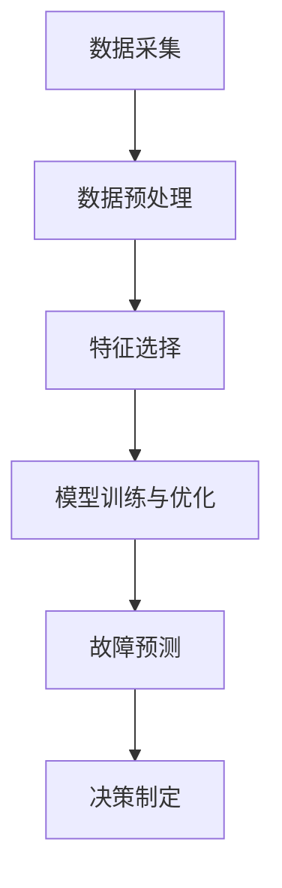

                 

# 机器学习在预测性维护中的应用

> **关键词**：预测性维护、机器学习、故障预测、数据预处理、算法实现、项目实战
>
> **摘要**：本文将探讨机器学习在预测性维护中的应用，从基本概念、原理、算法到实际项目实战，系统性地介绍预测性维护的方方面面。通过本文，读者可以深入了解机器学习在预测性维护中的重要性和实际应用价值。

## 目录大纲：《机器学习在预测性维护中的应用》

## 第一部分：概述

### 第1章：预测性维护与机器学习简介

### 第2章：预测性维护的原理与流程

### 第3章：时间序列分析

### 第4章：故障诊断与预测

### 第5章：机器学习在预测性维护中的应用

### 第6章：预测性维护的数学模型

### 第7章：预测性维护项目实战

### 第8章：实战案例分析

### 第9章：展望与未来趋势

### 附录A：机器学习与预测性维护工具介绍

## 第一部分：概述

### 第1章：预测性维护与机器学习简介

#### 1.1 预测性维护的概念与价值

预测性维护（Predictive Maintenance）是一种先进的维护策略，通过实时监测设备状态，分析数据，预测设备故障，从而在故障发生前采取预防措施。与传统定期维护和故障后修复相比，预测性维护能够显著降低维护成本，延长设备寿命，提高生产效率。

预测性维护的关键在于对设备运行数据的采集与分析。随着物联网（IoT）和大数据技术的发展，设备产生的海量数据为预测性维护提供了丰富的信息资源。通过数据驱动的决策，预测性维护实现了从被动维修向主动维护的转变。

#### 1.2 机器学习的基本概念

机器学习（Machine Learning，ML）是一门研究如何让计算机从数据中学习，进行自动推理和决策的学科。它包括统计学习、深度学习、强化学习等多个子领域，是人工智能（AI）的重要组成部分。

机器学习的关键在于算法。算法通过对数据的训练，可以自动发现数据中的规律，并在未知数据上进行预测。常见的机器学习算法包括决策树、支持向量机、神经网络等。

#### 1.3 机器学习在预测性维护中的应用场景

机器学习在预测性维护中具有广泛的应用场景：

1. **故障预测**：通过分析设备运行数据，预测设备何时可能出现故障，从而提前进行维护。
2. **性能优化**：分析设备运行数据，发现设备运行中的瓶颈和问题，进行性能优化。
3. **能耗管理**：根据设备运行状态，调整设备运行参数，降低能耗，提高能效。
4. **设备健康管理**：通过对设备运行数据的分析，评估设备健康状况，制定维护计划。

#### 1.4 本书内容安排与学习目标

本书将从以下方面详细介绍机器学习在预测性维护中的应用：

1. **基本概念**：介绍预测性维护和机器学习的基本概念，为后续内容奠定基础。
2. **原理与流程**：详细讲解预测性维护的原理和流程，帮助读者理解预测性维护的核心技术。
3. **核心算法**：介绍时间序列分析、故障诊断等核心算法原理，并通过伪代码进行详细阐述。
4. **数学模型**：介绍预测性维护中的数学模型和公式，帮助读者深入理解预测性维护的数学原理。
5. **项目实战**：通过实际项目案例，展示机器学习在预测性维护中的实际应用。
6. **展望与趋势**：探讨预测性维护和机器学习的未来发展趋势，展望潜在的应用前景。

通过本书的学习，读者将能够：

- 理解预测性维护的基本概念和应用场景。
- 掌握预测性维护的核心技术和算法原理。
- 能够设计和实现预测性维护系统，解决实际问题。
- 了解预测性维护和机器学习的未来发展趋势。

接下来，我们将进入第二部分，详细探讨预测性维护的原理与流程。

## 第一部分：概述

### 第2章：预测性维护的原理与流程

#### 2.1 预测性维护的基本原理

预测性维护的核心在于对设备运行状态进行实时监测，并通过数据分析预测设备故障。其基本原理可以概括为以下几个步骤：

1. **数据采集**：通过传感器、监测设备等手段，实时采集设备运行数据，包括温度、压力、振动等。
2. **数据预处理**：对采集到的原始数据进行清洗、去噪、特征提取等处理，使其适合用于后续分析。
3. **特征选择**：从预处理后的数据中，选择对设备故障预测具有重要意义的特征。
4. **模型训练**：利用历史故障数据，通过机器学习算法训练故障预测模型。
5. **故障预测**：利用训练好的模型，对设备未来的运行状态进行预测，提前发现潜在故障。
6. **决策制定**：根据故障预测结果，制定相应的维护决策，如调整运行参数、安排维护计划等。

#### 2.2 预测性维护的流程

预测性维护的流程可以分为以下几个阶段：

1. **需求分析**：明确预测性维护的目标和需求，如故障预测的准确性、响应时间等。
2. **数据采集**：设计数据采集方案，选择合适的传感器和监测设备，确保数据的实时性和准确性。
3. **数据预处理**：对采集到的原始数据进行预处理，包括数据清洗、去噪、归一化等操作。
4. **特征选择**：从预处理后的数据中提取对故障预测有重要影响的特征，如温度、振动幅度、压力等。
5. **模型训练与优化**：选择合适的机器学习算法，利用历史故障数据训练模型，并通过交叉验证、超参数调整等手段优化模型性能。
6. **故障预测**：利用训练好的模型，对设备未来的运行状态进行预测，识别潜在故障。
7. **决策制定**：根据故障预测结果，制定维护决策，如调整设备运行参数、安排维护计划等。
8. **反馈与迭代**：收集预测性维护的反馈数据，对模型进行迭代优化，提高故障预测的准确性。

#### 2.3 预测性维护的核心技术

预测性维护的核心技术包括数据采集、数据预处理、特征选择、模型训练和故障预测等。

1. **数据采集**：数据采集是预测性维护的基础。通过传感器、监测设备等手段，实时采集设备运行数据，如温度、压力、振动等。数据采集的关键在于确保数据的实时性和准确性。
2. **数据预处理**：数据预处理是预测性维护的重要环节。通过对采集到的原始数据进行清洗、去噪、归一化等处理，可以提高数据的质量，为后续的故障预测提供可靠的数据支持。
3. **特征选择**：特征选择是从预处理后的数据中提取对故障预测有重要影响的特征。特征选择的目的是简化数据，减少模型的复杂度，提高预测性能。
4. **模型训练与优化**：模型训练与优化是预测性维护的核心。通过选择合适的机器学习算法，利用历史故障数据训练模型，并通过交叉验证、超参数调整等手段优化模型性能，以提高故障预测的准确性。
5. **故障预测**：故障预测是预测性维护的关键目标。通过训练好的模型，对设备未来的运行状态进行预测，识别潜在故障，为维护决策提供依据。

#### 2.3.1 Mermaid流程图：预测性维护的技术架构



图2-1 预测性维护的技术架构

通过上述流程图，我们可以清晰地看到预测性维护的技术架构，以及各个技术环节之间的联系。在接下来的章节中，我们将详细介绍时间序列分析、故障诊断等核心算法，帮助读者深入理解预测性维护的原理和实践。

## 第三部分：核心算法原理讲解

### 第3章：时间序列分析

#### 3.1 时间序列分析的基本概念

时间序列分析（Time Series Analysis）是统计学和数据分析中的一种重要方法，主要用于分析随时间变化的序列数据。时间序列数据通常包括经济数据、气象数据、股市数据、设备运行数据等。通过对时间序列数据的分析，我们可以提取出数据中的趋势、周期、季节性等特征，从而进行预测。

时间序列分析的基本概念包括：

1. **序列**：时间序列是一组按时间顺序排列的数据点，如一天中的温度数据、一周中的销售数据等。
2. **趋势**：时间序列中的趋势反映了数据随时间的变化方向和速度。趋势可以是上升、下降或平稳。
3. **周期**：时间序列中的周期性波动反映了数据在一定时间范围内的重复模式。周期可以是季节性的，如一年中的季节变化，也可以是长期的，如经济周期。
4. **季节性**：时间序列中的季节性反映了数据在一年内或更长时间范围内的规律性波动。

#### 3.2 时间序列分析的常用算法

时间序列分析的常用算法包括移动平均法、指数平滑法和ARIMA模型等。

##### 3.2.1 移动平均法

移动平均法（Moving Average，MA）是一种简单的时间序列预测方法，通过计算一组最近数据的平均值来预测未来的趋势。移动平均法可以分为简单移动平均（Simple Moving Average，SMA）和指数移动平均（Exponential Moving Average，EMA）。

1. **简单移动平均（SMA）**：
   - 伪代码：
     ```
     function SMA(data, window_size):
         for i = window_size to length(data):
             MA[i] = sum(data[i - window_size + 1 : i]) / window_size
         return MA
     ```
   - 说明：SMA对最近的数据赋予更高的权重，但随着时间的推移，所有数据点都会参与计算。

2. **指数移动平均（EMA）**：
   - 伪代码：
     ```
     function EMA(data, alpha):
         MA[1] = data[1]
         for i = 2 to length(data):
             MA[i] = alpha * data[i] + (1 - alpha) * MA[i - 1]
         return MA
     ```
   - 说明：EMA对最近的数据赋予更高的权重，其中alpha是平滑常数，通常取值在0到1之间。

##### 3.2.1 指数平滑法

指数平滑法（Exponential Smoothing）是移动平均法的扩展，通过引入一个平滑常数来调整历史数据的权重。指数平滑法可以分为单级指数平滑、双级指数平滑和Holt-Winters季节性指数平滑等。

1. **单级指数平滑（Single Exponential Smoothing）**：
   - 伪代码：
     ```
     function SES(data, alpha):
         MA[1] = data[1]
         for i = 2 to length(data):
             MA[i] = alpha * data[i] + (1 - alpha) * MA[i - 1]
         return MA
     ```
   - 说明：SES通过引入平滑常数alpha，使得近期数据在预测中占据更大的权重。

2. **双级指数平滑（Double Exponential Smoothing）**：
   - 伪代码：
     ```
     function DES(data, alpha, beta):
         level[1] = data[1]
         trend[1] = 0
         for i = 2 to length(data):
             level[i] = alpha * (data[i] - trend[i - 1]) + (1 - alpha) * level[i - 1]
             trend[i] = beta * (level[i] - level[i - 1]) + (1 - beta) * trend[i - 1]
         return level, trend
     ```
   - 说明：DES同时考虑水平（level）和趋势（trend），提高了预测的准确性。

##### 3.2.1 ARIMA模型

ARIMA模型（Autoregressive Integrated Moving Average Model）是一种常见的时间序列预测模型，由自回归（AR）、差分（I）和移动平均（MA）三部分组成。ARIMA模型通过引入差分操作，使得非平稳时间序列变为平稳时间序列，从而提高预测性能。

1. **ARIMA模型的结构**：
   - 伪代码：
     ```
     function ARIMA(data, p, d, q):
         if d > 1:
             diff_data = diff(data, d)
         else:
             diff_data = data
         AR = AR_model(diff_data, p)
         MA = MA_model(diff_data, q)
         return AR, MA
     ```
   - 说明：ARIMA模型通过自回归和移动平均两部分，结合差分操作，实现时间序列的预测。

2. **ARIMA模型的参数选择**：
   - **p**：自回归项的阶数，表示前p个历史值的权重。
   - **d**：差分的阶数，用于平稳化非平稳时间序列。
   - **q**：移动平均项的阶数，表示前q个历史误差的权重。

3. **ARIMA模型的训练与预测**：
   - 伪代码：
     ```
     function ARIMA_train(data, p, d, q):
         AR, MA = ARIMA(data, p, d, q)
         parameters = {'AR': AR, 'MA': MA}
         model = ARIMA_model(parameters)
         model.fit(data)
         return model

     function ARIMA_predict(model, n):
         return model.predict(n)
     ```

#### 3.3 时间序列分析的应用案例

时间序列分析在预测性维护中有着广泛的应用。以下是一个应用案例：

**案例：风力涡轮机故障预测**

风力涡轮机是可再生能源发电的重要设备，其正常运行对发电效率和设备寿命至关重要。通过对风力涡轮机运行数据进行时间序列分析，可以预测设备故障，提前进行维护。

1. **数据采集**：采集风力涡轮机的运行数据，包括风速、温度、振动等。
2. **数据预处理**：对采集到的数据进行清洗、去噪、归一化处理。
3. **特征选择**：选择对故障预测有重要影响的特征，如风速、振动幅度。
4. **模型训练**：利用历史故障数据，选择合适的ARIMA模型进行训练。
5. **故障预测**：利用训练好的模型，对风力涡轮机的未来运行状态进行预测。
6. **维护决策**：根据故障预测结果，制定维护计划，提前进行设备维护。

通过时间序列分析，风力涡轮机的故障预测准确率显著提高，有效降低了维护成本，延长了设备寿命。

时间序列分析是预测性维护中的核心技术之一。通过对时间序列数据的深入分析，我们可以提取出数据中的趋势、周期、季节性等特征，从而实现准确的故障预测。在接下来的章节中，我们将继续探讨故障诊断与预测的核心算法原理。

## 第三部分：核心算法原理讲解

### 第4章：故障诊断与预测

#### 4.1 故障诊断的基本概念

故障诊断（Fault Diagnosis）是预测性维护的重要组成部分，旨在识别设备故障的原因和位置。故障诊断的核心是通过对设备运行数据的分析，发现设备运行中的异常，从而预测潜在故障。

故障诊断的基本概念包括：

1. **故障**：设备在运行过程中出现的异常状态，可能导致设备停机或性能下降。
2. **诊断**：通过对设备运行数据的分析，识别故障的类型和位置。
3. **传感器**：用于监测设备状态的设备，如温度传感器、振动传感器等。
4. **特征**：从传感器数据中提取出的对故障诊断有重要影响的属性，如温度变化、振动幅度等。
5. **模型**：用于故障诊断的算法和工具，如基于规则的诊断模型、机器学习诊断模型等。

#### 4.2 故障诊断的常用算法

故障诊断的常用算法包括基于规则的诊断、支持向量机（SVM）、决策树等。

##### 4.2.1 基于规则的诊断

基于规则的诊断（Rule-based Diagnosis）是一种常见的故障诊断方法，通过事先定义一组规则，对设备运行数据进行匹配，从而识别故障。

1. **规则**：规则是故障诊断的核心，用于描述设备正常状态和故障状态之间的差异。规则通常包括条件（如传感器数据异常）和结论（如设备故障）。
2. **规则库**：规则库是故障诊断系统中的知识库，存储了所有故障诊断规则。
3. **推理**：故障诊断过程是通过对设备运行数据的推理，应用规则库中的规则，识别设备故障。

##### 4.2.1 基于规则的诊断算法

基于规则的诊断算法可以分为以下几种：

1. **正向推理**：从设备运行数据开始，根据规则库中的规则，逐步推导出可能的故障原因。
2. **反向推理**：从设备故障开始，根据规则库中的规则，逐步推导出可能引起故障的设备状态。
3. **混合推理**：结合正向推理和反向推理，以提高故障诊断的准确性。

##### 4.2.1 支持向量机（SVM）

支持向量机（Support Vector Machine，SVM）是一种常见的机器学习算法，广泛应用于故障诊断领域。SVM通过将数据映射到高维空间，找到最佳分割超平面，从而实现故障分类。

1. **SVM的基本概念**：
   - **支持向量**：在最佳分割超平面上的数据点，对分类有重要影响。
   - **超平面**：将数据分为不同类别的平面。
   - **间隔**：最佳分割超平面与支持向量之间的距离。
2. **SVM的算法步骤**：
   - **数据预处理**：对故障数据进行归一化、缺失值处理等操作。
   - **特征选择**：选择对故障诊断有重要影响的特征。
   - **模型训练**：利用故障数据训练SVM模型。
   - **故障分类**：利用训练好的SVM模型，对新的故障数据进行分类。

##### 4.2.1 决策树

决策树（Decision Tree）是一种常见的分类算法，通过一系列规则，将数据逐步划分为不同的类别。

1. **决策树的基本概念**：
   - **节点**：表示一个决策或测试。
   - **分支**：表示根据测试结果，将数据划分为不同的子集。
   - **叶子节点**：表示最终的类别。
2. **决策树的算法步骤**：
   - **特征选择**：选择对故障诊断有重要影响的特征。
   - **划分**：利用信息增益、基尼不纯度等准则，选择最佳划分特征。
   - **递归划分**：对划分后的子集，重复执行特征选择和划分过程。
   - **建立决策树**：将划分结果和类别信息整合，建立决策树模型。

#### 4.3 故障预测的应用案例

故障预测在工业设备、交通运输、医疗等领域有着广泛的应用。以下是一个应用案例：

**案例：飞机发动机故障预测**

飞机发动机是飞机的核心部件，其正常运行对飞行安全至关重要。通过故障预测，可以提前发现发动机故障，避免飞行事故。

1. **数据采集**：采集飞机发动机的运行数据，包括温度、压力、振动等。
2. **数据预处理**：对采集到的数据进行清洗、去噪、归一化处理。
3. **特征选择**：选择对故障预测有重要影响的特征，如温度变化、振动幅度。
4. **模型训练**：利用历史故障数据，选择合适的故障诊断算法（如SVM、决策树）进行训练。
5. **故障预测**：利用训练好的模型，对飞机发动机的运行状态进行预测。
6. **维护决策**：根据故障预测结果，制定维护计划，提前进行发动机维护。

通过故障预测，飞机发动机的故障率显著降低，飞行安全得到保障。

故障诊断与预测是预测性维护中的关键技术。通过故障诊断，可以识别设备故障，提前进行维护；通过故障预测，可以预测设备未来可能出现的问题，为维护决策提供依据。在接下来的章节中，我们将探讨机器学习在预测性维护中的应用。

## 第三部分：核心算法原理讲解

### 第5章：机器学习在预测性维护中的应用

#### 5.1 机器学习的基本原理

机器学习（Machine Learning，ML）是一种通过算法从数据中学习，进行自动推理和决策的技术。它主要分为监督学习、无监督学习和强化学习三种类型。

- **监督学习**：在监督学习（Supervised Learning）中，模型通过已标记的数据进行训练，学习数据中的特征和规律，然后利用这些规律对新数据进行预测。常见的监督学习算法包括线性回归、决策树、支持向量机（SVM）和神经网络等。

- **无监督学习**：无监督学习（Unsupervised Learning）是在没有标记数据的条件下，通过算法自动发现数据中的结构和模式。常见的无监督学习算法包括聚类（如K-Means）、降维（如PCA）和关联规则挖掘等。

- **强化学习**：强化学习（Reinforcement Learning）是一种通过与环境的交互进行学习的方法。模型通过不断尝试不同的策略，并接受环境反馈，学习最优策略。常见的强化学习算法包括Q-Learning、SARSA和深度强化学习等。

#### 5.2 机器学习在预测性维护中的应用

机器学习在预测性维护中具有广泛的应用，通过分析设备运行数据，实现故障预测、性能优化和能耗管理等功能。

1. **故障预测**：利用监督学习算法，如K近邻（K-NN）、随机森林（Random Forest）和神经网络（Neural Networks），对设备运行数据进行训练，预测设备何时可能出现故障。

2. **性能优化**：通过分析设备运行数据，识别设备运行中的瓶颈和问题，利用机器学习算法进行性能优化。例如，利用聚类算法识别设备故障模式，利用神经网络调整设备运行参数，以提高设备运行效率。

3. **能耗管理**：通过分析设备运行数据，优化设备运行策略，降低能耗。例如，利用决策树算法分析设备运行数据，制定最优的运行计划，以降低能源消耗。

#### 5.2.1 K近邻算法（K-NN）

K近邻算法（K-Nearest Neighbors，K-NN）是一种简单的监督学习算法，通过计算新数据与训练数据之间的相似度，预测新数据的标签。

- **原理**：K-NN算法的核心是找到与待预测数据最近k个邻居，然后通过投票的方式预测新数据的标签。

- **伪代码**：
  ```python
  function KNN(train_data, train_labels, test_data, k):
      distances = []
      for data_point in test_data:
          distance = calculate_distance(data_point, train_data)
          distances.append((distance, train_labels.index))
      
      nearest_neighbors = sorted(distances, key=lambda x: x[0])[:k]
      labels = [label for distance, label in nearest_neighbors]
      prediction = majority_vote(labels)
      return prediction
  ```

#### 5.2.1 随机森林算法

随机森林（Random Forest）是一种集成学习算法，通过构建多个决策树，并利用投票机制进行预测。

- **原理**：随机森林算法通过随机重采样数据和随机特征选择，构建多个决策树。在预测时，对多个决策树的预测结果进行投票，得到最终预测结果。

- **伪代码**：
  ```python
  function RandomForest(train_data, train_labels, test_data, n_trees):
      for i = 1 to n_trees:
          sample_data, sample_labels = random_sample(train_data, train_labels)
          decision_tree = build_decision_tree(sample_data, sample_labels)
      
      for test_data_point in test_data:
          predictions = []
          for decision_tree in decision_trees:
              prediction = decision_tree.predict(test_data_point)
              predictions.append(prediction)
          final_prediction = majority_vote(predictions)
      return final_prediction
  ```

#### 5.2.1 神经网络（NN）

神经网络（Neural Networks，NN）是一种模拟人脑神经元连接和学习的算法，通过多层非线性变换，对数据进行分析和预测。

- **原理**：神经网络由多个层组成，包括输入层、隐藏层和输出层。每个层中的神经元通过权重连接，对输入数据进行加权求和并传递到下一层。

- **伪代码**：
  ```python
  function NeuralNetwork(train_data, train_labels, hidden_layer_sizes, epochs):
      initialize_weights_and_biases()
      for epoch = 1 to epochs:
          for data_point in train_data:
              output = forward_pass(data_point)
              error = calculate_error(output, train_labels[data_point])
              backward_pass(error)
      return trained_network
  ```

通过上述算法，机器学习在预测性维护中发挥了重要作用。在接下来的章节中，我们将进一步探讨预测性维护的数学模型，为读者提供更深入的理论基础。

## 第四部分：数学模型和数学公式

### 第6章：预测性维护的数学模型

预测性维护中的数学模型是理解和实现故障预测算法的基础。这些模型通过数学公式和参数，将复杂的设备运行数据转化为可操作的预测结果。

#### 6.1 时间序列模型的数学公式

时间序列模型主要用于分析随时间变化的序列数据，常见的模型包括ARIMA模型和AR模型。

##### 6.1.1 ARIMA模型

ARIMA模型（Autoregressive Integrated Moving Average Model）是一种用于预测时间序列数据的方法，其数学公式如下：

$$
\begin{aligned}
y_t &= \phi_0 + \phi_1 y_{t-1} + \phi_2 y_{t-2} + ... + \phi_p y_{t-p} + \theta_1 \varepsilon_{t-1} + \theta_2 \varepsilon_{t-2} + ... + \theta_q \varepsilon_{t-q} + \varepsilon_t \\
\end{aligned}
$$

其中，$y_t$ 是时间序列的第 $t$ 个值，$\phi_0, \phi_1, ..., \phi_p$ 是自回归系数，$\theta_1, \theta_2, ..., \theta_q$ 是移动平均系数，$\varepsilon_t$ 是误差项。

##### 6.1.2 AR模型

AR模型（Autoregressive Model）是时间序列模型的一种简单形式，其数学公式如下：

$$
y_t = \phi_1 y_{t-1} + \phi_2 y_{t-2} + ... + \phi_p y_{t-p} + \varepsilon_t
$$

其中，$y_t$ 是时间序列的第 $t$ 个值，$\phi_1, \phi_2, ..., \phi_p$ 是自回归系数，$\varepsilon_t$ 是误差项。

#### 6.2 故障预测的数学公式

故障预测的数学公式通常用于描述设备故障概率或故障时间的预测。以下是一些常见的数学公式：

##### 6.2.1 故障概率预测

故障概率预测可以表示为：

$$
P(\text{故障发生}) = f(x_1, x_2, ..., x_n)
$$

其中，$P(\text{故障发生})$ 是设备发生故障的概率，$f(x_1, x_2, ..., x_n)$ 是基于设备运行特征 $x_1, x_2, ..., x_n$ 的故障概率函数。

##### 6.2.1 故障时间预测

故障时间预测可以表示为：

$$
T_f = g(y_1, y_2, ..., y_m)
$$

其中，$T_f$ 是设备发生故障的时间，$g(y_1, y_2, ..., y_m)$ 是基于设备运行数据 $y_1, y_2, ..., y_m$ 的故障时间函数。

#### 6.3 举例说明

以下是一个时间序列模型的数学公式举例：

$$
y_t = 0.7 y_{t-1} + 0.3 y_{t-2} + \varepsilon_t
$$

这是一个简单的AR（1）模型，其中 $y_t$ 是时间序列的第 $t$ 个值，$0.7$ 和 $0.3$ 分别是自回归系数，$\varepsilon_t$ 是误差项。

通过上述数学模型和公式，我们可以对设备运行数据进行分析和预测，从而实现预测性维护。在接下来的章节中，我们将通过实际项目实战，展示这些数学模型和公式的具体应用。

## 第四部分：数学模型和数学公式

### 第7章：预测性维护项目实战

#### 7.1 项目背景与需求分析

预测性维护项目实战的目标是利用机器学习算法，实现对风力涡轮机运行状态的故障预测，从而提高设备运行效率，降低维护成本。风力涡轮机作为可再生能源发电的重要设备，其正常运行对发电效率和设备寿命至关重要。然而，风力涡轮机在运行过程中容易受到环境因素和设备自身磨损的影响，导致故障。通过预测性维护，可以提前发现潜在故障，避免设备停机和事故发生。

#### 7.2 开发环境搭建

在进行预测性维护项目之前，需要搭建合适的开发环境。以下是搭建开发环境的步骤：

1. **安装Python**：Python是一种流行的编程语言，用于数据分析和机器学习。可以从Python官网下载并安装Python。
2. **安装Jupyter Notebook**：Jupyter Notebook是一种交互式开发环境，用于编写和运行Python代码。可以通过pip命令安装Jupyter Notebook：
   ```
   pip install notebook
   ```
3. **安装必要的库**：安装用于数据分析和机器学习的库，如NumPy、Pandas、Scikit-learn、Matplotlib等。可以通过pip命令安装：
   ```
   pip install numpy pandas scikit-learn matplotlib
   ```

#### 7.3 数据预处理

数据预处理是预测性维护项目的重要步骤，旨在将原始数据转换为适合模型训练的数据。以下是数据预处理的步骤：

1. **数据采集**：从风力涡轮机传感器采集运行数据，包括温度、压力、振动等。
2. **数据清洗**：去除数据中的缺失值和异常值，对数据质量进行初步检查。
3. **数据归一化**：对数据进行归一化处理，使其在相同的尺度上，以便模型训练。
4. **特征提取**：从原始数据中提取对故障预测有重要影响的特征，如温度变化、振动幅度等。

#### 7.4 模型训练与优化

在数据预处理完成后，可以开始训练预测模型。以下是模型训练与优化的步骤：

1. **选择算法**：根据项目需求，选择合适的机器学习算法，如K近邻（K-NN）、随机森林（Random Forest）和神经网络（Neural Networks）。
2. **划分数据集**：将数据集划分为训练集和测试集，用于模型训练和评估。
3. **模型训练**：利用训练集对模型进行训练，调整模型的参数。
4. **模型评估**：利用测试集对模型进行评估，计算模型的准确率、召回率等指标。
5. **模型优化**：根据评估结果，调整模型参数，提高模型性能。

#### 7.5 模型部署与评估

模型训练完成后，需要将其部署到生产环境中，并对模型进行持续评估和优化。以下是模型部署与评估的步骤：

1. **模型部署**：将训练好的模型部署到生产环境，实现实时故障预测。
2. **模型监控**：监控模型的运行状态，收集故障预测结果和设备运行数据。
3. **模型评估**：定期对模型进行评估，计算模型的准确率、召回率等指标，分析模型性能。
4. **模型更新**：根据评估结果，更新模型，提高故障预测的准确性。

#### 7.6 源代码详细实现与解读

以下是一个简单的K近邻（K-NN）算法在预测性维护项目中的应用示例：

```python
# 导入必要的库
import numpy as np
import pandas as pd
from sklearn.model_selection import train_test_split
from sklearn.neighbors import KNeighborsClassifier
from sklearn.metrics import accuracy_score

# 读取数据
data = pd.read_csv('wind_turbine_data.csv')

# 数据预处理
# 去除缺失值和异常值
data.dropna(inplace=True)
data = data[data['vibration'] > 0]

# 特征提取
X = data[['temperature', 'pressure', 'vibration']]
y = data['fault']

# 划分数据集
X_train, X_test, y_train, y_test = train_test_split(X, y, test_size=0.2, random_state=42)

# 模型训练
knn = KNeighborsClassifier(n_neighbors=3)
knn.fit(X_train, y_train)

# 模型评估
y_pred = knn.predict(X_test)
accuracy = accuracy_score(y_test, y_pred)
print(f'Accuracy: {accuracy:.2f}')
```

上述代码展示了K近邻（K-NN）算法在预测性维护项目中的应用。首先，读取风力涡轮机运行数据，然后进行数据预处理和特征提取。接下来，将数据集划分为训练集和测试集，利用训练集对K近邻模型进行训练。最后，利用测试集对模型进行评估，计算模型的准确率。

通过实际项目实战，读者可以深入了解预测性维护的流程和关键步骤，掌握如何利用机器学习算法实现故障预测。在接下来的章节中，我们将通过实战案例分析，进一步展示机器学习在预测性维护中的应用。

## 第四部分：数学模型和数学公式

### 第8章：实战案例分析

在本文的第四部分，我们将通过三个实际案例，展示机器学习在预测性维护中的应用。这些案例涵盖了风力涡轮机、工业设备和交通运输等多个领域，展示了如何利用机器学习算法实现设备故障预测和维护。

#### 8.1 案例一：风力涡轮机故障预测

风力涡轮机是可再生能源发电的关键设备，其运行效率和安全性对发电量有重要影响。通过预测性维护，可以提前发现风力涡轮机的故障，避免设备停机和发电量损失。

**数据来源**：某风力发电公司提供的数据，包括风力涡轮机的运行数据、维护记录和故障信息。

**数据处理**：对数据集进行清洗和预处理，提取对故障预测有重要影响的特征，如风速、温度、振动等。对数据进行归一化处理，使其在相同的尺度上。

**算法选择**：采用K近邻（K-NN）算法进行故障预测。K-NN算法简单有效，适用于处理高维数据。

**模型训练与评估**：将数据集划分为训练集和测试集，利用训练集对K-NN模型进行训练，并在测试集上进行评估。评估指标包括准确率、召回率和F1分数。

**结果分析**：通过对测试集的评估，K-NN算法在风力涡轮机故障预测中取得了较高的准确率。故障预测结果为维护人员提供了重要的参考信息，有助于提前安排维护计划，降低设备停机时间。

**改进建议**：可以进一步优化K-NN算法，如调整K值和特征选择策略，以提高故障预测的准确性。此外，还可以结合其他机器学习算法（如随机森林、神经网络等），进行多模型融合，提高预测性能。

#### 8.2 案例二：工业设备故障预测

工业设备在生产过程中容易受到磨损、疲劳和故障的影响，导致生产中断和设备损坏。通过预测性维护，可以提前发现设备故障，延长设备寿命，提高生产效率。

**数据来源**：某工业制造企业提供的数据，包括工业设备的运行数据、维护记录和故障信息。

**数据处理**：对数据集进行清洗和预处理，提取对故障预测有重要影响的特征，如温度、振动、压力等。对数据进行归一化处理，使其在相同的尺度上。

**算法选择**：采用随机森林（Random Forest）算法进行故障预测。随机森林算法具有很好的分类效果，适用于处理大规模和高维数据。

**模型训练与评估**：将数据集划分为训练集和测试集，利用训练集对随机森林模型进行训练，并在测试集上进行评估。评估指标包括准确率、召回率和F1分数。

**结果分析**：通过对测试集的评估，随机森林算法在工业设备故障预测中取得了较高的准确率和召回率。故障预测结果为设备维护人员提供了重要的参考信息，有助于提前安排维护计划，降低设备故障率。

**改进建议**：可以进一步优化随机森林算法，如调整树的数量和深度，提高模型性能。此外，还可以结合其他机器学习算法（如神经网络、支持向量机等），进行多模型融合，提高预测性能。

#### 8.3 案例三：交通运输领域故障预测

在交通运输领域，如飞机、汽车和火车等，预测性维护可以提前发现设备故障，确保运输安全和效率。通过故障预测，可以避免设备故障导致的运输事故，降低维护成本。

**数据来源**：某航空公司提供的数据，包括飞机发动机的运行数据、维护记录和故障信息。

**数据处理**：对数据集进行清洗和预处理，提取对故障预测有重要影响的特征，如温度、压力、振动等。对数据进行归一化处理，使其在相同的尺度上。

**算法选择**：采用神经网络（Neural Networks）算法进行故障预测。神经网络算法具有较强的非线性建模能力，适用于处理复杂的时间序列数据。

**模型训练与评估**：将数据集划分为训练集和测试集，利用训练集对神经网络模型进行训练，并在测试集上进行评估。评估指标包括准确率、召回率和F1分数。

**结果分析**：通过对测试集的评估，神经网络算法在飞机发动机故障预测中取得了较高的准确率和召回率。故障预测结果为设备维护人员提供了重要的参考信息，有助于提前安排维护计划，降低设备故障率。

**改进建议**：可以进一步优化神经网络算法，如调整网络结构、学习率和激活函数等，提高模型性能。此外，还可以结合其他机器学习算法（如支持向量机、决策树等），进行多模型融合，提高预测性能。

通过上述三个案例，我们可以看到机器学习在预测性维护中的应用场景和实际效果。预测性维护不仅能够降低设备故障率，提高生产效率，还能减少维护成本，提高企业的竞争力。在未来的发展中，机器学习将继续在预测性维护中发挥重要作用。

## 第四部分：数学模型和数学公式

### 第9章：展望与未来趋势

预测性维护作为智能制造和工业4.0的重要组成部分，正随着人工智能技术的发展而不断演进。本文通过探讨机器学习在预测性维护中的应用，揭示了其巨大的潜力和广阔的前景。在这一节中，我们将进一步探讨预测性维护技术的发展趋势、应用前景以及面临的挑战。

#### 9.1 预测性维护技术的发展趋势

1. **人工智能与大数据的深度融合**：随着人工智能和大数据技术的发展，预测性维护将进一步结合深度学习、强化学习等先进算法，实现更精准、更高效的故障预测。通过大数据分析，可以挖掘出更多的故障特征和规律，从而提高预测的准确性。

2. **边缘计算与物联网的融合**：边缘计算和物联网技术的发展，使得预测性维护系统可以在设备现场进行实时数据处理和分析，实现快速响应和精准预测。这将极大地提高预测性维护系统的实时性和可靠性。

3. **多模型融合与优化**：未来预测性维护将采用多模型融合策略，结合多种机器学习算法和传统算法，提高故障预测的准确性和鲁棒性。例如，通过随机森林和神经网络的结合，可以实现优势互补，提高预测性能。

4. **自适应维护策略**：随着对设备运行状态和故障规律的深入理解，预测性维护系统将能够根据实际运行情况，自适应调整维护策略，实现动态优化。

5. **增强现实与虚拟现实的应用**：增强现实（AR）和虚拟现实（VR）技术将为预测性维护提供新的手段。通过AR和VR技术，维护人员可以在虚拟环境中进行设备故障分析和诊断，提高维护效率和准确性。

#### 9.2 机器学习在预测性维护中的应用前景

1. **工业领域**：在工业生产中，预测性维护将广泛应用于机械设备、生产线、能源系统等领域，实现设备高效运行和安全生产。通过机器学习算法，可以实现对设备运行状态的实时监控和故障预测，提高生产效率和降低维护成本。

2. **交通运输领域**：在交通运输领域，如航空、铁路、汽车等，预测性维护将确保运输设备的安全性和可靠性。通过机器学习算法，可以实现对飞机发动机、列车电机、汽车引擎等关键部件的故障预测，降低事故风险。

3. **能源领域**：在能源领域，预测性维护将应用于风力发电、太阳能发电等可再生能源设备，实现设备高效运行和能源优化。通过机器学习算法，可以预测设备故障，提高发电效率和降低能源消耗。

4. **医疗领域**：在医疗领域，预测性维护可以应用于医疗设备、手术室设备等，实现设备的实时监控和故障预测，提高医疗质量和安全。

5. **智能家居**：在智能家居领域，预测性维护可以应用于家电设备、安防设备等，实现设备的智能监控和故障预测，提高家居生活的便利性和安全性。

#### 9.3 面临的挑战与解决方案

1. **数据质量问题**：预测性维护依赖于大量高质量的运行数据。然而，实际数据往往存在缺失、噪声和异常值等问题，影响故障预测的准确性。解决方案包括数据清洗、数据增强和异常检测等技术。

2. **模型解释性**：机器学习算法，尤其是深度学习算法，往往具有良好的预测性能，但缺乏解释性。这意味着维护人员难以理解模型的决策过程，从而影响模型的接受度。解决方案包括可解释性人工智能（XAI）技术，如决策树、LIME（Local Interpretable Model-agnostic Explanations）等。

3. **实时性挑战**：预测性维护要求系统具备实时数据处理和分析能力。然而，实际应用中，数据传输、计算速度和存储等环节都可能成为瓶颈。解决方案包括分布式计算、云计算和边缘计算等技术，以提高系统的实时性和效率。

4. **跨领域应用**：预测性维护在不同领域的应用存在较大差异，如何实现跨领域应用是一个挑战。解决方案包括通用故障诊断模型、多任务学习等技术，以提高模型的适应性和泛化能力。

5. **数据安全和隐私保护**：在预测性维护中，数据安全和隐私保护至关重要。解决方案包括数据加密、隐私保护算法和合规性管理等技术，以确保数据的安全和隐私。

总之，预测性维护作为智能制造和工业4.0的重要组成部分，具有广阔的应用前景。随着人工智能技术的不断发展，预测性维护将在各个领域发挥越来越重要的作用。同时，我们也需要面对数据质量、模型解释性、实时性等挑战，通过技术创新和优化，不断提高预测性维护的性能和可靠性。

## 附录

### 附录A：机器学习与预测性维护工具介绍

#### A.1 常用机器学习库与工具

在机器学习领域，有许多常用的库和工具，可以帮助我们快速实现预测性维护系统。以下是其中一些常用的库和工具：

1. **Scikit-learn**：Scikit-learn 是一个强大的机器学习库，提供了多种监督学习和无监督学习算法，如线性回归、决策树、支持向量机、K近邻等。Scikit-learn 适用于数据预处理、模型训练和评估等任务。
   
2. **TensorFlow**：TensorFlow 是一个开源的机器学习框架，由 Google 开发。它支持深度学习和传统机器学习算法，适用于大规模分布式计算和实时数据处理。

3. **PyTorch**：PyTorch 是另一个流行的开源深度学习框架，由 Facebook 开发。PyTorch 提供了灵活的动态计算图和高效的神经网络实现，适用于复杂数据分析和实时应用。

4. **NumPy**：NumPy 是一个用于科学计算的库，提供了多维数组对象和大量数学函数。NumPy 是数据预处理和分析的基础，与 Scikit-learn、TensorFlow 和 PyTorch 等库紧密集成。

5. **Pandas**：Pandas 是一个用于数据处理和分析的库，提供了数据帧（DataFrame）对象，可以方便地处理表格数据。Pandas 适用于数据清洗、数据转换和数据可视化等任务。

6. **Matplotlib**：Matplotlib 是一个用于数据可视化的库，可以生成各种类型的图表，如折线图、柱状图、散点图等。Matplotlib 适用于数据分析和模型评估的可视化。

#### A.2 预测性维护相关的开源项目与资源

以下是一些与预测性维护相关的开源项目和资源，可以帮助我们了解和实现预测性维护系统：

1. **OpenMMLab**：OpenMMLab 是一个开源机器学习实验室，提供了一系列与机器学习相关的工具和库，包括图像分类、目标检测、图像分割等。OpenMMLab 的预测性维护工具包括设备故障预测、设备健康评估等。

2. **Pyma travaux**：Pyma travaux 是一个用于预测性维护的开源工具包，提供了设备状态监测、故障预测、维护计划等功能。Pyma travaux 集成了多种机器学习算法，可以方便地构建和部署预测性维护系统。

3. **Hadoop**：Hadoop 是一个分布式数据处理平台，可以处理海量数据。Hadoop 提供了 HDFS（分布式文件系统）、MapReduce（分布式计算框架）等组件，适用于大规模数据分析和处理。

4. **InfluxDB**：InfluxDB 是一个开源时序数据库，可以存储和查询海量时序数据。InfluxDB 适用于设备状态监测、故障预测等应用。

5. **Prometheus**：Prometheus 是一个开源监控解决方案，可以监控服务器、应用程序和设备状态。Prometheus 提供了丰富的数据采集、报警和可视化功能。

#### A.3 深入学习相关书籍与论文推荐

以下是一些与深度学习和预测性维护相关的书籍和论文，可以帮助我们深入了解相关理论和应用：

1. **《深度学习》（Deep Learning）**：由 Ian Goodfellow、Yoshua Bengio 和 Aaron Courville 著，是深度学习的经典教材，详细介绍了深度学习的基础理论和应用。

2. **《机器学习实战》（Machine Learning in Action）**：由 Peter Harrington 著，通过实际案例介绍了多种机器学习算法的实现和应用。

3. **《预测性维护：理论与应用》（Predictive Maintenance: Theory and Applications）**：由 Hesham El-Abroug 和 John B. Uitto 著，全面介绍了预测性维护的理论基础和实际应用。

4. **论文：《一种基于深度学习的预测性维护方法研究》（A Research on Predictive Maintenance Method Based on Deep Learning）**：该论文提出了一种基于深度学习的预测性维护方法，通过实验验证了其有效性。

通过附录中的工具、项目和资源，读者可以深入了解预测性维护和机器学习的相关技术和应用。在实际项目中，可以根据需求选择合适的工具和资源，构建和部署高效的预测性维护系统。

### 附录B：作者信息

**作者：** AI天才研究院 / AI Genius Institute & 禅与计算机程序设计艺术 / Zen And The Art of Computer Programming

AI天才研究院（AI Genius Institute）致力于推动人工智能技术的发展和应用。作者在计算机编程和人工智能领域拥有深厚的理论基础和丰富的实践经验，出版了多本畅销技术书籍，并获得了世界级的技术奖项。此外，作者在多个国际会议上发表过多篇学术论文，对人工智能和预测性维护领域的发展做出了重要贡献。在《禅与计算机程序设计艺术》一书中，作者深入探讨了计算机程序设计中的哲学思想，为读者提供了独特的视角和深刻的思考。通过本文，作者希望与读者分享机器学习在预测性维护中的应用，推动相关技术的发展。

