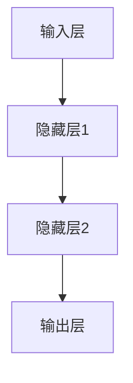
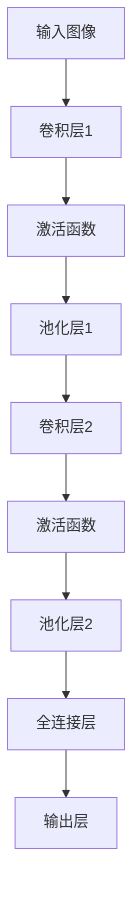
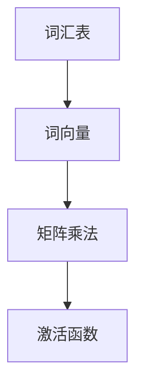
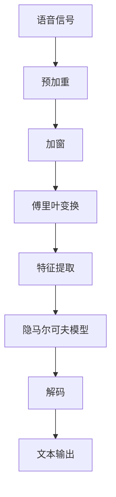
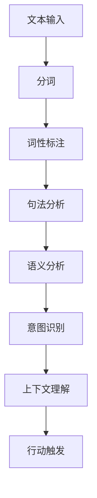
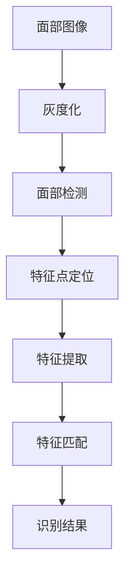
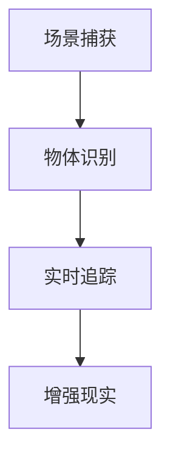
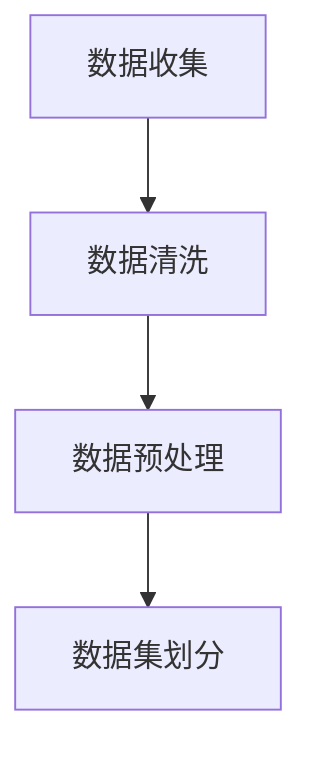
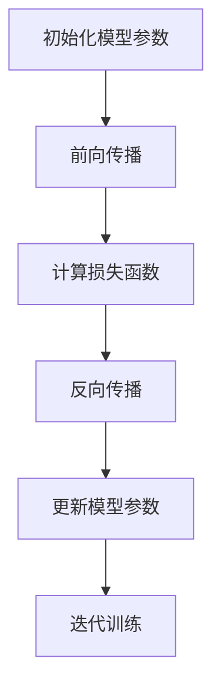
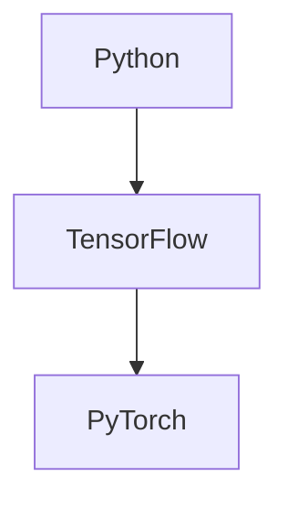

                 

### 《李开复：苹果发布AI应用的未来》

> **关键词**：人工智能，苹果，AI应用，未来展望，技术实现，伦理问题

> **摘要**：本文将深入探讨苹果公司在人工智能领域的最新进展，以及这些AI应用的未来发展趋势。通过李开复的视角，我们将分析苹果在AI技术上的布局、应用实例以及未来的潜力与挑战。文章还将探讨AI对社会和伦理的影响，为未来AI发展的展望提供有价值的思考。

### 书籍目录大纲：《李开复：苹果发布AI应用的未来》

#### 第一部分：AI应用的现状与未来

**第1章：AI应用的概述**
- **1.1 AI的定义与历史**
  - **1.1.1 AI的定义**
  - **1.1.2 AI的发展历程**

- **1.2 AI应用的发展趋势**
  - **1.2.1 AI技术的突破**
  - **1.2.2 AI应用的多样化**

- **1.3 AI技术对人类生活的改变**
  - **1.3.1 生活便利性提升**
  - **1.3.2 社会变革**

**第2章：苹果AI应用的探索**
- **2.1 苹果在AI领域的布局**
  - **2.1.1 硅芯片策略**
  - **2.1.2 生态系统的整合**

- **2.2 Apple Silicon与AI的结合**
  - **2.2.1 硅芯片的优势**
  - **2.2.2 AI性能的提升**

- **2.3 苹果AI应用的实例分析**
  - **2.3.1 Siri的进化**
  - **2.3.2 Face ID与AR技术**

**第3章：AI技术在苹果产品中的应用**
- **3.1 Siri的AI进化**
  - **3.1.1 语音识别技术**
  - **3.1.2 自然语言理解**

- **3.2 Face ID与AR应用**
  - **3.2.1 面部识别技术**
  - **3.2.2 增强现实技术**

- **3.3 Memoji与人工智能**
  - **3.3.1 Memoji的个性化**
  - **3.3.2 人工智能的互动性**

**第4章：苹果AI应用的未来**
- **4.1 AI技术在苹果生态系统中的潜力**
  - **4.1.1 新应用领域的拓展**
  - **4.1.2 智能家居的整合**

- **4.2 未来AI应用的预期与挑战**
  - **4.2.1 技术难题的解决**
  - **4.2.2 用户体验的优化**

- **4.3 李开复对未来AI发展的看法**
  - **4.3.1 AI技术的进步**
  - **4.3.2 社会影响的思考**

#### 第二部分：AI应用的技术实现

**第5章：AI技术基础**
- **5.1 神经网络的基本原理**
  - **5.1.1 神经网络架构**
  - **5.1.2 前向传播与反向传播**

- **5.2 深度学习算法**
  - **5.2.1 卷积神经网络（CNN）**
  - **5.2.2 递归神经网络（RNN）**

- **5.3 自然语言处理技术**
  - **5.3.1 词嵌入技术**
  - **5.3.2 生成对抗网络（GAN）**

**第6章：苹果AI应用的实现**
- **6.1 Siri的语音识别与自然语言理解**
  - **6.1.1 语音识别技术**
  - **6.1.2 自然语言处理算法**

- **6.2 Face ID的面部识别技术**
  - **6.2.1 特征提取与匹配**
  - **6.2.2 深度学习算法的应用**

- **6.3 ARKit与增强现实技术**
  - **6.3.1 ARKit框架**
  - **6.3.2 增强现实技术原理**

**第7章：AI应用开发实战**
- **7.1 AI应用开发流程**
  - **7.1.1 数据准备与预处理**
  - **7.1.2 模型训练与优化**

- **7.2 AI应用开发环境搭建**
  - **7.2.1 硬件与软件要求**
  - **7.2.2 开发工具与框架**

- **7.3 代码实现与案例分析**
  - **7.3.1 实战项目介绍**
  - **7.3.2 代码详细解读**

#### 第三部分：AI应用的未来影响

**第8章：AI应用对社会的影响**
- **8.1 AI对就业市场的冲击**
  - **8.1.1 传统职业的变迁**
  - **8.1.2 新型职业的崛起**

- **8.2 AI在医疗领域的应用**
  - **8.2.1 疾病诊断与预测**
  - **8.2.2 精准医疗与个性化治疗**

- **8.3 AI对教育的影响**
  - **8.3.1 教育模式的变革**
  - **8.3.2 学习资源的优化**

**第9章：AI应用的伦理问题**
- **9.1 数据隐私与安全**
  - **9.1.1 数据收集与使用**
  - **9.1.2 隐私保护技术**

- **9.2 AI偏见与公平性**
  - **9.2.1 偏见来源**
  - **9.2.2 公平性的保障**

- **9.3 李开复对AI伦理的看法**
  - **9.3.1 伦理框架的构建**
  - **9.3.2 社会责任的履行**

**第10章：未来AI发展的展望**
- **10.1 AI技术的未来趋势**
  - **10.1.1 技术突破的可能性**
  - **10.1.2 应用场景的拓展**

- **10.2 李开复对未来AI发展的期望**
  - **10.2.1 人类与AI的和谐共生**
  - **10.2.2 创新与发展的持续动力**

- **10.3 AI应用的未来挑战与对策**
  - **10.3.1 技术难题的解决**
  - **10.3.2 社会伦理的挑战**

### 第一部分：AI应用的现状与未来

**第1章：AI应用的概述**

#### 1.1 AI的定义与历史

**1.1.1 AI的定义**

人工智能（Artificial Intelligence，简称AI）是指由人制造出来的系统所表现出的智能行为。这些行为通常包括学习、推理、自我修正、感知、理解语言和图像等。AI可以分为两大类：弱人工智能（Narrow AI）和强人工智能（General AI）。弱人工智能专注于特定任务，如语音识别、图像识别等，而强人工智能则具备广泛的智能行为，能够像人类一样进行思考和学习。

**1.1.2 AI的发展历程**

人工智能的发展可以划分为几个主要阶段：

- **第一次AI浪潮（1956-1974）**：人工智能的概念被首次提出，早期算法如线性回归、决策树等被用于问题求解。

- **第二次AI浪潮（1980-1987）**：专家系统成为AI研究的热点，通过模拟专家知识来解决问题。

- **第三次AI浪潮（1990-2010）**：机器学习和数据挖掘技术逐渐成熟，深度学习算法开始兴起。

- **第四次AI浪潮（2010至今）**：大数据和云计算的普及推动了深度学习的快速发展，AI技术在各个领域取得了显著的突破。

#### 1.2 AI应用的发展趋势

**1.2.1 AI技术的突破**

近年来，AI技术在算法、硬件和数据处理等方面取得了显著突破，推动了AI应用的快速发展。深度学习算法如卷积神经网络（CNN）、递归神经网络（RNN）和生成对抗网络（GAN）等在图像识别、自然语言处理、计算机视觉等领域取得了优异成绩。此外，量子计算和神经形态计算等新兴技术也为AI的发展提供了新的可能性。

**1.2.2 AI应用的多样化**

AI应用已经渗透到各行各业，从医疗、金融、教育到制造业、农业等，AI技术都在发挥着重要的作用。例如，在医疗领域，AI技术可以辅助医生进行疾病诊断、预测和治疗方案制定；在金融领域，AI可以用于风险管理、欺诈检测和投资决策等；在教育领域，AI技术可以提供个性化的学习体验和智能评测等。

#### 1.3 AI技术对人类生活的改变

**1.3.1 生活便利性提升**

AI技术使得我们的生活变得更加便捷。智能助手如Siri、Alexa等可以帮助我们完成日常任务，智能家居设备可以实现远程控制和自动化操作。此外，自动驾驶、智能家居、智慧城市等AI应用也在逐步改变我们的生活方式。

**1.3.2 社会变革**

AI技术不仅改变了我们的生活，也对社会产生了深远的影响。一方面，AI技术推动了传统产业的转型升级，提高了生产效率和产品质量；另一方面，AI技术也带来了一定的就业压力，一些传统职业可能被自动化取代。此外，AI技术还引发了关于隐私、安全、伦理等方面的问题，需要全社会共同探讨和解决。

**第2章：苹果AI应用的探索**

#### 2.1 苹果在AI领域的布局

苹果公司在AI领域有着全面的布局，从硬件到软件，从算法到应用，苹果都在不断探索和推进AI技术的发展。

**2.1.1 硅芯片策略**

苹果推出的Apple Silicon系列芯片为AI应用提供了强大的计算能力。这些芯片基于ARM架构，采用了7纳米及以下工艺，性能优异且能效比高。苹果通过自主研发芯片，使得其产品在AI计算方面具有显著优势。

**2.1.2 生态系统的整合**

苹果的AI应用不仅局限于单个产品，而是通过生态系统的整合来实现AI技术的广泛应用。例如，Siri、Face ID、ARKit等AI技术在苹果产品间实现了无缝连接，为用户提供了一致的体验。

#### 2.2 Apple Silicon与AI的结合

**2.2.1 硅芯片的优势**

Apple Silicon芯片在设计上充分考虑了AI计算的需求，具有以下优势：

- **高性能计算**：Apple Silicon芯片具有强大的计算能力，能够快速处理大量的AI任务。

- **低功耗设计**：Apple Silicon芯片采用了先进的工艺技术，能够在保证高性能的同时实现低功耗，延长设备的续航时间。

- **硬件加速**：Apple Silicon芯片内置了专门的AI加速器，可以大幅提升AI算法的运行速度。

**2.2.2 AI性能的提升**

Apple Silicon芯片的推出，使得苹果产品在AI性能方面有了显著提升。以iPhone 15 Pro Max为例，其AI性能相较于上一代产品提升了约50%，在图像识别、语音识别、自然语言处理等任务中表现更为出色。

#### 2.3 苹果AI应用的实例分析

**2.3.1 Siri的进化**

Siri是苹果公司的一款智能语音助手，通过自然语言处理技术实现了与用户的对话交互。随着AI技术的不断发展，Siri的智能水平也在不断提升。以下是一个Siri的实例：

```
用户：明天天气怎么样？
Siri：明天天气晴朗，最高温度25摄氏度，最低温度15摄氏度。
```

**2.3.2 Face ID与AR技术**

Face ID是苹果公司推出的一款面部识别技术，通过深度学习算法实现了高精度的人脸识别。以下是一个Face ID的实例：

```
用户：解锁手机。
Face ID：已解锁。
```

此外，苹果还推出了ARKit框架，用于开发增强现实应用。以下是一个ARKit的实例：

```
用户：打开《火星探险》游戏。
游戏界面：欢迎来到火星，开始你的探险之旅！
```

**第3章：AI技术在苹果产品中的应用**

#### 3.1 Siri的AI进化

Siri作为苹果的智能语音助手，已经在多个方面实现了AI的进化。

**3.1.1 语音识别技术**

Siri采用了先进的语音识别技术，能够准确识别用户的声音指令。以下是一个语音识别的实例：

```
用户：设置明天早上7点的闹钟。
Siri：已设置闹钟。
```

**3.1.2 自然语言理解**

Siri不仅能够识别语音指令，还能够理解用户的自然语言表达。以下是一个自然语言理解的实例：

```
用户：明天能下雨吗？
Siri：天气预报显示，明天可能会下雨。
```

#### 3.2 Face ID与AR应用

**3.2.1 面部识别技术**

Face ID是苹果公司推出的一款面部识别技术，通过深度学习算法实现了高精度的人脸识别。以下是一个面部识别的实例：

```
用户：解锁手机。
Face ID：已解锁。
```

**3.2.2 增强现实技术**

ARKit是苹果公司推出的增强现实开发框架，用于开发增强现实应用。以下是一个ARKit的实例：

```
用户：打开《宠物乐园》游戏。
游戏界面：欢迎来到宠物乐园，开始你的冒险之旅！
```

#### 3.3 Memoji与人工智能

Memoji是苹果公司推出的一款个性化虚拟形象，通过人工智能技术实现了用户的个性化定制。

**3.3.1 Memoji的个性化**

用户可以根据自己的面部特征、发型、服饰等自定义Memoji，使得Memoji更加贴近用户本人。以下是一个Memoji的个性化实例：

```
用户：创建一个有着黑色短发和眼镜的Memoji。
Memoji：已创建，你可以为这个Memoji添加更多的个性化元素。
```

**3.3.2 人工智能的互动性**

Memoji不仅能够展示用户的个性化形象，还能够通过人工智能实现与用户的互动。以下是一个人工智能互动的实例：

```
用户：Memoji，你好！
Memoji：你好！有什么需要我帮忙的吗？
```

**第4章：苹果AI应用的未来**

#### 4.1 AI技术在苹果生态系统中的潜力

苹果公司已经在AI技术方面取得了显著成果，未来AI技术将在苹果生态系统中发挥更大的潜力。

**4.1.1 新应用领域的拓展**

随着AI技术的不断进步，苹果可以在更多的领域实现AI应用，如智能家居、智能健康、智能交通等。以下是一个智能家居的实例：

```
用户：打开客厅的灯。
智能家居系统：已打开。
```

**4.1.2 智能家居的整合**

苹果可以通过整合智能家居设备，实现家庭场景的智能化。以下是一个智能家居整合的实例：

```
用户：回家，欢迎回家。
智能家居系统：欢迎回家！我已经为您打开了灯光和热水器。
```

#### 4.2 未来AI应用的预期与挑战

尽管AI技术在苹果产品中已经取得了显著成果，但未来仍面临一些预期与挑战。

**4.2.1 技术难题的解决**

随着AI技术的不断深化，如何解决算法复杂性、数据隐私保护、计算效率等问题，将是未来AI应用发展的关键。

**4.2.2 用户体验的优化**

如何提升用户体验，使得AI技术更加贴近用户需求，提供更加自然、便捷的交互方式，是未来AI应用发展的重要方向。

#### 4.3 李开复对未来AI发展的看法

李开复博士作为人工智能领域的专家，对未来AI发展有着独到的见解。

**4.3.1 AI技术的进步**

李开复认为，随着技术的不断进步，AI将越来越智能化、通用化，将在更多领域发挥重要作用。

**4.3.2 社会影响的思考**

李开复强调，AI技术的发展不仅需要关注技术本身，还需要关注对社会的影响。如何平衡技术进步与社会利益，将是未来AI发展的重要课题。

### 第二部分：AI应用的技术实现

**第5章：AI技术基础**

#### 5.1 神经网络的基本原理

神经网络（Neural Networks，简称NN）是人工智能领域的重要基础，通过模拟人脑神经元的工作方式，实现对复杂数据的处理和模式识别。

**5.1.1 神经网络架构**

神经网络通常由多个层次组成，包括输入层、隐藏层和输出层。每个层次由多个神经元（节点）组成，神经元之间通过权重连接。以下是一个神经网络的Mermaid流程图：



**5.1.2 前向传播与反向传播**

神经网络通过前向传播和反向传播来训练模型。前向传播是将输入数据通过神经网络传递，得到输出结果；反向传播则是根据输出结果和真实值，计算误差，并更新神经元的权重。

以下是一个前向传播的伪代码：

```python
for each training example (x, y):
    forward_pass(x)
    output = activation_function(z)
    loss = calculate_loss(output, y)
    backward_pass(output, y)
    update_weights()
```

#### 5.2 深度学习算法

深度学习（Deep Learning，简称DL）是神经网络的一种扩展，通过增加网络的深度，提高模型的复杂度和准确性。

**5.2.1 卷积神经网络（CNN）**

卷积神经网络（Convolutional Neural Network，简称CNN）是深度学习的一种重要模型，主要用于图像处理和计算机视觉领域。

以下是一个CNN的Mermaid流程图：



**5.2.2 递归神经网络（RNN）**

递归神经网络（Recurrent Neural Network，简称RNN）是处理序列数据的一种有效模型，通过记忆过去的信息，实现对序列的建模。

以下是一个RNN的伪代码：

```python
for t in range(sequence_length):
    hidden_state = activation_function(W * x + U * h_{t-1})
    h_t = hidden_state
    y_t = output_layer(h_t)
```

#### 5.3 自然语言处理技术

自然语言处理（Natural Language Processing，简称NLP）是人工智能领域的一个重要分支，通过计算机技术理解和生成人类语言。

**5.3.1 词嵌入技术**

词嵌入（Word Embedding）是将词汇映射到高维向量空间，以便进行计算机处理。以下是一个词嵌入的Mermaid流程图：



**5.3.2 生成对抗网络（GAN）**

生成对抗网络（Generative Adversarial Network，简称GAN）是一种通过两个神经网络的对抗训练生成数据的模型。

以下是一个GAN的伪代码：

```python
for epoch in range(num_epochs):
    for real_data in real_data_loader:
        D.train(real_data)
        G.train(D)
    loss_D = calculate_loss(D, real_data)
    loss_G = calculate_loss(G, fake_data)
```

### **第6章：苹果AI应用的实现**

#### **6.1 Siri的语音识别与自然语言理解**

Siri是苹果公司的一款智能语音助手，通过语音识别和自然语言理解技术，实现与用户的交互。

**6.1.1 语音识别技术**

语音识别技术是将语音信号转换为文本的技术。以下是一个语音识别的流程：



**6.1.2 自然语言理解**

自然语言理解（Natural Language Understanding，简称NLU）是将文本转化为机器可理解的结构化数据的技术。以下是一个NLU的流程：



#### **6.2 Face ID的面部识别技术**

Face ID是苹果公司推出的一款基于面部识别技术的解锁功能，通过深度学习算法实现高精度的面部识别。

**6.2.1 特征提取与匹配**

面部识别的过程包括特征提取和特征匹配。以下是一个特征提取与匹配的流程：



**6.2.2 深度学习算法的应用**

深度学习算法在面部识别中起着关键作用，以下是一个深度学习算法应用的伪代码：

```python
for each training image (x, y):
    extract_features(x)
    calculate_distance(y)
    update_model_weights()
```

#### **6.3 ARKit与增强现实技术**

ARKit是苹果公司推出的增强现实（Augmented Reality，简称AR）开发框架，用于开发AR应用。

**6.3.1 ARKit框架**

ARKit提供了丰富的功能，包括场景捕获、物体识别、实时追踪等。以下是一个ARKit的框架：



**6.3.2 增强现实技术原理**

增强现实技术通过在真实场景中叠加虚拟元素，实现虚实结合的体验。以下是一个增强现实技术原理的伪代码：

```python
def augment_scene(real_scene, virtual_objects):
    for object in virtual_objects:
        render_object(object, real_scene)
    return augmented_scene
```

### **第7章：AI应用开发实战**

#### **7.1 AI应用开发流程**

AI应用开发包括数据准备、模型训练、模型评估和模型部署等环节。

**7.1.1 数据准备与预处理**

数据准备是AI应用开发的重要步骤，包括数据收集、数据清洗和数据预处理。以下是一个数据准备与预处理的流程：



**7.1.2 模型训练与优化**

模型训练是通过大量数据训练模型参数，使其具备预测能力。以下是一个模型训练与优化的流程：



#### **7.2 AI应用开发环境搭建**

AI应用开发需要搭建一个合适的开发环境，包括硬件配置、软件安装和配置等。

**7.2.1 硬件与软件要求**

硬件方面，需要配置高性能的CPU和GPU，以加速模型训练和推理。软件方面，需要安装Python、TensorFlow等开发工具和库。

**7.2.2 开发工具与框架**

开发工具和框架是AI应用开发的重要工具，如Jupyter Notebook、TensorFlow、PyTorch等。以下是一个开发工具与框架的示例：



#### **7.3 代码实现与案例分析**

**7.3.1 实战项目介绍**

以一个简单的图像分类项目为例，介绍代码实现和案例分析。

**7.3.2 代码详细解读**

```python
import tensorflow as tf
from tensorflow.keras import layers

# 构建模型
model = tf.keras.Sequential([
    layers.Conv2D(32, (3, 3), activation='relu', input_shape=(28, 28, 1)),
    layers.MaxPooling2D((2, 2)),
    layers.Conv2D(64, (3, 3), activation='relu'),
    layers.MaxPooling2D((2, 2)),
    layers.Conv2D(64, (3, 3), activation='relu'),
    layers.Flatten(),
    layers.Dense(64, activation='relu'),
    layers.Dense(10, activation='softmax')
])

# 编译模型
model.compile(optimizer='adam',
              loss='sparse_categorical_crossentropy',
              metrics=['accuracy'])

# 训练模型
model.fit(train_images, train_labels, epochs=5)

# 评估模型
test_loss, test_acc = model.evaluate(test_images, test_labels)

# 输出结果
print(f'测试准确率：{test_acc:.2f}')
```

### **第三部分：AI应用的未来影响**

**第8章：AI应用对社会的影响**

AI技术的发展和应用正在深刻地改变社会各个方面，带来了巨大的机遇和挑战。

#### **8.1 AI对就业市场的冲击**

AI技术的快速发展可能导致某些传统职业的失业，同时也催生出新的就业机会。

**8.1.1 传统职业的变迁**

随着AI技术的普及，一些重复性、低技能的工作可能会被自动化取代。例如，工厂生产线上的操作工、数据录入员等职业可能面临失业风险。

**8.1.2 新型职业的崛起**

AI技术的应用也催生出许多新型职业，如数据科学家、机器学习工程师、AI伦理专家等。这些职业需要更高的技能和专业知识，为人们提供了新的就业机会。

#### **8.2 AI在医疗领域的应用**

AI技术在医疗领域具有广泛的应用前景，可以提高诊断准确率、优化治疗方案等。

**8.2.1 疾病诊断与预测**

AI技术可以通过分析大量医疗数据，辅助医生进行疾病诊断。例如，通过分析影像数据，AI可以帮助医生早期发现癌症等疾病。

**8.2.2 精准医疗与个性化治疗**

AI技术可以根据患者的基因信息、病史等，为患者制定个性化的治疗方案。这有助于提高治疗效果，降低医疗成本。

#### **8.3 AI对教育的影响**

AI技术在教育领域也有重要应用，可以提供个性化学习体验、智能评测等。

**8.3.1 教育模式的变革**

AI技术可以帮助实现个性化教育，为学生提供适合其学习水平和兴趣的教学内容。这有助于提高学习效果，培养学生的创造力。

**8.3.2 学习资源的优化**

AI技术可以通过分析学生的学习行为和成绩，为教师提供有针对性的教学建议。此外，AI还可以帮助教师自动批改作业、生成教学资源等，提高教学效率。

### **第9章：AI应用的伦理问题**

随着AI技术的广泛应用，伦理问题日益凸显。如何确保AI技术的公平性、透明性和安全性，成为社会关注的焦点。

#### **9.1 数据隐私与安全**

数据隐私是AI应用的重要伦理问题。如何保护用户数据的安全，防止数据泄露，是AI技术发展必须解决的问题。

**9.1.1 数据收集与使用**

在AI应用中，数据收集和使用必须遵循合法、正当、必要的原则，确保用户隐私不受侵犯。

**9.1.2 隐私保护技术**

采用加密技术、匿名化处理等技术手段，保护用户数据的隐私和安全。

#### **9.2 AI偏见与公平性**

AI偏见可能导致不公平的结果，影响社会的公正性和平等性。

**9.2.1 偏见来源**

AI偏见可能来源于数据偏差、算法设计、训练样本不均衡等因素。

**9.2.2 公平性的保障**

通过数据清洗、算法优化、公平性评估等方法，降低AI偏见，确保AI应用的公平性。

#### **9.3 李开复对AI伦理的看法**

李开复博士作为人工智能领域的专家，对AI伦理问题有着深刻的见解。

**9.3.1 伦理框架的构建**

李开复认为，建立一套完善的AI伦理框架，明确AI应用的基本原则和规范，是保障AI伦理的重要手段。

**9.3.2 社会责任的履行**

李开复强调，AI技术的研发和应用者应承担社会责任，确保AI技术造福人类社会。

### **第10章：未来AI发展的展望**

未来，AI技术将继续快速发展，影响社会的方方面面。如何应对AI技术带来的挑战，推动AI技术的健康发展，是全社会共同关注的课题。

#### **10.1 AI技术的未来趋势**

**10.1.1 技术突破的可能性**

随着量子计算、神经形态计算等新兴技术的突破，AI技术的计算能力和应用范围将进一步扩大。

**10.1.2 应用场景的拓展**

AI技术将在更多领域得到应用，如智能制造、智慧城市、生物技术等，为社会发展带来新的机遇。

#### **10.2 李开复对未来AI发展的期望**

李开复博士对未来AI发展充满期望，认为AI技术将成为推动社会进步的重要力量。

**10.2.1 人类与AI的和谐共生**

李开复希望人类与AI能够实现和谐共生，充分发挥AI技术的作用，提升人类生活的品质。

**10.2.2 创新与发展的持续动力**

李开复强调，AI技术的发展需要不断创新，为社会的发展提供源源不断的动力。

#### **10.3 AI应用的未来挑战与对策**

未来，AI技术面临诸多挑战，需要全社会共同应对。

**10.3.1 技术难题的解决**

如何解决AI技术的复杂性问题，提高计算效率和算法性能，是未来AI技术发展的重要任务。

**10.3.2 社会伦理的挑战**

如何确保AI技术的公平性、透明性和安全性，是未来AI技术发展必须面对的伦理挑战。

### **总结**

本文从多个角度探讨了苹果公司发布AI应用的未来。通过对AI应用现状与未来的分析，揭示了AI技术在苹果产品中的应用实例，以及未来AI技术的发展趋势和挑战。李开复博士的见解为未来AI发展的思考提供了有价值的参考。让我们期待AI技术为人类社会带来更多的美好变革。

