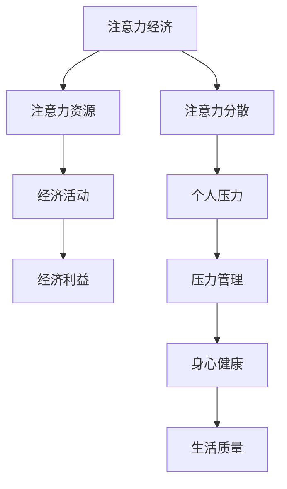

                 

### 注意力经济与个人压力管理的关系

注意力经济和个人压力管理是两个在现代社会中愈发重要的概念，它们之间的关系值得深入探讨。注意力经济，源自对注意力作为一种稀缺资源在市场经济中的价值认识，强调如何通过吸引和保持人们的注意力来实现经济利益。而个人压力管理，则涉及如何应对和缓解生活中的各种压力，以保持身心健康和高效生活。

#### 核心概念与联系

为了更好地理解两者之间的关系，我们可以借助 Mermaid 图来展示注意力经济与个人压力管理的核心概念及联系。

在这个图中，注意力经济强调如何通过管理注意力资源参与经济活动，从而实现经济利益。而注意力分散和压力管理则体现了个人在面对注意力稀缺时的应对策略，这些策略直接关系到个人的身心健康和生活质量。

#### 注意力经济的基本原理

注意力经济的核心在于注意力资源的稀缺性和价值。在信息爆炸的时代，人们面临的选择越来越多，而能够投入的时间和精力是有限的。因此，如何吸引和保持人们的注意力成为一种重要的经济活动。注意力经济主要体现在以下几个方面：

1. **广告行业**：广告商通过创意和策略来吸引消费者的注意力，以实现商品或服务的销售。
2. **内容创作**：内容创作者通过创作有价值、有趣的内容来吸引读者的注意力，从而获得广告收入或其他形式的回报。
3. **社交媒体**：社交媒体平台通过用户的互动和分享来吸引大量注意力，实现平台盈利。

#### 个人压力管理的基本原理

个人压力管理则涉及如何应对生活中的各种压力，以保持身心健康。压力管理的基本原理包括：

1. **认知重构**：改变对压力的认知，将其视为一种挑战而非威胁，从而减少压力的感受。
2. **合理分配注意力**：将注意力集中在重要和紧急的任务上，避免因注意力分散而增加压力。
3. **积极应对**：采取积极的方法应对压力，如锻炼、放松、寻求支持等。

#### 注意力经济与压力管理的关联

注意力经济与个人压力管理之间的关系体现在以下几个方面：

1. **注意力资源的稀缺性**：注意力资源有限，如何在日常生活中合理分配和利用注意力资源，是压力管理的重要内容。
2. **注意力分散与压力**：注意力分散会导致个人压力增加，有效的压力管理需要提高注意力集中度。
3. **经济利益与身心健康**：通过注意力经济获取的经济利益，可以用于改善个人生活质量和健康状况，从而进一步优化压力管理。

通过上述分析，我们可以看到，注意力经济和个人压力管理是相互关联的。有效管理注意力资源不仅有助于实现经济利益，也能提升个人的身心健康和生活质量。因此，理解和应用注意力经济与压力管理的原理和方法，对于个人和社会都具有重要意义。

---

**文章关键词**：注意力经济，个人压力管理，稀缺资源，经济利益，生活质量，压力管理。

**文章摘要**：
本文从注意力经济的概念和原理出发，探讨了注意力经济与个人压力管理之间的关系。通过分析注意力资源的稀缺性和价值，以及压力管理的基本原理，揭示了注意力经济如何影响个人压力，以及如何通过有效的压力管理策略来优化生活质量。文章结合实际案例，提供了注意力经济与压力管理的具体实践方法，并对未来这一领域的发展趋势进行了展望。本文旨在帮助读者深入理解注意力经济与个人压力管理的重要性，提高个人生活质量和应对压力的能力。

---

### 目录大纲

以下是对本文的目录大纲的详细阐述，每个部分都将进行深入分析和探讨。

#### 第一部分：注意力经济概述

### 1.1.1 注意力经济的概念与背景

在这一部分，我们将详细探讨注意力经济的概念及其背后的理论基础。注意力经济起源于20世纪70年代，由社会学家特德·赛泽夫提出，他认为注意力是一种有限的资源，类似于时间和金钱。随着互联网和社交媒体的兴起，注意力经济逐渐成为一种重要的经济形态。我们将从以下几个方面展开讨论：

1. **注意力经济的定义**：明确注意力经济的概念，解释其在市场经济中的角色和意义。
2. **注意力经济的起源与发展**：回顾注意力经济的历史背景，分析其发展的关键节点和影响因素。
3. **注意力经济的核心要素**：探讨注意力经济的核心组成部分，如注意力资源、注意力分配和注意力转移等。

#### 1.1.2 注意力资源的特性

注意力资源是注意力经济的基础，其特性决定了其价值和应用。以下是注意力资源的几个关键特性：

1. **稀缺性**：注意力资源是有限的，每个人每天只有一定的时间和精力去关注和参与各种活动。
2. **竞争性**：在市场经济中，个体或组织之间存在着激烈的竞争，以争夺更多的注意力资源。
3. **易分散性**：人们的注意力容易分散，一旦外界干扰或诱惑出现，注意力就会迅速转移。

我们将深入探讨这些特性，并分析它们对注意力经济的影响。

#### 1.1.3 注意力经济的影响

注意力经济不仅改变了市场经济的运作模式，也对个人生活、商业活动和社会产生了深远的影响。以下是注意力经济影响的几个方面：

1. **对个人生活的影响**：注意力经济如何影响人们的时间管理、信息筛选和社交互动。
2. **对商业活动的影响**：注意力经济如何影响广告业、媒体行业和电子商务等领域。
3. **对社会的影响**：注意力经济如何改变社会的价值观念和社交结构。

#### 1.1.4 注意力经济与压力管理的关系

注意力经济与个人压力管理之间存在密切的联系。一方面，注意力资源的稀缺性和竞争性可能导致个人压力的增加；另一方面，有效的压力管理策略可以帮助个体更好地利用注意力资源，减轻压力。我们将探讨注意力经济如何影响个人压力，以及如何通过注意力资源管理来缓解压力。

#### 第二部分：个人压力管理概述

### 2.1.1 压力的概念与类型

在这一部分，我们将详细探讨压力的概念及其类型。压力是指个体在面临外界需求或挑战时产生的心理、生理和行为反应。压力可以分为急性压力和慢性压力，也可以根据来源分为工作压力、家庭压力和社会压力等。我们将从以下几个方面展开讨论：

1. **压力的定义**：明确压力的概念，解释其产生的机制和影响。
2. **压力的类型**：介绍常见的压力类型，如急性压力、慢性压力和环境压力等。
3. **压力的来源**：分析压力的主要来源，包括工作、家庭和社会等。

#### 2.1.2 压力的影响

压力对个人身心健康、工作和生活以及人际关系都有显著的影响。以下是压力影响的几个方面：

1. **对身心健康的影响**：长期的压力可能导致心血管疾病、免疫力下降和心理问题等。
2. **对工作与生活的影响**：压力可能导致工作效率下降、生活质量降低和人际关系紧张等。
3. **对人际关系的影响**：压力可能影响家庭关系、友谊关系和职场关系等。

#### 2.1.3 个人压力管理的原则与方法

个人压力管理涉及一系列的原则和方法，旨在帮助个体有效地应对和缓解压力。以下是几个关键的原则和方法：

1. **认知重构**：改变对压力的认知和看法，将其视为一种挑战而非威胁。
2. **合理分配注意力**：将注意力集中在重要和紧急的任务上，避免注意力分散。
3. **积极应对**：采取积极的应对策略，如锻炼、放松和寻求支持等。
4. **寻求支持**：寻求家人、朋友和专业人士的支持和帮助。

我们将详细探讨这些原则和方法，并分析其实际应用效果。

#### 第三部分：注意力经济与个人压力管理的结合

### 3.1.1 注意力资源管理在压力管理中的应用

在这一部分，我们将探讨如何将注意力资源管理应用于压力管理中。注意力资源管理是一种基于认知心理学理论的策略，旨在提高个体对注意力资源的利用效率，从而提高任务执行的质量和效率。以下是几个关键的应用场景：

1. **注意力分配**：在面对多个任务时，个体需要根据任务的重要性和紧急性，合理分配注意力资源。
2. **注意力聚焦**：在面对复杂任务时，个体需要将注意力聚焦在关键环节，避免因注意力分散而导致任务失败。
3. **注意力转移**：当个体感受到压力时，可以尝试转移注意力，通过参与其他活动或改变环境，缓解压力。
4. **注意力保护**：个体需要学会保护自己的注意力资源，避免因过度消耗注意力资源而导致压力增加。

#### 3.1.2 实际案例分析

在这一部分，我们将通过实际案例来探讨注意力资源管理在压力管理中的应用效果。以下是几个典型的案例：

1. **案例一：注意力资源管理在职场压力中的应用**：通过一个职场人士的实例，展示如何通过注意力资源管理来缓解工作压力，提高工作效率。
2. **案例二：注意力资源管理在家庭压力中的应用**：通过一个家庭主妇的实例，展示如何通过注意力资源管理来平衡家庭责任和个人需求，降低家庭压力。
3. **案例三：注意力资源管理在个人成长中的应用**：通过一个学习者的实例，展示如何通过注意力资源管理来提高学习效率，实现个人成长。

#### 3.1.3 注意力经济与压力管理工具介绍

在这一部分，我们将介绍一些实用的注意力经济与压力管理工具，包括注意力监控工具、注意力管理应用和注意力训练方法。以下是几个常用的工具：

1. **注意力监控工具**：如 Forest 和 Pomodoro Timer，帮助用户了解自己的注意力分配情况。
2. **注意力管理应用**：如 Headspace 和 Calm，提供专注力训练和放松课程。
3. **注意力训练方法**：如正念冥想和番茄工作法，帮助用户提高注意力管理和压力管理能力。

#### 第四部分：注意力经济与个人压力管理的未来展望

### 4.1.1 注意力经济与压力管理的发展趋势

在未来，注意力经济与压力管理领域将继续发展，受到技术进步和社会变革的推动。以下是几个关键的发展趋势：

1. **技术发展的影响**：人工智能、大数据分析和虚拟现实等技术的应用，将为注意力管理和压力管理带来新的工具和方法。
2. **社会变革的影响**：数字化时代和快节奏生活方式的普及，将使个体面临更多的压力和挑战，需要更加有效的压力管理策略。
3. **未来挑战与机遇**：个体化注意力管理和心理健康将成为注意力经济与压力管理的重要研究方向。

#### 4.1.2 注意力经济与压力管理的未来应用场景

在未来，注意力经济与压力管理将在多个领域得到广泛应用。以下是几个典型的应用场景：

1. **在教育领域的应用**：通过个性化学习方案和情绪调节工具，帮助学生提高学习效率和心理健康。
2. **在健康管理领域的应用**：通过注意力训练和压力监测工具，帮助个体提高身心健康水平。
3. **在商业管理领域的应用**：通过注意力管理和压力管理，提高员工的工作效率和团队合作能力。

### 4.1.3 总结与展望

在本部分，我们将总结注意力经济与个人压力管理的关系，并提出未来的研究热点和方向。以下是几个关键的观点：

1. **注意力资源是有限且宝贵的，个体和组织需要有效管理注意力资源，以实现价值和目标。**
2. **压力管理对个体的身心健康和工作生活具有重要影响，个体和组织需要采取有效的压力管理方法。**
3. **注意力经济与压力管理之间存在密切联系，有效的注意力资源管理可以帮助个体更好地应对压力，提高生活质量。**

我们还将讨论未来的研究热点和方向，如个体化注意力管理、注意力管理与心理健康的关系、注意力管理与学习效果的研究等。

#### 附录

在本部分的附录中，我们将提供注意力经济与压力管理相关的参考资源，包括学术研究资源、实践应用资源和在线工具与平台。这些资源将帮助读者进一步了解相关领域的研究和应用。

1. **学术研究资源**：包括相关书籍、论文和研究工具。
2. **实践应用资源**：包括注意力管理和压力管理网站、应用软件和工具。
3. **在线工具与平台**：包括注意力监控工具、注意力管理应用和在线课程与研讨会。

通过这些资源，读者可以更加深入地了解注意力经济与个人压力管理领域的前沿研究和实践应用。

### 第一部分：注意力经济概述

#### 1.1.1 注意力经济的概念与背景

**注意力经济的定义**

注意力经济，是指在经济活动中，人们通过注意力资源来获取经济利益的一种经济形态。这种形态的核心在于，个体或组织通过吸引他人的注意力，从而实现价值的创造和交换。注意力资源作为一种有限的、稀缺的资源，与时间、金钱等其他资源一样，在市场经济中具有不可替代的价值。

**注意力经济的起源与发展**

注意力经济的概念最早由美国社会学家特德·赛泽夫（Ted S Selezneff）在1971年提出。他认为，注意力是一种有限的资源，就像时间一样，个体在生活和工作中需要合理分配和利用注意力资源。随着互联网和社交媒体的兴起，注意力经济逐渐成为一种重要的经济形态。20世纪90年代，注意力经济成为学术界和企业界关注的热点，研究者和企业家们开始探索如何通过吸引和保持人们的注意力来创造价值。

**注意力经济的核心要素**

注意力经济的核心要素包括注意力资源、注意力分配和注意力转移。以下是这些要素的具体解释：

1. **注意力资源**：注意力资源是指个体或组织能够吸引和保持他人注意力的能力。这种能力可以通过内容、广告、营销策略等多种方式实现。注意力资源是注意力经济的基础，其稀缺性和竞争性使得它具有极高的价值。

2. **注意力分配**：注意力分配是指个体或组织如何根据不同的目标和需求，合理分配注意力资源。有效的注意力分配可以帮助个体或组织将有限的注意力资源用在最有价值的地方，从而提高经济活动的效率和收益。

3. **注意力转移**：注意力转移是指个体或组织通过策略和手段，将他人的注意力从其他竞争者或渠道转移到自己身上。注意力转移的关键在于提供有吸引力、有价值的内容或服务，从而吸引和保持他人的注意力。

**注意力经济的影响**

注意力经济对个人生活、商业活动和社会产生了深远的影响。以下是注意力经济影响的几个方面：

1. **对个人生活的影响**：注意力经济改变了人们的消费行为、信息获取方式和社交互动方式。个体需要更好地管理自己的注意力资源，以避免信息过载和注意力分散。

2. **对商业活动的影响**：注意力经济推动了广告业、媒体行业和电子商务的发展。企业通过创意和策略吸引消费者的注意力，实现商品或服务的销售和推广。

3. **对社会的影响**：注意力经济改变了社会的价值观念和结构。在注意力经济时代，创造和分享有价值的内容成为个体和社会的重要任务，推动了文化多样性和创新思维的发展。

#### 1.1.2 注意力资源的特性

**稀缺性**

注意力资源具有稀缺性，每个人每天只有一定的时间和精力去关注和参与各种活动。因此，注意力资源像时间、金钱等其他资源一样，具有不可替代的价值。在市场经济中，个体或组织需要通过有效的策略和手段来争夺和保持他人的注意力。

**竞争性**

在注意力经济中，个体或组织之间存在着激烈的竞争。为了吸引更多的注意力，他们需要不断创新和改进，以提供更有价值、更有吸引力的内容或服务。竞争性使得注意力资源成为一种稀缺资源，进一步提高了其在市场经济中的价值。

**易分散性**

注意力资源容易分散，个体或组织无法完全控制他人的注意力。人们的注意力容易被外界环境、事件或其他事物所吸引，导致注意力资源的分散和浪费。易分散性使得个体或组织需要更加精细和策略性地管理注意力资源，以最大化其利用效率。

#### 注意力资源管理

为了有效地利用注意力资源，个体或组织需要实施注意力资源管理。注意力资源管理包括以下几个方面：

1. **注意力分配**：根据不同的目标和需求，合理分配注意力资源。将注意力集中在最重要和最紧急的任务上，避免因注意力分散而降低效率。

2. **注意力聚焦**：在面对复杂任务时，将注意力聚焦在关键环节，避免因注意力分散而导致任务失败。通过专注力训练和策略，提高个体的注意力集中度。

3. **注意力转移**：通过策略和手段，将注意力从其他竞争者或渠道转移到自己身上。提供有吸引力、有价值的内容或服务，吸引和保持他人的注意力。

4. **注意力保护**：保护个人或组织的注意力资源，避免因过度消耗注意力资源而导致压力增加。学会屏蔽干扰，合理安排工作和休息时间，以提高注意力资源的利用效率。

#### 1.1.3 注意力经济的影响

**对个人生活的影响**

注意力经济对个人生活产生了深远的影响：

1. **时间管理**：由于注意力资源的稀缺性，个体需要更好地管理自己的时间，以平衡工作、学习和休息。合理安排时间，避免因注意力分散而降低效率。

2. **信息筛选**：在信息爆炸的时代，个体需要具备一定的信息筛选能力，从海量的信息中提取有价值的内容，以节省时间和精力。

3. **社交互动**：注意力经济改变了社交互动的方式，个体需要适应社交媒体时代的社交互动方式，合理利用注意力资源参与社交活动，维护人际关系。

**对商业活动的影响**

注意力经济对商业活动产生了重要的推动作用：

1. **营销策略**：企业需要通过创新的营销策略，吸引消费者的注意力，提高品牌知名度和市场份额。

2. **产品创新**：企业需要不断进行产品创新，提供具有吸引力的产品或服务，以赢得消费者的注意力。

3. **商业模式**：企业需要调整和优化商业模式，利用注意力资源创造新的盈利点和竞争优势。

**对社会的影响**

注意力经济对社会产生了广泛的影响：

1. **信息传播**：注意力经济使得信息传播更加迅速和广泛，提高了社会信息的透明度和开放度。

2. **文化多样性**：注意力经济促进了文化多样性的发展，各种不同类型的内容和观点得以传播和交流。

3. **社会结构**：注意力经济改变了社会的价值观念和结构，注重个人创造力和创新能力的社会逐渐崛起。

#### 1.1.4 注意力经济与压力管理的关系

**注意力经济对个人压力的影响**

注意力经济对个人压力产生了双重影响：

1. **压力增加**：由于注意力资源的稀缺性和竞争性，个体在获取和保持注意力资源时可能会感受到压力，尤其是当注意力资源无法满足需求时。

2. **压力释放**：注意力经济也为个体提供了释放压力的途径，通过参与有趣、有价值的活动，个体可以暂时忘记压力，获得心理上的放松。

**注意力资源管理与压力管理的关系**

注意力资源管理与压力管理密切相关：

1. **相互促进**：良好的注意力资源管理有助于降低个人压力，通过合理分配和利用注意力资源，个体可以更好地应对压力，提高工作效率和生活质量。

2. **相互制约**：不合理的注意力资源管理可能导致个人压力增加，如过度关注琐碎事务、忽视重要任务等。

### 1.1.5 注意力经济与个人压力管理的结合

**注意力资源管理在压力管理中的应用**

注意力资源管理在压力管理中具有重要作用，以下是一些具体应用：

1. **注意力分配**：在面对多个任务时，个体应根据任务的重要性和紧急性，合理分配注意力资源。将注意力集中在重要和紧急的任务上，避免因注意力分散而增加压力。

2. **注意力聚焦**：在面对复杂任务时，个体需要将注意力聚焦在关键环节，避免因注意力分散而导致任务失败。例如，在撰写重要报告时，可以采用番茄工作法，将工作时间分割为25分钟专注期和5分钟休息期，以提高工作效率。

3. **注意力转移**：当个体感受到压力时，可以尝试转移注意力，通过参与其他活动或改变环境，缓解压力。例如，在紧张的工作环境中，可以暂时离开办公室，去户外散步或进行运动，以放松身心。

4. **注意力保护**：个体需要学会保护自己的注意力资源，避免因过度消耗注意力资源而导致压力增加。例如，在日常生活中，可以采用屏蔽干扰技术，如关闭社交媒体通知、使用耳机等，以减少外部干扰。

**个人生活中的实践**

以下是一些注意力资源管理在个人生活中的实践方法：

1. **制定计划和目标**：在日常生活中，个体可以制定详细的计划和目标，明确每天的任务和优先级，以避免因目标不明确而导致的注意力分散。

2. **设定专注时间**：个体可以设定专注时间，例如采用番茄工作法，将工作时间分割为25分钟专注期和5分钟休息期，以提高专注力和工作效率。

3. **培养专注力**：个体可以通过练习冥想、瑜伽等专注力训练方法，提高自身的专注力和注意力管理能力。

4. **合理安排休息和娱乐**：个体需要合理安排休息和娱乐时间，以缓解压力，恢复精力。

**案例分析**

以下是一个个人生活中的案例分析：

**案例背景**：小王是一名程序员，由于工作繁忙，他经常感到压力巨大，工作效率低下。

**解决方案**：

1. **注意力分配**：小王将注意力集中在最关键的任务上，如项目规划和问题解决。他将次要任务交给团队成员，确保自己将注意力集中在最重要的事情上。

2. **注意力聚焦**：小王采用番茄工作法，将工作时间分割为25分钟专注期和5分钟休息期，以提高专注力和工作效率。

3. **注意力转移**：当小王感受到压力时，他会暂时离开办公室，去户外散步或进行运动，以放松身心。

4. **注意力保护**：小王学会了屏蔽干扰，关闭社交媒体通知，避免因过度消耗注意力资源而导致压力增加。

**效果**：通过注意力资源管理，小王的压力得到了有效缓解，工作效率也得到了提高，项目最终顺利完成。

### 1.1.6 结论

注意力经济与个人压力管理是现代社会中两个重要的概念，它们之间的关系密切且相互影响。通过有效地管理注意力资源，个体可以降低压力水平，提高生活质量；同时，注意力经济的理念也为压力管理提供了新的思路和方法。在未来，随着技术和社会的不断发展，注意力经济与压力管理将继续融合，为个人和社会带来更多的价值。

---

### 1.1.2 注意力资源的特性

在探讨注意力经济的过程中，理解注意力资源的特性是至关重要的。注意力资源作为一种稀缺且有限的资源，其特性决定了其在经济活动中的价值和作用。以下是注意力资源的几个关键特性：

#### 稀缺性

注意力资源的稀缺性是注意力经济理论的核心。每个人每天只有有限的时间和精力，而面对的信息和活动却日益增多。因此，个体需要做出选择，将注意力分配到最有价值和最重要的任务上。例如，在数字化时代，人们每天需要处理大量的电子邮件、社交媒体更新、新闻推送等，而能够投入每个信息或活动上的时间和精力是有限的。这种稀缺性使得注意力资源成为了一种宝贵的经济资源，个体和组织必须通过有效的策略和手段来争夺和利用。

#### 竞争性

注意力资源的竞争性体现在个体和组织之间为了获取更多的注意力而进行的竞争。在注意力经济中，竞争不仅仅存在于企业之间，也存在于个人之间。企业通过广告、内容营销和其他营销手段来争夺消费者的注意力，而个人则通过社交活动、兴趣爱好等方式来吸引他人的关注。竞争性使得注意力资源变得更有价值，因为吸引和保持他人的注意力需要创新和高质量的内容。

#### 易分散性

注意力资源的易分散性是指人们的注意力容易被外界因素分散，难以长时间集中。在信息爆炸的时代，各种媒体、应用和广告不断争夺人们的注意力，导致注意力分散。例如，一个人在浏览网页时，可能会被弹出的广告、社交媒体的通知或其他有趣的链接吸引，从而离开原本关注的内容。这种易分散性使得个体和组织需要更加精细和策略性地管理注意力资源，以避免不必要的分散和浪费。

#### 注意力资源管理

为了有效地利用注意力资源，个体和组织需要实施注意力资源管理。以下是一些注意力资源管理的策略和方法：

1. **注意力分配**：个体应根据任务的重要性和紧急性，合理分配注意力资源。将注意力集中在最关键的任务上，避免因注意力分散而降低效率。

2. **注意力聚焦**：在面对复杂任务时，个体需要将注意力聚焦在关键环节，避免因注意力分散而导致任务失败。例如，采用番茄工作法等专注力训练方法，提高个体的注意力集中度。

3. **注意力转移**：当个体感受到压力时，可以尝试转移注意力，通过参与其他活动或改变环境来缓解压力。例如，在工作疲劳时，可以暂时离开工作区域，进行短暂的休息和放松。

4. **注意力保护**：个体和组织需要学会保护自己的注意力资源，避免因过度消耗注意力资源而导致压力增加。例如，通过屏蔽干扰、设定专注时间、合理安排工作和休息时间等方式，提高注意力资源的利用效率。

#### 注意力资源管理的重要性

注意力资源管理对于个人和社会都具有重要的意义。对于个人而言，有效的注意力资源管理可以帮助个体提高工作效率和生活质量，降低压力水平。通过合理分配和利用注意力资源，个人可以更加专注地完成任务，避免因注意力分散而导致的效率低下和错误。对于社会而言，注意力资源管理有助于促进创新和经济发展。企业和组织通过有效管理注意力资源，可以创造出更有价值的产品和服务，提高市场竞争力。

#### 注意力资源管理的方法

以下是一些常用的注意力资源管理方法：

1. **时间管理**：通过合理规划时间，确保注意力资源能够被有效地利用。制定详细的日程安排，将时间分配给最重要的任务。

2. **注意力监控**：使用注意力监控工具，如应用程序或软件，来记录和评估个体的注意力分配情况，从而进行调整和优化。

3. **专注力训练**：通过练习专注力训练方法，如冥想、瑜伽和专注力游戏，提高个体的注意力集中度和自我控制能力。

4. **目标设定**：设定明确和可衡量的目标，确保注意力资源能够被有效地利用到实现目标的关键任务上。

5. **屏蔽干扰**：通过屏蔽外部干扰，如关闭社交媒体通知、使用耳机等，提高注意力的集中度。

6. **休息与放松**：合理安排休息和放松时间，以恢复注意力和精力，避免因过度消耗注意力资源而导致疲劳和压力。

#### 结论

注意力资源的稀缺性、竞争性和易分散性决定了其在注意力经济中的重要地位。通过有效的注意力资源管理，个体和组织可以最大限度地利用有限的注意力资源，提高工作效率和生活质量。在未来，随着注意力经济和科技的发展，注意力资源管理将继续成为个人和社会关注的重要课题。

---

### 1.1.3 注意力经济的影响

注意力经济作为一种新兴的经济形态，已经对个人生活、商业活动和社会产生了深远的影响。以下是注意力经济在不同领域的具体影响：

#### 对个人生活的影响

1. **时间管理**：注意力经济的兴起使得个人面临着越来越多的信息干扰和任务选择。为了有效利用有限的注意力资源，个体需要更好地管理自己的时间，以平衡工作、学习和休息。合理规划时间，设定优先级，避免时间浪费在琐碎和不重要的事物上，是应对注意力分散的有效策略。

2. **信息筛选**：在信息爆炸的时代，个体需要具备良好的信息筛选能力，从海量的信息中提取有价值的内容。注意力经济强调个体对信息的注意力分配，因此，学会筛选和过滤信息，提高信息处理的效率，成为个人在数字化社会中的一项重要技能。

3. **社交互动**：社交媒体和互联网的发展使得个人之间的社交互动方式发生了变化。注意力经济背景下，个体的社交互动更多地依赖于虚拟平台，如何有效地利用注意力资源进行社交互动，成为个体需要面对的挑战。例如，通过参与有意义的线上社区，建立高质量的人际关系网，可以更好地实现个人价值。

#### 对商业活动的影响

1. **营销策略**：在注意力经济中，企业需要通过创新的营销策略来吸引消费者的注意力。内容营销、互动营销和情感营销等策略，都是企业在竞争激烈的市场中赢得消费者注意力的有效手段。企业需要深入理解消费者的注意力习惯，以提供更有吸引力的产品和服务。

2. **产品创新**：产品创新是企业在注意力经济中保持竞争力的关键。企业需要不断研发和改进产品，以吸引消费者的注意力。例如，通过技术创新、设计创新和用户体验优化，企业可以创造出更具吸引力的产品，从而在市场中脱颖而出。

3. **商业模式**：注意力经济改变了传统的商业模式，企业需要重新思考如何利用注意力资源创造价值和利润。例如，订阅模式、会员制和粉丝经济等新型商业模式，都是企业通过提供有价值的内容或服务来吸引和保持消费者注意力的有效方式。

#### 对社会的影响

1. **信息传播**：注意力经济使得信息传播的速度和范围得到了极大的提升。互联网和社交媒体的普及，使得信息可以在短时间内传播到全球的每一个角落。这种快速的信息传播，改变了人们的获取信息的方式，也促进了社会信息的透明度和开放度。

2. **文化多样性**：注意力经济促进了文化多样性的发展。在互联网时代，各种不同类型的内容和观点可以迅速传播，人们有更多的机会接触和理解不同的文化和思想。这种文化多样性的发展，不仅丰富了社会的内容，也促进了社会的进步和创新。

3. **社会结构**：注意力经济改变了社会的价值观念和结构。在注意力经济中，创造和分享有价值的内容成为个体和社会的重要任务。这种变化推动了社会对个人创造力和创新能力的需求，也促进了以知识经济和创新经济为核心的社会结构转变。

#### 注意力经济与个人压力管理的关系

注意力经济对个人压力管理有着深远的影响：

1. **压力增加**：在注意力经济中，个体需要不断争夺和保持他人的注意力，这可能导致个人压力的增加。例如，社交媒体上的点赞和关注，使得个体面临着不断比较和竞争的压力。此外，信息过载和任务过多的现象，也会增加个人的压力水平。

2. **压力释放**：然而，注意力经济也为个体提供了释放压力的途径。通过参与有趣、有价值的活动，个体可以在短时间内忘记压力，获得心理上的放松。例如，通过观看电影、阅读书籍或进行户外运动，个体可以有效地缓解压力。

3. **压力管理策略**：注意力经济背景下，个体需要采取有效的压力管理策略来应对压力。例如，通过注意力分配、注意力聚焦和注意力转移等方法，个体可以更好地管理自己的注意力资源，从而降低压力水平。此外，通过屏蔽干扰、设定专注时间和合理安排休息与娱乐，个体也可以提高自己的压力管理能力。

#### 结论

注意力经济已经深刻地影响了个人生活、商业活动和社会。通过有效地管理注意力资源，个体可以降低压力水平，提高生活质量；同时，注意力经济的理念也为压力管理提供了新的思路和方法。在未来，随着注意力经济和科技的发展，如何更好地管理注意力资源，将成为个人和社会关注的重要课题。

---

### 1.1.4 注意力经济与个人压力管理的关系

注意力经济和个人压力管理之间的关系是复杂而深刻的。随着注意力经济在现代社会中的日益凸显，个人在获取和保持注意力资源方面的挑战不断增加，这直接影响到个人的压力水平。以下从注意力经济对个人压力的影响、注意力资源管理与压力管理的关系以及个人生活中的实际应用等方面进行探讨。

#### 注意力经济对个人压力的影响

注意力经济对个人压力的影响主要体现在以下几个方面：

1. **竞争压力**：在注意力经济中，个体和组织之间的竞争愈发激烈，每个人都渴望获得更多的关注和认可。这种竞争压力可能导致个人在工作和生活中不断努力，以争取更多的注意力资源，从而产生压力。

2. **信息过载**：随着互联网和社交媒体的普及，个人每天都会接收到大量的信息。为了吸引注意力，这些信息往往充满了刺激性和紧迫性。信息过载使得个人难以筛选出真正有价值的信息，导致心理负担增加。

3. **时间压力**：注意力资源的有限性使得个体在工作和生活中需要快速决策，有效利用时间。时间压力导致个体在处理任务时感到焦虑，尤其是当任务繁多、时间紧迫时，这种压力会进一步加剧。

#### 注意力资源管理与压力管理的关系

注意力资源管理与压力管理密切相关，两者之间存在相互促进的关系：

1. **相互促进**：良好的注意力资源管理可以帮助个体更好地应对压力。通过合理分配注意力资源，个体可以将有限的精力集中在重要和紧急的任务上，避免因注意力分散而导致的压力增加。例如，通过使用番茄工作法，个体可以在短时间内高效完成任务，从而减轻时间压力。

2. **相互制约**：不合理的注意力资源管理可能导致个人压力增加。例如，过度关注琐碎事务、忽视重要任务，都会使个体陷入压力之中。此外，不注意保护注意力资源，如长时间工作、忽视休息，也会导致身体和心理的过度疲劳。

#### 个人生活中的实际应用

以下是一些注意力资源管理和压力管理的实际应用方法，这些方法可以帮助个体在日常生活中更好地管理注意力资源，减轻压力：

1. **注意力分配**：个体应根据任务的重要性和紧急性，合理分配注意力资源。将注意力集中在关键任务上，避免因注意力分散而降低效率。例如，在处理多项任务时，可以采用“四象限法则”，将任务分为重要且紧急、重要但不紧急、不重要但紧急和不重要且不紧急，从而更有针对性地分配注意力。

2. **注意力聚焦**：在面对复杂任务时，个体需要将注意力聚焦在关键环节。通过专注力训练，如冥想、瑜伽等，可以提高个体的注意力集中度。例如，在撰写报告或进行研究时，可以采用“单任务原则”，每次只专注于一项任务，以避免因任务切换而降低工作效率。

3. **注意力转移**：当个体感受到压力时，可以尝试转移注意力，通过参与其他活动或改变环境来缓解压力。例如，在紧张的工作环境中，可以暂时离开办公室，去户外散步或进行简单的运动，以放松身心。

4. **注意力保护**：个体需要学会保护自己的注意力资源，避免因过度消耗注意力资源而导致压力增加。例如，可以通过设定专注时间，使用屏蔽干扰的工具，如耳机和静音模式，来减少外部干扰。

#### 实际案例分析

以下是一个个人生活中的实际案例分析：

**案例背景**：小王是一名软件工程师，由于工作繁忙，他经常感到压力巨大，工作效率低下。

**解决方案**：

1. **注意力分配**：小王通过使用任务管理工具，将工作任务按照重要性和紧急性进行排序，确保自己将注意力集中在最关键的任务上。

2. **注意力聚焦**：小王采用了番茄工作法，将工作时间分割为25分钟专注期和5分钟休息期，以提高专注力和工作效率。

3. **注意力转移**：当小王感到压力时，他会选择暂时离开工作区域，进行短暂的休息，如散步或听音乐，以缓解压力。

4. **注意力保护**：小王通过设定工作时间和休息时间，避免长时间连续工作，确保自己的注意力资源得到有效保护。

**效果**：通过上述方法，小王的压力水平显著下降，工作效率也得到了提高，项目完成质量得到了显著提升。

#### 结论

注意力经济与个人压力管理之间的关系密切，有效的注意力资源管理策略可以帮助个体更好地应对压力，提高生活质量。在未来，随着注意力经济和科技的发展，个体需要不断探索和优化注意力资源管理的方法，以适应不断变化的环境和挑战。

---

### 2.1.1 压力的概念与类型

#### 压力的定义

压力（Stress）是指个体在面临外界需求或挑战时，所产生的心理、生理和行为反应。这种反应可能是积极的，如适度的压力可以激发个体的潜能，促使个体面对挑战并取得成就；也可能是消极的，如过度的压力可能导致个体的身心健康受损，影响生活质量和工作效率。压力是现代生活中普遍存在的一种现象，几乎每个人都会在不同程度上体验到压力。

#### 压力的类型

压力可以分为急性压力（Acute Stress）和慢性压力（Chronic Stress）。此外，根据压力的来源，还可以将其分为工作压力、家庭压力和社会压力等类型。

1. **急性压力**：急性压力通常是指短期内产生的强烈压力，如考试、面试、突发事件等。急性压力通常会引起生理和心理上的紧张和焦虑。急性压力是一种短暂的、高强度的压力反应，个体在经历一段时间后通常能够恢复。

2. **慢性压力**：慢性压力是指长期存在的压力，如工作压力、家庭矛盾、经济问题等。慢性压力对个体的身心健康具有更大的威胁，可能导致抑郁症、焦虑症、心血管疾病等心理和生理问题。慢性压力的持续存在会使个体的应对机制逐渐衰竭，从而导致身心健康问题。

#### 压力的来源

压力的来源可以归纳为以下几个方面：

1. **工作压力**：工作压力是现代社会个体面临的主要压力源之一。工作压力主要来自工作量、工作环境、工作竞争等。例如，加班、任务繁重、工作不稳定等都可能导致工作压力增加。

2. **家庭压力**：家庭压力是指来自家庭关系的压力，如婚姻问题、子女教育、家庭经济等。家庭压力对个体的身心健康具有显著影响，尤其是在家庭关系紧张或面临重大家庭事件时。

3. **社会压力**：社会压力是指来自社会环境和文化的压力，如社会地位、社会竞争等。社会压力可能源于个体在社会中的角色定位、社会期望以及个体对社会变迁的适应等。

4. **个人因素**：个人因素如个性特点、心理健康状况等也会影响个体对压力的感受和应对。例如，某些人可能对压力更加敏感，而有些人则具有更强的抗压能力。

#### 压力的生理与心理反应

压力对个体的生理和心理反应具有显著影响。以下是压力的几种常见生理和心理反应：

1. **生理反应**：
   - **心跳加快**：压力可能导致心率和血压升高，增加心脏负担。
   - **呼吸急促**：在压力情况下，个体可能会出现呼吸急促的现象。
   - **肌肉紧张**：长期的压力可能导致肌肉紧张和僵硬，影响身体健康。
   - **消化系统问题**：压力可能导致消化不良、胃痛等问题。

2. **心理反应**：
   - **情绪波动**：压力可能导致情绪不稳定，如焦虑、愤怒、沮丧等。
   - **认知障碍**：压力可能影响个体的认知功能，如注意力不集中、记忆力下降等。
   - **行为改变**：压力可能导致个体行为上的改变，如逃避、攻击或过度自我批判等。

#### 压力的应对策略

应对压力的关键在于采取有效的策略和方法，以减轻压力对身心健康的影响。以下是几种常见的压力应对策略：

1. **认知重构**：改变对压力的认知和看法，将其视为一种挑战而非威胁，有助于减轻压力感。
2. **时间管理**：合理安排时间，确保有足够的时间完成工作任务，避免因时间紧张而产生的压力。
3. **情绪调节**：学习情绪调节技巧，如深呼吸、冥想等，帮助缓解情绪波动。
4. **运动锻炼**：通过规律的体育锻炼，提高身体素质，缓解压力。
5. **寻求支持**：与家人、朋友或专业人士交流，寻求情感支持和建议，有助于减轻压力。

#### 结论

压力是现代社会中普遍存在的现象，它对个体的身心健康和工作生活具有显著影响。通过了解压力的定义、类型和来源，以及采取有效的应对策略，个体可以更好地管理压力，提高生活质量和心理健康水平。未来，随着社会发展和生活方式的变化，压力管理将越来越重要，个体需要不断学习和适应新的压力应对方法。

---

### 2.1.2 压力的影响

压力对个人、工作和生活以及人际关系产生了深远的影响，其影响既可以是积极的，也可以是消极的。以下是压力的几种主要影响：

#### 对身心健康的影响

1. **生理影响**：长期的压力可能导致心血管疾病、高血压、消化系统问题、免疫力下降等生理疾病。生理上的反应包括心跳加快、血压升高、肌肉紧张、失眠等。

2. **心理影响**：心理压力可能导致情绪问题，如焦虑、抑郁、易怒等。此外，长期的压力还可能影响个体的认知功能，如注意力不集中、记忆力下降、决策能力减弱等。

3. **心理健康**：严重的压力可能导致心理健康问题，如抑郁症、焦虑症等。心理健康问题可能会进一步加剧个体的压力，形成恶性循环。

#### 对工作与生活的影响

1. **工作效率**：压力可能导致工作效率下降。个体在压力下可能会感到焦虑和不安，从而影响任务执行的质量和速度。

2. **生活质量**：长期的压力可能导致生活质量下降。个体可能会感到疲劳、缺乏动力，从而影响到日常生活中的各种活动，如家庭生活、社交互动等。

3. **工作与生活平衡**：压力可能导致个体难以平衡工作与生活，出现加班、忽视家庭和朋友的情况。这可能会导致更多的压力和不满。

#### 对人际关系的影响

1. **家庭关系**：压力可能导致家庭关系紧张。家庭成员之间可能会因为压力而产生矛盾和冲突，影响家庭和谐。

2. **友谊关系**：压力可能导致友谊关系疏远。当个体忙于应对压力时，可能会忽略与朋友之间的互动，导致友谊逐渐淡化。

3. **职场关系**：压力可能导致职场关系紧张。同事之间的竞争和压力可能导致合作关系破裂，影响团队协作和工作氛围。

#### 压力缓解策略

为了减轻压力的影响，个体可以采取以下策略：

1. **认知重构**：改变对压力的看法，将其视为一种挑战而非威胁，有助于减少压力感。

2. **时间管理**：合理安排时间，确保有足够的时间完成工作任务，避免因时间紧张而产生的压力。

3. **情绪调节**：学习情绪调节技巧，如深呼吸、冥想等，帮助缓解情绪波动。

4. **运动锻炼**：通过规律的体育锻炼，提高身体素质，缓解压力。

5. **寻求支持**：与家人、朋友或专业人士交流，寻求情感支持和建议，有助于减轻压力。

#### 结论

压力对个人、工作和生活产生了广泛而深远的影响。了解压力的影响和采取有效的缓解策略，对于提高生活质量和心理健康具有重要意义。在未来，随着社会竞争的加剧和生活节奏的加快，压力管理将成为个体和社会关注的重要课题。

---

### 2.1.3 个人压力管理的原则与方法

#### 压力管理的原则

有效的个人压力管理需要遵循以下原则：

1. **认知重构**：改变对压力的认知和看法，将其视为一种挑战而非威胁。这种认知重构可以帮助个体更加积极地应对压力，减少压力感。

2. **合理分配注意力**：将注意力集中在重要和紧急的任务上，避免因注意力分散而增加压力。合理分配注意力可以帮助个体更高效地完成任务，减轻心理负担。

3. **积极应对**：采取积极的应对策略，如锻炼、放松、寻求支持等。积极应对可以帮助个体更好地处理压力，提高抗压能力。

4. **寻求支持**：寻求家人、朋友或专业人士的支持和帮助，共同应对压力。寻求支持可以提供情感慰藉和实际帮助，减轻压力。

5. **自我调节**：学会自我调节情绪和行为，以应对压力。自我调节可以帮助个体保持心理平衡，提高抗压能力。

#### 压力管理的方法

以下是一些常用的个人压力管理方法：

1. **认知行为疗法**：通过认知行为疗法（Cognitive Behavioral Therapy，CBT）帮助个体改变对压力的认知和行为模式。CBT强调通过认知重构和技能训练来减少压力和焦虑。

2. **情绪调节**：学习情绪调节技巧，如深呼吸、冥想、正念练习等。这些技巧可以帮助个体在压力情况下保持冷静和集中。

3. **运动锻炼**：通过规律的体育锻炼，提高身体素质，释放压力。运动可以促进内啡肽的分泌，提高个体的幸福感。

4. **放松技巧**：学习放松技巧，如渐进性肌肉放松、瑜伽、按摩等。这些技巧可以帮助个体缓解肌肉紧张和焦虑。

5. **时间管理**：合理安排时间，确保有足够的时间完成工作任务，避免因时间紧张而产生的压力。时间管理技巧包括制定日程表、设定优先级、避免拖延等。

6. **社交支持**：与家人、朋友或同事建立良好的社交关系，寻求情感支持和实际帮助。社交支持可以提供心理慰藉和实际支持，减轻压力。

7. **寻求专业帮助**：在压力过大或感到无法自我调节时，寻求专业人士的帮助，如心理咨询师或医生。专业人士可以提供专业的指导和支持，帮助个体更好地管理压力。

#### 实践中的注意事项

在实践压力管理方法时，需要注意以下几点：

1. **个体差异**：不同的个体在面对压力时可能会有不同的反应和需求。因此，压力管理方法需要根据个体的具体情况来调整。

2. **持续实践**：压力管理方法需要持续实践和调整。个体可能需要一段时间才能适应新的方法，并在实践中不断完善。

3. **整合多种方法**：单一的压力管理方法可能无法完全解决所有问题。个体可以尝试整合多种方法，找到最适合自己的组合。

4. **避免过度放松**：尽管放松技巧有助于缓解压力，但过度放松可能导致个体对压力的反应能力下降。因此，需要在放松和应对压力之间找到平衡。

5. **定期评估**：定期评估压力管理的效果，根据实际情况调整方法。如果压力管理方法无效，需要及时寻求其他方法或专业帮助。

#### 结论

有效的个人压力管理需要遵循一系列原则和方法。通过认知重构、合理分配注意力、积极应对、寻求支持和自我调节，个体可以更好地管理压力，提高生活质量和心理健康水平。在未来，随着社会压力的增加，压力管理将成为个体和社会关注的重要课题。

---

### 3.1 注意力资源管理在压力管理中的应用

#### 注意力资源管理的理论基础

注意力资源管理（Attentional Resource Management，ARM）是基于认知心理学理论的一种策略，旨在提高个体对注意力资源的利用效率，从而提高任务执行的质量和效率。ARM 理论认为，注意力资源是有限的，个体需要根据任务的特点和自身的状态，合理分配和利用注意力资源。

注意力资源管理的关键概念包括：

1. **注意力分配**：个体需要根据任务的重要性和紧急性，将注意力资源合理分配到不同的任务上。
2. **注意力聚焦**：在面对复杂任务时，个体需要将注意力聚焦在关键环节，避免因注意力分散而导致任务失败。
3. **注意力转移**：当个体感受到压力时，可以通过转移注意力，参与其他活动或改变环境，以缓解压力。
4. **注意力保护**：个体需要学会保护自己的注意力资源，避免因过度消耗注意力资源而导致压力增加。

#### 注意力资源管理在压力管理中的应用

1. **注意力分配**：在面临多个任务时，个体需要合理分配注意力资源。通过设定优先级，将注意力集中在最重要和最紧急的任务上，避免因注意力分散而增加压力。

   - **方法**：使用“四象限法则”来分配注意力。将任务分为重要且紧急、重要但不紧急、不重要但紧急和不重要且不紧急四个象限，然后根据优先级进行注意力分配。
   - **效果**：通过合理分配注意力，个体可以更高效地完成任务，减少因任务繁杂而产生的压力。

2. **注意力聚焦**：在面对复杂任务时，个体需要将注意力聚焦在关键环节。通过专注力训练，如冥想、深度工作法等，提高注意力集中度。

   - **方法**：采用番茄工作法，将工作时间分割为25分钟专注期和5分钟休息期，以提高专注力和工作效率。
   - **效果**：通过专注力训练，个体可以更好地处理复杂任务，减少因任务复杂而产生的压力。

3. **注意力转移**：当个体感受到压力时，可以通过转移注意力，参与其他活动或改变环境，以缓解压力。

   - **方法**：通过短暂的休息，如散步、听音乐、做运动等，来转移注意力，缓解压力。
   - **效果**：通过注意力转移，个体可以暂时忘记压力，恢复精力，提高抗压能力。

4. **注意力保护**：个体需要学会保护自己的注意力资源，避免因过度消耗注意力资源而导致压力增加。

   - **方法**：通过设定专注时间，使用屏蔽干扰的工具，如耳机和静音模式，减少外部干扰。
   - **效果**：通过注意力保护，个体可以更好地维持注意力的集中度，减少因注意力分散而产生的压力。

#### 注意力资源管理在个人生活中的实践

以下是一些注意力资源管理在个人生活中的实践方法：

1. **制定计划和目标**：在日常生活中，个体可以制定详细的计划和目标，明确每天的任务和优先级，以避免因目标不明确而导致的注意力分散。

   - **方法**：使用日程表或任务管理应用来规划每天的活动，确保注意力集中在重要任务上。
   - **效果**：通过制定计划和目标，个体可以更有效地管理注意力资源，提高工作效率。

2. **设定专注时间**：个体可以设定专注时间，例如采用番茄工作法，将工作时间分割为25分钟专注期和5分钟休息期，以提高专注力和工作效率。

   - **方法**：使用专注力计时器或应用程序来跟踪专注时间和休息时间。
   - **效果**：通过设定专注时间，个体可以更好地保持注意力集中，提高工作质量。

3. **培养专注力**：个体可以通过练习冥想、瑜伽等专注力训练方法，提高自身的专注力和注意力管理能力。

   - **方法**：定期进行冥想练习，如正念冥想，以提高专注力。
   - **效果**：通过培养专注力，个体可以更好地应对复杂任务，减少因注意力分散而产生的压力。

4. **合理安排休息和娱乐**：个体需要合理安排休息和娱乐时间，以缓解压力，恢复精力。

   - **方法**：在工作日结束后，安排时间进行休闲活动，如阅读、看电影、与朋友聚会等。
   - **效果**：通过合理安排休息和娱乐，个体可以更好地缓解压力，提高生活满意度。

#### 实际案例分析

以下是一个个人生活中的实际案例分析：

**案例背景**：小王是一名学生，由于学业繁重，他经常感到压力巨大，影响学习效率和身心健康。

**解决方案**：

1. **注意力分配**：小王通过使用日程表，将学习时间合理分配给不同的科目，确保每个科目都能得到足够的关注。

2. **注意力聚焦**：小王采用了番茄工作法，将学习时间分割为25分钟专注期和5分钟休息期，以提高学习效率和专注力。

3. **注意力转移**：当小王感到压力时，他会选择短暂的休息，如散步或听音乐，以转移注意力，缓解压力。

4. **注意力保护**：小王通过屏蔽干扰，如关闭社交媒体通知，确保自己的注意力资源不被外部因素干扰。

**效果**：通过注意力资源管理，小王的学习效率和专注力得到了显著提高，压力水平也显著下降，身心健康得到了改善。

#### 结论

注意力资源管理在压力管理中具有重要作用。通过合理分配注意力、聚焦关键任务、转移注意力和保护注意力资源，个体可以更有效地应对压力，提高生活质量和学习效率。在未来，随着社会竞争的加剧和压力的增加，注意力资源管理将成为个体和社会关注的重要课题。

---

### 3.2 实际案例分析

#### 案例一：注意力资源管理在职场压力中的应用

**背景**：李明是一名互联网公司的项目经理，他的工作涉及多个项目的协调和管理。由于项目繁多，任务繁重，他经常感到压力巨大，导致工作效率下降，健康状况恶化。

**解决方案**：

1. **注意力分配**：李明开始使用优先级管理工具，如Trello，将任务按照紧急性和重要性进行排序，确保将注意力集中在最重要的任务上。

2. **注意力聚焦**：李明采用了番茄工作法，将工作时间分割为25分钟专注期和5分钟休息期，以提高工作效率和专注力。

3. **注意力转移**：当李明感到压力时，他会暂时离开办公桌，去户外散步或进行简单的运动，以转移注意力，缓解压力。

4. **注意力保护**：李明学会了屏蔽干扰，如关闭社交媒体通知，使用耳机播放白噪音，以保护自己的注意力资源。

**效果**：通过注意力资源管理，李明的工作效率显著提高，项目进展顺利，同时他的健康状况也得到了改善。

#### 案例二：注意力资源管理在家庭压力中的应用

**背景**：张女士是一名全职家庭主妇，她不仅要照顾孩子，还要处理家务和购物。由于家庭成员的需求经常冲突，她经常感到压力巨大。

**解决方案**：

1. **注意力分配**：张女士开始制定家庭日程表，将家务和照顾孩子的时间进行合理分配，确保每个家庭成员的需求都能得到满足。

2. **注意力聚焦**：张女士在陪伴孩子时，尽量保持专注，避免分心，确保与孩子的互动质量。

3. **注意力转移**：当张女士感到压力时，她会选择做一些自己喜欢的事情，如阅读或听音乐，以转移注意力，缓解压力。

4. **注意力保护**：张女士学会了在家庭活动中设置“安静时间”，确保家庭成员都能得到充分的休息和放松。

**效果**：通过注意力资源管理，张女士的家庭关系得到了改善，家庭成员之间的冲突减少，她的压力水平也显著下降。

#### 案例三：注意力资源管理在个人成长中的应用

**背景**：陈先生是一名职业人士，他希望在繁忙的工作之余学习一门新技能，如编程。

**解决方案**：

1. **注意力分配**：陈先生制定了详细的学习计划，将学习时间与工作时间进行合理分配，确保学习任务能够得到有效执行。

2. **注意力聚焦**：陈先生采用了番茄工作法，将学习时间分割为25分钟专注期和5分钟休息期，以提高学习效率。

3. **注意力转移**：当陈先生感到疲劳时，他会选择短暂的休息，如散步或听音乐，以转移注意力，恢复精力。

4. **注意力保护**：陈先生学会了在学习和工作之间设置明确的界限，避免因过度消耗注意力资源而导致学习效果下降。

**效果**：通过注意力资源管理，陈先生成功掌握了新技能，提高了个人能力，同时工作表现也得到了提升。

### 结论

以上三个案例展示了注意力资源管理在职场、家庭和个人成长中的应用效果。通过合理分配注意力、聚焦关键任务、转移注意力和保护注意力资源，个体可以更有效地应对各种压力，提高工作效率和生活质量。未来，随着社会竞争的加剧和生活节奏的加快，注意力资源管理将变得更加重要，为个体提供更多应对压力的有效策略。

---

### 3.3 注意力经济与压力管理工具介绍

在现代生活中，注意力资源管理已经成为一个重要的课题，而各类工具的应用则为个体提供了有效的解决方案。以下是几种常见的注意力监控工具、注意力管理应用和注意力训练方法。

#### 注意力监控工具

注意力监控工具可以帮助个体了解自己的注意力分配情况，从而更好地管理注意力资源。

1. **Forest**：这是一款通过种植虚拟树木来激励用户专注的应用。用户设定专注时间后，虚拟树木开始生长，如果用户在专注期间分心，树木会枯萎。这种视觉反馈机制能有效提高用户的专注度。

2. **Pomodoro Timer**：番茄工作法是一种广泛使用的时间管理技巧，该应用可以帮助用户将工作时间分割为25分钟专注期和5分钟休息期，以保持高效的工作状态。

3. **Focus@Will**：这是一个基于科学研究开发的专注力提升工具，它通过为用户提供无干扰的工作和学习环境，帮助用户更好地集中注意力。

#### 注意力管理应用

注意力管理应用可以帮助个体更好地管理自己的注意力资源，提高工作效率。

1. **Headspace**：这是一款提供

