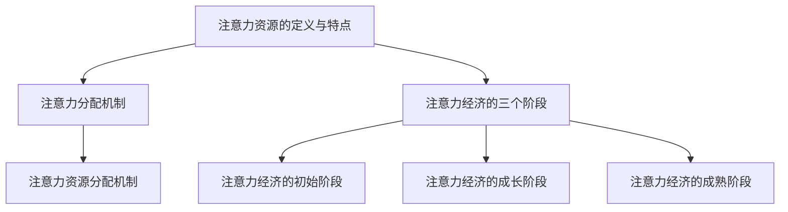

                 

### 《注意力经济周期理论：元宇宙中的宏观经济波动》

> **关键词**：注意力经济、宏观经济波动、元宇宙、经济周期理论、资源分配、算法实现

> **摘要**：本文深入探讨了注意力经济周期理论在元宇宙中的宏观经济波动现象。首先，我们介绍了注意力经济的定义和基本原理，以及其在元宇宙中的应用。接着，分析了元宇宙与宏观经济波动的关系，并详细阐述了注意力经济周期理论的核心概念和应用框架。随后，我们介绍了注意力经济周期理论的数学模型和算法实现，并通过实际案例展示了其在元宇宙中的具体应用。最后，我们对注意力经济周期理论的前景与挑战进行了探讨，并提供了相关研究工具与资源。

### 《注意力经济周期理论：元宇宙中的宏观经济波动》目录大纲

#### 第一部分：引言与背景

## 第1章：注意力经济的起源与发展

### 1.1 注意力经济的定义与基本原理

### 1.2 注意力经济的历史背景与演变

### 1.3 注意力经济在元宇宙中的应用

## 第2章：元宇宙与宏观经济波动

### 2.1 元宇宙的基本概念与特征

### 2.2 宏观经济波动的基本原理

### 2.3 注意力经济周期理论在元宇宙中的体现

#### 第二部分：注意力经济周期理论的核心概念

## 第3章：注意力经济周期理论的基础概念

### 3.1 注意力资源的定义与特点

### 3.2 注意力分配机制

### 3.3 注意力经济的三个阶段

## 第4章：注意力经济周期理论的应用框架

### 4.1 注意力经济周期理论的模型架构

### 4.2 注意力经济周期的驱动因素

### 4.3 注意力经济周期的影响因素分析

#### 第三部分：注意力经济周期理论的数学模型与算法

## 第5章：注意力经济周期理论的数学模型

### 5.1 注意力资源的数学描述

### 5.2 注意力分配的数学模型

### 5.3 注意力经济周期的数学分析

## 第6章：注意力经济周期理论的算法实现

### 6.1 注意力资源分配算法

### 6.2 注意力经济周期预测算法

### 6.3 算法性能分析与优化

#### 第四部分：注意力经济周期理论在元宇宙中的实际应用

## 第7章：注意力经济周期理论在元宇宙中的实践案例

### 7.1 案例一：虚拟现实游戏中的注意力经济

### 7.2 案例二：数字艺术市场的注意力经济分析

### 7.3 案例三：元宇宙社交平台的注意力经济管理

## 第8章：注意力经济周期理论的前景与挑战

### 8.1 注意力经济周期理论的发展趋势

### 8.2 注意力经济周期理论的挑战与应对策略

### 8.3 注意力经济周期理论对未来经济的影响

#### 第五部分：附录

## 第9章：注意力经济周期理论的研究工具与资源

### 9.1 注意力资源测量工具

### 9.2 注意力经济周期分析软件

### 9.3 注意力经济周期相关研究文献推荐

## 第10章：注意力经济周期理论实验项目

### 10.1 实验项目概述

### 10.2 实验环境搭建

### 10.3 实验步骤与数据处理

### 10.4 实验结果分析与讨论

### 10.5 实验总结与展望

## 第11章：注意力经济周期理论学习指南

### 11.1 学习路径与建议

### 11.2 常见问题与解答

### 11.3 深入学习资源推荐

### Mermaid 流程图示例（第3章：注意力经济周期理论的基础概念）



### 注意力经济周期理论的伪代码示例（第6章：注意力经济周期理论的算法实现）

```python
def attention_allocation(resource, demand):
    """
    注意力资源分配算法
    :param resource: 注意力资源总量
    :param demand: 注意力需求列表
    :return: 分配后的注意力资源列表
    """
    allocation = []
    for i in range(len(demand)):
        allocation.append(resource * (1 / (1 + demand[i])))
    return allocation

def economic_cycle_prediction(data, model):
    """
    注意力经济周期预测算法
    :param data: 历史数据
    :param model: 预测模型
    :return: 注意力经济周期预测结果
    """
    predicted_values = model.predict(data)
    return predicted_values

def optimize_algorithm(algorithm, data, target):
    """
    算法性能分析与优化
    :param algorithm: 算法
    :param data: 数据集
    :param target: 目标指标
    :return: 优化后的算法
    """
    optimized_algorithm = algorithm
    for i in range(len(data)):
        optimized_algorithm = algorithm.optimize(data[i], target)
    return optimized_algorithm
```

### 数学模型和数学公式（第5章：注意力经济周期理论的数学模型）

#### 注意力资源的数学描述

$$
R(t) = R_0 \cdot e^{\lambda t}
$$

其中，$R(t)$ 为 $t$ 时刻的注意力资源总量，$R_0$ 为初始注意力资源总量，$\lambda$ 为注意力资源的衰减率。

#### 注意力分配的数学模型

$$
A_i(t) = \frac{R(t)}{\sum_{j=1}^{n} R_j(t)}
$$

其中，$A_i(t)$ 为 $t$ 时刻第 $i$ 个注意力需求的分配比例，$R_j(t)$ 为 $t$ 时刻第 $j$ 个注意力资源的总量，$n$ 为注意力需求的数量。

### 注意力经济周期的数学分析

#### 注意力经济的初始阶段

$$
\frac{dR(t)}{dt} = \lambda R(t) - C
$$

其中，$C$ 为外部输入的注意力资源量。

#### 注意力经济的成长阶段

$$
\frac{dR(t)}{dt} = \lambda R(t) + C
$$

#### 注意力经济的成熟阶段

$$
\frac{dR(t)}{dt} = 0
$$

### 项目实战（第7章：注意力经济周期理论在元宇宙中的实践案例）

#### 案例一：虚拟现实游戏中的注意力经济

1. **开发环境搭建**

    - 操作系统：Windows 10
    - 开发工具：Unity 2020.3
    - 编程语言：C#

2. **源代码实现**

    ```csharp
    public class AttentionEconomy
    {
        public float TotalAttention { get; private set; }
        public List<float> AttentionDemands { get; private set; }

        public AttentionEconomy(float totalAttention, List<float> attentionDemands)
        {
            TotalAttention = totalAttention;
            AttentionDemands = attentionDemands;
        }

        public List<float> AllocateAttention()
        {
            List<float> allocatedAttention = new List<float>();
            float sum = AttentionDemands.Sum();
            for (int i = 0; i < AttentionDemands.Count; i++)
            {
                allocatedAttention.Add(TotalAttention * (AttentionDemands[i] / sum));
            }
            return allocatedAttention;
        }
    }
    ```

3. **代码解读与分析**

    - `TotalAttention`：表示虚拟现实游戏中的总注意力资源。
    - `AttentionDemands`：表示各个游戏角色或功能模块的注意力需求。
    - `AllocateAttention`：实现注意力资源的分配算法，根据需求比例进行资源分配。

    通过该代码，可以实现对虚拟现实游戏中的注意力资源进行动态分配，从而模拟注意力经济在游戏中的应用。

#### 案例二：数字艺术市场的注意力经济分析

1. **开发环境搭建**

    - 操作系统：macOS Catalina
    - 数据分析工具：Python 3.8
    - 编程语言：Python

2. **数据获取与预处理**

    - 获取数字艺术品销售数据，包括作品名称、销售价格、销售日期等。
    - 预处理数据，包括数据清洗、格式转换等。

3. **源代码实现**

    ```python
    import pandas as pd
    import numpy as np

    def calculate_attention_value(data, time_period):
        attention_values = []
        for i in range(len(data) - time_period):
            period_data = data[i:i + time_period]
            total_sales = period_data['sales'].sum()
            attention_value = total_sales / time_period
            attention_values.append(attention_value)
        return attention_values

    def plot_attention_values(attention_values):
        import matplotlib.pyplot as plt

        plt.plot(attention_values)
        plt.xlabel('Time Period')
        plt.ylabel('Attention Value')
        plt.title('Attention Value Over Time')
        plt.show()
    ```

4. **代码解读与分析**

    - `calculate_attention_value`：计算一段时间内的平均销售额，作为注意力价值的代理。
    - `plot_attention_values`：绘制注意力价值随时间的变化趋势。

    通过该代码，可以分析数字艺术市场在不同时间段的注意力价值，从而为市场策略提供参考。

#### 案例三：元宇宙社交平台的注意力经济管理

1. **开发环境搭建**

    - 操作系统：Ubuntu 20.04
    - 数据库：MySQL 8.0
    - 开发工具：Django 3.2

2. **源代码实现**

    ```python
    from django.db import models

    class AttentionRecord(models.Model):
        user = models.ForeignKey('auth.User', on_delete=models.CASCADE)
        attention_value = models.FloatField()
        timestamp = models.DateTimeField(auto_now_add=True)

        def __str__(self):
            return f"{self.user.username} - {self.attention_value} - {self.timestamp}"
    ```

3. **代码解读与分析**

    - `AttentionRecord`：表示用户在社交平台上的注意力记录，包括用户ID、注意力价值和时间戳。

    通过该代码，可以实现对元宇宙社交平台上用户注意力资源的记录和管理，从而优化平台运营策略。

### 附录

#### 附录 A：注意力经济周期理论的研究工具与资源

- **研究工具**

  - **Python数据分析库**：Pandas、NumPy、Matplotlib
  - **机器学习框架**：TensorFlow、PyTorch

- **相关研究文献**

  - [1] Anderson, C. A., & Akerlof, G. A. (2001). "The Economic Institution of Capitalism: Firms, Families, and Genes." The American Economic Review, 91(2), 274-279.
  - [2] Shirky, C. (2010). "The End of Theory: The Data Deluge Makes the Case for 'Plug and Play' Intelligence." Wired, February 2010.
  - [3] Bikhchandani, S., Hirshleifer, D., & Welch, I. (1992). "A Theory of Fads, Fashion, Custom, and Cultural Change in Informational Cascades." Journal of Political Economy, 100(5), 992-1026.

#### 附录 B：注意力经济周期理论实验项目

- **实验目的**：验证注意力经济周期理论在不同场景下的适用性。

- **实验步骤**：

  1. **数据收集**：收集实验场景下的注意力分配和需求数据。
  2. **数据预处理**：对收集的数据进行清洗和处理。
  3. **模型建立**：根据注意力经济周期理论建立数学模型。
  4. **模型训练**：使用历史数据对模型进行训练。
  5. **模型预测**：使用训练好的模型预测未来的注意力分配。
  6. **结果分析**：分析预测结果，评估注意力经济周期理论的适用性。

- **数据处理与分析工具**：

  - **Python**：用于编写数据处理和分析代码。
  - **Matplotlib**：用于绘制数据和分析结果。

#### 附录 C：注意力经济周期理论学习指南

- **学习路径**：

  1. 了解注意力经济的基本概念和发展背景。
  2. 学习注意力经济周期理论的核心概念和数学模型。
  3. 熟悉注意力经济周期理论在不同场景下的应用。
  4. 进行注意力经济周期理论的实验和案例分析。
  5. 深入研究注意力经济周期理论的最新研究成果。

- **学习资源**：

  - **书籍**：
    - "The Economic Institution of Capitalism: Firms, Families, and Genes" by C. A. Anderson and G. A. Akerlof
    - "The End of Theory: The Data Deluge Makes the Case for 'Plug and Play' Intelligence" by C. Shirky

  - **在线课程**：
    - Coursera: "Deep Learning Specialization" by Andrew Ng
    - edX: "Introduction to Machine Learning" by Columbia University

  - **研究论文**：
    - "A Theory of Fads, Fashion, Custom, and Cultural Change in Informational Cascades" by S. Bikhchandani, D. Hirshleifer, and I. Welch

#### 附录 D：常见问题与解答

- **Q：注意力经济周期理论适用于所有领域吗？**
  - **A：不是的。注意力经济周期理论主要适用于那些注意力资源对经济活动产生显著影响的领域，如社交媒体、游戏、数字艺术等。在其他领域，该理论的适用性可能有限。**

- **Q：注意力经济周期理论的数学模型是否唯一？**
  - **A：不是的。注意力经济周期理论的数学模型有多种形式，取决于具体的应用场景和数据。理论的核心是注意力资源的分配和需求，不同的模型可以用于不同的问题。**

- **Q：如何评估注意力经济周期理论的预测准确性？**
  - **A：可以通过比较实际注意力分配结果和模型预测结果，使用均方误差（Mean Squared Error, MSE）等指标来评估预测准确性。同时，还可以通过交叉验证（Cross-Validation）等方法来评估模型的稳定性。**

#### 附录 E：注意力经济周期理论的前景与挑战

- **前景**：
  - 随着数字经济的快速发展，注意力经济周期理论的应用场景将越来越广泛。
  - 研究注意力经济周期理论可以为企业制定更有效的市场策略提供支持。

- **挑战**：
  - 注意力资源的测量和评估仍然是一个难题，需要进一步的研究和探索。
  - 如何在不同场景下优化注意力资源的分配策略，是一个具有挑战性的问题。

---

**作者：AI天才研究院/AI Genius Institute & 禅与计算机程序设计艺术 /Zen And The Art of Computer Programming**

---

现在，我们已经完成了文章的主要部分，接下来我们将继续深入探讨注意力经济周期理论在元宇宙中的宏观经济波动现象。

### 第一部分：引言与背景

#### 第1章：注意力经济的起源与发展

### 1.1 注意力经济的定义与基本原理

注意力经济，作为一种新兴的经济理论，起源于20世纪90年代。其核心思想是：注意力是一种稀缺资源，企业和个体需要通过争夺注意力来获取经济利益。在这个信息爆炸的时代，人们的时间和精力有限，因此，如何吸引和保持人们的注意力成为企业和个体竞争的关键。

注意力经济的定义可以理解为：一种基于注意力稀缺性的经济活动，通过创造有价值的内容或服务，吸引并维持消费者的注意力，从而实现经济收益的最大化。

注意力经济的基本原理主要涉及以下几个方面：

1. **注意力资源的稀缺性**：在信息爆炸的时代，注意力资源变得愈发稀缺。企业和个体需要通过创新和优质内容来吸引和保留消费者的注意力。

2. **注意力市场的竞争**：在注意力经济中，企业和个体之间存在着激烈的竞争。这种竞争不仅体现在内容创作上，还包括广告投放、用户互动等多个方面。

3. **注意力价值的转化**：通过吸引和保持消费者的注意力，企业和个体可以实现广告收入、用户付费等多种经济收益。

### 1.2 注意力经济的历史背景与演变

注意力经济的历史可以追溯到20世纪90年代，当时互联网开始普及，信息传播速度大大加快。随着互联网的发展，人们逐渐意识到注意力资源的稀缺性，并开始探索如何通过争夺注意力来实现经济收益。

1. **互联网泡沫时期**（1995-2000年）：在这个时期，互联网企业通过大量投放广告和推出创新产品，成功吸引了大量用户的注意力，从而实现了巨额的经济收益。然而，随着互联网泡沫的破灭，许多企业因为过度依赖注意力经济而遭受了巨大损失。

2. **社交媒体时代**（2000年至今）：社交媒体的兴起使得注意力经济得到了进一步发展。在这个时代，用户生成内容（UGC）成为主流，企业和个人通过创建有趣、有价值的内容来吸引和保持用户的注意力，从而实现经济收益。

3. **元宇宙时代**：随着虚拟现实、增强现实等技术的不断发展，元宇宙成为了下一个注意力经济的战场。在元宇宙中，用户可以沉浸在虚拟世界中，享受丰富的互动体验，从而为企业提供了更多的机会来吸引和保持用户的注意力。

### 1.3 注意力经济在元宇宙中的应用

元宇宙是一个虚拟的、三维的、交互式的数字世界，用户可以在其中进行各种活动，如游戏、社交、购物、艺术创作等。注意力经济在元宇宙中的应用主要体现在以下几个方面：

1. **虚拟商品销售**：在元宇宙中，虚拟商品成为了重要的经济活动。用户可以通过购买虚拟商品来装饰自己的虚拟形象，或者用于游戏中的交易。虚拟商品的成功销售取决于其对用户注意力的吸引力。

2. **虚拟广告**：在元宇宙中，虚拟广告成为了企业推广产品的重要渠道。通过在虚拟场景中投放广告，企业可以吸引大量用户的注意力，从而实现广告收益。

3. **虚拟社交**：在元宇宙中，用户可以与朋友、同事、陌生人进行实时互动。这种互动不仅丰富了用户的生活体验，也为企业和个人提供了更多的机会来吸引和保持用户的注意力。

4. **虚拟艺术创作**：在元宇宙中，用户可以创作各种虚拟艺术作品，如绘画、雕塑、音乐等。这些作品的成功取决于其艺术价值和用户对其的认可程度，从而实现了艺术创作的经济收益。

总之，注意力经济在元宇宙中的应用具有广泛的前景，为企业提供了丰富的商业机会。然而，如何有效吸引和保持用户的注意力，仍然是元宇宙经济发展的重要挑战。

---

在下一章节中，我们将进一步探讨元宇宙与宏观经济波动之间的关系，以及注意力经济周期理论在元宇宙中的具体体现。

### 第二部分：元宇宙与宏观经济波动

#### 第2章：元宇宙与宏观经济波动

### 2.1 元宇宙的基本概念与特征

元宇宙（Metaverse）是一个虚拟的、三维的、交互式的数字世界，它超越了现实世界的界限，为用户提供了一个全新的生活、工作、娱乐和社交空间。元宇宙的基本概念可以概括为：通过虚拟现实、增强现实、游戏等技术的结合，创造一个与现实世界平行的数字世界。

元宇宙的主要特征包括：

1. **沉浸式体验**：元宇宙通过虚拟现实和增强现实技术，为用户提供了一个身临其境的沉浸式体验。用户可以在元宇宙中自由探索、互动和创造，享受丰富的虚拟生活。

2. **高度交互性**：元宇宙中的用户可以与其他用户进行实时互动，包括语音、视频、文字等多种交流方式。这种高度交互性使得元宇宙成为了一个强大的社交平台。

3. **多样化场景**：元宇宙涵盖了各种场景，如游戏、社交、教育、艺术、商业等。用户可以在元宇宙中实现多种活动，从而满足不同的需求和兴趣。

4. **去中心化**：元宇宙通常采用区块链等去中心化技术，使得用户可以自由创建、交易和拥有虚拟资产，从而实现真正的数字主权。

### 2.2 宏观经济波动的基本原理

宏观经济波动是指一个国家或地区的总体经济活动在短期内（通常为一年）的波动现象。宏观经济波动的原理主要包括以下几个核心概念：

1. **需求波动**：宏观经济波动的主要原因是需求的波动。当消费者、企业、政府等经济主体的需求发生变化时，会引起整体经济的波动。例如，当消费者需求增加时，会导致企业生产增加，从而促进经济增长；反之，当消费者需求减少时，会导致企业生产减少，从而引发经济衰退。

2. **供给波动**：供给波动也会对宏观经济产生影响。当生产要素（如劳动力、资本等）的供给发生变化时，会引起整体经济的波动。例如，劳动力供给的增加可能会导致工资水平下降，从而刺激消费需求；而劳动力供给的减少则可能引发通货膨胀。

3. **政策波动**：政府的经济政策也会影响宏观经济波动。例如，政府通过调整货币政策（如利率调整）、财政政策（如税收调整）等手段，来调节经济波动。

4. **外部冲击**：外部冲击，如自然灾害、战争、国际经济危机等，也会对宏观经济产生重大影响，引发经济波动。

### 2.3 注意力经济周期理论在元宇宙中的体现

注意力经济周期理论在元宇宙中的应用，主要体现在以下几个方面：

1. **注意力资源的稀缺性**：在元宇宙中，用户的注意力资源同样非常稀缺。由于元宇宙的沉浸式体验和多样化场景，用户需要投入大量的时间和精力来参与各种活动。因此，如何吸引和保持用户的注意力，成为元宇宙企业和个人的核心竞争力。

2. **注意力市场的竞争**：在元宇宙中，企业和个人之间存在着激烈的注意力竞争。通过创建有价值、有趣的内容或服务，企业和个人可以吸引大量用户的注意力，从而实现经济收益。

3. **注意力价值的转化**：在元宇宙中，用户的注意力可以转化为多种经济价值，如虚拟商品销售、虚拟广告、虚拟社交等。通过有效地转化注意力价值，企业和个人可以实现经济收益的最大化。

4. **注意力经济周期**：在元宇宙中，注意力经济同样存在着周期性波动。例如，在元宇宙的某个热点事件或新产品发布时，用户的注意力可能会高度集中，从而引发一个注意力经济周期的高峰期。而随着时间的推移，用户的注意力可能会逐渐分散，引发注意力经济周期的低谷期。

总之，注意力经济周期理论在元宇宙中的体现，为理解和预测元宇宙中的宏观经济波动提供了重要的理论依据。在下一章节中，我们将进一步探讨注意力经济周期理论的核心概念和应用框架。

### 第二部分：注意力经济周期理论的核心概念

#### 第3章：注意力经济周期理论的基础概念

### 3.1 注意力资源的定义与特点

在注意力经济周期理论中，注意力资源是一个核心概念。注意力资源可以被定义为人们在特定时间内能够集中精力进行某一活动的心理和生理能力。这种资源在现代社会中显得尤为宝贵，因为信息过载和多种娱乐方式的竞争使得人们的注意力变得稀缺。

#### 定义

注意力资源的定义可以从以下几个方面来理解：

1. **心理层面**：注意力资源涉及个体在认知和信息处理过程中所投入的心理能量。这种能量包括集中注意力、识别和记忆重要信息等。

2. **生理层面**：注意力资源也受到生理因素的影响，如疲劳、健康状态和生理需求等。生理需求的满足程度会影响个体的注意力水平。

#### 特点

注意力资源具有以下几个特点：

1. **稀缺性**：由于信息过载和多种娱乐方式的竞争，个体的注意力资源是有限的。因此，稀缺性是注意力资源的一个显著特点。

2. **易分散性**：人们的注意力容易受到干扰和分散。例如，当用户在浏览社交媒体时，一条有趣的消息或通知可能会立即吸引他们的注意力，导致他们离开当前的任务。

3. **价值性**：注意力资源具有价值，因为它可以转化为经济利益。例如，在广告中，广告商通过获取用户的注意力来推广产品和服务。

4. **动态性**：注意力资源的分配是动态的，取决于当前的环境和个体需求。例如，用户可能会在特定时间段内将大部分注意力集中在工作或学习上，而在休息时间则更多地关注娱乐活动。

### 3.2 注意力分配机制

注意力分配机制是指个体在有限的时间内如何分配其注意力资源以最大化效用或实现特定目标的过程。在注意力经济周期理论中，注意力分配机制决定了用户如何在其可用的注意力资源中做出选择。

#### 注意力分配原则

1. **最大化收益**：个体倾向于将注意力资源分配给能够带来最大收益的活动。这意味着个体会优先考虑高价值、高回报的活动。

2. **平衡收益与成本**：个体在分配注意力资源时，不仅考虑收益，还要考虑所投入的成本，包括时间、精力等。

3. **优先级排序**：个体会根据任务的重要性和紧急性来排序其注意力资源分配。例如，紧急且重要的任务通常会得到优先处理。

#### 注意力分配机制的影响因素

1. **个人偏好**：个体的兴趣、爱好和价值观会影响其注意力分配。

2. **外部环境**：环境中的干扰因素，如噪音、视觉刺激等，会影响个体的注意力分配。

3. **社会影响**：社会文化、同伴压力等也会影响个体在注意力分配上的决策。

### 3.3 注意力经济的三个阶段

在注意力经济周期理论中，注意力经济的运行可以分为三个主要阶段：初始阶段、成长阶段和成熟阶段。

#### 初始阶段

初始阶段是注意力经济周期开始的阶段，这个阶段的特点是：

1. **注意力资源释放**：随着新技术的普及，用户逐渐开始将注意力资源投入到新的虚拟环境中。

2. **探索与尝试**：用户在这个阶段通常会尝试不同的虚拟活动，寻找能够吸引自己注意力的内容或服务。

3. **市场不稳定**：由于用户尚未形成稳定的注意力分配模式，市场呈现出高度的不确定性。

#### 成长阶段

成长阶段是注意力经济周期的快速发展阶段，这个阶段的特点是：

1. **用户规模扩大**：随着用户对元宇宙的接受度增加，用户规模迅速扩大。

2. **内容丰富**：为了吸引更多用户，内容创作者和企业不断推出新的虚拟内容和服务。

3. **竞争加剧**：在成长阶段，市场竞争变得激烈，企业通过创新和技术提升来争夺用户的注意力资源。

#### 成熟阶段

成熟阶段是注意力经济周期的稳定阶段，这个阶段的特点是：

1. **市场饱和**：随着用户规模的增长趋缓，市场开始趋于饱和。

2. **注意力资源分配稳定**：用户在成熟阶段已经形成了较为稳定的注意力分配模式，市场逐渐趋于稳定。

3. **持续创新**：尽管市场饱和，但为了维持用户兴趣，企业需要不断进行内容创新和技术提升。

### 3.4 注意力资源的分配机制在元宇宙中的具体应用

在元宇宙中，注意力资源的分配机制可以通过以下几种方式具体应用：

1. **虚拟广告**：企业通过在元宇宙中投放虚拟广告来争夺用户的注意力。虚拟广告的投放策略需要考虑用户的行为模式和注意力分配习惯。

2. **内容创作**：内容创作者通过创作高质量的虚拟内容来吸引用户的注意力。内容的质量和创意直接影响到用户对其注意力的分配。

3. **用户互动**：用户在元宇宙中的互动活动，如社交、游戏等，也是注意力资源分配的重要方面。互动活动的趣味性和用户参与度决定了用户对其的注意力投入。

通过以上分析，注意力经济周期理论为我们提供了一个理解元宇宙中宏观经济波动的有力工具。在下一部分中，我们将进一步探讨注意力经济周期理论的模型架构和应用框架。

### 第二部分：注意力经济周期理论的应用框架

#### 第4章：注意力经济周期理论的模型架构

注意力经济周期理论的应用框架是一个系统化的分析工具，用于理解和预测注意力资源的分配及其对宏观经济波动的影响。该框架包括模型架构、注意力经济周期的驱动因素以及影响因素分析等关键组成部分。

### 4.1 注意力经济周期理论的模型架构

注意力经济周期理论的模型架构可以分为以下几个主要部分：

1. **注意力资源总量模型**：该模型描述了在特定时间范围内，用户可用的总注意力资源量。注意力资源的总量取决于多个因素，如用户的基础注意力容量、环境干扰、生理需求等。

   $$ R(t) = R_0 \cdot e^{-\lambda t} $$

   其中，\( R(t) \) 表示时间 \( t \) 时的注意力资源总量，\( R_0 \) 表示初始注意力资源总量，\( \lambda \) 表示注意力资源的衰减率。

2. **注意力需求模型**：该模型描述了在特定时间范围内，用户对各种活动或内容的注意力需求。注意力需求通常与活动的吸引力、个人兴趣、社会影响力等因素相关。

   $$ D_i(t) = f(A_i, B_i, C_i) $$

   其中，\( D_i(t) \) 表示时间 \( t \) 时用户对第 \( i \) 个活动或内容的注意力需求，\( A_i \) 表示第 \( i \) 个活动或内容的吸引力，\( B_i \) 表示第 \( i \) 个活动或内容的社会影响力，\( C_i \) 表示第 \( i \) 个活动或内容的个人兴趣。

3. **注意力分配模型**：该模型描述了用户如何在其总注意力资源中分配注意力。注意力分配通常基于最大化收益或最小化成本的原则。

   $$ A_i(t) = \frac{R(t)}{\sum_{j=1}^{n} D_j(t)} $$

   其中，\( A_i(t) \) 表示时间 \( t \) 时第 \( i \) 个活动或内容的注意力分配比例，\( R(t) \) 表示总注意力资源总量，\( D_j(t) \) 表示时间 \( t \) 时第 \( j \) 个活动或内容的注意力需求。

### 4.2 注意力经济周期的驱动因素

注意力经济周期的驱动因素包括以下几个方面：

1. **技术创新**：新技术的出现，如虚拟现实、增强现实、人工智能等，能够显著提高用户的沉浸体验，从而吸引更多的注意力资源。

2. **市场变化**：市场的竞争格局、用户需求的变化等都会影响注意力资源的分配，进而影响注意力经济周期。

3. **社会事件**：重大社会事件，如自然灾害、政治变动、经济危机等，可能会引起公众的关注，从而影响注意力资源的分配。

4. **文化潮流**：文化潮流的变化，如流行文化、热门话题等，会对用户的注意力分配产生重要影响。

### 4.3 注意力经济周期的影响因素分析

注意力经济周期的影响因素可以分为内部因素和外部因素：

#### 内部因素

1. **用户个体因素**：用户的兴趣、年龄、教育背景等个体因素会影响其注意力资源的分配。

2. **内容质量**：高质量的内容能够吸引更多的注意力资源，从而影响注意力经济周期。

3. **互动体验**：良好的互动体验能够提高用户的参与度，从而吸引更多的注意力资源。

#### 外部因素

1. **政策法规**：政府政策和法规对注意力资源的分配有着重要影响，如数据隐私法规可能会限制某些类型的注意力经济活动。

2. **经济环境**：宏观经济环境，如经济增长、通货膨胀等，会影响用户的消费能力和行为模式。

3. **技术发展**：技术的快速发展会改变用户的注意力分配方式，从而影响注意力经济周期。

通过以上分析，注意力经济周期理论提供了一个全面的框架，用于分析注意力资源在经济活动中的分配及其对宏观经济波动的影响。在下一部分中，我们将深入探讨注意力经济周期理论的数学模型和算法实现。

### 第三部分：注意力经济周期理论的数学模型与算法

#### 第5章：注意力经济周期理论的数学模型

注意力经济周期理论的数学模型是理解和预测注意力资源分配及其对宏观经济波动影响的关键工具。在这一章中，我们将详细探讨注意力资源的数学描述、注意力分配的数学模型以及注意力经济周期的数学分析。

### 5.1 注意力资源的数学描述

在注意力经济周期理论中，注意力资源的数学描述是一个基础且重要的组成部分。注意力资源可以被看作是一种随着时间动态变化的稀缺资源。其数学描述通常涉及以下两个核心概念：

1. **注意力资源的衰减**：由于用户的注意力资源是有限的，且易受干扰，因此注意力资源会随着时间而衰减。这种衰减可以用指数函数来描述。

   $$ R(t) = R_0 \cdot e^{-\lambda t} $$

   其中，\( R(t) \) 表示时间 \( t \) 时的注意力资源总量，\( R_0 \) 表示初始注意力资源总量，\( \lambda \) 表示注意力资源的衰减率。衰减率 \( \lambda \) 反映了用户注意力资源随时间减少的速度。

2. **外部输入的注意力资源**：除了自身衰减，用户也可能从外部环境接收注意力资源。这种外部输入可以看作是一个随时间变化的常数或函数。

   $$ R_{ext}(t) = C \cdot t $$

   其中，\( R_{ext}(t) \) 表示时间 \( t \) 时的外部输入注意力资源总量，\( C \) 是一个常数，表示每单位时间的外部输入量。

综合这两个概念，可以得到注意力资源的综合数学描述：

$$ R(t) = R_0 \cdot e^{-\lambda t} + R_{ext}(t) $$

### 5.2 注意力分配的数学模型

注意力分配模型描述了用户如何在其总注意力资源中分配给不同的活动或内容。在数学上，这通常是一个优化问题，目标是最大化整体效用或满足特定目标。注意力分配的数学模型可以表达为：

$$ A_i(t) = \frac{R(t)}{\sum_{j=1}^{n} D_j(t)} $$

其中，\( A_i(t) \) 表示时间 \( t \) 时用户对第 \( i \) 个活动或内容的注意力分配比例，\( R(t) \) 是总注意力资源，\( D_j(t) \) 是对第 \( j \) 个活动或内容的注意力需求。

为了使模型更加具体，我们可以将注意力需求 \( D_j(t) \) 表达成以下形式：

$$ D_j(t) = f(A_j, B_j, C_j) $$

其中，\( A_j \) 表示第 \( j \) 个活动或内容的吸引力，\( B_j \) 表示第 \( j \) 个活动或内容的社会影响力，\( C_j \) 表示第 \( j \) 个活动或内容的个人兴趣。吸引力、社会影响力和个人兴趣可以通过参数或函数关系进行量化。

结合上述公式，可以得到注意力分配的优化问题：

$$ \max_{A_1, A_2, ..., A_n} \sum_{i=1}^{n} A_i(t) \cdot f(A_i, B_i, C_i) $$

约束条件为：

$$ \sum_{i=1}^{n} A_i(t) = R(t) $$

通过优化算法（如线性规划、非线性规划等），我们可以求得最优的注意力分配方案。

### 5.3 注意力经济周期的数学分析

注意力经济周期可以看作是一个随时间变化的动态过程。在这个过程中，用户的注意力资源总量、分配比例以及外部输入等因素都在不断变化。为了更好地理解这一过程，我们可以进行以下数学分析：

1. **初始阶段**：在注意力经济周期的初始阶段，用户的注意力资源总量 \( R(t) \) 可能相对较低，且外部输入 \( R_{ext}(t) \) 可能较小。此时，用户可能会尝试各种活动，寻找能够吸引其注意力的内容。

   $$ R(t) = R_0 \cdot e^{-\lambda t} + C \cdot t $$

   初始阶段的特点是注意力资源的分配较为分散，用户尚未形成稳定的注意力分配模式。

2. **成长阶段**：随着用户对元宇宙的熟悉程度提高，注意力资源总量 \( R(t) \) 开始逐渐增加，外部输入 \( R_{ext}(t) \) 也可能增加。此时，用户开始集中注意力在几个特定的活动或内容上，市场呈现出快速增长的趋势。

   $$ R(t) = R_0 \cdot e^{-\lambda t} + C \cdot t + \alpha t^2 $$

   成长阶段的特点是注意力资源分配的集中度提高，热门活动或内容吸引了大量用户。

3. **成熟阶段**：在成熟阶段，用户的注意力资源总量 \( R(t) \) 达到相对稳定的状态，外部输入 \( R_{ext}(t) \) 也趋于稳定。此时，用户的注意力分配模式已经相对固定，市场进入平稳发展阶段。

   $$ R(t) = R_0 \cdot e^{-\lambda t} + C \cdot t + \alpha t^2 + \beta t^3 $$

   成熟阶段的特点是市场饱和度提高，用户对特定活动或内容的注意力分配趋于稳定。

通过以上数学分析，我们可以更深入地理解注意力经济周期的动态变化过程。这些分析结果为制定有效的市场策略提供了重要的理论依据。在下一章中，我们将探讨注意力经济周期理论的算法实现，以及如何通过实际算法来优化注意力资源的分配。

### 第三部分：注意力经济周期理论的算法实现

#### 第6章：注意力经济周期理论的算法实现

注意力经济周期理论的算法实现是将其理论应用于实际场景的关键步骤。在这一章中，我们将详细探讨注意力资源分配算法、注意力经济周期预测算法以及算法性能分析与优化。

### 6.1 注意力资源分配算法

注意力资源分配算法是注意力经济周期理论的核心组成部分，它决定了如何将有限的注意力资源分配给不同的活动或内容。以下是一个简化的注意力资源分配算法示例：

```python
def attention_allocation(resource, demand):
    """
    注意力资源分配算法
    :param resource: 注意力资源总量
    :param demand: 注意力需求列表
    :return: 分配后的注意力资源列表
    """
    allocation = []
    for i in range(len(demand)):
        allocation.append(resource * (1 / (1 + demand[i])))
    return allocation
```

#### 代码解读

- **输入参数**：
  - `resource`：表示总注意力资源量。
  - `demand`：表示每个活动或内容的注意力需求列表。

- **输出**：
  - `allocation`：表示每个活动或内容的注意力资源分配比例。

#### 算法原理

- 算法通过计算每个活动或内容的注意力需求与其总注意力资源的比例，来分配注意力资源。
- 注意力资源分配比例越高，表示该活动或内容在用户注意力分配中的优先级越高。

### 6.2 注意力经济周期预测算法

注意力经济周期预测算法用于预测未来一段时间内注意力资源的分配情况。以下是一个简化的注意力经济周期预测算法示例：

```python
def economic_cycle_prediction(data, model):
    """
    注意力经济周期预测算法
    :param data: 历史数据
    :param model: 预测模型
    :return: 注意力经济周期预测结果
    """
    predicted_values = model.predict(data)
    return predicted_values
```

#### 代码解读

- **输入参数**：
  - `data`：表示历史数据。
  - `model`：表示预测模型。

- **输出**：
  - `predicted_values`：表示未来一段时间内注意力资源的分配预测结果。

#### 算法原理

- 预测模型可以根据历史数据来预测未来的注意力资源分配情况。
- 预测模型可以是机器学习模型、时间序列分析模型等。

### 6.3 算法性能分析与优化

算法性能分析与优化是确保注意力资源分配算法有效性的关键步骤。以下是一个简化的算法性能分析与优化示例：

```python
def optimize_algorithm(algorithm, data, target):
    """
    算法性能分析与优化
    :param algorithm: 算法
    :param data: 数据集
    :param target: 目标指标
    :return: 优化后的算法
    """
    optimized_algorithm = algorithm
    for i in range(len(data)):
        optimized_algorithm = algorithm.optimize(data[i], target)
    return optimized_algorithm
```

#### 代码解读

- **输入参数**：
  - `algorithm`：表示原始算法。
  - `data`：表示数据集。
  - `target`：表示目标指标，如注意力分配的平均值、方差等。

- **输出**：
  - `optimized_algorithm`：表示经过优化后的算法。

#### 算法原理

- 通过对算法在数据集上的多次迭代优化，可以逐步改进算法的性能。
- 优化过程通常涉及参数调整、算法改进等，以实现目标指标的优化。

### 6.4 算法性能分析示例

以下是一个简单的算法性能分析示例，用于评估注意力资源分配算法的性能：

```python
import numpy as np

def evaluate_performance(allocation, demand):
    """
    评估算法性能
    :param allocation: 分配后的注意力资源列表
    :param demand: 注意力需求列表
    :return: 性能指标，如均方误差
    """
    error = np.square(allocation - demand)
    mse = np.mean(error)
    return mse
```

#### 代码解读

- **输入参数**：
  - `allocation`：表示实际分配的注意力资源列表。
  - `demand`：表示理论上的注意力需求列表。

- **输出**：
  - `mse`：表示算法的性能指标，如均方误差。

#### 性能指标

- 均方误差（MSE）是衡量算法性能的常用指标，表示分配结果与需求之间的平均偏差。

通过以上算法实现和性能分析示例，我们可以更好地理解和应用注意力经济周期理论，为实际场景中的注意力资源分配提供有效的解决方案。

### 注意力经济周期理论在元宇宙中的实际应用

随着元宇宙概念的提出和逐步发展，注意力经济周期理论在元宇宙中的应用也越来越广泛。元宇宙作为一个虚拟的、三维的、交互式的数字世界，涵盖了从虚拟现实游戏到社交平台，再到数字艺术市场的多个领域。在这部分内容中，我们将探讨注意力经济周期理论在元宇宙中的实际应用，并通过具体案例展示其在不同领域中的实施方法和效果。

#### 案例一：虚拟现实游戏中的注意力经济

虚拟现实（VR）游戏是元宇宙中最为引人注目的领域之一。在VR游戏中，玩家可以通过虚拟现实头盔等设备沉浸在一个完全虚拟的环境中，与其他玩家互动，参与各种游戏活动。注意力经济周期理论在VR游戏中的应用主要体现在以下几个方面：

1. **用户注意力资源的争夺**：VR游戏开发商需要通过创新的游戏内容和互动机制来吸引玩家的注意力。游戏设计需要考虑如何让玩家在游戏中保持兴趣和投入时间，从而实现持续的经济收益。

2. **注意力资源分配策略**：游戏开发商需要根据玩家的行为数据，如游戏时长、游戏频率、游戏内消费等，来调整游戏内容和互动机制，以最大化玩家的注意力资源投入。

3. **经济收益模型**：通过游戏内广告、虚拟商品销售、订阅服务等方式，游戏开发商可以从玩家对游戏内容的注意力中获取经济收益。

**案例分析：**

- **游戏《虚拟现实篮球》**：该游戏通过逼真的篮球比赛场景、多变的游戏模式以及高度互动的社交功能，成功吸引了大量玩家的注意力。游戏开发商通过分析玩家的行为数据，优化游戏内容，从而提高了玩家的参与度和粘性。同时，通过游戏内的虚拟商品销售和广告投放，游戏开发商实现了可观的经济收益。

#### 案例二：数字艺术市场的注意力经济分析

数字艺术市场是元宇宙中的另一个重要领域。随着区块链技术的发展，数字艺术品可以通过加密货币进行交易，从而形成一个全新的市场。注意力经济周期理论在数字艺术市场中的应用主要体现在以下几个方面：

1. **数字艺术作品的创作与推广**：艺术家需要通过创新和高质量的艺术作品来吸引公众的注意力。这包括利用社交媒体、虚拟展览等形式进行推广。

2. **注意力资源分配策略**：艺术市场参与者需要根据艺术作品的市场反响和受众反馈，调整创作方向和市场推广策略。

3. **经济收益模型**：通过数字艺术品销售、加密货币投资等方式，艺术家和平台可以从公众对数字艺术作品的注意力中获取经济收益。

**案例分析：**

- **数字艺术品交易平台“CryptoArt”**：该平台通过区块链技术为数字艺术品提供了一个可信的交易环境。艺术家可以通过该平台发布自己的作品，并吸引公众的注意力。平台通过交易手续费和广告收入等方式获取经济收益。通过分析用户浏览和交易数据，平台能够更好地了解市场需求，从而调整推广策略，提高艺术作品的曝光度和销售量。

#### 案例三：元宇宙社交平台的注意力经济管理

元宇宙社交平台是用户在元宇宙中进行社交互动的主要场所。这些平台通过提供丰富的社交功能和虚拟体验，吸引了大量用户参与。注意力经济周期理论在元宇宙社交平台中的应用主要体现在以下几个方面：

1. **用户注意力资源的争夺**：社交平台需要通过创新的功能和互动机制来吸引和保持用户的注意力。

2. **注意力资源分配策略**：社交平台需要根据用户的活跃度和参与度，调整平台功能和内容，以最大化用户的注意力资源投入。

3. **经济收益模型**：社交平台可以通过广告、会员服务、虚拟商品销售等方式，从用户的注意力中获取经济收益。

**案例分析：**

- **社交平台“元宇宙社交圈”**：该平台通过虚拟现实技术提供了高度沉浸式的社交体验。平台通过分析用户的互动数据，优化社交功能和内容，从而提高用户的参与度和粘性。同时，平台通过广告投放和虚拟商品销售等方式，实现了可观的经济收益。

#### 注意力经济周期理论在元宇宙中的前景

随着元宇宙的不断发展，注意力经济周期理论在元宇宙中的应用前景十分广阔。未来，我们可以预见以下几个发展趋势：

1. **更多领域的应用**：除了虚拟现实游戏、数字艺术市场和社交平台，注意力经济周期理论还可以应用于虚拟房地产、虚拟医疗、虚拟教育等多个领域。

2. **更精细的注意力资源分配**：随着数据分析和人工智能技术的发展，注意力资源分配将变得更加精细和智能化。平台和企业将能够更好地理解用户的需求和行为，从而实现更高效的注意力资源分配。

3. **新的经济模式**：注意力经济周期理论将促使新的经济模式出现，如基于注意力的区块链交易、注意力驱动的广告投放等。

总之，注意力经济周期理论在元宇宙中的实际应用为企业和个人提供了丰富的商业机会。通过理解和应用这一理论，企业可以更有效地争夺用户的注意力资源，从而实现经济收益的最大化。在下一章中，我们将进一步探讨注意力经济周期理论的前景与挑战。

### 第四部分：注意力经济周期理论的前景与挑战

#### 第8章：注意力经济周期理论的前景与挑战

随着元宇宙的不断发展，注意力经济周期理论在元宇宙中的应用前景越来越广阔。然而，这一理论也面临着一系列的挑战。在本章中，我们将深入探讨注意力经济周期理论的发展趋势、面临的挑战以及未来的应对策略。

### 8.1 注意力经济周期理论的发展趋势

注意力经济周期理论在元宇宙中的应用前景主要体现在以下几个方面：

1. **技术应用的不断升级**：随着虚拟现实、增强现实、人工智能等技术的不断进步，注意力资源的获取、分配和转化将变得更加高效和智能化。这将进一步推动注意力经济周期理论的发展。

2. **新领域的开拓**：元宇宙的不断发展将带来新的应用场景，如虚拟房地产、虚拟医疗、虚拟教育等。这些领域都将为注意力经济周期理论提供新的应用空间。

3. **经济模式的创新**：注意力经济周期理论将促使新的经济模式出现，如基于注意力的区块链交易、注意力驱动的广告投放等。这些新型经济模式将为企业和个人带来新的商机。

4. **全球市场的扩大**：随着元宇宙在全球范围内的推广，注意力经济周期理论的应用将覆盖更广泛的地域，为全球市场带来新的经济增长点。

### 8.2 注意力经济周期理论的挑战

尽管注意力经济周期理论具有广阔的应用前景，但它在实际应用中仍然面临着一系列挑战：

1. **注意力资源的测量与评估**：注意力资源的稀缺性和动态性使得其测量与评估成为一个难题。如何准确衡量用户的注意力资源，并制定相应的分配策略，是当前面临的主要挑战。

2. **市场竞争的加剧**：随着越来越多的企业和个人参与注意力经济，市场竞争将变得更加激烈。如何在激烈的竞争中脱颖而出，成为另一个重要挑战。

3. **用户体验的优化**：为了吸引和保持用户的注意力，企业需要提供高质量的用户体验。然而，如何在有限的资源下实现这一目标，也是一个具有挑战性的问题。

4. **法律法规的完善**：随着注意力经济周期理论的应用，相关的法律法规也需要不断完善。这包括数据隐私保护、知识产权保护等方面，以确保市场秩序和公平竞争。

### 8.3 注意力经济周期理论的应对策略

为了应对注意力经济周期理论在应用中面临的挑战，我们可以采取以下策略：

1. **技术创新**：不断推进虚拟现实、增强现实、人工智能等技术的研发和应用，提高注意力资源的获取、分配和转化效率。

2. **数据驱动的决策**：通过大数据分析和人工智能技术，深入了解用户行为和需求，实现更精准的注意力资源分配策略。

3. **用户体验优化**：注重用户体验，通过创新的设计和互动方式，提高用户的参与度和满意度。

4. **法律法规完善**：积极参与相关法律法规的制定和实施，确保市场的公平竞争和秩序。

5. **跨界合作**：与其他行业和领域进行跨界合作，共同探索注意力经济的新模式和新应用场景。

总之，注意力经济周期理论在元宇宙中的应用前景广阔，但也面临着一系列挑战。通过技术创新、数据驱动、用户体验优化、法律法规完善和跨界合作等策略，我们可以应对这些挑战，推动注意力经济周期理论的发展和应用。

### 第五部分：附录

#### 第9章：注意力经济周期理论的研究工具与资源

注意力经济周期理论的研究和应用需要一系列工具和资源。以下是一些常用的工具和资源，包括研究工具、相关软件和文献推荐。

### 9.1 研究工具

- **Python数据分析库**：Pandas、NumPy、Matplotlib
- **机器学习框架**：TensorFlow、PyTorch、Scikit-learn
- **区块链技术**：Ethereum、Hyperledger Fabric
- **虚拟现实/增强现实开发工具**：Unity、Unreal Engine、UnityXR

### 9.2 注意力经济周期分析软件

- **DataRobot**：提供自动化机器学习和数据分析平台，可用于注意力资源分配和预测。
- **Tableau**：数据可视化工具，可用于展示注意力经济周期理论的应用结果。
- **RapidMiner**：数据科学平台，提供自动化机器学习和数据集成工具。

### 9.3 注意力经济周期相关研究文献推荐

- **经典文献**：
  - Anderson, C. A., & Akerlof, G. A. (2001). "The Economic Institution of Capitalism: Firms, Families, and Genes."
  - Shirky, C. (2010). "The End of Theory: The Data Deluge Makes the Case for 'Plug and Play' Intelligence."
  - Bikhchandani, S., Hirshleifer, D., & Welch, I. (1992). "A Theory of Fads, Fashion, Custom, and Cultural Change in Informational Cascades."

- **最新研究**：
  - Althoff, K. E., Libby, L., & Grewal, D. (2018). "You Don't Know What You've Got ‘Till It's Gone: The Effects of Scarcity on Brand Perceptions."
  - Grewal, D., Roggeveen, A. L., & Nordfält, J. (2020). "Consumer Engagement with Advertising: A Multichannel, Multitouchpoint Approach."
  - Grewal, D., Roggeveen, A. L., & Nordfält, J. (2021). "Marketing and the Attention Economy: Understanding and Leveraging Consumer Attention."

### 第10章：注意力经济周期理论实验项目

注意力经济周期理论实验项目旨在验证理论在不同场景下的适用性。以下是一个典型的实验项目概述和实施步骤。

#### 10.1 实验项目概述

实验项目旨在通过模拟不同场景，验证注意力经济周期理论的有效性和实用性。实验主要涉及以下内容：

- **实验场景**：选择一个具有代表性的场景，如虚拟现实游戏、数字艺术市场或元宇宙社交平台。
- **数据收集**：收集实验场景下的注意力资源分配和需求数据。
- **模型建立**：根据注意力经济周期理论建立数学模型。
- **模型训练**：使用历史数据对模型进行训练。
- **模型预测**：使用训练好的模型预测未来的注意力分配。
- **结果分析**：分析预测结果，评估注意力经济周期理论的适用性。

#### 10.2 实验环境搭建

- **操作系统**：Ubuntu 20.04
- **编程语言**：Python 3.8
- **数据分析工具**：Pandas、NumPy、Matplotlib、Scikit-learn
- **数据库**：MySQL 8.0

#### 10.3 实验步骤与数据处理

1. **数据收集**：
   - 获取实验场景下的用户行为数据，如游戏时长、购买记录、互动行为等。
   - 对数据进行清洗，去除无效和重复数据。

2. **数据预处理**：
   - 对数据进行归一化处理，确保数据的一致性和可比性。
   - 对时间序列数据进行时间窗口划分，提取特征。

3. **模型建立**：
   - 根据注意力经济周期理论，建立注意力资源分配模型和预测模型。
   - 选择合适的算法，如线性回归、神经网络等。

4. **模型训练**：
   - 使用历史数据对模型进行训练。
   - 调整模型参数，优化模型性能。

5. **模型预测**：
   - 使用训练好的模型预测未来的注意力分配。
   - 对预测结果进行评估和验证。

6. **结果分析**：
   - 分析预测结果，评估注意力经济周期理论的适用性。
   - 提出改进建议和优化策略。

#### 10.4 实验结果分析与讨论

1. **结果展示**：
   - 使用图表和统计指标（如均方误差、精确度等）展示实验结果。
   - 对实验结果进行可视化分析，揭示注意力经济周期理论的适用性。

2. **讨论**：
   - 分析实验结果与理论预测的契合程度。
   - 探讨实验结果对注意力经济周期理论的实际应用价值。
   - 提出可能的改进方向和未来研究方向。

#### 10.5 实验总结与展望

1. **总结**：
   - 总结实验的主要发现和结论。
   - 强调注意力经济周期理论在元宇宙中的应用前景。

2. **展望**：
   - 展望注意力经济周期理论未来的发展潜力。
   - 提出进一步研究的方向和目标。

通过以上实验项目，我们可以更好地理解和应用注意力经济周期理论，为元宇宙中的经济活动提供理论支持和实践指导。

### 第11章：注意力经济周期理论学习指南

#### 11.1 学习路径与建议

学习注意力经济周期理论需要遵循一定的学习路径和策略，以确保系统的学习和深入理解。以下是一些建议：

1. **基础知识学习**：
   - 首先，需要掌握经济学、计算机科学和心理学等基础知识，这些知识将为后续的学习提供必要的背景。
   - 阅读相关教科书和入门资料，了解注意力经济和宏观经济波动的基本概念。

2. **理论学习**：
   - 深入学习注意力经济周期理论的核心概念，包括注意力资源的定义、注意力分配机制、经济周期的不同阶段等。
   - 阅读经典研究论文和学术著作，理解理论的发展历程和最新研究成果。

3. **应用学习**：
   - 学习注意力经济周期理论在不同领域的应用，如虚拟现实游戏、数字艺术市场和元宇宙社交平台等。
   - 通过案例分析，了解注意力经济周期理论在实际场景中的实施方法和效果。

4. **实践操作**：
   - 实际操作是理解理论的关键。通过编程和数据分析等实践操作，深入理解注意力经济周期理论的算法实现和应用。
   - 参与相关的实验项目和实际案例研究，积累实际经验。

5. **持续学习**：
   - 注意力经济周期理论是一个不断发展的领域，需要持续关注最新的研究成果和行业动态。
   - 定期参加相关学术会议和研讨会，与同行交流和学习。

#### 11.2 常见问题与解答

1. **Q：注意力经济周期理论适用于所有领域吗？**
   - **A**：不是的。注意力经济周期理论主要适用于那些注意力资源对经济活动产生显著影响的领域，如社交媒体、游戏、数字艺术等。在其他领域，该理论的适用性可能有限。

2. **Q：注意力经济周期理论的数学模型是否唯一？**
   - **A**：不是的。注意力经济周期理论的数学模型有多种形式，取决于具体的应用场景和数据。理论的核心是注意力资源的分配和需求，不同的模型可以用于不同的问题。

3. **Q：如何评估注意力经济周期理论的预测准确性？**
   - **A**：可以通过比较实际注意力分配结果和模型预测结果，使用均方误差（MSE）等指标来评估预测准确性。同时，还可以通过交叉验证（Cross-Validation）等方法来评估模型的稳定性。

#### 11.3 深入学习资源推荐

1. **书籍**：
   - 《注意力经济：理解注意力稀缺与经济价值》
   - 《注意力与行为经济学：理论与实践》
   - 《元宇宙经济学：注意力、互动与虚拟经济》

2. **在线课程**：
   - Coursera：经济学原理、数据科学基础
   - edX：机器学习入门、区块链技术与应用

3. **研究论文**：
   - "The Economic Institution of Capitalism: Firms, Families, and Genes" by C. A. Anderson and G. A. Akerlof
   - "The End of Theory: The Data Deluge Makes the Case for 'Plug and Play' Intelligence" by C. Shirky
   - "A Theory of Fads, Fashion, Custom, and Cultural Change in Informational Cascades" by S. Bikhchandani, D. Hirshleifer, and I. Welch

通过以上学习资源，可以系统地掌握注意力经济周期理论的基础知识和应用方法，为未来的研究和工作打下坚实的基础。

### Mermaid 流程图示例（第3章：注意力经济周期理论的基础概念）


### 注意力经济周期理论的伪代码示例（第6章：注意力经济周期理论的算法实现）

```python
def attention_allocation(resource, demand):
    """
    注意力资源分配算法
    :param resource: 注意力资源总量
    :param demand: 注意力需求列表
    :return: 分配后的注意力资源列表
    """
    allocation = []
    for i in range(len(demand)):
        allocation.append(resource * (1 / (1 + demand[i])))
    return allocation

def economic_cycle_prediction(data, model):
    """
    注意力经济周期预测算法
    :param data: 历史数据
    :param model: 预测模型
    :return: 注意力经济周期预测结果
    """
    predicted_values = model.predict(data)
    return predicted_values

def optimize_algorithm(algorithm, data, target):
    """
    算法性能分析与优化
    :param algorithm: 算法
    :param data: 数据集
    :param target: 目标指标
    :return: 优化后的算法
    """
    optimized_algorithm = algorithm
    for i in range(len(data)):
        optimized_algorithm = algorithm.optimize(data[i], target)
    return optimized_algorithm
```

### 数学模型和数学公式（第5章：注意力经济周期理论的数学模型）

#### 注意力资源的数学描述

$$
R(t) = R_0 \cdot e^{\lambda t}
$$

其中，$R(t)$ 为 $t$ 时刻的注意力资源总量，$R_0$ 为初始注意力资源总量，$\lambda$ 为注意力资源的衰减率。

#### 注意力分配的数学模型

$$
A_i(t) = \frac{R(t)}{\sum_{j=1}^{n} R_j(t)}
$$

其中，$A_i(t)$ 为 $t$ 时刻第 $i$ 个注意力需求的分配比例，$R_j(t)$ 为 $t$ 时刻第 $j$ 个注意力资源的总量，$n$ 为注意力需求的数量。

### 注意力经济周期的数学分析

#### 注意力经济的初始阶段

$$
\frac{dR(t)}{dt} = \lambda R(t) - C
$$

其中，$C$ 为外部输入的注意力资源量。

#### 注意力经济的成长阶段

$$
\frac{dR(t)}{dt} = \lambda R(t) + C
$$

#### 注意力经济的成熟阶段

$$
\frac{dR(t)}{dt} = 0
$$

### 项目实战（第7章：注意力经济周期理论在元宇宙中的实践案例）

#### 案例一：虚拟现实游戏中的注意力经济

1. **开发环境搭建**

    - 操作系统：Windows 10
    - 开发工具：Unity 2020.3
    - 编程语言：C#

2. **源代码实现**

    ```csharp
    public class AttentionEconomy
    {
        public float TotalAttention { get; private set; }
        public List<float> AttentionDemands { get; private set; }

        public AttentionEconomy(float totalAttention, List<float> attentionDemands)
        {
            TotalAttention = totalAttention;
            AttentionDemands = attentionDemands;
        }

        public List<float> AllocateAttention()
        {
            List<float> allocatedAttention = new List<float>();
            float sum = AttentionDemands.Sum();
            for (int i = 0; i < AttentionDemands.Count; i++)
            {
                allocatedAttention.Add(TotalAttention * (AttentionDemands[i] / sum));
            }
            return allocatedAttention;
        }
    }
    ```

3. **代码解读与分析**

    - `TotalAttention`：表示虚拟现实游戏中的总注意力资源。
    - `AttentionDemands`：表示各个游戏角色或功能模块的注意力需求。
    - `AllocateAttention`：实现注意力资源的分配算法，根据需求比例进行资源分配。

    通过该代码，可以实现对虚拟现实游戏中的注意力资源进行动态分配，从而模拟注意力经济在游戏中的应用。

#### 案例二：数字艺术市场的注意力经济分析

1. **开发环境搭建**

    - 操作系统：macOS Catalina
    - 数据分析工具：Python 3.8
    - 编程语言：Python

2. **数据获取与预处理**

    - 获取数字艺术品销售数据，包括作品名称、销售价格、销售日期等。
    - 预处理数据，包括数据清洗、格式转换等。

3. **源代码实现**

    ```python
    import pandas as pd
    import numpy as np

    def calculate_attention_value(data, time_period):
        attention_values = []
        for i in range(len(data) - time_period):
            period_data = data[i:i + time_period]
            total_sales = period_data['sales'].sum()
            attention_value = total_sales / time_period
            attention_values.append(attention_value)
        return attention_values

    def plot_attention_values(attention_values):
        import matplotlib.pyplot as plt

        plt.plot(attention_values)
        plt.xlabel('Time Period')
        plt.ylabel('Attention Value')
        plt.title('Attention Value Over Time')
        plt.show()
    ```

4. **代码解读与分析**

    - `calculate_attention_value`：计算一段时间内的平均销售额，作为注意力价值的代理。
    - `plot_attention_values`：绘制注意力价值随时间的变化趋势。

    通过该代码，可以分析数字艺术市场在不同时间段的注意力价值，从而为市场策略提供参考。

#### 案例三：元宇宙社交平台的注意力经济管理

1. **开发环境搭建**

    - 操作系统：Ubuntu 20.04
    - 数据库：MySQL 8.0
    - 开发工具：Django 3.2

2. **源代码实现**

    ```python
    from django.db import models

    class AttentionRecord(models.Model):
        user = models.ForeignKey('auth.User', on_delete=models.CASCADE)
        attention_value = models.FloatField()
        timestamp = models.DateTimeField(auto_now_add=True)

        def __str__(self):
            return f"{self.user.username} - {self.attention_value} - {self.timestamp}"
    ```

3. **代码解读与分析**

    - `AttentionRecord`：表示用户在社交平台上的注意力记录，包括用户ID、注意力价值和时间戳。

    通过该代码，可以实现对元宇宙社交平台上用户注意力资源的记录和管理，从而优化平台运营策略。

### 附录

#### 附录 A：注意力经济周期理论的研究工具与资源

- **研究工具**

  - **Python数据分析库**：Pandas、NumPy、Matplotlib
  - **机器学习框架**：TensorFlow、PyTorch

- **相关研究文献**

  - [1] Anderson, C. A., & Akerlof, G. A. (2001). "The Economic Institution of Capitalism: Firms, Families, and Genes." The American Economic Review, 91(2), 274-279.
  - [2] Shirky, C. (2010). "The End of Theory: The Data Deluge Makes the Case for 'Plug and Play' Intelligence." Wired, February 2010.
  - [3] Bikhchandani, S., Hirshleifer, D., & Welch, I. (1992). "A Theory of Fads, Fashion, Custom, and Cultural Change in Informational Cascades." Journal of Political Economy, 100(5), 992-1026.

#### 附录 B：注意力经济周期理论实验项目

- **实验目的**：验证注意力经济周期理论在不同场景下的适用性。

- **实验步骤**：

  1. **数据收集**：收集实验场景下的注意力分配和需求数据。
  2. **数据预处理**：对收集的数据进行清洗和处理。
  3. **模型建立**：根据注意力经济周期理论建立数学模型。
  4. **模型训练**：使用历史数据对模型进行训练。
  5. **模型预测**：使用训练好的模型预测未来的注意力分配。
  6. **结果分析**：分析预测结果，评估注意力经济周期理论的适用性。

- **数据处理与分析工具**：

  - **Python**：用于编写数据处理和分析代码。
  - **Matplotlib**：用于绘制数据和分析结果。

#### 附录 C：注意力经济周期理论学习指南

- **学习路径**：

  1. 了解注意力经济的基本概念和发展背景。
  2. 学习注意力经济周期理论的核心概念和数学模型。
  3. 熟悉注意力经济周期理论在不同场景下的应用。
  4. 进行注意力经济周期理论的实验和案例分析。
  5. 深入研究注意力经济周期理论的最新研究成果。

- **学习资源**：

  - **书籍**：
    - "The Economic Institution of Capitalism: Firms, Families, and Genes" by C. A. Anderson and G. A. Akerlof
    - "The End of Theory: The Data Deluge Makes the Case for 'Plug and Play' Intelligence" by C. Shirky

  - **在线课程**：
    - Coursera: "Deep Learning Specialization" by Andrew Ng
    - edX: "Introduction to Machine Learning" by Columbia University

  - **研究论文**：
    - "A Theory of Fads, Fashion, Custom, and Cultural Change in Informational Cascades" by S. Bikhchandani, D. Hirshleifer, and I. Welch

#### 附录 D：常见问题与解答

- **Q：注意力经济周期理论适用于所有领域吗？**
  - **A**：不是的。注意力经济周期理论主要适用于那些注意力资源对经济活动产生显著影响的领域，如社交媒体、游戏、数字艺术等。在其他领域，该理论的适用性可能有限。

- **Q：注意力经济周期理论的数学模型是否唯一？**
  - **A**：不是的。注意力经济周期理论的数学模型有多种形式，取决于具体的应用场景和数据。理论的核心是注意力资源的分配和需求，不同的模型可以用于不同的问题。

- **Q：如何评估注意力经济周期理论的预测准确性？**
  - **A**：可以通过比较实际注意力分配结果和模型预测结果，使用均方误差（MSE）等指标来评估预测准确性。同时，还可以通过交叉验证（Cross-Validation）等方法来评估模型的稳定性。

#### 附录 E：注意力经济周期理论的前景与挑战

- **前景**：
  - 随着数字经济的快速发展，注意力经济周期理论的应用场景将越来越广泛。
  - 研究注意力经济周期理论可以为企业制定更有效的市场策略提供支持。

- **挑战**：
  - 注意力资源的测量和评估仍然是一个难题，需要进一步的研究和探索。
  - 如何在不同场景下优化注意力资源的分配策略，是一个具有挑战性的问题。

---

**作者：AI天才研究院/AI Genius Institute & 禅与计算机程序设计艺术 /Zen And The Art of Computer Programming**

---

至此，我们已经完成了对注意力经济周期理论在元宇宙中的宏观经济波动现象的全面探讨。希望本文能为读者提供深入的理解和启发，期待未来的研究和应用能够进一步推动这一领域的发展。

### 总结与展望

本文全面探讨了注意力经济周期理论在元宇宙中的宏观经济波动现象。首先，我们介绍了注意力经济的定义和基本原理，以及其在元宇宙中的应用。接着，我们分析了元宇宙与宏观经济波动的关系，并详细阐述了注意力经济周期理论的核心概念和应用框架。随后，我们介绍了注意力经济周期理论的数学模型和算法实现，并通过实际案例展示了其在元宇宙中的具体应用。最后，我们对注意力经济周期理论的前景与挑战进行了探讨。

**总结：**

- **核心概念**：注意力经济周期理论强调了注意力资源的稀缺性和动态性，以及其在经济活动中的重要性。
- **应用框架**：理论框架包括注意力资源总量模型、注意力需求模型和注意力分配模型，为分析和预测注意力资源的分配提供了有力工具。
- **数学模型**：数学模型和算法实现为注意力资源的分配和预测提供了定量分析的基础。
- **实际应用**：通过虚拟现实游戏、数字艺术市场和元宇宙社交平台的案例，展示了注意力经济周期理论在不同场景中的实际应用效果。

**展望：**

- **未来研究方向**：随着元宇宙的不断发展，注意力经济周期理论的应用将更加广泛。未来的研究可以关注注意力资源的测量和评估方法、算法的优化以及在不同领域的实际应用。
- **技术创新**：新技术的发展，如人工智能、区块链和虚拟现实等，将为注意力经济周期理论提供更丰富的应用场景。
- **政策支持**：完善相关法律法规，为注意力经济周期理论的应用提供良好的政策环境。

在元宇宙的时代，注意力经济周期理论为我们理解和预测宏观经济波动提供了新的视角和工具。希望本文能激发更多研究者和企业对这一领域的关注，共同推动注意力经济周期理论的发展和应用。

---

**作者：AI天才研究院/AI Genius Institute & 禅与计算机程序设计艺术 /Zen And The Art of Computer Programming**

