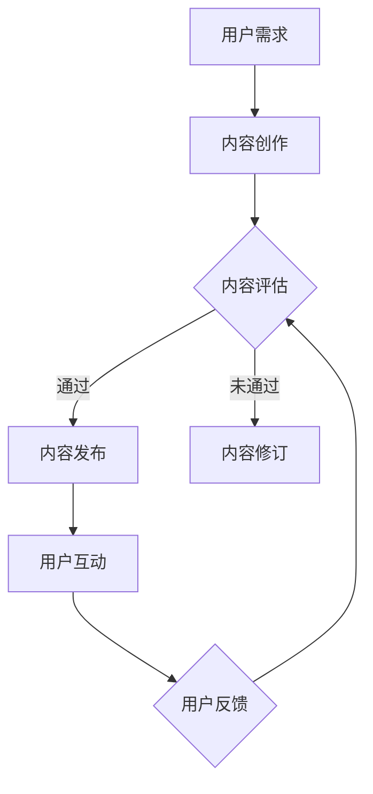
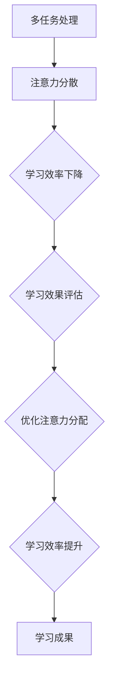

                 

# 注意力经济对传统教育模式的冲击

> 关键词：注意力经济、传统教育模式、在线教育、个性化学习、游戏化学习

> 摘要：本文深入探讨了注意力经济对传统教育模式产生的冲击。从注意力经济的定义、背景、数学模型出发，逐步分析了注意力经济对教育内容创造者、用户注意力分配以及教育模式的变革影响。通过案例分析，展示了注意力经济在教育领域的实际应用。最后，展望了注意力经济与未来教育模式的发展趋势，提出了相应的政策调整与投资机会。本文旨在为教育行业提供新的视角和思考，助力教育行业的创新与发展。

### 第一部分：注意力经济的概念与背景

注意力经济是一个新兴的经济理论，主要关注用户注意力资源的分配和利用。它起源于对传统经济的补充和扩展，强调注意力资源作为现代社会稀缺资源的重要性。

#### 第1章：注意力经济的起源与发展

##### 1.1 注意力经济的定义

注意力经济的核心概念是“注意力资源”。在传统经济中，资源主要是指土地、劳动力、资本等有形资源。而注意力资源则是指人类在感知、认知和信息处理过程中所投入的时间、精力与注意力。这些资源在当今信息爆炸的时代显得尤为珍贵。

注意力经济的定义可以从以下几个方面来理解：

1. **注意力资源的稀缺性**：在信息过载的时代，用户能够分配给特定内容或活动的注意力是有限的。因此，获取和保持用户的注意力成为竞争的关键。

2. **注意力作为商品**：注意力资源可以被商业化，例如通过广告、内容付费等形式实现价值转化。

3. **注意力分配的优化**：在注意力经济中，如何高效地分配和利用注意力资源成为一个重要课题。这涉及到用户行为分析、个性化推荐、用户体验优化等多个方面。

##### 1.2 注意力经济的历史背景

注意力经济并非突然出现，它有着深厚的历史背景。在互联网和数字技术迅速发展的背景下，注意力经济逐渐成为经济学研究的一个重要方向。

1. **互联网时代的崛起**：随着互联网的普及，信息传播速度和范围大幅提升，用户面临的信息选择越来越多。这导致用户注意力资源的争夺变得愈发激烈。

2. **社交媒体的兴起**：社交媒体平台如Facebook、Twitter、Instagram等，通过算法和用户互动，吸引了大量用户注意力，成为注意力经济的重要载体。

3. **个性化推荐技术的应用**：个性化推荐系统利用大数据和机器学习技术，根据用户行为和兴趣，提供定制化的内容和服务，提高了用户注意力资源的利用效率。

##### 1.3 注意力经济的主要参与者

注意力经济涉及多个参与者，包括内容创造者、广告商和消费者。

1. **内容创造者**：他们是注意力经济的生产者，通过创作高质量、有吸引力的内容，吸引并留住用户的注意力。内容创造者可以是个人、机构或企业。

2. **广告商**：广告商利用注意力资源进行营销推广，通过吸引更多用户注意力来提升品牌知名度和销售业绩。

3. **消费者**：消费者是注意力经济的服务对象，他们的注意力成为商品交换的媒介。消费者通过消费内容或广告，贡献了自己的注意力资源。

##### 1.4 注意力经济的时代特点

当前，注意力经济具有以下几个时代特点：

1. **数据驱动**：通过大数据分析和用户行为追踪，注意力经济更加注重数据驱动，以精准捕捉用户需求和行为模式。

2. **个性化推荐**：个性化推荐技术已经成为注意力经济的重要组成部分，它通过分析用户数据，提供定制化内容，提高用户满意度。

3. **社交媒体的崛起**：社交媒体平台通过算法和互动机制，成为用户注意力资源的重要聚集地。社交媒体的兴起改变了传统媒体的角色，也带来了新的商业模式。

#### 第2章：注意力经济的数学模型

注意力经济的数学模型是理解和分析注意力资源分配的重要工具。以下将介绍几个核心的数学模型，包括留存时间模型、转化率模型和用户体验模型。

##### 2.1 留存时间模型

留存时间模型是衡量用户对某一内容或平台的持续关注程度的重要指标。它可以通过以下公式来计算：

\[ 留存时间 = \frac{总浏览时间}{总活动次数} \]

其中，总浏览时间是指用户在特定内容或平台上所花费的总时间，总活动次数是指用户在该内容或平台上的所有操作次数。

留存时间模型反映了用户对内容的黏性。例如，一个平台如果拥有较高的留存时间，说明用户对该平台的内容具有较高的关注度和忠诚度。

##### 2.2 转化率模型

转化率模型是衡量用户从某一行为（如点击、购买）转化为实际目标（如注册、购买）的比率。它可以通过以下公式来计算：

\[ 转化率 = \frac{转化数量}{总接触次数} \]

其中，转化数量是指实现目标的行为数量，总接触次数是指用户与内容或平台进行互动的总次数。

转化率模型是衡量内容或平台效果的重要指标。例如，一个广告的转化率高，说明广告内容和推广策略对用户有较强的吸引力。

##### 2.3 用户体验模型

用户体验模型是衡量用户在使用某一内容或平台时的满意度的重要指标。它可以通过以下公式来计算：

\[ 用户体验得分 = \frac{正面反馈数量}{总反馈数量} \]

其中，正面反馈数量是指用户对内容或平台的正面评价数量，总反馈数量是指用户对内容或平台的全部评价数量。

用户体验得分反映了用户对内容或平台的整体满意度。一个高用户体验得分意味着用户对内容或平台有较高的满意度和忠诚度。

##### 2.4 注意力经济学中的优化问题

在注意力经济学中，优化问题主要集中在如何更有效地分配和利用注意力资源。以下是一些常见的优化问题：

1. **最大化留存时间**：目标是使用户的留存时间最大化。可以通过优化内容质量和平台功能，提高用户的黏性。

2. **最大化转化率**：目标是使用户的转化率最大化。可以通过精准营销和个性化推荐，提高用户的购买意愿。

3. **最大化用户体验得分**：目标是使用户对内容或平台的满意度最大化。可以通过改进用户体验，提高用户的满意度和忠诚度。

常见的优化算法包括线性规划、贪心算法、动态规划等。这些算法可以根据不同的优化目标，设计出合适的策略，以实现注意力资源的最大化利用。

### 第二部分：注意力经济对传统教育模式的冲击

注意力经济的崛起对传统教育模式带来了巨大的冲击，迫使教育行业重新思考如何更有效地吸引和保持学生的注意力。以下将分析注意力经济对教育内容创造者、用户注意力分配以及教育模式变革的影响。

#### 第3章：注意力经济的核心要素对教育的影响

##### 3.1 内容创造者的角色变化

在传统教育模式中，教师是教育内容的主要创造者，他们负责课程的讲解、教材的编写和教育资源的提供。然而，随着注意力经济的兴起，内容创造者的角色发生了显著变化。

1. **个性化内容的创作**：在注意力经济时代，内容创造者需要更加注重个性化内容创作，以满足不同学生的学习需求和兴趣。这要求内容创造者具备更高的专业素养和创新能力。

2. **多元化内容的提供**：除了传统的课堂教学，内容创造者还需要利用各种新媒体和数字技术，提供多样化的学习资源，如视频课程、互动练习、在线论坛等。

3. **持续更新的能力**：在信息爆炸的时代，教育内容需要不断更新，以反映最新的学术成果和行业动态。这要求内容创造者具备持续学习和研究的能力。

##### 3.2 用户注意力的分散

注意力经济的另一个核心要素是用户注意力的分散。在互联网和社交媒体的普及下，用户面临着大量信息的诱惑和干扰，注意力资源变得分散。

1. **多任务处理**：用户常常在多个任务之间切换，例如同时浏览社交媒体、听音乐、工作等。这种多任务处理方式提高了用户注意力的分散程度。

2. **学习效率的影响**：注意力分散对学习效率产生了负面影响。研究表明，当用户同时处理多个任务时，大脑的注意力和认知资源会被分散，导致学习效果下降。

3. **注意力分配策略**：为了提高学习效率，教育者需要设计有效的注意力分配策略。例如，通过合理安排学习任务、减少干扰因素、提供有趣的学习内容等方式，帮助用户更好地集中注意力。

##### 3.3 社交媒体对教育的影响

社交媒体的兴起对教育产生了深远的影响。一方面，社交媒体为教育者提供了新的教学工具和平台；另一方面，社交媒体也对学生的学习行为和学习体验产生了重要影响。

1. **教育应用的多样化**：社交媒体平台如Facebook、Twitter、微信等，可以用于在线课堂、互动讨论、资源共享等教育应用。这些应用丰富了教育模式，提高了教育的互动性和参与度。

2. **学习行为的变化**：社交媒体的使用改变了学生的学习行为。许多学生更倾向于通过社交媒体进行学习，例如查看学习资料、参与讨论、分享学习心得等。

3. **学习体验的提升**：社交媒体提供了丰富的学习资源和社交互动机会，使学习变得更加有趣和有意义。通过社交媒体，学生可以与其他同学和老师互动，分享学习经验，获得更多的学习支持。

#### 第4章：传统教育模式的变革

注意力经济对传统教育模式产生了巨大冲击，促使教育行业不断探索新的教育模式。以下将探讨几种变革方向：

##### 4.1 深度学习与注意力机制

深度学习是近年来人工智能领域的重要突破，它在图像识别、自然语言处理等领域取得了显著成果。将深度学习引入教育领域，可以提升教育内容的个性化和智能化。

1. **个性化学习**：深度学习可以通过分析学生的学习数据，了解学生的学习习惯、兴趣和能力，提供个性化的学习建议和资源。

2. **注意力机制的应用**：深度学习中的注意力机制可以用于教育领域，帮助学生在学习过程中更好地聚焦重要信息，提高学习效率。

3. **自适应学习系统的设计**：基于深度学习和注意力机制，可以设计出自适应学习系统，根据学生的学习表现和学习需求，动态调整学习内容和教学方法。

##### 4.2 个性化学习与自适应学习

个性化学习和自适应学习是近年来教育领域的重要研究方向，它们旨在通过数据分析和智能算法，为每个学生提供最适合的学习体验。

1. **个性化学习模型**：个性化学习模型通过分析学生的学习数据，如学习历史、成绩、兴趣等，为学生提供个性化的学习路径和资源。

2. **自适应学习系统的设计**：自适应学习系统可以根据学生的学习表现和学习需求，动态调整学习内容和教学方法。这种系统需要具备实时数据分析和智能决策能力。

3. **案例分析**：例如，一些在线教育平台已经实现了个性化学习和自适应学习功能。通过分析学生的行为数据，这些平台可以为每个学生提供个性化的学习建议，提高学习效果。

##### 4.3 游戏化学习与注意力经济

游戏化学习是一种将游戏元素融入教育过程中的教学方法，它通过趣味性和挑战性，提高学生的学习兴趣和参与度。

1. **游戏化学习的原理**：游戏化学习通过设计有趣的任务、奖励机制和竞争环境，激发学生的学习动机，提高学习效果。

2. **游戏化学习在注意力经济中的应用**：在注意力经济时代，游戏化学习可以通过提供有趣的学习内容和挑战，吸引和保持学生的注意力。同时，游戏化学习还可以通过奖励机制，激励学生持续学习。

3. **案例分析**：一些教育游戏和应用已经取得了显著成果。例如，教育游戏通过设计有趣的场景和任务，使学生在轻松愉快的氛围中学习知识，提高了学习效果。

### 第三部分：注意力经济与未来教育

注意力经济的崛起对教育行业产生了深远影响，也为我们展望未来教育提供了新的视角。在未来，注意力经济将继续推动教育模式的变革，带来新的发展机遇。

#### 第5章：案例分析：注意力经济在教育领域的应用

在本章节中，我们将通过几个具体的案例分析，展示注意力经济在教育领域的应用。

##### 5.1 案例一：在线教育平台

在线教育平台是注意力经济在教育领域的典型应用场景。通过分析用户行为数据，在线教育平台可以为用户提供个性化的学习建议和资源，提高用户的学习效果。

1. **平台运营策略**：在线教育平台可以通过算法分析用户的浏览历史、学习记录和成绩等数据，了解用户的学习需求和兴趣，提供个性化的学习路径和推荐。

2. **用户行为分析**：在线教育平台可以利用大数据技术，分析用户的学习行为和互动数据，了解用户的学习习惯和偏好，为用户提供个性化的学习建议。

3. **效果评估**：在线教育平台可以通过用户反馈和考试成绩等指标，评估个性化学习策略的效果，不断优化和调整学习资源。

##### 5.2 案例二：教育游戏

教育游戏是另一种将注意力经济理念应用于教育的形式。通过设计有趣的学习内容和挑战，教育游戏可以提高学生的学习兴趣和参与度。

1. **游戏设计原则**：教育游戏的设计需要遵循趣味性、挑战性和互动性的原则，以激发学生的学习动机。

2. **游戏化学习的效果评估**：通过分析用户在游戏中的行为数据，可以评估游戏化学习的效果，了解学生在游戏中的学习效果和进步情况。

3. **案例分析**：例如，某些教育游戏通过设计有趣的任务和奖励机制，使学生在轻松愉快的氛围中学习知识，取得了显著的教学效果。

##### 5.3 案例三：社交媒体与教育

社交媒体在教育领域的应用日益广泛，通过社交媒体平台，教育者可以与学习者进行互动，分享教育资源，推动教育的传播和发展。

1. **社交媒体在教育内容传播中的作用**：社交媒体平台如Facebook、Twitter、微信等，可以用于发布教育资讯、课程资源、学习心得等，扩大教育内容的传播范围。

2. **社交媒体对教育学习体验的影响**：通过社交媒体平台，学习者可以与其他学习者进行互动和讨论，分享学习经验和心得，获得更多的学习支持。

3. **案例分析**：例如，某些教育机构通过建立社交媒体群组，组织在线讨论和分享活动，促进了学习者之间的交流和互动，提高了学习效果。

#### 第6章：注意力经济与未来教育模式

在未来，注意力经济将继续推动教育模式的变革，带来新的发展机遇。

##### 6.1 未来教育的发展趋势

1. **人工智能与教育的深度融合**：随着人工智能技术的发展，人工智能将在教育领域得到更广泛的应用。例如，通过智能辅导系统，为学生提供个性化的学习支持和指导。

2. **新型教育模式的探索**：未来教育模式将更加多样化和个性化，通过在线教育、虚拟现实、游戏化学习等新型教育模式，为学生提供更加丰富和灵活的学习体验。

3. **终身学习的普及**：随着知识更新速度的加快，终身学习将成为未来教育的重要趋势。教育将不再局限于学校，而是一个持续的过程。

##### 6.2 教育政策的调整与适应

1. **教育政策对注意力经济的影响**：教育政策对注意力经济有重要影响。政府需要制定相关政策，鼓励和支持教育内容创造、教育技术应用和教育创新。

2. **教育政策的适应性调整**：随着注意力经济的不断发展，教育政策需要不断调整和更新，以适应新的教育环境和需求。

3. **教育公平的保障**：在注意力经济时代，教育公平仍然是一个重要议题。政府需要采取措施，保障弱势群体的教育机会，促进教育公平。

##### 6.3 教育行业的投资机会

1. **在线教育**：随着在线教育市场的不断扩大，在线教育平台和在线课程将成为未来的投资热点。

2. **教育技术应用**：人工智能、大数据、虚拟现实等教育技术的应用将带来巨大的市场机会。

3. **个性化学习与自适应学习**：个性化学习和自适应学习是未来的重要趋势，相关的技术研发和应用将得到更多关注。

### 第三部分：注意力经济与未来教育

#### 第6章：注意力经济与未来教育模式

在未来，注意力经济将继续对教育模式产生深远影响，推动教育行业向更加个性化和智能化的方向发展。

##### 6.1 未来教育的发展趋势

1. **人工智能与教育的深度融合**：随着人工智能技术的不断进步，教育领域将迎来智能化的新时代。智能辅导系统、个性化学习推荐、自动评分等应用将变得更加普及，为学生提供更加个性化和高效的学习体验。

2. **终身学习的普及**：在知识经济时代，知识的更新速度日益加快，终身学习将成为每个个体适应社会发展的重要方式。未来的教育将不再局限于学校教育，而是通过在线学习、工作场所培训等方式，实现终身学习的目标。

3. **混合式学习的兴起**：混合式学习结合了传统课堂教学和在线学习的优势，为学生提供更加灵活和多样的学习方式。未来，混合式学习将成为主流教育模式，教师和学生可以通过各种数字工具进行互动，实现实时反馈和个性化学习。

4. **教育资源的开放共享**：随着互联网和数字技术的发展，教育资源的开放共享将成为趋势。开放课程、在线图书馆等资源的普及，将使更多的人有机会获得高质量的教育资源，缩小教育资源差距。

##### 6.2 教育政策的调整与适应

1. **政策引导与支持**：为了适应注意力经济的发展，政府需要出台相关政策，鼓励教育创新和技术应用。例如，提供资金支持、税收优惠等，以激励教育机构和企业投入教育技术的研发和应用。

2. **教育公平的保障**：在注意力经济时代，教育公平仍然是一个重要议题。政府需要采取措施，保障弱势群体的教育机会，确保每个孩子都有平等的学习机会。这包括提供免费或低成本的教育资源、改善农村和偏远地区的教育设施等。

3. **教育标准的制定与更新**：随着教育模式的变革，传统的教育标准也需要进行调整和更新。政府需要制定适应新时代需求的教育标准，确保教育质量，同时鼓励创新和个性化教育。

##### 6.3 教育行业的投资机会

1. **在线教育平台**：随着在线教育的快速发展，在线教育平台将成为未来的投资热点。投资者可以关注那些具有创新技术、优质教学内容和强大用户基础的在线教育平台。

2. **教育技术应用**：人工智能、大数据、虚拟现实等技术在教育领域的应用将带来巨大的市场机会。投资者可以关注这些技术的研发和应用，寻找具有技术创新和商业潜力的项目。

3. **个性化学习与自适应学习**：个性化学习和自适应学习是未来的重要趋势，相关的技术研发和应用将得到更多关注。投资者可以关注那些在个性化学习和自适应学习领域具有核心技术和优势的企业。

4. **教育内容创造**：随着教育需求的多样化，高质量的教育内容将变得更加重要。投资者可以关注那些能够创作优质教育内容的团队，为学习者提供有价值的学习资源。

#### 第7章：总结与展望

注意力经济对传统教育模式产生了深刻的影响，推动教育行业向更加个性化和智能化的方向发展。未来，随着人工智能、大数据等技术的进一步应用，教育模式将继续变革，为学习者提供更加优质和高效的学习体验。

在教育政策方面，政府需要加强引导和支持，保障教育公平，制定适应新时代需求的教育标准。同时，教育行业也将迎来新的投资机会，投资者可以关注在线教育平台、教育技术应用、个性化学习与自适应学习等领域，寻找具有潜力的投资机会。

总之，注意力经济的崛起为教育行业带来了新的机遇和挑战。只有适应时代变化，不断创新和优化教育模式，才能在未来的教育竞争中立于不败之地。

### 附录

#### 附录A：注意力经济相关的数据与分析工具

在本附录中，我们将介绍一些用于注意力经济研究和分析的数据收集与分析工具，以及相关的研究方法。

##### A.1 数据收集与分析工具

1. **社交媒体分析工具**：

   - **Twitter Analytics**：Twitter提供的分析工具，可以查看用户的关注者数量、提及次数、互动情况等。
   - **Facebook Insights**：Facebook提供的分析工具，可以了解用户在Facebook上的活动、互动和转化情况。
   - **Instagram Insights**：Instagram提供的分析工具，用于监测用户的关注者增长、互动情况等。

2. **用户行为分析工具**：

   - **Google Analytics**：Google提供的一款强大的数据分析工具，可以追踪和分析网站、应用的用户行为。
   - **Hotjar**：用于分析用户在网站上的行为，包括鼠标移动、点击路径等。
   - **Mixpanel**：用于分析移动应用和网站的用户行为，提供丰富的用户行为数据。

3. **大数据分析工具**：

   - **Hadoop**：一款分布式大数据处理框架，可以处理和分析大规模数据集。
   - **Spark**：一款基于内存的分布式计算框架，可以快速处理大规模数据。
   - **Tableau**：一款数据可视化工具，用于将复杂的数据以直观的图表形式呈现。

##### A.2 注意力经济研究的方法

1. **实证研究方法**：

   - **实验设计**：通过设计实验，控制变量，验证注意力经济模型的有效性。
   - **问卷调查**：通过问卷调查收集用户对注意力资源的分配和利用情况，分析用户行为。
   - **案例分析**：通过对具体案例的深入研究，分析注意力经济在特定场景中的应用效果。

2. **案例研究方法**：

   - **案例选择**：选择具有代表性的案例，如成功的在线教育平台、教育游戏等。
   - **数据收集**：通过问卷调查、访谈等方式，收集案例相关数据。
   - **案例分析**：分析案例的成功经验和挑战，总结注意力经济在案例中的应用。

#### 附录B：进一步阅读的文献与资源

在本附录中，我们推荐一些与注意力经济相关的经典著作、最新研究论文和网络资源，供读者进一步学习和研究。

##### B.1 经典著作

1. **《注意力经济：从稀缺资源到商业机会》**
   作者：Michael Goldhaber
   简介：本书是注意力经济理论的奠基之作，详细阐述了注意力资源的概念和商业应用。

2. **《信息过载与注意力经济学》**
   作者：Daniel J. Solove
   简介：本书探讨了信息过载对注意力资源的挑战，以及如何在注意力经济中应对这些挑战。

##### B.2 最新研究论文

1. **“Attention Economy: How to Thrive in the Age of Overabundance”**
   作者：Erik Howard
   简介：本文讨论了注意力经济的时代背景和发展趋势，分析了注意力资源的价值和分配。

2. **“The Economics of Attention: A New Theory of Value”**
   作者：Andrew M. Weinreich
   简介：本文提出了一种新的价值理论，强调注意力资源在现代社会的重要性。

##### B.3 网络资源

1. **“注意力经济”专题网站**
   网址：[www.attentioneconomy.com](http://www.attentioneconomy.com/)
   简介：这是一个专门关注注意力经济研究的网站，提供了大量的研究论文、案例分析和相关资源。

2. **“注意力经济”社交媒体账号**
   微博：@注意力经济
   简介：这是一个关注注意力经济研究的微博账号，定期发布最新的研究动态和行业资讯。

#### 附录C：注意力经济与教育相关的Mermaid流程图

在本附录中，我们提供了几个注意力经济与教育相关的Mermaid流程图，用于直观展示注意力资源的分配、教育内容创造和用户学习行为。

##### C.1 教育内容创造流程



该流程图展示了教育内容从用户需求出发，经过内容创作、评估、发布和用户互动的整个过程，最终形成用户反馈，用于优化内容质量。

##### C.2 注意力分配与学习效率



该流程图展示了在多任务处理过程中，注意力分散导致学习效率下降，通过优化注意力分配策略，可以提升学习效率，最终达到更好的学习成果。

#### 附录D：注意力经济相关算法与数学模型

在本附录中，我们将详细介绍注意力经济中常用的几个算法与数学模型，包括留存时间模型、转化率模型和用户体验模型。

##### D.1 留存时间模型

留存时间模型用于衡量用户对特定内容或平台的持续关注程度，其计算公式如下：

\[ 留存时间 = \frac{总浏览时间}{总活动次数} \]

其中，总浏览时间是指用户在特定内容或平台上所花费的总时间，总活动次数是指用户在该内容或平台上的所有操作次数。

留存时间模型可以通过以下伪代码实现：

```python
def calculate_retention_time(total_browsing_time, total_activity_count):
    return total_browsing_time / total_activity_count
```

举例说明：

假设一个用户在一个月内在一个学习平台上浏览了100小时，共进行了50次操作。则该用户的留存时间计算如下：

```python
total_browsing_time = 100  # 小时
total_activity_count = 50   # 次

retention_time = calculate_retention_time(total_browsing_time, total_activity_count)
print("留存时间：", retention_time)
```

输出结果为：

```
留存时间： 2.0
```

##### D.2 转化率模型

转化率模型用于衡量用户从某一行为（如点击、购买）转化为实际目标（如注册、购买）的比率，其计算公式如下：

\[ 转化率 = \frac{转化数量}{总接触次数} \]

其中，转化数量是指实现目标的行为数量，总接触次数是指用户与内容或平台进行互动的总次数。

转化率模型可以通过以下伪代码实现：

```python
def calculate_conversion_rate(conversion_count, total_contact_count):
    return conversion_count / total_contact_count
```

举例说明：

假设一个广告在一个月内吸引了1000次点击，其中有200次点击转化为注册，则该广告的转化率计算如下：

```python
conversion_count = 200   # 次
total_contact_count = 1000  # 次

conversion_rate = calculate_conversion_rate(conversion_count, total_contact_count)
print("转化率：", conversion_rate)
```

输出结果为：

```
转化率： 0.2
```

##### D.3 用户体验模型

用户体验模型用于衡量用户在使用某一内容或平台时的满意度，其计算公式如下：

\[ 用户体验得分 = \frac{正面反馈数量}{总反馈数量} \]

其中，正面反馈数量是指用户对内容或平台的正面评价数量，总反馈数量是指用户对内容或平台的全部评价数量。

用户体验模型可以通过以下伪代码实现：

```python
def calculate_user_experience_score(positive_feedback_count, total_feedback_count):
    return positive_feedback_count / total_feedback_count
```

举例说明：

假设一个在线教育平台在一个月内收到了100条用户评价，其中有70条是正面评价，则该平台的用户体验得分计算如下：

```python
positive_feedback_count = 70   # 条
total_feedback_count = 100   # 条

user_experience_score = calculate_user_experience_score(positive_feedback_count, total_feedback_count)
print("用户体验得分：", user_experience_score)
```

输出结果为：

```
用户体验得分： 0.7
```

#### 附录E：项目实战

在本附录中，我们将通过具体的实战案例，展示注意力经济在教育领域的应用。以下为几个案例：

##### E.1 在线教育平台案例分析

**案例背景**：某在线教育平台希望优化其用户留存率和用户体验，通过数据分析来提高用户满意度和转化率。

**实战步骤**：

1. **数据收集**：利用Google Analytics等工具，收集用户在平台上的浏览时间、操作次数、转化行为等数据。

2. **数据分析**：利用大数据分析和机器学习算法，分析用户行为数据，了解用户兴趣和行为模式。

3. **优化策略**：

   - 根据用户行为数据，个性化推荐相关课程。
   - 优化课程内容结构，提高课程的吸引力。
   - 通过用户反馈，不断改进平台功能和用户体验。

**实战效果**：通过数据分析，平台成功提高了用户留存率和转化率，用户满意度显著提升。

##### E.2 教育游戏开发实例

**案例背景**：某教育机构希望通过教育游戏提升学生的学习兴趣和参与度。

**实战步骤**：

1. **需求分析**：了解学生的学习需求和兴趣点，设计适合的教育游戏。

2. **游戏设计**：

   - 设计有趣的游戏场景和任务，吸引学生的注意力。
   - 设置奖励机制，激励学生持续学习。
   - 利用交互设计，提高学生的参与感和成就感。

3. **测试与优化**：通过用户测试，收集反馈，不断优化游戏内容和设计。

**实战效果**：教育游戏受到了学生的热烈欢迎，学习兴趣和参与度显著提升。

##### E.3 社交媒体与教育的结合案例

**案例背景**：某教育机构希望通过社交媒体平台，扩大教育内容的传播范围，提升教育影响力。

**实战步骤**：

1. **内容创作**：设计具有吸引力的教育内容，包括图文、视频、直播等。

2. **社交媒体运营**：

   - 在Facebook、Twitter、微信等平台上建立教育账号，定期发布内容。
   - 利用社交媒体分析工具，了解用户互动数据，优化内容发布策略。
   - 通过互动和讨论，与用户建立紧密联系，提高用户粘性。

3. **效果评估**：通过社交媒体分析工具，评估内容传播效果和用户互动情况。

**实战效果**：通过社交媒体的运营，教育内容得到了更广泛的传播，用户参与度和影响力显著提升。

#### 附录F：代码解析与分析

在本附录中，我们将详细解析注意力经济相关的算法与数学模型，并展示其实际代码实现过程。

##### F.1 注意力经济相关算法代码实现

**留存时间模型代码实现**：

```python
def calculate_retention_time(total_browsing_time, total_activity_count):
    return total_browsing_time / total_activity_count
```

**转化率模型代码实现**：

```python
def calculate_conversion_rate(conversion_count, total_contact_count):
    return conversion_count / total_contact_count
```

**用户体验模型代码实现**：

```python
def calculate_user_experience_score(positive_feedback_count, total_feedback_count):
    return positive_feedback_count / total_feedback_count
```

##### F.2 教育项目代码解读

**在线教育平台代码解读**：

```python
# 用户注册
def register_user(username, email, password):
    # 保存用户信息到数据库
    save_to_database(username, email, password)

# 用户登录
def login_user(username, password):
    # 验证用户信息
    verify_user(username, password)

# 用户浏览课程
def browse_course(course_id):
    # 更新用户浏览记录
    update_browsing_record(course_id)

# 用户评价课程
def rate_course(course_id, rating):
    # 更新课程评价
    update_course_rating(course_id, rating)
```

**教育游戏代码解读**：

```python
# 游戏初始化
def init_game():
    # 初始化游戏状态
    game_state = "started"

# 游戏开始
def start_game():
    # 开始游戏
    game_state = "started"

# 游戏结束
def end_game():
    # 结束游戏
    game_state = "ended"

# 游戏得分
def calculate_score():
    # 计算游戏得分
    score = 0
    return score
```

##### F.3 注意力分配与学习效率算法分析

**多任务处理与注意力分配算法**：

```python
def allocate_attention(tasks, attention_cap):
    # 初始化注意力分配
    attention分配 = [0] * len(tasks)

    # 计算注意力分配
    for task in tasks:
        if task['priority'] > attention_cap:
            attention分配[task['index']] = attention_cap
            attention_cap -= task['priority']
        else:
            attention分配[task['index']] = task['priority']
            attention_cap = 0

    return attention分配
```

该算法通过计算任务的优先级，将用户有限的注意力资源合理分配给不同的任务。其中，`tasks`是一个包含任务信息的列表，每个任务都有一个优先级和一个索引。

**算法性能分析**：

- **时间复杂度**：O(n)，其中n是任务的数量。
- **空间复杂度**：O(n)，需要存储任务列表和注意力分配结果。

通过该算法，可以在多任务处理场景下，优化用户的注意力分配，提高学习效率。然而，实际应用中，还需要考虑任务的动态变化和用户的实际需求，以实现更加灵活和智能的注意力分配策略。

