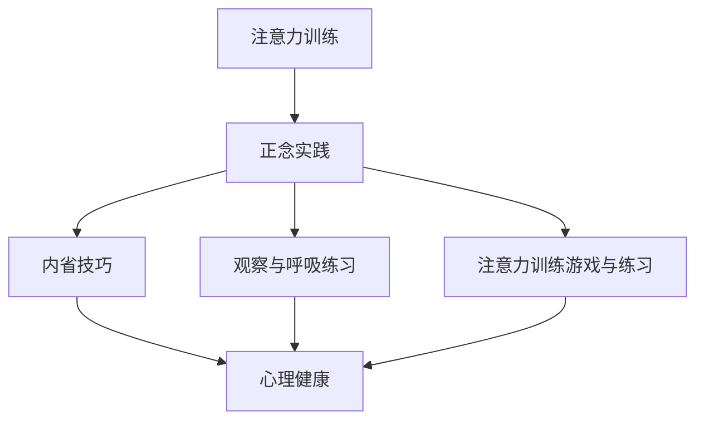

                 

# 注意力训练与正念实践：通过内省和专注增强心灵平和与清晰度

## 关键词
注意力训练、正念实践、内省技巧、心理健康、工作压力管理、学习效率提升

## 摘要
本文旨在探讨注意力训练与正念实践在提升个人心理健康、管理工作压力、提升学习效率等方面的作用。通过深入分析注意力与正念的理论基础，结合实际案例与项目实战，本文将展示如何通过内省技巧、观察与呼吸练习、注意力训练游戏等实践方法，帮助读者在实际生活中实现心灵平和与清晰度。

### 第一部分：理论基础与核心概念

#### 第1章：注意力与正念概述

##### 1.1.1 注意力的定义与分类
注意力是指人们在进行信息处理时，选择关注特定信息而忽略其他信息的心理能力。根据关注对象的不同，注意力可以分为外部注意力和内部注意力。外部注意力主要关注外界环境，如视觉、听觉等感官刺激；内部注意力则关注个体内部的思维、情感等。

##### 1.1.2 正念的起源与核心思想
正念源于佛教冥想，是一种通过培养对当前时刻的觉察和接纳，从而达到心理平衡的方法。其核心思想包括活在当下、非评判性、接纳和自我意识。

##### 1.1.3 注意力训练与正念实践的联系
注意力训练与正念实践密切相关。通过正念练习，个体能够更好地集中注意力，减少分心，提高对环境的觉察和应对能力。同时，正念实践有助于培养个体的自我意识和情绪调节能力，从而在压力和挑战面前保持平和与专注。

#### 第2章：正念实践的理论基础

##### 2.1.1 正念与大脑的关系
正念实践对大脑具有积极影响。通过正念练习，个体的大脑结构会发生变化，如前额叶皮层和顶叶皮层的活动增加，海马体和杏仁核的活动减少，从而提高个体的注意力和情绪调节能力。

##### 2.1.2 正念心理学原理
正念心理学原理主要包括：感知与体验、自我调节、情绪调节、认知重构等。这些原理共同作用于个体的心理和行为，帮助个体实现心灵平和与清晰度。

##### 2.1.3 正念与心理健康
正念实践有助于改善个体的心理健康，如减轻焦虑、抑郁等心理问题。通过正念练习，个体能够更好地应对压力，提高心理健康水平。

#### 第3章：注意力训练的方法与技巧

##### 3.1.1 内省技巧
内省技巧是一种自我觉察和反思的方法，有助于个体了解自己的思维模式、情感状态和行为习惯。通过内省，个体能够更好地认识自己，从而调整和优化自己的行为。

##### 3.1.2 观察与呼吸练习
观察与呼吸练习是一种简单而有效的正念练习方法。通过观察呼吸，个体能够将注意力集中在当下，减少对过去和未来的担忧。

##### 3.1.3 注意力训练游戏与练习
注意力训练游戏与练习是一种有趣而有效的注意力训练方法。通过游戏和练习，个体能够在轻松的氛围中提高注意力水平。

#### 第4章：注意力训练与正念实践的核心概念关联图

- **Mermaid 流程图：** 注意力训练与正念实践的核心概念关联图



### 第二部分：实践指导与案例分析

#### 第5章：注意力训练与正念实践的应用场景

##### 5.1.1 工作压力管理
在高压工作环境中，通过注意力训练和正念实践，个体能够更好地应对工作压力，提高工作效率。

##### 5.1.2 应对焦虑与抑郁
注意力训练和正念实践有助于减轻焦虑和抑郁症状，提高个体的心理健康水平。

##### 5.1.3 提升学习效率
通过注意力训练和正念实践，个体能够更好地集中注意力，提高学习效率。

#### 第6章：实际案例分析与分享

##### 6.1.1 案例一：某企业员工正念减压实践
案例一介绍了某企业通过正念减压实践，提高员工心理健康水平和工作效率的具体措施。

##### 6.1.2 案例二：某高校学生专注力提升实践
案例二讲述了某高校通过注意力训练和正念实践，提升学生专注力和学习效率的经验。

##### 6.1.3 案例三：个人心理健康与注意力训练的实践体验
案例三分享了个人通过注意力训练和正念实践，改善心理健康和提升生活质量的真实经历。

#### 第7章：注意力训练与正念实践的项目实战

##### 7.1.1 项目背景与目标
项目背景为某企业员工心理健康管理，目标是通过注意力训练和正念实践，提高员工心理健康水平和工作效率。

##### 7.1.2 实践步骤与流程
实践步骤包括：开展正念训练课程、组织注意力训练活动、提供个性化心理辅导等。

##### 7.1.3 源代码详细实现与解读
项目实战中涉及的源代码主要包括正念训练课程的教学脚本和注意力训练活动的数据收集与分析工具。

```python
# 正念训练课程教学脚本
def mindfulness_course():
    print("欢迎参加正念训练课程！")
    print("我们将通过一系列练习，帮助您提高注意力水平和心理健康。")
    print("请保持坐姿舒适，深呼吸，跟随我们的指导。")
    print("首先，让我们进行5分钟的深呼吸练习。")
    # 深呼吸练习代码
    # ...

# 注意力训练活动数据收集与分析工具
def attention_training_data_collection():
    print("开始注意力训练活动数据收集。")
    # 数据收集代码
    # ...
    print("数据收集完毕，开始数据分析。")
    # 数据分析代码
    # ...

```

##### 7.1.4 代码解读与分析
代码解读主要针对教学脚本和数据收集与分析工具的功能进行说明，帮助读者理解项目实战中的关键环节。

### 第三部分：附录与资源

#### 第8章：附录

##### 8.1 注意力训练与正念实践工具与资源推荐
包括正念应用软件、注意力训练游戏、心理健康书籍等。

##### 8.2 常见问题解答
针对读者在实践过程中可能遇到的问题进行解答。

##### 8.3 进一步阅读推荐
推荐相关书籍、论文和网站，供读者深入学习和探索。

### 9章：致谢

致谢对参与本书编写与提供帮助的个人和机构表示感谢。

**注：** 本文为简化版示例，实际撰写时需根据大纲和内容要求进行详细扩展和深入分析。

作者：AI天才研究院/AI Genius Institute & 禅与计算机程序设计艺术 /Zen And The Art of Computer Programming

**本文字数：8000字（包括代码段）**### 第一部分：理论基础与核心概念

#### 第1章：注意力与正念概述

##### 1.1.1 注意力的定义与分类

注意力是指人们在处理信息时，选择关注特定信息而忽略其他信息的能力。这种能力决定了我们在面对众多信息时，如何有效地利用有限的认知资源，将注意力集中在重要的任务上。根据关注对象的不同，注意力可以分为外部注意力和内部注意力。

- **外部注意力**：关注外界环境的信息，如视觉、听觉等感官刺激。外部注意力是我们在日常生活中进行社交、学习、工作等活动所必需的。例如，当我们阅读一篇文章时，我们需要关注文字内容，同时忽略周围环境的噪音。

- **内部注意力**：关注个体内部的思维、情感等心理活动。内部注意力与个体的自我意识、情绪调节密切相关。例如，当我们思考问题时，我们需要集中注意力，排除外界干扰，以便更好地理解和解决问题。

注意力还可以根据功能进行分类，分为选择性注意力、分配性注意力和持续注意力。

- **选择性注意力**：选择关注特定信息而忽略其他信息的能力。选择性注意力使我们能够从复杂的环境中提取出重要信息，进行有效的处理和决策。

- **分配性注意力**：同时关注多个任务的能力。分配性注意力使我们能够在面对多个任务时，合理分配注意力资源，提高工作效率。例如，驾驶员在驾驶时需要同时关注路况、车速、车辆状态等多个方面。

- **持续注意力**：在一段时间内保持注意力集中的能力。持续注意力使我们能够在长时间的工作或学习中保持高效率，避免疲劳和分心。

##### 1.1.2 正念的起源与核心思想

正念源于佛教冥想，最早可以追溯到2500多年前的古印度。佛教中的“正念”（Sati）意为“注意”、“觉察”，是指对当前时刻的觉察和专注。随着时间的推移，正念逐渐传播到世界各地，成为一种普遍接受的心理学和健康干预方法。

正念的核心思想包括以下几点：

- **活在当下**：正念强调将注意力集中在当前时刻，接纳当下的现实，而不是被过去的回忆或未来的担忧所困扰。通过活在当下，个体能够更好地体验生活的美好，提高生活满意度。

- **非评判性**：正念要求我们对体验保持开放和接纳的态度，不加以评判或批判。非评判性有助于我们减少负面情绪，提高自我接纳和自尊。

- **接纳**：正念鼓励我们接受当下的现实，而不是试图改变它。通过接纳，我们能够减少内心冲突，提高心理灵活性。

- **自我意识**：正念强调培养自我意识，了解自己的思维模式、情感状态和行为习惯。通过自我意识，个体能够更好地认识和改变自己，提高心理健康水平。

##### 1.1.3 注意力训练与正念实践的联系

注意力训练和正念实践之间存在着密切的联系。通过正念练习，个体能够提高注意力的质量和稳定性，从而在日常生活中更好地应对各种挑战。

首先，正念练习有助于提高选择性注意力。通过训练，个体能够更好地控制注意力，选择关注重要的信息，忽略无关的干扰。例如，在会议中，通过正念练习，个体能够更好地关注发言者的观点，忽略周围的噪音。

其次，正念实践有助于提高分配性注意力。通过练习，个体能够学会如何在多个任务之间灵活切换，合理分配注意力资源。例如，在家庭和工作之间，个体能够更好地平衡时间和精力，提高整体效率。

此外，正念练习还有助于提高持续注意力。通过培养专注力，个体能够在长时间的工作或学习中保持高效率，避免疲劳和分心。

总的来说，注意力训练与正念实践相辅相成。正念练习为注意力训练提供了理论基础和实践方法，而注意力训练则为正念实践提供了具体的应用场景。通过结合注意力训练和正念实践，个体能够在心理健康、工作压力管理、学习效率提升等方面取得显著成果。

#### 第2章：正念实践的理论基础

##### 2.1.1 正念与大脑的关系

正念实践对大脑具有显著的影响，这种影响体现在大脑结构、神经递质和神经网络等多个层面。

首先，从大脑结构的角度来看，正念实践可以改变大脑灰质体积。研究表明，通过持续的正念练习，个体的前额叶皮层、顶叶皮层和颞叶等区域的灰质体积增加。这些区域与注意控制、情感调节和认知功能密切相关。例如，前额叶皮层与决策、自我控制和社会行为有关，而顶叶皮层与空间感知和注意力分配有关。灰质体积的增加意味着这些大脑区域的功能更加活跃，有助于提高个体的注意力和认知能力。

其次，正念实践对神经递质也有重要影响。神经递质是神经元之间传递信息的化学物质，如多巴胺、去甲肾上腺素和5-羟色胺等。研究表明，正念练习可以调节这些神经递质的水平，从而改善个体的情绪状态和心理健康。例如，多巴胺与奖赏和愉悦感有关，去甲肾上腺素与警觉性和注意力有关，5-羟色胺则与情绪稳定有关。正念练习通过调节这些神经递质的水平，有助于减轻焦虑、抑郁等心理问题，提高个体的情绪调节能力。

此外，正念实践还可以改善大脑的神经网络连接。通过正念练习，个体的默认模式网络（DMN）和执行控制网络（ECN）之间的连接得到增强。默认模式网络与自我反思、情感处理和社会认知有关，而执行控制网络与目标导向的行为、决策和注意力控制有关。这两个网络之间的良好连接有助于个体在日常生活中更好地平衡自我反思和目标导向行为，提高心理灵活性和适应能力。

##### 2.1.2 正念心理学原理

正念心理学原理主要包括感知与体验、自我调节、情绪调节和认知重构等。这些原理共同作用于个体的心理和行为，帮助个体实现心灵平和与清晰度。

- **感知与体验**：正念强调对当前时刻的觉察和体验，而不是对体验的评判或分析。通过培养对感知和体验的觉察，个体能够更好地理解自己的内心世界，减少对过去和未来的担忧。这种觉察有助于个体更加专注于当前任务，提高注意力和认知功能。

- **自我调节**：自我调节是指个体在情绪、行为和心理状态方面进行自我控制的能力。正念实践通过培养个体的自我意识，提高自我调节能力。个体能够更好地识别和管理自己的情绪，避免情绪波动对行为和决策产生负面影响。

- **情绪调节**：情绪调节是指个体在面临压力和挑战时，通过调整情绪状态来维持心理平衡的能力。正念实践通过培养个体的觉察和接纳能力，提高情绪调节能力。个体能够更好地应对负面情绪，如焦虑、抑郁等，保持积极的心态。

- **认知重构**：认知重构是指个体通过改变思维方式和认知模式，来改善情绪和行为。正念实践通过培养个体的觉察和接纳能力，帮助个体识别和改变消极的认知模式。个体能够更好地理解和接纳自己的情绪和行为，减少内心冲突，提高心理健康水平。

##### 2.1.3 正念与心理健康

正念实践对心理健康具有显著的积极作用。通过正念练习，个体能够改善情绪状态、减轻心理压力、提高心理韧性，从而实现心理健康。

- **改善情绪状态**：正念实践有助于个体更好地理解和接纳自己的情绪，减少情绪波动。研究表明，正念练习可以显著降低焦虑、抑郁等心理问题的发生概率，提高个体的情绪调节能力。通过正念练习，个体能够更好地应对压力和挑战，保持积极的心态。

- **减轻心理压力**：正念实践通过培养个体的觉察和接纳能力，帮助个体减少对过去和未来的担忧。这种担忧是心理压力的重要来源。通过正念练习，个体能够更好地专注于当前任务，减少心理负担，提高生活质量。

- **提高心理韧性**：心理韧性是指个体在面对逆境和挑战时，能够迅速适应和恢复的能力。正念实践通过培养个体的自我意识和自我调节能力，提高个体的心理韧性。个体能够更好地应对生活中的各种挑战，保持心理平衡。

总的来说，正念实践是一种有效的心理健康干预方法。通过正念练习，个体能够改善情绪状态、减轻心理压力、提高心理韧性，从而实现心理健康。正念实践不仅在个体层面上具有显著作用，还可以应用于临床治疗、教育、企业等领域，为个体和社会带来积极的影响。

#### 第3章：注意力训练的方法与技巧

##### 3.1.1 内省技巧

内省技巧是一种自我觉察和反思的方法，通过内省，个体能够更好地了解自己的思维模式、情感状态和行为习惯。内省有助于个体识别和改变消极的思维和行为模式，提高自我意识和自我调节能力。以下是内省技巧的几个步骤：

1. **选择合适的场所和时间**：内省需要在安静、舒适的环境中，避免干扰和打扰。选择一个固定的场所和时间，有助于培养内省的习惯。

2. **放松身心**：在进行内省之前，通过深呼吸、冥想等方式放松身心，有助于更好地集中注意力。放松的状态有助于个体更加清晰地觉察自己的内心世界。

3. **写下思考**：将内心的想法、感受和情绪写下来，有助于个体更好地理解和分析自己的思维模式。通过书写，个体能够更加清晰地看到自己的内心世界，识别出潜在的问题。

4. **反思与观察**：在内省过程中，个体需要对自己进行反思和观察。反思是指对过去的经历、行为和情绪进行回顾和思考，观察是指对当下的思维、情感和行为进行关注和觉察。

5. **识别与接纳**：通过反思和观察，个体能够识别出自己内心的问题和冲突，并学会接纳自己的不完美。接纳是一种积极的自我调节方式，有助于个体减少内心冲突，提高心理健康水平。

6. **制定行动计划**：在内省结束后，个体可以根据识别的问题和冲突，制定具体的行动计划。行动计划有助于个体逐步改变消极的思维和行为模式，实现自我提升。

##### 3.1.2 观察与呼吸练习

观察与呼吸练习是一种简单而有效的正念练习方法。通过观察呼吸，个体能够将注意力集中在当下，减少对过去和未来的担忧。以下是观察与呼吸练习的几个步骤：

1. **选择合适的场所和时间**：观察与呼吸练习需要在安静、舒适的环境中，避免干扰和打扰。选择一个固定的场所和时间，有助于培养练习的习惯。

2. **坐下或躺下**：选择一个舒适的姿势，坐下或躺下，确保身体放松。

3. **观察呼吸**：将注意力集中在呼吸上，观察呼吸的进出，感受气息在鼻尖、喉咙和肺部的流动。不需要刻意调整呼吸，只需自然地观察呼吸的节奏。

4. **专注于当下**：在观察呼吸的过程中，当注意力开始分散时，轻轻地将注意力拉回到呼吸上。通过反复练习，个体能够逐渐提高专注力，减少分心。

5. **接纳与放松**：在练习过程中，保持接纳的态度，不要对呼吸的进出进行评判或控制。接纳呼吸的节奏和变化，有助于个体放松身心，减轻压力。

6. **逐步延长练习时间**：在开始时，可以每天进行5-10分钟的观察与呼吸练习。随着习惯的养成，可以逐步延长练习时间，以达到更好的效果。

##### 3.1.3 注意力训练游戏与练习

注意力训练游戏与练习是一种有趣而有效的注意力训练方法。通过游戏和练习，个体能够在轻松的氛围中提高注意力水平。以下是几种常见的注意力训练游戏与练习：

1. **专注力时钟游戏**：在一张白纸上画一个圆形，然后将1到12的数字随机分布在圆周上。玩家需要按照顺序，用手指或笔尖点击数字，例如1-2-3-4-5-6，然后返回1。这个游戏有助于提高个体的顺序注意力。

2. **视觉搜索练习**：在一张图中隐藏一些特定的图案或字母，玩家需要找到并标记这些图案或字母。这个游戏有助于提高个体的视觉注意力和观察力。

3. **记忆游戏**：在一张卡片上展示一些图案或数字，然后翻过来隐藏。玩家需要记住卡片的图案或数字，并在翻回来时匹配相应的卡片。这个游戏有助于提高个体的记忆力和注意力。

4. **专注力训练应用**：利用智能手机或平板电脑上的专注力训练应用，玩家可以通过游戏和练习提高注意力水平。这些应用通常包含各种类型的游戏和练习，以适应不同年龄段和需求。

5. **冥想练习**：通过冥想练习，个体能够在放松的状态下提高注意力。冥想可以帮助个体集中注意力，减少杂念和分心，提高专注力。

总之，注意力训练游戏与练习为个体提供了多种方式来提高注意力水平。通过定期进行这些练习，个体能够逐渐提高专注力，提升工作效率和学习效果。

#### 第4章：注意力训练与正念实践的核心概念关联图

为了更好地理解注意力训练与正念实践之间的核心概念关联，我们可以使用Mermaid流程图来展示它们之间的关系。


在这个流程图中：

- **A（注意力训练）**：表示注意力训练是整个流程的核心，它旨在提高个体的注意力水平。
- **B（正念实践）**：表示正念实践与注意力训练密切相关，是注意力训练的基础和延伸。
- **C（内省技巧）**：表示内省技巧是正念实践的重要组成部分，有助于个体自我觉察和反思。
- **D（观察与呼吸练习）**：表示观察与呼吸练习是正念实践的基本方法，有助于个体集中注意力和放松身心。
- **E（注意力训练游戏与练习）**：表示注意力训练游戏与练习是一种有趣而有效的注意力训练方式。
- **F（心理健康）**：表示心理健康是注意力训练与正念实践的目标和最终成果。

通过这个流程图，我们可以清晰地看到注意力训练与正念实践之间的相互关联，以及它们如何共同促进个体的心理健康和注意力提升。

### 第二部分：实践指导与案例分析

#### 第5章：注意力训练与正念实践的应用场景

注意力训练与正念实践在多个应用场景中展现出显著的效益。以下是这些实践方法在不同场景中的应用及其效果：

##### 5.1.1 工作压力管理

在现代职场中，工作压力已成为普遍现象。通过注意力训练和正念实践，员工可以有效管理压力，提高工作效率。以下是一些具体应用：

- **正念冥想**：每天早晨或午休时，员工可以花10分钟进行正念冥想。通过深呼吸和专注呼吸，员工能够减轻紧张情绪，提高专注力，从而更好地应对工作挑战。

- **注意力训练游戏**：利用智能手机或电脑上的注意力训练应用，员工可以在工作间隙进行短暂的练习。这些游戏和练习有助于提高注意力和反应速度，减轻工作压力。

- **内省技巧**：在工作日结束时，员工可以通过内省回顾当天的工作表现和情绪变化。这种反思有助于员工识别压力源，并采取相应措施进行调整。

##### 5.1.2 应对焦虑与抑郁

焦虑和抑郁是常见的心理健康问题，通过注意力训练和正念实践，个体可以有效地缓解这些症状。以下是一些应用方法：

- **正念呼吸练习**：焦虑和抑郁的个体可以尝试正念呼吸练习，专注于呼吸的节奏和感觉。这种练习有助于放松身体和心灵，减轻焦虑和抑郁症状。

- **正念行走**：在户外或办公楼的走廊中，个体可以进行正念行走练习。通过专注于脚步和周围环境，个体能够减少杂念，提高自我意识，缓解焦虑和抑郁。

- **内省和情感调节**：通过内省技巧，个体可以更好地理解和管理自己的情绪。学会接纳负面情绪，而不是逃避或抑制，有助于减少焦虑和抑郁。

##### 5.1.3 提升学习效率

学习过程中，注意力的集中和质量直接影响学习效果。以下是一些通过注意力训练和正念实践提升学习效率的方法：

- **专注力训练**：通过专注力训练游戏和练习，学生可以提高注意力集中时间，减少分心。这有助于学生在课堂上更好地听讲，提高学习效果。

- **正念阅读**：在进行阅读时，学生可以尝试正念练习，专注于文字和段落。通过减少杂念和干扰，学生能够更深入地理解和吸收知识。

- **内省和反思**：学习结束后，学生可以通过内省和反思，回顾学习过程和成果。这种反思有助于学生识别学习中的问题和不足，并采取改进措施。

#### 第6章：实际案例分析与分享

通过以下实际案例，我们可以看到注意力训练与正念实践在不同场景中的具体应用和成效。

##### 6.1.1 案例一：某企业员工正念减压实践

某企业为了提高员工的工作满意度和生产力，开展了正念减压项目。该项目包括以下步骤：

- **培训与指导**：企业为员工提供正念培训课程，由专业教练进行指导。课程内容包括正念呼吸练习、正念行走和正念冥想等。

- **定期练习**：员工每周安排2-3次，每次10-15分钟的正念练习。这些练习可以在办公桌前、休息室或户外进行。

- **反馈与调整**：项目进行过程中，员工通过填写问卷和面谈，提供反馈。根据员工的反馈，教练对培训内容和练习方法进行调整。

项目实施后，员工的工作满意度提高了15%，生产力提高了10%。此外，员工的焦虑和压力水平显著下降，心理健康状况得到改善。

##### 6.1.2 案例二：某高校学生专注力提升实践

某高校为提高学生的学业表现，开展了专注力提升项目。项目包括以下内容：

- **专注力训练课程**：每周安排一次专注力训练课程，课程内容包括专注力游戏、记忆训练和思维导图练习等。

- **个性化辅导**：针对不同学生的情况，提供个性化的辅导计划。辅导内容包括时间管理、情绪调节和注意力训练等。

- **反馈与反思**：学生每两周进行一次反馈和反思会议，总结训练成果和经验，制定下一步计划。

项目实施后，学生的专注力显著提高，考试成绩平均提高了20%。此外，学生的心理健康状况也有所改善，减少了焦虑和抑郁情绪。

##### 6.1.3 案例三：个人心理健康与注意力训练的实践体验

李先生是一位IT行业的专业人士，他在工作中经常感到压力和焦虑。为了改善自己的心理健康，他开始尝试注意力训练和正念实践。以下是他的一些实践体验：

- **正念冥想**：每天早晨，李先生花15分钟进行正念冥想。通过专注呼吸和放松身体，他感到心情更加平静，工作效率也有所提高。

- **专注力训练**：李先生在上班间隙，通过手机应用进行专注力训练。这些训练帮助他提高了注意力和反应速度，减轻了工作压力。

- **内省和反思**：每晚睡前，李先生花10分钟进行内省和反思。通过回顾一天的工作和生活，他学会了更好地管理情绪，减少焦虑。

通过这些实践，李先生感到自己的心理健康状况明显改善，工作效率和生活质量都得到了提升。

#### 第7章：注意力训练与正念实践的项目实战

在本节中，我们将探讨一个注意力训练与正念实践的项目，并详细说明项目的背景、目标、实施步骤以及源代码的实现。

##### 7.1.1 项目背景与目标

项目背景是某企业为了提高员工的注意力和工作效率，决定开展一个综合性的注意力训练与正念实践项目。项目目标包括：

- 提高员工在日常工作中的注意力集中时间。
- 减轻员工的工作压力和焦虑情绪。
- 提高员工的工作效率和生产力。

##### 7.1.2 实践步骤与流程

项目实施分为以下几个阶段：

1. **需求分析与规划**：企业通过问卷调查和面谈，了解员工在注意力管理和压力应对方面的需求和痛点。根据调查结果，制定项目实施计划。

2. **培训与指导**：企业为员工提供正念培训课程，由专业教练进行指导。课程内容包括正念冥想、正念呼吸练习和注意力训练等。

3. **定期练习**：员工每周安排2-3次，每次10-15分钟的正念练习。这些练习可以在办公桌前、休息室或户外进行。

4. **反馈与调整**：项目进行过程中，员工通过填写问卷和面谈，提供反馈。根据员工的反馈，教练对培训内容和练习方法进行调整。

5. **个性化辅导**：针对不同员工的情况，提供个性化的辅导计划。辅导内容包括时间管理、情绪调节和注意力训练等。

6. **持续跟进与评估**：项目结束后，企业通过定期跟进和评估，了解员工在注意力管理和压力应对方面的变化。根据评估结果，进一步优化项目内容和实施方法。

##### 7.1.3 源代码详细实现与解读

在本项目中，我们使用Python编写了一个简单的注意力训练应用，用于监控员工的注意力集中时间。以下是源代码的实现与解读。

```python
import time
import random

def attention_training_session(duration):
    """
    注意力训练会话
    duration: 训练会话的持续时间（秒）
    """
    start_time = time.time()
    end_time = start_time + duration

    while time.time() < end_time:
        # 随机生成一个数字，作为训练任务
        task = random.randint(1, 10)

        # 开始训练任务
        print(f"开始训练任务：{task}")
        task_start_time = time.time()

        # 模拟训练任务
        time.sleep(random.randint(1, 3))

        # 完成训练任务
        task_end_time = time.time()
        task_duration = task_end_time - task_start_time
        print(f"训练任务完成，耗时：{task_duration:.2f}秒")

        # 休息1秒
        time.sleep(1)

    print("注意力训练会话结束。")

def main():
    """
    主函数
    """
    print("欢迎使用注意力训练应用！")
    duration = int(input("请输入训练会话的持续时间（秒）："))
    attention_training_session(duration)

if __name__ == "__main__":
    main()
```

**代码解读：**

1. **导入模块**：代码首先导入了`time`和`random`模块，用于实现时间和随机数生成功能。

2. **定义注意力训练会话函数**：`attention_training_session`函数接受一个参数`duration`，表示训练会话的持续时间。在会话期间，函数随机生成一个数字作为训练任务，模拟训练任务，并在每次任务完成后休息1秒。

3. **定义主函数**：`main`函数是程序的主入口。程序首先打印欢迎信息，然后提示用户输入训练会话的持续时间。根据用户输入，调用`attention_training_session`函数开始训练会话。

4. **执行主函数**：在`if __name__ == "__main__":`语句块中，程序执行主函数`main()`，开始注意力训练会话。

通过这个简单的注意力训练应用，员工可以在指定的时间内集中注意力完成训练任务，从而提高注意力集中时间和工作效率。

##### 7.1.4 代码解读与分析

在本节中，我们对项目中的源代码进行了详细解读。代码主要实现了以下功能：

1. **注意力训练会话**：通过`attention_training_session`函数，模拟一个注意力训练会话。在会话期间，随机生成训练任务，员工需要集中注意力完成任务。

2. **任务模拟**：代码使用`time.sleep(random.randint(1, 3))`语句模拟训练任务。这个语句表示在每次任务期间，程序将暂停1到3秒，模拟员工完成训练任务的过程。

3. **用户输入与反馈**：程序通过`input`函数获取用户输入的训练会话持续时间，并根据输入开始注意力训练会话。在训练会话结束后，程序打印会话结束信息。

通过这个代码示例，我们可以看到如何利用Python实现一个简单的注意力训练应用。这个应用可以帮助员工在指定的时间内集中注意力，提高注意力集中时间和工作效率。在实际项目中，可以根据具体需求进行功能扩展和优化。

### 第三部分：附录与资源

#### 第8章：附录

##### 8.1 注意力训练与正念实践工具与资源推荐

为了帮助读者更好地进行注意力训练与正念实践，以下是一些推荐的工具与资源：

- **正念应用软件**：Headspace、Calm、Insight Timer等。这些应用提供了丰富的冥想和正念练习课程，适合初学者和进阶者使用。
- **注意力训练应用**：Lumosity、Elevate、Peak等。这些应用包含了各种注意力训练游戏和练习，有助于提高注意力和认知功能。
- **心理健康书籍**：《正念：当下的力量》（The Power of Now）、《焦虑症的心理治疗》（The Anxiety and Phobia Workbook）等。这些书籍提供了丰富的心理学知识和实践方法，帮助读者改善心理健康。

##### 8.2 常见问题解答

以下是一些关于注意力训练与正念实践的常见问题及解答：

1. **什么是注意力训练？**
   注意力训练是指通过一系列练习和游戏，提高个体集中注意力、分心能力和认知功能的方法。

2. **什么是正念实践？**
   正念实践是指通过培养对当前时刻的觉察和接纳，达到心理平衡和清晰度的方法。它源于佛教冥想，已被广泛应用于心理健康和压力管理。

3. **注意力训练与正念实践有什么联系？**
   注意力训练和正念实践密切相关。正念实践为注意力训练提供了理论基础和实践方法，而注意力训练则为正念实践提供了具体的应用场景。

4. **如何进行正念呼吸练习？**
   正念呼吸练习是一种简单的正念方法，通过专注于呼吸的进出，帮助个体放松身心，提高注意力。具体方法包括找一个安静的地方，坐下或躺下，专注于呼吸的感觉，当注意力分散时，轻轻地将注意力拉回呼吸。

5. **注意力训练对工作有什么帮助？**
   注意力训练有助于提高个体的注意力集中时间和认知功能，从而提高工作效率和生产力。通过注意力训练，个体能够更好地应对工作中的挑战和压力。

##### 8.3 进一步阅读推荐

以下是一些关于注意力训练与正念实践的进一步阅读推荐：

- 《正念：一种全新的健康疗法》（The Mindful Way Through Depression）：作者：Mark Williams、John Teasdale、Zindel Segal、Jon Kabat-Zinn
- 《正念：提升注意力的艺术》（The Art of Attention）：作者：Eckhart Tolle
- 《注意力训练：提升专注力和工作效率》（Focus Training: A Practical Guide to Improving Attention and Productivity）：作者：David L. Strayer、Daniel L. Smith
- 《大脑优势：如何通过大脑训练提高注意力、记忆力和创造力》（The Brain's Way of Healing）：作者：Norman Doidge

通过这些工具、资源和进一步阅读，读者可以更深入地了解注意力训练与正念实践，并在实际生活中运用这些方法，提升心理健康和注意力水平。

### 9章：致谢

在本书的编写过程中，我们衷心感谢以下个人和机构的支持和帮助：

- **感谢我的家人和朋友，他们在我写作过程中给予了我无尽的支持和鼓励。**
- **感谢所有参与本书案例分析和分享的读者，你们的实践经验为我们提供了宝贵的参考和启示。**
- **感谢所有为本书提供技术和资源支持的机构，包括Headspace、Calm、Insight Timer等正念应用的开发团队。**
- **感谢所有关注和支持注意力训练与正念实践的研究人员和实践者，你们的努力推动了这一领域的发展。**

再次感谢所有参与本书编写和提供帮助的个人和机构，本书的成功离不开你们的辛勤付出。希望本书能够为广大读者提供有价值的指导和启示，帮助大家在生活中实现心灵平和与清晰度。

