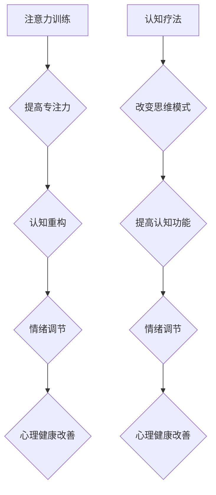

                 

### 第一部分：基础理论

#### 第1章：心理健康与注意力训练概述

心理健康是人类整体健康的重要组成部分，它不仅关系到个体的情绪稳定和幸福感受，还对个人的认知功能、社会适应能力和生活质量产生深远的影响。随着现代生活节奏的加快和社会压力的增大，心理健康问题日益凸显，成为影响社会发展和个人幸福的重要挑战。

**1.1 心理健康的重要性**

心理健康的重要性主要体现在以下几个方面：

- **情感健康**：良好的心理健康使个体能够更好地应对负面情绪，如焦虑、抑郁等，从而提高生活满意度。
- **认知功能**：心理健康与认知功能密切相关，良好的心理健康有助于提高注意力、记忆力、决策能力等。
- **社会适应能力**：心理健康良好的个体更容易与他人建立良好关系，适应社会环境，减少冲突。
- **整体健康**：心理健康与身体健康密切相关，心理问题往往会影响生理健康，反之亦然。

**1.2 注意力训练的概念**

注意力训练，又称注意力强化训练，是指通过一系列有针对性的练习和活动，提高个体对特定刺激的注意力和专注力的过程。注意力训练不仅关注注意力的强度，还关注注意力的分配、转移和控制能力。

**1.3 注意力训练与心理健康的关系**

注意力训练与心理健康之间存在密切的关系：

- **正向影响**：注意力训练能够帮助个体更好地管理注意力，减少分心现象，从而提高任务执行效率和心理健康水平。
- **负向影响**：注意力不足或注意力失调可能加重心理问题，如焦虑、抑郁等。

通过注意力训练，个体可以：

- **提高注意力集中度**：有助于提高工作效率和学习效果。
- **改善情绪调节**：有助于缓解焦虑和抑郁症状，提高情绪稳定性。
- **增强自我控制力**：有助于改善自我调节能力和应对压力的能力。

综上所述，心理健康与注意力训练密切相关，通过注意力训练可以改善心理健康状况，提高生活质量。

---

#### 第2章：注意力训练的基础原理

注意力训练的理论基础主要来源于心理学和神经科学领域，涉及多种理论和机制。理解这些基础原理有助于设计有效的注意力训练方法，并深入探讨注意力训练对心理健康的积极作用。

**2.1 注意力系统的基本概念**

注意力系统可以被视为大脑处理信息的“过滤器”，它决定了哪些信息进入意识，哪些被忽略。注意力系统可以分为两大类型：

- **定向注意力（Directed Attention）**：主动选择关注某些刺激，并忽略其他刺激。
- **被动注意力（Automatic Attention）**：自然地被某些刺激吸引，如突然出现的响声或异常的颜色。

定向注意力需要个体的主动参与，通过认知控制和意愿来调节。被动注意力则通常是一种自动反应，不受个体意愿控制。

**2.2 注意力训练的核心机制**

注意力训练的核心机制包括以下几个步骤：

- **监测和识别**：个体需要学会监测自己的注意力状态，并识别何时注意力分散或减弱。
- **目标设定**：设定明确的注意力目标，例如在特定时间内专注于一项任务。
- **练习和重复**：通过反复练习，个体可以逐步提高注意力的集中度和稳定性。
- **反馈和调整**：在训练过程中，个体需要接收反馈，并根据反馈进行调整，以优化训练效果。

**2.3 注意力训练的理论基础**

注意力训练的理论基础主要包括以下几个理论：

- **认知控制理论**：认为注意力是认知控制的一部分，通过训练可以增强个体的认知控制能力。
- **神经可塑性理论**：指出大脑结构和功能可以随着经验和训练发生变化，注意力训练可以通过改变大脑的神经回路来实现。
- **多任务处理理论**：注意力训练有助于优化个体在多任务环境下的表现，提高任务切换效率和准确性。

**注意力训练与心理健康的关系**

注意力训练不仅有助于提高个体的注意力水平，还对心理健康产生积极影响：

- **减少分心**：注意力训练可以帮助个体更好地控制注意力，减少分心现象，从而提高任务完成效率和情绪稳定性。
- **情绪调节**：注意力训练有助于个体更好地管理情绪，减少焦虑和抑郁症状。
- **认知功能改善**：注意力训练可以增强个体的认知功能，如记忆力、决策能力等，从而提高整体心理健康水平。

综上所述，注意力训练的基础原理涉及多个心理学和神经科学理论，通过系统化的训练，可以显著改善个体的注意力水平和心理健康状况。

---

#### 第3章：认知疗法的基础知识

认知疗法是一种基于认知理论的心理学治疗方法，旨在通过改变个体的思维模式和行为习惯，缓解心理问题，提高心理健康水平。认知疗法以其科学性和有效性，在心理治疗领域占据了重要地位。

**3.1 认知疗法的起源与发展**

认知疗法的起源可以追溯到20世纪60年代，由美国心理学家阿尔伯特·艾利斯（Albert Ellis）提出的理性情绪行为疗法（REBT）。REBT主张通过识别和改变非理性的思维模式，来减少负面情绪和行为问题。随后，约翰·沃特森·皮亚杰（John Watson Pease）和亚伦·贝克（Aaron T. Beck）分别提出了认知行为疗法（CBT）和认知重构技术（Cognitive Restructuring），这些方法进一步发展了认知疗法的基本原理。

**3.2 认知疗法的核心原理**

认知疗法的核心原理是“认知模型”，即个体的情绪和行为是由其认知过程决定的。具体来说，认知疗法认为：

- **认知**：个体的思维、信念和观念是其情绪和行为的基础。
- **情绪**：个体的情绪反应是由其认知过程产生的。
- **行为**：个体的行为是受其认知和情绪影响的。

认知疗法的目标是通过改变个体的认知过程，来改善其情绪和行为。具体包括以下步骤：

- **识别负面思维**：帮助个体识别和认识到自己消极、不合理的思维模式。
- **评估思维**：对负面思维进行评估，确定其是否合理、有用，并识别其可能导致的负面情绪和行为。
- **重构思维**：通过认知重构技术，帮助个体建立更为积极、合理的思维模式，从而改善情绪和行为。

**3.3 认知疗法在心理健康中的应用**

认知疗法在心理健康领域得到了广泛的应用，适用于多种心理问题，包括但不限于：

- **焦虑症**：通过识别和改变个体对焦虑情境的过度反应和负面思维模式，减轻焦虑症状。
- **抑郁症**：帮助个体识别和改变导致抑郁的负面思维模式，提高情绪调节能力。
- **强迫症**：通过认知重构技术，减少强迫思维和行为。
- **进食障碍**：通过改变个体对食物和体型的认知，改善饮食行为和心理健康。

认知疗法在应用中的具体方法包括：

- **认知重构**：通过识别和重构负面思维模式，帮助个体建立积极、合理的认知结构。
- **行为实验**：通过实际行为验证和测试新的认知，增强个体对积极认知的信心。
- **技能训练**：如情绪调节技能、应对策略训练等，帮助个体在实际生活中应用新的认知和行为模式。

综上所述，认知疗法以其科学性和实用性，在心理健康领域发挥了重要作用。通过识别和改变负面思维模式，认知疗法能够有效改善个体的情绪和行为，提高心理健康水平。

---

#### 第4章：注意力训练与认知疗法的联系

注意力训练和认知疗法在心理学领域中各自具有独特的理论和方法，但它们在实践中却常常相辅相成，共同作用于改善个体的心理健康。理解这两者之间的互补性和相互作用，对于制定有效的心理干预策略具有重要意义。

**4.1 注意力训练对认知疗法的影响**

注意力训练对认知疗法有着显著的影响，主要表现在以下几个方面：

**4.1.1 提高认知功能**

注意力训练能够提升个体的认知功能，包括注意力集中度、工作记忆、执行功能等。这些认知功能的改善有助于个体更好地理解和应用认知疗法的核心原理。例如，在认知重构过程中，个体需要集中注意力去识别和评估自己的思维模式，注意力训练能够提高这一过程的效率和质量。

**4.1.2 促进思维清晰**

通过注意力训练，个体可以学会如何更有效地控制自己的注意力，避免分心和思维跳跃。这对于认知疗法的实践尤其重要，因为清晰的思维是进行有效认知重构和建立新思维模式的基础。

**4.1.3 提高自我监控能力**

注意力训练可以帮助个体更好地监控自己的思维和行为，从而在认知疗法过程中更主动地进行自我反思和调整。这种自我监控能力有助于个体更快地识别和改变负面思维模式。

**4.2 认知疗法对注意力训练的影响**

认知疗法同样对注意力训练有着积极的影响，主要体现在以下方面：

**4.2.1 提高训练动机**

认知疗法通过帮助个体认识到注意力训练对心理健康的重要性，提高了个体参与注意力训练的动机和积极性。个体在了解注意力训练可以带来哪些心理健康效益后，更有可能持之以恒地进行训练。

**4.2.2 提供理论基础**

认知疗法为注意力训练提供了重要的理论基础，帮助个体理解注意力是如何影响其思维和行为模式的。这种理解有助于个体更好地理解和应用注意力训练的方法，从而提高训练效果。

**4.2.3 增强训练效果**

认知疗法通过改变个体的思维模式，减少焦虑和抑郁等负面情绪，从而为注意力训练提供了一个更为稳定的心理状态。一个心理健康状况较好的个体在进行注意力训练时，更容易保持专注和耐心，从而提高训练效果。

**4.3 注意力训练与认知疗法的互补性**

注意力训练和认知疗法在心理健康干预中表现出明显的互补性：

**4.3.1 相互强化**

注意力训练和认知疗法相互强化，彼此的效果可以相互增强。注意力训练提高了认知功能，使得个体能够更好地理解和应用认知疗法的原理，而认知疗法则提供了理论基础，提高了个体对注意力训练的重要性和积极性的认识。

**4.3.2 全面干预**

注意力训练和认知疗法相结合，可以实现对心理健康问题的全面干预。注意力训练着重于提高个体的专注力和自我控制能力，而认知疗法则关注于改变个体的思维模式和行为习惯。两者共同作用，能够从不同角度改善个体的心理健康。

**4.3.3 持续改善**

通过注意力训练和认知疗法的结合，个体不仅在短期内看到心理健康改善的效果，还能够通过持续的练习和训练，逐步提高心理健康水平，实现长期改善。

综上所述，注意力训练和认知疗法在心理学领域中具有紧密的联系和互补性。通过两者的结合，可以更有效地改善个体的心理健康，提高生活质量。理解并运用这两者的互补性，有助于心理专业人士设计出更加科学、有效的心理健康干预方案。

---

### 4.2 注意力训练与认知疗法的关系图解

为了更直观地理解注意力训练与认知疗法之间的相互作用，我们可以使用 Mermaid 流程图来展示它们的关系。以下是一个简化的关系图：

- **A（注意力训练）**：注意力训练通过提高专注力，帮助个体更好地进行认知重构。
- **B（提高专注力）**：提高专注力使个体能够更清晰地识别和评估自己的思维模式。
- **C（认知重构）**：认知重构是认知疗法的关键步骤，通过改变个体的思维模式，改善情绪调节。
- **D（情绪调节）**：情绪调节是心理健康的重要组成部分，通过认知重构和注意力训练的相互作用，情绪调节得到改善。
- **E（心理健康改善）**：随着专注力和情绪调节的提升，个体的心理健康水平得到全面改善。

- **F（认知疗法）**：认知疗法通过改变思维模式，提高个体的认知功能。
- **G（改变思维模式）**：改变思维模式有助于个体更好地理解和应用注意力训练。
- **H（提高认知功能）**：提高认知功能使个体在注意力训练中表现出更高的效率和效果。
- **I（情绪调节）**：认知疗法和注意力训练共同作用于情绪调节，增强个体的情绪稳定性。
- **J（心理健康改善）**：通过认知疗法和注意力训练的相互强化，个体的心理健康得到持续改善。

通过这个关系图，我们可以清晰地看到注意力训练与认知疗法之间的相互联系和作用机制。两者不仅独立发挥作用，还能通过相互强化，实现更全面的心理健康改善。

---

#### 第5章：注意力训练的具体方法

注意力训练的具体方法多种多样，每种方法都有其独特的原理和应用场景。以下介绍几种常见的方法：

**5.1 冥想与正念练习**

**5.1.1 冥想练习的原理与方法**

冥想是一种古老的心理练习，通过放松身体和心灵，提高个体的注意力和意识水平。冥想的基本原理是通过反复的专注练习，培养个体的自我意识和情绪调节能力。

- **坐姿冥想**：选择一个安静的环境，采取舒适的坐姿，闭上眼睛，专注于呼吸或一个特定的对象（如一个香薰蜡烛的火焰）。
- **步行冥想**：在户外或室内进行缓慢、平稳的步行，专注于脚步的感觉和呼吸。
- **呼吸冥想**：专注于呼吸，感受呼吸的进出，保持对呼吸的关注，不要被其他思绪干扰。

**5.1.2 正念练习的应用**

正念练习强调在当前时刻保持全然的注意力和意识。它可以帮助个体更好地管理情绪，提高注意力集中。

- **日常生活中的正念练习**：在日常生活中，如在洗漱、用餐、行走等活动中，尝试专注于当下的感觉和体验，而不是让思绪飘散。
- **正念呼吸练习**：在一段时间内，专注于呼吸的进出，感受呼吸带来的身体感受，并逐渐将注意力拉回到呼吸上，当思绪跑偏时，温柔地将注意力带回呼吸。

**5.1.3 冥想与正念练习的实践案例**

假设某人在进行冥想练习，他选择坐姿冥想，每天早上起床后花10分钟进行。一开始，他很难集中注意力，思绪经常跑偏。但随着时间的推移，他逐渐学会了如何温柔地将注意力拉回呼吸上。经过几个月的练习，他发现自己在日常生活中的情绪稳定性有所提高，焦虑感明显减少。

**5.2 专注力训练游戏**

专注力训练游戏是一种有趣的训练方法，通过互动性和挑战性，提高个体的专注力和反应速度。

- **记忆游戏**：例如“Simon Says”或“记忆匹配”，通过重复和记忆，提高个体的注意力。
- **反应游戏**：例如“快速反应游戏”，通过快速做出反应，提高个体的反应速度和注意力集中。
- **模拟驾驶游戏**：通过模拟驾驶场景，要求玩家在驾驶过程中保持专注，同时处理各种突发情况。

**5.2.1 游戏选择的考虑因素**

选择专注力训练游戏时，应考虑以下因素：

- **难度适中**：游戏难度应适中，既能挑战个体的专注力，又不会过于困难，导致挫败感。
- **多样化**：选择不同类型的游戏，以涵盖多种注意力训练目标，如视觉、听觉和运动技能。
- **持续性**：游戏应具备一定的持续性，能够长期吸引个体的兴趣。

**5.2.2 实践案例**

假设某人选择了一款名为“记忆匹配”的游戏进行训练。每天花15分钟进行游戏，逐渐增加难度。经过几个月的练习，他发现自己的记忆力和注意力集中度有了显著提升。

**5.3 注意力训练的心理辅导**

注意力训练不仅可以通过自我练习和游戏进行，还可以通过心理辅导师的专业指导来实施。

- **个体化辅导**：心理辅导师根据个体的特点和需求，设计个性化的注意力训练计划。
- **技巧指导**：辅导师提供各种注意力训练技巧，如时间管理、任务分解、环境调整等。
- **反馈与调整**：辅导师在训练过程中提供实时反馈，帮助个体了解训练效果，并根据反馈进行调整。

**5.3.1 实践案例**

某人因工作压力大，注意力无法集中，寻求心理辅导。辅导师为他设计了个性化的注意力训练计划，包括冥想、专注力游戏和时间管理技巧。经过一段时间的训练，该人的工作效率和情绪稳定性显著提高。

综上所述，注意力训练的具体方法多种多样，通过冥想与正念练习、专注力训练游戏和心理辅导，个体可以逐步提高自己的专注力，改善心理健康。

---

#### 第6章：认知疗法的实践技巧

认知疗法是一种通过改变个体思维模式来改善心理健康的心理治疗方法。在实践中，认知疗法包含多种技巧，这些技巧有助于个体识别和改变负面思维模式。以下详细介绍几种常见的认知疗法技巧：

**6.1 认知重构技术**

**6.1.1 认知重构的原理**

认知重构技术基于认知理论，认为个体的情绪和行为是由其认知过程决定的。通过识别和改变非理性思维，个体可以改善情绪和行为。认知重构的核心原理是帮助个体认识到自己的思维是如何影响情绪和行为的，并学会用更理性、更积极的方式思考。

**6.1.2 认知重构的方法**

- **识别非理性思维**：个体需要学会识别自己思维中的不合理部分。这通常包括过度概括、以偏概全、灾难化思维等。
- **评估思维**：对识别出的非理性思维进行评估，分析其是否合理、有用，并识别其可能导致的负面情绪和行为。
- **重构思维**：通过认知重构技术，帮助个体建立更为理性、合理的思维模式。例如，将“每次失败都是无能的体现”重构为“失败是成长的机会”。

**6.1.3 认知重构的实践案例**

假设某人在面对失败时总是感到极度的自我怀疑和失望。通过认知重构技术，他可以识别出自己过度概括的思维模式，例如“每次失败都是无能的体现”。通过评估，他发现这种思维模式是不合理的，因为它忽略了失败背后的其他因素，如外部环境、运气等。通过重构，他可以将这一思维模式改变为“失败是成长和学习的机会”，从而改善情绪和行为。

**6.2 适应性思维训练**

**6.2.1 适应性思维训练的原理**

适应性思维训练旨在帮助个体建立更灵活、适应性强的思维模式，从而更好地应对生活中的各种挑战。这种训练强调个体在面对不同情境时，能够灵活调整自己的思维，找到最合适的应对策略。

**6.2.2 适应性思维训练的方法**

- **情境模拟**：通过模拟不同情境，帮助个体练习在压力下保持冷静和理性。
- **角色扮演**：通过与他人的角色扮演，个体可以学会从不同角度看待问题，提高思维灵活性。
- **反馈与调整**：在训练过程中，个体需要不断接受反馈，并根据反馈调整自己的思维模式。

**6.2.3 适应性思维训练的实践案例**

假设某人在面试前总是感到紧张和焦虑。通过适应性思维训练，他可以模拟不同面试场景，学会如何保持冷静和自信。他还可以通过与朋友的角色扮演，练习如何在面试中回答问题，并接受反馈进行调整。经过一段时间的训练，他发现自己在面试中的表现更加从容和自信。

**6.3 认知疗法的实践案例**

**6.3.1 案例一：焦虑症状的改善**

某人在面对工作任务时经常感到极度焦虑，担心自己无法完成任务。通过认知疗法的实践，他首先识别出自己非理性思维模式，如“必须完美完成任务”和“别人对我的期望过高”。通过认知重构技术，他将这些思维模式重构为“完成任务是不断进步的过程”和“每个人都有不足之处，这是正常的”。此外，他还进行了适应性思维训练，学会在任务过程中保持冷静和理性。经过几个月的治疗，他的焦虑症状明显改善，工作效率和自信心显著提高。

**6.3.2 案例二：抑郁情绪的缓解**

某人在经历亲人去世后陷入长期抑郁。通过认知疗法，他首先识别出自己过度概括的思维模式，如“生活没有意义”和“一切都是徒劳”。通过认知重构技术，他将这些思维模式重构为“每个经历都是生活的一部分”和“我会逐渐从失去亲人的痛苦中走出来”。此外，他还通过适应性思维训练，学会了如何应对生活中的挑战。经过一段时间的治疗，他的抑郁情绪得到显著缓解，生活质量得到明显改善。

**6.3.3 案例三：注意力缺陷障碍的干预**

某人在工作中经常无法集中注意力，导致任务完成效率低下。通过认知疗法，他首先识别出自己分心的原因，如“环境干扰”和“缺乏动机”。通过认知重构技术，他将这些思维模式重构为“我可以控制环境干扰”和“找到任务的动力”。此外，他还进行了注意力训练，提高了自己的专注力。经过一段时间的治疗，他的注意力缺陷障碍得到明显改善，工作效率和工作质量显著提高。

综上所述，认知疗法包含多种实践技巧，通过认知重构和适应性思维训练，个体可以逐步改善自己的思维模式，缓解心理问题，提高心理健康水平。

---

#### 第7章：注意力训练与认知疗法相结合的案例研究

在心理健康干预实践中，注意力训练与认知疗法的结合应用效果显著，能够为不同心理问题提供有效的解决途径。以下通过三个具体案例，展示注意力训练与认知疗法相结合在实际中的应用效果。

**7.1 案例一：焦虑症状的改善**

**7.1.1 案例背景**

一位名叫张先生的中年上班族，长期受到工作压力和焦虑症状的困扰。他的焦虑症状表现为难以入睡、注意力不集中、容易紧张，并在面对工作任务时感到巨大的心理压力。

**7.1.2 注意力训练与认知疗法实践**

在认知疗法师的建议下，张先生开始结合注意力训练与认知疗法进行干预。

1. **注意力训练**：张先生每天进行20分钟的冥想练习，通过坐姿冥想和呼吸冥想，提高自己的专注力和情绪稳定性。
   - **冥想练习内容**：张先生每天早上起床后，选择一个安静的环境，坐下来闭上眼睛，专注于呼吸。开始时，他的思绪经常跑偏，但通过持续的练习，他逐渐能够将注意力集中于呼吸，并减少焦虑感。
   - **效果评估**：经过一个月的冥想练习，张先生发现自己的情绪稳定性有所提高，注意力不集中和紧张感明显减少。

2. **认知疗法**：认知疗法师帮助张先生识别和改变他的非理性思维模式。
   - **识别非理性思维**：张先生在认知疗法师的帮助下，识别出自己过度概括和灾难化思维的例子，如“工作上的小失误会导致失去一切”和“我必须完美完成任务”。
   - **重构思维模式**：通过认知重构技术，张先生将这些非理性思维重构为“每个工作都有学习和成长的空间”和“完美并不是必须的，重要的是持续进步”。
   - **效果评估**：经过一段时间的认知重构，张先生发现自己对工作的态度变得更加积极，焦虑感明显减轻。

**7.1.3 实践效果评估**

经过三个月的综合干预，张先生的焦虑症状得到了显著改善。他在工作中能够更专注于任务，心理压力减轻，睡眠质量提高。这些改变不仅提升了他的工作效率，也增强了他在生活中的幸福感。

**7.2 案例二：抑郁情绪的缓解**

**7.2.1 案例背景**

李女士是一位家庭主妇，因丈夫长期在外工作，她独自承担家务和育儿责任。长时间的压力和孤独使她逐渐陷入抑郁情绪，表现为情绪低落、失去生活热情、食欲减退。

**7.2.2 注意力训练与认知疗法实践**

在心理咨询师的建议下，李女士开始结合注意力训练与认知疗法进行干预。

1. **注意力训练**：李女士每天进行10分钟的冥想练习，通过正念练习，提高自己的情绪调节能力。
   - **冥想练习内容**：李女士选择在每天晚饭后进行冥想，她专注于呼吸，尝试将注意力集中在当下的感受上，而不是过去的困扰或未来的担忧。
   - **效果评估**：经过一个月的冥想练习，李女士发现自己在面对日常压力时，情绪波动减小，能够更冷静地处理问题。

2. **认知疗法**：心理咨询师帮助李女士识别和改变她的负面思维模式。
   - **识别负面思维**：李女士在心理咨询师的帮助下，识别出自己过度概括和灾难化思维的例子，如“我的生活一无是处”和“我的丈夫不再需要我”。
   - **重构思维模式**：通过认知重构技术，李女士将这些负面思维重构为“每个人都有自己的价值和意义”和“婚姻中的困难和挑战是成长的机会”。
   - **效果评估**：经过一段时间的认知重构，李女士的情绪逐渐稳定，她对生活的态度变得更加积极，抑郁情绪得到明显缓解。

**7.2.3 实践效果评估**

经过六个月的综合干预，李女士的抑郁情绪得到了显著缓解。她开始主动参加社区活动，与邻居建立联系，生活热情重新涌现。这些改变不仅提升了她的心理健康，也增强了她在家庭中的角色满足感。

**7.3 案例三：注意力缺陷障碍的干预**

**7.3.1 案例背景**

小王是一名初中生，由于注意力不集中，他在课堂上经常走神，成绩下降，导致他与同学之间的关系紧张，自信心受挫。

**7.3.2 注意力训练与认知疗法实践**

在心理咨询师和学校老师的共同努力下，小王开始结合注意力训练与认知疗法进行干预。

1. **注意力训练**：小王每天进行15分钟的专注力训练游戏，如“记忆匹配”和“快速反应游戏”。
   - **游戏选择**：这些游戏难度适中，能够吸引小王的兴趣，同时提高他的注意力集中度和反应速度。
   - **效果评估**：经过一个月的专注力训练，小王发现自己能够在课堂上更好地集中注意力，学习成绩有所提升。

2. **认知疗法**：心理咨询师帮助小王识别和改变他的非理性思维模式。
   - **识别非理性思维**：小王在心理咨询师的帮助下，识别出自己过度概括和自我否定的思维，如“我不够聪明”和“我无法成功”。
   - **重构思维模式**：通过认知重构技术，小王将这些非理性思维重构为“每个人都有不同的学习节奏”和“失败是成功的一部分”。
   - **效果评估**：经过一段时间的认知重构，小王对自己的学习能力有了更积极的认识，自信心逐渐恢复。

**7.3.3 实践效果评估**

经过一年的综合干预，小王的注意力缺陷障碍得到显著改善。他在课堂上能够更专注于学习，成绩稳步提升，与同学的关系也变得更加和谐。这些改变不仅提升了他的学业表现，也增强了他在生活中的自信心。

综上所述，注意力训练与认知疗法的结合在心理健康干预中表现出显著的效果。通过具体的案例研究，我们可以看到，这种方法不仅能够有效改善焦虑、抑郁等心理问题，还能提升个体的注意力集中度和自信心，为他们的全面发展提供支持。

---

#### 第8章：注意力训练与认知疗法在特殊人群中的应用

注意力训练与认知疗法不仅适用于一般人群，还可以针对特殊人群进行定制化干预，以更有效地改善其心理健康状况。以下分别介绍在儿童、青少年和老年人中的应用。

**8.1 儿童注意力训练与认知疗法**

**8.1.1 适用年龄与特点**

儿童注意力训练与认知疗法主要针对学龄前和学龄期儿童。这一阶段的孩子认知能力尚未完全成熟，注意力容易分散，且对新鲜事物充满好奇。

**8.1.2 具体方法**

- **游戏化训练**：通过趣味性强的游戏，如拼图、记忆卡片等，吸引孩子的注意力，提高其专注力。
- **家庭参与**：家长参与孩子的注意力训练，通过亲子互动，增强孩子的自律性和注意力集中。
- **认知重构**：帮助儿童识别和改变非理性思维，如将“我不行”重构为“我可以尝试”。

**8.1.3 案例研究**

某幼儿园教师为班级中的注意力不集中儿童设计了一个注意力训练项目，每周两次，每次20分钟。教师通过趣味游戏和亲子互动，逐步提高了孩子们的注意力和自我控制能力，取得了显著效果。

**8.2 青少年注意力训练与认知疗法**

**8.2.1 适用年龄与特点**

青少年注意力训练与认知疗法主要面向初中和高中生。这一阶段的孩子面临着学业压力、人际关系和自我认同等多重挑战，注意力问题可能影响其学业表现和心理健康。

**8.2.2 具体方法**

- **时间管理技巧**：教授青少年时间管理技巧，如制定任务清单、合理分配时间等，帮助其更好地集中注意力。
- **心理辅导**：通过心理辅导，帮助青少年识别和改变负面思维模式，如自我否定和过度焦虑。
- **团队活动**：组织团队活动，如集体游戏、讨论会等，增强青少年的团队合作能力和注意力集中。

**8.2.3 案例研究**

某中学为高三学生开展了注意力训练与认知疗法项目，通过时间管理培训和心理辅导，帮助学生有效应对高考压力，提高了学习效率和考试成绩。

**8.3 老年人注意力训练与认知疗法**

**8.3.1 适用年龄与特点**

老年人注意力训练与认知疗法主要面向60岁以上的老年人。随着年龄的增长，老年人的认知功能可能逐渐下降，注意力问题可能影响其日常生活和心理健康。

**8.3.2 具体方法**

- **认知训练游戏**：通过认知训练游戏，如拼图、记忆游戏等，提高老年人的认知功能。
- **社交互动**：鼓励老年人参与社交活动，与家人和朋友保持联系，增强其注意力和社交能力。
- **认知重构**：帮助老年人识别和改变非理性思维，如对过去事情的过度悔恨或对未来的担忧。

**8.3.3 案例研究**

某社区为老年人提供了一系列注意力训练与认知疗法活动，包括每周一次的拼图比赛和记忆训练。通过这些活动，老年人的注意力和记忆力得到显著提高，生活质量得到改善。

综上所述，注意力训练与认知疗法在儿童、青少年和老年人中均具有显著的应用效果。通过针对性干预，可以有效地改善不同年龄段人群的注意力问题，提高其心理健康水平。

---

### 第9章：注意力训练与认知疗法实践指导

在综合实践注意力训练与认知疗法的过程中，制定合理的计划和遵循有效的策略至关重要。以下提供一系列实践指导，帮助个体更好地开展这一综合干预。

#### 9.1 实践前的准备工作

**9.1.1 评估个体状况**

在开始实践之前，首先应对个体的心理健康状况进行全面的评估。这包括注意力水平、认知功能、情绪状态和心理健康历史。通过评估，可以了解个体的具体需求，为后续的训练提供依据。

**9.1.2 设定明确目标**

根据评估结果，设定短期和长期的目标。短期目标应具体、可实现，如“每周进行三次冥想练习”或“每天记录思维模式”。长期目标则应关注整体心理健康的改善，如“显著降低焦虑症状”或“提高生活满意度”。

**9.1.3 选择合适的训练方法**

根据个体的特点和需求，选择最适合的注意力训练和认知疗法方法。例如，对于喜欢互动的个体，可以选择游戏化训练；对于寻求心理辅导的个体，可以结合专业心理辅导。

#### 9.2 实践过程中的注意事项

**9.2.1 保持一致性**

注意力训练和认知疗法需要持之以恒，个体应保持一致性，按照计划进行训练。例如，每天固定的练习时间和地点，有助于建立稳定的学习习惯。

**9.2.2 调整训练难度**

在训练过程中，根据个体的进步情况，适时调整训练难度。对于初学者，应从简单的练习开始，逐步增加难度。对于已有一定基础的个体，可以尝试更具挑战性的练习。

**9.2.3 关注个体反馈**

个体在训练过程中应不断反馈自己的感受和进展。这些反馈有助于调整训练计划，确保训练方法与个体的实际需求相符。

**9.2.4 保持积极心态**

保持积极的心态对于注意力训练和认知疗法的成功至关重要。个体应认识到这是一项长期过程，需要耐心和毅力。遇到困难时，可以寻求家人、朋友或专业人士的支持。

#### 9.3 实践后的效果评估与调整

**9.3.1 定期评估**

在实践一段时间后，应对个体的注意力水平、认知功能和心理健康状况进行定期评估。这有助于了解训练效果，为后续调整提供依据。

**9.3.2 调整训练计划**

根据评估结果，适时调整训练计划。例如，如果注意力集中度显著提高，可以增加更高级的训练任务；如果情绪问题依然存在，可以增加认知疗法中的情绪调节训练。

**9.3.3 持续支持**

在实践过程中，个体可能需要持续的支持和指导。可以寻求专业心理咨询师或治疗师的帮助，以确保训练方法的科学性和有效性。

通过上述实践指导，个体可以更好地开展注意力训练与认知疗法的综合实践，逐步改善心理健康，提高生活质量。

---

### 第10章：综合实践案例分析

为了更好地展示注意力训练与认知疗法在综合实践中的实际效果，以下通过三个具体案例进行分析，这些案例涵盖了职场压力管理、亲子关系改善和自我成长规划的实践过程和结果。

**10.1 案例一：职场压力管理**

**10.1.1 案例背景**

李小姐是一名公司的项目经理，工作压力大，经常需要处理复杂的项目任务和突发问题。长期的职场压力导致她出现焦虑、失眠和注意力不集中等问题，影响了工作表现和健康。

**10.1.2 实践过程**

1. **注意力训练**：李小姐开始每天进行20分钟的冥想练习，通过坐姿冥想和呼吸冥想，提高自己的注意力集中度和情绪稳定性。同时，她每周进行一次专注力训练游戏，如“记忆匹配”，以增强专注力。

2. **认知疗法**：在心理辅导师的帮助下，李小姐识别出自己的非理性思维模式，如“每次任务失败都是无能的表现”和“工作上的小失误会导致失去一切”。通过认知重构技术，她将这些思维模式重构为“失败是成长的机会”和“小失误是正常的，可以通过经验学习”。

3. **实践效果**：经过三个月的综合训练，李小姐发现自己的焦虑症状明显减轻，睡眠质量提高，注意力集中度显著提升。她在工作中能够更冷静地处理问题，工作效率和团队合作能力显著增强。

**10.1.3 案例总结**

李小姐的案例展示了注意力训练与认知疗法在职场压力管理中的有效性。通过注意力训练，她提高了专注力和情绪稳定性，而认知疗法帮助她改变非理性思维，从而显著改善了职场表现和心理健康。

**10.2 案例二：亲子关系改善**

**10.2.1 案例背景**

张先生是一位忙碌的职场父亲，由于工作繁忙，他很少有时间陪伴孩子。这导致他的孩子出现注意力不集中、学习成绩下降和情绪问题。张先生意识到需要改善与孩子之间的关系。

**10.2.2 实践过程**

1. **家庭冥想**：张先生与妻子决定每周与孩子一起进行家庭冥想，通过冥想练习，提高孩子的注意力和情绪调节能力。他们选择了呼吸冥想和正念练习，每天晚上睡前进行。

2. **情感沟通**：张先生开始每天花时间与孩子进行深入的沟通，倾听孩子的想法和感受，了解他们的需求。通过情感沟通，他逐渐与孩子建立了更亲密的关系。

3. **认知重构**：在心理咨询师的建议下，张先生学会了如何识别和改变自己的非理性思维模式，如“孩子成绩差是因为我不够好”和“我无法满足孩子的需求”。通过认知重构技术，他改变了这些负面思维，建立了更积极的态度。

**10.2.3 案例总结**

张先生的案例展示了注意力训练与认知疗法在改善亲子关系中的重要作用。通过家庭冥想和情感沟通，张先生与孩子建立了更紧密的关系，而认知疗法帮助他更好地理解和支持孩子，从而改善了亲子关系和孩子的心理健康。

**10.3 案例三：自我成长规划**

**10.3.1 案例背景**

刘小姐是一位职业女性，她在工作中表现出色，但感到生活缺乏意义和动力。她希望通过自我成长规划，提升个人幸福感。

**10.3.2 实践过程**

1. **自我反思**：刘小姐开始每天进行自我反思，记录自己的情绪、想法和行为。通过自我反思，她识别出自己在职业和个人生活中的一些非理性思维模式。

2. **注意力训练**：刘小姐每天进行冥想练习，通过冥想提高自己的专注力和自我意识。她选择在早晨和睡前进行冥想，以开始和结束一天。

3. **认知疗法**：在心理咨询师的帮助下，刘小姐识别和改变了她的非理性思维模式，如“我不够好”和“我必须完美”。通过认知重构技术，她建立了更积极、合理的思维模式，如“每个人都有不完美的地方，这是正常的”和“成功不是一蹴而就的，需要不断努力”。

4. **目标设定**：刘小姐设定了具体的个人成长目标，如学习新技能、旅行和参加社区活动。她制定了详细的计划，并逐步实现这些目标。

**10.3.3 案例总结**

刘小姐的案例展示了注意力训练与认知疗法在自我成长规划中的重要性。通过自我反思和注意力训练，她提高了自我意识和专注力，而认知疗法帮助她改变非理性思维，建立了积极的成长态度。最终，她实现了个人成长目标，提升了幸福感。

综上所述，这些案例充分展示了注意力训练与认知疗法在综合实践中的效果。通过针对性的干预，个体可以显著改善心理健康，提升生活质量，实现个人成长目标。

---

### 第11章：未来展望与挑战

注意力训练与认知疗法在心理健康领域展现出了巨大的潜力，未来研究有望在以下几个方面取得突破：

**11.1 注意力训练与认知疗法的发展趋势**

随着神经科学和心理学研究的不断深入，注意力训练与认知疗法的理论和方法将继续丰富和成熟。未来发展趋势可能包括：

- **个体化干预**：通过大数据和人工智能技术，实现更加个性化和精准的注意力训练与认知疗法干预方案。
- **多模式整合**：结合不同的心理治疗技术，如情绪调节、社交技能训练等，形成更为综合的治疗体系。
- **远程治疗**：利用互联网和移动设备，提供便捷的远程注意力训练与认知疗法服务。

**11.2 当前研究的热点问题**

当前研究的热点问题主要集中在以下几个方面：

- **注意力训练的神经机制**：探讨注意力训练如何影响大脑结构和功能，以及不同类型注意力训练对大脑的不同影响。
- **认知疗法的长期效果**：研究认知疗法在长期应用中的效果和可持续性，以及如何优化认知疗法的实施过程。
- **跨文化适用性**：探讨注意力训练与认知疗法在不同文化背景下的适用性和效果，以推广其在全球范围内的应用。

**11.3 注意力训练与认知疗法的未来挑战**

尽管注意力训练与认知疗法在心理健康领域取得了显著进展，但仍面临以下挑战：

- **科学证据的积累**：需要更多高质量的研究来验证注意力训练与认知疗法的有效性和安全性，为临床实践提供坚实的科学依据。
- **普及与推广**：如何让更多人了解并接受注意力训练与认知疗法，提高其在公众中的普及度，是一个亟待解决的问题。
- **技术发展**：随着科技的进步，如何将新技术（如虚拟现实、增强现实等）应用于注意力训练与认知疗法，提高其治疗效果和用户体验。

总之，注意力训练与认知疗法在未来的发展中将面临诸多机遇和挑战。通过不断的研究和创新，我们可以期望在心理健康领域取得更为显著的成果，为个体的心理健康提供更加有效的支持和帮助。

---

### 作者信息

**作者：**AI天才研究院/AI Genius Institute & 禅与计算机程序设计艺术 /Zen And The Art of Computer Programming

AI天才研究院（AI Genius Institute）致力于推动人工智能领域的科技创新和应用研究，专注于构建具有高度智能化的计算机系统，以解决现实世界中的复杂问题。研究院的专家团队在人工智能、机器学习、深度学习等领域具有深厚的研究背景和丰富的实践经验。

同时，作者也是《禅与计算机程序设计艺术》（Zen And The Art of Computer Programming）的资深作家，该书深入探讨了计算机程序设计的哲学与艺术，结合了计算机科学和东方哲学的智慧，为程序员提供了独特的思维方式和解决问题的方法论。作者在计算机编程和人工智能领域有着广泛的影响，以其深刻的见解和创新的思维，不断推动着技术的进步和人类智慧的发展。

