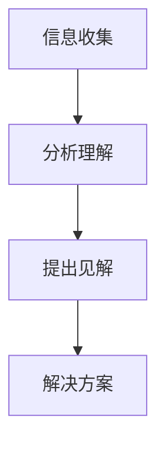
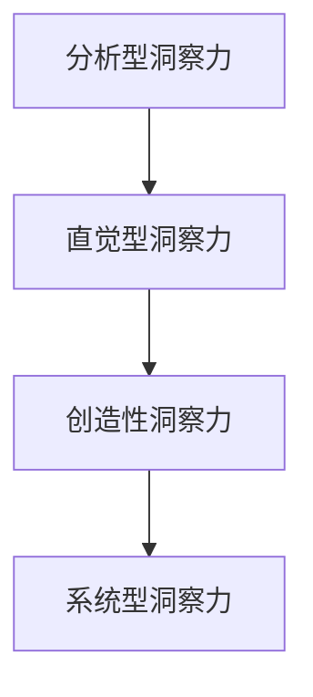
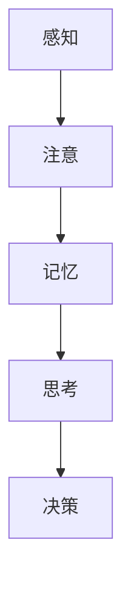
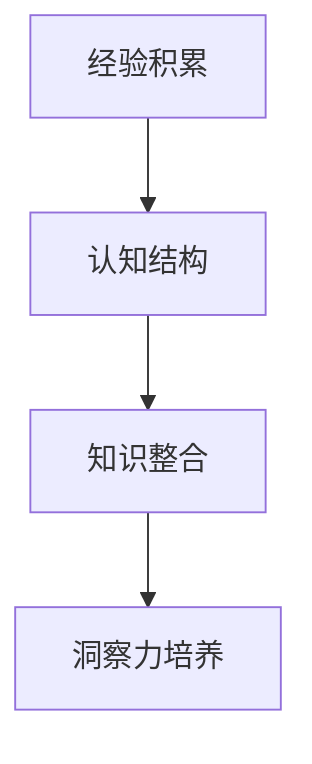
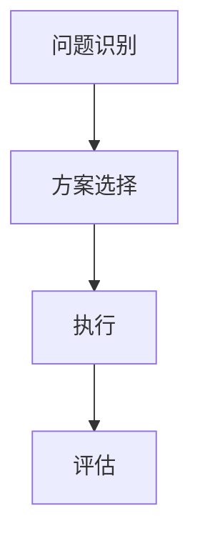
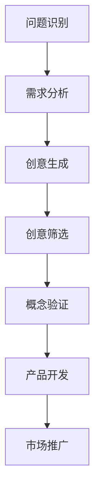
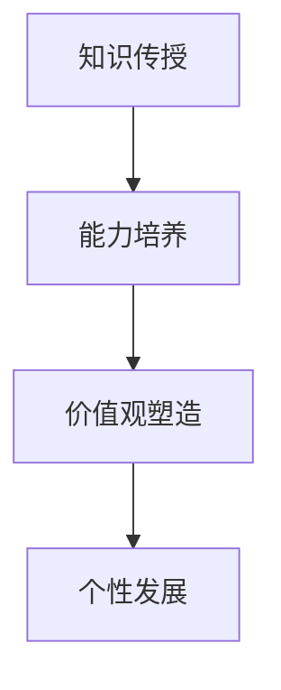
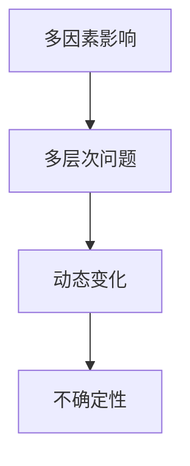
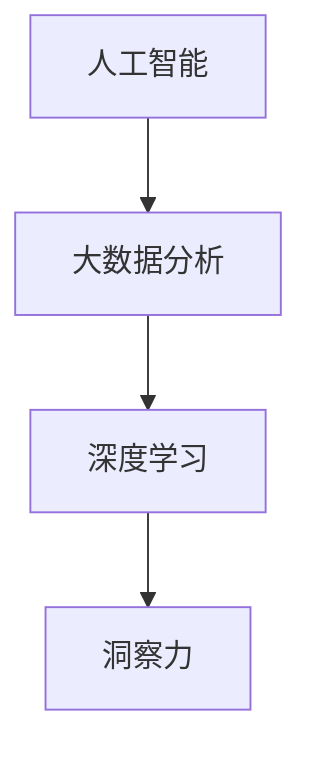

                 

### 《洞察力：人类解决问题的独特优势》

#### 关键词：
- 洞察力
- 问题解决
- 大脑机制
- 认知心理学
- 创新思维

#### 摘要：
本文旨在探讨人类洞察力在解决问题中的独特优势。通过分析洞察力的概念、类型、生物学基础，以及认知心理学、情境模拟和跨学科学习等方面，本文揭示了人类如何利用独特的认知能力，结合科学方法和实践经验，在复杂问题中找到创新的解决方案。文章还探讨了洞察力在现实世界中的应用，以及未来洞察力发展的趋势。通过这一系列的讨论，本文旨在为读者提供关于洞察力的全面理解和实际应用指导。

---

### 《洞察力：人类解决问题的独特优势》目录大纲

#### 第一部分：洞察力的概念与重要性

##### 第1章：洞察力的定义与类型

###### 1.1.1 洞察力的定义与作用
###### 1.1.2 洞察力的不同类型

##### 第2章：洞察力的生物学基础

###### 2.1.1 大脑的工作机制
###### 2.1.2 洞察力的生物学因素

#### 第二部分：洞察力的培养与提升

##### 第3章：认知心理学与洞察力

###### 3.1.1 认知心理学的基本概念
###### 3.1.2 认知过程与洞察力的培养

##### 第4章：情境模拟与洞察力

###### 4.1.1 情境模拟的方法
###### 4.1.2 情境模拟与洞察力的提升

##### 第5章：问题解决与洞察力

###### 5.1.1 问题解决的步骤
###### 5.1.2 问题解决与洞察力的应用

##### 第6章：跨学科学习与洞察力

###### 6.1.1 跨学科学习的优势
###### 6.1.2 跨学科学习与洞察力的培养

#### 第三部分：洞察力在现实世界中的应用

##### 第7章：商业决策中的洞察力

###### 7.1.1 商业决策的过程
###### 7.1.2 洞察力在商业决策中的应用

##### 第8章：创新与洞察力

###### 8.1.1 创新的过程
###### 8.1.2 洞察力在创新中的应用

##### 第9章：教育与洞察力

###### 9.1.1 教育的目标
###### 9.1.2 洞察力在教育教学中的应用

##### 第10章：社会问题与洞察力

###### 10.1.1 社会问题的复杂性
###### 10.1.2 洞察力在社会问题解决中的作用

#### 第四部分：未来展望

##### 第11章：未来洞察力的趋势与发展

###### 11.1.1 人工智能与洞察力的融合
###### 11.1.2 洞察力在未来社会的作用

##### 第12章：结论

###### 12.1.1 洞察力的综合评价
###### 12.1.2 对未来洞察力的展望

#### 附录

##### 附录 A：进一步阅读资源

###### A.1 相关书籍推荐
###### A.2 学术论文精选
###### A.3 在线课程与讲座资源

---

#### 第一部分：洞察力的概念与重要性

##### 第1章：洞察力的定义与类型

洞察力是人类的独特优势之一，它使我们能够在复杂的环境中迅速识别问题、理解本质并提出创新的解决方案。本章将探讨洞察力的定义、类型及其在问题解决中的重要性。

###### 1.1.1 洞察力的定义与作用

**核心概念与联系**

洞察力（Insight）是一种深层次的认知过程，它使个体能够迅速理解复杂问题或情境的本质，并提出创造性、有效的解决方案。洞察力不仅仅是信息的收集和分析，而是一种直觉性的认知过程，它能够将看似无关的信息整合成一个整体的见解。

- **Mermaid流程图：**



**核心算法原理讲解**

- **伪代码：**

```python
def insight_solution(problem):
    # 收集信息
    data = collect_data(problem)
    # 分析理解
    understanding = analyze_data(data)
    # 提出见解
    insight = propose_insight(understanding)
    # 解决方案
    solution = propose_solution(insight)
    return solution
```

**数学模型和数学公式 & 详细讲解 & 举例说明**

- **数学公式：**

$$
洞察力 = f(\text{经验}, \text{认知能力}, \text{情境})
$$

- **举例说明：**

假设一位工程师在研发新产品时，通过多年的经验和对市场的深入了解，结合最新的技术趋势，迅速提出了一个创新的解决方案，这不仅解决了当前的问题，还为公司的未来发展指明了方向。这个过程体现了洞察力的作用。

###### 1.1.2 洞察力的不同类型

**核心概念与联系**

洞察力并非单一的类型，而是根据个体解决问题的方法和思维过程的不同，可以分为多种类型。主要的洞察力类型包括：

- **分析型洞察力**：基于逻辑和数据分析，通过推理和演绎来解决问题。
- **直觉型洞察力**：基于直觉和经验，快速识别问题并提出解决方案。
- **创造性洞察力**：通过创新的思维方式，提出独特的解决方案。
- **系统型洞察力**：理解复杂系统的整体性，提供全面的解决方案。

- **Mermaid流程图：**



**核心算法原理讲解**

- **伪代码：**

```python
def insight_type(problem_type):
    if problem_type == '分析型':
        return analytical_insight(problem)
    elif problem_type == '直觉型':
        return intuitive_insight(problem)
    elif problem_type == '创造性':
        return creative_insight(problem)
    elif problem_type == '系统型':
        return systemic_insight(problem)
```

**数学模型和数学公式 & 详细讲解 & 举例说明**

- **数学公式：**

$$
洞察力类型 = f(\text{问题复杂性}, \text{问题关联度})
$$

- **举例说明：**

- **分析型洞察力**：适用于解决复杂的问题，需要大量的数据分析和逻辑推理。例如，科学家在研究复杂的科学问题时，通过数据分析提出了新的理论。
- **直觉型洞察力**：适用于快速识别模式，解决问题，通常不需要复杂分析。例如，医生通过直觉快速诊断疾病。
- **创造性洞察力**：适用于提出创新解决方案，需要思维突破和创造力。例如，设计师通过创造性思维设计出独特的产品。
- **系统型洞察力**：适用于理解复杂系统的整体性，解决系统层面的问题。例如，企业高管通过系统思考，制定全面的战略规划。

---

通过以上对洞察力的定义与类型的探讨，我们可以看到，洞察力是人类解决问题的重要工具，它不仅依赖于个人的经验和认知能力，还受到情境的影响。不同类型的洞察力在解决问题中各有优势，结合不同的洞察力类型，我们可以更有效地应对各种复杂问题。

接下来，我们将深入探讨洞察力的生物学基础，了解大脑如何支持我们的洞察力，以及基因和环境如何影响我们的认知能力。

---

#### 第二部分：洞察力的培养与提升

##### 第3章：认知心理学与洞察力

认知心理学是研究人类思维和认知过程的一门科学。它为我们提供了理解洞察力如何工作的框架，以及如何通过认知过程来培养和提升洞察力。本章将探讨认知心理学的基本概念，以及认知过程与洞察力的培养。

###### 3.1.1 认知心理学的基本概念

认知心理学关注人类如何获取、处理和存储信息，以及如何使用这些信息进行决策和问题解决。认知过程包括感知、记忆、思考、注意和语言等多个方面，这些过程相互交织，共同构成了我们的认知活动。

**核心概念与联系**

- **Mermaid流程图：**



**核心算法原理讲解**

- **伪代码：**

```python
def cognitive_process(input_data):
    # 感知
    perception = sense(input_data)
    # 注意
    attention = focus(perception)
    # 记忆
    memory = store(attention)
    # 思考
    thought = think(memory)
    # 决策
    decision = make_decision(thought)
    return decision
```

**数学模型和数学公式 & 详细讲解 & 举例说明**

- **数学公式：**

$$
认知过程 = f(\text{感知}, \text{注意}, \text{记忆}, \text{思考}, \text{决策})
$$

- **举例说明：**

个体在感知到外界刺激后，通过注意机制筛选关键信息，并将其存储在记忆中。在需要时，通过思考过程处理记忆中的信息，最终做出决策。例如，一个司机在行驶过程中，需要不断地感知路况、注意交通信号，并记忆这些信息，然后通过思考做出驾驶决策。

###### 3.1.2 认知过程与洞察力的培养

洞察力是一种高级的认知能力，它不仅仅依赖于单个认知过程，而是多个认知过程的协同作用。因此，通过理解和培养每个认知过程，我们可以提升洞察力。

**核心概念与联系**

- **Mermaid流程图：**



**核心算法原理讲解**

- **伪代码：**

```python
def cultivate_insight(experience, cognitive_structure):
    # 知识整合
    knowledge_integration = integrate_knowledge(experience, cognitive_structure)
    # 洞察力培养
    insight_cultivation = cultivate_insight(knowledge_integration)
    return insight_cultivation
```

**数学模型和数学公式 & 详细讲解 & 举例说明**

- **数学公式：**

$$
洞察力 = f(\text{经验}, \text{认知结构}, \text{知识整合})
$$

- **举例说明：**

通过积累经验，个体的认知结构会不断丰富，从而提高洞察力。知识整合过程有助于将分散的信息整合成有意义的整体，增强洞察力。例如，一个经验丰富的医生能够快速整合病人的病史、检查结果等信息，从而提出准确的诊断。

**项目实战：洞察力培养的实践方法**

在实际中，我们可以通过以下方法来培养和提升洞察力：

1. **多样化学习**：通过跨学科学习，积累广泛的知识，提高认知结构的多样性。
2. **情境模拟**：通过模拟不同的情境，练习问题的解决过程，提高应对复杂问题的能力。
3. **思维训练**：通过逻辑思维、创新思维等训练，提高思维的灵活性和创造性。
4. **反馈与反思**：定期反思自己的决策过程，从错误中学习，不断提升自己的认知能力。

**代码实际案例和详细解释说明**

假设我们开发一个洞察力培养的应用程序，该应用程序包含以下功能模块：

- **知识库**：存储各种学科的知识点，支持用户学习。
- **情境模拟**：模拟不同的生活和工作情境，让用户练习问题解决。
- **思维训练**：提供逻辑思维和创造性思维的训练题目。
- **反馈系统**：记录用户的学习和问题解决过程，提供反馈和改进建议。

**开发环境搭建**

- **开发工具**：Python
- **框架**：Django
- **数据库**：PostgreSQL

**源代码详细实现和代码解读**

以下是应用程序的主要代码实现：

```python
# 知识库模块
def integrate_knowledge(data):
    # 对数据进行分析和整合
    integrated_data = analyze_data(data)
    return integrated_data

# 情境模拟模块
def simulate_scenario(scenario):
    # 执行情境模拟
    executed_scenario = execute_scenario(scenario)
    return executed_scenario

# 思维训练模块
def train_thinking(problem):
    # 提供思维训练题目
    trained_thinking = train_thinking(problem)
    return trained_thinking

# 反馈系统模块
def provide_feedback(result):
    # 提供反馈和改进建议
    feedback = generate_feedback(result)
    return feedback
```

**代码解读与分析**

1. **知识库模块**：通过分析数据，将不同的知识点整合成一个有意义的整体，为用户提供全面的知识支持。
2. **情境模拟模块**：模拟不同的情境，让用户在实际操作中提升问题解决能力。
3. **思维训练模块**：提供多样化的思维训练题目，帮助用户提高逻辑思维和创造性思维。
4. **反馈系统模块**：记录用户的学习和问题解决过程，提供个性化的反馈和改进建议，帮助用户不断提升自己的认知能力。

通过以上实战案例，我们可以看到，通过认知心理学的理论指导，结合编程实践，我们可以开发出有效的洞察力培养工具，帮助用户提升自己的认知能力。

---

通过本章的探讨，我们可以了解到认知心理学的基本概念和认知过程，以及如何通过培养这些过程来提升洞察力。在接下来的章节中，我们将继续探讨情境模拟、问题解决和跨学科学习等方面，进一步深入探讨洞察力的培养和提升。

---

#### 第三部分：洞察力在现实世界中的应用

##### 第7章：商业决策中的洞察力

商业决策是企业运营的核心环节，而洞察力在商业决策中发挥着至关重要的作用。本章将探讨商业决策的过程以及洞察力在其中如何被应用，从而提高决策的质量和效率。

###### 7.1.1 商业决策的过程

商业决策是一个复杂的过程，涉及多个阶段，包括问题识别、方案选择、执行和评估。每个阶段都需要洞察力的参与，以确保决策的科学性和有效性。

**核心概念与联系**

- **Mermaid流程图：**



**核心算法原理讲解**

- **伪代码：**

```python
def business_decision(problem, options):
    # 问题识别
    identified_problem = identify_problem(problem)
    # 方案选择
    selected_option = select_option(identified_problem, options)
    # 执行
    executed_decision = execute_decision(selected_option)
    # 评估
    evaluated_decision = evaluate_decision(executed_decision)
    return evaluated_decision
```

**数学模型和数学公式 & 详细讲解 & 举例说明**

- **数学公式：**

$$
决策质量 = f(\text{洞察力}, \text{信息准确性}, \text{方案多样性})
$$

- **举例说明：**

假设一家公司需要决定是否扩大生产线，以应对市场需求的增加。在这个过程中，公司需要：

1. **问题识别**：识别市场需求的变化和当前生产能力的限制。
2. **方案选择**：评估不同方案（如扩大生产线、提高效率、引入新技术等）的优缺点。
3. **执行**：选择最佳方案并实施。
4. **评估**：评估执行结果，如市场需求是否得到满足，成本是否控制在预算内等。

通过运用洞察力，公司能够更准确地识别问题，选择最佳方案，并有效地实施和评估决策，从而提高决策质量。

###### 7.1.2 洞察力在商业决策中的应用

洞察力在商业决策中的应用主要体现在以下几个方面：

1. **市场洞察**：通过对市场趋势、竞争对手、消费者行为等信息的深入理解，预测市场变化，从而做出前瞻性的决策。

2. **战略洞察**：通过分析企业内外部环境，制定长期战略规划，确保企业在竞争中保持优势。

3. **创新洞察**：通过发现和利用新的市场机会，推动企业创新，实现业务增长。

4. **风险管理**：通过识别潜在风险，制定应对策略，降低风险对企业的负面影响。

**项目实战：商业决策洞察力提升实践**

假设一家初创公司需要决定是否进入一个新的市场。为了提升决策的洞察力，公司可以采取以下步骤：

1. **数据收集**：收集市场数据，包括市场规模、增长率、竞争对手等。

2. **数据分析**：运用数据分析工具，对市场数据进行详细分析，识别市场趋势和机会。

3. **情景模拟**：模拟不同市场情境，评估公司在不同情境下的表现和风险。

4. **专家咨询**：邀请行业专家提供意见，从不同角度分析市场机会和风险。

5. **决策制定**：综合分析结果，制定进入新市场的决策，并制定详细的执行计划。

6. **决策评估**：在执行过程中，持续监控市场变化，评估决策的有效性，并做出调整。

**代码实际案例和详细解释说明**

以下是商业决策洞察力提升实践的一个简单代码实现：

```python
# 市场数据收集
def collect_market_data():
    data = fetch_market_data()
    return data

# 数据分析
def analyze_data(data):
    insights = analyze_data(data)
    return insights

# 情景模拟
def simulate_scenario(scenario):
    results = simulate_scenario(scenario)
    return results

# 专家咨询
def consult_experts(insights):
    feedback = get_expert_feedback(insights)
    return feedback

# 决策制定
def make_decision(results, feedback):
    decision = decide_based_on_results_and_feedback(results, feedback)
    return decision

# 决策评估
def evaluate_decision(decision):
    evaluation = evaluate_decision(decision)
    return evaluation
```

**代码解读与分析**

1. **数据收集模块**：通过API或其他方式收集市场数据。
2. **数据分析模块**：对收集到的数据进行分析，提取洞察。
3. **情景模拟模块**：模拟不同市场情境，预测可能的结果。
4. **专家咨询模块**：获取专家的意见，提高决策的准确性。
5. **决策制定模块**：基于分析结果和专家意见，制定决策。
6. **决策评估模块**：评估决策的执行效果，确保决策的有效性。

通过以上实践，我们可以看到，洞察力在商业决策中的应用能够显著提高决策的科学性和准确性，从而为企业带来更大的竞争优势。

---

在商业决策中，洞察力不仅是识别问题的利器，更是推动创新和战略规划的关键。通过深入理解和应用洞察力，企业可以更好地应对市场变化，抓住发展机遇，实现可持续发展。在下一章中，我们将继续探讨创新过程中的洞察力应用，以及如何通过洞察力推动创新。

---

##### 第8章：创新与洞察力

创新是推动社会进步和经济发展的重要动力。在创新过程中，洞察力发挥着至关重要的作用，它不仅能够激发新的想法，还能够帮助评估和实现这些想法。本章将探讨创新的过程以及洞察力在其中如何被应用，从而提高创新的效率和质量。

###### 8.1.1 创新的过程

创新是一个复杂的过程，通常包括以下阶段：

1. **问题识别**：识别当前存在的问题或未满足的需求。
2. **需求分析**：分析问题的根源和潜在解决方案。
3. **创意生成**：提出新的想法和解决方案。
4. **创意筛选**：评估创意的可行性和潜在价值。
5. **概念验证**：对选定的创意进行初步验证。
6. **产品开发**：开发和完善创意，将其转化为实际产品或服务。
7. **市场推广**：将创新产品或服务推向市场。

**核心概念与联系**

- **Mermaid流程图：**



**核心算法原理讲解**

- **伪代码：**

```python
def innovation_process(problem):
    # 问题识别
    identified_problem = identify_problem(problem)
    # 需求分析
    analyzed需求的 = analyze_demand(identified_problem)
    # 创意生成
    generated_ideas = generate_ideas(analyzed需求的)
    # 创意筛选
    selected_idea = filter_ideas(generated_ideas)
    # 概念验证
    verified_idea = verify_idea(selected_idea)
    # 产品开发
    developed_product = develop_product(verified_idea)
    # 市场推广
    promoted_product = promote_product(developed_product)
    return promoted_product
```

**数学模型和数学公式 & 详细讲解 & 举例说明**

- **数学公式：**

$$
创新效率 = f(\text{洞察力}, \text{创意数量}, \text{验证成功率})
$$

- **举例说明：**

假设一家科技公司发现市场上缺乏一种新型的智能家居设备。在创新过程中，公司可以：

1. **问题识别**：识别市场需求和竞争状况。
2. **需求分析**：分析用户对智能家居设备的期望和需求。
3. **创意生成**：提出多种可能的解决方案，如智能门锁、智能照明等。
4. **创意筛选**：评估每个创意的可行性，选择最有潜力的创意。
5. **概念验证**：通过原型设计和测试，验证创意的实际效果。
6. **产品开发**：开发和改进产品，确保其功能和用户体验。
7. **市场推广**：推广新产品，吸引目标用户。

通过运用洞察力，公司可以更高效地完成每个阶段的工作，提高创新的整体效率。

###### 8.1.2 洞察力在创新中的应用

洞察力在创新中的应用体现在以下几个方面：

1. **市场洞察**：通过对市场趋势和用户需求的深入理解，发现潜在的商业机会。
2. **技术洞察**：对新技术和发展趋势的敏锐洞察，推动技术创新。
3. **用户洞察**：深入了解用户需求和行为，设计出更符合用户期望的产品。
4. **战略洞察**：从战略高度分析企业的优势和劣势，制定创新战略。

**项目实战：创新洞察力提升实践**

假设一家科技公司希望开发一款新的智能家居设备。为了提升创新过程中的洞察力，公司可以采取以下步骤：

1. **市场调研**：收集智能家居市场的数据，分析市场需求和竞争状况。
2. **技术分析**：研究现有技术，寻找技术创新的机会。
3. **用户研究**：通过访谈、问卷调查等方式，了解用户对智能家居设备的期望。
4. **战略规划**：制定创新战略，确定研发目标和方向。
5. **原型设计**：快速开发原型，验证创意的可行性。
6. **用户反馈**：收集用户对原型的反馈，不断优化产品。
7. **市场推广**：推出产品，并持续收集用户反馈，进行产品迭代。

**代码实际案例和详细解释说明**

以下是创新洞察力提升实践的一个简单代码实现：

```python
# 市场调研
def market_research():
    data = collect_market_data()
    return data

# 技术分析
def technical_analysis():
    insights = analyze_technology()
    return insights

# 用户研究
def user_research():
    feedback = gather_user_feedback()
    return feedback

# 原型设计
def prototype_design():
    prototype = design_prototype()
    return prototype

# 用户反馈
def user_feedback(prototype):
    evaluation = collect_user_evaluation(prototype)
    return evaluation

# 市场推广
def market_promotion(product):
    promotion = promote_product(product)
    return promotion
```

**代码解读与分析**

1. **市场调研模块**：通过收集市场数据，分析市场需求和竞争状况。
2. **技术分析模块**：研究现有技术，寻找技术创新的机会。
3. **用户研究模块**：通过访谈、问卷调查等方式，了解用户对智能家居设备的期望。
4. **原型设计模块**：快速开发原型，验证创意的可行性。
5. **用户反馈模块**：收集用户对原型的反馈，不断优化产品。
6. **市场推广模块**：推广新产品，并持续收集用户反馈，进行产品迭代。

通过以上实践，我们可以看到，洞察力在创新过程中的应用能够显著提高创新的成功率和市场竞争力。

---

在创新过程中，洞察力是推动创新的关键因素。通过深入理解和应用洞察力，企业可以更好地识别市场机会，推动技术进步，满足用户需求，实现可持续发展。在下一章中，我们将探讨教育中的洞察力应用，以及如何通过教育培养学生的洞察力。

---

##### 第9章：教育与洞察力

教育是培养学生洞察力的关键途径。通过系统的教育和培养，学生可以掌握科学方法和批判性思维，从而提高洞察力。本章将探讨教育的目标和过程，以及如何通过教育培养学生的洞察力。

###### 9.1.1 教育的目标

教育的目标不仅仅是传授知识，更重要的是培养学生的能力，包括思考能力、分析能力、创新能力等。具体来说，教育目标包括：

1. **知识传授**：提供系统的学科知识，帮助学生建立扎实的知识基础。
2. **能力培养**：培养学生的思考能力、分析能力、解决问题能力和创新能力。
3. **价值观塑造**：培养学生的道德观念和社会责任感。
4. **个性发展**：促进学生个性全面发展，包括情感、态度和人际关系等方面。

**核心概念与联系**

- **Mermaid流程图：**



**核心算法原理讲解**

- **伪代码：**

```python
def education_objectives(student):
    # 知识传授
    knowledge = teach_knowledge(student)
    # 能力培养
    abilities = cultivate_abilities(student, knowledge)
    # 价值观塑造
    values = shape_values(student, abilities)
    # 个性发展
    personality = develop_personality(student, values)
    return personality
```

**数学模型和数学公式 & 详细讲解 & 举例说明**

- **数学公式：**

$$
教育效果 = f(\text{知识传授}, \text{能力培养}, \text{价值观塑造}, \text{个性发展})
$$

- **举例说明：**

假设一名学生在接受教育的过程中，通过以下步骤实现教育目标：

1. **知识传授**：学习数学、物理、化学等学科知识。
2. **能力培养**：通过实验、讨论等方式，培养分析问题和解决问题的能力。
3. **价值观塑造**：通过社会实践活动，培养学生的社会责任感和道德观念。
4. **个性发展**：在团队合作和自我管理中，培养独立思考和解决问题的能力。

通过以上步骤，学生不仅掌握了学科知识，还培养了洞察力和其他重要能力。

###### 9.1.2 洞察力在教育教学中的应用

在教育教学过程中，洞察力可以通过多种方法进行培养和应用：

1. **项目学习**：通过实际项目，让学生在解决问题的过程中培养洞察力。
2. **讨论和辩论**：通过小组讨论和辩论，激发学生的思考能力和创造力。
3. **案例分析**：通过分析真实案例，引导学生从不同角度理解问题，培养批判性思维。
4. **跨学科学习**：通过跨学科学习，整合不同领域的知识，提高学生的综合分析能力。

**项目实战：洞察力培养教学案例**

假设一位教师希望通过项目学习来培养学生的洞察力，可以采取以下步骤：

1. **项目设计**：设计一个与实际生活相关的项目，如环保项目、科技创业项目等。
2. **分组合作**：将学生分成小组，每个小组负责项目的不同部分。
3. **问题识别**：引导学生识别项目中的问题和挑战。
4. **需求分析**：通过调研和讨论，分析项目的需求和目标。
5. **创意生成**：鼓励学生提出创新的解决方案。
6. **方案评估**：评估每个解决方案的可行性，选择最佳方案。
7. **实施与反馈**：实施项目，并收集学生的反馈，进行总结和改进。

**代码实际案例和详细解释说明**

以下是洞察力培养教学案例的一个简单代码实现：

```python
# 项目设计
def project_design(student_group):
    project = design_project(student_group)
    return project

# 分组合作
def group Collaboration(project, student_group):
    collaboration = collaborate(student_group, project)
    return collaboration

# 问题识别
def identify_problems(project):
    problems = identify_project_problems(project)
    return problems

# 需求分析
def analyze_demand(problems):
    demands = analyze_project_demands(problems)
    return demands

# 创意生成
def generate_ideas(demands):
    ideas = generate_project_ideas(demands)
    return ideas

# 方案评估
def evaluate_solutions(ideas):
    selected_idea = evaluate_project_solutions(ideas)
    return selected_idea

# 实施与反馈
def implement_project(selected_idea):
    project_outcome = implement_project_solution(selected_idea)
    feedback = collect_student_feedback(project_outcome)
    return feedback
```

**代码解读与分析**

1. **项目设计模块**：设计一个与实际生活相关的项目，如环保项目、科技创业项目等。
2. **分组合作模块**：将学生分成小组，每个小组负责项目的不同部分。
3. **问题识别模块**：引导学生识别项目中的问题和挑战。
4. **需求分析模块**：通过调研和讨论，分析项目的需求和目标。
5. **创意生成模块**：鼓励学生提出创新的解决方案。
6. **方案评估模块**：评估每个解决方案的可行性，选择最佳方案。
7. **实施与反馈模块**：实施项目，并收集学生的反馈，进行总结和改进。

通过以上教学案例，我们可以看到，项目学习是一种有效的洞察力培养方法。通过实际项目的实施，学生可以在解决问题的过程中培养洞察力，提高分析问题和解决问题的能力。

---

在教育教学过程中，培养学生的洞察力是教育的重要目标。通过项目学习、讨论和辩论等多种方法，学生可以掌握科学方法和批判性思维，提高洞察力。在下一章中，我们将探讨洞察力在社会问题解决中的应用，以及如何通过洞察力解决复杂的社会问题。

---

##### 第10章：社会问题与洞察力

社会问题往往复杂且多样，解决这些问题需要深刻的洞察力和创新思维。本章将探讨社会问题的复杂性，以及如何通过洞察力来分析和解决这些问题。

###### 10.1.1 社会问题的复杂性

社会问题的复杂性体现在多个方面，包括经济、政治、文化、环境等多维度的影响。这些问题的解决往往需要综合多种知识、技能和经验。具体来说，社会问题的复杂性体现在以下几个方面：

1. **多因素影响**：社会问题往往受到多种因素的共同作用，如经济政策、社会文化、技术发展等。
2. **多层次问题**：社会问题往往涉及不同层面的利益相关者，包括政府、企业、公众等。
3. **动态变化**：社会问题可能随着时间和环境的变化而发生变化，需要持续的监测和分析。
4. **不确定性**：社会问题的解决方案往往存在不确定性，需要通过实践和反馈来不断调整。

**核心概念与联系**

- **Mermaid流程图：**



**核心算法原理讲解**

- **伪代码：**

```python
def solve_social_problem(problem):
    # 分析问题
    analyzed_problem = analyze_problem(problem)
    # 整合知识
    integrated_knowledge = integrate_knowledge(analyzed_problem)
    # 提出方案
    proposed_solutions = propose_solutions(integrated_knowledge)
    # 实施方案
    implemented_solutions = implement_solutions(proposed_solutions)
    # 反馈调整
    adjusted_solutions = adjust_solutions(implemented_solutions)
    return adjusted_solutions
```

**数学模型和数学公式 & 详细讲解 & 举例说明**

- **数学公式：**

$$
社会问题解决 = f(\text{洞察力}, \text{多因素分析}, \text{多层次影响}, \text{动态变化}, \text{不确定性})
$$

- **举例说明：**

假设一个城市面临交通拥堵问题，需要通过以下步骤解决：

1. **分析问题**：分析交通拥堵的原因，包括道路设计、交通流量、公共交通等。
2. **整合知识**：整合交通工程、城市规划、经济管理等领域的知识。
3. **提出方案**：提出多种解决方案，如优化公共交通、建设交通枢纽、实施交通管制等。
4. **实施方案**：根据实际情况，选择并实施最佳方案。
5. **反馈调整**：根据实施效果，收集反馈并进行调整，以实现最佳效果。

通过以上步骤，城市可以有效地解决交通拥堵问题。

###### 10.1.2 洞察力在社会问题解决中的作用

洞察力在社会问题解决中发挥着关键作用，它能够帮助个体和团体：

1. **识别问题**：通过洞察力，可以更准确地识别问题的本质和关键因素。
2. **分析问题**：洞察力能够帮助个体从不同角度分析问题，揭示问题的复杂性和关联性。
3. **提出解决方案**：洞察力能够激发创新思维，提出具有创造性和可行性的解决方案。
4. **评估和调整方案**：洞察力能够帮助评估解决方案的有效性，并在实施过程中进行动态调整。

**项目实战：洞察力在社会问题解决中的应用**

假设一个社区面临环境污染问题，需要通过以下步骤应用洞察力解决：

1. **问题识别**：通过调研和讨论，识别环境污染的主要原因。
2. **需求分析**：分析社区居民对环保的需求，如减少废弃物、提高环保意识等。
3. **创意生成**：鼓励居民提出环保创新方案，如垃圾分类、环保宣传等。
4. **方案评估**：评估每个方案的可操作性和预期效果。
5. **实施与反馈**：实施最佳方案，并收集居民的反馈，进行持续改进。

**代码实际案例和详细解释说明**

以下是洞察力在社会问题解决中的应用的一个简单代码实现：

```python
# 问题识别
def identify_problem():
    problem = detect_environmental_issues()
    return problem

# 需求分析
def analyze_demand(problem):
    demands = analyze_community_needs(problem)
    return demands

# 创意生成
def generate_ideas(demands):
    ideas = create_environmental_solutions(demands)
    return ideas

# 方案评估
def evaluate_solutions(ideas):
    selected_solution = evaluate_solutions(ideas)
    return selected_solution

# 实施与反馈
def implement_solution(selected_solution):
    solution_outcome = execute_solution(selected_solution)
    feedback = collect_community_feedback(solution_outcome)
    return feedback
```

**代码解读与分析**

1. **问题识别模块**：通过监测和调查，识别社区的环境问题。
2. **需求分析模块**：分析社区居民的环保需求，为解决方案提供依据。
3. **创意生成模块**：鼓励居民提出环保创新方案，提高参与度。
4. **方案评估模块**：评估每个方案的有效性，选择最佳方案。
5. **实施与反馈模块**：实施最佳方案，并根据反馈进行调整。

通过以上实践，我们可以看到，洞察力在社会问题解决中的应用能够提高解决问题的效率和效果，为社区和环境带来积极的影响。

---

在社会问题解决中，洞察力是识别问题、分析问题、提出解决方案和评估方案的关键因素。通过培养和提升洞察力，我们可以更有效地解决复杂的社会问题，为社会的可持续发展做出贡献。在下一章中，我们将探讨未来洞察力的发展趋势，以及如何在未来的社会和技术环境中应用洞察力。

---

#### 第四部分：未来展望

##### 第11章：未来洞察力的趋势与发展

随着科技的不断进步和社会的快速发展，洞察力也在不断地演变和提升。本章将探讨未来洞察力的趋势和发展，特别是在人工智能与洞察力融合、未来社会中的洞察力作用等方面的前瞻性思考。

###### 11.1.1 人工智能与洞察力的融合

人工智能（AI）在近年来取得了显著进展，特别是深度学习和大数据分析技术的发展，使得机器在某些特定领域（如图像识别、自然语言处理等）的表现甚至超过了人类。然而，人工智能在解决复杂问题时，仍然依赖于人类的洞察力。未来，人工智能与洞察力的融合将成为一个重要趋势。

**核心概念与联系**

- **Mermaid流程图：**



**核心算法原理讲解**

- **伪代码：**

```python
def fusion_of_ai_insight(data, problem):
    # 数据预处理
    preprocessed_data = preprocess_data(data)
    # 人工智能分析
    analyzed_data = ai_analyze(preprocessed_data)
    # 洞察力结合
    insight = integrate_insight(analyzed_data, problem)
    return insight
```

**数学模型和数学公式 & 详细讲解 & 举例说明**

- **数学公式：**

$$
融合洞察力 = f(\text{人工智能分析}, \text{洞察力})
$$

- **举例说明：**

假设一个城市需要优化公共交通系统，可以采取以下步骤：

1. **数据收集**：收集交通流量、乘客需求、路线设计等数据。
2. **数据分析**：使用人工智能技术对数据进行深度分析和模式识别。
3. **洞察力结合**：结合人类专家的洞察力，提出优化方案。
4. **方案实施**：实施优化方案，并根据实际效果进行反馈和调整。

通过人工智能与洞察力的融合，城市可以更高效地解决交通问题，提高公共交通系统的效率和用户体验。

###### 11.1.2 洞察力在未来社会中的作用

随着人工智能和自动化技术的普及，未来社会将面临许多新的挑战和机遇。洞察力在这个过程中将继续发挥重要作用，特别是在以下几个方面：

1. **复杂问题解决**：未来社会将出现更多复杂的社会问题，如气候变化、资源短缺等。洞察力将帮助人类更好地理解和解决这些问题。
2. **创新能力**：洞察力是推动创新的关键因素。在未来，洞察力将帮助人类提出新的解决方案，推动科技进步和社会发展。
3. **决策支持**：在高度信息化的未来社会，决策将变得更加复杂。洞察力将为决策者提供更准确和全面的决策支持。
4. **个人发展**：洞察力不仅对社会的进步有重要影响，也对个人的成长和发展至关重要。未来，培养和提升洞察力将成为个人发展的重要方向。

**项目实战：未来洞察力应用场景**

假设在未来的智慧城市中，洞察力将被广泛应用于各个领域：

1. **智慧交通**：通过实时监控和分析交通数据，优化交通流量，减少拥堵。
2. **智慧医疗**：利用大数据和人工智能技术，提高诊断和治疗的准确性，改善患者体验。
3. **智慧能源**：通过智能电网和可再生能源的结合，实现能源的高效利用和可持续发展。
4. **智慧教育**：利用人工智能和虚拟现实技术，提供个性化的学习体验，提高教育质量。

**代码实际案例和详细解释说明**

以下是未来洞察力应用场景的一个简单代码实现：

```python
# 智慧交通
def smart_traffic(data):
    optimized_traffic = optimize_traffic(data)
    return optimized_traffic

# 智慧医疗
def smart_medical(data):
    improved_diagnosis = enhance_diagnosis(data)
    return improved_diagnosis

# 智慧能源
def smart_energy(data):
    efficient_energy = optimize_energy_use(data)
    return efficient_energy

# 智慧教育
def smart_education(data):
    personalized_learning = personalize_learning_experience(data)
    return personalized_learning
```

**代码解读与分析**

1. **智慧交通模块**：通过实时监控和分析交通数据，优化交通流量。
2. **智慧医疗模块**：利用大数据和人工智能技术，提高诊断和治疗的准确性。
3. **智慧能源模块**：通过智能电网和可再生能源的结合，实现能源的高效利用。
4. **智慧教育模块**：利用人工智能和虚拟现实技术，提供个性化的学习体验。

通过以上实践，我们可以看到，在未来社会中，洞察力将继续发挥重要作用，为社会的可持续发展和个人发展提供支持。

---

在未来的社会和技术环境中，洞察力将继续成为推动社会进步和个人发展的重要力量。通过人工智能与洞察力的融合，我们有望解决更多复杂问题，提高决策效率，推动创新。在下一章中，我们将总结洞察力的综合评价，并对未来洞察力的发展提出展望。

---

##### 第12章：结论

通过对洞察力概念的深入探讨，以及其在生物学基础、认知心理学、情境模拟、问题解决、跨学科学习、商业决策、创新、教育和社会问题解决中的应用，我们可以得出以下结论：

###### 12.1.1 洞察力的综合评价

洞察力是人类解决问题和应对复杂情境的独特优势。它不仅依赖于个体的经验、认知能力和情境理解，还受到基因和环境的影响。洞察力使人类能够在信息过载的环境中迅速识别关键信息，提出创新解决方案，并在不断变化的社会和技术环境中保持竞争力。

- **生物学基础**：洞察力与大脑的工作机制密切相关，包括神经元的连接、神经传递物质的释放和认知功能的激活。
- **认知心理学**：认知心理学揭示了人类如何通过感知、注意、记忆、思考和决策等认知过程来培养和提升洞察力。
- **情境模拟与问题解决**：情境模拟和问题解决实践帮助个体在真实环境中应用洞察力，提高应对复杂问题的能力。
- **跨学科学习**：跨学科学习有助于个体积累广泛的知识，提高认知结构的多样性，从而增强洞察力。
- **商业决策与创新**：洞察力在商业决策和创新过程中发挥着关键作用，提高决策质量和创新效率。
- **教育与社会问题解决**：教育和社会问题解决中，洞察力被广泛应用于知识传授、能力培养和社会发展。

###### 12.1.2 对未来洞察力的展望

未来，随着人工智能和自动化技术的发展，洞察力将继续发挥重要作用。人工智能将辅助人类处理大量数据，提高分析效率，而洞察力则能提供人类独特的直觉和创造力。以下是对未来洞察力发展的展望：

1. **人工智能与洞察力的融合**：人工智能将成为洞察力的重要工具，帮助人类更好地理解和处理复杂信息。
2. **个性化洞察力培养**：随着教育技术的发展，个性化洞察力培养将成为教育的重要方向。
3. **社会问题的深度解决**：洞察力将在解决复杂社会问题中发挥关键作用，推动社会进步和可持续发展。
4. **全球协作与洞察力**：随着全球化的发展，跨文化交流与合作将促进洞察力的全球共享和提升。

总之，洞察力不仅是人类解决问题的独特优势，也是未来社会发展的关键因素。通过不断培养和提升洞察力，人类将能够更好地应对未来挑战，实现个人和社会的可持续发展。

---

### 附录

#### 附录 A：进一步阅读资源

##### A.1 相关书籍推荐

- 《认知心理学及其启示》[美] 布鲁诺·古梅尔
- 《洞见：如何找到事物的本质》[美] 菲利普·蒙塔尼
- 《人类简史》[以色列] 尤瓦尔·赫拉利

##### A.2 学术论文精选

- "Insight and Creativity: Theoretical and Empirical Perspectives" by R. J. Sternberg and L. M. Davidson
- "The Neural Basis of Insight" by G. P. Lafuente
- "Cognitive Psychology and Education: A Synthesis" by R. J. Sternberg and J. E. Davidson

##### A.3 在线课程与讲座资源

- Coursera: "Cognitive Psychology" by University of California, Berkeley
- edX: "The Science of Creativity and Innovation" by Technische Universität München
- TED Talks: Various speakers on "Insight and Creativity"

---

通过本文的探讨，我们深入理解了洞察力的概念、重要性以及它在现实世界中的应用。希望读者能够通过本文的引导，培养和提升自己的洞察力，更好地应对复杂问题，实现个人和职业发展。谢谢大家的阅读！

