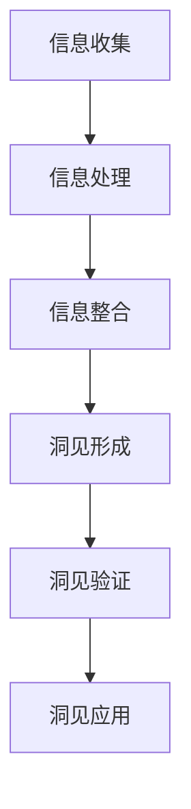

                 

### 《洞见的形成：从观察到反思》

> **关键词：洞见、观察、反思、认知、创造力、实践案例**

> **摘要：**
> 本文章探讨了洞见的形成过程，从观察、反思到认知和创造力的培养。通过分析观察与反思的关系，以及洞见的形成机制，文章旨在为读者揭示如何通过实践案例提高洞见识别和开发能力，以在科研、商业和教育等领域推动创新。文章还包括对洞见与创造力关系的探讨，以及洞见的挑战与未来发展趋势。希望本文能够帮助读者在个人和职业发展中更好地理解和利用洞见。

### 引言

在快速变化的信息时代，洞见（Insight）作为一种深刻而独到的见解，越来越受到重视。洞见不仅仅是简单的信息汇总，它是通过观察、反思和认知的深度加工，从而揭示事物本质和内在联系的能力。洞见对于科研、商业决策、技术创新以及个人成长都有着至关重要的作用。因此，理解洞见的形成机制，掌握识别和开发洞见的方法，对于提升我们的认知水平和创新能力具有重要意义。

#### 书籍的背景与目标

本书籍旨在为读者提供一个系统的洞见形成指南，从基础概念到实践应用，全方位地探讨洞见的形成过程。背景方面，随着人工智能和大数据技术的飞速发展，数据和信息变得无处不在，但与此同时，如何从海量数据中提取有价值的洞见成为了一个关键问题。本书希望通过对洞见的深入探讨，帮助读者掌握这一能力，从而在各自领域中取得更大的成就。

#### 洞见的定义与重要性

洞见通常被定义为对问题或现象的深刻理解，能够揭示其本质和内在联系。它不同于常识和直觉，而是通过系统化的观察和反思得出的结论。洞见的重要性在于它能够帮助我们在复杂多变的环境中做出更加明智的决策，发现新的创新点和解决问题的方法。

在科研领域，洞见可以帮助研究者发现新的科学现象和理论；在商业领域，洞见可以帮助企业把握市场趋势，制定有效的战略；在个人成长中，洞见可以帮助我们更好地理解自己和他人，提升自我认知和人际交往能力。

#### 观察与反思的关系

观察和反思是洞见形成过程中不可或缺的两个环节。观察是洞见形成的基础，它是指通过感官或仪器收集信息的过程。观察的深度和广度决定了洞见的质量。然而，单纯的观察往往不足以形成洞见，因为观察到的信息往往分散而孤立。这时，反思的作用就显现出来了。

反思是一种深度的思维活动，它是对观察到的信息进行整理、分析和综合的过程。反思可以帮助我们从不同的角度和层次理解信息，发现其中的关联和规律。通过反思，我们可以将观察到的碎片化信息整合成有意义的整体，从而形成洞见。

观察与反思之间的关系是相辅相成的。观察为反思提供了素材，而反思则提升了观察的深度和广度。一个有效的洞见往往需要反复的观察和反思，通过不断的循环，我们才能逐步接近问题的本质，形成深刻的洞见。

### 观察的基本概念

观察作为一种获取信息的方法，贯穿于我们日常生活的方方面面。从科学实验到日常生活中的购物、烹饪，观察都是不可或缺的一部分。本章节将深入探讨观察的定义与类型、观察的过程与要素，以及观察与认知的关系，帮助读者更好地理解观察在洞见形成中的作用。

#### 观察的定义与类型

观察是指通过感官或辅助设备对事物进行有目的的感知和记录的过程。根据观察的目的和方法，观察可以分为多种类型，包括科学观察、日常观察和系统观察。

1. **科学观察**：科学观察是按照科学方法进行的有目的、有系统的观察。科学观察强调精确性、客观性和可重复性，通常需要使用各种实验设备和工具。例如，物理学家使用显微镜观察细胞结构，生物学家进行野外生态观察，这些都是科学观察的例子。

2. **日常观察**：日常观察是我们日常生活中对周围环境和事物的自然观察。这种观察往往是无意识的，但也是获取知识的重要途径。例如，我们在日常生活中观察天气变化、社会现象等，这些都是日常观察的例子。

3. **系统观察**：系统观察是一种综合性的观察方法，它强调观察的整体性和系统性。系统观察通常涉及多个观察对象和多个观察维度，以全面、深入地了解事物。例如，市场调研中的消费者行为观察，教育评估中的学生学习表现观察等，都是系统观察的例子。

#### 观察的过程与要素

观察是一个复杂的过程，涉及到多个步骤和要素。以下是观察过程的主要步骤和要素：

1. **确定观察目标**：观察的第一步是明确观察的目标，即我们要观察什么，希望获得哪些信息。确定目标有助于集中注意力，提高观察的效率和效果。

2. **选择观察方法**：根据观察目标，选择合适的观察方法。科学观察通常需要使用特定的实验设备和工具，如显微镜、测量仪器等。日常观察和系统观察则更多地依赖于个人的感官和直觉。

3. **进行观察**：在确定了目标和观察方法后，进行实际观察。观察过程中要尽可能保持客观和精确，避免主观臆断和偏见。

4. **记录观察结果**：观察过程中，要及时记录观察到的信息，包括数据、现象和变化。记录可以是文字、图表或图像等形式，有助于后续分析和反思。

5. **分析观察结果**：观察结束后，对记录的信息进行分析，以发现其中的规律和关联。分析可以是定性的，也可以是定量的，目的是从观察结果中提取有价值的信息。

6. **反思和总结**：在分析的基础上，进行反思和总结，以深化对观察结果的理解。反思可以帮助我们发现问题、提出假设和进行进一步的探索。

#### 观察与认知的关系

观察与认知密切相关，是认知过程中不可或缺的环节。认知是指我们获取、处理和存储信息的过程，而观察是认知的重要途径之一。

1. **观察是认知的起点**：通过观察，我们能够获取外部世界的信息，这是认知过程的第一步。没有观察，就无法获取信息，也就无法进行进一步的认知活动。

2. **观察促进认知发展**：观察过程中，我们需要运用感官和思维去感知和理解事物，这有助于提高我们的认知能力和思维水平。通过持续的观察，我们可以积累丰富的知识，提升认知水平。

3. **观察与记忆的关系**：观察到的信息会储存在我们的记忆中，成为我们认知结构的一部分。记忆是对观察信息的存储和再现，而观察则是对记忆的深化和扩展。

4. **观察与理解的关系**：观察不仅能够帮助我们获取信息，还能够帮助我们理解事物。通过观察，我们可以看到事物的表象和内在联系，从而形成对事物的深刻理解。

总之，观察是洞见形成的基础，它为我们提供了丰富的信息来源。通过观察，我们可以获取外部世界的知识，并通过反思和认知活动，将这些知识转化为洞见，从而在个人和职业发展中取得更大的成就。

### 反思的本质

反思作为一种深度的思维活动，是洞见形成过程中的关键环节。它不仅仅是对观察结果的回顾和总结，更是一种对自身行为、思想和信念的深刻思考。在本章节中，我们将探讨反思的定义与作用，详细描述反思的过程与步骤，并探讨反思与自我认知之间的关系，帮助读者理解反思在洞见形成中的重要作用。

#### 反思的定义与作用

反思可以定义为对自身行为、思想和信念进行深入的思考和评估的过程。它不仅仅是对过去经验的回顾，更是一种对当前和未来行动的深思熟虑。反思的作用主要体现在以下几个方面：

1. **提升自我认知**：反思可以帮助我们更好地了解自己的行为、思想和动机，从而提升自我认知水平。通过反思，我们可以认识到自己的优点和不足，明确自己的价值观和目标。

2. **促进问题解决**：反思是一种重要的问题解决工具。通过反思，我们可以分析问题产生的原因，找出解决方案，并评估这些解决方案的有效性。反思有助于我们从错误中学习，提高解决问题的能力。

3. **推动个人成长**：反思是一种促进个人成长和发展的关键途径。通过反思，我们可以识别自身的成长需求，制定有效的成长计划，并持续改进自己的行为和思维模式。

4. **提高决策质量**：反思可以帮助我们更全面、客观地评估决策的影响和后果，从而提高决策质量。通过反思，我们可以从过去的决策中吸取教训，避免重复错误，做出更加明智的决策。

#### 反思的过程与步骤

反思是一个系统化的过程，通常包括以下几个步骤：

1. **回顾**：回顾是反思的第一步，也是最基本的步骤。回顾是对过去的经历、行为和决策进行反思和总结。通过回顾，我们可以了解自己的行为模式和决策过程，为后续的反思提供基础。

2. **分析**：在回顾的基础上，进行深入的分析。分析是对观察和回顾的结果进行批判性的思考和评估。分析可以涉及以下几个方面：

   - **行为分析**：分析我们的行为是否符合我们的价值观和目标，是否存在不合理或不适当的行为。
   - **思想分析**：分析我们的思想和信念，评估它们的合理性和有效性。
   - **决策分析**：分析我们的决策过程，评估决策的质量和后果。

3. **总结**：在分析的基础上，进行总结。总结是对反思过程的结果进行归纳和总结，以便我们能够从经验中学习和成长。总结可以包括以下几点：

   - **经验教训**：总结我们在经历中所学到的教训，明确哪些行为和决策是有效的，哪些是无效的。
   - **改进措施**：总结可以采取哪些改进措施，以提升我们的行为和决策能力。
   - **未来规划**：根据总结的结果，制定未来的行动计划和目标。

4. **反思与行动**：反思的最后一步是将反思结果转化为具体的行动。反思不仅仅是思考和总结，更重要的是将反思转化为实际行动，以实现个人成长和改进。

#### 反思与自我认知

反思与自我认知有着密切的关系。自我认知是指我们对自身的了解和认识，包括我们的性格、能力、价值观和目标等。反思是提升自我认知水平的重要途径。

1. **反思促进自我认知**：通过反思，我们可以更深入地了解自己的行为、思想和信念。反思帮助我们识别自我中的优点和不足，从而提升自我认知水平。

2. **反思与自我调节**：反思不仅帮助我们了解自我，还帮助我们调节自我。通过反思，我们可以识别自身的负面情绪和行为，并采取相应的措施进行调节和改善。

3. **反思与自我成长**：反思是一种自我成长的重要方式。通过反思，我们可以从过去的经历中吸取教训，识别自己的成长需求，并采取行动实现自我提升。

总之，反思是一种深度的思维活动，它对于个人成长、问题解决和决策制定都有着重要作用。通过反思，我们可以更好地了解自我，提升自我认知，从而在洞见形成中发挥关键作用。

### 洞见的形成机制

洞见作为一种深刻而独到的见解，是通过对观察和反思的深度加工而产生的。在本章节中，我们将探讨洞见的定义与类型、洞见形成的心理机制以及洞见的认知过程，帮助读者理解洞见的形成机制，从而更好地识别和开发洞见。

#### 洞见的定义与类型

洞见通常被定义为对问题或现象的深刻理解，能够揭示其本质和内在联系。它不同于常识和直觉，而是通过系统化的观察和反思得出的结论。洞见可以按照不同的维度和特点进行分类，常见的类型包括：

1. **突发洞见**：突发洞见是指在短时间内突然产生的深刻见解。这种洞见通常发生在灵感迸发、直觉闪现或情绪激动的时刻。例如，科学家突然想到一个实验方案，作家突然获得一个故事灵感。

2. **逐步洞见**：逐步洞见是指在长期观察和反思的基础上逐渐形成的深刻见解。这种洞见通常需要经过反复的思考、验证和修正。例如，科学家通过长期的实验和研究，逐步揭示了某个科学现象的本质。

3. **系统性洞见**：系统性洞见是指从多个角度、多个维度对问题进行全面分析后得出的深刻见解。这种洞见通常需要系统化的观察和反思，能够揭示问题或现象的复杂性和多样性。

4. **关联洞见**：关联洞见是指通过发现不同事物之间的关联和联系而产生的深刻见解。这种洞见能够揭示事物之间的潜在联系，为解决复杂问题提供新的思路。

#### 洞见形成的心理机制

洞见的形成是一个复杂的心理过程，涉及多种心理机制和思维活动。以下是洞见形成的主要心理机制：

1. **直觉思维**：直觉思维是一种快速、无意识的思维过程，它能够迅速捕捉到问题或现象的本质。直觉思维在突发洞见中起着重要作用，它能够帮助我们在短时间内形成深刻的见解。

2. **联想思维**：联想思维是一种通过不同事物之间的联系和关联产生新想法的思维过程。联想思维能够将看似不相关的事物联系起来，从而产生新的洞见。例如，通过将生物学和物理学结合起来，科学家发现了进化论的基本原理。

3. **创新思维**：创新思维是一种探索未知、创造新价值的思维过程。创新思维能够帮助我们打破常规，提出独特的见解和解决方案。例如，通过创新思维，工程师设计出了新的产品或技术。

4. **反思思维**：反思思维是一种对自身行为、思想和信念进行深入思考和评估的思维过程。反思思维能够帮助我们从过去的经历中学习和成长，从而提高我们的洞见能力。

#### 洞见的认知过程

洞见的形成是一个认知过程，涉及到信息的收集、处理和整合。以下是洞见认知过程的主要步骤：

1. **信息收集**：洞见形成的第一步是收集信息。通过观察、阅读、交流和实验等方式，我们能够获取关于问题或现象的各种信息。这些信息是洞见形成的基础。

2. **信息处理**：在收集到信息后，我们需要对信息进行加工和处理。信息处理包括筛选、分类、整合和比较等过程，目的是提取出有价值的信息，并去除无关或干扰信息。

3. **信息整合**：在信息处理的基础上，我们需要将不同来源、不同类型的信息进行整合。信息整合是将零散的信息整合成有意义的整体，从而揭示问题或现象的本质和内在联系。

4. **洞见形成**：在信息整合的过程中，我们可能会突然产生一个深刻的见解，这就是洞见。洞见是一种对问题或现象的深刻理解，能够揭示其本质和内在联系。

5. **洞见验证**：洞见形成后，我们需要对其进行验证，以确认其正确性和有效性。验证可以通过实验、实践和理论分析等方式进行。通过验证，我们可以确认洞见是否正确，并对其进行修正和完善。

总之，洞见的形成是一个复杂的认知过程，涉及直觉思维、联想思维和创新思维等多种心理机制。通过观察、反思和信息整合，我们能够形成深刻的洞见，从而在个人和职业发展中取得更大的成就。

### 洞见的识别与开发

洞见作为一种深刻而独到的见解，对于个人和组织的成功至关重要。然而，如何识别和开发洞见呢？在本章节中，我们将探讨识别洞见的方法、开发洞见的策略，并深入探讨洞见的商业价值，帮助读者理解和掌握如何利用洞见在商业决策和创新中取得成功。

#### 识别洞见的方法

识别洞见是洞见形成过程中的关键一步。以下是一些有效的方法，可以帮助我们识别潜在的洞见：

1. **分析模式**：分析模式是一种通过识别和解析现有模式来发现新洞见的方法。通过分析数据、市场趋势和行业动态，我们可以识别出潜在的机会和问题。例如，通过分析用户行为数据，企业可以发现用户未满足的需求，从而开发新产品或服务。

2. **联想和类比**：联想和类比是一种通过将不同领域或情境中的概念进行对比和联想来发现新洞见的方法。这种方法可以帮助我们发现不同领域之间的潜在联系，从而产生创新的见解。例如，将医疗技术和农业技术进行类比，可能会发现新的医疗应用。

3. **跨学科研究**：跨学科研究是一种通过结合不同学科的知识和方法来发现新洞见的方法。跨学科研究能够帮助我们跨越学科界限，从不同角度理解问题，从而发现新的洞见。例如，结合心理学、社会学和生物学的研究，可以揭示人类行为和健康之间的复杂关系。

4. **用户反馈**：用户反馈是一种通过直接获取用户意见和建议来识别洞见的方法。用户反馈可以帮助我们了解用户的真实需求和痛点，从而发现新的商业机会。例如，通过收集用户对现有产品的反馈，企业可以发现改进产品的机会，从而提升用户满意度。

5. **系统性思维**：系统性思维是一种通过分析问题或现象的多个维度和层次来发现新洞见的方法。系统性思维能够帮助我们识别问题的本质和内在联系，从而提出创新的解决方案。例如，在商业战略规划中，通过系统性思维可以识别出企业面临的多个挑战和机遇，从而制定更全面的战略。

#### 开发洞见的策略

一旦识别出潜在的洞见，接下来就需要进行开发，将其转化为实际的价值。以下是一些开发洞见的策略：

1. **实践和实验**：实践和实验是验证和开发洞见的重要手段。通过实践和实验，我们可以测试洞见的可行性和有效性，从而对其进行改进和优化。例如，企业可以通过小规模的市场测试来验证新产品或服务的市场需求。

2. **学习和反思**：学习和反思是洞见开发过程中的关键步骤。通过不断学习和反思，我们可以深化对洞见的理解，发现新的问题和挑战，从而持续改进洞见。例如，在开发新技术的过程中，通过学习和反思，可以优化技术方案，提高产品性能。

3. **团队合作**：团队合作是开发洞见的有效方式。通过团队合作，可以汇集不同的观点和经验，从而产生创新的洞见。例如，跨学科团队可以结合不同领域的专业知识，共同探索新的解决方案。

4. **资源整合**：资源整合是将不同的资源（如人力、资金、技术等）整合起来，以实现洞见的开发。通过资源整合，我们可以优化资源配置，提高开发效率。例如，企业可以通过整合内部资源和外部资源，共同开发新产品或服务。

5. **持续创新**：持续创新是洞见开发的重要策略。通过持续创新，我们可以不断改进和优化洞见，从而保持竞争优势。例如，通过定期进行产品迭代和优化，企业可以不断提升产品和服务质量，满足用户需求。

#### 洞见的商业价值

洞见在商业领域具有巨大的价值，能够帮助企业抓住市场机遇，提高竞争力。以下是洞见在商业价值方面的几个方面：

1. **市场洞察**：洞见可以帮助企业深入了解市场趋势和用户需求，从而制定更准确的市场策略。例如，通过分析用户行为数据，企业可以识别出潜在的市场需求，从而开发新产品或服务。

2. **竞争优势**：洞见可以帮助企业发现竞争对手的弱点和自身的优势，从而制定有效的竞争策略。例如，通过分析竞争对手的产品和服务，企业可以识别出竞争对手的不足之处，从而优化自身的产品和服务。

3. **创新能力**：洞见是创新的重要来源。通过识别和开发洞见，企业可以不断推出新的产品和服务，满足市场的需求，从而保持竞争优势。例如，通过跨学科研究和团队合作，企业可以开发出具有创新性的解决方案，满足用户的多样化需求。

4. **客户关系**：洞见可以帮助企业更好地理解客户的需求和痛点，从而提供个性化的服务和解决方案，提升客户满意度和忠诚度。例如，通过分析用户反馈，企业可以改进产品和服务，从而提升客户体验。

5. **战略规划**：洞见可以帮助企业制定长期的发展战略，明确企业的愿景和目标，从而实现可持续发展。例如，通过分析行业趋势和市场变化，企业可以调整战略方向，抓住市场机遇，实现长期发展。

总之，洞见的识别与开发对于个人和组织的成功至关重要。通过有效的方法和策略，我们可以识别和开发出有价值的洞见，从而在商业决策和创新中取得成功。洞见的商业价值体现在市场洞察、竞争优势、创新能力、客户关系和战略规划等方面，能够为企业带来持续的价值和竞争优势。

### 实践案例解析

为了更好地理解洞见的形成和应用，本章节将通过具体案例，分析洞见在科研、商业和教育等领域的应用，并探讨如何通过观察、反思和洞见来推动创新和改进。

#### 洞见在科研领域的应用

在科研领域，洞见是推动科学发现和技术创新的重要工具。以下是一个洞见在科研中的成功案例：

**案例：量子计算的研究突破**

**观察**：科学家们通过反复实验和观察，发现量子计算机在处理特定类型的问题时比传统计算机更高效。例如，量子计算机在因数分解和搜索算法上展示出显著的性能优势。

**反思**：在观察到这一现象后，研究人员反思量子力学的基本原理，并通过深入的理论分析和实验验证，提出了一种新的量子算法——量子随机行走算法。

**洞见**：通过这一洞见，科学家们意识到量子计算机不仅在理论上可行，而且在实际应用中具有巨大的潜力。这一洞见推动了量子计算领域的研究，促使各国政府和研究机构投入大量资源进行量子计算的研发。

**实践**：在实际应用中，研究人员通过进一步实验和优化，成功开发出了量子计算原型机，并在特定问题解决上取得了突破性进展。

**解读与分析**：这一案例展示了洞见在科研中的重要性。通过观察和反思，科学家们不仅揭示了量子计算机的潜在价值，还推动了相关技术的研究和发展。洞见的形成和应用不仅推动了科学进步，也为社会带来了新的技术变革。

#### 洞见在商业决策中的应用

在商业领域，洞见可以帮助企业把握市场趋势，制定有效的战略。以下是一个洞见在商业决策中的成功案例：

**案例：亚马逊的在线零售革命**

**观察**：在20世纪90年代末，互联网的普及和电子商务的兴起引起了零售业的变革。亚马逊观察到这一趋势，并开始在网上销售书籍。

**反思**：亚马逊管理层反思互联网对消费者行为的影响，并分析了在线销售与传统销售之间的差异。他们意识到，通过互联网进行销售可以降低成本、提高效率，并创造全新的购物体验。

**洞见**：通过这一洞见，亚马逊管理层决定扩大在线销售品类，并推出了亚马逊Prime服务，提供快速配送和会员优惠，从而进一步巩固了市场地位。

**实践**：亚马逊不断优化其物流和供应链管理，同时通过数据分析了解用户行为，不断改进产品推荐和服务质量。

**解读与分析**：这一案例展示了洞见在商业决策中的重要性。通过观察市场趋势和消费者行为，亚马逊管理层抓住了电子商务的机遇，制定了成功的商业战略。洞见的形成和应用不仅帮助亚马逊在竞争中脱颖而出，还推动了整个零售业的变革。

#### 洞见在教育改革中的应用

在教育领域，洞见可以帮助教师和学生更好地理解和应用知识，推动教育改革。以下是一个洞见在教育改革中的成功案例：

**案例：翻转课堂的兴起**

**观察**：教师们观察到传统课堂中，学生被动接受知识，课堂互动较少，学习效果不佳。此外，学生在课后花费大量时间进行复习，但效果并不理想。

**反思**：教师通过反思传统教学方法的局限，意识到学生需要更多自主学习和实践的机会。他们开始探索新的教学方法，例如翻转课堂。

**洞见**：翻转课堂的洞见是通过将知识传授放在课外，课堂时间用于实践和讨论，从而提高学习效果。这种教学方法强调学生的主动参与和自主学习。

**实践**：教师开始采用视频教学和在线资源，让学生在家中学习理论知识，课堂时间用于互动和实践。学生通过小组讨论、项目作业等方式进行深度学习。

**解读与分析**：这一案例展示了洞见在教育改革中的重要性。通过观察和反思，教师们找到了传统教学方法的不足，并提出了有效的改进方案。洞见的形成和应用不仅提高了学生的学习效果，也推动了教育理念的创新和变革。

总之，通过这些实践案例，我们可以看到洞见在不同领域的应用和影响。洞见的形成和应用需要通过观察、反思和实践，不断探索和创新。通过洞见，我们可以更好地理解和应对复杂多变的环境，推动个人和社会的发展。

### 洞见与创造力

洞见和创造力是密切相关的，两者共同推动我们在认知和思维领域取得突破。在本章节中，我们将探讨洞见与创造力的关系，解释洞见在创意思维中的重要作用，并介绍提高洞见和创造力的方法。

#### 洞见与创造力的关系

洞见和创造力是相互促进的关系。创造力是指产生新想法、新方法和新解决方案的能力，而洞见则是这种创造力的一种表现形式。以下是一些关键点，说明洞见与创造力的关系：

1. **洞见激发创造力**：洞见是通过深入观察和反思形成的深刻见解，它能够揭示问题或现象的本质和内在联系。洞见的产生往往需要突破常规思维，这种突破本身就是创造力的体现。洞见能够激发我们的创造力，引导我们产生新的想法和解决方案。

2. **创造力促进洞见**：创造力不仅仅是产生新的洞见，它还能够推动我们对现有知识和概念的重新理解和整合。通过创造性的思维活动，我们可以将不同的知识和概念进行重新组合，从而产生新的洞见。这种整合和创新的过程本身就是创造力的体现。

3. **洞见与创造力的协同作用**：洞见和创造力的协同作用可以产生更大的效果。当我们具备洞见时，我们可以更好地理解问题的复杂性和多样性，从而提出更具创意的解决方案。同时，通过创造性的思维活动，我们可以不断探索新的洞见，进一步深化对问题的理解。

#### 洞见在创意思维中的重要作用

洞见在创意思维中扮演着关键角色，它能够帮助我们突破思维的瓶颈，产生创新的见解。以下是洞见在创意思维中的几个重要作用：

1. **揭示隐藏的关联**：洞见能够帮助我们发现不同事物之间的潜在联系。通过观察和反思，我们可以将看似不相关的事物联系起来，从而产生新的创意。例如，将生物学和工程学结合，可以产生生物仿生技术。

2. **打破思维定式**：洞见能够帮助我们打破固有的思维模式，发现问题的不同角度和解决方案。通过反思和重新评估，我们可以从新的视角理解问题，从而提出创新的解决方案。例如，从用户的角度重新设计产品，可以大大提升用户体验。

3. **引导创新过程**：洞见可以作为创新的指南，引导我们探索新的方向和领域。通过洞见，我们可以确定研究或开发的重点，从而更高效地推进创新项目。例如，通过洞见，科学家可以确定新的研究领域，推动科学发现。

#### 提高洞见和创造力的方法

为了提高洞见和创造力，我们可以采取以下几种方法：

1. **多角度观察**：通过多角度、多层次的观察，我们可以获取更多的信息，从而产生更深入的洞见。例如，通过实地考察、访谈和文献调研，我们可以从多个角度了解一个现象，从而发现新的洞见。

2. **反思与总结**：反思是洞见形成的重要环节。通过反思，我们可以回顾和分析过去的经验和行为，从中提取教训和洞见。定期进行反思和总结，可以帮助我们不断提高洞见和创造力。

3. **跨学科学习**：跨学科学习能够帮助我们打破知识领域的界限，将不同的知识和方法进行整合，从而产生新的洞见。通过学习不同的学科，我们可以获得更广泛的知识背景，提高思维的灵活性。

4. **实践与实验**：实践和实验是验证和开发洞见的重要手段。通过实践和实验，我们可以将理论转化为实际的应用，从而深化对问题的理解。同时，实践过程中的反馈和调整也可以帮助我们不断优化洞见和解决方案。

5. **合作与交流**：合作和交流能够激发我们的创造力，通过与他人的讨论和合作，我们可以从不同的视角和经验中获得启发，产生新的洞见。合作还可以促进知识的共享和资源的整合，提高创新效率。

总之，洞见和创造力是相互促进的关系，通过提高洞见和创造力，我们可以更好地理解和应对复杂多变的环境，推动个人和组织的创新和进步。

### 洞见的挑战与未来

尽管洞见在个人和职业发展中具有重要意义，但洞见的形成和应用也面临着一系列挑战。在本章节中，我们将探讨洞见面临的挑战，分析洞见的发展趋势，并展望洞见的未来应用前景。

#### 洞见的挑战

1. **信息过载**：在当今信息爆炸的时代，我们面临着海量的信息。然而，信息过载使得有效观察和反思变得困难。如何从海量信息中筛选出有价值的信息，是洞见形成过程中的一大挑战。

2. **认知偏差**：人们的认知过程中往往存在各种偏差，如确认偏误、代表性偏差和可用性偏差等。这些偏差会影响我们的观察和反思，从而影响洞见的形成。克服认知偏差，提高认知的客观性和准确性，是洞见形成的重要挑战。

3. **时间成本**：洞见的形成通常需要大量的时间和精力，特别是在复杂和未知领域。如何平衡洞见形成的时间成本和效率，是个人和组织需要面对的问题。

4. **技术应用**：随着技术的快速发展，洞见的形成和应用越来越依赖于各种工具和平台。然而，技术的不确定性和复杂性也带来了一定的风险。如何合理应用技术，提高洞见的形成效率，是洞见形成和应用的重要挑战。

#### 洞见的发展趋势

1. **人工智能与大数据**：人工智能和大数据技术的发展为洞见的形成提供了强大的支持。通过数据分析和机器学习，我们可以从海量数据中提取有价值的信息，从而提高洞见的准确性。未来，人工智能将进一步推动洞见的自动化和智能化，使洞见形成更加高效和精准。

2. **跨学科研究**：随着学科交叉和融合的加深，跨学科研究将成为洞见形成的重要趋势。通过结合不同学科的知识和方法，我们可以从多个角度理解问题，从而产生更深入的洞见。

3. **体验式学习**：体验式学习通过实际参与和实践，可以帮助我们更好地理解和应用知识，从而形成洞见。未来，体验式学习将成为洞见形成的重要途径，通过实际操作和反思，我们可以深化对问题的理解。

4. **认知科学的进展**：认知科学的进展将为洞见的形成提供新的理论和方法。通过深入研究人类认知过程，我们可以更好地理解洞见形成的基本机制，从而提高洞见的形成效率。

#### 洞见的未来应用前景

1. **科学研究**：洞见在科学研究中的价值巨大，未来将推动更多科学发现和技术创新。通过洞见，科学家可以更深入地理解复杂现象，提出新的理论假设，推动科学进步。

2. **商业决策**：洞见在商业决策中的应用前景广阔。通过洞见，企业可以更好地理解市场需求，制定有效的战略，抓住市场机遇。未来，洞见将成为企业竞争优势的重要来源。

3. **教育改革**：洞见在教育改革中的应用将提高教育质量和效果。通过洞见，教师可以更好地理解学生的需求，设计更有效的教学策略，促进学生的全面发展。

4. **社会创新**：洞见在社会创新中的应用将推动社会进步和可持续发展。通过洞见，我们可以发现社会问题的新解决方案，推动社会变革和进步。

总之，洞见作为一种深刻而独到的见解，在个人和职业发展中具有重要意义。尽管面临一系列挑战，但通过不断探索和发展，洞见的未来应用前景将更加广阔。让我们共同努力，提高洞见能力，推动个人和社会的发展。

### 附录

#### 附录 A：相关研究文献推荐

1. **Dawkins, S. (1982).** *The Extended Phenotype: The New Darwinism.*
   - 探讨了生物进化的新观点，对洞见的形成和认知过程有深刻的启示。
   
2. **Krugman, P. R. (1994).** *Pop Internationalism: Prospects and Problems in the Post-War World.*
   - 分析了全球经济中的洞见，对商业决策和国际关系有重要参考价值。

3. **Simon, H. A. (1996).** *The Sciences of the Artificial.*
   - 讨论了认知科学和人工智能领域的重要概念，对洞见的形成机制有重要影响。

4. **Kuhn, T. S. (1970).** *The Structure of Scientific Revolutions.*
   - 描述了科学革命的动态过程，为理解洞见在科研中的应用提供了理论框架。

#### 附录 B：洞见形成过程流程图

#### 附录 C：推荐阅读书目与资源

1. **尼尔·波兹曼《娱乐至死》** - 探讨了媒体对人类认知和行为的影响。
   
2. **马尔科姆·格拉德威尔《引爆点》** - 分析了流行趋势和社会现象中的关键因素。

3. **克里夫·尼克尔斯《大脑如何工作》** - 描述了大脑的认知过程和思维机制。

4. **在线资源：**
   - [心智模型](https://www.cognitivebiases.com/)
   - [洞见与创造力研究所](https://www.insightcreativity.org/)
   - [TED演讲：洞察力的艺术](https://www.ted.com/talks/search?q=insight)

通过这些推荐文献和资源，读者可以更深入地了解洞见的形成和应用，从而在实际生活中更好地运用洞见能力。希望这些资料能够为读者的研究和实践提供有益的参考。

