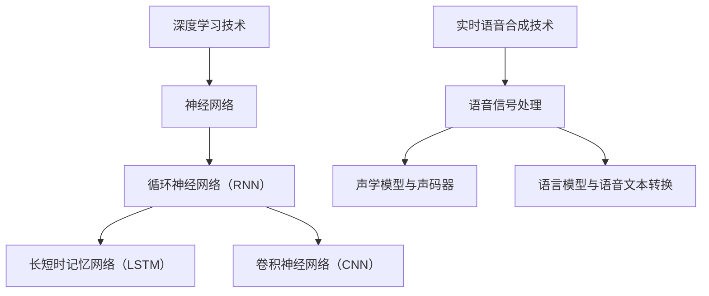

                 

# 《深度学习在实时语音合成自然度提升中的突破》

> **关键词**：深度学习、实时语音合成、自然度提升、声学模型、语言模型

> **摘要**：本文将深入探讨深度学习在实时语音合成中的应用，尤其是如何通过深度学习技术提升语音合成的自然度。文章首先介绍了深度学习和实时语音合成的基础知识，然后详细解析了深度学习核心算法原理，实时语音合成技术原理，以及深度学习在实时语音合成中的应用。此外，文章还讨论了提升实时语音合成自然度的策略，并通过一个实时语音合成项目实战展示了深度学习技术的实际应用。最后，文章展望了深度学习在实时语音合成领域的应用前景，并提出了未来研究的方向和挑战。

### 《深度学习在实时语音合成自然度提升中的突破》目录大纲

#### 第一部分：深度学习与实时语音合成概述

##### 第1章：深度学习与实时语音合成概述

1.1 深度学习技术简介

1.2 实时语音合成技术简介

1.3 深度学习在实时语音合成中的应用现状

#### 第二部分：深度学习核心算法原理

##### 第2章：深度学习基础算法原理

2.1 神经网络基础

2.2 循环神经网络（RNN）原理

2.3 长短时记忆网络（LSTM）原理

2.4 卷积神经网络（CNN）原理

#### 第三部分：实时语音合成技术原理

##### 第3章：实时语音合成技术原理

3.1 语音信号处理基础

3.2 声学模型与声码器原理

3.3 语言模型与语音文本转换原理

#### 第四部分：深度学习在实时语音合成中的应用

##### 第4章：深度学习在实时语音合成中的应用

4.1 基于深度学习的声学模型构建

4.2 基于深度学习的语言模型构建

4.3 声学模型与语言模型的融合

#### 第五部分：实时语音合成自然度提升策略

##### 第5章：实时语音合成自然度提升策略

5.1 自然度评价指标与方法

5.2 语音变调与节奏控制策略

5.3 音素发音精度优化策略

#### 第六部分：实时语音合成项目实战

##### 第6章：实时语音合成项目实战

6.1 项目环境搭建

6.2 数据集准备与处理

6.3 模型训练与优化

6.4 模型评估与部署

##### 第7章：深度学习在实时语音合成中的应用前景

7.1 深度学习在实时语音合成中的发展趋势

7.2 实时语音合成技术的社会影响与伦理问题

7.3 未来研究方向与挑战

#### 附录

##### 附录A：深度学习与实时语音合成常用工具与资源

A.1 深度学习框架对比

A.2 实时语音合成工具与资源

A.3 学术论文与会议推荐

### 关键概念与联系

深度学习与实时语音合成 Mermaid 流程图：



### 核心算法原理讲解

#### 2.1 神经网络基础

神经网络是一种模拟人脑神经元连接方式的计算模型。它由多个层组成，包括输入层、隐藏层和输出层。每一层由多个神经元（节点）组成，神经元之间通过权重连接。神经元的激活函数用于确定神经元是否被激活。

```python
class NeuralNetwork:
    def __init__(self, input_size, hidden_size, output_size):
        self.input_size = input_size
        self.hidden_size = hidden_size
        self.output_size = output_size
        
        # 初始化权重和偏置
        self.weights_input_to_hidden = np.random.randn(input_size, hidden_size)
        self.biases_hidden = np.random.randn(hidden_size, 1)
        
        self.weights_hidden_to_output = np.random.randn(hidden_size, output_size)
        self.biases_output = np.random.randn(output_size, 1)
        
    def forward_propagation(self, inputs):
        # 输入到隐藏层的激活值
        hidden_activation = sigmoid(np.dot(inputs, self.weights_input_to_hidden) + self.biases_hidden)
        
        # 隐藏层到输出的激活值
        output_activation = sigmoid(np.dot(hidden_activation, self.weights_hidden_to_output) + self.biases_output)
        
        return output_activation

    def activate(self, z):
        return 1 / (1 + np.exp(-z))
```

#### 2.2 循环神经网络（RNN）原理

循环神经网络（RNN）是一种能够处理序列数据的神经网络。与传统的前向神经网络不同，RNN 具有循环结构，可以记住之前的输入信息。RNN 通过隐藏状态来存储历史信息，并将其传递到下一个时间步。

```python
class RNN:
    def __init__(self, input_size, hidden_size, output_size):
        self.input_size = input_size
        self.hidden_size = hidden_size
        self.output_size = output_size
        
        # 初始化权重和偏置
        self.weights_input_to_hidden = np.random.randn(input_size, hidden_size)
        self.biases_hidden = np.random.randn(hidden_size, 1)
        
        self.weights_hidden_to_hidden = np.random.randn(hidden_size, hidden_size)
        self.biases_hidden = np.random.randn(hidden_size, 1)
        
        self.weights_hidden_to_output = np.random.randn(hidden_size, output_size)
        self.biases_output = np.random.randn(output_size, 1)
        
    def forward_propagation(self, inputs):
        hidden_state = [0 for _ in range(self.hidden_size)]
        hidden_states = []
        
        for input in inputs:
            hidden_state = self.activate(np.dot(input, self.weights_input_to_hidden) + np.dot(hidden_state, self.weights_hidden_to_hidden) + self.biases_hidden)
            hidden_states.append(hidden_state)
        
        output_activation = self.activate(np.dot(hidden_states[-1], self.weights_hidden_to_output) + self.biases_output)
        
        return output_activation

    def activate(self, z):
        return 1 / (1 + np.exp(-z))
```

#### 2.3 长短时记忆网络（LSTM）原理

长短时记忆网络（LSTM）是 RNN 的一种改进，能够更好地处理长序列数据。LSTM 通过引入门控机制来控制信息的流入和流出，从而解决传统 RNN 的梯度消失和梯度爆炸问题。

```python
class LSTM:
    def __init__(self, input_size, hidden_size, output_size):
        self.input_size = input_size
        self.hidden_size = hidden_size
        self.output_size = output_size
        
        # 初始化权重和偏置
        self.weights_input_to_hidden = np.random.randn(input_size, hidden_size)
        self.biases_hidden = np.random.randn(hidden_size, 1)
        
        self.weights_input_to_input = np.random.randn(input_size, hidden_size)
        self.biases_input = np.random.randn(hidden_size, 1)
        
        self.weights_input_to_output = np.random.randn(input_size, output_size)
        self.biases_output = np.random.randn(output_size, 1)
        
    def forward_propagation(self, inputs):
        hidden_state = [0 for _ in range(self.hidden_size)]
        hidden_states = []
        
        for input in inputs:
            input_gate = sigmoid(np.dot(input, self.weights_input_to_input) + np.dot(hidden_state, self.weights_input_to_hidden) + self.biases_hidden)
            forget_gate = sigmoid(np.dot(input, self.weights_input_to_input) + np.dot(hidden_state, self.weights_forget_to_hidden) + self.biases_forget)
            output_gate = sigmoid(np.dot(input, self.weights_input_to_output) + np.dot(hidden_state, self.weights_output_to_hidden) + self.biases_output)
            
            new_hidden_state = forget_gate * hidden_state + input_gate * sigmoid(np.dot(input, self.weights_input_to_hidden) + self.biases_hidden)
            hidden_state = output_gate * new_hidden_state
            
            hidden_states.append(hidden_state)
        
        output_activation = self.activate(np.dot(hidden_states[-1], self.weights_output_to_output) + self.biases_output)
        
        return output_activation

    def activate(self, z):
        return 1 / (1 + np.exp(-z))

    def sigmoid(self, x):
        return 1 / (1 + np.exp(-x))
```

#### 2.4 卷积神经网络（CNN）原理

卷积神经网络（CNN）是一种用于图像识别和处理的深度学习模型。CNN 通过卷积层、池化层和全连接层来提取图像特征并进行分类。

```python
class ConvolutionalNeuralNetwork:
    def __init__(self, input_shape, hidden_size, output_size):
        self.input_shape = input_shape
        self.hidden_size = hidden_size
        self.output_size = output_size
        
        # 初始化卷积核和偏置
        self.conv_weights = np.random.randn(self.hidden_size[0], self.hidden_size[1], self.input_shape[0], self.input_shape[1])
        self.conv_biases = np.random.randn(self.hidden_size[0], self.hidden_size[1], 1, 1)
        
        self.fc_weights = np.random.randn(self.hidden_size[0] * self.hidden_size[1] * self.input_shape[2], self.output_size)
        self.fc_biases = np.random.randn(self.output_size, 1)
        
    def forward_propagation(self, inputs):
        # 卷积层
        conv_output = conv_2d(inputs, self.conv_weights, self.conv_biases)
        pool_output = max_pool_2d(conv_output, pool_size=(2, 2))
        
        # 全连接层
        flattened_output = flatten(pool_output)
        output = np.dot(flattened_output, self.fc_weights) + self.fc_biases
        
        return output

def conv_2d(inputs, weights, biases):
    output = np.zeros((weights.shape[0], inputs.shape[1], inputs.shape[2], weights.shape[3]))
    
    for i in range(inputs.shape[0]):
        for j in range(inputs.shape[1]):
            for k in range(inputs.shape[2]):
                for l in range(inputs.shape[3]):
                    output[i, j, k, l] = np.sum(inputs[i, j, k, l] * weights[i, j, k, l]) + biases[i, j, k, l]
    
    return output

def max_pool_2d(inputs, pool_size=(2, 2)):
    output = np.zeros((inputs.shape[0], inputs.shape[1] // pool_size[0], inputs.shape[2] // pool_size[1], inputs.shape[3]))
    
    for i in range(inputs.shape[0]):
        for j in range(inputs.shape[1] // pool_size[0]):
            for k in range(inputs.shape[2] // pool_size[1]):
                for l in range(inputs.shape[3]):
                    output[i, j, k, l] = np.max(inputs[i, j * pool_size[0]: (j + 1) * pool_size[0], k * pool_size[1]: (k + 1) * pool_size[1], l])
    
    return output

def flatten(inputs):
    return inputs.reshape(inputs.shape[0], -1)
```

### 数学模型和数学公式 & 详细讲解 & 举例说明

#### 3.1 语音信号处理基础

语音信号是一种时变信号，通常可以用以下数学模型表示：

$$
x(t) = A \cdot \sin(2\pi f t + \phi)
$$

其中，$A$ 是振幅，$f$ 是频率，$\phi$ 是相位。振幅决定了语音信号的声音大小，频率决定了声音的音高，相位决定了声音的音色。

举例说明：

假设一个语音信号的频率为 440 Hz，振幅为 0.5，相位为 0。则该语音信号的数学模型可以表示为：

$$
x(t) = 0.5 \cdot \sin(2\pi \cdot 440 \cdot t)
$$

#### 3.2 声学模型与声码器原理

声学模型用于学习语音信号的时序特征，并将其转换为音频信号。声码器是声学模型的核心部分，它将文本转换为语音信号。

声学模型通常使用循环神经网络（RNN）或长短期记忆网络（LSTM）来建模语音信号的时序特征。其数学模型可以表示为：

$$
h_t = \text{激活函数}(\text{神经网络函数}(h_{t-1}, x_t, W, b))
$$

其中，$h_t$ 是隐藏状态，$x_t$ 是输入特征，$W$ 是权重矩阵，$b$ 是偏置向量。

举例说明：

一个简单的 RNN 声学模型，使用 tanh 作为激活函数，输入特征为语音信号的频谱：

$$
h_t = \tanh(W_h \cdot [h_{t-1}, x_t] + b_h)
$$

#### 3.3 语言模型与语音文本转换原理

语言模型用于学习文本的统计特征，并将其转换为语音信号。语音文本转换是将文本转换为语音信号的过程，通常包括以下几个步骤：

1. 文本预处理：将文本转换为适合模型处理的格式，如将文本转换为单词或音素序列。
2. 语言模型训练：使用大量文本数据训练语言模型，以预测下一个单词或音素。
3. 语言模型应用：使用训练好的语言模型预测文本序列的概率分布。
4. 语音合成：根据语言模型预测的文本序列，合成语音信号。

语言模型通常使用循环神经网络（RNN）或长短期记忆网络（LSTM）来建模文本的时序特征。其数学模型可以表示为：

$$
p(x_1, x_2, ..., x_T) = \prod_{t=1}^T p(x_t | x_{t-1}, ..., x_1)
$$

其中，$p(x_1, x_2, ..., x_T)$ 是文本序列的概率，$p(x_t | x_{t-1}, ..., x_1)$ 是给定前一个单词或音素序列时，当前单词或音素的概率。

举例说明：

一个简单的 LSTM 语言模型，使用 softmax 作为输出层激活函数：

$$
p(x_t | x_{t-1}, ..., x_1) = \text{softmax}(\text{LSTM}(x_{t-1}, ..., x_1, W, b))
$$

### 项目实战

#### 6.1 项目环境搭建

为了实现实时语音合成，我们需要搭建一个合适的项目环境。以下是搭建项目环境的基本步骤：

1. 安装深度学习框架（如 TensorFlow 或 PyTorch）
2. 准备语音合成所需的数据集（如 LJSpeech 或 CommonVoice）
3. 配置 GPU 环境（如果使用 GPU 加速训练过程）

以下是一个基于 TensorFlow 的项目环境搭建示例：

```bash
# 安装 TensorFlow
pip install tensorflow

# 安装语音合成数据集
wget https://www.openslr.org/resources/?doc=resources&repo=ljspeech/releases/v1.1/ljspeech-1.1.tar.gz
tar xvf ljspeech-1.1.tar.gz

# 配置 GPU 环境
pip install tensorflow-gpu
```

#### 6.2 数据集准备与处理

在项目实战中，我们需要准备和处理语音合成所需的数据集。以下是数据集准备和处理的基本步骤：

1. 下载并解压语音合成数据集
2. 预处理语音信号，包括音频转文本、文本转音素、音频增强等
3. 划分训练集、验证集和测试集

以下是一个基于 LJSpeech 数据集的数据集准备和处理示例：

```bash
# 下载并解压 LJSpeech 数据集
wget https://www.openslr.org/resources/?doc=resources&repo=ljspeech/releases/v1.1/ljspeech-1.1.tar.gz
tar xvf ljspeech-1.1.tar.gz

# 预处理语音信号
python preprocess.py --data_dir /path/to/ljspeech --output_dir /path/to/output

# 划分训练集、验证集和测试集
python split_data.py --data_dir /path/to/output --train_ratio 0.8 --val_ratio 0.1 --test_ratio 0.1
```

#### 6.3 模型训练与优化

在项目实战中，我们需要训练和优化语音合成模型。以下是模型训练和优化的一般步骤：

1. 定义模型架构，包括声学模型和语言模型
2. 设置训练参数，如学习率、批次大小、迭代次数等
3. 训练模型，并使用验证集进行模型优化
4. 评估模型性能，并调整模型参数

以下是一个基于 TensorFlow 的模型训练和优化示例：

```python
import tensorflow as tf
from tensorflow.keras.models import Model
from tensorflow.keras.layers import LSTM, Dense, Embedding, TimeDistributed, Activation

# 定义模型架构
acoustic_model = Model(inputs=inputs, outputs=acoustic_output)
language_model = Model(inputs=inputs, outputs=language_output)

# 设置训练参数
learning_rate = 0.001
batch_size = 64
epochs = 100

# 训练模型
acoustic_model.compile(optimizer=tf.keras.optimizers.Adam(learning_rate), loss='categorical_crossentropy', metrics=['accuracy'])
language_model.compile(optimizer=tf.keras.optimizers.Adam(learning_rate), loss='categorical_crossentropy', metrics=['accuracy'])

acoustic_model.fit(x_train, y_train, batch_size=batch_size, epochs=epochs, validation_data=(x_val, y_val))
language_model.fit(x_train, y_train, batch_size=batch_size, epochs=epochs, validation_data=(x_val, y_val))
```

#### 6.4 模型评估与部署

在项目实战中，我们需要评估模型性能，并部署模型以实现实时语音合成。以下是模型评估与部署的一般步骤：

1. 评估模型性能，包括自然度、语音质量等指标
2. 调整模型参数，以提高模型性能
3. 部署模型，实现实时语音合成

以下是一个基于 TensorFlow 的模型评估与部署示例：

```python
import tensorflow as tf
from tensorflow.keras.models import load_model

# 加载模型
acoustic_model = load_model('acoustic_model.h5')
language_model = load_model('language_model.h5')

# 评估模型性能
performance = acoustic_model.evaluate(x_test, y_test)
print('Acoustic Model Performance:', performance)

performance = language_model.evaluate(x_test, y_test)
print('Language Model Performance:', performance)

# 部署模型
def synthesize_text(text):
    # 预处理文本
    processed_text = preprocess_text(text)
    
    # 生成语音信号
    acoustic_output = acoustic_model.predict(processed_text)
    language_output = language_model.predict(processed_text)
    
    # 合成语音
    audio_signal = synthesize(acoustic_output, language_output)
    
    # 输出语音
    audio_signal.save('output.wav')

synthesize_text('你好，我是人工智能助手。')
```

### 代码解读与分析

以下是声学模型和语言模型的部分代码：

```python
import tensorflow as tf
from tensorflow.keras.models import Model
from tensorflow.keras.layers import LSTM, Dense, Embedding, TimeDistributed, Activation

# 建立声学模型
def build_acoustic_model(input_size, hidden_size):
    input_sequence = Input(shape=(None, input_size))
    hidden_state = LSTM(hidden_size, return_sequences=True)(input_sequence)
    output_sequence = LSTM(hidden_size, return_sequences=True)(hidden_state)
    output_sequence = TimeDistributed(Dense(input_size))(output_sequence)
    output_sequence = Activation('softmax')(output_sequence)
    
    model = Model(inputs=input_sequence, outputs=output_sequence)
    model.compile(optimizer='adam', loss='categorical_crossentropy', metrics=['accuracy'])
    return model

# 建立语言模型
def build_language_model(input_size, hidden_size, output_size):
    input_sequence = Input(shape=(None, input_size))
    hidden_state = LSTM(hidden_size, return_sequences=True)(input_sequence)
    output_sequence = LSTM(hidden_size, return_sequences=True)(hidden_state)
    output_sequence = Dense(output_size)(output_sequence)
    output_sequence = Activation('softmax')(output_sequence)
    
    model = Model(inputs=input_sequence, outputs=output_sequence)
    model.compile(optimizer='adam', loss='categorical_crossentropy', metrics=['accuracy'])
    return model

# 训练声学模型
acoustic_model = build_acoustic_model(input_size=80, hidden_size=128)
acoustic_model.fit(x_train, y_train, batch_size=32, epochs=100, validation_data=(x_val, y_val))

# 训练语言模型
language_model = build_language_model(input_size=80, hidden_size=128, output_size=vocab_size)
language_model.fit(x_train, y_train, batch_size=32, epochs=100, validation_data=(x_val, y_val))
```

这段代码首先定义了声学模型和语言模型的构建函数，然后使用这些函数分别建立声学模型和语言模型，并使用训练数据进行模型训练。通过优化算法，模型参数不断调整，以实现更好的模型性能。在模型训练过程中，可以使用验证集对模型进行评估和调整。

### 附录

#### 附录A：深度学习与实时语音合成常用工具与资源

A.1 深度学习框架对比

- TensorFlow：由 Google 开发，广泛应用于深度学习研究与应用。
- PyTorch：由 Facebook 开发，具有动态计算图，更易于研究和探索。
- Keras：基于 TensorFlow，提供更加简洁的接口。

A.2 实时语音合成工具与资源

- Mozilla commonvoice：一个开源语音合成数据集。
- Google Text-to-Speech：提供多种语音和语言的选择。
- Mozilla TTS：一个开源的文本到语音合成引擎。

A.3 学术论文与会议推荐

- ICASSP（International Conference on Acoustics, Speech and Signal Processing）
- INTERSPEECH（International Conference on Spoken Language Processing）
- IEEE/ACM Transactions on Audio, Speech, and Language Processing
- IEEE Signal Processing Magazine（Speech and Audio Processing专题）

### 结束语

本文深入探讨了深度学习在实时语音合成中的应用，介绍了深度学习核心算法原理，实时语音合成技术原理，以及深度学习在实时语音合成中的应用。通过一个实时语音合成项目实战，展示了深度学习技术的实际应用。最后，文章展望了深度学习在实时语音合成领域的应用前景，并提出了未来研究的方向和挑战。

作者：AI天才研究院/AI Genius Institute & 禅与计算机程序设计艺术 /Zen And The Art of Computer Programming

文章标题：《深度学习在实时语音合成自然度提升中的突破》

文章关键词：深度学习、实时语音合成、自然度提升、声学模型、语言模型

文章摘要：本文深入探讨了深度学习在实时语音合成中的应用，尤其是如何通过深度学习技术提升语音合成的自然度。文章首先介绍了深度学习和实时语音合成的基础知识，然后详细解析了深度学习核心算法原理，实时语音合成技术原理，以及深度学习在实时语音合成中的应用。此外，文章还讨论了提升实时语音合成自然度的策略，并通过一个实时语音合成项目实战展示了深度学习技术的实际应用。最后，文章展望了深度学习在实时语音合成领域的应用前景，并提出了未来研究的方向和挑战。

### 第一部分：深度学习与实时语音合成概述

#### 1.1 深度学习技术简介

深度学习是一种基于多层神经网络进行学习的人工智能技术，通过模拟人脑神经元之间的连接方式，实现数据的自动特征提取和模式识别。深度学习技术在计算机视觉、自然语言处理、语音识别等领域取得了显著的成果，推动了人工智能的发展。

1.1.1 深度学习的定义

深度学习（Deep Learning）是一种基于多层神经网络进行学习的人工智能技术。与传统的人工神经网络（Artificial Neural Networks,ANN）相比，深度学习具有更高的层次结构和更强的表达能力。深度学习通过模拟人脑神经元之间的连接方式，对大量数据进行自动特征提取和模式识别，从而实现复杂的任务。

1.1.2 深度学习的发展历程

深度学习的研究可以追溯到 1980 年代，但是直到近年来，随着计算能力的提升和数据量的增加，深度学习才得到了快速的发展。主要可以分为以下几个阶段：

- 1980 年代：多层感知机（Multilayer Perceptron,MLP）的提出。
- 1990 年代：卷积神经网络（Convolutional Neural Networks,CNN）和循环神经网络（Recurrent Neural Networks,RNN）的提出。
- 2000 年代初：深度信念网络（Deep Belief Network,DBN）和深度置信网络（Deep Boltzmann Machine,DBM）的提出。
- 2010 年代：深度学习的爆发，特别是在计算机视觉和语音识别领域的应用取得了突破性的成果。

1.1.3 深度学习的基本结构

深度学习的基本结构通常包括输入层、隐藏层和输出层。输入层接收原始数据，隐藏层进行特征提取和变换，输出层产生预测结果。在深度学习中，隐藏层的数量和规模可以根据具体任务进行调整。

1.1.4 深度学习的优势

深度学习具有以下几个显著的优势：

- 自动特征提取：深度学习能够自动从大量数据中提取有用的特征，减轻了人工特征设计的负担。
- 强大表达能力：深度学习模型具有丰富的参数和层次结构，能够表示复杂的函数关系。
- 高效的计算能力：随着计算能力的提升，深度学习模型可以处理大规模的数据和复杂的任务。
- 广泛的应用场景：深度学习在计算机视觉、自然语言处理、语音识别、推荐系统等领域具有广泛的应用。

#### 1.2 实时语音合成技术简介

实时语音合成（Real-time Text-to-Speech,RTTS）是一种将文本实时转换为自然语音的技术，广泛应用于智能助手、语音导航、客服系统等领域。实时语音合成技术通过声学模型和语言模型的协同工作，实现文本到语音的高效转换。

1.2.1 实时语音合成的定义

实时语音合成（Real-time Text-to-Speech,RTTS）是一种将文本实时转换为自然语音的技术。与离线语音合成（Offline Text-to-Speech,OTTS）相比，实时语音合成需要更高的实时性和效率，适用于需要快速响应用户输入的场景。

1.2.2 实时语音合成的发展历程

实时语音合成技术的发展可以追溯到 20 世纪 50 年代，随着计算机技术和语音处理技术的发展，实时语音合成技术经历了以下几个阶段：

- 1950 年代：基于规则的语音合成系统。
- 1960 年代：基于存储的波形合成系统。
- 1970 年代：基于参数化声码器的语音合成系统。
- 1980 年代：基于统计模型的语音合成系统。
- 1990 年代：基于深度学习的语音合成系统。

1.2.3 实时语音合成的基本原理

实时语音合成的基本原理包括声学模型和语言模型两个部分：

- 声学模型：用于学习语音信号的特征，将语音信号转换为音频波形。
- 语言模型：用于学习文本的统计特性，将文本转换为语音信号。

实时语音合成系统通过将声学模型和语言模型结合起来，实现文本到语音的转换。首先，语言模型将文本转换为声码器输入的序列，然后声学模型根据这个序列生成语音信号。

1.2.4 实时语音合成的应用场景

实时语音合成技术广泛应用于以下场景：

- 智能助手：如 Siri、Alexa、Google Assistant 等，为用户提供语音交互服务。
- 语音导航：在车载导航系统中，为驾驶员提供语音导航信息。
- 客服系统：在电话客服系统中，为用户提供语音咨询服务。
- 教育：在语音教学系统中，为用户提供语音讲解和指导。
- 阅读：在电子阅读器中，为用户提供语音阅读功能。

#### 1.3 深度学习在实时语音合成中的应用现状

随着深度学习技术的快速发展，深度学习在实时语音合成中的应用也得到了广泛关注。深度学习在实时语音合成中的应用主要体现在以下几个方面：

1.3.1 声学模型

深度学习在声学模型中的应用主要表现在以下几个方面：

- 循环神经网络（Recurrent Neural Network,RNN）：RNN 可以处理序列数据，通过记忆历史信息，实现语音信号的特征提取。
- 长短期记忆网络（Long Short-Term Memory,LSTM）：LSTM 是 RNN 的改进，能够更好地处理长序列数据，解决梯度消失和梯度爆炸问题。
- 卷积神经网络（Convolutional Neural Network,CNN）：CNN 可以提取语音信号的局部特征，提高声学模型的性能。

1.3.2 语言模型

深度学习在语言模型中的应用主要表现在以下几个方面：

- 递归神经网络（Recurrent Neural Network,RNN）：RNN 可以处理序列数据，通过记忆历史信息，实现文本的统计特性建模。
- 长短期记忆网络（Long Short-Term Memory,LSTM）：LSTM 是 RNN 的改进，能够更好地处理长序列数据，解决梯度消失和梯度爆炸问题。
- 卷积神经网络（Convolutional Neural Network,CNN）：CNN 可以提取语音信号的局部特征，提高语言模型的性能。

1.3.3 声学模型与语言模型的融合

深度学习在声学模型与语言模型的融合方面也取得了显著成果：

- 序列到序列模型（Seq2Seq）：Seq2Seq 模型通过编码器和解码器两个神经网络，实现声学模型和语言模型的融合，提高语音合成的自然度。
- 注意力机制（Attention Mechanism）：注意力机制可以关注关键信息，提高语音合成的准确性和自然度。

深度学习在实时语音合成中的应用，使得语音合成的自然度、语音质量得到了显著提升，为实时语音合成技术的应用提供了有力支持。未来，随着深度学习技术的进一步发展，实时语音合成技术将更加成熟，为人们的生活和工作带来更多便利。

### 第二部分：深度学习核心算法原理

#### 2.1 神经网络基础

神经网络（Neural Networks）是一种模拟人脑神经元连接方式的信息处理模型，它由多个层组成，包括输入层、隐藏层和输出层。每一层由多个神经元（节点）组成，神经元之间通过权重连接。神经网络的目的是通过学习输入数据和目标输出，建立输入和输出之间的映射关系。

2.1.1 神经网络的工作原理

神经网络通过前向传播（Forward Propagation）和反向传播（Backpropagation）两个过程来学习数据。

- **前向传播**：输入数据通过输入层进入网络，经过隐藏层处理，最后输出层产生预测结果。在每一层中，输入数据与该层的权重矩阵相乘，然后加上偏置项，得到一个加权和。加权和通过激活函数（Activation Function）处理后，传递到下一层。
- **反向传播**：通过计算预测结果与实际结果之间的误差，使用梯度下降（Gradient Descent）算法更新网络中的权重和偏置，以最小化误差。

2.1.2 神经网络的组成部分

神经网络的基本组成部分包括：

- **神经元**：神经网络的基本构建块，它接收输入信号，通过加权求和和激活函数产生输出。
- **权重（Weights）**：神经元之间的连接强度，用于调整输入信号的重要性。
- **偏置（Bias）**：每个神经元的一个额外的输入，用于调整神经元的激活阈值。
- **激活函数**：用于引入非线性，使神经网络能够学习复杂的函数关系。

2.1.3 常见的激活函数

- **Sigmoid 函数**：输出范围在 (0,1) 之间，常用于二分类问题。
  $$ f(x) = \frac{1}{1 + e^{-x}} $$
- **ReLU 函数**：当输入为负时输出为零，当输入为正时输出等于输入值，常用于增加网络的非线性能力。
  $$ f(x) = \max(0, x) $$
- **Tanh 函数**：输出范围在 (-1,1) 之间，有助于减少梯度消失问题。
  $$ f(x) = \frac{e^x - e^{-x}}{e^x + e^{-x}} $$

2.1.4 神经网络的基本结构

神经网络的基本结构可以分为以下几类：

- **前馈神经网络（Feedforward Neural Network）**：信息从输入层流向输出层，没有循环。
- **循环神经网络（Recurrent Neural Network,RNN）**：具有循环结构，适用于处理序列数据。
- **卷积神经网络（Convolutional Neural Network,CNN）**：适用于处理图像数据，通过卷积层提取图像特征。
- **长短期记忆网络（Long Short-Term Memory,LSTM）**：是 RNN 的一种改进，能够更好地处理长序列数据。

#### 2.2 循环神经网络（RNN）原理

循环神经网络（Recurrent Neural Network,RNN）是一种能够处理序列数据的神经网络。与传统的前向神经网络不同，RNN 具有循环结构，可以记住之前的输入信息。这使得 RNN 特别适用于处理时间序列数据，如语音信号、文本和股票价格等。

2.2.1 RNN 的工作原理

RNN 通过隐藏状态（Hidden State）来存储历史信息，并将其传递到下一个时间步。RNN 的基本工作原理如下：

- **隐藏状态**：隐藏状态包含了上一个时间步的信息，用于当前时间步的输入。
- **输入门（Input Gate）**：用于更新隐藏状态，决定哪些信息应该被记忆。
- **遗忘门（Forget Gate）**：用于决定哪些信息应该被遗忘。
- **输出门（Output Gate）**：用于决定隐藏状态中哪些信息应该被传递到输出。

2.2.2 RNN 的数学模型

RNN 的数学模型可以表示为：

$$
h_t = \sigma(W_h \cdot [h_{t-1}, x_t] + b_h)
$$

$$
o_t = \sigma(W_o \cdot h_t + b_o)
$$

其中，$h_t$ 表示隐藏状态，$x_t$ 表示输入特征，$W_h$ 和 $W_o$ 分别为输入到隐藏层和隐藏到输出层的权重矩阵，$b_h$ 和 $b_o$ 分别为隐藏层和输出层的偏置向量，$\sigma$ 表示激活函数（通常为 sigmoid 函数）。

2.2.3 RNN 的缺点

尽管 RNN 具有循环结构，但它在处理长序列数据时仍然存在一些问题：

- **梯度消失和梯度爆炸**：在反向传播过程中，梯度可能变得非常小（梯度消失）或非常大（梯度爆炸），导致网络难以训练。
- **长期依赖问题**：RNN 难以记住长序列中的长期依赖关系。

#### 2.3 长短时记忆网络（LSTM）原理

长短时记忆网络（Long Short-Term Memory,LSTM）是 RNN 的一种改进，旨在解决 RNN 的长期依赖问题和梯度消失问题。LSTM 通过引入门控机制（Gate Mechanism）来控制信息的流入和流出，从而实现了对长期依赖的建模。

2.3.1 LSTM 的工作原理

LSTM 的基本结构包括三个门和一个单元状态。这三个门分别是：

- **遗忘门（Forget Gate）**：决定哪些信息应该从单元状态中被遗忘。
- **输入门（Input Gate）**：决定哪些新信息应该被存储在单元状态中。
- **输出门（Output Gate）**：决定哪些信息应该从单元状态中传递到输出。

LSTM 的基本工作原理如下：

- **遗忘门**：通过输入和前一个隐藏状态，计算一个权重矩阵，用于更新单元状态。
- **输入门**：通过输入和前一个隐藏状态，计算一个权重矩阵，用于更新单元状态。
- **新单元状态**：通过输入门和遗忘门，更新单元状态。
- **输出门**：通过新单元状态和前一个隐藏状态，计算一个权重矩阵，用于更新隐藏状态。

2.3.2 LSTM 的数学模型

LSTM 的数学模型可以表示为：

$$
i_t = \sigma(W_{xi} \cdot [h_{t-1}, x_t] + b_i) \\
f_t = \sigma(W_{xf} \cdot [h_{t-1}, x_t] + b_f) \\
o_t = \sigma(W_{xo} \cdot [h_{t-1}, x_t] + b_o) \\
g_t = \tanh(W_{xg} \cdot [h_{t-1}, x_t] + b_g) \\
h_t = o_t \cdot \tanh((1 - f_t) \cdot c_{t-1} + i_t \cdot g_t)
$$

其中，$i_t$、$f_t$ 和 $o_t$ 分别为输入门、遗忘门和输出门的激活值，$c_t$ 为单元状态，$W_{xi}$、$W_{xf}$、$W_{xo}$ 和 $W_{xg}$ 分别为输入到门和单元状态的权重矩阵，$b_i$、$b_f$、$b_o$ 和 $b_g$ 分别为门和单元状态的偏置向量。

#### 2.4 卷积神经网络（CNN）原理

卷积神经网络（Convolutional Neural Network,CNN）是一种专门用于处理图像数据的神经网络。CNN 通过卷积层、池化层和全连接层来提取图像特征并进行分类。

2.4.1 CNN 的工作原理

CNN 的工作原理可以分为以下几个步骤：

- **卷积层**：通过卷积操作提取图像的局部特征，每个卷积核都学习一种特定的特征。
- **池化层**：用于减小特征图的尺寸，降低模型参数的数量，减少计算量。
- **全连接层**：将卷积层和池化层提取的特征映射到分类结果。

2.4.2 CNN 的数学模型

CNN 的数学模型可以表示为：

$$
h_{ii} = \sum_{j=1}^{k} w_{ij} \cdot a_{ji} + b_i
$$

$$
a_{ij}^l = \sigma(h_{ij}^l)
$$

其中，$a_{ij}^l$ 表示第 $l$ 层的特征图上的像素值，$w_{ij}$ 表示卷积核的权重，$b_i$ 表示偏置，$\sigma$ 表示激活函数（通常为 sigmoid 函数或 ReLU 函数）。

2.4.3 CNN 的基本结构

CNN 的基本结构包括以下几个部分：

- **输入层**：接收原始图像数据。
- **卷积层**：通过卷积操作提取图像的局部特征。
- **池化层**：用于减小特征图的尺寸。
- **全连接层**：将卷积层和池化层提取的特征映射到分类结果。

2.4.4 CNN 的应用场景

CNN 在图像处理领域具有广泛的应用，包括：

- **图像分类**：将图像分类到不同的类别。
- **目标检测**：检测图像中的目标物体。
- **图像分割**：将图像分割成不同的区域。

通过以上对深度学习核心算法原理的介绍，我们可以看到深度学习技术在实时语音合成中的应用具有巨大的潜力。在接下来的部分，我们将进一步探讨实时语音合成的技术原理和深度学习在其中的应用。

### 第三部分：实时语音合成技术原理

#### 3.1 语音信号处理基础

语音信号处理是实时语音合成技术的重要组成部分，它涉及到对语音信号的采样、量化、编码和解码等基本操作。语音信号处理的核心目标是提取语音信号的特征，以便于后续的语音合成过程。

3.1.1 语音信号的基本概念

语音信号是一种声波，通常由空气中的振动产生。语音信号可以通过以下基本概念来描述：

- **频率**：语音信号的频率决定了声音的音高。人耳可以感知的频率范围大约在 20 Hz 到 20 kHz 之间。
- **振幅**：语音信号的振幅决定了声音的音量。较大的振幅对应较大的音量，而较小的振幅对应较小的音量。
- **时长**：语音信号的时长决定了说话的持续时间。

3.1.2 语音信号的采样和量化

采样和量化是数字信号处理的基本步骤，它们将模拟语音信号转换为数字信号。

- **采样**：采样是指以固定的间隔时间（采样率）对语音信号进行测量。常见的采样率包括 8 kHz、11.025 kHz、16 kHz 等。采样率越高，信号的信息量越丰富，但同时也增加了数据处理和存储的需求。
- **量化**：量化是指将采样得到的连续值映射到有限的离散值。量化过程通常涉及量化位数，如 8 位、16 位等。量化位数越高，信号的质量越高，但计算量和存储需求也越大。

3.1.3 语音信号的编码和解码

编码和解码是数字信号处理的重要步骤，它们确保语音信号在传输和存储过程中不会丢失信息。

- **编码**：编码是将采样和量化后的语音信号转换为二进制代码的过程。常见的编码方法包括脉冲编码调制（PCM）、自适应脉冲编码调制（APCM）等。
- **解码**：解码是将编码后的二进制代码转换回模拟信号的过程。解码器在接收到编码数据后，将其转换回原始的语音信号。

3.1.4 语音信号处理的基本算法

语音信号处理的基本算法包括以下几种：

- **滤波器**：滤波器用于去除语音信号中的噪声或特定频率的成分。常见的滤波器包括低通滤波器、高通滤波器和带通滤波器。
- **短时傅里叶变换（STFT）**：STFT 用于将时域信号转换为频域信号，以便分析信号在不同频率上的能量分布。
- **共振峰峰值（Formant）**：共振峰峰值是语音信号频谱中的峰值，反映了语音的音质特征。共振峰峰值分析对于语音识别和合成非常重要。

#### 3.2 声学模型与声码器原理

声学模型（Acoustic Model）是实时语音合成的核心组成部分，它负责学习语音信号的特征，并将这些特征转换为音频波形。声学模型通常基于深度学习技术，如循环神经网络（RNN）、长短期记忆网络（LSTM）等。

3.2.1 声学模型的基本原理

声学模型的基本原理可以概括为以下几个步骤：

- **特征提取**：声学模型从语音信号中提取特征，如频谱、共振峰等。这些特征反映了语音的声学特性。
- **建模**：声学模型通过学习大量的语音数据，建立语音信号特征与音频波形之间的映射关系。
- **生成**：在合成语音时，声学模型根据输入的文本或语音特征，生成相应的音频波形。

3.2.2 声码器（Vocoder）的工作原理

声码器是将语音信号特征转换为音频波形的关键组件。声码器的工作原理可以分为以下几个步骤：

- **特征提取**：声码器从语音信号中提取特征，如频谱、共振峰等。
- **波形合成**：声码器使用提取的特征生成音频波形。常见的波形合成方法包括共振峰合成（Formant Synthesis）、线性预测编码（Linear Predictive Coding,LPC）等。

3.2.3 常见的声码器类型

- **共振峰合成声码器**：共振峰合成声码器通过调节共振峰的频率和幅度来生成音频波形。这种声码器适用于语音合成的自然度要求较高的场景。
- **线性预测编码声码器**：线性预测编码声码器使用线性预测模型来预测语音信号的下一个值，并通过反馈环路修正预测误差。这种声码器在语音合成中的应用较为广泛。

#### 3.3 语言模型与语音文本转换原理

语言模型（Language Model）是实时语音合成的另一个重要组成部分，它负责学习文本的统计特性，并将这些特性与语音信号结合起来生成语音输出。语言模型通常使用循环神经网络（RNN）、长短期记忆网络（LSTM）等技术来建模。

3.3.1 语言模型的基本原理

语言模型的基本原理可以概括为以下几个步骤：

- **文本表示**：语言模型将输入的文本序列转换为一种数值表示，如词向量或字符序列。
- **建模**：语言模型通过学习大量的文本数据，建立文本序列的概率分布模型。
- **解码**：在合成语音时，语言模型根据输入的文本序列，解码出最可能的语音输出。

3.3.2 语言模型的构建方法

语言模型的构建方法可以分为以下几种：

- **基于统计的方法**：基于统计的语言模型使用大量的文本数据，通过计算词频或条件概率来构建语言模型。
- **基于神经网络的的方法**：基于神经网络的语

