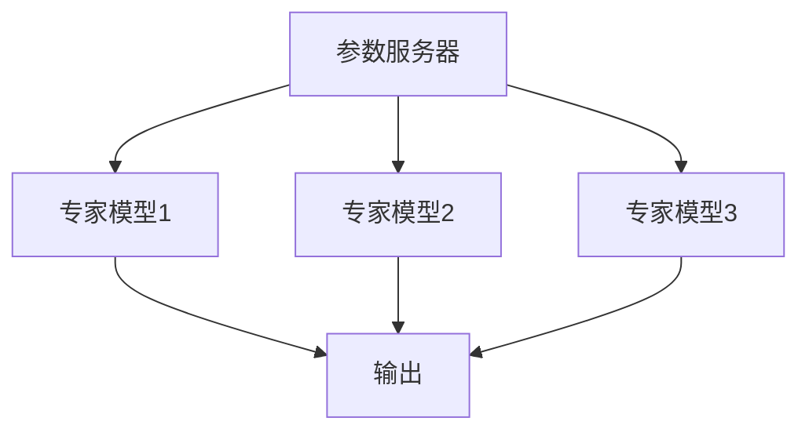

                 

# 1.1 MoE模型的历史与发展

混合专家模型（Mixture of Experts，MoE）的起源可以追溯到分布式计算和并行处理的需求。在20世纪90年代，随着计算机硬件性能的提升，分布式计算逐渐成为研究的热点。Google在2017年首次提出MoE模型，作为其TensorFlow系统中的一个组件，旨在解决大规模机器学习模型训练中的计算资源瓶颈问题。

### 1.1.1 MoE模型的起源

MoE模型的起源可以追溯到分布式计算和并行处理的需求。在20世纪90年代，随着计算机硬件性能的提升，分布式计算逐渐成为研究的热点。Google在2017年首次提出MoE模型，作为其TensorFlow系统中的一个组件，旨在解决大规模机器学习模型训练中的计算资源瓶颈问题。

### 1.1.2 MoE模型的发展历程

自MoE模型首次提出以来，它得到了广泛关注和研究。2018年，Google在论文《Outrageously Large Neural Networks: The Sparsely-Gated Mixture of Experts Layer》中进一步阐述了MoE模型的细节，并展示了其在实践中取得的成绩。

### 1.1.3 MoE模型在现代AI研究中的地位

MoE模型的出现，为解决大规模模型训练问题提供了新的思路。它不仅提高了模型的计算效率，还在实际应用中展现出了强大的性能。因此，MoE模型已经成为AI研究领域的一个热点，并有望在未来的AI发展中发挥重要作用。

## 1.2 MoE模型的核心概念

### 1.2.1 专家模型与参数服务器

MoE模型中的“专家”是指能够独立完成特定任务的小型模型。这些专家模型通过参数服务器进行集中管理，从而实现了大规模模型的分布式训练。

### 1.2.2 混合策略与并行计算

MoE模型通过混合策略（如加权和投票）将多个专家模型的输出整合成一个统一的预测结果，从而实现了并行计算的高效性。这一特性使得MoE模型在处理大量数据时具有明显的优势。

### 1.2.3 分支选择机制

MoE模型中的分支选择机制决定了如何选择合适的专家模型参与预测。这一机制通常基于输入特征、模型权重、以及专家模型的历史性能等因素进行动态调整。

## 1.3 MoE模型与其他模型的关系

### 1.3.1 与传统的深度学习模型的比较

MoE模型与传统深度学习模型（如全连接神经网络、卷积神经网络等）在结构、训练策略和计算效率上存在显著差异。MoE模型通过分布式计算和混合策略实现了更高的计算效率和更好的性能。

### 1.3.2 与其他新兴模型的异同

MoE模型与其他新兴模型（如Transformer、BERT等）在架构和功能上具有一定的相似性，但MoE模型更强调分布式计算和并行处理。这使得MoE模型在处理大规模任务时具有独特的优势。

### 1.3.3 MoE模型的优势与局限性

MoE模型具有以下优势：

- **计算效率高**：通过分布式计算和并行处理，MoE模型能够在较短时间内完成大规模模型的训练。
- **灵活性高**：MoE模型可以根据任务需求动态调整专家模型的选择，从而实现更高的适应性。
- **适用范围广**：MoE模型可以应用于多种领域，包括自然语言处理、计算机视觉、推荐系统等。

然而，MoE模型也存在一定的局限性：

- **训练复杂度高**：MoE模型需要同时训练多个专家模型，这增加了模型的训练时间和计算成本。
- **资源需求大**：MoE模型需要大量的计算资源和存储资源，这使得其在资源有限的场景下难以部署。

## 2.1 MoE模型的结构

### 2.1.1 模型架构图

MoE模型通常由一个参数服务器和多个专家模型组成。参数服务器负责存储和管理模型参数，专家模型则负责处理具体的任务。以下是MoE模型的基本架构图：

### 2.1.2 专家模型的工作原理

专家模型通常是一个小型神经网络，用于处理特定类型的输入数据。在MoE模型中，每个专家模型都独立训练，并独立输出预测结果。专家模型的工作原理如下：

1. **输入处理**：专家模型接收输入数据，并进行预处理。
2. **特征提取**：通过多个隐藏层提取输入数据的特征。
3. **输出预测**：将提取到的特征输入到输出层，生成预测结果。

### 2.1.3 模型的并行计算能力

MoE模型通过并行计算实现了高效的模型训练和预测。在训练过程中，多个专家模型可以同时处理输入数据，从而加快了模型的收敛速度。在预测过程中，多个专家模型的输出结果可以并行整合，从而提高了预测的效率。并行计算能力使得MoE模型在处理大规模数据时具有明显的优势。

## 2.2 MoE模型的训练策略

### 2.2.1 预训练与微调

MoE模型的训练策略通常包括预训练和微调两个阶段。预训练阶段旨在利用大规模数据集对模型进行训练，从而提高模型的泛化能力。微调阶段则是在特定任务数据集上对模型进行进一步调整，以优化模型的性能。

1. **预训练**：在预训练阶段，MoE模型通过大规模数据集进行训练，以学习通用特征表示。这一阶段的主要目标是使模型能够处理各种类型的输入数据，从而提高模型的泛化能力。
2. **微调**：在预训练完成后，模型会迁移到一个特定任务的数据集上进行微调。微调阶段的目标是优化模型在特定任务上的性能，使其能够更好地适应实际应用场景。

### 2.2.2 多任务学习与迁移学习

MoE模型支持多任务学习和迁移学习，这意味着模型可以在不同任务之间共享参数，从而提高训练效率和模型性能。

1. **多任务学习**：多任务学习是指在一个统一模型中同时训练多个相关任务。MoE模型通过将多个任务的数据输入到同一个模型中，共享模型参数，从而提高了模型的训练效率。同时，多任务学习还可以帮助模型更好地理解任务之间的关联性，从而提高模型的泛化能力。
2. **迁移学习**：迁移学习是指将一个任务在某个数据集上训练得到的模型，应用到另一个相关任务上。MoE模型通过将预训练模型迁移到新任务上，可以减少新任务的训练时间和计算成本，同时提高模型的性能。

### 2.2.3 模型的持续优化

MoE模型的训练是一个持续优化的过程。通过定期评估模型的性能，可以及时发现和纠正模型的问题。此外，还可以利用在线学习技术，实时调整模型参数，从而实现模型的动态优化。

1. **性能评估**：在训练过程中，定期评估模型的性能，可以及时发现模型存在的问题。性能评估通常包括准确率、召回率、F1值等指标。
2. **在线学习**：在线学习是指模型在实时环境中不断接收新数据，并实时调整模型参数。MoE模型通过在线学习技术，可以持续优化模型性能，使其能够适应不断变化的环境。

## 2.3 MoE模型的优化算法

### 2.3.1 梯度下降法

梯度下降法是MoE模型训练中最常用的优化算法。它通过计算损失函数关于模型参数的梯度，并沿着梯度方向调整参数，从而实现模型的优化。

1. **前向传播**：在梯度下降法中，首先进行前向传播，计算损失函数关于输入数据的梯度。
2. **反向传播**：然后进行反向传播，计算损失函数关于模型参数的梯度。
3. **参数更新**：最后，根据梯度更新模型参数，以减小损失函数。

### 2.3.2 适应性学习率

适应性学习率是梯度下降法的一种改进，它可以根据模型在不同阶段的收敛速度自动调整学习率。这种方法可以避免学习率过小导致模型收敛缓慢，或学习率过大导致模型发散。

1. **学习率调整**：在模型训练过程中，根据模型的收敛速度自动调整学习率。当模型收敛速度较慢时，增加学习率；当模型收敛速度过快时，减小学习率。
2. **优势**：适应性学习率可以提高模型的收敛速度，并避免模型在训练过程中出现过拟合。

### 2.3.3 权重共享与正则化

权重共享和正则化是提高MoE模型性能的重要手段。权重共享可以减少模型参数的数量，从而降低模型的复杂度和过拟合的风险。正则化则通过在损失函数中添加惩罚项，来抑制模型参数的增长，从而提高模型的泛化能力。

1. **权重共享**：在MoE模型中，多个专家模型之间共享部分参数，从而减少模型参数的数量。权重共享可以简化模型结构，提高模型训练效率。
2. **正则化**：正则化通过在损失函数中添加惩罚项，来抑制模型参数的增长。常见的正则化方法包括L1正则化和L2正则化。

## 3.1 MoE模型在自然语言处理中的应用

### 3.1.1 语言模型的构建

MoE模型在自然语言处理（NLP）中首先应用于构建语言模型。语言模型是一个用于预测下一个单词或字符的概率分布的模型。通过预训练和微调，MoE语言模型可以生成高质量的文本，并在文本生成、机器翻译、文本分类等任务中发挥重要作用。

1. **预训练**：在预训练阶段，MoE语言模型通过大规模语料库进行训练，学习单词和字符的概率分布。预训练的目标是使模型能够理解自然语言的语义和语法规则。
2. **微调**：在预训练完成后，MoE语言模型会迁移到一个特定任务的数据集上进行微调。微调的目标是优化模型在特定任务上的性能，使其能够更好地适应实际应用场景。

### 3.1.2 语言生成的性能评估

语言生成的性能评估通常包括文本质量、生成速度和资源消耗等方面。MoE语言模型的生成性能可以通过多种指标进行评估，如BLEU分数、ROUGE分数、Perplexity等。此外，还可以通过人工评估和用户反馈来评估模型生成的文本质量。

1. **文本质量**：评估文本生成模型的文本质量，主要关注文本的可读性、连贯性和语法正确性。
2. **生成速度**：评估模型生成文本的速度，主要关注模型在生成文本时的响应时间。
3. **资源消耗**：评估模型在生成文本时的资源消耗，包括计算资源和存储资源。

### 3.1.3 语言理解的实现

MoE模型不仅在语言生成方面表现出色，还在语言理解方面具有强大的能力。通过构建双向语言模型，MoE模型可以实现文本的语义解析、情感分析、实体识别等任务。这些任务对于智能客服、搜索引擎、信息检索等领域具有重要意义。

1. **语义解析**：MoE模型可以通过分析文本的语义信息，实现语义解析任务，如文本分类、情感分析等。
2. **情感分析**：MoE模型可以识别文本中的情感倾向，如正面、负面、中性等。
3. **实体识别**：MoE模型可以识别文本中的命名实体，如人名、地名、组织名等。

## 3.2 MoE模型在机器翻译中的应用

### 3.2.1 翻译模型的构建

MoE模型在机器翻译中的应用主要体现在翻译模型的构建。通过预训练和微调，MoE翻译模型可以学习源语言和目标语言之间的对应关系，从而实现高质量的机器翻译。

1. **预训练**：在预训练阶段，MoE翻译模型通过大规模的双语语料库进行训练，学习源语言和目标语言之间的概率分布。预训练的目标是使模型能够理解两种语言的语义和语法规则。
2. **微调**：在预训练完成后，MoE翻译模型会迁移到一个特定的翻译任务上进行微调。微调的目标是优化模型在特定翻译任务上的性能，使其能够更好地适应实际应用场景。

### 3.2.2 翻译性能的提升

MoE翻译模型在翻译性能方面具有明显优势。首先，通过并行计算，MoE模型可以加速翻译速度。其次，通过动态调整专家模型的选择，MoE模型可以优化翻译结果。此外，MoE模型还可以通过多任务学习和迁移学习来提升翻译性能。

1. **并行计算**：MoE模型通过并行计算，可以同时处理多个翻译任务，从而加快翻译速度。
2. **动态调整**：MoE模型可以根据输入文本的特征动态调整专家模型的选择，从而优化翻译结果。
3. **多任务学习**：MoE模型可以通过多任务学习，同时训练多个相关翻译任务，从而提高模型的泛化能力。
4. **迁移学习**：MoE模型可以通过迁移学习，将预训练模型的知识迁移到新任务上，从而减少新任务的训练时间和计算成本。

### 3.2.3 翻译结果的评估

翻译结果的评估通常包括准确性、流畅性和自然度等方面。MoE翻译模型的翻译结果可以通过多种评估指标进行评估，如BLEU、METEOR、ROUGE等。此外，还可以通过人工评估和用户反馈来评估翻译质量。

1. **准确性**：评估翻译结果的准确性，主要关注翻译结果的语法正确性和词汇选择。
2. **流畅性**：评估翻译结果的流畅性，主要关注翻译结果的连贯性和可读性。
3. **自然度**：评估翻译结果的

