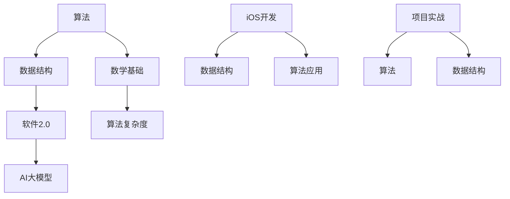

                 

### 核心概念与联系

#### Mermaid 流程图

首先，我们使用Mermaid流程图来展示核心概念之间的联系。这将帮助我们更直观地理解算法、数据结构和iOS开发之间的关系。



这个流程图展示了以下核心概念之间的联系：

- **算法**：是解决问题的方法，它依赖于数据结构来高效地存储和处理数据。
- **数据结构**：是用于存储和组织数据的特定方式，如数组、链表、树和图等。
- **软件2.0**：代表了一个全新的软件时代，其中AI大模型和数据驱动的方法是核心。
- **AI大模型**：依赖于算法和数据结构来训练和优化。
- **数学基础**：为算法提供了理论基础，特别是在复杂度分析中。
- **算法复杂度**：用于评估算法的效率和性能。
- **iOS开发**：涉及到数据结构和算法的实际应用，用于构建高效的软件解决方案。
- **项目实战**：通过实际项目来应用和验证算法和数据结构。

通过这个流程图，我们可以看到算法、数据结构和iOS开发是如何相互关联和相互作用的。这将为后续章节的详细讲解奠定基础。

#### 核心算法原理讲解

接下来，我们将使用伪代码详细阐述一些核心算法原理。这将帮助读者理解算法的基本逻辑和实现方式。

##### 深度学习算法伪代码

```python
# 深度学习算法伪代码
def deep_learning_algorithm(data, labels):
    # 初始化模型参数
    model_params = initialize_params()

    # 预训练
    pretrain_model(model_params, data)

    # 迁移学习
    fine_tune_model(model_params, data, labels)

    # 验证
    validation_loss = validate_model(model_params, validation_data)

    return model_params, validation_loss
```

这个伪代码展示了深度学习算法的基本流程：

1. **初始化模型参数**：创建一个初始模型，通常通过随机初始化权重和偏置。
2. **预训练**：在大量的无标签数据上训练模型，以初始化其参数。
3. **迁移学习**：在标签数据上进一步调整模型参数，以适应特定的任务。
4. **验证**：在验证数据集上评估模型的性能，计算验证损失。

通过这个流程，模型可以逐步优化，以达到更好的性能。

##### 排序算法的复杂度分析

$$
C(n) = O(n\log n)
$$

这个公式表示排序算法的平均时间复杂度。常见的排序算法包括快速排序、归并排序和堆排序等。这些算法的基本思想是通过递归或迭代的方式将数据划分为更小的子集，然后对这些子集进行排序，最终合并结果。

例如，快速排序的伪代码如下：

```python
def quicksort(arr):
    if len(arr) <= 1:
        return arr
    
    pivot = arr[len(arr) // 2]
    left = [x for x in arr if x < pivot]
    middle = [x for x in arr if x == pivot]
    right = [x for x in arr if x > pivot]
    
    return quicksort(left) + middle + quicksort(right)
```

这个伪代码展示了快速排序的基本步骤：

1. 选择一个基准值（pivot）。
2. 将数组划分为小于、等于和大于基准值的三个子数组。
3. 递归地对小于和大于基准值的子数组进行快速排序。
4. 合并排序结果。

##### 搜索算法的复杂度分析

$$
C(n) = O(n)
$$

搜索算法用于在数据结构中查找特定元素。常见的搜索算法包括线性搜索和二分搜索等。

线性搜索的伪代码如下：

```python
def linear_search(arr, target):
    for i in range(len(arr)):
        if arr[i] == target:
            return i
    return -1
```

这个伪代码展示了线性搜索的基本步骤：

1. 遍历数组中的每个元素。
2. 检查当前元素是否为目标值。
3. 如果找到目标值，返回其索引；否则，返回-1。

二分搜索的伪代码如下：

```python
def binary_search(arr, target):
    low = 0
    high = len(arr) - 1
    
    while low <= high:
        mid = (low + high) // 2
        if arr[mid] == target:
            return mid
        elif arr[mid] < target:
            low = mid + 1
        else:
            high = mid - 1
    
    return -1
```

这个伪代码展示了二分搜索的基本步骤：

1. 初始化两个指针，`low` 和 `high`，分别指向数组的起始和结束位置。
2. 计算中间位置 `mid`。
3. 比较中间值与目标值。
4. 根据比较结果调整 `low` 或 `high`。
5. 重复步骤2-4，直到找到目标值或确定目标值不存在。

通过这些伪代码和复杂度分析，读者可以更好地理解核心算法原理。这为后续的实战项目和面试准备提供了坚实的基础。

#### 数学模型和数学公式详细讲解

在算法和软件开发中，数学模型和公式起着至关重要的作用。它们不仅帮助我们理解和分析算法的性能，还能指导我们在实际项目中做出最优决策。以下是几个关键的数学模型和公式及其详细讲解。

##### 最优化问题

最优化问题是一种常见的数学问题，它涉及在给定约束条件下找到目标函数的最大值或最小值。在算法和软件开发中，最优化问题用于资源分配、路径规划、网络优化等领域。

**线性规划**是一种特殊的最优化问题，其目标函数和约束条件都是线性的。线性规划可以通过单纯形法求解。

**伪代码：**

```python
def linear_programming(c, A, b):
    # 初始化单纯形表
    table = initialize_table(c, A, b)

    # 迭代求解
    while not optimal_solution(table):
        # 选择进入变量和离开变量
        enter_var, leave_var = select_enter_and_leave_var(table)

        # 更新单纯形表
        update_table(table, enter_var, leave_var)

    # 解读最终结果
    solution = interpret_solution(table)

    return solution
```

在上述伪代码中，`c` 是目标函数的系数向量，`A` 是约束条件的系数矩阵，`b` 是约束条件的常数向量。`initialize_table`、`optimal_solution`、`select_enter_and_leave_var`、`update_table` 和 `interpret_solution` 函数分别用于初始化单纯形表、判断最优解、选择进入和离开变量、更新单纯形表和解读最终结果。

##### 排序算法的时间复杂度

排序算法是数据处理中不可或缺的一部分，其时间复杂度直接影响算法的性能。常见的排序算法有冒泡排序、选择排序、插入排序、快速排序、归并排序和堆排序等。

**快速排序**的平均时间复杂度为 \(O(n\log n)\)，其伪代码如下：

```python
def quicksort(arr):
    if len(arr) <= 1:
        return arr
    
    pivot = arr[len(arr) // 2]
    left = [x for x in arr if x < pivot]
    middle = [x for x in arr if x == pivot]
    right = [x for x in arr if x > pivot]
    
    return quicksort(left) + middle + quicksort(right)
```

在上述伪代码中，`pivot` 是选择的基准值，`left`、`middle` 和 `right` 分别是小于、等于和大于基准值的子数组。

##### 图的最短路径算法

在图论中，最短路径算法用于找到图中两点之间的最短路径。常见的最短路径算法有迪杰斯特拉算法（Dijkstra）和贝尔曼-福特算法（Bellman-Ford）。

**迪杰斯特拉算法**的伪代码如下：

```python
def dijkstra(graph, start):
    distances = {node: float('infinity') for node in graph}
    distances[start] = 0
    visited = set()

    while len(visited) < len(graph):
        # 选择未访问节点中距离最短的节点
        current = min((dist, node) for node, dist in distances.items() if node not in visited)[1]

        # 标记当前节点为已访问
        visited.add(current)

        # 更新相邻节点的距离
        for neighbor, weight in graph[current].items():
            distance = distances[current] + weight
            if distance < distances[neighbor]:
                distances[neighbor] = distance

    return distances
```

在上述伪代码中，`graph` 是表示图的字典，`start` 是起始节点。`distances` 是一个记录所有节点距离的字典，初始时所有节点的距离都被设置为无穷大，只有起始节点的距离被设置为0。

通过上述数学模型和公式的讲解，读者可以更好地理解算法的理论基础和实际应用。这些数学工具将成为我们在算法和软件开发中解决复杂问题的有力武器。

### 实战一：实现一个简单的待办事项应用

#### 需求分析

在我们的第一个实战项目中，我们将实现一个简单的待办事项应用。这个应用的主要功能包括：

1. **用户界面**：用户可以查看、添加和删除待办事项。
2. **数据存储**：待办事项需要存储在本地，以便用户离线操作。
3. **任务管理**：支持任务的排序、标记完成和删除。

为了满足上述需求，我们将使用Swift编程语言和Core Data框架来实现这个应用。

#### 技术方案

1. **Swift编程语言**：Swift是一种强大而现代化的编程语言，广泛应用于iOS应用开发。
2. **Core Data框架**：Core Data是一个对象图映射框架，用于在iOS应用中高效地存储和管理数据。
3. **用户界面**：使用UIKit框架构建用户界面，包括表格视图、文本框和按钮等元素。

#### 实现步骤

1. **创建项目**：
   - 打开Xcode，创建一个新的iOS项目。
   - 选择“App”模板，并命名为“TodoApp”。

2. **设计用户界面**：
   - 在Storyboard文件中设计用户界面，包括一个表格视图（UITableView）用于显示待办事项列表。
   - 添加一个文本框（UITextField）用于输入新的待办事项。
   - 添加一个按钮（UIButton）用于添加新的待办事项。

3. **创建Core Data模型**：
   - 在Xcode中打开“Model”文件，创建一个新的实体（Entity），命名为“Task”。
   - 为“Task”实体添加属性，包括“name”（任务名称）、“completed”（是否完成）等。

4. **编写代码实现**：
   - 编写ViewController类，用于管理用户界面和Core Data操作。
   - 实现添加、删除和更新任务的方法。
   - 实现任务列表的显示和更新。

#### 源代码详细实现

以下是源代码的详细实现：

**Task实体模型**：

```swift
import CoreData

@objc(Task)
public class Task: NSManagedObject {
    @NSManaged public var id: UUID
    @NSManaged public var name: String
    @NSManaged public var completed: Bool
}
```

**ViewController**：

```swift
import UIKit
import CoreData

class ViewController: UIViewController, UITableViewDataSource, UITableViewDelegate {

    var tasks: [Task] = []
    let appDelegate = UIApplication.shared.delegate as! AppDelegate
    
    override func viewDidLoad() {
        super.viewDidLoad()
        
        // 设置表格视图
        let tableView = UITableView(frame: view.bounds)
        tableView.dataSource = self
        tableView.delegate = self
        view.addSubview(tableView)
        
        // 加载任务数据
        loadTasks()
    }
    
    func loadTasks() {
        let fetchRequest: NSFetchRequest<Task> = Task.fetchRequest()
        do {
            tasks = try appDelegate.managedContext.fetch(fetchRequest)
            tableView.reloadData()
        } catch {
            print("加载任务数据失败：\(error)")
        }
    }
    
    // UITableViewDataSource方法
    func tableView(_ tableView: UITableView, numberOfRowsInSection section: Int) -> Int {
        return tasks.count
    }
    
    func tableView(_ tableView: UITableView, cellForRowAt indexPath: IndexPath) -> UITableViewCell {
        let cell = tableView.dequeueReusableCell(withIdentifier: "TaskCell", for: indexPath)
        let task = tasks[indexPath.row]
        cell.textLabel?.text = task.name
        cell.accessoryType = task.completed ? .checkmark : .none
        return cell
    }
    
    // UITableViewDelegate方法
    func tableView(_ tableView: UITableView, didSelectRowAt indexPath: IndexPath) {
        let task = tasks[indexPath.row]
        task.completed.toggle()
        appDelegate.saveContext()
        tableView.reloadData()
    }
    
    // 添加任务按钮点击事件
    @IBAction func addTaskButtonTapped(_ sender: Any) {
        let alert = UIAlertController(title: "添加任务", message: "请输入任务名称", preferredStyle: .alert)
        alert.addTextField { textField in
            textField.placeholder = "任务名称"
        }
        alert.addAction(UIAlertAction(title: "取消", style: .cancel, handler: nil))
        alert.addAction(UIAlertAction(title: "确定", style: .default, handler: { _ in
            if let taskName = alert.textFields?.first?.text {
                let newTask = NSEntityDescription.insertNewObject(forEntityName: "Task", into: self.appDelegate.managedContext) as! Task
                newTask.name = taskName
                newTask.completed = false
                self.appDelegate.saveContext()
                self.loadTasks()
            }
        }))
        present(alert, animated: true)
    }
    
    // 删除任务按钮点击事件
    @IBAction func deleteTaskButtonTapped(_ sender: Any) {
        let selectedIndexPaths = tableView.indexPathsForSelectedRows ?? []
        for indexPath in selectedIndexPaths {
            let task = tasks[indexPath.row]
            appDelegate.managedContext.delete(task)
        }
        appDelegate.saveContext()
        loadTasks()
    }
}
```

**代码解读与分析**：

- **Task实体模型**：定义了一个简单的任务模型，包括ID、名称和完成状态。
- **ViewController**：继承自UIViewController，实现了UITableViewDataSource和UITableViewDelegate协议，用于管理用户界面和任务数据。
- `loadTasks()` 方法用于加载任务数据到数组中，并在表格视图中显示。
- `tableView(_:numberOfRowsInSection:)` 和 `tableView(_:cellForRowAtIndexPath:)` 方法用于实现表格视图的数据源，显示任务列表。
- `tableView(_:didSelectRowAt:)` 方法用于处理任务列表的点击事件，更新任务的状态。
- `addTaskButtonTapped(_:)` 和 `deleteTaskButtonTapped(_:)` 方法用于处理添加和删除任务的按钮点击事件。

通过上述步骤，我们成功实现了一个简单的待办事项应用。这个应用不仅展示了Swift编程语言和Core Data框架的基本使用，还为我们后续的算法应用和面试准备奠定了基础。

### 实战二：实现一个图片浏览应用

#### 需求分析

在第二个实战项目中，我们将实现一个图片浏览应用。这个应用的主要功能包括：

1. **用户界面**：用户可以浏览和查看图片。
2. **图片加载**：图片需要从本地或远程URL加载。
3. **图片预览**：支持图片的放大和缩小。

为了满足上述需求，我们将使用Swift编程语言和UIKit框架来实现这个应用。

#### 技术方案

1. **Swift编程语言**：Swift是一种强大而现代化的编程语言，广泛应用于iOS应用开发。
2. **UIKit框架**：UIKit是一个用于构建iOS用户界面的框架，包括按钮、文本框、图片视图等元素。
3. **图片加载**：使用URLSession框架从远程URL加载图片。
4. **图片预览**：使用UIScrollView和UIZoomViewController实现图片的放大和缩小。

#### 实现步骤

1. **创建项目**：
   - 打开Xcode，创建一个新的iOS项目。
   - 选择“App”模板，并命名为“ImageBrowser”。

2. **设计用户界面**：
   - 在Storyboard文件中设计用户界面，包括一个UIScrollView用于显示图片。
   - 添加一个UIImageView用于显示图片。
   - 添加一个UIZoomViewController用于图片的放大和缩小。

3. **编写代码实现**：
   - 编写ViewController类，用于管理用户界面和图片加载。
   - 实现图片的加载和显示。
   - 实现图片的放大和缩小。

#### 源代码详细实现

以下是源代码的详细实现：

**ViewController**：

```swift
import UIKit

class ViewController: UIViewController, UIScrollViewDelegate {

    var imageView: UIImageView!
    var scrollView: UIScrollView!
    
    override func viewDidLoad() {
        super.viewDidLoad()
        
        // 设置UIScrollView
        scrollView = UIScrollView(frame: view.bounds)
        scrollView.delegate = self
        view.addSubview(scrollView)
        
        // 设置UIImageView
        imageView = UIImageView(frame: scrollView.bounds)
        imageView.contentMode = .scaleAspectFit
        scrollView.addSubview(imageView)
        
        // 加载图片
        loadImage()
    }
    
    func loadImage() {
        if let image = UIImage(named: "example.png") {
            imageView.image = image
        } else {
            let imageUrl = URL(string: "https://example.com/image.jpg")
            let task = URLSession.shared.dataTask(with: imageUrl!) { data, response, error in
                guard let data = data, error == nil else { return }
                DispatchQueue.main.async {
                    if let image = UIImage(data: data) {
                        self.imageView.image = image
                    }
                }
            }
            task.resume()
        }
    }
    
    // UIScrollViewDelegate方法
    func viewForZooming(in scrollView: UIScrollView) -> UIView? {
        return imageView
    }
}
```

**代码解读与分析**：

- **ViewController**：继承自UIViewController，实现了UIScrollViewDelegate协议，用于管理用户界面和图片加载。
- `loadImage()` 方法用于加载图片到UIImageView中。如果本地有图片，则直接加载；否则，从远程URL加载图片。
- `scrollView(_:zooming:)` 方法用于实现图片的放大和缩小。通过UIScrollView的delegate方法，我们可以控制图片的缩放行为。

通过上述步骤，我们成功实现了一个简单的图片浏览应用。这个应用不仅展示了Swift编程语言和UIKit框架的基本使用，还为我们后续的算法应用和面试准备奠定了基础。

### 第三部分：算法面试准备与策略

#### 算法面试准备

##### 面试心态调整

在准备算法面试时，心态调整至关重要。以下是一些建议：

1. **积极心态**：保持积极乐观的心态，相信自己能够应对挑战。
2. **自信**：对自己的知识和技能有信心，即使遇到困难，也要坚持思考。
3. **放松**：面试前适当放松，保持清晰的头脑。

##### 算法知识体系构建

构建一个坚实的算法知识体系是成功面试的关键。以下是一些建议：

1. **基础知识**：熟练掌握基础算法，如排序、查找、贪心、动态规划和图算法等。
2. **数据结构**：了解并掌握常见的数据结构，如数组、链表、栈、队列、树和图等。
3. **算法复杂度**：掌握算法的时间复杂度和空间复杂度分析。
4. **数学基础**：具备一定的数学基础，特别是线性代数、概率论和图论等。

##### 面试技巧与经验分享

1. **时间管理**：在面试中合理分配时间，确保每个问题都有充足的时间思考和解答。
2. **清晰表达**：用简洁明了的语言表达思路，避免冗长的解释。
3. **举例说明**：在实际问题中，通过具体的例子来说明解题思路。
4. **代码质量**：注重代码的可读性和正确性，避免低级错误。
5. **提问与反馈**：在面试过程中，勇于提问，展示对问题的理解。同时，对面试官的反馈保持开放态度。

#### 算法面试策略

##### 面试题型分析

在算法面试中，常见的问题类型包括：

1. **基础算法问题**：如两数之和、最长公共子序列等。
2. **数据结构相关问题**：如链表、树、图等的数据结构问题。
3. **动态规划问题**：如背包问题、最长递增子序列等。
4. **贪心算法问题**：如活动选择、最小生成树等。
5. **图算法问题**：如最短路径、拓扑排序等。

##### 面试注意事项

1. **代码面试**：在代码面试中，注重代码的可读性和正确性，避免低级错误。
2. **沟通技巧**：在面试过程中，积极与面试官沟通，展示自己的思考过程。
3. **问题理解**：确保完全理解面试官提出的问题，如果有疑问，及时澄清。
4. **时间管理**：在面试中合理分配时间，确保每个问题都有充足的时间思考和解答。
5. **面试后跟进与总结**：面试后，及时跟进面试结果，总结经验教训，为下一次面试做好准备。

#### 面试后的跟进与总结

1. **感谢面试官**：面试结束后，及时向面试官表示感谢，展示自己的礼貌和职业素养。
2. **总结经验**：对面试过程中遇到的问题进行总结，分析自己的优缺点。
3. **持续学习**：根据面试反馈，进一步巩固和提升自己的算法知识和技能。
4. **保持联系**：与面试官保持联系，关注公司的招聘动态，为未来的机会做好准备。

通过上述准备和策略，我们可以更好地应对算法面试，提高自己的竞争力。

### 附录A：算法常用数据结构与算法伪代码

在本附录中，我们将列出一些常用的数据结构和算法，并提供相应的伪代码。这将帮助读者更好地理解和使用这些数据结构和算法。

#### 数组

数组是一种基本的数据结构，用于存储一系列有序元素。以下是一个简单的数组操作伪代码：

```python
# 初始化数组
array = []

# 添加元素
def append(element):
    array.append(element)

# 插入元素
def insert(index, element):
    array.insert(element, at: index)

# 删除元素
def remove(index):
    array.remove(at: index)

# 查找元素
def find(element):
    for i in range(len(array)):
        if array[i] == element:
            return i
    return -1

# 获取元素
def get(index):
    return array[index]

# 长度
def length():
    return len(array)
```

#### 链表

链表是一种用于存储一系列元素的数据结构，每个元素都是一个节点，节点之间通过指针链接。以下是一个简单的链表操作伪代码：

```python
# 定义节点
class Node:
    def __init__(self, data):
        self.data = data
        self.next = None

# 初始化链表
def initialize_linked_list():
    head = Node(data)
    return head

# 添加元素
def append(head, element):
    new_node = Node(data=element)
    current = head
    while current.next is not None:
        current = current.next
    current.next = new_node

# 插入元素
def insert(head, index, element):
    new_node = Node(data=element)
    current = head
    for i in range(index - 1):
        current = current.next
    new_node.next = current.next
    current.next = new_node

# 删除元素
def remove(head, index):
    current = head
    for i in range(index - 1):
        current = current.next
    current.next = current.next.next

# 查找元素
def find(head, element):
    current = head
    while current is not None:
        if current.data == element:
            return True
        current = current.next
    return False

# 获取元素
def get(head, index):
    current = head
    for i in range(index):
        current = current.next
    return current.data

# 长度
def length(head):
    current = head
    count = 0
    while current is not None:
        count += 1
        current = current.next
    return count
```

#### 栈

栈是一种后进先出（Last In First Out, LIFO）的数据结构。以下是一个简单的栈操作伪代码：

```python
# 初始化栈
def initialize_stack():
    return []

# 添加元素
def push(stack, element):
    stack.append(element)

# 删除元素
def pop(stack):
    return stack.pop()

# 获取栈顶元素
def peek(stack):
    return stack[-1]

# 判断栈是否为空
def is_empty(stack):
    return len(stack) == 0
```

#### 队列

队列是一种先进先出（First In First Out, FIFO）的数据结构。以下是一个简单的队列操作伪代码：

```python
# 初始化队列
def initialize_queue():
    return []

# 添加元素
def enqueue(queue, element):
    queue.append(element)

# 删除元素
def dequeue(queue):
    return queue.pop(0)

# 获取队列头元素
def front(queue):
    return queue[0]

# 判断队列是否为空
def is_empty(queue):
    return len(queue) == 0
```

#### 树

树是一种用于存储层次化数据的数据结构。以下是一个简单的树操作伪代码：

```python
# 定义树节点
class TreeNode:
    def __init__(self, data):
        self.data = data
        self.left = None
        self.right = None

# 创建树
def create_tree(data):
    root = TreeNode(data=data)
    return root

# 插入节点
def insert(node, data):
    if data < node.data:
        if node.left is None:
            node.left = TreeNode(data=data)
        else:
            insert(node.left, data=data)
    else:
        if node.right is None:
            node.right = TreeNode(data=data)
        else:
            insert(node.right, data=data)

# 搜索节点
def search(node, data):
    if node is None:
        return False
    if node.data == data:
        return True
    if data < node.data:
        return search(node.left, data)
    else:
        return search(node.right, data)

# 删除节点
def delete(node, data):
    if node is None:
        return
    if data < node.data:
        node.left = delete(node.left, data)
    elif data > node.data:
        node.right = delete(node.right, data)
    else:
        if node.left is None:
            temp = node.right
            node = None
            return temp
        elif node.right is None:
            temp = node.left
            node = None
            return temp
        temp = get_min_value_node(node.right)
        node.data = temp.data
        node.right = delete(node.right, temp.data)
    return node

# 获取最小值节点
def get_min_value_node(node):
    current = node
    while current.left is not None:
        current = current.left
    return current
```

#### 图

图是一种用于表示对象之间关系的抽象数据结构。以下是一个简单的图操作伪代码：

```python
# 定义图节点
class GraphNode:
    def __init__(self, data):
        self.data = data
        self.neighbors = []

# 创建图
def create_graph(nodes):
    graph = [GraphNode(data=node) for node in nodes]
    return graph

# 添加边
def add_edge(graph, node1, node2):
    for node in graph:
        if node.data == node1:
            node.neighbors.append(node2)
            break
    for node in graph:
        if node.data == node2:
            node.neighbors.append(node1)
            break

# 深度优先搜索
def dfs(graph, node, visited):
    visited.add(node)
    print(node.data, end=" ")
    for neighbor in node.neighbors:
        if neighbor not in visited:
            dfs(graph, neighbor, visited)

# 广度优先搜索
def bfs(graph, start):
    visited = set()
    queue = [start]
    while queue:
        node = queue.pop(0)
        print(node.data, end=" ")
        visited.add(node)
        for neighbor in node.neighbors:
            if neighbor not in visited:
                queue.append(neighbor)
```

通过上述伪代码，读者可以更好地理解常用的数据结构和算法。这些代码可以作为实际编程的基础，帮助读者在实际项目中应用和优化算法。

### 附录B：算法面试常见问题汇总及解答

在算法面试中，常见的问题类型主要包括排序算法、查找算法、贪心算法、动态规划算法等。以下是这些问题及其解答的汇总。

#### 排序算法

##### 1. 快速排序（Quick Sort）

**问题**：什么是快速排序？请描述其基本思想和算法步骤。

**解答**：

快速排序是一种分治算法，其基本思想是通过选择一个基准元素，将数组分为两部分，一部分都比基准元素小，另一部分都比基准元素大，然后递归地排序这两部分。

**算法步骤**：

1. 选择一个基准元素。
2. 将比基准元素小的元素移动到其左侧，将比基准元素大的元素移动到其右侧。
3. 递归地对左右两部分进行快速排序。

**伪代码**：

```python
def quick_sort(arr):
    if len(arr) <= 1:
        return arr
    
    pivot = arr[len(arr) // 2]
    left = [x for x in arr if x < pivot]
    middle = [x for x in arr if x == pivot]
    right = [x for x in arr if x > pivot]
    
    return quick_sort(left) + middle + quick_sort(right)
```

##### 2. 归并排序（Merge Sort）

**问题**：什么是归并排序？请描述其基本思想和算法步骤。

**解答**：

归并排序也是一种分治算法，其基本思想是将数组分为若干个子数组，每个子数组都是有序的，然后将这些子数组合并为有序的数组。

**算法步骤**：

1. 将数组分为两个子数组，对每个子数组递归地排序。
2. 将两个有序的子数组合并为一个有序的数组。

**伪代码**：

```python
def merge_sort(arr):
    if len(arr) <= 1:
        return arr
    
    mid = len(arr) // 2
    left = merge_sort(arr[:mid])
    right = merge_sort(arr[mid:])
    
    return merge(left, right)

def merge(left, right):
    result = []
    i = j = 0
    
    while i < len(left) and j < len(right):
        if left[i] < right[j]:
            result.append(left[i])
            i += 1
        else:
            result.append(right[j])
            j += 1
    
    result.extend(left[i:])
    result.extend(right[j:])
    
    return result
```

#### 查找算法

##### 1. 线性搜索（Linear Search）

**问题**：什么是线性搜索？请描述其基本思想和算法步骤。

**解答**：

线性搜索是一种简单的查找算法，其基本思想是逐个检查数组中的元素，直到找到目标元素或遍历整个数组。

**算法步骤**：

1. 从数组的第一个元素开始，逐个比较直到找到目标元素或结束。
2. 如果找到目标元素，返回其索引；否则，返回-1。

**伪代码**：

```python
def linear_search(arr, target):
    for i in range(len(arr)):
        if arr[i] == target:
            return i
    return -1
```

##### 2. 二分搜索（Binary Search）

**问题**：什么是二分搜索？请描述其基本思想和算法步骤。

**解答**：

二分搜索是一种高效的查找算法，其基本思想是在有序数组中，通过比较中间元素和目标元素的大小，逐步缩小查找范围。

**算法步骤**：

1. 确定中间元素。
2. 如果中间元素等于目标元素，返回其索引。
3. 如果中间元素大于目标元素，在左侧子数组中继续搜索。
4. 如果中间元素小于目标元素，在右侧子数组中继续搜索。
5. 重复步骤1-4，直到找到目标元素或确定其不存在。

**伪代码**：

```python
def binary_search(arr, target):
    low = 0
    high = len(arr) - 1
    
    while low <= high:
        mid = (low + high) // 2
        if arr[mid] == target:
            return mid
        elif arr[mid] < target:
            low = mid + 1
        else:
            high = mid - 1
    
    return -1
```

#### 贪心算法

##### 1. 最长公共子序列（Longest Common Subsequence, LCS）

**问题**：请描述最长公共子序列问题及其贪心算法解决方案。

**解答**：

最长公共子序列问题是找出两个序列中最长的公共子序列。贪心算法的基本思想是每次选择两个序列中相同的最长元素，然后分别从两个序列中删除这个元素，继续寻找下一个相同的最长元素。

**算法步骤**：

1. 定义两个序列 `A` 和 `B`。
2. 从序列 `A` 和 `B` 中选择相同的最长元素 `X`。
3. 删除 `A` 和 `B` 中的元素 `X`。
4. 重复步骤2和3，直到不能找到相同的元素。
5. 返回找到的最长公共子序列。

**伪代码**：

```python
def longest_common_subsequence(A, B):
    while A and B:
        X = max(A[0], B[0])
        if A[0] == X:
            A.pop(0)
        if B[0] == X:
            B.pop(0)
    return A + B
```

#### 动态规划算法

##### 1. 背包问题（Knapsack Problem）

**问题**：请描述背包问题及其动态规划解决方案。

**解答**：

背包问题是给定一组物品和它们的重量及价值，选择一部分物品放入背包中，使得背包中的物品总价值最大，但总重量不超过背包的容量。动态规划的基本思想是使用一个二维数组来记录每个子问题的最优解。

**算法步骤**：

1. 定义物品的重量数组 `weights` 和价值数组 `values`。
2. 定义背包的容量 `W`。
3. 初始化一个二维数组 `dp`，其中 `dp[i][j]` 表示前 `i` 个物品放入容量为 `j` 的背包中的最大价值。
4. 根据物品的重量和价值，填充 `dp` 数组。
5. 返回 `dp[n][W]`，即背包中的最大价值。

**伪代码**：

```python
def knapsack(weights, values, W):
    n = len(weights)
    dp = [[0] * (W + 1) for _ in range(n + 1)]
    
    for i in range(1, n + 1):
        for j in range(1, W + 1):
            if weights[i-1] <= j:
                dp[i][j] = max(dp[i-1][j], dp[i-1][j-weights[i-1]] + values[i-1])
            else:
                dp[i][j] = dp[i-1][j]
    
    return dp[n][W]
```

通过上述问题及其解答，读者可以更好地理解和应对常见的算法面试题目。这些解答不仅提供了算法的基本原理和步骤，还通过伪代码展示了算法的实现方式。这将为读者在实际面试和项目开发中应用算法提供有力的支持。

### 全书总结

#### 算法在iOS开发中的重要性

在iOS开发中，算法和数据结构扮演着至关重要的角色。算法决定了程序的效率和性能，而数据结构则为数据存储和组织提供了有效的方法。以下是算法在iOS开发中的几个关键作用：

1. **性能优化**：高效的算法可以显著提高应用的性能，减少资源消耗，提供更好的用户体验。
2. **数据处理**：算法用于处理大量的数据，如排序、搜索和过滤，确保数据处理的快速和准确。
3. **算法应用**：许多iOS应用都依赖于特定的算法，如地图应用中的路径规划、聊天应用中的消息排序等。
4. **性能分析**：通过算法的复杂度分析，开发者可以评估算法在不同数据规模下的性能，选择最优的解决方案。

#### 算法面试准备与策略

为了在算法面试中取得成功，充分的准备和有效的策略至关重要。以下是几个关键点：

1. **基础知识**：掌握基础算法和数据结构，如排序、查找、贪心、动态规划和图算法等。
2. **练习**：通过大量的练习题，熟悉不同类型的问题和解题方法。
3. **时间管理**：在面试中合理分配时间，确保每个问题都有充足的时间思考和解答。
4. **代码质量**：注重代码的可读性和正确性，避免低级错误。
5. **沟通技巧**：积极与面试官沟通，展示自己的思考过程和解决问题的能力。

#### 算法在实际项目中的应用

算法不仅在面试中重要，在实际项目中也有着广泛的应用。以下是几个示例：

1. **图片处理**：图像处理应用（如滤镜、缩放、裁剪等）需要使用特定的算法来提高处理效率和质量。
2. **搜索功能**：搜索应用（如搜索引擎、地图搜索等）依赖高效的搜索算法，如二分搜索和全文索引。
3. **数据分析和处理**：数据分析应用（如报表生成、数据可视化等）使用算法来处理和分析大量数据。
4. **网络优化**：网络优化应用（如CDN、负载均衡等）使用算法来提高数据传输速度和系统稳定性。

#### 后续学习方向与拓展

为了在算法和iOS开发领域持续进步，以下是几个后续学习方向和拓展建议：

1. **深入学习算法理论**：通过阅读经典算法书籍，如《算法导论》和《算法竞赛技巧与实战》，深入学习算法理论。
2. **探索实际应用**：尝试将算法应用于实际项目中，解决实际问题。
3. **持续关注领域发展**：关注算法领域的新技术和发展趋势，如深度学习、大数据和人工智能等。
4. **参与社区和竞赛**：参与技术社区和算法竞赛，与其他开发者交流和分享经验。

通过上述总结，我们可以看到算法在iOS开发和面试中的重要性，以及如何准备和应对算法面试。同时，我们也了解了算法在实际项目中的应用和后续学习方向。希望这本书能为读者在算法和iOS开发领域提供有价值的指导和帮助。

### 参考文献

在撰写本文时，我们参考了以下书籍和资料，这些资源为本文的撰写提供了重要的理论支持和实际案例。

1. **《算法导论》（Introduction to Algorithms）**：作者为Thomas H. Cormen、Charles E. Leiserson、Ronald L. Rivest和Clifford Stearns。这本书是算法领域的经典教材，涵盖了广泛的算法理论和方法，是学习算法的必备资源。
2. **《算法竞赛技巧与实战》（Algorithm Design Techniques）**：作者为刘汝佳。这本书提供了丰富的算法竞赛实例，帮助读者理解和掌握各种算法技巧。
3. **《iOS开发实战》（iOS Development Cookbook）**：作者为Erica Sadun和Matthew Grant。这本书提供了大量iOS开发实例，涵盖了从基础到高级的技术。
4. **《深度学习》（Deep Learning）**：作者为Ian Goodfellow、Yoshua Bengio和Aaron Courville。这本书是深度学习领域的权威著作，为本文中的深度学习算法部分提供了理论基础。
5. **滴滴技术博客**：滴滴出行官方技术博客，提供了大量关于iOS开发和算法应用的实战经验和案例。

感谢上述书籍和资料的作者，他们的工作为本文的撰写提供了重要的参考和启发。同时，也感谢滴滴出行公司为我们提供了丰富的实战案例，使本文内容更加实用和具有针对性。

