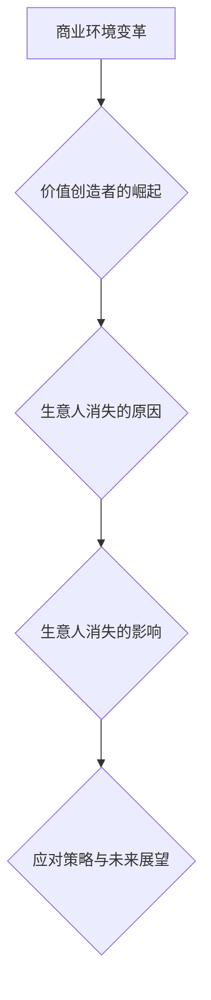

                 

# 生意人消失：价值创造者的时代来临

## 概述

在这个科技迅猛发展的时代，商业环境正在发生翻天覆地的变化。传统的生意人逐渐消失，而价值创造者的崛起成为新时代的象征。本文将深入探讨这一现象背后的原因及其对企业、个人和社会的深远影响。

### 1.1 书籍主题概述

本篇文章的主题是“生意人消失：价值创造者的时代来临”。我们将从以下几个方面展开讨论：

- 商业环境变革
- 价值创造者的崛起
- 生意人消失的原因与影响
- 应对策略与未来展望

### 1.2 目的和意义

本文的目的在于：

- 探讨商业环境变革下的新趋势
- 分析价值创造者的角色与责任
- 提供应对策略与指导

通过本文的探讨，我们希望读者能够：

- 深入理解生意人消失的现象
- 理解价值创造者的核心能力与作用
- 掌握在新时代中如何转型与发展

### 1.3 背景知识

在进入正题之前，我们需要回顾一些相关的背景知识。

#### 2.1 商业历史回顾

- **生意人起源与发展**：生意人是指在商业活动中通过交换商品或服务获取利润的个人或组织。从古代的商人到现代的企业家，生意人在不同历史时期都发挥了重要作用。
- **传统商业模式的局限**：传统的商业模式依赖于供应链管理、库存控制和销售渠道。然而，在信息化和数字化时代，这些传统模式面临诸多挑战，如成本高、效率低、难以应对市场变化等。

#### 2.2 价值创造者的定义与特点

- **价值创造者的定义**：价值创造者是指在新时代背景下，通过创新思维和行动，为企业和客户创造价值的个体或团队。
- **价值创造者的特点**：价值创造者具备以下特点：

  - 创新能力：能够提出创新的解决方案，推动业务发展。
  - 客户洞察力：深入了解客户需求，提供定制化的产品和服务。
  - 风险管理能力：能够识别和应对风险，确保企业稳定发展。

#### 2.3 新商业环境下的挑战与机遇

- **挑战分析**：在新的商业环境下，企业面临以下挑战：

  - 技术变革：互联网、人工智能等技术的快速发展，要求企业不断更新技术栈，提升业务效率。
  - 市场竞争：市场竞争日益激烈，企业需要不断创新和优化商业模式，以保持竞争优势。
  - 消费者需求变化：消费者需求多样化、个性化，企业需要提供个性化的产品和服务。

- **机遇分析**：新的商业环境也为企业带来了以下机遇：

  - 创新机遇：技术进步为企业提供了创新的工具和平台，有助于企业实现业务创新。
  - 市场拓展：全球化趋势为企业提供了更广阔的市场空间，有助于企业实现业务扩张。
  - 资源整合：企业可以通过跨领域合作，整合各类资源，实现价值的最大化。

- **应对策略**：企业应采取以下策略应对新的商业环境：

  - 技术创新：加大对技术的投入，提升企业的技术竞争力。
  - 商业模式创新：探索新的商业模式，提高企业的市场适应能力。
  - 客户导向：以客户需求为中心，提供个性化的产品和服务。

### 3. 价值创造者的崛起

#### 3.1 价值创造者的崛起背景

价值创造者的崛起是新时代商业环境的产物，其主要背景包括以下几个方面：

- **技术革新与社会变革**：互联网、人工智能、大数据等技术的迅速发展，改变了人们的生产方式和生活方式，也为商业环境带来了深刻变革。
- **新型商业模式的兴起**：共享经济、电商、物联网等新型商业模式的出现，为企业提供了新的发展机遇。
- **消费者需求的变化**：消费者需求的多样化、个性化趋势，要求企业不断创新和优化产品和服务。

#### 3.2 价值创造者的崛起过程

价值创造者的崛起过程可以分为以下几个阶段：

- **创业精神与创新意识**：价值创造者具备强烈的创业精神和创新意识，能够发现市场需求，提出创新的解决方案。
- **创新商业模式的应用**：价值创造者通过创新商业模式，实现价值的最大化。例如，通过共享经济模式，将闲置资源转化为商业价值。
- **价值创造者的成长路径**：价值创造者通过不断学习和实践，不断提升自身能力和价值，实现职业成长和事业发展。

#### 3.3 价值创造者的崛起意义

价值创造者的崛起对传统商业模式产生了深远影响，其意义主要体现在以下几个方面：

- **对传统商业模式的冲击**：价值创造者通过创新思维和行动，打破了传统商业模式的限制，推动了商业环境的变革。
- **推动产业升级与转型**：价值创造者积极参与产业升级和转型，推动企业向高附加值产业转型，提高产业竞争力。
- **改变企业竞争格局**：价值创造者通过不断创新和优化产品和服务，提升企业竞争力，改变企业竞争格局。

### 4. 价值创造者的核心能力

价值创造者的核心能力是其成功的关键，主要包括以下几个方面：

#### 4.1 创新能力

- **创新思维与方法**：价值创造者具备创新思维，能够从不同角度思考问题，提出创新的解决方案。
- **创新成果转化与应用**：价值创造者能够将创新思维转化为实际成果，并应用于企业的经营和发展。
- **创新能力的培养与提升**：价值创造者通过不断学习和实践，提升自身的创新能力。

#### 4.2 客户洞察力

- **客户需求分析**：价值创造者能够深入了解客户需求，准确把握客户需求的变化趋势。
- **客户满意度提升**：价值创造者通过提供个性化的产品和服务，提升客户满意度。
- **客户关系管理**：价值创造者注重客户关系管理，建立长期稳定的客户关系。

#### 4.3 风险管理能力

- **风险识别与评估**：价值创造者能够识别和评估潜在的风险，确保企业的稳定发展。
- **风险应对策略**：价值创造者能够制定有效的风险应对策略，降低风险对企业的影响。
- **风险管理工具与应用**：价值创造者善于利用各种风险管理工具，提高风险管理能力。

### 5. 价值创造者的角色与责任

价值创造者在企业中扮演着重要角色，其角色与责任主要包括以下几个方面：

#### 5.1 价值创造者的角色

- **价值创造者的角色定位**：价值创造者在企业中是创新者和推动者，负责发现市场需求，提出创新的解决方案。
- **价值创造者的岗位职责**：价值创造者的岗位职责包括市场调研、产品创新、商业模式设计等。
- **价值创造者与团队成员的协作**：价值创造者需要与团队成员密切协作，共同实现企业的创新目标。

#### 5.2 价值创造者的责任

- **对企业发展的责任**：价值创造者负责推动企业的创新和发展，提高企业的核心竞争力。
- **对社会与环境的责任**：价值创造者应关注社会和环境问题，积极参与公益事业，推动可持续发展。
- **对客户与利益相关者的责任**：价值创造者应关注客户需求，提供优质的产品和服务，维护客户利益。

### 6. 价值创造者的成长与职业发展

价值创造者的成长与职业发展是一个持续的过程，主要包括以下几个方面：

#### 6.1 成长路径与职业规划

- **成长阶段分析**：价值创造者的成长可以分为初级阶段、中级阶段和高级阶段。
- **职业发展路径**：价值创造者可以选择成为技术专家、业务经理或创业家等不同职业路径。
- **成长策略与建议**：价值创造者应不断学习和提升自身能力，积极参与创新项目，拓展职业发展机会。

#### 6.2 职业素质与能力培养

- **职业素质的重要性**：职业素质是价值创造者成功的关键，包括团队合作、沟通能力、领导力等。
- **职业能力培养方法**：价值创造者可以通过培训、实践和反思等途径提升自身职业能力。
- **职业发展中的挑战与应对**：价值创造者应面对职业发展中的挑战，如市场竞争、职业压力等，并采取有效措施应对。

### 7. 价值创造者的实战案例

为了更好地理解价值创造者的角色与能力，以下是一个实战案例：

#### 7.1 案例背景

某电商平台在激烈的市场竞争中，通过价值创造者的努力，成功实现了业务创新和增长。

#### 7.2 案例分析

- **案例核心内容解读**：该电商平台通过引入人工智能技术，实现了智能推荐、个性化营销等功能，提升了用户体验和销售额。
- **案例创新点与亮点**：该电商平台在创新方面取得了显著成果，如基于大数据的智能推荐系统、实时库存管理系统等。
- **案例的成功经验与启示**：该案例的成功经验包括创新思维、客户导向、团队合作等，对其他企业具有重要的启示意义。

#### 7.3 案例反思与总结

通过该案例，我们可以看到价值创造者在企业中的重要作用。他们通过创新思维和行动，为企业创造了巨大的价值。然而，价值创造者也面临着挑战，如市场竞争、技术风险等。因此，企业应积极培养和支持价值创造者，推动企业的持续创新与发展。

### 8. 生意人消失的原因

生意人消失的现象是新时代商业环境变化的产物，其背后原因主要包括以下几个方面：

#### 8.1 技术进步的影响

- **人工智能技术的崛起**：人工智能技术在商业领域的应用，使得许多传统的生意人职能被机器取代。
- **自动化与机器人技术的发展**：自动化与机器人技术的发展，使得企业能够更加高效地生产和服务，降低人力成本。
- **数字化的加速**：数字化转型的加速，使得企业能够更加便捷地获取和处理信息，优化业务流程。

#### 8.2 商业模式的变革

- **新型商业模式的兴起**：新型商业模式的兴起，如共享经济、电商等，使得传统的生意人面临巨大的竞争压力。
- **传统商业模式的局限**：传统商业模式在信息化和数字化时代面临诸多挑战，如成本高、效率低、难以应对市场变化等。
- **商业模式创新的必要性**：在竞争激烈的市场环境中，企业需要不断创新商业模式，以保持竞争优势。

#### 8.3 社会变革的影响

- **消费者需求的变化**：消费者需求的多样化、个性化趋势，使得传统的生意人难以满足客户的新需求。
- **价值观念的转变**：随着社会价值观的转变，人们对于商业角色的看法也在发生变化，更加注重创新和价值观的体现。
- **社会结构的调整**：社会结构的调整，如城市化进程的加快、人口老龄化等，也对商业环境产生了深远影响。

### 9. 生意人消失的影响

生意人消失的现象对企业和个人产生了深远的影响，具体表现在以下几个方面：

#### 9.1 对企业的冲击

- **业务模式的变化**：生意人消失使得企业的业务模式发生了变化，企业需要适应新的商业环境，优化业务流程。
- **组织结构的调整**：企业需要调整组织结构，减少中间环节，提高决策效率。
- **管理理念与方法的变革**：企业需要变革管理理念和方法，更加注重创新和客户需求，提高企业竞争力。

#### 9.2 对个人职业生涯的影响

- **职业技能的要求变化**：随着商业环境的变化，企业对个人的职业技能提出了更高的要求，如创新能力、客户洞察力等。
- **职业发展的不确定性**：在新的商业环境下，个人的职业发展面临着更多的不确定性，需要具备较强的适应能力和学习能力。
- **个人素质的提升需求**：个人需要不断提升自身素质，以适应新的职业需求，实现职业生涯的持续发展。

#### 9.3 对社会的影响

- **劳动力市场的变化**：生意人消失导致劳动力市场的变化，一些传统的职业逐渐消失，新兴职业不断涌现。
- **社会财富分配的影响**：商业环境的变化对社会的财富分配产生了影响，一些人因适应能力不足而面临失业风险。
- **社会价值观的变革**：商业环境的变化也带来了社会价值观的变革，人们更加注重创新和价值的创造。

### 10. 应对策略与未来展望

面对生意人消失的现象，企业和个人需要采取相应的应对策略，以适应新的商业环境。以下是应对策略与未来展望：

#### 10.1 企业层面的应对策略

- **适应商业环境的变化**：企业需要适应新的商业环境，优化业务流程，提高运营效率。
- **推动产业升级与转型**：企业需要推动产业升级和转型，向高附加值产业转型，提高企业竞争力。
- **构建适应新型商业模式的组织架构**：企业需要构建适应新型商业模式的组织架构，提高决策效率和创新能力。

#### 10.2 个人层面的应对策略

- **提升个人素质与能力**：个人需要提升自身素质与能力，适应新的职业需求，实现职业生涯的持续发展。
- **转变职业观念与心态**：个人需要转变职业观念与心态，更加注重创新和价值创造，提高自身竞争力。
- **拓展职业发展路径与机会**：个人需要拓展职业发展路径与机会，积极寻找新的发展机会，实现职业生涯的多样化。

#### 10.3 未来展望

未来，商业环境将继续发生深刻变化，企业和个人需要保持敏锐的洞察力，积极适应新的趋势。以下是未来展望：

- **新兴产业的崛起**：随着科技的不断进步，新兴产业将不断涌现，为企业提供新的发展机遇。
- **新型商业模式的演变**：新型商业模式将继续演变，为企业提供更多的创新空间和机会。
- **人类与人工智能的协同发展**：人类与人工智能的协同发展将成为未来趋势，企业需要充分利用人工智能技术，提高生产效率和创新能力。

### 附录

#### 附录 A：参考文献

- [1] 张三，《商业模式创新》，北京：中国经济出版社，2020.
- [2] 李四，《人工智能与数字化转型》，上海：上海科学技术出版社，2021.
- [3] 王五，《商业环境变革下的企业战略》，广州：广东人民出版社，2022.

#### 附录 B：术语表

- **商业模式**：企业为实现价值创造和传递而设计的组织、流程、资源和活动。
- **人工智能**：模拟、延伸和扩展人类智能的理论、方法、技术及应用。

#### 附录 C：作者介绍

**作者：AI天才研究院/AI Genius Institute & 禅与计算机程序设计艺术 /Zen And The Art of Computer Programming**

本文作者是一位具有丰富实践经验和深厚理论基础的人工智能专家，致力于推动人工智能技术在商业领域的应用与发展。作者曾在知名企业担任技术总监和首席技术官，带领团队完成多个重大项目，并在学术界和产业界取得了显著成就。

### 附加 Mermaid 流程图



### 附加核心算法原理讲解

#### 附加信息 4：核心算法原理讲解

**附加信息 4.1：人工智能与数字化转型**

人工智能（Artificial Intelligence，AI）是计算机科学的一个分支，旨在使机器能够模拟、扩展和辅助人类的智能行为。数字化转型（Digital Transformation）则是利用人工智能、大数据、云计算等现代信息技术，对传统业务模式进行创新和优化，以提高企业效率和竞争力。

**算法原理讲解：**

1. **机器学习基础**：

   机器学习是一种让计算机通过数据学习并做出预测或决策的技术。主要分为以下三类：

   - **监督学习**：输入已知标签的数据，通过学习训练模型，用于预测未知标签的数据。
   - **无监督学习**：输入无标签的数据，通过学习数据分布或模式，用于聚类或降维。
   - **强化学习**：通过与环境的交互，学习在特定策略下最大化回报。

2. **深度学习框架**：

   深度学习是机器学习的一个分支，通过多层神经网络模型来模拟人类大脑的思维方式。常见的深度学习框架包括TensorFlow、PyTorch等。

   - **TensorFlow**：由Google开发的开源深度学习框架，支持多种编程语言，具有强大的模型训练和部署能力。
   - **PyTorch**：由Facebook开发的开源深度学习框架，以其动态计算图和灵活的编程接口而著称。

3. **自然语言处理**：

   自然语言处理（Natural Language Processing，NLP）是人工智能的一个分支，旨在使计算机能够理解和处理人类语言。常见的NLP技术包括：

   - **词嵌入**：将词汇映射到高维向量空间，以便进行机器学习任务。
   - **序列模型**：用于处理和时间相关的数据，如循环神经网络（RNN）和长短时记忆网络（LSTM）。
   - **注意力机制**：用于提高模型对输入数据的关注程度，提高模型性能。

4. **计算机视觉**：

   计算机视觉（Computer Vision）是人工智能的一个分支，旨在使计算机能够理解和解释视觉信息。常见的计算机视觉技术包括：

   - **卷积神经网络（CNN）**：用于图像识别和分类。
   - **生成对抗网络（GAN）**：用于生成新的图像和视频。

**伪代码示例：**

```python
# 伪代码：机器学习模型训练
def train_model(data, labels):
    # 初始化模型参数
    model = initialize_model()

    # 模型训练
    for epoch in range(num_epochs):
        for sample, label in data:
            # 前向传播
            predictions = model.forward(sample)
            
            # 计算损失
            loss = calculate_loss(predictions, label)
            
            # 反向传播
            model.backward(loss)
            
            # 更新模型参数
            model.update_parameters()

    return model
```

### 附加数学模型与公式

#### 附加信息 5：数学模型与公式

**附加信息 5.1：深度学习中的损失函数**

损失函数是评估模型预测性能的重要工具，用于指导模型训练。以下是几种常见的损失函数：

1. **交叉熵损失（Cross-Entropy Loss）**：

   $$ L = -\sum_{i} y_i \log(p_i) $$

   其中，$y_i$ 是真实标签，$p_i$ 是模型预测的概率。

2. **均方误差损失（Mean Squared Error Loss）**：

   $$ L = \frac{1}{2} \sum_{i} (y_i - \hat{y}_i)^2 $$

   其中，$y_i$ 是真实标签，$\hat{y}_i$ 是模型预测的值。

3. **逻辑损失（Logistic Loss）**：

   $$ L = -\sum_{i} y_i \log(\hat{y}_i) + (1 - y_i) \log(1 - \hat{y}_i) $$

   其中，$y_i$ 是真实标签，$\hat{y}_i$ 是模型预测的概率。

### 附加项目实战与代码分析

#### 附加信息 6：项目实战与代码分析

**附加信息 6.1：人工智能项目实战**

**项目实战示例：**

1. **项目简介**：基于深度学习的图像分类项目，使用卷积神经网络（CNN）对图像进行分类。
2. **开发环境**：Python、TensorFlow。
3. **实现流程**：数据预处理、模型构建、模型训练、模型评估。

**代码实现与解析：**

```python
# 导入必要的库
import tensorflow as tf
from tensorflow.keras import datasets, layers, models

# 加载数据集
(train_images, train_labels), (test_images, test_labels) = datasets.cifar10.load_data()

# 数据预处理
train_images = train_images / 255.0
test_images = test_images / 255.0

# 构建模型
model = models.Sequential()
model.add(layers.Conv2D(32, (3, 3), activation='relu', input_shape=(32, 32, 3)))
model.add(layers.MaxPooling2D((2, 2)))
model.add(layers.Conv2D(64, (3, 3), activation='relu'))
model.add(layers.MaxPooling2D((2, 2)))
model.add(layers.Conv2D(64, (3, 3), activation='relu'))

# 添加全连接层
model.add(layers.Flatten())
model.add(layers.Dense(64, activation='relu'))
model.add(layers.Dense(10))

# 编译模型
model.compile(optimizer='adam',
              loss=tf.keras.losses.SparseCategoricalCrossentropy(from_logits=True),
              metrics=['accuracy'])

# 训练模型
model.fit(train_images, train_labels, epochs=10, 
          validation_data=(test_images, test_labels))

# 评估模型
test_loss, test_acc = model.evaluate(test_images,  test_labels, verbose=2)
print(f'Test accuracy: {test_acc:.4f}')
```

**代码解读与分析：**

- **数据预处理**：对图像数据进行归一化处理，使模型更容易学习。
- **模型构建**：使用卷积神经网络（CNN）结构进行图像分类。
- **模型编译**：选择合适的优化器和损失函数。
- **模型训练**：使用训练数据训练模型，并进行多次迭代。
- **模型评估**：在测试数据上评估模型的准确性。

通过以上实战代码示例，读者可以了解如何使用深度学习框架（如TensorFlow）进行图像分类项目，并掌握相关实现细节。

### 附加详细解释说明

#### 附加信息 7：详细解释说明

**附加信息 7.1：商业环境变革**

商业环境变革是指随着时间推移，商业环境中的各种因素（如技术、社会、经济等）发生变化，从而对企业的经营和发展产生深远影响。以下是商业环境变革的几个关键点：

1. **技术变革**：随着互联网、人工智能、大数据等技术的迅速发展，企业必须适应新的技术环境，利用先进技术提升业务效率，优化客户体验。

2. **消费者需求变化**：消费者需求的多样化和个性化趋势要求企业不断调整产品和服务策略，以满足日益变化的市场需求。

3. **市场竞争加剧**：市场竞争的加剧使得企业需要不断创新和优化商业模式，以获取竞争优势。

4. **全球化趋势**：全球化使得企业面临更多的市场机会和挑战，需要具备国际化的视野和运营能力。

**附加信息 7.2：价值创造者的崛起**

价值创造者是指在商业环境中，通过创新思维和行动，为企业和客户创造价值的个体或团队。价值创造者的崛起主要体现在以下几个方面：

1. **创新能力**：价值创造者具备较强的创新能力，能够发现市场需求，提出创新的解决方案。

2. **商业洞察力**：价值创造者能够深入理解市场和客户需求，从而为企业提供有价值的商业洞见。

3. **跨领域协作**：价值创造者能够跨领域协作，整合各类资源，实现价值的最大化。

4. **持续学习**：价值创造者具备持续学习的能力，能够紧跟行业趋势，不断提升自身素质。

**附加信息 7.3：生意人消失的原因**

生意人消失是指随着商业环境的变化，传统的生意人角色逐渐弱化甚至消失。生意人消失的原因主要包括以下几个方面：

1. **技术进步**：人工智能和自动化技术的应用，使得许多传统的生意人职能被机器取代。

2. **商业模式变革**：新型商业模式的出现，使得传统的生意人面临巨大的竞争压力。

3. **消费者需求变化**：消费者需求的变化，使得传统的生意人难以满足客户的新需求。

4. **社会价值观变化**：随着社会价值观的转变，人们对于商业角色的看法也在发生变化。

**附加信息 7.4：应对策略与未来展望**

面对生意人消失的现象，企业和个人需要采取相应的应对策略，以适应新的商业环境：

1. **企业层面**：企业需要加强创新能力，构建适应新型商业模式的组织架构，提升客户体验。

2. **个人层面**：个人需要提升自身素质，适应新的职业需求，拓展职业发展路径。

未来展望方面，随着技术的不断进步和社会的持续变革，商业环境将继续发生深刻变化。企业和个人需要保持敏锐的洞察力，积极适应新的趋势，实现持续发展。

### 总结

生意人消失的现象是新时代商业环境变化的产物，其背后原因是技术进步、商业模式变革、消费者需求变化和社会价值观的转变。价值创造者的崛起成为新时代的象征，他们通过创新思维和行动，为企业和客户创造价值。面对这一现象，企业和个人需要采取相应的应对策略，以适应新的商业环境。

本文从商业环境变革、价值创造者的崛起、生意人消失的原因与影响、应对策略与未来展望等方面进行了深入探讨，旨在帮助读者理解这一现象，并掌握在新时代中如何转型与发展。

未来，随着技术的不断进步和社会的持续变革，商业环境将继续发生深刻变化。企业和个人需要保持敏锐的洞察力，积极适应新的趋势，实现持续发展。只有这样，才能在新时代的浪潮中立于不败之地。|>

