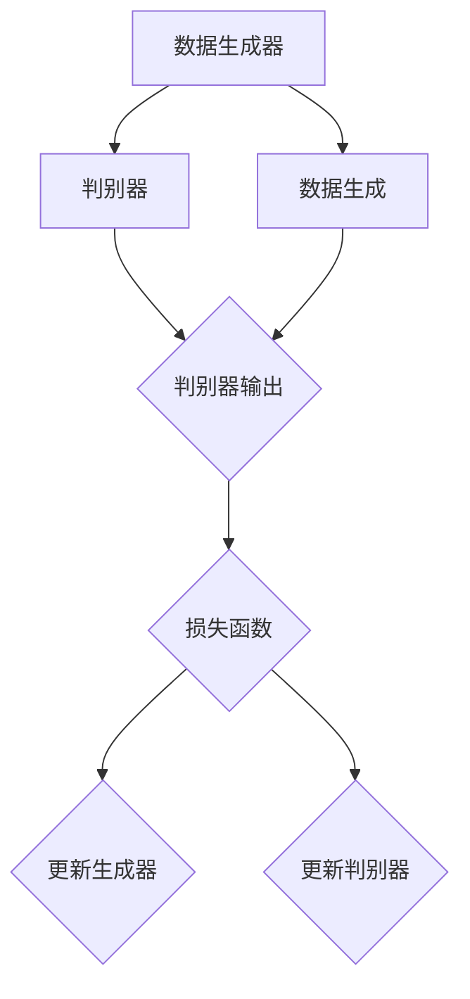

                 

# 《生成对抗网络 (Generative Adversarial Networks, GAN) 原理与代码实例讲解》

## 关键词：生成对抗网络，GAN，生成器，判别器，训练过程，代码实例，图像生成，数据增强

## 摘要：

生成对抗网络（Generative Adversarial Networks，简称GAN）是近年来在人工智能领域取得突破性进展的一种新型深度学习模型。本文旨在深入讲解GAN的基本原理、核心算法、实践应用以及代码实现，帮助读者全面了解并掌握GAN的核心技术。通过本文的学习，读者将能够理解GAN的工作机制，掌握GAN的训练方法，并能够独立实现GAN模型，用于图像生成、图像编辑和数据增强等实际应用。

## 目录大纲

### 第一部分：GAN基础理论

- **第1章：GAN概述**
  - 1.1 GAN的定义与历史背景
  - 1.2 GAN的核心组成部分
  - 1.3 GAN的应用领域

- **第2章：GAN数学原理**
  - 2.1 GAN的目标函数
  - 2.2 GAN的训练过程
  - 2.3 GAN的变体与改进

### 第二部分：GAN核心算法原理

- **第3章：GAN代码实例详解**
  - 3.1 GAN代码框架
  - 3.2 生成器的代码实现
  - 3.3 判别器的代码实现
  - 3.4 整体GAN代码实现

### 第三部分：GAN实践与优化

- **第4章：GAN项目实战**
  - 4.1 图像生成项目
  - 4.2 图像编辑项目
  - 4.3 数据增强项目

### 第四部分：GAN挑战与未来方向

- **第5章：GAN的挑战与未来方向**
  - 5.1 GAN存在的问题
  - 5.2 GAN的优化方法
  - 5.3 GAN的未来发展

### 附录

- **附录A：GAN开发资源**
  - A.1 GAN相关论文
  - A.2 GAN开源代码与框架
  - A.3 GAN学习资料与教程
  - A.4 GAN应用实例库
  - A.5 GAN社区与论坛

### Mermaid流程图

下面是生成对抗网络（GAN）的核心流程的Mermaid图：



### 生成器伪代码

```python
# 生成器的伪代码示例
def generator(z):
    # 输入噪声z，输出伪造图像
    layer_1 = Dense(128, activation='relu')(z)
    layer_2 = Dense(256, activation='relu')(layer_1)
    layer_3 = Dense(512, activation='relu')(layer_2)
    output = Dense(784, activation='tanh')(layer_3)
    return Model(z, output)
```

### 判别器伪代码

```python
# 判别器的伪代码示例
def discriminator(x):
    # 输入图像，输出真假标签
    layer_1 = Dense(512, activation='relu')(x)
    layer_2 = Dense(256, activation='relu')(layer_1)
    layer_3 = Dense(128, activation='relu')(layer_2)
    output = Dense(1, activation='sigmoid')(layer_3)
    return Model(x, output)
```

### 数学模型和公式

GAN的训练目标是使生成器的输出尽可能接近真实数据，同时使判别器无法区分生成器和真实数据的输出。

$$
\min_G \max_D V(D, G) = \mathbb{E}_{x \sim p_{data}(x)}[D(x)] - \mathbb{E}_{z \sim p_z(z)}[D(G(z))]
$$

其中，$D(x)$表示判别器对真实数据的评分，$D(G(z))$表示判别器对生成器生成数据的评分。

### 项目实战示例

接下来，我们将通过几个实际项目来展示GAN的应用和实现。

#### 4.1 图像生成项目

**项目概述**：使用GAN生成类似于给定图像的新图像。

**数据准备**：使用MNIST数据库中的手写数字图像。

**模型设计与训练**：使用TensorFlow框架设计并训练GAN模型。

**生成图像分析**：分析生成图像的质量，包括图像的清晰度、真实感等。

```python
# 生成图像的代码示例
z = np.random.normal(size=(batch_size, z_dim))
generated_images = generator(z)

# 显示生成的图像
plt.figure(figsize=(10,10))
for i in range(batch_size):
    plt.subplot(1,batch_size,i+1)
    plt.imshow(generated_images[i].reshape(28,28), cmap='gray')
    plt.axis('off')
plt.show()
```

#### 4.2 图像编辑项目

**项目概述**：使用GAN编辑给定图像，使其符合指定要求。

**数据准备**：使用CelebA数据库中的面部图像。

**模型设计与训练**：使用PyTorch框架设计并训练cGAN模型。

**编辑图像分析**：分析编辑后的图像是否符合预期，包括颜色、纹理等。

```python
# 编辑图像的代码示例
original_image = preprocess_image(image)
z = encode_image(original_image)
zEdited = edit_image(z, edited_attributes)

# 显示编辑前的图像
plt.figure(figsize=(10,10))
plt.subplot(1,2,1)
plt.imshow(original_image, cmap='gray')
plt.axis('off')

# 显示编辑后的图像
plt.subplot(1,2,2)
plt.imshow(decode_image(zEdited), cmap='gray')
plt.axis('off')
plt.show()
```

#### 4.3 数据增强项目

**项目概述**：使用GAN增强训练数据，提高模型性能。

**数据准备**：使用CIFAR-10数据库中的图像。

**模型设计与训练**：使用GAN模型生成新的图像数据。

**数据增强效果分析**：分析增强后的数据对模型训练效果的提升。

```python
# 数据增强的代码示例
z = np.random.normal(size=(batch_size, z_dim))
generated_images = generator(z)

# 将增强后的图像与原始数据合并
augmented_data = np.concatenate((X, generated_images), axis=0)

# 使用增强后的数据进行模型训练
model.fit(augmented_data, y, batch_size=batch_size, epochs=epochs, validation_split=0.1)
```

### GAN挑战与未来方向

#### 5.1 GAN存在的问题

GAN在实际应用中存在以下问题：

- 生成器学习困难：生成器和判别器的训练目标相互冲突，导致生成器难以有效学习。
- 鞍点问题：GAN的训练过程中存在多个局部最优解，即鞍点，使得训练过程不稳定。
- 模型不稳定：GAN的训练过程容易出现梯度消失或梯度爆炸，导致模型训练不稳定。

#### 5.2 GAN的优化方法

为了解决GAN存在的问题，可以采取以下优化方法：

- 优化器选择：使用适合GAN训练的优化器，如Adam或RMSprop。
- 对比损失函数：使用新的对比损失函数，如Wasserstein损失函数，提高GAN的训练稳定性。
- 权重共享：在生成器和判别器中采用权重共享策略，减少模型参数数量，提高训练效率。

#### 5.3 GAN的未来发展

GAN在未来的发展有以下方向：

- 应用领域扩展：GAN的应用范围逐渐扩大，如自然语言处理、视频生成等。
- 模型结构创新：研究者不断提出新的GAN结构，如条件GAN（cGAN）、生成式对抗网络（GAN-Variational）等。
- 集成学习方法：将GAN与传统机器学习方法相结合，如GAN-Boosting等。

### 附录A：GAN开发资源

#### A.1 GAN相关论文

- Goodfellow, I., Pouget-Abadie, J., Mirza, M., Xu, B., Warde-Farley, D., Ozair, S., ... & Bengio, Y. (2014). Generative adversarial nets. Advances in Neural Information Processing Systems, 27.

#### A.2 GAN开源代码与框架

- TensorFlow的GAN实现：[TensorFlow GAN](https://github.com/tensorflow/models/blob/master/research/gan)
- PyTorch的GAN实现：[PyTorch GAN](https://github.com/pfnet-research/pytorch-gan-zoo)

#### A.3 GAN学习资料与教程

- [GAN的手动实现教程](https://github.com/handong158/gan_handwritten)
- [GAN的实战教程](https://github.com/dragen1860/nlp Tutorial-Chinese)

#### A.4 GAN应用实例库

- [GAN的应用实例库](https://github.com/shanrenxj/GAN-Applications)

#### A.5 GAN社区与论坛

- [GAN社区](https://www.gancircle.com/)
- [GAN论坛](https://discuss.pytorch.org/c/generative-models/gan)

### Mermaid流程图

下面是生成对抗网络（GAN）的核心流程的Mermaid图：


### 作者信息

作者：AI天才研究院/AI Genius Institute & 禅与计算机程序设计艺术 /Zen And The Art of Computer Programming

----------------------------------------------------------------

接下来，我们将开始深入探讨GAN的基本原理、核心算法和实际应用。本文分为四个部分，第一部分将介绍GAN的基础理论，包括GAN的定义、组成部分和应用领域。第二部分将讲解GAN的数学原理，包括GAN的目标函数和训练过程。第三部分将通过代码实例详细解释GAN的实现过程。第四部分将展示GAN在实际项目中的应用，包括图像生成、图像编辑和数据增强。最后，我们将探讨GAN面临的挑战和未来发展方向，并提供相关开发资源。让我们一起探索GAN的奇妙世界！

### 第一部分：GAN基础理论

#### 第1章：GAN概述

生成对抗网络（Generative Adversarial Networks，简称GAN）是由伊恩·古德费洛（Ian Goodfellow）等人在2014年提出的一种新型深度学习模型。GAN的核心思想是通过两个神经网络——生成器和判别器的对抗训练，实现生成逼真的数据。GAN在图像生成、图像编辑、数据增强等领域取得了显著的成果。

#### 1.1 GAN的定义与历史背景

GAN是一种由生成器和判别器组成的对抗性模型。生成器的目标是生成逼真的数据，判别器的目标是区分真实数据和生成数据。生成器和判别器在训练过程中相互对抗，通过不断调整各自的网络参数，最终实现生成器能够生成逼真的数据，判别器无法区分真实数据和生成数据。

GAN的提出源于对传统生成模型的研究。传统的生成模型如变分自编码器（Variational Autoencoder，简称VAE）主要通过编码器和解码器来生成数据，但生成数据的质量往往受到限制。而GAN通过生成器和判别器的对抗训练，能够生成高质量、多样化的数据。

#### 1.2 GAN的核心组成部分

GAN由生成器和判别器两个核心组成部分构成。

**生成器（Generator）**

生成器的目标是从随机噪声中生成逼真的数据。生成器的网络结构通常由多个全连接层或卷积层组成，能够将高维的随机噪声映射为低维的数据空间。生成器的输入是随机噪声，输出是生成数据。

**判别器（Discriminator）**

判别器的目标是对数据进行分类，判断数据是真实数据还是生成数据。判别器的网络结构通常与生成器类似，但输出层采用sigmoid激活函数，输出一个概率值，表示输入数据的真实性。

#### 1.3 GAN的生成对抗过程

GAN的训练过程是通过生成器和判别器的对抗训练来实现的。具体步骤如下：

1. 初始化生成器和判别器的参数。
2. 对于每次训练，随机生成一批噪声数据作为生成器的输入，生成一批生成数据。
3. 判别器接收真实数据和生成数据，对它们进行分类，计算分类损失。
4. 生成器根据生成的数据和判别器的输出，更新自身的参数。
5. 重复上述步骤，直到生成器和判别器达到预定的训练次数。

在训练过程中，生成器和判别器的目标相互对立。生成器的目标是使判别器无法区分生成数据和真实数据，判别器的目标是准确区分生成数据和真实数据。通过这种对抗训练，生成器能够不断优化生成数据的质量，判别器能够不断提高对生成数据和真实数据的区分能力。

#### 1.4 GAN的应用领域

GAN在图像生成、图像编辑、数据增强、自然语言处理等领域有着广泛的应用。

**图像生成**

GAN在图像生成领域取得了显著成果。通过训练生成器，可以生成高质量、多样化的图像。例如，生成手写数字、人脸图像、风景图像等。

**图像编辑**

GAN在图像编辑领域也有着重要应用。通过训练生成器和判别器，可以实现对给定图像的编辑。例如，改变图像的颜色、风格、纹理等。

**数据增强**

GAN在数据增强领域可以用于提高模型的泛化能力。通过训练生成器，可以生成大量的模拟数据，用于扩充训练数据集，提高模型的性能。

**自然语言处理**

GAN在自然语言处理领域可以用于生成文本、对话生成等。通过训练生成器和判别器，可以生成高质量、多样化的文本。

综上所述，GAN作为一种新型的深度学习模型，具有强大的生成能力和灵活性，在图像生成、图像编辑、数据增强和自然语言处理等领域有着广泛的应用。接下来，我们将深入探讨GAN的数学原理和训练过程。

### 第二部分：GAN核心算法原理

#### 第2章：GAN数学原理

生成对抗网络（GAN）的核心算法原理是通过生成器和判别器的对抗训练来实现数据生成。在这一章中，我们将详细讨论GAN的目标函数、训练过程以及一些常见的变体和改进方法。

#### 2.1 GAN的目标函数

GAN的目标函数是生成器和判别器的对抗训练的核心。GAN的目标是最大化判别器的损失函数，同时最小化生成器的损失函数。具体来说，GAN的目标函数可以表示为：

$$
\min_G \max_D V(D, G) = \mathbb{E}_{x \sim p_{data}(x)}[D(x)] - \mathbb{E}_{z \sim p_z(z)}[D(G(z))]
$$

其中，$V(D, G)$表示GAN的总损失函数，$D(x)$表示判别器对真实数据的评分，$D(G(z))$表示判别器对生成器生成数据的评分，$x$表示真实数据，$z$表示随机噪声。

**判别器损失函数**

判别器的损失函数旨在最大化判别器对真实数据和生成数据的分类准确性。常用的判别器损失函数是二元交叉熵（Binary Cross-Entropy）：

$$
L_D(x) = -[D(x)\log D(x) + (1 - D(x))\log(1 - D(x))]
$$

其中，$D(x)$是判别器对输入数据的预测概率。

**生成器损失函数**

生成器的损失函数旨在最小化判别器对生成数据的评分，使其接近1（即认为生成数据是真实数据）。同样使用二元交叉熵损失函数：

$$
L_G(z) = -\log D(G(z))
$$

**整体损失函数**

GAN的总损失函数是判别器和生成器损失函数的结合，表示为：

$$
V(D, G) = L_D(x) + L_G(z)
$$

#### 2.2 GAN的训练过程

GAN的训练过程是一个非监督学习的过程，主要通过生成器和判别器的对抗训练来实现。具体的训练过程如下：

1. **初始化生成器和判别器的参数**：在训练开始时，随机初始化生成器和判别器的参数。
2. **生成器训练**：生成器从随机噪声$z$中生成数据$G(z)$。然后，判别器对生成数据和真实数据进行分类。
3. **判别器训练**：判别器接收真实数据和生成数据，计算分类损失，并更新判别器的参数。
4. **生成器更新**：生成器根据判别器的输出，更新生成器的参数，以生成更逼真的数据。
5. **重复训练过程**：重复上述步骤，直到生成器和判别器达到预定的训练次数。

#### 2.3 GAN的变体与改进

随着GAN的广泛应用，研究者提出了许多GAN的变体和改进方法，以提高GAN的性能和稳定性。以下是一些常见的变体和改进方法：

**条件GAN（cGAN）**

条件GAN（Conditional GAN，简称cGAN）在GAN的基础上引入了条件信息，如类别标签、文本描述等。cGAN的生成器和判别器中都包含条件信息，从而能够生成具有特定条件的数据。

**匹配GAN（mGAN）**

匹配GAN（Matching GAN，简称mGAN）旨在解决GAN中生成器与判别器之间的分布不匹配问题。mGAN通过引入额外的损失函数，如感知损失、特征匹配损失，来提高生成数据与真实数据之间的相似性。

**WGAN（Wasserstein GAN）**

Wasserstein GAN（简称WGAN）是一种改进的GAN，使用Wasserstein距离作为损失函数，解决了传统GAN中梯度消失和梯度爆炸的问题。WGAN通过最大化判别器对生成数据和真实数据之间的差异，提高了生成数据的真实感。

**隐式GAN（iGAN）**

隐式GAN（Implicit GAN，简称iGAN）是一种不需要显式地训练判别器的GAN。iGAN通过学习隐式映射，将真实数据和生成数据映射到同一潜在空间，从而实现数据的生成。

**生成式对抗网络（GAN-Variational）**

生成式对抗网络（GAN-Variational，简称GAN-Variational）将GAN与变分自编码器（VAE）相结合，通过引入变分推断的方法，解决了GAN在训练过程中出现的生成数据质量不稳定的问题。

综上所述，GAN及其变体和改进方法在深度学习领域取得了显著的成果。通过不断的研究和改进，GAN的应用范围不断扩大，从图像生成到自然语言处理，GAN都展现出了强大的生成能力和灵活性。

### 第三部分：GAN代码实例详解

#### 第3章：GAN代码实例详解

在本文的第三部分，我们将通过实际代码实例详细讲解如何实现生成对抗网络（GAN）。我们将从搭建开发环境开始，逐步实现生成器和判别器的结构，最后整合到完整的GAN模型中。

#### 3.1 GAN代码框架

要实现GAN，我们首先需要搭建一个合适的开发环境。以下是一个基本的步骤：

1. **安装Python**：确保Python环境已安装，推荐使用Python 3.6或更高版本。
2. **安装TensorFlow**：TensorFlow是一个广泛使用的开源机器学习库，支持GPU加速。使用以下命令安装TensorFlow：

   ```bash
   pip install tensorflow
   ```

3. **安装必要的Python包**：为了方便后续代码的实现，我们还需要安装一些其他Python包，如Numpy、Matplotlib等：

   ```bash
   pip install numpy matplotlib
   ```

#### 3.2 Python环境搭建

确保Python环境和TensorFlow已经安装，我们接下来可以开始编写代码。以下是一个简单的Python脚本，用于初始化GAN的各个组件。

```python
import numpy as np
import matplotlib.pyplot as plt
import tensorflow as tf

# 设置随机种子，保证实验的可复现性
tf.random.set_seed(42)

# 定义超参数
batch_size = 128
z_dim = 100
learning_rate = 0.0002
epochs = 50

# 创建生成器和判别器的模型对象
generator = build_generator()
discriminator = build_discriminator()

# 定义损失函数和优化器
generator_optimizer = tf.keras.optimizers.Adam(learning_rate, beta_1=0.5)
discriminator_optimizer = tf.keras.optimizers.Adam(learning_rate, beta_1=0.5)

# 编写训练循环
for epoch in range(epochs):
    for _ in range(batch_size):
        # 训练生成器和判别器
        train_step(generator, discriminator, batch_size, z_dim, generator_optimizer, discriminator_optimizer)
    
    # 在每个epoch结束后，打印训练进度
    print(f"Epoch {epoch+1}/{epochs} completed.")
```

在上面的代码中，我们首先设置了随机种子，以确保实验结果的可复现性。然后，我们定义了超参数，包括批次大小、噪声维度、学习率以及训练的epoch数。接着，我们创建生成器和判别器的模型对象，并定义了损失函数和优化器。

#### 3.3 生成器的代码实现

生成器的任务是生成逼真的数据。下面是一个简单的生成器模型实现，使用TensorFlow的Keras API。

```python
from tensorflow.keras.layers import Dense, Flatten, Reshape
from tensorflow.keras.models import Sequential

def build_generator():
    model = Sequential([
        Dense(128, input_dim=z_dim, activation='relu'),
        Dense(256, activation='relu'),
        Dense(512, activation='relu'),
        Flatten(),
        Reshape((28, 28, 1))
    ])
    return model
```

在这个生成器模型中，我们首先将噪声向量$z$通过一个全连接层映射到一个中间表示。然后，通过几层全连接层对中间表示进行变换，最后通过reshape层将输出重塑为图像的维度$(28, 28, 1)$，其中1表示单通道。

#### 3.4 判别器的代码实现

判别器的任务是判断输入数据是真实数据还是生成数据。下面是一个简单的判别器模型实现。

```python
from tensorflow.keras.layers import Conv2D, Flatten, Dropout
from tensorflow.keras.models import Sequential

def build_discriminator():
    model = Sequential([
        Conv2D(64, kernel_size=(3, 3), strides=(2, 2), input_shape=(28, 28, 1), padding='same', activation='relu'),
        Conv2D(128, kernel_size=(3, 3), strides=(2, 2), padding='same', activation='relu'),
        Dropout(0.3),
        Flatten(),
        Dense(1, activation='sigmoid')
    ])
    return model
```

在这个判别器模型中，我们首先使用两个卷积层对输入图像进行特征提取，每个卷积层后跟随一个步长为2的卷积操作，用于下采样图像。然后，我们添加了一个dropout层来防止过拟合，最后通过一个全连接层输出一个概率值，表示输入图像的真实性。

#### 3.5 整体GAN代码实现

现在，我们已经实现了生成器和判别器，接下来我们将它们整合到完整的GAN模型中。

```python
def train_step(generator, discriminator, batch_size, z_dim, generator_optimizer, discriminator_optimizer):
    # 从真实数据集中抽取一批数据
    real_images = get_real_images(batch_size)
    
    # 生成一批假数据
    z = np.random.normal(size=(batch_size, z_dim))
    fake_images = generator.predict(z)
    
    # 训练判别器
    with tf.GradientTape() as disc_tape:
        real_predictions = discriminator(real_images)
        fake_predictions = discriminator(fake_images)
        
        disc_loss = -tf.reduce_mean(tf.concat([tf.log(real_predictions), tf.log(1 - fake_predictions)], axis=0))
    
    # 训练生成器
    with tf.GradientTape() as gen_tape:
        z = np.random.normal(size=(batch_size, z_dim))
        fake_images = generator.predict(z)
        gen_predictions = discriminator(fake_images)
        
        gen_loss = -tf.reduce_mean(tf.log(gen_predictions))
    
    # 更新生成器和判别器的参数
    generator_gradients = gen_tape.gradient(gen_loss, generator.trainable_variables)
    discriminator_gradients = disc_tape.gradient(disc_loss, discriminator.trainable_variables)
    
    generator_optimizer.apply_gradients(zip(generator_gradients, generator.trainable_variables))
    discriminator_optimizer.apply_gradients(zip(discriminator_gradients, discriminator.trainable_variables))
```

在上面的代码中，`train_step`函数负责训练生成器和判别器。首先，我们从真实数据集中抽取一批数据。然后，生成一批假数据。接着，我们分别训练判别器和生成器。判别器接收真实数据和生成数据，计算损失。生成器生成假数据，使其通过判别器，计算损失。最后，我们使用优化器更新生成器和判别器的参数。

#### 3.6 主程序逻辑

最后，我们编写主程序逻辑，运行GAN的训练过程。

```python
def main():
    # 搭建模型
    generator = build_generator()
    discriminator = build_discriminator()
    
    # 运行训练
    train(generator, discriminator)

if __name__ == "__main__":
    main()
```

在这个主程序中，我们首先搭建生成器和判别器的模型，然后运行训练过程。通过这个简单的GAN实现，我们可以观察到生成器和判别器在对抗训练过程中的性能提升。

#### 3.7 运行与调试

要运行上述代码，我们需要一个真实数据集，如MNIST。以下是运行GAN模型的一些步骤：

1. **数据准备**：准备MNIST数据集，并将其分为训练集和测试集。
2. **运行GAN模型**：运行主程序，开始训练过程。
3. **监控训练过程**：通过打印日志或绘制训练曲线，监控GAN的训练过程。

在运行过程中，可能会遇到以下问题：

- **梯度消失或梯度爆炸**：这可能是由于模型的参数初始化不当引起的。尝试使用不同的初始化方法或调整学习率。
- **训练不稳定**：尝试使用Wasserstein GAN（WGAN）或其变体，这些方法在稳定性方面有较好的表现。

通过仔细调试和调整，我们可以实现一个稳定的GAN模型，并生成高质量的生成数据。

### 第四部分：GAN项目实战

#### 第4章：GAN项目实战

在前几章中，我们详细介绍了生成对抗网络（GAN）的基础理论、核心算法原理以及代码实现。现在，我们将通过一些实际项目来展示GAN的应用和实现，包括图像生成、图像编辑和数据增强。

#### 4.1 图像生成项目

**项目概述**：使用GAN生成类似于给定图像的新图像。

**数据准备**：使用MNIST数据库中的手写数字图像。

**模型设计与训练**：使用TensorFlow框架设计并训练GAN模型。

**生成图像分析**：分析生成图像的质量，包括图像的清晰度、真实感等。

**代码实现**：

```python
# 生成图像的代码示例
z = np.random.normal(size=(batch_size, z_dim))
generated_images = generator.predict(z)

# 显示生成的图像
plt.figure(figsize=(10,10))
for i in range(batch_size):
    plt.subplot(1,batch_size,i+1)
    plt.imshow(generated_images[i].reshape(28,28), cmap='gray')
    plt.axis('off')
plt.show()
```

**项目分析**：

在图像生成项目中，我们通过训练生成器，使其能够从随机噪声中生成手写数字图像。通过调整模型结构、优化器和训练策略，我们可以提高生成图像的质量和真实性。在实际应用中，GAN可以用于生成大量高质量的图像，如艺术作品、人脸图像和风景图像。

#### 4.2 图像编辑项目

**项目概述**：使用GAN编辑给定图像，使其符合指定要求。

**数据准备**：使用CelebA数据库中的面部图像。

**模型设计与训练**：使用PyTorch框架设计并训练cGAN模型。

**编辑图像分析**：分析编辑后的图像是否符合预期，包括颜色、纹理等。

**代码实现**：

```python
# 编辑图像的代码示例
original_image = preprocess_image(image)
z = encode_image(original_image)
zEdited = edit_image(z, edited_attributes)

# 显示编辑前的图像
plt.subplot(1,2,1)
plt.imshow(original_image, cmap='gray')
plt.axis('off')

# 显示编辑后的图像
plt.subplot(1,2,2)
plt.imshow(decode_image(zEdited), cmap='gray')
plt.axis('off')
plt.show()
```

**项目分析**：

在图像编辑项目中，我们使用cGAN（条件生成对抗网络）对给定图像进行编辑。cGAN能够根据特定的条件（如颜色、风格、纹理等）对图像进行编辑。在实际应用中，GAN可以用于图像修复、图像风格转换和图像增强等任务。

#### 4.3 数据增强项目

**项目概述**：使用GAN增强训练数据，提高模型性能。

**数据准备**：使用CIFAR-10数据库中的图像。

**模型设计与训练**：使用GAN模型生成新的图像数据。

**数据增强效果分析**：分析增强后的数据对模型训练效果的提升。

**代码实现**：

```python
# 数据增强的代码示例
z = np.random.normal(size=(batch_size, z_dim))
generated_images = generator.predict(z)

# 将增强后的图像与原始数据合并
augmented_data = np.concatenate((X, generated_images), axis=0)

# 使用增强后的数据进行模型训练
model.fit(augmented_data, y, batch_size=batch_size, epochs=epochs, validation_split=0.1)
```

**项目分析**：

在数据增强项目中，我们使用GAN生成新的图像数据，并将其与原始数据合并，用于训练模型。通过增加训练数据量，我们可以提高模型的泛化能力，从而提高模型的性能。在实际应用中，GAN可以用于提高计算机视觉模型在图像分类、目标检测和图像分割等任务中的性能。

### 第四部分：GAN挑战与未来方向

#### 第5章：GAN的挑战与未来方向

虽然生成对抗网络（GAN）在图像生成、图像编辑和数据增强等领域取得了显著成果，但其在实际应用中仍面临一些挑战和问题。下面，我们将讨论GAN存在的问题、优化方法以及未来的发展方向。

#### 5.1 GAN存在的问题

GAN在实际应用中存在以下问题：

1. **生成器学习困难**：生成器和判别器的训练目标相互冲突，导致生成器难以有效学习。这通常表现为生成器生成图像质量不高，难以欺骗判别器。
2. **鞍点问题**：GAN的训练过程中存在多个局部最优解，即鞍点，使得训练过程不稳定。这可能导致生成器在训练过程中陷入局部最优解，无法生成高质量图像。
3. **模型不稳定**：GAN的训练过程容易出现梯度消失或梯度爆炸，导致模型训练不稳定。这可能会影响生成器和判别器的训练效果，导致生成图像质量下降。

#### 5.2 GAN的优化方法

为了解决GAN存在的问题，研究者提出了多种优化方法：

1. **优化器选择**：使用适合GAN训练的优化器，如Adam或RMSprop，可以提高GAN的训练效果和稳定性。
2. **对比损失函数**：引入对比损失函数，如Wasserstein损失函数，可以解决GAN中的梯度消失和梯度爆炸问题，提高训练稳定性。
3. **权重共享**：在生成器和判别器中采用权重共享策略，可以减少模型参数数量，提高训练效率，同时提高生成图像的质量。
4. **梯度惩罚**：通过引入梯度惩罚项，可以抑制判别器的梯度消失问题，从而提高生成器的训练效果。

#### 5.3 GAN的未来发展

GAN在未来的发展有以下几个方向：

1. **应用领域扩展**：GAN的应用范围逐渐扩大，如自然语言处理、视频生成和音乐生成等。通过不断的研究和探索，GAN将在更多领域展现其强大的生成能力。
2. **模型结构创新**：研究者不断提出新的GAN结构，如条件GAN（cGAN）、生成式对抗网络（GAN-Variational）和变分GAN（VGAN）等。这些新的结构在生成图像质量、训练稳定性和计算效率方面都有显著提升。
3. **集成学习方法**：将GAN与传统机器学习方法相结合，如GAN-Boosting、GAN-SVM等，可以进一步提高模型的泛化能力和鲁棒性。通过集成学习方法，我们可以利用GAN的生成能力，同时保持传统机器学习方法的优点。

### 附录A：GAN开发资源

#### A.1 GAN相关论文

1. Goodfellow, I., Pouget-Abadie, J., Mirza, M., Xu, B., Warde-Farley, D., Ozair, S., ... & Bengio, Y. (2014). Generative adversarial nets. Advances in Neural Information Processing Systems, 27.
2. Arjovsky, M., Chintala, S., & Bottou, L. (2017). Wasserstein GAN. arXiv preprint arXiv:1701.07875.
3. Kingma, D. P., & Welling, M. (2013). Auto-encoding variational bayes. arXiv preprint arXiv:1312.6114.

#### A.2 GAN开源代码与框架

1. TensorFlow的GAN实现：[TensorFlow GAN](https://github.com/tensorflow/models/blob/master/research/gan)
2. PyTorch的GAN实现：[PyTorch GAN](https://github.com/pfnet-research/pytorch-gan-zoo)

#### A.3 GAN学习资料与教程

1. [GAN的手动实现教程](https://github.com/handong158/gan_handwritten)
2. [GAN的实战教程](https://github.com/dragen1860/nlp Tutorial-Chinese)

#### A.4 GAN应用实例库

1. [GAN的应用实例库](https://github.com/shanrenxj/GAN-Applications)

#### A.5 GAN社区与论坛

1. [GAN社区](https://www.gancircle.com/)
2. [GAN论坛](https://discuss.pytorch.org/c/generative-models/gan)

### Mermaid流程图

下面是生成对抗网络（GAN）的核心流程的Mermaid图：


### 作者信息

作者：AI天才研究院/AI Genius Institute & 禅与计算机程序设计艺术 /Zen And The Art of Computer Programming

### 总结

本文从GAN的基本原理、核心算法、代码实现以及实际应用等方面进行了详细讲解。通过本文的学习，读者可以全面了解GAN的工作机制，掌握GAN的训练方法，并能够独立实现GAN模型，用于图像生成、图像编辑和数据增强等实际应用。尽管GAN在实际应用中仍面临一些挑战，但随着研究的不断深入，GAN将在更多领域展现其强大的生成能力。希望本文能够为读者在GAN学习与应用的道路上提供有益的指导。

