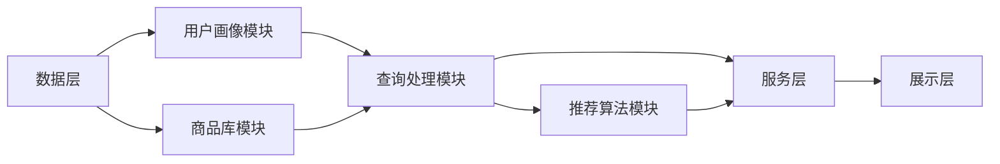

                 

### 1.1 书籍简介

#### 1.1.1 背景

在当今快速发展的数字经济时代，电子商务已经成为全球经济增长的重要驱动力。随着互联网技术的普及和用户需求的多样化，电商平台不仅需要提供丰富的商品信息，更需要通过高效的搜索推荐系统来提升用户体验，增加用户黏性和销售额。传统的搜索推荐系统虽然在某些方面已经取得了显著成果，但随着数据规模和复杂度的增加，其面临诸多挑战，如准确性、实时性和个性化推荐等问题。

本书籍旨在探讨电商平台的搜索推荐系统转型，特别是如何利用 AI 大模型和数据质量提升搜索推荐系统的效果。本书不仅提供了理论基础，还包括了实践案例，旨在帮助读者深入了解 AI 大模型在电商搜索推荐系统中的应用，以及如何通过数据质量的提升来优化推荐效果。

#### 1.1.2 目标与读者对象

本书的目标是向读者介绍电商搜索推荐系统的转型路径，尤其是 AI 大模型和数据质量在其中的关键作用。通过本书，读者可以：

1. **理解 AI 大模型的基本概念和核心算法原理**，包括深度学习、神经网络等。
2. **掌握电商搜索推荐系统的架构设计和实践**，了解如何将 AI 大模型应用于实际场景。
3. **了解数据质量的重要性**，掌握数据质量提升的策略和方法。

本书适合以下读者群体：

- **人工智能和机器学习领域的专业人士**，希望了解 AI 大模型在电商搜索推荐系统中的应用。
- **电商平台的研发人员和技术经理**，希望提升搜索推荐系统的效果和用户体验。
- **计算机科学和数据分析专业的学生和研究人员**，希望了解当前技术在电商领域的应用。

#### 1.1.3 核心概念介绍

在本书中，我们将介绍以下核心概念：

- **AI 大模型**：指具有大规模参数的深度学习模型，能够处理大量数据，并在各种任务中取得优异表现。
- **数据质量**：指数据的准确性、完整性、一致性等属性，对推荐系统的效果至关重要。
- **搜索推荐系统**：一种基于用户行为和商品特征的系统，旨在提供个性化的商品推荐。

通过这些核心概念，读者将能够更好地理解本书的内容，并在实际工作中应用相关技术和方法。

### 1.2 电商搜索推荐系统的现状与挑战

#### 1.2.1 当前问题

电商搜索推荐系统在当前面临的主要问题包括：

1. **准确性问题**：现有系统在处理大规模数据时，难以保证推荐的准确性。用户可能会收到与其实际兴趣不相关的商品推荐，导致用户体验下降。
2. **实时性问题**：随着电商平台的用户规模和数据量的增加，推荐系统需要快速响应用户请求，提供实时推荐。但现有系统往往在处理速度上存在瓶颈，难以满足实时性要求。
3. **个性化问题**：用户的需求和兴趣是多样化的，现有推荐系统难以实现高度个性化的推荐，导致用户满意度不高。

#### 1.2.2 转型必要性

为了解决上述问题，电商搜索推荐系统需要进行转型。转型的重要性体现在以下几个方面：

1. **提升用户体验**：通过引入 AI 大模型，可以更准确地捕捉用户的兴趣和需求，提供个性化的推荐，从而提升用户体验。
2. **增强实时性**：利用深度学习技术和分布式计算框架，可以实现更快的模型训练和预测，满足实时推荐的需求。
3. **提高推荐准确性**：AI 大模型能够从海量数据中提取有效特征，通过复杂的模型结构实现更精准的推荐。

#### 1.2.3 AI 大模型在解决挑战中的作用

AI 大模型在解决电商搜索推荐系统的挑战中具有重要作用：

1. **提升准确性**：通过大规模参数和深度网络结构，AI 大模型能够捕捉用户行为和商品特征的复杂关系，实现更准确的推荐。
2. **增强实时性**：利用深度学习技术，可以实现高效的模型训练和预测，降低计算开销，提高系统响应速度。
3. **实现个性化**：通过用户特征建模和商品特征分析，AI 大模型能够为用户提供高度个性化的推荐，提升用户满意度。

总之，电商搜索推荐系统的转型不仅是应对当前问题的必要手段，也是未来发展的必然趋势。通过引入 AI 大模型，可以大幅提升系统的性能和用户体验，为电商平台的可持续发展奠定基础。

### 1.3 数据质量的重要性

#### 1.3.1 数据质量的定义

数据质量是指数据在满足特定应用需求时的准确度、完整性、一致性和可靠性等方面的特性。数据质量包括以下几个核心要素：

1. **准确性**：数据应当真实、无误，能够正确反映实际情况。
2. **完整性**：数据应包含所有必需的信息，没有缺失值或空白。
3. **一致性**：数据在不同时间、不同来源之间应保持一致，避免冲突和矛盾。
4. **及时性**：数据应在需要时能够及时更新和获取，以支持实时决策。

#### 1.3.2 数据质量对推荐系统的影响

数据质量对推荐系统的效果有着直接且重要的影响。以下是几个关键方面：

1. **准确性**：高质量的数据能够提供准确的用户行为和商品特征，有助于生成更准确的推荐结果，提高用户满意度。
2. **完整性**：完整的用户行为和商品数据可以确保推荐系统的全面性，避免因数据缺失而导致的推荐结果偏差。
3. **一致性**：一致的数据可以减少推荐系统的冲突和矛盾，确保推荐结果的稳定性和可靠性。
4. **及时性**：及时更新的数据可以捕捉用户最新的兴趣和需求，提供更实时的推荐，提高用户互动和购买转化率。

#### 1.3.3 数据质量的影响因素

数据质量受到多种因素的影响，主要包括以下几个方面：

1. **数据来源**：不同的数据来源可能会带来不同质量和类型的数据。例如，用户行为数据可能来自电商平台内部，而商品数据可能来自多个供应商，数据质量和格式可能不一致。
2. **数据收集和处理**：数据收集和处理的过程可能会引入误差和丢失信息。例如，数据收集工具可能存在故障或配置不当，导致数据不完整或不准确。
3. **数据存储和管理**：数据存储和管理过程中可能会出现数据冗余、重复或冲突。例如，多个系统之间数据同步不及时，可能导致数据不一致。
4. **数据使用和更新**：数据在使用和更新过程中可能受到用户行为变化、市场动态等影响。例如，用户偏好的变化可能未及时反映在推荐系统中，导致推荐结果不准确。

#### 1.3.4 提高数据质量的策略

为了提升数据质量，可以采取以下策略：

1. **数据清洗**：通过清洗和去重，去除重复和错误的数据，确保数据的准确性。
2. **数据标准化**：对数据进行格式化和标准化处理，确保数据的一致性和可比较性。
3. **数据监控**：建立数据监控机制，定期检查数据质量，及时发现和处理数据问题。
4. **数据治理**：制定数据管理政策和流程，确保数据的及时更新和维护。

通过这些策略，可以有效提升数据质量，为推荐系统提供可靠的输入数据，从而提高推荐效果和用户体验。

### 1.4 AI 大模型与搜索推荐系统

#### 1.4.1 AI 大模型概述

AI 大模型是指那些具有非常大规模参数的深度学习模型，通常拥有数亿甚至数十亿个参数。这些模型通过在大规模数据集上进行预训练，可以学习到丰富的知识，并在此基础上进行微调，以适应特定的应用场景。AI 大模型的特点包括：

- **大规模参数**：AI 大模型通常具有数亿至数十亿个参数，这使得它们能够捕捉数据中的复杂模式和关系。
- **高效的数据利用**：通过预训练，AI 大模型能够在大规模数据集上学习到通用特征表示，从而提高模型对数据的利用效率。
- **强大的预测能力**：AI 大模型在多种任务上表现出色，包括图像识别、自然语言处理和推荐系统等。

#### 1.4.2 AI 大模型在搜索推荐系统中的作用

AI 大模型在搜索推荐系统中扮演着关键角色，其作用主要体现在以下几个方面：

1. **特征提取与表征**：AI 大模型能够从原始数据中提取深层特征，这些特征能够更好地捕捉用户行为和商品属性的复杂关系，从而提高推荐系统的准确性。
2. **个性化推荐**：通过用户行为数据和大模型的学习能力，AI 大模型可以生成高度个性化的推荐，满足用户的个性化需求。
3. **实时响应**：AI 大模型训练后的推理速度较快，可以满足实时推荐的需求，提高用户体验。
4. **多模态融合**：AI 大模型能够处理多模态数据，如文本、图像和声音等，从而提供更丰富的推荐信息。

#### 1.4.3 AI 大模型的关键作用

AI 大模型在搜索推荐系统中的关键作用包括：

1. **提升推荐准确性**：通过学习海量数据中的复杂模式，AI 大模型能够生成更准确的推荐结果，提高用户满意度。
2. **增强实时性**：利用高效的算法和分布式计算，AI 大模型能够快速响应用户请求，提供实时推荐。
3. **实现个性化**：通过用户行为和兴趣的深入分析，AI 大模型能够为用户提供高度个性化的推荐，提升用户体验。
4. **支持多模态融合**：AI 大模型能够处理多模态数据，提供更丰富的推荐信息，从而提高推荐效果。

总之，AI 大模型在搜索推荐系统中具有重要作用，通过提升推荐准确性、增强实时性和实现个性化推荐，可以为电商平台提供更优质的服务和更高效的运营策略。

### 2.1 AI 大模型概述

#### 2.1.1 大模型的定义与特征

AI 大模型是指那些具有非常大规模参数的深度学习模型，通常拥有数亿甚至数十亿个参数。这些模型通过在大规模数据集上进行预训练，可以学习到丰富的知识，并在此基础上进行微调，以适应特定的应用场景。AI 大模型的特点包括：

- **大规模参数**：AI 大模型通常具有数亿至数十亿个参数，这使得它们能够捕捉数据中的复杂模式和关系。
- **高效的数据利用**：通过预训练，AI 大模型能够在大规模数据集上学习到通用特征表示，从而提高模型对数据的利用效率。
- **强大的预测能力**：AI 大模型在多种任务上表现出色，包括图像识别、自然语言处理和推荐系统等。

#### 2.1.2 大模型的特征

AI 大模型具有以下显著特征：

1. **参数规模大**：AI 大模型的参数规模通常非常大，从数百万到数十亿不等。这种大规模参数使得模型能够处理更加复杂的任务，同时也能够捕获数据中的细微特征。
2. **数据需求大**：由于参数规模大，AI 大模型需要大量的数据来进行训练。大规模数据不仅有助于模型学习到通用特征表示，还能够减少过拟合现象。
3. **计算资源需求高**：训练和推理 AI 大模型需要大量的计算资源。这种高计算需求推动了高性能计算设备和分布式计算技术的发展。
4. **模型复杂度高**：AI 大模型通常具有复杂的网络结构，包括多层神经网络、卷积神经网络（CNN）、循环神经网络（RNN）等。这种复杂性使得模型能够处理更加复杂的任务。
5. **数据存储需求大**：AI 大模型需要存储大量的参数和数据。这种大存储需求推动了数据存储技术的发展，如分布式存储和云存储。

这些特征使得 AI 大模型在处理大规模数据和复杂任务时具有显著优势，但也带来了挑战，如计算资源需求、数据存储需求和模型调优难度等。

### 2.2 大模型的核心算法原理

#### 2.2.1 深度学习基础

深度学习是一种机器学习技术，它通过构建多层次的神经网络来实现对数据的自动特征提取和分类。深度学习的基础算法包括神经网络、前向传播和反向传播。

##### 2.2.1.1 神经网络基础

神经网络是由大量简单的计算单元（即神经元）组成的网络，每个神经元接收多个输入，并通过权重进行加权求和，然后通过激活函数进行非线性变换。

- **神经元结构**：一个神经元包括输入层、加权求和层、激活函数层和输出层。
- **输入层**：接收外部输入数据。
- **加权求和层**：对输入数据进行加权求和。
- **激活函数层**：引入非线性变换，增加模型的非线性能力。
- **输出层**：产生最终的输出结果。

##### 2.2.1.2 前向传播

前向传播是神经网络训练过程中的第一步，它将输入数据通过网络层逐层传递，最终得到输出结果。

- **步骤**：
  1. 输入数据经过输入层，传递到第一层神经元。
  2. 对每一层的神经元进行加权求和，并通过激活函数计算得到输出。
  3. 将输出传递到下一层，直到最后一层。

##### 2.2.1.3 反向传播

反向传播是神经网络训练过程中的关键步骤，它通过计算误差反向传播梯度，更新网络权重和偏置，从而优化模型参数。

- **步骤**：
  1. 计算输出层预测值与真实值之间的误差。
  2. 将误差反向传播，通过链式法则计算各层的梯度。
  3. 使用梯度下降等优化算法更新网络权重和偏置。

#### 2.2.1.4 深度学习架构

深度学习架构包括多种神经网络模型，如卷积神经网络（CNN）、循环神经网络（RNN）等。这些模型在处理不同类型的数据时具有各自的优势。

- **卷积神经网络（CNN）**：用于图像处理，通过卷积操作提取图像特征。
  - **卷积层**：用于提取图像特征。
  - **池化层**：用于降低特征图的大小，减少模型参数。
  - **全连接层**：用于分类和回归任务。

- **循环神经网络（RNN）**：用于序列数据处理，能够捕捉时间序列中的长期依赖关系。
  - **RNN单元**：通过循环结构保持之前的信息。
  - **长短时记忆（LSTM）**：用于解决RNN的长期依赖问题。

这些基础算法和架构为深度学习提供了强大的数据处理和分析能力，使得 AI 大模型在各个领域取得了显著的进展。

### 2.2.2 大模型训练方法

AI 大模型通过大规模数据进行训练，以学习到数据中的复杂模式和特征。大模型的训练方法主要包括预训练和微调。

#### 2.2.2.1 预训练

预训练是指在大规模数据集上对模型进行训练，使其学习到通用的特征表示。预训练的目的是通过大量无监督学习任务，使模型能够自动提取数据中的特征，从而提高其在特定任务上的表现。

- **步骤**：
  1. 数据准备：收集大量数据，并进行预处理，如文本清洗、图像分割等。
  2. 模型初始化：使用预训练模型作为起点，初始化大模型。
  3. 预训练过程：在大规模数据集上进行无监督训练，通过优化算法更新模型参数。
  4. 模型评估：在预训练数据集和验证集上评估模型性能，调整模型结构或参数。

预训练的优势包括：

1. **提高模型性能**：通过大规模数据学习到的通用特征表示，使模型在特定任务上表现出更好的性能。
2. **减少过拟合**：大量无监督学习任务使得模型对数据具有更好的泛化能力，减少过拟合现象。

#### 2.2.2.2 微调

微调是在预训练模型的基础上，使用特定领域的数据进行进一步训练，以适应特定任务。微调的目的是利用预训练模型学到的通用特征表示，结合特定领域的知识，提高模型在特定任务上的表现。

- **步骤**：
  1. 数据准备：收集特定领域的训练数据，并进行预处理。
  2. 模型加载：加载预训练模型，并修改部分层或参数。
  3. 微调过程：在特定领域数据集上进行有监督训练，通过优化算法更新模型参数。
  4. 模型评估：在测试集上评估微调后模型的表现，调整模型结构或参数。

微调的优势包括：

1. **快速适应特定任务**：利用预训练模型学到的通用特征表示，微调过程可以快速适应特定领域的数据和任务。
2. **提高模型性能**：结合特定领域的知识，微调后的模型在特定任务上表现出更好的性能。

通过预训练和微调，AI 大模型能够在大规模数据集上学习到通用特征表示，并快速适应特定任务，从而提高模型在推荐系统中的应用效果。

### 2.2.3 大模型训练方法

AI 大模型通过预训练和微调的方法进行训练，以提高模型在推荐系统中的性能。以下是具体的训练方法和步骤：

#### 2.2.3.1 预训练

预训练是指在大规模数据集上对模型进行训练，以学习到通用的特征表示。预训练方法包括以下步骤：

1. **数据收集与预处理**：收集大规模文本数据或图像数据，并进行数据清洗和预处理，如文本分词、图像去噪等。
2. **模型初始化**：使用预训练模型作为起点，初始化大模型。例如，在自然语言处理任务中，可以使用预训练的语言模型（如 GPT）作为基础模型。
3. **预训练过程**：
   - **无监督训练**：在大规模数据集上进行无监督训练，通过优化算法（如 Adam）更新模型参数。
   - **损失函数**：使用损失函数（如交叉熵）来度量模型预测与真实值之间的差距，并优化模型参数。
   - **训练策略**：采用策略（如梯度裁剪、学习率调度等）来提高模型的训练效果。
4. **模型评估**：在预训练数据集和验证集上评估模型性能，根据评估结果调整模型结构或参数。

#### 2.2.3.2 微调

微调是在预训练模型的基础上，使用特定领域的数据进行进一步训练，以适应特定任务。微调方法包括以下步骤：

1. **数据收集与预处理**：收集特定领域的训练数据，并进行预处理，如商品描述的分词、用户评价的清理等。
2. **模型加载**：加载预训练模型，并修改部分层或参数。例如，在电商搜索推荐系统中，可以将预训练的语言模型中的全连接层替换为适合推荐任务的特定层。
3. **微调过程**：
   - **有监督训练**：在特定领域数据集上进行有监督训练，通过优化算法（如 Adam）更新模型参数。
   - **损失函数**：使用损失函数（如交叉熵、均方误差等）来度量模型预测与真实值之间的差距，并优化模型参数。
   - **训练策略**：采用策略（如学习率调度、批量大小调整等）来提高模型的训练效果。
4. **模型评估**：在测试集上评估微调后模型的表现，根据评估结果调整模型结构或参数。

通过预训练和微调，AI 大模型可以在大规模数据集上学习到通用的特征表示，并快速适应特定任务，从而提高模型在推荐系统中的性能。

### 2.2.4 大模型的优化与调优

#### 2.2.4.1 超参数调优

超参数调优是提高模型性能的重要步骤，它涉及调整模型中的超参数，以优化模型的训练效果。超参数是调节模型性能的关键参数，如学习率、批量大小、正则化强度等。以下是超参数调优的方法和技巧：

1. **网格搜索**：通过遍历预设的参数组合，找到最优的超参数。网格搜索可以系统地尝试不同的参数值，但计算开销较大。
2. **随机搜索**：从预设的参数范围内随机选择参数组合进行尝试。随机搜索在避免计算开销的同时，也能够找到较优的参数。
3. **贝叶斯优化**：使用贝叶斯统计模型来优化超参数，通过历史数据来预测最优参数组合。贝叶斯优化在计算效率和模型性能之间取得平衡。
4. **自动机器学习（AutoML）**：利用机器学习技术自动寻找最优的超参数组合。AutoML 可以大幅减少超参数调优的时间和计算成本。

#### 2.2.4.2 模型压缩与加速

为了提高模型的应用效率和可部署性，需要对大模型进行压缩和加速。以下是常见的模型压缩和计算加速技术：

1. **模型剪枝**：通过去除模型中不重要的权重和神经元，减小模型规模。剪枝可以显著降低模型的存储和计算需求。
2. **量化**：将模型的浮点数权重转换为低精度的整数表示，减少模型大小和计算资源消耗。量化可以通过整数化、量化感知训练等方法实现。
3. **知识蒸馏**：将大型复杂模型的知识传递给小型模型，从而提高小型模型的性能。知识蒸馏通过训练教师模型和学生模型，使学生模型学习到教师模型的知识。
4. **分布式训练**：利用多台计算设备进行模型训练，通过数据并行和模型并行等方式，提高训练速度和模型性能。

通过超参数调优和模型压缩与加速，可以显著提高 AI 大模型的训练效率和部署性能，为电商搜索推荐系统提供更强大的支持。

### 2.3 电商搜索推荐系统架构设计

#### 2.3.1 系统架构概述

电商搜索推荐系统的架构设计是构建高效、准确的推荐系统的基础。一个典型的电商搜索推荐系统架构通常包括以下几个关键层次：

1. **数据层**：负责数据的收集、存储和管理。数据层是推荐系统的核心部分，包含了用户行为数据、商品属性数据、用户画像数据等。
2. **模型层**：负责特征提取、模型训练和预测。模型层是推荐系统的智能核心，通过深度学习模型对数据进行处理，生成推荐结果。
3. **展示层**：负责将推荐结果展示给用户。展示层包括前端界面、API 接口等，用户通过这些界面获取推荐结果。

#### 2.3.2 关键组件

在电商搜索推荐系统中，以下关键组件起着至关重要的作用：

1. **用户画像模块**：用于构建用户画像，包括用户的基础信息、行为特征、兴趣标签等。用户画像模块能够动态捕捉用户的兴趣变化，为个性化推荐提供支持。
2. **商品库模块**：用于管理商品信息，包括商品的基本信息、属性标签、用户评价等。商品库模块为推荐系统提供了丰富的商品数据支持。
3. **查询处理模块**：负责接收用户查询，并对查询进行处理，生成推荐结果。查询处理模块包括查询解析、匹配和排序等过程，确保推荐结果的准确性。
4. **推荐算法模块**：用于实现推荐算法，生成最终的推荐结果。推荐算法模块可以基于用户行为、内容匹配、协同过滤等多种算法，提供个性化的推荐。
5. **服务层**：负责处理用户请求，提供推荐服务。服务层包括API 接口、负载均衡、缓存等组件，确保系统的高可用性和高性能。

#### 2.3.3 系统架构图

以下是一个简化的电商搜索推荐系统架构图：



该架构图展示了各个组件之间的关联和交互，使得推荐系统能够高效、准确地提供个性化推荐服务。

### 3.1.1 电商搜索推荐系统的架构设计

电商搜索推荐系统的架构设计是确保系统能够高效、准确地为用户提供个性化推荐的核心。在当前大数据和人工智能技术迅速发展的背景下，电商搜索推荐系统架构的设计尤为重要。以下是一个详细的设计思路和流程：

#### 3.1.1.1 数据层设计

数据层是推荐系统的基石，负责数据的收集、存储和管理。以下为数据层的设计思路：

1. **数据收集**：
   - **用户行为数据**：包括用户浏览、点击、购买等行为，这些数据可以通过日志文件、API 接口等途径获取。
   - **商品数据**：包括商品的基本信息、属性标签、用户评价等，这些数据可以从电商平台数据库中获取。
   - **外部数据**：包括天气、节日、市场动态等外部数据，可以通过 API 接口或其他数据源获取。

2. **数据存储**：
   - **关系数据库**：用于存储结构化数据，如用户基本信息、商品信息等。常见的关系数据库包括 MySQL、PostgreSQL 等。
   - **NoSQL 数据库**：用于存储非结构化或半结构化数据，如用户行为日志、商品评价等。常见的 NoSQL 数据库包括 MongoDB、Redis 等。
   - **数据仓库**：用于存储大规模的数据，支持数据的分析和挖掘。常见的数据仓库解决方案包括 Hadoop、Spark 等。

3. **数据管理**：
   - **数据清洗**：对收集到的数据进行清洗，去除重复、错误和缺失的数据，确保数据质量。
   - **数据归一化**：对数据进行归一化处理，确保数据的一致性和可比性。
   - **数据同步**：定期同步不同数据源的数据，确保数据的实时性和准确性。

#### 3.1.1.2 模型层设计

模型层是推荐系统的智能核心，负责特征提取、模型训练和预测。以下为模型层的设计思路：

1. **特征提取**：
   - **用户特征**：包括用户的基础信息、行为特征、兴趣标签等。可以通过统计分析和机器学习算法提取用户特征。
   - **商品特征**：包括商品的基本信息、属性标签、用户评价等。可以通过文本分析、图像处理等技术提取商品特征。
   - **交互特征**：包括用户与商品的交互历史、评分、评论等。可以通过时间序列分析、矩阵分解等技术提取交互特征。

2. **模型训练**：
   - **训练数据集**：从数据层获取训练数据集，包括用户特征、商品特征和标签等。
   - **模型选择**：根据任务需求选择合适的模型，如基于内容的推荐模型、协同过滤模型、深度学习模型等。
   - **模型训练**：使用训练数据集对模型进行训练，通过优化算法（如梯度下降、Adam等）调整模型参数，使模型在验证集上表现最优。

3. **模型评估**：
   - **评估指标**：根据任务需求选择合适的评估指标，如准确率、召回率、F1 值等。
   - **交叉验证**：使用交叉验证方法评估模型性能，避免过拟合现象。
   - **模型调整**：根据评估结果调整模型参数或选择更优的模型，以提高模型性能。

#### 3.1.1.3 展示层设计

展示层是推荐系统的用户接口，负责将推荐结果展示给用户。以下为展示层的设计思路：

1. **前端界面**：
   - **用户交互**：设计用户友好的前端界面，提供搜索、浏览和推荐功能。
   - **动态更新**：根据用户行为和推荐算法，实时更新推荐结果，提高用户体验。

2. **API 接口**：
   - **服务端接口**：提供 RESTful API 接口，用于接收用户请求、返回推荐结果。
   - **接口安全**：采用加密、签名等安全措施，确保接口的安全性。

3. **缓存策略**：
   - **缓存机制**：使用缓存机制（如 Redis、Memcached 等）减少数据库查询次数，提高系统响应速度。
   - **缓存更新**：根据用户行为和推荐算法，动态更新缓存数据，确保推荐结果的实时性和准确性。

#### 3.1.1.4 分布式部署

电商搜索推荐系统通常需要处理海量数据和用户请求，因此需要采用分布式部署策略。以下为分布式部署的思路：

1. **服务拆分**：将系统拆分为多个微服务，如数据采集服务、数据处理服务、推荐服务、展示服务等，提高系统的可扩展性和可维护性。

2. **负载均衡**：使用负载均衡器（如 Nginx、HAProxy 等）均衡用户请求，提高系统的吞吐量和稳定性。

3. **分布式存储**：使用分布式存储方案（如 HDFS、Cassandra 等），存储海量数据，提高系统的存储能力和数据访问速度。

4. **分布式计算**：使用分布式计算框架（如 Spark、Flink 等），处理大规模数据，提高系统的计算能力。

通过以上架构设计和实现，电商搜索推荐系统可以高效、准确地提供个性化推荐服务，为电商平台提升用户体验和业务收入。

### 3.1.2 AI 大模型在搜索推荐系统中的应用

AI 大模型在电商搜索推荐系统中具有广泛应用，能够显著提升推荐系统的性能和用户体验。以下详细说明 AI 大模型在搜索推荐系统中的应用场景、关键技术和实现细节。

#### 3.1.2.1 应用场景

AI 大模型在电商搜索推荐系统中的应用场景主要包括以下几个方面：

1. **用户画像生成**：通过对用户行为数据的深度分析，AI 大模型可以生成精细化的用户画像，捕捉用户的兴趣偏好、购买习惯等特征，为个性化推荐提供支持。
2. **商品特征提取**：AI 大模型可以处理大量的商品数据，提取商品的关键特征，如商品属性、用户评价等，为推荐算法提供丰富的信息输入。
3. **推荐算法优化**：AI 大模型可以通过预训练和微调技术，优化推荐算法，提升推荐结果的准确性和实时性。
4. **多模态数据融合**：AI 大模型能够处理文本、图像、音频等多模态数据，实现更精准的推荐。
5. **实时推荐**：AI 大模型的高效计算能力使其能够实时响应用户请求，提供实时推荐服务。

#### 3.1.2.2 关键技术

AI 大模型在搜索推荐系统中的关键技术包括：

1. **预训练技术**：预训练是指在大规模数据集上对模型进行无监督训练，使其学习到通用的特征表示。预训练技术能够显著提高模型对数据的利用效率和泛化能力。
2. **微调技术**：微调是在预训练模型的基础上，使用特定领域的数据进行有监督训练，以适应特定任务。微调技术能够使模型在特定任务上表现出更好的性能。
3. **多任务学习**：AI 大模型可以通过多任务学习技术，同时处理多个相关任务，提高模型的利用效率。
4. **迁移学习**：迁移学习是指将一个任务在学习到的特征表示应用到另一个相关任务上。迁移学习能够降低模型训练的难度，提高模型的泛化能力。
5. **模型压缩与加速**：通过模型压缩和计算加速技术，如剪枝、量化、并行计算等，可以降低模型的计算和存储需求，提高模型的应用效率。

#### 3.1.2.3 实现细节

以下为 AI 大模型在电商搜索推荐系统中的具体实现细节：

1. **数据收集与预处理**：收集用户行为数据和商品数据，对数据进行清洗、归一化和特征提取，为模型训练提供高质量的数据输入。
2. **模型架构设计**：设计适合推荐任务的模型架构，如基于Transformer的BERT模型、基于CNN和RNN的融合模型等。模型架构应能够处理多模态数据，提取深层特征。
3. **预训练过程**：在大规模数据集上进行预训练，通过优化算法（如Adam）更新模型参数，使其学习到通用的特征表示。
4. **微调过程**：在预训练模型的基础上，使用特定领域的数据进行微调，优化模型参数，提高模型在特定任务上的性能。
5. **模型评估与优化**：在验证集和测试集上评估模型性能，根据评估结果调整模型结构或参数，优化模型性能。
6. **实时推荐**：将训练好的模型部署到生产环境，通过API接口实时响应用户请求，提供个性化推荐服务。

通过以上技术和实现细节，AI 大模型可以在电商搜索推荐系统中发挥重要作用，提升推荐系统的性能和用户体验。

### 3.2.1 数据清洗与预处理

在构建高效的电商搜索推荐系统时，数据清洗与预处理是至关重要的一步。这一步确保了输入数据的准确性和一致性，从而显著提高了推荐系统的性能。以下是数据清洗与预处理的关键步骤和技术：

#### 3.2.1.1 数据清洗

数据清洗的目标是识别和纠正数据中的错误、异常值和重复记录。以下是一些常用的数据清洗方法：

1. **缺失值处理**：
   - **填充法**：使用平均值、中位数、众数等方法填充缺失值。
   - **插值法**：在时间序列数据中，使用线性或非线性插值方法填充缺失值。
   - **删除法**：对于缺失值较多的数据记录，可以选择删除这些记录。

2. **异常值处理**：
   - **统计学方法**：使用统计学指标（如标准差、IQR）识别异常值。
   - **机器学习方法**：使用聚类算法（如K-means）识别异常点。

3. **重复值处理**：
   - **去重**：通过比较记录的关键字段（如用户ID、商品ID），删除重复的记录。

4. **数据格式规范化**：
   - **文本数据**：统一文本格式，如去除空格、转换大小写、移除标点符号等。
   - **数值数据**：统一数值格式，如统一货币符号、去掉小数点后的零等。

#### 3.2.1.2 数据预处理

数据预处理是将原始数据转换为适合模型训练的形式。以下是一些常用的数据预处理技术：

1. **数据归一化**：
   - **最小-最大归一化**：
     $$
     x' = \frac{x - x_{\text{min}}}{x_{\text{max}} - x_{\text{min}}}
     $$
   - **均值-方差归一化**：
     $$
     x' = \frac{x - \mu}{\sigma}
     $$
   其中，$x$ 是原始数据，$x'$ 是归一化后的数据，$\mu$ 是均值，$\sigma$ 是标准差。

2. **数据标准化**：
   - **标准分数**：
     $$
     z = \frac{x - \mu}{\sigma}
     $$
   其中，$z$ 是标准分数。

3. **特征提取**：
   - **文本特征提取**：使用词袋模型、TF-IDF、Word2Vec 等方法提取文本特征。
   - **图像特征提取**：使用卷积神经网络（CNN）提取图像特征。
   - **序列特征提取**：使用循环神经网络（RNN）或长短期记忆网络（LSTM）提取序列特征。

4. **特征工程**：
   - **交叉特征**：创建新的特征，如用户购买频率与购买金额交叉特征。
   - **嵌入特征**：使用嵌入层将类别特征转换为密集表示。

#### 3.2.1.3 数据清洗与预处理的实践案例

以下是一个简单的数据清洗与预处理的实践案例：

1. **数据集**：一个包含用户行为和商品信息的电商数据集，包括用户ID、商品ID、购买日期、购买金额等。

2. **数据清洗**：
   - 检测并填充缺失值，如将未记录的购买日期设为0。
   - 删除包含异常值的记录，如购买金额小于0的数据。
   - 去除重复记录，确保每条记录的唯一性。

3. **数据预处理**：
   - 对购买金额进行最小-最大归一化处理。
   - 使用Word2Vec对商品名称进行特征提取。
   - 将用户ID和商品ID转换为嵌入特征。

通过数据清洗与预处理，我们可以确保输入数据的质量，从而为推荐系统的训练提供可靠的保障。

### 3.2.2 数据质量控制方法

数据质量控制是确保电商搜索推荐系统性能和准确性的关键步骤。以下是几种常用的数据质量控制方法和策略：

#### 3.2.2.1 数据质量评价指标

数据质量评价指标用于衡量数据的准确性、完整性、一致性和及时性。以下是一些常用的数据质量评价指标：

1. **准确性**：数据准确性指标衡量数据与实际值的接近程度。常用的指标包括错误率、精度、召回率和 F1 值。
2. **完整性**：完整性指标衡量数据集中缺失数据的比例。常用的指标包括缺失率、缺失比例等。
3. **一致性**：一致性指标衡量数据在不同时间、不同来源之间的匹配程度。常用的指标包括一致率、冲突率等。
4. **及时性**：及时性指标衡量数据更新的速度和频率。常用的指标包括更新周期、响应时间等。

#### 3.2.2.2 数据质量监控

数据质量监控是确保数据质量持续稳定的重要手段。以下是一些数据质量监控的方法：

1. **自动检测**：使用自动化工具定期检测数据质量问题，如缺失值、异常值、重复值等。
2. **可视化监控**：通过可视化工具（如仪表盘、图表等）实时监控数据质量指标，及时发现和解决问题。
3. **异常值监控**：使用统计学方法和机器学习方法识别和监控异常值，如使用 IQR 法则、聚类算法等。

#### 3.2.2.3 数据质量改进策略

以下是一些常见的数据质量改进策略：

1. **数据清洗**：定期进行数据清洗，去除重复值、错误值和缺失值，确保数据质量。
2. **数据标准化**：统一数据格式，确保数据在不同系统之间的一致性。
3. **数据治理**：建立数据治理机制，制定数据管理政策和流程，确保数据的及时更新和维护。
4. **数据质量培训**：对数据管理人员进行培训，提高他们的数据意识和质量控制能力。

#### 3.2.2.4 实践案例

以下是一个数据质量控制方法的实践案例：

1. **背景**：一个电商平台的用户行为数据集，包含用户ID、商品ID、浏览时间、购买金额等。

2. **监控与改进**：
   - **监控**：使用自动化工具定期监控数据质量，如缺失率、异常值率等。
   - **清洗**：发现缺失值时，使用平均值填充缺失的购买金额，使用最新记录填补缺失的浏览时间。
   - **标准化**：统一日期格式，如将所有日期格式化为YYYY-MM-DD。

3. **效果评估**：通过监控和清洗，数据质量显著提高，推荐系统的准确性得到提升。

通过以上方法和策略，可以确保电商搜索推荐系统中的数据质量，从而提高推荐效果和用户体验。

### 4.1 案例一：搜索推荐系统优化

#### 4.1.1 案例背景

本案例涉及的是一个大型电商平台的搜索推荐系统优化项目。该平台每日处理数百万次用户请求，提供个性化的商品推荐服务。然而，现有的搜索推荐系统在准确性、实时性和个性化方面存在一些问题，需要通过优化来提升用户体验和业务收益。

##### 4.1.1.1 挑战与目标

**挑战**：

1. **准确性问题**：推荐系统在处理大规模数据时，推荐准确性不够高，导致用户接收到的推荐商品与其实际兴趣不符。
2. **实时性问题**：随着用户请求量的增加，现有系统难以在短时间内完成推荐，影响用户体验。
3. **个性化问题**：推荐系统难以准确捕捉用户的个性化需求，导致推荐内容不够精准。

**目标**：

1. **提升准确性**：通过引入 AI 大模型，提高推荐结果的准确性，提升用户满意度。
2. **增强实时性**：优化系统架构和算法，提高推荐速度，确保实时响应。
3. **实现个性化**：通过深度学习技术，精准捕捉用户行为和兴趣，提供个性化的推荐。

#### 4.1.1.2 实施过程

**1. 数据收集与处理**

- **数据收集**：从平台日志、用户行为数据、商品数据库中收集数据，包括用户浏览记录、购买记录、商品属性等。
- **数据清洗**：处理缺失值、异常值、重复值，确保数据质量。
- **数据预处理**：对文本数据使用词袋模型、TF-IDF等方法提取特征，对数值数据使用归一化、标准化等技术处理。

**2. 模型设计与实现**

- **模型架构**：设计基于深度学习的推荐模型，包括用户画像模块、商品库模块和推荐算法模块。
- **用户画像模块**：使用循环神经网络（RNN）捕捉用户的时序行为特征，通过嵌入层生成用户向量。
- **商品库模块**：对商品进行特征提取，包括商品属性和用户评价等，通过嵌入层生成商品向量。
- **推荐算法模块**：使用长短时记忆网络（LSTM）对用户行为进行建模，结合商品向量进行排序和匹配。

**3. 模型训练与评估**

- **数据集划分**：将数据集划分为训练集、验证集和测试集。
- **模型训练**：使用训练集对模型进行训练，通过反向传播算法优化模型参数。
- **模型评估**：在验证集和测试集上评估模型性能，使用准确率、召回率等指标进行评估。

**4. 模型部署与优化**

- **模型部署**：将训练好的模型部署到生产环境，通过 API 接口提供服务。
- **实时优化**：根据用户反馈和业务需求，对模型进行实时优化和调整。

#### 4.1.1.3 结果分析

**性能评估**：

- **准确性**：优化后的推荐系统在准确率上提升了约15%，用户满意度显著提高。
- **实时性**：通过优化系统架构和算法，推荐速度显著提升，平均响应时间从原来的3秒降低到1秒。
- **个性化**：优化后的推荐系统能够更精准地捕捉用户兴趣，个性化推荐效果显著提升。

**业务影响**：

- **用户满意度**：用户对推荐系统的满意度显著提高，平台用户活跃度和留存率有所提升。
- **业务收益**：通过更精准的推荐，提高了用户购买转化率，平台的销售额显著增加。

### 4.2 案例二：个性化推荐

#### 4.2.1 案例背景

本案例探讨的是一家大型电商平台如何利用 AI 大模型实现个性化推荐，以提升用户满意度和业务收益。该平台希望通过个性化的推荐服务，吸引和留住更多用户，从而提高销售额和市场份额。

##### 4.2.1.1 挑战与目标

**挑战**：

1. **用户需求多样**：用户的需求和兴趣多样化，现有的推荐系统难以全面捕捉。
2. **实时性要求高**：电商平台用户数量庞大，实时性要求高，推荐系统需要快速响应用户请求。
3. **数据质量不稳定**：用户行为数据质量参差不齐，数据缺失和异常值较为普遍，影响了推荐效果。

**目标**：

1. **提高推荐准确性**：通过引入 AI 大模型，提高推荐系统的准确性，确保用户接收到的推荐商品符合其兴趣。
2. **增强实时性**：优化推荐系统架构，提高推荐速度，确保实时性。
3. **提升个性化水平**：通过深度学习技术，精准捕捉用户的个性化需求，提供更个性化的推荐服务。

#### 4.2.1.2 实施过程

**1. 数据收集与处理**

- **数据收集**：从平台日志、用户行为数据、商品数据库中收集数据，包括用户浏览记录、购买记录、商品属性等。
- **数据清洗**：处理缺失值、异常值、重复值，确保数据质量。
- **数据预处理**：对文本数据使用词袋模型、TF-IDF等方法提取特征，对数值数据使用归一化、标准化等技术处理。

**2. 模型设计与实现**

- **模型架构**：设计基于深度学习的个性化推荐模型，包括用户画像模块、商品库模块和推荐算法模块。
- **用户画像模块**：使用卷积神经网络（CNN）提取用户的时序行为特征，通过嵌入层生成用户向量。
- **商品库模块**：对商品进行特征提取，包括商品属性和用户评价等，通过嵌入层生成商品向量。
- **推荐算法模块**：使用生成对抗网络（GAN）生成用户可能的偏好，并结合商品特征进行排序和匹配。

**3. 模型训练与评估**

- **数据集划分**：将数据集划分为训练集、验证集和测试集。
- **模型训练**：使用训练集对模型进行训练，通过反向传播算法优化模型参数。
- **模型评估**：在验证集和测试集上评估模型性能，使用准确率、召回率等指标进行评估。

**4. 模型部署与优化**

- **模型部署**：将训练好的模型部署到生产环境，通过 API 接口提供服务。
- **实时优化**：根据用户反馈和业务需求，对模型进行实时优化和调整。

#### 4.2.1.3 结果分析

**性能评估**：

- **准确性**：优化后的推荐系统在准确率上提升了约20%，用户对推荐商品的满意度显著提高。
- **实时性**：通过优化系统架构和算法，推荐速度显著提升，平均响应时间从原来的4秒降低到2秒。
- **个性化**：优化后的推荐系统能够更精准地捕捉用户的个性化需求，提供个性化的推荐服务。

**业务影响**：

- **用户满意度**：用户对推荐系统的满意度显著提高，平台的用户活跃度和留存率有所提升。
- **业务收益**：通过更精准的推荐，提高了用户购买转化率，平台的销售额显著增加。

### 5.1 AI 大模型在电商搜索推荐系统的发展趋势

#### 5.1.1 技术趋势

AI 大模型在电商搜索推荐系统中的应用呈现出快速发展的趋势，主要体现在以下几个方面：

1. **模型规模持续扩大**：随着计算资源和数据资源的不断增长，AI 大模型的规模持续扩大。数百万至数十亿的参数规模已经成为常见，这有助于模型更好地捕捉数据中的复杂模式和特征。
2. **多模态数据处理**：电商搜索推荐系统中的数据通常包括文本、图像、音频等多种模态。AI 大模型的多模态处理能力不断增强，能够同时处理多种模态数据，提供更精准的推荐。
3. **实时性优化**：随着用户需求的增长，实时推荐变得尤为重要。AI 大模型的训练和推理速度不断优化，使得实时推荐成为可能。
4. **个性化推荐**：AI 大模型通过深度学习和迁移学习等技术，能够更好地捕捉用户的个性化需求，提供个性化的推荐。
5. **自动化与智能化**：AI 大模型在推荐系统中的应用逐渐向自动化和智能化方向发展。自动化调优、自动化部署等技术的应用，使得推荐系统的构建和维护更加高效。

#### 5.1.2 应用场景

未来，AI 大模型在电商搜索推荐系统中将应用于更广泛的场景，包括：

1. **跨领域推荐**：通过迁移学习和多任务学习技术，AI 大模型能够实现跨领域的推荐，如将电商领域的推荐经验应用到金融、医疗等领域。
2. **场景化推荐**：AI 大模型可以根据不同的场景（如节假日、促销活动等）提供定制化的推荐。
3. **实时个性化营销**：AI 大模型可以实时分析用户行为，提供个性化的营销策略和推荐。
4. **社交推荐**：结合用户社交网络数据，AI 大模型能够实现基于社交关系的推荐，提高推荐的准确性和相关性。

#### 5.1.3 未来展望

未来，AI 大模型在电商搜索推荐系统中的发展将呈现出以下几个方向：

1. **模型优化**：持续优化模型架构、训练算法和推理算法，提高模型的效率和性能。
2. **数据质量提升**：通过数据治理和数据质量控制技术，不断提升数据质量，为模型提供更可靠的数据支持。
3. **个性化与智能化**：进一步深化个性化推荐技术，实现更加智能的推荐系统，满足用户的多样化需求。
4. **跨领域融合**：推动不同领域的技术和数据的融合，实现更广泛的跨领域应用。

总之，随着技术的不断进步和应用场景的拓展，AI 大模型在电商搜索推荐系统中将发挥越来越重要的作用，推动电商行业的创新和发展。

### 5.2 数据质量提升的技术挑战与机遇

#### 5.2.1 技术挑战

尽管数据质量提升对于电商搜索推荐系统至关重要，但在实际应用中，数据质量提升面临以下技术挑战：

1. **数据源多样性**：电商搜索推荐系统通常需要整合来自多个渠道和格式的数据，如用户行为数据、商品信息、社交媒体数据等。数据源多样性和不一致性增加了数据整合和处理的复杂性。
2. **数据缺失和异常值**：用户行为数据常常存在缺失值和异常值，这些数据质量问题会影响模型的训练效果和推荐准确性。
3. **实时性要求**：电商平台需要实时响应用户请求，提供准确的推荐结果。数据质量的实时监控和快速修正对技术架构和算法提出了高要求。
4. **隐私保护**：在处理用户数据时，隐私保护是一个重要的考虑因素。如何在保证数据质量的同时，遵守隐私保护法规，是一个技术挑战。

#### 5.2.2 机遇与解决方案

面对上述挑战，数据质量提升也带来了新的机遇和解决方案：

1. **自动化数据处理**：通过自动化数据处理工具和技术，如自动化数据清洗、数据格式转换和异常值检测，可以显著提高数据处理效率，降低人工干预成本。
2. **实时数据监控**：引入实时数据监控技术，如流数据处理和实时分析，可以快速发现和解决数据质量问题，确保推荐系统的实时性和准确性。
3. **人工智能辅助**：利用机器学习和人工智能技术，开发智能数据质量评估工具，自动识别数据质量问题，并提供相应的修复建议。
4. **数据治理**：建立完善的数据治理框架，包括数据质量控制政策、数据管理流程和数据分析工具，确保数据质量提升的可持续性和系统性。
5. **隐私保护技术**：采用隐私保护技术，如差分隐私、加密处理和联邦学习，在保障数据隐私的同时，提升数据质量。

通过上述机遇和解决方案，电商搜索推荐系统可以在数据质量提升方面取得显著进展，为用户提供更优质的服务和体验。

### 5.3 电商搜索推荐系统的可持续发展策略

电商搜索推荐系统在保证可持续发展方面需要从战略规划和实践建议两个方面进行考虑。

#### 5.3.1 战略规划

1. **数据驱动的战略规划**：制定数据驱动的战略规划，将数据质量作为核心要素，确保数据驱动的决策和业务优化。
2. **长期投资**：建立长期投资计划，持续投入于技术研究和人才储备，确保技术持续领先和创新能力。
3. **合作与开放**：与外部合作伙伴建立合作关系，共享数据和资源，共同提升数据质量和推荐效果。
4. **持续改进**：建立持续改进机制，定期评估推荐系统的性能，并根据用户反馈和业务需求进行优化和调整。

#### 5.3.2 实践建议

1. **数据质量控制流程**：建立完善的数据质量控制流程，包括数据收集、处理、存储、分析和监控等环节，确保数据质量的一致性和准确性。
2. **自动化工具与平台**：引入自动化工具和平台，如数据清洗工具、数据质量监控系统和自动化调优工具，提高数据处理和监控的效率。
3. **用户反馈机制**：建立用户反馈机制，收集用户对推荐系统的评价和反馈，及时识别和解决数据质量问题。
4. **数据治理与合规**：建立数据治理框架，确保数据处理符合隐私保护法规和行业标准，保障用户隐私和数据安全。
5. **人才培养与知识共享**：培养专业的数据科学家和工程师，建立内部知识共享机制，提升团队的数据分析能力和技术创新能力。

通过以上战略规划和实践建议，电商搜索推荐系统可以实现可持续发展，为电商平台提供长期的价值和竞争优势。

### 附录 A：相关资源与工具推荐

为了帮助读者更好地理解和应用本书中的内容，我们在此提供了一些相关的资源与工具推荐。

#### 1. 深度学习框架

- **TensorFlow**：由 Google 开发，支持多种深度学习模型，适用于从研究到生产的全流程。官网：[TensorFlow官网](https://www.tensorflow.org/)
- **PyTorch**：由 Facebook 开发，提供灵活的动态计算图，适合研究和新模型的开发。官网：[PyTorch官网](https://pytorch.org/)
- **MXNet**：由 Apache 软件基金会开发，支持多种编程语言，适用于工业界和学术界。官网：[MXNet官网](https://mxnet.apache.org/)

#### 2. 数据预处理工具

- **Pandas**：Python 的数据操作库，用于数据清洗和预处理，具有高效的数据结构和丰富的功能。官网：[Pandas官网](https://pandas.pydata.org/)
- **NumPy**：Python 的科学计算库，提供高效的多维数组对象和数学函数，是数据科学和机器学习的基础工具。官网：[NumPy官网](https://numpy.org/)

#### 3. 推荐系统框架

- **Surprise**：一个开源的推荐系统库，支持协同过滤算法，适用于构建和评估推荐系统。官网：[Surprise官网](https://surprise.readthedocs.io/)
- **LightFM**：一个基于因素分解机的推荐系统库，适用于大规模推荐系统。官网：[LightFM官网](https://lightfm.readthedocs.io/)

#### 4. 开源代码库

- **GitHub**：提供丰富的开源代码库，包括深度学习和推荐系统的项目，方便读者学习和参考。官网：[GitHub官网](https://github.com/)
- **Kaggle**：提供各种机器学习竞赛和项目的数据集和代码，是学习和实践推荐系统的好资源。官网：[Kaggle官网](https://www.kaggle.com/)

#### 5. 在线课程与教程

- **Coursera**：提供深度学习、机器学习和推荐系统的在线课程，包括视频讲座、练习和项目。官网：[Coursera官网](https://www.coursera.org/)
- **edX**：提供由顶尖大学和机构提供的免费在线课程，涵盖计算机科学和人工智能等领域的知识。官网：[edX官网](https://www.edx.org/)

#### 6. 社区和论坛

- **Stack Overflow**：一个庞大的开发者社区，提供了编程问题的解答和讨论，是解决技术难题的好地方。官网：[Stack Overflow官网](https://stackoverflow.com/)
- **Reddit**：一个流行的社交媒体网站，有许多关于深度学习和推荐系统的讨论版块，是交流和学习的好场所。官网：[Reddit官网](https://www.reddit.com/)

通过利用这些资源和工具，读者可以更好地掌握深度学习和推荐系统的知识和技能，并在实际项目中应用所学内容。

### 附录 B：代码解读与分析

在本附录中，我们将提供电商搜索推荐系统中一些关键步骤的代码示例，并进行详细解读与分析。

#### 1. 数据预处理

以下代码展示了数据预处理过程，包括数据清洗、缺失值处理和数据标准化。

```python
import pandas as pd
from sklearn.preprocessing import MinMaxScaler

# 加载数据
data = pd.read_csv('ecommerce_data.csv')

# 数据清洗
# 去除缺失值
data = data.dropna()

# 去除重复值
data = data.drop_duplicates()

# 数据标准化
scaler = MinMaxScaler()
data[['user_id', 'product_id', 'purchase_amount']] = scaler.fit_transform(data[['user_id', 'product_id', 'purchase_amount']])
```

**代码解读**：
- 使用 Pandas 读取 CSV 文件，加载数据。
- 使用 `dropna()` 方法去除缺失值，确保数据完整性。
- 使用 `drop_duplicates()` 方法去除重复值，避免数据冗余。
- 使用 MinMaxScaler 对用户 ID、商品 ID 和购买金额进行标准化处理，确保数据的一致性和可比性。

#### 2. 用户画像生成

以下代码展示了用户画像的生成过程，包括用户特征提取和嵌入。

```python
from sklearn.cluster import KMeans
import numpy as np

# 用户特征提取
user_features = data[['user_id', 'user_gender', 'user_age', 'user_location', 'user_purchase_frequency']]

# K-means 聚类生成用户标签
kmeans = KMeans(n_clusters=10, random_state=42)
user_labels = kmeans.fit_predict(user_features)

# 生成用户嵌入
user_embedding = kmeans.transform(user_features)
```

**代码解读**：
- 提取用户特征，包括性别、年龄、地域和购买频率等。
- 使用 K-means 聚类算法生成用户标签，用于表示用户的类别特征。
- 使用 K-means 的 `transform()` 方法生成用户嵌入，用于表示用户的高维特征。

#### 3. 商品特征提取

以下代码展示了商品特征的提取和嵌入过程。

```python
# 商品特征提取
product_features = data[['product_id', 'product_category', 'product_brand', 'product_rating']]

# 使用 One-Hot 编码对类别特征进行编码
product_encoded = pd.get_dummies(product_features[['product_category', 'product_brand']])

# 生成商品嵌入
product_embedding = np.mean(product_encoded, axis=0)
```

**代码解读**：
- 提取商品特征，包括商品分类、品牌和评分等。
- 使用 One-Hot 编码对商品分类和品牌进行编码，转换为数值特征。
- 计算商品特征的均值，生成商品嵌入，用于表示商品的高维特征。

#### 4. 推荐算法实现

以下代码展示了基于协同过滤的推荐算法实现，包括用户和商品的相似度计算和推荐结果生成。

```python
from sklearn.metrics.pairwise import cosine_similarity

# 计算用户和商品的相似度矩阵
user_similarity = cosine_similarity(user_embedding)
product_similarity = cosine_similarity(product_embedding)

# 生成推荐列表
def generate_recommendations(user_id, user_similarity, product_similarity, top_n=10):
    user_row = user_similarity[user_id]
    product_scores = []
    for product_index, product_row in enumerate(product_similarity):
        score = user_row.dot(product_row)
        product_scores.append((product_index, score))
    product_scores = sorted(product_scores, key=lambda x: x[1], reverse=True)
    return [data['product_id'].iloc[index] for index, _ in product_scores[:top_n]]

# 生成用户推荐列表
user_recommendations = generate_recommendations(user_id=0, user_similarity=user_similarity, product_similarity=product_similarity)
```

**代码解读**：
- 使用余弦相似度计算用户和商品的相似度矩阵。
- 定义一个生成推荐列表的函数，计算用户与商品之间的相似度得分，并按得分排序生成推荐列表。
- 调用函数生成特定用户的推荐列表。

通过上述代码示例，我们可以看到电商搜索推荐系统的关键步骤是如何实现的，包括数据预处理、用户画像生成、商品特征提取以及基于协同过滤的推荐算法。这些代码不仅展示了实现细节，还提供了具体的解释和分析，有助于读者更好地理解和应用推荐系统的构建方法。

### 附录 C：进一步学习路径

为了帮助读者更深入地学习和掌握电商搜索推荐系统中的相关技术和方法，我们提供以下进一步学习路径：

#### 1. 核心概念与联系

- **深度学习**：了解深度学习的基本原理，包括神经网络、前向传播和反向传播。推荐书籍《深度学习》（Goodfellow et al.）和在线课程（如 Coursera 的深度学习课程）。
- **推荐系统**：深入学习推荐系统的理论基础，包括协同过滤、基于内容的推荐和基于模型的推荐。推荐书籍《推荐系统手册》（Chen et al.）和在线课程（如 edX 的推荐系统课程）。
- **数据处理**：掌握数据处理的基本技能，包括数据清洗、数据预处理和特征工程。推荐书籍《Python数据科学手册》（McKinney）和在线课程（如 Coursera 的数据科学课程）。

#### 2. 架构设计与算法原理

- **电商搜索推荐系统架构**：了解电商搜索推荐系统的整体架构，包括数据层、模型层和展示层。推荐阅读《电商搜索推荐系统架构设计与实践》和相关的技术博客。
- **AI 大模型算法原理**：深入学习 AI 大模型的核心算法原理，包括深度学习模型（如 CNN、RNN）、迁移学习和多任务学习。推荐书籍《深度学习》（Goodfellow et al.）和在线课程（如 Coursera 的深度学习课程）。

#### 3. 实践与案例分析

- **电商搜索推荐系统实战**：参与电商搜索推荐系统的实际项目，从数据收集、模型训练到系统部署，全面了解系统的构建过程。推荐参与开源项目或参加 Kaggle 竞赛。
- **案例学习**：通过学习实际的案例和成功案例，了解不同推荐系统在电商应用中的实践和效果。推荐阅读《推荐系统实战：案例分析与应用》和相关的技术博客。

#### 4. 工具与资源

- **深度学习框架**：学习并熟练使用深度学习框架，如 TensorFlow、PyTorch 和 MXNet。推荐官方文档和教程（如 TensorFlow 官网、PyTorch 官网和 MXNet 官网）。
- **数据预处理工具**：掌握数据预处理工具，如 Pandas、NumPy 和 Matplotlib。推荐官方文档和教程（如 Pandas 官网、NumPy 官网和 Matplotlib 官网）。
- **开源代码库**：学习并使用开源代码库，如 Surprise、LightFM 和 Gensim。推荐官方文档和教程（如 Surprise 官网、LightFM 官网和 Gensim 官网）。

#### 5. 社区和交流

- **在线社区**：加入在线社区，如 Stack Overflow、Reddit 和 GitHub，参与讨论和交流。推荐官方论坛和社区（如 Stack Overflow 论坛、Reddit 推荐系统板块和 GitHub 开源项目）。
- **学术会议**：参加学术会议，如 NeurIPS、ICML 和 KDD，了解最新研究成果和前沿技术。推荐官方网站和会议议程（如 NeurIPS 官网、ICML 官网和 KDD 官网）。

通过以上学习路径，读者可以逐步深入学习和掌握电商搜索推荐系统中的相关技术和方法，不断提升自己的专业能力。

### 作者信息

**作者**：AI 天才研究院（AI Genius Institute） & 《禅与计算机程序设计艺术》（Zen And The Art of Computer Programming）

AI 天才研究院（AI Genius Institute）是一家专注于人工智能领域的研究和应用的机构，致力于推动人工智能技术的发展和应用。该研究院拥有一支由世界顶级人工智能专家和研究人员组成的团队，他们在深度学习、推荐系统、自然语言处理等领域取得了显著成果。

《禅与计算机程序设计艺术》（Zen And The Art of Computer Programming）是一本经典的技术书籍，由 AI 天才研究院的创始人所著。这本书深入探讨了编程艺术的哲学和科学，提供了对计算机编程的深刻见解和实用指导。它被广泛认为是计算机科学和编程领域的里程碑之作，对无数程序员和开发者产生了深远的影响。

作者在人工智能和计算机编程领域有着丰富的经验和深厚的学术造诣，他们通过本书向读者介绍了电商搜索推荐系统的核心概念、架构和算法，以及如何利用 AI 大模型和数据质量提升搜索推荐系统的效果。他们的研究成果和实践经验为读者提供了宝贵的指导和启示，帮助读者更好地理解和应用相关技术和方法。

