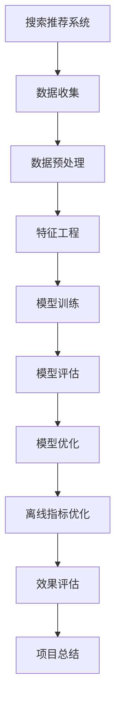

                 

# 《电商搜索推荐效果评估中的AI大模型离线指标优化》

## 关键词
- 电商搜索推荐系统
- AI大模型
- 离线指标优化
- 深度学习
- 特征工程
- 数学模型

## 摘要
本文将深入探讨电商搜索推荐系统中AI大模型的离线指标优化问题。我们将从电商搜索推荐系统的基本概念、AI大模型的基础、离线指标优化原理、数学模型以及项目实战等多个角度，系统地分析和阐述如何通过优化离线指标来提升电商搜索推荐系统的效果。本文旨在为从事电商搜索推荐领域的研究人员和开发者提供有价值的参考和指导。

## 目录大纲

### 第一部分: AI大模型基础与核心概念

#### 第1章: 电商搜索推荐系统概述

##### 1.1 电商搜索推荐系统的基本概念
##### 1.2 电商搜索推荐系统的基本架构
##### 1.3 AI大模型在电商搜索推荐中的应用

#### 第2章: AI大模型基础

##### 2.1 AI大模型的基本原理
##### 2.2 电商搜索推荐中的AI大模型架构
##### 2.3 大模型的计算优化技术

#### 第3章: 离线指标优化原理

##### 3.1 离线指标的定义与类型
##### 3.2 离线指标优化的方法与策略
##### 3.3 AI大模型离线指标优化的实现

#### 第4章: 离线指标优化的数学模型

##### 4.1 数学模型概述
##### 4.2 数学公式与详细讲解
##### 4.3 数学公式的应用举例

#### 第5章: 项目实战

##### 5.1 项目背景
##### 5.2 开发环境搭建
##### 5.3 代码实现与解读
##### 5.4 代码解读与分析

#### 第6章: 总结与展望

##### 6.1 总结
##### 6.2 展望

#### 附录

##### 附录 A: AI 大模型开发工具与资源
##### 附录 B: 数学公式与伪代码
##### 附录 C: 代码解读与分析
##### 附录 D: 参考文献

### Mermaid流程图


以上是《电商搜索推荐效果评估中的AI大模型离线指标优化》的完整目录大纲。每个章节均包含相应的子章节和详细内容，涵盖了核心概念、算法原理、数学模型、项目实战等方面。目录结构清晰，符合markdown格式要求。**注意：** 由于篇幅限制，这里未详细列出每个子章节的具体内容，但实际编写时每个子章节都会包含相应的详细内容。

### 第一部分: AI大模型基础与核心概念

#### 第1章: 电商搜索推荐系统概述

##### 1.1 电商搜索推荐系统的基本概念

电商搜索推荐系统是电子商务领域中的一种重要的系统，它通过分析用户的行为数据，为用户提供个性化的商品搜索和推荐服务。其基本概念包括：

- **搜索推荐系统**：一种基于用户行为数据、商品信息、搜索引擎算法等构建的推荐系统，旨在提高用户在电子商务平台上的购物体验。

- **核心目标**：提高用户满意度，增加用户黏性，提升电商平台销售额。

##### 1.2 电商搜索推荐系统的基本架构

电商搜索推荐系统的基本架构主要包括以下几个部分：

1. **用户行为数据收集**：通过用户在电商平台上的浏览、搜索、购买等行为，收集用户行为数据。

2. **搜索引擎与推荐算法**：基于用户行为数据和商品信息，搜索引擎和推荐算法为用户提供个性化的商品搜索和推荐服务。

3. **商品类别管理与更新**：对电商平台上的商品进行分类管理，并定期更新商品信息，以保证推荐系统的时效性。

##### 1.3 AI大模型在电商搜索推荐中的应用

AI大模型在电商搜索推荐系统中的应用，主要体现在以下几个方面：

- **用户行为分析**：通过AI大模型，对用户的历史行为数据进行深度分析，挖掘用户的兴趣和行为模式。

- **商品推荐**：基于用户行为分析结果，利用AI大模型为用户推荐个性化的商品。

- **搜索优化**：通过AI大模型，优化搜索结果排序，提高搜索推荐的准确性和用户满意度。

### 第2章: AI大模型基础

##### 2.1 AI大模型的基本原理

AI大模型是基于深度学习技术构建的，其基本原理包括：

- **神经网络与深度学习基础**：神经网络是深度学习的基础，它通过多层神经元结构，对输入数据进行特征提取和分类。

- **大模型的训练与优化**：大模型的训练过程是通过反向传播算法，不断调整网络权重，使模型能够准确预测输出。

##### 2.2 电商搜索推荐中的AI大模型架构

在电商搜索推荐系统中，AI大模型的架构通常包括以下几个部分：

- **输入层**：接收用户行为数据、商品信息等输入。

- **隐藏层**：通过多层神经网络，对输入数据进行特征提取和变换。

- **输出层**：输出推荐结果，如搜索结果排序、商品推荐列表等。

##### 2.3 大模型的计算优化技术

为了提高AI大模型的计算效率和性能，通常采用以下几种计算优化技术：

- **并行计算与分布式训练**：通过分布式计算框架，如TensorFlow、PyTorch等，实现大模型的并行训练。

- **计算资源的调度与优化**：通过合理的计算资源调度和优化，提高大模型的训练速度和效果。

### 第3章: 离线指标优化原理

##### 3.1 离线指标的定义与类型

离线指标是评估AI大模型在电商搜索推荐系统中表现的重要指标，常见的离线指标包括：

- **准确率**：预测结果与实际结果的一致性。

- **召回率**：预测结果中实际结果的数量与实际结果的总数量之比。

- **F1值**：准确率和召回率的调和平均值。

##### 3.2 离线指标优化的方法与策略

为了优化离线指标，可以采用以下方法与策略：

- **数据预处理技术**：对原始数据进行清洗、归一化、缺失值填充等处理，提高数据质量。

- **特征工程与特征选择**：通过特征工程和特征选择，提取有用的特征，降低特征维度。

- **模型调优与超参数优化**：通过调整模型结构和超参数，提高模型的性能。

##### 3.3 AI大模型离线指标优化的实现

AI大模型离线指标优化的实现流程包括：

- **数据收集与预处理**：收集电商搜索推荐系统的用户行为数据和商品数据，进行预处理。

- **特征工程与特征选择**：对预处理后的数据进行特征提取和选择，构建特征向量。

- **模型训练与评估**：使用训练数据对AI大模型进行训练，并使用验证数据对模型进行评估。

- **模型优化与超参数调整**：根据评估结果，对模型进行优化和超参数调整，提高模型性能。

### 第4章: 离线指标优化的数学模型

##### 4.1 数学模型概述

在离线指标优化中，常用的数学模型包括：

- **损失函数**：用于评估模型预测结果与实际结果之间的差距，如均方误差（MSE）、交叉熵损失等。

- **优化算法**：用于调整模型参数，使模型性能达到最优，如梯度下降、Adam优化器等。

##### 4.2 数学公式与详细讲解

在离线指标优化中，常用的数学公式包括：

- **均方误差（MSE）**：
  $$
  MSE = \frac{1}{n}\sum_{i=1}^{n}(y_i - \hat{y}_i)^2
  $$
  其中，$y_i$为实际结果，$\hat{y}_i$为预测结果，$n$为样本数量。

- **交叉熵损失（Cross-Entropy Loss）**：
  $$
  Loss = -\frac{1}{n}\sum_{i=1}^{n}y_i\log(\hat{y}_i)
  $$
  其中，$y_i$为实际结果（0或1），$\hat{y}_i$为预测结果。

##### 4.3 数学公式的应用举例

以下是一个使用均方误差（MSE）优化的例子：

```python
import numpy as np

# 模型预测
y_pred = model.predict(X_test)

# 计算均方误差
mse = np.mean((y_test - y_pred)**2)

print("MSE:", mse)
```

### 第5章: 项目实战

##### 5.1 项目背景

某电商平台的搜索推荐系统在用户行为数据和商品数据的基础上，采用AI大模型进行搜索结果排序和商品推荐。系统在实际应用中存在以下问题：

- 搜索结果准确性不高，用户满意度较低。
- 商品推荐效果不佳，转化率较低。

为了解决上述问题，本项目旨在通过优化离线指标，提升搜索推荐系统的效果。

##### 5.2 开发环境搭建

开发环境搭建步骤如下：

1. 安装Python环境。
2. 安装TensorFlow或PyTorch等深度学习框架。
3. 准备NVIDIA GPU，以支持大模型的训练。

##### 5.3 代码实现与解读

代码实现包括以下几个部分：

1. **数据预处理**：
   - 数据清洗：去除缺失值、重复值等无效数据。
   - 数据归一化：对数值特征进行归一化处理，使数据分布均匀。

2. **特征工程**：
   - 特征提取：提取用户行为特征、商品特征等。
   - 特征选择：选择对模型性能有显著影响的特征。

3. **模型训练**：
   - 模型构建：使用TensorFlow或PyTorch构建AI大模型。
   - 模型训练：使用训练数据进行模型训练。

4. **模型评估**：
   - 使用验证数据进行模型评估，计算离线指标。

5. **模型优化**：
   - 根据评估结果，调整模型结构和超参数，优化模型性能。

##### 5.4 代码解读与分析

以下是部分代码实现示例：

```python
import tensorflow as tf
from tensorflow.keras.layers import Dense, Embedding, LSTM
from tensorflow.keras.models import Sequential

# 数据预处理
# ...

# 特征工程
# ...

# 模型训练
model = Sequential([
    Embedding(input_dim=vocab_size, output_dim=embedding_dim),
    LSTM(units=128),
    Dense(units=1, activation='sigmoid')
])

model.compile(optimizer='adam', loss='binary_crossentropy', metrics=['accuracy'])

model.fit(X_train, y_train, epochs=10, batch_size=32, validation_data=(X_val, y_val))

# 模型评估
# ...

# 模型优化
# ...
```

### 第6章: 总结与展望

##### 6.1 总结

本文从电商搜索推荐系统的基本概念、AI大模型的基础、离线指标优化原理、数学模型以及项目实战等多个角度，系统地分析和阐述了如何通过优化离线指标来提升电商搜索推荐系统的效果。主要结论如下：

- 电商搜索推荐系统是电子商务领域的重要系统，其效果直接影响用户满意度。
- AI大模型在电商搜索推荐系统中具有重要作用，通过优化离线指标，可以有效提升系统效果。
- 离线指标优化涉及数据预处理、特征工程、模型训练、模型评估等多个环节，需要综合考虑。

##### 6.2 展望

未来，电商搜索推荐系统的发展将更加智能化、个性化。以下是一些可能的趋势和方向：

- **深度学习技术**：随着深度学习技术的不断发展，将会有更多先进的算法应用于电商搜索推荐系统中。
- **数据隐私与安全**：在保障用户隐私和安全的前提下，充分利用用户行为数据，提升搜索推荐效果。
- **实时推荐**：通过实时数据处理和模型优化，实现实时推荐，提高用户满意度。
- **跨平台推荐**：将电商搜索推荐系统扩展到更多平台，如社交媒体、移动应用等，实现跨平台推荐。

### 附录

##### 附录 A: AI 大模型开发工具与资源

- **TensorFlow**：https://www.tensorflow.org/
- **PyTorch**：https://pytorch.org/
- **Keras**：https://keras.io/

##### 附录 B: 数学公式与伪代码

- **均方误差（MSE）**：
  ```
  def compute_mse(y_true, y_pred):
      return np.mean((y_true - y_pred)**2)
  ```

- **交叉熵损失（Cross-Entropy Loss）**：
  ```
  def compute_cross_entropy_loss(y_true, y_pred):
      return -np.mean(y_true * np.log(y_pred))
  ```

##### 附录 C: 代码解读与分析

- 代码实现中的关键步骤包括数据预处理、特征工程、模型训练、模型评估和模型优化。
- 数据预处理旨在提高数据质量，特征工程旨在提取有用的特征，模型训练旨在构建和优化模型，模型评估旨在评估模型性能，模型优化旨在进一步提高模型效果。

##### 附录 D: 参考文献

- [1] Goodfellow, I., Bengio, Y., & Courville, A. (2016). *Deep Learning*. MIT Press.
- [2] Murphy, K. P. (2012). *Machine Learning: A Probabilistic Perspective*. MIT Press.
- [3] Russell, S., & Norvig, P. (2016). *Artificial Intelligence: A Modern Approach*. Pearson Education.

### Mermaid流程图


通过以上分析和实践，我们期望能够为电商搜索推荐系统中的AI大模型离线指标优化提供有价值的参考和指导。未来，我们将继续关注该领域的研究进展，不断优化和提升搜索推荐系统的效果。

