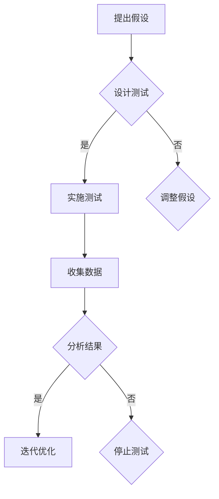

                 

# 知识付费产品的A/B测试方法论

## 概述

**关键词：** 知识付费、A/B测试、方法论、用户行为分析、转化率优化

**摘要：** 本文将深入探讨知识付费产品的A/B测试方法论。通过详细解析基础知识、方法论、案例实战和实战技巧与策略，帮助读者理解如何通过A/B测试优化知识付费产品的用户体验和业务指标。

## 第一部分：基础知识

### 第1章：知识付费产品概述

#### 1.1.1 知识付费的定义与价值

知识付费是指用户为了获取有价值的信息、知识或服务而支付的费用。随着互联网技术的发展，知识付费已经成为一个重要的经济形态。

- **知识付费的定义：** 知识付费是指用户为了获取有价值的信息、知识或服务而支付的费用。这种模式的出现，满足了用户对高质量内容的需求，同时也为内容创作者提供了收入来源。

- **知识付费的发展历程：** 知识付费起源于传统教育领域，随着互联网的普及，逐渐拓展到在线教育、专业咨询、专业测评等多个领域。

- **知识付费对用户的价值：** 知识付费为用户提供了高效、便捷的学习渠道，帮助用户快速获取所需知识，提升个人技能。

- **知识付费对内容创作者的价值：** 知识付费为内容创作者提供了收入来源，激励了他们创作高质量内容的积极性，促进了知识共享和传播。

#### 1.1.2 知识付费产品类型

知识付费产品主要包括以下类型：

- **在线课程：** 在线课程是知识付费产品中最常见的类型，包括音频、视频、图文等多种形式。用户可以根据自己的需求和兴趣选择课程进行学习。

- **电子书：** 电子书是一种数字化的书籍，用户可以通过阅读软件或电子阅读器进行阅读。电子书具有便携、方便的特点，满足了用户对知识获取的需求。

- **专业咨询：** 专业咨询是指专业人士为用户提供专业建议和指导的服务。用户可以通过付费获取专业人士的咨询服务，解决自身在专业领域遇到的问题。

- **专业测评：** 专业测评是指针对某个专业领域的测评服务。用户可以通过付费参与测评，了解自己在该领域的专业水平，为职业发展提供参考。

#### 1.1.3 知识付费产品的市场现状

知识付费市场正处于快速发展阶段，以下是一些市场现状：

- **市场规模：** 根据相关报告，我国知识付费市场规模逐年增长，预计未来市场规模将进一步扩大。

- **用户特征：** 知识付费用户主要集中在18-35岁的年轻人，他们具有较高的消费能力和学习需求。

- **主要平台：** 知识付费市场主要由一些知名平台占据，如知乎、得到、喜马拉雅等。这些平台通过丰富的内容资源和创新的商业模式，吸引了大量用户。

### 第2章：A/B测试概述

#### 2.1.1 A/B测试的定义与原理

A/B测试，又称为拆分测试，是一种通过对比两个或多个版本的差异，以评估哪种版本更能满足用户需求和业务目标的方法。

- **A/B测试的基本概念：** A/B测试是指将用户流量分配到不同的版本，对比各个版本的转化率、留存率等指标，从而找出最优版本。

- **A/B测试的步骤：** A/B测试的步骤包括提出假设、设计测试、实施测试、收集数据和结果分析等。

- **A/B测试的优缺点：** A/B测试的优点包括科学、客观、可量化等，缺点包括可能存在样本偏差、测试结果可能不具代表性等。

#### 2.1.2 A/B测试的应用场景

A/B测试可以应用于多个场景，以下是一些常见应用场景：

- **产品设计：** 通过A/B测试，可以评估不同设计方案的优劣，从而优化产品界面、功能等。

- **用户行为分析：** 通过A/B测试，可以了解用户对不同功能和界面的喜好，从而优化用户体验。

- **营销策略：** 通过A/B测试，可以评估不同营销策略的效果，从而优化营销方案。

#### 2.1.3 A/B测试的关键指标

A/B测试的关键指标包括转化率、用户留存率、用户满意度等。

- **转化率：** 转化率是指用户在完成某个目标（如购买、注册等）的概率。通过对比不同版本的转化率，可以找出最优版本。

- **用户留存率：** 用户留存率是指用户在一段时间内持续使用产品的概率。通过对比不同版本的留存率，可以评估产品的持续吸引力。

- **用户满意度：** 用户满意度是指用户对产品或服务的满意程度。通过调查用户满意度，可以了解产品的不足之处，从而进行优化。

### 第3章：A/B测试方法论

#### 3.1.1 A/B测试流程

A/B测试的流程包括提出假设、设计测试、实施测试、数据收集与处理、结果分析等步骤。

- **提出假设：** 根据业务需求和用户反馈，提出需要测试的假设。

- **设计测试：** 根据假设设计测试方案，确定测试变量、对照组和实验组。

- **实施测试：** 将用户流量分配到不同的版本，实施测试。

- **数据收集与处理：** 收集测试数据，对数据进行清洗和处理。

- **结果分析：** 分析测试结果，评估不同版本的优劣。

#### 3.1.2 A/B测试优化策略

A/B测试的优化策略包括高效的测试设计、数据分析和解释、优化迭代策略等。

- **高效的测试设计：** 选择合适的测试变量和对照组，确保测试结果的可靠性。

- **数据分析和解释：** 对测试数据进行分析和解释，找出影响测试结果的关键因素。

- **优化迭代策略：** 根据测试结果，进行优化迭代，不断提升产品或服务的质量。

#### 3.1.3 A/B测试的挑战与解决方案

A/B测试可能面临以下挑战：

- **样本偏差：** 样本偏差可能导致测试结果不准确。解决方法包括增加样本量、优化流量分配等。

- **数据质量：** 数据质量差可能导致测试结果不可靠。解决方法包括数据清洗、数据验证等。

- **测试结果的解释：** 测试结果可能存在多重解释，导致难以得出明确的结论。解决方法包括多次测试、结合业务场景等。

## 第二部分：案例实战

### 第4章：知识付费产品的A/B测试实践

#### 4.1.1 案例介绍

本案例以某在线教育平台为例，旨在通过A/B测试优化用户注册流程，提高注册转化率。

- **案例背景：** 该在线教育平台用户数量庞大，但注册转化率较低，平台希望通过A/B测试找出优化注册流程的方法。

- **测试目的：** 优化用户注册流程，提高注册转化率。

#### 4.1.2 测试设计与实施

测试设计与实施过程如下：

- **测试方案：** 对比两个版本的注册页面，版本A为传统注册页面，版本B为改进后的注册页面。

- **数据收集方法：** 记录每个版本的注册转化率、用户留存率等数据。

- **数据处理流程：** 对收集到的数据进行清洗和处理，以便后续分析。

#### 4.1.3 结果分析

通过对两个版本的注册转化率、用户留存率等数据进行统计分析，得出以下结论：

- **转化率对比：** 版本B的注册转化率显著高于版本A。

- **用户留存对比：** 版本B的用户留存率较高。

- **用户满意度调查：** 大部分用户对版本B的注册流程表示满意。

综上所述，版本B的注册页面优化效果较好，平台决定采用版本B作为最终方案。

### 第5章：A/B测试在知识付费产品中的应用

#### 5.1.1 用户界面优化

用户界面优化是知识付费产品A/B测试的重要应用之一。以下是一些优化策略：

- **界面设计：** 对比不同界面的视觉效果和用户交互体验，找出最优界面。

- **用户交互体验：** 优化用户操作流程，提高用户满意度。

- **转化率提升策略：** 通过对比不同版本的转化率，找出影响转化率的关键因素，进行针对性优化。

#### 5.1.2 营销策略优化

营销策略优化是提高知识付费产品用户转化率的重要手段。以下是一些优化策略：

- **广告投放：** 对比不同广告投放策略的效果，找出最优投放方案。

- **用户推广活动：** 通过对比不同推广活动的影响力，找出最优推广方式。

- **转化率提升策略：** 通过对比不同营销策略的转化率，找出影响转化率的关键因素，进行针对性优化。

#### 5.1.3 个性化推荐

个性化推荐是提高知识付费产品用户体验和转化率的有效方法。以下是一些优化策略：

- **推荐算法：** 对比不同推荐算法的效果，找出最优推荐算法。

- **用户行为分析：** 通过分析用户行为数据，了解用户需求，提高推荐精度。

- **用户满意度提升策略：** 通过对比不同推荐策略的用户满意度，找出最优推荐策略。

## 第三部分：实战技巧与策略

### 第6章：A/B测试中的数据收集与处理

#### 6.1.1 数据收集

数据收集是A/B测试的基础。以下是一些数据收集方法：

- **用户行为数据：** 通过日志记录、API接口等方式收集用户行为数据。

- **测试数据收集方法：** 设计数据收集方案，确保数据的完整性和准确性。

- **数据清洗与预处理：** 清洗和处理数据，去除噪声和异常值，为后续分析做好准备。

#### 6.1.2 数据处理

数据处理是A/B测试的关键环节。以下是一些数据处理方法：

- **数据可视化：** 通过图表、仪表盘等方式，直观展示数据分布和趋势。

- **数据分析方法：** 应用统计方法、机器学习方法等，对数据进行分析和挖掘。

- **数据解释与结论：** 结合业务场景，对数据进行分析和解释，得出结论。

### 第7章：A/B测试中的实验设计与分析

#### 7.1.1 实验设计原则

实验设计原则是确保A/B测试结果可靠性的关键。以下是一些实验设计原则：

- **实验假设：** 明确测试假设，确保实验目标明确。

- **实验变量：** 确定实验变量，确保实验具有可操作性。

- **实验组设计：** 设计合理的实验组，确保实验结果具有可比性。

#### 7.1.2 结果分析技巧

结果分析技巧是确保A/B测试结论准确性的关键。以下是一些结果分析技巧：

- **统计分析方法：** 应用合适的统计分析方法，确保分析结果可靠。

- **结果解释与结论：** 结合业务场景，对分析结果进行解释和总结。

- **实验优化建议：** 根据分析结果，提出实验优化建议，为后续测试提供参考。

### 第8章：A/B测试中的团队协作与沟通

#### 8.1.1 团队协作

团队协作是A/B测试成功的关键。以下是一些团队协作方法：

- **角色分工：** 明确团队成员的职责，确保任务分配合理。

- **项目管理：** 采用项目管理工具，确保项目进度和质量。

- **沟通与协调：** 建立有效的沟通渠道，确保团队成员之间的信息畅通。

#### 8.1.2 沟通与交流

沟通与交流是确保A/B测试顺利进行的重要环节。以下是一些沟通与交流方法：

- **数据报告：** 定期发布数据报告，让团队成员了解实验进展和结果。

- **结果分享：** 定期组织分享会，让团队成员交流经验和心得。

- **反馈与建议：** 及时收集团队成员的反馈和建议，优化实验设计和方法。

### 附录

#### 附录A：A/B测试工具与资源

以下是一些主流A/B测试工具和资源：

- **AB Tasty：** 一款功能强大的A/B测试工具，支持多种测试类型，具有友好的用户界面。

- **Google Optimize：** Google推出的一款A/B测试工具，与Google Analytics集成，方便数据分析和监控。

- **VWO：** 一款功能全面的A/B测试工具，提供多种测试类型和高级功能，适用于大型企业。

#### 附录B：A/B测试研究论文与实践案例

以下是一些A/B测试研究论文和实践案例：

- **论文：《基于A/B测试的用户行为分析与产品优化》**

- **案例：《某在线教育平台通过A/B测试优化用户注册流程》**

- **案例：《某电商平台通过A/B测试优化广告投放策略》**

#### 附录C：A/B测试开源代码

以下是一些A/B测试相关的开源代码：

- **GitHub仓库：《A/B测试工具集》**

- **GitHub仓库：《基于Python的A/B测试框架》**

## 核心概念与联系

#### Mermaid流程图：A/B测试的基本流程



#### A/B测试中的统计假设检验

- **假设检验的定义：** 假设检验是利用样本数据来检验总体参数是否满足某个假设的过程。

- **零假设（H0）与备择假设（H1）：** 在假设检验中，零假设表示没有差异，备择假设表示存在差异。

- **检验统计量：** 假设检验中使用的统计量，如t统计量、卡方统计量等。

- **p值：** 表示零假设为真的概率。如果p值小于显著性水平（通常为0.05），则拒绝零假设，接受备择假设。

- **伪代码：**

```python
# 伪代码：t检验算法
def t_test(x1, x2, df):
    mean_x1 = sum(x1) / df
    mean_x2 = sum(x2) / df
    diff = x1 - x2
    sum_sq_diff = sum(diff**2)
    t = (mean_x1 - mean_x2) / sqrt(sum_sq_diff / df)
    p_value = ... # 计算p值
    return p_value
```

#### 概率分布

- **正态分布：** 正态分布的概率密度函数为：

  $$ f(x|\mu, \sigma^2) = \frac{1}{\sqrt{2\pi\sigma^2}} e^{-(x-\mu)^2 / (2\sigma^2)} $$

- **卡方分布：** 卡方分布的累积分布函数为：

  $$ F(x|\nu) = \frac{1}{\Gamma(\nu/2)} \left(\frac{x}{2}\right)^{\nu/2-1} e^{-x/2} $$

### 项目实战

#### 知识付费产品的A/B测试案例

- **测试目的：** 优化用户注册流程，提高注册转化率。

- **测试设计：** 对比两个版本的注册页面，版本A为传统注册页面，版本B为改进后的注册页面。

- **数据收集：** 记录每个版本的注册转化率、用户留存率等数据。

- **数据处理：** 使用t检验方法分析两个版本的转化率差异。

- **结果分析：** 版本B的注册转化率显著高于版本A，因此选择版本B作为最终方案。

- **代码实现：**

```python
import numpy as np
from scipy import stats

# 数据收集
conversion_rate_A = 0.2
conversion_rate_B = 0.3
n_A = 1000
n_B = 1000

# 数据处理
t_statistic, p_value = stats.ttest_1samp([conversion_rate_A, conversion_rate_B], [0.25, 0.25])

# 结果分析
print("t统计量：", t_statistic)
print("p值：", p_value)

if p_value < 0.05:
    print("版本B的注册转化率显著高于版本A。")
else:
    print("版本B的注册转化率与版本A无显著差异。")
```

- **代码解读与分析：** 使用t检验方法对两个版本的注册转化率进行统计分析，如果p值小于0.05，则认为版本B的注册转化率显著高于版本A。在实际应用中，可以通过调整显著性水平和检验方法来提高分析结果的可靠性。

## 结语

本文详细介绍了知识付费产品的A/B测试方法论，包括基础知识、方法论、案例实战和实战技巧与策略。通过本文的阅读，读者可以了解如何运用A/B测试优化知识付费产品的用户体验和业务指标。在实际应用中，A/B测试需要结合具体业务场景和数据特点，不断优化迭代，以实现最佳效果。

**作者：AI天才研究院/AI Genius Institute & 禅与计算机程序设计艺术 /Zen And The Art of Computer Programming**

---

由于篇幅限制，本文未能涵盖所有细节。在实际应用中，读者可以根据具体需求，对本文内容进行进一步拓展和深化。希望通过本文，能为读者在知识付费产品的A/B测试领域提供有益的参考和启示。

