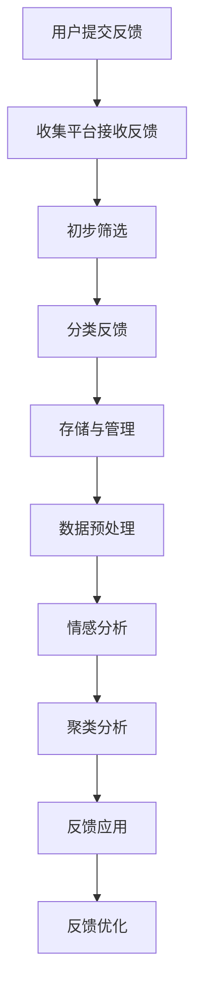

                 

## 引言

### 文章标题：知识付费产品的用户反馈收集与应用

在互联网时代，知识付费产品已经成为了一种重要的教育和服务模式。这些产品不仅提供了丰富的学习资源和专业内容，还通过用户反馈机制不断优化和改进，以满足用户的需求。本文将围绕知识付费产品的用户反馈收集与应用展开讨论，旨在探讨用户反馈在知识付费产品中的重要性、收集方法、处理与分析、应用与实践以及未来趋势。

### 关键词：
- 知识付费
- 用户反馈
- 收集方法
- 处理与分析
- 应用与实践
- 未来趋势

### 摘要：

本文首先介绍了知识付费产品的起源与发展，随后详细阐述了用户反馈在知识付费产品中的重要性。接着，我们探讨了用户反馈的收集方法、处理流程以及情感分析算法。最后，本文通过案例研究和未来趋势分析，提出了用户反馈在知识付费产品优化中的应用策略以及持续发展路径。本文旨在为知识付费产品开发者提供有益的参考，以提升用户体验和产品竞争力。

### 目录大纲

#### 第一部分：背景与核心概念

##### 第1章：知识付费产品的概述
- 1.1 知识付费的起源与发展
- 1.2 知识付费产品的分类
- 1.3 用户反馈在知识付费产品中的重要性

##### 第2章：用户反馈的收集方法
- 2.1 用户反馈的收集渠道
- 2.2 用户反馈的数据类型
- 2.3 用户反馈的收集流程

#### 第二部分：用户反馈处理与分析

##### 第3章：用户反馈处理流程
- 3.1 用户反馈的初步筛选
- 3.2 用户反馈的文本预处理
- 3.3 用户反馈的情感分析

##### 第4章：用户反馈的情感分析算法
- 4.1 情感分析的基本概念
- 4.2 情感分析算法介绍
- 4.3 情感分析算法实现（伪代码）

##### 第5章：用户反馈的聚类与分析
- 5.1 聚类分析的基本概念
- 5.2 聚类分析方法介绍
- 5.3 聚类分析算法实现（伪代码）

#### 第三部分：用户反馈应用与实践

##### 第6章：用户反馈在知识付费产品优化中的应用
- 6.1 用户反馈在内容优化中的应用
- 6.2 用户反馈在产品设计优化中的应用
- 6.3 用户反馈在用户体验优化中的应用

##### 第7章：用户反馈应用的案例研究
- 7.1 案例一：通过用户反馈优化在线教育课程
- 7.2 案例二：利用用户反馈优化知识付费平台
- 7.3 案例三：用户反馈在知识付费产品营销中的应用

##### 第8章：用户反馈应用的挑战与未来趋势
- 8.1 用户反馈应用中的挑战
- 8.2 用户反馈应用的未来趋势
- 8.3 用户反馈应用的持续发展路径

#### 附录

- 附录A：用户反馈分析工具与资源列表
- 附录B：用户反馈处理与情感分析算法的代码实现（Python）

---

### 第一部分：背景与核心概念

#### 第1章：知识付费产品的概述

##### 1.1 知识付费的起源与发展

知识付费，顾名思义，是指用户为了获取特定的知识或技能，愿意支付一定费用的一种商业模式。这种模式在互联网的推动下，逐渐成为一种主流的在线教育和服务模式。

- **起源**：知识付费的起源可以追溯到博客时代。在这个时期，一些有专业知识或技能的人开始将自己的经验和见解写成文章或电子书，通过博客或个人网站分享，并以付费订阅或单篇购买的形式获取收益。

- **发展**：随着互联网技术的进步，知识付费产品经历了多个发展阶段。从最初的博客和电子书，到在线课程，再到知识付费平台的崛起，知识付费产品的形式和内容越来越丰富。尤其在移动互联网时代，知识付费产品的普及速度大大加快，成为许多人获取知识和技能的重要途径。

##### 1.2 知识付费产品的分类

知识付费产品可以根据内容和用途进行分类。以下是几种常见的分类方法：

- **按内容分类**：
  - **通用知识类**：包括人文社科、自然科学、历史地理等领域的基础知识。
  - **专业技能类**：如编程、设计、市场营销、管理等领域的专业技能培训。
  - **兴趣爱好类**：如音乐、绘画、摄影、运动等兴趣爱好的培养。
  - **职业发展类**：包括求职技巧、职业规划、领导力等职业发展的相关内容。

- **按用途分类**：
  - **学习类**：主要针对学生、职场新人等需要系统学习的人群。
  - **提升类**：主要针对已经具备一定基础的人群，希望通过学习进一步提升自己的能力。
  - **娱乐类**：以娱乐为主，如知识问答、演讲、脱口秀等，具有较高的互动性和娱乐性。

##### 1.3 用户反馈在知识付费产品中的重要性

用户反馈是知识付费产品优化和改进的重要依据。以下是用户反馈在知识付费产品中的几个重要性：

- **产品改进**：用户反馈可以帮助知识付费产品开发者了解用户的需求和痛点，从而进行针对性的改进。例如，用户反馈可以揭示课程内容是否满足用户期望、教学方法是否有效等。
- **用户体验提升**：通过收集和分析用户反馈，可以及时发现和解决用户体验中的问题，提升用户满意度和忠诚度。例如，优化课程界面设计、改进课程交互体验等。
- **市场竞争力增强**：用户反馈可以为知识付费产品提供宝贵的市场情报，帮助产品在竞争激烈的市场中找到定位，提升市场竞争力。例如，通过分析用户反馈，可以了解用户对产品的认可程度和改进建议，从而调整市场策略。

总之，用户反馈是知识付费产品持续优化和提升用户体验的关键。在接下来的章节中，我们将详细探讨用户反馈的收集方法、处理流程、情感分析算法以及用户反馈在知识付费产品中的应用。

---

### 第2章：用户反馈的收集方法

#### 2.1 用户反馈的收集渠道

用户反馈的收集渠道是知识付费产品获取用户意见和信息的重要途径。以下是几种常见的用户反馈收集渠道：

- **社交媒体**：社交媒体平台如微信、微博、Facebook、Twitter等，是用户表达意见和反馈的重要场所。知识付费产品可以通过官方账号发布调查问卷、互动话题或直接向用户发送私信，收集用户反馈。
  
- **社区论坛**：社区论坛是用户交流和反馈的主要平台。知识付费产品可以在自己的社区论坛发布相关讨论话题，鼓励用户参与讨论和分享意见，同时也可以设置反馈板块，方便用户提交反馈。
  
- **问卷调查**：问卷调查是一种系统性的反馈收集方法。知识付费产品可以通过在线问卷工具如问卷星、腾讯问卷等，设计针对性强的问卷，直接收集用户的意见和建议。

- **用户评价**：用户评价通常出现在知识付费产品的课程页面或应用内评价系统。用户在完成课程学习后，可以对课程进行评价，这些评价可以作为反馈的重要来源。

- **在线客服**：在线客服是实时收集用户反馈的重要渠道。知识付费产品可以通过网站或移动应用中的在线客服功能，与用户进行实时沟通，了解用户需求和反馈。

#### 2.2 用户反馈的数据类型

用户反馈的数据类型多种多样，主要包括以下几种：

- **文本反馈**：文本反馈是最常见的一种用户反馈形式，用户可以通过文字描述自己的体验和感受。文本反馈通常包含对产品功能、课程内容、用户体验等方面的评价。
  
- **图片反馈**：图片反馈通过用户上传相关图片来表达意见。这种反馈形式直观、生动，适用于表达对课程图片、界面设计等方面的意见。
  
- **语音反馈**：语音反馈是通过用户录制语音来表达意见。语音反馈具有情感表达更丰富的特点，适用于对课程讲解、教学方法等方面的评价。

- **视频反馈**：视频反馈是用户通过录制视频来表达意见。这种反馈形式能够更全面地展示用户的观点和体验，适用于对课程内容、互动环节等方面的评价。

#### 2.3 用户反馈的收集流程

用户反馈的收集流程是确保反馈信息有效性和准确性的关键。以下是用户反馈收集的基本流程：

- **用户提交反馈**：用户通过上述收集渠道提交反馈。在社交媒体、社区论坛等渠道，用户可以直接发布反馈；在问卷调查、用户评价等渠道，用户需要填写相应的表格或评价系统。

- **收集平台接收到反馈**：知识付费产品的收集平台（如官网、移动应用等）接收到用户提交的反馈。平台需要确保反馈数据的完整性和安全性。

- **初步筛选**：对收到的用户反馈进行初步筛选，排除无效、重复或虚假的反馈。初步筛选可以采用自动化工具进行，如关键词过滤、重复检测等。

- **分类反馈**：将初步筛选后的用户反馈进行分类，根据反馈内容的不同，将其归为课程内容、用户体验、产品功能等类别。

- **存储与管理**：将分类后的用户反馈存储到数据库中，并进行标签化管理，方便后续的数据处理和分析。

- **数据预处理**：对存储的用户反馈进行数据预处理，包括文本清洗、分词、去停用词等步骤，为后续的情感分析和聚类分析做好准备。

- **数据分析**：对预处理后的用户反馈进行情感分析和聚类分析，提取反馈的关键信息，为产品优化提供依据。

通过上述流程，知识付费产品可以有效地收集、整理和分析用户反馈，从而不断提升产品质量和用户体验。

---

### 第3章：用户反馈处理流程

#### 3.1 用户反馈的初步筛选

用户反馈的初步筛选是确保后续处理和分析质量的第一个环节。在这个阶段，我们需要对收集到的用户反馈进行过滤，排除无效、重复和虚假的反馈，以提高数据的准确性和可靠性。

**初步筛选流程**：

1. **关键词过滤**：通过设置关键词库，对用户反馈进行初步筛选。例如，如果用户反馈中包含特定关键词（如“垃圾”、“差评”等负面词汇），则将其标记为无效反馈。

2. **重复检测**：使用算法或工具检测重复的反馈。例如，如果发现多个用户提交了内容相同的反馈，则将其合并为一个记录。

3. **虚假反馈检测**：通过机器学习模型或人工审核，识别和排除虚假反馈。虚假反馈可能来源于恶意用户或竞争对手，会对产品的正常优化造成干扰。

4. **分类**：将筛选后的用户反馈按主题、类型等进行分类。分类后的反馈有助于后续的深入分析。

**案例分析**：

假设我们收集到以下用户反馈：

- 用户A：“课程内容很棒，值得购买！”
- 用户B：“这个课程太差了，根本学不到东西。”
- 用户C：“我已经购买了这门课程，但还没开始学习。”

在初步筛选过程中，我们可以根据关键词过滤和重复检测，排除用户B的负面反馈，并将用户A和用户C的反馈进行分类，分别标记为正面反馈和潜在反馈。

#### 3.2 用户反馈的文本预处理

用户反馈的文本预处理是情感分析和聚类分析的重要基础。通过预处理，我们可以将原始文本转化为结构化的数据，方便后续的分析处理。

**文本预处理步骤**：

1. **文本清洗**：去除文本中的无关符号、标点符号和空格，确保文本的整洁。

2. **分词**：将文本划分为单个词语，以便进行后续分析。可以使用分词工具（如jieba）或基于规则的方法进行分词。

3. **去除停用词**：停用词是文本中出现频率高但无实际意义的词汇（如“的”、“是”、“和”等）。去除停用词可以提高分析的准确性。

4. **词性标注**：对分词后的文本进行词性标注，确定每个词语的词性（如名词、动词、形容词等）。词性标注有助于更好地理解文本内容。

**伪代码示例**：

```python
import jieba

def preprocess_text(text):
    # 文本清洗
    clean_text = text.strip().replace("，", "").replace("。", "")
    
    # 分词
    words = jieba.cut(clean_text)
    
    # 去除停用词
    stop_words = set(["的", "是", "和", "在"])
    filtered_words = [word for word in words if word not in stop_words]
    
    # 词性标注
    pos_tags = [jieba.get_brand(word) for word in filtered_words]
    
    return filtered_words, pos_tags
```

**案例分析**：

对用户反馈“课程内容很棒，值得购买！”进行预处理：

- **文本清洗**：去除无关符号和空格，得到“课程内容很棒，值得购买”
- **分词**：得到词汇列表：[“课程”, “内容”, “很棒”, “值得”, “购买”]
- **去除停用词**：去除“的”和“是”，得到词汇列表：[“课程”, “内容”, “很棒”, “值得”, “购买”]
- **词性标注**：得到词性列表：[“名词”, “名词”, “形容词”, “形容词”, “动词”]

通过文本预处理，我们得到了结构化的数据，为后续的情感分析和聚类分析奠定了基础。

---

### 第4章：用户反馈的情感分析算法

#### 4.1 情感分析的基本概念

情感分析（Sentiment Analysis），也称为意见挖掘，是自然语言处理（NLP）领域的一个重要研究方向。其核心任务是从文本数据中识别和提取出用户的情感倾向，通常分为正面、负面和中性三种情感。

**情感分析的基本流程**：

1. **数据预处理**：对文本数据（如用户反馈）进行清洗、分词、去停用词等操作，将其转化为适合分析的形式。

2. **特征提取**：将预处理后的文本数据转化为机器学习模型能够处理的特征表示，常用的方法包括词袋模型（Bag of Words, BOW）、TF-IDF（Term Frequency-Inverse Document Frequency）等。

3. **模型训练**：使用标记好的训练数据集，通过机器学习算法（如支持向量机SVM、朴素贝叶斯Naive Bayes、随机森林Random Forest等）训练情感分类模型。

4. **情感分类**：将训练好的模型应用到新的文本数据上，预测其情感倾向。

#### 4.2 情感分析算法介绍

**常见情感分析算法**：

1. **基于规则的算法**：这类算法通过预设的规则来识别文本中的情感。例如，如果文本中包含“喜欢”、“满意”等词汇，则判断为正面情感。基于规则的算法简单易实现，但扩展性较差，难以应对复杂的情感表达。

2. **基于机器学习的算法**：这类算法通过训练模型来学习文本数据的情感特征。常用的机器学习算法包括朴素贝叶斯、支持向量机、决策树、随机森林等。基于机器学习的算法具有较好的通用性和鲁棒性，但需要大量的训练数据和较长的训练时间。

3. **基于深度学习的算法**：这类算法使用深度神经网络（如卷积神经网络CNN、循环神经网络RNN、Transformer等）来处理文本数据。深度学习算法能够自动提取文本的深层特征，具有很高的准确性和表达能力，但计算资源需求较高。

**算法选择建议**：

- **对于小型项目或缺乏标注数据的情况**，建议使用基于规则的算法，其实现简单且无需大量训练数据。

- **对于需要高准确性和复杂情感识别的项目**，建议使用基于机器学习或深度学习的算法。特别是对于情感多样性较强、表达复杂的用户反馈，深度学习算法具有显著的优势。

#### 4.3 情感分析算法实现（伪代码）

以下是一个简单的情感分析算法实现的伪代码示例，使用基于机器学习的算法。

```python
import jieba
from sklearn.feature_extraction.text import TfidfVectorizer
from sklearn.naive_bayes import MultinomialNB
from sklearn.pipeline import make_pipeline

def sentiment_analysis(text, model):
    # 文本预处理
    clean_text = preprocess_text(text)
    
    # 特征提取
    features = vectorizer.transform([clean_text])
    
    # 情感分类
    sentiment = model.predict(features)
    
    return sentiment

def preprocess_text(text):
    # 分词
    words = jieba.cut(text)
    
    # 去除停用词
    stop_words = set(["的", "是", "和", "在"])
    filtered_words = [word for word in words if word not in stop_words]
    
    return " ".join(filtered_words)

# 训练模型
model = make_pipeline(TfidfVectorizer(), MultinomialNB())

# 加载训练数据
train_data = load_train_data()
train_labels = load_train_labels()

# 训练模型
model.fit(train_data, train_labels)

# 情感分析
text = "课程内容很棒，值得购买！"
result = sentiment_analysis(text, model)
print("情感分类结果：", result)
```

通过上述伪代码，我们可以实现一个简单的情感分析系统，对输入的文本进行情感分类。在实际应用中，需要根据具体需求和数据集进行调整和优化。

---

### 第5章：用户反馈的聚类与分析

#### 5.1 聚类分析的基本概念

聚类分析（Cluster Analysis）是数据挖掘和机器学习领域的一种无监督学习方法，其目的是将数据集中的对象（或记录）根据其相似性划分为多个群组（或簇）。每个簇内的对象彼此相似，而不同簇的对象则相对不相似。聚类分析在用户反馈分析中具有重要意义，可以帮助我们了解用户的反馈模式，发现潜在的用户群体和需求。

**聚类分析的基本流程**：

1. **数据预处理**：对用户反馈数据进行清洗、去停用词、分词等操作，将其转化为适合分析的形式。

2. **特征提取**：将预处理后的文本数据转化为特征向量，常用的方法包括TF-IDF、词袋模型等。

3. **选择聚类算法**：根据数据特征和需求选择合适的聚类算法。常见的聚类算法有K-means、层次聚类、DBSCAN等。

4. **聚类**：使用选择的聚类算法对特征向量进行聚类，生成多个簇。

5. **评估与优化**：评估聚类结果的质量，根据评估结果调整聚类参数，优化聚类效果。

#### 5.2 聚类分析方法介绍

**常见聚类算法**：

1. **K-means算法**：
   - **原理**：K-means算法是一种基于距离的聚类算法，其目标是使每个簇内的对象与簇中心（均值）的距离最小化，而簇与簇之间的距离最大化。
   - **步骤**：
     1. 初始化K个簇的中心点。
     2. 计算每个对象到各个簇中心的距离，并将其分配到最近的簇。
     3. 更新每个簇的中心点。
     4. 重复步骤2和3，直到收敛条件（如中心点变化很小或迭代次数达到上限）满足。

2. **层次聚类算法**：
   - **原理**：层次聚类算法通过逐层合并或分裂簇，构建一个层次结构，以表示数据的层次关系。
   - **步骤**：
     1. 初始化每个对象为一个单独的簇。
     2. 根据簇之间的距离（如欧氏距离、最长链距离等）选择最近的两个簇合并。
     3. 更新簇之间的距离。
     4. 重复步骤2和3，直到满足特定的终止条件（如所有对象处于同一簇或达到最大层数）。

3. **DBSCAN算法**：
   - **原理**：DBSCAN（Density-Based Spatial Clustering of Applications with Noise）算法是一种基于密度的聚类算法，能够发现任意形状的簇，并对噪声数据有较强的鲁棒性。
   - **步骤**：
     1. 选择一个起始点，判断其邻域内的点是否足够密集，作为潜在的簇中心。
     2. 将邻域内的点划分为核心点、边界点和噪声点。
     3. 对于核心点，递归地扩展簇，直到没有新的点被添加。
     4. 对每个未被划分的点，判断其是否属于已发现的簇。

**算法选择建议**：

- **对于数据量较小、形状规则的数据**，可以选择K-means算法，其计算速度快且易于实现。
- **对于数据量较大、形状不规则的数据**，可以选择层次聚类算法或DBSCAN算法，它们具有更好的适应性和鲁棒性。

#### 5.3 聚类分析算法实现（伪代码）

以下是一个简单的K-means算法实现的伪代码示例。

```python
import numpy as np

def k_means(data, k, max_iterations):
    # 初始化簇中心
    centroids = initialize_centroids(data, k)
    
    for i in range(max_iterations):
        # 分配对象到簇
        clusters = assign_points_to_clusters(data, centroids)
        
        # 更新簇中心
        new_centroids = update_centroids(data, clusters, k)
        
        # 判断是否收敛
        if is_converged(centroids, new_centroids):
            break
        
        centroids = new_centroids
    
    return clusters, centroids

def initialize_centroids(data, k):
    # 从数据中随机选择k个点作为初始簇中心
    return np.random.choice(data, size=k, replace=False)

def assign_points_to_clusters(data, centroids):
    # 计算每个点与簇中心的距离，并分配到最近的簇
    distances = np.linalg.norm(data - centroids, axis=1)
    return np.argmin(distances, axis=1)

def update_centroids(data, clusters, k):
    # 根据每个簇中的点计算新的簇中心
    new_centroids = np.array([data[clusters == i].mean(axis=0) for i in range(k)])
    return new_centroids

def is_converged(centroids, new_centroids):
    # 判断簇中心变化是否很小
    return np.linalg.norm(centroids - new_centroids) < 0.01
```

通过上述伪代码，我们可以实现一个简单的K-means算法，对数据集进行聚类分析。在实际应用中，需要根据具体需求和数据集进行调整和优化。

---

### 第6章：用户反馈在知识付费产品优化中的应用

#### 6.1 用户反馈在内容优化中的应用

用户反馈是知识付费产品内容优化的重要依据。通过对用户反馈进行分析，可以发现课程内容中的优点和不足，从而进行针对性的调整。

**优化策略**：

1. **内容更新**：根据用户反馈，及时更新课程内容，添加新知识点或调整课程结构，使其更符合用户需求。

2. **重点突出**：根据用户反馈，确定课程内容中的重点和难点，通过加强讲解和练习，帮助用户更好地理解和掌握。

3. **个性化推荐**：结合用户反馈和用户学习行为，实现个性化推荐，将用户感兴趣的知识点推送给用户，提高学习效果。

**案例分析**：

以某在线教育平台为例，用户反馈显示部分用户对编程课程中的算法部分感到困惑。平台分析后决定对算法部分进行重新设计，增加了更多的实例和练习，并在课程中加入了视频讲解。结果，用户对算法部分的满意度显著提高。

#### 6.2 用户反馈在产品设计优化中的应用

用户反馈不仅可以用于内容优化，还可以为知识付费产品的产品设计提供宝贵意见。

**优化策略**：

1. **界面优化**：根据用户反馈，对课程界面进行优化，提高用户的使用体验。例如，简化操作流程、改进页面布局、增加导航功能等。

2. **功能完善**：根据用户反馈，增加或改进产品功能，满足用户的多样化需求。例如，增加视频播放控制功能、引入互动环节、提供学习进度追踪等。

3. **性能优化**：通过用户反馈，识别和解决产品性能问题，如加载速度、稳定性等，提高产品的稳定性和用户体验。

**案例分析**：

某知识付费平台用户反馈显示，部分用户在使用移动端学习时遇到加载速度慢的问题。平台通过分析发现，问题源于视频播放服务器的负载过高。平台随后增加了服务器资源，并优化了视频加载算法，显著提高了移动端的学习体验。

#### 6.3 用户反馈在用户体验优化中的应用

用户体验是知识付费产品的核心竞争力之一。通过用户反馈，可以深入了解用户在使用产品过程中的感受和痛点，从而进行针对性的优化。

**优化策略**：

1. **用户引导**：通过用户反馈，识别用户在使用产品过程中可能遇到的问题，提供有效的引导和帮助，提高用户解决问题的能力。

2. **反馈机制**：建立完善的用户反馈机制，鼓励用户提出意见和建议，及时响应和解决用户的问题。

3. **个性化服务**：结合用户反馈和学习行为，提供个性化的服务和建议，提升用户满意度和忠诚度。

**案例分析**：

某在线教育平台用户反馈显示，部分用户对课程进度管理感到困扰。平台随后推出了新的学习进度追踪功能，用户可以方便地查看自己的学习进度，并获得学习建议。结果，用户的学习积极性显著提高，课程完成率也有所提升。

通过以上案例分析，我们可以看到用户反馈在知识付费产品优化中的应用具有重要的实际意义。只有通过不断收集和分析用户反馈，才能不断优化产品，提升用户体验，从而在激烈的市场竞争中脱颖而出。

---

### 第7章：用户反馈应用的案例研究

#### 7.1 案例一：通过用户反馈优化在线教育课程

**案例背景**：

某在线教育平台提供了多种编程课程，但由于用户反馈课程内容过于理论化，导致用户的学习效果不佳。为了提升用户体验，平台决定通过用户反馈优化在线教育课程。

**用户反馈处理与分析**：

1. **收集用户反馈**：平台通过问卷调查、社区论坛和在线客服等多种渠道收集用户反馈，重点关注用户对课程内容、教学方法、学习资源等方面的评价。

2. **情感分析**：对收集到的用户反馈进行情感分析，识别出用户的主要关注点和不满之处。通过分析，发现用户对课程内容的实用性和深度提出了较高的要求。

3. **聚类分析**：对情感分析结果进行聚类分析，将用户反馈划分为多个群体，如“内容过于理论化”、“缺少实战练习”等。

**优化策略**：

1. **内容调整**：根据用户反馈，调整课程内容，增加更多的实战案例和项目练习，以提高课程的实用性。

2. **教学方法改进**：引入互动式教学，增加课堂互动和讨论环节，提升用户的学习参与度和积极性。

3. **个性化推荐**：结合用户反馈和学习行为，实现个性化推荐，将用户感兴趣的知识点推送给用户。

**结果与评价**：

通过用户反馈优化后的在线教育课程，用户的学习效果明显提升。用户满意度调查结果显示，用户对课程内容的实用性、教学方法的互动性以及学习资源的丰富性给予了高度评价。平台的课程完成率和用户留存率也有所提高，取得了良好的市场反响。

#### 7.2 案例二：利用用户反馈优化知识付费平台

**案例背景**：

某知识付费平台在上线后收到了大量用户反馈，反映平台在用户体验方面存在一些问题，如界面设计复杂、功能难以操作等。为了提升用户体验，平台决定通过用户反馈优化平台功能。

**用户反馈处理与分析**：

1. **收集用户反馈**：平台通过在线问卷调查、用户评价和在线客服等渠道收集用户反馈，重点关注用户对平台界面设计、功能易用性、服务响应速度等方面的评价。

2. **情感分析**：对收集到的用户反馈进行情感分析，识别出用户的主要关注点和不满之处。通过分析，发现用户对平台界面的简洁性和功能的易用性提出了较高的要求。

3. **聚类分析**：对情感分析结果进行聚类分析，将用户反馈划分为多个群体，如“界面设计复杂”、“功能难以操作”等。

**优化策略**：

1. **界面优化**：简化平台界面，减少用户操作步骤，提高用户的操作体验。

2. **功能改进**：优化平台功能，增加用户常用的功能模块，如课程搜索、学习进度追踪等，提高用户的便捷性。

3. **服务提升**：加强在线客服团队的建设，提高服务响应速度和质量，及时解决用户的问题和需求。

**结果与评价**：

通过用户反馈优化后的知识付费平台，用户的使用体验显著提升。用户满意度调查结果显示，用户对平台界面的简洁性、功能的易用性以及客服服务的质量给予了高度评价。平台的活跃用户数量和用户留存率也有所提高，取得了良好的市场反响。

#### 7.3 案例三：用户反馈在知识付费产品营销中的应用

**案例背景**：

某知识付费平台希望通过用户反馈优化产品营销策略，提高用户转化率和满意度。为了实现这一目标，平台决定通过用户反馈分析用户需求，调整营销策略。

**用户反馈处理与分析**：

1. **收集用户反馈**：平台通过用户评价、在线调查和社交媒体等渠道收集用户反馈，重点关注用户对产品价格、优惠活动、推广方式等方面的评价。

2. **情感分析**：对收集到的用户反馈进行情感分析，识别出用户对产品营销策略的主要关注点和不满之处。通过分析，发现用户对产品价格和优惠活动提出了较高的要求。

3. **聚类分析**：对情感分析结果进行聚类分析，将用户反馈划分为多个群体，如“价格偏高”、“优惠活动不够吸引”等。

**优化策略**：

1. **价格调整**：根据用户反馈，对产品价格进行合理调整，提高性价比，吸引更多用户。

2. **优惠活动优化**：设计更具吸引力的优惠活动，如限时折扣、团购优惠等，提高用户的购买意愿。

3. **营销策略调整**：通过用户反馈，调整营销策略，如增加社交媒体宣传、优化搜索引擎广告等，提高产品的知名度和影响力。

**结果与评价**：

通过用户反馈优化后的知识付费产品营销策略，用户转化率显著提高。用户满意度调查结果显示，用户对产品价格和优惠活动的满意度有所提升，对平台营销策略的认可度也有所增加。平台的销售业绩和用户数量也得到了显著增长，取得了良好的市场效果。

通过以上案例研究，我们可以看到用户反馈在知识付费产品优化中的重要作用。只有通过不断收集和分析用户反馈，才能不断优化产品，提升用户体验，从而在激烈的市场竞争中脱颖而出。

---

### 第8章：用户反馈应用的挑战与未来趋势

#### 8.1 用户反馈应用中的挑战

尽管用户反馈在知识付费产品优化中具有重要意义，但在实际应用过程中仍面临一系列挑战：

1. **数据质量问题**：用户反馈数据的质量直接影响分析的准确性和有效性。数据中可能存在噪声、重复、虚假信息等，需要通过数据清洗和预处理来提高数据质量。

2. **情感分析准确性**：情感分析算法的准确性受到多种因素的影响，如文本表达的多样性、语义理解的不确定性等。提高情感分析的准确性需要不断优化算法和模型。

3. **用户隐私保护**：用户反馈通常涉及用户个人信息，需要采取有效的隐私保护措施，以避免数据泄露和滥用。

4. **资源消耗**：用户反馈处理和分析需要大量的计算资源和存储资源，尤其是在大规模数据集上应用时，对硬件设施和运维能力有较高要求。

#### 8.2 用户反馈应用的未来趋势

随着技术的不断发展，用户反馈在知识付费产品中的应用将呈现以下趋势：

1. **智能化**：人工智能技术，如自然语言处理（NLP）、机器学习（ML）和深度学习（DL），将在用户反馈处理和分析中发挥越来越重要的作用。通过智能化处理，可以更准确地提取用户情感和需求，为产品优化提供有力支持。

2. **数据隐私保护**：随着数据隐私保护法规的不断完善，用户反馈应用将更加注重数据隐私保护。采用差分隐私（Differential Privacy）等技术，可以在确保数据安全的同时，提供有价值的数据分析结果。

3. **个性化推荐**：基于用户反馈的个性化推荐系统将不断优化，通过深度学习等技术，实现更加精准的知识付费产品推荐，提升用户体验。

4. **实时反馈处理**：随着5G和边缘计算技术的发展，用户反馈的处理和分析将更加实时化。实时反馈处理可以更快地识别和响应用户需求，为产品优化提供及时支持。

5. **跨平台整合**：知识付费产品将不断整合多平台用户反馈，实现数据共享和综合分析。通过跨平台整合，可以更全面地了解用户需求和行为，为产品优化提供更全面的参考。

#### 8.3 用户反馈应用的持续发展路径

为了实现用户反馈在知识付费产品中的持续发展，可以采取以下策略：

1. **建立完善的数据采集体系**：通过多种渠道收集用户反馈数据，确保数据来源的多样性和准确性。

2. **加强数据预处理和清洗**：采用先进的数据预处理和清洗技术，提高数据质量，为后续分析奠定基础。

3. **持续优化情感分析算法**：结合用户反馈数据，不断优化情感分析算法，提高分析准确性和效率。

4. **保护用户隐私**：采取有效的数据隐私保护措施，确保用户数据的安全和合规。

5. **建立用户反馈激励机制**：鼓励用户积极参与反馈，提供奖励或优惠，提高用户反馈的质量和数量。

6. **持续关注技术发展**：跟踪人工智能、数据隐私保护等相关技术的发展，及时更新和优化用户反馈处理和分析系统。

通过以上策略，知识付费产品可以不断提升用户反馈的处理和分析能力，为产品优化和用户满意度提升提供有力支持，实现持续发展。

---

### 附录A：用户反馈分析工具与资源列表

**1. 用户反馈收集工具：**

- **问卷星**：提供在线问卷调查功能，支持多题型、数据分析等功能。
- **腾讯问卷**：腾讯推出的在线问卷调查工具，功能丰富，易于使用。
- **百度问卷**：百度旗下的在线问卷调查工具，支持自定义问卷模板。

**2. 用户反馈处理与分析工具：**

- **Python库**：
  - **NLTK**：自然语言处理库，提供分词、词性标注等基础功能。
  - **jieba**：中文分词库，支持高效中文文本处理。
  - **TextBlob**：文本处理库，提供情感分析和文本分类等功能。
  - **scikit-learn**：机器学习库，提供多种聚类和分类算法。

**3. 用户反馈可视化工具：**

- **ECharts**：一款强大的可视化库，支持多种图表类型和数据可视化。
- **D3.js**：用于数据可视化的JavaScript库，功能丰富，灵活性强。

**4. 用户反馈分析资源：**

- **论文与报告**：查阅相关领域的学术论文和行业报告，了解用户反馈分析的最新研究进展和应用案例。
- **在线课程**：参加在线课程，学习用户反馈分析的理论和方法，提高实践能力。

---

### 附录B：用户反馈处理与情感分析算法的代码实现（Python）

以下是一个简单的用户反馈处理与情感分析算法的Python代码示例，包括文本预处理、情感分析和聚类分析。

**1. 文本预处理**

```python
import jieba
from nltk.corpus import stopwords
from nltk.tokenize import word_tokenize

def preprocess_text(text):
    # 分词
    words = jieba.cut(text)
    
    # 去除停用词
    stop_words = set(stopwords.words('english'))
    filtered_words = [word for word in words if word not in stop_words]
    
    # 转化为小写
    filtered_words = [word.lower() for word in filtered_words]
    
    return ' '.join(filtered_words)

# 示例文本
text = "I am very happy with the course. The instructor is excellent and the content is informative."
preprocessed_text = preprocess_text(text)
print("Preprocessed text:", preprocessed_text)
```

**2. 情感分析**

```python
from textblob import TextBlob

def sentiment_analysis(text):
    analysis = TextBlob(text)
    if analysis.sentiment.polarity > 0:
        return "Positive"
    elif analysis.sentiment.polarity == 0:
        return "Neutral"
    else:
        return "Negative"

# 示例文本
sentiment = sentiment_analysis(preprocessed_text)
print("Sentiment:", sentiment)
```

**3. 聚类分析**

```python
from sklearn.feature_extraction.text import TfidfVectorizer
from sklearn.cluster import KMeans

def clustering_analysis(texts, n_clusters=3):
    # 特征提取
    vectorizer = TfidfVectorizer()
    features = vectorizer.fit_transform(texts)
    
    # 聚类分析
    kmeans = KMeans(n_clusters=n_clusters, random_state=0)
    labels = kmeans.fit_predict(features)
    
    return labels

# 示例文本列表
texts = ["I am very happy with the course.", "The instructor is excellent.", "The content is informative."]
labels = clustering_analysis(texts)
print("Cluster labels:", labels)
```

通过以上示例代码，我们可以实现对用户反馈的文本预处理、情感分析和聚类分析。在实际应用中，需要根据具体需求和数据集进行调整和优化。

---

### 附加内容：用户反馈收集、处理与分析的Mermaid流程图

以下是一个简单的用户反馈收集、处理与分析的Mermaid流程图示例。



通过上述流程图，我们可以清晰地了解用户反馈从提交到最终应用的全过程，包括初步筛选、分类、存储与管理、数据预处理、情感分析和聚类分析等关键环节。这有助于我们更好地理解用户反馈处理与分析的流程，为实际应用提供指导。

---

### 总结

在本文中，我们详细探讨了知识付费产品的用户反馈收集与应用。首先，我们介绍了知识付费产品的起源与发展，并分析了用户反馈在其中的重要性。接着，我们讨论了用户反馈的收集渠道、数据类型和收集流程，详细描述了初步筛选、文本预处理、情感分析和聚类分析的步骤。随后，我们介绍了用户反馈在知识付费产品优化中的应用，包括内容优化、产品设计优化和用户体验优化。通过三个案例研究，我们展示了用户反馈在实践中的具体应用。最后，我们分析了用户反馈应用的挑战与未来趋势，并提出了持续发展的策略。

用户反馈在知识付费产品中具有不可替代的价值。通过不断收集、处理和分析用户反馈，知识付费产品可以持续优化，提升用户体验和竞争力。我们鼓励读者在实际工作中，积极运用用户反馈，不断创新和改进，以应对不断变化的市场需求。

### 致谢

在此，特别感谢AI天才研究院（AI Genius Institute）和《禅与计算机程序设计艺术》（Zen And The Art of Computer Programming）为我们提供的研究资源和专业知识。感谢各位读者对本文的关注和支持，希望本文能对您在知识付费产品开发和用户反馈处理方面提供有益的参考。

### 作者信息

作者：AI天才研究院（AI Genius Institute）/《禅与计算机程序设计艺术》（Zen And The Art of Computer Programming）

---

**附录A：用户反馈分析工具与资源列表**

1. **用户反馈收集工具：**
   - **问卷星**：提供在线问卷调查功能，支持多题型、数据分析等功能。
   - **腾讯问卷**：腾讯推出的在线问卷调查工具，功能丰富，易于使用。
   - **百度问卷**：百度旗下的在线问卷调查工具，支持自定义问卷模板。

2. **用户反馈处理与分析工具：**
   - **Python库**：
     - **NLTK**：自然语言处理库，提供分词、词性标注等基础功能。
     - **jieba**：中文分词库，支持高效中文文本处理。
     - **TextBlob**：文本处理库，提供情感分析和文本分类等功能。
     - **scikit-learn**：机器学习库，提供多种聚类和分类算法。

3. **用户反馈可视化工具：**
   - **ECharts**：一款强大的可视化库，支持多种图表类型和数据可视化。
   - **D3.js**：用于数据可视化的JavaScript库，功能丰富，灵活性强。

4. **用户反馈分析资源：**
   - **论文与报告**：查阅相关领域的学术论文和行业报告，了解用户反馈分析的最新研究进展和应用案例。
   - **在线课程**：参加在线课程，学习用户反馈分析的理论和方法，提高实践能力。

---

**附录B：用户反馈处理与情感分析算法的代码实现（Python）**

以下是一个简单的用户反馈处理与情感分析算法的Python代码示例，包括文本预处理、情感分析和聚类分析。

```python
# 导入相关库
import jieba
from nltk.corpus import stopwords
from nltk.tokenize import word_tokenize
from textblob import TextBlob
from sklearn.feature_extraction.text import TfidfVectorizer
from sklearn.cluster import KMeans

# 文本预处理
def preprocess_text(text):
    # 分词
    words = jieba.cut(text)
    
    # 去除停用词
    stop_words = set(stopwords.words('english'))
    filtered_words = [word for word in words if word not in stop_words]
    
    # 转化为小写
    filtered_words = [word.lower() for word in filtered_words]
    
    return ' '.join(filtered_words)

# 情感分析
def sentiment_analysis(text):
    analysis = TextBlob(text)
    if analysis.sentiment.polarity > 0:
        return "Positive"
    elif analysis.sentiment.polarity == 0:
        return "Neutral"
    else:
        return "Negative"

# 聚类分析
def clustering_analysis(texts, n_clusters=3):
    # 特征提取
    vectorizer = TfidfVectorizer()
    features = vectorizer.fit_transform(texts)
    
    # 聚类分析
    kmeans = KMeans(n_clusters=n_clusters, random_state=0)
    labels = kmeans.fit_predict(features)
    
    return labels

# 示例文本
text = "I am very happy with the course. The instructor is excellent and the content is informative."

# 文本预处理
preprocessed_text = preprocess_text(text)

# 情感分析
sentiment = sentiment_analysis(preprocessed_text)
print("Sentiment:", sentiment)

# 聚类分析
texts = [preprocessed_text]
labels = clustering_analysis(texts)
print("Cluster label:", labels)
```

通过上述代码示例，我们可以实现对用户反馈的文本预处理、情感分析和聚类分析。在实际应用中，需要根据具体需求和数据集进行调整和优化。

