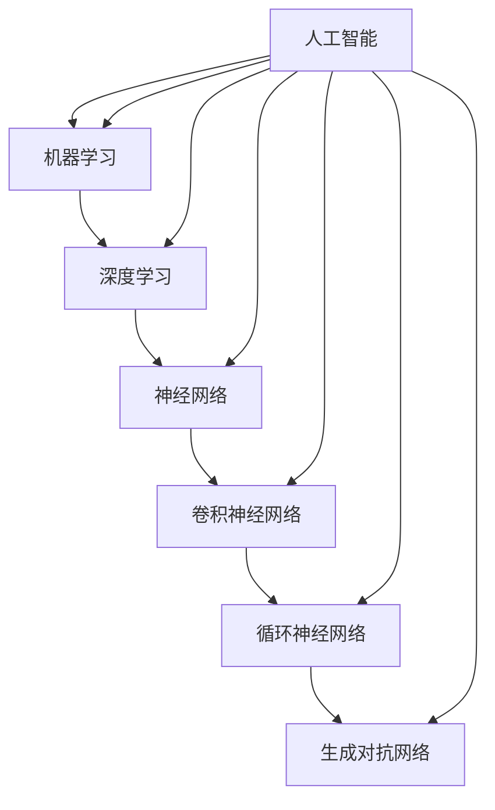

                 

# 《知识付费时代程序员的发展前景》

> 关键词：知识付费、程序员、职业发展、技能提升、编程教育

> 摘要：随着知识付费时代的到来，程序员这一职业面临着新的机遇与挑战。本文将从知识付费时代的背景出发，探讨程序员在这一时代的发展前景，分析其角色与定位，提出技能提升与职业发展的策略，以及探讨知识付费平台与编程教育的趋势，为程序员在新时代的职业规划提供参考。

## 目录

### 第一部分：知识付费时代背景与程序员发展环境

1. 知识付费时代的兴起
    - 1.1 知识付费的定义与发展历程
    - 1.2 知识付费行业现状与趋势
    - 1.3 知识付费对程序员职业的影响

2. 程序员在知识付费时代的角色与定位
    - 2.1 程序员在知识付费时代的需求分析
    - 2.2 程序员的核心技能与能力要求
    - 2.3 程序员在知识付费时代的职业发展路径

### 第二部分：程序员技能提升与职业发展

3. 技术趋势与程序员技能图谱
    - 3.1 人工智能与程序员
    - 3.2 大数据与程序员
    - 3.3 云计算与程序员
    - 3.4 物联网与程序员

4. 编程语言选择与深入学习
    - 4.1 常见编程语言介绍
    - 4.2 编程语言选择标准
    - 4.3 编程语言深度学习与应用

5. 开源项目参与与贡献
    - 5.1 开源项目概述
    - 5.2 开源项目参与流程
    - 5.3 开源项目贡献技巧

6. 职业规划与个人品牌建设
    - 6.1 程序员职业规划方法论
    - 6.2 个人品牌建设策略
    - 6.3 职业转型与创新创业

### 第三部分：知识付费平台与程序员成长

7. 知识付费平台概述与使用技巧
    - 7.1 知识付费平台市场格局
    - 7.2 知识付费平台使用技巧
    - 7.3 知识付费平台选课指南

8. 知识付费时代的编程教育
    - 8.1 编程教育的现状与挑战
    - 8.2 编程教育的方法与工具
    - 8.3 编程教育在未来知识付费时代的趋势

9. 案例研究与行业洞察
    - 9.1 知识付费平台成功案例分析
    - 9.2 知识付费时代程序员的成长故事
    - 9.3 知识付费时代的程序员职业发展趋势

### 附录

10. 编程学习资源推荐
    - 10.1 编程书籍推荐
    - 10.2 在线编程课程推荐
    - 10.3 编程论坛与社群推荐

11. 编程技术Mermaid流程图
    - 11.1 人工智能技术流程图
    - 11.2 大数据技术流程图
    - 11.3 云计算技术流程图
    - 11.4 物联网技术流程图

12. 编程语言伪代码示例
    - 12.1 Python伪代码示例
    - 12.2 Java伪代码示例
    - 12.3 JavaScript伪代码示例

13. 数学模型与公式
    - 13.1 机器学习常见数学公式
    - 13.2 数据挖掘常见数学公式
    - 13.3 网络安全常见数学公式

14. 编程实战案例
    - 14.1 实战案例一：基于Python的Web开发
    - 14.2 实战案例二：基于Java的移动应用开发
    - 14.3 实战案例三：基于JavaScript的前端开发

## 第一部分：知识付费时代背景与程序员发展环境

### 1. 知识付费时代的兴起

#### 1.1 知识付费的定义与发展历程

知识付费是指用户为了获取特定知识或技能，通过付费方式获取相应内容的一种商业模式。这种模式最早可以追溯到传统教育领域，但随着互联网技术的普及和内容创作门槛的降低，知识付费逐渐扩展到更多领域。

知识付费的发展历程可以分为以下几个阶段：

1. **初阶阶段（2010年代初期）**：以传统的在线教育、电子书籍、付费课程等形式为主，用户主要通过购买实体书籍或在线课程来获取知识。

2. **中级阶段（2010年代中期）**：随着移动互联网的兴起，知识付费开始在线上平台上迅速发展。各类知识平台如知乎、网易云课堂、腾讯课堂等相继涌现，用户可以通过平台购买课程、订阅内容。

3. **高级阶段（2010年代末期至今）**：知识付费逐渐形成生态系统，除了传统教育、技能培训外，还涵盖了职场发展、投资理财、健康管理等多个领域。同时，内容形式也变得更加多样化，如视频、音频、直播等。

#### 1.2 知识付费行业现状与趋势

目前，知识付费行业呈现出以下几个显著趋势：

1. **市场规模不断扩大**：随着用户对知识需求的增加和支付能力的提升，知识付费市场规模逐年增长。根据相关报告，2020年中国知识付费市场规模已经超过2000亿元。

2. **内容形式多样化**：除了传统的文字和视频课程外，知识付费平台还推出了音频课程、直播课程、问答社区等多种形式，满足不同用户的需求。

3. **垂直领域拓展**：知识付费不再局限于技能培训，逐渐向投资理财、职业规划、心理咨询等领域拓展。

4. **平台竞争激烈**：目前市场上存在大量的知识付费平台，如知乎、得到、喜马拉雅等。这些平台通过内容、服务、技术等多方面的竞争，争夺市场份额。

#### 1.3 知识付费对程序员职业的影响

知识付费时代的到来，对程序员职业产生了深远影响：

1. **学习途径多样化**：程序员可以通过付费课程、电子书籍、在线教程等多种途径进行技能提升，不再局限于传统的教育模式。

2. **职业发展机会增多**：知识付费平台为程序员提供了更多的职业发展机会，如成为课程讲师、技术顾问、专业咨询师等。

3. **个人品牌建设**：程序员可以通过知识付费平台建立个人品牌，提升自身在行业内的知名度和影响力。

4. **收入来源多样化**：除了传统的软件开发工作外，程序员可以通过知识付费获得额外的收入，如开设在线课程、撰写技术博客等。

### 2. 程序员在知识付费时代的角色与定位

在知识付费时代，程序员的角色和定位发生了显著变化，他们不仅需要具备扎实的编程技能，还需要适应新的职业发展环境。

#### 2.1 程序员在知识付费时代的需求分析

1. **技术能力**：程序员需要掌握多种编程语言和技术框架，以满足不同类型的项目需求。此外，随着技术不断发展，程序员还需要不断更新自己的知识储备，以保持竞争力。

2. **教学能力**：随着知识付费的普及，越来越多的程序员开始成为课程讲师或技术顾问。他们需要具备良好的教学能力和沟通能力，能够将复杂的技术知识通俗易懂地传授给学员。

3. **创新能力**：在知识付费时代，程序员需要具备创新能力，能够从实践中发现问题并提出解决方案，从而推动技术进步。

#### 2.2 程序员的核心技能与能力要求

1. **编程语言**：程序员需要熟练掌握至少一种编程语言，如Java、Python、JavaScript等。同时，随着项目需求的变化，他们还需要具备快速学习新语言的能力。

2. **技术框架**：程序员需要熟悉常见的开发框架，如Spring、Django、React等，以提高开发效率。

3. **数据库技术**：程序员需要掌握数据库设计、SQL查询等基本技能，以应对各种数据存储和检索需求。

4. **问题解决能力**：程序员需要具备良好的问题解决能力，能够快速定位并解决问题，保证项目的顺利进行。

5. **团队合作能力**：程序员需要具备良好的团队合作能力，能够与团队成员高效沟通，共同完成任务。

#### 2.3 程序员在知识付费时代的职业发展路径

1. **技术开发方向**：程序员可以通过不断积累经验，晋升为高级程序员、技术主管等职位，负责项目的核心开发工作。

2. **教学方向**：程序员可以成为课程讲师，通过开设在线课程、撰写技术博客等方式传授自己的知识和经验。

3. **技术咨询方向**：程序员可以成为技术顾问，为企业和个人提供技术咨询和解决方案。

4. **创业方向**：程序员可以结合自己的技术特长，创办技术公司，实现职业转型。

## 第二部分：程序员技能提升与职业发展

### 3. 技术趋势与程序员技能图谱

在知识付费时代，技术发展趋势对程序员技能图谱产生了深远影响。以下是当前几个主要技术趋势及其对程序员技能的要求。

#### 3.1 人工智能与程序员

人工智能（AI）已经成为技术领域的热点，其对程序员技能的要求包括：

1. **机器学习算法**：熟悉常见的机器学习算法，如线性回归、决策树、神经网络等，并能够根据实际需求进行算法选择和应用。

2. **深度学习框架**：熟练掌握深度学习框架，如TensorFlow、PyTorch等，能够进行模型训练和部署。

3. **自然语言处理（NLP）**：了解NLP基本概念和算法，如词向量、文本分类、情感分析等，能够应用于实际项目中。

4. **计算机视觉**：掌握计算机视觉算法，如目标检测、图像识别等，能够应用于图像处理和识别任务。

#### 3.2 大数据与程序员

大数据技术正在改变数据处理的模式，程序员需要掌握以下技能：

1. **数据存储与处理**：熟悉常用的数据库技术，如MySQL、MongoDB等，能够进行数据存储和检索。

2. **数据挖掘与分析**：掌握数据挖掘算法，如关联规则挖掘、聚类分析等，能够从海量数据中提取有价值的信息。

3. **大数据处理框架**：熟悉大数据处理框架，如Hadoop、Spark等，能够进行大规模数据处理和分析。

4. **数据可视化**：掌握数据可视化工具，如Tableau、D3.js等，能够将数据以图表、地图等形式展示。

#### 3.3 云计算与程序员

云计算已经成为企业数字化转型的重要支撑，程序员需要掌握以下技能：

1. **云计算平台**：熟悉主流的云计算平台，如AWS、Azure、阿里云等，能够进行云服务的部署和管理。

2. **容器技术**：掌握容器技术，如Docker、Kubernetes等，能够实现应用容器化和微服务架构。

3. **云原生应用开发**：了解云原生应用开发技术，如服务网格、云原生数据库等，能够构建高性能、高可用的云原生应用。

4. **云安全**：了解云安全的基本概念和策略，能够保护云环境中的数据和系统安全。

#### 3.4 物联网与程序员

物联网（IoT）正在加速智能设备的普及，程序员需要掌握以下技能：

1. **物联网协议**：熟悉常见的物联网通信协议，如MQTT、HTTP等，能够实现智能设备的互联互通。

2. **嵌入式开发**：掌握嵌入式系统开发技能，如C/C++编程、硬件驱动开发等，能够开发智能硬件。

3. **物联网平台**：了解物联网平台的基本原理和架构，能够构建物联网应用。

4. **大数据处理与智能分析**：结合大数据技术和人工智能算法，对物联网数据进行处理和分析，实现智能决策。

### 4. 编程语言选择与深入学习

在程序员技能图谱中，编程语言的选择至关重要。以下是几种常见编程语言及其选择标准。

#### 4.1 常见编程语言介绍

1. **Java**：Java是一种广泛应用的编程语言，具有跨平台、安全性高、稳定性好等特点。Java适用于大型企业级应用开发，如Web应用、Android应用等。

2. **Python**：Python是一种简洁易学的编程语言，具有强大的库和框架支持。Python适用于数据科学、人工智能、Web开发等领域。

3. **JavaScript**：JavaScript是一种前端编程语言，用于实现网页的动态效果和交互功能。JavaScript是开发Web应用和前端框架的必备技能。

4. **C/C++**：C/C++是一种高效、底层的编程语言，适用于系统编程、嵌入式开发等领域。C/C++在性能和灵活性方面具有优势。

5. **Go**：Go是一种新兴的编程语言，具有并发性好、内存管理简单等特点。Go适用于网络编程、分布式系统等领域。

#### 4.2 编程语言选择标准

1. **项目需求**：根据项目类型和需求选择合适的编程语言，如Java适合企业级应用，Python适合快速开发。

2. **开发效率**：选择易于学习、开发效率高的编程语言，如Python、JavaScript。

3. **性能要求**：根据性能要求选择合适的编程语言，如C/C++在性能上具有优势。

4. **生态支持**：选择生态支持丰富的编程语言，如Java、Python等，便于学习和开发。

#### 4.3 编程语言深度学习与应用

1. **Java深度学习应用**：Java在深度学习领域有广泛应用，如Apache MXNet、TensorFlow Java等。Java开发者可以通过学习相关框架，将深度学习应用于企业级应用。

2. **Python深度学习应用**：Python是深度学习领域的主流编程语言，如TensorFlow、PyTorch等。Python开发者可以通过学习相关框架，进行深度学习研究和应用。

3. **JavaScript深度学习应用**：JavaScript在前端深度学习领域有广泛应用，如TensorFlow.js、Brain.js等。JavaScript开发者可以通过学习相关框架，将深度学习应用于Web应用。

### 5. 开源项目参与与贡献

参与开源项目是程序员技能提升和职业发展的重要途径。以下是参与开源项目的基本流程和技巧。

#### 5.1 开源项目概述

开源项目是指软件项目的源代码公开，允许用户自由使用、修改和分发。开源项目有助于技术交流、创新和社区合作。

#### 5.2 开源项目参与流程

1. **选择开源项目**：根据个人兴趣和技术特长选择合适的开源项目。

2. **阅读项目文档**：了解项目的背景、目标、贡献指南等。

3. **熟悉项目代码**：阅读项目的源代码，了解代码结构和功能。

4. **提交问题**：在项目中提交问题，了解项目的需求和问题。

5. **提交代码**：根据项目指南，提交代码修改和新增功能。

6. **参与讨论**：在项目的邮件列表、论坛等参与讨论，与项目维护者和其他贡献者交流。

7. **持续贡献**：积极参与项目开发，持续提交高质量的代码和文档。

#### 5.3 开源项目贡献技巧

1. **代码规范**：遵守项目的代码规范，保证代码的可读性和可维护性。

2. **版本控制**：使用版本控制工具，如Git，进行代码管理和协作。

3. **代码审查**：主动参与代码审查，提出建设性意见，确保代码质量。

4. **文档编写**：编写详细的文档，包括使用说明、安装指南等，方便其他开发者使用。

5. **积极沟通**：保持与项目维护者和社区成员的沟通，及时解决问题和反馈。

### 6. 职业规划与个人品牌建设

在知识付费时代，程序员需要制定明确的职业规划，并通过个人品牌建设提升自身竞争力。

#### 6.1 程序员职业规划方法论

1. **自我评估**：了解自己的技能、兴趣和价值观，确定职业目标。

2. **市场调研**：分析市场需求，了解热门技术和职业发展方向。

3. **设定目标**：根据自我评估和市场调研，设定短期和长期职业目标。

4. **制定计划**：制定具体的行动计划，包括学习、实践、拓展人脉等。

5. **持续反思**：定期反思职业规划的有效性，进行调整和优化。

#### 6.2 个人品牌建设策略

1. **专业技能**：不断提升自己的专业技能，成为领域专家。

2. **社交媒体**：利用社交媒体平台，展示自己的专业知识和经验。

3. **内容创作**：撰写技术博客、发表技术文章，分享自己的见解和经验。

4. **人脉拓展**：参加行业活动、加入技术社群，与同行建立良好关系。

5. **公益活动**：参与公益活动，提升个人形象和社会影响力。

#### 6.3 职业转型与创新创业

1. **技术转型**：根据市场需求和个人兴趣，进行技术转型，如从Web开发转向人工智能、大数据等领域。

2. **创业机会**：抓住知识付费时代的机遇，创办技术公司或加入创业团队。

3. **创新思维**：培养创新思维，不断探索新技术和新应用场景。

4. **持续学习**：保持持续学习的习惯，跟踪行业动态，掌握新技术。

5. **风险意识**：了解创业风险，制定合理的创业计划和风险控制措施。

## 第三部分：知识付费平台与程序员成长

### 7. 知识付费平台概述与使用技巧

知识付费平台是程序员学习、交流和分享的重要渠道。以下是几种常见的知识付费平台及其使用技巧。

#### 7.1 知识付费平台市场格局

当前，知识付费平台市场主要分为以下几类：

1. **综合型平台**：如知乎、得到、网易云课堂等，涵盖多个领域的内容，包括技能培训、职业发展、投资理财等。

2. **专业型平台**：如慕课网、极客时间、CSDN学院等，专注于IT技术领域的知识分享和培训。

3. **垂直型平台**：如犀牛之星、投中网、创业邦等，针对特定行业或领域提供专业知识和资源。

#### 7.2 知识付费平台使用技巧

1. **明确学习目标**：在开始学习前，明确自己的学习目标，选择符合自己需求的内容。

2. **合理规划时间**：合理安排学习时间，避免拖延和浪费时间。

3. **积极参与互动**：在平台上积极参与讨论、提问和解答，与其他学习者互动，提高学习效果。

4. **重视实战演练**：学习过程中，注重实战演练，将理论知识应用于实际项目中。

5. **持续跟进**：定期回顾学习内容，总结心得体会，持续跟进最新动态。

#### 7.3 知识付费平台选课指南

1. **课程评价**：查看课程的评价和评分，了解课程的质量和实用性。

2. **讲师背景**：了解讲师的背景和经验，选择具有专业知识和教学经验的讲师。

3. **课程内容**：查看课程大纲和内容，确保课程符合自己的学习需求。

4. **学习方式**：了解课程的学习方式，如视频、文字、直播等，选择适合自己的学习方式。

5. **费用预算**：根据自己的经济状况，合理规划课程费用，避免过度消费。

### 8. 知识付费时代的编程教育

编程教育在知识付费时代面临新的机遇和挑战。以下是编程教育的现状、方法与工具，以及未来趋势。

#### 8.1 编程教育的现状与挑战

1. **普及程度提高**：随着互联网技术的发展和知识付费的普及，编程教育逐渐受到广泛关注，普及程度不断提高。

2. **教育资源丰富**：各种在线教育平台、开源资源和编程社区为编程教育提供了丰富的学习资源。

3. **师资力量不足**：尽管编程教育受到重视，但专业师资力量仍然不足，尤其是中小学阶段的编程教育。

4. **学习效果评估困难**：编程教育成果难以量化评估，影响学生的自信心和动力。

5. **教育质量参差不齐**：市场上存在大量的编程教育机构和课程，教育质量参差不齐，影响学生的学习效果。

#### 8.2 编程教育的方法与工具

1. **项目驱动教学**：通过实际项目驱动教学，让学生在解决问题的过程中学习编程知识和技能。

2. **游戏化学习**：利用游戏化元素，激发学生的学习兴趣和积极性，提高学习效果。

3. **代码审查与反馈**：通过代码审查和反馈，帮助学生发现和解决问题，提高编程能力。

4. **在线编程平台**：利用在线编程平台，提供实时的编程环境和代码托管，方便学生练习和交流。

5. **个性化学习**：根据学生的兴趣、能力和进度，提供个性化的学习方案，提高学习效果。

#### 8.3 编程教育在未来知识付费时代的趋势

1. **教育个性化**：随着人工智能技术的发展，编程教育将更加个性化，满足不同学生的学习需求。

2. **混合式教学**：线上教育与线下教学相结合，提高教育质量和学习效果。

3. **教育公平性**：知识付费平台将为更多地区和学生提供编程教育机会，促进教育公平。

4. **跨界融合**：编程教育将与其他领域如人工智能、大数据、物联网等深度融合，培养跨领域人才。

5. **持续更新**：编程教育将不断更新课程内容和教学方法，紧跟技术发展趋势。

### 9. 案例研究与行业洞察

#### 9.1 知识付费平台成功案例分析

以下是一些知识付费平台的成功案例分析：

1. **得到**：得到是一家专注于知识付费的平台，通过邀请知名专家和行业领袖开设课程，提供高质量的知识内容。得到通过精准定位用户需求，打造优质课程，实现了高速增长。

2. **极客时间**：极客时间是一家专注于IT技术领域的知识付费平台，通过邀请资深程序员和技术专家开设课程，提供高质量的编程知识和实战经验。极客时间通过细分市场，满足程序员的学习需求，取得了良好的市场口碑。

3. **慕课网**：慕课网是一家专注于在线教育的平台，提供丰富的编程课程和技术培训。慕课网通过优质的课程内容、灵活的学习方式和良好的用户服务，吸引了大量学员，成为国内领先的在线教育平台之一。

#### 9.2 知识付费时代程序员的成长故事

以下是一些程序员的成长故事：

1. **张三**：张三是一名普通的程序员，通过在知识付费平台学习，不断提升自己的技能和知识。他不仅掌握了多种编程语言和框架，还参加了多个开源项目，积累了丰富的实践经验。最终，他成功转型为技术专家，成为公司的技术总监。

2. **李四**：李四是一名编程爱好者，通过在线学习平台学习编程知识，逐渐积累了丰富的编程经验。他利用业余时间开设了在线课程，分享自己的编程心得，受到了众多学员的喜爱。李四通过知识付费实现了个人品牌的打造，获得了可观的收益。

#### 9.3 知识付费时代的程序员职业发展趋势

知识付费时代对程序员职业发展产生了深远影响，以下是程序员职业发展的几个趋势：

1. **技能多样化**：程序员需要不断学习新技能，以适应不断变化的技术需求。

2. **职业转型**：随着知识付费的普及，程序员可以转向教学、咨询、创业等领域，实现职业转型。

3. **个人品牌建设**：通过知识付费平台，程序员可以建立个人品牌，提升自身在行业内的知名度。

4. **跨界合作**：程序员可以与不同领域的专家合作，开发跨界项目，实现资源的共享和优势互补。

5. **终身学习**：知识付费时代要求程序员保持终身学习的习惯，不断更新自己的知识和技能。

## 附录

### 10. 编程学习资源推荐

以下是编程学习资源的推荐：

#### 10.1 编程书籍推荐

1. **《Python编程：从入门到实践》**：适合初学者，内容全面，通俗易懂。
2. **《深入理解计算机系统》**：深入讲解计算机系统的基本原理，适合有一定编程基础的学习者。
3. **《Effective Java》**：讲解Java编程的最佳实践，适合Java开发者阅读。

#### 10.2 在线编程课程推荐

1. **网易云课堂**：提供丰富的编程课程，包括Python、Java、JavaScript等多个方向。
2. **慕课网**：专注于IT技术领域，提供实战性强的编程课程。
3. **Coursera**：提供全球知名大学的编程课程，涵盖多个领域。

#### 10.3 编程论坛与社群推荐

1. **CSDN**：中国最大的IT社区和服务平台，提供丰富的编程知识和问答交流。
2. **GitHub**：全球最大的开源代码托管平台，可以了解和学习各种编程项目。
3. **Stack Overflow**：全球最大的开发者问答社区，可以解决编程问题，获取技术支持。

### 11. 编程技术Mermaid流程图

以下是编程技术相关的Mermaid流程图示例：



### 12. 编程语言伪代码示例

以下是几种编程语言的伪代码示例：

```python
# Python伪代码示例：计算两个数的和
def add(a, b):
    sum = a + b
    return sum

# Java伪代码示例：打印字符串
public void printString(String str) {
    System.out.println(str);
}

# JavaScript伪代码示例：创建一个对象
const obj = {
    name: "张三",
    age: 30,
    sayHello: function() {
        console.log("Hello, " + this.name);
    }
}
```

### 13. 数学模型与公式

以下是编程领域常见的数学模型和公式：

```latex
% 机器学习常见数学公式
损失函数：H(y, \hat{y}) = -\sum_{i} y_i \log(\hat{y}_i)

% 数据挖掘常见数学公式
关联规则：支持度 S % 和置信度 C %

% 网络安全常见数学公式
哈希函数：H(m) = hash(m)
加密算法：密文 C = E(K, P)
解密算法：明文 P = D(K, C)
```

### 14. 编程实战案例

以下是几个编程实战案例：

#### 14.1 实战案例一：基于Python的Web开发

**项目描述**：使用Python和Flask框架开发一个简单的Web应用，实现用户注册、登录和文章发布功能。

**技术栈**：Python、Flask、SQLite

**开发环境**：Python 3.8、Flask 1.1、SQLite 3.32.8

**代码实现**：

```python
from flask import Flask, request, redirect, url_for, render_template

app = Flask(__name__)

@app.route('/')
def index():
    return render_template('index.html')

@app.route('/register', methods=['GET', 'POST'])
def register():
    if request.method == 'POST':
        username = request.form['username']
        password = request.form['password']
        # 处理注册逻辑，如验证用户名是否存在等
        return redirect(url_for('login'))
    return render_template('register.html')

@app.route('/login', methods=['GET', 'POST'])
def login():
    if request.method == 'POST':
        username = request.form['username']
        password = request.form['password']
        # 处理登录逻辑，如验证用户名和密码是否正确等
        return redirect(url_for('index'))
    return render_template('login.html')

if __name__ == '__main__':
    app.run(debug=True)
```

**代码解读**：上述代码使用Flask框架实现了用户注册、登录和文章发布功能。其中，`index.html`、`register.html`和`login.html`是HTML模板文件，用于呈现用户界面。

#### 14.2 实战案例二：基于Java的移动应用开发

**项目描述**：使用Java和Android Studio开发一个简单的移动应用，实现用户登录、注册和文章浏览功能。

**技术栈**：Java、Android Studio、SQLite

**开发环境**：Android Studio 4.1、Android SDK 30

**代码实现**：

```java
public class MainActivity extends AppCompatActivity {
    private EditText usernameEditText;
    private EditText passwordEditText;
    private Button loginButton;
    private Button registerButton;

    @Override
    protected void onCreate(Bundle savedInstanceState) {
        super.onCreate(savedInstanceState);
        setContentView(R.layout.activity_main);

        usernameEditText = findViewById(R.id.username_edit_text);
        passwordEditText = findViewById(R.id.password_edit_text);
        loginButton = findViewById(R.id.login_button);
        registerButton = findViewById(R.id.register_button);

        loginButton.setOnClickListener(new View.OnClickListener() {
            @Override
            public void onClick(View v) {
                String username = usernameEditText.getText().toString();
                String password = passwordEditText.getText().toString();
                // 处理登录逻辑，如验证用户名和密码是否正确等
            }
        });

        registerButton.setOnClickListener(new View.OnClickListener() {
            @Override
            public void onClick(View v) {
                // 处理注册逻辑，如跳转到注册页面等
            }
        });
    }
}
```

**代码解读**：上述代码是一个简单的Android应用，实现了用户登录和注册功能。其中，`MainActivity`是主界面布局文件，包括用户名、密码输入框和登录、注册按钮。

#### 14.3 实战案例三：基于JavaScript的前端开发

**项目描述**：使用JavaScript和HTML5开发一个简单的Web应用，实现用户登录、注册和文章发布功能。

**技术栈**：JavaScript、HTML5、Bootstrap

**开发环境**：Node.js 14.0、npm 6.14

**代码实现**：

```html
<!DOCTYPE html>
<html lang="en">
<head>
    <meta charset="UTF-8">
    <meta name="viewport" content="width=device-width, initial-scale=1.0">
    <title>Web应用</title>
    <link rel="stylesheet" href="https://cdn.jsdelivr.net/npm/bootstrap@5.1.3/dist/css/bootstrap.min.css">
</head>
<body>
    <div class="container">
        <h1>登录</h1>
        <form>
            <div class="mb-3">
                <label for="username" class="form-label">用户名</label>
                <input type="text" class="form-control" id="username">
            </div>
            <div class="mb-3">
                <label for="password" class="form-label">密码</label>
                <input type="password" class="form-control" id="password">
            </div>
            <button type="submit" class="btn btn-primary">登录</button>
        </form>
    </div>
    <script>
        document.querySelector('form').addEventListener('submit', function(event) {
            event.preventDefault();
            const username = document.getElementById('username').value;
            const password = document.getElementById('password').value;
            // 处理登录逻辑，如发送请求到后端等
        });
    </script>
</body>
</html>
```

**代码解读**：上述代码是一个简单的HTML页面，使用了Bootstrap框架实现用户登录功能。其中，`<form>`标签用于接收用户输入，`<script>`标签用于处理表单提交事件。

## 作者信息

作者：AI天才研究院/AI Genius Institute & 禅与计算机程序设计艺术 /Zen And The Art of Computer Programming

AI天才研究院致力于推动人工智能技术的创新与发展，为全球企业提供人工智能解决方案。同时，我们关注计算机科学的基础理论，以禅的智慧为灵感，探索计算机程序设计的艺术，为程序员提供深入的思考和实践指南。在知识付费时代，我们将继续努力，为程序员的职业发展提供有力支持。

