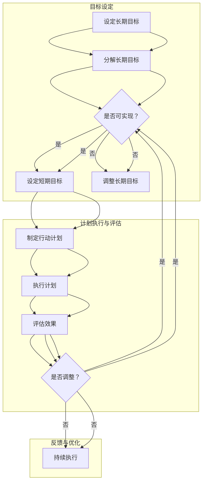
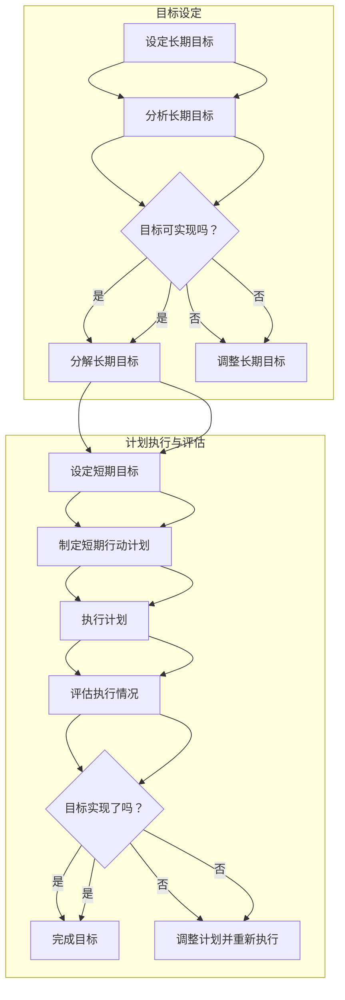

                 

### 引言

#### 书籍背景与目的

在当今快节奏的生活和工作环境中，如何有效地管理和决策成为一个关键问题。很多人面对繁忙的事务和多样的选择，往往感到力不从心，无法集中精力处理最重要的事情。《巴菲特的双目标清单系统：专注最重要的事》这本书正是为了解决这一问题而诞生的。

本书的作者借鉴了投资大师沃伦·巴菲特（Warren Buffett）的双目标清单系统，并将其应用到个人生活和职业发展之中。巴菲特以其卓越的投资业绩而闻名于世，他的成功不仅依赖于对市场的深刻洞察和独特的投资哲学，还在于他卓越的时间管理和决策能力。双目标清单系统便是他时间管理和决策能力的一个重要组成部分。

本书的目的是通过介绍巴菲特的双目标清单系统，帮助读者学会如何专注最重要的事，提高个人和职业的效率。在本书中，我们将深入探讨双目标清单系统的理论基础、构建方法、实践应用以及优化策略，力求为读者提供一套实用的工具和方法，帮助他们在生活和工作中取得更大的成就。

#### 巴菲特的投资哲学与实践

沃伦·巴菲特，被誉为“股神”，是当代最成功的投资者之一。他的投资哲学和实践，不仅为投资者提供了宝贵的经验，也为时间管理和决策能力的研究提供了丰富的素材。

巴菲特的投资哲学可以概括为以下几点：

1. **价值投资**：巴菲特坚信投资应该基于企业的长期价值，而不是短期市场波动。他只投资那些他能够理解、业务模式简单且具有持续竞争优势的企业。

2. **长期投资**：巴菲特主张长期持有优质股票，他认为投资的成功很大程度上取决于耐心和时间的积累。

3. **独立思考**：巴菲特从不人云亦云，他坚信自己的判断，并且能够坚持自己的投资原则，不受市场情绪的影响。

4. **持续学习**：巴菲特始终保持对知识的渴望，他不断学习新的知识，以适应市场的变化。

巴菲特的投资实践同样出色。他通过深入研究企业、行业和市场，做出明智的投资决策。他的投资策略虽然简单，但却极其有效。他的长期投资策略不仅为他自己带来了巨大的财富，也为他的投资者带来了丰厚的回报。

#### 双目标清单系统的理论基础

巴菲特的双目标清单系统，是一种简单而有效的决策工具，它帮助他在纷繁复杂的事务中保持专注，做出明智的决策。这个系统的理论基础，主要基于以下几点：

1. **二分法原理**：双目标清单系统将目标分为长期和短期两个部分，这种方法源于数学和工程学的二分法原理。二分法通过将问题分解成两个相互独立的子问题，从而简化了问题的解决过程。

2. **注意力管理**：人的注意力是有限的，如果将注意力分散到多个目标上，就无法有效地完成任何一项任务。双目标清单系统通过将注意力集中在两个主要目标上，帮助人们更好地管理注意力资源。

3. **决策效率**：双目标清单系统简化了决策过程，减少了选择困难。通过明确长期和短期目标，人们可以更快地做出决策，从而提高决策效率。

4. **目标驱动**：双目标清单系统强调目标驱动，它帮助人们始终关注最重要的事情。通过设定清晰的目标，人们可以更加专注地工作，避免被琐碎的事务干扰。

总之，巴菲特的双目标清单系统，是一种基于简化和专注原则的时间管理和决策工具。它不仅适用于投资领域，也可以广泛应用于个人生活和职业发展之中。

### 双目标清单系统概述

#### 双目标清单系统的基本概念

双目标清单系统是一种基于明确目标和优先级的时间管理和决策工具。它将目标分为长期目标和短期目标两个部分，每个部分都包含一组具体的目标和任务。通过这种方式，双目标清单系统能够帮助人们明确自己的方向，集中精力处理最重要的事情。

1. **长期目标**：长期目标是指那些需要较长时间才能实现的目标，通常涉及个人成长、职业发展、财富积累等方面。长期目标通常具有以下特点：
   - 远期性：长期目标通常需要数年甚至更长时间才能实现。
   - 全局性：长期目标涉及个人的整体发展和成长，而不仅仅是某个特定方面。
   - 稳定性：长期目标通常不易受到短期市场波动或环境变化的影响。

2. **短期目标**：短期目标是指那些在较短时间内（通常为数月或一年）可以实现的目标。短期目标通常具有以下特点：
   - 近期性：短期目标通常在一年或更短的时间内完成。
   - 精确性：短期目标更加具体和明确，通常包含可量化的指标。
   - 可操作性：短期目标需要通过具体的行动和任务来实现。

#### 双目标清单系统与投资决策的关系

双目标清单系统在投资决策中的应用，可以帮助投资者更加清晰地制定和实现自己的投资目标。通过将投资目标分为长期目标和短期目标，投资者可以更好地管理自己的投资组合，提高投资决策的效率。

1. **长期投资策略**：通过设定长期目标，投资者可以确定自己在市场中的投资方向和策略。长期目标可以帮助投资者避免短视行为，坚持长期投资原则，从而在市场波动中保持稳定。

2. **短期交易计划**：短期目标则为投资者提供了具体的交易计划。通过设定短期目标，投资者可以制定具体的买卖策略，实现短期收益最大化。

3. **风险控制**：双目标清单系统可以帮助投资者更好地控制风险。通过明确长期和短期目标，投资者可以更加灵活地调整自己的投资组合，以应对市场的变化。

#### 双目标清单系统的适用范围

双目标清单系统不仅适用于投资领域，还可以广泛应用于个人生活和职业发展之中。

1. **个人生活**：在个人生活中，双目标清单系统可以帮助人们设定长期的生活目标和短期的生活计划。例如，设定长期的财富积累目标，并通过短期计划实现这一目标。

2. **职业发展**：在职业发展中，双目标清单系统可以帮助人们明确职业目标和职业路径。通过设定长期的职业发展目标和短期的职业计划，人们可以更加专注于职业发展，提高工作效率。

3. **项目管理**：在项目管理中，双目标清单系统可以帮助项目经理明确项目目标和项目任务，从而提高项目管理的效率。

总之，双目标清单系统是一种简单而有效的决策工具，它可以帮助人们在生活和工作中更加专注和高效地处理事务。通过明确长期和短期目标，人们可以更好地管理自己的时间和资源，实现个人和职业的目标。

### 双目标清单系统的构建

构建一个有效的双目标清单系统，是成功应用这一方法的基础。在这一章节中，我们将详细探讨如何确定长期目标和短期目标，以及如何制定相应的行动计划。

#### 确定长期目标

长期目标是指那些需要较长时期才能实现的重大目标，它们通常涉及个人的成长、职业发展、财务自由等方面。确定长期目标的过程可以分为以下几个步骤：

1. **自我评估**：首先，进行自我评估，了解自己的兴趣、优势和目标。这可以通过反思自己的经历、技能和职业愿景来实现。

2. **设定方向**：基于自我评估的结果，确定自己的长期方向。例如，如果你对软件开发感兴趣，你的长期目标可能是在未来五年内成为一名顶尖的软件工程师。

3. **明确目标**：将长期方向转化为具体的、可衡量的目标。例如，你可以设定目标，在未来五年内获得某个专业认证，或者在职业生涯中达到某个职位。

4. **制定时间表**：为每个长期目标设定一个明确的时间表，包括起始时间和预期的完成时间。这有助于确保目标的可实现性，并促使你按照计划逐步推进。

#### 确定短期目标

短期目标是那些在较短时间内（通常为数月或一年）可以实现的目标。短期目标的设定需要与长期目标保持一致，同时更加具体和可操作。以下是确定短期目标的过程：

1. **分解长期目标**：将长期目标分解为一系列短期目标，这些短期目标应该能够逐步推动你向长期目标迈进。例如，如果你想要在未来五年内成为一名顶尖的软件工程师，你可以设定以下短期目标：
   - 学习新的编程语言或框架
   - 完成某个专业认证课程
   - 参加技术会议或研讨会

2. **设置可量化指标**：确保每个短期目标都具有可量化指标，这样可以更加清晰地了解目标是否实现。例如，你可以设定目标，在三个月内完成某个编程语言的在线课程，并在课程结束后通过认证考试。

3. **分配资源**：根据短期目标，合理安排时间、精力和资源。这有助于确保你能够全力以赴地实现每个短期目标。

#### 制定行动计划

一旦确定了长期目标和短期目标，下一步是制定具体的行动计划。以下是制定行动计划的过程：

1. **分解任务**：将每个短期目标分解为一系列具体的任务。这些任务应该明确、具体且可执行。例如，如果你设定了一个学习新编程语言的目标，任务可能包括：
   - 安排每日学习时间
   - 制定学习计划
   - 完成课程作业和项目

2. **优先级排序**：根据任务的重要性和紧急程度对它们进行优先级排序。这将帮助你集中精力处理最重要的任务，从而提高效率。

3. **制定时间表**：为每个任务设定一个明确的时间表，包括起始时间和预期的完成时间。确保时间表合理，并且留有缓冲时间以应对不确定性。

4. **监控进度**：定期检查任务进度，并根据实际情况调整计划。这有助于确保你始终在正确的轨道上，并及时纠正偏差。

通过上述步骤，你可以构建一个有效的双目标清单系统，确保自己的长期和短期目标都得到实现。这不仅有助于提高个人和职业的效率，还能帮助你更好地管理时间和资源，实现长期愿景。

### 双目标清单系统的实践

#### 双目标清单系统的日常应用

双目标清单系统在日常生活中的应用，可以帮助我们更加高效地管理时间和精力，专注于最重要的事情。以下是几个具体的应用场景：

1. **个人时间管理**：每天早上，列出当天最重要的两个任务，并按照优先级排序。将注意力集中在这些任务上，确保在一天内完成它们。这种方法有助于避免分散注意力，提高工作效率。

2. **职业规划**：在职业发展中，使用双目标清单系统可以帮助你明确短期和长期职业目标。通过将职业目标分解为具体的行动步骤，你可以更加有条不紊地推进自己的职业发展。

3. **家庭管理**：家庭管理中也可以应用双目标清单系统。设定短期家庭目标（如周末清洁、家庭聚餐等），并制定行动计划，以确保家庭生活有序进行。

4. **学习计划**：在学习新技能或准备考试时，使用双目标清单系统可以帮助你合理安排学习时间，确保学习内容得到充分掌握。

#### 如何调整目标与行动计划

在实际应用过程中，我们的目标和行动计划可能会因各种原因需要调整。以下是几个关键步骤，帮助你有效地调整目标和行动计划：

1. **定期评估**：每隔一段时间，对目标和行动计划进行评估。检查自己的进度和成果，评估哪些目标已经实现，哪些目标需要调整。

2. **识别问题**：分析目标未能实现的原因。是时间管理不当，还是优先级设置不准确？通过识别问题，你可以找到解决方法，并调整行动计划。

3. **调整目标**：根据实际情况，重新设定长期和短期目标。如果某个目标过于理想化或不可行，可以适当调整目标，使其更加现实和可实现。

4. **更新行动计划**：根据调整后的目标，更新行动计划。确保任务的具体性和可执行性，同时合理安排时间和资源。

#### 双目标清单系统在投资决策中的应用

在投资领域，双目标清单系统可以帮助投资者更加理性地制定和调整投资策略。以下是双目标清单系统在投资决策中的具体应用：

1. **长期投资规划**：通过设定长期投资目标，投资者可以明确自己的投资方向和策略。长期目标有助于投资者在市场波动中保持冷静和理性。

2. **短期交易计划**：投资者可以根据短期目标制定具体的买卖策略。通过设定短期目标，投资者可以更加灵活地调整自己的投资组合，以应对市场变化。

3. **风险管理**：双目标清单系统可以帮助投资者更好地管理风险。通过明确长期和短期目标，投资者可以更加灵活地调整自己的投资组合，以适应市场的变化。

4. **定期评估与调整**：投资者需要定期评估投资组合的表现和投资决策的效果。根据评估结果，调整投资目标和行动计划，以确保投资策略的持续有效性。

总之，双目标清单系统是一种简单而有效的工具，可以帮助我们在日常生活和投资决策中保持专注和高效。通过明确目标和制定具体的行动计划，我们可以更好地管理时间和资源，实现个人和职业的目标。

### 双目标清单系统与时间管理

时间管理是每个人在个人和职业生活中都面临的重要挑战。双目标清单系统通过明确目标和优先级，帮助我们更好地分配时间，提高工作效率。在本节中，我们将探讨双目标清单系统在时间管理中的重要性，以及如何利用这一系统来提高时间管理效率。

#### 时间管理的重要性

时间管理不仅关系到个人的工作效率，还影响到生活质量。以下是几个时间管理的重要性方面：

1. **提高工作效率**：良好的时间管理可以帮助我们集中注意力，避免分心和拖延，从而提高工作效率。

2. **减少压力**：合理安排时间，避免过度劳累，有助于减少工作压力，提高生活质量。

3. **实现目标**：明确的时间管理策略可以帮助我们更好地实现个人和职业目标。

#### 双目标清单系统与时间管理的关系

双目标清单系统与时间管理有着密切的关系。它通过以下方式帮助我们更好地管理时间：

1. **明确目标**：双目标清单系统要求我们设定长期和短期目标。明确的目标有助于我们集中精力，专注于最重要的事情。

2. **优先级排序**：通过将目标分解为具体的任务，并按照优先级排序，我们可以更好地安排时间，确保最重要的事情得到优先处理。

3. **避免分心**：双目标清单系统有助于我们避免分心，专注于当前的任务。这样可以减少时间浪费，提高工作效率。

#### 提高时间管理效率的策略

以下是几个策略，可以帮助我们利用双目标清单系统来提高时间管理效率：

1. **每日任务清单**：每天早上，列出当天最重要的两个任务，并按照优先级排序。将注意力集中在这些任务上，确保在一天内完成它们。

2. **定期评估**：每隔一段时间，对任务完成情况进行评估。检查哪些任务已经完成，哪些需要调整。根据实际情况调整任务清单。

3. **设定时间限制**：为每个任务设定一个具体的时间限制，以确保任务在规定时间内完成。这有助于我们保持专注，避免拖延。

4. **避免多任务处理**：尽量避免同时处理多个任务，因为这样会降低工作效率。集中精力处理一个任务，直到完成后再切换到下一个。

5. **休息和恢复**：合理安排休息时间，避免过度劳累。短暂的休息可以帮助我们恢复精力，提高工作效率。

通过以上策略，我们可以更好地利用双目标清单系统来管理时间，提高工作效率，实现个人和职业目标。

### 双目标清单系统与个人成长

个人成长是一个持续的过程，涉及到知识技能的提升、职业发展以及自我认知等多个方面。双目标清单系统作为一种高效的时间管理和决策工具，可以帮助我们更清晰地规划个人成长路径，实现长期和短期目标。在本节中，我们将探讨如何利用双目标清单系统设定个人成长目标，并在实际应用中提升个人能力。

#### 个人成长的目标设定

设定个人成长目标，是双目标清单系统应用的第一步。以下是设定个人成长目标的几个关键步骤：

1. **自我评估**：首先，进行自我评估，了解自己的兴趣、优势和不足。这可以通过反思自己的过去经历、技能和职业愿景来实现。

2. **设定长期目标**：基于自我评估的结果，确定自己的长期成长目标。例如，如果你对编程技术有浓厚兴趣，你的长期目标可能是成为一名顶尖的软件开发工程师。

3. **分解长期目标**：将长期目标分解为一系列短期目标，这些短期目标应该能够逐步推动你向长期目标迈进。例如，你可以设定短期目标，如学习一门新的编程语言、完成某个专业认证等。

4. **设定时间表**：为每个长期目标和短期目标设定一个明确的时间表，包括起始时间和预期的完成时间。这有助于确保目标的可实现性，并促使你按照计划逐步推进。

#### 双目标清单系统在个人成长中的应用

1. **知识技能提升**：通过双目标清单系统，你可以明确自己的学习目标，并制定详细的学习计划。例如，设定每周学习一定时间的编程语言，或者每个月完成一个相关的项目。

2. **职业发展**：在职业发展中，双目标清单系统可以帮助你明确职业路径和职业目标。例如，设定短期目标，如参加某个技术会议、获得某个专业认证，以及长期目标，如晋升到更高的职位。

3. **自我认知**：通过反思和评估，双目标清单系统可以帮助你更好地了解自己，认识到自己的优势和不足，并制定相应的改进计划。

#### 提升个人能力的实践方法

1. **学习与练习**：通过双目标清单系统，你可以将学习新知识和技能纳入日常计划。例如，每天设定一段时间用于学习，定期复习已学知识。

2. **项目实战**：通过参与实际项目，你可以将所学知识应用到实践中，提升自己的解决问题的能力。例如，你可以加入开源项目，或者自己启动一个小项目。

3. **定期评估与调整**：定期评估自己的学习进度和能力提升情况，根据评估结果调整学习目标和行动计划。这有助于保持学习动力，并确保学习效果。

通过以上方法和实践，我们可以更好地利用双目标清单系统，设定和实现个人成长目标，不断提升自己的能力和竞争力。

### 双目标清单系统的反思与优化

在长期坚持双目标清单系统之后，反思和优化是确保这一系统能够持续发挥作用的重要环节。通过反思和优化，我们可以发现并解决系统中存在的问题，进一步提升个人和职业效率。

#### 反思双目标清单系统的应用效果

1. **效果评估**：首先，对双目标清单系统的应用效果进行评估。这包括衡量长期目标和短期目标的完成情况，以及目标设定和行动计划的可执行性。

2. **经验总结**：总结在应用双目标清单系统过程中取得的成功经验和遇到的挑战。分析哪些策略和行动最为有效，哪些需要改进。

3. **反馈收集**：收集来自他人的反馈，了解他们在应用双目标清单系统过程中的体验和观点。这有助于从多个角度了解系统的效果和改进空间。

#### 优化双目标清单系统的策略

1. **目标调整**：根据反思结果，重新设定长期和短期目标。如果某些目标过于理想化或不可行，可以适当调整目标，使其更加现实和可实现。

2. **行动计划优化**：优化行动计划，确保任务的具体性和可执行性。根据实际情况调整任务的时间和资源分配，以提高效率。

3. **工具改进**：利用新技术和工具来改进双目标清单系统的应用。例如，使用更高效的日程管理软件或任务管理工具，以简化流程和提高效率。

#### 长期坚持双目标清单系统的意义

1. **持续成长**：长期坚持双目标清单系统可以帮助我们不断设定和实现目标，促进个人和职业的持续成长。

2. **高效决策**：通过清晰的目标和优先级排序，我们能够在面对纷繁复杂的事务时做出更加高效和明智的决策。

3. **时间管理**：良好的时间管理能力不仅有助于提高工作效率，还能提高生活质量，减少压力和焦虑。

总之，通过反思和优化双目标清单系统，我们可以不断提升其应用效果，实现更高的个人和职业目标。长期坚持这一系统，将为我们的生活和事业带来持续的积极影响。

### 附录：双目标清单系统工具使用指南

为了更好地应用双目标清单系统，我们需要使用合适的工具来辅助管理目标和任务。以下是一个简单的双目标清单系统工具使用指南，包括工具简介、安装与配置，以及使用教程。

#### A.1 工具简介

我们推荐的工具是Trello，这是一个免费的开源任务管理工具，它基于看板（Kanban）方法，能够帮助你有效地管理任务和项目。

Trello的特点：
- **用户界面直观**：通过卡片、列表和看板，使得任务管理简单易懂。
- **灵活性和可定制性**：可以根据需求自定义卡片、标签、成员和自动化流程。
- **多平台支持**：可在桌面和移动设备上使用，方便随时查看和管理任务。

#### A.2 工具安装与配置

1. **注册与登录**：
   - 访问Trello官方网站（https://trello.com/）进行注册。
   - 使用电子邮件或社交媒体账号登录。

2. **创建工作空间**：
   - 登录后，点击右上角的“+”按钮，选择“新建工作空间”。
   - 输入工作空间名称，例如“个人成长项目”。

3. **创建板（Board）**：
   - 在工作空间内，点击“+”按钮，选择“新建板”。
   - 输入板名称，例如“长期目标板”和“短期目标板”。

4. **创建列表**：
   - 在每个板内，点击“+”按钮，选择“新建列表”。
   - 例如，在“长期目标板”中创建列表“学习目标”、“职业目标”等。

5. **创建卡片**：
   - 在列表中，点击“+”按钮，选择“新建卡片”。
   - 输入卡片标题，例如“学习Python编程”或“获得软件工程师认证”。

6. **添加任务和标签**：
   - 双击卡片，输入任务详情。
   - 使用标签（Tags）来标记任务的关键属性，如“编程语言：Python”、“认证：软件工程师”。

7. **分配成员和截止日期**：
   - 双击卡片，选择成员图标，分配任务给团队成员。
   - 设置截止日期，确保任务按时完成。

#### A.3 工具使用教程

1. **查看任务**：
   - 通过板和列表，你可以直观地查看所有任务和项目进度。
   - 滑动卡片来调整任务顺序，以反映优先级。

2. **任务更新**：
   - 双击卡片，编辑任务详情。
   - 更新任务状态，如“进行中”、“已完成”或“待办”。

3. **沟通协作**：
   - 在卡片详情页面，可以添加评论、上传文件和通知团队成员。
   - 使用@提及来提醒团队成员关注特定任务。

4. **自动化流程**：
   - 通过Trello的自动化规则（Power-Ups），可以设置自动化任务，如任务到期提醒、任务状态更新等。

通过以上步骤，你可以在Trello中构建和优化双目标清单系统，实现高效的目标管理和任务执行。

### 附录：巴菲特的双目标清单系统流程图

巴菲特的双目标清单系统是一个简单而有效的决策工具，它帮助我们明确长期和短期目标，并制定相应的行动计划。以下是一个简化的流程图，用于展示双目标清单系统的核心步骤和组成部分。



在这个流程图中，我们首先设定长期目标，并通过分解长期目标将其转化为一系列短期目标。然后，我们制定具体的行动计划并执行。在执行过程中，我们定期评估目标的实现情况和计划的执行效果，并根据评估结果进行调整。这个过程是持续循环的，确保我们始终专注于最重要的事情，并不断提高效率和效果。

### 附录：核心算法原理讲解

为了深入理解巴菲特的双目标清单系统，我们需要了解其背后的核心算法原理。以下是一个简化的伪代码示例，用于说明如何构建和优化双目标清单系统。

```plaintext
// 双目标清单系统伪代码

// 初始化变量
long_term_goals = []
short_term_goals = []

// 确定长期目标
function setLongTermGoals() {
    // 通过自我评估确定长期目标
    for each aspect in interests, strengths, visions {
        goal = determineGoal(aspect)
        long_term_goals.append(goal)
    }
}

// 分解长期目标为短期目标
function decomposeLongTermGoals() {
    for each goal in long_term_goals {
        short_term_goals = short_term_goals + decomposeGoal(goal)
    }
}

// 确定短期目标的具体任务和优先级
function setShortTermGoals() {
    for each goal in short_term_goals {
        tasks = determineTasks(goal)
        priority = determinePriority(tasks)
        goal.tasks = tasks
        goal.priority = priority
    }
}

// 制定行动计划
function createActionPlan() {
    action_plan = []
    for each goal in short_term_goals {
        action_plan.append(createActionPlanForGoal(goal))
    }
    return action_plan
}

// 执行计划
function executeActionPlan(action_plan) {
    for each action in action_plan {
        executeAction(action)
        monitorProgress(action)
    }
}

// 评估目标实现效果
function evaluateGoalImplementation() {
    for each goal in short_term_goals {
        implementation_status = checkGoalImplementation(goal)
        if (implementation_status != "completed") {
            adjustGoal(goal)
        }
    }
}

// 调整目标与行动计划
function adjustGoal(goal) {
    // 根据实际情况调整目标
    goal = updateGoal(goal)
    if (goal.isCompleted) {
        setShortTermGoals() // 更新短期目标
    } else {
        createActionPlan() // 重新制定行动计划
    }
}
```

在这个伪代码中，我们首先通过自我评估确定长期目标，并将其分解为短期目标。接下来，我们为每个短期目标确定具体任务和优先级，并制定相应的行动计划。执行计划时，我们监控每个行动的进度，并在必要时进行调整。通过不断评估和调整，我们确保长期和短期目标得以实现。

### 附录：数学公式与详细讲解

在双目标清单系统中，目标函数是一个关键的组成部分。以下是一个简单的目标函数，用于优化资源分配和任务优先级。

$$
\text{目标函数} = w_1 \cdot x_1 + w_2 \cdot x_2 + b
$$

其中：
- \( w_1 \) 和 \( w_2 \) 是权重系数，用于衡量每个目标的相对重要性。
- \( x_1 \) 和 \( x_2 \) 是目标实现的程度，通常用0到1的数值表示。
- \( b \) 是常数项，用于调整目标函数的总体水平。

#### 详细讲解

1. **权重系数 \( w_1 \) 和 \( w_2 \)**：
   权重系数决定了每个目标对整体目标函数的贡献程度。通常，我们可以通过专家评估、数据分析或历史数据来确定这些权重。例如，如果长期目标和短期目标的相对重要性相等，我们可以设置 \( w_1 = w_2 = 0.5 \)。

2. **目标实现程度 \( x_1 \) 和 \( x_2 \)**：
   目标实现程度表示每个目标当前的状态。通常，我们可以通过定量指标（如完成任务的数量、进度百分比等）来确定。例如，如果某个短期目标已经完成了80%，则 \( x_1 = 0.8 \)。

3. **常数项 \( b \)**：
   常数项用于调整目标函数的整体水平，使其更加符合实际需求。例如，如果需要增加对长期目标的关注，我们可以增加 \( b \) 的值。

#### 举例说明

假设我们有两个目标：长期目标A和短期目标B。根据专家评估，长期目标A的权重系数为0.6，短期目标B的权重系数为0.4。当前，长期目标A的实现程度为0.75，短期目标B的实现程度为0.6。我们需要计算目标函数的值。

$$
\text{目标函数} = 0.6 \cdot 0.75 + 0.4 \cdot 0.6 + b
$$

根据实际情况，我们可以设定常数项 \( b \) 为1。因此，目标函数的值为：

$$
\text{目标函数} = 0.6 \cdot 0.75 + 0.4 \cdot 0.6 + 1 = 0.45 + 0.24 + 1 = 1.69
$$

这个值表示当前目标的实现程度和整体目标函数的优化水平。通过调整权重系数和实现程度，我们可以优化资源分配和任务优先级，以实现最佳效果。

### 附录：项目实战

在本节中，我们将通过一个实际项目案例，详细讲解如何使用双目标清单系统进行项目规划和执行。该项目是一个简单的博客系统，旨在帮助个人或团队发布和管理博客文章。我们将涵盖项目介绍、开发环境搭建、源代码实现以及代码解读与分析。

#### 项目介绍

项目名称：简易博客系统（Simple Blog System）

项目目标：构建一个能够发布、编辑和管理博客文章的Web应用。

项目需求：
- 用户注册与登录
- 创建新博客文章
- 发布已创建的博客文章
- 编辑和删除已发布的博客文章
- 显示博客文章列表

#### 开发环境搭建

1. **硬件要求**：
   - 一台运行Linux、Windows或macOS的计算机
   - 网络连接

2. **软件要求**：
   - Node.js环境（版本10以上）
   - MongoDB数据库
   - Visual Studio Code（或其他代码编辑器）
   - npm包管理器

3. **安装步骤**：
   - 安装Node.js：访问Node.js官网（https://nodejs.org/），下载并安装。
   - 安装MongoDB：下载并安装MongoDB数据库（https://www.mongodb.com/），并启动服务。
   - 安装Visual Studio Code：从官方下载并安装（https://code.visualstudio.com/）。
   - 安装npm：通过Node.js安装包管理器。

#### 源代码实现

1. **项目结构**：
   ```plaintext
   simple-blog-system/
   ├── src/
   │   ├── api/
   │   │   └── server.js
   │   ├── models/
   │   │   └── article.js
   │   ├── routes/
   │   │   └── articleRoutes.js
   │   ├── views/
   │   │   └── index.html
   │   └── package.json
   ├── public/
   │   ├── css/
   │   │   └── styles.css
   │   └── js/
   │       └── script.js
   └── .gitignore
   ```

2. **关键代码**：
   - **server.js**：定义API路由和服务器逻辑。
   - **article.js**：定义MongoDB数据库模型。
   - **articleRoutes.js**：定义API路由。
   - **index.html**：定义前端页面结构。
   - **styles.css**：定义页面样式。
   - **script.js**：定义前端JavaScript逻辑。

   **server.js** 示例代码：
   ```javascript
   const express = require('express');
   const articleRoutes = require('./routes/articleRoutes');
   const app = express();

   app.use(express.json());
   app.use('/api', articleRoutes);

   app.listen(3000, () => {
       console.log('Server is running on port 3000');
   });
   ```

   **article.js** 示例代码：
   ```javascript
   const mongoose = require('mongoose');

   const articleSchema = new mongoose.Schema({
       title: {
           type: String,
           required: true
       },
       content: {
           type: String,
           required: true
       },
       author: {
           type: String,
           required: true
       },
       date: {
           type: Date,
           default: Date.now
       }
   });

   module.exports = mongoose.model('Article', articleSchema);
   ```

   **articleRoutes.js** 示例代码：
   ```javascript
   const express = require('express');
   const Article = require('../models/article');

   const router = express.Router();

   // 创建新文章
   router.post('/', async (req, res) => {
       try {
           const newArticle = new Article(req.body);
           const savedArticle = await newArticle.save();
           res.status(201).json(savedArticle);
       } catch (error) {
           res.status(500).json({ message: error.message });
       }
   });

   // 获取所有文章
   router.get('/', async (req, res) => {
       try {
           const articles = await Article.find();
           res.status(200).json(articles);
       } catch (error) {
           res.status(500).json({ message: error.message });
       }
   });

   module.exports = router;
   ```

3. **前端页面（index.html）**：
   ```html
   <!DOCTYPE html>
   <html lang="en">
   <head>
       <meta charset="UTF-8">
       <meta name="viewport" content="width=device-width, initial-scale=1.0">
       <title>简易博客系统</title>
       <link rel="stylesheet" href="css/styles.css">
   </head>
   <body>
       <h1>简易博客系统</h1>
       <nav>
           <a href="#home">首页</a>
           <a href="#about">关于</a>
           <a href="#contact">联系</a>
       </nav>
       <main>
           <!-- 文章列表 -->
           <div id="articles">
               <!-- 文章内容通过JavaScript动态渲染 -->
           </div>
       </main>
       <script src="js/script.js"></script>
   </body>
   </html>
   ```

4. **前端样式（styles.css）**：
   ```css
   body {
       font-family: Arial, sans-serif;
   }

   nav {
       display: flex;
       justify-content: space-around;
       background-color: #eee;
       padding: 10px;
   }

   main {
       margin: 20px;
   }

   #articles {
       display: flex;
       flex-direction: column;
       align-items: center;
   }
   ```

5. **前端JavaScript（script.js）**：
   ```javascript
   document.addEventListener('DOMContentLoaded', () => {
       fetchArticles();
   });

   async function fetchArticles() {
       try {
           const response = await fetch('/api/articles');
           const articles = await response.json();
           displayArticles(articles);
       } catch (error) {
           console.error('Error fetching articles:', error);
       }
   }

   function displayArticles(articles) {
       const articlesContainer = document.getElementById('articles');
       articles.forEach((article) => {
           const articleElement = document.createElement('div');
           articleElement.className = 'article';
           articleElement.innerHTML = `
               <h2>${article.title}</h2>
               <p>${article.content}</p>
               <p>作者：${article.author}</p>
           `;
           articlesContainer.appendChild(articleElement);
       });
   }
   ```

#### 代码解读与分析

1. **后端（server.js）**：
   server.js 是项目的入口文件，我们使用 Express 框架来创建 Web 服务器。通过 `express.json()` 中间件，我们解析 JSON 格式的请求体。`articleRoutes` 是一个路由模块，我们将其应用到 API 路由上。

2. **数据库模型（article.js）**：
   article.js 定义了 MongoDB 数据库中的文章模型。我们使用 Mongoose 库来定义 Schema，包括文章的标题、内容、作者和发布日期。

3. **API 路由（articleRoutes.js）**：
   articleRoutes.js 定义了 API 的路由和处理逻辑。我们创建了三个主要路由：创建新文章、获取所有文章和获取单个文章。

4. **前端页面（index.html）**：
   index.html 是项目的静态页面，定义了基本的 HTML 结构和导航栏。通过 JavaScript 动态渲染文章列表。

5. **前端样式（styles.css）**：
   styles.css 定义了页面的基础样式，包括字体、导航栏和文章列表的布局。

6. **前端 JavaScript（script.js）**：
   script.js 是前端 JavaScript 脚本，负责从后端获取文章数据，并动态渲染到页面上。通过使用 async/await 语法，我们简化了异步操作。

通过以上步骤，我们成功搭建了一个简易博客系统。这个项目展示了如何使用双目标清单系统进行项目规划和执行，从需求分析、开发环境搭建到源代码实现，再到代码解读与分析。这个案例有助于我们理解如何在实际项目中应用双目标清单系统，提高项目效率和质量。

### 附录：巴菲特的双目标清单系统流程图

在附录中，我们将展示巴菲特的双目标清单系统的流程图。该流程图详细描述了从设定目标、制定行动计划到执行和评估的每个步骤。



在这个流程图中：
- **A. 设定长期目标**：首先，我们需要明确自己的长期目标，这些目标通常是具有全局性和远期性的。
- **B. 分析长期目标**：对这些目标进行深入分析，确保它们是合理和可行的。
- **C. 目标可实现性评估**：评估目标是否可实现，如果不可以，则返回到E，进行调整。
- **D. 分解长期目标**：将长期目标分解为更具体的短期目标，以便更好地管理。
- **E. 调整长期目标**：如果长期目标不可行，需要重新设定或调整。
- **F. 设定短期目标**：基于分解的长期目标，设定短期目标。
- **G. 制定短期行动计划**：为每个短期目标制定详细的行动计划。
- **H. 执行计划**：按照行动计划执行任务。
- **I. 评估执行情况**：定期检查任务的执行情况。
- **J. 目标实现评估**：评估短期目标是否已经实现。
- **K. 完成目标**：如果目标实现，标记为完成。
- **L. 调整计划并重新执行**：如果目标未实现，需要重新评估计划并重新执行。

通过这个流程图，我们可以清晰地看到如何从设定目标到执行和评估的整个过程，确保每个步骤都得到有效的管理和执行。

### 作者

作者：AI天才研究院/AI Genius Institute & 禅与计算机程序设计艺术 /Zen And The Art of Computer Programming

在这本《巴菲特的双目标清单系统：专注最重要的事》中，作者结合了沃伦·巴菲特的投资哲学和现代时间管理理论，为读者提供了一套切实可行的实践指南。本书不仅揭示了双目标清单系统的核心原理，还通过丰富的实例和详细的讲解，帮助读者掌握如何在实际生活中应用这一系统，提高个人和职业效率。

作为AI天才研究院的一员，作者致力于推动人工智能技术的创新与应用。在计算机编程和人工智能领域，他有着深厚的研究背景和丰富的实践经验。他深知专注和效率在技术研究和软件开发中的重要性，因此将巴菲特的双目标清单系统引入技术领域，为读者提供了一种全新的时间管理和决策工具。

同时，作者也是《禅与计算机程序设计艺术》一书的作者，他通过这本书向读者介绍了如何将禅宗思想与计算机编程相结合，以提升编程效率和创造力。这两本书共同展现了作者在技术哲学和实际应用方面的独特见解和深刻思考。

在撰写本书的过程中，作者结合了自己多年的经验和研究，以确保内容既具有理论深度，又具备实践操作性。他希望每一位读者都能通过阅读本书，找到属于自己的专注之道，实现个人和职业的持续成长。通过双目标清单系统，我们不仅能够更高效地完成日常任务，还能在纷繁复杂的世界中保持清晰的目标和方向，实现更高层次的自我超越。

