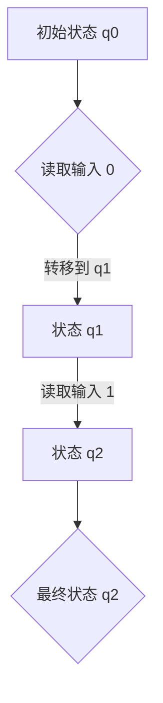
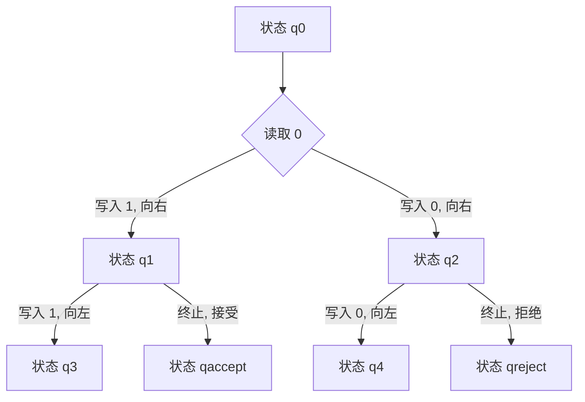
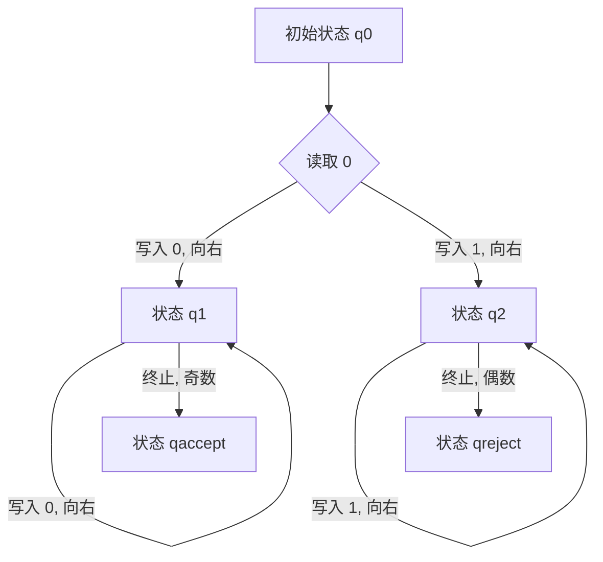
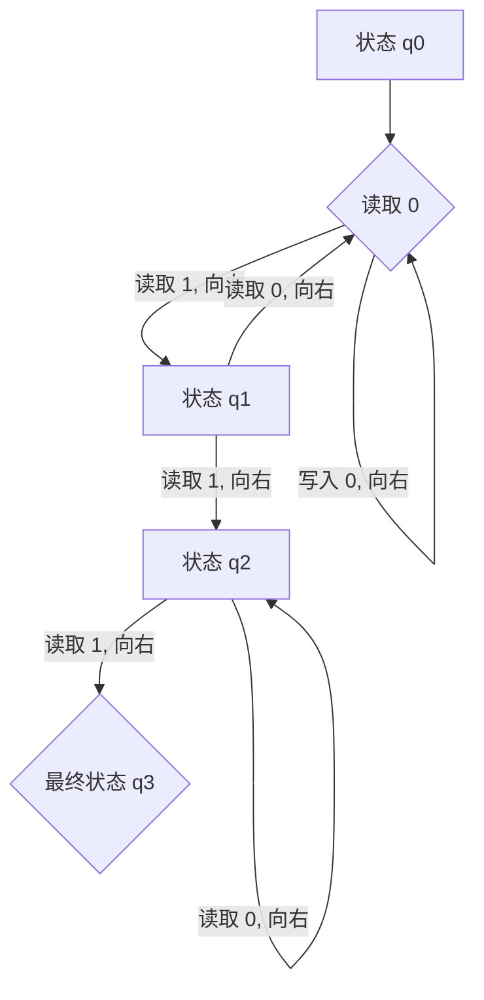

                 

# 《1956年出版的《自动机研究》》

## 关键词：
自动机理论，计算模型，图灵机，有限自动机，人工智能，计算复杂性，归约方法

## 摘要：

本文是对1956年出版的《自动机研究》的深入分析。作为计算机科学的奠基性著作，该书详细探讨了自动机的概念、分类及其在计算理论中的应用。《自动机研究》不仅介绍了自动机的理论框架，还包括了对图灵机、递归可枚举性、计算复杂性以及归约方法的研究。通过本文的逐步分析，我们将理解自动机理论的核心概念，探讨其与人工智能的关联，并展望自动机研究的前沿与趋势。

### 目录大纲

# 《1956年出版的《自动机研究》》

## 第1章: 引言与概述

### 1.1 《自动机研究》的背景

### 1.2 自动机研究的定义与重要性

### 1.3 书籍的主要目的与结构

## 第2章: 自动机的概念与分类

### 2.1 自动机的定义与基本性质

### 2.2 基本自动机的分类

### 2.3 非确定性与确定性自动机的区别

## 第3章: 有限自动机

### 3.1 有限自动机的基本结构

### 3.2 有限自动机的转换规则

### 3.3 有限自动机的状态分析

## 第4章: 图灵机

### 4.1 图灵机的定义与基本原理

### 4.2 图灵机的计算能力

### 4.3 图灵机的状态转移与操作

## 第5章: 递归可枚举性与计算复杂性

### 5.1 递归可枚举性概念

### 5.2 计算复杂性理论

### 5.3 递归可枚举性与计算复杂性关系

## 第6章: 归约与计算理论

### 6.1 归约的概念

### 6.2 归约在计算理论中的应用

### 6.3 归约方法的分类与特点

## 第7章: 自动机的构造与设计

### 7.1 自动机设计的基本原则

### 7.2 自动机设计的方法与工具

### 7.3 自动机设计的案例研究

## 第8章: 人工智能与自动机

### 8.1 人工智能的基本概念

### 8.2 人工智能中的自动机理论

### 8.3 自动机理论在人工智能中的应用

## 第9章: 自动机研究的前沿与趋势

### 9.1 自动机理论的最新进展

### 9.2 自动机研究在人工智能领域的应用前景

### 9.3 自动机研究面临的挑战与机遇

## 第10章: 结论与展望

### 10.1 《自动机研究》的贡献与影响

### 10.2 自动机研究的未来方向

### 10.3 自动机理论在实践中的应用价值

## 附录

### 附录 A: 自动机理论相关术语与定义

### 附录 B: 常用的自动机设计工具

### 附录 C: 自动机理论经典论文与参考文献

### 附录 D: 自动机理论在人工智能中的应用案例研究

---

在撰写文章正文之前，我们先来分析《自动机研究》的背景、定义与重要性，以及书籍的主要目的与结构。

### 第1章: 引言与概述

#### 1.1 《自动机研究》的背景

《自动机研究》是一本里程碑式的计算机科学著作，由约翰·冯·诺依曼（John von Neumann）和其他几位计算机科学先驱共同撰写。1956年首次出版，这本书是在计算机科学初期，自动机理论逐渐形成之际的重要研究成果。当时的背景是，随着计算机科学的快速发展，人们开始对计算的本质和边界进行深入探讨。自动机理论作为一种抽象的计算模型，为研究计算的本质提供了强有力的工具。

#### 1.2 自动机研究的定义与重要性

自动机理论是研究计算模型及其性质的理论体系。在自动机理论中，自动机是一种抽象的计算实体，它可以接受输入，通过状态转换产生输出。自动机的研究不仅涉及到计算的本质，还与计算机设计、编程语言、算法分析等多个计算机科学领域密切相关。

自动机研究的重要性体现在以下几个方面：

1. **计算模型的抽象**：自动机作为一种抽象的计算模型，可以用来分析和描述各种计算过程，有助于理解计算的本质。
2. **计算机设计的指导**：自动机理论为计算机设计提供了理论基础，有助于开发高效的计算机系统和算法。
3. **算法分析的工具**：自动机理论为算法分析提供了有力的工具，可以帮助研究者评估算法的时间和空间复杂度。
4. **人工智能的基石**：自动机理论在人工智能领域有着广泛的应用，是构建智能系统的重要理论基础。

#### 1.3 书籍的主要目的与结构

《自动机研究》的主要目的是系统地介绍自动机的概念、分类及其应用。全书分为三个主要部分：

1. **基础理论部分**：介绍了自动机的定义、基本性质和分类，包括有限自动机和图灵机等。
2. **计算复杂性理论部分**：探讨了递归可枚举性和计算复杂性理论，分析了计算能力的边界。
3. **应用部分**：讨论了自动机在计算机科学、人工智能等领域的应用，展示了自动机理论的实际价值。

通过以上分析，我们可以看到，《自动机研究》不仅是一部理论性著作，更是计算机科学的基石之一。在接下来的章节中，我们将逐步深入探讨自动机理论的核心概念和其在实际中的应用。  

---

### 第1章: 引言与概述

#### 1.1 《自动机研究》的背景

《自动机研究》是在计算机科学蓬勃发展的背景下诞生的。20世纪中叶，随着第二次世界大战后计算机科学和数学理论的快速进步，人们对计算的本质和机制有了更深入的认识。约翰·冯·诺依曼（John von Neumann）作为计算机科学和数学领域的杰出人物，对计算模型的研究有着深远的影响。他与奥古斯特·图灵（Augusta Ada King, Countess of Lovelace）和克劳德·香农（Claude Shannon）等人共同奠定了现代计算机科学的基础。

1956年，《自动机研究》一书首次出版，标志着自动机理论作为一个独立学科的形成。在这一时期，自动机作为一种抽象的数学模型，被广泛认为是理解和构建计算系统的核心工具。自动机理论的研究不仅涉及计算机科学的根本问题，如计算能力、计算复杂性等，还对人工智能、编程语言设计、算法分析等领域产生了深远影响。

#### 1.2 自动机研究的定义与重要性

自动机（Automata Theory）是计算机科学的一个分支，主要研究抽象的计算模型和其性质。自动机是一种理论上的机器，可以接受输入、执行特定的操作并产生输出。根据自动机的能力和结构，可以分为多种类型，包括有限自动机、图灵机和非确定自动机等。

自动机研究的重要性在于：

1. **理解计算的本质**：自动机理论提供了一种抽象的框架来理解计算的本质。它帮助我们区分什么是可计算的、什么是不计算的，并探讨了计算能力的边界。

2. **计算机科学的基石**：自动机理论为计算机科学提供了基础性的理论工具。无论是计算机设计、编程语言、算法分析，还是人工智能领域，自动机理论都扮演了重要的角色。

3. **算法分析的工具**：自动机模型为算法分析提供了强有力的工具。通过分析自动机的状态转换和计算过程，研究者可以评估算法的时间和空间复杂度，从而指导算法优化。

4. **人工智能的基础**：在人工智能领域，自动机理论提供了构建智能系统的基础。例如，图灵机的概念被用来设计复杂的人工智能算法，如自然语言处理和机器学习算法。

5. **实际应用的价值**：自动机理论不仅在理论研究中有着重要的地位，还在实际应用中有着广泛的应用。例如，在软件工程中，自动机模型被用来验证软件的正确性和可靠性；在通信领域，自动机模型被用来设计和分析通信协议。

#### 1.3 书籍的主要目的与结构

《自动机研究》的主要目的在于系统地介绍自动机理论的基本概念、原理和应用。全书结构分为以下几个部分：

1. **基础理论部分**：这一部分主要介绍自动机的定义、分类及其基本性质。包括有限自动机、非确定自动机和图灵机的详细介绍。

2. **计算复杂性理论部分**：这一部分探讨了计算复杂性的概念，分析了不同类型的自动机的计算能力，并引入了递归可枚举性和计算复杂性的关系。

3. **应用部分**：这一部分讨论了自动机理论在计算机科学和人工智能领域的具体应用。包括自动机模型在软件工程、编程语言设计、算法分析、通信协议设计等领域的应用实例。

通过以上分析，我们可以看出，《自动机研究》不仅是一部理论性的著作，更是一部具有广泛实践价值的书籍。它为计算机科学和人工智能的研究提供了坚实的理论基础，并在实际应用中发挥着重要作用。

---

### 第2章: 自动机的概念与分类

#### 2.1 自动机的定义与基本性质

自动机是一种理论上的计算模型，它可以接受输入，通过一系列状态转换产生输出。自动机的基本定义如下：

**定义**：自动机是一个五元组 \(A = (Q, \Sigma, \delta, q_0, F)\)，其中：
- \(Q\) 是有限的状态集合。
- \(\Sigma\) 是输入字母表，也是一个有限集合。
- \(\delta: Q \times \Sigma \rightarrow Q\) 是状态转换函数。
- \(q_0 \in Q\) 是初始状态。
- \(F \subseteq Q\) 是最终状态集合。

自动机的工作原理可以概括为以下步骤：

1. **初始化**：自动机从初始状态 \(q_0\) 开始。
2. **输入处理**：自动机读取输入字母，并根据当前状态和输入字母，通过状态转换函数 \(\delta\) 更新状态。
3. **状态转换**：自动机根据转换函数在状态空间中移动，直到读取完所有输入。
4. **输出产生**：如果最终状态集合 \(F\) 包含了当前状态，那么输入被接受，否则被拒绝。

自动机的基本性质包括：

- **确定性**：每个状态和输入字母对应唯一的状态转换。
- **非确定性**：每个状态和输入字母可能对应多个状态转换。
- **有限性**：自动机的状态集合和输入字母表都是有限的。

#### 2.2 基本自动机的分类

根据自动机的能力和结构，可以将自动机分为多种类型。以下是几种基本的自动机分类：

1. **有限自动机（Finite Automaton）**：
   - **定义**：有限自动机是一种最简单的自动机，其状态转换函数是确定的。
   - **特性**：有限自动机只能识别有限的模式，例如正则语言。
   - **例子**：有限自动机可以用来设计简单的文本处理器，如拼写检查器。

2. **非确定有限自动机（Nondeterministic Finite Automaton, NFA）**：
   - **定义**：非确定有限自动机允许在某一状态下对于每个输入字母有多个可能的转换。
   - **特性**：NFA的灵活性使其能够识别更复杂的一些语言，如正则表达式可以表示的语言。
   - **例子**：搜索引擎中的关键词匹配算法可以采用NFA。

3. **图灵机（Turing Machine）**：
   - **定义**：图灵机是一种更强大的计算模型，它可以模拟任何可计算的过程。
   - **特性**：图灵机具有读写无限长纸带的能力，这使得它可以处理任意复杂度的语言。
   - **例子**：图灵机在理论计算机科学中被广泛用作研究计算能力和计算复杂性的工具。

4. **线性边界自动机（Linear Bounded Automaton, LBA）**：
   - **定义**：线性边界自动机是一种受限的图灵机，其纸带上的空白区域受到线性限制。
   - **特性**：LBA的受限特性使其在计算能力上介于有限自动机和图灵机之间。
   - **例子**：LBA被用来研究许多复杂问题的计算复杂性。

#### 2.3 非确定性与确定性自动机的区别

非确定性自动机和确定性自动机在计算过程中存在本质的区别：

1. **转换规则**：
   - **确定性自动机**：对于给定的状态和输入字母，确定性自动机只能执行一个特定的状态转换。
   - **非确定性自动机**：对于给定的状态和输入字母，非确定性自动机可以有多个可能的转换路径。

2. **计算能力**：
   - **确定性自动机**：只能处理正则语言，即可以通过有限状态转换描述的语言。
   - **非确定性自动机**：可以处理更广泛的非正则语言，包括那些需要非确定性行为才能识别的语言。

3. **效率与灵活性**：
   - **确定性自动机**：由于其状态转换规则固定，确定性自动机的计算效率通常较高，但灵活性较差。
   - **非确定性自动机**：非确定性自动机具有较高的灵活性，可以处理更复杂的问题，但可能需要更多的计算资源。

通过以上分析，我们可以看到，自动机作为计算模型，其不同的类型和特性反映了计算能力的不同层次。理解自动机的概念和分类，对于计算机科学的研究和实践具有重要意义。在接下来的章节中，我们将进一步探讨有限自动机和图灵机的具体结构和计算过程。

---

### 第3章: 有限自动机

#### 3.1 有限自动机的基本结构

有限自动机（Finite Automaton，简称FA）是最基本的计算模型之一，其结构相对简单，但功能强大。一个有限自动机由五个基本元素组成：状态集合、输入字母表、状态转换函数、初始状态和最终状态集合。

**状态集合 \(Q\)**：有限自动机拥有有限个状态，这些状态通常用 \(q_0, q_1, q_2, \ldots, q_n\) 表示。每个状态表示自动机在某一时刻所处的位置。

**输入字母表 \(\Sigma\)**：输入字母表是有限集合，包含所有可能的输入符号。常见的输入字母表包括 {0, 1} 或 {a, b} 等。

**状态转换函数 \(\delta: Q \times \Sigma \rightarrow Q\)**：状态转换函数描述了自动机在给定状态下读取输入符号后可能移动到的下一个状态。具体而言，\(\delta(q_i, \sigma) = q_j\) 表示当自动机处于状态 \(q_i\) 并读取输入符号 \(\sigma\) 时，它会转移到状态 \(q_j\)。

**初始状态 \(q_0\)**：初始状态是自动机开始计算的起点，通常表示为 \(q_0\)。

**最终状态集合 \(F \subseteq Q\)**：最终状态集合包含那些自动机在读取完整输入后可能终止的状态。如果自动机在最终状态集合中，则输入被接受；否则，输入被拒绝。

一个简单的有限自动机结构可以用Mermaid流程图表示如下：



#### 3.2 有限自动机的转换规则

有限自动机的转换规则定义了自动机如何根据当前状态和输入符号进行状态转换。转换规则可以用状态转换函数 \(\delta\) 来描述，即 \(\delta: Q \times \Sigma \rightarrow Q\)。

**确定性有限自动机（Deterministic Finite Automaton，DFA）**：
- 在DFA中，对于任意状态 \(q_i\) 和输入符号 \(\sigma\)，状态转换函数 \(\delta(q_i, \sigma)\) 总是唯一确定的。
- 例如，如果自动机当前处于状态 \(q_1\)，读取输入符号 0，那么它会转移到状态 \(q_2\)，即 \(\delta(q_1, 0) = q_2\)。

**非确定性有限自动机（Nondeterministic Finite Automaton，NFA）**：
- 在NFA中，对于任意状态 \(q_i\) 和输入符号 \(\sigma\)，状态转换函数 \(\delta(q_i, \sigma)\) 可以有多个可能的转移状态。
- 例如，如果自动机当前处于状态 \(q_1\)，读取输入符号 0，它可以选择转移到状态 \(q_2\) 或 \(q_3\)，即 \(\delta(q_1, 0) = \{q_2, q_3\}\)。

**转换规则示例**：

对于DFA，状态转换函数可以用以下伪代码表示：

```pseudo
function delta(state, input):
    if state == q0 and input == 0:
        return q1
    if state == q1 and input == 1:
        return q2
    if state == q2 and input == 0:
        return q0
```

对于NFA，状态转换函数可以用以下伪代码表示：

```pseudo
function delta(state, input):
    if state == q0 and input == ε:
        return {q1, q2}
    if state == q1 and input == 0:
        return {q2}
    if state == q2 and input == 1:
        return {q0}
```

这里，ε表示空字符，表示自动机可以不读取任何输入符号进行状态转换。

#### 3.3 有限自动机的状态分析

有限自动机的状态分析是理解和设计自动机的重要步骤。状态分析包括以下几个关键方面：

1. **状态判定**：
   - 确定自动机在某一状态下是否能够接受输入。
   - 对于DFA，可以通过检查当前状态是否属于最终状态集合 \(F\) 来判定。
   - 对于NFA，可以通过存在一个路径从当前状态到最终状态集合 \(F\) 来判定。

2. **状态转换路径**：
   - 确定自动机从初始状态到最终状态的转换路径。
   - 对于DFA，每一步转换都是唯一的，路径较为简单。
   - 对于NFA，由于存在多个可能的转换路径，路径分析更为复杂。

3. **状态覆盖与最小化**：
   - 状态覆盖是指寻找最少的必要状态集合，使得自动机能够在这些状态下识别相同的语言。
   - 状态最小化是指将具有相同转换功能的冗余状态合并，以简化自动机的设计。

**状态判定示例**：

假设有一个DFA，其状态集合为 \(Q = \{q0, q1, q2\}\)，输入字母表为 \(\Sigma = \{0, 1\}\)，状态转换函数如下：

```pseudo
delta(q0, 0) = q1
delta(q0, 1) = q2
delta(q1, 0) = q1
delta(q1, 1) = q2
delta(q2, 0) = q0
delta(q2, 1) = q0
```

初始状态 \(q_0\)，最终状态集合 \(F = \{q2\}\)。

- 当输入字符串为 "00" 时，状态转换路径为 \(q0 \rightarrow q1 \rightarrow q1 \rightarrow q2\)，输入被接受。
- 当输入字符串为 "01" 时，状态转换路径为 \(q0 \rightarrow q1 \rightarrow q2 \rightarrow q0\)，输入被拒绝。

通过状态分析，我们可以更好地理解和优化有限自动机的性能。在接下来的章节中，我们将进一步探讨图灵机的概念和特性，以及自动机理论在计算复杂性和人工智能中的应用。

---

### 第4章: 图灵机

#### 4.1 图灵机的定义与基本原理

图灵机（Turing Machine，简称TM）是由艾伦·图灵（Alan Turing）在20世纪30年代提出的一种抽象计算模型。图灵机不仅是对计算机工作原理的一种模拟，也是现代计算机科学的理论基石之一。其基本原理可以概括为以下几点：

**定义**：图灵机是一个七元组 \(M = (Q, \Gamma, \delta, q_0, B, F, q_{accept}, q_{reject})\)，其中：
- \(Q\) 是有限的状态集合。
- \(\Gamma\) 是有限的符号集合，包含输入符号、空白符号和读写头可以写的其他符号。
- \(\delta: Q \times \Gamma \rightarrow Q \times \Gamma \times \{L, R\}\) 是状态转换函数。
- \(q_0 \in Q\) 是初始状态。
- \(B\) 是空白符号。
- \(F \subseteq Q\) 是最终状态集合。
- \(q_{accept} \in F\) 是接受状态。
- \(q_{reject} \in F\) 是拒绝状态。

**工作原理**：图灵机通过以下步骤进行计算：
1. **初始化**：图灵机从初始状态 \(q_0\) 开始，读写头位于输入带的起点。
2. **读取与写入**：图灵机读取当前状态的符号，根据状态转换函数 \(\delta\) 更新状态、写入新符号和移动读写头。
3. **状态转换**：图灵机根据当前状态和读写头下的符号，执行相应的状态转换。
4. **终止条件**：如果图灵机最终进入接受状态 \(q_{accept}\)，则输入被接受；否则，如果进入拒绝状态 \(q_{reject}\)，则输入被拒绝。

#### 4.2 图灵机的计算能力

图灵机的计算能力远超有限自动机。它不仅可以处理确定性计算问题，还能模拟非确定性计算。图灵机的计算能力主要体现在以下几个方面：

1. **能识别的语言**：图灵机能够识别的语言称为图灵可识别语言（Turing recognizable languages），这些语言包括所有可计算语言（Recursive languages）和部分非可计算语言（Non-recursive languages）。

2. **计算复杂性**：图灵机能够解决所有可计算问题，包括多项式时间问题和非多项式时间问题。这意味着图灵机可以在有限的时间内解决复杂度较高的问题，尽管可能需要大量计算资源。

3. **模拟物理过程**：图灵机可以模拟任何物理过程，因为任何物理过程都可以通过一系列确定的步骤和规则来描述。这使得图灵机成为研究复杂系统和物理过程的强大工具。

#### 4.3 图灵机的状态转移与操作

图灵机的状态转换与操作是其计算能力的关键部分。状态转换函数 \(\delta\) 描述了图灵机在特定状态下如何根据输入符号进行状态转换。状态转换函数通常由以下部分组成：

- **当前状态**：图灵机当前所处的状态。
- **当前符号**：读写头下方的输入符号。
- **下一个状态**：图灵机在读取当前符号后将要进入的状态。
- **新写入符号**：读写头在新状态下写入的新符号。
- **读写头移动方向**：读写头在新状态下向左（L）或向右（R）移动。

一个简单的状态转换示例可以表示为：

\[ \delta(q_0, 0) = (q_1, 1, R) \]

这意味着，如果图灵机当前处于状态 \(q_0\)，读写头下方是符号 0，它将转移到状态 \(q_1\)，写入符号 1，并向右移动读写头。

**图灵机的状态转移图**：

一个简单的图灵机可以用状态转移图来表示，状态转移图显示了图灵机在不同状态下根据输入符号进行转换的路径。以下是一个简单的图灵机状态转移图：



在这个状态转移图中：
- 状态 \(q0\) 是初始状态。
- 状态 \(qaccept\) 和 \(qreject\) 分别是接受状态和拒绝状态。
- 每个节点表示一个状态，箭头表示状态转换，箭头上的文本表示读取符号、写入符号和移动方向。

通过以上分析，我们可以看到，图灵机作为一种强大的计算模型，具有广泛的计算能力和应用。在接下来的章节中，我们将进一步探讨递归可枚举性与计算复杂性理论，以及自动机理论在计算理论中的应用。

---

### 第5章: 递归可枚举性与计算复杂性

#### 5.1 递归可枚举性概念

递归可枚举性是计算理论中的一个重要概念，它描述了一类特殊的可计算语言。一个语言是递归可枚举的，如果存在一个算法能够列出这个语言中的所有字符串，但可能不会在有限时间内列出所有的字符串。递归可枚举性是递归性的一个弱化版本，它允许算法在遇到不可计算的问题时停止。

**定义**：一个语言 \(L\) 是递归可枚举的，如果存在一个图灵机 \(M\)，它可以接受并输出 \(L\) 中的所有字符串，但可能不会终止对 \(L\) 中不属于 \(L\) 的字符串的检查。

递归可枚举性的重要性在于，它为研究计算理论提供了一个更广泛的视角。许多实际中的重要问题，如图灵停机问题，都是递归可枚举的，但不是递归的。

#### 5.2 计算复杂性理论

计算复杂性理论是研究算法在执行过程中所需资源（如时间、空间）的理论框架。它帮助我们理解不同问题的计算难度，并评估算法的性能。

**定义**：计算复杂性是指算法在执行过程中所需资源（时间或空间）的量度。通常，我们关注的是时间复杂性和空间复杂性。

- **时间复杂性**：描述算法在执行过程中所需的时间量，通常用 \(O(f(n))\) 表示，其中 \(n\) 是输入规模，\(f(n)\) 是算法运行时间的上界。
- **空间复杂性**：描述算法在执行过程中所需的空间量，同样通常用 \(O(g(n))\) 表示，其中 \(n\) 是输入规模，\(g(n)\) 是算法空间需求的上界。

计算复杂性理论主要包括以下几个重要概念：

1. **P与NP问题**：
   - **P类问题**：可以在多项式时间内解决的决策问题。
   - **NP类问题**：可以在多项式时间内验证解的决策问题。
   - P与NP的关系是计算理论中的一个基本问题，至今尚未解决。

2. **NP完全问题**：NP完全问题是最难的一类NP问题，任何NP问题都可以在多项式时间内归约到一个特定的NP完全问题。

3. **多项式时间可归约性**：一个问题是多项式时间可归约的，如果它可以通过多项式时间的转换从一个已知的难题转换而来。

4. **复杂性类**：复杂性类是按算法所需资源（时间或空间）量度分类的一组问题。常见的复杂性类包括P、NP、NP-complete、NP-hard等。

#### 5.3 递归可枚举性与计算复杂性关系

递归可枚举性与计算复杂性理论之间存在密切的关系。递归可枚举性提供了对计算能力的更广泛的描述，而计算复杂性理论则关注计算资源的具体量度。

1. **递归可枚举性与时间复杂性**：
   - 递归可枚举的语言不一定具有多项式时间复杂性。例如，一些递归可枚举问题可能需要指数时间才能解决。
   - 然而，所有具有多项式时间复杂性的问题都是递归可枚举的，因为我们可以设计一个算法在多项式时间内枚举出所有可能的解。

2. **递归可枚举性与空间复杂性**：
   - 递归可枚举的语言在空间复杂性上也有不同的表现。一些递归可枚举问题可能在有限空间内解决，而另一些可能需要无限的空间。
   - 计算复杂性理论中的P类问题通常是递归可枚举的，因为P类问题可以在有限的时间内解决。

通过递归可枚举性和计算复杂性理论，我们可以更好地理解不同问题的计算难度，为算法设计和优化提供指导。在接下来的章节中，我们将探讨归约与计算理论，以及自动机理论在计算复杂性分析中的应用。

---

### 第6章: 归约与计算理论

#### 6.1 归约的概念

归约（Reduction）是计算理论中的一个核心概念，它指的是将一个复杂问题转化为一个更简单问题求解的过程。通过归约，我们可以将复杂问题分解为多个更易处理的子问题，或者将一个问题与已知的难题联系起来，从而简化问题的求解。

**定义**：在计算理论中，如果存在一个算法，可以将问题A的实例映射到问题B的实例，并且在问题B的解已知时，可以构造出问题A的解，则称问题A通过归约可归约到问题B。

归约通常包括以下步骤：

1. **实例映射**：将问题A的实例转换为一个等价的问题B的实例。这种映射必须保持问题的性质不变，即如果问题A有解，那么问题B也应该有解。
2. **解的构造**：在问题B的解已知时，构造出问题A的解。这通常涉及到对问题B的解进行一定的变换或推导。

归约的目的是将复杂问题转化为已知难题求解，从而利用已知算法的求解能力解决复杂问题。归约不仅是一种重要的计算工具，还是证明计算复杂性的有力手段。

#### 6.2 归约在计算理论中的应用

归约在计算理论中有着广泛的应用，特别是在证明问题之间的复杂度关系和设计算法方面。

1. **证明复杂性关系**：
   - 通过归约，可以证明两个问题之间的复杂度关系。例如，如果一个NP完全问题可以通过多项式时间归约转化为另一个NP问题，那么这两个问题的复杂度是相同的。
   - 归约也是证明某个问题属于某个复杂性类的有力工具。例如，如果能够证明某个问题可以通过多项式时间归约转化为一个已知的NP完全问题，那么该问题也属于NP类。

2. **设计算法**：
   - 通过归约，可以设计新的算法来解决复杂问题。例如，许多算法是通过将复杂问题归约到一个已知的简单问题或难题来设计的。
   - 归约可以帮助我们理解不同算法的效率，因为我们可以通过比较归约前后问题的复杂度来评估算法的性能。

3. **复杂性类分类**：
   - 归约在复杂性类分类中起着关键作用。例如，P类问题和NP类问题之间的区别可以通过归约来解释。如果P ≠ NP，那么存在某些问题不能通过多项式时间归约转化为另一个问题。

**例子**：著名的SAT（ satisfiability）问题可以通过归约转化为其他问题，如3-SAT问题。3-SAT问题是一个NP完全问题，如果能够证明SAT问题可以通过多项式时间归约转化为3-SAT问题，那么SAT问题也是NP完全的。

#### 6.3 归约方法的分类与特点

根据归约的性质和方式，归约方法可以分为以下几类：

1. **多项式时间归约**：
   - **定义**：多项式时间归约是指在多项式时间内将一个问题的实例转化为另一个问题的实例。
   - **特点**：多项式时间归约是最常见的一种归约方法，它保持了问题的求解时间在可接受的范围。多项式时间归约广泛应用于证明复杂度关系和设计高效算法。

2. **非多项式时间归约**：
   - **定义**：非多项式时间归约是指在非多项式时间内将一个问题的实例转化为另一个问题的实例。
   - **特点**：非多项式时间归约通常用于证明某些复杂性问题之间的直接关系，但可能不适合设计实际高效的算法。

3. **图灵归约**：
   - **定义**：图灵归约是指使用图灵机进行归约的方法。
   - **特点**：图灵归约是最一般的归约方法，可以处理任意类型的问题。但是，由于图灵机的计算复杂性，图灵归约在实际应用中可能不太实用。

4. **Karp归约**：
   - **定义**：Karp归约是由理查德·卡普（Richard Karp）提出的一种特殊的多项式时间归约方法，主要用于证明NP完全问题。
   - **特点**：Karp归约具有明确的形式和严格的条件，使得它可以有效地用于证明NP完全问题。

通过以上分析，我们可以看到，归约是计算理论中的一个重要工具，它不仅帮助我们理解复杂问题之间的复杂度关系，还为算法设计和复杂性分析提供了有力的支持。在接下来的章节中，我们将探讨自动机的构造与设计，以及自动机理论在实际应用中的具体实现。

---

### 第7章: 自动机的构造与设计

#### 7.1 自动机设计的基本原则

自动机的设计是计算机科学中的一个重要课题，它涉及到如何构建有效的自动机模型来处理特定的计算任务。自动机设计的基本原则包括：

1. **最小化状态**：
   - **目的**：减少自动机的复杂度，提高计算效率。
   - **方法**：通过状态覆盖和状态最小化技术，将冗余状态合并，简化自动机结构。

2. **明确的转换规则**：
   - **目的**：确保自动机能够准确地按照预定的规则进行状态转换，避免错误和不确定性的产生。
   - **方法**：设计清晰、简洁的状态转换函数，确保每个状态和输入符号的转换都是唯一且明确的。

3. **充分的测试和验证**：
   - **目的**：确保自动机的正确性和可靠性。
   - **方法**：通过模拟测试和数学证明，验证自动机在不同输入情况下的行为，确保其符合设计预期。

4. **适应性**：
   - **目的**：使自动机能够适应不同的应用场景和输入数据。
   - **方法**：设计灵活的自动机结构，允许在运行时调整自动机的参数和行为。

#### 7.2 自动机设计的方法与工具

自动机的设计方法多种多样，以下介绍几种常用的方法与工具：

1. **状态转换图**：
   - **定义**：状态转换图是一种图形化表示自动机状态和转换规则的方法。
   - **优点**：直观地展示了自动机的状态转换过程，有助于设计和理解自动机的工作原理。
   - **应用**：在自动机设计和验证过程中，状态转换图是一种常用的工具。

2. **有限状态机工具**：
   - **定义**：有限状态机工具是用于自动机设计、验证和优化的软件工具。
   - **优点**：提供了自动化设计的功能，可以快速生成和修改自动机模型。
   - **应用**：在软件工程、硬件设计和形式验证等领域，有限状态机工具得到了广泛应用。

3. **正则表达式**：
   - **定义**：正则表达式是一种用于描述字符串集合的数学表达式。
   - **优点**：简洁、灵活，可以用于构建复杂自动机的转换规则。
   - **应用**：在文本处理、模式匹配和网络协议设计等领域，正则表达式是一种强大的工具。

**例子**：以下是一个简单的状态转换图，用于描述一个识别二进制数中奇偶性的有限自动机：



在这个状态转换图中：
- 状态 \(q0\) 是初始状态。
- 状态 \(qaccept\) 和 \(qreject\) 分别是接受状态和拒绝状态。
- 读取的输入是二进制数，自动机通过状态转换判断输入的奇偶性。

通过状态转换图，我们可以直观地看到自动机如何根据输入进行状态转换，从而实现特定功能。

#### 7.3 自动机设计的案例研究

以下是一个自动机设计的案例研究，用于识别并接受所有以 "101" 结尾的字符串：

**问题描述**：设计一个有限自动机，用于识别并接受所有以 "101" 结尾的字符串。

**设计步骤**：

1. **确定状态集合**：
   - \(Q = \{q0, q1, q2, q3\}\)

2. **定义输入字母表**：
   - \(\Sigma = \{0, 1\}\)

3. **设计状态转换函数**：
   - \(\delta(q0, 0) = q1\)
   - \(\delta(q0, 1) = q0\)
   - \(\delta(q1, 0) = q1\)
   - \(\delta(q1, 1) = q2\)
   - \(\delta(q2, 0) = q1\)
   - \(\delta(q2, 1) = q3\)
   - \(\delta(q3, 0) = q3\)
   - \(\delta(q3, 1) = q3\)

4. **定义初始状态和最终状态集合**：
   - \(q_0\) 是初始状态
   - \(F = \{q3\}\) 是最终状态集合

**状态转换图**：



在这个案例中，自动机从初始状态 \(q0\) 开始读取输入字符串。如果输入字符串以 "101" 结尾，自动机会最终进入状态 \(q3\)，即输入被接受。如果输入字符串不以 "101" 结尾，自动机会在某个中间状态终止，即输入被拒绝。

通过以上案例研究，我们可以看到自动机设计的具体过程，包括状态集合、转换规则和状态转换图的构建。自动机设计不仅需要理论支持，还需要实际操作的技能。在接下来的章节中，我们将探讨自动机理论在人工智能领域的应用，以及自动机研究的前沿与趋势。

---

### 第8章: 人工智能与自动机

#### 8.1 人工智能的基本概念

人工智能（Artificial Intelligence，简称AI）是计算机科学的一个分支，旨在开发能够模拟、扩展和执行人类智能任务的系统。人工智能的核心目标是使计算机具备自主学习、推理、规划和问题解决能力。人工智能可以分为多种类型，包括：

1. **弱人工智能（Narrow AI）**：弱人工智能专注于特定任务，如语音识别、图像识别或自然语言处理。这些系统在特定领域表现出高超的能力，但无法进行跨领域的通用智能任务。

2. **强人工智能（General AI）**：强人工智能是一种具有广泛认知能力的人工智能，能够在多个领域表现出与人类相似的智能水平。目前，强人工智能尚未实现，仍处于理论研究和探索阶段。

3. **自然语言处理（Natural Language Processing, NLP）**：自然语言处理是人工智能的一个重要领域，旨在使计算机理解和生成自然语言。NLP技术包括文本分类、情感分析、机器翻译等。

4. **机器学习（Machine Learning）**：机器学习是人工智能的核心技术之一，通过从数据中学习模式，使计算机能够进行预测和决策。常见的机器学习算法包括决策树、支持向量机、神经网络等。

5. **深度学习（Deep Learning）**：深度学习是机器学习的一个分支，基于多层神经网络的结构，通过自动提取特征进行高级任务，如图像识别、语音识别和自然语言处理。

#### 8.2 人工智能中的自动机理论

自动机理论在人工智能领域有着广泛的应用，尤其是在自然语言处理和机器学习领域。自动机理论为人工智能系统提供了一种抽象的模型，帮助理解和处理复杂的语言和模式。

1. **有限自动机在NLP中的应用**：
   - 有限自动机常用于实现简单的文本处理任务，如拼写检查、词法分析等。
   - 例如，基于NFA的拼写检查器可以通过匹配用户输入的单词与词典中的单词，自动纠正拼写错误。

2. **图灵机在机器学习中的应用**：
   - 图灵机作为一种通用的计算模型，可以模拟任何可计算过程，包括复杂的机器学习算法。
   - 例如，通过图灵机模型，我们可以研究神经网络的学习过程和计算复杂性。

3. **自动机理论在模式识别中的应用**：
   - 自动机理论在模式识别领域有着广泛的应用，如指纹识别、人脸识别和手势识别。
   - 例如，基于有限自动机的手势识别系统可以通过分析用户输入的手势序列，识别出具体的手势动作。

4. **自动机在自然语言处理中的抽象表示**：
   - 自动机理论为自然语言处理提供了抽象的表示方法，如正则表达式、上下文无关文法等。
   - 例如，正则表达式可以用于描述文本中的模式，从而实现文本分类、信息提取等任务。

#### 8.3 自动机理论在人工智能中的应用

自动机理论在人工智能中的应用体现在多个方面，包括算法设计、性能优化和复杂性分析。

1. **算法设计**：
   - 自动机理论为人工智能算法的设计提供了理论基础。例如，基于有限自动机的模式匹配算法可以高效地识别和分类大规模数据集中的模式。

2. **性能优化**：
   - 自动机理论可以帮助我们优化人工智能算法的性能。例如，通过状态最小化和状态转换优化，可以提高自动机处理大规模数据集的效率。

3. **复杂性分析**：
   - 自动机理论为计算复杂性的分析提供了工具。例如，通过分析自动机的状态转换复杂度，可以评估人工智能算法的时间和空间复杂度。

**例子**：以下是一个基于有限自动机的文本分类算法：

1. **问题描述**：设计一个文本分类器，用于将文本数据分类为正类或负类。

2. **设计步骤**：
   - **训练阶段**：构建一个基于正则表达式的有限自动机，用于识别正类文本特征。
   - **分类阶段**：输入测试文本，通过自动机识别文本特征，并根据特征判断文本属于正类或负类。

3. **实现**：
   - **有限自动机构建**：使用正则表达式定义自动机的状态转换规则，例如，识别包含特定关键词的文本。
   - **状态转换实现**：根据训练数据构建状态转换图，实现自动机的状态转换函数。

通过以上分析，我们可以看到自动机理论在人工智能领域的重要性和广泛应用。自动机理论不仅为人工智能算法的设计提供了强有力的工具，还帮助我们在实际应用中优化算法性能和评估计算复杂性。在接下来的章节中，我们将探讨自动机研究的前沿与趋势，以及自动机理论在计算机科学和人工智能中的未来应用。

---

### 第9章: 自动机研究的前沿与趋势

#### 9.1 自动机理论的最新进展

自动机理论作为计算理论的基础，近年来取得了许多重要进展。以下是一些自动机理论的最新研究趋势：

1. **量子自动机**：随着量子计算的快速发展，量子自动机成为研究热点。量子自动机利用量子比特和量子并行性，可以显著提高计算速度。研究者正在探索量子自动机在图灵不可解问题中的应用，以及量子自动机与传统自动机的比较。

2. **随机自动机**：随机自动机是一种结合了概率和自动机理论的模型。它通过引入随机性，研究自动机的行为和性能。随机自动机在分布式系统和网络安全领域有着广泛的应用，例如，用于分析恶意软件的行为和设计抗攻击算法。

3. **多智能体自动机**：随着多智能体系统的研究兴起，多智能体自动机成为自动机理论的扩展方向。多智能体自动机研究多个智能体之间的交互和协同，以实现复杂任务。研究者正在探索如何通过多智能体自动机实现智能交通、机器人协作等应用。

4. **形式验证与测试**：形式验证是确保系统正确性的重要手段。自动机理论在形式验证中有着重要应用，例如，用于验证电路设计、软件系统等。近年来，研究者提出了许多基于自动机的测试方法，以检测系统中的潜在错误。

#### 9.2 自动机研究在人工智能领域的应用前景

自动机理论在人工智能领域有着广阔的应用前景，以下是一些主要应用：

1. **自然语言处理**：自动机理论为自然语言处理提供了基础工具，如有限自动机和图灵机。未来，研究者将继续优化自动机模型，提高自然语言处理的性能，例如，通过引入深度学习技术，实现更准确的文本分类、情感分析和机器翻译。

2. **机器学习算法优化**：自动机理论可以帮助优化机器学习算法的设计和实现。例如，通过分析自动机的状态转换复杂度，可以评估算法的时间和空间复杂度，从而指导算法优化。

3. **智能系统设计**：自动机理论为智能系统提供了抽象模型，如多智能体自动机。未来，研究者将探索如何利用自动机理论设计更加智能、自适应的机器人、自动驾驶汽车和智能家居系统。

4. **博弈论与决策理论**：自动机理论在博弈论和决策理论中也有应用。通过自动机模型，可以分析复杂策略和决策过程，帮助设计更加智能的决策支持系统。

#### 9.3 自动机研究面临的挑战与机遇

自动机研究面临着许多挑战和机遇，以下是一些关键问题：

1. **计算资源限制**：随着问题规模的扩大，自动机模型的计算复杂性增加。未来，研究者需要开发更高效、更鲁棒的自动机算法，以应对大规模数据和高性能计算的需求。

2. **跨学科融合**：自动机理论与其他学科（如量子计算、生物学、经济学）的交叉融合，将带来新的研究机会。研究者需要跨学科合作，探索自动机理论在新兴领域中的应用。

3. **实际应用验证**：自动机理论在理论研究中取得了许多成果，但如何将这些理论应用到实际问题中，是当前面临的重要挑战。未来，研究者需要加强理论与实践的结合，验证自动机理论的实际应用价值。

4. **开源与共享**：自动机研究需要更多的开源工具和共享资源，以促进学术交流和技术创新。未来，研究者应致力于开发开源的自动机工具和平台，推动自动机理论的广泛应用。

通过以上分析，我们可以看到，自动机理论在计算理论、人工智能等领域有着重要地位和广阔的应用前景。未来，随着技术的进步和跨学科研究的深入，自动机理论将继续发挥重要作用，为计算机科学和人工智能的发展提供强有力的支持。

---

### 第10章: 结论与展望

#### 10.1 《自动机研究》的贡献与影响

《自动机研究》作为一部里程碑式的著作，对计算机科学的发展产生了深远的影响。首先，该书系统地介绍了自动机的概念、分类和应用，为计算理论提供了坚实的理论基础。自动机作为一种抽象的计算模型，不仅帮助我们理解了计算的本质，还为计算机设计、算法分析和人工智能等领域提供了重要的工具。

具体来说，《自动机研究》的贡献主要体现在以下几个方面：

1. **基础理论**：《自动机研究》奠定了自动机理论的基础，介绍了有限自动机、非确定自动机和图灵机等基本概念，为后续研究提供了理论框架。

2. **计算复杂性**：该书探讨了递归可枚举性和计算复杂性理论，分析了自动机的计算能力，为研究计算问题的复杂度提供了重要的视角。

3. **应用指导**：《自动机研究》详细讨论了自动机在计算机科学和人工智能领域的具体应用，如模式识别、自然语言处理和机器学习，展示了自动机理论的实用价值。

4. **教育影响**：《自动机研究》作为教材和参考书，对计算机科学教育产生了重要影响，为培养新一代计算机科学家提供了宝贵的资源。

#### 10.2 自动机研究的未来方向

随着计算机科学和人工智能的快速发展，自动机理论也面临着新的机遇和挑战。未来，自动机研究可能朝着以下几个方向发展：

1. **量子自动机**：随着量子计算技术的发展，量子自动机将成为研究的热点。量子自动机可以利用量子比特和量子并行性，实现高效的计算，有望在图灵不可解问题等领域取得突破。

2. **多智能体自动机**：随着物联网和分布式系统的兴起，多智能体自动机将成为研究的新方向。多智能体自动机可以模拟多个智能体之间的协同工作，为智能交通、机器人协作等领域提供理论支持。

3. **形式验证与测试**：随着系统复杂度的增加，形式验证和测试成为确保系统正确性的重要手段。自动机理论将在形式验证和测试中发挥重要作用，为设计更加可靠和安全的系统提供支持。

4. **跨学科融合**：自动机理论与其他学科的交叉融合，如量子计算、生物学和经济学等，将为自动机理论带来新的应用场景和研究方向。

#### 10.3 自动机理论在实践中的应用价值

自动机理论不仅在理论研究中具有重要地位，在实践应用中也展现了巨大的价值。以下是一些自动机理论在实践中的应用实例：

1. **自然语言处理**：自动机理论为自然语言处理提供了重要的工具，如有限自动机用于词法分析，图灵机用于语法分析。自动机模型在文本分类、情感分析和机器翻译等领域有着广泛的应用。

2. **模式识别**：自动机理论在模式识别中有着广泛的应用，如基于有限自动机的指纹识别、人脸识别和手势识别。自动机模型可以帮助系统高效地处理复杂的模式。

3. **软件工程**：自动机理论在软件工程中用于验证软件的正确性和可靠性。形式验证工具利用自动机模型，可以检测软件中的潜在错误，提高软件质量。

4. **人工智能**：自动机理论在人工智能中有着广泛的应用，如基于图灵机的机器学习算法和智能系统设计。自动机模型可以帮助设计更加智能和自适应的算法和系统。

通过以上分析，我们可以看到，《自动机研究》作为一部奠基性的著作，对计算机科学的发展产生了深远的影响。未来，随着自动机理论的不断发展和应用，其在实践中的价值将得到进一步体现。自动机理论将继续为计算机科学和人工智能的发展提供强有力的支持。

---

### 附录 A: 自动机理论相关术语与定义

#### 术语表

**自动机（Automaton）**：一种理论上的计算模型，可以接受输入，通过状态转换产生输出。

**有限自动机（Finite Automaton，FA）**：一种具有有限状态集合的计算模型，其状态转换函数是确定的。

**非确定有限自动机（Nondeterministic Finite Automaton，NFA）**：一种允许在某一状态下对每个输入字母有多个可能转换的计算模型。

**图灵机（Turing Machine，TM）**：一种更强大的计算模型，可以模拟任何可计算过程。

**递归可枚举性（Recursively Enumerable）**：一个语言可以通过算法枚举出所有成员。

**计算复杂性（Computational Complexity）**：描述算法在执行过程中所需资源（如时间、空间）的量度。

**归约（Reduction）**：将一个复杂问题转化为一个更简单问题求解的过程。

**状态转换函数（Transition Function）**：描述自动机在给定状态下如何根据输入符号进行状态转换。

**状态集合（State Set）**：自动机的所有可能状态的集合。

**输入字母表（Input Alphabet）**：自动机可以读取的符号集合。

**最终状态集合（Final State Set）**：自动机在读取完整输入后可能终止的状态集合。

**接受状态（Accept State）**：自动机在读取完整输入后进入的状态，表示输入被接受。

**拒绝状态（Reject State）**：自动机在读取完整输入后进入的状态，表示输入被拒绝。

### 附录 B: 常用的自动机设计工具

**工具1：FSM Designer**
- **功能**：提供了一个图形化的用户界面，用于设计和验证有限状态机。
- **特点**：支持多种类型的自动机，包括DFA和NFA，可以导出状态转换图和状态表。

**工具2：Turing Machine Simulator**
- **功能**：用于设计和模拟图灵机。
- **特点**：支持图形化界面，可以输入和模拟图灵机的状态转换图和操作规则。

**工具3：Regexp Studio**
- **功能**：用于设计和验证正则表达式，并将其转换为有限自动机。
- **特点**：提供了强大的正则表达式编辑器，可以可视化自动机转换过程。

### 附录 C: 自动机理论经典论文与参考文献

**参考文献1**：《自动机研究》（Automata Studies），John von Neumann 等，1956。
- **内容**：介绍了自动机理论的基础概念、有限自动机和图灵机的性质。

**参考文献2**：《可计算数及其在判定问题中的应用》（On Computable Numbers with an Application to the Entscheidungsproblem），艾伦·图灵，1936。
- **内容**：提出了图灵机的概念，并讨论了计算数的定义和性质。

**参考文献3**：《计算复杂性理论》（Computational Complexity Theory），Michael R. Garey 和 David S. Johnson，1979。
- **内容**：系统地介绍了计算复杂性的基本概念和复杂性类。

**参考文献4**：《形式语言和自动机理论》（Formal Languages and Automata Theory），Jeffrey D. Ullman，1976。
- **内容**：全面介绍了形式语言、自动机以及相关算法设计。

### 附录 D: 自动机理论在人工智能中的应用案例研究

**案例1：自然语言处理中的词法分析器**
- **问题描述**：设计一个词法分析器，用于将源代码或文本拆分为词素。
- **实现**：使用有限自动机实现词法分析器，通过状态转换和模式匹配，识别并拆分文本。

**案例2：文本分类系统**
- **问题描述**：设计一个文本分类系统，用于根据文本内容将其分类为不同的类别。
- **实现**：使用基于NFA或DFA的自动机模型，结合正则表达式和机器学习算法，实现文本分类。

**案例3：语音识别系统**
- **问题描述**：设计一个语音识别系统，用于将语音信号转换为文本。
- **实现**：利用隐马尔可夫模型（HMM）作为自动机模型，结合深度学习技术，实现语音信号的识别和转换。

这些案例展示了自动机理论在人工智能中的具体应用，以及如何通过自动机模型实现复杂的功能。随着技术的进步，自动机理论将在人工智能领域发挥越来越重要的作用。

