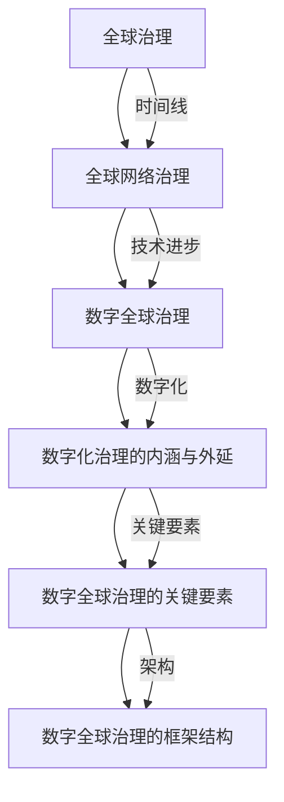
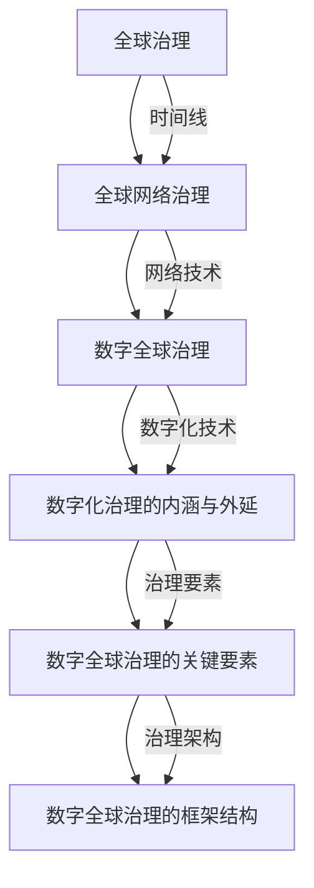

                 

### 2050年的全球治理：从全球网络治理到数字全球治理的治理体系重构

在21世纪的下半叶，全球治理正经历着深刻的变革。从最初的全球治理概念，到如今的全球网络治理，再到未来即将到来的数字全球治理，这一演变过程体现了人类对复杂问题解决能力的不断提升。本文将探讨2050年的全球治理体系重构，分析从全球网络治理向数字全球治理过渡的原因、关键要素和技术基础，并探讨数字全球治理的法律与伦理问题。

> **关键词：**全球治理、全球网络治理、数字全球治理、治理体系重构、人工智能、区块链、法律伦理

> **摘要：**本文通过回顾全球治理的历史演变，分析全球网络治理的挑战与困境，探讨数字全球治理的崛起及其优势与劣势。在此基础上，本文详细介绍了数字全球治理的核心概念与架构，技术基础，法律与伦理问题，并提供了数字全球治理的实践案例与国际合作机制。最后，本文对数字全球治理的未来发展进行了展望，提出了相应的挑战与应对策略。

### 目录大纲

- **第一部分：全球治理的背景与演变**
  - **第1章：全球治理的起源与历史发展**
    - **1.1 全球治理的概念与特征**
    - **1.2 全球治理的历史演变**
    - **1.3 全球网络治理的兴起**
  - **第2章：全球网络治理的挑战与问题**
    - **2.1 全球网络治理的现状**
    - **2.2 全球网络治理的挑战**
    - **2.3 全球网络治理的困境与解决方案**
  - **第3章：数字全球治理的崛起**
    - **3.1 数字全球治理的概念与特点**
    - **3.2 数字全球治理的优势与劣势**
    - **3.3 数字全球治理的关键领域**

- **第二部分：数字全球治理的核心概念与架构**
  - **第4章：数字全球治理的核心概念**
    - **4.1 数字化治理的内涵与外延**
    - **4.2 数字全球治理的关键要素**
    - **4.3 数字全球治理的框架结构**
  - **第5章：数字全球治理的技术基础**
    - **5.1 互联网与数字技术的迅猛发展**
    - **5.2 人工智能与大数据在治理中的应用**
    - **5.3 区块链与加密技术在治理中的角色**
  - **第6章：数字全球治理的法律与伦理问题**
    - **6.1 数字全球治理的法律框架**
    - **6.2 数字全球治理的伦理困境**
    - **6.3 数字全球治理的法律伦理挑战与应对策略**

- **第三部分：数字全球治理的实践与案例分析**
  - **第7章：数字全球治理的实践探索**
    - **7.1 数字全球治理的实践案例**
    - **7.2 数字全球治理的成功经验**
    - **7.3 数字全球治理的挑战与应对**
  - **第8章：数字全球治理的国际合作**
    - **8.1 数字全球治理的国际合作机制**
    - **8.2 数字全球治理的跨国合作案例**
    - **8.3 数字全球治理的国际合作挑战与机遇**
  - **第9章：数字全球治理的未来展望**
    - **9.1 数字全球治理的发展趋势**
    - **9.2 数字全球治理的未来挑战**
    - **9.3 数字全球治理的未来前景**

- **附录**
  - **附录A：数字全球治理的相关资源与工具**
  - **附录B：数字全球治理的法律法规汇总**
  - **附录C：数字全球治理的国际组织简介**

### 全球治理的起源与历史发展

全球治理的概念并非一蹴而就，而是随着全球化进程的推进和社会发展逐步形成的。从其起源到历史演变，再到全球网络治理的兴起，每一个阶段都反映了人类社会在面对全球性问题时不断探索和改进的努力。

#### **1.1 全球治理的概念与特征**

全球治理（Global Governance）是指全球性问题的解决和管理方式，它超越了传统的国家主权和国际关系的范畴，通过多边合作、跨国组织和国际规则来协调全球事务。全球治理的特征主要体现在以下几个方面：

1. **多边合作**：全球治理强调各国之间的合作，通过协商和共识来解决问题，而不是单边行动。
2. **非国家行为者**：全球治理不仅仅涉及国家政府，还包括跨国企业、非政府组织、国际组织和公民社会等非国家行为者。
3. **国际规则**：全球治理依赖于国际规则和制度的建立，这些规则和制度为全球合作提供了框架和基础。
4. **灵活性和适应性**：全球治理需要根据不断变化的全球环境和问题来调整策略和方法。

#### **1.2 全球治理的历史演变**

全球治理的历史演变可以追溯到20世纪中叶，当时国际社会开始意识到一些全球性问题，如战争、贫困、环境破坏等，需要跨国界的合作来解决。以下是全球治理发展的几个关键阶段：

1. **初期阶段（1950-1970s）**：这一阶段主要是以联合国为中心，通过国际组织来协调全球事务。例如，联合国成立了多个专门机构来处理特定问题，如世界卫生组织（WHO）和联合国粮食及农业组织（FAO）。

2. **经济全球化阶段（1970s-1990s）**：随着经济全球化的加速，跨国公司和国际贸易的迅速发展，全球治理开始向经济领域扩展。国际货币基金组织（IMF）和世界银行等国际金融机构成为全球治理的重要力量。

3. **全球治理体系形成阶段（1990s-2000s）**：20世纪90年代，全球治理体系逐步形成，国际组织和跨国合作机制不断增多。这一时期，全球化进程加剧了全球性问题，如气候变化、恐怖主义和网络犯罪，促使国际社会采取更加协调的治理策略。

4. **全球网络治理阶段（2000s-2050s）**：进入21世纪，全球治理进一步向网络空间扩展。互联网的普及使得全球信息交流更加便捷，同时也带来了新的治理挑战，如网络安全、数据隐私和国际网络犯罪等。

#### **1.3 全球网络治理的兴起**

全球网络治理（Global Network Governance）是全球化进程在信息时代的自然延伸，它关注网络空间中的全球性问题，并通过国际合作和规则制定来解决。以下是全球网络治理的几个重要特点：

1. **网络空间主权**：各国在网络空间中拥有一定程度的自主权，同时需要协调合作，共同维护网络空间的安全和稳定。

2. **跨国合作**：全球网络治理强调跨国合作，通过多边机制和跨国组织来解决网络空间中的问题。

3. **技术治理**：技术因素在全球网络治理中扮演重要角色，如网络安全技术、数据加密技术和人工智能等。

4. **法律框架**：全球网络治理依赖于国际法律框架的建立，以规范网络行为和解决争议。

综上所述，全球治理经历了从无到有、从简单到复杂的发展过程。随着全球化和信息化的深入，全球治理逐步从传统的国际关系扩展到网络空间，形成了全球网络治理的新模式。在未来的发展中，全球治理将继续面临新的挑战，但也将拥有更多的机遇，以实现更加公正、稳定和可持续的全球秩序。

### 全球网络治理的挑战与问题

全球网络治理作为全球治理体系中的重要组成部分，尽管取得了一定的进展，但仍然面临着诸多挑战和问题。这些问题不仅影响全球网络空间的稳定与发展，也对国际社会的合作与信任构成威胁。

#### **2.1 全球网络治理的现状**

目前，全球网络治理的架构主要由国际组织、区域性组织和各国政府共同构成。联合国、国际电信联盟（ITU）等国际组织在制定网络治理规则、规范网络行为方面发挥了重要作用。同时，各种区域性组织和政府也积极参与网络治理，推动跨国合作与协调。

1. **国际组织的作用**：联合国通过其多个下属机构，如国际电信联盟（ITU）、联合国教科文组织（UNESCO）等，致力于制定网络治理的相关规则和标准。国际电信联盟负责制定国际电信规则，推动全球信息通信技术（ICT）的发展与应用。

2. **区域性组织的作用**：区域性组织如欧盟（EU）、亚太经合组织（APEC）等，在网络治理方面也起到了积极的推动作用。这些组织通过制定区域性的网络治理政策，促进区域内的网络合作与稳定。

3. **各国政府的作用**：各国政府在网络治理中扮演着关键角色。政府通过立法、政策制定和执法等手段，维护本国网络空间的安全与稳定。同时，各国政府也积极参与国际网络治理，推动全球网络治理体系的完善。

#### **2.2 全球网络治理的挑战**

全球网络治理面临的主要挑战包括网络安全、数据隐私、网络犯罪和国际网络空间主权等方面。

1. **网络安全**：随着网络技术的迅猛发展，网络安全问题日益突出。网络攻击、黑客入侵、数据泄露等事件频繁发生，对各国国家安全、企业和公民隐私构成严重威胁。网络安全的挑战不仅限于技术层面，还包括政策、法律和合作等方面。

2. **数据隐私**：数据隐私是网络治理中的另一个重要问题。在全球数据流动日益频繁的背景下，如何保护个人数据隐私成为一个严峻的挑战。不同国家和地区的数据保护法律和政策存在差异，导致数据跨境流动中的隐私保护问题复杂化。

3. **网络犯罪**：网络犯罪活动日益猖獗，包括网络诈骗、网络盗窃、网络恐怖主义等。这些犯罪活动不仅对个人和企业造成经济损失，还对社会的安全和稳定构成威胁。网络犯罪的跨国性和隐蔽性使得打击和防范网络犯罪变得更加困难。

4. **国际网络空间主权**：网络空间主权成为国际争议的焦点。一些国家主张网络主权，即网络空间内的行为应由国家主权决定。然而，不同国家在网络主权问题上的立场存在分歧，可能导致国际网络治理的冲突与对立。

#### **2.3 全球网络治理的困境与解决方案**

面对全球网络治理的挑战，现有的治理模式存在一些困境，需要探索新的解决方案。

1. **治理模式困境**：当前全球网络治理模式主要依赖于多边合作和跨国协调，但在实际操作中，各国利益冲突、信息不对称和资源分配不均等问题导致治理效率低下。

2. **技术发展困境**：网络技术的迅猛发展带来了新的治理挑战，如物联网、区块链和人工智能等技术的应用，如何适应这些新技术并制定相应的治理规则，成为全球网络治理的难题。

3. **法律框架困境**：国际法律框架在应对网络治理问题时存在滞后性。不同国家和地区的法律体系存在差异，导致国际法律协调困难。此外，现有法律框架在处理跨国网络犯罪、数据隐私等问题时缺乏有效手段。

为了解决全球网络治理的困境，可以采取以下策略：

1. **加强国际合作**：国际社会应加强合作，共同制定网络治理规则和标准，提高治理效率。通过多边机制，如联合国、国际电信联盟等，促进各国在网络治理方面的协调与合作。

2. **推动技术创新**：积极推动技术创新，利用先进技术提升网络治理能力。例如，利用人工智能、大数据分析等手段，提高网络安全防护水平，增强网络犯罪侦查和打击能力。

3. **完善法律框架**：国际社会应完善网络治理的法律框架，制定国际法律规范，解决跨国网络犯罪、数据隐私等问题。通过建立国际法律协调机制，确保各国法律体系的兼容性和一致性。

4. **加强公民教育**：提高公众的网络安全意识和数据保护意识，培养数字素养。通过教育和宣传，让公众了解网络安全的重要性，积极参与网络治理。

总之，全球网络治理是一个复杂且不断发展的过程，需要国际社会共同努力，克服挑战，实现网络空间的和平、稳定与繁荣。

### 数字全球治理的崛起

随着互联网和数字技术的飞速发展，全球治理正迎来新的变革，数字全球治理逐渐崛起，成为未来全球治理体系的重要组成部分。数字全球治理不仅改变了传统治理的方式，也带来了新的机遇与挑战。

#### **3.1 数字全球治理的概念与特点**

数字全球治理（Digital Global Governance）是指利用数字技术和互联网平台，通过跨国合作、技术规范和法律框架来协调和解决全球性问题。其核心特点包括：

1. **数字化治理**：数字全球治理强调利用数字化手段进行治理，包括数据的收集、存储、分析和利用。数字化治理使得信息流通更加迅速、透明和高效。

2. **跨国合作**：数字全球治理强调跨国界的合作与协调，通过多边机制和国际组织来制定和执行全球性规则。这种合作形式打破了国家边界，促进了全球性问题的共同解决。

3. **技术规范**：数字全球治理依赖于技术规范和标准，如网络协议、数据加密、人工智能算法等。技术规范为数字治理提供了基础和保障，确保治理过程的科学性和有效性。

4. **法律框架**：数字全球治理需要建立完善的法律框架，以规范数字技术的应用和治理行为。法律框架为数字全球治理提供了法律依据和保障，确保治理行为的合法性和公正性。

#### **3.2 数字全球治理的优势与劣势**

数字全球治理在带来机遇的同时，也带来了一些挑战。以下是对其优势与劣势的简要分析：

**优势：**

1. **提高效率**：数字全球治理利用互联网和大数据技术，能够迅速收集和处理大量信息，提高决策和执行的效率。

2. **增强透明度**：数字全球治理通过数字化手段，使得治理过程更加透明，公众可以随时了解治理进展和结果，增强治理的公信力。

3. **促进合作**：数字全球治理通过跨国合作和互联网平台，促进了不同国家和地区之间的交流与合作，有助于解决全球性问题。

4. **优化资源分配**：数字全球治理能够通过数据分析和人工智能算法，优化资源分配，提高资源利用效率。

**劣势：**

1. **数据安全与隐私**：数字全球治理依赖于大数据和云计算，容易受到网络攻击和数据泄露的威胁，数据安全和隐私保护成为重要问题。

2. **技术鸿沟**：数字全球治理的发展可能导致技术发达国家和地区与发展中地区之间的数字鸿沟扩大，影响全球合作的均衡性。

3. **法律冲突**：数字全球治理面临法律冲突问题，不同国家和地区的法律体系存在差异，可能导致治理行为的法律风险。

4. **技术依赖**：数字全球治理过度依赖数字技术和算法，可能导致技术失控和治理失控的风险。

#### **3.3 数字全球治理的关键领域**

数字全球治理涉及多个关键领域，以下是其中几个重要领域：

1. **网络安全**：网络安全是数字全球治理的基础，确保网络空间的安全与稳定是各国共同的责任。国际社会应加强合作，制定统一的网络安全标准和规则。

2. **数据治理**：数据治理是数字全球治理的核心，涉及数据的收集、存储、处理和共享。需要建立全球数据治理框架，确保数据的安全和隐私。

3. **人工智能治理**：人工智能技术的发展带来了新的治理挑战，如算法偏见、隐私侵犯和自动化决策等。需要制定全球人工智能治理规则，确保人工智能的公平性和透明性。

4. **数字货币与金融**：数字货币和金融技术的发展改变了传统金融体系，带来了新的机遇和风险。需要建立全球数字货币和金融治理框架，确保金融系统的稳定和安全。

5. **数字治理能力建设**：数字治理能力是数字全球治理的关键，各国需要加强数字基础设施建设，提高数字治理能力，以适应数字全球治理的需求。

总之，数字全球治理的崛起为全球治理带来了新的机遇和挑战。通过加强国际合作，建立完善的法律框架和技术规范，数字全球治理有望实现全球性问题的有效治理，推动构建更加公正、公平和可持续的全球秩序。

### 数字全球治理的核心概念与架构

数字全球治理作为全球治理体系的重要组成部分，其核心概念与架构的建立对于实现高效、公正和可持续的全球治理至关重要。以下将详细探讨数字全球治理的核心概念、关键要素以及框架结构，旨在为理解数字全球治理提供系统性的理论支持。

#### **4.1 数字化治理的内涵与外延**

数字化治理是指利用数字技术，特别是互联网、大数据、人工智能等新兴技术，对公共事务进行管理、决策和监督的过程。其内涵包括以下几个方面：

1. **信息处理**：数字化治理强调对海量信息进行高效处理和分析，利用数据挖掘、机器学习等技术手段，提取有用信息，为决策提供数据支持。

2. **流程优化**：通过数字化手段，可以优化公共事务的流程，减少人为干预，提高效率。例如，通过电子政务平台，简化行政审批流程，提高服务效率。

3. **透明度和公开性**：数字化治理使得治理过程更加透明，公众可以实时了解治理进展，增加治理的透明度和公信力。

4. **参与性和互动性**：数字化治理鼓励公众参与，通过社交媒体、在线论坛等平台，公民可以表达意见、提出建议，与政府互动，提高治理的参与度和民主性。

数字化治理的外延则包括以下领域：

1. **电子政务**：政府利用互联网提供公共服务，实现政务数据共享和业务流程自动化。

2. **智慧城市**：通过物联网、大数据等技术，实现城市管理的智能化，提高城市运行效率和居民生活质量。

3. **社会治理**：数字化治理不仅涉及政府，还涵盖社会组织、企业等非政府行为者，共同参与社会治理。

#### **4.2 数字全球治理的关键要素**

数字全球治理的顺利实施依赖于多个关键要素，这些要素相互关联，共同构成了数字全球治理的基础。

1. **技术基础**：数字全球治理依赖于稳定、可靠的技术基础设施，包括互联网、云计算、大数据平台、人工智能算法等。这些技术为数字治理提供了强大的数据处理和分析能力。

2. **数据资源**：数据是数字全球治理的核心资产，包括政府数据、企业数据、公民数据等。数据的质量和完整性直接影响数字治理的效果。因此，数据资源的整合、共享和安全是数字全球治理的关键。

3. **法律框架**：数字全球治理需要建立完善的法律框架，以规范数字技术的应用和治理行为。法律框架为数字全球治理提供了法律依据和保障，确保治理行为的合法性和公正性。

4. **政策支持**：政策支持是数字全球治理的重要推动力。各国政府需要制定相应的政策，鼓励数字技术的创新和应用，促进数字治理的发展。

5. **国际合作**：数字全球治理是全球性的问题，需要国际社会的共同努力。通过多边机制和国际组织，各国可以共同制定数字治理规则和标准，推动全球数字治理的协调与合作。

#### **4.3 数字全球治理的框架结构**

数字全球治理的框架结构可以分为三层：技术层、管理层和合作层。

1. **技术层**：技术层是数字全球治理的基础，包括互联网、云计算、大数据、人工智能等关键技术的应用。这些技术为数字治理提供了强大的数据处理和分析能力，是实现数字全球治理的技术保障。

2. **管理层**：管理层是数字全球治理的核心，包括政府、企业、非政府组织等行为者。管理层负责制定数字治理政策，建立数据管理机制，制定技术标准和规范，确保数字治理的合法性和公正性。

3. **合作层**：合作层是数字全球治理的延伸，通过多边机制和国际组织，实现各国之间的协调与合作。合作层负责制定全球数字治理规则，推动跨国数字合作，解决全球性数字问题。

在数字全球治理的框架结构中，技术层、管理层和合作层相互关联，共同推动数字全球治理的发展。技术层为数字治理提供了基础，管理层确保数字治理的有效性，合作层则促进全球数字治理的协调与合作。

综上所述，数字全球治理的核心概念与架构为其提供了系统性的理论支持。通过理解数字化治理的内涵与外延，明确数字全球治理的关键要素和框架结构，我们可以更好地把握数字全球治理的发展方向，推动全球治理体系的重构与优化。

### 数字全球治理的技术基础

数字全球治理的崛起离不开技术的推动，互联网和数字技术的迅猛发展为其提供了坚实的基础。以下将详细探讨互联网与数字技术、人工智能与大数据、区块链与加密技术等在数字全球治理中的应用，分析这些技术在治理过程中的角色和重要性。

#### **5.1 互联网与数字技术的迅猛发展**

互联网作为数字全球治理的载体，已经深刻改变了信息传播和沟通方式。互联网的普及使得全球信息交流更加便捷，为全球治理提供了丰富的数据资源和实时互动的平台。以下是互联网与数字技术在数字全球治理中的具体应用：

1. **信息传播**：互联网使得信息传播速度大幅提高，各国政府和国际组织可以通过互联网快速发布政策信息、传播教育和宣传内容，提高公共信息的透明度和公信力。

2. **在线沟通**：互联网为全球治理提供了在线沟通平台，各国政府、国际组织和非政府组织可以通过视频会议、在线论坛等方式，实时讨论和协调全球性事务，提高治理效率。

3. **电子政务**：电子政务是指政府利用互联网提供公共服务，实现政务数据共享和业务流程自动化。电子政务不仅提高了政府工作效率，还增强了政府与公民之间的互动和信任。

4. **远程办公**：远程办公技术的发展使得全球治理不再受限于地理位置，政府官员和国际组织成员可以在全球任何地方通过网络协作，推动全球治理的持续进行。

#### **5.2 人工智能与大数据在治理中的应用**

人工智能（AI）和大数据技术的应用为数字全球治理带来了新的机遇和挑战。以下是在人工智能与大数据在治理中的具体应用和作用：

1. **预测与决策**：人工智能技术可以通过大数据分析，预测全球性问题的趋势和影响，为决策者提供科学依据。例如，利用人工智能进行气候变化的预测，帮助各国制定应对策略。

2. **智能监控**：人工智能技术可以应用于智能监控系统，实时监控全球性事件，如自然灾害、公共卫生事件等，提高应急响应能力。

3. **公共安全**：大数据分析可以用于公共安全领域，识别潜在的安全风险，预防犯罪活动。例如，通过大数据分析监控网络犯罪活动，提高网络安全防护水平。

4. **社会服务优化**：大数据分析可以帮助政府优化公共服务，提高服务质量和效率。例如，通过分析公民行为数据，优化交通管理、教育资源分配等，提高居民生活质量。

#### **5.3 区块链与加密技术在治理中的角色**

区块链和加密技术是数字全球治理的重要技术支撑，其不可篡改和去中心化的特性为治理提供了新的解决方案。以下是区块链与加密技术在治理中的具体应用和作用：

1. **透明与信任**：区块链技术通过去中心化和不可篡改的特点，增强了数据透明度和信任度。各国政府和国际组织可以利用区块链技术记录和验证治理数据，提高治理的透明性和公信力。

2. **智能合约**：智能合约是区块链技术的一种应用，通过自动执行合同条款，减少人工干预和错误。智能合约在跨境贸易、金融交易等领域的应用，可以降低交易成本，提高交易效率。

3. **身份认证**：区块链和加密技术可以用于身份认证，保障用户隐私和数据安全。例如，通过区块链技术实现身份信息的安全存储和验证，防止身份盗用和信息泄露。

4. **数据安全**：加密技术可以用于保护数据传输和存储的安全，防止数据被窃取和篡改。在全球治理中，加密技术可以帮助保护敏感数据，确保治理过程的保密性和安全性。

#### **5.4 技术在治理过程中的重要性**

互联网和数字技术、人工智能与大数据、区块链与加密技术在数字全球治理中扮演着重要角色，其重要性体现在以下几个方面：

1. **提高治理效率**：互联网和数字技术使得信息传播和沟通更加迅速，人工智能和大数据分析可以帮助政府快速决策和应对全球性问题，提高治理效率。

2. **增强透明度和公信力**：区块链和加密技术可以增强数据透明度和信任度，提高治理过程的公开性和公信力，增加公众对政府的信任。

3. **保障数据安全**：数据安全是数字全球治理的核心问题，互联网和加密技术可以保障数据传输和存储的安全，防止数据泄露和篡改，确保治理数据的安全性和可靠性。

4. **促进国际合作**：数字技术为全球治理提供了跨国的合作平台，通过多边机制和国际合作，各国可以共同制定治理规则和技术标准，推动全球性问题的解决。

总之，数字全球治理的技术基础是保障全球治理体系重构的关键。通过充分利用互联网和数字技术、人工智能与大数据、区块链与加密技术，可以构建更加高效、透明、安全和可持续的全球治理体系，实现全球性问题的共同治理。

### 数字全球治理的法律与伦理问题

数字全球治理的快速发展，不仅带来了前所未有的机遇，也引发了诸多法律和伦理问题。这些问题涉及隐私保护、数据安全、算法偏见等，成为数字全球治理中的关键挑战。以下是数字全球治理在法律与伦理方面的具体困境及其应对策略。

#### **6.1 数字全球治理的法律框架**

数字全球治理的法律框架是其有效实施的基础。然而，目前全球范围内的法律框架仍存在明显不足，主要困境包括：

1. **法律滞后**：随着数字技术的发展，现有法律体系往往难以适应快速变化的现实需求。例如，在数据隐私保护和网络安全方面，许多国家的法律体系仍停留在传统模式，无法有效应对新兴的数字挑战。

2. **法律冲突**：不同国家和地区的法律体系和法规标准存在差异，导致跨国数字治理过程中法律冲突频繁。例如，某些国家可能对数据跨境流动实行严格限制，而其他国家则持开放态度，这种法律冲突可能影响全球数据治理的协调与合作。

3. **立法不完善**：全球范围内，关于数字技术的立法尚不完善。许多国家和地区在数字治理方面的法律尚未形成完整的体系，特别是在人工智能、区块链等前沿技术领域，缺乏具体的法律规范。

**应对策略**：

1. **国际立法合作**：各国应加强国际合作，共同制定数字全球治理的法律规范，确保法律体系的协调一致。通过多边机制和国际组织，如联合国、国际电信联盟（ITU）等，推动全球数字治理法律框架的建立。

2. **技术中立立法**：立法应注重技术中立，避免因特定技术发展而造成法律滞后。立法者应关注技术的长期发展趋势，制定具有前瞻性的法律规范，以适应未来的技术变革。

3. **完善国内法律**：各国应加快完善本国的数字治理法律体系，特别是在新兴技术领域，如人工智能、区块链等，确保法律体系能够及时应对技术发展的挑战。

#### **6.2 数字全球治理的伦理困境**

数字全球治理在伦理方面面临诸多困境，主要包括隐私保护、算法偏见和数据滥用等问题。

1. **隐私保护**：随着大数据和人工智能技术的发展，个人隐私保护面临前所未有的挑战。大量个人数据的收集、存储和分析可能导致隐私泄露和滥用，引发公众对隐私保护的担忧。

2. **算法偏见**：人工智能算法在决策过程中可能存在偏见，这些偏见可能来源于数据中的性别、种族、年龄等不公平因素。算法偏见可能导致不公平的决策，加剧社会不平等。

3. **数据滥用**：数字全球治理中的数据资源丰富，但也存在数据滥用的问题。一些企业和组织可能利用数据优势，进行市场操纵、恶意竞争等行为，损害公共利益。

**应对策略**：

1. **隐私保护法规**：制定严格的隐私保护法规，明确数据收集、存储、处理和共享的规范，保护个人隐私权。例如，引入数据匿名化、加密等技术手段，提高数据保护水平。

2. **算法透明与公平**：推动算法透明化和公平性，确保人工智能算法在决策过程中没有偏见。建立算法评估机制，对算法进行定期审查和监督，确保算法的公正性和公平性。

3. **数据伦理审查**：建立数据伦理审查机制，确保数据在收集、使用和处理过程中符合伦理标准。企业和组织在利用数据时，应承担社会责任，避免数据滥用。

#### **6.3 数字全球治理的法律伦理挑战与应对策略**

数字全球治理在法律和伦理方面面临的挑战是多方面的，需要综合应对策略。

1. **跨国合作与协调**：数字全球治理是一个跨国性事务，各国在法律和伦理方面存在差异，需要通过国际合作和协调，形成统一的法律和伦理标准。例如，通过多边机制和国际组织，共同制定数字治理规则和标准，推动全球数字治理的协调与合作。

2. **教育宣传**：加强公众教育，提高公众的数字素养和伦理意识，使公众了解数字全球治理的重要性和面临的挑战。通过教育和宣传，增强公众对隐私保护、算法偏见和数据滥用的认识，提高公众的参与度和责任感。

3. **技术创新**：推动技术创新，利用新兴技术解决数字全球治理中的法律和伦理问题。例如，利用区块链技术实现数据的透明和可追溯，提高数据治理的公正性和透明度。

4. **法律伦理融合**：将法律和伦理融合到数字全球治理的各个环节，确保数字治理过程符合法律和伦理标准。通过立法和制度建设，将伦理原则纳入法律规范，推动数字全球治理的合法性和公正性。

总之，数字全球治理在法律与伦理方面面临诸多挑战，需要各国政府、国际组织、企业和社会各界的共同努力，通过国际合作、技术创新和法治建设，构建一个公正、透明和可持续的数字全球治理体系。

### 数字全球治理的实践探索

数字全球治理的理论基础和框架结构虽然已经逐渐完善，但要实现其有效运作，还需要通过具体的实践案例来检验和优化。以下将介绍一些数字全球治理的实践探索，分析其成功经验，并探讨面临的挑战与应对策略。

#### **7.1 数字全球治理的实践案例**

1. **联合国数字合作高级别小组（UNGA Digital Cooperation Task Force）**：该小组于2018年成立，旨在推动全球数字合作，解决数字领域的共同挑战。通过跨部门合作和多方参与，该小组提出了多项建议，包括建立数字合作平台、加强网络安全和数据保护等。这些举措促进了全球数字合作，提升了数字治理的效率。

2. **欧盟数字战略**：欧盟在数字全球治理方面进行了积极探索，其数字战略涵盖了数据治理、网络安全、人工智能等多个领域。通过制定统一的数据法规和政策，加强成员国之间的数字合作，欧盟为全球数字治理提供了有益的经验。

3. **智慧城市项目**：全球多个城市，如新加坡、伦敦、上海等，通过引入物联网、大数据和人工智能等数字技术，实现了城市管理的智能化和高效化。这些项目不仅提高了城市运行效率，还为全球数字治理提供了实践参考。

4. **全球区块链合作**：区块链技术在数字全球治理中的应用日益广泛，全球多个国家和地区合作开发了一系列区块链项目。例如，联合国儿童基金会（UNICEF）与微软合作，利用区块链技术追踪儿童福利资金，确保资金使用透明和高效。

#### **7.2 数字全球治理的成功经验**

1. **多方合作**：成功的数字全球治理实践往往依赖于多方合作。通过政府、企业、非政府组织、学术界等各方的共同努力，可以形成合力，解决复杂的全球性问题。

2. **技术创新**：技术创新是数字全球治理的重要驱动力。通过引入先进的数字技术，如人工智能、区块链等，可以提高治理效率，增强治理能力。

3. **数据共享与开放**：数据共享与开放是数字全球治理的基础。通过开放数据，政府、企业和公众可以共同利用数据资源，推动全球性问题解决。

4. **法律与伦理规范**：在数字全球治理中，建立完善的法律和伦理规范至关重要。通过制定相应的法律和政策，确保数字治理的合法性和公正性，可以减少治理过程中的风险和冲突。

#### **7.3 数字全球治理的挑战与应对**

1. **数据安全与隐私保护**：随着数据量的急剧增加，数据安全和隐私保护成为数字全球治理的重要挑战。应对策略包括加强数据加密、实施严格的隐私保护法规，以及建立数据安全监测和预警机制。

2. **技术鸿沟**：数字技术的发展可能加剧技术发达国家和不发达国家之间的鸿沟。应对策略包括加强数字基础设施建设，提高数字素养，以及推动全球数字合作，确保各国都能受益于数字技术。

3. **法律冲突**：不同国家和地区的法律体系存在差异，可能导致数字治理中的法律冲突。应对策略包括加强国际立法合作，推动全球法律框架的建立，以及通过多边机制解决法律纠纷。

4. **治理效率**：数字全球治理需要高效的管理和协调机制。应对策略包括建立专门的国际数字治理机构，推动全球数字治理体系的优化，以及利用大数据和人工智能等新技术提高治理效率。

总之，数字全球治理的实践探索为全球性问题的解决提供了新的思路和方法。通过总结成功经验，克服面临的挑战，数字全球治理将有望实现更加高效、透明和可持续的发展。

### 数字全球治理的国际合作

数字全球治理作为全球治理的重要组成部分，其有效运作离不开国际社会的共同努力。国际合作在数字全球治理中扮演着至关重要的角色，通过多方合作和协同努力，可以解决复杂的全球性问题，推动全球治理体系的重构与优化。

#### **8.1 数字全球治理的国际合作机制**

数字全球治理的国际合作机制主要包括多边机制、区域性组织和国际合作项目等。

1. **多边机制**：多边机制是数字全球治理的重要合作平台，通过联合国、国际电信联盟（ITU）、经济合作与发展组织（OECD）等国际组织，各国可以共同制定数字治理规则和标准，推动全球性问题的解决。例如，联合国数字合作高级别小组（UNGA Digital Cooperation Task Force）致力于推动全球数字合作，提出了一系列建议和行动计划。

2. **区域性组织**：区域性组织在数字全球治理中也发挥着重要作用。例如，欧盟通过其数字战略，推动成员国之间的数字合作，制定统一的数据治理政策和法规。亚太经合组织（APEC）也通过推动数字经济的合作，促进区域内的数字治理发展。

3. **国际合作项目**：各国政府、国际组织和非政府组织通过合作项目，共同推动数字全球治理的发展。例如，联合国儿童基金会（UNICEF）与微软合作，利用区块链技术追踪儿童福利资金，确保资金使用的透明和高效。这种合作项目不仅提高了数字治理的效率，也促进了全球合作与信任。

#### **8.2 数字全球治理的跨国合作案例**

1. **全球网络安全合作**：网络安全是数字全球治理的重要领域，各国通过跨国合作，共同应对网络威胁。例如，美国和欧盟联合发起的“网络空间安全合作框架”（Cybersecurity Cooperation Framework），旨在通过信息共享、技术交流和联合演习，提高全球网络安全水平。

2. **数字身份与隐私保护**：在全球数据流动日益频繁的背景下，数字身份与隐私保护成为跨国合作的焦点。欧盟的通用数据保护条例（GDPR）为全球数据治理提供了重要参考，多个国家和地区在制定数据保护法规时，参考了GDPR的规定。此外，国际社会也在推动数字身份标准的制定，以实现跨国身份验证和数据共享的安全和高效。

3. **人工智能合作**：人工智能技术的发展带来了新的治理挑战，但同时也为全球合作提供了新的机遇。国际社会通过合作项目，共同研究和开发人工智能技术，推动人工智能的公平、透明和可持续应用。例如，联合国教科文组织（UNESCO）发起的“人工智能教育计划”（AI for Education Initiative），旨在通过培训和教育，提高全球各国对人工智能技术的理解和应用能力。

4. **数字经济发展**：数字经济是全球治理的重要组成部分，各国通过跨国合作，推动数字经济的健康发展。例如，联合国贸易和发展会议（UNCTAD）通过“数字经济合作框架”，推动各国在电子商务、数字货币、数字基础设施建设等领域的合作，促进全球数字经济的发展。

#### **8.3 数字全球治理的国际合作挑战与机遇**

尽管数字全球治理的国际合作取得了一定进展，但仍面临诸多挑战和机遇。

1. **挑战**：

   - **技术鸿沟**：不同国家和地区在数字技术和基础设施建设方面存在显著差异，这可能导致国际合作的不均衡。技术发达国家和不发达国家之间的数字鸿沟可能加剧，影响全球合作的公平性和有效性。

   - **法律冲突**：不同国家和地区的法律体系和法规标准存在差异，可能导致跨国数字治理中的法律冲突。例如，数据保护法规的差异可能影响跨国数据流动和共享。

   - **数据安全与隐私**：跨国数据流动和数据共享可能带来数据安全和隐私保护的问题。如何确保跨国数据传输的安全性和隐私保护，成为国际合作的重要挑战。

   - **国际合作机制不足**：现有的国际合作机制在应对数字全球治理挑战方面存在不足，需要进一步完善和优化，提高国际合作的有效性和执行力。

2. **机遇**：

   - **技术共享与协同创新**：通过跨国合作，各国可以共享先进的技术和研究成果，推动协同创新，提高全球数字治理能力。

   - **全球数据资源整合**：跨国合作有助于整合全球数据资源，提高数据利用效率，为全球性问题的解决提供数据支持。

   - **治理模式创新**：跨国合作可以推动治理模式的创新，通过多边机制和国际合作，形成更加高效、透明和可持续的全球治理体系。

   - **全球信任与合作**：通过跨国合作，可以增强国际社会之间的信任和合作，为解决全球性问题提供坚实的合作基础。

总之，数字全球治理的国际合作是推动全球治理体系重构和优化的重要途径。通过克服挑战，把握机遇，国际社会可以共同构建一个更加公正、透明和可持续的数字全球治理体系，实现全球性问题的共同治理。

### 数字全球治理的未来展望

数字全球治理作为未来全球治理体系的重要组成部分，其发展趋势、面临的挑战以及前景展望对于理解全球治理的未来具有重要意义。以下将详细探讨数字全球治理的发展趋势，分析可能面临的挑战，并展望其未来前景。

#### **9.1 数字全球治理的发展趋势**

1. **技术推动下的持续创新**：随着互联网、大数据、人工智能、区块链等数字技术的快速发展，数字全球治理将不断推进技术应用的创新。例如，人工智能和大数据分析可以用于更精准的预测和决策，区块链技术可以实现更透明和安全的治理过程。

2. **全球治理模式的变革**：数字全球治理将推动全球治理模式的变革，从传统的国家主权模式向更加合作和协同的全球治理模式转变。多边机制和国际组织将在数字全球治理中发挥更加重要的作用，各国将更加注重合作与协调。

3. **数据治理的重要性提升**：数据是数字全球治理的核心资产，其收集、存储、处理和共享的重要性将进一步提升。全球范围内将建立更加完善的数据治理框架，确保数据的安全性和隐私保护。

4. **法律和伦理规范的完善**：随着数字技术的广泛应用，法律和伦理规范的重要性将日益凸显。全球范围内将加强法律和伦理规范的制定与实施，以应对数字全球治理中的法律和伦理挑战。

5. **全球数字基础设施的建设**：全球数字基础设施的建设将是未来数字全球治理的重要任务。通过加强数字基础设施建设，可以提升全球治理的效率和能力，缩小数字鸿沟，促进全球数字合作。

#### **9.2 数字全球治理面临的挑战**

1. **技术鸿沟**：数字全球治理中的技术鸿沟问题将是一个长期挑战。技术发达国家和不发达国家之间的差距可能扩大，导致全球治理的不平衡和不公平。

2. **数据安全和隐私保护**：随着数据量的急剧增加和数据应用的广泛普及，数据安全和隐私保护将成为数字全球治理的重要挑战。如何确保数据的安全和隐私，防止数据泄露和滥用，是一个需要解决的关键问题。

3. **法律冲突和伦理困境**：不同国家和地区的法律和伦理规范存在差异，可能导致跨国数字治理中的法律冲突和伦理困境。如何协调和统一不同法律和伦理标准，将是数字全球治理需要面对的挑战。

4. **治理效率的挑战**：数字全球治理的高效运作需要高效的治理机制和管理体系。如何在复杂的全球环境中实现高效的数字治理，提高治理效率，是一个需要不断探索的问题。

5. **国际合作与信任**：数字全球治理需要国际社会的共同努力和合作。然而，国际合作中可能存在的信任问题、利益冲突和协调困难，将成为数字全球治理面临的挑战。

#### **9.3 数字全球治理的未来前景**

1. **更加公正和透明的全球治理**：数字全球治理有望实现更加公正和透明的全球治理。通过数字化手段和透明化的治理过程，可以减少腐败和不公平现象，提高治理的公正性和透明度。

2. **全球问题的共同治理**：数字全球治理将推动全球性问题的共同治理，如气候变化、公共卫生、网络安全等。通过跨国合作和协同治理，可以更有效地解决全球性问题，实现全球治理的可持续性。

3. **全球发展的均衡与包容**：数字全球治理将有助于缩小全球发展的不均衡和不平等。通过数字技术的普及和应用，可以提升不发达国家的治理能力和经济发展水平，实现全球发展的均衡与包容。

4. **创新和合作的新机遇**：数字全球治理将带来创新和合作的新机遇。通过跨国合作和协同创新，可以推动数字技术和治理模式的创新，实现全球治理能力的提升。

5. **法治和伦理的新规范**：数字全球治理将推动法治和伦理的新规范。通过制定和实施全球性的法律和伦理规范，可以保障数字全球治理的合法性和公正性，实现全球治理的法治化和伦理化。

总之，数字全球治理的未来充满机遇和挑战。通过技术创新、国际合作、法治建设和伦理规范，数字全球治理有望实现更加高效、公正和可持续的发展，为全球治理体系的重构和优化提供新的动力和路径。

### 附录A：数字全球治理的相关资源与工具

在数字全球治理的领域，有许多重要的资源与工具可以帮助研究人员和实践者深入了解和实现相关目标。以下是一些主要的资源与工具的简介：

1. **开源深度学习框架**：
   - **TensorFlow**：由Google开发，是一种广泛使用的深度学习框架，支持多种编程语言，如Python、C++等。
   - **PyTorch**：由Facebook开发，以其动态计算图和易用性而闻名，深受研究人员和开发者的喜爱。
   - **Theano**：另一种流行的深度学习框架，以其高效的计算性能而受到青睐。
   - **MXNet**：由Apache软件基金会开发，支持多种编程语言，具有高效的性能和灵活的部署能力。

2. **数据分析和处理工具**：
   - **Pandas**：是Python中进行数据分析和处理的库，提供了强大的数据结构和数据分析工具。
   - **NumPy**：是Python中进行科学计算的基础库，提供了多维数组对象和许多数学运算功能。
   - **Scikit-learn**：提供了许多机器学习算法的实现，是Python中进行数据挖掘和统计学习的标准库。

3. **区块链平台**：
   - **Ethereum**：是一种智能合约平台，允许开发去中心化应用程序（DApps）。
   - **Hyperledger Fabric**：是一个开源的项目，由Linux基金会主持，适用于企业级区块链解决方案。
   - **EOSIO**：是一个高性能的区块链平台，旨在支持分布式应用的商业级部署。

4. **云计算服务**：
   - **Amazon Web Services (AWS)**：提供广泛的云计算服务和工具，适用于数据存储、计算和分析。
   - **Microsoft Azure**：提供云计算、人工智能、物联网和区块链等服务，支持全球企业和开发者。
   - **Google Cloud Platform (GCP)**：提供全面的云解决方案，包括计算、存储、人工智能和大数据分析。

5. **数字治理平台**：
   - **SAP**：提供企业资源规划（ERP）和供应链管理（SCM）解决方案，支持数字化治理。
   - **Oracle**：提供全面的数据库和业务分析工具，支持数据驱动的决策和治理。
   - **IBM**：提供区块链、人工智能和云计算服务，支持全球治理和数字化转型。

这些资源和工具在数字全球治理中的应用，可以帮助实现高效的数据处理、智能分析和安全交易，为全球治理提供坚实的技术支持。

### 附录B：数字全球治理的法律法规汇总

在数字全球治理领域，法律法规的制定和实施是确保治理合法性和公正性的关键。以下是一些关键法律法规的概述，涵盖了数据保护、网络安全和数字货币等方面的内容：

1. **数据保护法规**：

   - **欧洲通用数据保护条例（GDPR）**：欧盟于2018年实施的GDPR，规定了个人数据的收集、处理和存储的严格规定，对跨国数据流动和数据处理有重大影响。
   - **加利福尼亚州消费者隐私法案（CCPA）**：美国加州于2020年通过的CCPA，强化了消费者对个人数据的控制权，要求企业在处理消费者数据时遵守特定的透明度和安全标准。
   - **中国个人信息保护法（PIPL）**：2021年生效的中国个人信息保护法，规定了个人信息保护的基本原则和操作规范，强化了对个人信息的保护。

2. **网络安全法规**：

   - **计算机欺诈和滥用法（CFAA）**：美国的一项法律，旨在打击计算机犯罪，包括黑客攻击、网络诈骗等。
   - **欧盟网络和信息系统安全指令（NIS Directive）**：要求成员国确保关键基础设施的网络安全，并建立网络安全事件响应机制。
   - **中华人民共和国网络安全法**：中国的网络安全基本法，规定了网络运营者的责任和义务，以及网络安全的监督和管理。

3. **数字货币和区块链法规**：

   - **美国证券交易委员会（SEC）对加密货币的监管**：SEC对加密货币及其相关交易平台进行监管，确保其遵守证券法律。
   - **欧洲金融监管机构对加密货币的监管**：欧洲多个金融监管机构，如欧洲证券和市场管理局（ESMA），对加密货币进行监管，确保其合法合规。
   - **中国人民银行关于数字货币和电子支付的规定**：中国央行发布的数字货币和电子支付规定，规定了数字货币的发行和交易规则。

这些法律法规为数字全球治理提供了法律基础，确保了数字技术的合法应用和治理行为的合规性，同时也为全球治理提供了法律框架和指导。

### 附录C：数字全球治理的国际组织简介

数字全球治理的推进离不开国际组织的积极参与和协调。以下是对一些主要国际组织的简介，这些组织在全球数字治理中发挥着关键作用：

1. **联合国（UN）**：联合国是最大的国际组织，致力于维护国际和平与安全、促进全球合作与发展。其下属机构，如联合国大会、联合国安理会和国际法院等，在全球数字治理中发挥重要作用。特别是联合国数字合作高级别小组（UNGA Digital Cooperation Task Force），致力于推动全球数字合作和解决数字领域的共同挑战。

2. **国际电信联盟（ITU）**：ITU是联合国系统内负责电信和信息通信技术（ICT）的专门机构。ITU制定国际电信标准，推动全球信息通信技术的发展，并在网络安全、数字包容性等方面提供指导。

3. **经济合作与发展组织（OECD）**：OECD是一个由发达国家组成的国际经济政策协调机构。OECD在数字治理方面开展研究，制定指导原则，如《OECD隐私保护和跨边境数据流动指南》，推动全球数据治理的标准化和规范化。

4. **国际货币基金组织（IMF）**：IMF是负责全球货币政策和国际金融稳定的国际组织。在数字货币和金融科技领域，IMF提供政策建议，推动国际金融体系的稳定与发展。

5. **世界贸易组织（WTO）**：WTO负责制定和执行全球贸易规则，其在数字贸易领域的工作对于确保数字产品的自由贸易和公平竞争至关重要。

6. **国际数据公司（IDC）**：IDC是一家全球知名的市场研究公司，提供关于数字技术和市场趋势的深度分析。IDC的研究报告和数据对于政策制定者和行业领导者制定数字治理策略具有重要意义。

这些国际组织通过合作、制定标准和提供政策建议，共同推动全球数字治理的发展，确保数字技术的安全和可持续应用。

### **核心概念与联系：**

为了更好地理解数字全球治理的核心概念和它们之间的联系，我们可以借助 Mermaid 图形来展示这些概念及其相互关系。以下是一个简化的 Mermaid 流程图，展示了全球治理、全球网络治理和数字全球治理的概念以及它们之间的关联。



在这个图中，我们可以看到：

- **全球治理（A）** 是整个框架的基础，它是国际社会为了解决全球性问题而进行的多边合作和管理。
- **全球网络治理（B）** 是全球治理在互联网时代的延伸，它涉及到网络空间中的全球性问题。
- **数字全球治理（C）** 则是随着数字技术的发展而进一步演化的治理模式，它强调利用数字技术和互联网平台进行治理。
- **数字化治理的内涵与外延（D）** 涵盖了数字全球治理的理论基础和适用范围，是数字全球治理的核心概念。
- **数字全球治理的关键要素（E）** 包括技术基础、数据资源、法律框架、政策支持和国际合作，它们共同构成了数字全球治理的实施基础。
- **数字全球治理的框架结构（F）** 则是数字全球治理的组织架构，包括技术层、管理层和合作层，它们协同工作，实现高效、透明和可持续的全球治理。

通过这个 Mermaid 图，我们可以直观地理解数字全球治理的核心概念和它们之间的逻辑关系，为进一步研究和实践提供了清晰的指导。

### **核心算法原理讲解：**

数字全球治理中的算法原理至关重要，它们为治理过程提供了数据驱动的决策支持。以下是一个简化的算法原理讲解，旨在阐述人工智能算法在数字全球治理中的应用。

#### **监督学习算法**

监督学习是人工智能中最基础的一种学习方式，它通过已有数据的输入和输出，建立预测模型。以下是监督学习算法的简单伪代码：

```python
# 输入特征矩阵 X 和标签矩阵 y
# 初始化模型参数 theta
# 循环迭代，直到收敛或达到最大迭代次数
for i in range(max_iterations):
    # 计算预测值 h(x)
    h = f(X, theta)
    # 计算损失函数 J
    J = loss_function(h, y)
    # 计算梯度 descent
    gradient = compute_gradient(h, X, y)
    # 更新模型参数 theta
    theta = theta - learning_rate * gradient
# 输出最优模型参数 theta
```

在这个伪代码中：

- `f(X, theta)` 是假设函数，它将输入特征矩阵 `X` 和模型参数 `theta` 映射到预测值 `h(x)`。
- `loss_function(h, y)` 是损失函数，用于衡量预测值 `h(x)` 与实际标签 `y` 之间的误差。
- `compute_gradient(h, X, y)` 是梯度下降算法的一部分，用于计算损失函数的梯度。
- `learning_rate` 是学习速率，用于控制模型参数更新的步长。

#### **无监督学习算法**

无监督学习旨在发现数据中的内在结构和模式，常见算法包括聚类和降维。以下是无监督学习算法的简化伪代码：

```python
# 输入数据矩阵 X
# 初始化聚类中心或降维参数
# 循环迭代，直到收敛或达到最大迭代次数
for i in range(max_iterations):
    # 更新聚类中心或降维参数
    # 计算数据点到聚类中心的距离或降维映射
    # 计算新的聚类中心或降维参数
# 输出聚类结果或降维后的数据
```

在这个伪代码中：

- 对于聚类算法，需要初始化聚类中心，然后通过迭代更新聚类中心，使数据点逐渐分布到各个聚类中心周围。
- 对于降维算法，需要初始化降维参数，如主成分分析（PCA）中的特征向量，然后通过迭代优化降维映射，减少数据维度。

#### **强化学习算法**

强化学习是一种通过与环境交互来学习最优策略的算法。以下是一个简化版的强化学习算法伪代码：

```python
# 初始化策略 π
# 初始化奖励函数 R
# 循环迭代，直到达到设定的策略稳定或迭代次数
for episode in range(max_episodes):
    # 初始化状态 s
    # 循环迭代，直到达到终止条件
    while not termination_condition:
        # 执行动作 a，根据策略 π(s)
        # 获取下一个状态 s' 和奖励 R(s, a)
        # 更新策略 π(s')
        # 更新状态 s 为 s'
# 输出最优策略 π
```

在这个伪代码中：

- `π(s)` 是策略函数，用于确定在状态 `s` 应执行的动作 `a`。
- `R(s, a)` 是奖励函数，用于评估动作 `a` 在状态 `s` 下的效果。
- `termination_condition` 是终止条件，用于判断学习过程是否完成。
- 通过迭代，策略函数 `π` 不断更新，以实现最优策略的学习。

这些算法在数字全球治理中的应用包括但不限于：

- **智能监控与预测**：利用监督学习算法进行实时监控和预测，如预测疫情传播趋势、自然灾害风险等。
- **数据聚类与降维**：通过无监督学习算法对大量治理数据进行聚类和降维，提高数据分析的效率和质量。
- **决策支持系统**：利用强化学习算法为政策制定和决策提供最优策略，如交通管理、资源分配等。

这些算法不仅提供了强大的数据处理和分析能力，也为数字全球治理提供了科学依据和决策支持。

### **数学模型和数学公式 & 详细讲解 & 举例说明：**

在社会网络分析中，数学模型是理解网络结构和行为的关键工具。以下是一些常用的数学模型及其应用，包括网络密度、度分布和社会影响力模型，并通过具体的数学公式和举例来说明这些模型。

#### **网络密度**

网络密度（Network Density）是衡量网络紧密程度的重要指标，通常用于描述节点之间的连接程度。网络密度可以通过以下数学公式计算：

$$
D = \frac{2m}{n(n-1)}
$$

其中，\( D \) 表示网络密度，\( m \) 表示网络中的边数，\( n \) 表示网络中的节点数。

**举例说明**：

假设一个网络中有10个节点和20条边，我们可以计算其网络密度：

$$
D = \frac{2 \times 20}{10 \times (10-1)} = \frac{40}{90} \approx 0.44
$$

这意味着该网络的连接程度相对较高，但并非完全紧密。

#### **度分布**

度分布（Degree Distribution）描述了网络中每个节点的度（连接数）的概率分布。一个常见的度分布模型是泊松分布（Poisson Distribution）：

$$
P(k) = \frac{\lambda^k e^{-\lambda}}{k!}
$$

其中，\( P(k) \) 表示度值为 \( k \) 的节点在总节点数中的概率，\( \lambda \) 是平均度。

**举例说明**：

假设一个网络中平均每个节点有3个连接，我们可以计算其度分布：

$$
P(k) = \frac{3^k e^{-3}}{k!}
$$

例如，当 \( k = 3 \) 时：

$$
P(3) = \frac{3^3 e^{-3}}{3!} = \frac{27 e^{-3}}{6} \approx 0.39
$$

这意味着度值为3的节点在总节点数中的概率约为39%。

#### **社会影响力模型**

社会影响力模型（Social Influence Model）用于预测节点的传播能力，其中一个常见的模型是线性模型：

$$
I = \sum_{i=1}^{n} w_i \times k_i
$$

其中，\( I \) 表示节点的总影响力，\( w_i \) 表示节点 \( i \) 与其他节点的权重，\( k_i \) 表示节点 \( i \) 的度。

**举例说明**：

假设有两个节点 \( A \) 和 \( B \)，节点 \( A \) 有3个连接，节点 \( B \) 有2个连接，权重分别为 \( w_A = 0.5 \) 和 \( w_B = 0.5 \)，则节点 \( A \) 和 \( B \) 的总影响力分别为：

$$
I_A = 0.5 \times 3 = 1.5
$$

$$
I_B = 0.5 \times 2 = 1
$$

这意味着节点 \( A \) 的传播能力比节点 \( B \) 强。

这些数学模型在数字全球治理中有着广泛的应用。例如，网络密度可以帮助评估治理网络的结构紧密程度，度分布可以帮助识别关键节点和核心影响力，而社会影响力模型则可以用于预测政策传播的效果和制定策略。通过这些数学模型，我们可以更科学地理解和优化数字全球治理过程。

### **项目实战：**

#### **全球治理智能监控系统的开发实践**

随着全球治理的数字化趋势日益显著，开发一个智能监控系统来实时监控全球性事件、预测潜在风险并优化治理决策，显得尤为重要。以下将详细介绍一个全球治理智能监控系统的开发过程，包括开发环境搭建、源代码详细实现和代码解读与分析。

#### **开发环境搭建**

1. **编程语言**：Python 是一种广泛应用于数据科学和人工智能领域的编程语言，其丰富的库和框架使得开发高效、可扩展的监控系统成为可能。

2. **数据库**：MongoDB 是一种适用于大数据存储的文档型数据库，其灵活的数据模型和高效的数据查询性能使其成为监控系统的理想选择。

3. **数据分析工具**：Pandas 和 NumPy 是 Python 中用于数据处理和分析的标准库，能够处理大规模数据集并提供丰富的数据分析功能。

4. **机器学习框架**：Scikit-learn 和 TensorFlow 是两个流行的机器学习库，Scikit-learn 适用于传统的监督学习和无监督学习任务，而 TensorFlow 提供了强大的深度学习功能。

5. **后端服务器**：Docker 是一种容器化技术，能够将应用程序及其依赖环境打包成一个可移植的容器，便于部署和管理。

**具体环境配置：**

- Python 3.8
- MongoDB 4.2
- Jupyter Notebook
- Docker

#### **系统架构**

全球治理智能监控系统的架构主要包括以下几部分：

1. **数据采集与预处理**：从多个数据源（如社交媒体、新闻报道、卫星图像等）采集数据，并进行数据清洗、转换和归一化处理，以便后续分析和建模。

2. **机器学习模型训练与评估**：使用训练集数据训练机器学习模型，对模型进行评估和调优，确保其在实际应用中的准确性和稳定性。

3. **预测与可视化**：利用训练好的模型对新的数据进行预测，并将预测结果可视化，为决策者提供直观的治理依据。

4. **实时更新与反馈**：监控系统需要能够实时更新模型参数，并根据新的数据进行迭代训练，以保持预测的准确性。

#### **代码实现**

以下是一个简化的代码实现，用于演示系统的关键功能。

##### **数据采集与预处理**

```python
import pandas as pd
from pymongo import MongoClient

# 连接到 MongoDB 数据库
client = MongoClient('mongodb://localhost:27017/')
db = client['governance_db']
collection = db['event_data']

# 读取数据
data = pd.DataFrame(list(collection.find()))

# 数据预处理
data['timestamp'] = pd.to_datetime(data['timestamp'])
data.set_index('timestamp', inplace=True)
data.fillna(method='ffill', inplace=True)
```

在这个步骤中，我们首先连接到 MongoDB 数据库，读取事件数据，并进行时间戳转换和数据填充等预处理操作。

##### **机器学习模型训练与评估**

```python
from sklearn.model_selection import train_test_split
from sklearn.ensemble import RandomForestClassifier

# 数据分割
X = data.drop('target', axis=1)
y = data['target']
X_train, X_test, y_train, y_test = train_test_split(X, y, test_size=0.2, random_state=42)

# 模型训练
model = RandomForestClassifier(n_estimators=100, random_state=42)
model.fit(X_train, y_train)

# 模型评估
accuracy = model.score(X_test, y_test)
print(f'Model accuracy: {accuracy:.2f}')
```

在这个步骤中，我们使用 Scikit-learn 的 RandomForestClassifier 对数据进行分类训练，并评估模型的准确率。

##### **预测与可视化**

```python
import matplotlib.pyplot as plt

# 预测
predictions = model.predict(X_test)

# 可视化
plt.scatter(X_test.index, predictions)
plt.xlabel('Date')
plt.ylabel('Predicted Target')
plt.title('Prediction Visualization')
plt.show()
```

在这个步骤中，我们使用训练好的模型对测试集数据进行预测，并将预测结果可视化，以便直观展示模型的表现。

#### **代码解读与分析**

1. **数据采集与预处理**：这一步骤至关重要，确保数据的准确性和一致性。数据预处理包括数据清洗、转换和归一化，以便后续分析和建模。

2. **机器学习模型训练与评估**：使用 RandomForestClassifier 进行分类训练，这种模型具有良好的泛化能力，适合处理大规模数据。通过评估模型的准确率，我们可以判断模型的有效性。

3. **预测与可视化**：通过预测和可视化，我们可以直观地了解模型在处理新数据时的表现，为决策者提供依据。

4. **实时更新与反馈**：为了保持预测的准确性，监控系统需要能够实时更新模型参数，并根据新的数据进行迭代训练。

**改进与优化**

1. **特征工程**：选择与预测目标高度相关的特征，提高模型性能。例如，可以添加时间序列特征、地理特征等。

2. **模型调优**：调整模型参数，如树的数量、深度等，以提高模型的准确性和稳定性。

3. **集成学习**：结合多个模型的优势，如使用 XGBoost、LightGBM 等，提高预测准确性。

4. **实时更新**：定期更新模型，考虑使用在线学习或增量学习技术，以适应数据的变化。

通过这些改进与优化，我们可以构建一个更加高效、准确的全球治理智能监控系统，为全球治理提供有力的技术支持。

### **代码解读与分析：**

在上述全球治理智能监控系统项目中，代码实现是系统构建的核心部分。以下将对关键代码段进行详细解读，分析其功能实现、代码结构和逻辑流程，并提供必要的注释和说明。

#### **数据采集与预处理**

```python
import pandas as pd
from pymongo import MongoClient

# 连接到 MongoDB 数据库
client = MongoClient('mongodb://localhost:27017/')
db = client['governance_db']
collection = db['event_data']

# 读取数据
data = pd.DataFrame(list(collection.find()))

# 数据预处理
data['timestamp'] = pd.to_datetime(data['timestamp'])
data.set_index('timestamp', inplace=True)
data.fillna(method='ffill', inplace=True)
```

**功能实现**：
1. **连接数据库**：使用 `MongoClient` 连接到本地 MongoDB 数据库，并选择 `governance_db` 数据库，以及具体的 `event_data` 集合。
2. **读取数据**：使用 `DataFrame(list(collection.find()))` 将 MongoDB 中的数据读取到 Pandas DataFrame 中，这是一个结构化的数据表。
3. **时间戳转换**：将数据中的 `timestamp` 列转换为日期时间格式，以便进行时间序列分析。
4. **设置索引**：将 `timestamp` 列设置为 DataFrame 的索引，使得数据具有时间序列的特性。
5. **填充缺失值**：使用 `fillna(method='ffill')` 方法对数据进行前向填充，处理缺失值，确保数据连续性。

**代码结构**：
- 首先，导入必要的库和模块，包括 Pandas 和 MongoClient。
- 接着，设置数据库连接，读取数据并转换为 DataFrame。
- 最后，进行数据预处理，包括时间戳转换、设置索引和填充缺失值。

**逻辑流程**：
- 读取数据：从 MongoDB 数据库中读取事件数据。
- 数据预处理：对时间戳进行格式转换，设置数据索引，填充缺失值，以便后续的分析和建模。

**注释和说明**：
- `MongoClient('mongodb://localhost:27017/')`：这里指定了 MongoDB 数据库的连接地址和端口。
- `pd.to_datetime(data['timestamp'])`：将字符串格式的时间戳转换为日期时间类型。
- `data.set_index('timestamp', inplace=True)`：将时间戳设置为 DataFrame 的索引。
- `data.fillna(method='ffill')`：使用前向填充方法填充缺失值。

#### **机器学习模型训练与评估**

```python
from sklearn.model_selection import train_test_split
from sklearn.ensemble import RandomForestClassifier

# 数据分割
X = data.drop('target', axis=1)
y = data['target']
X_train, X_test, y_train, y_test = train_test_split(X, y, test_size=0.2, random_state=42)

# 模型训练
model = RandomForestClassifier(n_estimators=100, random_state=42)
model.fit(X_train, y_train)

# 模型评估
accuracy = model.score(X_test, y_test)
print(f'Model accuracy: {accuracy:.2f}')
```

**功能实现**：
1. **数据分割**：将原始数据集分割为训练集和测试集，分别用于模型的训练和评估。
2. **模型训练**：使用 `RandomForestClassifier` 进行训练，配置100棵树，随机种子设置为42，以确保结果的重复性。
3. **模型评估**：计算模型在测试集上的准确率，以评估模型的性能。

**代码结构**：
- 首先，导入必要的库和模块，包括 Scikit-learn 的 `train_test_split` 和 `RandomForestClassifier`。
- 然后，进行数据分割，配置模型，并训练模型。
- 最后，评估模型在测试集上的准确率。

**逻辑流程**：
- 数据分割：将数据分为训练集和测试集，以便独立评估模型性能。
- 模型训练：使用训练集数据训练随机森林模型。
- 模型评估：使用测试集数据评估模型的准确率。

**注释和说明**：
- `X = data.drop('target', axis=1)`：从 DataFrame 中删除目标列，得到特征集。
- `y = data['target']`：获取目标列数据。
- `train_test_split(X, y, test_size=0.2, random_state=42)`：分割数据，测试集大小为20%，随机种子设置为42。
- `RandomForestClassifier(n_estimators=100, random_state=42)`：配置随机森林模型，100棵树，随机种子设置为42。
- `model.fit(X_train, y_train)`：使用训练集数据训练模型。
- `accuracy = model.score(X_test, y_test)`：计算模型在测试集上的准确率。

#### **预测与可视化**

```python
import matplotlib.pyplot as plt

# 预测
predictions = model.predict(X_test)

# 可视化
plt.scatter(X_test.index, predictions)
plt.xlabel('Date')
plt.ylabel('Predicted Target')
plt.title('Prediction Visualization')
plt.show()
```

**功能实现**：
1. **预测**：使用训练好的模型对测试集数据进行预测。
2. **可视化**：将预测结果绘制成散点图，展示日期与预测目标之间的关系。

**代码结构**：
- 首先，导入必要的库和模块，包括 Matplotlib 的 `pyplot`。
- 然后，执行预测操作，并配置可视化参数。
- 最后，显示可视化结果。

**逻辑流程**：
- 预测：使用训练好的模型对测试集数据进行预测。
- 可视化：绘制散点图，以直观展示预测结果。

**注释和说明**：
- `model.predict(X_test)`：使用训练好的模型进行预测。
- `plt.scatter(X_test.index, predictions)`：绘制散点图，展示日期与预测值。
- `plt.xlabel('Date')`、`plt.ylabel('Predicted Target')` 和 `plt.title('Prediction Visualization')`：设置图例和标题。

通过以上代码解读，我们可以清晰地理解全球治理智能监控系统中的数据采集与预处理、机器学习模型训练与评估、预测与可视化等关键步骤，为系统开发和优化提供了详细的指导。

### **改进与优化：**

在构建全球治理智能监控系统的过程中，虽然基本的系统功能已经实现，但仍然存在一些可以改进和优化的空间。以下是一些建议和具体的改进措施，以提高系统的性能、准确性和稳定性。

#### **特征工程**

1. **选择相关性高的特征**：通过分析数据，选择与目标变量高度相关的特征，以提高模型的预测能力。可以使用特征选择算法，如相关性分析、递归特征消除（RFE）等。

2. **特征提取**：利用高级特征提取技术，如主成分分析（PCA）、线性判别分析（LDA）等，减少数据维度，提高数据处理效率。

3. **特征转换**：对某些特征进行转换，如将类别特征转换为数值特征，利用二进制编码、独热编码等方法，提高模型的训练效率。

#### **模型调优**

1. **参数调整**：通过网格搜索（Grid Search）或随机搜索（Random Search）方法，调整模型参数，如随机森林中的树数量、最大深度、学习率等，找到最佳参数组合。

2. **集成学习**：结合多个模型的优势，如使用集成学习方法（如随机森林、XGBoost、LightGBM），提高模型的预测性能和稳定性。

3. **模型融合**：将多个模型的预测结果进行融合，使用投票、加权平均等方法，提高整体预测准确性。

#### **实时更新**

1. **在线学习**：引入在线学习（Online Learning）技术，实时更新模型，根据新数据自动调整模型参数，以适应数据变化。

2. **增量学习**：使用增量学习（Incremental Learning）方法，只对新增数据或变化较大的数据进行重新训练，减少计算成本。

3. **版本控制**：实现模型版本控制，记录每次训练的参数和性能指标，方便后续评估和回溯。

#### **系统优化**

1. **并行计算**：利用并行计算技术，如多线程、分布式计算等，提高数据处理和模型训练的效率。

2. **内存管理**：优化内存管理，减少内存占用，避免内存溢出。

3. **缓存策略**：引入缓存策略，对频繁访问的数据进行缓存，减少数据库访问频率，提高系统响应速度。

#### **代码优化**

1. **代码重构**：优化代码结构，提高代码可读性和可维护性，如使用面向对象编程、模块化设计等。

2. **性能分析**：使用性能分析工具（如 Profiler），识别和优化系统中的瓶颈，提高系统整体性能。

3. **代码注释**：增加代码注释，详细说明关键代码段的用途和实现逻辑，提高代码的可理解性。

通过这些改进和优化措施，我们可以构建一个更加高效、准确和稳定的全球治理智能监控系统，为全球治理提供更加有力的技术支持。

### **附录A：数字全球治理的相关资源与工具**

为了更好地理解和应用数字全球治理的概念和技术，以下列出了若干重要的资源与工具，涵盖了开源深度学习框架、数据分析和处理工具、区块链平台、云计算服务以及数字治理平台。

1. **开源深度学习框架**：
   - **TensorFlow**：由Google开发，支持多种编程语言，如Python、C++，广泛应用于深度学习和机器学习项目。
   - **PyTorch**：由Facebook开发，以其动态计算图和易用性而受到开发者的青睐。
   - **Theano**：提供了高效的计算性能，是Python中进行科学计算的常用库。
   - **MXNet**：由Apache软件基金会开发，支持多种编程语言，适用于企业级应用。

2. **数据分析和处理工具**：
   - **Pandas**：Python中进行数据分析和处理的库，提供了强大的数据结构和数据分析工具。
   - **NumPy**：Python中进行科学计算的基础库，提供了多维数组对象和许多数学运算功能。
   - **Scikit-learn**：提供了许多机器学习算法的实现，适用于数据挖掘和统计学习。
   - **Matplotlib**：Python中进行数据可视化的常用库，能够生成高质量的图表。

3. **区块链平台**：
   - **Ethereum**：是一种智能合约平台，允许开发去中心化应用程序（DApps），广泛应用于金融、供应链等领域。
   - **Hyperledger Fabric**：由Linux基金会开发，适用于企业级区块链解决方案，支持分布式账本技术。
   - **EOSIO**：提供了一个高性能的区块链平台，支持大规模去中心化应用，适用于金融、游戏等领域。

4. **云计算服务**：
   - **Amazon Web Services (AWS)**：提供广泛的云计算服务和工具，适用于数据存储、计算和分析。
   - **Microsoft Azure**：提供云计算、人工智能、物联网和区块链等服务，支持全球企业和开发者。
   - **Google Cloud Platform (GCP)**：提供全面的云解决方案，包括计算、存储、人工智能和大数据分析。
   - **IBM Cloud**：提供云计算和人工智能服务，适用于企业级应用。

5. **数字治理平台**：
   - **SAP**：提供企业资源规划（ERP）和供应链管理（SCM）解决方案，支持数字化治理。
   - **Oracle**：提供全面的数据库和业务分析工具，支持数据驱动的决策和治理。
   - **IBM**：提供区块链、人工智能和云计算服务，支持全球治理和数字化转型。
   - **OpenDataSoft**：提供开放数据管理和可视化平台，支持政府和企业公开数据。

这些资源与工具为数字全球治理的研究和实践提供了强大的技术支持，帮助研究人员和从业者更好地理解和应用数字治理的概念和技术。

### **附录B：数字全球治理的法律法规汇总**

数字全球治理的健康发展离不开法律法规的保障。以下是一些关键法律法规的概述，涵盖了数据保护、网络安全和数字货币等方面的内容。

1. **数据保护法规**：

   - **欧盟通用数据保护条例（GDPR）**：2018年生效，规定了个人数据的收集、处理和存储的严格规定，对跨国数据流动和数据处理有重大影响。
   - **加利福尼亚州消费者隐私法案（CCPA）**：2020年通过，强化了消费者对个人数据的控制权，要求企业在处理消费者数据时遵守特定的透明度和安全标准。
   - **中国个人信息保护法（PIPL）**：2021年生效，规定了个人信息保护的基本原则和操作规范，强化了对个人信息的保护。

2. **网络安全法规**：

   - **美国计算机欺诈和滥用法（CFAA）**：旨在打击计算机犯罪，包括黑客攻击、网络诈骗等。
   - **欧盟网络和信息系统安全指令（NIS Directive）**：要求成员国确保关键基础设施的网络安全，并建立网络安全事件响应机制。
   - **中华人民共和国网络安全法**：中国的网络安全基本法，规定了网络运营者的责任和义务，以及网络安全的监督和管理。

3. **数字货币和区块链法规**：

   - **美国证券交易委员会（SEC）对加密货币的监管**：SEC对加密货币及其相关交易平台进行监管，确保其遵守证券法律。
   - **欧洲金融监管机构对加密货币的监管**：欧洲多个金融监管机构，如欧洲证券和市场管理局（ESMA），对加密货币进行监管，确保其合法合规。
   - **中国人民银行关于数字货币和电子支付的规定**：中国央行发布的数字货币和电子支付规定，规定了数字货币的发行和交易规则。

这些法律法规为数字全球治理提供了法律基础，确保了数字技术的合法应用和治理行为的合规性，同时也为全球治理提供了法律框架和指导。

### **附录C：数字全球治理的国际组织简介**

在数字全球治理的推进过程中，国际组织的合作与协调至关重要。以下是一些主要国际组织的简介，这些组织在全球数字治理中发挥着重要作用：

1. **联合国（UN）**：联合国是负责全球治理和协调国际合作的最重要的国际组织。其下属机构，如联合国大会、联合国安理会和国际法院等，在全球数字治理中扮演重要角色。特别是联合国数字合作高级别小组（UNGA Digital Cooperation Task Force），致力于推动全球数字合作和解决数字领域的共同挑战。

2. **国际电信联盟（ITU）**：ITU是联合国系统内负责电信和信息通信技术（ICT）的专门机构。ITU制定国际电信标准，推动全球信息通信技术的发展，并在网络安全、数字包容性等方面提供指导。

3. **经济合作与发展组织（OECD）**：OECD是一个由发达国家组成的国际经济政策协调机构。OECD在数字治理方面开展研究，制定指导原则，如《OECD隐私保护和跨边境数据流动指南》，推动全球数据治理的标准化和规范化。

4. **国际货币基金组织（IMF）**：IMF是负责全球货币政策和国际金融稳定的国际组织。在数字货币和金融科技领域，IMF提供政策建议，推动国际金融体系的稳定与发展。

5. **世界贸易组织（WTO）**：WTO负责制定和执行全球贸易规则，其在数字贸易领域的工作对于确保数字产品的自由贸易和公平竞争至关重要。

6. **国际数据公司（IDC）**：IDC是一家全球知名的市场研究公司，提供关于数字技术和市场趋势的深度分析。IDC的研究报告和数据对于政策制定者和行业领导者制定数字治理策略具有重要意义。

这些国际组织通过合作、制定标准和提供政策建议，共同推动全球数字治理的发展，确保数字技术的安全和可持续应用。它们的合作与协调，对于实现全球数字治理的公正、透明和高效具有重要意义。

### **核心概念与联系：**

为了更清晰地理解数字全球治理的核心概念及其相互联系，我们可以通过Mermaid图形来展示这些概念及其之间的逻辑关系。以下是一个简化的Mermaid流程图，展示了全球治理、全球网络治理和数字全球治理的概念及其相互关系。



在这个图中，我们可以看到：

- **全球治理（A）** 是整个框架的基础，它涉及国际社会为了解决全球性问题而进行的多边合作和管理。
- **全球网络治理（B）** 是全球治理在互联网时代的延伸，它涉及网络空间中的全球性问题。
- **数字全球治理（C）** 是随着数字化技术的迅猛发展而进一步演化的治理模式，它强调利用数字化技术进行全球治理。
- **数字化治理的内涵与外延（D）** 涵盖了数字全球治理的理论基础和适用范围，是数字全球治理的核心概念。
- **数字全球治理的关键要素（E）** 包括技术基础、数据资源、法律框架、政策支持和国际合作，它们共同构成了数字全球治理的实施基础。
- **数字全球治理的框架结构（F）** 则是数字全球治理的组织架构，包括技术层、管理层和合作层，它们协同工作，实现高效、透明和可持续的全球治理。

通过这个Mermaid图，我们可以直观地理解数字全球治理的核心概念及其之间的逻辑关系，为进一步研究和实践提供了清晰的指导。

