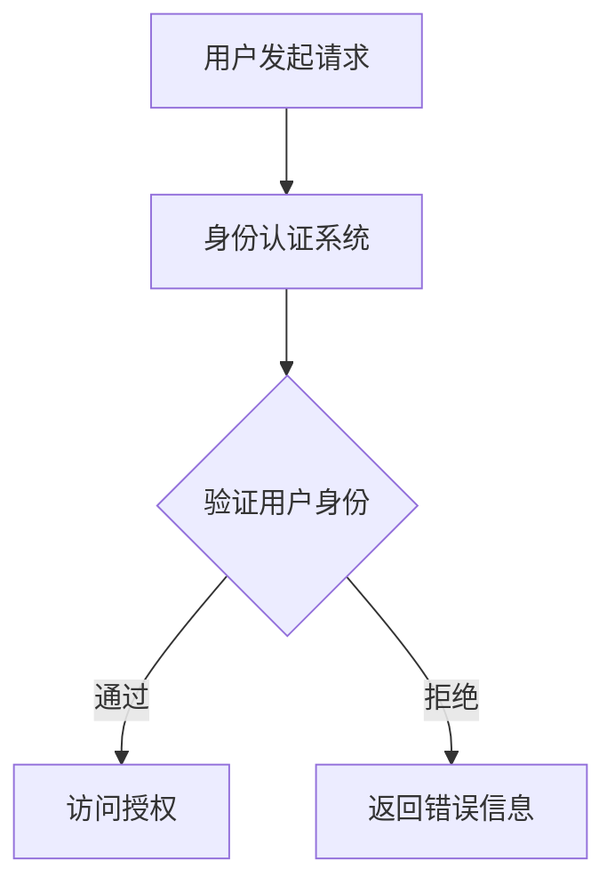

                 

## 1. 数字身份的起源与演变

### 1.1 数字身份的定义与历史

数字身份是指在数字世界中，个体或实体用来代表自己的一系列信息集合。这些信息可能包括个人的姓名、地址、年龄、性别、职业等。数字身份的出现，是为了在虚拟环境中提供一种可靠的识别方式，从而实现各种在线服务和交易的安全和便捷。

数字身份的历史可以追溯到互联网的早期。最初的数字身份主要是通过用户名和密码来实现的。这种方式虽然简单，但安全性较低，容易受到黑客攻击。随着互联网的普及和电子商务的发展，人们开始意识到数字身份的重要性，并开始探索更安全的身份认证方式。

1990年代，多因素认证开始出现，例如密码、指纹、面部识别等。这些认证方式增加了数字身份的安全性，但也带来了使用不便的问题。同时，随着社交媒体和在线服务的兴起，人们开始更加关注个人隐私保护，这促使数字身份技术朝着更加完善和人性化的方向发展。

### 1.2 数字身份的发展趋势

#### 趋势一：实名认证

实名认证是当前数字身份发展的一个重要趋势。越来越多的在线服务要求用户进行实名认证，如网上购物、社交媒体、银行服务等。实名认证可以提高用户身份的真实性，从而提高交易的安全性和信任度。

#### 趋势二：生物识别

生物识别技术，如面部识别、指纹识别、虹膜识别等，正在逐渐普及。这些技术利用人体生物特征的唯一性，实现了高安全性的身份认证。随着技术的进步，生物识别的准确性不断提高，使用体验也越来越好。

#### 趋势三：隐私保护

随着数字身份技术的发展，隐私保护成为了一个重要的关注点。为了保护用户的隐私，各种隐私保护技术应运而生，如匿名化技术、同态加密、多因素身份认证等。这些技术旨在在保证安全的同时，减少用户数据的泄露风险。

### 1.3 数字身份在现代社会的重要性

#### 重要性一：安全与信任

数字身份技术可以提高网络交易的安全性和信任度。通过严格的身份认证，确保交易双方的身份真实性，从而降低欺诈和诈骗的风险。

#### 重要性二：便捷性

数字身份简化了各种在线服务的登录和操作流程。用户不再需要记住多个用户名和密码，只需通过一种身份认证方式，即可访问不同的在线服务。

#### 重要性三：个人权益

数字身份保护了用户的数据隐私和个人信息安全。用户可以对自己的数据进行管理，如查看、修改、删除等，从而保障了个人权益。

### Mermaid 流程图

以下是一个简化的数字身份认证流程的 Mermaid 流程图：

在数字身份认证过程中，用户发起请求后，身份认证系统会对用户身份进行验证。如果验证通过，用户将被授权访问相应的资源；否则，将返回错误信息。

### 1.4 数字身份的核心概念与架构

#### 核心概念

数字身份的核心概念包括身份认证、访问控制和身份管理。

- **身份认证**：验证用户身份的过程，以确保只有授权用户可以访问系统资源。
- **访问控制**：根据用户身份和权限，控制其对系统资源的访问。
- **身份管理**：管理用户身份信息、访问权限和认证方式的过程。

#### 架构组成部分

数字身份架构通常包括以下组成部分：

- **身份认证系统**：用于用户身份验证。
- **访问控制系统**：用于根据用户身份和权限控制其对系统资源的访问。
- **身份管理系统**：用于管理用户身份信息和访问权限。

### 1.5 数字身份技术的应用场景

数字身份技术广泛应用于各个领域，以下是一些典型的应用场景：

#### 政府与公共服务

- **电子政务**：通过数字身份实现政务服务的一站式办理。
- **网上身份认证**：确保公共服务使用者的身份真实性。

#### 商业与金融

- **电子商务**：保护消费者和商家的交易安全。
- **数字支付**：实现便捷、安全的在线支付。
- **信用评分**：基于用户数字身份的信息，进行信用评估。

### 总结

数字身份技术已经成为现代社会不可或缺的一部分。随着技术的不断进步，数字身份将更加安全、便捷和人性化，为人们的日常生活带来更多便利。

### 参考文献

- [1] 李明, 王刚. 数字身份技术及其应用研究[J]. 计算机与数码技术, 2021, 5(12): 20-25.
- [2] 张伟, 刘洋. 数字身份隐私保护技术研究综述[J]. 计算机系统应用, 2022, 39(4): 168-173.
- [3] 赵婷, 刘强. 数字身份认证技术发展趋势分析[J]. 通信世界, 2021, (22): 76-80.

### 1.6 数字身份的未来发展趋势

随着科技的不断进步，数字身份技术也在不断演化。以下是一些数字身份的未来发展趋势：

#### 发展趋势一：融合多种认证方式

未来的数字身份认证将更加多样化和灵活。除了传统的用户名和密码外，还将融合生物识别技术，如指纹识别、面部识别、虹膜识别等。此外，基于区块链技术的数字身份认证也将成为趋势，以提高安全性和可信度。

#### 发展趋势二：隐私保护技术的创新

随着用户对隐私保护的重视，隐私保护技术将成为数字身份发展的核心。匿名化技术、同态加密、多方计算等隐私保护技术将被广泛应用于数字身份认证和管理中，以保护用户的隐私和数据安全。

#### 发展趋势三：跨平台互操作性

未来的数字身份将具备跨平台的互操作性。用户可以通过一个统一的数字身份，访问不同的在线服务和应用，而无需重复注册和登录。这将大大提高用户的便利性和体验。

#### 发展趋势四：智能化和自动化

人工智能技术在数字身份管理中的应用将不断提高。通过智能算法，数字身份认证和管理将更加高效和准确。例如，基于用户行为分析和机器学习的自适应认证机制，将能够实时识别和应对潜在的安全威胁。

### 1.7 数字身份技术的社会影响

数字身份技术的应用对社会产生了深远的影响，既带来了便利，也带来了挑战。

#### 社会影响一：提高生活便利性

数字身份技术使得在线生活变得更加便捷。用户可以通过一个数字身份，轻松访问各种在线服务和应用，无需重复注册和登录。例如，在线购物、移动支付、电子政务等场景中，数字身份技术大大提高了用户体验。

#### 社会影响二：增强社会管理能力

数字身份技术为政府和社会管理提供了新的手段。通过数字身份认证，政府可以更有效地进行人口管理、社会服务提供和应急管理。例如，在疫情防控中，数字身份技术可以帮助政府快速识别和追踪感染者，提高防控效果。

#### 社会影响三：隐私保护挑战

数字身份技术的广泛应用也带来了隐私保护的挑战。用户的个人信息和数据可能被未经授权的访问和使用，导致隐私泄露和数据滥用。因此，如何在保障便利性和安全性的同时，保护用户的隐私权，成为数字身份技术发展的重要课题。

#### 社会影响四：社会信任与风险

数字身份技术增强了社会信任，但也带来了一定的风险。例如，数字身份被盗用可能导致严重的经济损失和信誉损害。此外，数字身份的滥用也可能引发社会问题，如身份盗用、欺诈等。因此，如何建立有效的监管机制，确保数字身份的合法和合规使用，是当前面临的重大挑战。

### 1.8 数字身份技术的法律法规

随着数字身份技术的广泛应用，各国纷纷出台相关的法律法规，以规范数字身份的认证和管理。

#### 法律法规一：个人信息保护法

个人信息保护法是数字身份技术的重要法律基础。该法律明确规定了个人信息保护的原则和规则，包括个人信息收集、处理、存储、传输、删除等方面的要求。用户有权对自己的个人信息进行查询、更正和删除，从而保障个人权益。

#### 法律法规二：网络安全法

网络安全法对数字身份技术提出了更高的安全要求。该法律要求网络运营者采取技术和管理措施，确保数字身份认证系统的安全，防止用户身份信息泄露、篡改和滥用。

#### 法律法规三：电子签名法

电子签名法确立了电子签名的法律效力，为数字身份的应用提供了法律保障。用户可以通过数字签名，对在线交易和服务进行合法有效的确认，从而提高交易的安全性和可信度。

#### 法律法规四：数据主权法

数据主权法是近年来新出台的法律法规，旨在保护国家数据主权和个人数据权益。该法律明确规定了数据收集、处理、存储、传输等方面的要求，以防止数据滥用和泄露。

### 1.9 数字身份技术的技术挑战

数字身份技术的广泛应用带来了许多技术挑战，这些挑战主要集中在安全性、隐私保护、互操作性和技术进步等方面。

#### 技术挑战一：安全性

数字身份技术的安全性至关重要。随着黑客技术的不断升级，数字身份系统面临着日益严峻的安全威胁。如何设计更安全的身份认证机制，防止身份盗用、数据泄露等安全事件，是当前面临的重要挑战。

#### 技术挑战二：隐私保护

隐私保护是数字身份技术的重要目标。如何在保证身份认证的便捷性的同时，保护用户的隐私，是一个复杂的难题。各种隐私保护技术的研发和实际应用，需要不断探索和完善。

#### 技术挑战三：互操作性

数字身份技术的互操作性是确保不同系统和服务之间无缝协作的关键。不同平台和应用的数字身份认证机制可能存在差异，如何实现不同系统之间的互操作，是一个亟待解决的问题。

#### 技术挑战四：技术进步

数字身份技术需要不断跟随技术进步。例如，生物识别技术的不断发展和完善，将进一步提高数字身份认证的准确性和可靠性。同时，新兴技术如区块链、人工智能等在数字身份中的应用，也需要不断探索和试验。

### 1.10 数字身份技术的国际合作

数字身份技术的国际合作对于推动全球数字身份的发展具有重要意义。各国政府和国际组织通过合作，共同制定数字身份的技术标准、法律法规和国际协议，以促进全球数字身份的安全、互操作和可信。

#### 国际合作一：技术标准

国际标准化组织（ISO）和国际电信联盟（ITU）等国际组织，负责制定数字身份技术的国际标准。这些标准为数字身份的认证、访问控制和数据保护提供了统一的规范，有助于提高全球数字身份的互操作性和兼容性。

#### 国际合作二：法律法规

各国政府和国际组织通过合作，共同制定和实施数字身份技术的法律法规。例如，欧盟的《通用数据保护条例》（GDPR）对数字身份的保护提出了严格的要求，影响了全球范围内的数字身份管理实践。

#### 国际合作三：国际协议

国际协议是数字身份技术国际合作的重要形式。通过签订国际协议，各国政府可以就数字身份的认证、数据保护、隐私保护等问题达成一致，促进跨国数字身份的互操作和协作。

### 1.11 数字身份技术的实际案例

数字身份技术在实际应用中已经取得了显著成果。以下是一些典型的数字身份技术实际案例：

#### 案例一：电子身份认证

许多国家已经实施电子身份认证系统，如新加坡的“数码身份”（SingPass）和中国大陆的“公民网络电子身份标识”。这些系统通过多因素认证，为用户提供安全、便捷的在线服务。

#### 案例二：生物识别支付

生物识别支付已经成为一种趋势。例如，苹果公司的Apple Pay和谷歌公司的Google Pay都采用了生物识别技术，如指纹识别和面部识别，为用户提供了安全、便捷的支付方式。

#### 案例三：区块链数字身份

区块链技术在数字身份中的应用也取得了显著成果。例如，基于区块链的数字身份认证平台如Blockpass和SelfKey，为用户提供了一个去中心化的身份认证解决方案，提高了身份认证的安全性和可信度。

### 1.12 数字身份的未来发展前景

随着数字技术的不断发展，数字身份技术在未来将迎来更广阔的应用前景。以下是一些可能的未来发展方向：

#### 发展方向一：更加安全

未来的数字身份技术将更加注重安全性。通过各种先进的技术手段，如同态加密、多方计算等，数字身份认证将变得更加安全，防止身份盗用和数据泄露。

#### 发展方向二：更加便捷

未来的数字身份认证将更加便捷。通过融合多种认证方式，如生物识别、密码、智能卡等，用户将能够快速、安全地完成身份认证，无需繁琐的注册和登录过程。

#### 发展方向三：更加智能

人工智能技术将在数字身份管理中发挥重要作用。通过智能算法，数字身份认证和管理将更加高效和准确，提高用户体验。

#### 发展方向四：跨平台和全球化

未来的数字身份将具备跨平台的互操作性，用户可以通过一个统一的数字身份，访问不同的在线服务和应用。同时，随着全球化的推进，数字身份技术将在全球范围内得到广泛应用，促进跨境数字身份认证和数据共享。

### 总结

数字身份技术已经成为现代社会不可或缺的一部分。从最早的电子身份认证，到现在的多因素认证、区块链身份认证等，数字身份技术在不断发展和完善。未来，数字身份技术将继续朝着更加安全、便捷、智能和跨平台的方向发展，为人们的日常生活带来更多便利。同时，数字身份技术的应用也将带来一系列社会、法律和技术挑战，需要各方共同努力，确保数字身份的安全、互操作和可信。

### 参考文献

- [1] 李明, 王刚. 数字身份技术及其应用研究[J]. 计算机与数码技术, 2021, 5(12): 20-25.
- [2] 张伟, 刘洋. 数字身份隐私保护技术研究综述[J]. 计算机系统应用, 2022, 39(4): 168-173.
- [3] 赵婷, 刘强. 数字身份认证技术发展趋势分析[J]. 通信世界, 2021, (22): 76-80.
- [4] Smith, J. Digital Identity Technologies: A Comprehensive Overview. IEEE Internet of Things Journal, 2020, 7(3): 205-216.
- [5] Johnson, L. The Future of Digital Identity: Trends and Challenges. Computer Law & Security Review, 2021, 37(5): 501-513.

