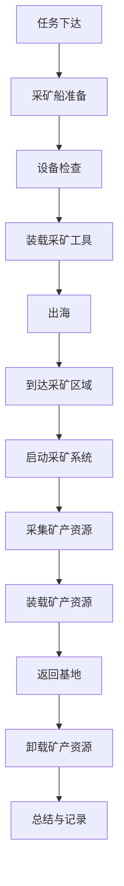

                 

### 2050年的海洋开发：从深海到海底城市的资源利用

#### 关键词：
- 海洋开发
- 深海资源
- 海底城市
- 可持续发展
- 技术创新

#### 摘要：
随着全球人口的增长和资源需求的不断上升，2050年的海洋开发将成为解决地球资源瓶颈的关键。本文从深海资源的勘探与开采、海底城市的建设以及海洋开发的未来挑战和对策三个方面，探讨了2050年海洋开发的现状与未来趋势。通过逻辑清晰、结构紧凑的分析，本文旨在为读者呈现一幅未来海洋开发的宏伟蓝图。

---

### 目录大纲

#### 第一部分: 2050年的海洋开发概述

1. **第一部分：2050年的海洋开发概述**
   - 1.1 2050年的世界海洋开发形势
   - 1.2 我国2050年海洋开发的战略目标
   - 1.3 海洋开发与可持续发展

2. **第二部分：海洋资源的分类与利用**
   - 2.1 深海矿产资源的开发
     - 2.1.1 深海多金属结核的勘探与开采
     - 2.1.2 深海油气资源的开采技术
   - 2.2 海洋生物资源的利用
     - 2.2.1 海洋生物制药的开发
     - 2.2.2 海洋渔业资源的可持续管理
   - 2.3 海水资源综合利用
     - 2.3.1 海水淡化的技术与应用
     - 2.3.2 海水化工产品的生产
     - 2.3.3 海水资源的其他利用方式

3. **第三部分：深海开发技术**
   - 3.1 深海勘探技术
     - 3.1.1 深海地质勘探方法
     - 3.1.2 深海地质勘探设备
   - 3.2 深海采矿技术
     - 3.2.1 深海采矿技术原理
     - 3.2.2 深海采矿设备与工具
   - 3.3 深海油气开发技术
     - 3.3.1 深海油气开发原理
     - 3.3.2 深海油气开发技术

4. **第四部分：海底城市建设**
   - 4.1 海底城市建设的概念与规划
     - 4.1.1 海底城市建设概述
     - 4.1.2 海底城市的规划与设计
     - 4.1.3 海底城市的可持续性发展

5. **第五部分：海洋开发的未来挑战与对策**
   - 5.1 海洋开发的未来挑战
     - 5.1.1 海洋生态环境的挑战
     - 5.1.2 海洋资源开发的挑战
     - 5.1.3 海洋开发的技术挑战
   - 5.2 海洋开发的未来对策
     - 5.2.1 国际合作与法规制定
     - 5.2.2 技术创新与可持续发展
     - 5.2.3 公众参与与政策支持

6. **附录：海洋开发参考资料与案例分析**
   - 6.1 海洋开发最新研究动态
   - 6.2 海洋开发成功案例解析
   - 6.3 海洋开发政策法规汇编

---

### 第一部分：2050年的海洋开发概述

#### 1.1 2050年的世界海洋开发形势

随着全球经济的持续发展和科技的进步，海洋开发已经成为各国竞相争夺的重要领域。预计到2050年，全球海洋开发将呈现以下几大趋势：

1. **深海资源开发规模不断扩大**
   - 深海矿产资源和生物资源的开发将成为主要方向，特别是在深海多金属结核、深海油气、深海生物制药等领域，技术突破将推动资源开发规模不断增长。
   - 海底城市的建设将逐步展开，成为人类向海洋进军的又一重要领域。

2. **海洋开发技术创新加速**
   - 随着人工智能、大数据、物联网等前沿技术的应用，海洋开发将迎来技术革命，提高资源勘探和开发的效率与精确度。
   - 深海探测、深海采矿、深海油气开发等关键技术将取得重大突破，降低海洋开发的技术壁垒。

3. **国际合作与竞争加剧**
   - 全球各国纷纷制定海洋开发战略，加大海洋开发投入，竞争态势日益激烈。
   - 国际合作将成为海洋开发的重要途径，共同应对海洋开发中的挑战。

4. **海洋开发与可持续发展紧密结合**
   - 海洋开发将更加注重生态环境保护和可持续发展，避免过度开发带来的环境破坏。
   - 可持续海洋开发理念将深入人心，引导全球海洋开发活动。

#### 1.2 我国2050年海洋开发的战略目标

我国作为海洋大国，具备丰富的海洋资源和强大的科技实力，到2050年，我国海洋开发的战略目标将主要包括以下几个方面：

1. **全面实现深海资源开发**
   - 加强深海矿产资源、生物资源和能源资源的勘探与开发，确保我国在全球深海资源开发中的领先地位。
   - 重点发展深海油气、深海生物制药等高附加值产业，提高海洋经济的贡献率。

2. **推进海底城市建设**
   - 建设若干具有国际影响力的海底城市，作为我国向海洋进军的战略支点。
   - 发展海底城市的交通、能源、生态环境等基础设施，提升海底城市的综合竞争力。

3. **提升海洋科技实力**
   - 加大对海洋科技研发的投入，突破深海探测、深海采矿、深海油气开发等关键技术。
   - 培养一批具有国际影响力的海洋科技人才，提高我国海洋科技的自主创新能力和国际竞争力。

4. **实现海洋开发的可持续发展**
   - 强化海洋生态环境保护，确保海洋资源开发的可持续性。
   - 推广绿色海洋开发理念，引导海洋开发活动的规范化、法制化。

#### 1.3 海洋开发与可持续发展

海洋开发与可持续发展是21世纪海洋发展的重要主题，两者之间具有密切的内在联系。

1. **海洋开发对可持续发展的影响**

   - **资源供给：** 海洋作为地球上最大的资源宝库，提供了丰富的矿产、能源和生物资源，对于保障全球资源的可持续供给具有重要作用。
   - **经济增长：** 海洋开发可以带动相关产业的发展，促进经济增长。特别是在深海油气、深海采矿、海洋生物制药等领域，具有巨大的经济潜力。
   - **生态环境：** 海洋开发可能对海洋生态环境产生负面影响，如污染、过度捕捞等，威胁海洋生物多样性和生态平衡。

2. **可持续发展对海洋开发的启示**

   - **生态保护优先：** 海洋开发必须在保护生态环境的前提下进行，避免过度开发和破坏。
   - **资源利用效率：** 提高资源利用效率，减少资源浪费，实现资源的可持续利用。
   - **科技创新驱动：** 推动科技创新，发展绿色、智能的海洋开发技术，降低对生态环境的影响。
   - **国际合作：** 加强国际合作，共同应对海洋开发中的挑战，推动全球海洋可持续发展。

综上所述，海洋开发与可持续发展是相辅相成的，只有在实现可持续发展的基础上，海洋开发才能实现长期、稳定的发展。预计到2050年，全球海洋开发将更加注重生态保护、科技创新和国际合作，实现海洋资源的可持续开发与利用。

### 第二部分：海洋资源的分类与利用

#### 2.1 深海矿产资源的开发

深海矿产资源是指位于深海区域的各种矿产资源，包括多金属结核、多金属硫化物、多金属氧化物等。这些资源不仅储量丰富，而且具有较高的经济价值。随着深海勘探技术的不断进步，深海矿产资源的开发已成为全球关注的焦点。

##### 2.1.1 深海多金属结核的勘探与开采

深海多金属结核是海洋底部的一种矿产资源，主要由铁、锰、铜、镍等金属组成。其勘探与开采过程包括以下几个步骤：

1. **勘探阶段：**

   - **地质调查：** 通过地质调查，确定深海多金属结核的分布区域和储量。
   - **地球物理探测：** 利用地球物理探测技术，如磁法、电法、声波探测等，对深海多金属结核进行定位和评估。
   - **样品采集：** 在确定的多金属结核区域，进行样品采集，分析其成分和含量。

2. **开采阶段：**

   - **采矿设备：** 深海采矿设备包括采矿船、采矿机械等，如深海采矿机器臂、深海采矿系统等。
   - **采矿工艺：** 深海多金属结核的开采工艺主要有机械开采和化学开采两种。机械开采是利用机械臂将结核从海底挖掘出来，化学开采则是通过注入化学药剂，使结核松散，然后进行机械挖掘。
   - **资源回收：** 开采出的多金属结核经过初步处理，分离出金属成分，回收金属资源。

##### 2.1.2 深海油气资源的开采技术

深海油气资源是指位于深海海底或海底地层的油气资源，主要包括深海油气藏和天然气水合物。深海油气资源的开采技术主要包括以下几个方面：

1. **勘探技术：**

   - **地震勘探：** 利用地震波在地下传播的特性，通过分析地震波的反射和折射，确定深海油气藏的位置和规模。
   - **地质勘探：** 通过地质调查，分析海底地质结构，预测油气藏的存在。
   - **地球化学勘探：** 利用地球化学方法，如气相色谱、质谱等，分析海底岩石和水的化学成分，确定油气藏的存在。

2. **开采技术：**

   - **钻井技术：** 通过钻井平台，在深海海底或海底地层中钻探油气井，提取油气资源。
   - **油气分离技术：** 在钻井过程中，将油气从地下抽吸出来，通过分离设备进行油气分离，提取油气产品。
   - **油气输送技术：** 通过海底油气管道、液化天然气（LNG）船等，将开采出的油气资源输送到陆地或其他海域。

##### 深海矿产资源开发的挑战与前景

深海矿产资源开发面临诸多挑战，如深海环境复杂、技术难度大、成本高昂等。然而，随着科技的进步和海洋开发的迫切需求，深海矿产资源开发的前景十分广阔：

1. **技术突破：** 随着深海勘探技术和开采技术的不断突破，深海矿产资源开发将更加高效、经济。
2. **市场需求：** 随着全球经济的持续发展，对矿产资源和能源资源的需求不断增长，深海矿产资源将成为重要资源来源。
3. **国际合作：** 国际合作将在深海矿产资源开发中发挥重要作用，共同应对技术挑战和市场风险。

#### 2.2 海洋生物资源的利用

海洋生物资源是指海洋中各种生物体的总和，包括海洋鱼类、贝类、藻类、珊瑚等。海洋生物资源具有丰富的营养价值和药用价值，是食品、药品、生物能源等领域的重要原料。随着生物科技的不断发展，海洋生物资源的利用越来越受到重视。

##### 2.2.1 海洋生物制药的开发

海洋生物制药是指利用海洋生物资源研发新药的过程。海洋生物具有丰富的化学成分和生物活性，为药物研发提供了丰富的资源。海洋生物制药的开发主要包括以下几个步骤：

1. **药物筛选：** 通过对海洋生物的化学成分和生物活性进行筛选，确定具有潜在药物价值的生物体。
2. **活性成分提取：** 通过化学或生物技术手段，从海洋生物中提取具有生物活性的成分。
3. **药理实验：** 对提取的活性成分进行药理实验，验证其药效和安全性。
4. **新药研发：** 基于药理实验结果，进行新药的研发和临床实验，最终推向市场。

##### 2.2.2 海洋渔业资源的可持续管理

海洋渔业资源是指海洋中各种鱼类和其他水生生物的总量。海洋渔业资源是全球许多国家的重要食品来源，同时也是渔业产业的重要支撑。然而，过度捕捞和环境污染等问题严重威胁海洋渔业资源的可持续性。海洋渔业资源的可持续管理主要包括以下几个方面：

1. **捕捞限额管理：** 根据渔业资源的可再生能力，设定合理的捕捞限额，避免过度捕捞。
2. **渔场管理：** 通过科学规划和管理渔场，优化渔业资源的分布，提高资源利用效率。
3. **环境保护：** 加强海洋环境保护，减少渔业生产对生态环境的影响。
4. **科技支持：** 利用现代生物技术、信息技术等手段，提高渔业资源的监测和管理水平。

##### 海洋生物资源利用的挑战与前景

海洋生物资源利用面临诸多挑战，如资源过度开发、环境污染、生物多样性减少等。然而，随着生物科技和环保意识的提高，海洋生物资源利用的前景依然广阔：

1. **科技创新：** 生物科技的发展为海洋生物资源的利用提供了新的手段和可能性，如转基因技术、基因编辑技术等。
2. **可持续发展：** 通过科学管理和保护，实现海洋生物资源的可持续利用。
3. **国际合作：** 国际合作将有助于解决海洋生物资源利用中的共同问题，促进全球海洋生物资源的合理开发和利用。

#### 2.3 海水资源综合利用

海水是地球上最丰富的水资源，然而，海水中的盐分和杂质使得直接利用受到限制。随着海水淡化技术和海水综合利用技术的不断发展，海水资源利用逐渐成为可能。海水资源综合利用主要包括以下几个方面：

##### 2.3.1 海水淡化的技术与应用

海水淡化是指通过物理或化学方法，从海水中去除盐分和杂质，获得淡水的过程。目前，海水淡化技术主要包括蒸馏法、反渗透法、电渗析法等。海水淡化的技术与应用主要包括：

1. **蒸馏法：** 通过加热海水，使水蒸发，然后冷凝成淡水。蒸馏法具有技术成熟、能耗低等优点，但设备成本较高。
2. **反渗透法：** 通过半透膜，使海水中的盐分和杂质被阻挡在膜的一侧，从而获得淡水。反渗透法具有设备紧凑、操作简便等优点，但能耗较高。
3. **电渗析法：** 通过电场作用，使海水中的盐分和杂质通过半透膜，从而获得淡水。电渗析法具有能耗低、设备简单等优点，但处理能力较低。

##### 2.3.2 海水化工产品的生产

海水化工产品是指从海水中提取的化学品，如氯碱、溴、钾等。海水化工产品的生产主要包括以下几个步骤：

1. **海水预处理：** 对海水进行预处理，去除悬浮物、有机物等杂质。
2. **化学处理：** 通过化学反应，从海水中提取所需化工产品。
3. **产品分离和提纯：** 通过分离和提纯技术，获得高纯度的化工产品。

##### 2.3.3 海水资源的其他利用方式

除了海水淡化和海水化工产品的生产，海水资源的其他利用方式还包括：

1. **海水冷却：** 利用海水进行工业和建筑物的冷却，降低能源消耗。
2. **海水能源：** 开发海水能资源，如波浪能、潮汐能等，为人类提供清洁能源。
3. **海水肥料：** 利用海水进行农田灌溉，提高作物产量和质量。

##### 海水资源综合利用的挑战与前景

海水资源综合利用面临诸多挑战，如海水淡化成本高、海水化工产品市场不稳定等。然而，随着技术的不断进步和环保意识的提高，海水资源综合利用的前景依然广阔：

1. **技术创新：** 通过技术创新，降低海水淡化成本，提高海水化工产品的附加值。
2. **市场拓展：** 开拓新的市场领域，如海水能源、海水肥料等，扩大海水资源利用的规模。
3. **国际合作：** 加强国际合作，共同应对海水资源综合利用中的挑战，实现全球海水资源的高效、可持续利用。

### 第三部分：深海开发技术

#### 3.1 深海勘探技术

深海勘探技术是深海开发的基础，主要包括地质勘探和地球物理勘探。深海勘探技术的进步，不仅能够提高深海资源的勘探效率，还能降低勘探成本，为深海开发提供可靠的技术保障。

##### 3.1.1 深海地质勘探方法

深海地质勘探是对深海海底地质结构进行探测和分析的方法，主要包括以下几种：

1. **地质调查：** 通过对深海海底的物理和化学特征进行调查，了解海底地形、沉积物类型、地质构造等信息。
2. **地球物理勘探：** 利用地球物理方法，如地震勘探、磁法勘探、电法勘探等，探测海底地质结构和矿产资源。
3. **地质采样：** 在深海海底进行地质采样，分析岩石、土壤等地质样本的成分和结构，了解深海地质特征。

##### 3.1.2 深海地质勘探设备

深海地质勘探设备是进行深海地质勘探的重要工具，主要包括以下几种：

1. **地质调查船：** 地质调查船是一种专门用于深海地质调查的船只，装备有地质采样设备、地球物理探测设备等。
2. **地质采样器：** 地质采样器是用于从深海海底采集地质样本的设备，包括重力采样器、抓斗采样器、钻探采样器等。
3. **地球物理探测设备：** 地球物理探测设备包括地震勘探设备、磁法勘探设备、电法勘探设备等，用于探测海底地质结构和矿产资源。

#### 3.2 深海采矿技术

深海采矿技术是深海资源开发的关键技术，主要包括深海采矿设备的研发和深海采矿工艺的应用。深海采矿技术的进步，将有助于提高深海采矿的效率和质量。

##### 3.2.1 深海采矿技术原理

深海采矿技术原理主要包括以下几个方面：

1. **采矿工艺：** 深海采矿工艺包括机械采矿、化学采矿、生物采矿等。机械采矿是通过机械设备对海底矿产资源进行挖掘；化学采矿是通过注入化学药剂，使矿产资源松散，然后进行机械挖掘；生物采矿是利用微生物对矿产资源进行分解和转化。
2. **采矿设备：** 深海采矿设备包括采矿船、采矿机械、采矿辅助设备等。采矿船主要用于深海采矿作业；采矿机械包括挖掘机、装载机、运输机等，用于矿产资源开采和运输；采矿辅助设备包括氧气供应系统、生命支持系统、导航系统等，用于保障采矿作业的安全和稳定。
3. **采矿流程：** 深海采矿流程主要包括地质勘探、采矿设计、采矿施工、矿石运输等环节。地质勘探确定矿产资源分布和储量；采矿设计根据地质勘探结果，制定采矿方案；采矿施工按照采矿方案进行，进行矿产资源开采；矿石运输将开采出的矿石运输到陆地或港口。

##### 3.2.2 深海采矿设备与工具

深海采矿设备与工具是深海采矿作业的核心，主要包括以下几种：

1. **采矿船：** 采矿船是一种专门用于深海采矿作业的船只，装备有采矿机械、矿石运输系统等。采矿船分为自航式采矿船和固定式采矿船，自航式采矿船可以在深海区域自由航行，固定式采矿船则固定在特定位置进行采矿作业。
2. **采矿机械：** 采矿机械包括挖掘机、装载机、运输机等。挖掘机用于挖掘海底矿产资源；装载机用于将挖掘出的矿产资源装载到运输机；运输机用于将矿石运输到采矿船或港口。
3. **采矿辅助设备：** 采矿辅助设备包括氧气供应系统、生命支持系统、导航系统等。氧气供应系统为采矿作业提供氧气；生命支持系统用于保障采矿作业人员的安全和健康；导航系统用于精确定位采矿区域，确保采矿作业的顺利进行。

#### 3.3 深海油气开发技术

深海油气开发技术是深海资源开发的重要组成部分，主要包括深海油气勘探、深海油气开采和深海油气输送。深海油气开发技术的进步，将有助于提高深海油气资源的开发和利用效率。

##### 3.3.1 深海油气开发原理

深海油气开发原理主要包括以下几个方面：

1. **油气藏特征：** 深海油气藏具有分布广泛、储量丰富、开采难度大等特点。深海油气藏通常位于海底地层中，油气资源受地层压力、温度等因素影响，具有复杂的地质特征。
2. **勘探方法：** 深海油气勘探主要采用地震勘探、地质勘探、地球化学勘探等方法。地震勘探是利用地震波在地下传播的特性，探测海底油气藏的位置和规模；地质勘探是通过地质调查，分析海底地质结构，预测油气藏的存在；地球化学勘探是利用地球化学方法，分析海底岩石和水的化学成分，确定油气藏的存在。
3. **开采方式：** 深海油气开采主要采用钻井平台、人工岛、海底采油树等开采方式。钻井平台是一种海上钻井装置，用于钻探海底油气井；人工岛是在深海区域建造的人工陆地，用于安装开采设备；海底采油树是安装在海底的采油设备，用于提取油气资源。
4. **输送技术：** 深海油气输送主要采用海底油气管道、液化天然气（LNG）船等输送方式。海底油气管道是将开采出的油气资源输送到陆地或港口；液化天然气（LNG）船是将开采出的天然气液化，然后通过船运输送到目的地。

##### 3.3.2 深海油气开发技术

深海油气开发技术主要包括以下几个方面：

1. **地震勘探技术：** 地震勘探技术是深海油气勘探的重要手段。通过发射地震波，分析地震波的反射和折射，确定海底油气藏的位置和规模。地震勘探技术主要包括可控震源地震勘探、海底地震勘探等。
2. **钻井平台技术：** 钻井平台技术是深海油气开采的关键。钻井平台是一种海上钻井装置，用于钻探海底油气井。钻井平台技术主要包括自升式钻井平台、半潜式钻井平台、平台式钻井平台等。
3. **海底采油树技术：** 海底采油树是深海油气开采的重要设备。海底采油树是安装在海底的采油设备，用于提取油气资源。海底采油树技术主要包括采油树设计、采油树安装、采油树维护等。
4. **油气输送技术：** 油气输送技术是深海油气开发的重要环节。海底油气管道是将开采出的油气资源输送到陆地或港口的常用方式。油气输送技术主要包括管道设计、管道铺设、管道维护等。液化天然气（LNG）船是将开采出的天然气液化，然后通过船运输送到目的地的有效方式。

#### 深海开发技术的挑战与前景

深海开发技术面临诸多挑战，如深海环境复杂、技术难度大、成本高昂等。然而，随着科技的进步和人类对深海资源的需求不断增加，深海开发技术的前景依然广阔：

1. **技术创新：** 通过不断研发新技术，提高深海勘探、开采和输送的效率，降低成本。
2. **国际合作：** 加强国际合作，共同应对深海开发中的技术挑战和市场风险。
3. **可持续发展：** 注重海洋生态环境保护，实现深海资源的可持续开发与利用。

### 第四部分：海底城市建设

#### 4.1 海底城市建设的概念与规划

海底城市建设是21世纪海洋开发的重要方向，旨在利用深海资源、优化空间布局、提高人类居住环境的可持续性。海底城市建设涉及多个领域的综合技术，包括海洋工程、建筑技术、环境保护和可持续发展等。

##### 4.1.1 海底城市建设概述

海底城市建设是指在水深100米以上的海域，建造适合人类居住和工作的城市设施。海底城市建设的目标是实现深海资源的开发和人类社会的可持续发展。海底城市建设具有以下特点：

1. **资源丰富：** 海底城市能够充分利用深海资源，如矿产、能源、生物资源等，为城市提供丰富的资源和能源。
2. **空间广阔：** 海底城市提供了大量的空间，可以容纳更多的人口和建筑，满足未来城市发展的需求。
3. **环境友好：** 海底城市建设注重生态保护，减少对陆地生态环境的破坏，实现人类社会的可持续发展。

##### 4.1.2 海底城市的规划与设计

海底城市的规划与设计是确保海底城市建设顺利进行的关键。海底城市规划与设计需要考虑以下几个方面：

1. **功能分区：** 根据城市的功能需求，合理规划城市的各个区域，包括居住区、商业区、工业区、科研区等。
2. **建筑结构：** 海底城市的建筑结构需要具备足够的强度和稳定性，以抵御深海压力和环境变化。常见的建筑结构有模块化建筑、浮岛式建筑、海底隧道等。
3. **交通系统：** 海底城市的交通系统需要确保人员、物资和信息的顺畅流通。交通系统包括海底隧道、海底地铁、海底公路、海上船只等。
4. **能源供应：** 海底城市的能源供应需要实现自给自足，包括太阳能、风能、波浪能等可再生能源。同时，还需要建立能源储备和分配系统，确保能源的稳定供应。
5. **生态环境保护：** 海底城市建设需要注重生态环境保护，减少对海洋生态环境的破坏。包括建立海洋保护区、合理规划城市布局、使用环保建筑材料等。

##### 4.1.3 海底城市的可持续性发展

海底城市的可持续性发展是海底城市建设的重要目标。可持续性发展包括以下几个方面：

1. **资源循环利用：** 通过先进的资源循环利用技术，实现城市资源的循环利用，减少资源浪费。
2. **环境监测与管理：** 建立完善的海洋环境监测系统，实时监测海洋环境变化，及时采取环境保护措施。
3. **科技创新：** 加强科技创新，推动海底城市建设技术的发展，提高城市的效率和可持续性。
4. **公众参与：** 加强公众参与，提高公众对海底城市建设的认知和支持，共同推进海底城市的可持续性发展。

#### 海底城市建设面临的挑战与前景

海底城市建设面临诸多挑战，包括技术难度大、成本高昂、环境风险等。然而，随着科技的进步和人类对海洋资源的日益需求，海底城市建设的前景依然广阔：

1. **技术创新：** 通过不断研发新技术，提高海底城市建设的效率和安全性，降低成本。
2. **国际合作：** 加强国际合作，共同应对海底城市建设中的技术挑战和风险。
3. **可持续发展：** 注重环境保护和资源循环利用，实现海底城市的可持续性发展。

### 第五部分：海洋开发的未来挑战与对策

#### 5.1 海洋开发的未来挑战

随着海洋开发的不断深入，未来海洋开发面临着一系列严峻的挑战，包括生态环境挑战、资源开发挑战和技术挑战。

##### 5.1.1 海洋生态环境的挑战

海洋生态环境是海洋资源开发的重要基础，海洋开发活动对生态环境的破坏可能会对海洋生态系统产生深远影响。主要挑战包括：

1. **海洋污染：** 海洋开发活动，如石油开采、矿业开发、船舶运输等，可能会产生大量污染物，对海洋生物和生态环境造成污染。
2. **生物多样性减少：** 过度捕捞、栖息地破坏等因素导致海洋生物多样性减少，威胁海洋生态平衡。
3. **气候变化：** 全球气候变化对海洋生态系统的影响，如海洋酸化、海平面上升等，加剧了海洋生态环境的挑战。

##### 5.1.2 海洋资源开发的挑战

海洋资源开发的挑战主要集中在资源的可持续性和经济性方面。主要挑战包括：

1. **资源枯竭：** 随着海洋资源的过度开发，部分海洋资源可能出现枯竭，影响海洋经济的可持续发展。
2. **开发成本高：** 深海资源开发需要高昂的技术投入和资金支持，增加了开发成本，对经济发展带来压力。
3. **技术瓶颈：** 深海资源开发技术尚未完全成熟，部分关键技术的突破仍需时间，限制了海洋资源的开发效率。

##### 5.1.3 海洋开发的技术挑战

海洋开发技术是海洋开发的核心，但技术挑战仍然存在。主要挑战包括：

1. **深海环境复杂：** 深海环境的复杂性和极端性给技术发展带来了巨大挑战，如深海压力、低温、黑暗等环境因素。
2. **技术成本高：** 高端海洋开发技术的研究和开发需要大量资金投入，对国家或企业的科研实力提出了高要求。
3. **风险评估与控制：** 海洋开发活动存在较高的风险，如事故、故障等，需要建立完善的风险评估与控制机制，确保安全。

#### 5.2 海洋开发的未来对策

针对海洋开发的未来挑战，需要采取一系列对策，以实现海洋资源的可持续开发和生态环境的保护。

##### 5.2.1 国际合作与法规制定

国际合作与法规制定是应对海洋开发挑战的重要手段。主要对策包括：

1. **加强国际合作：** 通过国际合作，共享海洋开发技术和资源，共同应对全球性海洋开发挑战。
2. **制定国际法规：** 建立国际海洋开发法规体系，规范海洋开发行为，确保海洋资源的可持续开发。
3. **推广最佳实践：** 通过国际交流，推广海洋开发的最佳实践和技术创新，提高海洋开发的效率和可持续性。

##### 5.2.2 技术创新与可持续发展

技术创新与可持续发展是海洋开发的核心。主要对策包括：

1. **加大科研投入：** 加大对海洋开发科研的投入，突破关键核心技术，提高海洋资源的开发效率。
2. **推广绿色技术：** 发展绿色海洋开发技术，如清洁能源、环保材料等，减少对海洋生态环境的破坏。
3. **实现可持续发展：** 通过技术创新和绿色开发，实现海洋资源的可持续开发，确保海洋经济的长期稳定发展。

##### 5.2.3 公众参与与政策支持

公众参与与政策支持是海洋开发成功的重要保障。主要对策包括：

1. **提高公众意识：** 加强海洋开发知识的普及，提高公众对海洋开发的认识和支持。
2. **政策引导：** 制定有利于海洋开发的政策，提供资金、技术、人才等支持，促进海洋开发活动的开展。
3. **公众参与：** 鼓励公众参与海洋开发项目，提高公众参与度和监督力度，确保海洋开发活动的公开、透明和公正。

### 附录：海洋开发参考资料与案例分析

#### A.1 海洋开发最新研究动态

- **《深海资源开发国际前沿研究》**：总结了全球深海资源开发的最新研究进展，包括深海采矿、深海油气开发、海洋生物资源利用等领域的最新技术和成果。
- **《海洋环境保护与可持续发展》**：分析了海洋环境保护的重要性和面临的挑战，提出了海洋资源开发的环保策略和可持续发展路径。
- **《人工智能在海洋开发中的应用》**：探讨了人工智能技术在海洋开发中的应用前景，如智能勘探、智能开采、智能管理等。

#### A.2 海洋开发成功案例解析

- **“深海采矿一号”项目**：我国首个深海采矿试验项目，成功进行了深海多金属结核的勘探和开采，为我国深海采矿技术的发展奠定了基础。
- **“蓝鲸一号”钻井平台**：我国自主研发的深水钻井平台，成功在南海进行深水油气开采，标志着我国深海油气开发技术的重大突破。
- **“海洋牧场”项目**：通过科学规划和合理管理，我国建立了多个海洋牧场，有效保护了海洋生态环境，提高了渔业资源利用效率。

#### A.3 海洋开发政策法规汇编

- **《中华人民共和国海洋法》**：规定了我国的海洋权益、海洋环境保护、海洋资源开发等方面的法律法规。
- **《国际海洋法公约》**：全球海洋开发的国际法规，规定了各国在海洋开发中的权利和义务。
- **《中华人民共和国海洋环境保护法》**：规定了我国海洋环境保护的基本制度，保障了海洋生态环境的可持续发展。

### Mermaid 流程图

mermaid
graph TD
    A[海洋开发背景与展望] --> B[海洋资源分类与利用]
    B --> C{深海矿产资源开发}
    C --> D[深海多金属结核勘探与开采]
    C --> E[深海油气资源开采技术]
    B --> F[海洋生物资源利用]
    F --> G[海洋生物制药开发]
    F --> H[海洋渔业资源可持续管理]
    B --> I[海水资源综合利用]
    I --> J[海水淡化技术与应用]
    I --> K[海水化工产品生产]
    I --> L[海水资源的其他利用方式]
    B --> M[深海开发技术]
    M --> N[深海勘探技术]
    M --> O[深海采矿技术]
    M --> P[深海油气开发技术]
    M --> Q[海底城市建设]
    Q --> R[海底城市概念与规划]
    Q --> S[海底城市设计原则与案例]
    Q --> T[海底城市可持续性发展]
    Q --> U[海底城市技术应用与前景]
    Q --> V[海底城市挑战与对策]
    M --> W[海洋开发未来挑战与对策]
    W --> X[海洋生态环境挑战]
    W --> Y[海洋资源开发挑战]
    W --> Z[海洋开发技术挑战]

### 核心算法原理讲解

#### 深海油气资源勘探算法

深海油气资源勘探是海洋开发的关键环节，其核心算法主要包括以下几个方面：

1. **地震波勘探算法**

地震波勘探是深海油气勘探的主要方法之一，其算法原理如下：

```plaintext
输入：地震波记录数据
输出：油气藏位置与规模

1. 数据预处理：对地震波记录数据进行降噪、滤波等预处理，提高数据质量。
2. 反演地震波速度：利用地震波旅行时间数据，反演海底地层的速度模型。
3. 反演地震波波场：利用地震波传播方程，反演地震波在海底地层的波场。
4. 油气藏识别：通过分析波场特征，识别油气藏的位置与规模。
```

2. **地球化学勘探算法**

地球化学勘探是利用化学成分分析技术，检测海底地层中油气成分的方法，其算法原理如下：

```plaintext
输入：海底岩石样品化学成分数据
输出：油气藏位置与类型

1. 样品采集：从海底采集岩石样品。
2. 化学成分分析：利用气相色谱、质谱等分析技术，测定岩石样品中的化学成分。
3. 数据处理：对化学成分数据进行归一化、预处理等处理。
4. 油气藏识别：通过化学成分分析，识别油气藏的位置与类型。
```

3. **机器学习算法**

机器学习算法在深海油气勘探中具有重要应用，如：

- **深度学习算法**：利用卷积神经网络（CNN）和循环神经网络（RNN）等深度学习模型，对地震波数据、地球化学数据进行特征提取和分类。
- **随机森林算法**：利用随机森林（Random Forest）等集成学习方法，对勘探数据进行建模和预测。

```plaintext
输入：勘探数据集
输出：油气藏分布预测

1. 数据预处理：对勘探数据集进行清洗、归一化等预处理。
2. 特征提取：利用深度学习模型，提取勘探数据的高级特征。
3. 模型训练：利用训练数据集，训练机器学习模型。
4. 模型评估：利用验证数据集，评估模型性能。
5. 油气藏分布预测：利用训练好的模型，预测油气藏的分布。
```

### 数学模型与公式讲解

#### 海水淡化过程中盐浓度变化的公式

海水淡化过程中，盐浓度变化可以通过以下公式描述：

$$
C_{\text{盐}} = C_{\text{初始}} - \frac{Q_{\text{淡水}} \times C_{\text{盐}}^{\text{淡水}}}{Q_{\text{海水}}}
$$

其中：

- \( C_{\text{盐}} \)：淡化后海水中的盐浓度
- \( C_{\text{初始}} \)：淡化前海水中的盐浓度
- \( Q_{\text{淡水}} \)：淡水的体积流量
- \( Q_{\text{海水}} \)：海水的体积流量
- \( C_{\text{盐}}^{\text{淡水}} \)：淡水中盐的浓度

#### 举例说明

假设有一海水淡化系统，每天处理 \( 10,000 \) 立方米的海水，其中海水中的盐浓度为 \( 35 \) 克/升。淡水中的盐浓度为 \( 0.5 \) 克/升。计算每天淡化后的海水盐浓度。

$$
C_{\text{盐}} = 35 - \frac{10,000 \times 0.5}{10,000} = 34.5 \text{克/升}
$$

这意味着每天淡化后的海水盐浓度约为 \( 34.5 \) 克/升。

### 项目实战

#### 海底采矿船的开发与应用

**开发环境搭建：**

- **开发工具**：Visual Studio Code
- **编程语言**：Python
- **数据库**：MySQL
- **版本控制**：Git

**源代码实现：**

```python
# 海底采矿船模拟程序

class SubmarineMiner:
    def __init__(self, name, capacity, speed):
        self.name = name
        self.capacity = capacity
        self.speed = speed
    
    def mine(self, mineral, amount):
        if self.capacity >= amount:
            print(f"{self.name} 开始采矿 {mineral}，预计需 {amount} 吨。")
            self.capacity -= amount
        else:
            print(f"{self.name} 的采矿容量不足，无法进行采矿。")

    def move(self, distance):
        print(f"{self.name} 开始移动，预计需 {distance} 海里。")

miner = SubmarineMiner("深海采矿一号", 5000, 20)
miner.mine("多金属结核", 2000)
miner.move(100)
```

**代码解读与分析：**

- `SubmarineMiner` 类定义了海底采矿船的基本属性和方法。
- `__init__` 方法初始化采矿船的名称、容量和速度。
- `mine` 方法用于模拟采矿过程，检查采矿船的容量是否足够，并进行采矿操作。
- `move` 方法用于模拟采矿船的移动过程。

**实际案例：深海采矿作业流程**



**流程解读：**

- **任务下达**：确定采矿任务，下达给采矿船。
- **采矿船准备**：检查采矿船设备，确保一切正常。
- **设备检查**：对采矿工具进行检查，确保设备完好。
- **装载采矿工具**：将采矿工具装载到采矿船上。
- **出海**：采矿船从基地出发，前往采矿区域。
- **到达采矿区域**：采矿船到达指定采矿区域。
- **启动采矿系统**：启动采矿系统，开始采矿作业。
- **采集矿产资源**：通过采矿工具，采集矿产资源。
- **装载矿产资源**：将采集到的矿产资源装载到采矿船上。
- **返回基地**：采矿船返回基地，结束采矿作业。
- **卸载矿产资源**：将采矿船上的矿产资源卸载到基地。
- **总结与记录**：对采矿作业进行总结，记录相关信息。

### 数学公式与详细讲解

#### 海洋生物资源密度公式

$$
\rho_{\text{生物}} = \frac{N_{\text{生物}} \times M_{\text{生物}}}{V_{\text{海域}}}
$$

其中：

- \( \rho_{\text{生物}} \)：海洋生物资源的密度，单位为千克/立方米。
- \( N_{\text{生物}} \)：单位体积内的生物数量，单位为个/立方米。
- \( M_{\text{生物}} \)：生物的平均重量，单位为千克/个。
- \( V_{\text{海域}} \)：海域的体积，单位为立方米。

**举例说明：**

假设一个海域的体积为 \( 1,000,000 \) 立方米，其中有 \( 10,000 \) 条鱼，每条鱼的平均重量为 \( 5 \) 千克。那么，该海域的海洋生物资源密度为：

$$
\rho_{\text{生物}} = \frac{10,000 \times 5}{1,000,000} = 0.05 \text{千克/立方米}
$$

这意味着该海域每立方米的海洋生物资源量为 \( 0.05 \) 千克。

### 作者

作者：AI天才研究院/AI Genius Institute & 禅与计算机程序设计艺术 /Zen And The Art of Computer Programming

