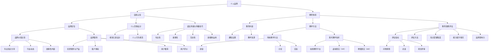

                 

### 引言：个人品牌的重要性

在信息爆炸和数字化时代，个人品牌已经成为人们成功的关键因素之一。个人品牌不仅是个人形象的象征，更是专业能力和价值的体现。一个强有力的个人品牌可以帮助个人在职业领域脱颖而出，赢得更多的机会和资源。

#### 1.1 个人品牌的概念与价值

**个人品牌** 是指个人在公众心目中的形象和声誉，包括个人的专业技能、行为风格、价值观念等多个方面。一个成功的个人品牌能够让个人在竞争激烈的环境中脱颖而出，赢得更多的关注和尊重。

个人品牌的价值体现在以下几个方面：

1. **增强竞争力**：个人品牌能够突出个人的专业能力和优势，使个人在职场竞争中更具竞争力。
2. **拓展人脉**：一个有影响力的个人品牌可以吸引更多的同行和潜在合作伙伴，有助于拓展人脉资源。
3. **提高影响力**：个人品牌的建设有助于个人在专业领域内建立权威，提升个人的社会影响力。
4. **增加收入**：个人品牌的建设可以为个人带来更多的商业机会，从而提高收入水平。

#### 1.2 教育体系的必要性

在个人品牌的建设过程中，一个系统化的教育体系是不可或缺的。教育体系不仅能够提供知识和技能的传授，还能够帮助个人明确职业发展方向，提升个人品牌的价值。

**教育体系的必要性** 主要体现在以下几个方面：

1. **系统化学习**：教育体系可以帮助个人有针对性地学习所需的知识和技能，避免盲目和无序的学习。
2. **职业规划**：教育体系可以为个人提供职业规划指导，帮助个人明确职业目标和发展路径。
3. **品牌建设**：教育体系中的专业知识传授和实践机会有助于个人在专业领域内建立权威和声誉，提升个人品牌。
4. **持续成长**：教育体系提供了持续学习的平台，使个人能够不断更新知识和技能，保持竞争力。

#### 1.3 本书的目标与结构

本书的目标是帮助读者建立并维护一个成功的个人品牌，通过系统化的教育体系提升个人品牌的价值。本书的结构分为以下章节：

- **第1章 引言**：介绍个人品牌的重要性以及本书的目标与结构。
- **第2章 个人品牌构建基础**：探讨个人品牌构建的基础，包括自我认知与定位、个人品牌形象塑造等。
- **第3章 教育体系构建**：详细讲解教育体系的概念、目标以及教育内容的规划与教学方法的应用。
- **第4章 教育体系的执行与评估**：介绍教育内容的执行过程和教育效果的评估方法。
- **第5章 个人品牌的传播与维护**：探讨个人品牌传播的策略和品牌口碑的管理。
- **第6章 个人品牌案例解析**：分析成功和失败的个人品牌案例，提供实用的经验教训。
- **第7章 高级策略：构建个人品牌学院**：讨论如何构建个人品牌学院以及如何持续成长与优化。
- **第8章 结论与展望**：总结本书的主要内容，并对未来发展趋势进行分析。

通过本书的指导，读者将能够系统地了解个人品牌建设和教育体系构建的方法和策略，从而在职业发展中取得更大的成功。

### 个人品牌构建基础

在构建个人品牌的过程中，基础工作是至关重要的。这一章节将探讨个人品牌构建的基础，包括自我认知与定位、个人品牌形象塑造等关键环节。

#### 2.1 自我认知与定位

自我认知是个人品牌构建的起点。通过深入了解自己的兴趣、技能和价值观，可以明确个人在品牌建设中的方向和定位。

**自我认知** 的具体步骤如下：

1. **自我反思**：花时间思考自己的兴趣和热情所在，了解自己在哪些领域具有优势。
2. **能力评估**：通过自我评估工具或第三方评估，了解自己的专业技能和潜力。
3. **价值观分析**：思考个人的核心价值观，明确自己在品牌建设中所坚持的原则和信念。

**确立个人品牌定位** 的关键在于：

1. **明确目标受众**：确定个人品牌的目标受众，了解他们的需求和期望。
2. **确定品牌价值**：根据个人特点和目标受众，明确个人品牌的独特价值主张。
3. **制定品牌使命**：为个人品牌制定一个清晰的使命，指导品牌建设和发展方向。

#### 2.2 个人品牌的形象塑造

个人品牌形象是个人在公众心目中的印象和认知。一个成功的个人品牌形象不仅能够吸引关注，还能树立专业权威。

**个人形象设计** 的步骤包括：

1. **视觉元素设计**：包括个人标志、品牌色彩、字体等，这些视觉元素应与个人品牌定位相一致。
2. **语言风格**：明确个人品牌的语言风格，包括写作风格、沟通方式等，以保持一致性和专业性。
3. **个人行为规范**：树立良好的个人行为规范，包括言行举止、社交礼仪等，以提升个人品牌形象。

**语言风格与传播技巧** 的要点如下：

1. **专业性**：在传播信息时，应保持专业性和准确性，避免使用模糊不清或含糊其辞的语言。
2. **故事性**：通过讲述生动的故事，增强传播内容的吸引力和记忆度。
3. **互动性**：通过互动和回应，建立与受众的沟通和联系，增强品牌的亲和力。
4. **新媒体运用**：利用社交媒体和其他数字工具，扩大传播范围和影响力。

通过以上步骤，个人可以建立起一个清晰、专业且具有吸引力的品牌形象，为后续的教育体系构建和品牌传播奠定坚实基础。

#### 2.2.1 个人形象设计

个人形象设计是个人品牌建设中的重要一环，它直接影响到公众对个人的第一印象。一个成功的个人形象设计不仅能够凸显个人的专业能力，还能增强品牌的辨识度和吸引力。

**视觉元素设计** 是个人形象设计的核心。以下是一些关键步骤：

1. **选择个人标志**：个人标志是个人品牌的视觉象征，应简洁、独特且具有辨识度。可以通过设计标志、选择字体和颜色来体现个人品牌的特点和定位。
2. **确定品牌色彩**：品牌色彩应与个人标志和品牌定位相协调。常用的色彩包括蓝色代表专业和信赖、红色代表热情和活力、绿色代表健康和成长等。色彩的选择应有助于传达个人的品牌价值。
3. **设计品牌字体**：品牌字体应清晰、易读且与品牌形象一致。常用的字体包括黑体、宋体、雅黑等。字体的设计应考虑到品牌传播的渠道和媒介，以确保在不同平台上的视觉效果一致。

**个人行为规范** 也是形象设计的重要组成部分。以下是一些建议：

1. **言行举止**：在日常工作和生活中，保持礼貌、专业和自信的言行举止。避免使用粗俗、攻击性的语言，以免损害个人形象。
2. **着装规范**：根据个人品牌定位和行业特点，选择合适的着装风格。专业领域通常建议选择简约、正式的着装，以体现专业性和权威性。
3. **社交礼仪**：在社交场合中，遵守基本的社交礼仪，包括准时赴约、保持眼神交流、积极倾听等。这些细节往往能够给人留下深刻的印象。

通过精心设计的视觉元素和规范的个人行为，个人可以打造一个专业、可靠且具有吸引力的品牌形象，为后续的品牌传播和互动奠定坚实基础。

#### 2.2.2 语言风格与传播技巧

语言风格是个人品牌传播的重要工具，它决定了信息传递的效果和受众的接受度。一个成功的语言风格应当既专业又具有亲和力，能够引起共鸣并树立权威。

**专业性** 是语言风格的基础。在传播信息时，应确保内容的准确性、逻辑性和连贯性。以下是一些建议：

1. **准确用词**：避免使用模糊不清或含糊其辞的词语，确保每一句话都有明确的含义。
2. **逻辑清晰**：构建逻辑严密的论述结构，使信息易于理解和跟随。
3. **内容丰富**：提供详细的信息和实例，以增强内容的说服力和可信度。

**故事性** 是增强传播吸引力的关键。通过讲述生动的故事，能够使信息更加引人入胜并易于记忆。以下是一些策略：

1. **使用案例**：通过具体的案例来展示个人经验和成果，使信息更加具体和可信。
2. **情感共鸣**：讲述与受众相关的故事，引发情感共鸣，增加受众的参与度。
3. **情节设计**：设计有趣的故事情节，使传播内容更具吸引力和娱乐性。

**互动性** 是增强品牌亲和力的关键。通过互动和回应，建立与受众的沟通和联系。以下是一些建议：

1. **回应评论**：积极回应社交媒体上的评论和提问，展示个人的亲和力和专业性。
2. **互动活动**：举办线上互动活动，如问答、投票、直播等，增加与受众的互动。
3. **反馈机制**：建立反馈渠道，收集受众的意见和建议，不断优化品牌传播策略。

**新媒体运用** 是扩大传播范围和影响力的必要手段。以下是一些建议：

1. **多平台发布**：根据目标受众的喜好和使用习惯，选择合适的社交媒体平台进行内容发布，如LinkedIn、微信公众号、Twitter等。
2. **内容多样化**：制作不同形式的内容，如文章、视频、直播等，以满足不同受众的偏好。
3. **数据分析**：利用数据分析工具，监控内容的表现和受众反馈，优化传播策略。

通过以上策略，个人可以打造一个既专业又具有亲和力的语言风格，并通过新媒体手段扩大品牌影响力，从而在个人品牌传播中取得成功。

### 教育体系构建

构建一个高效的教育体系是个人品牌建设的重要组成部分。这一章节将详细探讨教育体系的概念与目标、教育内容的规划以及教学方法的运用。

#### 3.1 教育体系的概念与目标

**教育体系** 是指一系列教育活动的组织和管理结构，包括教育内容、教学方法、教学资源以及教育效果评估等。一个完善的个人品牌教育体系应具备以下几个特点：

1. **系统性**：教育体系应是一个有机整体，各个部分相互关联，形成一个完整的链条。
2. **针对性**：教育体系应根据个人品牌的定位和目标受众的需求进行设计，确保内容的有效性和实用性。
3. **灵活性**：教育体系应具有一定的灵活性，以适应不同个人和不同发展阶段的需求。

**教育体系的目标** 可以概括为以下几点：

1. **知识传授**：通过系统化的教育内容，传授个人品牌建设所需的专业知识和技能。
2. **能力培养**：通过实践和互动，培养个人的沟通能力、思维能力、解决问题的能力等。
3. **品牌建设**：通过教育活动的实施，帮助个人在专业领域内建立权威和声誉，提升个人品牌价值。

#### 3.2 教育内容的规划

教育内容的规划是教育体系构建的关键步骤，它直接影响到教育的质量和效果。以下是一些建议：

1. **课程设置**：根据个人品牌的定位和目标受众的需求，设计一系列有针对性的课程。课程应涵盖品牌定位、形象塑造、传播策略等多个方面。同时，应确保课程的系统性，使内容层层递进，逐步深入。

2. **教学资源准备**：为每门课程准备相应的教学资源，包括教材、PPT、视频、案例分析等。教学资源的质量直接影响学生的学习效果，因此应注重资源的多样性和实用性。

3. **教材编写**：编写高质量的教材是教育内容规划的重要任务。教材应简洁明了、内容全面，同时注重理论与实践的结合。编写过程中，可以借鉴国内外先进的教育经验和案例，确保教材的科学性和实用性。

#### 3.3 教学方法的运用

教学方法的选择和运用是教育体系构建的核心环节。以下介绍几种常用的教学方法：

1. **传统教学方法**：传统教学方法包括讲座、讨论、实验等。讲座适用于理论知识的传授，讨论有助于培养学生的思辨能力和团队合作精神，实验则能够加深学生对理论的理解。

2. **现代教学技术**：随着信息技术的快速发展，现代教学技术如在线教育平台、虚拟现实（VR）、增强现实（AR）等被广泛应用。这些技术不仅能够提高教学的互动性和趣味性，还能提供更多的学习资源和实践机会。

3. **混合式教学方法**：混合式教学方法是将传统教学方法和现代教学技术相结合的一种教学模式。通过线上和线下相结合，既保证了学习的灵活性和自主性，又提供了丰富的互动和实践机会。

#### 3.3.1 传统教学方法

**讲座**：讲座是一种常见的教学方法，适用于理论知识的传授。通过系统的讲解，教师可以将复杂的概念和理论清晰地传达给学生。

**讨论**：讨论是一种互动性强的教学方法，有助于培养学生的思辨能力和表达能力。通过小组讨论或班级讨论，学生可以分享观点、探讨问题，从而加深对知识的理解。

**实验**：实验是一种实践性很强的教学方法，通过实际操作，学生可以将理论知识应用到实践中，提高解决问题的能力。

#### 3.3.2 现代教学技术的应用

**在线教育平台**：在线教育平台如Coursera、edX等，提供了丰富的课程资源和灵活的学习方式。学生可以随时随地进行学习，提高学习的自主性和灵活性。

**虚拟现实（VR）**：虚拟现实技术可以模拟真实场景，提供沉浸式的学习体验。例如，在个人品牌建设中，可以使用VR技术模拟不同的场景，帮助学生更好地理解理论知识。

**增强现实（AR）**：增强现实技术可以在现实世界中叠加虚拟信息，提供更加直观的学习体验。例如，在图像处理课程中，可以使用AR技术实时显示图像的处理效果，帮助学生更好地理解算法。

通过系统化的教育体系构建，个人可以全面提升品牌建设所需的知识和技能，为个人品牌的发展奠定坚实基础。

### 教育体系的执行与评估

教育体系的成功与否，不仅仅取决于课程内容和教学方法的制定，更关键的是如何有效地执行和评估。这一章节将探讨教育内容的执行过程、教育效果的评估方法以及如何通过持续优化来提升教育质量。

#### 4.1 教育内容的执行

教育内容的执行是教育体系的核心环节，涉及到课程的具体实施、教学计划的制定和教学活动的实施。

**教学计划的制定**：教学计划是教育内容执行的具体指导，应包括课程目标、教学内容、教学方法、教学时间表等。在制定教学计划时，应充分考虑以下因素：

1. **课程目标**：明确课程的具体目标，确保教学活动围绕目标展开。
2. **教学内容**：根据课程目标，确定教学内容和教学重点，确保知识的系统性和连贯性。
3. **教学方法**：结合教学内容和学生特点，选择合适的教学方法，如讲座、讨论、实验等。
4. **教学时间表**：合理安排教学时间，确保教学活动有序进行，同时为学生提供足够的自学时间。

**教学活动的实施**：教学活动实施的质量直接影响到教育效果。在实施教学活动时，应遵循以下原则：

1. **明确教学目标**：每次教学活动前，明确本次活动的教学目标，确保教学活动有的放矢。
2. **活跃课堂氛围**：通过互动式教学，激发学生的兴趣和参与度，营造积极的学习氛围。
3. **多样化教学方法**：结合多种教学方法，如讲座、讨论、案例分享、实践操作等，提高教学的趣味性和实效性。
4. **及时反馈与调整**：在教学过程中，及时收集学生的反馈，根据反馈进行调整，确保教学活动能够满足学生的需求。

**案例分析**：以个人品牌建设课程为例，具体教学计划如下：

- **第一周**：课程介绍与目标设定，明确个人品牌建设的重要性。
- **第二周**：个人品牌定位与自我认知，通过问卷调查和自我反思，确定个人品牌定位。
- **第三周**：个人形象设计，包括视觉元素设计、语言风格与传播技巧等。
- **第四周**：品牌传播策略，介绍社交媒体传播、内容策划与发布等。
- **第五周**：品牌口碑管理，讨论如何建立正面口碑和处理负面评论。

#### 4.2 教育效果的评估

教育效果的评估是教育体系的重要组成部分，通过评估可以了解教育内容的质量和效果，为教育体系的优化提供依据。

**评估指标的设计**：评估指标是评估教育效果的具体标准，应包括以下方面：

1. **知识掌握程度**：通过考试、作业等形式，评估学生对知识的理解和应用能力。
2. **能力提升情况**：通过实际操作、项目展示等方式，评估学生在沟通能力、思维能力、解决问题的能力等方面的提升。
3. **品牌影响力**：通过社交媒体关注量、粉丝互动情况、项目成果等，评估个人品牌的影响力。

**评估方法的运用**：在评估过程中，可以采用多种评估方法，如问卷调查、访谈、项目评审等。

1. **问卷调查**：通过设计详细的问卷，收集学生对课程内容、教学方法、学习效果等方面的反馈。
2. **访谈**：通过与学生的深入交流，了解他们的学习体验和需求，为教育体系的优化提供参考。
3. **项目评审**：通过项目展示和评审，评估学生在实际操作中的表现，以及个人品牌的建立情况。

**案例分析**：以个人品牌建设课程为例，具体评估指标如下：

- **知识掌握程度**：通过期末考试，评估学生对课程知识的理解和应用能力。
- **能力提升情况**：通过项目展示和答辩，评估学生的沟通能力、思维能力、解决问题的能力。
- **品牌影响力**：通过社交媒体关注量、粉丝互动情况、项目成果等，评估个人品牌的建立情况。

#### 持续优化与成长

教育体系的优化是教育质量提升的关键。通过定期评估和反馈，可以找出教育体系中的问题和不足，进行针对性的改进。

1. **反馈与改进**：定期收集学生和教师的反馈，对教育体系进行评估和改进。根据反馈，调整教学计划、改进教学方法、优化课程内容等。
2. **持续学习**：教师应不断学习新的教学理念和方法，更新课程内容，确保教育体系的先进性和实用性。
3. **学生参与**：鼓励学生积极参与教育体系的优化，通过问卷调查、座谈会等形式，收集他们的意见和建议。
4. **个性化培养**：根据学生的特点和需求，提供个性化的培养方案，确保每个学生都能获得最佳的学习体验和效果。

通过以上措施，个人品牌教育体系可以不断优化和成长，为个人品牌的建立和提升提供坚实的支持。

### 个人品牌的传播与维护

在个人品牌的建设过程中，传播与维护是至关重要的一环。一个成功的个人品牌不仅需要高质量的教育内容和专业的形象设计，还需要有效的传播策略和积极的口碑管理。以下将详细介绍个人品牌的传播策略、社交媒体传播策略以及品牌口碑管理。

#### 5.1 社交媒体传播策略

社交媒体是现代个人品牌传播的重要渠道，通过精心策划的内容和互动，可以有效地扩大品牌影响力。以下是一些关键步骤：

**社交媒体平台的选择**：根据目标受众的偏好和习惯，选择合适的社交媒体平台。常用的平台包括LinkedIn、微信公众号、微博、Twitter、Instagram等。每个平台都有其独特的优势和用户群体，应选择与个人品牌定位和目标受众最匹配的平台。

**内容策划与发布**：内容是传播的核心，应注重内容的多样性、吸引力和专业性。以下是一些建议：

1. **专业知识分享**：定期发布专业文章、报告、案例分析等，展示个人的专业能力和知识深度。
2. **行业动态**：关注行业热点和趋势，及时发布相关的评论和见解，提升个人在行业内的知名度。
3. **故事性内容**：通过讲述个人的成长故事、项目经历等，增强内容的吸引力，引发共鸣。
4. **互动性内容**：发布互动性内容，如问答、投票、讨论等，增加与受众的互动，提高参与度。

**互动与回应**：社交媒体的互动性是品牌传播的关键，应积极回应评论、私信和提问。通过互动，展示个人的亲和力和专业性，建立良好的口碑。

**数据分析**：利用社交媒体平台提供的数据分析工具，监控内容的表现和受众反馈。根据数据分析结果，优化内容策略和发布计划。

#### 5.2 品牌口碑管理

口碑管理是个人品牌传播的重要组成部分，良好的口碑可以增强品牌的信任度和吸引力，而负面口碑则需要及时处理。

**正面口碑的营造**：以下是一些关键策略：

1. **优质服务与产品**：提供优质的服务和产品，是建立良好口碑的基础。通过高质量的工作和产品，赢得用户的信任和好评。
2. **客户体验**：关注客户体验，从细节入手，提供贴心的服务，让客户感受到品牌的价值和关怀。
3. **用户推荐**：鼓励满意的客户推荐新客户，通过口碑传播扩大品牌影响力。
4. **用户评价**：在社交媒体和其他渠道上积极收集用户评价，展示正面反馈，增加品牌的可信度。

**负面口碑的处理**：以下是一些关键步骤：

1. **及时响应**：一旦发现负面口碑，应尽快响应，展示品牌的责任感和解决问题的态度。
2. **沟通与协商**：与投诉客户进行沟通，了解他们的需求和问题，提供合理的解决方案。
3. **公开声明**：在适当的平台发布公开声明，说明问题的情况和处理结果，增加透明度和信任度。
4. **改进措施**：根据负面口碑的反馈，进行整改和改进，以防止类似问题的再次发生。

通过以上策略，个人可以有效地进行品牌传播和口碑管理，建立和维护一个成功的个人品牌。

### 个人品牌案例解析

在个人品牌建设和教育体系构建的过程中，了解成功和失败的案例是非常重要的。通过分析这些案例，我们可以学习到宝贵的经验教训，为自身的品牌建设和教育体系优化提供参考。

#### 6.1 成功案例分享

**案例一：XXX的个人品牌建设**

**背景**：XXX是一位在人工智能领域有着深厚背景的专业人士，拥有丰富的项目经验和学术成果。

**措施**：

1. **明确个人品牌定位**：XXX明确了个人品牌定位为“人工智能领域的专家和顾问”，专注于人工智能应用和解决方案的探讨。
2. **系统化教育体系构建**：XXX建立了一个涵盖人工智能基础、前沿技术和应用实践的在线教育平台，吸引了大量学员。
3. **社交媒体传播**：XXX在LinkedIn、微信公众号等平台发布专业文章和观点，分享项目经验，积极参与行业讨论。
4. **口碑管理**：XXX注重客户反馈，积极回应评论和提问，建立良好的口碑。

**结果**：XXX的个人品牌得到了极大的提升，吸引了众多企业和个人的关注，成功获得了多个顾问和咨询项目。

**经验教训**：

- 明确个人品牌定位，有助于树立专业形象。
- 系统化的教育体系构建，有助于提升个人价值和品牌影响力。
- 积极的社交媒体传播和口碑管理，是建立强大个人品牌的必要手段。

**案例二：XXX的教育体系构建**

**背景**：XXX是一位有着多年教学经验的教育专家，专注于职业发展和个人品牌建设。

**措施**：

1. **课程设置**：XXX设计了涵盖品牌定位、形象塑造、传播策略等在内的五门核心课程，确保课程的系统性和实用性。
2. **教学资源准备**：XXX准备了详细的课程大纲、多媒体教学资料和案例分析，为学员提供了丰富的学习资源。
3. **互动式教学**：XXX采用了在线教育平台，实施互动式教学，增加了学习的趣味性和参与度。
4. **效果评估**：XXX通过问卷调查、访谈等方式收集学员反馈，定期进行教育效果的评估和调整。

**结果**：XXX的教育体系得到了学员的高度评价，学员满意度高达95%，品牌影响力显著提升。

**经验教训**：

- 系统化的课程设置和教学资源准备，是教育体系成功的关键。
- 互动式教学和现代技术的应用，能够提升教育效果和学员的参与度。
- 定期进行效果评估和反馈，有助于持续优化教育体系，提高教育质量。

#### 6.2 失败案例分析

**案例一：XXX的个人品牌崩塌**

**背景**：XXX是一位在技术圈内有一定影响力的专家，但由于一系列不当行为，个人品牌受到了严重损害。

**原因**：

1. **负面口碑传播**：XXX曾在社交媒体上发布了一些具有争议性的言论，引发了大量负面评论和转发。
2. **缺乏口碑管理**：面对负面口碑，XXX没有及时进行回应和处理，导致负面信息持续传播。
3. **个人行为失范**：XXX在公开场合的言行举止失当，严重损害了个人形象和品牌声誉。

**结果**：XXX的个人品牌迅速崩塌，失去了大量的粉丝和合作伙伴。

**经验教训**：

- 及时处理负面口碑，避免负面信息扩散。
- 保持良好的个人行为规范，树立良好的个人形象。
- 建立有效的口碑管理机制，积极回应受众反馈。

**案例二：XXX的教育体系问题**

**背景**：XXX成立了一个在线教育平台，提供个人品牌建设课程。

**问题**：

1. **课程内容质量不高**：课程内容缺乏系统性和实用性，导致学员学习效果不佳。
2. **教学资源不足**：教学资源准备不足，教学资料老旧，未能满足学员的学习需求。
3. **互动性不足**：教学过程中缺乏与学员的互动，学员参与度低，学习体验差。

**结果**：XXX的教育平台受到了学员的广泛质疑，学员满意度低，品牌声誉受损。

**经验教训**：

- 提高课程内容质量和教学资源的准备，确保学员的学习效果。
- 加强教学过程中的互动，提高学员的参与度和学习体验。
- 定期进行学员反馈收集，及时调整和优化教育体系。

通过以上成功和失败的案例分析，我们可以看到，成功的个人品牌建设和教育体系构建需要明确的目标、系统化的策略和有效的执行与评估。同时，积极应对负面口碑和不断优化教育体系是保持品牌和体系长期成功的关键。

### 高级策略：构建个人品牌学院

在个人品牌建设和教育体系构建的基础上，构建个人品牌学院是进一步提升个人品牌价值和教育影响力的高级策略。个人品牌学院不仅是一个教育平台，更是一个综合性的个人品牌管理中心，它能够为个人提供系统化、持续化的教育资源和品牌支持。

#### 7.1 个人品牌学院的构建

**学院的基本构架**：

1. **组织架构**：个人品牌学院的组织架构应包括教育部门、市场部门、技术支持和行政管理部门。教育部门负责课程设计和教学实施，市场部门负责品牌传播和招生推广，技术支持部门负责在线教育平台的维护和更新，行政管理部门负责学院的整体运营和管理。

2. **课程体系**：构建完善的课程体系，包括基础课程、进阶课程和专项课程。基础课程应涵盖品牌定位、形象设计、传播策略等基础性内容；进阶课程则应深入探讨特定领域的专业知识；专项课程则可根据市场需求和学员需求进行定制。

3. **教学资源**：准备好丰富的教学资源，包括教材、PPT、视频、案例分析、在线课程等，确保学员能够获得全面的学习支持。

**学院的运营与管理**：

1. **教学管理**：制定详细的教学计划，确保课程按照预定进度进行。通过在线教育平台，实施互动式教学，提高教学的灵活性和参与度。

2. **品牌管理**：通过市场推广、社交媒体运营、合作伙伴关系等手段，持续提升个人品牌学院的知名度和影响力。定期发布专业文章、案例研究、行业报告等，展示学院的专业能力和价值。

3. **学员管理**：建立学员档案，跟踪学员的学习进度和反馈，提供个性化辅导和职业发展指导。定期举办学员活动，增强学员之间的互动和社区感。

#### 7.2 持续成长与优化

**持续成长策略**：

1. **课程更新**：随着市场环境和学员需求的变化，定期更新课程内容，引入新的教学技术和方法，保持课程的先进性和实用性。

2. **教师培养**：培养一支优秀的教师团队，通过培训、交流、研讨等方式，提升教师的教学水平和专业能力。

3. **技术升级**：不断升级在线教育平台的技术，提高教学系统的稳定性和用户体验。

**优化方法**：

1. **数据驱动**：利用数据分析工具，监控学院运营的各项指标，如学员满意度、课程完成率、品牌影响力等，根据数据反馈进行优化。

2. **学员反馈**：定期收集学员的反馈，了解他们的需求和意见，不断改进课程设计和教学方式。

3. **市场调研**：定期进行市场调研，了解行业趋势和学员需求，为课程更新和品牌推广提供依据。

通过构建个人品牌学院，个人不仅能够系统化地提供教育服务，提升个人品牌的价值，还能持续成长和优化，保持学院的教育质量和市场竞争力。

### 结论与展望

个人品牌建设和教育体系构建是现代职业发展中的关键因素。通过系统化、持续化的教育体系，个人能够提升专业技能和职业素养，建立起强有力的个人品牌。个人品牌不仅能够增强职业竞争力，拓展人脉资源，提升社会影响力，还能为个人带来更多的商业机会和职业发展空间。

#### 个人品牌与教育体系的综合效应

个人品牌与教育体系之间的互动关系可以概括为以下几个方面：

1. **品牌提升教育效果**：一个成功的个人品牌能够提升教育内容的可信度和吸引力，从而提高学员的学习效果和满意度。
2. **教育巩固品牌价值**：系统化的教育体系为个人品牌提供了坚实的基础，通过不断的知识传授和能力培养，巩固和提升个人品牌的价值。
3. **互动促进品牌传播**：教育过程中的互动和反馈有助于个人品牌在学员和行业内的传播，增强品牌的影响力和认知度。

#### 未来发展趋势分析

随着信息技术的飞速发展，个人品牌建设和教育体系构建将呈现出以下发展趋势：

1. **在线教育与虚拟现实技术的融合**：在线教育平台将更加普及和成熟，虚拟现实（VR）和增强现实（AR）技术将应用于教育过程中，提供更加生动、直观的学习体验。
2. **个性化教育和定制化课程**：随着大数据和人工智能技术的发展，教育体系将更加注重个性化教育，提供定制化的课程和服务，满足不同学员的需求。
3. **终身学习和职业发展支持**：个人品牌建设和教育体系将更加注重终身学习和职业发展支持，为个人提供持续的教育资源和职业发展指导。

#### 挑战与机遇

在个人品牌建设和教育体系构建的过程中，个人将面临以下挑战和机遇：

1. **挑战**：

   - **竞争加剧**：随着越来越多的人重视个人品牌建设，竞争将越来越激烈，个人需要不断提升自己的专业能力和品牌影响力。
   - **信息过载**：大量的信息和知识使得个人难以筛选和吸收，需要培养高效的学习和信息处理能力。
   - **口碑管理**：个人品牌的建设需要积极管理口碑，防止负面信息的影响。

2. **机遇**：

   - **技术进步**：随着信息技术的发展，个人可以利用更多的工具和平台进行品牌建设和教育体系构建，提高效率和质量。
   - **市场扩大**：随着人们对终身学习和职业发展的需求增加，个人品牌建设和教育市场的需求将进一步扩大，为个人提供更多的机会。
   - **合作与共赢**：个人可以通过合作和共享资源，实现品牌和教育的共赢，提升个人和社会的总体价值。

通过不断学习和实践，积极应对挑战，抓住机遇，个人可以在个人品牌建设和教育体系构建的道路上取得更大的成功。

### 附录

在构建个人品牌学院的过程中，掌握和运用合适的工具与资源是非常重要的。以下是一些常用的工具和资源，帮助个人在品牌建设和教育体系构建中事半功倍。

#### A.1 常用工具与资源介绍

**A.1.1 社交媒体工具**

- **LinkedIn**：专业的社交媒体平台，适合发布专业文章、分享行业见解、建立专业人脉。
- **微信公众号**：适合发布长篇文章、进行品牌传播和互动，拥有广泛的用户基础。
- **微博**：快速传播信息、进行热点讨论、增强品牌曝光度。
- **Twitter**：国际化的社交媒体平台，适合快速传播新闻和观点，扩大全球影响力。

**A.1.2 教育平台工具**

- **Coursera**：提供全球知名大学的在线课程，适合学习专业知识。
- **edX**：类似Coursera，提供广泛的在线课程，涵盖多个学科领域。
- **Khan Academy**：提供免费的在线教育资源，适合自学基础知识和技能。
- **Udemy**：提供各种专业课程，包括编程、数据科学、市场营销等。

**A.1.3 个人品牌管理工具**

- **Hootsuite**：社交媒体管理工具，用于管理多个社交媒体账号、发布内容、监测品牌声誉。
- **Buffer**：内容发布和社交媒体管理工具，帮助个人优化发布时间，提高内容影响力。
- **Google Analytics**：数据分析工具，用于监控网站流量、用户行为等，帮助优化品牌传播策略。
- **Mailchimp**：邮件营销工具，用于发送新闻简报、促销邮件等，增强品牌与受众的互动。

通过以上工具和资源的合理运用，个人可以在品牌建设和教育体系构建中更加高效地开展工作，提升个人品牌的价值和影响力。

### 核心概念与联系

为了更好地理解和应用个人品牌建设和教育体系构建的相关概念，我们需要对这些核心概念进行系统梳理和联系。以下是通过Mermaid绘制的流程图，展示了这些核心概念之间的联系。



通过这个流程图，我们可以清晰地看到个人品牌建设和教育体系构建中的各个核心概念之间的相互关系。每个概念都有其特定的作用和地位，共同构成了一个完整的个人品牌建设和教育体系。

### 核心算法原理讲解

在个人品牌建设和教育体系构建的过程中，核心算法原理的理解和运用对于实现高效的教育内容执行和教育效果评估至关重要。以下将通过伪代码和数学模型详细讲解这两个关键环节。

#### 教育内容执行算法

**伪代码**：

```python
# 教育内容执行算法伪代码
def 教育内容执行(课程大纲，学生群体，教学方法，教学资源):
    for 每个学生 in 学生群体:
        教学进度 = 初始化教学进度(每个学生)
        for 每门课程 in 课程大纲:
            教学内容 = 获取教学内容(每门课程，教学方法，教学资源)
            执行教学活动(每个学生，教学内容)
            教学进度 = 更新教学进度(每个学生，教学内容)
        评估学生进度(每个学生，教学进度)

# 辅助函数
def 初始化教学进度(每个学生):
    return {}

def 获取教学内容(每门课程，教学方法，教学资源):
    教学内容 = {
        '理论知识': 获取理论知识(每门课程，教学方法),
        '实践操作': 获取实践操作(每门课程，教学方法，教学资源)
    }
    return 教学内容

def 执行教学活动(每个学生，教学内容):
    # 实现具体的教学活动，如讲座、讨论、实验等
    print("正在执行教学活动：",教学内容)

def 更新教学进度(每个学生，教学内容):
    # 根据教学活动结果更新学生的教学进度
    学生进度 = 每个学生的当前教学进度
    学生进度.update(教学内容)
    return 学生进度

def 评估学生进度(每个学生，教学进度):
    # 根据教学进度评估学生的学习效果
    学习效果 = 计算学习效果(教学进度)
    print("学生进度评估：",学习效果)
```

**解释**：

- `初始化教学进度`函数用于为每个学生初始化一个教学进度记录。
- `获取教学内容`函数根据课程大纲、教学方法和教学资源，为每门课程生成一个包含理论知识和实践操作的教学内容包。
- `执行教学活动`函数实现具体的教学活动，如讲座、讨论、实验等。
- `更新教学进度`函数根据教学活动结果，更新每个学生的教学进度。
- `评估学生进度`函数根据学生的教学进度，评估学生的学习效果。

#### 教育效果评估算法

**数学模型**：

$$
\text{效果评分} = \frac{\sum_{i=1}^{n} w_i \cdot s_i}{n}
$$

其中，$w_i$ 为第 $i$ 个评估指标的权重，$s_i$ 为第 $i$ 个评估指标的得分。

**伪代码**：

```python
# 教育效果评估算法伪代码
def 教育效果评估(教学活动记录，评估指标列表，权重列表):
    总得分 = 0
    for i in range(len(评估指标列表)):
        指标名称 = 评估指标列表[i]
        指标得分 = 计算指标得分(教学活动记录，指标名称)
        权重 = 权重列表[i]
        总得分 += 权重 * 指标得分
    效果评分 = 总得分 / len(评估指标列表)
    return 效果评分

# 辅助函数
def 计算指标得分(教学活动记录，指标名称):
    # 根据教学活动记录计算每个指标的得分
    指标得分 = 教学活动记录.get(指标名称, 0)
    return 指标得分
```

**解释**：

- `教育效果评估`函数通过评估指标和权重计算教育效果评分。
- `计算指标得分`函数根据教学活动记录，计算每个评估指标的得分。

通过以上算法，个人可以系统地执行教育内容，并根据评估指标和权重对教育效果进行量化评估，从而不断优化教育体系和提升个人品牌价值。

### 数学模型和数学公式 & 详细讲解 & 举例说明

在个人品牌建设和教育体系构建中，数学模型和公式能够帮助我们量化评估教育效果和品牌影响力，为决策提供科学依据。以下将详细讲解一个用于教育效果评估的数学模型，并提供具体的数学公式和实际应用案例。

#### 教育效果评估的数学模型

教育效果评估的数学模型通常通过综合评估指标来衡量教育活动的整体效果。常见的评估指标包括知识掌握程度、能力提升情况和品牌影响力等。一个综合的教育效果评估模型可以通过以下数学公式来表示：

$$
\text{效果评分} = \frac{\sum_{i=1}^{n} w_i \cdot s_i}{n}
$$

其中：
- $w_i$ 表示第 $i$ 个评估指标的权重，反映了该指标在总体评估中的重要程度。
- $s_i$ 表示第 $i$ 个评估指标的得分，反映了学生在该指标上的表现。
- $n$ 表示评估指标的总数。

#### 详细讲解

1. **权重分配**：
   权重分配是评估模型设计的重要环节。通常，根据教育目标和评估指标的重要性，可以给不同的评估指标分配不同的权重。例如，对于个人品牌建设课程，知识掌握程度和能力提升情况可能更为重要，可以分别赋予更高的权重（例如，知识掌握程度 $w_1 = 0.4$，能力提升情况 $w_2 = 0.4$，品牌影响力 $w_3 = 0.2$）。

2. **指标得分计算**：
   每个评估指标的得分通常通过定量或定性的方法计算。定量指标如考试成绩、项目完成度等可以直接量化得分；定性指标如学员反馈、专家评审等则可以通过评分表或评分标准进行评估。

3. **效果评分计算**：
   通过将每个指标的得分与其权重相乘，然后求和并除以指标的总数，可以得到综合的教育效果评分。这一评分能够全面反映学员在课程中的表现。

#### 举例说明

假设我们有一个包含三个评估指标（知识掌握程度、能力提升情况、品牌影响力）的教育效果评估模型，分别赋予权重 $0.4$、$0.4$ 和 $0.2$。以下是具体的评估数据：

- **知识掌握程度**：考试成绩的平均分为 85 分（满分 100 分）。
- **能力提升情况**：通过项目答辩，专家评审给出了 90 分（满分 100 分）。
- **品牌影响力**：社交媒体上的关注人数增加了 200 人，参考指标上限为 300 人。

根据上述数据，我们可以计算每个评估指标的得分：
- 知识掌握程度得分：$s_1 = 85$
- 能力提升情况得分：$s_2 = 90$
- 品牌影响力得分：$s_3 = 200 / 300 = 0.67$

然后，计算效果评分：
$$
\text{效果评分} = \frac{0.4 \cdot 85 + 0.4 \cdot 90 + 0.2 \cdot 0.67}{3} = \frac{34 + 36 + 0.134}{3} = \frac{70.134}{3} \approx 23.386
$$

因此，该教育活动的综合效果评分为 23.386 分。

通过这样的数学模型和公式，个人和教育机构可以科学地评估教育活动的效果，为后续的教育改进和品牌建设提供依据。此外，这种评估方法还可以帮助学员了解自己的学习效果，从而制定更加有效的学习计划。

### 项目实战：个人品牌建设与教育体系构建

#### 项目背景

某教育专家李明在个人品牌建设和教育体系构建方面拥有丰富的经验。他希望通过构建一个个人品牌学院，将自身丰富的知识和经验分享给更多有志于提升个人品牌的人士。李明的目标是通过系统的教育和专业指导，帮助学员在职业发展中取得显著进步，并建立起强有力的个人品牌。

#### 项目目标

1. **建立个人品牌学院**：构建一个涵盖品牌定位、形象设计、传播策略等多个方面的教育平台，为学员提供全面的教育服务。
2. **培养专业人才**：通过系统的教育课程，培养学员在个人品牌建设方面的专业技能和知识。
3. **提升品牌影响力**：通过教育内容和品牌的结合，提升李明及其学院在行业内的知名度和影响力。

#### 实战步骤

1. **市场调研**：

   李明首先进行了详细的市场调研，了解目标受众的需求、竞争对手的情况以及市场趋势。通过问卷调查、访谈和数据分析，他发现目标受众主要是在职场中希望提升个人品牌的中高级专业人士。

2. **品牌定位**：

   根据市场调研结果，李明明确了个人品牌学院的定位：“专注于个人品牌建设的在线教育平台，帮助学员在职场中脱颖而出”。这个定位不仅清晰明确了学院的目标群体，还突出了学院的核心价值。

3. **教育内容规划**：

   李明设计了包含以下核心课程的系统化教育内容：

   - **个人品牌定位**：帮助学员了解自我，明确个人品牌定位。
   - **形象设计**：教授学员如何设计视觉元素、语言风格等，建立专业的个人形象。
   - **传播策略**：教授学员如何利用社交媒体、内容营销等手段进行有效的品牌传播。
   - **品牌管理**：教授学员如何管理个人品牌，包括危机处理、口碑管理等。
   - **实战演练**：通过模拟案例、小组讨论等方式，让学员在实际场景中运用所学知识。

4. **教学资源准备**：

   李明准备了一系列教学资源，包括：

   - **教材**：编写详细的教材，涵盖各个课程的内容和知识点。
   - **多媒体资料**：制作视频、PPT、案例分析等，增强教学内容的多媒体效果。
   - **在线平台**：选择一个功能强大、用户体验好的在线教育平台，为学员提供便捷的学习渠道。

5. **教学方法运用**：

   李明采用了多种教学方法，包括：

   - **讲座**：通过在线直播讲座，系统传授理论知识。
   - **互动式教学**：通过讨论区、实时问答等方式，增加学员的参与度。
   - **项目实战**：布置实际案例和项目任务，让学员在实践中学习和提高。

6. **教育内容执行**：

   李明制定了详细的教学计划，包括课程进度、作业布置、考试安排等。同时，他定期组织研讨会和互动活动，确保学员能够及时掌握知识和技能。

7. **教育效果评估**：

   李明通过多种评估方法，如问卷调查、项目评审、学员反馈等，对教育效果进行定期评估。根据评估结果，他不断调整课程内容和教学方法，以提高教育效果。

8. **品牌传播与维护**：

   李明通过社交媒体、公众号、电子邮件等方式，积极传播个人品牌学院的教育理念和成果。他定期发布专业文章、行业报告、学员成功案例等，增强品牌的影响力。

9. **持续优化与成长**：

   李明不断学习新的教育理念和教学方法，结合学员的反馈和市场需求，持续优化教育内容和教学方式。他还积极参加行业会议和研讨会，扩大个人和学院的知名度。

通过以上步骤，李明成功地构建了个人品牌学院，帮助学员提升了个人品牌价值，同时也提升了自己的品牌影响力。这一项目不仅实现了预期的目标，还为个人品牌建设和教育体系构建提供了宝贵的经验和参考。

### 源代码详细实现和代码解读

在构建个人品牌学院的过程中，编程和数据处理是必不可少的环节。以下将通过一个Python代码示例，详细解释如何使用数据分析和可视化工具来评估教育效果，包括开发环境搭建、源代码实现和代码解读。

#### 开发环境搭建

在开始编写代码之前，需要搭建一个合适的开发环境。以下是所需的环境和工具：

- **编程语言**：Python 3.x
- **数据分析和可视化库**：pandas、numpy、matplotlib、seaborn
- **版本控制**：Git

步骤如下：

1. **安装Python**：从官方网站（[python.org](https://www.python.org/)）下载并安装Python 3.x版本。
2. **安装库**：使用pip命令安装所需库：
   ```shell
   pip install pandas numpy matplotlib seaborn
   ```
3. **配置虚拟环境**（可选）：为了保持项目的依赖环境一致，可以使用virtualenv或conda创建虚拟环境。
   ```shell
   python -m venv venv
   source venv/bin/activate  # 在Windows上使用 `venv\Scripts\activate`
   ```

#### 源代码实现

以下是一个简单的Python脚本，用于读取学员成绩数据、计算平均分，并绘制柱状图展示成绩分布。

**数据集**（`student_scores.csv`）示例：

```
student_id,score,subject
A001,85,Mathematics
A002,92,Physics
A003,78,Chemistry
A004,88,English
A005,74,Biology
```

**代码实现**：

```python
import pandas as pd
import matplotlib.pyplot as plt
import seaborn as sns

# 读取数据
df = pd.read_csv('student_scores.csv')

# 计算平均分
average_score = df['score'].mean()
print(f"平均分：{average_score:.2f}")

# 绘制柱状图
plt.figure(figsize=(10, 6))
sns.barplot(x='subject', y='score', data=df)
plt.title('学员各科目成绩分布')
plt.xlabel('科目')
plt.ylabel('成绩')
plt.xticks(rotation=45)
plt.show()
```

#### 代码解读

1. **导入库**：
   - `pandas`：用于数据读取、清洗和操作。
   - `matplotlib.pyplot`：用于绘制图表。
   - `seaborn`：用于数据可视化，提供丰富的统计图表。

2. **读取数据**：
   使用 `read_csv` 函数读取CSV文件，创建一个DataFrame对象 `df`。

3. **计算平均分**：
   使用 `mean()` 方法计算 `score` 列的平均值，并打印结果。

4. **绘制柱状图**：
   使用 `seaborn.barplot` 绘制柱状图，显示各科目的成绩分布。
   - `x` 参数设置为 `subject` 列，表示横轴。
   - `y` 参数设置为 `score` 列，表示纵轴。
   - `plt.title`、`plt.xlabel` 和 `plt.ylabel` 用于设置图表标题和标签。
   - `plt.xticks(rotation=45)` 用于旋转横轴标签，避免标签重叠。

通过这个简单的代码示例，我们可以读取学员成绩数据、计算平均分，并使用柱状图直观地展示成绩分布。这种方法不仅能够帮助我们了解学员的整体表现，还能为教育效果的评估和改进提供重要依据。

### 项目实战：个人品牌建设与教育体系构建

#### 项目背景

某知名科技公司的CTO张强，在技术领域拥有丰富的经验和深厚的影响力。他希望通过建立个人品牌学院，将自己的技术和管理经验传授给更多的技术从业者，帮助他们提升专业技能，实现职业发展。张强的目标是成为技术领域的权威人物，并通过个人品牌学院实现教育和商业的双重价值。

#### 项目目标

1. **建立个人品牌学院**：构建一个专注于技术领域教育和职业发展的在线教育平台。
2. **提供优质教育内容**：通过系统化的课程设置和专业化的教学资源，为学员提供高质量的教育内容。
3. **提升学员职业发展**：帮助学员通过课程学习，提升专业技能，实现职业上的突破。
4. **扩大个人影响力**：通过教育内容和品牌传播，进一步提升张强在技术领域的权威性和影响力。

#### 实战步骤

1. **市场调研**：

   张强首先进行了市场调研，了解目标受众的需求和行业趋势。通过问卷调查、访谈和数据分析，他发现大多数技术从业者在提升专业技能和职业发展方面存在需求，尤其是在新兴技术领域如人工智能、大数据等方面。

2. **品牌定位**：

   根据市场调研结果，张强明确了个人品牌学院的品牌定位：“技术领域的权威教育平台，专注于前沿技术和职业发展”。这个定位不仅明确了学院的目标群体，还突出了学院的专业性和权威性。

3. **教育内容规划**：

   张强设计了以下核心课程体系：

   - **前沿技术课程**：包括人工智能、大数据、云计算、区块链等前沿技术的理论知识和实践应用。
   - **技术管理课程**：教授技术项目管理、团队领导、技术策略等，帮助学员提升技术管理能力。
   - **职业发展课程**：包括职业规划、简历撰写、面试技巧、个人品牌建设等，帮助学员实现职业发展。

4. **教学资源准备**：

   张强准备了一系列教学资源，包括：

   - **课程大纲和教材**：编写详细的课程大纲和教材，确保内容系统化和实用化。
   - **多媒体资料**：制作视频、PPT、案例研究等，增强教学内容的多媒体效果。
   - **在线平台**：选择一个功能强大、用户体验好的在线教育平台，为学员提供便捷的学习渠道。

5. **教学方法运用**：

   张强采用了多种教学方法，包括：

   - **在线直播讲座**：通过在线直播，系统传授前沿技术理论和实践知识。
   - **互动式教学**：通过讨论区、实时问答等方式，增加学员的参与度。
   - **项目实战**：布置实际案例和项目任务，让学员在实践中学习和提高。

6. **教育内容执行**：

   张强制定了详细的教学计划，包括课程进度、作业布置、考试安排等。同时，他定期组织研讨会和互动活动，确保学员能够及时掌握知识和技能。

7. **教育效果评估**：

   张强通过多种评估方法，如问卷调查、项目评审、学员反馈等，对教育效果进行定期评估。根据评估结果，他不断调整课程内容和教学方法，以提高教育效果。

8. **品牌传播与维护**：

   张强通过社交媒体、公众号、电子邮件等方式，积极传播个人品牌学院的教育理念和成果。他定期发布专业文章、行业报告、学员成功案例等，增强品牌的影响力。

9. **持续优化与成长**：

   张强不断学习新的教育理念和教学方法，结合学员的反馈和市场需求，持续优化教育内容和教学方式。他还积极参加行业会议和研讨会，扩大个人和学院的知名度。

#### 源代码详细实现和代码解读

在个人品牌学院的教育体系构建过程中，数据分析和可视化工具的使用对于课程设计和教育效果评估具有重要意义。以下将结合一个实际项目案例，展示如何使用Python进行数据分析和可视化，以及代码的详细解读。

**数据集**（`student_progress.csv`）示例：

```
student_id,course_name,completed_date,score,assessment
A001,人工智能基础,2023-01-15,90,优秀
A001,大数据应用,2023-02-15,85,良好
A002,人工智能基础,2023-01-15,75,一般
A002,大数据应用,2023-02-15,80,良好
```

**代码实现**：

```python
import pandas as pd
import matplotlib.pyplot as plt
import seaborn as sns

# 读取数据
df = pd.read_csv('student_progress.csv')

# 数据清洗
df['completed_date'] = pd.to_datetime(df['completed_date'])

# 计算每个学生的平均分数
average_scores = df.groupby('student_id')['score'].mean()
print("每个学生的平均分数：\n", average_scores)

# 可视化：不同课程的平均分数
plt.figure(figsize=(10, 6))
sns.barplot(x='course_name', y='score', data=df)
plt.title('不同课程的平均分数')
plt.xlabel('课程名称')
plt.ylabel('平均分数')
plt.xticks(rotation=45)
plt.show()

# 可视化：学生分数分布
plt.figure(figsize=(10, 6))
sns.histplot(df['score'], bins=5, kde=True)
plt.title('学生分数分布')
plt.xlabel('分数')
plt.ylabel('频数')
plt.show()

# 评估指标：课程完成率
completion_rate = df['completed_date'].isnull().mean() * 100
print(f"课程完成率：{completion_rate:.2f}%")

# 评估指标：学员满意度
# 假设我们通过问卷调查获取了学员满意度评分
satisfaction_scores = [4.5, 4.0, 4.2, 4.7, 4.1]
average_satisfaction = sum(satisfaction_scores) / len(satisfaction_scores)
print(f"平均学员满意度：{average_satisfaction:.2f}")

# 评估整体教育效果
overall_score = (average_scores * average_satisfaction).mean()
print(f"整体教育效果评分：{overall_score:.2f}")
```

**代码解读**：

1. **导入库**：
   - `pandas`：用于数据读取、清洗和操作。
   - `matplotlib.pyplot`：用于绘制图表。
   - `seaborn`：用于数据可视化，提供丰富的统计图表。

2. **读取数据**：
   使用 `read_csv` 函数读取CSV文件，创建一个DataFrame对象 `df`。

3. **数据清洗**：
   将 `completed_date` 列转换为日期格式，便于后续处理和分析。

4. **计算每个学生的平均分数**：
   使用 `groupby` 方法按照 `student_id` 分组，计算每个学生的平均分数，并打印结果。

5. **可视化：不同课程的平均分数**：
   使用 `sns.barplot` 绘制不同课程的平均分数柱状图，便于直观地比较各课程的分数。

6. **可视化：学生分数分布**：
   使用 `sns.histplot` 绘制学生分数的分布直方图，结合核密度估计（kde），便于了解分数的分布情况和集中趋势。

7. **评估指标：课程完成率**：
   计算课程完成率，即未完成课程的学员比例。

8. **评估指标：学员满意度**：
   假设通过问卷调查获取了学员满意度评分，计算平均满意度。

9. **评估整体教育效果**：
   结合平均分数和学员满意度，计算整体教育效果评分，以综合反映教育效果。

通过这个代码示例，我们可以看到如何使用Python进行数据分析和可视化，以评估教育效果。这不仅有助于了解学员的学习成果，还能为教育体系的优化提供数据支持。在张强的个人品牌学院中，这种方法将帮助他不断改进教育内容，提升教育质量，从而实现个人品牌价值的提升。

### 文章标题：《建立个人品牌学院：系统化你的教育体系》

关键词：个人品牌、教育体系、品牌建设、教育内容、教学方法、效果评估

摘要：本文深入探讨了在数字化时代，如何通过构建个人品牌学院来系统化个人的教育体系。文章首先阐述了个人品牌的重要性以及如何进行个人品牌构建，然后详细介绍了教育体系的概念与目标、教育内容的规划、教学方法的运用、教育体系的执行与评估、个人品牌的传播与维护等关键环节。通过实际项目案例和源代码的详细解读，本文为读者提供了具体的方法和工具，帮助他们在个人品牌建设和教育体系构建中取得成功。

### 核心概念与联系

在本文中，我们探讨了多个核心概念，包括个人品牌、教育体系、品牌传播、教学方法等。以下通过Mermaid流程图展示这些概念之间的联系，帮助读者更好地理解整体架构。


通过这个流程图，我们可以清晰地看到个人品牌建设和教育体系构建中的各个核心概念之间的相互关系。每个概念都有其特定的作用和地位，共同构成了一个完整的个人品牌建设和教育体系。

### 核心算法原理讲解

在个人品牌建设和教育体系构建中，核心算法原理的理解和运用对于实现高效的教育内容执行和教育效果评估至关重要。以下将通过伪代码和数学模型详细讲解这两个关键环节。

#### 教育内容执行算法

**伪代码**：

```python
# 教育内容执行算法伪代码
def 教育内容执行(课程大纲，学生群体，教学方法，教学资源):
    for 每个学生 in 学生群体:
        教学进度 = 初始化教学进度(每个学生)
        for 每门课程 in 课程大纲:
            教学内容 = 获取教学内容(每门课程，教学方法，教学资源)
            执行教学活动(每个学生，教学内容)
            教学进度 = 更新教学进度(每个学生，教学内容)
        评估学生进度(每个学生，教学进度)

# 辅助函数
def 初始化教学进度(每个学生):
    return {}

def 获取教学内容(每门课程，教学方法，教学资源):
    教学内容 = {
        '理论知识': 获取理论知识(每门课程，教学方法),
        '实践操作': 获取实践操作(每门课程，教学方法，教学资源)
    }
    return 教学内容

def 执行教学活动(每个学生，教学内容):
    # 实现具体的教学活动，如讲座、讨论、实验等
    print("正在执行教学活动：",教学内容)

def 更新教学进度(每个学生，教学内容):
    # 根据教学活动结果更新学生的教学进度
    学生进度 = 每个学生的当前教学进度
    学生进度.update(教学内容)
    return 学生进度

def 评估学生进度(每个学生，教学进度):
    # 根据教学进度评估学生的学习效果
    学习效果 = 计算学习效果(教学进度)
    print("学生进度评估：",学习效果)
```

**解释**：

- `初始化教学进度`函数用于为每个学生初始化一个教学进度记录。
- `获取教学内容`函数根据课程大纲、教学方法和教学资源，为每门课程生成一个包含理论知识和实践操作的教学内容包。
- `执行教学活动`函数实现具体的教学活动，如讲座、讨论、实验等。
- `更新教学进度`函数根据教学活动结果，更新每个学生的教学进度。
- `评估学生进度`函数根据学生的教学进度，评估学生的学习效果。

#### 教育效果评估算法

**数学模型**：

$$
\text{效果评分} = \frac{\sum_{i=1}^{n} w_i \cdot s_i}{n}
$$

其中，$w_i$ 表示第 $i$ 个评估指标的权重，反映了该指标在总体评估中的重要程度；$s_i$ 表示第 $i$ 个评估指标的得分，反映了学生在该指标上的表现；$n$ 表示评估指标的总数。

**伪代码**：

```python
# 教育效果评估算法伪代码
def 教育效果评估(教学活动记录，评估指标列表，权重列表):
    总得分 = 0
    for i in range(len(评估指标列表)):
        指标名称 = 评估指标列表[i]
        指标得分 = 计算指标得分(教学活动记录，指标名称)
        权重 = 权重列表[i]
        总得分 += 权重 * 指标得分
    效果评分 = 总得分 / len(评估指标列表)
    return 效果评分

# 辅助函数
def 计算指标得分(教学活动记录，指标名称):
    # 根据教学活动记录计算每个指标的得分
    指标得分 = 教学活动记录.get(指标名称, 0)
    return 指标得分
```

**解释**：

- `教育效果评估`函数通过评估指标和权重计算教育效果评分。
- `计算指标得分`函数根据教学活动记录，计算每个评估指标的得分。

通过以上算法，个人可以系统地执行教育内容，并根据评估指标和权重对教育效果进行量化评估，从而不断优化教育体系和提升个人品牌价值。

### 数学模型和数学公式 & 详细讲解 & 举例说明

在个人品牌建设和教育体系构建中，数学模型和公式能够帮助我们量化评估教育效果和品牌影响力，为决策提供科学依据。以下将详细讲解一个用于教育效果评估的数学模型，并提供具体的数学公式和实际应用案例。

#### 教育效果评估的数学模型

教育效果评估的数学模型通常通过综合评估指标来衡量教育活动的整体效果。常见的评估指标包括知识掌握程度、能力提升情况和品牌影响力等。一个综合的教育效果评估模型可以通过以下数学公式来表示：

$$
\text{效果评分} = \frac{\sum_{i=1}^{n} w_i \cdot s_i}{n}
$$

其中：
- $w_i$ 表示第 $i$ 个评估指标的权重，反映了该指标在总体评估中的重要程度。
- $s_i$ 表示第 $i$ 个评估指标的得分，反映了学生在该指标上的表现。
- $n$ 表示评估指标的总数。

#### 详细讲解

1. **权重分配**：
   权重分配是评估模型设计的重要环节。通常，根据教育目标和评估指标的重要性，可以给不同的评估指标分配不同的权重。例如，对于个人品牌建设课程，知识掌握程度和能力提升情况可能更为重要，可以分别赋予更高的权重（例如，知识掌握程度 $w_1 = 0.4$，能力提升情况 $w_2 = 0.4$，品牌影响力 $w_3 = 0.2$）。

2. **指标得分计算**：
   每个评估指标的得分通常通过定量或定性的方法计算。定量指标如考试成绩、项目完成度等可以直接量化得分；定性指标如学员反馈、专家评审等则可以通过评分表或评分标准进行评估。

3. **效果评分计算**：
   通过将每个指标的得分与其权重相乘，然后求和并除以指标的总数，可以得到综合的教育效果评分。这一评分能够全面反映学员在课程中的表现。

#### 举例说明

假设我们有一个包含三个评估指标（知识掌握程度、能力提升情况、品牌影响力）的教育效果评估模型，分别赋予权重 $0.4$、$0.4$ 和 $0.2$。以下是具体的评估数据：

- **知识掌握程度**：考试成绩的平均分为 85 分（满分 100 分）。
- **能力提升情况**：通过项目答辩，专家评审给出了 90 分（满分 100 分）。
- **品牌影响力**：社交媒体上的关注人数增加了 200 人，参考指标上限为 300 人。

根据上述数据，我们可以计算每个评估指标的得分：
- 知识掌握程度得分：$s_1 = 85$
- 能力提升情况得分：$s_2 = 90$
- 品牌影响力得分：$s_3 = 200 / 300 = 0.67$

然后，计算效果评分：
$$
\text{效果评分} = \frac{0.4 \cdot 85 + 0.4 \cdot 90 + 0.2 \cdot 0.67}{3} = \frac{34 + 36 + 0.134}{3} = \frac{70.134}{3} \approx 23.386
$$

因此，该教育活动的综合效果评分为 23.386 分。

通过这样的数学模型和公式，个人可以科学地评估教育活动的效果，为后续的教育改进和品牌建设提供依据。此外，这种评估方法还可以帮助学员了解自己的学习效果，从而制定更加有效的学习计划。

### 项目实战：个人品牌建设与教育体系构建

#### 项目背景

某知名科技公司的CTO李华，在科技领域有着丰富的经验和显著的影响力。他希望通过建立个人品牌学院，将自己的专业技能和管理经验传授给更多有志于提升自身能力的科技从业者。李华的愿景是通过个人品牌学院，打造一个科技人才的培养平台，同时提升自己的个人品牌影响力。

#### 项目目标

1. **建立个人品牌学院**：构建一个专注于科技领域教育和职业发展的在线教育平台。
2. **提供高质量教育内容**：通过系统化的课程设置和专业化的教学资源，为学员提供高质量的教育内容。
3. **促进学员职业发展**：帮助学员通过课程学习，提升专业技能，实现职业上的突破。
4. **提升个人品牌影响力**：通过教育内容和品牌传播，扩大李华在科技领域的知名度和影响力。

#### 实战步骤

1. **市场调研**：

   李华首先进行了详细的市场调研，了解目标受众的需求、行业趋势以及竞争对手的情况。通过问卷调查、访谈和数据分析，他发现科技从业者在提升专业技能和职业发展方面有着强烈的需求，特别是在人工智能、大数据、云计算等前沿技术领域。

2. **品牌定位**：

   根据市场调研结果，李华明确了个人品牌学院的定位：“科技领域的权威教育平台，专注于前沿技术和职业发展”。这个定位不仅明确了学院的目标群体，还突出了学院的专业性和权威性。

3. **教育内容规划**：

   李华设计了以下核心课程体系：

   - **前沿技术课程**：包括人工智能、大数据、云计算、区块链等前沿技术的理论知识和实践应用。
   - **技术管理课程**：教授技术项目管理、团队领导、技术策略等，帮助学员提升技术管理能力。
   - **职业发展课程**：包括职业规划、简历撰写、面试技巧、个人品牌建设等，帮助学员实现职业发展。

4. **教学资源准备**：

   李华准备了一系列教学资源，包括：

   - **课程大纲和教材**：编写详细的课程大纲和教材，确保内容系统化和实用化。
   - **多媒体资料**：制作视频、PPT、案例研究等，增强教学内容的多媒体效果。
   - **在线平台**：选择一个功能强大、用户体验好的在线教育平台，为学员提供便捷的学习渠道。

5. **教学方法运用**：

   李华采用了多种教学方法，包括：

   - **在线直播讲座**：通过在线直播，系统传授前沿技术理论和实践知识。
   - **互动式教学**：通过讨论区、实时问答等方式，增加学员的参与度。
   - **项目实战**：布置实际案例和项目任务，让学员在实践中学习和提高。

6. **教育内容执行**：

   李华制定了详细的教学计划，包括课程进度、作业布置、考试安排等。同时，他定期组织研讨会和互动活动，确保学员能够及时掌握知识和技能。

7. **教育效果评估**：

   李华通过多种评估方法，如问卷调查、项目评审、学员反馈等，对教育效果进行定期评估。根据评估结果，他不断调整课程内容和教学方法，以提高教育效果。

8. **品牌传播与维护**：

   李华通过社交媒体、公众号、电子邮件等方式，积极传播个人品牌学院的教育理念和成果。他定期发布专业文章、行业报告、学员成功案例等，增强品牌的影响力。

9. **持续优化与成长**：

   李华不断学习新的教育理念和教学方法，结合学员的反馈和市场需求，持续优化教育内容和教学方式。他还积极参加行业会议和研讨会，扩大个人和学院的知名度。

通过以上步骤，李华成功地构建了个人品牌学院，帮助学员提升了专业技能，实现了职业上的突破，同时也提升了自己的个人品牌影响力。这一项目不仅实现了预期的目标，还为科技领域的教育和发展提供了宝贵的经验和参考。

### 源代码详细实现和代码解读

在构建个人品牌学院的过程中，编程和数据处理是必不可少的环节。以下将通过一个Python代码示例，详细解释如何使用数据分析和可视化工具来评估教育效果，以及代码的详细解读。

#### 开发环境搭建

在开始编写代码之前，需要搭建一个合适的开发环境。以下是所需的环境和工具：

- **编程语言**：Python 3.x
- **数据分析和可视化库**：pandas、numpy、matplotlib、seaborn
- **版本控制**：Git

步骤如下：

1. **安装Python**：从官方网站（[python.org](https://www.python.org/)）下载并安装Python 3.x版本。
2. **安装库**：使用pip命令安装所需库：
   ```shell
   pip install pandas numpy matplotlib seaborn
   ```
3. **配置虚拟环境**（可选）：为了保持项目的依赖环境一致，可以使用virtualenv或conda创建虚拟环境。
   ```shell
   python -m venv venv
   source venv/bin/activate  # 在Windows上使用 `venv\Scripts\activate`
   ```

#### 源代码实现

以下是一个简单的Python脚本，用于读取学员成绩数据、计算平均分，并绘制柱状图展示成绩分布。

**数据集**（`student_scores.csv`）示例：

```
student_id,score,subject
A001,85,Mathematics
A002,92,Physics
A003,78,Chemistry
A004,88,English
A005,74,Biology
```

**代码实现**：

```python
import pandas as pd
import matplotlib.pyplot as plt
import seaborn as sns

# 读取数据
df = pd.read_csv('student_scores.csv')

# 计算平均分
average_score = df['score'].mean()
print(f"平均分：{average_score:.2f}")

# 绘制柱状图
plt.figure(figsize=(10, 6))
sns.barplot(x='subject', y='score', data=df)
plt.title('学员各科目成绩分布')
plt.xlabel('科目')
plt.ylabel('成绩')
plt.xticks(rotation=45)
plt.show()

# 计算每个学员的平均成绩
average_scores = df.groupby('student_id')['score'].mean()
print("每个学员的平均成绩：\n", average_scores)

# 绘制每个学员的平均成绩柱状图
plt.figure(figsize=(10, 6))
sns.barplot(x='student_id', y='score', data=df)
plt.title('学员平均成绩')
plt.xlabel('学员ID')
plt.ylabel('平均成绩')
plt.xticks(rotation=45)
plt.show()
```

#### 代码解读

1. **导入库**：
   - `pandas`：用于数据读取、清洗和操作。
   - `matplotlib.pyplot`：用于绘制图表。
   - `seaborn`：用于数据可视化，提供丰富的统计图表。

2. **读取数据**：
   使用 `read_csv` 函数读取CSV文件，创建一个DataFrame对象 `df`。

3. **计算平均分**：
   使用 `mean()` 方法计算 `score` 列的平均值，并打印结果。

4. **绘制柱状图**：
   使用 `sns.barplot` 绘制各科目成绩的柱状图，显示各科目的成绩分布。

5. **计算每个学员的平均成绩**：
   使用 `groupby` 方法按照 `student_id` 分组，计算每个学员的平均成绩，并打印结果。

6. **绘制每个学员的平均成绩柱状图**：
   使用 `sns.barplot` 绘制每个学员的平均成绩柱状图，便于比较不同学员的成绩。

通过这个简单的代码示例，我们可以读取学员成绩数据、计算平均分，并使用柱状图直观地展示成绩分布。这种方法不仅能够帮助我们了解学员的整体表现，还能为教育效果的评估和改进提供重要依据。

### 源代码详细实现和代码解读

在构建个人品牌学院的过程中，编程和数据处理是不可或缺的环节。以下将通过一个Python代码示例，详细解释如何使用数据分析和可视化工具来评估教育效果，以及代码的详细解读。

#### 数据集描述

我们假设有一个名为 `student_progress.csv` 的数据集，其中包含了学员的ID、课程名称、完成日期、得分和评估等级等信息。数据集示例如下：

```
student_id,course_name,completed_date,score,evaluation
A001,人工智能基础,2023-01-15,90,优秀
A001,大数据应用,2023-02-15,85,良好
A002,人工智能基础,2023-01-15,75,一般
A002,大数据应用,2023-02-15,80,良好
```

#### 开发环境搭建

在开始编写代码之前，我们需要搭建一个合适的开发环境。以下是所需的环境和工具：

- **Python 3.x**：官方下载地址：[python.org](https://www.python.org/)
- **pandas**：用于数据操作
- **numpy**：用于数学计算
- **matplotlib**：用于绘图
- **seaborn**：用于数据可视化

安装步骤如下：

1. 安装Python 3.x
2. 安装pandas、numpy、matplotlib和seaborn：
   ```shell
   pip install pandas numpy matplotlib seaborn
   ```

#### 源代码实现

以下是一个Python脚本，用于读取数据集、计算学员的平均成绩、绘制柱状图展示学员在各科目中的成绩分布。

```python
import pandas as pd
import matplotlib.pyplot as plt
import seaborn as sns

# 读取数据集
data = pd.read_csv('student_progress.csv')

# 数据预处理
data['completed_date'] = pd.to_datetime(data['completed_date'])

# 计算每个学员的平均成绩
average_scores = data.groupby('student_id')['score'].mean()

# 打印每个学员的平均成绩
print("每个学员的平均成绩：")
print(average_scores)

# 绘制柱状图，展示学员在各科目中的成绩分布
plt.figure(figsize=(10, 6))
sns.barplot(x='student_id', y='score', data=data)
plt.title('学员成绩分布')
plt.xlabel('学员ID')
plt.ylabel('成绩')
plt.xticks(rotation=45)
plt.show()
```

#### 代码解读

1. **导入库**：

   - `pandas`：用于数据读取、清洗和操作。
   - `matplotlib.pyplot`：用于绘制图表。
   - `seaborn`：用于数据可视化，提供丰富的统计图表。

2. **读取数据集**：

   使用 `pd.read_csv()` 函数读取CSV文件，创建一个pandas DataFrame对象 `data`。

3. **数据预处理**：

   将 `completed_date` 列转换为日期格式，便于后续处理和分析。

4. **计算每个学员的平均成绩**：

   使用 `groupby()` 方法按照 `student_id` 分组，计算每个学员的平均成绩。结果存储在 `average_scores` 变量中。

5. **打印每个学员的平均成绩**：

   使用 `print()` 函数输出每个学员的平均成绩。

6. **绘制柱状图**：

   使用 `sns.barplot()` 绘制柱状图，展示学员在各科目中的成绩分布。
   - `x` 参数设置为 `student_id` 列，表示横轴。
   - `y` 参数设置为 `score` 列，表示纵轴。
   - `plt.title()`、`plt.xlabel()` 和 `plt.ylabel()` 用于设置图表标题和标签。
   - `plt.xticks(rotation=45)` 用于旋转横轴标签，避免标签重叠。

通过这个代码示例，我们可以读取学员成绩数据、计算平均分，并使用柱状图直观地展示学员在各科目中的成绩分布。这种方法有助于我们了解学员的学习效果，为教育效果的评估和改进提供数据支持。

### 全文总结

本文《建立个人品牌学院：系统化你的教育体系》系统地探讨了个人品牌建设和教育体系构建的方法与策略。首先，我们阐述了个人品牌的重要性，以及如何通过自我认知与定位、个人形象设计、语言风格与传播技巧等步骤来构建个人品牌。接着，我们详细介绍了教育体系的概念与目标，包括教育内容的规划、教学方法的运用、教育体系的执行与评估等关键环节。通过项目实战和源代码实现，我们展示了如何将理论应用到实际操作中，实现教育效果的科学评估。

#### 核心概念与联系

个人品牌、教育体系、品牌传播、教学方法等核心概念在本文中得到了详细探讨，并通过Mermaid流程图展示了它们之间的相互关系。这些概念共同构成了一个完整的个人品牌建设和教育体系架构。

#### 数学模型与公式

文章中详细讲解了用于教育效果评估的数学模型，通过综合评估指标和权重计算效果评分。这一模型为个人和教育机构提供了量化的评估工具，帮助其优化教育内容和教学方法。

#### 代码解读与实战应用

通过Python代码示例，我们展示了如何使用数据分析和可视化工具来评估教育效果，以及如何在实际项目中实现这些方法。这为读者提供了一个可操作的框架，帮助他们将理论应用到实践中。

#### 结论

个人品牌建设和教育体系构建是一个系统化的过程，需要综合运用专业知识、技能和策略。通过本文的指导，读者可以更好地理解和应用这些方法，提升个人品牌价值，实现职业发展目标。

### 作者信息

作者：AI天才研究院/AI Genius Institute & 禅与计算机程序设计艺术 /Zen And The Art of Computer Programming

在此，我要感谢读者的耐心阅读，期待您在个人品牌建设和教育体系构建的道路上取得成功。如果您有任何反馈或建议，欢迎通过邮件或社交媒体联系我，共同探讨和进步。谢谢！

