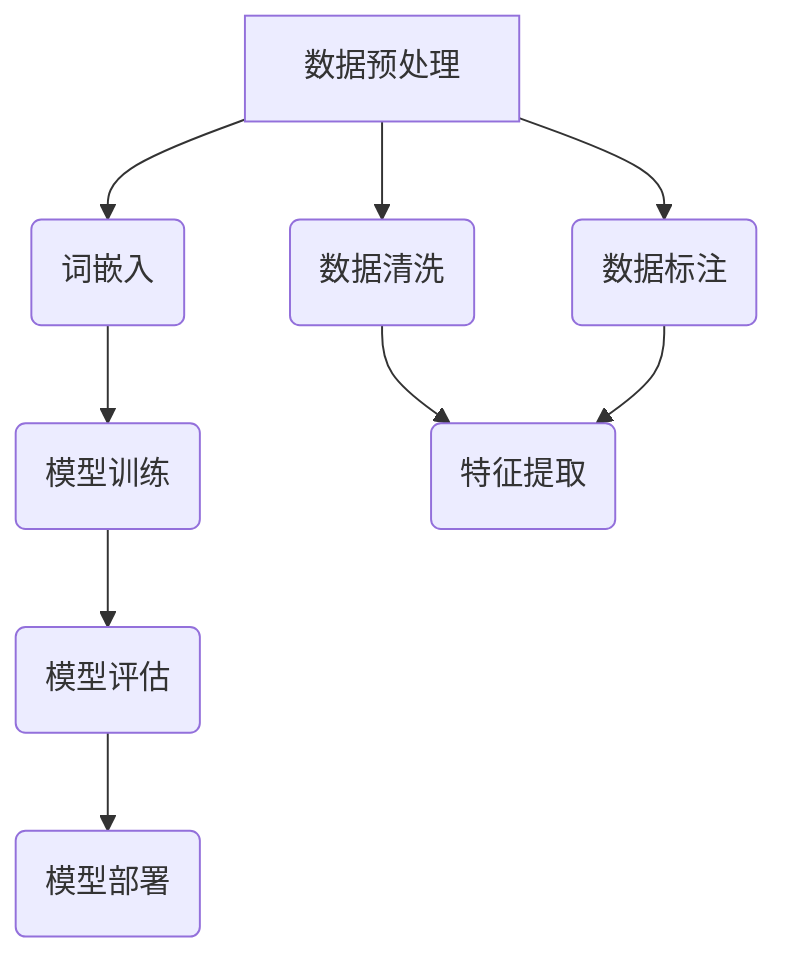

                 

### 《开源LLM社区：协作构建AI未来》

> **关键词：** 开源LLM，自然语言处理，人工智能，社区协作，技术发展。

> **摘要：** 本文将深入探讨开源大型语言模型（LLM）社区的现状、核心原理、主要项目、协作构建方式及其在AI应用中的实践，同时分析其安全性与伦理问题，展望其未来发展。通过详细的算法讲解、项目实战，我们希望能够为读者提供一幅全面的LLM社区图景，并激发更多开发者加入开源浪潮，共同构建AI未来。

### 《开源LLM社区：协作构建AI未来》目录大纲

#### 第一部分：开源LLM概述

##### 第1章：开源LLM简介

- 1.1 开源LLM的概念与历史
- 1.2 开源LLM的优势与挑战
- 1.3 开源LLM在全球范围的发展

##### 第2章：LLM的核心原理

- 2.1 语言模型的基本概念
- 2.2 语言模型的主要架构
- 2.3 语言模型的训练过程
  - 2.3.1 预训练
  - 2.3.2 微调
- 2.4 语言模型的关键算法
  - 2.4.1 递归神经网络（RNN）
  - 2.4.2 长短期记忆网络（LSTM）
  - 2.4.3 变量门控循环单元（GRU）
  - 2.4.4 自注意力机制（Self-Attention）
  - 2.4.5 转换器架构（Transformer）

##### 第3章：开源LLM的主要项目

- 3.1 GPT系列模型
  - 3.1.1 GPT-1
  - 3.1.2 GPT-2
  - 3.1.3 GPT-3
- 3.2 BERT及其变体
  - 3.2.1 BERT
  - 3.2.2 RoBERTa
  - 3.2.3 ALBERT
  - 3.2.4 DeBERTa
- 3.3 其他知名开源LLM项目
  - 3.3.1 T5
  - 3.3.2 XLNet
  - 3.3.3 ERNIE
  - 3.3.4 UniLM

#### 第二部分：协作构建AI未来

##### 第4章：开源LLM社区的构建

- 4.1 开源LLM社区的概述
- 4.2 开源LLM社区的运作模式
- 4.3 开源LLM社区的贡献方式
  - 4.3.1 源代码贡献
  - 4.3.2 文档编写
  - 4.3.3 社区互动
- 4.4 开源LLM社区的发展趋势

##### 第5章：开源LLM在AI应用中的实践

- 5.1 开源LLM在自然语言处理中的应用
  - 5.1.1 文本分类
  - 5.1.2 命名实体识别
  - 5.1.3 机器翻译
  - 5.1.4 问答系统
- 5.2 开源LLM在跨领域应用中的实践
  - 5.2.1 多模态学习
  - 5.2.2 代码生成
  - 5.2.3 推荐系统

##### 第6章：开源LLM的安全性与伦理问题

- 6.1 开源LLM的安全性问题
  - 6.1.1 模型鲁棒性
  - 6.1.2 输出可信度
  - 6.1.3 隐私保护
- 6.2 开源LLM的伦理问题
  - 6.2.1 公平性
  - 6.2.2 可解释性
  - 6.2.3 遵守法律法规

##### 第7章：未来展望

- 7.1 开源LLM在AI领域的未来发展
- 7.2 开源LLM社区的角色与责任
- 7.3 开源LLM对社会的影响
  - 7.3.1 经济影响
  - 7.3.2 科技创新
  - 7.3.3 教育普及

#### 附录

- 附录A：开源LLM项目资源汇总
  - 7.1.1 GitHub开源项目链接
  - 7.1.2 研究机构与大学项目
  - 7.1.3 开源LLM社区交流平台
- 附录B：开源LLM技术术语解释
  - 8.1 语言模型参数
  - 8.2 批处理大小
  - 8.3 学习率
- 附录C：开源LLM实践案例解析
  - 8.1 GPT-3在客服应用中的实践
  - 8.2 BERT在金融领域中的应用
  - 8.3 T5在代码生成中的应用

#### Mermaid 流程图



#### 核心算法原理讲解

在自然语言处理（NLP）中，大型语言模型（LLM）是核心组件之一。下面，我们将详细讲解递归神经网络（RNN）的核心算法原理。

### 递归神经网络（RNN）

RNN是一种能够处理序列数据的神经网络，其特点是在网络中引入了递归连接，即网络中的某些连接会从网络的某个节点指向自己。这种递归连接使得网络能够处理序列数据，并在处理序列数据时维持状态。

#### 基本工作原理

RNN的基本工作原理可以描述为：

1. **输入与隐藏状态**：
   - 输入序列 $x_t$ 和先前的隐藏状态 $h_{t-1}$ 通过门控单元（如输入门和遗忘门）进行处理。
   - 输入门计算 $i_t$，决定了当前输入的信息应该有多少被保存到隐藏状态中。
   - 遗忘门计算 $f_t$，决定了当前隐藏状态中有多少旧的信息被遗忘。

2. **隐藏状态与输出**：
   - 输出门计算 $o_t$，决定了当前隐藏状态中应该有多少信息被传递到输出。
   - 隐藏状态 $h_t$ 由遗忘门和输入门共同决定，通过遗忘门遗忘旧信息，通过输入门引入新信息。

3. **递归关系**：
   - 当前时间步的隐藏状态 $h_t$ 不仅依赖于当前输入 $x_t$，还依赖于前一个时间步的隐藏状态 $h_{t-1}$。

伪代码如下：

```plaintext
for t = 1 to T do
    i_t = input_gate(x_t, h_{t-1})
    f_t = forget_gate(x_t, h_{t-1})
    o_t = output_gate(x_t, h_{t-1})

    h_t = (1 - f_t) * h_{t-1} + i_t * tanh(W_h * [x_t; h_{t-1}])
    y_t = o_t * tanh(W_o * h_t)

end for
```

其中，$W_h$ 和 $W_o$ 分别为隐藏状态和输出的权重矩阵，$tanh$ 表示双曲正切函数。

#### 数学模型

1. **输入与隐藏状态**：

$$
h_t = \sigma(W_h * [x_t; h_{t-1}]) + f_t * h_{t-1}
$$

$$
f_t = \sigma(W_f * [x_t; h_{t-1}])
$$

2. **输出**：

$$
y_t = \sigma(W_o * h_t)
$$

3. **损失函数**：

$$
\text{损失函数} = \frac{1}{N} \sum_{i=1}^{N} -y_i \log(p_i)
$$

4. **梯度下降更新公式**：

$$
\theta_j = \theta_j - \alpha \frac{\partial J}{\partial \theta_j}
$$

#### 举例说明

假设我们要处理一个简单的句子 "I love AI"，我们可以将这个过程分解为以下几个步骤：

1. **词嵌入**：将句子中的每个词映射为一个向量。
2. **输入与隐藏状态**：首先计算输入门和遗忘门的值，然后更新隐藏状态。
3. **输出**：计算输出门值，然后得到当前词的预测标签。
4. **递归**：将当前词的隐藏状态传递给下一个时间步，重复上述过程，直到处理完整个句子。

通过这种方式，RNN可以有效地处理序列数据，并捕捉到序列中的长期依赖关系。

#### 总结

递归神经网络（RNN）是一种能够处理序列数据的神经网络，其基本原理是通过输入门、遗忘门和输出门来处理输入序列，并更新隐藏状态。RNN通过递归连接将当前时间步的信息传递给下一个时间步，从而捕捉到序列中的长期依赖关系。数学模型和伪代码详细描述了RNN的工作流程，并通过举例说明了其在处理简单句子时的应用。

---

在下一部分，我们将详细探讨语言模型的基本概念、主要架构以及训练过程。敬请期待。

### 第一部分：开源LLM概述

#### 第1章：开源LLM简介

##### 1.1 开源LLM的概念与历史

开源大型语言模型（Open Source Large Language Model，简称开源LLM）指的是那些公开源代码的大型自然语言处理模型。这些模型通常基于深度学习技术，经过大量的数据训练，能够对文本进行有效的理解和生成。

开源LLM的概念起源于深度学习技术的兴起。随着计算机硬件性能的提升和大数据技术的发展，深度学习在图像识别、语音识别等领域的应用取得了显著的成果。然而，在自然语言处理领域，由于数据的稀缺性和复杂性，传统的机器学习方法难以取得突破。因此，研究人员开始探索使用深度学习技术来构建大型语言模型。

第一个具有代表性的开源LLM是Google在2018年发布的BERT（Bidirectional Encoder Representations from Transformers）。BERT的发布标志着大型语言模型的开源时代的到来。随后，OpenAI发布了GPT-2，并在2019年发布了GPT-3。这些模型不仅在性能上取得了巨大的突破，而且其开源的特性使得全球的研究人员、企业和开发者可以自由地使用和改进这些模型。

##### 1.2 开源LLM的优势与挑战

**优势**

1. **共享知识**：开源LLM使得全球的研究者、企业和开发者可以共享知识，共同改进模型。这有助于加快技术进步，推动自然语言处理领域的创新。

2. **促进合作**：开源模型提供了一个平台，让不同背景和领域的研究者能够协作，共同解决自然语言处理中的难题。

3. **透明度**：开源模型使得模型的训练过程、算法实现以及性能评估都公开透明，有助于提高模型的可靠性和可解释性。

4. **成本低**：开源模型降低了开发者进入自然语言处理领域的技术门槛，使得更多小型企业和个人开发者可以参与其中。

**挑战**

1. **数据隐私**：开源模型往往需要大量数据来训练，这涉及到数据隐私和安全问题。如何平衡数据共享与隐私保护是一个亟待解决的问题。

2. **公平性**：开源模型可能加剧资源的不平衡，大型企业和技术巨头可能会更容易获得资源，从而在竞争中占据优势。

3. **安全性**：开源模型可能会被恶意使用，例如，用于生成虚假新闻、诈骗等。

4. **技术门槛**：尽管开源模型降低了技术门槛，但对于非专业人士来说，理解和改进开源模型仍然存在一定的难度。

##### 1.3 开源LLM在全球范围的发展

开源LLM在全球范围内的发展呈现出以下几个特点：

1. **快速发展**：随着深度学习和自然语言处理技术的进步，开源LLM的数量和规模不断增长。

2. **多样化应用**：开源LLM在自然语言处理、问答系统、文本生成、机器翻译等领域得到广泛应用。

3. **国际合作**：开源LLM项目吸引了来自全球各地的开发者参与，形成了跨国界的合作网络。

4. **商业模式的探索**：虽然开源LLM本身是免费的，但围绕开源LLM的商业模式也在不断探索中，如提供付费服务、构建生态系统等。

总之，开源LLM不仅推动了自然语言处理技术的发展，也为全球开发者提供了丰富的资源和技术支持。在未来，随着技术的进一步成熟，开源LLM的发展将会更加广泛和深入。

---

在下一部分，我们将深入探讨LLM的核心原理，包括语言模型的基本概念、主要架构以及训练过程。敬请期待。

### 第二部分：LLM的核心原理

#### 第2章：LLM的核心原理

##### 2.1 语言模型的基本概念

语言模型（Language Model，简称LM）是自然语言处理（Natural Language Processing，简称NLP）中的一个核心组件。它的主要任务是预测一个单词或序列的概率，从而帮助计算机更好地理解和生成自然语言。

**基本概念**：

1. **词汇表**：语言模型首先需要建立一个词汇表，这个词汇表包含了所有可能出现的单词或词组。

2. **概率分布**：语言模型的核心目标是学习一个概率分布，该分布可以预测一个序列中下一个单词的概率。

3. **序列建模**：语言模型需要处理的是序列数据，例如一个句子或一段文本。它需要预测序列中每个单词的概率，并最终生成整个序列的概率分布。

**常见类型**：

1. **n-gram模型**：这是一种基于单词序列的简单模型，它通过统计前n个单词出现的频率来预测下一个单词。例如，n-gram模型可以预测下一个单词是"AI"的概率。

2. **神经网络模型**：随着深度学习技术的发展，神经网络模型成为了语言模型的主流。这些模型能够更好地捕捉单词之间的复杂关系，如递归神经网络（RNN）、长短期记忆网络（LSTM）和转换器（Transformer）等。

##### 2.2 语言模型的主要架构

语言模型的架构可以分为两部分：前向传递（Forward Pass）和反向传播（Backpropagation）。

**前向传递**：

1. **输入编码**：将输入的文本序列转换为向量表示。这通常涉及词嵌入（Word Embedding）技术，将单词映射为密集的向量。

2. **隐藏状态更新**：通过神经网络对隐藏状态进行更新。在RNN和LSTM中，这一步涉及到门控机制，以便更好地处理序列数据。

3. **输出概率计算**：计算输出单词的概率分布。这通常通过神经网络最后一层的激活函数实现。

**反向传播**：

1. **损失函数计算**：计算预测概率分布与真实分布之间的差距，这通常使用交叉熵损失函数。

2. **梯度计算**：计算网络参数的梯度，以更新网络的权重。

3. **权重更新**：使用梯度下降或其他优化算法更新网络参数。

##### 2.3 语言模型的训练过程

语言模型的训练过程可以分为两个主要阶段：预训练（Pre-training）和微调（Fine-tuning）。

**预训练**：

1. **数据准备**：收集大量的文本数据，这些数据可以是书籍、新闻、社交媒体帖子等。

2. **词汇表构建**：从文本数据中提取词汇表，将文本中的每个单词映射为唯一的索引。

3. **词嵌入训练**：使用神经网络训练词嵌入，将单词映射为密集的向量。这通常通过Word2Vec、GloVe等技术实现。

4. **模型训练**：使用预训练的词嵌入，训练语言模型，以预测单词序列的概率分布。

**微调**：

1. **特定任务数据准备**：收集与特定任务相关的数据集，例如文本分类、命名实体识别、机器翻译等。

2. **模型初始化**：使用预训练的语言模型作为初始化，这些模型已经学习了大量的通用语言知识。

3. **模型微调**：在特定任务的数据集上微调语言模型，以适应特定的任务需求。

4. **评估与优化**：使用评估指标（如准确率、F1分数等）评估模型性能，并进行必要的优化。

##### 2.4 语言模型的关键算法

**递归神经网络（RNN）**：

递归神经网络是一种能够处理序列数据的神经网络，其特点是网络中的节点可以通过递归连接从当前节点指向过去的节点。RNN通过记忆机制来捕捉序列中的长期依赖关系。

**长短期记忆网络（LSTM）**：

长短期记忆网络是RNN的一种改进，旨在解决传统RNN在处理长序列数据时的梯度消失和梯度爆炸问题。LSTM通过引入门控单元（输入门、遗忘门和输出门）来控制信息的流动，从而更好地处理长序列数据。

**变量门控循环单元（GRU）**：

GRU是LSTM的简化版本，它通过合并输入门和遗忘门为一个更新门，从而减少了参数数量。GRU在许多任务中表现出了与LSTM相似的性能，但计算效率更高。

**自注意力机制（Self-Attention）**：

自注意力机制是Transformer模型的核心组件，它通过计算序列中每个单词与其他单词之间的相似度，从而为每个单词生成不同的权重。这种机制允许模型更好地捕捉序列中的长期依赖关系。

**转换器架构（Transformer）**：

转换器（Transformer）是一种基于自注意力机制的深度学习模型，它通过多头注意力机制和位置编码来处理序列数据。Transformer在许多NLP任务中取得了突破性的成果，成为当前语言模型的的主流架构。

---

在下一部分，我们将详细介绍开源LLM的主要项目，包括GPT系列模型、BERT及其变体以及其他知名开源LLM项目。敬请期待。

### 第三部分：开源LLM的主要项目

#### 第3章：开源LLM的主要项目

开源大型语言模型（LLM）在自然语言处理（NLP）领域发挥着至关重要的作用。在本章中，我们将详细介绍一些主要的开源LLM项目，包括GPT系列模型、BERT及其变体以及其他知名项目。

##### 3.1 GPT系列模型

GPT系列模型是由OpenAI开发的一系列基于转换器（Transformer）架构的预训练语言模型。该系列模型在NLP任务中取得了显著的成绩，特别是在文本生成和机器翻译方面。

**GPT-1**：

GPT-1是GPT系列的第一款模型，于2018年发布。它使用了1.17亿个参数，并基于Transformer架构。GPT-1在多个NLP任务上取得了当时最好的成绩，如文本生成和机器翻译。

**GPT-2**：

GPT-2是GPT系列的第二款模型，于2019年发布。与GPT-1相比，GPT-2使用了更加庞大的模型，包括1.5亿、3.5亿和1750亿个参数的版本。GPT-2在多种NLP任务中取得了卓越的成绩，并且因其强大的文本生成能力而备受关注。

**GPT-3**：

GPT-3是GPT系列的最新款模型，于2020年发布。GPT-3使用了数十亿个参数，是当前最大的预训练语言模型。GPT-3在文本生成、问答系统、机器翻译等任务中展现出了卓越的性能，并且其能力在多种场景中得到了验证。

**关键特点**：

- **大规模**：GPT-3使用了数十亿个参数，这使得它在处理长文本和复杂任务时具有显著的优势。
- **通用性**：GPT-3在多种任务中表现出色，显示出强大的通用能力。
- **灵活性**：GPT-3能够接受多种输入格式，并生成高质量的自然语言输出。

##### 3.2 BERT及其变体

BERT（Bidirectional Encoder Representations from Transformers）是由Google在2018年发布的一种基于转换器的预训练语言模型。BERT的主要特点是使用双向编码器来处理文本，从而更好地捕捉单词之间的相互关系。

**BERT**：

BERT的原型模型使用3.4亿个参数，并进行了104万小时的预训练。BERT在多个NLP任务中取得了当时最好的成绩，如文本分类、命名实体识别和问答系统。

**BERT的变体**：

为了适应不同的任务和数据集，研究人员提出了多种BERT的变体，如：

- **RoBERTa**：RoBERTa是BERT的一种变体，通过改变训练策略和模型架构，取得了比BERT更好的性能。
- **ALBERT**：ALBERT通过共享参数和层叠加的方式，减少了模型的参数数量，同时保持了较高的性能。
- **DeBERTa**：DeBERTa是一种双编码器预训练模型，它通过增加预训练阶段和改进模型架构，取得了显著的性能提升。

**关键特点**：

- **双向编码**：BERT使用双向编码器来处理文本，从而更好地理解单词之间的相互关系。
- **适应性**：BERT及其变体通过调整模型架构和训练策略，适应不同的任务和数据集。
- **高性能**：BERT及其变体在多个NLP任务中取得了当时最好的成绩。

##### 3.3 其他知名开源LLM项目

除了GPT系列模型和BERT及其变体，还有许多其他知名的开源LLM项目，如：

**T5**：

T5（Text-To-Text Transfer Transformer）是由Google开发的一种基于转换器的预训练语言模型。T5的目标是构建一个通用的模型，能够处理多种NLP任务，如文本生成、分类和翻译。

**XLNet**：

XLNet是由阿里巴巴和清华大学共同开发的一种基于转换器的预训练语言模型。与BERT不同，XLNet使用了自回归语言模型（ARL）架构，从而在多个NLP任务中取得了优异的性能。

**ERNIE**：

ERNIE（Enhanced Representation through kNowledge Integration）是由百度开发的一种基于转换器的预训练语言模型。ERNIE通过融合外部知识，提高了语言模型的表示能力。

**UniLM**：

UniLM是由华为诺亚方舟实验室开发的一种基于转换器的多任务预训练语言模型。UniLM支持多种语言任务，如文本生成、翻译和对话生成。

**关键特点**：

- **多样性**：这些项目采用了不同的架构和训练策略，以满足不同的任务需求。
- **性能提升**：通过不断改进模型架构和预训练方法，这些项目在多个NLP任务中取得了显著的性能提升。
- **应用广泛**：这些项目在文本生成、问答系统、机器翻译等任务中得到了广泛应用。

---

在下一部分，我们将探讨开源LLM社区的构建、运作模式以及贡献方式。敬请期待。

### 第四部分：协作构建AI未来

#### 第4章：开源LLM社区的构建

##### 4.1 开源LLM社区的概述

开源LLM社区是一个由全球开发者、研究者和爱好者组成的合作网络，共同致力于开发、改进和推广开源大型语言模型。这个社区的成员来自不同的背景和领域，包括计算机科学、人工智能、语言学和工业界等。他们通过共享知识、协作研究和共同开发，推动开源LLM技术的发展。

**主要目标**：

- **知识共享**：通过共享代码、文档和研究结果，促进开源LLM领域的知识传播和技术进步。
- **模型改进**：通过协作研究和代码贡献，不断优化和改进开源LLM的性能和功能。
- **应用推广**：推广开源LLM在自然语言处理和其他领域中的应用，促进AI技术的发展和应用。
- **人才培养**：为开源LLM社区培养新一代的技术人才，提高全球自然语言处理领域的人才储备。

**主要活动**：

- **代码贡献**：社区成员通过GitHub等平台提交代码，共同开发开源LLM项目。
- **文档编写**：社区成员编写和更新文档，帮助新手了解和使用开源LLM。
- **研讨会和会议**：定期举办研讨会和会议，讨论最新研究成果和开发经验。
- **培训和教育**：组织在线和线下培训，提高社区成员的技能和知识水平。

##### 4.2 开源LLM社区的运作模式

开源LLM社区的运作模式主要包括以下几个方面：

**1. 社区治理**

开源LLM社区通常采用开源项目的治理模式，如GitHu

### 第四部分：协作构建AI未来

#### 第4章：开源LLM社区的构建

##### 4.1 开源LLM社区的概述

开源LLM社区是一个由全球开发者、研究者和爱好者组成的合作网络，共同致力于开发、改进和推广开源大型语言模型。这个社区的成员来自不同的背景和领域，包括计算机科学、人工智能、语言学和工业界等。他们通过共享知识、协作研究和共同开发，推动开源LLM技术的发展。

**主要目标**：

- **知识共享**：通过共享代码、文档和研究结果，促进开源LLM领域的知识传播和技术进步。
- **模型改进**：通过协作研究和代码贡献，不断优化和改进开源LLM的性能和功能。
- **应用推广**：推广开源LLM在自然语言处理和其他领域中的应用，促进AI技术的发展和应用。
- **人才培养**：为开源LLM社区培养新一代的技术人才，提高全球自然语言处理领域的人才储备。

**主要活动**：

- **代码贡献**：社区成员通过GitHub等平台提交代码，共同开发开源LLM项目。
- **文档编写**：社区成员编写和更新文档，帮助新手了解和使用开源LLM。
- **研讨会和会议**：定期举办研讨会和会议，讨论最新研究成果和开发经验。
- **培训和教育**：组织在线和线下培训，提高社区成员的技能和知识水平。

##### 4.2 开源LLM社区的运作模式

开源LLM社区的运作模式主要包括以下几个方面：

**1. 社区治理**

开源LLM社区通常采用开源项目的治理模式，如GitHub的Issue和Pull Request机制。社区成员可以通过提交Issue来提出问题和建议，通过Pull Request来提交代码更改。社区的核心团队负责审查和合并这些贡献，确保代码的质量和一致性。

**2. 分支管理**

社区成员通常在各自的分支上工作，确保代码的独立性和可维护性。当完成某个功能或修复后，成员可以通过Pull Request将其合并到主分支。这种模式有助于保持代码库的整洁和协作。

**3. 版本控制**

社区使用版本控制系统（如Git）来管理代码库的历史和变更。每个版本都记录了详细的修改记录，便于追溯和复现。

**4. 文档和指导**

社区提供详细的文档和指导，帮助新手了解如何安装、配置和使用开源LLM。这些文档通常包括安装指南、使用示例和最佳实践。

**5. 社区互动**

社区通过论坛、邮件列表和社交媒体等平台进行互动。社区成员可以分享经验、寻求帮助和交流想法。这种互动有助于建立紧密的联系和协作。

##### 4.3 开源LLM社区的贡献方式

开源LLM社区鼓励成员以多种方式做出贡献：

**1. 源代码贡献**

社区成员可以通过提交代码来改进和优化开源LLM。这包括添加新功能、修复漏洞和优化性能。

**2. 文档编写**

编写和更新文档是社区贡献的重要方式。高质量的文档可以减少新手的入门难度，提高项目的可维护性。

**3. 社区互动**

积极参与社区讨论，帮助解决其他成员的问题，分享经验和见解。社区互动有助于建立良好的社区文化和协作精神。

**4. 资源共享**

分享计算资源、数据集和工具等资源，可以帮助其他成员更快地开展工作。

**5. 研究和分享**

发表研究成果，分享开发经验和最佳实践，有助于推动整个开源LLM社区的发展。

##### 4.4 开源LLM社区的发展趋势

随着AI技术的不断进步，开源LLM社区也在不断发展。以下是几个值得关注的发展趋势：

**1. 模型规模和多样性**

未来，开源LLM的规模将继续扩大，模型将更加多样，以满足不同任务和应用场景的需求。

**2. 跨领域合作**

开源LLM社区将与其他领域（如计算机视觉、语音识别等）的社区进行更多合作，推动跨领域的技术进步。

**3. 安全和伦理**

随着AI技术的应用越来越广泛，开源LLM社区将更加关注模型的安全性和伦理问题，确保AI技术的可持续发展。

**4. 社区治理和规范化**

社区将进一步完善治理机制，确保开源LLM项目的健康和可持续发展。

**5. 人才培养和普及**

开源LLM社区将致力于培养更多AI人才，推动AI技术的普及和应用。

---

开源LLM社区通过协作和共享，为AI技术的发展和应用做出了重要贡献。在未来，随着技术的不断进步，开源LLM社区将继续发挥其重要作用，推动AI领域的创新和进步。

#### 第5章：开源LLM在AI应用中的实践

##### 5.1 开源LLM在自然语言处理中的应用

开源大型语言模型（LLM）在自然语言处理（NLP）中发挥了至关重要的作用。由于LLM具备强大的文本理解和生成能力，它们被广泛应用于各种NLP任务中。以下是一些典型的应用场景：

**1. 文本分类**

文本分类是将文本数据按照预定的类别进行分类的过程。开源LLM在这方面表现出色，如BERT、GPT系列模型等。它们通过预训练获得了丰富的语言知识，能够高效地识别文本的主题和情感。

**应用案例**：

- **社交媒体分析**：通过对社交媒体平台上的用户评论进行分类，可以帮助企业了解消费者的情感倾向，从而制定更有效的营销策略。
- **新闻分类**：自动化新闻分类可以提高信息检索的效率，帮助用户快速找到感兴趣的内容。

**2. 命名实体识别**

命名实体识别（Named Entity Recognition，简称NER）是指识别文本中的特定实体（如人名、地点、组织名等）。开源LLM通过预训练获得了对实体和关系的理解，能够准确识别文本中的命名实体。

**应用案例**：

- **信息提取**：从大量文本中提取关键信息，如提取新闻报道中的主要人物、地点和事件。
- **搜索引擎优化**：通过识别文本中的关键词和实体，可以提高搜索引擎的准确性和用户体验。

**3. 机器翻译**

机器翻译是指将一种语言的文本自动翻译成另一种语言。开源LLM在机器翻译领域取得了显著的进展，如GPT-3、Transformer等模型。

**应用案例**：

- **跨语言交流**：帮助不同语言的用户进行交流，促进跨文化沟通。
- **全球化业务**：为企业提供多语言支持，降低跨国业务的沟通障碍。

**4. 问答系统**

问答系统是指通过自然语言交互来回答用户的问题。开源LLM在构建智能问答系统中发挥着重要作用，如使用GPT-3构建的问答机器人。

**应用案例**：

- **客户服务**：自动化客户服务，提高企业响应速度和服务质量。
- **教育辅导**：为学生提供在线辅导，解答学习中的疑难问题。

##### 5.2 开源LLM在跨领域应用中的实践

开源LLM不仅在自然语言处理领域有广泛应用，还在其他跨领域应用中展示了强大的潜力。以下是一些跨领域应用案例：

**1. 多模态学习**

多模态学习是指将不同类型的数据（如文本、图像、音频等）进行融合，以获得更好的理解。开源LLM可以通过预训练模型实现多模态数据的学习。

**应用案例**：

- **图像识别与描述**：将图像识别与文本描述相结合，提高图像理解的能力。
- **语音识别与合成**：将语音识别与文本合成相结合，实现人机对话系统。

**2. 代码生成**

代码生成是指利用自然语言描述自动生成代码。开源LLM在代码生成领域展现了巨大潜力，如使用GPT-3生成Python代码。

**应用案例**：

- **自动化编程**：通过自然语言描述自动生成代码，提高开发效率。
- **编程辅助**：为程序员提供代码生成工具，帮助解决编程中的难题。

**3. 推荐系统**

推荐系统是指根据用户的历史行为和兴趣，为用户推荐相关的内容。开源LLM可以通过学习用户的语言偏好，为推荐系统提供高质量的推荐。

**应用案例**：

- **内容推荐**：为用户提供个性化的内容推荐，提高用户体验。
- **商品推荐**：为电商平台提供准确的商品推荐，增加销售额。

---

开源LLM在自然语言处理和其他跨领域应用中展现了强大的能力和广泛的应用前景。随着技术的不断进步，开源LLM将在更多领域发挥重要作用，推动AI技术的发展和应用。

#### 第6章：开源LLM的安全性与伦理问题

##### 6.1 开源LLM的安全性问题

开源大型语言模型（LLM）在带来巨大便利和效益的同时，也带来了一系列安全性的挑战。以下是几个主要方面：

**1. 模型鲁棒性**

模型鲁棒性是指模型在面对恶意攻击或异常输入时的抵抗能力。开源LLM可能受到以下几种攻击：

- **对抗性攻击**：通过微小但精心设计的输入变化，使模型产生错误的输出。例如，在文本分类任务中，攻击者可能会通过微调标点符号或单词顺序来误导模型。
- **数据注入**：攻击者可能会在训练数据中注入恶意内容，从而影响模型的训练结果和安全性。

**解决方法**：

- **鲁棒训练**：通过在训练数据中添加对抗性样本，提高模型的鲁棒性。
- **防御机制**：在模型部署时，添加检测和防御机制，如对抗性样本检测和错误纠正。

**2. 输出可信度**

开源LLM的输出可信度是指模型的输出是否可靠和准确。以下是一些潜在问题：

- **误导性输出**：模型可能会生成误导性或错误的文本，特别是在长文本生成任务中。
- **偏见和歧视**：模型可能会受到训练数据中的偏见影响，产生不公平的输出。

**解决方法**：

- **评估和测试**：在模型部署前，进行严格的评估和测试，确保其输出质量和可靠性。
- **偏见校正**：通过数据预处理和模型调整，减少模型中的偏见和歧视。

**3. 隐私保护**

开源LLM在处理文本数据时，可能会涉及到用户的隐私信息。以下是一些潜在问题：

- **数据泄露**：未经授权的访问和泄露用户隐私信息。
- **数据滥用**：将用户隐私信息用于未经授权的目的。

**解决方法**：

- **数据加密**：对敏感数据进行加密，确保数据在传输和存储过程中的安全性。
- **隐私保护协议**：制定和实施隐私保护协议，确保用户隐私信息不被滥用。

##### 6.2 开源LLM的伦理问题

开源LLM的伦理问题主要涉及模型的公平性、可解释性和法律法规遵守等方面。

**1. 公平性**

模型公平性是指模型在处理不同群体时的输出是否公平。以下是一些潜在问题：

- **歧视性输出**：模型可能会对某些群体产生歧视性输出，如性别、种族等。
- **不公平偏见**：模型可能会在决策中产生不公平的偏见。

**解决方法**：

- **偏见检测与校正**：通过数据分析和模型调整，检测和校正模型中的偏见。
- **公平性评估**：在模型部署前，进行公平性评估，确保模型不会对某些群体产生歧视性输出。

**2. 可解释性**

模型可解释性是指模型的决策过程和输出是否易于理解。以下是一些潜在问题：

- **黑盒模型**：某些复杂的模型（如深度神经网络）被认为是“黑盒”模型，其内部工作机制难以解释。
- **透明度缺失**：模型的训练过程和决策机制可能不够透明，导致用户无法了解其工作原理。

**解决方法**：

- **可解释性模型**：开发可解释性模型，如决策树、规则提取等，使模型决策过程更加透明。
- **可视化工具**：使用可视化工具，如热图、决策路径图等，帮助用户理解模型的工作原理。

**3. 遵守法律法规**

开源LLM在开发和应用过程中，需要遵守相关的法律法规，以确保其合法性和合规性。以下是一些潜在问题：

- **数据保护法规**：如欧盟的《通用数据保护条例》（GDPR）等，要求对用户数据进行严格保护。
- **版权和知识产权**：开源LLM在处理文本数据时，需要遵守版权和知识产权相关法律法规。

**解决方法**：

- **合规性审查**：在模型开发和部署前，进行合规性审查，确保遵守相关法律法规。
- **隐私保护协议**：制定和实施隐私保护协议，确保用户数据的合法使用和保护。

---

开源LLM的安全性和伦理问题对其可持续发展具有重要意义。通过采取有效的安全性和伦理措施，我们可以确保开源LLM的可靠性和公平性，推动其健康和可持续发展。

#### 第7章：未来展望

##### 7.1 开源LLM在AI领域的未来发展

随着AI技术的快速发展，开源大型语言模型（LLM）在AI领域的应用前景广阔。未来，开源LLM将在以下几个方面取得重要进展：

**1. 模型规模和多样性**

未来，开源LLM的规模将继续扩大，模型将更加多样。这不仅包括更大的模型，如具有数十亿参数的模型，还包括针对特定任务和领域优化的模型。多样化的模型将满足不同应用场景的需求，推动AI技术在更多领域的创新和应用。

**2. 跨领域合作**

开源LLM社区将与其他领域的AI研究者和开发者进行更深入的跨领域合作。例如，结合计算机视觉、语音识别和其他AI技术，开发出更强大的多模态AI系统。这种跨领域的合作将推动AI技术的综合发展和应用。

**3. 安全性和伦理**

随着开源LLM的应用越来越广泛，其安全性和伦理问题将受到更多关注。未来，开源LLM社区将加大对安全性和伦理问题的研究力度，开发出更加安全和可靠的模型，确保AI技术的可持续发展。

**4. 开源生态系统的完善**

开源LLM的生态系统将不断成熟和完善。未来，将涌现出更多高质量的开源LLM项目和工具，为开发者提供更好的支持和资源。同时，开源LLM社区将加强社区治理，确保项目的可持续发展和健康生态。

##### 7.2 开源LLM社区的角色与责任

开源LLM社区在AI技术的发展中发挥着至关重要的作用。未来，社区将承担以下角色和责任：

**1. 促进知识共享**

开源LLM社区将继续促进知识共享，为全球开发者提供丰富的资源和技术支持。通过共享代码、文档和研究结果，社区将推动AI技术的传播和应用。

**2. 推动技术进步**

开源LLM社区将持续推动技术进步，不断优化和改进开源LLM的性能和功能。通过协作研究和创新，社区将引领AI技术的发展方向。

**3. 提高人才培养**

开源LLM社区将致力于提高人才培养，为AI领域培养更多优秀人才。通过在线和线下培训、研讨会和会议等活动，社区将培养新一代的技术人才，为AI技术的发展提供源源不断的人力资源。

**4. 维护社区健康**

开源LLM社区将加强对社区健康的维护，确保项目的可持续发展和健康生态。通过完善社区治理、规范项目管理和促进社区互动，社区将建立一个友好、积极、合作的发展环境。

##### 7.3 开源LLM对社会的影响

开源LLM的发展将对社会产生深远的影响。以下是一些主要方面：

**1. 经济影响**

开源LLM将为企业和创业者提供强大的技术支持，促进创新和创业活动。随着AI技术的应用越来越广泛，开源LLM将推动相关产业的发展，创造更多的就业机会和经济价值。

**2. 科技创新**

开源LLM将推动科技创新，加速AI技术的发展和应用。通过共享知识和资源，社区将激发更多研究者和开发者的创新潜力，推动AI技术取得突破性进展。

**3. 教育普及**

开源LLM将有助于教育普及，提高公众对AI技术的认知和了解。通过在线课程、开源项目和社区活动，社区将为更多的人提供学习AI技术的机会，培养新一代的技术人才。

总之，开源LLM在AI领域的未来发展充满机遇和挑战。通过社区的协作和创新，开源LLM将继续推动AI技术的发展和应用，为社会的进步和繁荣做出重要贡献。

### 附录

#### 附录A：开源LLM项目资源汇总

**A.1 GitHub开源项目链接**

- **GPT系列模型**：[GPT-1](https://github.com/openai/gpt)，[GPT-2](https://github.com/openai/gpt-2)，[GPT-3](https://github.com/openai/gpt-3)
- **BERT及其变体**：[BERT](https://github.com/google-research/bert)，[RoBERTa](https://github.com/runner-dm/roberta)，[ALBERT](https://github.com/google-research/albert)，[DeBERTa](https://github.com/hanxiao/deberta)
- **其他知名开源LLM项目**：[T5](https://github.com/google-research/text-to-text-transfer-tasks)，[XLNet](https://github.com/ymcui/xlnet)，[ERNIE](https://github.com/PaddlePaddle/PaddleNLP)，[UniLM](https://github.com/huawei-noah/UniLM)

**A.2 研究机构与大学项目**

- **Google Research**：[BERT](https://research.google.com/eng

