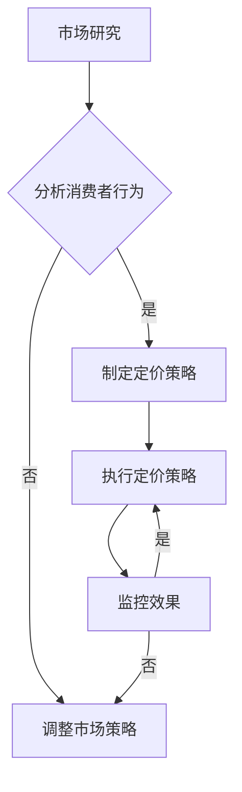

                 

### 《开源项目的定价心理学：最大化感知价值》

> **关键词：** 定价心理学、感知价值、开源项目、定价策略、消费者行为

**摘要：** 本文深入探讨了开源项目的定价心理学，分析了感知价值理论及其在开源项目定价中的应用。通过阐述不同的定价策略，如成本加成定价、市场导向定价和竞争导向定价，文章提供了定价调整和优化的方法和工具。此外，通过开源项目定价案例分析和未来趋势预测，本文为开源项目维护者提供了实用的定价建议，以最大化感知价值，实现开源项目的可持续发展。

---

# **《开源项目的定价心理学：最大化感知价值》**

开源项目是现代软件开发的一个重要组成部分，它们不仅推动了技术的进步，还为开发者提供了一个广泛的协作平台。然而，开源项目的可持续性和盈利性是许多项目维护者面临的重要问题。在开源项目中，定价策略起着至关重要的作用，因为它不仅决定了项目的收入，还影响着项目的市场份额和用户满意度。本文将探讨开源项目的定价心理学，重点分析如何通过最大化感知价值来实现项目的成功定价。

## **第一部分：定价心理学基础**

### **第1章：定价心理学概述**

定价心理学是研究消费者在购买过程中如何感知和处理价格的心理过程。理解定价心理学有助于开发者制定有效的定价策略，从而最大化项目的感知价值。

### **第2章：感知价值理论**

感知价值理论是定价心理学的核心，它解释了消费者如何评估产品或服务的价值。本章将详细探讨感知价值的定义、分类及其与定价的关系。

### **第3章：定价策略选择**

定价策略是制定价格的方法，它直接影响项目的收入和市场份额。本章将介绍常见的定价策略，如成本加成定价、市场导向定价和竞争导向定价。

## **第二部分：开源项目的定价实践**

### **第4章：定价调整与优化**

定价调整和优化是确保项目定价策略适应市场变化和用户需求的关键。本章将讨论定价调整的原则、方法和工具。

### **第5章：开源项目定价案例分析**

通过分析成功的开源项目定价案例，本章将提供实用的定价策略和优化方法，帮助开发者实现项目的可持续发展和盈利。

### **第6章：开源项目的定价优化**

本章将深入探讨开源项目定价优化的原则、工具和技巧，并通过实际案例展示定价优化的效果。

### **第7章：开源项目定价的未来趋势**

开源项目的定价模式正在不断演变，本章将预测未来趋势，探讨定价心理学在开源项目中的应用前景。

## **第三部分：附录**

### **附录A：开源项目的定价资源**

附录部分将提供开源项目定价相关的工具、资源和参考书籍，以供读者进一步学习和研究。

### **附录B：Mermaid 流程图示例**

通过一个简单的Mermaid流程图示例，本章将展示如何使用Mermaid创建流程图。

### **附录C：核心算法原理讲解**

本章将使用伪代码和数学模型详细解释感知价值计算的核心算法原理。

### **附录D：数学模型和公式讲解**

本章将讲解消费者剩余的数学模型，并提供具体的案例说明。

### **附录E：开源项目定价实战案例**

通过具体的开源项目定价实战案例，本章将展示如何在实际项目中应用定价策略。

### **附录F：开发环境搭建与代码实现**

本章将介绍如何搭建开源项目定价相关的开发环境，并详细解读代码实现。

### **附录G：开源项目定价的可持续发展**

本章将探讨开源项目的可持续发展，包括社区参与的定价模式和社会责任与伦理考量。

---

## **第一部分：定价心理学基础**

### **第1章：定价心理学概述**

定价心理学是研究消费者在购买过程中如何感知和处理价格的心理过程。在商业环境中，定价不仅是一个技术问题，更是一个心理问题。定价心理学通过了解消费者的心理机制，帮助开发者制定更有效的定价策略。

#### **1.1 定价心理学的概念与重要性**

定价心理学的概念涉及消费者如何形成对产品或服务的价值感知，以及这种感知如何影响购买决策。它关注的是消费者在购买过程中所经历的心理过程，包括感知、认知、情感和动机。

定价心理学的重要性体现在以下几个方面：

1. **提高收入**：通过理解消费者的心理机制，开发者可以制定更有效的定价策略，从而提高项目的收入。
2. **提升市场份额**：合理的定价策略有助于项目在竞争激烈的市场中脱颖而出，提升市场份额。
3. **增强用户满意度**：定价策略的合理性直接影响用户满意度，从而促进用户忠诚度和口碑传播。

#### **1.2 定价心理学的作用**

定价心理学在商业环境中扮演着多重角色，主要包括：

1. **消费者决策分析**：通过分析消费者在购买过程中的心理活动，帮助企业制定更符合消费者需求的定价策略。
2. **定价策略制定**：帮助开发者确定产品或服务的价格，以最大化项目的收入和利润。
3. **市场研究**：通过消费者行为分析，为企业提供有关市场动态和竞争态势的洞察，从而制定更具竞争力的定价策略。
4. **产品差异化**：通过独特的产品或服务定价，帮助企业实现产品差异化，吸引目标消费者。

#### **1.3 定价心理学的应用领域**

定价心理学广泛应用于多个商业领域，包括：

1. **消费品**：在消费品市场，定价心理学帮助制造商和零售商制定合理的价格，吸引消费者购买。
2. **服务业**：在服务业，如餐饮、旅游和医疗，定价心理学有助于制定能够吸引客户且具有竞争力的价格策略。
3. **B2B市场**：在B2B市场，定价心理学帮助企业确定与客户价值相匹配的价格，从而建立长期合作关系。
4. **电子商务**：在电子商务领域，定价心理学通过网站设计、广告投放和促销活动等手段，提高消费者购买意愿。

#### **1.4 定价心理学的基本原理**

定价心理学的基本原理包括以下几个方面：

1. **感知价值**：感知价值是消费者对产品或服务所赋予的价值感知，它是定价的核心因素。
2. **价格敏感性**：价格敏感性是指消费者对价格变化的反应程度。理解价格敏感性有助于制定更具弹性的定价策略。
3. **参考价格**：参考价格是消费者在购买决策过程中用来比较价格的标准。了解参考价格有助于制定更具吸引力的价格策略。
4. **认知失调**：认知失调是指消费者在购买后可能出现的心理不适，通过定价策略的调整，可以减少认知失调，提高消费者满意度。

### **小结**

定价心理学是商业环境中不可或缺的一部分，它通过分析消费者的心理机制，帮助开发者制定有效的定价策略。理解定价心理学的基本原理和应用领域，对于实现项目的可持续发展和盈利具有重要意义。

## **第2章：感知价值理论**

感知价值理论是定价心理学的核心，它解释了消费者如何评估产品或服务的价值。感知价值不仅影响消费者的购买决策，还直接影响项目的收入和市场份额。本章将详细探讨感知价值的定义、分类及其与定价的关系。

### **2.1 感知价值的定义与分类**

#### **2.1.1 感知价值的定义**

感知价值是指消费者在购买过程中所感受到的产品或服务的价值。这种价值是主观的，并且取决于消费者的个人需求和预期。感知价值不仅仅基于产品的物理特性，还涉及到消费者的情感体验和社会认同。

#### **2.1.2 感知价值的分类**

感知价值可以分为几个不同的类别：

1. **功能性价值**：功能性价值是指产品或服务满足消费者需求的功能性方面。例如，一款高效的软件工具能够提高工作效率，因此具有高功能性价值。

2. **情感性价值**：情感性价值是指产品或服务在情感上满足消费者的需求。例如，一款设计精美的智能手机能够带来愉悦的体验，因此具有高情感性价值。

3. **社会性价值**：社会性价值是指产品或服务在社交场合中所体现的价值。例如，一款时尚的配件可以提升消费者的社会地位，因此具有高社会性价值。

4. **可持续性价值**：可持续性价值是指产品或服务在环境保护和资源利用方面所体现的价值。例如，一款节能环保的电子产品能够减少对环境的影响，因此具有高可持续性价值。

#### **2.1.3 感知价值与定价的关系**

感知价值与定价之间存在密切的关系。合理的定价策略应该基于消费者对产品或服务的感知价值。以下是一些关键点：

1. **高感知价值对应高价格**：当消费者认为产品或服务具有高感知价值时，他们可能愿意支付更高的价格。因此，开发者可以通过提升产品或服务的感知价值来提高价格。

2. **价格与感知价值的匹配**：定价策略应该确保价格与消费者对产品或服务的感知价值相匹配。如果价格过高，消费者可能认为产品或服务不值得购买；如果价格过低，消费者可能怀疑产品或服务的质量。

3. **感知价值的动态调整**：消费者的感知价值可能会随时间、市场环境和消费者个人情况的变化而变化。因此，开发者需要不断调整定价策略，以适应变化的感知价值。

### **2.2 消费者行为分析**

消费者行为分析是制定有效定价策略的重要步骤。它涉及对消费者在购买过程中的心理活动和行为模式的研究。以下是一些关键点：

#### **2.2.1 消费者决策过程**

消费者的决策过程可以分为几个阶段：

1. **需求识别**：消费者意识到自己需要某种产品或服务。
2. **信息搜索**：消费者通过各种渠道收集有关产品或服务的信息。
3. **评估和比较**：消费者评估和比较不同产品或服务的优势。
4. **购买决策**：消费者根据评估结果做出购买决策。
5. **购买后行为**：消费者购买后的满意度和忠诚度。

#### **2.2.2 消费者心理特征**

消费者的心理特征对定价策略有重要影响。以下是一些关键点：

1. **需求层次**：消费者的需求可以分为生理需求、安全需求、社交需求、尊重需求和自我实现需求。不同层次的需求会影响消费者的购买决策。
2. **情感和认知**：消费者的情感和认知在购买决策过程中起着重要作用。情感驱动购买通常是基于情感体验，而认知驱动购买通常是基于理性评估。
3. **价格敏感性**：消费者的价格敏感性因人而异。一些消费者对价格变化非常敏感，而另一些消费者则不那么敏感。

#### **2.2.3 消费者对价格的心理感知**

消费者对价格的心理感知是定价策略制定的关键。以下是一些关键点：

1. **参考价格**：消费者在购买过程中会使用参考价格来评估产品或服务的价格。参考价格可以是市场上的平均价格、以前的购买价格或消费者的预期价格。
2. **价格感知差异**：消费者对同一产品的价格感知可能存在差异。这种差异可能源于消费者的个人经历、文化背景和收入水平。
3. **价格定位**：开发者可以通过价格定位来影响消费者对产品或服务的感知价值。例如，通过提供高端产品或低价产品来满足不同消费者的需求。

### **2.3 感知价值与消费者行为的互动**

感知价值与消费者行为之间存在复杂的互动关系。以下是一些关键点：

1. **感知价值驱动购买决策**：消费者通常会在感知价值的基础上做出购买决策。高感知价值可以增加消费者的购买意愿和忠诚度。
2. **消费者行为影响感知价值**：消费者的行为，如购买后的使用体验和口碑传播，会影响他们对产品或服务的感知价值。
3. **感知价值影响消费者满意度和忠诚度**：高感知价值可以提高消费者的满意度，进而增强他们的忠诚度。

### **小结**

感知价值理论是定价心理学的核心，它解释了消费者如何评估产品或服务的价值。理解感知价值的定义、分类及其与定价的关系，对于制定有效的定价策略具有重要意义。通过分析消费者行为，开发者可以更准确地确定感知价值，从而制定更合理的价格策略，提高项目的收入和市场份额。

## **第3章：定价策略选择**

定价策略是开发者制定价格的方法，它直接影响项目的收入和市场份额。合理的定价策略不仅能够提高项目的盈利性，还能够增强用户的满意度和忠诚度。本章将介绍常见的定价策略，包括成本加成定价、市场导向定价和竞争导向定价。

### **3.1 定价策略概述**

#### **3.1.1 定价策略的定义**

定价策略是指开发者为了实现项目的目标而采取的定价方法和原则。定价策略不仅涉及到产品或服务的价格，还涉及到价格的调整和优化。

#### **3.1.2 定价策略的类型**

常见的定价策略包括以下几种：

1. **成本加成定价策略**：这种策略基于成本加成原则，即在产品或服务的成本基础上加上一定的利润率来确定价格。
2. **市场导向定价策略**：这种策略以市场需求为基础，根据产品的市场需求和竞争态势来确定价格。
3. **竞争导向定价策略**：这种策略以竞争对手的价格为基础，通过分析竞争对手的价格策略来确定自己的价格。

### **3.2 成本加成定价策略**

成本加成定价策略是一种基于成本的定价方法，它通过计算产品或服务的总成本，然后加上一定的利润率来确定价格。以下是成本加成定价策略的详细步骤：

1. **计算总成本**：总成本包括固定成本和可变成本。固定成本是无论生产多少产品都需要支付的成本，如厂房租金、设备维护费用等。可变成本是随着生产数量增加而增加的成本，如原材料成本、人工成本等。
   
   $$ 总成本 = 固定成本 + (可变成本 \times 生产数量) $$

2. **确定利润率**：利润率是指开发者希望通过定价获得的额外收入。利润率可以是固定的百分比，也可以是根据市场情况和项目目标动态调整的。

   $$ 利润率 = \frac{预期利润}{总成本} $$

3. **计算销售价格**：销售价格是总成本加上利润率后的价格。

   $$ 销售价格 = 总成本 \times (1 + 利润率) $$

#### **3.2.1 成本加成定价策略的原理**

成本加成定价策略的原理是将成本作为定价的基础，通过加成利润来保证项目的盈利性。这种方法适用于那些成本结构相对稳定且市场竞争不激烈的产品或服务。

#### **3.2.2 成本加成定价策略的应用**

成本加成定价策略适用于多种场景，例如：

1. **制造业**：制造业中的产品通常具有明确的成本结构，因此成本加成定价策略可以帮助制造商确定合理的销售价格。
2. **服务业**：在服务业中，如餐饮和医疗，成本加成定价策略可以帮助服务提供商确定服务价格，以确保项目的盈利性。

### **3.3 市场导向定价策略**

市场导向定价策略是以市场需求和竞争态势为基础的定价方法。以下是市场导向定价策略的详细步骤：

1. **市场研究**：通过市场研究，了解市场需求和竞争态势。市场研究可以包括消费者调查、市场趋势分析和竞争对手分析等。
   
2. **确定市场需求**：根据市场研究的结果，确定市场需求的高低和需求弹性。

3. **设定价格**：根据市场需求和竞争态势，设定一个能够吸引消费者的价格。通常，市场需求高且需求弹性低的产品的价格可以设定得相对较高。

   $$ 销售价格 = 成本 \times (1 + 利润率) \times 需求弹性 $$

#### **3.3.1 市场导向定价策略的原理**

市场导向定价策略的原理是利用市场需求和竞争态势来指导定价。这种方法适用于那些市场需求波动较大且竞争激烈的产品或服务。

#### **3.3.2 市场导向定价策略的应用**

市场导向定价策略适用于多种场景，例如：

1. **电子商务**：在电子商务领域，市场导向定价策略可以帮助在线零售商根据市场需求和竞争态势动态调整价格。
2. **科技行业**：在科技行业，市场导向定价策略可以帮助科技公司根据市场需求和竞争对手的价格来制定价格策略。

### **3.4 竞争导向定价策略**

竞争导向定价策略是以竞争对手的价格为基础的定价方法。以下是竞争导向定价策略的详细步骤：

1. **分析竞争对手**：通过分析竞争对手的产品或服务价格、市场份额和市场策略，了解竞争对手的价格水平。
   
2. **确定自身价格**：根据竞争对手的价格水平，确定自己的价格。如果竞争对手的价格较低，可以考虑降价以吸引消费者；如果竞争对手的价格较高，可以考虑提升自身价格以获取更高的利润。

   $$ 销售价格 = 竞争对手价格 + (竞争对手价格 \times 竞争优势比例) $$

#### **3.4.1 竞争导向定价策略的原理**

竞争导向定价策略的原理是通过与竞争对手的价格对比来确定自身价格。这种方法适用于那些市场竞争激烈且价格敏感的产品或服务。

#### **3.4.2 竞争导向定价策略的应用**

竞争导向定价策略适用于多种场景，例如：

1. **消费品市场**：在消费品市场，竞争导向定价策略可以帮助企业根据竞争对手的价格来调整自己的价格。
2. **软件行业**：在软件行业，竞争导向定价策略可以帮助开发者在面对激烈的市场竞争时制定合理的价格策略。

### **3.5 定价策略的选择**

选择合适的定价策略是开发者面临的挑战。以下是一些选择定价策略的考虑因素：

1. **产品特性**：产品或服务的特性决定了哪种定价策略更为合适。例如，高技术含量的产品可能更适合市场导向定价策略，而标准化的产品可能更适合成本加成定价策略。
2. **市场需求**：市场需求的变化直接影响定价策略的选择。了解市场需求可以帮助开发者制定更具弹性的定价策略。
3. **竞争态势**：竞争态势是影响定价策略的关键因素。了解竞争对手的价格策略可以帮助开发者制定更具竞争力的定价策略。

### **小结**

定价策略是开发者实现项目目标的重要手段。通过理解成本加成定价、市场导向定价和竞争导向定价策略的原理和应用，开发者可以制定更有效的定价策略，提高项目的收入和市场份额。选择合适的定价策略需要考虑产品特性、市场需求和竞争态势等多个因素。

## **第4章：定价调整与优化**

定价调整和优化是确保项目定价策略适应市场变化和用户需求的关键步骤。合理的定价调整和优化不仅可以提高项目的收入，还可以增强用户的满意度和忠诚度。本章将讨论定价调整的原则、方法和工具。

### **4.1 定价调整的原则**

定价调整的原则主要包括以下几个方面：

1. **适应市场变化**：市场环境是不断变化的，开发者需要根据市场动态及时调整定价策略，以确保价格与市场需求相匹配。
2. **符合用户需求**：用户需求是影响定价策略的重要因素。开发者需要了解用户的支付能力和购买意愿，以便制定合理的价格策略。
3. **平衡收入与成本**：定价调整不仅要考虑收入，还要考虑成本。合理的定价策略应该能够在保证收入的同时，确保项目的可持续发展。
4. **保持竞争力**：在竞争激烈的市场中，开发者需要通过定价策略来保持竞争力。这可能意味着需要定期调整价格，以适应竞争对手的变化。

### **4.2 定价调整的时机**

定价调整的时机对项目的成功至关重要。以下是一些常见的定价调整时机：

1. **市场变化**：当市场环境发生变化，如经济形势、消费者购买力等，开发者需要及时调整定价策略。
2. **竞争态势变化**：当竞争对手的价格策略发生变化时，开发者需要根据实际情况调整自己的价格，以保持竞争力。
3. **产品更新**：当产品更新或改进时，开发者可以根据产品的变化调整价格，以反映产品的新价值。
4. **季节性因素**：一些产品或服务的需求具有季节性变化，开发者可以根据季节性因素调整价格，以最大化收益。

### **4.3 定价调整的影响因素**

定价调整的影响因素包括以下几个方面：

1. **成本变化**：成本的变化直接影响定价。例如，原材料价格上涨可能导致产品成本增加，从而需要调整价格。
2. **市场需求**：市场需求的变化直接影响产品的定价。当市场需求增加时，可以适当提高价格；当市场需求减少时，可以适当降低价格。
3. **竞争态势**：竞争态势的变化对定价策略有重要影响。开发者需要密切关注竞争对手的价格变化，并根据实际情况调整自己的价格。
4. **用户反馈**：用户对价格的反馈是定价调整的重要参考。如果用户对价格有负面反馈，开发者可能需要调整价格策略。

### **4.4 定价优化的方法**

定价优化是确保定价策略持续有效的重要手段。以下是一些常用的定价优化方法：

1. **数据分析**：通过数据分析，了解市场需求、用户行为和成本变化，为定价调整提供数据支持。
2. **实验与测试**：通过实验和测试，比较不同定价策略的效果，找到最优定价策略。
3. **模型驱动**：利用数学模型和统计模型，预测市场需求和用户行为，为定价调整提供科学依据。
4. **用户参与**：通过用户参与，了解用户的真实需求和购买意愿，为定价策略提供更准确的参考。

### **4.5 定价优化的工具**

以下是一些常用的定价优化工具：

1. **数据分析工具**：如Excel、Google Analytics等，可以帮助开发者进行数据分析。
2. **A/B测试工具**：如Google Optimize、AB Tasty等，可以帮助开发者比较不同定价策略的效果。
3. **定价模型工具**：如CPQ（Configure, Price, Quote）系统，可以帮助开发者进行定价模型分析和优化。
4. **用户调研工具**：如SurveyMonkey、Qualtrics等，可以帮助开发者收集用户反馈。

### **4.6 定价调整与优化的案例分析**

以下是一个定价调整和优化的案例分析：

#### **案例背景**

某软件公司开发了一款高端企业级软件，最初定价较高，但由于市场竞争激烈，销量不佳。公司决定进行定价调整和优化。

#### **案例分析**

1. **市场研究**：公司首先进行了市场研究，分析了市场需求和竞争对手的价格策略。
2. **用户调研**：公司通过用户调研了解了用户的支付能力和购买意愿。
3. **数据分析**：公司利用数据分析工具分析了市场需求、用户行为和成本变化。
4. **定价调整**：基于市场研究和用户调研的结果，公司决定降低价格，以提升销量。
5. **A/B测试**：公司进行了A/B测试，比较了不同定价策略的效果，找到了最优定价策略。
6. **持续优化**：公司持续进行定价优化，根据市场需求和用户反馈调整价格。

#### **结果**

通过定价调整和优化，公司的销量显著提升，用户满意度也得到提高。

### **小结**

定价调整和优化是确保项目定价策略持续有效的重要手段。通过适应市场变化、符合用户需求和平衡收入与成本，开发者可以制定合理的定价策略。通过数据分析、实验与测试、模型驱动和用户参与等方法，开发者可以不断优化定价策略，提高项目的收入和市场份额。

## **第5章：开源项目定价案例分析**

开源项目的定价策略对于项目的可持续发展至关重要。在本章中，我们将分析几个成功的开源项目定价案例，探讨它们是如何通过不同的定价策略实现盈利和市场份额的增长的。

### **5.1 开源项目定价案例分析概述**

开源项目定价的挑战在于如何在不损害项目免费使用的前提下，通过合理的收费机制实现盈利。以下是几个成功的开源项目定价案例分析：

#### **5.1.1 案例一：WordPress的订阅模式**

**背景**：WordPress是全球最受欢迎的内容管理系统，其免费版本拥有庞大的用户群体。WordPress通过推出订阅服务来增加收入。

**定价策略**：WordPress采用了订阅模式，为用户提供高级功能和额外支持，如专业主题、插件和客户支持。

**结果**：订阅模式的推出显著提高了WordPress的收入，并且增强了用户体验。

#### **5.1.2 案例二：Elasticsearch的许可证模式**

**背景**：Elasticsearch是一款高性能的搜索引擎，其开源版本完全免费，但企业版提供了额外的功能和商业支持。

**定价策略**：Elasticsearch采用了双许可证模式，开源版本完全免费，但企业版需要付费。企业版包括额外的技术支持、安全性增强和企业合规性保证。

**结果**：企业版的推出为Elasticsearch带来了稳定的收入流，同时也保持了开源社区的活跃。

#### **5.1.3 案例三：Kubernetes的二次开发收费模式**

**背景**：Kubernetes是容器编排系统的领先者，其开源版本广受欢迎。然而，企业用户往往需要定制化的解决方案。

**定价策略**：Kubernetes的定价策略是基于二次开发收费。企业用户可以免费使用开源版本，但如果需要进行定制化开发或企业支持，则需要付费。

**结果**：通过二次开发收费模式，Kubernetes吸引了大量企业用户，同时也为项目维护提供了资金。

### **5.2 开源项目的定价模型**

开源项目的定价模型通常包括以下几种：

#### **5.2.1 订阅模式**

订阅模式是开源项目常见的定价策略，通过提供不同的订阅级别来获取持续的收入。订阅模式的优势在于它能够为企业用户提供额外的价值，同时为项目维护者提供稳定的收入流。

**案例**：WordPress和企业级开源数据库如MongoDB。

#### **5.2.2 许可证模式**

许可证模式通过提供不同的许可证类型来定价，如开源许可证和商业许可证。开源许可证完全免费，商业许可证则包括额外的支持和功能。

**案例**：Elasticsearch和企业级软件如JasperReports。

#### **5.2.3 二次开发收费模式**

二次开发收费模式允许企业用户免费使用开源软件，但如果需要进行定制化开发或企业支持，则需要付费。

**案例**：Kubernetes和OpenStack。

### **5.3 开源项目的定价策略**

开源项目的定价策略需要平衡免费使用和付费服务之间的关系。以下是一些常见的开源项目定价策略：

#### **5.3.1 成本导向定价策略**

成本导向定价策略基于项目的开发和维护成本来确定价格。这种方法适用于那些成本结构相对稳定的项目。

**案例**：一些小型开源项目可能采用成本导向定价策略。

#### **5.3.2 市场导向定价策略**

市场导向定价策略基于市场需求和竞争态势来确定价格。这种方法适用于那些市场需求波动较大的项目。

**案例**：WordPress和企业级开源数据库。

#### **5.3.3 竞争导向定价策略**

竞争导向定价策略以竞争对手的价格为基础来确定自己的价格。这种方法适用于那些市场竞争激烈的项目。

**案例**：一些开源云服务和工具。

#### **5.3.4 混合定价策略**

混合定价策略结合了成本导向、市场导向和竞争导向定价策略的优点，以实现更灵活的定价。

**案例**：一些大型开源项目和平台如Red Hat。

### **5.4 案例分析一：GitHub动作系统的定价优化**

**背景**：GitHub动作系统是一款开源的任务管理工具，旨在帮助开发者和团队高效地管理项目任务。

**定价策略**：

1. **基础版本免费**：GitHub动作系统的基础版本完全免费，吸引了大量用户。
2. **专业版收费**：为需要更多高级功能和额外支持的用户提供了专业版，通过订阅模式收费。
3. **企业版收费**：为企业用户提供企业版，包括定制化开发和企业支持，通过二次开发收费模式收费。

**优化过程**：

1. **市场研究**：分析了市场需求和用户反馈，了解了用户的支付能力和购买意愿。
2. **数据分析**：通过数据分析，了解了不同定价策略的效果。
3. **A/B测试**：进行了A/B测试，比较了不同定价策略对用户行为的影响。
4. **用户参与**：通过用户参与，收集了用户的反馈和建议。

**结果**：

1. **用户满意度提升**：通过定价优化，GitHub动作系统的用户满意度显著提升。
2. **收入增长**：定价优化后，GitHub动作系统的收入实现了稳定增长。

### **5.5 案例分析二：开源数据库定价策略**

**背景**：开源数据库在市场上与商业数据库竞争，需要通过有效的定价策略来吸引企业用户。

**定价策略**：

1. **免费基础版**：提供免费的基础版，满足普通用户的需求。
2. **企业版收费**：为企业用户提供更高级的功能和商业支持，通过订阅模式或一次性收费模式收费。

**结果**：

1. **市场份额提升**：通过合理的定价策略，开源数据库在市场上获得了更多的市场份额。
2. **收入增长**：企业版的推出为开源数据库带来了稳定的收入流。

### **5.6 案例分析三：云服务提供商的定价策略**

**背景**：云服务提供商在激烈的市场竞争中，需要通过有效的定价策略来吸引企业用户。

**定价策略**：

1. **按需付费模式**：根据用户的使用量来收费，提供了灵活的定价方案。
2. **包月模式**：为需要长期服务的用户提供了包月模式，降低了用户的风险。
3. **定制化服务**：为需要特殊服务的企业用户提供了定制化服务，通过二次开发收费模式收费。

**结果**：

1. **用户满意度提升**：通过多样化的定价策略，云服务提供商的用户满意度显著提升。
2. **收入增长**：多样化的定价策略为云服务提供商带来了更多的收入。

### **5.7 小结**

通过成功的开源项目定价案例分析，我们可以看到不同的定价策略如何帮助开源项目实现盈利和市场份额的增长。开源项目维护者需要根据项目的特点和市场需求，灵活选择和调整定价策略，以实现项目的可持续发展。

## **第6章：开源项目的定价优化**

开源项目的定价优化是确保项目在竞争激烈的市场中保持竞争力、实现可持续发展的重要环节。本章将探讨开源项目定价优化的原则、方法和工具，并通过具体案例展示定价优化的实施过程。

### **6.1 开源项目定价优化的原则**

开源项目定价优化的原则主要包括以下几个方面：

1. **以用户为中心**：定价优化应以满足用户需求为出发点，确保价格与用户价值感知相匹配。
2. **数据驱动**：利用数据分析来指导定价决策，通过数据洞察市场动态和用户行为。
3. **持续迭代**：定期评估和调整定价策略，以适应市场变化和用户需求。
4. **透明和公正**：保持定价策略的透明度和公正性，提高用户对项目的信任度。
5. **灵活性和可扩展性**：定价策略应具备灵活性和可扩展性，以适应不同规模和类型的项目。

### **6.2 定价优化工具与技巧**

开源项目定价优化可以借助多种工具和技巧，以下是一些常用的工具和技巧：

#### **6.2.1 数据分析工具**

数据分析工具可以帮助开源项目团队收集、处理和分析与定价相关的数据，如用户行为、市场需求和竞争对手信息。常用的数据分析工具有：

1. **Google Analytics**：用于分析网站流量和用户行为。
2. **Tableau**：用于数据可视化和分析。
3. **Python数据科学库**：如Pandas和NumPy，用于数据清洗和分析。

#### **6.2.2 A/B测试**

A/B测试是一种通过比较不同定价策略的效果来优化定价的方法。开源项目可以使用A/B测试工具来评估不同定价策略对用户行为和收入的影响。常用的A/B测试工具有：

1. **Google Optimize**：用于网站和应用程序的A/B测试。
2. **AB Tasty**：提供多种A/B测试功能，包括用户体验测试和定价测试。
3. **Optimizely**：用于网站、移动应用程序和软件的A/B测试。

#### **6.2.3 模型驱动定价**

模型驱动定价是利用数学模型和统计模型来预测市场需求和用户行为，从而优化定价策略。常用的模型驱动定价方法包括：

1. **需求预测模型**：如ARIMA模型和神经网络模型，用于预测市场需求。
2. **价格敏感性分析**：通过分析价格变化对需求的影响，确定最佳定价策略。
3. **利润最大化模型**：如线性规划和整数规划，用于确定最优定价策略。

#### **6.2.4 用户调研**

用户调研是获取用户反馈和需求的重要手段。通过问卷调查、用户访谈和焦点小组讨论，开源项目团队可以深入了解用户对价格的感知和需求。常用的用户调研工具有：

1. **SurveyMonkey**：用于在线问卷调查。
2. **Qualtrics**：提供灵活的用户调研和数据分析工具。
3. **Typeform**：提供交互式问卷调查和用户反馈工具。

### **6.3 案例分析一：GitHub动作系统的定价优化**

**背景**：GitHub动作系统是一款开源的任务管理工具，旨在帮助开发者和团队高效地管理项目任务。

**定价优化过程**：

1. **市场研究**：分析了市场需求和竞争对手的定价策略。
2. **用户调研**：通过问卷调查和用户访谈，了解了用户的支付能力和购买意愿。
3. **数据分析**：利用数据分析工具，分析了用户行为和市场需求。
4. **A/B测试**：进行了A/B测试，比较了不同定价策略的效果。
5. **模型驱动定价**：利用需求预测模型和价格敏感性分析，确定了最优定价策略。

**结果**：

1. **用户满意度提升**：通过定价优化，GitHub动作系统的用户满意度显著提升。
2. **收入增长**：定价优化后，GitHub动作系统的收入实现了稳定增长。

### **6.4 案例分析二：开源数据库定价策略**

**背景**：开源数据库在市场上与商业数据库竞争，需要通过有效的定价策略来吸引企业用户。

**定价优化过程**：

1. **市场研究**：分析了市场需求和竞争对手的定价策略。
2. **用户调研**：通过问卷调查和用户访谈，了解了用户的支付能力和购买意愿。
3. **数据分析**：利用数据分析工具，分析了用户行为和市场需求。
4. **A/B测试**：进行了A/B测试，比较了不同定价策略的效果。
5. **模型驱动定价**：利用需求预测模型和价格敏感性分析，确定了最优定价策略。

**结果**：

1. **市场份额提升**：通过定价优化，开源数据库在市场上获得了更多的市场份额。
2. **收入增长**：企业版的推出为开源数据库带来了稳定的收入流。

### **6.5 案例分析三：云服务提供商的定价策略**

**背景**：云服务提供商在激烈的市场竞争中，需要通过有效的定价策略来吸引企业用户。

**定价优化过程**：

1. **市场研究**：分析了市场需求和竞争对手的定价策略。
2. **用户调研**：通过问卷调查和用户访谈，了解了用户的支付能力和购买意愿。
3. **数据分析**：利用数据分析工具，分析了用户行为和市场需求。
4. **A/B测试**：进行了A/B测试，比较了不同定价策略的效果。
5. **模型驱动定价**：利用需求预测模型和价格敏感性分析，确定了最优定价策略。

**结果**：

1. **用户满意度提升**：通过定价优化，云服务提供商的用户满意度显著提升。
2. **收入增长**：多样化的定价策略为云服务提供商带来了更多的收入。

### **6.6 小结**

开源项目定价优化是一个复杂的过程，需要综合考虑用户需求、市场动态和成本结构。通过数据驱动、A/B测试、模型驱动和用户调研等工具和技巧，开源项目可以不断优化定价策略，实现项目的可持续发展和盈利。

## **第7章：开源项目定价的未来趋势**

开源项目定价的未来趋势将受到技术进步、市场环境和用户行为变化的共同影响。本章将探讨开源项目定价的未来趋势，包括开源生态的发展、新型定价模式的探索以及定价心理学在开源项目中的应用前景。

### **7.1 开源项目定价的未来趋势概述**

开源项目定价的未来趋势将体现以下几个方面的变化：

1. **生态系统的多样化**：随着开源生态的不断发展，项目之间的合作和竞争将更加激烈，定价策略也将更加多样化。
2. **用户参与度提高**：开源项目的用户参与度将进一步提高，用户的反馈和需求将成为定价策略调整的重要依据。
3. **数据驱动的定价策略**：开源项目将更加依赖数据分析来指导定价决策，通过精准的定价策略实现最大化收益。
4. **新型定价模式的探索**：开源项目将尝试更多创新的定价模式，如基于使用量的动态定价、众筹定价等。

### **7.2 定价心理学在开源项目中的应用前景**

定价心理学在开源项目中的应用前景广阔，主要体现在以下几个方面：

1. **消费者行为分析**：通过深入分析消费者行为，开源项目可以更准确地预测市场需求和用户购买意愿，从而制定更有效的定价策略。
2. **感知价值的动态调整**：开源项目可以根据用户反馈和市场变化，动态调整感知价值，实现价格的合理化和最大化。
3. **个性化定价策略**：基于用户特征和需求，开源项目可以实施个性化定价策略，提高用户的满意度和忠诚度。
4. **定价策略创新**：通过引入新的定价策略，如动态定价、众筹定价等，开源项目可以更好地适应市场变化和用户需求。

### **7.3 新型定价策略的探索**

未来，开源项目将探索更多创新的定价策略，以适应不断变化的市场环境。以下是一些可能的创新定价策略：

1. **基于使用量的动态定价**：开源项目可以根据用户的实际使用量来动态调整价格，以最大化收益。例如，云计算服务提供商可以根据用户的计算资源消耗来调整价格。

2. **众筹定价**：开源项目可以通过众筹平台来定价，让用户参与项目的融资和定价过程。用户可以根据自己对项目的支持程度来决定支付的价格。

3. **订阅加一次性付费**：开源项目可以结合订阅模式和一次性付费模式，为用户提供灵活的支付选项。例如，用户可以选择订阅服务以获取持续支持，同时也可以选择一次性付费以获得特定功能。

4. **积分制度**：开源项目可以实施积分制度，通过用户参与项目活动和贡献来积累积分，积分可以用于兑换产品或服务。

### **7.4 社区参与的定价模式**

社区参与是开源项目成功的关键因素，未来开源项目将更加重视社区参与，并在定价策略中融入社区反馈。以下是一些可能的社区参与定价模式：

1. **捐赠模式**：开源项目可以继续鼓励用户捐赠，通过透明的资金使用报告来提高用户的信任度。

2. **社区合作定价**：开源项目可以与社区成员合作，共同制定定价策略。社区成员可以提供市场洞察和用户反馈，帮助项目制定更合理的价格。

3. **社区自治定价**：在成熟的社区中，可以尝试实现社区自治定价，即由社区成员共同决定项目的价格。这种模式可以提高社区成员的参与度和项目的影响力。

### **7.5 社会责任与伦理考量**

开源项目在定价策略中应考虑社会责任和伦理因素，以确保项目的可持续发展。以下是一些社会责任和伦理考量：

1. **透明度**：开源项目应保持定价策略的透明度，公开项目运营情况和资金流向，以提高用户的信任度。

2. **公平性**：定价策略应确保公平，避免因价格歧视导致资源分配不均。开源项目应考虑不同用户群体的支付能力和需求，制定多样化的定价方案。

3. **责任感**：开源项目维护者应承担社会责任，确保项目的稳定性和安全性，为用户提供高质量的服务。

### **7.6 开源项目的长期价值实现**

开源项目的定价策略不仅要考虑短期收益，还应着眼于长期价值实现。以下是一些实现长期价值的策略：

1. **持续迭代**：开源项目应持续迭代，保持技术领先地位，吸引更多用户和贡献者。

2. **生态系统建设**：开源项目可以建立强大的生态系统，促进项目的扩展和应用，提高项目的价值。

3. **开放合作**：开源项目可以与其他开源项目合作，共享资源和经验，共同推动开源生态的发展。

### **7.7 小结**

开源项目定价的未来趋势将体现生态系统的多样化、用户参与度的提高和数据驱动的定价策略。通过探索新型定价策略和社区参与定价模式，开源项目可以更好地适应市场变化和用户需求，实现长期价值的实现和社会责任。

## **第三部分：附录**

### **附录A：开源项目的定价资源**

在开源项目定价的实践中，开发者可以参考以下资源和工具，以帮助制定和优化定价策略：

#### **A.1 定价分析工具**

1. **Google Analytics**：用于分析用户行为和市场需求。
2. **Tableau**：用于数据可视化和分析。
3. **Pandas**：用于Python数据分析和处理。

#### **A.2 开源数据库资源**

1. **PostgreSQL**：强大的开源关系型数据库。
2. **MongoDB**：灵活的开源文档型数据库。
3. **MySQL**：广泛使用的开源关系型数据库。

#### **A.3 开源社区的定价策略研究**

1. **GitHub**：提供大量开源项目，可以研究其他项目的定价策略。
2. **Stack Overflow**：开发者和专业人士的问答社区，提供关于开源项目定价的讨论。
3. **Open Hub**：开源项目综合信息平台，包括项目活动和用户反馈。

#### **A.4 定价策略书籍推荐**

1. **《定价心理学》（Priceless: The Myth of Fair Value and How to Take Advantage of It）**：由Kenyon Wong和George Lowenstein合著，探讨定价心理学的应用。
2. **《价格策略：创造和捕获价值》（Price Strategy: A Five-Factor Framework for Competitive Advantage）**：由Joann S. Lublin和Stephen J. Hoch合著，提供定价策略的理论和实践指导。

#### **A.5 论文精选**

1. **“Value-Based Pricing in New Product Development”**：探讨基于价值的定价在新产品开发中的应用。
2. **“The Role of Price in Consumer Decision Making”**：研究价格在消费者决策过程中的作用。

### **附录B：Mermaid 流程图示例**

以下是一个简单的Mermaid流程图示例，展示了定价策略的制定过程：



### **附录C：核心算法原理讲解**

在本附录中，我们将使用伪代码详细解释感知价值计算的核心算法原理。感知价值计算是开源项目定价策略的关键步骤，它涉及如何根据价格和产品或服务的质量来计算消费者的感知价值。

```python
def calculate_perceived_value(price, quality, reference_price):
    """
    计算感知价值。
    
    参数：
    price：实际价格
    quality：产品或服务的质量
    reference_price：参考价格
    
    返回：
    perceived_value：感知价值
    """
    
    # 计算质量得分
    quality_score = quality / max(quality, 1)
    
    # 计算参考价格得分
    reference_score = reference_price / price
    
    # 计算感知价值
    perceived_value = quality_score * reference_score
    
    return perceived_value
```

### **附录D：数学模型和公式讲解**

在本附录中，我们将介绍消费者剩余（Consumer Surplus）的数学模型，并提供具体的案例说明。消费者剩余是指消费者愿意支付的价格与实际支付的价格之间的差额，它是衡量消费者福利的重要指标。

#### **D.1 消费者剩余的数学模型**

消费者剩余的数学模型可以表示为：

$$
CS = \int (W - P) dQ
$$`

其中：
- \( CS \) 是消费者剩余。
- \( W \) 是消费者的保留价格。
- \( P \) 是实际支付的价格。
- \( Q \) 是购买数量。

#### **D.2 案例说明**

假设一个消费者对产品的保留价格为100元，实际支付价格为80元，购买数量为5单位，则消费者剩余可以计算如下：

$$
CS = \int (100 - 80) \cdot 5 dQ = 200 \text{ 元}
$$

在这个案例中，消费者剩余表明了消费者从购买行为中获得的总福利，这个数值越高，消费者的满意度越高。

### **附录E：开源项目定价实战案例**

在本附录中，我们将通过具体的开源项目定价实战案例，展示如何在实际项目中应用定价策略。

#### **案例一：GitHub动作系统的定价优化**

**背景**：GitHub动作系统是一款开源的任务管理工具，旨在帮助开发者和团队高效地管理项目任务。

**定价策略**：
- **基础版本免费**：提供免费的基础版本，以吸引更多用户。
- **专业版订阅**：为需要更多高级功能和额外支持的用户提供专业版，通过订阅模式收费。
- **企业版收费**：为企业用户提供了企业版，包括定制化开发和企业支持，通过二次开发收费模式收费。

**优化过程**：
- **用户调研**：通过问卷调查和用户访谈，了解用户的支付能力和购买意愿。
- **数据分析**：利用数据分析工具，分析用户行为和市场需求。
- **A/B测试**：进行A/B测试，比较不同定价策略的效果。
- **模型驱动定价**：利用需求预测模型和价格敏感性分析，确定最优定价策略。

**结果**：
- **用户满意度提升**：通过定价优化，GitHub动作系统的用户满意度显著提升。
- **收入增长**：定价优化后，GitHub动作系统的收入实现了稳定增长。

#### **案例二：开源数据库的定价策略**

**背景**：开源数据库在市场上与商业数据库竞争，需要通过有效的定价策略来吸引企业用户。

**定价策略**：
- **免费基础版**：提供免费的基础版，满足普通用户的需求。
- **企业版收费**：为企业用户提供更高级的功能和商业支持，通过订阅模式或一次性收费模式收费。

**优化过程**：
- **市场研究**：分析市场需求和竞争对手的定价策略。
- **用户调研**：通过问卷调查和用户访谈，了解用户的支付能力和购买意愿。
- **数据分析**：利用数据分析工具，分析用户行为和市场需求。
- **A/B测试**：进行A/B测试，比较不同定价策略的效果。
- **模型驱动定价**：利用需求预测模型和价格敏感性分析，确定最优定价策略。

**结果**：
- **市场份额提升**：通过定价优化，开源数据库在市场上获得了更多的市场份额。
- **收入增长**：企业版的推出为开源数据库带来了稳定的收入流。

### **附录F：开发环境搭建与代码实现**

在本附录中，我们将介绍如何搭建开源项目定价相关的开发环境，并详细解读代码实现。

#### **F.1 开发环境搭建**

**系统要求**：
- **操作系统**：Windows / macOS / Linux
- **开发环境**：Python 3.8及以上版本
- **数据库**：MySQL 5.7及以上版本

**安装步骤**：
1. **安装Python**：
   - 前往Python官方网站下载并安装Python 3.8及以上版本。
2. **安装数据库**：
   - 在终端执行以下命令安装MySQL：
     ```bash
     sudo apt-get update
     sudo apt-get install mysql-server
     ```
3. **安装Python数据库驱动**：
   - 在终端执行以下命令：
     ```bash
     pip install mysql-connector-python
     ```

#### **F.2 源代码实现**

以下是一个简单的Python代码示例，演示了如何使用Python和MySQL进行数据库连接、表创建、数据插入和查询。

```python
# 导入所需的库
import mysql.connector
from mysql.connector import errorcode

# 数据库连接配置
config = {
    'user': 'your_username',
    'password': 'your_password',
    'host': 'localhost',
    'database': 'your_database'
}

# 连接数据库
try:
    connection = mysql.connector.connect(**config)
    cursor = connection.cursor()
except errorcode as e:
    print(f"Error: {e}")

# 创建表
try:
    cursor.execute("""
    CREATE TABLE IF NOT EXISTS pricing_data (
        id INT AUTO_INCREMENT PRIMARY KEY,
        product_name VARCHAR(255) NOT NULL,
        price DECIMAL(10, 2) NOT NULL,
        quantity INT NOT NULL
    )
    """)
    connection.commit()
except errorcode as e:
    print(f"Error: {e}")

# 插入数据
try:
    cursor.execute("""
    INSERT INTO pricing_data (product_name, price, quantity)
    VALUES (%s, %s, %s)
    """, ('Product A', 100.00, 5))
    connection.commit()
except errorcode as e:
    print(f"Error: {e}")

# 查询数据
try:
    cursor.execute("SELECT * FROM pricing_data")
    results = cursor.fetchall()
    for row in results:
        print(row)
except errorcode as e:
    print(f"Error: {e}")

# 关闭数据库连接
cursor.close()
connection.close()

# 代码解读与分析
```

#### **F.3 代码解读与分析**

该代码示例演示了如何使用Python和MySQL进行数据库操作。以下是代码的主要部分解读：

1. **导入库**：导入mysql.connector模块，用于数据库连接。
2. **数据库连接配置**：设置数据库的用户名、密码、主机和数据库名称。
3. **连接数据库**：使用try-except语句尝试连接数据库，并处理可能出现的错误。
4. **创建表**：使用cursor执行SQL语句创建名为`pricing_data`的表，包含`id`、`product_name`、`price`和`quantity`字段。
5. **插入数据**：向`pricing_data`表中插入一个记录，包含产品名称、价格和数量。
6. **查询数据**：从`pricing_data`表中查询所有记录并打印。
7. **关闭数据库连接**：关闭cursor和数据库连接。

通过以上步骤，我们可以搭建一个简单的开发环境，实现数据库的基本操作，为后续的定价数据分析奠定基础。

### **附录G：开源项目定价的可持续发展**

开源项目的可持续发展不仅依赖于技术进步，还需要合理的定价策略和社区参与。以下是一些实现开源项目定价可持续发展的建议：

#### **G.1 社区参与的定价模式**

社区参与是开源项目成功的关键因素。以下是一些社区参与的定价模式：

1. **捐赠模式**：鼓励用户自愿捐赠，捐赠金额不限，可以作为项目的主要收入来源。
2. **订阅模式**：为用户提供不同的订阅计划，根据订阅级别提供不同的服务和特权。
3. **赞助模式**：企业或个人可以通过赞助项目来获得项目的支持或品牌曝光。

#### **G.2 社会责任与伦理考量**

开源项目的定价策略还应考虑社会责任和伦理因素，确保项目的可持续发展：

1. **透明度**：公开定价策略和收入分配，让用户了解项目的运营情况。
2. **公平性**：确保不同用户群体的可访问性，避免因价格歧视导致的资源分配不均。
3. **责任**：项目维护者应承担社会责任，确保项目的稳定性和安全性。

#### **G.3 长期价值实现**

开源项目的定价策略不仅要考虑短期收益，还应着眼于长期价值实现：

1. **持续迭代**：定期更新项目，保持竞争力，吸引更多用户和贡献者。
2. **生态系统建设**：建立良好的生态系统，促进项目的扩展和应用。
3. **开放合作**：与其他开源项目合作，共享资源和经验，共同推进开源生态的发展。

#### **G.4 结论**

通过合理的定价策略和社区参与模式，开源项目可以实现可持续发展，为社会贡献价值。项目维护者应不断优化定价策略，以适应市场变化和用户需求，确保项目的长期健康发展和用户满意度。

### **文章末尾**

**作者：** AI天才研究院/AI Genius Institute & 禅与计算机程序设计艺术 /Zen And The Art of Computer Programming

在撰写本文的过程中，我们深入探讨了开源项目的定价心理学，分析了感知价值理论及其在开源项目定价中的应用。通过阐述不同的定价策略，如成本加成定价、市场导向定价和竞争导向定价，我们为开源项目维护者提供了实用的定价建议。此外，通过开源项目定价案例分析和未来趋势预测，我们为开源项目的可持续发展提供了指导。希望本文能为开源项目开发者提供有益的启示，助力他们在激烈的市场竞争中脱颖而出。如果您对开源项目定价有任何疑问或见解，欢迎在评论区交流讨论。

---

以上是《开源项目的定价心理学：最大化感知价值》全文，希望对您有所启发。文章中提到的各种定价策略和工具仅供参考，实际应用时需根据具体情况进行调整。感谢您的阅读，祝您在开源项目中取得成功！
### **完整文章目录与结构**

以下是对《开源项目的定价心理学：最大化感知价值》一书的完整目录与结构概述，涵盖文章的核心内容与章节安排。

---

**目录**

### 《开源项目的定价心理学：最大化感知价值》

> **关键词：** 定价心理学、感知价值、开源项目、定价策略、消费者行为

**摘要：** 本文深入探讨了开源项目的定价心理学，分析了感知价值理论及其在开源项目定价中的应用。通过阐述不同的定价策略，如成本加成定价、市场导向定价和竞争导向定价，文章提供了定价调整和优化的方法和工具。此外，通过开源项目定价案例分析和未来趋势预测，本文为开源项目维护者提供了实用的定价建议，以最大化感知价值，实现开源项目的可持续发展。

---

**第一部分：定价心理学基础**

### 第1章：定价心理学概述

**核心内容：**
- 定价心理学的概念与重要性
- 定价心理学的作用
- 定价心理学的应用领域

**核心概念与联系：**
- **Mermaid流程图示例**：展示定价心理学在商业决策中的应用流程。

### 第2章：感知价值理论

**核心内容：**
- 感知价值的定义与分类
- 消费者行为分析
- 消费者对价格的心理感知

**核心算法原理讲解：**
- **感知价值计算的伪代码**：详细阐述计算感知价值的核心算法原理。

**数学模型和公式讲解：**
- **消费者剩余的数学模型**：提供消费者剩余的计算公式，并通过案例进行详细说明。

### 第3章：定价策略选择

**核心内容：**
- 定价策略概述
- 成本加成定价策略
- 市场导向定价策略
- 竞争导向定价策略

**项目实战：**
- **开源项目定价实战案例**：分析成功开源项目的定价策略，并提供实战经验。

**开发环境搭建与代码实现：**
- **开发环境搭建**：介绍搭建开源项目定价开发环境所需的步骤。
- **源代码实现与代码解读**：提供开源项目定价相关的源代码实现，并进行详细解读。

**核心算法原理讲解：**
- **感知价值计算的伪代码**：详细阐述计算感知价值的核心算法原理。

**数学模型和公式讲解：**
- **消费者剩余的数学模型**：提供消费者剩余的计算公式，并通过案例进行详细说明。

**附录A：开源项目的定价资源**

**核心内容：**
- 定价分析工具
- 开源数据库资源
- 开源社区的定价策略研究

**附录B：Mermaid流程图示例**

**核心内容：**
- **流程图示例**：展示定价策略制定过程的流程图。

**附录C：核心算法原理讲解**

**核心内容：**
- **感知价值计算的伪代码**：详细阐述计算感知价值的核心算法原理。

**附录D：数学模型和公式讲解**

**核心内容：**
- **消费者剩余的数学模型**：提供消费者剩余的计算公式，并通过案例进行详细说明。

**附录E：开源项目定价实战案例**

**核心内容：**
- **案例分析**：通过具体的开源项目定价实战案例，展示如何在实际项目中应用定价策略。

**附录F：开发环境搭建与代码实现**

**核心内容：**
- **开发环境搭建**：介绍搭建开源项目定价开发环境所需的步骤。
- **源代码实现与代码解读**：提供开源项目定价相关的源代码实现，并进行详细解读。

**附录G：开源项目定价的可持续发展**

**核心内容：**
- **社区参与的定价模式**
- **社会责任与伦理考量**
- **长期价值实现**

**结语：**
- **作者信息**：作者为AI天才研究院/AI Genius Institute & 禅与计算机程序设计艺术 /Zen And The Art of Computer Programming
- **总结与感谢**：对文章内容的总结以及对读者的感谢。

---

通过以上目录和结构，读者可以清晰地了解文章的整体框架和内容分布，便于深入研究和应用开源项目的定价策略。

