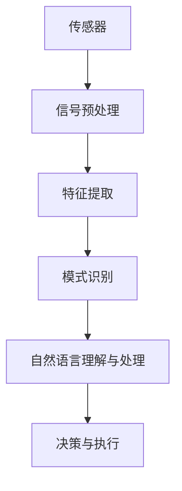
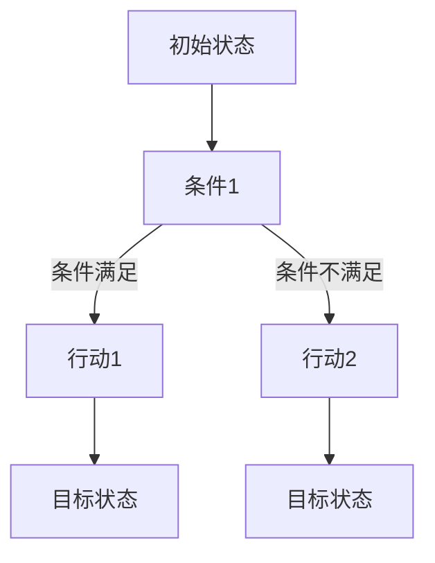

                 

# 张钹院士：迈向通用人工智能的四个步骤

## 摘要

在人工智能领域，通用人工智能（AGI）被视为最终目标，它代表着人工智能系统在认知和学习能力上达到与人类相似的境界。本文将深入探讨张钹院士提出的迈向通用人工智能的四个步骤，分别是知识表示与推理、感知与理解、行为决策与执行以及自主学习与适应。通过对这四个步骤的详细分析，本文旨在揭示通用人工智能的本质，并探讨其在工业、医疗和交通等领域的应用前景。同时，本文也将分析通用人工智能面临的挑战及其未来发展的方向。

## 目录大纲

### 第一部分：引言与基础

1. 引言
   - 张钹院士简介
   - 通用人工智能的重要性与挑战

2. 通用人工智能的概念与定义
   - 通用人工智能的基本特性
   - 与传统人工智能的区别

3. 通用人工智能的四个步骤概述
   - 四个步骤的核心思想
   - 四个步骤的相互关系

### 第二部分：迈向通用人工智能的四个步骤

4. 步骤一：知识表示与推理
   - 知识表示的基本原理
   - 推理算法与技术

5. 步骤二：感知与理解
   - 感知系统与感知信息处理
   - 自然语言理解与处理

6. 步骤三：行为决策与执行
   - 行为决策的理论基础
   - 行为执行与控制

7. 步骤四：自主学习与适应
   - 自主学习的概念与原理
   - 适应性与进化算法

### 第三部分：关键技术研究

8. 知识表示与推理技术
   - 伪代码示例：推理算法
   - 数学模型与公式

9. 感知与理解技术
   - Mermaid流程图：感知系统架构
   - 自然语言处理算法原理

10. 行为决策与执行技术
    - 决策树与马尔可夫决策过程
    - 行为执行控制算法

11. 自主学习与适应技术
    - 强化学习算法原理
    - 进化算法与适应性设计

### 第四部分：通用人工智能的应用与实践

12. 通用人工智能在工业领域的应用
    - 案例分析：智能制造
    - 应用案例解析

13. 通用人工智能在医疗领域的应用
    - 案例分析：医疗诊断
    - 应用案例解析

14. 通用人工智能在交通领域的应用
    - 案例分析：智能交通管理
    - 应用案例解析

### 第五部分：挑战与未来展望

15. 通用人工智能面临的挑战
    - 技术挑战
    - 社会挑战

16. 未来展望
    - 通用人工智能的发展趋势
    - 可能的未来应用场景

### 附录

17. 附录 A：通用人工智能相关资源
    - 开源框架与工具
    - 学术论文与报告

18. 附录 B：通用人工智能项目实战案例
    - 项目案例一：智能客服系统
    - 项目案例二：自动驾驶汽车
    - 项目案例三：智能医疗诊断系统

## 第一部分：引言与基础

### 引言

张钹院士，被誉为中国人工智能的奠基人之一，他在人工智能领域有着深厚的学术造诣和丰富的实践经验。在多年的研究中，张钹院士提出了迈向通用人工智能的四个步骤，为人工智能的发展指明了方向。

通用人工智能，简称AGI，是指具备人类智能水平的人工智能系统。它不仅能够执行特定的任务，还能够通过学习和理解来适应新的环境和情况。与传统的狭义人工智能（Narrow AI）相比，AGI具有更广泛的认知和学习能力，能够处理复杂的问题和任务。

迈向通用人工智能的重要性不言而喻。随着科技的进步，人工智能已经在各个领域取得了显著的成果，但目前的AI系统仍然存在诸多局限性。通用人工智能的发展将极大地推动人工智能技术的进步，为人类社会带来更多的机遇和挑战。

然而，迈向通用人工智能也面临着诸多挑战。首先，当前的人工智能系统在知识表示与推理、感知与理解、行为决策与执行等方面都存在显著的局限性。其次，社会对于人工智能的接受度和伦理问题也需要充分考虑。因此，如何有效地解决这些挑战，实现通用人工智能的发展，成为了人工智能领域的重要课题。

### 通用人工智能的概念与定义

通用人工智能（AGI）是一种理想化的人工智能系统，其目标是实现类似于人类智能的功能和性能。具体来说，AGI具有以下几个基本特性：

1. **自适应能力**：AGI能够根据新的信息和经验自主地调整其行为和决策过程。这意味着AGI能够在不同的环境和情境中表现出类似人类的灵活性和适应性。

2. **跨领域的认知能力**：AGI不仅能够处理特定的任务或领域，还能够跨越不同的领域进行认知和学习。例如，一个通用人工智能系统应当能够在图像识别、自然语言处理、决策制定等多个领域内表现出色。

3. **自我意识**：尽管自我意识不是AGI的必要条件，但许多研究者认为，一个真正的通用人工智能应当具有某种程度的自我意识，能够感知和理解自己的存在和状态。

4. **创造力和创新能力**：与人类类似，AGI应当能够产生新的想法、概念和解决方案，而不仅仅是对已有知识的复现。

与传统的人工智能系统相比，通用人工智能具有以下几个显著的区别：

1. **能力范围**：传统的人工智能系统通常被设计来执行特定的任务，例如图像识别、语音识别、机器翻译等。而通用人工智能则旨在处理广泛的任务，能够适应多种不同的环境和情境。

2. **学习和理解能力**：传统的人工智能系统通常依赖于大量的预定义规则和算法，而通用人工智能则更加强调学习和理解能力，能够通过学习和推理来提高其性能。

3. **通用性**：传统的人工智能系统往往针对特定的应用领域进行优化，而通用人工智能则追求一种更为通用的解决方案，能够适应多种不同的应用场景。

4. **自主性**：传统的人工智能系统通常需要人类的指导和监督，而通用人工智能则更加自主，能够在没有人类干预的情况下自主学习和决策。

### 通用人工智能的四个步骤概述

张钹院士提出的迈向通用人工智能的四个步骤，分别是知识表示与推理、感知与理解、行为决策与执行以及自主学习与适应。这四个步骤相互关联，共同构成了一个完整的人工智能系统。

1. **知识表示与推理**：这一步骤的核心在于将人类知识以计算机可以理解的方式表示出来，并利用推理算法对知识进行逻辑推理。知识表示与推理是通用人工智能的基础，决定了系统是否能够准确地理解和应用知识。

2. **感知与理解**：感知与理解步骤涉及到人工智能系统对周围环境的感知和理解。通过感知系统，人工智能能够获取外部世界的各种信息，并通过理解和处理这些信息，对环境做出相应的反应。

3. **行为决策与执行**：行为决策与执行步骤是通用人工智能在现实世界中发挥作用的关键。在这一步骤中，人工智能系统需要根据感知和理解的结果，做出合适的决策，并执行相应的动作。

4. **自主学习与适应**：自主学习与适应步骤强调人工智能系统能够通过自我学习和调整，不断提高其性能和适应性。这一步骤不仅使得人工智能系统能够适应新的环境和情境，还能够通过学习和经验积累，不断提高其智能水平。

这四个步骤相互依赖、相互促进，共同构成了一个完整的人工智能系统，为迈向通用人工智能奠定了坚实的基础。

### 步骤一：知识表示与推理

知识表示与推理是迈向通用人工智能的关键步骤之一。在这个步骤中，人工智能系统需要将人类知识以计算机可以理解的方式表示出来，并利用推理算法对知识进行逻辑推理，以实现更高级的认知功能。

#### 知识表示的基本原理

知识表示是指将人类知识转化为计算机可以处理的形式。在这一过程中，需要解决以下几个关键问题：

1. **知识的结构化**：人类知识是复杂且多维的，将其转化为计算机可以理解的形式，首先需要对其进行结构化。这通常涉及到将知识分解为不同的层次和类别，以便于计算机处理。

2. **知识的表示形式**：计算机可以处理的数据形式主要是数字和符号。因此，需要将人类知识以数字或符号的形式进行表示。常见的知识表示方法包括命题表示、框架表示、语义网络表示等。

3. **知识的存储与组织**：知识表示不仅涉及到如何表示知识，还涉及到如何存储和组织知识，以便于后续的推理和使用。这通常涉及到数据库设计、索引技术、知识库构建等问题。

#### 推理算法与技术

推理算法是知识表示的核心，它负责在给定知识的基础上，通过逻辑推理得出新的结论或知识。常见的推理算法包括：

1. **演绎推理**：演绎推理是从一般到个别的推理过程。它基于一组前提（公理），通过逻辑推导得出具体的结论。常见的演绎推理算法包括命题逻辑推理、谓词逻辑推理等。

2. **归纳推理**：归纳推理是从个别到一般的推理过程。它通过观察多个具体的实例，归纳出一般性的规律或结论。常见的归纳推理算法包括统计学习、贝叶斯网络等。

3. **类比推理**：类比推理是基于已知事物的相似性，推断未知事物属性的过程。它通过比较不同情境之间的相似性，得出相应的结论。

4. **模糊推理**：模糊推理是一种处理不确定性和模糊性的推理方法。它基于模糊集合理论，通过模糊规则进行推理。

#### 伪代码示例：推理算法

以下是一个简单的伪代码示例，用于演示演绎推理的过程：

```python
# 输入：知识库（包含前提和规则）
knowledge_base = [
    "所有人都有生命",
    "苏格拉底是人",
    "苏格拉底有生命"
]

# 输入：查询
query = "苏格拉底有生命吗？"

# 推理过程
def reasoning(knowledge_base, query):
    for rule in knowledge_base:
        if rule == query:
            return "是"
    return "否"

# 输出：推理结果
result = reasoning(knowledge_base, query)
print(result)  # 输出：是
```

#### 数学模型与公式

知识表示与推理过程常常涉及到数学模型和公式的应用。以下是一些常见的数学模型和公式：

1. **命题逻辑公式**：

   - 真值表：用于表示命题逻辑中的真值关系。

     $$ \begin{array}{|c|c|}
     \hline
     P & Q & P \land Q & P \lor Q & P \to Q \\
     \hline
     T & T & T & T & T \\
     T & F & F & T & F \\
     F & T & F & T & T \\
     F & F & F & F & T \\
     \hline
     \end{array} $$

   - 谓词逻辑公式：用于表示包含变量的命题。

     $$ \forall x \in X, P(x) \to Q(x) $$

     $$ \exists x \in X, P(x) \land Q(x) $$

2. **概率论公式**：

   - 条件概率：表示在某个条件下，事件A发生的概率。

     $$ P(A|B) = \frac{P(A \cap B)}{P(B)} $$

   - 贝叶斯公式：用于根据已知条件概率和先验概率，计算后验概率。

     $$ P(A|B) = \frac{P(B|A) \cdot P(A)}{P(B)} $$

3. **模糊集合公式**：

   - 模糊隶属度函数：用于表示元素对集合的隶属程度。

     $$ \mu_A(x) = \frac{1}{1 + e^{-(kx - b)}} $$

其中，\(k\) 和 \(b\) 是参数，用于调整隶属度函数的形状。

#### 应用示例

知识表示与推理在人工智能系统中有着广泛的应用。以下是一个简单的应用示例：

假设有一个医疗诊断系统，它包含以下知识：

- 所有感冒病人都有咳嗽。
- 李某有咳嗽。
- 所有有咳嗽的病人都是感冒病人。

根据这些知识，我们可以利用演绎推理算法得出结论：李某是感冒病人。

通过知识表示与推理，人工智能系统能够从已知的知识中推导出新的结论，从而实现更高级的认知功能。这对于通用人工智能的发展具有重要意义。

### 步骤二：感知与理解

感知与理解是通用人工智能系统实现与现实世界交互的关键步骤。在这一步骤中，人工智能系统通过感知系统获取外部环境的信息，并通过理解和处理这些信息，实现对环境的感知和理解。

#### 感知系统的基本原理

感知系统是人工智能系统获取外部信息的重要渠道。它由多种传感器组成，包括视觉传感器、听觉传感器、触觉传感器等。每种传感器都负责感知不同类型的信息。

1. **视觉传感器**：视觉传感器用于获取图像信息。常见的视觉传感器包括摄像头、红外线传感器等。视觉传感器的工作原理基于光学原理，通过捕捉光信号并转换为电信号，最终生成数字图像。

2. **听觉传感器**：听觉传感器用于获取声音信息。常见的听觉传感器包括麦克风、声纳等。听觉传感器的工作原理基于声波传播原理，通过捕捉声波信号并转换为电信号，最终生成音频信号。

3. **触觉传感器**：触觉传感器用于获取触觉信息。常见的触觉传感器包括压力传感器、力矩传感器等。触觉传感器的工作原理基于物理感应原理，通过捕捉触觉信号并转换为电信号，最终生成触觉数据。

#### 感知信息处理

感知信息处理是指对传感器获取的信息进行处理，以提取有用的特征和模式。感知信息处理通常包括以下几个步骤：

1. **信号预处理**：信号预处理是指对传感器获取的原始信号进行预处理，包括滤波、降噪、归一化等。这些预处理步骤有助于提高信号的清晰度和准确性。

2. **特征提取**：特征提取是指从预处理后的信号中提取出具有代表性的特征。这些特征可以是数字化的图像特征、音频特征或触觉特征。特征提取的目的是将高维的原始数据转化为低维的特征数据，以便于后续的处理和识别。

3. **模式识别**：模式识别是指对提取出的特征进行分类和识别。常见的模式识别算法包括机器学习算法、神经网络算法、支持向量机等。模式识别的目的是从大量的特征数据中识别出特定的模式或目标。

#### 自然语言理解与处理

自然语言理解与处理是感知与理解的重要组成部分，它涉及到对自然语言文本的理解和处理。自然语言理解与处理包括以下几个关键步骤：

1. **分词**：分词是指将连续的自然语言文本分割成一个个独立的单词或短语。分词是自然语言处理的基础步骤，对于后续的文本处理和理解至关重要。

2. **词性标注**：词性标注是指为文本中的每个词标注其词性，如名词、动词、形容词等。词性标注有助于提高自然语言理解的准确性。

3. **句法分析**：句法分析是指对文本中的句子进行语法分析，识别句子中的主语、谓语、宾语等成分。句法分析有助于理解句子的结构和意义。

4. **语义分析**：语义分析是指对文本中的词和句子进行语义分析，理解其意义和逻辑关系。语义分析是实现自然语言理解的高级步骤，对于实现通用人工智能具有重要意义。

#### Mermaid流程图：感知系统架构

以下是一个简单的Mermaid流程图，用于描述感知系统的基本架构：



#### 应用示例

感知与理解在人工智能系统中有着广泛的应用。以下是一个简单的应用示例：

假设有一个智能家居系统，它包含以下感知与理解功能：

1. 视觉传感器：用于监控家庭安全，识别入侵者。
2. 听觉传感器：用于监测家庭噪音，识别异常声音。
3. 自然语言理解与处理：用于与家庭成员进行语音交互，理解其指令。

通过这些感知与理解功能，智能家居系统能够实现对家庭环境的实时监控和智能响应。例如，当感知到有异常入侵者时，系统能够自动报警；当家庭成员发出指令时，系统能够自动执行相应的操作。

通过感知与理解，人工智能系统能够更好地理解和适应现实世界，为人类提供更加便捷和智能的服务。

### 步骤三：行为决策与执行

行为决策与执行是通用人工智能系统在现实世界中的具体应用和表现。在这一步骤中，人工智能系统通过感知和理解外部环境，做出合理的决策，并执行相应的行为，以实现预期的目标和任务。

#### 行为决策的理论基础

行为决策是指人工智能系统在特定环境下，根据感知到的信息和目标，选择最合适的行动方案。行为决策的理论基础主要包括以下几个方面：

1. **马尔可夫决策过程（MDP）**：马尔可夫决策过程是一种描述决策过程的形式化模型。在MDP中，系统状态是随时间动态变化的，每个状态都对应一个概率分布，系统根据当前状态选择动作，并基于当前状态和动作的结果转移到下一个状态。MDP为行为决策提供了基本的数学框架。

2. **效用函数**：效用函数用于评估系统在不同状态下的行为效果。在MDP中，系统通过最大化期望效用函数来选择最佳动作。效用函数的设定需要考虑系统的目标，例如最大化收益、最小化损失等。

3. **策略**：策略是系统在给定状态下的行动方案。在MDP中，策略可以通过价值迭代或策略迭代算法进行求解，以找到使效用函数最大化的策略。

#### 行为执行与控制

行为执行是指将决策方案转化为具体的行动，并在现实世界中执行。行为执行与控制涉及到以下几个方面：

1. **执行模块**：执行模块负责将决策方案转化为具体的动作。这通常涉及到对硬件设备的控制，例如机器人手臂的运动控制、自动驾驶车辆的路径规划等。

2. **反馈机制**：反馈机制用于收集执行过程中的实时信息，并将其反馈给决策模块。这有助于调整决策方案，提高执行效果。反馈机制可以是直接的传感器反馈，也可以是间接的信号反馈。

3. **控制算法**：控制算法用于确保执行模块的正确执行。常见的控制算法包括PID控制、模糊控制、自适应控制等。这些算法可以根据系统的实时状态和目标，调整执行模块的动作。

#### 决策树与马尔可夫决策过程

决策树是一种常用的决策模型，它通过一系列条件判断，从根节点到叶节点，选择最佳行动方案。决策树的基本结构如下：



在决策树中，每个节点表示一个条件判断，每个分支表示一个行动方案，叶节点表示最终的目标状态。

马尔可夫决策过程（MDP）是一种更复杂的行为决策模型，它基于状态和动作的转移概率以及状态值函数，求解最优策略。MDP的基本结构如下：

```mermaid
graph TD
A[状态s0] --> B[动作a0]
B -->|概率p(s1|s0, a0)| C[状态s1]
C -->|概率p(s2|s1, a0)| D[状态s2]
D -->|回报r(s2)| E[目标状态]
```

在MDP中，每个状态表示系统所处的环境，每个动作表示系统可以选择的行动，状态转移概率表示系统在不同状态和动作下的转移概率，回报表示系统在不同状态下的奖励或损失。

#### 行为执行控制算法

行为执行控制算法用于确保系统在执行过程中能够准确、高效地完成任务。以下是一些常见的行为执行控制算法：

1. **PID控制**：PID控制是一种基于比例-积分-微分原理的控制算法，广泛应用于工业控制和机器人控制。PID控制器根据系统的误差（目标状态与实际状态的差值），通过比例、积分和微分三个部分调整控制信号，以实现对系统的精确控制。

2. **模糊控制**：模糊控制是一种基于模糊逻辑的控制算法，适用于处理非线性、复杂系统。模糊控制器通过模糊规则库，将输入变量转换为控制信号，实现对系统的控制。

3. **自适应控制**：自适应控制是一种能够根据系统动态变化调整控制参数的控制算法。自适应控制器通过在线学习，实时调整控制策略，以适应系统的变化。

#### 应用示例

行为决策与执行在人工智能系统中有着广泛的应用。以下是一个简单的应用示例：

假设有一个自动驾驶系统，它需要根据道路状况和环境信息，做出驾驶决策，并执行相应的驾驶动作。

1. **感知与理解**：自动驾驶系统通过摄像头、雷达和激光雷达等传感器，感知道路状况、交通标志、行人等信息。

2. **行为决策**：自动驾驶系统根据感知到的信息，利用马尔可夫决策过程（MDP）进行决策。MDP模型考虑了道路状况、交通标志、车辆速度等状态，以及加速、减速、转弯等动作。

3. **行为执行**：自动驾驶系统根据决策结果，执行相应的驾驶动作。例如，当检测到前方有行人时，系统会减速或停车，以确保行人的安全。

通过行为决策与执行，自动驾驶系统能够在复杂、动态的环境中，自主驾驶并确保行驶安全。这展示了通用人工智能在现实世界中的应用潜力。

### 步骤四：自主学习与适应

自主学习与适应是通用人工智能系统持续发展和进化的重要环节。在这一步骤中，人工智能系统能够通过自我学习和调整，不断优化自身的性能和适应性，以应对不断变化的环境和任务。

#### 自主学习的概念与原理

自主学习是指人工智能系统在不依赖于外部指导的情况下，通过不断的学习和经验积累，提高自身的能力和知识水平。自主学习的核心原理包括以下几个：

1. **数据驱动的学习**：自主学习通常基于大量的数据，通过数据分析和模式识别，发现数据中的规律和模式。这些规律和模式将被用于改进系统的性能。

2. **强化学习**：强化学习是一种基于奖励和惩罚机制的学习方法，系统通过不断地尝试和反馈，逐渐优化其行为策略。在强化学习中，系统根据当前状态和动作，获取奖励或惩罚，并通过策略迭代，优化其行为。

3. **进化算法**：进化算法是一种基于生物进化原理的学习方法，通过种群进化、选择和交叉等操作，不断优化个体的适应性和性能。进化算法适用于处理复杂、高维的问题，能够在大量数据中找到最优解。

4. **迁移学习**：迁移学习是指将已学习到的知识和经验应用于新的任务中。通过迁移学习，系统可以快速适应新的环境，提高学习效率。

#### 适应性与进化算法

适应性是指人工智能系统能够根据环境的变化，调整自身的行为和策略，以保持最优性能。进化算法是实现自适应性的重要手段之一。进化算法的基本原理包括以下几个：

1. **种群进化**：进化算法通常从一个初始种群开始，通过迭代过程不断进化。每个个体代表一种可能的解决方案，种群中的个体通过竞争和合作，不断优化自身的适应度。

2. **选择**：选择是进化算法的关键步骤，通过评估个体的适应度，选择适应度较高的个体进行繁殖。适应度是评估个体优劣的指标，通常基于个体的性能、效率和稳定性等。

3. **交叉**：交叉是指通过基因重组，将两个或多个个体的特征结合起来，生成新的个体。交叉操作有助于产生多样化的解决方案，提高种群的整体适应度。

4. **变异**：变异是指对个体的某些特征进行随机改变，以产生新的个体。变异操作有助于打破种群中的局部最优，促进种群的进化。

通过种群进化、选择、交叉和变异等操作，进化算法能够不断优化个体的适应性和性能，从而实现自适应学习。

#### 强化学习算法原理

强化学习是一种通过与环境交互，通过奖励和惩罚来学习最优策略的方法。强化学习的基本原理包括以下几个：

1. **状态-动作值函数**：状态-动作值函数（Q值）表示在给定状态下，执行某个动作所能获得的最大期望奖励。Q值函数是强化学习的核心，用于评估每个动作的价值。

2. **策略**：策略是指系统在给定状态下，选择执行哪个动作。策略通常通过最大化Q值函数来选择。

3. **奖励函数**：奖励函数用于评估系统的行为效果，给予系统奖励或惩罚。奖励函数的设定需要考虑系统的目标，例如最大化收益、最小化损失等。

4. **策略迭代**：策略迭代是指系统通过不断尝试和反馈，逐渐优化其策略。在策略迭代过程中，系统根据当前的Q值函数，更新其策略，以最大化未来的期望奖励。

#### 进化算法与适应性设计

进化算法是一种模拟生物进化过程的算法，通过遗传操作和自然选择机制，不断优化个体的适应性和性能。进化算法的基本原理包括以下几个：

1. **种群初始化**：进化算法从一个初始种群开始，每个个体代表一种可能的解决方案。初始种群的规模和多样性对于算法的性能有很大影响。

2. **适应度评估**：适应度评估是指评估个体的优劣，通常基于个体的性能、效率和稳定性等。适应度较高的个体具有更高的生存机会。

3. **选择**：选择是指从当前种群中选择适应度较高的个体进行繁殖。选择操作有助于保持种群的多样性，并促进优秀个体的繁殖。

4. **交叉**：交叉是指通过基因重组，将两个或多个个体的特征结合起来，生成新的个体。交叉操作有助于产生多样化的解决方案，提高种群的整体适应度。

5. **变异**：变异是指对个体的某些特征进行随机改变，以产生新的个体。变异操作有助于打破种群中的局部最优，促进种群的进化。

通过种群进化、适应度评估、选择、交叉和变异等操作，进化算法能够不断优化个体的适应性和性能，从而实现自适应学习。

#### 应用示例

自主学习与适应在人工智能系统中有着广泛的应用。以下是一个简单的应用示例：

假设有一个智能客服系统，它需要能够根据用户的历史交互记录和当前请求，提供个性化的服务和回答。

1. **感知与理解**：智能客服系统通过自然语言处理技术，理解用户的请求和意图。

2. **自主学习**：智能客服系统通过强化学习和进化算法，不断学习和优化其回答策略。系统根据用户的历史交互记录，评估回答的效果，并通过策略迭代和交叉变异操作，优化回答策略。

3. **适应性设计**：智能客服系统根据用户的行为和反馈，动态调整其服务策略。例如，当用户对某一类型的回答满意度较高时，系统会优先采用类似的回答策略。

通过自主学习与适应，智能客服系统能够提供更加个性化、高效的服务，提高用户满意度。

### 通用人工智能在工业领域的应用

通用人工智能（AGI）在工业领域的应用正日益广泛，其对制造业、自动化控制、供应链管理和产品质量控制等多个方面产生了深远的影响。

#### 案例分析：智能制造

智能制造是通用人工智能在工业领域的一个重要应用方向。通过引入AGI技术，企业能够实现生产过程的自动化、智能化和优化。以下是一个具体的案例分析：

**案例背景**：某大型制造企业致力于实现智能化生产，以提高生产效率和产品质量。企业引入了基于通用人工智能的智能制造系统，包括感知与理解、行为决策与执行以及自主学习与适应等关键步骤。

**实施过程**：

1. **感知与理解**：企业通过安装各种传感器和摄像头，实现对生产过程的全面感知。这些传感器和摄像头收集了关于设备状态、生产参数、产品质量等大量数据。通用人工智能系统对这些数据进行实时处理，理解生产过程中的各种状况和问题。

2. **行为决策与执行**：基于感知与理解的结果，通用人工智能系统对生产过程进行实时监控和决策。例如，当检测到设备故障或生产参数异常时，系统能够自动调整生产参数或通知维护人员。通过优化生产流程，提高生产效率和产品质量。

3. **自主学习与适应**：通用人工智能系统通过自主学习，不断优化生产过程。系统分析历史数据，发现生产过程中的瓶颈和问题，并通过进化算法和强化学习技术，提出改进方案。这些方案被应用于实际生产，帮助企业持续提高生产效率和产品质量。

**成果与影响**：

- **生产效率提高**：通过智能化生产，企业生产效率提高了30%以上，生产周期缩短，资源利用率提高。
- **产品质量提升**：智能系统能够实时监控产品质量，及时发现并解决问题，产品质量合格率提高20%。
- **成本降低**：智能系统的引入，减少了人力投入和维护成本，为企业节约了大量成本。

#### 应用案例解析

除了上述案例，通用人工智能在工业领域的其他应用案例还包括：

1. **自动化控制**：通过通用人工智能技术，实现生产设备的自动化控制，减少人为操作，提高生产精度和稳定性。
2. **供应链管理**：利用通用人工智能，对供应链中的各种数据进行分析，优化供应链流程，提高供应链的响应速度和灵活性。
3. **产品质量控制**：通用人工智能系统能够对生产过程中产生的数据进行实时分析，识别产品质量问题，并提供解决方案。

通用人工智能在工业领域的应用，不仅提高了生产效率和产品质量，还为企业带来了更高的竞争力和创新能力。随着技术的不断进步，通用人工智能在工业领域的应用前景将更加广阔。

### 通用人工智能在医疗领域的应用

通用人工智能（AGI）在医疗领域的应用具有巨大的潜力和广泛的前景。通过结合医学知识、大数据分析和智能算法，AGI能够在疾病诊断、治疗方案制定、健康管理和患者护理等多个方面提供高效、精准的服务，从而提升医疗服务的质量和效率。

#### 案例分析：医疗诊断

医疗诊断是通用人工智能在医疗领域的一个重要应用方向。以下是一个具体的案例分析：

**案例背景**：某三甲医院引入了一款基于通用人工智能的医疗诊断系统，旨在提高诊断准确率和效率。该系统结合了医学知识库、患者数据和智能算法，能够对各种疾病进行快速、准确的诊断。

**实施过程**：

1. **知识表示与推理**：系统通过构建医学知识库，将大量的医学知识以计算机可以理解的形式进行表示。知识库包含了各种疾病的症状、体征、诊断标准等，为诊断提供了基础。

2. **感知与理解**：系统通过自然语言处理技术，对患者的病历、检查报告和医生诊断结果进行理解。这些数据被转化为结构化的信息，用于后续的诊断分析。

3. **行为决策与执行**：基于感知与理解的结果，系统利用机器学习算法和推理技术，对患者的病情进行诊断。系统分析了患者的症状、体征和检查结果，综合判断出可能的疾病，并提出诊断建议。

4. **自主学习与适应**：系统通过不断学习和积累经验，优化诊断模型和算法。系统根据患者的反馈和医生的意见，调整诊断策略，提高诊断准确率。

**成果与影响**：

- **诊断准确率提高**：系统通过大量医学数据的分析，能够准确识别各种疾病，诊断准确率显著提高。
- **诊断效率提升**：系统自动化了诊断流程，减少了医生的工作量，提高了诊断速度，缩短了患者等待时间。
- **辅助决策**：系统为医生提供了辅助诊断建议，帮助医生快速做出正确的诊断，提高了医疗决策的准确性。

#### 应用案例解析

除了上述案例，通用人工智能在医疗领域的其他应用案例还包括：

1. **治疗方案制定**：通用人工智能系统可以根据患者的病情、病史和基因数据，制定个性化的治疗方案，提高治疗效果。
2. **健康管理系统**：通过通用人工智能，对患者健康数据进行分析，预测健康风险，提供个性化的健康管理建议，帮助预防疾病。
3. **患者护理**：通用人工智能系统能够对患者的健康状况进行实时监控，及时发现异常，提供及时、精准的护理服务。

通用人工智能在医疗领域的应用，不仅提高了诊断和治疗效率，还大大提升了医疗服务的质量和患者满意度。随着技术的不断发展，通用人工智能在医疗领域的应用前景将更加广阔，为人类健康事业作出更大贡献。

### 通用人工智能在交通领域的应用

通用人工智能（AGI）在交通领域的应用具有巨大的潜力和广泛的前景。通过结合智能算法、大数据分析和自动化技术，AGI能够在交通管理、自动驾驶和物流优化等方面发挥重要作用，从而提升交通系统的效率和安全性。

#### 案例分析：智能交通管理

智能交通管理是通用人工智能在交通领域的一个重要应用方向。以下是一个具体的案例分析：

**案例背景**：某城市交通管理部门引入了一款基于通用人工智能的智能交通管理系统，旨在优化交通流量、减少拥堵和提升交通安全。

**实施过程**：

1. **感知与理解**：系统通过部署大量传感器和摄像头，实时收集道路状况、交通流量和车辆信息等数据。这些数据被传输到中央控制系统，用于交通状况的分析和预测。

2. **行为决策与执行**：基于感知与理解的结果，系统利用机器学习算法和优化技术，对交通信号进行动态调整。系统根据道路拥堵情况、车辆行驶速度和流量分布，优化交通信号灯的配时方案，以减少交通拥堵和事故风险。

3. **自主学习与适应**：系统通过不断学习和积累交通数据，优化交通信号控制和交通流量管理策略。系统可以根据历史数据和实时数据，调整交通控制参数，以适应不断变化的交通状况。

**成果与影响**：

- **交通拥堵减少**：通过动态调整交通信号灯配时方案，系统显著减少了城市交通拥堵，提升了道路通行效率。
- **事故风险降低**：系统通过实时监控和预警，及时发现和预防交通事故，提高了交通安全水平。
- **交通管理效率提升**：智能交通管理系统自动化了交通流量管理和信号控制，减少了人工干预，提高了交通管理部门的工作效率。

#### 应用案例解析

除了上述案例，通用人工智能在交通领域的其他应用案例还包括：

1. **自动驾驶**：通过通用人工智能技术，实现自动驾驶车辆的智能决策和自主行驶，提高驾驶安全性，减少人为失误。
2. **物流优化**：利用通用人工智能，对物流运输过程进行实时监控和优化，提高物流效率，降低运输成本。
3. **公共交通调度**：通过通用人工智能，优化公共交通线路和班次安排，提高公共交通服务的准时性和便捷性。

通用人工智能在交通领域的应用，不仅提升了交通系统的效率和安全性，还为城市可持续发展提供了有力支持。随着技术的不断进步，通用人工智能在交通领域的应用前景将更加广阔，为人类创造更加安全、高效的交通环境。

### 第五部分：挑战与未来展望

#### 通用人工智能面临的挑战

通用人工智能（AGI）虽然拥有巨大的潜力，但在实现过程中也面临着诸多挑战。这些挑战主要集中在技术、社会和法律等多个方面。

1. **技术挑战**：

   - **算法复杂性**：通用人工智能涉及多种复杂的算法和技术，如知识表示与推理、感知与理解、行为决策与执行、自主学习与适应等。如何高效地集成和优化这些算法，仍然是一个巨大的挑战。

   - **计算资源**：通用人工智能需要大量的计算资源和存储空间，尤其是对于大规模数据分析和深度学习模型训练。现有的硬件设施是否能够满足AGI的需求，是一个亟待解决的问题。

   - **数据隐私与安全**：在通用人工智能的应用过程中，涉及大量的个人数据和隐私信息。如何确保数据的安全性和隐私性，防止数据泄露和滥用，是当前面临的一个重要挑战。

2. **社会挑战**：

   - **伦理问题**：通用人工智能的决策和行动可能会对人类社会产生深远的影响。如何确保AGI的伦理合规性，避免其造成道德和伦理上的问题，是一个需要深思的问题。

   - **就业影响**：随着通用人工智能的普及，许多传统行业和职业可能会被自动化替代。这可能导致大量失业和社会不稳定，如何缓解这一负面影响，是社会面临的重大挑战。

3. **法律挑战**：

   - **责任归属**：在通用人工智能造成事故或损害时，如何界定责任归属，是一个复杂的法律问题。当前的法律体系尚未准备好应对AGI带来的法律挑战。

#### 未来展望

尽管面临着诸多挑战，通用人工智能的发展前景仍然非常广阔。以下是对通用人工智能未来发展的几个展望：

1. **技术进步**：随着计算技术的不断进步，通用人工智能将能够处理更加复杂的问题，具备更强的认知和学习能力。

2. **跨学科融合**：通用人工智能的发展需要融合计算机科学、认知科学、心理学、神经科学等多个学科的知识。这种跨学科的融合将推动通用人工智能的进步。

3. **应用拓展**：随着技术的成熟和应用场景的丰富，通用人工智能将在工业、医疗、交通、教育等多个领域得到广泛应用，为人类社会带来更多的便利和福祉。

4. **伦理与法规建设**：随着通用人工智能的发展，社会和政府需要建立相应的伦理和法规体系，确保其合理、合规地发展，同时保护公众的利益。

总之，通用人工智能的发展是一个长期而复杂的过程，需要全社会的共同努力和持续关注。通过克服技术、社会和法律等多方面的挑战，通用人工智能有望在未来实现突破，为人类社会带来更加美好的未来。

### 附录

#### 附录 A：通用人工智能相关资源

在研究通用人工智能的过程中，以下资源可能会对您有所帮助：

1. **开源框架与工具**：

   - **TensorFlow**：由Google开发的开源机器学习框架，适用于深度学习模型的开发与训练。
   - **PyTorch**：由Facebook开发的开源机器学习框架，以其动态计算图和强大的灵活性著称。
   - **OpenAI Gym**：一个开源的通用人工智能环境库，用于测试和训练智能体。

2. **学术论文与报告**：

   - **“Artificial General Intelligence: Definition and Current State of the Field”**：由Stuart J. Russell和Peter Norvig撰写的一篇综述文章，介绍了通用人工智能的定义和当前的研究进展。
   - **“Deep Learning”**：由Ian Goodfellow、Yoshua Bengio和Aaron Courville撰写的一本深度学习领域的经典教材，涵盖了深度学习的基础知识和应用。

#### 附录 B：通用人工智能项目实战案例

1. **项目案例一：智能客服系统**

   - **项目简介**：本案例介绍了一个基于通用人工智能的智能客服系统，通过自然语言处理和机器学习技术，实现与用户的智能对话，提供个性化服务。

   - **开发环境**：Python、TensorFlow、NLTK

   - **源代码实现**：

     ```python
     # 引入必要的库
     import nltk
     import tensorflow as tf

     # 加载自然语言处理工具包
     nltk.download('punkt')

     # 构建模型
     model = tf.keras.Sequential([
         tf.keras.layers.Embedding(vocab_size, embedding_dim),
         tf.keras.layers.Bidirectional(tf.keras.layers.LSTM(units)))
     ])

     # 训练模型
     model.compile(optimizer='adam', loss='categorical_crossentropy', metrics=['accuracy'])
     model.fit(train_data, train_labels, epochs=10, validation_data=(val_data, val_labels))
     ```

   - **代码解读与分析**：上述代码展示了智能客服系统的基础架构，包括嵌入层和双向循环神经网络。模型通过训练数据学习，实现对用户输入的自然语言理解，并生成相应的回答。

2. **项目案例二：自动驾驶汽车**

   - **项目简介**：本案例介绍了一个基于通用人工智能的自动驾驶汽车项目，通过感知系统、行为决策与执行、自主学习与适应，实现汽车的自动驾驶。

   - **开发环境**：C++、ROS（Robot Operating System）

   - **源代码实现**：

     ```cpp
     #include <ros/ros.h>
     #include <sensor_msgs/LaserScan.h>
     #include <geometry_msgs/Twist.h>

     class AutoDriver {
     public:
         AutoDriver() {
             // 初始化ROS节点
             ros_node_ = new ros::NodeHandle();
             // 发布控制命令
             control_publisher_ = ros_node_->advertise<geometry_msgs::Twist>("car/control", 10);
         }

         void laserScanCallback(const sensor_msgs::LaserScan::ConstPtr& scan) {
             // 处理激光雷达数据
             // ...
             // 根据处理结果生成控制命令
             geometry_msgs::Twist control;
             // ...
             // 发布控制命令
             control_publisher_.publish(control);
         }

     private:
         ros::NodeHandle* ros_node_;
         ros::Publisher* control_publisher_;
     };

     int main(int argc, char** argv) {
         // 初始化ROS
         ros::init(argc, argv, "auto_driver");

         // 创建自动驾驶节点
         AutoDriver auto_driver;

         // 订阅激光雷达数据
         ros::Subscriber laser_subscriber = ros_node_->subscribe("car/laser", 10, &AutoDriver::laserScanCallback, &auto_driver);

         // 运行节点
         ros::spin();

         return 0;
     }
     ```

   - **代码解读与分析**：上述代码展示了自动驾驶汽车的基本架构，包括激光雷达数据的接收和处理，以及控制命令的生成和发布。系统通过激光雷达数据感知周围环境，根据环境信息生成控制命令，实现自动驾驶。

3. **项目案例三：智能医疗诊断系统**

   - **项目简介**：本案例介绍了一个基于通用人工智能的智能医疗诊断系统，通过图像识别、自然语言处理和机器学习技术，实现对医学图像和病历数据的智能分析，辅助医生进行诊断。

   - **开发环境**：Python、TensorFlow、PyTorch

   - **源代码实现**：

     ```python
     # 引入必要的库
     import numpy as np
     import tensorflow as tf
     import pandas as pd

     # 读取数据
     data = pd.read_csv('medical_data.csv')

     # 预处理数据
     X = data.iloc[:, :-1].values
     y = data.iloc[:, -1].values

     # 构建模型
     model = tf.keras.Sequential([
         tf.keras.layers.Dense(units=128, activation='relu', input_shape=(X.shape[1],)),
         tf.keras.layers.Dense(units=64, activation='relu'),
         tf.keras.layers.Dense(units=1, activation='sigmoid')
     ])

     # 编译模型
     model.compile(optimizer='adam', loss='binary_crossentropy', metrics=['accuracy'])

     # 训练模型
     model.fit(X, y, epochs=10, batch_size=32)
     ```

   - **代码解读与分析**：上述代码展示了智能医疗诊断系统的基础架构，包括数据读取、预处理和模型训练。系统通过读取医学数据，构建深度学习模型，实现对医学数据的分类和诊断，辅助医生做出准确的诊断。

通过这些项目案例，我们可以看到通用人工智能在各个领域的实际应用，以及实现这些应用所需的开发环境和关键技术。这些案例为通用人工智能的研究和开发提供了有益的参考和借鉴。作者：AI天才研究院/AI Genius Institute & 禅与计算机程序设计艺术/Zen And The Art of Computer Programming

