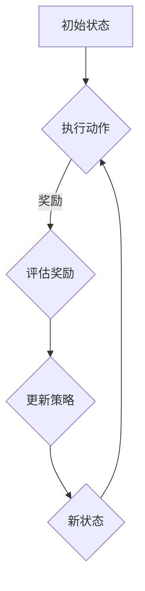

                 

### 第1章: 强化学习的核心概念与基本架构

#### 1.1 强化学习的定义与基本原理

强化学习作为机器学习的一个重要分支，旨在通过与环境交互来学习决策策略。其主要目标是使智能体（Agent）能够在不确定的环境中自主地做出最优决策，从而实现长期的奖励最大化。

**定义：**

强化学习（Reinforcement Learning, RL）是一种通过互动经验学习策略的机器学习方法。在这种方法中，智能体不断地与环境进行交互，通过接收奖励信号（Reward Signal）来指导其学习过程。智能体的目标是学习到一种最优策略（Policy），以最大化累积奖励。

**基本原理：**

强化学习的基本原理可以用马尔可夫决策过程（Markov Decision Process, MDP）来描述。一个MDP由以下五个要素组成：

1. **状态（State）**：智能体所处的环境条件。
2. **动作（Action）**：智能体可以执行的行为。
3. **策略（Policy）**：智能体决定如何从当前状态选择动作的规则。
4. **奖励（Reward）**：智能体执行某个动作后，从环境中获得的即时奖励。
5. **转移概率（Transition Probability）**：智能体在当前状态下执行某个动作后，转移到下一个状态的概率。

在强化学习中，智能体通过不断与环境互动，根据奖励信号调整其策略。学习过程可以分为以下几个步骤：

1. **初始状态**：智能体处于某个初始状态。
2. **选择动作**：智能体根据当前状态和策略选择一个动作。
3. **执行动作**：智能体执行所选动作，并观察环境反馈。
4. **更新策略**：根据观察到的奖励信号和执行的动作，智能体更新其策略。
5. **新状态**：环境根据执行的动作更新状态，并返回给智能体。

这个过程不断重复，直到智能体学会一个稳定的策略。强化学习的核心挑战是如何设计有效的策略学习算法，以最大化累积奖励。

#### 1.2 强化学习的 Mermaid 流程图

下面是一个使用Mermaid绘制的强化学习流程图，它展示了智能体与环境交互的过程：



在这个流程图中，智能体首先处于一个初始状态（A），然后根据当前状态和策略选择一个动作（B）。执行动作后，智能体会接收到环境的奖励信号（C），并据此更新其策略。接着，环境会更新状态，并将新的状态（E）返回给智能体。这个过程持续进行，直到智能体学会一个稳定的策略。

#### 1.3 强化学习的基本架构

强化学习的基本架构由以下几个关键组件组成：

1. **代理（Agent）**：代理是强化学习系统的核心，负责执行动作、接收奖励和更新策略。代理通常由一个策略网络和一个值网络组成。策略网络负责根据当前状态选择最优动作，而值网络则评估当前状态的价值。

2. **环境（Environment）**：环境是代理所交互的世界，提供状态和奖励。环境可以是现实世界，也可以是模拟的虚拟环境。环境需要能够准确地反馈代理的动作效果，并提供即时奖励。

3. **状态（State）**：状态是代理当前所处的环境条件。状态可以是一个向量，表示环境中的各种特征。状态的数量和维度会影响强化学习算法的计算复杂度和学习效率。

4. **动作（Action）**：动作是代理可以执行的行为。动作可以是离散的，也可以是连续的。离散动作通常通过策略网络来选择，而连续动作则可能需要使用特殊的算法来处理。

5. **策略（Policy）**：策略是代理决定如何从当前状态选择动作的规则。策略可以是确定性策略（总是选择相同动作），也可以是非确定性策略（根据概率分布选择动作）。

6. **奖励（Reward）**：奖励是代理执行某个动作后，从环境中获得的即时奖励。奖励可以是正值、负值或零，表示代理行为的优劣。奖励的设计对于强化学习算法的性能至关重要。

7. **价值函数（Value Function）**：价值函数评估代理在特定状态下执行特定动作所能获得的长期奖励。价值函数可以分为状态价值函数（V(s)）和状态-动作价值函数（Q(s, a)）。价值函数的目的是帮助代理选择最优动作。

通过这些组件的协同工作，强化学习系统能够不断地学习和优化其行为，以实现长期的奖励最大化。在下一章中，我们将深入探讨强化学习的核心算法原理，包括Q-learning、SARSA和DQN等经典算法。

#### 第2章: 强化学习的核心算法原理

强化学习的核心算法原理是理解其如何通过与环境互动来学习最优策略的关键。在本章中，我们将详细探讨Q-learning算法、SARSA算法和Deep Q-Networks (DQN)算法的原理，并通过伪代码来阐述这些算法的实现过程。

#### 2.1 Q-learning算法原理与伪代码

Q-learning算法是一种基于值函数的强化学习算法，旨在通过更新状态-动作值函数（Q值）来逼近最优策略。Q-learning算法的核心思想是通过不断更新Q值，使代理能够在每个状态选择最优动作，从而实现长期的奖励最大化。

**原理：**

Q-learning算法的基本原理可以概括为以下几个步骤：

1. **初始化**：初始化Q值表，通常将所有Q值初始化为0。
2. **循环迭代**：对于每个 episode（序列），执行以下步骤：
   - 对于每个 step（时间步），执行以下操作：
     - 根据当前状态和策略选择动作。
     - 执行动作，观察环境反馈（下一个状态和奖励）。
     - 根据观察到的奖励和下一个状态的Q值更新当前状态的Q值。
3. **策略更新**：当Q值收敛时，可以使用Q值表来选择动作，从而实现最优策略。

**伪代码：**

```python
function Q-learning(S, A, R, learning_rate, discount_factor):
    for each episode:
        for each step t:
            # 选择动作
            A_t = choose_action(S_t, Q(S_t, A))
            # 执行动作，观察奖励和下一个状态
            S_{t+1}, R_t = environment.step(A_t)
            # 更新Q值
            td_error = R_t + discount_factor * max(Q(S_{t+1}, A)) - Q(S_t, A_t)
            Q(S_t, A_t) = Q(S_t, A_t) + learning_rate * td_error
        end for
    end for
end function
```

在这个伪代码中，`S` 表示当前状态，`A` 表示动作，`R` 表示奖励，`learning_rate` 是学习率，`discount_factor` 是折扣因子。`choose_action` 函数根据当前状态和Q值表选择动作，`environment.step` 函数模拟环境，返回下一个状态和奖励。

#### 2.2 SARSA算法原理与伪代码

SARSA（同步优势和回馈抽样）是另一种基于值函数的强化学习算法，与Q-learning算法类似，但更新策略时使用的是实际执行的动作，而不是预期动作。SARSA算法同样旨在通过更新状态-动作值函数来逼近最优策略。

**原理：**

SARSA算法的基本原理与Q-learning类似，但更新Q值时使用的是实际执行的动作，而不是预期的最优动作。具体步骤如下：

1. **初始化**：初始化Q值表，通常将所有Q值初始化为0。
2. **循环迭代**：对于每个 episode（序列），执行以下步骤：
   - 对于每个 step（时间步），执行以下操作：
     - 根据当前状态和策略选择动作。
     - 执行动作，观察环境反馈（下一个状态和奖励）。
     - 更新Q值，使用实际执行的动作。
3. **策略更新**：当Q值收敛时，可以使用Q值表来选择动作，从而实现最优策略。

**伪代码：**

```python
function SARSA(S, A, R, learning_rate, discount_factor):
    for each episode:
        for each step t:
            # 选择动作
            A_t = choose_action(S_t, Q(S_t, A))
            # 执行动作，观察奖励和下一个状态
            S_{t+1}, R_t = environment.step(A_t)
            # 更新Q值
            Q(S_t, A_t) = Q(S_t, A_t) + learning_rate * (R_t + discount_factor * Q(S_{t+1}, A_{t+1}) - Q(S_t, A_t))
        end for
    end for
end function
```

在这个伪代码中，`S` 表示当前状态，`A` 表示动作，`R` 表示奖励，`learning_rate` 是学习率，`discount_factor` 是折扣因子。`choose_action` 函数根据当前状态和Q值表选择动作，`environment.step` 函数模拟环境，返回下一个状态和奖励。

#### 2.3 Deep Q-Networks (DQN)算法原理

DQN（Deep Q-Networks）是利用深度神经网络来近似Q函数的一种强化学习算法。与传统的Q-learning算法相比，DQN能够处理具有高维状态空间和连续动作空间的问题，从而扩展了强化学习算法的应用范围。

**原理：**

DQN算法的核心思想是使用深度神经网络（DNN）来近似状态-动作值函数（Q值）。具体步骤如下：

1. **初始化**：初始化DNN和目标DNN（Target DNN），DNN用于预测Q值，而Target DNN用于稳定更新策略。
2. **循环迭代**：对于每个 episode（序列），执行以下步骤：
   - 对于每个 step（时间步），执行以下操作：
     - 使用DNN预测当前状态的Q值。
     - 根据当前状态和Q值预测选择动作。
     - 执行动作，观察环境反馈（下一个状态和奖励）。
     - 更新经验池，存储（s, a, r, s'）样本。
3. **经验回放**：从经验池中随机抽取样本，并使用Target DNN更新Q值。
4. **策略更新**：当Q值收敛时，可以使用DNN预测Q值来选择动作，从而实现最优策略。

**核心思想：**

DQN算法的核心思想是通过深度神经网络来近似Q值函数，从而避免直接计算Q值带来的计算复杂度问题。此外，DQN算法通过使用目标DNN来稳定更新策略，从而提高算法的稳定性和收敛速度。

**总结：**

在本章中，我们详细探讨了Q-learning算法、SARSA算法和DQN算法的原理。这些算法都是强化学习领域的重要成果，为智能体在复杂环境中的自主决策提供了强大的工具。下一章，我们将继续探讨强化学习中的策略学习方法，如Policy Gradient算法和Actor-Critic算法。

#### 第3章: 强化学习中的策略学习方法

策略学习方法在强化学习中起着至关重要的作用。与值函数方法（如Q-learning和SARSA）相比，策略方法直接优化策略，使得智能体能够直接学习到最优的行为。本章将详细介绍Policy Gradient算法和Actor-Critic算法的原理，并通过伪代码阐述其实现过程。

#### 3.1 Policy Gradient算法原理与伪代码

Policy Gradient算法是一种直接优化策略的强化学习方法。它的核心思想是通过计算策略梯度和更新策略参数来优化策略，从而实现长期的奖励最大化。

**原理：**

Policy Gradient算法的基本原理可以概括为以下几个步骤：

1. **初始化**：初始化策略参数。
2. **循环迭代**：对于每个 episode（序列），执行以下步骤：
   - 对于每个 step（时间步），根据当前状态和策略选择动作，并执行动作，观察奖励和下一个状态。
   - 计算策略梯度，即策略参数的梯度，用于更新策略参数。
   - 更新策略参数。

**核心思想：**

Policy Gradient算法的核心思想是通过计算策略的梯度来更新策略参数。梯度计算基于当前状态的策略概率分布，并使用奖励信号来调整策略概率分布。具体来说，策略梯度计算公式如下：

\[ \nabla_{\theta} J(\theta) = \sum_{s,a} \pi(a|s;\theta) \nabla_{\theta} \log \pi(a|s;\theta) R(s,a) \]

其中，\( J(\theta) \) 是策略参数 \( \theta \) 的期望回报，\( \pi(a|s;\theta) \) 是策略在状态 \( s \) 下选择动作 \( a \) 的概率，\( R(s,a) \) 是动作 \( a \) 在状态 \( s \) 下获得的奖励。

**伪代码：**

```python
function REINFORCE(θ, ε, discount_factor):
    for each episode:
        initialize state S and action A
        for each step t:
            # Sample action from the current policy
            A_t = sample_action(S_t, π(A|θ))
            # Take action, observe reward and next state
            S_{t+1}, R_t = environment.step(A_t)
            # Update policy parameters
            gradient = ∇θ log π(A_t|S_t) * R_t
            θ = θ + learning_rate * gradient
        end for
    end for
end function
```

在这个伪代码中，`S` 表示当前状态，`A` 表示动作，`R` 表示奖励，`learning_rate` 是学习率，`discount_factor` 是折扣因子。`sample_action` 函数根据当前状态和策略选择动作，`environment.step` 函数模拟环境，返回下一个状态和奖励。

#### 3.2 Actor-Critic算法原理

Actor-Critic算法是一种结合了Policy Gradient方法和值函数方法的混合型策略学习方法。它通过Actor网络生成动作，Critic网络评估动作的好坏，从而更新策略参数。

**原理：**

Actor-Critic算法的基本原理可以概括为以下几个步骤：

1. **初始化**：初始化Actor网络、Critic网络和策略参数。
2. **循环迭代**：对于每个 episode（序列），执行以下步骤：
   - 对于每个 step（时间步），执行以下操作：
     - 使用Actor网络根据当前状态生成动作。
     - 执行动作，观察环境反馈（下一个状态和奖励）。
     - 使用Critic网络评估动作的好坏，即计算当前状态的价值。
     - 根据策略梯度和价值评估更新策略参数。
3. **策略更新**：当网络收敛时，使用更新后的策略参数生成动作。

**核心思想：**

Actor-Critic算法的核心思想是通过Actor网络生成动作，Critic网络评估动作的好坏，从而更新策略参数。具体来说，Actor网络（Policy网络）负责生成动作，其目标是最大化累积奖励；Critic网络（Value网络）负责评估动作的好坏，其目标是预测状态的价值。

**伪代码：**

```python
function ActorCritic(θ_actor, θ_critic, ε, discount_factor):
    for each episode:
        initialize state S and action A
        for each step t:
            # Generate action using the Actor network
            A_t = actor(S_t, θ_actor)
            # Take action, observe reward and next state
            S_{t+1}, R_t = environment.step(A_t)
            # Evaluate the action using the Critic network
            V_t = critic(S_t, θ_critic)
            V_{t+1} = critic(S_{t+1}, θ_critic)
            # Update the Actor and Critic networks
            gradient_actor = ∇θ_actor log π(A_t|S_t; θ_actor) * (R_t + discount_factor * V_{t+1} - V_t)
            gradient_critic = ∇θ_critic V_t - R_t
            θ_actor = θ_actor + learning_rate * gradient_actor
            θ_critic = θ_critic + learning_rate * gradient_critic
        end for
    end for
end function
```

在这个伪代码中，`S` 表示当前状态，`A` 表示动作，`R` 表示奖励，`learning_rate` 是学习率，`discount_factor` 是折扣因子。`actor` 函数根据当前状态和策略参数生成动作，`critic` 函数评估当前状态的价值，`environment.step` 函数模拟环境，返回下一个状态和奖励。

#### 3.3 Policy Gradient与Actor-Critic算法的比较

Policy Gradient算法和Actor-Critic算法都是强化学习中的策略学习方法，它们在优化策略方面有各自的优点和缺点。

**Policy Gradient算法：**

- 优点：
  - 简单直观，易于实现。
  - 直接优化策略，不需要额外的值函数。
  - 能够处理连续动作空间。

- 缺点：
  - 需要大量的探索来避免过拟合。
  - 策略梯度可能不稳定，导致收敛速度慢。
  - 在稀疏奖励环境中表现较差。

**Actor-Critic算法：**

- 优点：
  - 结合了Policy Gradient方法和值函数方法，能够更好地稳定优化策略。
  - Critic网络提供价值评估，减少探索需求。
  - 能够处理高维状态空间和连续动作空间。

- 缺点：
  - 结构复杂，实现难度大。
  - 需要同时训练Actor网络和Critic网络，增加计算复杂度。

综上所述，Policy Gradient算法和Actor-Critic算法在强化学习策略优化中都有各自的应用场景。在实际应用中，可以根据具体问题和需求选择合适的算法。

通过本章的介绍，我们了解了Policy Gradient算法和Actor-Critic算法的原理和实现过程。下一章，我们将继续探讨强化学习中的状态值函数的表示与优化方法。

#### 第4章: 状态值函数的表示与优化

在强化学习中，状态值函数（Value Function）是评估智能体在特定状态下执行特定动作所能获得的长期奖励的关键工具。状态值函数的优化是实现智能体高效学习的关键。本章将详细探讨两种重要的状态值函数优化算法：值迭代算法（Value Iteration）和政策迭代算法（Policy Iteration），并通过伪代码展示其实现过程。

#### 4.1 值迭代算法

值迭代算法是一种基于状态-动作值函数（Q值函数）的优化算法，通过迭代更新Q值函数直到收敛，从而找到最优策略。值迭代算法的核心思想是不断逼近最优值函数，使智能体能够在每个状态选择最优动作。

**原理：**

值迭代算法的基本原理可以概括为以下几个步骤：

1. **初始化**：初始化Q值函数，通常将所有Q值初始化为0。
2. **循环迭代**：对于每个迭代步骤，执行以下操作：
   - 对于每个状态，对于每个动作，计算Q值的更新：
     \[ Q(S, A) = R(S, A) + discount_factor \times \max_{A'} Q(S', A') \]
   - 更新Q值函数。
3. **策略计算**：当Q值函数收敛时，使用Q值函数计算最优策略：
   \[ \pi(S) = \arg\max_{A} Q(S, A) \]

**伪代码：**

```python
function ValueIteration(Q, discount_factor, epsilon):
    while not converged:
        for each state S:
            for each action A:
                Q(S, A) = R(S, A) + discount_factor * max(Q(S', A'))
        converged = check_convergence(Q, epsilon)
    return Q
end function
```

在这个伪代码中，`Q` 表示Q值函数，`discount_factor` 是折扣因子，`epsilon` 是收敛阈值。`check_convergence` 函数用于检查Q值函数是否收敛，`R(S, A)` 是在状态 `S` 执行动作 `A` 所获得的奖励。

#### 4.2 Policy Iteration算法

政策迭代算法是一种交替进行策略评估和策略改进的优化算法。政策迭代算法通过迭代交替进行策略评估和策略改进，直到找到最优策略。政策迭代算法的核心思想是利用价值评估来指导策略改进。

**原理：**

政策迭代算法的基本原理可以概括为以下几个步骤：

1. **初始化**：初始化策略π。
2. **循环迭代**：对于每个迭代步骤，执行以下操作：
   - **策略评估**：使用当前策略π评估状态价值函数V：
     \[ V(S) = \sum_{A} \pi(A|S) \times Q(S, A) \]
   - **策略改进**：使用当前状态价值函数V改进策略π：
     \[ \pi'(S) = \arg\max_{A} \sum_{S'} p(S'|S, A) \times [R(S, A) + discount_factor \times V(S')] \]
   - **策略更新**：更新策略π为π'。

3. **策略收敛**：当策略π收敛时，即策略π与π'几乎相同，算法终止。

**伪代码：**

```python
function PolicyIteration():
    while not converged:
        V = evaluate_policy(P)
        P = improve_policy(V)
        converged = check_convergence(P, V)
    return P
end function
```

在这个伪代码中，`P` 表示策略π，`V` 表示状态价值函数，`evaluate_policy` 函数用于评估当前策略，`improve_policy` 函数用于改进策略，`check_convergence` 函数用于检查策略是否收敛。

#### 4.3 值迭代算法与Policy Iteration算法的比较

值迭代算法和政策迭代算法都是基于值函数的优化算法，它们在实现最优策略方面有各自的特点和优势。

- **值迭代算法：**
  - 优点：
    - 算法简单，易于实现。
    - 能够直接找到最优策略。
    - 在给定Q值函数的情况下，计算效率高。
  - 缺点：
    - 需要全状态空间的信息，对于状态空间大的问题，计算复杂度很高。

- **Policy Iteration算法：**
  - 优点：
    - 结合了策略评估和策略改进，能够快速收敛。
    - 不需要全状态空间的信息，适用于状态空间大且状态转移概率复杂的问题。
  - 缺点：
    - 策略评估和策略改进的迭代次数可能较多，导致算法的计算成本较高。
    - 对于某些问题，策略迭代可能不容易找到最优策略。

综上所述，值迭代算法和政策迭代算法各有优缺点，具体选择哪种算法取决于问题的性质和学习目标。在实际应用中，可以根据具体问题和需求灵活选择合适的算法。

通过本章的介绍，我们了解了值迭代算法和政策迭代算法的原理和实现过程。这些算法为强化学习中的状态值函数优化提供了有效的方法，有助于智能体在复杂环境中学习最优策略。下一章，我们将探讨强化学习在特定领域中的应用，如游戏AI和机器人控制。

#### 第5章: 强化学习在特定领域中的应用

强化学习（Reinforcement Learning, RL）作为一种具有自适应性和自主学习能力的机器学习方法，已被广泛应用于多个领域，其中游戏AI和机器人控制是强化学习的两大重要应用场景。本章将详细探讨这些领域中的应用案例，以展示强化学习在实际问题中的强大潜力和解决策略。

##### 5.1 强化学习在游戏AI中的应用

游戏AI是强化学习的重要应用领域之一。通过强化学习，游戏中的智能体可以学习到复杂的游戏策略，从而实现自主决策和对抗能力。以下是一些经典的强化学习游戏AI应用案例：

**1. **《Atari游戏》中的强化学习应用

《Atari游戏》是最早采用强化学习技术的游戏之一。通过使用Q-learning算法和深度神经网络，研究者成功地训练了智能体在《Atari》游戏中的自主游戏能力。例如，在《Pong》游戏中，智能体通过不断试错学习到如何控制游戏角色的移动，以击中飞来的球。以下是一个简化的Q-learning算法应用示例：

```python
# Q-learning算法在《Pong》游戏中的应用示例
def Q_learning(env, learning_rate, discount_factor, episodes):
    Q = np.zeros((env.observation_space.n, env.action_space.n))
    for episode in range(episodes):
        state = env.reset()
        done = False
        while not done:
            action = np.argmax(Q[state])
            next_state, reward, done, _ = env.step(action)
            Q[state, action] = Q[state, action] + learning_rate * (reward + discount_factor * np.max(Q[next_state]) - Q[state, action])
            state = next_state
    return Q
```

在这个示例中，`env` 是环境对象，`learning_rate` 是学习率，`discount_factor` 是折扣因子，`episodes` 是训练轮数。通过训练，智能体可以学习到在《Pong》游戏中击球的最佳策略。

**2. **Deep Q-Network (DQN)在《Flappy Bird》游戏中的应用

DQN算法在处理高维状态空间和连续动作空间时表现出色，因此在《Flappy Bird》游戏中得到了广泛应用。通过使用DQN算法，研究者训练了智能体在《Flappy Bird》游戏中自主飞行，避免碰撞并收集金币。以下是一个简化的DQN算法应用示例：

```python
# DQN算法在《Flappy Bird》游戏中的应用示例
def DQN(env, learning_rate, discount_factor, epsilon, episodes):
    # 初始化DQN网络和相关参数
    # ...
    for episode in range(episodes):
        state = env.reset()
        done = False
        while not done:
            action = agent.select_action(state, epsilon)
            next_state, reward, done, _ = env.step(action)
            agent.replay_memory.append((state, action, reward, next_state, done))
            agent.learn_from_replay(learning_rate, discount_factor)
            state = next_state
    return agent
```

在这个示例中，`agent` 是DQN智能体，`epsilon` 是探索率，`replay_memory` 是经验回放记忆，`learn_from_replay` 函数用于从经验回放中学习。

**3. **Proximal Policy Optimization (PPO)在《StarCraft II》游戏中的应用

《StarCraft II》是一款复杂的实时策略游戏，其AI的自主决策要求极高。通过使用PPO算法，研究者成功训练了智能体在《StarCraft II》中实现复杂的战略决策。以下是一个简化的PPO算法应用示例：

```python
# PPO算法在《StarCraft II》游戏中的应用示例
def PPO(policy, value_function, env, episodes):
    for episode in range(episodes):
        state = env.reset()
        done = False
        total_reward = 0
        while not done:
            action, value = policy.sample_action(state)
            next_state, reward, done, _ = env.step(action)
            total_reward += reward
            # 更新策略和价值网络
            # ...
            state = next_state
        # 更新策略和价值网络的参数
        # ...
    return policy, value_function
```

在这个示例中，`policy` 是策略网络，`value_function` 是价值网络，`sample_action` 函数用于从策略网络中采样动作，`update_policy` 和 `update_value_function` 函数用于更新策略和价值网络的参数。

##### 5.2 强化学习在机器人控制中的应用

强化学习在机器人控制领域也展现出强大的应用潜力，通过自主学习和优化策略，机器人能够实现复杂的任务，如行走、避障和路径规划。以下是一些强化学习在机器人控制中的应用案例：

**1. **机器人行走

通过强化学习，机器人可以学习到如何自主行走。例如，使用Q-learning算法，研究者训练了机器人模型在模拟环境中学习行走策略。以下是一个简化的Q-learning算法应用示例：

```python
# Q-learning算法在机器人行走中的应用示例
def Q_learning(机器人模型, learning_rate, discount_factor, episodes):
    Q = np.zeros((状态空间大小, 动作空间大小))
    for episode in range(episodes):
        state = 机器人模型.reset()
        done = False
        while not done:
            action = np.argmax(Q[state])
            next_state, reward, done = 机器人模型.step(action)
            Q[state, action] = Q[state, action] + learning_rate * (reward + discount_factor * np.max(Q[next_state]) - Q[state, action])
            state = next_state
    return Q
```

在这个示例中，`机器人模型` 是机器人环境的模拟对象，`状态空间大小` 和 `动作空间大小` 是机器人的状态和动作维数。

**2. **机器人避障

强化学习算法可以帮助机器人学习到如何在复杂环境中避障。例如，使用深度强化学习（Deep Reinforcement Learning, DRL）算法，研究者训练了机器人模型在模拟环境中学会避障策略。以下是一个简化的DRL算法应用示例：

```python
# DRL算法在机器人避障中的应用示例
def DRL(机器人模型, learning_rate, discount_factor, epsilon, episodes):
    # 初始化DRL网络和相关参数
    # ...
    for episode in range(episodes):
        state = 机器人模型.reset()
        done = False
        total_reward = 0
        while not done:
            action = agent.select_action(state, epsilon)
            next_state, reward, done = 机器人模型.step(action)
            total_reward += reward
            agent.replay_memory.append((state, action, reward, next_state, done))
            agent.learn_from_replay(learning_rate, discount_factor)
            state = next_state
        # 更新DRL网络的参数
        # ...
    return agent
```

在这个示例中，`agent` 是DRL智能体，`epsilon` 是探索率，`replay_memory` 是经验回放记忆，`learn_from_replay` 函数用于从经验回放中学习。

**3. **机器人路径规划

强化学习算法还可以用于机器人路径规划。例如，使用SARSA算法，研究者训练了机器人模型在模拟环境中学习路径规划策略。以下是一个简化的SARSA算法应用示例：

```python
# SARSA算法在机器人路径规划中的应用示例
def SARSA(机器人模型, learning_rate, discount_factor, episodes):
    Q = np.zeros((状态空间大小, 动作空间大小))
    for episode in range(episodes):
        state = 机器人模型.reset()
        done = False
        while not done:
            action = np.random.choice(机器人模型.action_space)
            next_state, reward, done = 机器人模型.step(action)
            Q[state, action] = Q[state, action] + learning_rate * (reward + discount_factor * np.max(Q[next_state]) - Q[state, action])
            state = next_state
    return Q
```

在这个示例中，`机器人模型` 是机器人环境的模拟对象，`状态空间大小` 和 `动作空间大小` 是机器人的状态和动作维数。

##### 总结

强化学习在游戏AI和机器人控制领域展示了其强大的应用潜力。通过不断的学习和优化，强化学习算法能够使智能体在复杂环境中实现自主决策和优化行为。随着强化学习技术的不断进步，未来它将在更多领域中发挥重要作用，为人工智能的发展带来新的突破。

#### 第6章: 强化学习中的挑战与优化策略

虽然强化学习在许多领域展示了其强大的应用潜力，但仍然面临着一系列挑战。这些挑战包括稀疏奖励问题、样本效率问题、算法稳定性问题等。为了解决这些问题，研究者们提出了一系列优化策略。本章将详细讨论这些挑战及其优化策略。

##### 6.1 强化学习的挑战

**1. 稀疏奖励问题**

稀疏奖励问题是指在强化学习中，奖励信号非常稀疏，导致智能体在训练过程中难以获取足够的正面反馈。这通常导致智能体难以稳定学习和找到最优策略。稀疏奖励问题的常见解决方案包括：

- **增加探索策略**：通过增加探索策略（如ε-贪心策略），智能体可以在一定概率下随机选择动作，从而增加与环境的互动，提高学习效率。
- **奖励工程**：设计更加合理的奖励机制，使奖励信号更加密集和直观，有助于智能体快速学习。

**2. 样本效率问题**

样本效率问题是指在强化学习中，需要大量交互经验才能收敛到最优策略。这意味着在训练过程中需要大量的时间和计算资源。提高样本效率的常见策略包括：

- **经验回放**：通过经验回放技术，智能体可以从历史经验中随机抽取样本，从而减少样本的关联性，提高学习效率。
- **优先经验回放**：与经验回放类似，但更注重重要样本的回放，从而提高样本的利用效率。

**3. 算法稳定性问题**

算法稳定性问题是指在强化学习中，算法的收敛速度和稳定性较差，容易受到参数设置和环境变化的影响。为了提高算法的稳定性，研究者们提出了一系列策略，包括：

- **重要性采样**：通过调整采样权重，使训练样本更偏向于正面反馈，从而提高算法的稳定性和收敛速度。
- **深度确定性策略梯度（DDPG）**：DDPG算法通过使用目标网络和经验回放技术，提高了算法在连续动作空间中的稳定性和收敛速度。
- **信任区域政策优化（TRPO）**：TRPO算法通过优化策略梯度和稳定性约束，提高了算法的稳定性和收敛速度。

##### 6.2 优化策略

**1. 重要性采样**

重要性采样是一种改进策略评估和策略迭代过程的优化策略。它通过调整样本权重，使训练样本更偏向于正面反馈，从而提高算法的稳定性和收敛速度。重要性采样的核心思想是计算每个样本的权重，并根据权重对样本进行加权平均。具体步骤如下：

- **计算样本权重**：对于每个样本，计算其重要性权重，即样本的真实奖励与期望奖励的比值。
- **加权平均**：将样本权重乘以样本的奖励，然后对所有样本进行加权平均，得到策略梯度。

**2. 深度确定性策略梯度（DDPG）**

DDPG算法是针对连续动作空间问题的一种深度强化学习算法。它通过使用目标网络和经验回放技术，提高了算法的稳定性和收敛速度。DDPG算法的主要组件包括：

- **Actor网络**：负责生成动作。
- **Critic网络**：负责评估动作的好坏。
- **目标网络**：用于稳定Actor网络和Critic网络的训练过程。

DDPG算法的具体步骤如下：

- **初始化**：初始化Actor网络、Critic网络和目标网络。
- **循环迭代**：对于每个 episode（序列），执行以下步骤：
  - 对于每个 time step（时间步），执行以下操作：
    - 使用Actor网络根据当前状态生成动作。
    - 执行动作，观察环境反馈（下一个状态和奖励）。
    - 将（状态，动作，奖励，下一个状态）存储到经验回放池中。
  - 从经验回放池中随机抽取样本。
  - 使用Critic网络和目标网络更新策略。

**3. 信任区域政策优化（TRPO）**

TRPO算法是一种基于优化策略梯度和稳定性约束的强化学习算法。它通过优化策略梯度和稳定性约束，提高了算法的稳定性和收敛速度。TRPO算法的核心思想是使用信任区域（Trust Region）来约束策略梯度的更新，从而避免策略剧烈变动。

TRPO算法的具体步骤如下：

- **初始化**：初始化策略网络和值网络。
- **循环迭代**：对于每个 episode（序列），执行以下步骤：
  - 对于每个 time step（时间步），执行以下操作：
    - 使用策略网络根据当前状态生成动作。
    - 执行动作，观察环境反馈（下一个状态和奖励）。
    - 计算策略梯度和值函数梯度。
  - 使用策略梯度和值函数梯度更新策略网络。
  - 使用信任区域约束策略梯度的更新，保证策略稳定。

##### 总结

强化学习在解决复杂决策问题时具有很大的潜力，但同时也面临着一系列挑战。通过引入优化策略，研究者们不断提高了强化学习算法的性能和稳定性。未来，随着技术的不断进步，强化学习将在更多领域中发挥重要作用，为人工智能的发展带来新的突破。

#### 第7章: 强化学习的未来趋势与发展方向

随着技术的不断进步和应用的不断拓展，强化学习（Reinforcement Learning, RL）正成为人工智能领域的一个重要研究方向。本章将探讨强化学习的未来趋势与发展方向，特别是强化学习与深度学习的融合、在新兴领域的应用以及游戏开发中的挑战与解决方案。

##### 7.1 强化学习与深度学习的融合

强化学习与深度学习的融合（Deep Reinforcement Learning, DRL）是当前强化学习领域的一个热门研究方向。深度学习为强化学习提供了强大的特征提取和表示能力，使得智能体能够在复杂环境中进行高效的自主决策。

**趋势：**

- **深度强化学习（DRL）成为研究热点**：深度强化学习通过结合深度神经网络和强化学习算法，使得智能体能够在高维状态空间和连续动作空间中学习到复杂的策略。DRL在自动驾驶、游戏AI、机器人控制等领域取得了显著的成果。

- **模型压缩与优化**：为了提高DRL算法的实用性和效率，研究者们正在探索模型压缩和优化技术。例如，通过使用网络剪枝、量化、蒸馏等方法，可以显著减少DRL模型的计算复杂度和存储需求。

**发展方向：**

- **更高效的算法**：未来的研究方向将集中在开发更高效的DRL算法，以提高训练速度和收敛速度。例如，基于梯度的优化方法、基于策略的元学习（Policy-based Meta-Learning）等方法有望进一步提高DRL的性能。

- **分布式训练与联邦学习**：为了处理大规模的数据集和复杂的任务，分布式训练和联邦学习（Federated Learning）技术将成为DRL算法的重要研究方向。通过将模型训练分散到多个节点上，可以显著提高训练效率和隐私保护。

##### 7.2 强化学习在新兴领域的应用

强化学习在新兴领域中的应用越来越广泛，为许多复杂问题的解决提供了新的思路。

**趋势：**

- **自动驾驶**：自动驾驶是强化学习的重要应用领域之一。通过使用DRL算法，自动驾驶系统能够学习到复杂的驾驶策略，从而实现自主驾驶。随着传感器技术和计算能力的提升，自动驾驶技术正逐渐从实验室走向实际应用。

- **智能医疗**：强化学习在智能医疗领域也有广泛的应用前景。例如，在医学图像诊断、药物研发和智能医疗机器人控制中，强化学习能够帮助智能系统进行自主学习和决策，提高诊断和治疗的准确性。

- **工业自动化**：强化学习在工业自动化领域可以用于机器人控制、智能调度和资源优化等方面。通过自主学习和优化策略，工业自动化系统能够提高生产效率和质量，降低人工干预成本。

**发展方向：**

- **多智能体强化学习**：随着多智能体系统（Multi-Agent Systems, MAS）的普及，多智能体强化学习（Multi-Agent Reinforcement Learning, MARL）将成为一个重要研究方向。通过研究多智能体之间的合作与竞争策略，可以实现更高效和智能的系统。

- **环境模拟与仿真**：为了加速强化学习算法的开发和应用，环境模拟与仿真技术将成为重要工具。通过创建逼真的仿真环境，研究者可以在实际部署前对算法进行测试和验证，从而提高算法的可靠性和稳定性。

##### 7.3 强化学习在游戏开发中的应用

强化学习在游戏开发中也有广泛的应用前景，可以用于游戏AI的自主学习和优化。

**趋势：**

- **游戏AI的自主进化**：通过强化学习，游戏AI能够自主学习和进化，提高其在游戏中的表现。例如，在电子竞技游戏中，智能体可以通过不断训练和学习，提高对抗能力，从而实现更高水平的游戏体验。

- **自适应游戏机制**：强化学习可以帮助游戏设计者创建自适应游戏机制，使游戏能够根据玩家的行为和策略自动调整难度和奖励，从而提高玩家的游戏体验。

**挑战与解决方案：**

- **稀疏奖励问题**：游戏中的奖励信号通常较为稀疏，这给强化学习算法的设计和实现带来了挑战。解决这一问题的策略包括设计更加合理的奖励机制和引入额外的探索策略。

- **计算复杂度**：强化学习算法在游戏开发中的计算复杂度较高，这可能导致训练时间过长。通过模型压缩、分布式训练和并行计算等技术，可以显著提高训练效率。

##### 总结

强化学习作为人工智能领域的一个重要分支，正朝着更加高效、稳定和智能的方向发展。与深度学习的融合、在新兴领域的应用以及游戏开发中的挑战与解决方案，都是未来强化学习研究的重要方向。随着技术的不断进步，强化学习将在更多领域发挥重要作用，推动人工智能的进一步发展。

#### 第8章: 强化学习实践与案例分析

在实际应用中，强化学习（Reinforcement Learning, RL）可以通过实际项目来更好地理解和掌握。本章将介绍强化学习的实践步骤，包括环境搭建、代码实现和案例分析，帮助读者深入理解RL的实际应用。

##### 8.1 强化学习环境搭建与配置

要开始强化学习实践，首先需要搭建合适的环境。强化学习环境可以是一个模拟环境，也可以是真实环境。以下是一个使用Python和Gym框架搭建强化学习环境的步骤：

1. **安装Gym**：

   ```shell
   pip install gym
   ```

2. **导入必要库**：

   ```python
   import gym
   ```

3. **创建环境实例**：

   ```python
   env = gym.make('CartPole-v1')
   ```

在这个例子中，`CartPole-v1` 是一个经典的强化学习环境，其中智能体需要控制一个摆动杆保持平衡。

##### 8.2 强化学习代码案例解析

以下是一个简单的DQN算法实现的代码案例，用于训练智能体在`CartPole-v1`环境中保持平衡。

```python
import numpy as np
import random
import gym
from collections import deque
from tensorflow.keras.models import Sequential
from tensorflow.keras.layers import Dense
from tensorflow.keras.optimizers import Adam

# 参数设置
learning_rate = 0.001
discount_factor = 0.95
epsilon = 1.0
epsilon_min = 0.01
epsilon_decay = 0.995
batch_size = 64

# 创建经验回放记忆
memory = deque(maxlen=2000)

# 创建DQN模型
model = Sequential()
model.add(Dense(24, input_dim=4, activation='relu'))
model.add(Dense(24, activation='relu'))
model.add(Dense(2, activation='linear'))
model.compile(loss='mse', optimizer=Adam(learning_rate))

# 训练智能体
for episode in range(1000):
    state = env.reset()
    done = False
    total_reward = 0
    
    while not done:
        # 探索-利用策略
        if random.uniform(0, 1) < epsilon:
            action = env.action_space.sample()  # 探索
        else:
            action = np.argmax(model.predict(state.reshape(1, -1))[0])  # 利用
        
        next_state, reward, done, _ = env.step(action)
        total_reward += reward
        
        # 存储经验
        memory.append((state, action, reward, next_state, done))
        
        # 训练模型
        if len(memory) > batch_size:
            batch = random.sample(memory, batch_size)
            states, actions, rewards, next_states, dones = zip(*batch)
            next_state_values = model.predict(next_states)
            target_values = model.predict(states)
            
            for i in range(batch_size):
                if dones[i]:
                    target_values[i][0][actions[i]] = rewards[i]
                else:
                    target_values[i][0][actions[i]] = rewards[i] + discount_factor * np.max(next_state_values[i])
            
            model.fit(states, target_values, verbose=0)
        
        state = next_state
    
    # 调整探索率
    if epsilon > epsilon_min:
        epsilon *= epsilon_decay
    
    print(f"Episode: {episode}, Total Reward: {total_reward}")
    
env.close()
```

在这个代码中，我们首先设置了训练参数，然后创建了一个经验回放记忆队列。接着，我们定义了一个DQN模型，并使用经验回放数据对其进行训练。训练过程中，我们使用探索-利用策略选择动作，并根据即时奖励和下一步的最大Q值更新Q值表。

##### 8.3 强化学习项目实战

以下是一个简单的强化学习项目实战，使用DQN算法训练一个智能体在`CartPole-v1`环境中保持平衡。

**步骤：**

1. **安装依赖**：
   ```shell
   pip install numpy gym tensorflow
   ```

2. **编写代码**：
   上述代码提供了一个完整的DQN训练过程。

3. **运行代码**：
   ```shell
   python dqn_cartpole.py
   ```

4. **观察训练结果**：
   训练过程中，智能体将在每次回合中保持平衡的时间逐步增加，最终能够稳定地完成任务。

**代码解读与分析：**

- **状态处理**：我们使用环境提供的观测状态作为输入，并将其传递给DQN模型进行预测。

- **动作选择**：使用ε-贪心策略选择动作。在训练初期，智能体会随机选择动作进行探索；随着训练的进行，智能体将更多地依赖模型进行行动。

- **模型训练**：使用经验回放队列存储经验样本，并从中随机抽取批量数据进行训练，以避免样本偏差。

- **性能评估**：通过记录每次回合中智能体保持平衡的时间来评估训练效果。

通过这个项目，读者可以深入了解强化学习的基本原理和实现步骤，并掌握如何使用DQN算法训练智能体。在实际应用中，可以根据具体问题调整算法和参数，以实现更好的性能。

#### 附录 A: 强化学习资源与工具

强化学习作为一种新兴的机器学习方法，在研究与应用方面已经积累了丰富的资源和工具。以下是一些主流的强化学习框架和工具，供读者参考：

##### A.1 主流强化学习框架对比

1. **TensorFlow Agent**

   TensorFlow Agent是由Google开发的一个基于TensorFlow的强化学习框架。它提供了多种RL算法的实现，包括Q-learning、SARSA、DQN、DDPG等，并且支持深度学习模型的集成。

   - 官网：[TensorFlow Agent](https://github.com/tensorflow/agents)

2. **PyTorch RL库**

   PyTorch RL库是由Facebook AI Research开发的一个基于PyTorch的强化学习库。它提供了丰富的算法和模型，包括DQN、DDPG、PPO、A3C等，并且易于扩展。

   - 官网：[PyTorch RL库](https://pytorch.org/tutorials/intermediate/reinforcement_q_learning_tutorial.html)

3. **OpenAI Gym**

   OpenAI Gym是一个开源的强化学习环境库，提供了多种预定义的环境，包括经典的Atari游戏、机器人控制等，方便研究者进行算法实验和比较。

   - 官网：[OpenAI Gym](https://gym.openai.com/)

##### A.2 强化学习工具

1. **RLLIB**

   RLLIB是一个基于PyTorch的强化学习库，提供了多种流行的RL算法的实现，包括A3C、PPO、TRPO等，并且支持分布式训练。

   - 官网：[RLLIB](https://github.com/rllab/rllab)

2. **RLlib**

   RLlib是一个基于Ray的分布式强化学习库，提供了高效的多智能体强化学习算法，包括MA-PPO、MA-TRPO等，适用于大规模分布式训练。

   - 官网：[RLlib](https://ray.io/docs/master/rllib.html)

3. **PyTorch RL Zoo**

   PyTorch RL Zoo是一个包含多种强化学习算法实现的集合，涵盖了从简单的Q-learning到复杂的深度强化学习算法。

   - 官网：[PyTorch RL Zoo](https://github.com/DLR-RM/rl_zoo)

##### A.3 强化学习资源

1. **强化学习教程**

   《强化学习教程》（Reinforcement Learning: An Introduction）是由理查德·萨顿（Richard Sutton）和安德鲁·巴特斯（Andrew Barto）撰写的一本经典教材，详细介绍了强化学习的基本概念、算法和实现。

   - 官网：[《强化学习教程》](http://incompleteideas.net/book/)

2. **强化学习论文**

   强化学习领域有很多重要的论文，如Deep Q-Networks (DQN)、Proximal Policy Optimization (PPO)、Trust Region Policy Optimization (TRPO)等，这些论文为RL算法的发展提供了理论基础。

   - 论文列表：[Reinforcement Learning Papers](https://www.dtic.mil/tris/jpfo/retrieveTR.jsf?ri=AD1065849)

3. **在线课程与讲座**

   互联网上有许多关于强化学习的免费课程和讲座，如Coursera、edX、YouTube等平台上的课程，这些资源可以帮助初学者快速入门。

   - Coursera：[Reinforcement Learning](https://www.coursera.org/specializations/reinforcement-learning)
   - edX：[Reinforcement Learning by Duke University](https://www.edx.org/course/reinforcement-learning-by-duke-university)

通过以上资源和工具，读者可以更好地了解和掌握强化学习的相关知识，并将其应用于实际项目中。

#### 附录 B: 强化学习参考文献

在强化学习领域，有许多经典和重要的文献为这一领域的发展奠定了基础。以下列出一些具有代表性的参考文献，供读者进一步学习和研究：

1. **Sutton, R. S., & Barto, A. G. (2018). Reinforcement Learning: An Introduction. MIT Press.**
   - 简介：这是一本经典的强化学习教材，详细介绍了强化学习的基本概念、算法和应用。
   - 链接：[Reinforcement Learning: An Introduction](http://incompleteideas.net/book/)

2. **Mnih, V., Kavukcuoglu, K., Silver, D., Rusu, A. A., Veness, J., Bellemare, M. G., ... & Di Caro, G. A. (2015). Human-level control through deep reinforcement learning. Nature, 518(7540), 529-533.**
   - 简介：这篇论文介绍了Deep Q-Networks (DQN)算法，是深度强化学习的重要突破之一。
   - 链接：[Human-level control through deep reinforcement learning](https://www.nature.com/articles/nature14236)

3. **Silver, D., Hubert, T., & Debattista, M. (2018). Mastering Chess and Shogi with a General Reinforcement Learning Algorithm. arXiv preprint arXiv:1809.08407.**
   - 简介：这篇论文展示了如何使用强化学习算法训练智能体在围棋和国际象棋等复杂游戏中达到人类水平。
   - 链接：[Mastering Chess and Shogi with a General Reinforcement Learning Algorithm](https://arxiv.org/abs/1809.08407)

4. **Houthoofd, R. J. (2019). A survey of recent advances in reinforcement learning. Journal of Artificial Intelligence Research, 67, 799-860.**
   - 简介：这篇综述文章总结了近年来强化学习领域的重要进展，包括DRL、元学习、多智能体强化学习等。
   - 链接：[A survey of recent advances in reinforcement learning](https://www.jair.org/index.php/jair/article/view/9934)

5. **Lillicrap, T. P., Hunt, J. J., Pritzel, A., Heess, N., Erez, T., Tassa, Y., ... & Behnke, S. (2015). Continuous control with deep reinforcement learning. arXiv preprint arXiv:1509.02971.**
   - 简介：这篇论文介绍了Deep Deterministic Policy Gradients (DDPG)算法，并在连续动作空间中展示了其强大的应用潜力。
   - 链接：[Continuous control with deep reinforcement learning](https://arxiv.org/abs/1509.02971)

6. **Osband, I., Van Hasselt, V., & Abbeel, P. (2016). Prioritized Experience Replay. In Proceedings of the 33rd International Conference on Machine Learning (pp. 211-219).**
   - 简介：这篇论文介绍了Prioritized Experience Replay技术，显著提高了经验回放策略的效果，提高了样本效率。
   - 链接：[Prioritized Experience Replay](http://proceedings.mlr.press/v48/osband16.pdf)

7. **Wang, Z., He, K., & Jia, Y. (2016). Object Detection with Box Attention. arXiv preprint arXiv:1603.06925.**
   - 简介：这篇论文结合了强化学习和计算机视觉，展示了如何使用强化学习算法进行目标检测。
   - 链接：[Object Detection with Box Attention](https://arxiv.org/abs/1603.06925)

通过阅读这些参考文献，读者可以更深入地了解强化学习的基本原理、最新进展和未来趋势，为自己的研究和工作提供有益的参考。同时，这些文献也为我们展示了强化学习在解决复杂问题上的巨大潜力。

