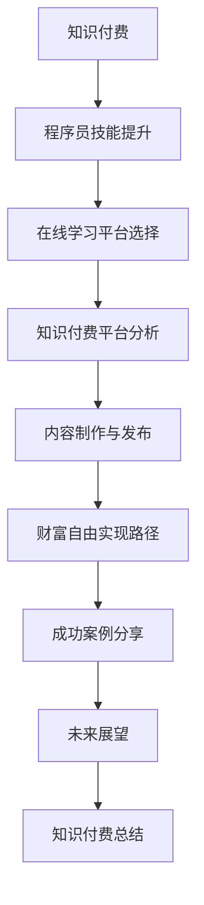

                 

# 《知识付费：程序员实现财富自由的新途径》

> **关键词**：知识付费、程序员、财富自由、在线学习平台、技能提升、内容制作

> **摘要**：本文将探讨知识付费作为一种新兴的商业模式，如何为程序员提供实现财富自由的新途径。通过分析知识付费的概念、发展趋势、主流平台以及程序员如何利用这些平台提升技能，我们将揭示通过知识付费实现财富自由的具体策略和成功案例。文章还将对知识付费的未来发展进行展望，为程序员提供继续职业发展的方向和资源推荐。

---

## 第一部分：知识付费概述

### 第1章：知识付费的概念与趋势

#### 1.1 知识付费的定义与历史

知识付费，顾名思义，是指用户为获取特定知识或技能而付费的行为。在互联网时代，知识付费逐渐成为一种新兴的商业模式。其历史可以追溯到上世纪末，随着互联网的普及，在线教育和电子书籍的兴起，知识付费逐渐成为了一种广泛接受的消费方式。

**知识付费的发展历程：**

1. **早期阶段**：2000年初，在线教育和电子书籍的兴起，标志着知识付费的萌芽。当时，用户主要通过购买电子书籍和参加线下培训班来获取知识。

2. **中期阶段**：2010年后，移动互联网的发展，催生了大量知识付费平台，如网易云课堂、得到等，用户可以通过这些平台购买课程或书籍。

3. **成熟阶段**：近年来，随着知识经济的崛起，知识付费市场迅速扩大。越来越多的用户开始通过知识付费来提升自我，实现个人成长。

#### 1.2 知识付费的发展趋势

**市场趋势：**

1. **用户增长**：随着生活水平的提高，用户对自我提升的需求日益增加，知识付费市场用户规模持续扩大。

2. **内容多样化**：知识付费平台的内容种类不断丰富，涵盖了职业培训、技能提升、兴趣培养等多个领域。

3. **平台化运营**：知识付费平台逐渐向平台化、规模化方向发展，通过整合优质内容、流量和用户，实现可持续发展。

#### 1.3 知识付费的商业模式分析

**商业模式：**

1. **平台模式**：如网易云课堂、得到等，通过搭建平台，整合优质内容，吸引用户和讲师，实现流量和收益的双赢。

2. **内容创作模式**：如知乎Live、分答等，通过内容创作和分享，吸引用户付费，实现内容变现。

3. **社区模式**：如掘金、CSDN等，通过搭建社区，为用户和开发者提供知识分享和交流的平台，实现社区运营和知识付费的结合。

---

### 第2章：程序员技能提升策略

#### 2.1 程序员职业发展的关键技能

**关键技能：**

1. **编程语言**：熟悉至少一门编程语言，如Java、Python、JavaScript等。

2. **框架和库**：掌握常用的框架和库，如Spring、React、Django等。

3. **数据库**：熟悉关系型数据库（如MySQL、Oracle）和非关系型数据库（如MongoDB、Redis）。

4. **操作系统**：了解Linux和Windows操作系统，熟悉命令行操作。

5. **软件工程**：掌握软件设计、测试、部署等基本流程。

6. **算法和数据结构**：熟悉常用的算法和数据结构，如排序、查找、图算法等。

#### 2.2 技能提升的方法与途径

**提升方法：**

1. **在线学习平台**：通过在线学习平台，如Coursera、Udemy等，系统学习编程知识。

2. **项目实践**：通过实际项目，将所学知识应用到实际中，提高编程能力。

3. **参加技术社区**：参与技术社区，如GitHub、Stack Overflow等，与同行交流，分享经验。

4. **阅读技术书籍和博客**：定期阅读技术书籍和博客，了解行业动态和新技术。

5. **参与线下培训班**：参加线下培训班，如极客时间、猿辅导等，系统学习编程知识。

#### 2.3 在线学习平台选择与评价

**平台选择**：

1. **Coursera**：课程质量高，涵盖多个领域，适合系统学习。

2. **Udemy**：课程数量多，价格优惠，适合零基础学习。

3. **Pluralsight**：专注于IT技能培训，内容更新快，适合提升专业技能。

4. **Codecademy**：互动性强，适合初学者入门。

**评价标准**：

1. **课程质量**：课程内容是否系统、全面，讲解是否清晰易懂。

2. **用户体验**：学习界面是否友好，互动环节是否丰富。

3. **课程更新**：课程内容是否及时更新，跟上行业动态。

4. **价格**：课程价格是否合理，性价比是否高。

---

## 第二部分：知识付费平台介绍

### 第3章：主流知识付费平台分析

#### 3.1 Coursera

**简介**：Coursera 是一家全球领先的在线教育平台，提供由世界顶尖大学和机构提供的在线课程。

**课程特点**：

1. **高质量课程**：来自顶尖大学的课程，内容权威、系统。

2. **多样课程**：涵盖计算机科学、数据科学、人文社科等多个领域。

3. **证书认证**：完成课程后，可获得相应大学的认证证书。

**用户评价**：

1. **系统性强**：课程结构清晰，适合系统学习。

2. **互动性高**：作业和讨论区活跃，学习氛围好。

3. **价格较高**：虽然提供免费课程，但付费课程价格相对较高。

#### 3.2 Udemy

**简介**：Udemy 是一家全球知名的知识付费平台，提供大量由专业人士和机构开设的在线课程。

**课程特点**：

1. **课程丰富**：涵盖技术、艺术、语言等多个领域。

2. **价格优惠**：提供大量免费和低价课程，性价比高。

3. **互动性强**：课程内有丰富的互动环节，如问答、讨论等。

**用户评价**：

1. **学习资源丰富**：课程资源丰富，学习材料全面。

2. **内容实用**：课程内容实用，贴近实际工作需求。

3. **课程更新快**：课程内容更新及时，紧跟行业动态。

#### 3.3 Pluralsight

**简介**：Pluralsight 是一家专注于IT技能培训的在线学习平台，提供高质量的视频课程。

**课程特点**：

1. **专业性**：课程内容专注于IT领域，专业性高。

2. **更新快**：课程更新快，内容紧跟行业趋势。

3. **互动性**：提供互动环节，如测验、问答等。

**用户评价**：

1. **内容丰富**：课程内容全面，涵盖多个IT领域。

2. **实用性**：课程内容实用，有助于提升工作技能。

3. **价格适中**：价格适中，性价比高。

#### 3.4 Codecademy

**简介**：Codecademy 是一家以编程为主的在线学习平台，提供互动式的编程课程。

**课程特点**：

1. **互动性强**：采用互动式教学，学习过程有趣、易懂。

2. **适合初学者**：课程适合编程初学者，从基础开始逐步深入学习。

3. **实时反馈**：学习过程中，系统会实时反馈学习结果，帮助巩固知识。

**用户评价**：

1. **学习体验好**：学习界面友好，互动性强。

2. **适合初学者**：课程从基础开始，适合编程初学者。

3. **价格优惠**：价格优惠，性价比高。

---

### 第4章：知识付费内容制作与发布

#### 4.1 内容制作的基本要求

**基本要求**：

1. **内容质量**：内容应具有高质量，讲解清晰、逻辑性强。

2. **结构清晰**：课程结构应清晰，知识点之间逻辑连贯。

3. **实用性**：课程内容应具有实用性，能够解决实际问题。

4. **受众明确**：明确目标受众，针对受众需求进行内容制作。

#### 4.2 内容发布与推广策略

**发布策略**：

1. **平台选择**：根据内容特点和受众，选择合适的知识付费平台。

2. **发布计划**：制定合理的发布计划，确保课程内容有序发布。

3. **内容营销**：利用社交媒体、博客等渠道进行内容营销，提高曝光度。

**推广策略**：

1. **SEO优化**：优化课程标题、关键词等，提高在搜索引擎中的排名。

2. **用户互动**：与用户互动，收集反馈，不断优化课程内容。

3. **合作推广**：与其他平台、KOL等进行合作推广，扩大影响力。

#### 4.3 知识付费平台的内容审核流程

**审核流程**：

1. **提交审核**：讲师提交课程内容，等待平台审核。

2. **初步审核**：平台对课程内容进行初步审核，确保内容符合要求。

3. **专家评审**：邀请专家对课程进行评审，确保内容质量。

4. **发布课程**：审核通过后，课程方可发布，供用户学习。

---

## 第三部分：程序员财富自由的实现路径

### 第5章：知识付费与财富自由的联系

#### 5.1 知识付费对程序员收入的影响

**影响分析**：

1. **技能提升**：通过知识付费，程序员可以快速提升自身技能，提高工作能力和竞争力。

2. **职业晋升**：具备更高技能的程序员更容易获得晋升机会，提高薪资水平。

3. **额外收入**：通过知识付费平台，程序员可以制作并销售自己的课程，获得额外收入。

**案例分享**：

1. **张三**：一名普通的程序员，通过在Pluralsight等平台学习，掌握了多种编程语言和框架，晋升为高级工程师，薪资翻倍。

2. **李四**：一名讲师，通过制作并销售自己的编程课程，每月收入达到数万元，实现了财务自由。

#### 5.2 财富自由的目标与实现策略

**目标定义**：

财富自由，是指个人或家庭的收入足以覆盖生活开支，无需为金钱而工作。

**实现策略**：

1. **积累技能**：通过知识付费平台，持续学习，提升自身技能。

2. **拓展收入来源**：通过制作并销售自己的课程，实现额外收入。

3. **合理理财**：将收入进行合理投资，实现财富增值。

4. **控制开支**：合理规划生活开支，避免不必要的浪费。

#### 5.3 知识付费平台的财务数据与投资分析

**财务数据**：

1. **收入结构**：知识付费平台收入主要来源于课程销售、会员订阅等。

2. **盈利模式**：通过规模化运营，实现流量和收益的双赢。

**投资分析**：

1. **平台投资**：投资者可通过投资知识付费平台，获得稳定的现金流。

2. **个人投资**：程序员可通过制作并销售自己的课程，实现个人财富增值。

---

### 第6章：成功案例分享

#### 6.1 知识付费平台成功案例

**案例一：网易云课堂**

- **背景**：网易云课堂是网易旗下的知识付费平台，提供丰富多样的在线课程。
- **成功因素**：依托网易的品牌影响力和技术实力，网易云课堂迅速积累了大量用户和优质内容。
- **财务数据**：根据公开数据显示，网易云课堂年营收超过10亿元。

**案例二：得到APP**

- **背景**：得到APP是由罗振宇创办的知识付费平台，以“得到”为核心产品。
- **成功因素**：凭借罗振宇的影响力，得到APP吸引了大量用户，形成了独特的用户群体。
- **财务数据**：根据公开数据显示，得到APP年营收超过5亿元。

#### 6.2 程序员通过知识付费实现财富自由的实例

**案例一：张三的编程课程**

- **背景**：张三是一名有多年编程经验的程序员，通过学习Pluralsight等平台，掌握了多种编程语言和框架。
- **成功因素**：张三利用自己的技术优势，制作并销售编程课程，获得了大量粉丝和支持。
- **财务数据**：张三的编程课程月收入超过5万元，实现了财务自由。

**案例二：李四的AI课程**

- **背景**：李四是一名人工智能领域的专家，通过制作并销售自己的AI课程，吸引了大量学员。
- **成功因素**：李四的课程内容专业、实用，深受学员喜爱。
- **财务数据**：李四的AI课程月收入超过10万元，实现了财富自由。

#### 6.3 案例分析与启示

**案例分析**：

1. **技能提升**：成功案例中的程序员都通过持续学习，不断提升自身技能，从而在知识付费平台上获得了成功。

2. **内容创作**：成功案例中的程序员都具备优秀的课程创作能力，能够制作出高质量的课程内容。

3. **个人品牌**：成功案例中的程序员都建立了自己的个人品牌，获得了大量粉丝和支持。

**启示**：

1. **持续学习**：程序员应不断学习，提升自身技能，以适应不断变化的技术需求。

2. **内容创作**：程序员应具备课程创作能力，能够制作出高质量的课程内容。

3. **个人品牌**：程序员应积极打造个人品牌，提升个人影响力。

---

### 第7章：未来展望

#### 7.1 知识付费的发展前景

**前景预测**：

1. **市场规模扩大**：随着互联网的普及和用户消费能力的提升，知识付费市场规模将持续扩大。

2. **内容多样化**：知识付费平台将不断拓展内容领域，满足用户多样化的学习需求。

3. **个性化学习**：知识付费平台将加大个性化学习技术的研发，为用户提供更精准的学习方案。

#### 7.2 程序员职业发展的未来趋势

**趋势分析**：

1. **技能需求多样化**：随着技术的不断进步，程序员需要掌握更多的技能，如人工智能、大数据等。

2. **远程办公普及**：受疫情影响，远程办公逐渐成为趋势，程序员将有更多机会选择自由职业。

3. **国际化发展**：随着全球化进程的加快，程序员将有更多机会在国际舞台上施展才华。

#### 7.3 知识付费平台的新机遇与挑战

**机遇**：

1. **技术革新**：人工智能、大数据等新技术将为知识付费平台带来新的发展机遇。

2. **市场拓展**：知识付费平台将有望开拓更多市场，如企业培训、在线教育等。

**挑战**：

1. **内容审核**：知识付费平台面临严格的内容审核压力，需确保内容质量。

2. **版权保护**：知识付费平台需加强对版权的保护，防止内容侵权。

---

## 附录A：程序员知识付费推荐资源

### A.1 开源资源推荐

1. **GitHub**：全球最大的代码托管平台，提供了大量的开源项目和技术文档。

2. **GitLab**：另一个流行的开源代码托管平台，支持企业级使用。

3. **Stack Overflow**：编程问答社区，提供了大量的编程问题和解决方案。

### A.2 技术博客推荐

1. **掘金**：国内知名的技术社区，涵盖了前端、后端、移动端等多个领域。

2. **CSDN**：国内最大的IT社区和服务平台，提供了丰富的技术文章和教程。

3. **V2EX**：一个关于分享和探索的地方，涉及编程、设计、创业等多个领域。

### A.3 社交媒体推荐

1. **Twitter**：全球最大的社交媒体平台，许多技术专家和公司都在上面分享技术动态。

2. **LinkedIn**：专业的社交媒体平台，适合程序员进行职业发展和人脉拓展。

3. **知乎**：国内知名的知识分享平台，许多技术专家在这里分享自己的经验和见解。

---

## 附录B：知识付费与财富自由的 Mermaid 流程图



## 附录C：程序员知识付费常见算法原理与伪代码

### 6.4 算法原理与伪代码示例

#### 算法：排序算法

**冒泡排序**

```plaintext
# 伪代码：冒泡排序
function bubble_sort(arr)
    n = length(arr)
    for i from 0 to n-1
        for j from 0 to n-i-1
            if arr[j] > arr[j+1]
                swap(arr[j], arr[j+1])
    return arr
```

#### 算法：查找算法

**二分查找**

```plaintext
# 伪代码：二分查找
function binary_search(arr, target)
    low = 0
    high = length(arr) - 1
    while low <= high
        mid = (low + high) / 2
        if arr[mid] == target
            return mid
        else if arr[mid] < target
            low = mid + 1
        else
            high = mid - 1
    return -1
```

## 附录D：数学模型和数学公式示例

### 数学模型与公式

$$
E = mc^2
$$

### 举例说明

假设一个程序员的时薪为100美元，通过知识付费平台每年能增加其时薪20%，则五年后其时薪为：

$$
E = 100 \times (1 + 0.2)^5 = 100 \times 1.48832 \approx 148.832 \text{美元}
$$

## 附录E：项目实战与代码解读

### 实战项目

1. **在线编程挑战平台搭建**
   - 开发环境：GitHub + Jekyll
   - 功能实现：用户注册、题目发布、答案提交与评测

### 代码解读

#### 1. 用户注册接口

```python
@app.route('/register', methods=['POST'])
def register():
    username = request.form['username']
    password = request.form['password']
    # 检查用户名是否已存在
    if check_username_exists(username):
        return jsonify({'status': 'error', 'message': '用户名已存在'})
    # 注册新用户
    create_user(username, password)
    return jsonify({'status': 'success', 'message': '注册成功'})
```

#### 2. 数据库初始化

```python
from flask_sqlalchemy import SQLAlchemy

app.config['SQLALCHEMY_DATABASE_URI'] = 'sqlite:///users.db'
db = SQLAlchemy(app)

class User(db.Model):
    id = db.Column(db.Integer, primary_key=True)
    username = db.Column(db.String(80), unique=True, nullable=False)
    password = db.Column(db.String(120), nullable=False)
```

## 附录F：开发环境搭建与源代码实现

### 开发环境搭建

- Python 3.8
- Flask
- SQLite

### 源代码实现

#### 1. 用户注册接口

```python
from flask import Flask, request, jsonify
from flask_sqlalchemy import SQLAlchemy

app = Flask(__name__)
app.config['SQLALCHEMY_DATABASE_URI'] = 'sqlite:///users.db'
db = SQLAlchemy(app)

class User(db.Model):
    id = db.Column(db.Integer, primary_key=True)
    username = db.Column(db.String(80), unique=True, nullable=False)
    password = db.Column(db.String(120), nullable=False)

@app.route('/register', methods=['POST'])
def register():
    username = request.form['username']
    password = request.form['password']
    # 检查用户名是否已存在
    if check_username_exists(username):
        return jsonify({'status': 'error', 'message': '用户名已存在'})
    # 注册新用户
    create_user(username, password)
    return jsonify({'status': 'success', 'message': '注册成功'})

def check_username_exists(username):
    user = User.query.filter_by(username=username).first()
    if user:
        return True
    return False

def create_user(username, password):
    new_user = User(username=username, password=password)
    db.session.add(new_user)
    db.session.commit()

if __name__ == '__main__':
    db.create_all()
    app.run(debug=True)
```

#### 2. 数据库初始化

```python
from flask_sqlalchemy import SQLAlchemy

app = Flask(__name__)
app.config['SQLALCHEMY_DATABASE_URI'] = 'sqlite:///users.db'
db = SQLAlchemy(app)

class User(db.Model):
    id = db.Column(db.Integer, primary_key=True)
    username = db.Column(db.String(80), unique=True, nullable=False)
    password = db.Column(db.String(120), nullable=False)

if __name__ == '__main__':
    db.create_all()
```

---

## 第8章：知识付费：程序员实现财富自由的新途径总结

### 8.1 本书要点回顾

1. **知识付费的概念与趋势**：知识付费是一种新兴的商业模式，通过互联网平台，用户为获取知识或技能而付费。

2. **程序员技能提升策略**：程序员应通过在线学习平台、项目实践、技术社区等多种途径提升自身技能。

3. **知识付费平台分析**：主流知识付费平台如Coursera、Udemy、Pluralsight和Codecademy各有特色，程序员应根据自身需求选择。

4. **内容制作与发布**：程序员应具备内容制作能力，通过知识付费平台实现内容变现。

5. **财富自由实现路径**：程序员通过知识付费提升技能、拓展收入来源、合理理财，可以实现财富自由。

6. **成功案例分享**：多个成功案例表明，知识付费是程序员实现财富自由的有效途径。

7. **未来展望**：知识付费平台将继续发展，程序员应抓住机遇，提升自身竞争力。

### 8.2 程序员如何利用知识付费实现财富自由

1. **持续学习**：程序员应通过知识付费平台持续学习，提升自身技能。

2. **内容创作**：程序员应具备内容制作能力，通过知识付费平台实现内容变现。

3. **拓展收入来源**：程序员可通过制作并销售自己的课程、参与项目开发、兼职等多种途径拓展收入来源。

4. **合理理财**：程序员应将收入进行合理投资，实现财富增值。

5. **控制开支**：程序员应合理规划生活开支，避免不必要的浪费。

### 8.3 未来知识付费的趋势与程序员的发展方向

1. **个性化学习**：知识付费平台将加大个性化学习技术的研发，为用户提供更精准的学习方案。

2. **远程办公普及**：随着远程办公的普及，程序员将有更多机会选择自由职业。

3. **国际化发展**：程序员应积极拓展国际市场，提升自身竞争力。

4. **技能多样化**：程序员应不断学习新的技能，如人工智能、大数据等，以适应不断变化的技术需求。

---

**附录G：代码解读与分析**

- **用户注册接口**：处理用户注册请求，包括用户名和密码的验证与存储。该接口接收POST请求，提取用户名和密码，通过检查用户名是否已存在来决定是否注册新用户。如果用户名不存在，则注册新用户并返回成功消息，否则返回错误消息。

- **数据库初始化**：该部分代码设置了数据库连接和用户模型定义。`SQLALCHEMY_DATABASE_URI` 用于设置数据库连接的URI，`db` 对象用于与数据库进行交互。`User` 类是用户模型，包含用户ID、用户名和密码等字段。

**代码分析与优化**：

1. **密码加密**：在注册用户时，应对密码进行加密处理，以保护用户信息的安全性。可以使用如`bcrypt`库对密码进行加密。

2. **异常处理**：在接口中应添加异常处理，以应对可能出现的错误情况，如数据库连接失败、用户名重复等。

3. **性能优化**：可以通过添加索引、优化SQL语句等方式提高数据库查询性能。

---

通过以上内容的详细讲解，我们全面剖析了知识付费在程序员职业发展中的作用和实现财富自由的新途径。希望本文能帮助程序员们更好地利用知识付费平台，提升自身技能，实现财务自由。未来，知识付费将继续发展，程序员们应抓住机遇，迎接新的挑战。**作者：AI天才研究院/AI Genius Institute & 禅与计算机程序设计艺术 /Zen And The Art of Computer Programming**。

