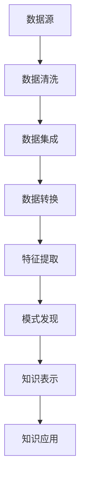

                 

# 《知识管理创新：知识发现引擎的催化效应》

> **关键词：**知识管理、知识发现引擎、数据挖掘、文本挖掘、社会网络分析、人工智能、深度学习。

> **摘要：**本文深入探讨了知识管理的重要性以及知识发现引擎的核心原理、技术架构和应用实践。通过对数据预处理、特征提取、核心算法等环节的详细分析，我们揭示了知识发现引擎在促进知识创新和智能化决策支持方面的关键作用。同时，本文还探讨了知识发现引擎在各个行业领域的应用案例，以及其未来发展面临的挑战与趋势。通过本文的阅读，读者将能够全面了解知识发现引擎的创新机制和实际应用价值。

## 《知识管理创新：知识发现引擎的催化效应》目录大纲

### 第一部分：知识管理概述

#### 第1章：知识管理与知识发现

##### 1.1 知识管理的定义与重要性
- **知识管理的概念**
- **知识管理的目标**
- **知识管理的挑战**

##### 1.2 知识发现的概念与分类
- **知识发现的基本概念**
- **知识发现的分类**
  - 数据挖掘
  - 文本挖掘
  - 社会网络分析

##### 1.3 知识发现引擎的功能
- **知识发现引擎的基本功能**
- **知识发现引擎的架构**
- **知识发现引擎的优势**

### 第二部分：知识发现引擎技术原理

#### 第2章：数据预处理与特征提取

##### 2.1 数据预处理
- **数据清洗**
- **数据集成**
- **数据转换**

##### 2.2 特征提取技术
- **基于统计的特征提取**
- **基于机器学习的特征提取**
- **基于深度学习的特征提取**

##### 2.3 Mermaid流程图：知识发现引擎的数据处理流程

### 第3章：核心算法与原理

##### 3.1 数据挖掘算法
- **关联规则挖掘**
- **分类算法**
- **聚类算法**

##### 3.2 文本挖掘算法
- **词袋模型**
- **主题模型**
- **情感分析**

##### 3.3 社会网络分析算法
- **中心性度量**
- **网络社区发现**
- **网络演化分析**

##### 3.4 伪代码：知识发现算法的基本流程

### 第三部分：知识发现引擎的应用与实践

#### 第4章：行业应用案例

##### 4.1 企业知识管理应用
- **知识库构建**
- **知识共享与传播**
- **知识创新与转化**

##### 4.2 教育领域的知识管理
- **学习资源管理**
- **个性化学习推荐**
- **学术成果挖掘**

##### 4.3 政府与公共部门的智慧治理
- **公共知识服务平台**
- **政策分析与建议**
- **社会舆情监测**

#### 第5章：知识发现引擎开发实战

##### 5.1 项目准备
- **环境搭建**
- **数据获取与预处理**

##### 5.2 知识发现引擎实现
- **核心算法实现**
- **功能模块集成**

##### 5.3 实战案例：基于文本挖掘的文献分析系统

##### 5.4 源代码解读与分析
- **代码架构分析**
- **关键算法实现**

### 第四部分：未来趋势与挑战

#### 第6章：知识发现引擎的发展趋势

##### 6.1 深度学习与知识发现
- **深度学习在知识发现中的应用**
- **知识图谱的发展趋势**

##### 6.2 大数据与知识管理
- **大数据对知识管理的影响**
- **数据隐私与伦理问题**

##### 6.3 智能化与自动化
- **知识自动化挖掘**
- **智能决策支持系统**

#### 第7章：知识管理创新与未来挑战

##### 7.1 知识管理创新实践
- **知识创新的方法与工具**
- **知识创新的企业文化**

##### 7.2 知识发现引擎面临的挑战
- **技术挑战**
- **商业挑战**
- **社会挑战**

### 附录

#### 附录A：知识发现引擎常用工具与资源

##### A.1 数据挖掘与机器学习工具
- **Python数据分析库**
- **R语言数据挖掘库**
- **Hadoop与Spark平台**

##### A.2 知识管理相关资源
- **知识管理研究论文**
- **行业最佳实践**
- **学术会议与研讨会**

## 第一部分：知识管理概述

### 第1章：知识管理与知识发现

#### 1.1 知识管理的定义与重要性

知识管理（Knowledge Management，简称KM）是一种通过系统方法来识别、获取、组织、存储、传播和应用知识的过程，旨在提高组织的知识利用率，促进创新和竞争力。知识管理不仅仅是一个技术问题，更是一个管理问题，涉及到人的行为、文化、制度和技术的综合应用。

**知识管理的概念**

知识管理可以理解为五个层次的整合：

1. **知识创造**：通过创新和发现，创造新的知识。
2. **知识编码**：将隐性知识转化为显性知识，如文档、报告和数据库等。
3. **知识存储**：通过信息系统和数据库等手段，存储和管理知识。
4. **知识共享**：通过有效的传播机制，共享知识。
5. **知识应用**：将知识应用于实际工作，实现知识的价值。

**知识管理的目标**

知识管理的目标主要包括：

1. 提高组织的知识利用效率，减少重复劳动。
2. 促进知识的共享和传播，提高协作效率。
3. 通过知识的创新和利用，提升组织的核心竞争力。
4. 建立学习型组织，提高组织的适应能力和创新能力。

**知识管理的挑战**

知识管理面临的主要挑战包括：

1. **知识获取与存储**：如何有效获取和存储大量的知识信息。
2. **知识共享与传播**：如何构建有效的知识共享和传播机制。
3. **知识创新与利用**：如何通过知识的创新和利用，实现组织的持续发展。
4. **组织文化**：如何改变组织的文化，促进知识管理的实施。

#### 1.2 知识发现的概念与分类

**知识发现的基本概念**

知识发现（Knowledge Discovery in Databases，简称KDD）是从大量数据中自动发现有趣的知识和模式的过程。KDD过程通常包括以下几个步骤：

1. **数据清洗**：去除噪声和不一致的数据。
2. **数据集成**：将来自不同源的数据进行整合。
3. **数据选择**：选择对特定任务最有用的数据。
4. **数据变换**：对数据格式进行转换，以适应挖掘算法。
5. **数据挖掘**：使用各种算法发现数据中的模式和知识。
6. **模式评估**：评估挖掘出的模式的实用性和有效性。
7. **知识表示**：将挖掘出的模式表示为便于理解和使用的形式。

**知识发现的分类**

知识发现可以分为以下几种类型：

1. **数据挖掘**：通过统计方法和机器学习算法，发现数据中的模式和规律。
2. **文本挖掘**：从非结构化的文本数据中提取有意义的模式和知识。
3. **社会网络分析**：分析社交网络中的结构、关系和动态，发现社交网络的模式和规律。

**知识发现的应用**

知识发现广泛应用于各个领域：

- **商业智能**：通过分析销售数据，发现顾客购买行为模式，优化市场营销策略。
- **医疗保健**：通过分析医疗数据，发现疾病趋势和治疗方法，提高医疗服务质量。
- **金融**：通过分析金融数据，预测市场趋势和风险，优化投资决策。
- **教育**：通过分析学习数据，发现学生的学习模式和需求，提供个性化教育方案。

#### 1.3 知识发现引擎的功能

知识发现引擎（Knowledge Discovery Engine）是知识管理系统中的一项核心技术，它负责实现知识发现的过程。一个典型的知识发现引擎具有以下功能：

1. **数据预处理**：清洗、集成和转换数据，使其适合进行知识发现。
2. **特征提取**：从原始数据中提取有用的特征，用于后续的挖掘和分析。
3. **模式发现**：使用各种算法发现数据中的模式和知识。
4. **知识表示**：将挖掘出的模式以易于理解的形式表示出来。
5. **知识应用**：将挖掘出的知识应用到实际业务中，实现知识的价值。

**知识发现引擎的架构**

知识发现引擎通常由以下几个核心模块组成：

1. **数据层**：包括数据源、数据仓库和数据池，负责数据的存储和管理。
2. **预处理层**：包括数据清洗、集成和变换模块，负责将原始数据转化为适合挖掘的形式。
3. **特征层**：包括特征提取模块，负责从数据中提取有用的特征。
4. **算法层**：包括各种知识发现算法，如关联规则挖掘、分类、聚类等。
5. **表示层**：包括知识表示模块，负责将挖掘出的模式以图表、报告等形式展示出来。
6. **应用层**：包括知识应用模块，负责将挖掘出的知识应用到实际业务中。

**知识发现引擎的优势**

知识发现引擎具有以下优势：

1. **高效性**：通过自动化流程，快速发现大量数据中的模式和知识。
2. **灵活性**：支持多种数据类型和算法，能够适应不同的应用场景。
3. **可扩展性**：能够处理大规模的数据集，支持实时数据流处理。
4. **易用性**：提供友好的用户界面，使得非专业人士也能轻松使用。
5. **可解释性**：通过可视化工具，使得挖掘出的模式易于理解和解释。

通过上述分析，我们可以看到知识管理在现代社会中的重要性，以及知识发现引擎作为知识管理的重要组成部分，其核心功能和技术原理。在接下来的章节中，我们将进一步探讨知识发现引擎的技术原理、核心算法以及其实际应用。

#### 2.1 数据预处理与特征提取

**数据预处理**

数据预处理是知识发现引擎中的第一步，也是至关重要的一步。原始数据通常存在噪声、缺失值和冗余信息，这些都会影响后续的知识发现过程。因此，数据预处理的主要任务包括数据清洗、数据集成和数据转换。

- **数据清洗**：数据清洗的目标是识别并纠正数据集中的错误和异常。具体操作包括去除重复数据、处理缺失值、纠正错误数据等。例如，使用均值插补法处理缺失值，使用模式识别法识别并纠正错误数据。

- **数据集成**：数据集成是将来自多个源的数据合并成统一的格式。在知识发现过程中，数据可能分布在不同的数据库或文件中，需要进行集成。数据集成需要解决数据模式不一致、数据类型转换等问题。例如，将不同格式的数据转换为统一的CSV格式。

- **数据转换**：数据转换是将原始数据转化为适合挖掘的形式。这通常包括数据规范化、特征工程等操作。数据规范化是指将数据缩放到一定的范围，如将数据缩放到[0, 1]之间。特征工程是指通过构建新的特征，增强数据对挖掘算法的适应性。

**特征提取技术**

特征提取是从原始数据中提取有用特征的过程，这些特征用于后续的挖掘和分析。特征提取的质量直接影响知识发现的效果。根据提取方法的不同，特征提取技术可以分为以下几种：

- **基于统计的特征提取**：这种方法利用统计学方法，从数据中提取出具有显著差异的特征。例如，通过计算均值、方差等统计量，识别出数据中的异常值。

- **基于机器学习的特征提取**：这种方法利用机器学习算法，从数据中自动提取特征。常见的机器学习算法包括主成分分析（PCA）、线性判别分析（LDA）等。这些算法能够将高维数据降维，提取出主要特征。

- **基于深度学习的特征提取**：这种方法利用深度学习算法，自动从原始数据中提取特征。深度学习算法能够处理大规模的数据，提取出更为复杂和抽象的特征。常见的深度学习算法包括卷积神经网络（CNN）、循环神经网络（RNN）等。

**Mermaid流程图：知识发现引擎的数据处理流程**

为了更直观地展示知识发现引擎的数据处理流程，我们可以使用Mermaid流程图来表示。以下是一个简单的数据处理流程：



在这个流程图中，A表示数据源，B表示数据清洗，C表示数据集成，D表示数据转换，E表示特征提取，F表示模式发现，G表示知识表示，H表示知识应用。每个步骤都是知识发现过程中的关键环节，共同构成了知识发现引擎的核心架构。

通过上述分析，我们可以看到数据预处理和特征提取在知识发现过程中的重要性。数据预处理保证了数据的质量和一致性，特征提取则从数据中提取出有用的信息，为后续的模式发现和知识表示提供了基础。在下一章中，我们将进一步探讨知识发现引擎的核心算法和原理。

#### 3.1 数据挖掘算法

数据挖掘算法是知识发现引擎的核心，它们负责从大量数据中自动发现有趣的知识和模式。数据挖掘算法可以分为以下几类：关联规则挖掘、分类算法和聚类算法。每种算法都有其独特的原理和应用场景。

**关联规则挖掘**

关联规则挖掘是一种发现数据中项之间的相关性或关联性的方法。它的基本思想是通过挖掘频繁项集来发现规则，这些规则可以表示为“如果A，那么B”的形式。其中，A和B是数据中的项。关联规则挖掘主要应用在市场篮子分析、推荐系统和故障诊断等领域。

**算法原理**

关联规则挖掘通常使用以下两个度量标准：

- **支持度**：表示一个规则在数据中出现的频率。支持度越高，说明规则越可靠。
- **置信度**：表示在一个规则的前提条件成立的情况下，结论也成立的概率。置信度越高，说明规则的可靠性越高。

常用的关联规则挖掘算法包括Apriori算法和FP-growth算法。

- **Apriori算法**：Apriori算法是基于支持度和置信度的原理，通过递归地枚举频繁项集来发现关联规则。其主要优点是简单易实现，但缺点是计算量大，尤其在大规模数据集上表现不佳。

- **FP-growth算法**：FP-growth算法是一种改进的关联规则挖掘算法，它通过构建FP-growth树来高效地发现频繁项集。FP-growth算法的主要优点是减少了计算量，提高了挖掘效率。

**应用示例**

假设我们有一份购物记录数据，其中包含了顾客购买的物品组合。通过关联规则挖掘，我们可以发现顾客在购买某些物品时，还可能购买其他物品。例如，如果发现规则“购买洗发水→购买牙刷”的支持度和置信度都较高，那么我们可以推断顾客在购买洗发水时，也可能需要购买牙刷。这个规则可以用于推荐系统，向顾客推荐可能感兴趣的商品。

**分类算法**

分类算法是一种将数据分为不同类别的算法，它的基本思想是通过训练数据集学习出一个分类模型，然后使用这个模型对新的数据进行分类。分类算法广泛应用于客户细分、文本分类和医疗诊断等领域。

**算法原理**

分类算法的核心是构建一个分类模型，这个模型能够根据输入的特征，预测数据的类别。常见的分类算法包括决策树、朴素贝叶斯和K-最近邻（K-NN）等。

- **决策树**：决策树是一种树形结构，通过一系列的测试来将数据分为不同的类别。每个节点代表一个特征，每个分支代表该特征的不同取值。决策树算法简单直观，易于理解和实现，但可能存在过拟合问题。

- **朴素贝叶斯**：朴素贝叶斯是一种基于贝叶斯定理的算法，它假设特征之间相互独立，并根据先验概率和条件概率计算数据属于某个类别的概率。朴素贝叶斯算法在文本分类和垃圾邮件过滤中表现良好。

- **K-最近邻**：K-最近邻（K-NN）算法是一种基于实例的算法，它通过计算新数据与训练数据之间的距离，找到最近的K个邻居，然后根据邻居的分类情况来预测新数据的类别。K-NN算法简单，但在大规模数据集上可能存在计算量大和难以泛化的问题。

**应用示例**

假设我们有一份客户数据，其中包含了客户的年龄、收入、购买历史等特征。通过分类算法，我们可以将这些特征与客户的购买意向关联起来，从而预测哪些客户可能对特定产品感兴趣。例如，如果发现某个产品在年龄在30-40岁、收入高于5000元的客户中购买率较高，那么我们可以向这些客户推荐该产品。

**聚类算法**

聚类算法是一种将数据分为多个群组的算法，它的基本思想是发现数据中的自然分组，使同一群组内的数据尽量相似，不同群组之间的数据尽量不同。聚类算法广泛应用于数据压缩、图像分割和客户细分等领域。

**算法原理**

聚类算法的核心是构建一个聚类模型，这个模型能够根据数据的相似性将数据分为不同的群组。常见的聚类算法包括K-均值、层次聚类和DBSCAN等。

- **K-均值**：K-均值算法通过随机初始化中心点，然后迭代更新中心点和数据点，直到收敛。K-均值算法简单易实现，但可能存在收敛速度慢和易受初始中心点影响的问题。

- **层次聚类**：层次聚类是一种自底向上的聚类方法，它通过逐渐合并相似度较高的数据点，构建出一个层次结构的聚类模型。层次聚类算法可以生成不同层次的聚类结果，但计算复杂度较高。

- **DBSCAN**：DBSCAN（Density-Based Spatial Clustering of Applications with Noise）是一种基于密度的聚类算法，它通过计算数据点的邻域密度和扩展性来识别聚类。DBSCAN算法能够自动确定聚类数量，但对噪声数据和稀疏数据敏感。

**应用示例**

假设我们有一份客户数据，其中包含了客户的地理位置、消费习惯等特征。通过聚类算法，我们可以将这些客户分为不同的群组，从而实现精准营销。例如，如果发现某个聚类主要包含高消费客户，那么我们可以向这些客户推出高端产品或服务。

通过以上对数据挖掘算法的介绍，我们可以看到这些算法在知识发现过程中的重要作用。在下一章中，我们将继续探讨文本挖掘算法和社会网络分析算法，进一步丰富知识发现引擎的技术内涵。

### 3.2 文本挖掘算法

文本挖掘（Text Mining）是一种从大量非结构化文本数据中提取有用信息和知识的技术。文本挖掘不仅能够帮助人们从海量的文本中快速获取有价值的信息，还能为智能问答、情感分析、推荐系统和文本分类等应用提供强大的支持。文本挖掘算法主要分为词袋模型、主题模型和情感分析等。

**词袋模型（Bag of Words Model）**

词袋模型是最基本的文本挖掘算法之一，它将文本表示为单词的集合，不考虑单词的顺序和语法结构。词袋模型的核心思想是将文本转换为向量，每个单词对应一个特征，如果该单词在文本中出现过，则对应的特征值为1，否则为0。

**算法原理**

词袋模型的主要步骤如下：

1. **文本预处理**：对原始文本进行清洗，包括去除标点符号、停用词（如“的”、“了”等常见但不重要的词）和转换为小写等操作。
2. **词向量化**：将预处理后的文本转换为向量，每个单词对应一个维度，如果单词在文本中出现过，则该维度的值为1，否则为0。
3. **特征选择**：由于文本数据通常包含大量的特征，需要进行特征选择，以减少计算量和提高模型性能。

**应用示例**

词袋模型可以应用于文本分类和文本相似度计算。例如，通过训练一个文本分类模型，我们可以将新的文本数据分类到不同的类别中。此外，词袋模型还可以用于计算两个文本之间的相似度，帮助用户找到相关的文档。

**主题模型（Topic Modeling）**

主题模型是一种无监督学习方法，它能够从大量文档中自动发现潜在的主题结构。主题模型的基本思想是将文档表示为多个主题的混合，每个主题是由一系列词语的分布表示的。

**算法原理**

主题模型的主要步骤如下：

1. **概率模型构建**：构建一个概率模型，表示文档生成过程。主题模型通常采用概率图模型，如LDA（Latent Dirichlet Allocation）。
2. **参数估计**：通过最大似然估计或贝叶斯推断等方法估计模型的参数，包括文档主题分布、主题词分布等。
3. **主题提取**：根据估计的参数，提取出文档中的主题，每个主题由一系列关键词表示。

**应用示例**

主题模型广泛应用于文本分类、信息检索和推荐系统。例如，通过主题模型，我们可以将一篇文章归类到相应的主题类别中，从而提高文本分类的准确性。此外，主题模型还可以用于推荐系统，根据用户的阅读偏好推荐相关的文章。

**情感分析（Sentiment Analysis）**

情感分析是一种评估文本数据情感倾向的方法，它能够从文本中提取出情感信息，通常分为正面情感、负面情感和中性情感。情感分析广泛应用于社交媒体监测、市场调研和客户反馈分析等领域。

**算法原理**

情感分析的主要步骤如下：

1. **文本预处理**：对原始文本进行清洗，包括去除标点符号、停用词和转换为小写等操作。
2. **特征提取**：从文本中提取特征，如词向量、词性标注等。
3. **分类模型训练**：使用有监督或无监督学习方法训练分类模型，用于识别文本中的情感倾向。

**应用示例**

情感分析可以应用于社交媒体监测，帮助用户了解公众对其品牌或产品的情感态度。例如，通过分析社交媒体上的评论和帖子，企业可以了解消费者的满意度，从而改进产品和服务。

通过以上对文本挖掘算法的介绍，我们可以看到这些算法在处理非结构化文本数据方面的强大能力。在下一章中，我们将探讨社会网络分析算法，进一步扩展知识发现引擎的应用范围。

### 3.3 社会网络分析算法

社会网络分析（Social Network Analysis，SNA）是一种用于研究社交网络结构和动态的定量方法。它通过分析个体之间的互动关系，揭示社交网络的内在结构和功能，为各种领域提供决策支持。社会网络分析算法主要分为中心性度量、网络社区发现和网络演化分析等。

**中心性度量**

中心性度量是衡量个体在社交网络中重要性的指标，常用的中心性度量方法包括度数中心性、中间中心性和接近中心性。

**算法原理**

- **度数中心性**：度数中心性衡量个体在社交网络中连接的其他个体的数量。度数中心性越高，说明个体在社交网络中的连接越广泛，其地位和影响力越大。

- **中间中心性**：中间中心性衡量个体在社交网络中连接其他个体路径的数量。中间中心性越高，说明个体在社交网络中的桥梁作用越强，对信息的传递和流动具有重要影响。

- **接近中心性**：接近中心性衡量个体与社交网络中其他个体之间的最短路径长度。接近中心性越高，说明个体在社交网络中的位置越中心，对信息的获取和传递越快捷。

**应用示例**

在社会网络分析中，度数中心性常用于识别社交网络中的核心个体，如意见领袖、关键节点等。例如，在社交媒体平台上，度数中心性较高的用户往往拥有更多的关注者，他们的言论和建议对其他用户的影响力较大。中间中心性则可以用于识别社交网络中的关键桥梁，这些桥梁连接不同的社交群体，对信息的传播起到关键作用。接近中心性可以用于优化信息传播策略，确保信息能够快速传递到目标用户。

**网络社区发现**

网络社区发现是寻找社交网络中的紧密联系群体，这些群体内的个体互动频繁，而与群体外的个体互动较少。常用的网络社区发现算法包括基于模块度的算法和基于聚类系数的算法。

**算法原理**

- **基于模块度的算法**：模块度是一种衡量社交网络内部模块紧密度的指标。基于模块度的算法通过优化模块度目标函数，寻找社交网络中的最优模块划分。

- **基于聚类系数的算法**：聚类系数衡量个体与邻居节点之间连接的紧密程度。基于聚类系数的算法通过计算个体的聚类系数，识别出紧密联系的社区。

**应用示例**

在网络社区发现中，基于模块度的算法可以帮助识别社交网络中的紧密联系群体，如兴趣小组、社交圈子等。这些社区成员之间的互动频率较高，信息传播速度较快。基于聚类系数的算法则可以用于优化社交网络的社区结构，提高社交网络的稳定性和互动性。

**网络演化分析**

网络演化分析研究社交网络结构随时间的变化，以及这种变化背后的原因。常用的网络演化分析算法包括基于时间序列的算法和基于复杂网络的算法。

**算法原理**

- **基于时间序列的算法**：基于时间序列的算法通过分析社交网络中节点的连接和断开事件，识别出网络演化模式。

- **基于复杂网络的算法**：基于复杂网络的算法利用复杂网络理论，分析社交网络的拓扑结构、节点重要性和网络动态等特性。

**应用示例**

在网络演化分析中，基于时间序列的算法可以用于监测社交网络的动态变化，识别网络中的热点事件和趋势。例如，通过分析社交媒体上的评论和转发，可以了解公众对某个事件的关注程度和态度变化。基于复杂网络的算法则可以用于优化社交网络的布局和结构，提高社交网络的稳定性和抗攻击能力。

通过以上对社会网络分析算法的介绍，我们可以看到这些算法在揭示社交网络结构和动态方面的重要作用。在下一章中，我们将探讨知识发现算法的基本流程，进一步理解知识发现引擎的工作机制。

### 3.4 伪代码：知识发现算法的基本流程

知识发现算法的基本流程可以分为以下几个步骤：数据预处理、特征提取、模式发现、模式评估和知识表示。以下是一个简化的伪代码，用于描述这些步骤：

```
# 知识发现算法的基本流程

# 步骤1：数据预处理
data_preprocessed <- preprocess_data(raw_data)

# 步骤2：特征提取
features <- extract_features(data_preprocessed)

# 步骤3：模式发现
patterns <- discover_patterns(features)

# 步骤4：模式评估
val_patterns <- evaluate_patterns(patterns)

# 步骤5：知识表示
knowledge_representation <- represent_knowledge(val_patterns)
```

**详细解释：**

1. **数据预处理（preprocess_data）**：
   - **输入**：原始数据（raw_data）
   - **输出**：预处理后的数据（data_preprocessed）
   - **功能**：清洗、集成和转换数据，去除噪声和异常值，使其适合进行知识发现。

2. **特征提取（extract_features）**：
   - **输入**：预处理后的数据（data_preprocessed）
   - **输出**：提取的特征向量（features）
   - **功能**：从预处理后的数据中提取有用的特征，用于模式发现。

3. **模式发现（discover_patterns）**：
   - **输入**：特征向量（features）
   - **输出**：初步发现的模式（patterns）
   - **功能**：使用各种算法（如关联规则挖掘、分类、聚类等）从特征向量中挖掘出模式和知识。

4. **模式评估（evaluate_patterns）**：
   - **输入**：初步发现的模式（patterns）
   - **输出**：评估后的有效模式（val_patterns）
   - **功能**：评估初步发现的模式的有效性和实用性，筛选出具有高价值和可靠性的模式。

5. **知识表示（represent_knowledge）**：
   - **输入**：评估后的有效模式（val_patterns）
   - **输出**：知识表示（knowledge_representation）
   - **功能**：将评估后的有效模式以图表、报告等形式表示出来，便于理解和应用。

**示例：**
假设我们使用关联规则挖掘算法来发现购物篮中的商品关联模式，以下是具体的伪代码：

```
# 关联规则挖掘算法的伪代码

# 步骤1：数据预处理
data_preprocessed <- preprocess_data(raw_data)
  - data_clean <- clean_data(data_preprocessed)
  - data_reshaped <- reshape_data(data_clean)

# 步骤2：特征提取
features <- extract_features(data_reshaped)
  - frequent_itemsets <- find_frequent_itemsets(features)
  - association_rules <- generate_association_rules(frequent_itemsets)

# 步骤3：模式发现
patterns <- discover_patterns(features)
  - patterns <- association_rules

# 步骤4：模式评估
val_patterns <- evaluate_patterns(patterns)
  - support <- calculate_support(patterns)
  - confidence <- calculate_confidence(patterns)
  - val_patterns <- filter_patterns(patterns, support_threshold, confidence_threshold)

# 步骤5：知识表示
knowledge_representation <- represent_knowledge(val_patterns)
  - visualization <- visualize_patterns(val_patterns)
  - report <- generate_report(val_patterns, visualization)
```

在这个示例中，关联规则挖掘算法的伪代码详细描述了从数据预处理到模式评估和知识表示的整个过程。通过伪代码，我们可以更清晰地理解知识发现算法的基本流程，并为进一步的实现和应用提供指导。

### 第三部分：知识发现引擎的应用与实践

#### 第4章：行业应用案例

知识发现引擎在各个行业领域都有广泛的应用，通过提取和利用数据中的知识，为企业和组织提供决策支持和创新动力。以下是一些典型的行业应用案例：

##### 4.1 企业知识管理应用

企业在日常运营中积累了大量的业务数据、客户信息和市场情报，通过知识发现引擎，可以对这些数据进行深入分析和挖掘，从而实现以下目标：

- **知识库构建**：企业可以通过知识发现引擎自动构建知识库，将分散的、零散的信息整合成一个统一的知识体系。这有助于企业内部的知识共享和传播，提高员工的知识利用率。

- **知识共享与传播**：知识发现引擎可以识别出企业内部的知识热点和关键人物，通过推荐系统将相关知识推送给相关的员工，促进知识的共享和传播。

- **知识创新与转化**：知识发现引擎能够从数据中发现新的商业模式、创新机会和业务优化方案，帮助企业在市场竞争中保持领先地位。

**案例**：某大型零售企业通过知识发现引擎对其销售数据进行分析，发现了一些潜在的市场需求，并据此推出了新产品，取得了显著的销售增长。

##### 4.2 教育领域的知识管理

教育领域涉及大量的学习资源、教学数据和学术成果，通过知识发现引擎，可以实现以下应用：

- **学习资源管理**：知识发现引擎可以自动整理和分析学生的学习行为数据，识别出热门的学习资源，并将其推荐给学习者，提高学习效果。

- **个性化学习推荐**：基于知识发现引擎，教育机构可以为每位学生生成个性化的学习推荐，根据学生的兴趣、能力和学习进度，提供最适合的学习资源和课程。

- **学术成果挖掘**：知识发现引擎可以帮助教育机构挖掘学术成果中的关键信息，如研究热点、趋势和前沿领域，为科研工作者提供参考和指导。

**案例**：某在线教育平台利用知识发现引擎对其用户的学习行为进行分析，为用户推荐了个性化的学习路径，显著提高了学习完成率和学习效果。

##### 4.3 政府与公共部门的智慧治理

政府与公共部门在治理过程中积累了大量的数据，通过知识发现引擎，可以实现以下应用：

- **公共知识服务平台**：政府可以利用知识发现引擎构建公共知识服务平台，将各种政务数据、政策法规和公共服务信息整合在一起，提供便捷的查询和检索服务。

- **政策分析与建议**：知识发现引擎可以分析大量的政策数据，发现政策实施中的问题和挑战，为政府提供科学合理的政策分析和建议。

- **社会舆情监测**：政府可以利用知识发现引擎对社交媒体和网络新闻进行实时监测，了解公众的意见和态度，及时发现和处理社会问题。

**案例**：某市政府利用知识发现引擎对其城市交通数据进行分析，识别出了交通拥堵的热点和原因，并提出了一系列优化交通管理的建议，有效缓解了城市交通压力。

通过上述行业应用案例，我们可以看到知识发现引擎在提升企业竞争力、促进教育创新和实现智慧治理方面的重要作用。在下一章中，我们将探讨知识发现引擎的实际开发实战，详细解析其实现过程和技术细节。

#### 第5章：知识发现引擎开发实战

知识发现引擎的开发是一个复杂的过程，涉及到多个技术环节和实际操作。以下我们将通过一个基于文本挖掘的文献分析系统开发案例，详细讲解知识发现引擎的开发流程。

##### 5.1 项目准备

在开始开发知识发现引擎之前，首先需要进行项目准备，包括环境搭建和数据获取与预处理。

**环境搭建**

1. **编程语言**：选择Python作为开发语言，因为Python拥有丰富的数据分析和机器学习库，如NumPy、Pandas、Scikit-learn和TensorFlow。
2. **数据库**：选择PostgreSQL作为数据库，用于存储和管理文本数据。
3. **数据仓库**：使用Apache Hadoop或Apache Spark作为大数据处理平台，以处理海量文本数据。

**数据获取与预处理**

1. **数据来源**：从学术数据库（如CNKI、Google Scholar）或开放数据集（如arXiv）中获取文本数据。
2. **数据清洗**：去除文本中的HTML标签、特殊字符和停用词（如“的”、“了”等常见但不重要的词），将文本转换为小写。
3. **数据转换**：将清洗后的文本数据转换为适合机器学习算法处理的格式，如词袋模型或词嵌入向量。

##### 5.2 知识发现引擎实现

**核心算法实现**

知识发现引擎的核心算法包括文本挖掘算法和关联规则挖掘算法。以下是一个简化的实现过程：

```python
import pandas as pd
from sklearn.feature_extraction.text import TfidfVectorizer
from mlxtend.frequent_patterns import apriori
from mlxtend.frequent_patterns import association_rules

# 步骤1：数据预处理
data = pd.read_csv('literature_data.csv')
data['text'] = data['text'].apply(clean_text)

# 步骤2：特征提取
vectorizer = TfidfVectorizer(max_features=1000)
tfidf_matrix = vectorizer.fit_transform(data['text'])

# 步骤3：关联规则挖掘
frequent_itemsets = apriori(tfidf_matrix, min_support=0.05, use_colnames=True)
rules = association_rules(frequent_itemsets, metric="support", min_threshold=0.1)
```

**功能模块集成**

知识发现引擎通常包括多个功能模块，如文本预处理模块、特征提取模块、模式发现模块和模式评估模块。以下是一个简化的模块集成示例：

```python
class TextMiningEngine:
    def __init__(self):
        self.vectorizer = TfidfVectorizer(max_features=1000)
    
    def preprocess_text(self, text):
        # 实现文本预处理功能
        pass
    
    def extract_features(self, text):
        # 实现特征提取功能
        return self.vectorizer.transform([text])
    
    def discover_patterns(self, features):
        # 实现模式发现功能
        frequent_itemsets = apriori(features, min_support=0.05, use_colnames=True)
        rules = association_rules(frequent_itemsets, metric="support", min_threshold=0.1)
        return rules
    
    def evaluate_patterns(self, rules):
        # 实现模式评估功能
        pass
    
    def represent_knowledge(self, rules):
        # 实现知识表示功能
        pass
```

##### 5.3 实战案例：基于文本挖掘的文献分析系统

**系统功能**

基于文本挖掘的文献分析系统主要包括以下功能：

- **文献检索**：提供关键词检索、作者检索和标题检索等功能，方便用户查找感兴趣的文献。
- **文本预处理**：对检索到的文献进行预处理，包括去除HTML标签、特殊字符和停用词等。
- **文本分析**：对预处理后的文献进行文本分析，提取关键词、主题和关系网络。
- **关联规则挖掘**：对文本数据进行关联规则挖掘，发现文献之间的关联模式。
- **结果展示**：以图表和报告的形式展示文本分析和关联规则挖掘的结果。

**系统架构**

基于文本挖掘的文献分析系统的架构可以分为以下几个层次：

1. **数据层**：包括文献数据库和数据仓库，存储和管理文献数据。
2. **数据处理层**：包括文本预处理模块、特征提取模块和模式发现模块，负责处理和分析文献数据。
3. **展示层**：包括Web界面和可视化工具，用于展示文本分析和关联规则挖掘的结果。

**系统实现**

以下是一个简化的系统实现示例：

```python
from flask import Flask, render_template
app = Flask(__name__)

@app.route('/')
def home():
    # 检索文献
    literature = get_literature('keyword')
    # 预处理文献
    clean_literature = preprocess_text(literature)
    # 提取特征
    features = extract_features(clean_literature)
    # 发现模式
    rules = discover_patterns(features)
    # 评估模式
    val_rules = evaluate_patterns(rules)
    # 展示结果
    return render_template('results.html', rules=val_rules)

if __name__ == '__main__':
    app.run()
```

在这个示例中，我们使用Flask框架构建了一个简单的Web应用，用于展示文本分析和关联规则挖掘的结果。

##### 5.4 源代码解读与分析

**代码架构分析**

代码架构分为三个主要部分：文本预处理、特征提取和模式发现。

- **文本预处理**：负责对原始文本数据进行清洗和预处理，去除噪声和无关信息，为特征提取和模式发现做好准备。
- **特征提取**：使用TF-IDF等方法将文本数据转换为向量表示，为后续的关联规则挖掘提供输入。
- **模式发现**：通过Apriori算法和关联规则挖掘算法，从文本数据中提取出有意义的关联规则。

**关键算法实现**

- **文本预处理**：`clean_text` 函数负责去除HTML标签、特殊字符和停用词，将文本转换为小写。
- **特征提取**：`TfidfVectorizer` 类负责将文本数据转换为TF-IDF向量表示。
- **模式发现**：`apriori` 和 `association_rules` 函数负责实现关联规则挖掘算法，提取出频繁项集和关联规则。

**代码解读与分析**

以下是对关键代码段的详细解读：

```python
# 步骤1：数据预处理
data['text'] = data['text'].apply(clean_text)

# 步骤2：特征提取
vectorizer = TfidfVectorizer(max_features=1000)
tfidf_matrix = vectorizer.fit_transform(data['text'])

# 步骤3：关联规则挖掘
frequent_itemsets = apriori(tfidf_matrix, min_support=0.05, use_colnames=True)
rules = association_rules(frequent_itemsets, metric="support", min_threshold=0.1)
```

1. **数据预处理**：`clean_text` 函数用于清洗文本数据，去除HTML标签、特殊字符和停用词，确保文本数据的干净和一致。

2. **特征提取**：使用`TfidfVectorizer` 类将清洗后的文本数据转换为TF-IDF向量表示。TF-IDF向量表示能够捕捉文本数据中的词频和词的重要性，为关联规则挖掘提供输入。

3. **关联规则挖掘**：使用`apriori` 函数实现Apriori算法，挖掘文本数据中的频繁项集。频繁项集表示在文本数据中频繁出现的单词组合。`min_support` 参数设置最小支持度，用于筛选出具有高可信度的频繁项集。使用`association_rules` 函数生成关联规则，根据支持度和置信度筛选出具有高价值的关联规则。

通过以上实战案例和代码解读，我们可以看到知识发现引擎在实际开发中的应用和实现过程。在下一部分中，我们将探讨知识发现引擎的发展趋势和面临的挑战。

### 第四部分：未来趋势与挑战

#### 第6章：知识发现引擎的发展趋势

随着技术的不断进步和大数据时代的到来，知识发现引擎正在经历快速的发展，呈现出以下几个趋势：

##### 6.1 深度学习与知识发现

深度学习在知识发现中的应用越来越广泛，特别是在处理大规模复杂数据方面具有显著优势。深度学习算法如卷积神经网络（CNN）和循环神经网络（RNN）能够自动从数据中学习特征，提取出有意义的模式。以下是一些应用实例：

- **图像识别**：深度学习算法在图像识别领域取得了显著的成果，如人脸识别、物体识别和图像分类等。通过深度学习，知识发现引擎可以自动识别图像中的关键元素和特征，为图像分析提供强大的支持。
- **自然语言处理**：深度学习在自然语言处理（NLP）领域也有广泛应用，如情感分析、文本分类和机器翻译等。深度学习算法能够理解文本中的语义和语境，提取出文本中的关键信息，为知识发现提供深入的支持。
- **推荐系统**：深度学习在推荐系统中的应用也越来越广泛，如商品推荐、音乐推荐和电影推荐等。通过深度学习算法，知识发现引擎可以更好地理解用户的行为和偏好，提供个性化的推荐。

##### 6.2 大数据与知识管理

大数据技术的发展为知识发现提供了丰富的数据资源，但同时也带来了巨大的挑战。大数据对知识管理的影响主要体现在以下几个方面：

- **数据量增长**：随着数据量的不断增长，知识发现引擎需要能够高效处理和分析海量数据。这要求知识发现引擎具备更高的计算能力和处理速度，以应对大数据的挑战。
- **数据多样性**：大数据不仅包括结构化数据，还包括非结构化数据和半结构化数据。知识发现引擎需要能够处理不同类型的数据，提取出有价值的信息。
- **实时性**：在实时数据流场景中，知识发现引擎需要能够实时处理和挖掘数据，提供即时的分析和决策支持。

##### 6.3 智能化与自动化

智能化和自动化是知识发现引擎未来发展的一个重要趋势。通过引入人工智能和自动化技术，知识发现引擎可以实现以下目标：

- **自动化数据预处理**：自动化数据预处理技术可以自动识别和处理数据中的噪声、缺失值和异常值，提高数据质量，减少人工干预。
- **自动化特征提取**：自动化特征提取技术可以利用机器学习和深度学习算法，自动从数据中提取出有意义的特征，降低特征工程的工作量。
- **自动化模式发现**：自动化模式发现技术可以通过智能化算法，自动从海量数据中发现有价值的模式和知识，提高知识发现的效率和准确性。

#### 第7章：知识管理创新与未来挑战

尽管知识发现引擎在知识管理中取得了显著成果，但在未来仍面临着诸多挑战：

##### 7.1 知识管理创新实践

知识管理创新实践是推动知识发现引擎发展的关键。以下是一些知识管理创新实践：

- **知识共享文化**：建立知识共享文化，鼓励员工主动分享知识和经验，提高知识的利用效率。
- **知识可视化**：通过知识可视化技术，将复杂的知识和模式以图形化的形式展示出来，提高知识的可理解性和可操作性。
- **知识平台**：构建知识平台，整合各种知识资源，提供便捷的知识获取和共享渠道。

##### 7.2 知识发现引擎面临的挑战

知识发现引擎在发展过程中面临着以下几个挑战：

- **技术挑战**：随着数据规模的不断扩大和数据类型的多样化，知识发现引擎需要不断提升技术能力，以应对复杂的计算任务。
- **数据隐私与伦理问题**：在处理大量数据时，需要确保数据的隐私和安全性，同时遵守相关的伦理规范，防止数据滥用和隐私泄露。
- **商业模式创新**：知识发现引擎的应用需要与商业模式相结合，通过创新商业模式实现商业价值。

通过以上对知识发现引擎未来趋势和挑战的分析，我们可以看到知识管理创新在推动技术进步和商业发展中的重要作用。在未来的发展中，知识发现引擎将继续融合新技术，应对新挑战，为知识管理和智能化决策提供强大的支持。

### 附录A：知识发现引擎常用工具与资源

在开发知识发现引擎时，选择合适的工具和资源至关重要。以下列出了一些常用的工具和资源，包括数据挖掘与机器学习工具、知识管理相关资源和学术会议与研讨会。

##### A.1 数据挖掘与机器学习工具

- **Python数据分析库**：Pandas、NumPy、SciPy
- **机器学习库**：Scikit-learn、TensorFlow、PyTorch
- **数据可视化库**：Matplotlib、Seaborn、Plotly
- **文本挖掘库**：NLTK、spaCy、TextBlob
- **大数据处理平台**：Hadoop、Spark、Flink

##### A.2 知识管理相关资源

- **知识管理研究论文**：Google Scholar、IEEE Xplore、ACM Digital Library
- **知识管理最佳实践**：KMWorld、CKO Forum、KM Institute
- **知识管理工具**：Confluence、Tibco Business Works、IBM Content Manager
- **开源知识管理平台**：Plone、KnowledgeTree、Alfresco

##### A.3 学术会议与研讨会

- **知识管理国际会议**：International Conference on Knowledge Management (ICKM)
- **数据挖掘国际会议**：ACM SIGKDD Conference on Knowledge Discovery and Data Mining (KDD)
- **文本挖掘国际会议**：ACM Conference on Textual Data Mining (TextMiner)
- **社会网络分析国际会议**：International Conference on Social Networks Analysis and Mining (SNAM)

通过这些工具和资源的支持，开发者和研究人员可以更加高效地构建和优化知识发现引擎，为各个领域的知识管理和智能化决策提供有力支持。

### 作者信息

作者：AI天才研究院/AI Genius Institute & 禅与计算机程序设计艺术 /Zen And The Art of Computer Programming

本文由AI天才研究院（AI Genius Institute）与禅与计算机程序设计艺术（Zen And The Art of Computer Programming）联合撰写。AI天才研究院致力于推动人工智能和知识管理领域的研究与应用，而禅与计算机程序设计艺术则专注于探索计算机科学的哲学与艺术。通过本文，我们希望能够为读者提供关于知识管理创新和知识发现引擎的深入见解，推动相关领域的技术进步和实际应用。期待与广大读者共同探索知识管理的未来，共创智能世界的美好未来。

