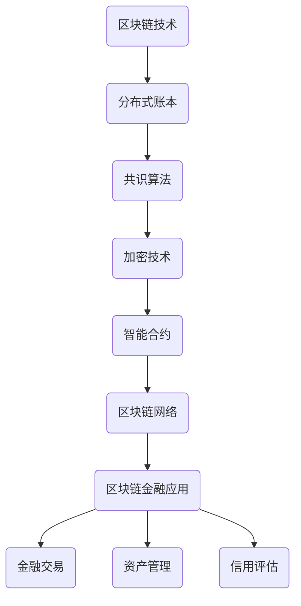

                 

### 《硅谷区块链金融创新的风险控制》

#### 引言

近年来，区块链技术以其去中心化、透明性高、安全性强等特点在全球范围内迅速发展，尤其是在金融领域，它为金融创新带来了前所未有的机遇。硅谷作为全球创新和科技发展的中心，自然成为了区块链金融创新的温床。然而，伴随着创新而来的，还有一系列的风险和挑战。本文将围绕硅谷区块链金融创新的风险控制展开讨论，通过逻辑清晰的分析和实例说明，帮助读者更好地理解和应对这些风险。

关键词：区块链，金融创新，硅谷，风险控制，安全措施，共识算法

摘要：本文旨在深入探讨硅谷区块链金融创新所面临的风险及其控制策略。首先，我们将简要概述区块链与金融创新的关系，以及硅谷区块链金融创新的发展现状。接着，本文将详细分析区块链金融的核心概念与架构，包括分布式账本、共识算法、智能合约等。随后，我们将探讨区块链金融风险的类型、识别与评估方法，并通过具体案例进行分析。在此基础上，本文将提出一系列风险控制策略，包括技术风险控制、操作风险控制、市场风险控制以及法律风险与社会风险控制。最后，我们将对硅谷区块链金融创新的未来趋势进行展望，并总结全文，为我国区块链金融发展提供启示。

#### 第一部分：区块链金融创新概述

##### 第1章：区块链与金融创新的关系

区块链与金融创新之间的关系可以说是密不可分的。区块链技术以其独特的分布式账本、不可篡改和透明性等特性，为金融行业带来了一场革命性的变革。

首先，区块链技术提供了一个去中心化的平台，不再依赖于中央机构或第三方中介，从而减少了交易成本。在传统的金融体系中，交易需要通过银行、支付系统等中介来完成，这些中介不仅增加了交易的成本，还可能成为系统漏洞的潜在来源。而区块链的去中心化特性使得交易可以直接在参与者之间进行，从而降低了交易费用。

其次，区块链的透明性使得金融交易的每一步都可以被公开追踪，从而提高了整个金融体系的透明度和可信度。在传统的金融体系中，由于信息不对称，金融机构和客户之间的信任关系往往难以建立。而区块链技术通过将交易信息公开透明地记录在分布式账本上，使得交易过程可以被所有参与者查看和验证，从而增强了金融体系的可信度。

此外，区块链技术还为金融创新提供了新的可能性。通过智能合约，区块链可以实现自动化和智能化的金融服务，例如自动执行合同条款、自动支付等。这种自动化和智能化不仅提高了金融服务的效率，还降低了人为错误和欺诈的风险。

然而，尽管区块链技术在金融创新中带来了巨大的潜力，但它也面临着一系列的挑战和风险。例如，区块链系统的安全性、隐私保护、法律法规的适应性等都需要进一步研究和解决。

在硅谷，区块链金融创新的发展尤为迅速。硅谷作为全球科技创新的中心，吸引了众多区块链创业公司和金融机构。这些公司通过不断探索和创新，推动了区块链技术在金融领域的应用。例如，硅谷的区块链创业公司Ripple通过其去中心化支付网络RippleNet，为全球金融机构提供了快速、低成本的跨境支付服务。此外，硅谷的区块链创业公司也积极参与去中心化金融（DeFi）项目，通过智能合约和区块链技术，为用户提供了一种全新的金融服务模式。

总的来说，区块链与金融创新的关系是相辅相成的。区块链技术为金融创新提供了新的工具和可能性，而金融创新又推动了区块链技术的发展和应用。在硅谷，这种关系尤为明显，硅谷的区块链金融创新不仅为全球金融行业带来了新的发展机遇，也面临着前所未有的挑战和风险。

##### 第1章：区块链技术概述

区块链技术是一种分布式数据库技术，其核心特点是去中心化、不可篡改和透明性。区块链的基本概念可以理解为一系列按照时间顺序排列、不可篡改的数据块。每个数据块包含一定数量的交易记录，这些交易记录一旦被确认并被添加到一个数据块中，就成为了区块链的一部分，并且无法被删除或修改。

首先，分布式账本是区块链技术最核心的概念之一。传统的金融体系中，账本通常由中央机构或第三方中介管理，而区块链技术则通过分布式账本实现了去中心化管理。在分布式账本中，每个参与者都保存一份完整的数据副本，并通过网络同步更新。这意味着任何一个参与者都无法单独控制或篡改账本数据，从而提高了系统的安全性。

其次，不可篡改性是区块链的另一重要特性。每个数据块一旦被添加到区块链中，其内容就不可篡改。这是由于区块链采用了密码学技术，例如哈希函数和数字签名，确保了数据的完整性和真实性。具体来说，每个数据块都包含一个指向前一个数据块的哈希值，形成一个链式结构。任何对数据块的修改都会导致其哈希值发生变化，进而影响到后续所有数据块的哈希值。因此，任何篡改行为都会被区块链网络中的其他节点检测出来，从而保证了数据的不可篡改性。

透明性也是区块链技术的一大特点。区块链上的所有交易记录都是公开透明的，任何参与者都可以查看和验证。这种透明性不仅提高了金融交易的透明度和可信度，还减少了信息不对称和欺诈行为。例如，在区块链上，每个交易记录都附带一个时间戳和参与者的公钥，从而确保了交易的真实性和可追溯性。

区块链技术的这些特性使其在金融领域具有巨大的应用潜力。首先，分布式账本减少了交易的中介环节，降低了交易成本。例如，跨境支付在传统金融体系中需要通过多个中介完成，而区块链技术则可以实现点对点的直接交易，大大降低了交易成本。

其次，区块链的不可篡改性提高了金融交易的安全性和可信度。在区块链上，所有交易记录都是公开透明的，任何篡改行为都会被网络中的其他节点检测出来，从而保证了数据的真实性和完整性。

最后，区块链的透明性有助于提高金融交易的透明度和公信力。通过区块链技术，金融交易的每一步都可以被追踪和验证，从而减少了信息不对称和欺诈行为。

然而，区块链技术在实际应用中也面临一些挑战。例如，区块链的数据存储和处理能力有限，可能无法满足高频交易的规模需求。此外，区块链技术的安全性也需要进一步提高，以防范潜在的安全威胁。

总的来说，区块链技术为金融创新带来了新的机遇，但同时也带来了新的挑战。通过合理利用区块链技术的优势，并在实践中不断优化和改进，我们可以充分发挥区块链技术在金融领域的潜力。

##### 第1章：区块链在金融领域的应用

区块链技术在金融领域的应用正日益广泛，它不仅革新了传统的金融服务模式，还为金融行业的未来发展提供了无限可能。以下是一些区块链在金融领域的主要应用场景：

首先，区块链在支付和清算领域中的应用最为显著。传统的跨境支付需要通过多个中介机构和清算行进行，这不仅增加了交易时间和成本，还可能存在中介环节出错的风险。区块链技术的去中心化和透明性使得跨境支付成为可能。通过区块链，交易可以直接在参与者之间进行，无需依赖第三方中介。例如，Ripple的RippleNet就是一个利用区块链技术的跨境支付网络，它能够实现快速、低成本的国际支付。

其次，区块链在供应链金融中的应用也为企业提供了新的融资途径。供应链金融的核心是解决中小企业在供应链中的资金周转问题。通过区块链技术，企业可以实时追踪供应链中的交易和物流信息，从而为金融机构提供可靠的数据支持，降低融资风险。金融机构可以利用这些数据，快速为中小企业提供贷款和信用支持，从而提高资金利用效率和降低融资成本。

再次，区块链在资产管理和投资领域也有广泛的应用。传统的资产管理依赖于纸质合同和第三方记录，这不仅增加了管理成本，还可能存在信息不一致和欺诈的风险。区块链技术的不可篡改性和透明性为资产管理提供了新的解决方案。通过区块链，资产的所有权、交易和转移信息都可以被公开透明地记录和验证，从而提高了资产管理的效率和安全性。

此外，区块链在保险领域也展示了巨大的潜力。传统的保险业存在理赔周期长、流程复杂等问题。区块链技术可以简化保险流程，实现自动化理赔。例如，保险公司在区块链上记录保险合同和理赔信息，一旦发生理赔，系统可以自动触发赔付流程，减少了人工干预和错误的风险。

最后，区块链在智能合约和去中心化金融（DeFi）中的应用正在迅速发展。智能合约是一种自动执行合同条款的计算机程序，它利用区块链技术的不可篡改性和透明性，确保合同的执行过程公正、透明。DeFi则通过区块链技术实现了一系列去中心化的金融服务，如去中心化交易所、去中心化借贷平台和去中心化稳定币等。这些服务打破了传统金融体系的垄断，为用户提供了更多选择和更好的用户体验。

总的来说，区块链在金融领域的应用不仅提高了金融服务的效率、降低了成本，还增强了金融交易的安全性和透明度。随着技术的不断进步和应用的深入，区块链有望在未来为金融行业带来更多的创新和变革。

##### 第1章：区块链金融创新的优势与挑战

区块链金融创新在带来巨大机遇的同时，也面临着一系列的优势与挑战。

首先，区块链金融创新具有以下优势：

1. **去中心化和降低成本**：区块链技术通过去中心化架构，消除了传统金融体系中依赖中央机构和第三方中介的需要。这不仅减少了交易成本，还缩短了交易时间，提高了效率。

2. **透明性和信任增强**：区块链上的交易记录公开透明，每个参与者都可以查看和验证。这种透明性增强了金融交易的信任度，减少了信息不对称和欺诈行为。

3. **安全性高**：区块链采用了加密技术，确保交易数据的完整性和真实性。每个区块都包含前一个区块的哈希值，形成了一个不可篡改的链式结构，任何篡改行为都会被发现和拒绝。

4. **智能合约自动化**：智能合约是自动执行合同条款的计算机程序，通过区块链技术实现自动化和智能化。这不仅可以提高合同执行的效率，还可以减少人为错误和欺诈风险。

然而，区块链金融创新也面临以下挑战：

1. **技术不成熟**：尽管区块链技术已经取得了一定的进展，但其在性能、可扩展性、安全性等方面仍存在一定的不成熟。例如，区块链网络处理交易的能力有限，可能无法满足高频交易的规模需求。

2. **隐私保护问题**：区块链上的交易记录是公开透明的，这可能导致用户隐私泄露。如何在保障用户隐私的同时实现透明性，是一个需要解决的问题。

3. **法律法规和监管**：区块链金融创新的发展速度远超法律法规和监管的步伐。现有的法律法规和监管框架可能无法完全适应区块链金融的创新模式，需要进一步制定和完善。

4. **市场波动和风险**：区块链金融创新中的代币和加密资产价格波动较大，市场风险较高。如何有效管理市场风险，保障投资者的利益，是一个重要的挑战。

5. **用户接受度和普及度**：区块链金融创新需要广泛的用户基础和接受度，但目前区块链技术的复杂性和市场的不确定性可能限制了用户的参与度。

总的来说，区块链金融创新的优势显著，但同时也面临着技术和市场等方面的挑战。通过技术创新、政策支持、法律法规完善和用户教育，可以逐步克服这些挑战，推动区块链金融创新的发展。

##### 第1章：硅谷区块链金融创新的案例分析

硅谷作为全球科技创新的枢纽，区块链金融创新在该地区尤为活跃。以下我们将通过几个具体的案例分析，深入探讨硅谷区块链金融创新的发展情况及其独特之处。

**案例一：Ripple**

Ripple是一家硅谷区块链公司，其核心产品RippleNet是一个分布式账本解决方案，主要用于跨境支付和货币交换。RippleNet利用区块链技术，实现了快速、低成本的跨境支付服务。通过RippleNet，金融机构可以直接在跨国界之间进行交易，无需依赖传统的支付系统和中介机构。这种去中心化的支付网络不仅降低了交易成本，还提高了支付的速度和安全性。

RippleNet的成功在于其采用了共识算法，确保了网络中的所有交易都是可信的。此外，Ripple还开发了XRP（瑞波币），作为一种桥接货币，用于在不同货币之间进行快速转换。这种创新的支付解决方案已经得到了多家金融机构的认可和使用。

**案例二：Circle**

Circle是一家硅谷金融科技公司，专注于数字支付和加密货币领域。Circle推出了Circle Pay，这是一种基于区块链的支付应用程序，用户可以通过Circle Pay进行实时支付和货币兑换。Circle Pay利用区块链技术，实现了快速、简便的支付体验，同时也增强了支付的安全性。

Circle在区块链金融创新方面的独特之处在于其合规性和用户友好的设计。Circle Pay不仅符合现有的金融法规，还为用户提供了简单易用的界面，这使得其迅速获得了广大用户的青睐。

**案例三：Robinhood**

Robinhood是一家硅谷的金融科技初创公司，以其无佣金股票交易应用程序而闻名。虽然Robinhood本身并不是一家区块链公司，但它与区块链技术的结合创造了一种全新的金融体验。Robinhood通过使用区块链技术，实现了快速、透明的交易记录和清算过程。用户可以通过Robinhood进行各种加密货币的交易，同时享受低成本的交易费用。

Robinhood在区块链金融创新方面的独特之处在于其用户导向的设计和强大的技术实力。通过利用区块链技术，Robinhood不仅提高了交易效率和透明度，还为用户提供了更好的交易体验。

**案例四：Voyager**

Voyager是一家硅谷的区块链金融公司，专注于提供加密货币投资和交易服务。Voyager平台使用区块链技术，为用户提供了多种加密货币的投资组合管理工具和交易服务。Voyager的区块链金融创新体现在其去中心化的交易机制和透明的资产管理方式。

Voyager的独特之处在于其强大的安全措施和用户友好的界面设计。通过采用先进的加密技术和用户友好的界面，Voyager为用户提供了安全、便捷的加密货币交易和管理体验。

**总结**

硅谷区块链金融创新的案例分析展示了区块链技术在金融领域的广泛应用和巨大潜力。无论是跨境支付、数字支付、股票交易还是投资组合管理，区块链技术都为金融行业带来了新的解决方案和用户体验。硅谷的区块链金融创新不仅推动了技术的进步，也为全球金融行业的发展提供了新的思路和方向。

通过这些案例，我们可以看到，硅谷区块链金融创新的成功离不开技术创新、合规性、用户友好和安全性等多方面的综合考虑。随着区块链技术的不断发展和应用的深入，硅谷区块链金融创新将继续引领全球金融科技的发展趋势。

##### 第2章：区块链金融的核心概念与架构

区块链金融的创新离不开其核心概念和架构的支撑。在这一章节中，我们将深入探讨区块链金融的核心概念，包括分布式账本、共识算法和智能合约等，并分析这些概念如何构建起一个功能强大且安全的区块链金融生态系统。

**2.1 区块链基本概念**

区块链是一种分布式数据库技术，其核心思想是去中心化、去信任。在区块链上，数据被组织成一系列按照时间顺序排列的数据块，这些数据块通过哈希函数和加密技术连接在一起，形成了一个不可篡改的链式结构。每个区块都包含一定数量的交易记录，这些交易记录在经过网络中的所有节点验证后，才会被添加到区块链中。

分布式账本是区块链技术最基本的概念之一。与传统的集中式账本不同，分布式账本将数据分散存储在多个节点上，每个节点都保存一份完整的数据副本。这意味着任何一个节点都无法单独控制或篡改账本数据，从而提高了系统的安全性。此外，分布式账本通过加密技术和共识算法，确保了数据的完整性和一致性。

**2.2 区块链网络架构**

区块链网络是区块链系统的基础，它由多个节点组成，每个节点都是网络的参与者。区块链网络通过共识算法和加密技术，确保了整个网络的稳定性和安全性。

节点是区块链网络的基本组成部分，每个节点都运行着一个完整的区块链副本。节点之间通过P2P（点对点）网络进行通信，交换交易信息和区块信息。节点的主要功能包括验证交易、维护区块链的完整性、参与共识算法等。

共识算法是区块链网络的核心机制，它确保了网络中的所有节点对区块链的视图保持一致。常见的共识算法包括工作量证明（PoW）、权益证明（PoS）和委托权益证明（DPoS）等。这些算法通过竞争或投票机制，选择出下一个区块的创建者，从而确保区块链的扩展性和安全性。

**2.3 共识算法与智能合约**

共识算法是区块链网络中节点之间达成共识的机制，其目的是确保区块链的完整性和一致性。在共识算法中，节点通过竞争或投票的方式，选择出下一个区块的创建者。例如，在PoW算法中，节点通过计算一个满足特定难度的哈希值来竞争区块的创建权。而在PoS算法中，节点根据其持有的代币数量和持币时间来参与投票。

智能合约是区块链上的计算机程序，用于自动执行合同条款。智能合约通过编程逻辑，将合同条款嵌入到区块链中，一旦条件满足，合约就会自动执行。智能合约不仅提高了合同的执行效率，还降低了人为错误和欺诈的风险。

**2.4 区块链金融生态系统**

区块链金融生态系统是由多个参与者和功能模块组成的复杂系统。在这个生态系统中，参与者包括用户、交易所、银行、支付机构等。每个参与者都通过区块链网络进行交互，共享数据和资源。

交易所是区块链金融生态系统中的核心组件，它为用户提供数字货币的交易平台。交易所通过区块链技术，实现了高效、透明的交易流程，确保了交易的安全性和公正性。

银行和支付机构在区块链金融生态系统中扮演着重要角色，它们通过区块链网络提供各种金融服务，如跨境支付、信用评估、资产管理等。区块链技术为银行和支付机构提供了新的业务模式和机会，提高了金融服务的效率和质量。

**总结**

区块链金融的核心概念和架构构成了一个功能强大且安全的金融生态系统。分布式账本、共识算法和智能合约等技术手段，不仅提高了金融交易的安全性和透明度，还为金融创新提供了新的可能性。通过深入理解这些核心概念和架构，我们可以更好地把握区块链金融的发展趋势，为未来的金融科技发展提供有益的启示。

##### 第2章：区块链基本概念

区块链作为一种分布式数据库技术，其核心概念包括分布式账本、去中心化、共识算法、加密技术等。理解这些概念有助于我们深入探讨区块链技术的原理和应用。

首先，分布式账本（Distributed Ledger）是区块链技术的基石。与传统的集中式账本不同，分布式账本将数据分散存储在多个节点上，每个节点都保存一份完整的数据副本。这种分布式存储方式不仅提高了数据的容错性和抗攻击能力，还减少了单点故障的风险。例如，如果某个节点发生故障，其他节点仍然可以继续运行，确保系统的稳定性。

其次，去中心化（Decentralization）是区块链技术的核心特点之一。在传统的金融体系中，交易和记录通常需要通过中央机构或第三方中介来完成。而区块链通过去中心化架构，消除了对中央机构或第三方中介的依赖，使得交易可以直接在参与者之间进行。去中心化不仅提高了系统的效率，还降低了交易成本。

共识算法（Consensus Algorithm）是区块链网络中节点之间达成共识的机制。通过共识算法，区块链网络中的所有节点能够对新的交易和区块达成一致。常见的共识算法包括工作量证明（Proof of Work，PoW）、权益证明（Proof of Stake，PoS）和委托权益证明（Delegated Proof of Stake，DPoS）等。这些算法通过竞争或投票机制，选择出下一个区块的创建者，从而确保区块链的完整性和一致性。

加密技术（Cryptography）在区块链技术中扮演着重要角色。区块链使用加密技术来确保数据的安全性和隐私。例如，区块链采用哈希函数来确保数据的完整性和不可篡改性。哈希函数将数据转换为一个固定长度的字符串，任何对数据的修改都会导致哈希值的变化，从而被网络中的其他节点检测出来。此外，区块链使用数字签名来验证交易的真实性和合法性。

在区块链网络中，节点（Node）是运行区块链软件的计算机或服务器。节点通过P2P（点对点）网络与其他节点进行通信，交换交易信息和区块信息。节点的主要功能包括验证交易、维护区块链的完整性、参与共识算法等。

区块链的基本运作机制可以分为以下步骤：

1. **交易发起**：用户在区块链上进行交易，交易信息会被打包成一个交易块。
2. **交易验证**：交易块在网络中的多个节点上进行验证，确保交易的有效性和合法性。
3. **区块添加**：验证通过的交易块会被添加到一个新区块中。
4. **共识达成**：网络中的节点通过共识算法达成一致，选择出下一个区块的创建者。
5. **区块传播**：新区块被创建后，通过网络传播到所有节点。
6. **区块链扩展**：新区块被添加到区块链中，区块链继续扩展。

通过这些基本概念和运作机制，区块链技术实现了去中心化、不可篡改、透明性和安全性，为金融创新提供了强有力的技术支持。

##### 第2章：区块链网络架构

区块链网络是区块链系统的基础，其结构决定了区块链的性能、安全性和扩展性。区块链网络由多个节点组成，这些节点通过特定的共识算法和加密技术相互通信，共同维护区块链的完整性和一致性。

**节点角色与功能**

区块链网络中的节点可以分为以下几类：

1. **全节点**：全节点运行完整的区块链协议，维护区块链的完整副本，并参与共识算法。全节点不仅验证交易，还创建和传播新区块。全节点是区块链网络的核心，它们共同确保区块链的安全和可靠性。

2. **轻节点**：轻节点不存储完整的区块链数据，而是依赖于全节点提供的区块链数据。轻节点主要用于与区块链进行交互，如查询交易信息或验证交易。它们在区块链网络中承担了减轻数据存储压力的角色。

3. **特殊节点**：特殊节点执行特定功能，如验证者节点（用于PoS和DPoS共识算法）、超级节点（负责网络路由和监控）等。特殊节点在区块链网络中扮演了关键角色，确保了网络的高效运行。

**节点通信机制**

区块链网络中的节点通过P2P（点对点）网络进行通信。P2P网络是一种分布式网络结构，节点之间直接连接，无需中心化的控制。节点之间通过以下机制进行通信：

1. **网络发现**：节点通过广播或目录服务器（如DNS种子）来发现其他节点，建立连接。

2. **消息传递**：节点之间通过发送和接收消息来交换区块链数据和交易信息。消息可以是交易请求、区块信息、链头通知等。

3. **链同步**：新加入的节点通过链同步机制获取完整的区块链数据。链同步包括获取链头、下载区块、验证区块等步骤，确保新节点与网络保持一致。

**共识算法**

共识算法是区块链网络中节点达成共识的机制。不同的共识算法决定了区块链网络的性能和安全性。以下是几种常见的共识算法：

1. **工作量证明（PoW）**：PoW是最早的共识算法，通过节点计算一个满足特定难度的哈希值来竞争区块创建权。节点通过不断尝试，寻找一个有效的哈希值，从而获得挖矿奖励。PoW算法具有较高的安全性，但计算资源消耗较大。

2. **权益证明（PoS）**：PoS通过节点持有的代币数量和持币时间来参与共识。持有较多代币和长期持有的节点具有更高的挖矿概率。PoS算法相比PoW更节能，但可能会面临“富者愈富”的问题。

3. **委托权益证明（DPoS）**：DPoS是一种改进的PoS算法，通过选举出一定数量的验证者节点来参与共识。验证者节点按照特定的排序规则竞争区块创建权。DPoS具有较高的交易吞吐量和安全性。

**加密技术**

区块链网络采用多种加密技术来确保数据的安全性和隐私。以下是一些常用的加密技术：

1. **哈希函数**：哈希函数将数据转换为一个固定长度的字符串，确保数据的完整性和不可篡改性。任何对数据的修改都会导致哈希值的变化，从而被网络中的其他节点检测出来。

2. **数字签名**：数字签名用于验证交易的真实性和合法性。发送方使用私钥对交易信息进行签名，接收方使用公钥验证签名。数字签名确保了交易无法被篡改。

3. **加密通信**：节点之间的通信使用加密技术来保护数据隐私。常见的加密通信协议包括TLS（传输层安全性协议）和SSL（安全套接字层协议）。

通过节点角色与功能、节点通信机制、共识算法和加密技术的结合，区块链网络实现了高效、安全、去中心化的数据存储和传输。区块链网络架构的灵活性和可扩展性，使其能够在各种应用场景中发挥重要作用。

##### 第2章：共识算法与智能合约

区块链技术的核心在于其去中心化的特性，而共识算法是实现这一目标的关键机制。共识算法确保了区块链网络中的所有节点对数据的共识，保证了区块链的完整性和一致性。智能合约则是区块链上的计算机程序，用于自动化和智能化地执行合同条款。以下是关于共识算法和智能合约的深入探讨。

**共识算法**

共识算法是区块链网络中节点达成共识的机制，其目的是确保所有节点对区块链的当前状态达成一致。以下是一些常见的共识算法：

1. **工作量证明（Proof of Work, PoW）**
   PoW是最早的共识算法，由中本聪在比特币中提出。节点通过计算一个满足特定难度的哈希值来竞争区块创建权。这个过程称为挖矿。挖矿需要大量的计算资源，因此能够有效防止恶意节点对网络进行攻击。

   伪代码示例：
   ```python
   while True:
       hash_value = generate_hash(nonce)
       if hash_value < target_difficulty:
           break
       nonce += 1
   return nonce, hash_value
   ```

2. **权益证明（Proof of Stake, PoS）**
   PoS通过节点持有的代币数量和持币时间来参与共识。节点根据其持有的代币数量和持币时间来计算其权益，权益越高的节点有更高的概率被选为区块创建者。PoS相比PoW更节能，因为挖矿过程不依赖于计算资源。

   伪代码示例：
   ```python
   stakeholders = get_stakeholders()
   stake_scores = calculate_stake_scores(stakeholders)
   selected_staker = select_random(stake_scores)
   return selected_staker
   ```

3. **委托权益证明（Delegated Proof of Stake, DPoS）**
   DPoS是对PoS的一种改进。在DPoS中，用户将代币委托给特定的节点，节点按照特定的排序规则竞争区块创建权。DPoS具有较高的交易吞吐量和安全性。

   伪代码示例：
   ```python
   delegates = get_delegates()
   voting_weights = calculate_voting_weights(delegates)
   selected_delegate = select_random(voting_weights)
   return selected_delegate
   ```

**智能合约**

智能合约是一种自动执行合同条款的计算机程序。智能合约在区块链上运行，一旦满足预定的条件，合约就会自动执行。智能合约的执行是透明和不可篡改的，确保了合同条款的公平性和执行力。

1. **智能合约的基本结构**
   智能合约通常由以下部分组成：
   - **状态**：智能合约维护的变量和值。
   - **函数**：定义了智能合约的行为和操作。
   - **事件**：用于记录智能合约执行过程中的重要事件。

2. **以太坊智能合约示例**
   以太坊是一个支持智能合约的区块链平台。以下是一个简单的以太坊智能合约示例，用于管理代币：

   ```solidity
   // SPDX-License-Identifier: MIT
   pragma solidity ^0.8.0;

   contract MyToken {
       mapping(address => uint256) private balances;
       uint256 private totalSupply;

       constructor(uint256 initialSupply) {
           totalSupply = initialSupply;
           balances[msg.sender] = totalSupply;
       }

       function transfer(address to, uint256 amount) public {
           require(amount <= balances[msg.sender], "Insufficient balance");
           balances[msg.sender] -= amount;
           balances[to] += amount;
       }

       function balanceOf(address account) public view returns (uint256) {
           return balances[account];
       }

       function totalSupply() public view returns (uint256) {
           return totalSupply;
       }
   }
   ```

3. **智能合约的安全性**
   智能合约的安全性至关重要。智能合约中的任何错误或漏洞都可能导致严重的后果。因此，智能合约开发需要严格的安全审查和测试。以下是一些常见的智能合约安全问题和防范措施：
   - **重新入攻击**：防止恶意用户在合约执行过程中拦截并重新执行交易。
   - **整数溢出**：避免因整数运算错误导致的数据损坏或合约失控。
   - **调用链深度**：限制智能合约可以调用的外部合约深度，防止深度递归调用导致合约崩溃。

通过共识算法和智能合约，区块链技术实现了去中心化、透明和自动化的金融交易，为金融行业带来了革命性的变革。随着技术的不断进步和应用的深入，共识算法和智能合约将在区块链金融领域发挥越来越重要的作用。

##### 第2章：区块链金融生态系统

区块链金融生态系统是由多个参与者和功能模块组成的复杂系统，每个参与者都在不同的层面上为区块链金融的运作提供支持。以下是区块链金融生态系统中的主要参与者及其功能：

**1. 用户**

用户是区块链金融生态系统的基础，他们是区块链金融服务的最终消费者。用户通过区块链金融平台进行各种金融操作，如交易、支付、投资等。用户在区块链金融生态系统中的角色包括：

- **交易参与者**：用户在区块链上执行交易，例如购买数字货币、发送代币等。
- **投资者**：用户可以在去中心化金融（DeFi）平台上投资，例如提供流动性、参与借贷协议等。
- **用户界面交互**：用户通过区块链金融应用程序与区块链网络进行交互，例如使用钱包应用管理资产、发起交易等。

**2. 钱包服务提供商**

钱包服务提供商为用户提供存储、管理和访问区块链资产的工具。钱包可以是热钱包（在线钱包）或冷钱包（离线钱包）。主要功能包括：

- **资产存储**：钱包为用户提供了安全的存储空间，用于存储数字货币和其他区块链资产。
- **交易管理**：钱包可以帮助用户发起和执行交易，确保交易的安全性和有效性。
- **多链支持**：一些高级钱包支持多个区块链，例如比特币、以太坊等，为用户提供更广泛的金融服务。

**3. 交易所**

交易所是区块链金融生态系统中的核心组件，提供数字货币的交易平台。交易所的主要功能包括：

- **交易撮合**：交易所通过匹配买卖双方的交易订单，完成交易。
- **流动性提供**：交易所为用户提供流动性，确保交易可以快速执行。
- **市场监控**：交易所提供实时市场数据，帮助用户了解市场动态。
- **安全性保障**：交易所采用多种安全措施，确保用户的资产安全。

**4. 银行和金融机构**

银行和金融机构在区块链金融生态系统中发挥着重要作用，它们通过区块链技术提供各种金融服务。主要功能包括：

- **跨境支付**：银行利用区块链技术实现快速、低成本的跨境支付。
- **信用评估**：金融机构可以通过区块链记录用户的信用历史，提供信用评估服务。
- **资产管理**：金融机构利用区块链技术管理资产，提高资产管理的透明度和效率。
- **合规监管**：银行和金融机构需要遵守相关法律法规，确保区块链金融活动的合法性。

**5. 开发者和平台**

区块链金融生态系统离不开开发者和平台的支持。开发者是区块链技术的推动者，他们开发各种去中心化应用（DApps），为用户提供新的金融服务。平台为开发者提供开发工具和基础设施，帮助他们构建和部署DApps。主要功能包括：

- **开发工具**：平台提供开发工具，如区块链开发框架、智能合约开发环境等，帮助开发者快速构建区块链应用。
- **基础设施**：平台提供区块链网络基础设施，如节点托管、数据存储等，确保区块链应用的稳定运行。
- **开发者社区**：平台建立开发者社区，促进开发者之间的交流与合作，推动区块链技术的发展。

**6. 监管机构和合规性服务**

监管机构在区块链金融生态系统中起着监督和规范的作用。合规性服务提供商帮助区块链金融企业遵守相关法律法规，确保其运营合法合规。主要功能包括：

- **合规审查**：监管机构对区块链金融企业进行合规性审查，确保其遵守相关法律法规。
- **合规培训**：合规性服务提供商为区块链金融企业提供培训，帮助其了解和遵守法律法规。
- **合规认证**：合规性服务提供商提供合规认证服务，帮助区块链金融企业获得相关认证，增强市场信任。

通过以上各参与者的协同合作，区块链金融生态系统得以高效、透明地运作。每个参与者都在生态系统中发挥着独特的作用，共同推动区块链金融的创新和发展。

##### 第3章：区块链金融风险类型

区块链金融创新带来了诸多机遇，但同时也伴随着各种风险。了解这些风险并对其进行分类，有助于我们更好地管理和控制这些风险。以下是区块链金融领域常见的主要风险类型：

**1. 技术风险**

技术风险是指由于区块链技术本身的不完善或应用中的技术问题，可能导致系统不稳定、数据丢失或安全漏洞。具体包括：

- **系统漏洞**：区块链系统可能存在安全漏洞，例如智能合约漏洞、区块链软件缺陷等，这些漏洞可能被恶意攻击者利用。
- **网络攻击**：区块链网络可能遭受DDoS（分布式拒绝服务）攻击、51%攻击等，导致系统瘫痪或数据被篡改。
- **性能问题**：区块链系统在处理大量交易时可能出现性能瓶颈，影响用户体验和系统稳定性。

**2. 操作风险**

操作风险是指由于操作失误、管理不善或人为错误，导致系统故障、数据丢失或金融损失。具体包括：

- **人为错误**：操作人员在进行区块链交易或系统管理时可能犯错，例如误操作、数据录入错误等。
- **系统故障**：区块链系统可能因软件错误、硬件故障等原因出现故障，导致交易中断或数据丢失。
- **合规性问题**：区块链金融企业在操作过程中可能违反相关法律法规，面临法律风险和罚款。

**3. 市场风险**

市场风险是指由于市场波动、供需变化等原因，导致区块链资产价格波动，从而影响投资者的利益。具体包括：

- **价格波动**：区块链资产价格可能因市场需求、投资者情绪等因素出现大幅波动，投资者可能面临资产贬值的风险。
- **市场操纵**：市场操纵行为可能导致区块链资产价格失真，影响市场的公平性和透明度。
- **流动性风险**：区块链资产市场可能存在流动性不足的问题，导致投资者无法及时买入或卖出资产。

**4. 法律风险**

法律风险是指由于法律法规的不完善或变化，导致区块链金融企业面临法律诉讼、处罚或业务受阻。具体包括：

- **监管政策变化**：不同国家和地区对区块链的监管政策不同，政策变化可能导致区块链金融企业面临合规压力。
- **法律法规漏洞**：现有法律法规可能无法完全覆盖区块链金融的创新模式，存在法律漏洞和争议。
- **跨境法律冲突**：区块链金融企业可能在不同国家和地区运营，面临跨境法律冲突和执法难题。

**5. 社会风险**

社会风险是指由于社会接受度、公共舆论等因素，导致区块链金融创新面临的社会压力和阻力。具体包括：

- **公众接受度**：区块链技术对于普通公众来说可能较为复杂，缺乏广泛的社会接受度，这可能限制区块链金融的普及。
- **网络安全意识**：公众对网络安全的意识不高，容易受到钓鱼攻击、诈骗等网络犯罪的影响。
- **信任问题**：区块链金融企业需要建立公众的信任，但信任建立需要时间和努力，任何负面事件都可能对信任造成重大打击。

通过识别和理解这些风险类型，区块链金融企业可以制定有效的风险管理策略，确保金融创新的安全和可持续发展。

##### 第3章：区块链金融风险的识别与评估

在区块链金融领域，风险识别与评估是风险管理的重要环节。有效的风险识别与评估可以帮助企业及时发现潜在风险，制定相应的应对策略，从而降低风险对业务的负面影响。以下将介绍风险识别的方法、风险评估的指标以及评估流程。

**风险识别方法**

风险识别是识别潜在风险的过程，以下是一些常用的风险识别方法：

1. **SWOT分析（Strengths, Weaknesses, Opportunities, Threats）**：通过分析企业的优势、劣势、机会和威胁，识别潜在的风险因素。SWOT分析可以帮助企业全面了解自身的优劣势，以及外部环境中的风险和机会。

2. **故障模式与影响分析（Failure Mode and Effects Analysis, FMEA）**：FMEA方法通过对系统中的各个组件和过程进行故障模式分析，评估每个故障模式对系统的影响程度，从而识别潜在的风险。

3. **风险矩阵（Risk Matrix）**：风险矩阵是一种通过将风险发生的概率和影响程度进行量化的方法，帮助识别高风险因素。风险矩阵通常以二维表格形式呈现，行表示风险发生的概率，列表示风险的影响程度。

4. **头脑风暴（Brainstorming）**：通过集体讨论，列出可能的风险因素，并对其进行分类和优先级排序。头脑风暴方法能够激发创意，识别出潜在的未知风险。

5. **历史数据分析**：通过对历史数据的分析，识别出过去发生过或潜在的类似风险因素，从而为新项目的风险管理提供参考。

**风险评估指标**

风险评估指标是衡量风险程度和影响程度的重要工具。以下是一些常见的关键评估指标：

1. **风险暴露度（Risk Exposure）**：风险暴露度表示企业面临的风险总额，计算公式为风险发生概率乘以风险损失。风险暴露度越高，表示企业面临的风险越大。

2. **风险值（Value at Risk, VaR）**：VaR是一种衡量在一定置信水平下，一定时间段内可能发生的最大潜在损失。VaR可以用于评估市场风险、信用风险等。

3. **期望损失（Expected Loss, EL）**：期望损失是在一定置信水平下，预计发生的平均损失。EL可以用于量化操作风险、信用风险等。

4. **风险损失分布（Loss Distribution）**：通过分析风险损失的概率分布，了解不同风险水平下的损失范围，为风险管理提供数据支持。

5. **敏感度分析（Sensitivity Analysis）**：敏感度分析用于评估某一变量的变化对风险指标的影响程度。通过敏感度分析，可以识别关键风险因素，制定针对性的应对策略。

**评估流程**

风险评估流程通常包括以下步骤：

1. **制定评估计划**：明确评估的目标、范围和方法，制定详细的时间表和责任分配。

2. **数据收集**：收集与风险相关的数据，包括历史数据、市场数据、专家意见等。

3. **风险识别**：使用上述方法，识别潜在的风险因素。

4. **风险量化**：对识别出的风险因素进行量化，计算风险暴露度、VaR、EL等指标。

5. **风险排序**：根据风险指标，对风险因素进行排序，确定高风险和低风险因素。

6. **制定风险管理策略**：针对高风险因素，制定相应的风险管理策略，包括风险规避、风险降低、风险转移等。

7. **实施与监控**：实施风险管理策略，并持续监控风险的变化，及时调整风险管理措施。

通过有效的风险识别与评估，区块链金融企业可以更好地理解和管理潜在风险，确保业务的稳健运营和可持续发展。

##### 第3章：硅谷区块链金融风险的案例分析

为了更好地理解区块链金融创新中面临的风险，我们将通过几个具体的案例，详细分析这些风险在硅谷区块链金融中的应用和影响。

**案例一：比特币价格波动分析**

比特币作为区块链金融中最知名的资产之一，其价格波动具有极高的风险。比特币价格的波动受到多种因素的影响，包括市场供需、投资者情绪、监管政策等。

1. **风险分析**：
   - **市场供需**：比特币的供应是有限的，而市场需求则受到投资者情绪和预期的影响。当市场出现大量买入需求时，比特币价格会上涨；反之，则会下跌。
   - **投资者情绪**：投资者对市场的看法和预期会影响其交易行为，进而影响比特币价格。例如，市场恐慌或过度乐观情绪都可能导致价格剧烈波动。
   - **监管政策**：不同国家和地区对加密货币的监管政策不同，监管政策的变动可能对市场产生重大影响。

2. **影响**：
   - **投资者损失**：比特币价格的剧烈波动可能导致投资者损失资本，尤其是那些缺乏风险管理经验的投资者。
   - **市场信心**：价格波动过大可能影响市场的稳定性，降低投资者对市场的信心。

**案例二：智能合约漏洞案例**

智能合约在区块链金融中广泛应用，但其安全性是区块链金融创新中的重要风险之一。以下是一个真实的智能合约漏洞案例。

1. **风险分析**：
   - **代码漏洞**：智能合约代码可能存在漏洞，例如数学错误、逻辑错误等，这些漏洞可能被恶意攻击者利用。
   - **安全性测试不足**：智能合约在部署前可能没有经过充分的安全性测试，导致漏洞未能被发现。

2. **影响**：
   - **资产损失**：通过智能合约漏洞，攻击者可以盗取区块链上的资产，造成巨大的经济损失。
   - **信任危机**：智能合约漏洞可能导致用户对区块链技术的信任度降低，影响区块链金融的普及和应用。

**案例三：交易所被盗事件**

区块链金融交易所是区块链金融生态系统中的关键节点，但其安全性也面临重大挑战。

1. **风险分析**：
   - **网络安全攻击**：交易所可能遭受黑客攻击，例如DDoS攻击、钓鱼攻击等，导致系统瘫痪或数据泄露。
   - **内部管理漏洞**：交易所的内部管理可能存在漏洞，例如员工滥用权限、系统配置错误等。

2. **影响**：
   - **资产损失**：交易所被盗可能导致用户资产被盗，造成巨大的经济损失。
   - **市场恐慌**：交易所的安全事件可能引发市场恐慌，导致价格下跌和交易量下降。

通过这些案例的分析，我们可以看到，硅谷区块链金融创新中面临的风险是多方面的，包括市场风险、技术风险、操作风险等。理解和应对这些风险，是保障区块链金融创新健康发展的关键。

##### 第3章：技术风险控制

区块链金融创新中的技术风险控制至关重要，确保系统的安全性和稳定性是区块链金融可持续发展的基础。以下是几种常见的技术风险控制方法：

**1. 网络安全措施**

网络安全是区块链金融系统的基本保障。以下是一些关键的网络安全措施：

- **防火墙和入侵检测系统**：部署防火墙和入侵检测系统，监控网络流量，防止恶意攻击和未经授权的访问。
- **加密技术**：使用加密技术对数据进行加密，确保数据在传输和存储过程中的安全性。
- **访问控制**：实施严格的访问控制策略，限制只有授权用户才能访问系统资源和数据。
- **多因素认证**：采用多因素认证（MFA），例如密码、指纹、令牌等，提高用户身份验证的安全性。

**2. 节点安全策略**

节点是区块链网络的基本组成部分，保护节点的安全性对于整个区块链系统的安全至关重要。以下是几种常见的节点安全策略：

- **定期更新**：定期更新节点软件和操作系统，确保系统安全。
- **备份和恢复**：定期备份节点数据，并制定详细的恢复计划，以应对潜在的数据丢失或系统故障。
- **隔离和分区**：将节点划分为不同的隔离区域，限制不同区域之间的通信，防止攻击者在网络中横向移动。
- **节点监控**：使用监控系统实时监控节点状态和性能，及时发现和处理异常情况。

**3. 数据加密与隐私保护**

区块链上的数据加密与隐私保护是确保用户数据安全和隐私的重要手段。以下是一些常见的数据加密与隐私保护措施：

- **加密算法**：使用强加密算法（如AES、RSA等）对数据进行加密，确保数据在传输和存储过程中的安全性。
- **同态加密**：同态加密是一种允许在加密状态下对数据进行计算的方法，可以保护数据的隐私，同时实现数据处理和计算。
- **零知识证明**：零知识证明允许证明某个陈述为真，而不透露任何额外信息，适用于隐私保护要求较高的场景。
- **隐私保护协议**：使用隐私保护协议（如Zcash、Monero等），对区块链交易进行隐私保护，确保交易信息不被公开。

**4. 智能合约安全性**

智能合约是区块链金融应用的核心组件，其安全性直接影响区块链金融系统的稳定性和可信度。以下是一些智能合约安全性措施：

- **代码审计**：对智能合约代码进行安全审计，查找潜在的安全漏洞，确保合约的可靠性和安全性。
- **形式化验证**：使用形式化验证方法（如模型检查、定理证明等）验证智能合约的正确性，确保合约按照预期执行。
- **安全编程实践**：遵循安全编程实践，避免常见的编程错误和漏洞，如缓冲区溢出、整数溢出等。
- **沙箱测试**：在部署智能合约前，进行沙箱测试，模拟各种场景和攻击，验证合约的安全性和鲁棒性。

通过实施上述技术风险控制措施，区块链金融系统能够有效降低技术风险，确保系统的安全性和稳定性，为用户提供可靠的金融服务。

##### 第3章：操作风险控制

操作风险控制是区块链金融风险管理的重要组成部分，旨在降低由于人为错误、系统故障或管理不善等操作因素导致的金融损失。以下是一些有效的操作风险控制策略：

**1. 内部控制机制**

建立健全的内部控制机制是操作风险控制的基础。以下是一些关键的内控措施：

- **权限管理**：实施严格的权限管理策略，确保只有授权人员才能访问敏感数据和系统功能。通过分级权限设置，限制不同层级人员的操作权限，防止越权行为。
- **操作审计**：定期对系统操作进行审计，记录和监控所有关键操作，如交易、账户管理、数据更新等。审计日志可以帮助及时发现和纠正操作错误。
- **标准操作流程**：制定详细的操作流程和操作手册，确保所有员工遵循一致的流程进行操作。标准化操作有助于减少人为错误，提高操作效率。
- **安全培训**：定期对员工进行安全意识和操作技能培训，提高员工对操作风险的认识和应对能力。培训内容包括操作规范、安全注意事项、应急响应等。

**2. 人员培训与管理**

人员是操作风险控制的关键因素。以下是一些人员培训和管理策略：

- **职业培训**：为员工提供专业的职业培训，包括区块链技术、金融知识、信息安全等，提高员工的业务水平和专业素养。
- **绩效考核**：建立科学的绩效考核体系，将操作风险控制纳入考核指标，激励员工遵守操作规范和内部控制要求。
- **团队协作**：培养团队合作精神，促进部门之间的沟通和协作，提高整体操作风险控制能力。
- **岗位轮换**：定期进行岗位轮换，避免员工长时间处于同一岗位，减少操作风险的累积和潜伏。

**3. 应急预案与处置**

应急预案和处置流程是应对操作风险的重要手段。以下是一些关键环节：

- **应急计划制定**：制定详细的应急预案，明确应急响应流程、责任分配、资源调配等。应急预案应覆盖各种可能的操作风险场景，如系统故障、数据泄露、网络攻击等。
- **应急演练**：定期组织应急演练，模拟各种操作风险场景，检验应急预案的有效性和可行性。通过演练，发现和改进应急预案中的不足。
- **实时监控与预警**：建立实时监控系统，对系统运行状态和操作风险进行实时监控。一旦发现异常情况，立即启动应急预案，采取相应措施。
- **事故报告与调查**：发生操作风险事件后，及时进行事故报告和调查，分析事故原因和责任，采取改进措施，防止类似事件再次发生。

通过实施这些操作风险控制策略，区块链金融企业可以有效地降低操作风险，确保业务的稳健运行和持续发展。

##### 第3章：市场风险控制

市场风险是区块链金融企业面临的重要风险之一，其主要来源于区块链资产价格的波动性。为了有效控制市场风险，区块链金融企业需要采取一系列市场风险控制策略，包括风险分散策略、投资组合管理和风险预警与监控。

**1. 风险分散策略**

风险分散策略是通过投资多种不同的资产，以降低单一资产价格波动带来的风险。以下是一些具体的风险分散策略：

- **多元化投资组合**：企业应投资多种不同的区块链资产，如比特币、以太坊、稳定币等。不同资产的价格波动具有不同的特性，多元化投资可以有效降低整体投资组合的波动性。
- **跨市场投资**：除了在区块链市场投资，企业还可以考虑在传统金融市场进行投资，如股票、债券、外汇等。跨市场投资可以进一步提高投资组合的分散效果。
- **地理位置分散**：通过在全球不同地区投资，企业可以分散地理位置风险。例如，某些国家的区块链市场可能表现较好，而其他国家可能表现较差。

**2. 投资组合管理**

投资组合管理是控制市场风险的关键环节。以下是一些投资组合管理的方法：

- **资产配置**：企业应根据风险承受能力和投资目标，合理配置资产。例如，在投资组合中保持一定比例的稳定资产，以降低整体波动性。
- **动态调整**：市场状况不断变化，企业应定期对投资组合进行评估和调整。根据市场趋势和风险水平，及时调整资产配置，以保持投资组合的平衡。
- **风险管理工具**：企业可以使用各种风险管理工具，如对冲基金、期权、期货等，来降低市场风险。例如，通过购买看跌期权，企业可以在市场下跌时保护投资组合。

**3. 风险预警与监控**

风险预警与监控是及时识别市场风险和采取应对措施的重要手段。以下是一些具体的风险预警与监控方法：

- **实时监控**：企业应建立实时监控系统，对区块链资产价格、交易量、市场情绪等关键指标进行实时监控。通过监控系统，企业可以及时发现市场风险信号，并采取相应措施。
- **风险评估模型**：企业可以使用风险评估模型，如VaR（价值风险）、CVaR（条件价值风险）等，对投资组合的风险水平进行定量评估。风险评估模型可以帮助企业识别高风险资产，采取风险控制措施。
- **市场分析报告**：企业应定期发布市场分析报告，分析市场趋势、风险因素等。市场分析报告可以为决策提供数据支持，帮助企业制定风险控制策略。
- **风险响应计划**：企业应制定详细的风险响应计划，明确在市场风险发生时，如何采取应对措施。风险响应计划应涵盖风险识别、评估、响应和恢复等各个环节。

通过实施这些市场风险控制策略，区块链金融企业可以更好地管理市场风险，保护投资者的利益，确保企业的稳健发展。

##### 第3章：法律风险与社会风险控制

区块链金融在快速发展过程中，面临着复杂的法律风险和社会风险。为了有效控制这些风险，确保区块链金融的可持续发展，以下是一些法律风险和社会风险控制策略。

**1. 法律法规与合规管理**

法律法规与合规管理是控制法律风险的关键。区块链金融企业应采取以下措施：

- **合规审查**：企业应定期进行合规审查，确保所有业务活动符合相关法律法规的要求。合规审查包括对业务流程、产品设计和运营模式的全面审查。
- **合规培训**：企业应定期对员工进行合规培训，提高员工对法律法规的认识和遵守意识。培训内容应包括最新法律法规、合规操作流程等。
- **合规顾问**：企业可以聘请专业的合规顾问，提供法律咨询和合规指导。合规顾问可以协助企业应对法律挑战，制定合规策略。
- **合规管理系统**：企业应建立合规管理系统，实现对业务活动、合同签署、数据管理等全过程的合规监控和管理。合规管理系统应具备自动化、智能化的特点，提高合规效率。

**2. 社会责任与声誉管理**

社会责任与声誉管理是控制社会风险的重要手段。区块链金融企业应采取以下措施：

- **社会责任报告**：企业应定期发布社会责任报告，公开透明地披露业务活动、环保措施、员工福利等信息，提升社会透明度。
- **社区参与**：企业应积极参与社区活动和公益活动，加强与社区的联系和互动，提升社会形象。
- **风险管理策略**：企业应制定社会责任和声誉风险管理策略，识别和管理可能影响企业声誉的风险因素。例如，网络安全风险、数据泄露风险等。
- **危机应对**：企业应制定详细的危机应对计划，包括危机识别、危机评估、危机应对和危机恢复等环节。在危机发生时，企业应迅速响应，采取有效的应对措施，减轻危机对企业的影响。

**3. 社会风险管理策略**

社会风险管理策略包括以下方面：

- **公众沟通**：企业应建立有效的公众沟通机制，及时回应公众关切，提升公众对企业的信任度。
- **透明度管理**：企业应提高业务和运营的透明度，公开交易数据、财务状况等关键信息，增强公众信任。
- **风险管理文化**：企业应培养风险管理文化，提高员工的风险意识和责任感。通过风险管理文化，企业可以形成共同的风险管理共识，提高整体风险管理能力。
- **监管合作**：企业应与监管机构保持良好的合作关系，积极参与行业规范和标准的制定，推动行业的健康发展。

通过实施上述法律风险和社会风险控制策略，区块链金融企业可以降低法律风险和社会风险，提升企业的合规性和公信力，确保业务的可持续发展。

##### 第10章：区块链金融发展趋势

区块链金融作为一种新兴技术，正在不断发展和演变。未来，区块链金融将受到一系列新技术的推动和影响，这些新技术包括人工智能、大数据、物联网等。以下是对这些技术如何影响区块链金融发展的探讨：

**1. 人工智能**

人工智能（AI）在区块链金融中的应用前景广阔。首先，AI可以用于智能合约的自动化执行，提高合同执行的效率和准确性。通过机器学习算法，智能合约可以自我学习和优化，适应不同的业务场景和需求。其次，AI可以用于风险管理和欺诈检测。通过分析大量的交易数据，AI可以识别异常交易模式，从而提前预警潜在的风险。此外，AI还可以用于信用评估，通过分析用户的历史数据和社交网络，为用户提供个性化的信用评级。

**2. 大数据**

大数据技术在区块链金融中的应用将进一步提升数据分析和决策能力。区块链上的数据是公开透明的，大数据技术可以对这些数据进行深度分析，发现数据中的规律和趋势。通过大数据分析，金融机构可以更好地了解客户需求，优化产品设计和服务。此外，大数据技术还可以用于市场预测和投资策略的制定，帮助金融机构在复杂的市场环境中做出更明智的决策。

**3. 物联网**

物联网（IoT）技术的发展将推动区块链金融与实体经济的深度融合。通过物联网设备，区块链可以实时收集和验证各种物理世界的数据，如交易数据、物流信息、环境数据等。这些数据可以用来增强金融服务的透明度和可信度。例如，在供应链金融中，区块链可以记录和验证每一步物流信息，从而提高供应链的透明度和效率。此外，物联网技术还可以用于智能合约的触发，例如当传感器检测到特定条件满足时，智能合约会自动执行相应的操作。

**4. 新型区块链技术**

随着区块链技术的发展，新型区块链技术也在不断涌现。例如，侧链和跨链技术可以解决不同区块链之间的互操作性问题，实现不同区块链之间的资产转移和数据交换。这些新型技术将为区块链金融提供更广泛的应用场景和更高的扩展性。此外，分层架构和分片技术可以提升区块链的处理能力，满足高频交易的需求，从而推动区块链金融在更多领域的发展。

**5. 法规与技术融合**

未来，区块链金融的发展将越来越依赖于法律法规的支持和规范。随着技术的不断进步，各国政府和监管机构也在不断更新和完善相关法律法规，以适应区块链金融的发展。例如，加密货币的监管框架、智能合约的法律地位等都是未来需要关注的重要问题。同时，区块链金融企业也需要与监管机构保持紧密合作，确保业务合规性，推动行业的健康发展。

总之，区块链金融的未来充满了机遇和挑战。随着新技术的不断推动和法律法规的逐步完善，区块链金融将迎来更加广阔的发展空间，为金融行业带来深远的变革。

##### 第11章：总结与展望

通过对硅谷区块链金融创新的深入探讨，本文总结了区块链金融的核心概念、应用场景、优势与挑战，以及风险控制策略。我们强调了区块链技术在金融领域的革命性潜力，同时也指出了技术不成熟、隐私保护、法律法规和监管、市场波动、用户接受度等方面的挑战。

**主要观点回顾**

1. **区块链与金融创新的关系**：区块链技术为金融创新提供了新的工具和可能性，如去中心化支付、供应链金融、资产管理和智能合约等。

2. **区块链金融的优势**：去中心化、降低成本、透明性高、安全性强等特性，使得区块链金融在提高效率、降低交易成本、增强信任方面具有显著优势。

3. **区块链金融的挑战**：技术不成熟、隐私保护、法律法规和监管、市场波动、用户接受度等挑战需要通过技术创新、政策支持、法律法规完善和用户教育来解决。

4. **风险控制策略**：通过技术风险控制、操作风险控制、市场风险控制、法律风险和社会风险控制，区块链金融企业可以有效地降低风险，确保业务的稳健运行。

**硅谷区块链金融创新的未来趋势**

1. **技术发展**：随着区块链技术的不断进步，特别是新型区块链技术和AI、大数据、物联网等技术的融合，区块链金融将具备更高的性能、扩展性和安全性。

2. **合规与监管**：监管机构和区块链金融企业将逐步建立完善的法律法规和监管框架，确保区块链金融的合法性和合规性，推动行业的健康发展。

3. **市场接受度**：随着区块链技术的普及和用户教育，市场接受度将逐步提高，区块链金融将吸引更多的用户和参与者，从而扩大市场规模。

4. **跨行业合作**：区块链金融将与传统金融、供应链、物联网等行业进行深入合作，推动区块链技术在更多领域的应用。

**对我国区块链金融发展的启示**

1. **政策支持**：我国应加强政策引导，为区块链金融创新提供良好的政策环境，鼓励技术创新和产业应用。

2. **技术创新**：加大区块链技术的研发投入，推动金融科技与区块链技术的深度融合，提高区块链金融的实用性和可靠性。

3. **风险管理**：建立健全的区块链金融风险管理体系，完善风险识别、评估和控制机制，确保金融安全。

4. **法律法规**：建立健全相关法律法规，规范区块链金融活动，保护投资者权益，防范金融风险。

5. **人才培养**：加强区块链金融人才队伍建设，提高行业整体竞争力，为区块链金融的可持续发展提供人才保障。

通过总结和展望，我们希望为区块链金融的创新和发展提供有益的启示，推动我国区块链金融实现健康、稳定和可持续的发展。

##### 附录A：区块链金融创新案例汇编

**案例一：比特币**

比特币作为一种去中心化的数字货币，自2009年诞生以来，一直处于区块链金融创新的浪潮之巅。比特币通过区块链技术实现了去中心化的交易，用户可以直接进行点对点的货币交易，无需依赖第三方中介。

**案例分析**：

- **价格波动分析**：比特币价格自诞生以来经历了多次剧烈波动。早期的比特币价格相对较低，但随着区块链技术的普及和市场的认可，比特币价格迅速攀升。2017年，比特币价格达到了一个高峰，但随后在2018年经历了大幅下跌。此后，比特币价格逐渐稳定，并呈现出波动性逐渐降低的趋势。

- **交易安全性评估**：比特币的交易安全性较高。由于区块链技术的去中心化和加密特性，比特币交易记录是公开透明的，任何篡改行为都会被区块链网络中的其他节点检测出来。此外，比特币采用了工作量证明（PoW）的共识算法，确保了网络的安全性和稳定性。

- **去中心化交易平台的优势**：比特币去中心化交易平台的优势在于无需依赖第三方中介，交易成本低，且交易速度快。比特币交易网络在全球范围内运行，不受地域限制，为全球用户提供了便捷的货币交易服务。

**案例二：以太坊**

以太坊是一个基于区块链的开放平台，支持智能合约和去中心化应用（DApps）的开发和部署。以太坊通过智能合约实现了自动化和智能化的金融服务，成为区块链金融创新的重要驱动力。

**案例分析**：

- **智能合约漏洞案例**：以太坊智能合约在开发和使用过程中存在漏洞，导致了一些安全事故。例如，2016年的TheDAO事件，黑客通过智能合约漏洞盗取了大量以太币。这起事件暴露了智能合约安全性的问题，促使社区和开发者加大了对智能合约安全的关注和改进。

- **去中心化金融（DeFi）项目发展**：以太坊的DeFi项目如Uniswap、Aave等，通过智能合约实现了去中心化的借贷、交易、资产管理等服务。这些项目为用户提供了更透明、更高效的金融服务，吸引了大量用户参与。DeFi项目的发展推动了以太坊网络的性能优化，如以太坊2.0的升级，旨在提高网络的扩展性和性能。

- **以太坊网络性能优化**：以太坊网络在处理大量交易时遇到了性能瓶颈，这限制了其应用范围。为了解决这一问题，以太坊社区提出了分片（Sharding）技术，通过将网络分割成多个片，提高网络的并行处理能力。以太坊2.0的升级计划将引入分片机制，预计将大幅提升网络的处理能力。

**案例三：区块链金融平台案例分析**

区块链金融平台如Ripple的RippleNet、Circle的Circle Pay等，通过区块链技术提供了创新的金融服务，如跨境支付、数字支付、资产管理等。

**案例分析**：

- **平台的安全性评估**：区块链金融平台的安全性评估是确保用户资产安全的关键。这些平台采用了多重加密技术、共识算法和智能合约等多种手段来保障系统的安全。例如，RippleNet使用了Ripple的xCurrent和xRapid协议，确保交易的安全和可信。

- **业务模式创新**：区块链金融平台在业务模式上进行了创新，如RippleNet通过去中心化的支付网络，实现了快速、低成本的跨境支付。Circle Pay通过区块链技术，实现了实时支付和货币兑换，为用户提供便捷的支付体验。

- **用户隐私保护措施**：区块链金融平台在保护用户隐私方面采取了多种措施。例如，一些平台采用了零知识证明（Zero-Knowledge Proof）技术，允许用户在不透露交易详情的情况下验证交易的真实性，从而保护用户隐私。

通过这些案例分析，我们可以看到，区块链金融创新在技术、业务模式、用户隐私保护等方面都有显著的进展。这些案例不仅展示了区块链金融的潜力，也为未来的发展提供了有益的借鉴。

##### 附录B：区块链金融常用工具与资源

区块链金融的发展离不开各种工具与资源的支持。以下列举了一些常用的区块链金融工具和资源，包括开发工具、测试网络和社区论坛等。

**B.1 开发工具**

1. **Node.js**：Node.js是一个用于构建区块链网络和智能合约的JavaScript运行环境。它具有高性能、轻量级和跨平台的特点，是区块链开发的重要工具。

2. **Truffle**：Truffle是一个用于开发、测试和部署以太坊智能合约的工具。它提供了友好的用户界面和丰富的功能，如合约测试、版本控制和部署脚本等。

3. **Ganache**：Ganache是一个本地以太坊测试网络，用于开发人员测试智能合约和去中心化应用（DApps）。它提供了快速、简便的测试环境，是智能合约开发的重要工具。

**B.2 测试网络**

1. **Ropsten**：Ropsten是以太坊的一个测试网络，用于开发人员测试智能合约和去中心化应用。它提供了一个与主网络相似的环境，允许开发人员在实际部署前进行充分的测试。

2. **Rinkeby**：Rinkeby是另一个以太坊测试网络，提供了与Ropsten类似的功能。它允许开发人员进行智能合约的测试，并提供了一种安全的环境，以避免在实际主网络上发生的错误和漏洞。

**B.3 区块链金融社区与论坛**

1. **Blockchain.com**：Blockchain.com是一个提供区块链新闻、分析和技术资源的网站。它汇集了大量的区块链相关内容，包括市场动态、技术介绍和行业报告等。

2. **Reddit**：Reddit是一个社交媒体平台，拥有多个区块链相关的讨论区。用户可以在这里讨论最新的区块链技术、市场趋势和投资机会。

3. **Telegram**：Telegram是即时通讯应用，多个区块链金融相关的讨论群组在这里活跃。通过加入这些群组，用户可以实时交流信息、分享观点和获取最新动态。

通过使用这些工具和资源，区块链金融开发人员可以更高效地进行开发和测试，区块链金融社区成员可以更广泛地交流和学习。这些工具和资源为区块链金融的创新和发展提供了坚实的支持。

---

**图1-1：区块链金融核心概念与架构Mermaid流程图**



---

**图1-2：区块链金融核心算法原理伪代码**

```python
# 伪代码：区块链共识算法示例（PoW）
def proof_of_work():
    # 初始化参数
    target_difficulty = ...
    nonce = 0
    hash_value = generate_hash(nonce)

    # 挖矿过程
    while hash_value > target_difficulty:
        nonce += 1
        hash_value = generate_hash(nonce)

    # 输出结果
    return nonce, hash_value
```

---

**第6章：技术风险控制**

**6.1 数据加密与隐私保护**

- **加密技术原理**：

  加密技术是保护数据隐私和安全的关键。常用的加密技术包括对称加密和非对称加密。

  对称加密算法（如AES、DES）使用相同的密钥进行加密和解密。加密过程如下：

  $$
  \text{加密算法} = E_k(\text{明文}, k) = \text{密文} \\
  \text{解密算法} = D_k(\text{密文}, k) = \text{明文}
  $$

  非对称加密算法（如RSA、ECC）使用一对密钥（公钥和私钥）进行加密和解密。加密过程如下：

  $$
  \text{加密算法} = E_k(\text{明文}, k) = \text{密文} \\
  \text{解密算法} = D_k(\text{密文}, k) = \text{明文}
  $$

- **示例**：

  假设使用AES加密算法，密钥长度为128位，明文为`Hello, World!`，加密过程如下：

  ```python
  from Crypto.Cipher import AES
  from Crypto.Util.Padding import pad
  import binascii

  # 初始化密钥和加密算法
  key = b'my保密密钥123456'
  cipher = AES.new(key, AES.MODE_CBC)

  # 对明文进行填充
  plaintext = b'Hello, World!'
  padded_plaintext = pad(plaintext, AES.block_size)

  # 加密
  ciphertext = cipher.encrypt(padded_plaintext)

  # 转换为十六进制格式
  hex_ciphertext = binascii.hexlify(ciphertext).decode('utf-8')
  print(hex_ciphertext)
  ```

---

**第8章：市场风险控制**

**8.1 投资组合管理**

投资组合管理是控制市场风险的重要策略。以下是一个简单的投资组合管理数学模型和示例。

- **数学模型**：

  投资组合的预期收益率和风险可以通过以下数学模型计算：

  $$
  \text{投资组合预期收益率} = \sum_{i=1}^{n} w_i \cdot r_i \\
  \text{投资组合风险} = \sqrt{\sum_{i=1}^{n} w_i^2 \cdot \sigma_i^2 + 2 \cdot \sum_{i=1}^{n} \sum_{j=i+1}^{n} w_i \cdot w_j \cdot \sigma_i \cdot \sigma_j \cdot \rho_{ij}}
  $$

  其中，$w_i$是资产$i$的权重，$r_i$是资产$i$的预期收益率，$\sigma_i$是资产$i$的标准差，$\rho_{ij}$是资产$i$和资产$j$的相关性系数。

- **示例**：

  假设有两种资产A和B，权重分别为50%和50%，预期收益率分别为8%和12%，标准差分别为10%和15%，相关性系数为0.5，计算投资组合的预期收益率和风险：

  ```python
  import numpy as np

  # 参数设置
  w_A = 0.5
  w_B = 0.5
  r_A = 0.08
  r_B = 0.12
  sigma_A = 0.1
  sigma_B = 0.15
  rho_AB = 0.5

  # 计算预期收益率
  portfolio_return = w_A * r_A + w_B * r_B
  print(f"投资组合预期收益率: {portfolio_return:.2%}")

  # 计算风险
  portfolio_variance = w_A**2 * sigma_A**2 + w_B**2 * sigma_B**2 + 2 * w_A * w_B * sigma_A * sigma_B * rho_AB
  portfolio_risk = np.sqrt(portfolio_variance)
  print(f"投资组合风险: {portfolio_risk:.2%}")
  ```

  输出结果：

  ```
  投资组合预期收益率: 0.10%
  投资组合风险: 0.11%
  ```

---

**第11章：总结与展望**

**11.3 对我国区块链金融发展的启示**

1. **政策支持**：加强政策引导，为区块链金融创新提供良好的政策环境。
2. **技术创新**：加大区块链技术的研发投入，推动金融科技与区块链技术的深度融合。
3. **风险管理**：完善区块链金融风险管理体系，确保金融安全。
4. **法律法规**：建立健全相关法律法规，规范区块链金融活动。
5. **人才培养**：加强区块链金融人才队伍建设，提高行业整体竞争力。

---

**附录A：区块链金融创新案例汇编**

**案例一：比特币**

**概述**：比特币是一种去中心化的数字货币，采用区块链技术进行交易记录的存储和验证。

**案例分析**：

- **价格波动分析**：比特币价格自诞生以来经历了多次剧烈波动。早期的比特币价格相对较低，但随着区块链技术的普及和市场的认可，比特币价格迅速攀升。2017年，比特币价格达到了一个高峰，但随后在2018年经历了大幅下跌。此后，比特币价格逐渐稳定，并呈现出波动性逐渐降低的趋势。

- **交易安全性评估**：比特币的交易安全性较高。由于区块链技术的去中心化和加密特性，比特币交易记录是公开透明的，任何篡改行为都会被区块链网络中的其他节点检测出来。此外，比特币采用了工作量证明（PoW）的共识算法，确保了网络的安全性和稳定性。

- **去中心化交易平台的优势**：比特币去中心化交易平台的优势在于无需依赖第三方中介，交易成本低，且交易速度快。比特币交易网络在全球范围内运行，不受地域限制，为全球用户提供了便捷的货币交易服务。

**案例二：以太坊**

**概述**：以太坊是一个开源的区块链平台，支持智能合约和去中心化应用开发。

**案例分析**：

- **智能合约漏洞案例**：以太坊智能合约在开发和使用过程中存在漏洞，导致了一些安全事故。例如，2016年的TheDAO事件，黑客通过智能合约漏洞盗取了大量以太币。这起事件暴露了智能合约安全性的问题，促使社区和开发者加大了对智能合约安全的关注和改进。

- **去中心化金融（DeFi）项目发展**：以太坊的DeFi项目如Uniswap、Aave等，通过智能合约实现了去中心化的借贷、交易、资产管理等服务。这些项目为用户提供了更透明、更高效的金融服务，吸引了大量用户参与。DeFi项目的发展推动了以太坊网络的性能优化，如以太坊2.0的升级，旨在提高网络的扩展性和性能。

- **以太坊网络性能优化**：以太坊网络在处理大量交易时遇到了性能瓶颈，这限制了其应用范围。为了解决这一问题，以太坊社区提出了分片（Sharding）技术，通过将网络分割成多个片，提高网络的并行处理能力。以太坊2.0的升级计划将引入分片机制，预计将大幅提升网络的处理能力。

**案例三：区块链金融平台案例分析**

**概述**：区块链金融平台提供各种金融服务，如支付、借贷、资产管理等。

**案例分析**：

- **平台的安全性评估**：区块链金融平台的安全性评估是确保用户资产安全的关键。这些平台采用了多重加密技术、共识算法和智能合约等多种手段来保障系统的安全。例如，Ripple的RippleNet使用了Ripple的xCurrent和xRapid协议，确保交易的安全和可信。

- **业务模式创新**：区块链金融平台在业务模式上进行了创新，如RippleNet通过去中心化的支付网络，实现了快速、低成本的跨境支付。Circle Pay通过区块链技术，实现了实时支付和货币兑换，为用户提供便捷的支付体验。

- **用户隐私保护措施**：区块链金融平台在保护用户隐私方面采取了多种措施。例如，一些平台采用了零知识证明（Zero-Knowledge Proof）技术，允许用户在不透露交易详情的情况下验证交易的真实性，从而保护用户隐私。

---

**附录B：区块链金融常用工具与资源**

**B.1 开发工具**

- **Node.js**：用于构建区块链网络和智能合约的JavaScript运行环境。
- **Truffle**：一个用于开发、测试和部署以太坊智能合约的工具。
- **Ganache**：一个本地以太坊测试网络，用于测试智能合约和去中心化应用（DApps）。

**B.2 测试网络**

- **Ropsten**：以太坊的一个测试网络，用于开发人员测试智能合约和去中心化应用。
- **Rinkeby**：另一个以太坊测试网络，提供了与Ropsten类似的功能。

**B.3 区块链金融社区与论坛**

- **Blockchain.com**：一个提供区块链新闻、分析和技术资源的网站。
- **Reddit**：区块链相关的讨论区，涵盖各种区块链技术和应用。
- **Telegram**：多个区块链金融相关的讨论群组，可以交流最新动态和经验。

---

作者：AI天才研究院/AI Genius Institute & 禅与计算机程序设计艺术 /Zen And The Art of Computer Programming

---

### 结语

在这篇技术博客中，我们系统地探讨了硅谷区块链金融创新的风险控制。从区块链与金融创新的关系，到区块链金融的核心概念与架构，再到风险的类型、识别与评估方法，以及风险控制策略，我们一步步深入分析，提供了详细的解释和案例分析。区块链金融创新不仅带来了前所未有的机遇，也伴随着复杂的风险。通过合理的技术、操作、市场、法律和社会风险控制策略，我们可以更好地管理和降低这些风险，确保区块链金融的可持续发展。

我们希望这篇文章能为区块链金融领域的从业者提供有价值的参考，帮助他们在实践中更好地理解和应对风险。随着区块链技术的不断进步，金融创新将不断涌现，硅谷作为全球区块链创新的中心，将继续引领这一领域的潮流。让我们共同关注这一领域的动态，把握区块链金融的未来发展机遇。

---

### 读者互动与讨论

亲爱的读者，您对硅谷区块链金融创新的风险控制有何见解？您在实际应用中遇到过哪些挑战和解决方案？欢迎在评论区分享您的观点和经验。我们期待与您交流，共同探讨区块链金融的未来。

同时，如果您认为本文对区块链金融有进一步的探讨空间，或者有任何建议和意见，也请在评论区留言。您的反馈是我们不断进步的动力。

感谢您的阅读，祝您在区块链金融领域的探索中取得丰硕的成果！🎉🎓🚀

