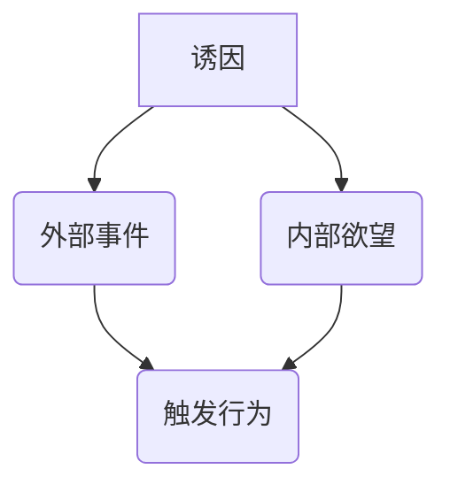
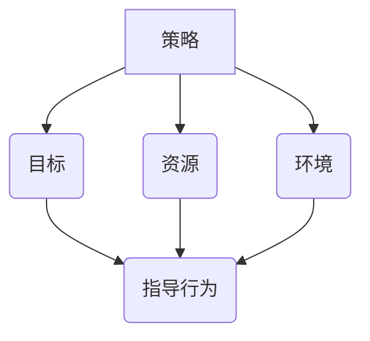
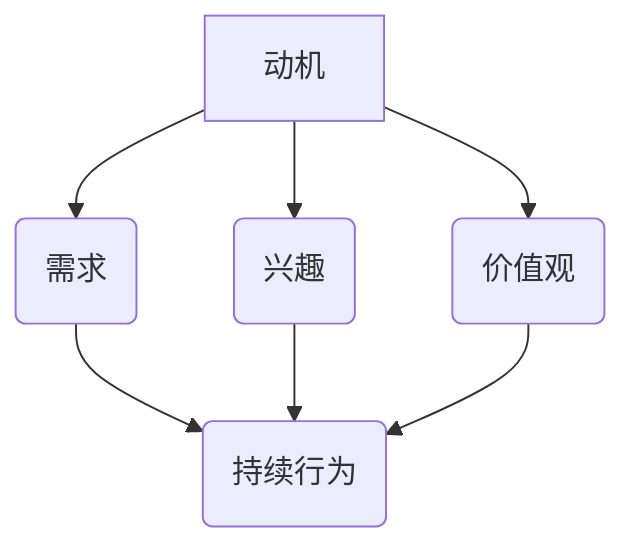
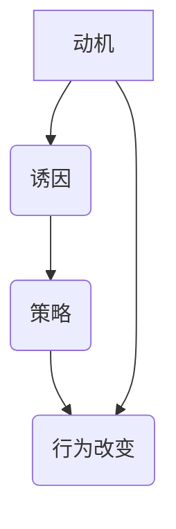

                 

### 《福格行为模型：行为改变的三要素》

> **关键词**：福格行为模型、行为改变、动机、诱因、策略

> **摘要**：本文深入探讨福格行为模型，这一行为科学的重要理论，揭示了行为改变背后的三大核心要素：动机、诱因和策略。我们将通过详细的理论解析、案例分析及实际应用，帮助读者全面理解这一模型，并在不同领域中进行实际操作，实现有效的行为改变。

---

### 目录

1. **引言**
   1.1 行为改变的重要性和挑战
   1.2 福格行为模型的起源与核心思想
   1.3 福格行为模型的应用领域

2. **福格行为模型的核心要素**
   2.1 诱因：驱动行为改变的关键因素
   2.2 策略：实现行为改变的有效方法
   2.3 动机：影响行为持续性的内在因素
   2.4 三要素的相互作用与协同效应

3. **行为改变的过程**
   3.1 行为改变的准备阶段
   3.2 行为改变的实施阶段
   3.3 行为改变的维持阶段

4. **福格行为模型在不同领域的应用**
   4.1 健康领域
   4.2 职业领域
   4.3 教育领域

5. **福格行为模型的综合应用与实践**
   5.1 应用框架与工具
   5.2 自我实践与反思

6. **附录**
   6.1 福格行为模型相关资源
   6.2 行为改变案例库

---

### 引言

#### 行为改变的重要性和挑战

行为改变是人类行为科学中一个重要而复杂的课题。它不仅关系到个人的生活质量、心理健康，还与社会的进步、组织的效率密切相关。在当今快节奏、高压力的社会环境中，如何有效地引导和促进行为改变，已经成为许多领域（如健康、职业、教育）面临的重大挑战。

#### 福格行为模型的起源与核心思想

福格行为模型（BJ Fogg Behavior Model）由斯坦福大学行为科学家BJ福格（BJ Fogg）提出。该模型揭示了行为改变的三大核心要素：动机（Motivation）、诱因（Trigger）和策略（Strategy）。福格行为模型认为，当这三个要素同时出现并相互结合时，行为改变就会发生。

#### 福格行为模型的应用领域

福格行为模型在多个领域都有广泛应用，包括健康、职业、教育等。例如，在健康领域，福格行为模型可以帮助个人养成良好的生活习惯，如健康饮食和定期锻炼；在职业领域，该模型可以用于提升员工的绩效和团队合作能力；在教育领域，福格行为模型可以帮助教师更好地引导学生学习。

### 第一部分：福格行为模型的核心要素

在这一部分，我们将详细探讨福格行为模型的三大核心要素：动机、诱因和策略。我们将通过理论解析和案例分析，帮助读者深入理解这些要素及其相互作用。

#### 第2章：福格行为模型的核心要素

##### 2.1 诱因：驱动行为改变的关键因素

诱因（Trigger）是指触发行为的特定事件或情境。在福格行为模型中，诱因是行为改变的重要驱动力。诱因可以是外部的，如一个通知或提醒，也可以是内在的，如强烈的兴趣或欲望。

**核心概念与联系**

**举例说明**

例如，一个人想要减肥，那么看到健身房的通知（外部诱因）或感到对自己的健康担忧（内部诱因）都可能成为触发他/她去健身房的行为。

##### 2.2 策略：实现行为改变的有效方法

策略（Strategy）是指为实现特定目标而采取的行动或步骤。在福格行为模型中，策略是实现行为改变的关键。一个有效的策略需要考虑目标、资源和环境等因素。

**核心概念与联系**

**举例说明**

以减肥为例，一个有效的策略可能包括制定饮食计划、安排定期锻炼时间以及寻求社交支持等。

##### 2.3 动机：影响行为持续性的内在因素

动机（Motivation）是指推动个体采取行动的内在驱动力。动机可以来自个体的需求、兴趣、价值观等。在福格行为模型中，动机是行为持续性的关键因素。

**核心概念与联系**

**举例说明**

对于减肥者来说，维持减肥行为的动机可能来自于希望改善健康、提高自信或追求理想体型。

##### 2.4 三要素的相互作用与协同效应

在福格行为模型中，动机、诱因和策略是相互作用的。只有当这三个要素同时存在并相互结合时，行为改变才能发生。同时，这三个要素之间也存在协同效应，即它们共同作用可以放大行为改变的效果。

**核心概念与联系**

**举例说明**

例如，一个人想要学习编程，他/她有强烈的兴趣（动机）、看到一封关于编程工作机会的邮件（诱因）并制定了一个详细的学习计划（策略），那么他/她就有可能成功开始学习编程。

---

在下一部分，我们将探讨行为改变的具体过程，包括准备阶段、实施阶段和维持阶段。敬请期待。

