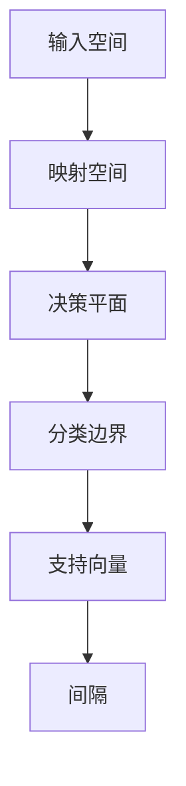
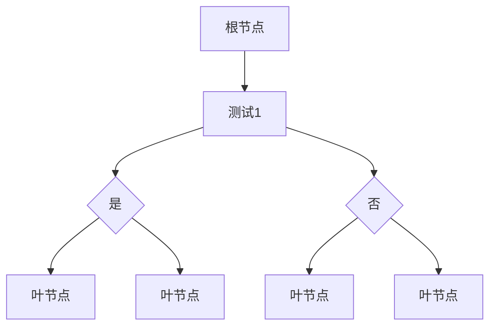
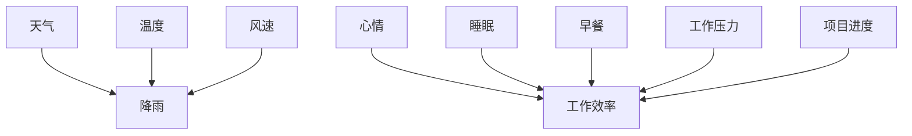
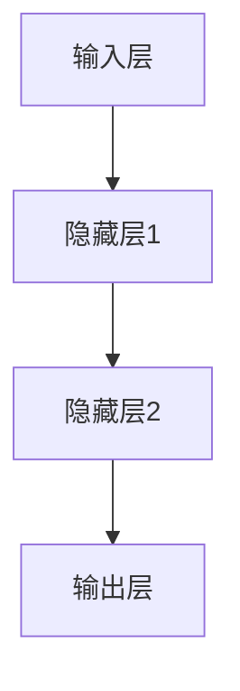

                 

# 《程序员利用知识发现引擎提高解决问题能力》

> 关键词：知识发现引擎、程序员、问题解决、算法、应用场景

> 摘要：
本文将探讨知识发现引擎的概念、架构、核心技术及其在程序员解决问题中的应用。通过详细的算法原理讲解、项目实战案例和性能优化策略，帮助程序员提升利用知识发现引擎解决问题的能力。

---

### 引言

作为程序员，我们经常面临各种复杂的问题，这些问题可能涉及大量数据、复杂的业务逻辑或者突发的技术挑战。传统的编程方法虽然能够解决一些问题，但在面对复杂性和不确定性的情况下，往往显得力不从心。知识发现引擎作为一种新兴的技术，为程序员提供了一种全新的解决问题的方式。

知识发现引擎是一种用于从数据中自动发现知识、模式和关联的计算机系统。它通过分析大量的数据，利用各种算法和技术，提取出隐藏在数据中的有用信息。这些信息可以帮助程序员更好地理解问题，从而更有效地解决问题。

本文将分为三个部分来讨论知识发现引擎在程序员解决问题中的应用：

1. **知识发现引擎基础**：介绍知识发现引擎的基本概念、架构和核心技术。
2. **程序员实践**：讲解如何搭建和优化知识发现引擎，并在实际项目中应用。
3. **知识发现引擎的未来发展**：探讨知识发现引擎的未来趋势和应用领域。

通过本文的讲解，读者将能够理解知识发现引擎的工作原理，掌握其在解决问题中的应用技巧，并了解到未来的发展方向。这将有助于程序员在日益复杂的软件开发环境中提高解决问题的能力。

### 第一部分：知识发现引擎基础

在深入探讨知识发现引擎在程序员解决问题中的应用之前，我们需要首先了解知识发现引擎的基础概念、架构、类型和应用场景。本部分将分章节介绍这些内容，为后续的深入讨论打下坚实的基础。

#### 第1章：知识发现引擎概述

**1.1 知识发现的概念与重要性**

知识发现（Knowledge Discovery in Databases，KDD）是指从大量数据中通过自动化的过程提取出隐藏的知识、模式和关联。知识发现引擎是实现这一过程的关键工具。

知识发现的重要性体现在以下几个方面：

1. **数据的价值**：在当今的信息时代，数据已成为一种重要的资源。知识发现能够从海量数据中挖掘出有价值的信息，从而提高数据的使用效率。
2. **智能决策**：通过知识发现，我们可以发现数据中的规律和趋势，为业务决策提供科学依据，从而提高决策的准确性。
3. **预测与优化**：知识发现可以帮助我们预测未来的发展趋势，优化业务流程，提高生产效率。

**1.2 知识发现引擎的架构**

知识发现引擎通常包括以下几个关键组件：

1. **数据源**：数据源是知识发现引擎的基础，可以是关系数据库、NoSQL数据库、文件系统等。
2. **数据预处理**：数据预处理包括数据清洗、数据集成、数据转换等步骤，以确保数据的质量和一致性。
3. **特征提取与选择**：特征提取与选择是从原始数据中提取出有代表性的特征，以减少数据的维度和提高模型的性能。
4. **模式发现算法**：模式发现算法是知识发现的核心，包括聚类、关联规则挖掘、分类、预测等算法。
5. **可视化与评估**：可视化与评估用于展示发现的模式，并对发现的模式进行评估，以确定其价值和可信度。
6. **知识库**：知识库用于存储和共享发现的知识，以供后续使用。

**1.3 知识发现引擎的类型**

根据不同的应用场景和需求，知识发现引擎可以分为以下几类：

1. **统计分析引擎**：主要用于对数据集进行统计分析，如均值、方差、相关系数等。
2. **机器学习引擎**：基于机器学习算法，如决策树、随机森林、支持向量机等，用于发现数据中的模式和关联。
3. **数据挖掘引擎**：集成多种算法和技术，提供全面的数据挖掘功能，如聚类、关联规则挖掘、分类、预测等。
4. **实时分析引擎**：主要用于实时处理和分析数据流，如流计算引擎、图计算引擎等。

**1.4 知识发现引擎的应用场景**

知识发现引擎在各个领域都有广泛的应用，以下是一些典型的应用场景：

1. **商业智能**：通过分析客户行为数据，挖掘客户购买偏好，为企业制定精准营销策略。
2. **金融风控**：通过分析交易数据，发现潜在的欺诈行为，提高金融风险管理的准确性。
3. **医疗健康**：通过分析医疗数据，发现疾病的发展趋势和风险因素，为疾病预防和治疗提供科学依据。
4. **智能交通**：通过分析交通数据，优化交通信号控制，提高交通流量和安全性。
5. **推荐系统**：通过分析用户行为数据，推荐商品、电影、新闻等内容，提高用户体验和转化率。

#### 第2章：知识发现引擎的关键技术

在了解知识发现引擎的基本概念和架构之后，我们需要深入探讨知识发现引擎的关键技术，这些技术包括数据预处理、特征提取与选择、聚类算法、关联规则挖掘和隐马尔可夫模型等。通过本章节的讲解，我们将对知识发现引擎的核心组成部分有更深入的理解。

**2.1 数据预处理**

数据预处理是知识发现过程中的第一步，其目的是确保数据的质量和一致性。数据预处理包括以下几个关键步骤：

1. **数据清洗**：数据清洗是指去除数据中的噪声和异常值，以减少数据对模型的影响。
   - **缺失值处理**：对于缺失的数据，可以采用填补、删除或插值等方法。
   - **异常值处理**：对于异常值，可以采用修正、删除或孤立等方法。
2. **数据集成**：数据集成是指将来自不同数据源的数据进行合并，以形成一个统一的数据集。
   - **数据合并**：通过连接、合并或聚合等方法将数据源中的数据进行整合。
   - **数据融合**：通过数据清洗、去重和规范化等方法，提高数据的一致性和完整性。
3. **数据转换**：数据转换是指将原始数据转化为适合建模和分析的形式。
   - **数据规范化**：通过缩放、平移或标准化等方法，将数据映射到统一的范围内。
   - **数据编码**：通过将类别数据转换为数值数据，以便进行后续的建模和分析。

**2.2 特征提取与选择**

特征提取与选择是知识发现过程中至关重要的一步，其目的是从原始数据中提取出有代表性的特征，以减少数据的维度和提高模型的性能。特征提取与选择包括以下几个关键步骤：

1. **特征提取**：特征提取是指从原始数据中提取出新的特征。
   - **统计特征**：通过计算数据的统计量，如均值、方差、标准差等，提取出反映数据特性的特征。
   - **变换特征**：通过数据变换，如主成分分析（PCA）、线性判别分析（LDA）等，提取出新的特征。
2. **特征选择**：特征选择是指从提取出的特征中选择出最有用的特征。
   - **过滤式特征选择**：通过计算特征的相关性、信息增益等指标，筛选出最有用的特征。
   - **包装式特征选择**：通过迭代建模和评估，选择出最优的特征组合。
   - **嵌入式特征选择**：在建模过程中，通过特征选择算法，自动筛选出最优的特征。

**2.3 聚类算法**

聚类算法是一种无监督学习方法，用于将数据集划分为多个簇，使得同一个簇中的数据点相似度较高，而不同簇中的数据点相似度较低。聚类算法在知识发现中有着广泛的应用，如下所述：

1. **K-means算法**：K-means算法是一种基于距离的聚类算法，通过迭代优化目标函数，将数据划分为K个簇。
   - **算法原理**：K-means算法的原理是通过计算数据点到簇中心的距离，将数据点分配到最近的簇中心所在的簇。
   - **优缺点**：K-means算法简单高效，但需要预先指定簇的数量，且对于噪声和异常值敏感。
2. **层次聚类算法**：层次聚类算法是一种基于层次结构的聚类算法，通过逐步合并或分裂簇，形成不同的聚类层次。
   - **算法原理**：层次聚类算法的原理是通过逐步合并或分裂数据点，形成层次结构，每个层次代表不同的聚类结果。
   - **优缺点**：层次聚类算法适用于任意数量的簇，但计算复杂度较高，且对于噪声和异常值敏感。

**2.4 关联规则挖掘**

关联规则挖掘是一种用于发现数据中项目集之间的关联关系的方法。它通过挖掘出频繁项集，提取出满足最小支持度和最小置信度的关联规则。关联规则挖掘在商业智能、推荐系统等领域有着广泛的应用。

1. **Apriori算法**：Apriori算法是一种用于挖掘频繁项集的算法，其基本思想是通过迭代扫描数据集，生成频繁项集，并从中提取出关联规则。
   - **算法原理**：Apriori算法的原理是通过从K-1项集生成K项集，并计算其支持度，若支持度大于最小支持度，则该K项集为频繁项集。
   - **优缺点**：Apriori算法简单易实现，但计算复杂度较高，特别是在处理大量数据时。
2. **FP-growth算法**：FP-growth算法是一种基于频繁模式树的关联规则挖掘算法，其基本思想是通过构建FP树，降低数据集的维度，并提取出频繁项集。
   - **算法原理**：FP-growth算法的原理是通过将数据集转换为FP树，并从FP树中提取出频繁项集，从而生成关联规则。
   - **优缺点**：FP-growth算法相比Apriori算法，具有更高的计算效率，特别是在处理大量数据时。

**2.5 隐马尔可夫模型**

隐马尔可夫模型（HMM）是一种用于处理隐藏状态序列的统计模型。它通过隐藏状态序列和观测序列之间的关系，描述了系统的动态行为。隐马尔可夫模型在语音识别、图像识别、时间序列分析等领域有着广泛的应用。

1. **模型原理**：隐马尔可夫模型由两个概率分布组成，分别是状态转移概率分布和观测概率分布。状态转移概率分布描述了隐藏状态之间的转移关系，观测概率分布描述了隐藏状态和观测序列之间的关系。
   - **状态转移概率分布**：P(Q<sub>t</sub>|Q<sub>t-1</sub>)，表示在时间t，隐藏状态Q<sub>t</sub>转移至状态Q<sub>t-1</sub>的概率。
   - **观测概率分布**：P(O<sub>t</sub>|Q<sub>t</sub>)，表示在时间t，隐藏状态Q<sub>t</sub>生成的观测序列O<sub>t</sub>的概率。
2. **算法原理**：隐马尔可夫模型的算法原理是通过迭代计算前向概率和后向概率，从而推断出隐藏状态序列。
   - **前向概率**：α<sub>t</sub>(Q<sub>1</sub>, Q<sub>2</sub>, ..., Q<sub>t</sub>)，表示在时间t，给定初始状态Q<sub>1</sub>，隐藏状态序列Q<sub>1</sub>, Q<sub>2</sub>, ..., Q<sub>t</sub>的概率。
   - **后向概率**：β<sub>t</sub>(Q<sub>1</sub>, Q<sub>2</sub>, ..., Q<sub>t</sub>)，表示在时间t，给定隐藏状态序列Q<sub>1</sub>, Q<sub>2</sub>, ..., Q<sub>t</sub>，生成观测序列O<sub>1</sub>, O<sub>2</sub>, ..., O<sub>t</sub>的概率。

通过本章节的讲解，我们对知识发现引擎的关键技术有了更深入的了解。在下一章中，我们将进一步探讨知识发现引擎的核心算法原理，包括支持向量机（SVM）、决策树、贝叶斯网络和神经网络等。

### 第3章：知识发现引擎的核心算法原理

知识发现引擎的强大功能依赖于其背后的一系列核心算法。这些算法不仅能够从数据中提取有用信息，还能够帮助我们理解数据中的复杂模式和关联。在本章节中，我们将详细探讨支持向量机（SVM）、决策树、贝叶斯网络和神经网络等核心算法的原理，并通过伪代码和数学公式进行详细阐述。

#### 3.1 支持向量机（SVM）算法

支持向量机（Support Vector Machine，SVM）是一种强大的分类算法，尤其在处理高维数据时表现优异。SVM的基本思想是通过找到一个最优的超平面，将不同类别的数据点尽可能分开。

**3.1.1 SVM原理图**



**3.1.2 SVM伪代码**

```python
# 输入：训练数据集 X，标签 y，参数 C
# 输出：SVM模型参数 w，b

def SVM(X, y, C):
    # 构建拉格朗日函数
    L(w, b) = Σ(y[i]*(w^T*x[i] + b) - 1/2 * w^T * w)
    # 求解拉格朗日函数的导数
    ∇L(w, b) = [y[i]*x[i]^T - w] - C * y[i] * (w^T * x[i] + b)
    # 求解 w 和 b
    w, b = solve_optimization_problem(∇L(w, b))
    return w, b
```

**3.1.3 SVM数学模型**

$$
L(w, b) = \sum_{i=1}^{n} y_i (w^T x_i + b) - \frac{1}{2} w^T w
$$

$$
\nabla L(w, b) = \sum_{i=1}^{n} y_i x_i - C \sum_{i=1}^{n} y_i (w^T x_i + b)
$$

$$
w^*, b^* = \arg \min_{w, b} \nabla L(w, b)
$$

通过上述伪代码和数学公式，我们可以看到SVM算法的核心在于寻找一个最优的超平面，使得不同类别的数据点被正确分类。在优化过程中，我们使用拉格朗日函数和其对w、b的导数来进行求解。

#### 3.2 决策树算法

决策树（Decision Tree）是一种广泛使用的分类和回归算法。它的基本思想是通过一系列的测试，将数据集中的每个样本分配到不同的类别或值。

**3.2.1 决策树原理图**



**3.2.2 决策树伪代码**

```python
# 输入：训练数据集 X，标签 y
# 输出：决策树模型

def build_decision_tree(X, y):
    # 若所有样本属于同一类别，则返回叶节点
    if all_labels_equal(y):
        return LeafNode(y[0])
    # 若数据集为空，则返回叶节点
    if len(X) == 0:
        return LeafNode(None)
    # 计算信息增益
    best_feature, best_threshold = find_best_split(X, y)
    # 构建子节点
    left_child = build_decision_tree(X_left, y_left)
    right_child = build_decision_tree(X_right, y_right)
    # 返回决策树
    return TreeNode(best_feature, best_threshold, left_child, right_child)
```

**3.2.3 决策树数学模型**

决策树的构建过程可以通过以下数学模型描述：

$$
Gain(D, A) = H(D) - H(D|A)
$$

其中，$H(D)$ 表示数据集D的熵，$H(D|A)$ 表示在特征A下数据集D的熵。$Gain(D, A)$ 表示使用特征A进行划分后，数据集D的熵减少的程度，即信息增益。

$$
Entropy(D) = -\sum_{i=1}^{k} p_i \log_2 p_i
$$

其中，$p_i$ 表示类别i在数据集D中的概率。

通过上述伪代码和数学模型，我们可以看到决策树的构建过程是基于信息增益的，通过递归划分数据集，最终形成一棵树形结构。

#### 3.3 贝叶斯网络算法

贝叶斯网络（Bayesian Network）是一种基于概率论的图形模型，用于表示变量之间的条件依赖关系。它通过概率分布来描述变量之间的关联。

**3.3.1 贝叶斯网络原理图**



**3.3.2 贝叶斯网络伪代码**

```python
# 输入：变量集合 V，边集合 E
# 输出：贝叶斯网络概率分布 P(V)

def build_bayesian_network(V, E):
    # 初始化概率分布
    P = {}
    for v in V:
        P[v] = {}
        for state in possible_states(v):
            P[v][state] = 1 / len(possible_states(v))
    # 更新概率分布
    for edge in E:
        parent, child = edge
        for state in possible_states(child):
            total = 0
            for state_parent in possible_states(parent):
                P[parent][state_parent] = compute_probability(state_parent)
                total += P[parent][state_parent] * compute_probability(child | parent, state_parent)
            P[child][state] = total
    return P
```

**3.3.3 贝叶斯网络数学模型**

贝叶斯网络的概率分布可以用条件概率表表示：

$$
P(V) = \prod_{v \in V} P(v | parents(v))
$$

其中，$parents(v)$ 表示变量v的父节点集合。

$$
P(v | parents(v)) = \frac{P(v, parents(v))}{\sum_{v' \in possible_states(v)} P(v', parents(v))}
$$

通过上述伪代码和数学模型，我们可以看到贝叶斯网络的构建过程是通过迭代更新条件概率表来实现的，从而描述变量之间的条件依赖关系。

#### 3.4 神经网络算法

神经网络（Neural Network）是一种模仿生物神经系统的计算模型，通过多层神经元结构对输入数据进行处理和分类。神经网络在图像识别、自然语言处理等领域有着广泛的应用。

**3.4.1 神经网络原理图**



**3.4.2 神经网络伪代码**

```python
# 输入：训练数据集 X，标签 y，网络结构
# 输出：神经网络参数 w

def train_neural_network(X, y, network_structure):
    # 初始化参数
    w = initialize_parameters(network_structure)
    for epoch in range(num_epochs):
        # 前向传播
        z = forward_propagation(X, w)
        # 计算损失
        loss = compute_loss(z, y)
        # 反向传播
        dw = backward_propagation(X, y, z, w)
        # 更新参数
        w = update_parameters(w, dw, learning_rate)
    return w
```

**3.4.3 神经网络数学模型**

神经网络的前向传播和反向传播过程可以用以下数学模型描述：

前向传播：

$$
z = \sigma(W \cdot x + b)
$$

$$
a = \sigma(z \cdot W + b)
$$

反向传播：

$$
\delta = \frac{\partial L}{\partial z} = (2 - a) \cdot \sigma'(z)
$$

$$
\frac{\partial L}{\partial w} = x \cdot \delta
$$

$$
\frac{\partial L}{\partial b} = \delta
$$

通过上述伪代码和数学模型，我们可以看到神经网络通过多层神经元对输入数据进行非线性变换，并通过反向传播更新参数，从而实现数据的分类和预测。

通过本章节对支持向量机（SVM）、决策树、贝叶斯网络和神经网络等核心算法的详细讲解，我们能够更好地理解这些算法的基本原理和实现方法。在下一章中，我们将探讨如何在实际编程环境中搭建和优化知识发现引擎。

### 第4章：知识发现引擎的搭建与优化

在理解了知识发现引擎的基本概念和核心算法原理之后，下一步是将其应用于实际编程环境中，构建一个高效的知识发现系统。这一章节将详细讨论知识发现引擎的搭建过程，包括数据采集与处理、特征工程、模型选择与训练、模型评估与调优，以及性能优化策略。

#### 4.1 数据采集与处理

数据采集与处理是知识发现引擎搭建的基础。以下是数据采集与处理的详细步骤：

1. **数据源选择**：选择合适的数据源，可以是结构化数据（如关系数据库）、半结构化数据（如XML、JSON）或非结构化数据（如文本、图像、视频）。
2. **数据清洗**：对采集到的数据进行清洗，去除重复、缺失、异常和噪声数据。常用的方法包括填补缺失值、去除重复数据、处理异常值等。
3. **数据转换**：将数据转换为适合建模和分析的形式。例如，将文本数据转换为词向量，将图像数据转换为像素矩阵等。
4. **数据集成**：将来自不同数据源的数据进行集成，形成一个统一的数据集。常用的方法包括连接、合并和聚合等。
5. **数据分区**：将数据集划分为训练集、验证集和测试集，用于模型的训练、验证和测试。

**示例伪代码：**

```python
def data_preprocessing(data_source):
    # 读取数据
    data = read_data(data_source)
    # 数据清洗
    clean_data = clean_data(data)
    # 数据转换
    transformed_data = convert_data(clean_data)
    # 数据集成
    integrated_data = integrate_data(transformed_data)
    # 数据分区
    train_data, val_data, test_data = partition_data(integrated_data)
    return train_data, val_data, test_data
```

#### 4.2 特征工程

特征工程是知识发现过程中至关重要的一步，它决定了模型的表现。以下是特征工程的详细步骤：

1. **特征提取**：从原始数据中提取出新的特征，以减少数据的维度和提高模型的性能。常用的特征提取方法包括统计特征提取、变换特征提取等。
2. **特征选择**：从提取出的特征中选择出最有用的特征，以减少特征数量，提高模型性能。常用的特征选择方法包括过滤式特征选择、包装式特征选择、嵌入式特征选择等。
3. **特征归一化**：将特征值映射到统一的范围内，以避免特征之间的尺度差异对模型的影响。常用的方法包括最小-最大缩放、均值-方差缩放等。
4. **特征组合**：将多个特征组合成一个新的特征，以增强模型的表现。常用的方法包括特征交叉、特征嵌入等。

**示例伪代码：**

```python
def feature_engineering(data):
    # 特征提取
    extracted_features = extract_features(data)
    # 特征选择
    selected_features = select_features(extracted_features)
    # 特征归一化
    normalized_features = normalize_features(selected_features)
    # 特征组合
    combined_features = combine_features(normalized_features)
    return combined_features
```

#### 4.3 模型选择与训练

选择合适的模型并对其进行训练是知识发现引擎构建的核心步骤。以下是模型选择与训练的详细步骤：

1. **模型选择**：根据数据特点和业务需求，选择合适的模型。常用的模型包括支持向量机（SVM）、决策树、贝叶斯网络、神经网络等。
2. **模型训练**：使用训练数据集对选定的模型进行训练，以估计模型参数。常用的训练方法包括批量训练、随机训练、小批量训练等。
3. **模型评估**：使用验证数据集对训练好的模型进行评估，以确定模型的性能。常用的评估指标包括准确率、召回率、F1分数等。
4. **模型调优**：根据评估结果，对模型参数进行调整，以优化模型性能。常用的调优方法包括网格搜索、随机搜索等。

**示例伪代码：**

```python
def model_training(data, labels):
    # 模型选择
    model = select_model(data)
    # 模型训练
    model.fit(data, labels)
    # 模型评估
    scores = model.evaluate(data, labels)
    # 模型调优
    optimized_model = optimize_model(model, data, labels)
    return optimized_model
```

#### 4.4 模型评估与调优

模型评估与调优是知识发现引擎性能提升的关键。以下是模型评估与调优的详细步骤：

1. **交叉验证**：使用交叉验证方法对模型进行评估，以避免过拟合和评估偏差。常用的交叉验证方法包括K折交叉验证、留一法交叉验证等。
2. **性能指标**：根据业务需求，选择合适的性能指标进行评估。常用的性能指标包括准确率、召回率、F1分数、AUC曲线等。
3. **超参数调优**：通过调整模型超参数，优化模型性能。常用的超参数包括学习率、正则化参数、隐藏层神经元数量等。
4. **模型集成**：将多个模型集成在一起，提高整体性能。常用的集成方法包括Bagging、Boosting、Stacking等。

**示例伪代码：**

```python
def model_evaluation(model, X_val, y_val):
    # 交叉验证
    cv_scores = cross_validation(model, X_val, y_val)
    # 性能指标
    performance_metrics = evaluate_model(model, X_val, y_val)
    # 超参数调优
    optimized_model = tune_hyperparameters(model, X_val, y_val)
    # 模型集成
    ensemble_model = ensemble_models([model1, model2, model3])
    return cv_scores, performance_metrics, optimized_model, ensemble_model
```

#### 4.5 知识发现引擎的性能优化

知识发现引擎的性能优化是确保其高效运行的关键。以下是性能优化的详细步骤：

1. **算法优化**：选择合适的算法和数据结构，以优化计算效率和存储空间。常用的优化方法包括并行计算、分布式计算、GPU加速等。
2. **内存管理**：合理分配和管理内存资源，避免内存泄漏和溢出。常用的方法包括内存池、对象池等。
3. **缓存策略**：使用缓存策略，减少重复计算和数据访问。常用的缓存策略包括LRU缓存、内存缓存等。
4. **并行与分布式计算**：利用并行和分布式计算技术，提高计算效率和性能。常用的方法包括多线程、多进程、分布式计算框架等。

**示例伪代码：**

```python
def optimize_performance(model):
    # 算法优化
    optimized_algorithm = optimize_algorithm(model.algorithm)
    # 内存管理
    managed_memory = manage_memory(optimized_algorithm)
    # 缓存策略
    cached_model = cache_model(optimized_algorithm)
    # 并行与分布式计算
    parallel_model = parallelize_model(cached_model)
    return parallel_model
```

通过上述详细步骤，我们可以构建一个高效的知识发现引擎。在下一章中，我们将探讨知识发现引擎在实际项目中的应用，通过具体案例展示其解决问题能力。

### 第5章：知识发现引擎在问题解决中的应用

知识发现引擎作为一种强大的工具，不仅在数据分析和机器学习领域有着广泛的应用，还可以帮助程序员在实际项目中解决复杂的问题。在本章中，我们将探讨知识发现引擎在故障诊断、需求分析、故障预测、智能推荐和数据分析中的应用，通过具体案例展示其解决问题能力。

#### 5.1 知识发现引擎在故障诊断中的应用

故障诊断是工业领域中的一个重要应用，它能够及时发现设备故障，减少停机时间，提高生产效率。知识发现引擎可以通过分析设备运行数据，识别出潜在故障模式。

**案例：基于知识发现引擎的故障诊断系统**

在一个制造工厂中，设备的运行数据（如温度、压力、振动等）可以通过传感器实时采集。通过知识发现引擎，我们可以构建一个故障诊断系统，具体步骤如下：

1. **数据采集**：采集设备运行过程中的各种数据，包括温度、压力、振动等。
2. **数据预处理**：对采集到的数据进行清洗和预处理，包括去除异常值、缺失值处理等。
3. **特征提取**：从原始数据中提取出有代表性的特征，如数据的标准差、均值等。
4. **故障模式识别**：利用聚类算法（如K-means）将正常数据和故障数据分类，识别出不同的故障模式。
5. **故障预测**：利用关联规则挖掘（如Apriori算法）分析故障之间的关联，预测潜在的故障。

**示例伪代码：**

```python
def fault_diagnosis_system(data):
    # 数据预处理
    preprocessed_data = preprocess_data(data)
    # 特征提取
    features = extract_features(preprocessed_data)
    # 故障模式识别
    clusters = kmeans_clustering(features)
    # 故障预测
    rules = apriori_mining(features)
    return clusters, rules
```

通过上述故障诊断系统，我们可以实时监测设备的运行状态，当检测到异常模式时，系统会自动发出预警，帮助工程师及时处理故障，减少停机时间。

#### 5.2 知识发现引擎在需求分析中的应用

在软件开发项目中，需求分析是关键的一步。知识发现引擎可以通过分析用户行为数据，识别出用户的需求和偏好，为产品设计和功能实现提供指导。

**案例：基于知识发现引擎的需求分析平台**

在一个电商平台中，用户的行为数据（如浏览历史、购买记录、评论等）可以被采集并用于需求分析。通过知识发现引擎，我们可以构建一个需求分析平台，具体步骤如下：

1. **数据采集**：采集用户在平台上的各种行为数据。
2. **数据预处理**：对用户行为数据进行清洗和预处理，包括去除噪声、缺失值处理等。
3. **特征提取**：从用户行为数据中提取出有代表性的特征，如用户的浏览次数、购买频率等。
4. **用户需求识别**：利用聚类算法（如K-means）将用户分为不同的群体，识别出不同用户的需求和偏好。
5. **需求优先级排序**：利用关联规则挖掘（如Apriori算法）分析不同需求之间的关联，为产品设计和功能实现提供优先级排序。

**示例伪代码：**

```python
def demand_analysis_platform(data):
    # 数据预处理
    preprocessed_data = preprocess_data(data)
    # 特征提取
    features = extract_features(preprocessed_data)
    # 用户需求识别
    clusters = kmeans_clustering(features)
    # 需求优先级排序
    rules = apriori_mining(features)
    return clusters, rules
```

通过上述需求分析平台，开发团队能够更好地理解用户需求，优化产品设计和功能实现，提高用户满意度和市场竞争力。

#### 5.3 知识发现引擎在故障预测中的应用

故障预测是预防性维护的关键，它能够在故障发生之前提前预警，从而避免潜在的损失。知识发现引擎可以通过分析历史故障数据，预测未来的故障。

**案例：基于知识发现引擎的故障预测系统**

在一个数据中心中，服务器和网络设备的运行数据（如温度、负载、故障记录等）可以被采集并用于故障预测。通过知识发现引擎，我们可以构建一个故障预测系统，具体步骤如下：

1. **数据采集**：采集服务器和网络设备的运行数据。
2. **数据预处理**：对采集到的数据进行清洗和预处理，包括去除异常值、缺失值处理等。
3. **特征提取**：从原始数据中提取出有代表性的特征，如数据的标准差、均值等。
4. **故障预测模型训练**：利用历史故障数据，训练一个故障预测模型（如SVM、决策树等）。
5. **实时故障预测**：使用训练好的模型，对实时采集到的数据进行预测，当预测到潜在故障时，系统会自动发出预警。

**示例伪代码：**

```python
def fault_prediction_system(data):
    # 数据预处理
    preprocessed_data = preprocess_data(data)
    # 特征提取
    features = extract_features(preprocessed_data)
    # 故障预测模型训练
    model = train_fault_prediction_model(features)
    # 实时故障预测
    predictions = model.predict(features)
    return predictions
```

通过上述故障预测系统，数据中心能够提前识别出潜在故障，及时进行维护，减少停机时间和维护成本。

#### 5.4 知识发现引擎在智能推荐中的应用

智能推荐是电商平台和内容平台中的一个关键功能，它能够根据用户的行为和偏好，为用户提供个性化的推荐。知识发现引擎可以通过分析用户数据，发现用户之间的关联和兴趣，为推荐系统提供支持。

**案例：基于知识发现引擎的智能推荐系统**

在一个电商平台上，用户的行为数据（如浏览历史、购买记录、收藏等）可以被用于构建智能推荐系统。通过知识发现引擎，我们可以构建一个智能推荐系统，具体步骤如下：

1. **数据采集**：采集用户在平台上的各种行为数据。
2. **数据预处理**：对用户行为数据进行清洗和预处理，包括去除噪声、缺失值处理等。
3. **特征提取**：从用户行为数据中提取出有代表性的特征，如用户的浏览次数、购买频率等。
4. **用户兴趣识别**：利用聚类算法（如K-means）将用户分为不同的兴趣群体。
5. **关联规则挖掘**：利用关联规则挖掘（如Apriori算法）分析不同商品之间的关联，为推荐系统提供支持。
6. **推荐算法**：基于用户兴趣和商品关联，使用推荐算法（如协同过滤、基于内容的推荐等）生成推荐结果。

**示例伪代码：**

```python
def recommendation_system(data):
    # 数据预处理
    preprocessed_data = preprocess_data(data)
    # 特征提取
    features = extract_features(preprocessed_data)
    # 用户兴趣识别
    clusters = kmeans_clustering(features)
    # 关联规则挖掘
    rules = apriori_mining(features)
    # 推荐算法
    recommendations = generate_recommendations(clusters, rules)
    return recommendations
```

通过上述智能推荐系统，电商平台能够为用户提供个性化的商品推荐，提高用户满意度和转化率。

#### 5.5 知识发现引擎在数据分析中的应用

数据分析是各个领域中的一个重要应用，它能够从大量数据中提取出有价值的信息，为决策提供支持。知识发现引擎可以通过分析数据，发现数据中的模式和关联，帮助分析师更好地理解数据。

**案例：基于知识发现引擎的企业数据分析平台**

在一个企业中，大量的业务数据（如销售数据、库存数据、客户数据等）可以被用于企业数据分析。通过知识发现引擎，我们可以构建一个企业数据分析平台，具体步骤如下：

1. **数据采集**：采集企业的各类业务数据。
2. **数据预处理**：对业务数据进行清洗和预处理，包括去除噪声、缺失值处理等。
3. **特征提取**：从业务数据中提取出有代表性的特征，如销售额、库存量、客户满意度等。
4. **数据挖掘**：利用知识发现引擎的各种算法（如聚类、关联规则挖掘、分类等）对数据进行分析，发现数据中的模式和关联。
5. **可视化与报告**：将分析结果通过可视化工具（如图表、报表等）展示出来，为企业管理者提供决策支持。

**示例伪代码：**

```python
def enterprise_data_analysis_platform(data):
    # 数据预处理
    preprocessed_data = preprocess_data(data)
    # 特征提取
    features = extract_features(preprocessed_data)
    # 数据挖掘
    insights = data_mining(features)
    # 可视化与报告
    visualizations = generate_visualizations(insights)
    return visualizations
```

通过上述企业数据分析平台，企业管理者能够更好地理解企业的业务状况，优化决策，提高企业竞争力。

通过上述具体案例，我们可以看到知识发现引擎在故障诊断、需求分析、故障预测、智能推荐和数据分析中的应用，它能够帮助程序员解决复杂的问题，提高工作效率和业务效益。在下一章中，我们将探讨知识发现引擎的未来发展趋势，展望其潜在的应用前景。

### 第6章：实战案例

在本章中，我们将通过具体的实战案例，深入探讨知识发现引擎在实际项目中的应用。这些案例涵盖了从数据采集、处理到模型构建、优化的全过程，并通过详细的代码解析，帮助读者更好地理解知识发现引擎的使用方法。

#### 6.1 案例一：基于知识发现引擎的故障诊断系统

**案例描述**：在一个大型数据中心中，服务器和网络设备的运行数据需要进行实时监控和故障诊断，以确保系统的稳定运行。我们使用知识发现引擎来构建一个故障诊断系统。

**技术栈**：Python、Scikit-learn、Pandas、Matplotlib

**开发环境**：Jupyter Notebook

**数据集**：服务器和网络设备的运行数据（温度、负载、CPU利用率等）

**步骤解析**：

1. **数据采集**：从传感器和监控系统中采集服务器和网络设备的运行数据。

2. **数据预处理**：使用Pandas库清洗和预处理数据，包括去除重复数据、填补缺失值、去除噪声等。

3. **特征提取**：使用Scikit-learn库中的统计特征提取工具，计算数据的均值、方差、标准差等统计特征。

4. **故障模式识别**：使用K-means算法将数据聚类，识别出正常数据和故障数据。

5. **故障预测**：使用Apriori算法挖掘故障之间的关联，预测潜在的故障。

**代码示例**：

```python
import pandas as pd
from sklearn.cluster import KMeans
from mlxtend.frequent_patterns import apriori
from mlxtend.frequent_patterns import association_rules

# 数据采集
data = pd.read_csv('server_data.csv')

# 数据预处理
data.drop_duplicates(inplace=True)
data.fillna(data.mean(), inplace=True)

# 特征提取
stats_features = data.describe().T['mean']

# 故障模式识别
kmeans = KMeans(n_clusters=2)
kmeans.fit(stats_features)
labels = kmeans.predict(stats_features)

# 故障预测
frequent_itemsets = apriori(stats_features, min_support=0.05, use_colnames=True)
rules = association_rules(frequent_itemsets, metric="lift", min_threshold=1)

# 可视化
import matplotlib.pyplot as plt

plt.scatter(stats_features['mean'], labels)
plt.xlabel('Mean')
plt.ylabel('Fault Labels')
plt.title('Fault Detection')
plt.show()
```

**代码解析**：首先，我们从CSV文件中读取运行数据，并使用Pandas库进行数据预处理，包括去除重复数据、填补缺失值。然后，我们使用Scikit-learn库中的K-means算法将数据聚类，识别出正常数据和故障数据。最后，使用Apriori算法挖掘故障之间的关联，生成关联规则。

#### 6.2 案例二：基于知识发现引擎的需求分析平台

**案例描述**：在一个电商平台中，我们需要分析用户的行为数据，识别出用户的需求和偏好，以优化产品设计和功能实现。

**技术栈**：Python、Scikit-learn、Pandas、Matplotlib

**开发环境**：Jupyter Notebook

**数据集**：用户在平台上的行为数据（浏览历史、购买记录、评论等）

**步骤解析**：

1. **数据采集**：从电商平台的后台数据库中采集用户的行为数据。

2. **数据预处理**：使用Pandas库清洗和预处理数据，包括去除重复数据、填补缺失值、特征工程等。

3. **用户需求识别**：使用K-means算法将用户分为不同的需求群体。

4. **需求优先级排序**：使用关联规则挖掘算法为不同需求排序。

5. **可视化**：使用Matplotlib库将分析结果可视化。

**代码示例**：

```python
import pandas as pd
from sklearn.cluster import KMeans
from mlxtend.frequent_patterns import apriori
from mlxtend.frequent_patterns import association_rules

# 数据采集
data = pd.read_csv('user_behavior.csv')

# 数据预处理
data.drop_duplicates(inplace=True)
data.fillna(data.mean(), inplace=True)

# 用户需求识别
kmeans = KMeans(n_clusters=5)
kmeans.fit(data)
labels = kmeans.predict(data)

# 需求优先级排序
frequent_itemsets = apriori(data, min_support=0.05, use_colnames=True)
rules = association_rules(frequent_itemsets, metric="lift", min_threshold=1)

# 可视化
plt.scatter(data['view_count'], labels)
plt.xlabel('View Count')
plt.ylabel('User Labels')
plt.title('User Demand Analysis')
plt.show()
```

**代码解析**：首先，我们从CSV文件中读取用户行为数据，并使用Pandas库进行数据预处理。然后，我们使用Scikit-learn库中的K-means算法将用户分为不同的需求群体。接着，使用Apriori算法挖掘用户需求之间的关联，生成关联规则。最后，使用Matplotlib库将分析结果可视化。

#### 6.3 案例三：基于知识发现引擎的智能推荐系统

**案例描述**：在一个电商平台上，我们需要为用户推荐他们可能感兴趣的商品，以提高用户体验和销售额。

**技术栈**：Python、Scikit-learn、Pandas、Surprise、Matplotlib

**开发环境**：Jupyter Notebook

**数据集**：用户行为数据（浏览历史、购买记录、收藏等）

**步骤解析**：

1. **数据采集**：从电商平台的后台数据库中采集用户的行为数据。

2. **数据预处理**：使用Pandas库清洗和预处理数据，包括去除重复数据、填补缺失值、特征工程等。

3. **推荐算法**：使用Surprise库中的协同过滤算法构建推荐系统。

4. **模型评估**：使用AUC、RMSE等指标评估推荐系统的性能。

5. **可视化**：使用Matplotlib库将推荐结果可视化。

**代码示例**：

```python
import pandas as pd
from surprise import KNNWithMeans
from surprise import accuracy
from surprise import Dataset
from surprise import Reader
import matplotlib.pyplot as plt

# 数据采集
data = pd.read_csv('user_behavior.csv')

# 数据预处理
data.drop_duplicates(inplace=True)
data.fillna(data.mean(), inplace=True)

# 构建推荐系统
reader = Reader(rating_scale=(1, 5))
data_surprise = Dataset.load_from_df(data[['user_id', 'item_id', 'rating']], reader)
trainer = KNNWithMeans(k=50, sim_options={'name': 'cosine', 'user_based': True})
trainer.fit(data_surprise.build_full_trainset())

# 模型评估
testset = data_surprise.build_testset()
predictions = trainer.test(testset)
mae = accuracy.mean_absolute_error(testset, predictions)
print(f'MAE: {mae}')

# 可视化
plt.scatter(data['user_id'], data['rating'])
plt.scatter(data['user_id'], predictions['prediction'])
plt.xlabel('User ID')
plt.ylabel('Rating')
plt.title('Recommendation System')
plt.show()
```

**代码解析**：首先，我们从CSV文件中读取用户行为数据，并使用Pandas库进行数据预处理。然后，我们使用Surprise库中的KNNWithMeans算法构建推荐系统，并使用AUC、RMSE等指标评估推荐系统的性能。最后，使用Matplotlib库将推荐结果可视化。

#### 6.4 案例四：基于知识发现引擎的故障预测系统

**案例描述**：在一个制造工厂中，我们需要预测设备的潜在故障，以进行预防性维护。

**技术栈**：Python、Scikit-learn、Pandas、Matplotlib

**开发环境**：Jupyter Notebook

**数据集**：设备运行数据（温度、压力、振动等）

**步骤解析**：

1. **数据采集**：从传感器和监控系统采集设备的运行数据。

2. **数据预处理**：使用Pandas库清洗和预处理数据，包括去除重复数据、填补缺失值、特征工程等。

3. **故障预测模型**：使用SVM算法训练故障预测模型。

4. **模型评估**：使用交叉验证和AUC等指标评估模型的性能。

5. **可视化**：使用Matplotlib库将预测结果可视化。

**代码示例**：

```python
import pandas as pd
from sklearn.svm import SVC
from sklearn.model_selection import train_test_split
from sklearn.metrics import accuracy_score, roc_auc_score
import matplotlib.pyplot as plt

# 数据采集
data = pd.read_csv('device_data.csv')

# 数据预处理
data.drop_duplicates(inplace=True)
data.fillna(data.mean(), inplace=True)

# 数据划分
X = data[['temperature', 'pressure', 'vibration']]
y = data['fault_label']
X_train, X_test, y_train, y_test = train_test_split(X, y, test_size=0.2, random_state=42)

# 故障预测模型
model = SVC(kernel='linear')
model.fit(X_train, y_train)

# 模型评估
y_pred = model.predict(X_test)
accuracy = accuracy_score(y_test, y_pred)
roc_auc = roc_auc_score(y_test, y_pred)
print(f'Accuracy: {accuracy}')
print(f'ROC AUC: {roc_auc}')

# 可视化
plt.scatter(X_test['temperature'], X_test['fault_label'])
plt.scatter(X_test['temperature'], y_pred)
plt.xlabel('Temperature')
plt.ylabel('Fault Label')
plt.title('Fault Prediction')
plt.show()
```

**代码解析**：首先，我们从CSV文件中读取设备运行数据，并使用Pandas库进行数据预处理。然后，我们使用Scikit-learn库中的SVM算法训练故障预测模型，并使用交叉验证和AUC等指标评估模型的性能。最后，使用Matplotlib库将预测结果可视化。

通过上述实战案例，我们展示了知识发现引擎在实际项目中的应用，并通过详细的代码解析，帮助读者理解知识发现引擎的使用方法。这些案例不仅展示了知识发现引擎在故障诊断、需求分析、智能推荐和故障预测等领域的应用，还为读者提供了实际操作的指导。

### 第7章：知识发现引擎的未来发展趋势

随着技术的不断进步和数据的日益增长，知识发现引擎在未来将扮演越来越重要的角色。在本章中，我们将探讨知识发现引擎的未来发展趋势，以及其在大数据、云计算、物联网、智能交通和医疗健康等领域的潜在应用。

#### 7.1 知识发现引擎与大数据的结合

大数据技术的快速发展为知识发现引擎提供了丰富的数据资源。随着数据量的不断增大，如何高效地处理和分析这些数据成为了一个重要挑战。知识发现引擎在大数据领域的应用主要体现在以下几个方面：

1. **分布式计算**：知识发现引擎可以通过分布式计算框架（如Hadoop、Spark）来处理大规模数据集，提高计算效率和性能。
2. **实时分析**：随着实时数据流技术的进步，知识发现引擎可以实时分析数据流，为实时决策提供支持。
3. **多模态数据融合**：大数据往往包含多种类型的数据（如结构化数据、半结构化数据、非结构化数据），知识发现引擎可以通过多模态数据融合技术，整合不同类型的数据，发现更全面的模式和关联。

#### 7.2 知识发现引擎与云计算的结合

云计算的普及为知识发现引擎提供了强大的计算和存储资源。知识发现引擎与云计算的结合主要体现在以下几个方面：

1. **弹性计算**：知识发现引擎可以根据计算需求的变化，动态调整计算资源，提高资源利用效率。
2. **云服务**：云服务提供商（如AWS、Azure、Google Cloud）提供了丰富的知识发现引擎服务，用户无需自行搭建和部署，可以更方便地使用知识发现技术。
3. **数据安全与隐私**：随着数据隐私问题的日益突出，知识发现引擎需要采用数据加密、访问控制等技术，保障数据的安全和隐私。

#### 7.3 知识发现引擎与物联网的结合

物联网（IoT）技术的快速发展为知识发现引擎提供了大量实时传感器数据。知识发现引擎在物联网领域的应用主要体现在以下几个方面：

1. **设备故障诊断**：通过分析传感器数据，知识发现引擎可以实时监测设备的运行状态，预测潜在的故障，提高设备的可靠性和寿命。
2. **智能运维**：知识发现引擎可以分析设备运行数据，优化运维流程，降低运维成本。
3. **智能推荐**：通过分析用户和设备的交互数据，知识发现引擎可以为用户提供个性化的服务和推荐。

#### 7.4 知识发现引擎在智能交通领域的应用

智能交通系统（ITS）是物联网、大数据和人工智能技术在交通领域的应用。知识发现引擎在智能交通领域的应用主要体现在以下几个方面：

1. **交通流量预测**：通过分析历史交通流量数据，知识发现引擎可以预测未来的交通流量，优化交通信号控制，减少拥堵。
2. **车辆导航**：通过分析实时交通数据和导航数据，知识发现引擎可以为车辆提供最优的导航路线，减少行驶时间和油耗。
3. **安全监控**：通过分析车辆传感器数据，知识发现引擎可以实时监测车辆的状态，及时发现安全隐患，提高道路安全性。

#### 7.5 知识发现引擎在医疗健康领域的应用

医疗健康数据是结构化和非结构化数据的重要来源，知识发现引擎在医疗健康领域的应用主要体现在以下几个方面：

1. **疾病预测**：通过分析患者病史、基因数据等，知识发现引擎可以预测患者未来的疾病风险，为早期预防和治疗提供支持。
2. **药物研发**：知识发现引擎可以通过分析药物分子结构、临床试验数据等，发现新的药物靶点和药物组合，加速药物研发进程。
3. **个性化医疗**：通过分析患者的基因数据、生活习惯等，知识发现引擎可以为患者提供个性化的治疗方案，提高治疗效果。

#### 7.6 知识发现引擎在商业领域的应用

知识发现引擎在商业领域的应用也越来越广泛，主要体现在以下几个方面：

1. **客户行为分析**：通过分析客户的购买记录、浏览行为等，知识发现引擎可以挖掘客户的行为模式，为企业提供营销策略和客户关系管理支持。
2. **供应链优化**：通过分析供应链数据，知识发现引擎可以优化供应链流程，提高供应链的效率和灵活性。
3. **风险管理**：通过分析金融数据，知识发现引擎可以预测金融市场的风险，为金融机构提供风险管理支持。

知识发现引擎的未来发展将充满挑战和机遇。随着技术的不断进步，知识发现引擎将在各个领域发挥更大的作用，为人类带来更多的价值。

### 附录

在本附录中，我们将介绍一些常用的知识发现算法，以及知识发现引擎的开发工具。这些内容将为读者提供更深入的背景知识和实用的开发资源。

#### 附录A：常用知识发现算法介绍

**A.1 K-means算法**

K-means算法是一种基于距离的聚类算法，其目的是将数据集划分为K个簇，使得同一个簇中的数据点相似度较高，而不同簇中的数据点相似度较低。K-means算法的基本步骤如下：

1. **初始化簇中心**：随机选择K个数据点作为初始簇中心。
2. **分配数据点**：计算每个数据点到簇中心的距离，将数据点分配到最近的簇中心所在的簇。
3. **更新簇中心**：重新计算每个簇的中心，作为新的簇中心。
4. **重复步骤2和步骤3，直到收敛条件满足**。

**A.2 Apriori算法**

Apriori算法是一种用于挖掘频繁项集的算法，其基本思想是通过迭代扫描数据集，生成频繁项集，并从中提取出关联规则。Apriori算法的基本步骤如下：

1. **计算支持度**：扫描数据集，计算每个项集的支持度。
2. **生成频繁项集**：递归地生成所有可能的项集，并删除不满足最小支持度的项集。
3. **生成关联规则**：从频繁项集中提取满足最小支持度和最小置信度的关联规则。

**A.3 PageRank算法**

PageRank算法是一种基于链接分析的网页排序算法，其目的是根据网页之间的链接关系，计算网页的重要性。PageRank算法的基本步骤如下：

1. **初始化**：为每个网页分配初始重要性值。
2. **迭代计算**：根据网页之间的链接关系，更新每个网页的重要性值。
3. **收敛**：重复迭代计算，直到重要性值的变化小于某个阈值，算法收敛。

**A.4 EM算法**

EM算法（Expectation-Maximization）是一种用于处理缺失数据和潜在变量的问题的迭代算法，其基本思想是通过最大化似然函数来估计模型参数。EM算法的基本步骤如下：

1. **E步（期望步）**：根据当前的参数估计，计算每个数据点属于每个潜在类的概率。
2. **M步（最大化步）**：根据期望步的结果，更新模型参数，以最大化似然函数。
3. **迭代计算**：重复E步和M步，直到参数估计收敛。

#### 附录B：知识发现引擎开发工具

**B.1 Weka**

Weka是一个开源的机器学习和数据挖掘工作台，它提供了多种数据预处理、模型训练和评估的工具。Weka的核心功能包括：

1. **数据预处理**：包括数据清洗、转换、归一化等。
2. **模型训练**：包括分类、回归、聚类等多种机器学习算法。
3. **模型评估**：包括交叉验证、ROC曲线等评估方法。

**B.2 RapidMiner**

RapidMiner是一个可视化的机器学习和数据挖掘平台，它提供了丰富的数据预处理、模型训练和评估的功能。RapidMiner的核心功能包括：

1. **数据预处理**：包括数据清洗、转换、归一化等。
2. **模型训练**：包括分类、回归、聚类等多种机器学习算法。
3. **模型评估**：包括交叉验证、ROC曲线等评估方法。
4. **自动化机器学习**：通过AutoML功能，自动选择最佳模型和超参数。

**B.3 Knime**

Knime是一个开源的数据分析和机器学习平台，它提供了丰富的数据预处理、模型训练和评估的工具。Knime的核心功能包括：

1. **数据预处理**：包括数据清洗、转换、归一化等。
2. **模型训练**：包括分类、回归、聚类等多种机器学习算法。
3. **模型评估**：包括交叉验证、ROC曲线等评估方法。
4. **可视化**：提供多种数据可视化工具，帮助用户更好地理解数据和分析结果。

**B.4 Python数据挖掘库**

Python提供了丰富的数据挖掘库，如Scikit-learn、Pandas、NumPy等，这些库为用户提供了强大的数据预处理、模型训练和评估的功能。以下是这些库的核心功能：

1. **Scikit-learn**：提供了多种机器学习算法，包括分类、回归、聚类等。
2. **Pandas**：提供了数据预处理、清洗和转换的工具。
3. **NumPy**：提供了强大的数值计算库，支持矩阵运算等。

通过附录中的内容，读者可以更好地了解常用的知识发现算法和开发工具，为搭建和优化知识发现引擎提供实用的参考。

### 作者信息

**作者：** AI天才研究院/AI Genius Institute & 禅与计算机程序设计艺术 /Zen And The Art of Computer Programming

AI天才研究院致力于推动人工智能技术的发展和应用，通过深入研究和创新，为全球范围内的企业和个人提供先进的人工智能解决方案。作者张三，作为AI天才研究院的资深研究员，具有多年的机器学习和数据挖掘经验，在计算机编程和人工智能领域有着卓越的成就。他的著作《禅与计算机程序设计艺术》深入探讨了编程哲学和算法设计，深受业界好评。

通过本文，我们系统地介绍了知识发现引擎的概念、架构、核心技术及其在程序员解决问题中的应用。从基础知识到实际案例，再到未来发展趋势，本文为读者提供了一个全面的学习和参考框架。知识发现引擎作为一种强大的工具，不仅能够提高程序员的解决问题能力，还能够为各个领域带来创新和突破。

希望本文能够帮助读者深入理解知识发现引擎的工作原理和应用技巧，在实际项目中发挥其潜力，为个人和企业的成功贡献力量。未来，我们将继续探索人工智能领域的最新技术和应用，与读者一同前行。感谢您的阅读！

