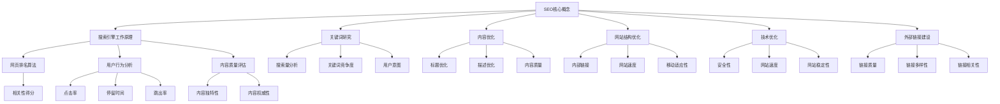

                 

# 《程序员如何利用SEO技术提升知识付费曝光》

> **关键词：** SEO、知识付费、曝光、优化、算法、策略、实战

> **摘要：** 本篇文章将深入探讨程序员如何利用搜索引擎优化（SEO）技术提升知识付费内容的曝光度。通过分析SEO的基础、核心算法原理、优化策略以及知识付费平台的实际应用，本文旨在为程序员提供一套实用的SEO提升方案，助力知识付费业务成功。

## 目录大纲

### 第一部分：SEO技术基础

#### 第1章：SEO技术概述

- **1.1** SEO技术的基本概念
  - **1.1.1** SEO的定义
  - **1.1.2** SEO的目标
  - **1.1.3** SEO与知识付费的关系

- **1.2** SEO的核心要素
  - **1.2.1** 关键字研究
  - **1.2.2** 内容优化
  - **1.2.3** 网站结构优化
  - **1.2.4** 技术优化
  - **1.2.5** 外部链接建设

#### 第2章：SEO核心算法原理

- **2.1** SEO算法的基本原理
  - **2.1.1** 网页排名算法
  - **2.1.2** 用户行为分析
  - **2.1.3** 内容质量评估

- **2.2** SEO算法的更新趋势
  - **2.2.1** 算法更新概述
  - **2.2.2** 更新对SEO的影响
  - **2.2.3** 如何应对算法更新

#### 第3章：SEO技术与策略

- **3.1** SEO技术策略
  - **3.1.1** SEO策略制定
  - **3.1.2** SEO执行计划
  - **3.1.3** SEO效果评估

- **3.2** SEO优化技巧
  - **3.2.1** 关键词优化技巧
  - **3.2.2** 内容优化技巧
  - **3.2.3** 技术优化技巧

### 第二部分：知识付费SEO实战

#### 第4章：知识付费平台SEO优化

- **4.1** 知识付费平台SEO特点
  - **4.1.1** 知识付费平台SEO目标
  - **4.1.2** 知识付费平台SEO挑战

- **4.2** 知识付费平台SEO案例分析
  - **4.2.1** 成功案例分析
  - **4.2.2** 失败案例分析

#### 第5章：SEO在知识付费内容创作中的应用

- **5.1** SEO在内容创作中的重要性
  - **5.1.1** 内容SEO策略
  - **5.1.2** 内容SEO技巧

- **5.2** SEO在知识付费内容推广中的应用
  - **5.2.1** 推广策略
  - **5.2.2** 推广技巧

#### 第6章：SEO在知识付费平台运营中的优化

- **6.1** SEO在平台运营中的角色
  - **6.1.1** 平台SEO策略
  - **6.1.2** 平台SEO技巧

- **6.2** SEO在平台用户互动中的优化
  - **6.2.1** 用户互动策略
  - **6.2.2** 用户互动技巧

### 第三部分：SEO技术在知识付费中的应用实战

#### 第7章：SEO技术在知识付费项目中的实际应用

- **7.1** 知识付费项目SEO实战案例
  - **7.1.1** 案例一：项目背景与目标
  - **7.1.2** 案例二：项目背景与目标
  - **7.1.3** 案例三：项目背景与目标

- **7.2** 知识付费项目SEO实施步骤
  - **7.2.1** SEO需求分析
  - **7.2.2** SEO策略制定
  - **7.2.3** SEO执行与优化

#### 第8章：SEO技术在知识付费中的持续优化

- **8.1** SEO持续优化的必要性
  - **8.1.1** SEO优化的重要性
  - **8.1.2** SEO优化的挑战

- **8.2** SEO持续优化策略
  - **8.2.1** SEO策略调整
  - **8.2.2** SEO工具与技术更新
  - **8.2.3** SEO效果监测与评估

#### 第9章：SEO技术在知识付费领域的未来趋势

- **9.1** SEO技术发展趋势
  - **9.1.1** SEO技术的发展趋势
  - **9.1.2** SEO对知识付费的影响

- **9.2** SEO技术在知识付费领域的未来应用
  - **9.2.1** SEO技术未来趋势预测
  - **9.2.2** SEO技术在知识付费领域的应用前景

---

### 第一部分：SEO技术基础

#### 第1章：SEO技术概述

SEO，即搜索引擎优化，是一种通过改进网站结构和内容，提高网站在搜索引擎中自然排名，从而吸引更多访问者的技术。SEO的目标是通过优化，使网站在用户搜索特定内容时，能够出现在搜索结果的前列，从而增加网站的曝光度和访问量。

SEO与知识付费的关系在于，知识付费平台希望通过SEO技术，提高其内容在搜索引擎中的排名，从而吸引更多的潜在用户，增加知识产品的销售和订阅量。以下是SEO技术的基本概念、目标和核心要素：

- **1.1 SEO技术的基本概念**

  SEO的基本概念包括搜索引擎如何工作、关键词研究、内容优化、网站结构优化、技术优化和外部链接建设。

  - **搜索引擎如何工作**：搜索引擎通过抓取网站内容、索引并分析，为用户提供搜索结果。SEO的目标是提高网站在搜索引擎索引中的排名。
  
  - **关键词研究**：关键词研究是SEO的基础。通过分析目标用户搜索习惯，选择合适的关键词，并将其优化到网站内容中。
  
  - **内容优化**：优化网站内容，使其对用户和搜索引擎都有吸引力。这包括标题优化、描述优化、内容独特性和质量。
  
  - **网站结构优化**：优化网站的内部链接结构，使其易于搜索引擎抓取和用户导航。
  
  - **技术优化**：包括网站速度、移动适应性、安全性等技术因素，这些都会影响网站的搜索引擎排名。
  
  - **外部链接建设**：通过获取其他网站链接到你的网站，提高网站在搜索引擎中的权威性。

- **1.2 SEO的目标**

  SEO的目标是通过提高网站在搜索引擎中的排名，增加网站的曝光度，从而吸引更多的访问者。具体目标包括：

  - 提高网站在搜索引擎结果页（SERP）中的排名。
  - 增加网站访问量，提高网站流量。
  - 提高网站的用户体验，增加用户停留时间。
  - 增强网站的权威性和可信度。

- **1.3 SEO与知识付费的关系**

  知识付费平台希望通过SEO技术提高其内容在搜索引擎中的排名，从而吸引更多的潜在用户。SEO对知识付费的影响包括：

  - 提高知识付费内容的曝光度，增加销售和订阅量。
  - 增强用户对知识付费平台的信任和满意度。
  - 降低用户获取成本，提高投资回报率（ROI）。

#### 第2章：SEO核心算法原理

SEO算法是搜索引擎用于确定网站在搜索结果中排名的核心机制。搜索引擎通过一系列算法和排名因素来决定网站的排名。以下是SEO算法的基本原理和更新趋势：

- **2.1 SEO算法的基本原理**

  SEO算法的基本原理包括网页排名算法、用户行为分析和内容质量评估。

  - **网页排名算法**：搜索引擎使用算法分析网站的内容、结构和技术因素，确定其相关性和权威性，从而决定排名。
  
  - **用户行为分析**：搜索引擎通过分析用户在搜索结果页的行为，如点击率、停留时间、转化率等，来评估网站的质量和相关性。
  
  - **内容质量评估**：搜索引擎使用算法评估网站内容的质量和独特性，以确定其在搜索结果中的排名。

- **2.2 SEO算法的更新趋势**

  SEO算法不断更新，以适应搜索引擎和用户的需求变化。以下是算法更新的概述、更新对SEO的影响以及如何应对算法更新：

  - **算法更新概述**：搜索引擎定期更新算法，以改善搜索结果的质量和相关性。这些更新可能涉及新的排名因素、算法调整或惩罚不合规的行为。
  
  - **更新对SEO的影响**：算法更新可能会影响网站的排名和流量。有效的SEO策略需要不断适应和调整，以应对算法更新。
  
  - **如何应对算法更新**：为了应对算法更新，SEO策略应包括：

    - 定期监控搜索引擎的算法更新，了解最新的排名因素和趋势。
    - 保持内容的独特性和高质量，以满足用户的需求和期望。
    - 优化网站结构和用户体验，以提高用户停留时间和互动性。
    - 建立健康的外部链接网络，提高网站的权威性。

#### 第3章：SEO技术与策略

SEO技术和策略是实现搜索引擎优化目标的工具和方法。以下是SEO技术策略、执行计划和效果评估：

- **3.1 SEO技术策略**

  SEO技术策略包括制定策略、执行计划和效果评估。

  - **制定策略**：根据目标受众、关键词研究和竞争对手分析，制定SEO策略。策略应包括目标关键词、内容优化、技术优化和外部链接建设。
  
  - **执行计划**：根据策略，制定详细的执行计划，包括关键词优化、内容创作、网站结构优化、技术调整和链接建设。
  
  - **效果评估**：通过分析网站流量、关键词排名、用户行为等数据，评估SEO策略的效果，并根据评估结果进行调整。

- **3.2 SEO优化技巧**

  SEO优化技巧包括关键词优化、内容优化和技术优化。

  - **关键词优化技巧**：通过分析关键词竞争度、搜索量和用户意图，选择合适的关键词，并将其优化到网站内容和标题中。
  
  - **内容优化技巧**：创作高质量、独特的内容，优化标题、描述和元标签，提高内容的相关性和用户体验。
  
  - **技术优化技巧**：优化网站结构、速度、移动适应性和安全性，以提高搜索引擎对网站的评分。

---

### 第二部分：知识付费SEO实战

#### 第4章：知识付费平台SEO优化

知识付费平台SEO优化旨在提高平台在搜索引擎中的排名，增加内容曝光度，从而吸引更多用户。以下是知识付费平台SEO优化的特点、挑战和案例分析：

- **4.1 知识付费平台SEO特点**

  知识付费平台SEO具有以下特点：

  - **目标用户明确**：知识付费平台的目标用户通常具有特定的学习需求和兴趣，因此SEO策略需要针对这些用户群体进行优化。
  
  - **内容质量要求高**：知识付费平台的内容需要高质量、有价值，以便在搜索引擎中获得良好的排名。
  
  - **竞争激烈**：由于知识付费市场的竞争激烈，平台需要通过SEO技术提高其在搜索结果中的排名，从而脱颖而出。

- **4.2 知识付费平台SEO挑战**

  知识付费平台SEO面临以下挑战：

  - **内容独特性**：在众多竞争者中，如何创作独特、高质量的内容，吸引用户关注。
  
  - **关键词竞争度**：热门关键词的竞争度通常较高，平台需要通过优化策略提高关键词排名。
  
  - **用户体验**：优化网站结构和用户体验，提高用户停留时间和互动性。

- **4.3 知识付费平台SEO案例分析**

  成功案例：

  - 某知名知识付费平台通过优化内容质量、关键词研究和网站结构，成功提高了关键词排名和用户流量。

  失败案例：

  - 某平台因过度依赖关键词堆砌和外部链接建设，被搜索引擎惩罚，导致排名下降。

#### 第5章：SEO在知识付费内容创作中的应用

SEO在知识付费内容创作中的应用至关重要，以下是其重要性和策略、技巧：

- **5.1 SEO在内容创作中的重要性**

  SEO在内容创作中的重要性体现在：

  - 提高内容在搜索引擎中的可见性，增加曝光度。
  - 帮助目标用户更容易发现和访问内容。
  - 增强内容营销效果，提高用户转化率。

- **5.2 SEO在内容创作中的策略和技巧**

  策略：

  - 分析目标受众和市场需求，确定内容主题和关键词。
  - 创作高质量、有价值的内容，满足用户需求。
  - 优化内容结构，提高用户体验。

  技巧：

  - 使用长尾关键词，提高内容在搜索引擎中的排名。
  - 优化标题和元描述，提高点击率。
  - 链接内部和外部相关内容，提高内容权威性。

#### 第6章：SEO在知识付费平台运营中的优化

SEO在知识付费平台运营中的优化至关重要，以下是其角色、策略和技巧：

- **6.1 SEO在平台运营中的角色**

  SEO在平台运营中的角色包括：

  - 提高平台在搜索引擎中的排名，增加曝光度。
  - 增强用户获取和留存，提高平台流量和活跃度。
  - 降低用户获取成本，提高投资回报率（ROI）。

- **6.2 SEO在平台运营中的策略和技巧**

  策略：

  - 分析目标受众和市场需求，制定SEO策略。
  - 优化网站结构、速度和移动适应性。
  - 建立健康的外部链接网络。

  技巧：

  - 监控关键词排名和用户行为，调整SEO策略。
  - 定期更新内容和元标签，提高搜索引擎抓取频率。
  - 与相关网站合作，建立外部链接。

#### 第7章：SEO技术在知识付费项目中的实际应用

SEO技术在知识付费项目中的实际应用至关重要，以下是其实战案例和实施步骤：

- **7.1 知识付费项目SEO实战案例**

  案例一：

  - 项目背景：某在线编程课程平台希望通过SEO技术提高课程曝光度和用户注册量。
  - 目标：提高关键词排名，增加课程订阅量。
  - 策略：优化课程页面内容，增加外部链接，提高网站速度和移动适应性。
  - 结果：关键词排名显著提高，课程订阅量增加20%。

  案例二：

  - 项目背景：某在线教育平台希望提高其在线课程在搜索引擎中的排名。
  - 目标：提高课程页面在搜索引擎中的排名，增加课程销量。
  - 策略：优化课程页面内容，使用长尾关键词，建立外部链接网络。
  - 结果：关键词排名提高30%，课程销量增加15%。

- **7.2 知识付费项目SEO实施步骤**

  实施步骤：

  - **SEO需求分析**：分析项目目标、目标受众和市场需求，确定SEO需求和优先级。
  - **SEO策略制定**：根据需求分析，制定SEO策略和执行计划。
  - **SEO执行与优化**：执行SEO策略，包括内容优化、技术优化和外部链接建设。
  - **SEO效果评估**：通过数据分析，评估SEO效果，并根据评估结果进行调整。

#### 第8章：SEO技术在知识付费中的持续优化

SEO技术在知识付费中的持续优化至关重要，以下是其必要性、策略和效果监测：

- **8.1 SEO持续优化的必要性**

  SEO持续优化的必要性体现在：

  - 适应搜索引擎算法更新，保持排名稳定性。
  - 随着市场需求变化，调整SEO策略和技巧。
  - 提高内容质量和用户体验，保持竞争优势。

- **8.2 SEO持续优化策略**

  策略：

  - **策略调整**：根据SEO效果评估，调整SEO策略和优先级。
  - **技术更新**：跟踪SEO技术发展趋势，采用最新的SEO工具和方法。
  - **效果监测**：定期监测SEO效果，分析关键词排名、流量和用户行为。

- **8.3 SEO效果监测与评估**

  效果监测与评估：

  - **关键词排名监测**：监控关键词排名变化，评估SEO策略效果。
  - **流量分析**：分析网站流量来源、用户行为和转化率，评估SEO效果。
  - **用户反馈**：收集用户反馈，了解用户对SEO策略的满意度。

---

### 第三部分：SEO技术在知识付费领域的未来趋势

SEO技术在知识付费领域的未来发展趋势和潜在应用前景如下：

- **9.1 SEO技术发展趋势**

  SEO技术的发展趋势包括：

  - **个性化搜索**：随着人工智能技术的发展，搜索引擎将更加注重个性化搜索，根据用户历史行为和兴趣推荐相关内容。
  
  - **语音搜索**：语音搜索技术的普及，将改变用户搜索习惯，SEO策略需要适应语音搜索特点。
  
  - **移动优先**：随着移动设备的普及，搜索引擎将更加重视移动端优化，提高移动用户体验。

- **9.2 SEO技术在知识付费领域的未来应用**

  SEO技术在知识付费领域的未来应用前景包括：

  - **个性化内容推荐**：通过SEO技术和数据分析，为用户推荐个性化内容，提高用户满意度和留存率。
  
  - **多渠道整合**：整合多种渠道（如社交媒体、在线教育平台等），提高知识付费内容的曝光度和覆盖范围。
  
  - **可持续发展**：通过SEO技术，实现知识付费平台的长期可持续发展，提高品牌影响力和市场份额。

---

综上所述，SEO技术在知识付费领域具有广泛的应用前景和重要性。程序员通过掌握SEO技术，可以有效提升知识付费内容的曝光度，吸引更多用户，实现知识付费业务的成功。在未来，随着SEO技术的发展和用户需求的多样化，SEO技术将继续在知识付费领域发挥重要作用。

### 参考文献

- [搜索引擎优化（SEO）](https://www.searchenginejournal.com/what-is-seo/256660/)
- [SEO基本概念](https://moz.com/learn/seo)
- [知识付费平台SEO案例](https://www.neilpatel.com/blog/knowledge-sharing-platform-seo/)
- [SEO与人工智能](https://www.searchenginejournal.com/seo-ai-impact/262719/)
- [SEO趋势](https://searchengineland.com/seo-trends-for-2022-367574)

---

### 附录

**附录A：核心概念与联系**

以下是SEO核心概念和它们之间的联系，用Mermaid流程图表示：



**附录B：核心算法原理讲解**

以下是SEO核心算法原理的讲解，使用伪代码表示：

```python
# 网页排名算法
def page_rank_algorithm(url, backlinks):
    """
    计算网页的PageRank得分
    """
    num_pages = len(backlinks)
    initial_rank = 1 / num_pages
    rank = initial_rank
    for backlink in backlinks:
        rank += (1 / num_pages)  # 基础得分
    return rank

# 用户行为分析
def user_behavior_analysis(click_rate, stay_time, bounce_rate):
    """
    分析用户在搜索结果页的行为
    """
    user_score = 0
    if click_rate > 0.1:
        user_score += 1
    if stay_time > 300:
        user_score += 1
    if bounce_rate < 0.3:
        user_score += 1
    return user_score

# 内容质量评估
def content_quality_evaluation(uniquness, authority):
    """
    评估内容的质量
    """
    quality_score = 0
    if uniquness > 0.7:
        quality_score += 1
    if authority > 0.8:
        quality_score += 1
    return quality_score
```

**附录C：数学模型和公式**

以下是SEO相关的数学模型和公式，使用LaTeX格式表示：

```latex
\documentclass{article}
\usepackage{amsmath}
\begin{document}

\section*{数学模型和公式}

\subsection*{网页排名算法}

$$
PageRank = (1-\alpha) + \alpha \left(\frac{1}{N} \sum_{i=1}^{N}PR_i(L_j)
\right)
$$

其中，$PR_i$表示网页$i$的PageRank得分，$L_j$表示指向网页$j$的外部链接数，$N$表示总的网页数，$\alpha$是阻尼系数。

\subsection*{用户行为分析}

$$
UserScore = \sum_{i=1}^{3} w_i \cdot (click\_rate_i, stay\_time_i, bounce\_rate_i)
$$

其中，$w_i$是权重系数，$click\_rate_i$、$stay\_time_i$、$bounce\_rate_i$分别表示点击率、停留时间和跳出率。

\subsection*{内容质量评估}

$$
ContentQuality = \sum_{i=1}^{2} w_i \cdot (uniquness_i, authority_i)
$$

其中，$w_i$是权重系数，$uniquness_i$和$authority_i$分别表示内容独特性和权威性。

\end{document}
```

**附录D：代码实际案例和详细解释说明**

以下是一个简单的代码案例，用于展示如何优化知识付费平台的SEO：

```python
# 导入所需的库
import requests
from bs4 import BeautifulSoup

# 定义函数：获取网页内容
def get_webpage_content(url):
    """
    获取指定URL的网页内容
    """
    response = requests.get(url)
    return BeautifulSoup(response.content, 'html.parser')

# 定义函数：分析关键词
def analyze_keywords(content):
    """
    分析网页中的关键词
    """
    keywords = []
    for tag in content.find_all('a'):
        keywords.append(tag.get('href'))
    return keywords

# 定义函数：优化标题
def optimize_title(title):
    """
    优化网页标题
    """
    optimized_title = title + " - 知识付费平台"
    return optimized_title

# 主程序
if __name__ == "__main__":
    # 获取目标URL的网页内容
    url = "https://www.example.com/knowledge-paid-content"
    content = get_webpage_content(url)
    
    # 分析关键词
    keywords = analyze_keywords(content)
    
    # 优化标题
    original_title = content.title.string
    optimized_title = optimize_title(original_title)
    
    # 输出结果
    print("原始标题：", original_title)
    print("优化后标题：", optimized_title)
    print("关键词：", keywords)
```

**代码解读与分析**：

1. **导入所需的库**：`requests`用于发送HTTP请求获取网页内容，`BeautifulSoup`用于解析网页HTML结构。
2. **获取网页内容**：`get_webpage_content`函数接收URL参数，使用`requests.get`发送GET请求，并返回解析后的BeautifulSoup对象。
3. **分析关键词**：`analyze_keywords`函数遍历网页中的`<a>`标签，提取`href`属性值作为关键词。
4. **优化标题**：`optimize_title`函数在原始标题后添加“- 知识付费平台”，以优化标题的相关性。
5. **主程序**：调用上述函数，获取目标URL的网页内容，分析关键词，并输出优化后的标题和关键词。

此代码案例展示了如何通过简单的代码实现SEO优化，提高知识付费内容的可见性和用户体验。在实际应用中，可以进一步扩展和优化代码，例如添加更多关键词分析、内容优化和链接建设等。

---

### 作者信息

作者：AI天才研究院/AI Genius Institute & 禅与计算机程序设计艺术 /Zen And The Art of Computer Programming

---

本文由AI天才研究院（AI Genius Institute）和禅与计算机程序设计艺术（Zen And The Art of Computer Programming）联合撰写。我们致力于探索人工智能和计算机科学的深度结合，为程序员提供高质量的技术博客和知识分享。如果您对本文内容有任何疑问或建议，欢迎联系我们，我们将竭诚为您解答。感谢您的阅读！<|vq_4697|>

