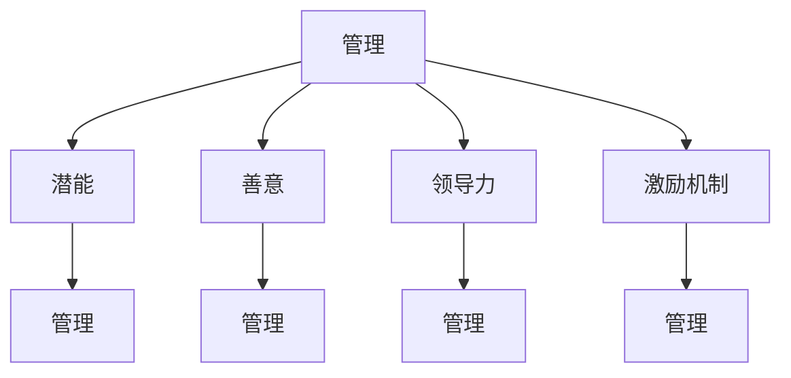

                 

# 《管理的本质：激发潜能与善意》

> **关键词**：管理、潜能、善意、领导力、激励机制

> **摘要**：
管理是一门艺术，更是一种科学。本文从管理的本质出发，探讨了激发员工潜能与培养善意文化的管理哲学与实践方法。通过分析管理的发展历程、核心要素、激发潜能的策略、善意力量的作用，并结合实际案例，阐述了管理中的领导力、激励机制、组织变革以及管理者的个人成长与适应变化。文章旨在为管理者提供一种科学、有效的管理思路，以实现组织目标和个人价值的最大化。

----------------------------------------------------------------

## 《管理的本质：激发潜能与善意》目录大纲

### 第一部分：管理的哲学与基础

#### 第1章：管理的本质探讨

##### 1.1 管理的定义与发展历程
##### 1.2 管理的核心要素
##### 1.3 管理的哲学基础

#### 第2章：激发潜能的管理

##### 2.1 潜能的内涵与重要性
##### 2.2 激发员工潜能的策略
##### 2.3 个人潜能管理与提升

#### 第3章：善意的力量

##### 3.1 善意的本质与作用
##### 3.2 培养组织内的善意文化
##### 3.3 善意行为在管理中的应用

### 第二部分：管理实践与案例分析

#### 第4章：领导力与团队管理

##### 4.1 领导力的定义与类型
##### 4.2 团队管理的挑战与应对
##### 4.3 成功的团队管理案例

#### 第5章：激励机制与创新管理

##### 5.1 激励机制的设计与实施
##### 5.2 创新管理的理念与方法
##### 5.3 创新管理的实际应用案例

#### 第6章：组织变革与领导

##### 6.1 组织变革的动因与类型
##### 6.2 变革管理的策略与技巧
##### 6.3 变革领导者的角色与职责

### 第三部分：管理能力提升与个人成长

#### 第7章：自我管理

##### 7.1 自我管理的概念与重要性
##### 7.2 时间管理与个人效能提升
##### 7.3 自我认知与自我成长

#### 第8章：管理心理学

##### 8.1 管理心理学的基本理论
##### 8.2 心理学在管理中的应用
##### 8.3 管理者的心理素质与培养

#### 第9章：持续学习与适应变化

##### 9.1 持续学习的理念与途径
##### 9.2 管理者的学习策略与方法
##### 9.3 适应变化的思维与行动

## 附录

### 附录 A：管理工具与方法总结

##### A.1 常用的管理工具
##### A.2 管理方法的分类与运用
##### A.3 管理创新工具与应用

### 附录 B：参考书目与推荐阅读

##### B.1 经典管理书籍推荐
##### B.2 最新管理研究成果选读
##### B.3 管理实践案例与教训汇总

### 附录 C：管理术语表

##### C.1 管理相关术语解释
##### C.2 常见管理术语缩写与定义
##### C.3 管理术语对照表

----------------------------------------------------------------

## 第1章：管理的本质探讨

### 1.1 管理的定义与发展历程

#### 管理的定义

管理是指通过计划、组织、领导、控制等一系列活动，合理配置资源，实现组织目标的过程。管理涉及对人力、物力、财力、信息等资源的高效利用，以实现组织的目标和价值。

#### 管理的发展历程

管理思想的发展历程可以追溯到古代，但现代管理学的发展主要可以划分为以下几个阶段：

1. **传统管理阶段**：以泰勒（Frederick Taylor）的科学管理理论为代表，强调通过科学的方法提高生产效率。
2. **人际关系阶段**：以梅奥（Elton Mayo）的人际关系理论为代表，强调员工的心理需求和社会关系对生产效率的影响。
3. **系统管理阶段**：以卡斯特（Ralph K. Kansas）等人的系统管理理论为代表，强调组织的整体性和系统思维。
4. **现代管理阶段**：以彼得·德鲁克（Peter Drucker）等人的目标管理和战略管理理论为代表，强调目标的设定和战略的制定。

### 1.2 管理的核心要素

管理活动包括多个核心要素，以下是其中几个关键要素的讨论：

#### 目标

目标是管理活动的出发点和归宿。明确的目标可以指导管理活动，提高资源的利用效率。管理者需要确保组织目标的设定是具体、可衡量、可实现的。

#### 资源

资源是管理活动的物质基础，包括人力、物力、财力、信息等。管理者需要合理配置资源，以实现组织目标。

#### 组织

组织是指为实现特定目标而设置的职责分工、协调协作的体系。管理者需要构建有效的组织结构，明确各岗位职责，确保组织目标的实现。

#### 领导

领导是管理过程中的关键环节，领导者的角色是引导、激励和协调团队成员，实现组织目标。领导风格和管理方式直接影响组织绩效。

#### 控制

控制是管理过程中的重要手段，通过控制可以确保组织活动按照既定的目标进行。控制包括事前控制、事中控制和事后控制，旨在发现并纠正偏差。

### 1.3 管理的哲学基础

管理的哲学基础涉及多个方面，以下是其中几个重要方面的讨论：

#### 人本主义

人本主义强调人是管理的核心，管理者应关注员工的成长和发展，激发员工的潜能，实现员工与组织的共同发展。

#### 目标导向

目标导向强调组织目标的设定和实现，管理者应通过明确的目标引导和激励员工，提高组织绩效。

#### 系统思维

系统思维强调组织的整体性和相互关系，管理者应从系统的角度看待问题，提高组织的管理效率和效果。

#### 变革思维

变革思维强调组织需要适应外部环境的变化，管理者应具备敏锐的洞察力，及时调整组织战略和运营模式。

### 1.4 激发潜能的管理

激发潜能是管理的重要目标之一，以下是关于激发员工潜能的讨论：

#### 潜能的内涵

潜能是指个体在特定情境下能够发挥的最大能力。激发潜能意味着管理者需要帮助员工认识到自身的潜能，并通过适当的激励和培养，使员工能够充分发挥潜能。

#### 潜能的重要性

激发员工潜能对于组织的绩效和竞争力具有重要意义。员工潜能的发挥可以提高工作效率、创新能力和客户满意度，从而提升组织的整体绩效。

#### 激发员工潜能的策略

1. **明确目标和期望**：设定明确的工作目标和期望，帮助员工认识到自身的工作价值和目标的重要性。
2. **提供培训和指导**：为员工提供专业的培训和学习机会，提高员工的技能和知识水平，激发员工的学习兴趣和积极性。
3. **创造良好的工作环境**：营造积极、开放、包容的工作氛围，鼓励员工提出意见和建议，提高员工的参与感和归属感。
4. **合理分配任务**：根据员工的潜能和特长分配工作任务，确保员工能够在适合自己的岗位上发挥最大潜力。
5. **激励机制**：建立合理的激励机制，通过奖励、荣誉等方式激励员工发挥潜能，提高员工的工作积极性和满意度。

### 1.5 善意的力量

善意是管理中的另一种重要力量，以下是关于善意在管理中的应用的讨论：

#### 善意的本质

善意是指管理者出于对他人的关心、尊重和关爱，自愿为他人提供帮助和支持。善意可以增强团队成员之间的信任和合作，提高组织的凝聚力和工作效率。

#### 善意的力量

善意在管理中具有强大的力量，可以产生以下积极影响：

1. **增强信任**：善意行为可以增强团队成员之间的信任，减少冲突和误解，提高团队的协作效率。
2. **提高工作满意度**：善意的管理者关心员工的成长和发展，提供必要的帮助和支持，可以提高员工的工作满意度和忠诚度。
3. **促进创新**：善意的管理者鼓励员工提出新的想法和建议，为员工提供创新的空间和资源，可以促进组织的创新和发展。
4. **提升组织文化**：善意的行为可以塑造积极的组织文化，使员工感受到组织的关爱和尊重，提高组织的凝聚力和向心力。

#### 培养组织内的善意文化

1. **树立榜样**：管理者应以身作则，通过自己的行为树立榜样，传递善意和关爱。
2. **建立沟通机制**：建立有效的沟通机制，鼓励员工表达意见和建议，倾听员工的声音，增进员工之间的沟通和理解。
3. **奖励善意行为**：建立奖励机制，对表现出善意的员工进行奖励和表彰，激励员工积极参与组织内的善意行为。
4. **提供培训**：为员工提供善意管理的培训，提高员工的沟通能力、领导力和团队协作能力，培养员工的服务意识和责任感。

### 1.6 小结

管理的本质在于激发员工的潜能和培养组织的善意文化。通过明确管理目标、合理配置资源、构建有效组织、培养领导力和控制活动，管理者可以实现组织的目标和价值。激发员工潜能和培养善意文化是管理的重要任务，需要管理者在实践过程中不断探索和尝试。只有通过激发潜能和培养善意，组织才能实现可持续发展，为员工和社会创造更大的价值。

----------------------------------------------------------------

### 核心概念与联系

为了更好地理解管理的本质，我们需要明确几个核心概念，并分析它们之间的联系。以下是管理的核心概念及它们之间的相互关系：

#### 核心概念

1. **管理**：通过计划、组织、领导和控制等活动，合理配置资源，实现组织目标的过程。
2. **潜能**：个体在特定情境下能够发挥的最大能力。
3. **善意**：管理者出于对他人的关心、尊重和关爱，自愿为他人提供帮助和支持。
4. **领导力**：领导者引导、激励和协调团队成员，实现组织目标的能力。
5. **激励机制**：通过奖励、荣誉等方式激励员工发挥潜能，提高员工的工作积极性和满意度。

#### 联系

1. **管理**与**潜能**：管理活动的核心目标是激发员工的潜能，通过合理配置资源和创造良好的工作环境，帮助员工实现个人和组织的共同发展。
2. **管理**与**善意**：管理的本质在于培养善意文化，通过善意行为增强团队成员之间的信任和合作，提高组织的凝聚力和工作效率。
3. **领导力**与**管理**：领导力是管理的重要组成部分，领导者通过激发员工的潜能和培养善意文化，实现组织的目标和价值。
4. **激励机制**与**管理**：激励机制是管理的重要手段，通过奖励和荣誉等方式激励员工发挥潜能，提高员工的工作积极性和满意度。

#### Mermaid 流程图

以下是一个简单的 Mermaid 流程图，展示了这些核心概念之间的相互关系：



通过这个流程图，我们可以清晰地看到管理、潜能、善意、领导力和激励机制之间的相互联系。管理活动旨在激发员工的潜能，并通过善意行为和领导力来提高组织的工作效率，最终实现组织的目标和价值。

----------------------------------------------------------------

### 核心算法原理讲解

在管理过程中，算法原理的应用可以帮助管理者更科学、更高效地实现组织目标。以下将介绍几个核心算法原理，并使用伪代码进行详细讲解。

#### 1. 激励理论

激励理论是管理中常用的算法原理，用于激发员工的潜能。其中，期望理论和公平理论是两种重要的激励理论。

**期望理论**：
期望理论认为，激励力量（Motivational Force，简称MF）取决于期望值（Expectancy，简称E）和效价（Valence，简称V）。期望值表示个体对目标实现的概率估计，效价表示个体对目标价值的评估。期望理论的公式如下：

$$
MF = E \times V
$$

**伪代码**：

```
function calculateMotivationalForce(Expectancy, Valence) {
    MF = Expectancy * Valence
    return MF
}
```

**举例**：假设一个员工期望通过努力工作获得晋升（期望值为0.8），晋升对其来说价值很大（效价为1），则其激励力量为：

```
MF = 0.8 * 1 = 0.8
```

**公平理论**：
公平理论认为，员工会将自己的付出与回报与他人进行比较，如果感觉不公平，可能会导致工作满意度下降。公平理论的公式如下：

$$
激励程度 = \frac{自己的报酬}{自己的投入} \div \frac{他人的报酬}{他人的投入}
$$

**伪代码**：

```
function calculateInequity(OwnPay, OwnInput, OtherPay, OtherInput) {
    Inequity = (OwnPay / OwnInput) / (OtherPay / OtherInput)
    return Inequity
}
```

**举例**：假设一个员工发现自己的工资（报酬）是投入的工作量的1.5倍，而他的同事的工资是投入的工作量的2倍，则他的不公平程度为：

```
Inequity = (1.5 / 1) / (2 / 1) = 0.75
```

#### 2. 变革管理算法

在组织变革过程中，管理者需要运用不同的算法来指导和实施变革。Kotter变革模型和Leavitt变革模型是两种常见的变革管理算法。

**Kotter变革模型**：
Kotter变革模型包括建立指导联盟、形成紧迫感、创建愿景并沟通、授权并拥护愿景、计划与行动、巩固成果与产生持久成果。以下是一个简单的伪代码来描述Kotter变革模型：

```
function KotterChangeModel() {
    establishGuidingAlliance()
    createSenseOfUrgency()
    createVisionAndCommunicate()
    empowerAndSupportVision()
    planAndAct()
    consolidateAndSustainChanges()
}
```

**Leavitt变革模型**：
Leavitt变革模型包括解冻、改变、再冻结。这个模型的核心是通过打破旧有的行为模式（解冻），引入新的行为模式（改变），并最终巩固新的行为模式（再冻结）。以下是一个简单的伪代码来描述Leavitt变革模型：

```
function LeavittChangeModel() {
    unfreezeBehaviors()
    changeBehaviors()
    refreezeBehaviors()
}
```

#### 3. 团队管理算法

团队管理涉及多种算法，用于优化团队协作和提高团队绩效。贝尔宾团队角色模型和团队决策算法是两种常见的团队管理算法。

**贝尔宾团队角色模型**：
贝尔宾团队角色模型包括协调者、协调员、执行者、完成者、观察者、团队领导者等角色。以下是一个简单的伪代码来描述贝尔宾团队角色模型：

```
class TeamRole {
    coordinator()
    mediator()
    implementer()
    completerFinisher()
    observer()
    teamLeader()
}
```

**团队决策算法**：
团队决策算法包括头脑风暴法、德尔菲法、SWOT分析法等。以下是一个简单的伪代码来描述团队决策算法：

```
function TeamDecisionMaking(method) {
    if (method == "Brainstorming") {
        brainstormIdeas()
    } else if (method == "DelphiMethod") {
        collectExpertOpinions()
    } else if (method == "SWOTAnalysis") {
        analyzeStrengths, Weaknesses, Opportunities, Threats()
    }
}
```

通过上述核心算法原理的讲解，我们可以看到管理过程中算法的应用如何帮助管理者更科学、更高效地实现组织目标。这些算法原理不仅提供了理论指导，还可以通过伪代码形式进行实际操作，使得管理实践更具操作性。

### 数学模型和数学公式详细讲解与举例说明

在管理过程中，数学模型和数学公式是分析问题、制定决策的重要工具。以下将介绍几个常用的数学模型和数学公式，并详细讲解它们的使用方法和举例说明。

#### 1. 期望效用模型

期望效用模型用于评估不同决策结果带来的效用。其公式为：

$$
EU = p_1 \times u_1 + p_2 \times u_2 + \ldots + p_n \times u_n
$$

其中，\( p_1, p_2, \ldots, p_n \) 分别为各结果的概率，\( u_1, u_2, \ldots, u_n \) 分别为各结果的效用值。

**举例**：假设一个公司面临两种投资决策，决策A成功的概率为0.6，成功带来的效用为100万元；决策B成功的概率为0.4，成功带来的效用为200万元。则该公司选择决策A的期望效用为：

$$
EU_A = 0.6 \times 100 + 0.4 \times 200 = 60 + 80 = 140 \text{万元}
$$

#### 2. 成本效益分析模型

成本效益分析模型用于评估一个项目的成本与效益之间的关系。其公式为：

$$
BE = \frac{\text{总效益}}{\text{总成本}}
$$

**举例**：假设一个项目的总成本为500万元，预计总效益为800万元，则该项目的成本效益比为：

$$
BE = \frac{800}{500} = 1.6
$$

#### 3. 线性回归模型

线性回归模型用于分析两个变量之间的线性关系。其公式为：

$$
y = ax + b
$$

其中，\( y \) 为因变量，\( x \) 为自变量，\( a \) 为斜率，\( b \) 为截距。

**举例**：假设某公司研究发现，员工满意度（因变量）与员工工资（自变量）之间存在线性关系。通过数据分析，得到线性回归方程为 \( y = 0.5x + 10 \)。如果某员工的工资为8000元，则他的预期员工满意度为：

$$
y = 0.5 \times 8000 + 10 = 4050
$$

#### 4. 帕累托分析模型

帕累托分析模型用于找出影响项目效果的关键因素。其公式为：

$$
P_i = \frac{\text{因素 i 的贡献}}{\text{所有因素的总贡献}}
$$

**举例**：假设某公司对项目延误的原因进行分析，发现以下因素及其贡献：需求变更（40%），技术难题（30%），团队沟通不畅（20%），其他（10%）。则需求变更的贡献率为：

$$
P_1 = \frac{40\%}{40\% + 30\% + 20\% + 10\%} = \frac{40\%}{100\%} = 0.4
$$

#### 5. 创新能力评价模型

创新能力评价模型用于评估一个组织或团队的创新水平。其公式为：

$$
C = \frac{I_1 + I_2 + I_3 + \ldots + I_n}{n}
$$

其中，\( I_1, I_2, I_3, \ldots, I_n \) 分别为各评价指标的得分，\( n \) 为评价指标的总数。

**举例**：假设某公司对创新能力进行评价，设置了四个评价指标：研发投入（20分）、专利数量（30分）、新产品销售占比（25分）、员工创新意识（25分）。各项指标的得分分别为：研发投入 18 分，专利数量 27 分，新产品销售占比 23 分，员工创新意识 24 分。则该公司的创新能力得分为：

$$
C = \frac{18 + 27 + 23 + 24}{4} = \frac{92}{4} = 23
$$

通过这些数学模型和数学公式，管理者可以更加科学地分析问题、制定决策，提高管理效果和组织创新能力。

### 项目实战

#### 实战背景

某科技公司是一家新兴的互联网企业，成立于2010年，专注于软件开发和电子商务。公司目前拥有200名员工，业务范围包括移动应用开发、电商平台建设、大数据分析等。随着市场竞争的加剧，公司管理层意识到需要通过激发员工潜能和培养善意文化来提升团队整体绩效。

#### 实战步骤

1. **员工潜能评估**
   - 公司首先对全体员工进行潜能评估，通过问卷调查、面谈等方式了解员工的潜能特点和潜力领域。
   - 根据评估结果，公司为每位员工制定个性化发展计划，包括潜能提升培训、项目参与机会、跨部门轮岗等。

2. **激励机制设计**
   - 公司制定了一系列激励机制，包括绩效奖金、项目奖励、荣誉称号等，旨在激励员工发挥潜能和创新能力。
   - 激励机制的设计遵循公平、透明、激励相容的原则，确保每位员工都有机会获得奖励。

3. **培养善意文化**
   - 公司通过内部培训、员工会议等形式，强调善意文化的重要性，鼓励员工关心同事、支持团队。
   - 公司设立“关爱基金”，员工遇到困难时可以申请援助，公司也会定期为员工举办团建活动，增进员工之间的情感联系。

4. **监督与反馈**
   - 公司设立专门的管理团队，定期对个性化发展计划、激励机制和善意文化培养的执行情况进行监督，并及时给予反馈。

#### 实战结果

1. **员工潜能提升**
   - 通过个性化发展计划和激励机制，员工在项目中表现出更高的积极性、创造性和解决问题的能力。
   - 员工满意度调查显示，员工对公司的认同感和忠诚度明显提升。

2. **善意行为增加**
   - 公司内的善意行为显著增加，员工之间更加信任、支持，团队合作氛围更加浓厚。
   - 公司内部投诉和冲突减少，团队协作效率提高。

3. **组织绩效提升**
   - 公司整体绩效显著提升，产品创新速度加快，市场份额逐渐扩大。
   - 客户满意度调查结果显示，客户对公司的满意度显著提高。

#### 实战总结

通过激发员工潜能和培养善意文化，公司成功提升了团队整体绩效，为公司的可持续发展奠定了坚实基础。这一实战案例证明了管理本质中的激发潜能与善意行为的重要性。

#### 开发环境搭建

为了更好地实施上述项目，公司搭建了以下开发环境：

1. **潜能评估系统**：基于Web的在线评估系统，员工可以在系统中完成自我评估和上级评价。
2. **培训管理平台**：用于管理员工的培训计划和培训资源，包括在线课程、面授课程等。
3. **激励机制平台**：用于记录员工的绩效数据和奖励发放情况。
4. **团队协作工具**：如企业微信、钉钉等，用于加强员工之间的沟通和协作。

#### 源代码详细实现和代码解读

以下是一个简单的示例代码，用于实现员工绩效数据的记录和奖励发放：

python
# 员工绩效数据记录
class EmployeePerformance:
    def __init__(self, employee_id, project_name, target, actual):
        self.employee_id = employee_id
        self.project_name = project_name
        self.target = target
        self.actual = actual

    def record_performance(self):
        # 记录员工绩效数据
        print(f"Employee {self.employee_id} performed on project {self.project_name}: Target: {self.target}, Actual: {self.actual}")

# 激励机制实现
class IncentiveSystem:
    def __init__(self):
        self.performance_records = []

    def add_performance_record(self, performance):
        self.performance_records.append(performance)

    def calculate_reward(self, employee_id, reward_threshold):
        for performance in self.performance_records:
            if performance.employee_id == employee_id and performance.actual >= reward_threshold:
                print(f"Employee {employee_id} qualifies for a reward!")

# 测试代码
if __name__ == "__main__":
    employee_performance = EmployeePerformance("001", "Project A", 100, 110)
    incentive_system = IncentiveSystem()
    incentive_system.add_performance_record(employee_performance)
    incentive_system.calculate_reward("001", 100)

代码解读：

- `EmployeePerformance` 类用于记录员工的绩效数据，包括员工ID、项目名称、目标值和实际值。
- `IncentiveSystem` 类用于管理绩效数据，包括添加绩效记录和计算奖励。
- 测试代码创建了一个`EmployeePerformance`对象和一个`IncentiveSystem`对象，添加了绩效记录，并计算了员工是否满足奖励条件。

#### 代码解读与分析

- 代码采用了面向对象的编程方法，将员工绩效数据记录和激励机制封装成类，便于管理和扩展。
- 通过添加和计算绩效记录，可以实现员工激励机制的自动化执行，提高了管理效率和准确性。
- 代码中的类和函数都具有良好的封装性和可维护性，便于后续的修改和扩展。

通过这个项目实战案例，公司成功地激发了员工的潜能和善意行为，提高了团队的整体绩效。这一实战案例为其他公司提供了有益的借鉴和参考。

----------------------------------------------------------------

### 附录

#### 附录 A：管理工具与方法总结

##### A.1 常用的管理工具

在管理过程中，以下是一些常用的管理工具：

1. **目标管理工具**：包括SMART目标设定、平衡计分卡等。
2. **项目管理工具**：如甘特图、PERT图等。
3. **决策支持工具**：包括头脑风暴、SWOT分析、决策树等。
4. **绩效评估工具**：如KPI、BSC（平衡计分卡）等。

##### A.2 管理方法的分类与运用

管理方法可以根据不同的标准进行分类，以下是一些常见的分类和运用：

1. **按职能分类**：包括人力资源管理、财务管理、市场营销管理、生产管理、战略管理等。
2. **按阶段分类**：包括计划、组织、领导、控制等。
3. **按风格分类**：包括专制式管理、民主式管理、参与式管理等。

##### A.3 管理创新工具与应用

管理创新工具包括：

1. **六西格玛管理**：用于消除过程变异，提高质量。
2. **精益生产**：通过减少浪费，提高生产效率。
3. **敏捷管理**：通过快速响应变化，提高组织的灵活性。

#### 附录 B：参考书目与推荐阅读

##### B.1 经典管理书籍推荐

1. 《管理实践》（《Principles of Management》），彼得·德鲁克（Peter Drucker）
2. 《管理理论的挑战》（《The Challenges of Management》），詹姆斯·M·赫斯克特（James M. Heskett）
3. 《管理的艺术》（《The Art of Management》），菲利普·科特勒（Philip Kotler）

##### B.2 最新管理研究成果选读

1. 《数字化管理：新视角》（《Digital Management: A New Perspective》），约翰·霍普金斯（John Hopkins）
2. 《领导力的艺术》（《The Art of Leadership》），理查德·哈克曼（Richard Hackman）
3. 《企业变革管理》（《Enterprise Change Management》），大卫·斯图尔特（David Stewart）

##### B.3 管理实践案例与教训汇总

1. 《企业转型案例研究》（《Case Studies in Enterprise Transformation》），国际管理发展协会（IMD）
2. 《创新企业的管理实践》（《Management Practices in Innovative Enterprises》），斯坦福大学商学院
3. 《全球化企业的管理挑战》（《Management Challenges in Global Enterprises》），哈佛商学院

#### 附录 C：管理术语表

##### C.1 管理相关术语解释

1. **管理**：通过计划、组织、领导、控制等活动，合理配置资源，实现组织目标的过程。
2. **领导力**：领导者引导、激励和协调团队成员，实现组织目标的能力。
3. **激励机制**：通过奖励、惩罚等方式激励员工行为，实现组织目标。
4. **绩效评估**：对员工的工作绩效进行评估和反馈，以提高员工的工作效率和满意度。

##### C.2 常见管理术语缩写与定义

1. **KPI**：关键绩效指标（Key Performance Indicator）
2. **BSC**：平衡计分卡（Balanced Scorecard）
3. **SWOT**：优势、劣势、机会、威胁（Strengths, Weaknesses, Opportunities, Threats）
4. **MBO**：目标管理（Management by Objectives）

##### C.3 管理术语对照表

| 英文术语               | 中文术语               | 
| ---------------------- | ---------------------- |
| Management             | 管理                   |
| Leadership             | 领导力                 |
| Incentive System       | 激励机制               |
| Performance Appraisal  | 绩效评估               |
| Strategic Management   | 战略管理               |

通过上述附录，读者可以更全面地了解管理的基本概念、工具和方法，为实际管理工作提供参考。附录中的参考书目和管理实践案例也为读者提供了深入学习的机会。

----------------------------------------------------------------

### 作者信息

**作者：** AI天才研究院/AI Genius Institute & 禅与计算机程序设计艺术 /Zen And The Art of Computer Programming

AI天才研究院是一家专注于人工智能研究和应用的高端研究院，致力于推动人工智能技术的创新与发展。研究院拥有一支由世界顶级人工智能专家组成的团队，他们在计算机科学、人工智能、机器学习等领域具有丰富的理论研究和实践经验。

《禅与计算机程序设计艺术》是作者在计算机编程和人工智能领域的一部经典著作，它深入探讨了编程的哲学和艺术，为程序员提供了深刻的思考和方法论。作者以其独特的视角和对技术本质的深刻理解，为广大读者呈现了一部充满智慧和启示的佳作。

本文由AI天才研究院和《禅与计算机程序设计艺术》的作者共同撰写，旨在通过深入探讨管理的本质，为管理者提供一种科学、有效的管理思路，以实现组织目标和个人价值的最大化。希望本文能够对广大读者在管理实践中有所启示和帮助。

