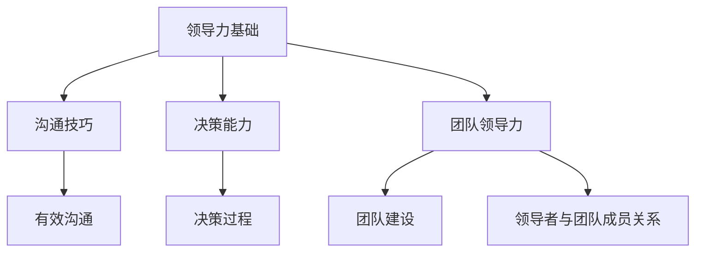

                 

# 管理者职业规划：设计个人领导力发展路径

## 概述

领导力是21世纪企业成功的关键因素，而管理者作为企业的核心支柱，其职业规划与领导力发展至关重要。本文旨在探讨管理者如何通过职业规划，设计出一条切实可行的个人领导力发展路径。我们将分六个部分逐步分析，首先从职业规划的重要性与目标入手，接着探讨自我评估与定位，然后详细阐述领导力发展路径，最后通过案例分析和未来趋势预测，为管理者提供实用的指导。

### 关键词
- 职业规划
- 领导力发展
- 自我评估
- 沟通技巧
- 决策能力
- 团队领导力

### 摘要
本文将围绕管理者职业规划与领导力发展展开，首先探讨职业规划的定义、意义和重要性，接着深入分析自我认知与评估，从而明确个人定位与目标。随后，文章将阐述领导力基础技能，包括沟通技巧、决策能力和团队领导力。通过实际案例和未来趋势分析，本文将为管理者提供具体的领导力发展路径和实践策略，旨在帮助其成为具备卓越领导力的优秀管理者。

## 目录大纲

### 第一部分：职业规划与领导力概述

- **第1章**：管理者职业规划的重要性与目标
  - **1.1 职业规划的定义与意义**
    - **1.1.1 职业规划的概念**
    - **1.1.2 职业规划的重要性**
    - **1.1.3 设定职业目标的重要性
  - **1.2 领导力发展概述**
    - **1.2.1 领导力的定义**
    - **1.2.2 领导力的要素**
    - **1.2.3 个人领导力发展的必要性**

### 第二部分：自我评估与定位

- **第2章**：自我认知与评估
  - **2.1 自我认知的重要性**
    - **2.1.1 自我认知的概念**
    - **2.1.2 自我认知的方法**
    - **2.1.3 自我认知的工具
  - **2.2 职业兴趣与价值观的评估**
    - **2.2.1 职业兴趣的评估**
    - **2.2.2 价值观的评估**
    - **2.2.3 职业兴趣与价值观的关系
  - **2.3 定位与目标设定**
    - **2.3.1 定位的策略**
    - **2.3.2 目标设定的SMART原则**
    - **2.3.3 个人发展路线图**

### 第三部分：领导力发展路径

- **第3章**：领导力基础技能
  - **3.1 沟通技巧**
    - **3.1.1 沟通的重要性**
    - **3.1.2 有效沟通的方法**
    - **3.1.3 沟通障碍与解决策略
  - **3.2 决策能力**
    - **3.2.1 决策的定义**
    - **3.2.2 决策过程**
    - **3.2.3 决策技巧
  - **3.3 团队领导力**
    - **3.3.1 团队领导力的要素**
    - **3.3.2 团队建设的策略**
    - **3.3.3 领导者与团队成员的关系**

### 第四部分：领导力提升与实践

- **第4章**：领导力提升策略
  - **4.1 学习与成长**
    - **4.1.1 持续学习的重要性**
    - **4.1.2 学习资源与方法**
    - **4.1.3 成长路径规划
  - **4.2 职业发展路径**
    - **4.2.1 职业发展的阶段**
    - **4.2.2 职业发展策略**
    - **4.2.3 职业发展评估与调整
  - **4.3 实践与反思**
    - **4.3.1 实践的重要性**
    - **4.3.2 反思与总结**
    - **4.3.3 实践中的问题与解决方案**

### 第五部分：领导力发展的案例分析

- **第5章**：成功领导力案例分析
  - **5.1 案例介绍**
    - **5.1.1 案例背景**
    - **5.1.2 案例分析**
    - **5.1.3 案例启示
  - **5.2 案例解读**
    - **5.2.1 领导力要素的应用**
    - **5.2.2 成功因素分析**
    - **5.2.3 案例的局限性**

### 第六部分：领导力发展的未来趋势

- **第6章**：领导力发展的未来趋势
  - **6.1 科技对领导力的影响**
    - **6.1.1 数字化转型的挑战**
    - **6.1.2 科技驱动的领导力发展**
    - **6.1.3 人工智能与领导力的结合
  - **6.2 全球化视野下的领导力**
    - **6.2.1 全球化对领导力的影响**
    - **6.2.2 跨文化沟通与领导**
    - **6.2.3 全球领导力的发展趋势
  - **6.3 领导力的发展方向**
    - **6.3.1 领导力的转型**
    - **6.3.2 领导力培养的创新方法**
    - **6.3.3 未来领导力的关键能力**

### 第七部分：结论与建议

- **第7章**：领导力发展的总结与建议
  - **7.1 领导力发展的总结**
    - **7.1.1 本书核心内容回顾**
    - **7.1.2 领导力发展的关键要素**
    - **7.1.3 个人领导力发展的路径
  - **7.2 领导力发展的建议**
    - **7.2.1 针对不同阶段的管理者**
    - **7.2.2 个人发展计划制定**
    - **7.2.3 领导力提升的策略与行动**

### 附录

- **附录A**：领导力评估工具与资源
  - **A.1 领导力评估工具介绍**
  - **A.2 领导力资源推荐**
  - **A.3 领导力发展社群与平台推荐**

---

**附录：领导力核心概念与联系**



---

**附录：领导力核心算法原理讲解**

```python
# 沟通技巧伪代码
def effective_communication(message, receiver):
    if receiver.is_open_to_communication():
        processed_message = format_message(message)
        response = receiver.receive_message(processed_message)
        return response
    else:
        return "Communication blocked."

# 决策能力伪代码
def make_decision(options, criteria):
    best_choice = None
    max_score = 0
    
    for option in options:
        score = calculate_score(option, criteria)
        if score > max_score:
            max_score = score
            best_choice = option
    
    return best_choice

# 团队领导力伪代码
def lead_team(team_members, goal):
    for member in team_members:
        assign_task(member, goal)
    monitor_progress(team_members)
    provide_support_if_needed(team_members)
```

---

**附录：数学模型与数学公式**

1. 沟通效果公式：$E = \frac{S \times R \times C}{D}$
   - $E$：沟通效果
   - $S$：发送者的清晰度
   - $R$：接收者的理解能力
   - $C$：渠道的有效性
   - $D$：噪音干扰程度

2. 决策收益公式：$R = p \times (o - c)$
   - $R$：决策收益
   - $p$：决策成功的概率
   - $o$：最佳选择的价值
   - $c$：成本或损失

---

**附录：项目实战**

### 实战案例：团队沟通改进计划

**开发环境搭建：**
- 使用 Microsoft Teams 或 Slack 进行沟通
- 使用 SurveyMonkey 进行员工满意度调查

**源代码实现：**
```python
# Python 代码示例：沟通效果评估

def assess_communication_effectiveness(employees):
    satisfaction_scores = []
    for employee in employees:
        message = "How do you feel about our current communication methods?"
        response = employee.survey_question(message)
        satisfaction_scores.append(response['satisfaction_score'])
    
    average_satisfaction = sum(satisfaction_scores) / len(satisfaction_scores)
    return average_satisfaction

# 假设员工对象有 survey_question 方法，用于发起调查并获取满意度评分
```

**代码解读与分析：**
- 本代码定义了一个函数 `assess_communication_effectiveness`，用于评估团队成员对当前沟通方式的满意度。
- 函数遍历所有员工，向每个员工发起满意度调查，收集满意度评分。
- 计算满意度评分的平均值，作为团队沟通效果的评估指标。
- 该代码可作为团队沟通改进计划的工具，帮助管理者识别沟通中的问题并提供改进建议。

---

**作者：AI天才研究院/AI Genius Institute & 禅与计算机程序设计艺术 /Zen And The Art of Computer Programming**

---

现在，我们已经完成了文章的概述和目录大纲。接下来，我们将逐步深入探讨每一个章节，提供详细的内容和深入的思考。让我们开始第一部分的探讨——管理者职业规划的重要性与目标。

### 第一部分：职业规划与领导力概述

## 第1章：管理者职业规划的重要性与目标

### 1.1 职业规划的定义与意义

职业规划，简单来说，就是对自己职业生涯的系统性思考和规划。它不仅关乎个人的职业成长和成就，更直接影响个人的生活质量和社会地位。对于管理者来说，职业规划更是至关重要，因为它关系到组织的整体发展和竞争力。

首先，我们需要明确职业规划的概念。职业规划是一个动态的过程，包括自我评估、目标设定、路径规划、行动实施和效果评估。通过职业规划，管理者能够清晰地了解自己的兴趣、优势和不足，从而设定符合自己价值观和职业目标的发展方向。

职业规划的重要性主要体现在以下几个方面：

1. **明确发展方向**：职业规划帮助管理者明确自己的职业目标，包括短期和长期的职业规划，使他们在职业生涯中更加有方向感和目标感。
   
2. **提升个人竞争力**：通过职业规划，管理者能够不断提升自己的技能和知识，从而在职场中保持竞争力，实现个人价值的最大化。

3. **优化职业路径**：职业规划帮助管理者在职业发展的过程中避免走弯路，减少不必要的试错成本，从而更快地实现职业目标。

4. **增强职业满意度**：明确的职业规划使管理者能够更好地理解自己的职业角色和职责，从而提高工作满意度和幸福感。

5. **促进组织发展**：管理者的职业规划与组织的发展息息相关。通过合理的职业规划，管理者能够更好地适应组织的发展需求，提升组织整体的执行力。

### 1.1.1 职业规划的概念

职业规划的概念可以从以下几个方面进行理解：

1. **自我认知**：自我认知是职业规划的基础。管理者需要深入了解自己的兴趣、价值观、能力和性格特点，从而找到最适合自己的职业方向。

2. **目标设定**：目标设定是职业规划的第二个关键步骤。管理者需要明确自己的短期和长期目标，并制定相应的行动计划。

3. **路径规划**：路径规划是指根据目标设定，设计出一条可行的职业发展路径。这条路径需要结合管理者的个人特点和市场需求，以确保其可行性和实用性。

4. **行动实施**：行动实施是将职业规划转化为实际行动的过程。管理者需要按照既定的路径和行动计划，逐步实施，不断调整和优化。

5. **效果评估**：效果评估是职业规划的重要组成部分。管理者需要定期评估职业规划的效果，以便及时调整和优化，确保规划的有效性。

### 1.1.2 职业规划的重要性

职业规划的重要性不容忽视，尤其是在当今快速变化的职场环境中。以下是职业规划重要性的几个方面：

1. **提高职业适应性**：随着科技的快速发展和市场环境的变化，职场对人才的需求也在不断变化。通过职业规划，管理者能够更好地适应这些变化，提高自己的职业适应性。

2. **明确职业发展路径**：职业规划帮助管理者明确自己的职业发展路径，避免盲目跟风或冲动跳槽，从而提高职业发展的稳定性和可持续性。

3. **提升个人自信心**：明确的职业规划和目标设定使管理者对自己的职业发展有更清晰的认识，从而提高自信心，减少职业焦虑。

4. **优化职业决策**：职业规划提供了系统性的思考和决策框架，帮助管理者在面对职业选择时做出更加明智的决策。

5. **提高工作效率**：通过职业规划，管理者能够更好地安排时间和资源，提高工作效率，减少无效劳动。

6. **实现个人价值**：职业规划使管理者能够充分发挥自己的潜力，实现个人价值的最大化。

### 1.1.3 设定职业目标的重要性

设定职业目标是职业规划的核心环节，它不仅关系到管理者的职业发展，还影响到个人的生活质量和社会地位。以下是设定职业目标的重要性的几个方面：

1. **明确发展方向**：设定职业目标使管理者能够明确自己的职业发展方向，避免迷茫和不确定性，从而更有动力地朝着目标前进。

2. **激发内在动力**：明确的职业目标能够激发管理者的内在动力，使他们更加专注和投入工作，提高工作效率和绩效。

3. **提供评估标准**：职业目标为管理者提供了一个评估标准，使他们能够定期评估自己的职业发展进度，及时调整和优化职业规划。

4. **提高职业满足感**：实现职业目标能够带来职业满足感，提升个人的幸福感和社会地位。

5. **促进个人成长**：职业目标设定了管理者的成长方向，促使他们在职业道路上不断学习和进步，提升个人能力和素质。

6. **增强职业竞争力**：通过实现职业目标，管理者能够不断提升自己的能力和竞争力，在职场中立于不败之地。

### 1.2 领导力发展概述

在职业规划中，领导力发展是一个不可或缺的组成部分。领导力不仅仅是管理者的个人素质，更是企业成功的关键因素。在本节中，我们将探讨领导力的定义、要素以及个人领导力发展的必要性。

#### 1.2.1 领导力的定义

领导力是一种能力，它涉及激发、引导和激励他人，以实现共同目标。领导力不仅仅是管理职位者的专属，每个人都有可能具备领导力。以下是领导力的几个关键要素：

1. **愿景与目标**：领导者需要具备清晰的愿景和目标，能够为团队和员工指引方向，凝聚共识。

2. **沟通与协作**：有效的沟通和协作能力是领导力的核心，领导者需要善于倾听、表达和协调，以确保团队的高效运作。

3. **决策与执行**：领导者需要具备良好的决策能力和执行能力，能够在复杂多变的环境中做出明智的决策，并推动决策的实施。

4. **激励与激励**：领导者需要能够激发团队成员的潜能，建立积极的工作氛围，促进团队的整体进步。

5. **变革与管理**：领导者需要具备变革思维和管理能力，能够适应环境变化，推动组织的持续发展和创新。

#### 1.2.2 领导力的要素

领导力是一个多维度的概念，包含多个关键要素。以下是领导力的一些主要要素：

1. **个人特质**：领导力与个人的特质密切相关。领导者通常具备自信、坚韧、乐观和责任感等特质。

2. **专业知识**：领导者需要具备扎实的专业知识，能够对行业和业务有深刻的理解，从而为团队提供专业指导。

3. **人际交往**：领导力涉及到与他人的互动。领导者需要具备良好的人际交往能力，能够建立良好的人际关系，有效沟通和协调。

4. **情绪管理**：领导者需要具备情绪管理能力，能够控制自己的情绪，保持冷静和理智，从而在面对压力和挑战时做出正确的决策。

5. **决策能力**：领导者需要具备良好的决策能力，能够在复杂多变的环境中做出明智的决策，并承担决策的结果。

#### 1.2.3 个人领导力发展的必要性

个人领导力发展对管理者的重要性不言而喻。以下是个人领导力发展的必要性：

1. **提升个人影响力**：通过领导力发展，管理者能够提升自己在团队和组织中的影响力，赢得更多信任和支持。

2. **促进职业发展**：领导力是职业发展中的一大关键因素。具备卓越领导力的管理者更容易获得职业晋升和更高的职位。

3. **提升团队绩效**：领导力发展使管理者能够更好地激励和引导团队，提升团队的整体绩效和执行力。

4. **推动组织变革**：领导力发展使管理者具备推动组织变革和创新的能力，从而提升组织的竞争力。

5. **提升个人幸福感**：领导力发展使管理者能够更好地理解自己和他人，建立积极的工作关系，提升个人的幸福感和工作满意度。

### 小结

在本章中，我们探讨了职业规划的重要性与目标，以及领导力的发展概述。职业规划是管理者职业生涯的基石，通过明确的职业目标和规划，管理者能够更好地规划自己的职业发展，提升个人竞争力。领导力是管理者不可或缺的素质，通过个人领导力的发展，管理者能够提升自己在团队和组织中的影响力，推动组织的变革和发展。在下一章中，我们将进一步探讨自我认知与评估，帮助管理者明确个人定位与目标。

### 第二部分：自我评估与定位

## 第2章：自我认知与评估

### 2.1 自我认知的重要性

自我认知是职业规划的基础，它涉及对自身兴趣、能力、性格和价值观的深入理解。自我认知的重要性在于，它为管理者提供了一个清晰的自我画像，使他们能够更好地了解自己的优势与不足，从而制定出符合自身特点的职业规划。

首先，自我认知有助于管理者明确自己的职业兴趣。职业兴趣是指一个人对某种职业活动产生的积极情感和偏好。了解自己的兴趣，管理者可以选择那些能够激发自己热情和动力的职业方向，从而更有动力和成效地投入工作。

其次，自我认知可以帮助管理者识别自己的能力。能力是指一个人完成特定任务所需的知识、技能和经验。通过了解自己的能力，管理者可以找到适合自己的职业岗位，并在这些岗位上发挥出最大的潜力。

此外，自我认知还包括对性格的了解。性格是指一个人相对稳定的行为模式和情绪反应。了解自己的性格，管理者可以更好地识别自己适合的工作环境和团队类型，从而提高工作效率和职业满意度。

最后，价值观是自我认知的重要组成部分。价值观是指一个人认为重要的道德原则和生活方式。了解自己的价值观，管理者可以选择那些与自己价值观相符合的职业和公司，从而实现个人与组织的和谐发展。

### 2.1.1 自我认知的概念

自我认知是指个人对自身兴趣、能力、性格和价值观的感知和了解。它是职业规划过程中不可或缺的一环，对于管理者的职业发展具有深远的影响。

1. **兴趣**：职业兴趣是指个人对某种职业活动产生的积极情感和偏好。了解自己的兴趣，管理者可以找到那些能够激发自己热情和动力的职业方向。

2. **能力**：能力是指个人完成特定任务所需的知识、技能和经验。通过了解自己的能力，管理者可以选择适合自己的职业岗位，并在这些岗位上发挥出最大的潜力。

3. **性格**：性格是指一个人相对稳定的行为模式和情绪反应。了解自己的性格，管理者可以更好地识别自己适合的工作环境和团队类型。

4. **价值观**：价值观是指一个人认为重要的道德原则和生活方式。了解自己的价值观，管理者可以选择那些与自己价值观相符合的职业和公司，实现个人与组织的和谐发展。

### 2.1.2 自我认知的方法

自我认知是一个动态的过程，需要管理者通过多种方法进行深入探索。以下是几种常见的自我认知方法：

1. **反思**：反思是自我认知的基础。管理者需要定期花时间思考自己的行为、感受和想法，从中发现自身的规律和特点。

2. **反馈**：他人的反馈是自我认知的重要来源。管理者可以寻求同事、上级和下属的反馈，了解自己在他人眼中的形象和表现。

3. **评估工具**：使用专业的自我评估工具，如职业兴趣量表、性格测试和价值观量表，可以帮助管理者更科学地了解自己的兴趣、性格和价值观。

4. **角色扮演**：通过角色扮演，管理者可以模拟不同的职业角色，体验不同的工作环境和情境，从而更好地了解自己适合的职业方向。

5. **实践**：实际的工作和实践活动是自我认知的重要途径。管理者可以通过参与不同的项目和任务，锻炼自己的能力和技能，同时了解自己的兴趣和性格。

### 2.1.3 自我认知的工具

为了更准确地了解自己的兴趣、能力和性格，管理者可以借助一些专业的自我评估工具。以下是一些常用的自我认知工具：

1. **职业兴趣量表**：如霍兰德职业兴趣量表（Holland Code），可以帮助管理者了解自己的职业兴趣类型，从而找到适合自己的职业方向。

2. **性格测试**：如迈尔斯-布里格斯性格类型指标（MBTI），可以帮助管理者了解自己的性格特点，识别适合自己的工作环境和团队类型。

3. **价值观量表**：如克拉克-斯托尔价值观量表（Clifton StrengthsFinder），可以帮助管理者了解自己的核心价值观，从而选择与自己价值观相符合的职业和公司。

4. **360度反馈**：通过360度反馈，管理者可以收集来自不同角度的反馈，全面了解自己的工作表现和人际关系。

5. **职业咨询**：职业咨询师可以根据管理者的具体情况，提供个性化的职业规划建议，帮助他们更准确地了解自己，制定适合自己的职业发展路径。

### 2.2 职业兴趣与价值观的评估

职业兴趣和价值观是职业规划中至关重要的两个方面。它们不仅决定了管理者对工作的热爱程度，还影响了管理者的职业选择和发展方向。

#### 2.2.1 职业兴趣的评估

职业兴趣是指个人对某种职业活动产生的积极情感和偏好。了解自己的职业兴趣，有助于管理者选择适合自己的职业方向，从而提高工作满意度和职业发展。

1. **评估方法**：
   - **自我反思**：管理者可以通过反思自己的日常行为和兴趣活动，了解自己喜欢做什么、擅长做什么。
   - **职业兴趣量表**：使用专业的职业兴趣量表，如霍兰德职业兴趣量表，可以帮助管理者更科学地了解自己的职业兴趣类型。

2. **评估步骤**：
   - **收集信息**：通过自我反思和职业兴趣量表，管理者可以收集到关于自己兴趣的信息。
   - **分析信息**：将收集到的信息进行分析，找出与管理者兴趣相符合的职业类型。
   - **验证结果**：通过实际的工作经验和反馈，验证评估结果的准确性。

#### 2.2.2 价值观的评估

价值观是指一个人认为重要的道德原则和生活方式。了解自己的价值观，有助于管理者选择与自己价值观相符合的职业和公司，从而实现个人与组织的和谐发展。

1. **评估方法**：
   - **自我反思**：管理者可以通过反思自己的行为和决策，了解自己的价值观。
   - **价值观量表**：使用专业的价值观量表，如克拉克-斯托尔价值观量表，可以帮助管理者更科学地了解自己的核心价值观。

2. **评估步骤**：
   - **收集信息**：通过自我反思和价值观量表，管理者可以收集到关于自己价值观的信息。
   - **分析信息**：将收集到的信息进行分析，找出自己的核心价值观。
   - **验证结果**：通过实际的工作经验和反馈，验证评估结果的准确性。

#### 2.2.3 职业兴趣与价值观的关系

职业兴趣和价值观之间存在密切的关系。职业兴趣决定了管理者对工作的热爱程度，而价值观则决定了管理者选择职业的方向和标准。

1. **协调职业兴趣与价值观**：
   - 管理者应选择那些既符合自己职业兴趣，又与自己价值观相符合的职业。
   - 在职业选择过程中，管理者应充分考虑自己的职业兴趣和价值观，避免因兴趣不符或价值观冲突而影响职业发展。

2. **平衡职业兴趣与价值观**：
   - 在某些情况下，管理者的职业兴趣可能与价值观存在冲突。这时，管理者需要平衡自己的职业兴趣和价值观，做出合理的职业选择。
   - 管理者可以通过调整职业方向或提升自己的价值观，找到既能满足职业兴趣，又能符合价值观的职业。

### 2.3 定位与目标设定

在自我认知和评估的基础上，管理者需要明确自己的职业定位，并设定具体的职业目标。这有助于管理者在职业发展中保持清晰的方向和目标感。

#### 2.3.1 定位的策略

1. **确定职业方向**：
   - 管理者应根据自我认知和评估结果，确定适合自己的职业方向。
   - 职业方向应结合管理者的职业兴趣、能力和价值观，确保具有实际操作性和可行性。

2. **明确职业角色**：
   - 管理者应明确自己在职场中的角色，包括岗位职责、工作内容和职业发展空间。
   - 职业角色应与职业方向相一致，确保职业定位的准确性。

3. **优化职业形象**：
   - 管理者应通过不断学习和提升，优化自己的职业形象，增强自己在职场中的竞争力。

#### 2.3.2 目标设定的SMART原则

为了确保职业目标的明确性和可实现性，管理者应遵循SMART原则设定职业目标。SMART原则是指目标应具有以下特征：

1. **具体（Specific）**：
   - 目标应明确具体，避免模糊和抽象的描述。
   - 例如，目标不应是“提高工作效率”，而应是“通过优化工作流程，将每日工作效率提高20%”。

2. **可衡量（Measurable）**：
   - 目标应具备可衡量性，确保能够通过具体的数据或指标进行评估。
   - 例如，目标不应是“提升团队绩效”，而应是“通过培训，使团队成员的绩效评分提高30%”。

3. **可实现（Achievable）**：
   - 目标应具有可实现性，避免设定过高或过低的目标。
   - 例如，目标不应是“在一个月内实现销售额翻倍”，而应是“在现有资源条件下，实现销售额增长10%”。

4. **相关性（Relevant）**：
   - 目标应与职业定位和价值观相一致，确保具有实际意义。
   - 例如，目标不应是“学习一门新语言”，而应是“学习一门与职业发展相关的语言，如Python”。

5. **时限性（Time-bound）**：
   - 目标应设定明确的时限，确保具有时效性。
   - 例如，目标不应是“在未来某天实现职业晋升”，而应是“在2024年1月之前晋升为项目经理”。

#### 2.3.3 个人发展路线图

在明确职业定位和目标后，管理者需要制定具体的个人发展路线图。个人发展路线图是指根据职业定位和目标，制定出一系列具体的行动步骤和时间表，确保职业目标的实现。

1. **制定行动步骤**：
   - 管理者应根据职业目标和定位，制定具体的行动步骤。
   - 行动步骤应包括学习、提升技能、参与项目、获取证书等。

2. **设定时间表**：
   - 管理者应根据行动步骤，设定明确的时间表。
   - 时间表应包括具体的执行时间和阶段性目标。

3. **持续调整**：
   - 管理者应根据实际情况，定期调整个人发展路线图。
   - 在执行过程中，如遇到困难或挑战，应及时调整策略，确保职业目标的实现。

### 小结

在本章中，我们探讨了自我认知与评估的重要性，以及职业兴趣与价值观的评估方法。通过自我认知，管理者能够更清晰地了解自己的兴趣、能力和价值观，从而制定出符合自身特点的职业规划。职业兴趣和价值观的评估有助于管理者选择适合自己的职业方向和公司，实现个人与组织的和谐发展。在下一章中，我们将进一步探讨领导力发展路径，帮助管理者提升个人领导力，为职业发展奠定坚实基础。

### 第三部分：领导力发展路径

## 第3章：领导力基础技能

领导力是管理者职业生涯中的关键能力，它不仅关乎个人的职业发展，更直接影响团队和组织的绩效。在领导力的发展过程中，沟通技巧、决策能力和团队领导力是三大核心技能。这些基础技能不仅能够帮助管理者更好地执行管理职责，还能提升团队的整体协作效率和创新能力。

### 3.1 沟通技巧

沟通技巧是领导力的核心组成部分，它涉及到管理者与团队成员、上级领导以及外部合作伙伴之间的有效互动。有效的沟通能够促进信息的准确传递，减少误解和冲突，增强团队凝聚力。

#### 3.1.1 沟通的重要性

1. **信息传递**：沟通是信息传递的重要手段。在组织内部，管理者需要将公司的战略目标、工作要求等信息准确传达给团队成员。
   
2. **团队协作**：有效的沟通能够促进团队成员之间的协作，提高工作效率和绩效。

3. **领导形象**：沟通能力是管理者领导形象的体现。一个擅长沟通的管理者能够赢得下属的尊重和信任，提升领导力。

4. **决策支持**：良好的沟通有助于管理者收集到更多的信息，为决策提供支持。

#### 3.1.2 有效沟通的方法

1. **倾听**：倾听是有效沟通的关键。管理者应耐心倾听团队成员的意见和需求，了解他们的实际状况。

2. **清晰表达**：在表达观点时，管理者应确保语言清晰、简洁，避免使用专业术语或模糊的表述。

3. **积极反馈**：管理者应给予团队成员及时的反馈，肯定他们的努力和成果，同时指出改进的方向。

4. **使用多种沟通渠道**：根据不同情境和需求，管理者应灵活使用会议、邮件、即时通讯等多种沟通渠道。

#### 3.1.3 沟通障碍与解决策略

1. **文化差异**：跨文化沟通中的语言、行为和价值观差异可能导致误解和冲突。解决策略包括学习文化差异，采用适应性的沟通方式。

2. **情绪影响**：情绪波动可能影响沟通效果。管理者应学会控制情绪，保持冷静和理智，以确保沟通的客观性和有效性。

3. **信息过载**：信息过多可能导致沟通效率降低。管理者应筛选关键信息，确保信息的针对性和有效性。

4. **解决策略**：
   - **简化信息**：将复杂的信息简化为易于理解的形式。
   - **增强互动**：通过互动和反馈，确保信息的准确传递。
   - **提供上下文**：在沟通时提供足够的上下文信息，帮助团队成员更好地理解信息。

### 3.2 决策能力

决策能力是管理者在复杂多变的环境中做出有效决策的能力。决策能力不仅影响管理者的职业发展，更直接影响团队和组织的成功。

#### 3.2.1 决策的定义

决策是指从多个可行方案中选择最佳方案的过程。决策通常涉及目标设定、信息收集、方案评估和选择执行。

#### 3.2.2 决策过程

1. **问题识别**：管理者需要识别和定义问题，明确决策的目标和范围。

2. **信息收集**：收集与问题相关的信息，包括内部数据和外部数据，确保信息的全面性和准确性。

3. **方案评估**：根据目标和信息，制定多个可行方案，并评估这些方案的成本、收益和风险。

4. **选择执行**：从可行方案中选择最佳方案，并制定详细的执行计划。

#### 3.2.3 决策技巧

1. **系统思考**：管理者应具备系统思考的能力，从整体和长期的角度看待问题，避免片面和短视的决策。

2. **逻辑分析**：在决策过程中，管理者应运用逻辑分析的方法，确保决策的合理性和科学性。

3. **风险评估**：管理者应学会进行风险评估，评估每个方案的潜在风险，并制定相应的应对措施。

4. **合作决策**：在重大决策中，管理者应与团队成员合作，听取不同意见，综合多方观点，提高决策的准确性和可行性。

### 3.3 团队领导力

团队领导力是指管理者在团队管理中激发、引导和激励团队成员的能力。团队领导力不仅关乎团队绩效，更影响团队氛围和文化。

#### 3.3.1 团队领导力的要素

1. **愿景与目标**：管理者应具备清晰的愿景和目标，为团队指引方向，激发团队成员的积极性。

2. **信任与尊重**：管理者应建立信任和尊重的团队文化，促进团队成员之间的协作和沟通。

3. **激励与奖励**：管理者应通过激励和奖励机制，激发团队成员的潜力，提升团队绩效。

4. **领导风格**：管理者应选择适合团队风格的领导方式，平衡权威和民主，确保团队的有效运作。

#### 3.3.2 团队建设的策略

1. **明确角色与责任**：管理者应明确团队成员的角色和责任，确保每个人都清楚自己的职责和工作内容。

2. **建立沟通渠道**：管理者应建立有效的沟通渠道，促进团队成员之间的信息交流和协作。

3. **培养团队精神**：管理者应通过团队合作项目和团队活动，培养团队成员的团队精神，增强团队凝聚力。

4. **提供反馈与支持**：管理者应给予团队成员及时的反馈和支持，帮助他们成长和提升。

#### 3.3.3 领导者与团队成员的关系

1. **相互尊重**：管理者应尊重团队成员的意见和贡献，建立平等和谐的团队氛围。

2. **建立信任**：管理者应通过透明和开放的沟通，建立与团队成员之间的信任关系。

3. **共同成长**：管理者应与团队成员共同成长，共同面对挑战，分享成功和失败的经验。

4. **鼓励反馈**：管理者应鼓励团队成员提供反馈，从不同角度和层面了解团队运作，不断优化和改进。

### 小结

在本章中，我们探讨了领导力的基础技能，包括沟通技巧、决策能力和团队领导力。沟通技巧是信息传递和团队协作的关键，决策能力是管理者在复杂环境中做出有效决策的核心，团队领导力则是激发和引导团队成员的能力。这些基础技能不仅有助于提升管理者的个人领导力，还能促进团队和组织的整体发展。在下一章中，我们将进一步探讨领导力提升策略，帮助管理者在实践中不断提升自己的领导力。

### 第四部分：领导力提升策略

## 第4章：领导力提升策略

在当今快速变化的商业环境中，提升领导力不仅是管理者个人的职业需求，更是团队和组织发展的关键因素。领导力提升不仅仅是技能的培养，更是思维模式的转变。在本章中，我们将探讨学习与成长、职业发展路径以及实践与反思的重要性，为管理者提供具体的提升策略。

### 4.1 学习与成长

持续学习和个人成长是领导力提升的基石。在不断变化的市场和技术环境中，只有不断学习和适应，管理者才能保持竞争力并引领团队。

#### 4.1.1 持续学习的重要性

1. **适应变化**：市场和技术环境的变化速度越来越快，持续学习能够帮助管理者适应这些变化，保持领先地位。

2. **提升能力**：通过学习，管理者能够不断提升自己的知识和技能，提高工作效率和决策质量。

3. **增强信心**：不断学习能够增强管理者的自信心，使他们更有信心面对挑战和不确定性。

4. **促进创新**：学习能够激发管理者的创新思维，推动团队和组织不断进步。

#### 4.1.2 学习资源与方法

1. **书籍**：经典的管理学书籍如《管理的实践》、《领导力的五项修炼》等，能够为管理者提供深厚的理论基础。

2. **在线课程**：通过在线平台如Coursera、Udemy等，管理者可以学习到最新的管理知识和技能。

3. **研讨会与培训**：参加行业研讨会和培训课程，能够帮助管理者了解行业动态和前沿技术。

4. **实践**：通过实际工作项目和团队管理经验，管理者能够将所学知识应用到实践中，不断积累和提升。

5. **导师指导**：寻找一位经验丰富的导师，能够为管理者提供个性化的指导和建议，加速成长。

#### 4.1.3 成长路径规划

1. **设定学习目标**：管理者应明确自己的学习目标，包括短期和长期目标，确保学习有明确的方向。

2. **制定学习计划**：根据学习目标，制定详细的学习计划，包括学习内容、学习时间和学习方式。

3. **定期评估**：定期评估学习效果，根据评估结果调整学习计划，确保学习目标的实现。

4. **分享经验**：通过分享学习经验和心得，管理者能够巩固所学知识，同时帮助他人成长。

### 4.2 职业发展路径

职业发展路径是管理者领导力提升的重要途径。合理的职业发展路径能够帮助管理者明确职业目标，提升个人能力和竞争力。

#### 4.2.1 职业发展的阶段

1. **初级阶段**：在这个阶段，管理者应专注于提升基础管理技能，包括沟通技巧、团队领导和基础决策能力。

2. **中级阶段**：在中级阶段，管理者应拓展自己的专业领域，提升专业知识和技能，如项目管理、市场营销等。

3. **高级阶段**：在高级阶段，管理者应提升战略管理能力和领导力，如全球领导力、企业战略规划等。

#### 4.2.2 职业发展策略

1. **明确职业目标**：管理者应根据自己的兴趣、能力和市场需求，明确自己的职业目标，确保职业发展路径的清晰性。

2. **提升专业技能**：通过学习和实践，不断提升自己的专业技能，为职业发展奠定坚实基础。

3. **拓展人际网络**：通过建立和维护人际网络，管理者能够获取更多的职业机会和信息，促进职业发展。

4. **寻求反馈与指导**：定期寻求同事、上级和下属的反馈，根据反馈调整职业发展策略，寻求专业指导。

5. **抓住机遇**：积极抓住职业发展的机遇，如项目机会、跨部门合作等，不断提升自己的职业能力。

#### 4.2.3 职业发展评估与调整

1. **定期评估**：管理者应定期评估自己的职业发展进度，评估内容包括专业技能、领导力、团队管理能力等。

2. **调整发展策略**：根据评估结果，调整职业发展策略，确保职业发展路径的可持续性和有效性。

3. **持续优化**：通过不断学习和实践，持续优化职业发展路径，确保职业目标能够实现。

### 4.3 实践与反思

实践是检验领导力提升效果的重要手段。通过实践，管理者能够将所学知识和技能应用到实际工作中，不断提升自己的领导能力。

#### 4.3.1 实践的重要性

1. **知识应用**：实践是知识转化为能力的关键环节。通过实践，管理者能够将所学知识应用到实际工作中，提升工作绩效。

2. **经验积累**：实践是积累经验和技能的重要途径。通过不断实践，管理者能够积累丰富的管理经验，提升领导能力。

3. **问题解决**：实践是解决实际问题的有效方式。通过实践，管理者能够发现和解决问题，提高解决问题的能力。

#### 4.3.2 反思与总结

1. **反思**：反思是实践的重要环节。管理者应定期反思自己的工作表现，分析成功和失败的原因，总结经验和教训。

2. **总结**：总结是实践的重要成果。管理者应将实践中的成功经验和教训进行总结，形成可复制的经验和模板。

3. **改进**：根据反思和总结，管理者应不断改进自己的工作方法和领导风格，提升自己的领导能力。

#### 4.3.3 实践中的问题与解决方案

1. **问题识别**：管理者应学会识别和定义工作中的问题，确保问题能够得到及时解决。

2. **问题分析**：对问题进行深入分析，找出问题的根本原因。

3. **解决方案**：根据问题分析的结果，制定相应的解决方案，并实施和跟踪解决方案的效果。

4. **持续优化**：根据解决方案的实施效果，不断优化和改进，确保问题得到彻底解决。

### 小结

在本章中，我们探讨了领导力提升的策略，包括学习与成长、职业发展路径以及实践与反思。持续学习和个人成长是提升领导力的基石，职业发展路径为管理者提供了明确的职业目标和发展方向，实践与反思则是检验和提升领导力的关键。通过这些策略，管理者能够不断提升自己的领导力，为团队和组织的发展做出更大贡献。在下一章中，我们将通过成功领导力案例分析，深入探讨领导力在实际中的应用和成效。

### 第五部分：领导力发展的案例分析

## 第5章：成功领导力案例分析

通过分析成功领导力的案例，我们可以深入了解领导力在实际工作中的应用，理解其成功的关键要素，并从中获得启示。以下是一个成功的领导力案例分析和解读。

### 5.1 案例介绍

#### 5.1.1 案例背景

这个案例发生在一家快速成长的科技公司，该公司成立于2010年，专注于开发先进的移动应用。在公司成立初期，市场环境竞争激烈，技术更新迭代迅速。公司的创始人和CEO，李明（化名），凭借其卓越的领导力，带领团队在短短几年内实现了从初创到上市的目标。

#### 5.1.2 案例分析

李明的领导风格和策略是这家公司成功的关键因素。以下是几个关键方面：

1. **愿景与目标**：李明从一开始就为团队设定了清晰的愿景和目标，即成为全球领先的移动应用开发商。这一愿景激励了整个团队，使得每个人都为共同的目标而努力。

2. **团队建设**：李明非常重视团队建设，他通过一系列团队活动和培训，增强了团队成员之间的信任和协作。他还鼓励团队成员提出创新想法，并在决策过程中充分考虑这些想法。

3. **决策能力**：在快速变化的市场环境中，李明展现出了卓越的决策能力。他能够快速分析市场趋势和竞争对手的动态，做出明智的决策，从而保持公司的市场竞争力。

4. **沟通技巧**：李明擅长与团队成员、客户和投资者进行有效沟通。他能够清晰、简洁地传达公司的愿景和目标，同时也重视听取团队成员的意见和建议，形成了开放、透明的沟通氛围。

5. **激励与奖励**：李明通过激励和奖励机制，激发了团队成员的工作热情和创新能力。他设立了明确的绩效目标和奖励方案，对表现优秀的团队成员给予奖励，从而提高了团队的士气和绩效。

#### 5.1.3 案例启示

李明的成功领导力案例提供了以下几个重要启示：

1. **清晰愿景和目标**：领导者需要具备清晰的愿景和目标，这能够为团队提供方向和动力。

2. **团队建设**：团队建设是领导力的关键要素，领导者应通过多种方式增强团队成员之间的信任和协作。

3. **决策能力**：领导者需要具备良好的决策能力，能够在复杂多变的环境中快速做出明智的决策。

4. **沟通技巧**：有效的沟通能够促进团队协作和决策，领导者应注重与团队成员、客户和投资者的沟通。

5. **激励与奖励**：领导者应通过激励和奖励机制激发团队成员的潜力，提高团队的绩效和创新能力。

### 5.2 案例解读

#### 5.2.1 领导力要素的应用

在李明的领导风格中，我们可以看到几个关键领导力要素的应用：

1. **愿景领导力**：李明通过明确的愿景和目标，激励团队成员朝着共同的目标努力。这种愿景领导力使得团队成员在面临困难和挑战时依然保持积极和专注。

2. **团队领导力**：李明注重团队建设，通过培训、团队活动和团队文化塑造，增强了团队成员之间的信任和协作。这种团队领导力使得团队能够在面对复杂任务时高效运作。

3. **变革领导力**：李明在决策过程中展现了变革领导力，他能够快速适应市场变化，并做出相应的调整。这种变革领导力帮助公司在竞争激烈的市场中保持竞争力。

4. **激励领导力**：李明通过激励和奖励机制，激发了团队成员的潜力。这种激励领导力使得团队能够保持高度的工作热情和创新精神。

#### 5.2.2 成功因素分析

李明的成功可以从以下几个方面进行分析：

1. **个人特质**：李明具备坚定的信念和清晰的愿景，这使得他能够在面临挑战时保持冷静和坚定。

2. **领导风格**：李明采用了民主和参与式的领导风格，这使得团队成员能够积极参与决策，增强了团队凝聚力。

3. **组织文化**：公司内部建立了开放、透明和尊重的文化，这使得团队成员能够自由地表达意见和建议，提高了团队的创新能力和效率。

4. **资源配置**：公司提供了充足的资源和支持，使得团队成员能够专注于工作，减少资源限制对工作效率的影响。

#### 5.2.3 案例的局限性

尽管李明的领导力带来了巨大的成功，但也存在一些局限性：

1. **过度依赖个人**：李明在公司的成功中扮演了核心角色，这可能导致公司在未来过度依赖个人领导力，缺乏持续的创新和成长动力。

2. **忽略外部因素**：在快速变化的市场环境中，李明可能过于关注内部管理和团队建设，而忽视了外部环境的动态变化，这可能对公司的长期发展产生不利影响。

3. **缺乏多样性**：公司内部可能缺乏多样性和包容性，这可能导致公司在面对不同文化和市场时缺乏适应能力。

### 小结

通过分析李明的领导力案例，我们看到了愿景领导力、团队领导力、变革领导力和激励领导力在实际中的应用。这些成功因素为管理者提供了宝贵的启示，同时也提醒我们在领导力实践中需要持续学习和改进。在下一章中，我们将探讨领导力发展的未来趋势，分析科技和全球化对领导力的影响，以及未来领导力的发展方向。

### 第六部分：领导力发展的未来趋势

## 第6章：领导力发展的未来趋势

随着科技的快速发展和全球化的深入，领导力也在不断地演变和进步。未来，领导力将面临新的挑战和机遇，这些变化将深刻影响管理者的职业发展和组织的管理模式。

### 6.1 科技对领导力的影响

科技的发展正在改变商业环境和领导方式，管理者需要适应这些变化，以保持竞争力。

#### 6.1.1 数字化转型的挑战

数字化转型已经成为企业发展的必经之路。管理者需要具备数字化思维，理解数字化工具和技术如何改变业务流程和运营模式。

1. **数据分析**：通过数据分析，管理者可以更准确地了解市场趋势、客户需求和业务绩效，从而做出更明智的决策。
   
2. **人工智能与自动化**：人工智能和自动化技术将改变传统的管理方式，管理者需要适应这些新技术，学会利用它们来提升效率和决策质量。

3. **远程办公**：随着远程办公的普及，管理者需要掌握如何有效管理远程团队，保持团队凝聚力和工作效率。

#### 6.1.2 科技驱动的领导力发展

1. **敏捷管理**：敏捷管理是一种以客户需求为导向的管理模式，管理者需要具备敏捷思维，能够快速响应市场变化。

2. **创新文化**：管理者应鼓励创新，建立支持创新的企业文化，激发员工的创造力和主动性。

3. **技术领导力**：管理者需要具备技术背景，能够理解和指导技术团队，确保技术发展方向与业务目标相一致。

#### 6.1.3 人工智能与领导力的结合

人工智能将深刻影响领导力的实践和培养。

1. **个性化和定制化**：人工智能可以帮助管理者了解员工的个性特点和工作需求，提供个性化的培养和发展方案。

2. **自动化培训**：通过人工智能，管理者可以开发自动化培训系统，提高员工的学习效率和效果。

3. **预测和决策**：人工智能可以帮助管理者进行数据分析和趋势预测，为决策提供更全面和准确的支持。

### 6.2 全球化视野下的领导力

全球化带来了前所未有的机遇和挑战，管理者需要具备全球视野，以应对跨国界的合作和管理。

#### 6.2.1 全球化对领导力的影响

1. **跨文化沟通**：全球化使得管理者需要与来自不同文化背景的团队成员和合作伙伴进行沟通。管理者需要学会跨文化沟通的技巧，减少文化冲突。

2. **多元化团队管理**：多元化团队具有不同的思维方式和观点，管理者需要掌握如何管理多元化团队，激发团队的创造力。

3. **全球化战略**：管理者需要具备全球化战略思维，能够制定和实施跨国业务战略。

#### 6.2.2 跨文化沟通与领导

1. **文化敏感性**：管理者需要了解不同文化的价值观和行为规范，增强文化敏感性。

2. **开放心态**：管理者应保持开放心态，接受不同文化的差异，尊重多样性。

3. **适应性领导**：管理者需要根据不同文化背景和团队特点，灵活调整领导风格和管理方法。

#### 6.2.3 全球领导力的发展趋势

1. **全球协作**：随着远程办公和全球化合作的普及，全球协作将成为未来领导力的重要组成部分。

2. **国际化视野**：管理者需要具备国际化视野，了解全球市场动态和趋势，为企业的国际化发展提供战略支持。

3. **全球领导力培养**：企业应建立全球领导力培养计划，帮助管理者提升跨文化沟通和全球化战略能力。

### 6.3 领导力的发展方向

未来，领导力将朝着更加个性化和定制化的方向发展。

#### 6.3.1 领导力的转型

1. **个性化领导**：领导力将更加注重个性化，管理者需要根据员工的个性特点和需求，提供个性化的培养和发展方案。

2. **智慧领导**：随着人工智能和大数据技术的发展，智慧领导将成为一种新的领导方式，管理者需要学会利用科技工具进行数据分析和决策。

#### 6.3.2 领导力培养的创新方法

1. **沉浸式学习**：通过沉浸式学习，管理者可以深入了解不同文化和行业，提升跨文化沟通和全球视野。

2. **虚拟现实（VR）**：通过虚拟现实技术，管理者可以进行模拟训练，提高应对复杂情境的能力。

3. **在线学习平台**：在线学习平台提供了丰富的学习资源和灵活的学习方式，管理者可以利用这些平台进行自我学习和提升。

#### 6.3.3 未来领导力的关键能力

1. **创新能力**：未来领导力需要具备强大的创新能力，能够推动组织进行持续创新和变革。

2. **跨文化沟通能力**：随着全球化的深入，跨文化沟通能力将成为领导力的核心能力。

3. **数据驱动决策能力**：管理者需要具备数据驱动决策能力，能够利用数据分析和预测工具进行决策。

### 小结

未来，科技的发展和全球化的深入将深刻影响领导力的发展。管理者需要具备数字化思维、全球化视野和创新能力，以应对未来领导力发展的挑战。通过不断学习和实践，管理者将能够提升自己的领导力，为团队和组织的发展做出更大的贡献。

### 第七部分：结论与建议

## 第7章：领导力发展的总结与建议

在本章中，我们将对领导力发展的核心内容进行总结，并提出具体的发展建议，帮助管理者在不同职业阶段提升领导力。

### 7.1 领导力发展的总结

通过前六章的深入探讨，我们可以得出以下关于领导力发展的关键结论：

1. **职业规划的重要性**：职业规划是领导力发展的基础，它帮助管理者明确职业目标，优化职业路径，提升个人竞争力。

2. **自我认知与评估**：自我认知是了解个人兴趣、能力和价值观的重要过程，通过评估，管理者可以找到最适合自己的职业方向。

3. **领导力基础技能**：沟通技巧、决策能力和团队领导力是领导力的核心组成部分，管理者需要不断学习和提升这些技能。

4. **领导力提升策略**：通过学习与成长、职业发展路径规划和实践与反思，管理者能够系统地提升自己的领导力。

5. **成功案例分析**：成功领导力案例提供了宝贵的经验和启示，帮助管理者理解领导力在实际中的应用和成效。

6. **未来趋势**：科技的发展和全球化的深入对领导力提出了新的要求，管理者需要具备数字化思维、全球化视野和创新能力。

### 7.1.1 本书核心内容回顾

- **职业规划**：明确职业目标，设定SMART目标，制定个人发展路线图。
- **自我认知**：了解自己的兴趣、能力和价值观，使用评估工具进行自我认知。
- **领导力基础技能**：掌握沟通技巧、决策能力和团队领导力。
- **领导力提升策略**：持续学习与成长，制定职业发展路径，通过实践与反思提升领导力。
- **成功案例分析**：通过成功案例，理解领导力在实际中的应用和成效。
- **未来趋势**：适应科技和全球化的变化，提升数字化思维、全球化视野和创新能力。

### 7.1.2 领导力发展的关键要素

领导力发展的关键要素包括：

1. **自我认知**：通过自我评估，了解自己的优势和不足，明确职业方向。
2. **学习与成长**：不断学习新知识、新技能，提升自己的综合素质。
3. **沟通技巧**：有效沟通是领导力的核心，管理者需要提高沟通技巧，确保信息的准确传递。
4. **决策能力**：在复杂多变的环境中，管理者需要具备良好的决策能力，做出明智的决策。
5. **团队领导力**：建立高效的团队，激发团队成员的潜力，提升团队绩效。
6. **全球化视野**：了解全球市场和文化，具备跨文化沟通能力，适应全球化的挑战。
7. **创新能力**：在快速变化的商业环境中，管理者需要具备创新能力，推动组织进行持续创新。

### 7.1.3 个人领导力发展的路径

个人领导力发展的路径可以分为以下几个阶段：

1. **基础阶段**：通过学习和实践，掌握基本的领导力知识和技能，如沟通技巧、团队建设和基本决策能力。
2. **中级阶段**：提升专业能力和领导技巧，如战略规划、变革管理和跨文化沟通。
3. **高级阶段**：培养战略思维、全球化视野和创新能力，成为具有影响力的领导者。
4. **持续发展**：通过持续学习和反思，不断提升领导力，适应不断变化的市场环境。

### 7.2 领导力发展的建议

根据以上总结，我们为不同职业阶段的管理者提供以下具体发展建议：

#### 针对初级管理者

1. **明确职业目标**：设定明确的职业目标，制定短期和长期计划，确保职业发展的方向性。
2. **提升基础技能**：通过学习课程和实际工作，提升沟通技巧、团队领导和基本决策能力。
3. **积极实践**：参与实际项目和团队管理，通过实践不断提升领导力。
4. **寻求反馈**：定期寻求同事、上级和下属的反馈，了解自己的优点和不足，进行有针对性的改进。

#### 针对中级管理者

1. **拓展专业领域**：在掌握基本领导力技能的基础上，进一步拓展专业领域，提升专业能力和影响力。
2. **学习高级管理知识**：参加高级管理课程和研讨会，学习战略规划、变革管理和全球化领导力。
3. **建立人际网络**：积极参加行业活动和社交活动，建立广泛的人际网络，获取更多的职业机会和信息。
4. **培养团队文化**：注重团队建设，建立积极向上的团队文化，提升团队凝聚力和绩效。

#### 针对高级管理者

1. **提升战略思维**：培养战略思维，关注企业长远发展和市场趋势，制定和实施战略计划。
2. **培养创新文化**：鼓励创新思维，建立支持创新的企业文化，推动组织进行持续创新。
3. **全球化领导力**：了解全球市场和文化，提升跨文化沟通和全球领导力能力。
4. **领导力传承**：通过导师制度和接班人计划，培养未来的领导者，确保组织的持续发展。

### 小结

领导力发展是一个持续的过程，需要管理者在不同职业阶段不断学习和提升。通过明确职业目标、提升基础技能、拓展专业领域和培养创新文化，管理者能够不断提升自己的领导力，为团队和组织的发展做出更大的贡献。

### 附录A：领导力评估工具与资源

在领导力发展的过程中，评估工具和资源是不可或缺的一部分。以下是一些常用的领导力评估工具和推荐资源，帮助管理者进行自我评估和持续提升。

#### A.1 领导力评估工具介绍

1. **霍兰德职业兴趣量表（Holland Code）**：用于评估个人的职业兴趣类型，帮助管理者找到适合自己的职业方向。
2. **迈尔斯-布里格斯性格类型指标（MBTI）**：通过分析个人的性格类型，帮助管理者了解自己的行为模式和沟通风格。
3. **克拉克-斯托尔价值观量表（Clifton StrengthsFinder）**：用于评估个人的核心价值观和优势，帮助管理者发挥自身潜力。
4. **领导力360度反馈工具**：通过收集来自上级、同事和下属的反馈，全面了解管理者的领导力表现。

#### A.2 领导力资源推荐

1. **《领导力的五项修炼》（The Five Dysfunctions of a Team）**：由Patrick Lencioni所著，讨论团队协作中的五大障碍及解决方法。
2. **《智慧领导》（Smart Leaders Don't Do Dumb Things）**：由David B. Babel所著，介绍如何通过智慧决策提升领导力。
3. **《领导者的语言》（The Language of Leaders）**：由Joseph A. California 和 Joelle N. Godden所著，讨论有效沟通在领导力中的重要性。
4. **《变革之舞》（The Dance of Change）**：由Warren Bennis和Burt Nanus所著，探讨领导者在变革中的角色和策略。

#### A.3 领导力发展社群与平台推荐

1. **领导力论坛（Leadership Forum）**：在线平台，提供领导力相关的讨论、资源和互动。
2. **领英（LinkedIn）**：职业社交平台，可以加入领导力相关的群组，获取最新的行业动态和职业机会。
3. **TED Talks**：通过TED演讲，可以学习到全球顶尖领导者的见解和经验。
4. **Coursera、Udemy**：在线课程平台，提供丰富的领导力课程，涵盖基础技能到高级领导力策略。

通过使用这些评估工具和资源，管理者能够更好地了解自己的领导力现状，明确提升方向，并在实践中不断提升自己的领导力，为团队和组织的发展做出更大贡献。

### 附录：领导力核心概念与联系


### 附录：领导力核心算法原理讲解

```python
# 沟通技巧伪代码
def effective_communication(message, receiver):
    if receiver.is_open_to_communication():
        processed_message = format_message(message)
        response = receiver.receive_message(processed_message)
        return response
    else:
        return "Communication blocked."

# 决策能力伪代码
def make_decision(options, criteria):
    best_choice = None
    max_score = 0
    
    for option in options:
        score = calculate_score(option, criteria)
        if score > max_score:
            max_score = score
            best_choice = option
    
    return best_choice

# 团队领导力伪代码
def lead_team(team_members, goal):
    for member in team_members:
        assign_task(member, goal)
    monitor_progress(team_members)
    provide_support_if_needed(team_members)
```

### 附录：数学模型与数学公式

1. **沟通效果公式**：\(E = \frac{S \times R \times C}{D}\)
   - \(E\)：沟通效果
   - \(S\)：发送者的清晰度
   - \(R\)：接收者的理解能力
   - \(C\)：渠道的有效性
   - \(D\)：噪音干扰程度

2. **决策收益公式**：\(R = p \times (o - c)\)
   - \(R\)：决策收益
   - \(p\)：决策成功的概率
   - \(o\)：最佳选择的价值
   - \(c\)：成本或损失

### 附录：项目实战

### 实战案例：团队沟通改进计划

**开发环境搭建：**
- 使用 Microsoft Teams 或 Slack 进行沟通
- 使用 SurveyMonkey 进行员工满意度调查

**源代码实现：**

```python
# Python 代码示例：沟通效果评估

def assess_communication_effectiveness(employees):
    satisfaction_scores = []
    for employee in employees:
        message = "How do you feel about our current communication methods?"
        response = employee.survey_question(message)
        satisfaction_scores.append(response['satisfaction_score'])
    
    average_satisfaction = sum(satisfaction_scores) / len(satisfaction_scores)
    return average_satisfaction

# 假设员工对象有 survey_question 方法，用于发起调查并获取满意度评分
```

**代码解读与分析：**
- 本代码定义了一个函数 `assess_communication_effectiveness`，用于评估团队成员对当前沟通方式的满意度。
- 函数遍历所有员工，向每个员工发起满意度调查，收集满意度评分。
- 计算满意度评分的平均值，作为团队沟通效果的评估指标。
- 该代码可作为团队沟通改进计划的工具，帮助管理者识别沟通中的问题并提供改进建议。

### 总结

通过本文的详细探讨，我们从职业规划的重要性与目标、自我认知与评估、领导力基础技能、领导力提升策略、成功领导力案例分析到领导力发展的未来趋势，全面梳理了管理者职业规划与领导力发展的关键要素和路径。在附录中，我们提供了领导力核心概念与联系、核心算法原理讲解、数学模型与公式以及项目实战案例，旨在帮助管理者在实践中应用和提升领导力。

本文的核心观点可以总结如下：

- 职业规划是领导力发展的基石，明确的目标和规划能够帮助管理者在职业道路上保持清晰的方向。
- 自我认知与评估是了解个人优势和不足的关键，通过科学的评估工具和方法，管理者能够更准确地定位自己的职业方向。
- 领导力基础技能，如沟通技巧、决策能力和团队领导力，是管理者必须具备的核心能力，它们直接影响团队和组织的绩效。
- 持续学习和实践是提升领导力的关键，通过不断学习和反思，管理者能够不断优化自己的领导风格和管理方法。
- 成功的领导力案例分析提供了宝贵的经验，管理者可以从成功案例中吸取教训，理解领导力在实际工作中的应用。
- 未来，科技和全球化的深入将带来新的挑战和机遇，管理者需要具备数字化思维、全球化视野和创新能力，以适应未来领导力的发展趋势。

最后，我们呼吁管理者们：

- 重视职业规划，明确个人目标和职业路径。
- 勇于自我认知和评估，不断提升自己的能力和素质。
- 练习和提升领导力基础技能，成为具有影响力的领导者。
- 持续学习和反思，在实践中不断提升自己的领导能力。
- 开放心态，积极适应未来领导力发展的趋势，为团队和组织的发展做出更大贡献。

通过本文的深入探讨，我们希望为管理者们提供实用的指导，帮助他们在职业规划和领导力发展方面取得更大的成功。让我们共同努力，成为卓越的领导者，推动组织和社会的持续进步。

